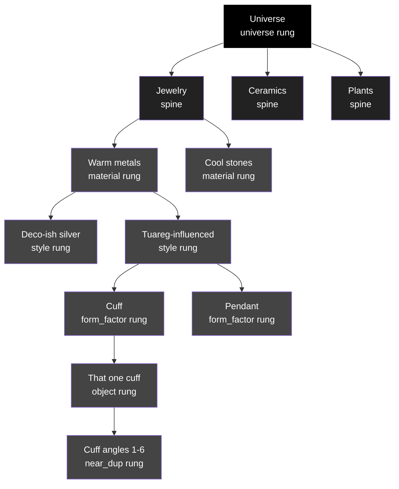

<!-- covers-through: 2026-07-11 -->

# Cortex 1.0 — Engineering

> **Canonical engineering doc #10 of 12** per `docs-consolidation-plan-2026-07-11.md`. NEW canonical doc elevated 2026-07-11. Alfred's 768-dim vector bible is absorbed verbatim as APPENDIX 768D. Cortex is the persona-graph engine: 768-dim vectors, drift + embedding + the persona graph that Sakura uses to remember + reason.

## §OVERVIEW — What Cortex is

Cortex is Sakura's memory + reasoning graph. It carries:
- **Embeddings** — 768-dim vectors for objects, events, people, conversations, patterns.
- **The persona graph** — a taxonomy-shaped node/edge graph that lets Sakura talk about "this like that" (analogy), "hold-constant-flip-one-pack-near" (king:queen), and per-domain 1/3/5 ladders.
- **Drift tracking** — vector drift over time to detect operator-behavior change or hallucination onset.
- **Triggers** — subscription-style firings when a vector crosses a threshold or a graph node is hit.
- **Object-taxonomy spine** — the shared vocabulary all Cortex reasoning grounds against.

Cortex sits ABOVE Loam (persistent storage) and BELOW Sakura's chat surface + verb registry. The Cortex-of-Loam boundary (§BOUNDARY) is where "trained disposition" ends and "read-from-Cortex" begins.

## §PERSONA-GRAPH — Persona Graph Strategy + Tech (folded from canon/)

---
slug: persona-graph-strategy
title: Persona graph strategy
category: canon
canonical-candidate: false
promoted-from: research/
promoted-on: 2026-07-09
status: promoted
---

# Persona graph strategy

**Status:** pegged for Phase 2 — unauthored as of 2026-04-30.

## Why this file exists

The pipeline scrub (canonical taxonomy + per-product separation)
landed first. The persona graph is the next scope. This file holds
the seat so the strategy lands in the right place when authored.

## Scope (when authored)

The persona graph governs how user mood, behavior precedence, and
persona register are stored and queried *before* an LLM constructs
its system prompt. It is ML infrastructure (per `ml-before-llm.md`),
not LLM logic.

The persona is the *interface* the LLM presents — tone, register,
vocabulary, the things it will and won't say. Calling it a
"personality" would overclaim; the LLM doesn't have a personality.
It has a persona, in the English sense of a mask or role.

## Open questions (do not answer here yet)

1. **Storage shape.** SQLite in front of every L-tier? Per-product
   schema? Where does the file live (per-tenant directory)?
2. **Trigger points.** When does an L0 / L1 / L2 model query the
   persona graph during a turn? At system-prompt construction?
   At output post-process? Both?
3. **Persistence semantics.** Mood is currently ephemeral on
   Curator. Phase 2 requires write-on-tick + read-on-mount. Is
   SQLite the right substrate, or is OPFS / IndexedDB enough for
   L0 (browser/iOS) while SQLite serves L1+?
4. **Lacuna's persona.** Lacuna's persona is dialectical register
   (4-axis rubric). Same-shape graph as Sakura's mood graph, or
   different structure?
5. **Meridian's persona** (was Lacuna Monitoring, renamed 2026-07-09). Probably none — the oracle
   has a tone register but not a persona. Confirm.
6. **Cross-tier consistency.** When the operator transitions from
   L0 (offline) to L1 (back online), does the persona graph
   reconcile? Whose state wins?

## Existing pieces (Curator/Sakura, verified Phase 1)

| Piece | Lives at | State |
|---|---|---|
| BEHAVIOR enum + `chooseBehavior` precedence | `curator-web/src/components/sakura/sakuraBehavior.js` | live; 25 behaviors; 17 events |
| Marker protocol parse (8 markers) | `curator-web/src/components/sakura/useMoodTextRender.js` | live |
| Mood vector + drift (4 scalars) | `curator-web/src/components/sakura/useSakuraMood.js` | live but ephemeral — no persistence |
| Persona prompt | `curator-api/curator_api/curator_persona.md` | live; level=full / level=layer0 |
| Persona-eval invariants | `curator-api/curator_api/persona_invariants.py` + research rubric | live |
| `accountStorage` mood key | declared but unused | integration point waiting |

## Discipline rule for Phase 2

Phase 2 starts from what's already built — the existing behavior
graph, marker protocol, mood vector, persona prompt, and eval
invariants — and adds storage + trigger points where they're
missing. **No redesign from scratch.** The land is cleared; we
plan the bumps and ridges.

## Candidate mechanism: neural assemblies / DIRECT (research note)

A prior session note (2026-05-01) flagged neural assemblies +
DIRECT (DIRectional Edge Coupling, arXiv 2604.26919) as a possible
mechanism for the graph's *internals*: local Hebbian plasticity
learns auditable causal directionality without backprop or global
optimization.

Why it's interesting for Phase 2:

- **Auditable.** Synaptic-strength asymmetry exposes *why* a visual
  parameter (hue, rotation, petal density) connects to a conceptual
  attribute (specificity, clarity, vitality, progression).
- **Local rule.** Adds nothing global — fits the "ML before LLM"
  discipline. The graph is ML infrastructure; the mechanism stays
  inside the ML layer.
- **Brand-graph fit.** Particularly attractive for the Sakura mark —
  formalizes "why this petal density connects to this brand
  concept" with mechanism-level evidence, not aesthetic intuition.

Status: pegged as a candidate. Not adopted; Phase 2 design hasn't
started. If it's chosen, the next step is a proof-of-concept that
encodes Sakura mark parameters as assembly inputs, runs DIRECT, and
outputs a causal graph.

Out of scope for this peg: applying the same mechanism to Lacuna
LLM's dialectical register (different shape — 4-axis rubric, not
parameter-to-concept) or Meridian's L1 oracle (probably
no persona surface there at all).

## §PERSONA-GRAPH-TECH — Cortex Persona Graph Tech

---
slug: cortex-persona-graph-tech
title: Cortex — persona graph engine (technology)
category: canon
canonical-candidate: false
promoted-from: research/
promoted-on: 2026-07-09
status: promoted
---

# Cortex — persona graph engine (technology)

**Version:** v0.1
**Date:** 2026-05-02
**Status:** spec; scaffold in progress at `~/code/cortex/`
**Engine name decided:** Cortex
**Companion:** `cortex-personas-sakura-lacuna.md` (applied to both products)
**Substrate context:** `/Users/alfred/.claude/plans/proud-finding-breeze.md`
  (Cortex is the L0 store; Neo4j Aura is L1)

---

## What Cortex is

Cortex is a **lightweight, embedded, schema-flexible persona-graph
engine** that runs on every device an operator might use: phone (iOS,
Android), laptop (macOS, Linux, Windows), and the web (browser via
WASM). It's the L0 layer of the Lacuna Engineering substrate. The L1
canonical store (Neo4j Aura) holds the heavy data; Cortex on each
device holds the assistant's *persistent persona state* — its mood,
its slow-drifting traits, its sparse memory, its constraints. The
persona is the *interface* the LLM presents to the operator: tone,
register, vocabulary, the things it will and won't say. We're not
giving the LLM a personality (that would overclaim); we're refining
the interface so the LLM is more useful to the operator and the
operator is more useful to the LLM.

Cortex is not a graph database in the Neo4j / Kuzu sense. It's a
purpose-built store for **one specific shape of data**: persona +
relationship + interaction history + safety constraints, with vector
search over a few thousand items per user, simple 1-2 hop traversal,
and the ability to **add new dimensions at runtime without
migrations**.

That last property — runtime-extensible schema — is what makes
Cortex a defensible artifact rather than just another KV store.

---

## Why a custom engine

Existing options and why each fails the L0 problem:

| Option | Why it fails |
|---|---|
| Kuzu | No iOS/Android binding; overkill for the workload |
| SQLite + sqlite-vec | Works but you write the persona-graph layer over and over per platform |
| RealmDB | Vendor lock-in; unclear future post-Mongo acquisition |
| LiteFS / Turso | Server-coupled; we want true offline-first |
| IndexedDB (browser) + sqlite (mobile) + DuckDB (desktop) | Three storage models, three query layers, three sets of bugs |
| Pure TypeScript implementation | Vector ops slow without WASM; weak tech-defensibility story |

Cortex consolidates: **one Rust core, four ABI surfaces**.

---

## Architecture

```
┌─────────────────────────────────────────────────────────┐
│                    cortex-core (Rust)                    │
│                                                          │
│   ┌───────────┐  ┌──────────┐  ┌──────────┐  ┌────────┐ │
│   │  storage  │  │  schema  │  │  vector  │  │ query  │ │
│   │  (log +   │  │ (flex.   │  │ (cosine, │  │ (tiny  │ │
│   │  snapshot)│  │  nodes/  │  │  flat)   │  │  DSL)  │ │
│   └─────┬─────┘  │  edges)  │  └─────┬────┘  └────┬───┘ │
│         │        └────┬─────┘        │            │     │
│         └─────────────┼──────────────┴────────────┘     │
│                       │                                  │
│                ┌──────┴──────┐                          │
│                │   muzzle    │  ← safety / filter layer │
│                │ (NEVER_*)   │                          │
│                └─────────────┘                          │
└──────────┬──────────────┬──────────────┬───────────────┘
           │              │              │
    ┌──────▼─────┐ ┌──────▼─────┐ ┌─────▼─────┐
    │ cortex-wasm│ │ cortex-ffi │ │cortex-cli │
    │ (browser)  │ │(iOS/Android│ │ (debug)   │
    │            │ │ via UniFFI)│ │           │
    └──────┬─────┘ └──────┬─────┘ └───────────┘
           │              │
    ┌──────▼─────┐ ┌──────▼──────┬───────────────┐
    │ TypeScript │ │   Swift     │   Kotlin      │
    │  wrapper   │ │  wrapper    │   wrapper     │
    └────────────┘ └─────────────┴───────────────┘
```

### `storage` — append-only log + indexed snapshot

Two artifacts on disk per Cortex instance:

- `cortex.log` — append-only event stream. Every node insert, edge
  insert, property update, deletion is one event with a monotonic
  sequence number. Crashes don't corrupt; recovery replays the tail.
- `cortex.snap` — indexed snapshot of the current graph state.
  Rebuilt periodically (every N events or at quiescent points) by
  reading the log forward. Provides O(log N) lookup by primary key
  and O(1) lookup by indexed property.

Both files are encrypted at rest (XChaCha20-Poly1305, key from OS
keychain). Required from day one.

**On the wire.** `cortex.log` is a `.slatl` file — one `event` or
`cortex-slice` record per line, canonicalized per SLAT §6.1. `cortex.snap`
is a `.slat` document containing a `(snapshot :ts … :subject … :body …)`
record. Both files are readable with `slat/read` directly; the encrypted
envelope wraps the SLAT payload (SLAT §6.6). Content-ids from SLAT §5.4
serve as dedup keys in the log. See §SLAT (this doc) for full shapes.

### `schema` — flexible node + edge model

Nodes have:
- A **kind** (string label, e.g., `Account`, `Mood`, `Material`)
- A **primary key** (string, unique within kind)
- A **properties** map (stringly-typed JSON-shaped values)

Edges have:
- A **kind** (string label, e.g., `FELT`, `LIKED`, `NEVER_SAYS`)
- A **from** (kind + key reference)
- A **to** (kind + key reference)
- A **properties** map

**No DDL.** No `CREATE TABLE`. The first time an edge of kind `FELT`
is written, the engine notes the kind exists. The schema *is* the set
of edge kinds that have been used. New kinds are valid edges from
day-one without any setup. This is the property that makes
"expanding persona dimensions" trivial.

Indexed properties are declared via a small `cortex.toml` per
instance:

```toml
[[index]]
kind = "Image"
property = "sha"
unique = true

[[index]]
kind = "FELT"
edge_property = "ts"
ordered = true
```

Indexes can be added or dropped at runtime; rebuild happens in
background.

### `vector` — flat L2 / cosine over Vec<f32>

Per-node optional `embedding: Vec<f32>` (default 768-dim, configurable).
Search via flat scan with SIMD where available (`packed_simd_2` on
nightly, fallback to scalar). For ≤10K items the difference between
flat and HNSW is microseconds; we don't need an ANN index yet.

Rule of thumb: don't reach for HNSW until measurements demand it.

### `query` — small DSL, not Cypher

Cortex doesn't speak Cypher. It speaks five primitive query verbs:

| Verb | Semantics |
|---|---|
| `node(kind, key)` | Fetch one node by PK |
| `edges(kind, from?, to?, where?)` | Fetch edges matching criteria |
| `traverse(start, edge_kinds, max_hops, where?)` | BFS up to N hops |
| `topk(node_kind, sort_by, limit)` | Sorted top-K of a node kind |
| `vector_topk(embedding, kind, limit)` | Cosine similarity top-K |

Plus three time-window helpers:
`recent(edge_kind, since)`, `between(edge_kind, t0, t1)`,
`decayed(edge_kind, half_life)`.

That's it. No JOINs. No subqueries. No aggregates beyond `count` /
`sum` / `avg`. The intentional minimalism keeps the engine small and
the per-call latency under 5ms even on a phone.

### `muzzle` — the safety / filter layer

This is where Cortex stops being "just a store" and starts being a
**brand-and-safety enforcement substrate**.

Each persona has a set of `:NEVER_*` and `:ALWAYS_*` edges from its
`Persona` node to constraint targets. Examples (cross-product):

```
(:Persona {persona_v: "sakura-v3"})-[:NEVER_USES_PHRASE]->(:Phrase {text: "as an AI"})
(:Persona {persona_v: "sakura-v3"})-[:NEVER_CLAIMS]->(:ClaimKind {name: "absolute_attribution"})
(:Persona {persona_v: "sakura-v3"})-[:ALWAYS_HEDGES_BELOW]->(:Confidence {threshold: 0.85})

(:Persona {persona_v: "lacuna-v1"})-[:NEVER_REFUSES]->(:RequestKind {name: "any"})
(:Persona {persona_v: "lacuna-v1"})-[:NEVER_PASSES_TO_COPILOT]->(:Boundary {name: "terminal_command_without_consent"})
(:Persona {persona_v: "lacuna-v1"})-[:DEFAULTS_TO_REGISTER]->(:Register {name: "HAL"})
```

The muzzle works in two passes:

1. **Pre-emission constraint** — when assembling the LLM prompt, the
   engine queries the persona's `:ALWAYS_*` and `:NEVER_*` edges and
   includes them as constraints in the system prompt. The LLM is told
   what it must never say before it speaks.

2. **Post-emission validation** — the LLM's output is scanned against
   the same `:NEVER_*` rules. If a violation is detected, the response
   is regenerated with a stricter prompt. After N retries the system
   falls back to a hand-written safe template.

The muzzle is a **filter on language**, not on action. (Lacuna's
no-action-without-permission rule is enforced by the agent harness,
not by Cortex.) But what comes out of Sakura's or Lacuna's mouth
goes through Cortex's muzzle.

Why this matters strategically:
- Every new dimension we add (mood, trait, expertise, gift-intent…)
  can have an associated muzzle rule. The muzzle co-evolves with
  the persona.
- The muzzle is per-persona, so Sakura and Lacuna have different
  rules in the same engine.
- Curator-reviewed: new `:NEVER_*` edges go through cultural-veto
  review before they're allowed in the canonical persona bundle.
- It's auditable: "why didn't Sakura say X?" → traverse to the
  `:NEVER_*` edge that fired.

---

## Sync to L1 (Neo4j Aura)

Cortex is offline-first; L1 is canonical. Sync over HTTPS:

- **Push:** `POST /api/cortex/push` with batched events (since last
  sync seq). Replay-protected with monotonic seq numbers + account_id
  bound. L1 applies the events to its multitenant graph.
- **Pull:** `GET /api/cortex/pull?since=...` for L1→L0 hot cache
  refresh (popular atlas entries, cross-device persona reconciliation).
- **Conflict resolution:** L1 wins. L0 reconciles on next pull.
  Per-property last-write-wins by timestamp.

Disaster recovery: drop your phone in the ocean → install Curator on
the new phone → sign in → Cortex pulls your full persona graph
from L1 → you're back. Disaster recovery must be tested before any
ship.

---

## Performance targets

| Operation | Target | Why |
|---|---|---|
| `node(kind, key)` | <100µs | Persona prompt assembly happens 3× per turn |
| `edges(kind, from, where=ts<X)` | <500µs for 10K edges | Sakura's "recent FELT" query |
| `vector_topk(emb, k=10)` | <2ms for 10K items | "Find similar past interactions" |
| Full prompt assembly (3 queries + format) | <5ms | Bound for perceived response latency |
| Sync push (batch of 100 events) | <100ms over LTE | Background sync shouldn't bother the user |
| Cold rehydrate from L1 | <3s for 10MB graph | Onboarding to new device |

These are budgets, not guarantees — to be validated by measurement.

---

## Why Rust + WASM + UniFFI

| Need | Rust answer |
|---|---|
| Same code on iOS / Android / web / desktop | Rust core compiles to all four; UniFFI (Mozilla) generates Swift + Kotlin bindings, wasm-pack generates browser JS |
| Sub-millisecond vector ops | SIMD intrinsics, zero-copy slicing |
| Memory safety | Borrow checker eliminates whole classes of bugs in a database engine |
| Encryption-at-rest from day one | `chacha20poly1305` crate, audited |
| Small binary | <500KB stripped for the WASM target |
| One source of truth | Schema definitions live in one Rust file, codegen everywhere else |
| Defensible artifact | Open-source Rust crate is a real engineering deliverable; matters for the trademark/patent story |

The cost: roughly 1-2 weeks of build pipeline setup (cargo workspace
+ wasm-pack + UniFFI scaffolds + CI for four targets).

---

## What Cortex does NOT do

- **Not a knowledge graph.** Atlas entries, deduction rules, blob
  metadata — those live in L1 (Neo4j Aura). Cortex holds only the
  user's relationship to that knowledge.
- **Not a recommendation engine.** Recommendations are computed in L1
  from cross-tenant aggregates. Cortex serves the per-user signal
  that feeds them.
- **Not a vector database for billions of items.** ≤10K items per
  user, period. If you need more, the design is wrong.
- **Not Cypher.** Resist any urge to grow Cortex into a general graph
  query engine. The five primitive verbs are the contract.
- **Not the agent harness.** Lacuna's "never run a terminal command
  without permission" is enforced by the harness around the LLM, not
  by Cortex. Cortex constrains *language*; the harness constrains
  *action*.

---

## What's defensible / patentable about it

What's novel here isn't storage. SQLite, IndexedDB, Realm all do
storage. What's novel is:

1. **Runtime-extensible persona dimension model.** Adding a new
   edge kind ("gift-intent", "domain-expertise", "circadian-pattern")
   requires no migration. Existing data unaffected. The engine just
   learns the new kind exists.

2. **The integrated muzzle.** Persona storage and brand-safety
   enforcement in one substrate. Most safety layers today bolt onto
   the LLM via system-prompt rules; ours lives in the same store as
   the persona, evolves with it, and is auditable per-persona,
   per-rule.

3. **The cross-platform abstraction.** Single Rust core, four ABIs,
   identical semantics. Persona data that's portable across the
   user's devices without re-implementing the engine.

This is the trademarkable shape: **Cortex — a persona graph engine
with runtime-extensible dimensions and integrated brand-safety
muzzle, portable across iOS/Android/web/desktop**.

Patent angle: *the runtime-extensible dimension model with integrated
muzzle co-evolution* may be patentable as a method. Public framing to
be drafted once v0.1 ships; counsel review before any USPTO filing.

---

## Open / deferred (technology level)

- **HNSW index** — when vector_topk on 10K items stops being fast
  enough. Not before.
- **Multi-device merge semantics** — currently L1-wins. May want CRDT
  for some properties (e.g., trait scalars that drift on multiple
  devices simultaneously).
- **Observability** — per-query latency histograms exported to L1 for
  fleet-level performance analysis.
- **Persona bundle distribution** — how new `:NEVER_*` rules ship to
  users (forced on next sync? user-controlled?).
- **L1 mirror** — Neo4j Aura's schema mirrors Cortex's; a mismatch
  spec is needed to keep them aligned as Cortex evolves.

---

## Companion

For how Cortex is *used* by Sakura and Lacuna — including their
specific persona axes, mood vocabularies, the HAL register, the
"never refuses" rule, incident-replay, and the Lacuna Oracle variant
— see `cortex-personas-sakura-lacuna.md`.

## §OBJECT-TAXONOMY — Object Taxonomy Spine

---
slug: object-taxonomy-spine
title: Object taxonomy — the operator-facing spine
category: canon
canonical-candidate: false
promoted-from: research/
promoted-on: 2026-07-09
status: promoted
---

# Object taxonomy — the operator-facing spine

**Status:** canonical as of 2026-05-13.

How a piece is browsed in Curator. Three rungs, in order, top to bottom. Operators see this hierarchy when they navigate the gallery, attribute a piece, or filter the graph. Everything the SigLIP-2 embedding can do (per [[the-768d-vector-bible]]) gets surfaced under this spine.

## The hierarchy

```
1. Object type        Jewelry • Ceramics • Sneakers • Plants • Textiles • Furniture • …
2. Geography          West Africa • Mexico • Levant • Japan • …
3. Maker              operator-typed; "Unknown" when blank
```

Top-to-bottom = most general → most specific. The slider (per the Bible's specificity-slider model) zooms within this spine; the spine itself is the legible scaffolding.

## The graph's taxonomic depth slider — 10 levels

**Superseded 2026-05-13 (later same day):** the 10-tick rank-labeled slider below is **deprecated as a UI control**. Per Alfred: "you don't need levels. The graph self-describes if the kingdoms start with an identifiable object. Similarities are cosine all the way through until we hit an individual object."

The new model — **atom-and-molecule, emergent depth:**

- **Atom = the photo.** Single photographed instance. Most atomic unit.
- **Molecule = a collection of photos believed to be the same thing.** Multiple photos depicting one physical piece. Cosine similarity ≥ ~0.92 + operator-confirmable. Code uses the words `atom` and `molecule` explicitly in the data model and the graph layout.
- **Above the molecule:** clusters at progressively looser cosine thresholds. **As many levels as the operator's library naturally produces** — depth is emergent, not capped at 10 (or any fixed number). A library with 50 pieces might support 3 levels; a library with 5,000 might support 8. The graph self-describes its own depth from the data.
- **The slider is a continuous cosine zoom**, not a rank label. Position maps directly to a similarity threshold; no kingdom/phylum/etc taxonomic labels gate it.
- **Top-level bubbles self-describe** — their label is the dominant identifiable object in each (operator-confirmed attribution where available, AI-suggested otherwise).
- **Drift in the last direction — inertia, never fully stop.** When the d3-force simulation settles, retain a small residual velocity along each node's last direction of motion. Bounded so nodes don't visibly walk off, but never zero. Damping is gentle enough that movement persists indefinitely. The surface is always alive.
- **Layout = embedding projection + weight-driven collision resolution.** The graph's node positions come from a **2D projection of the 768-D embedding** (classical / metric MDS — distance-preserving), not from a force-equilibrium search. d3-force becomes the *transition layer*: springs ease each node from its current display position to its MDS target position; drift adds residual velocity; drag pins `fx`/`fy` until released. Compute MDS once per dataset change; cache. UMAP/t-SNE are faster but distort global distances — only as a "fast mode" toggle.
  - **Collision resolution by weight.** MDS positions are *truth* but some will overlap on a 2D screen. When two nodes collide, push them apart along the connecting axis, with displacement proportional to each node's weight where **weight = function of (count × size)**. Bigger-with-bigger pairs get proportionally more displacement (longer effective rest-length between heavy nodes). Within a pair, the heavier node moves less (heavier mass holds its position), the lighter moves more — like physics. The net effect: MDS structure is preserved on average (mass-centered around the targets), but the surface is *readable* — big nodes bloom outward, small ones get out of their way.
  - **Render at targets, then spring out.** Sequence: (1) compute MDS targets; (2) render at targets; (3) detect overlaps; (4) compute weighted displacement for each colliding pair; (5) springs ease nodes into the resolved positions — bloom, not snap. Drift continues on top per the inertia rule.
- **Color = 2D position rendered as a 2D color.** Per Alfred 2026-05-13: "if it's in 2D space, that's a color." Don't collapse 2D to 1D first; both axes of position map directly to two axes of color space. No information lost in the squash; adjacent positions get adjacent colors by construction.
  - **Implementation, OKLCH:** for each node with MDS-projected (x, y) normalized to (u, v) ∈ [0, 1]²:
    - `H = u * 270°` (hue rotates red → orange → ... → violet across x axis)
    - `L = 0.55 ± 0.20 * (v - 0.5)` (lightness varies darker-at-bottom to lighter-at-top; tunable)
    - `C = 0.16` (chroma constant; uniform vividness across the field)
  - **HSL fallback (simpler, less perceptually uniform):** `hsl(u * 270deg, 70%, 35% + v * 50%)`.
  - Recompute when projections regenerate, not per-frame. Color stays with the embedding position, not the screen position — moving a node on screen doesn't change its color.
  - **Outside the canon palette intentionally.** The graph surface is the only place the spectrum appears. Chat / cards / chrome stay canon.
  - **Why this is allowed.** The graph is an **instrument**, not a decorated surface. Color here is information, not styling. Operators over time develop intuition for where things sit — "the violet end is my newest stuff, the red end is my heavy work" — like a sailor reads a compass. Color is faster than text; the operator's eye picks up adjacency before their brain articulates it. The spectrum does real work: the embedding's 1-D shadow rendered as something humans evolved to read fluently. The visual canon defines material; it doesn't prohibit a different language on a different surface (per Alfred 2026-05-13: "Sakura on a forest green T-shirt").

The 10-tick rank table that follows is kept as historical canon, NOT as an operator-facing UI element. The Linnaean labels can still appear in research / engineering contexts (e.g., in the Bible's specificity-slider discussion).

---

**Historical (deprecated for UI as of 2026-05-13 later in day):**

The graph initially surfaced these spine rungs as a **10-tick depth slider**:

| Tick | Label         | What an operator sees                                                                                  |
|------|---------------|--------------------------------------------------------------------------------------------------------|
| 1    | **Kingdom**   | Broad bubbles: animal, jewelry, vehicle, ceramic, etc. — the Thing dictionary. Few large nodes drifting. |
| 2    | **Phylum**    | First split under Kingdom (e.g., jewelry → metalware vs gemstone vs beadwork)                          |
| 3    | **Class**     | Finer cut                                                                                              |
| 4    | **Order**     | Finer still                                                                                            |
| 5    | **Family**    | Maker-family-or-style level                                                                            |
| 6    | **Genus**     | Tighter — usually a maker's body of work, or a specific tradition                                      |
| 7    | **Species**   | A **category of items** — e.g., "Antonio Pineda Thumbprint Bracelet." Multiple instances exist under it. |
| 8    | **First**     | The binomial *first name* — the item-of-the-photo (Bracelet, Brooch, Vase)                             |
| 9    | **Last**      | The binomial *last name* — the variety / maker-family (Pineda, Spratling, Bauhaus)                     |
| 10   | **Photo**     | One node per individual photographed instance                                                          |

**By the time the slider hits Species (tick 7), you're looking at a named category of items, not a single object.** "Antonio Pineda Thumbprint Bracelet" is a Species — there are many such bracelets; each is an instance at tick 10 (Photo).

### Visual treatment — diagonal ticks

The 10 ticks render **diagonally** (not vertical), with the labels rotated to follow. The slope reads as a depth-axis — "deeper down the taxonomy" feels diagonal, not horizontal. Labels lowercased per canon, mono. Hairline tick marks; canon palette only.

```
kingdom \ phylum \ class \ order \ family \ genus \ species \ first \ last \ photo
                                                              ↑       ↑     ↑
                                                       binomial pair  individual
```

## Time-series evolution trees grow out of each cluster node

The cluster nodes in the main graph aren't standalone bubbles. **From each cluster, a hierarchical tree grows outward** showing the time-series evolution of the objects inside.

- Use [`d3-hierarchy/tree`](https://d3js.org/d3-hierarchy/tree) for the layout.
- Tree root: the cluster centroid (the spot in the main graph).
- Tree internal nodes: sub-groupings within the cluster — by time, sub-similarity, or operator-defined facets.
- Tree leaves: **the object itself** — the individual photographed piece at the deepest rank.
- All tree nodes are **clickable** — clicking a leaf opens the gallery (frosted view) for that specific object. Clicking an internal node opens the gallery scoped to the items under that branch.
- Tree edges show chronology when the cluster has acquisition/creation dates — earliest at the root, newest at the leaves. This is the "evolution" axis.
- **Color coordinates** with the parent cluster's color (canon palette pink/gray/white/off-white/green; nearby branches share a hue family).
- The visual feel: cluster nodes float, trees grow softly out of them like dendritic tendrils. Drift carries through; trees aren't static.

### In the gallery view — the tree appears in the object description

When the operator clicks through to a specific object's gallery view, the **object description** section embeds the local tree — showing nearby items (sibling leaves), the object's ancestry up to the cluster centroid, and adjacent branches. Same `d3-hierarchy/tree` layout, scoped to one object's neighborhood. Clicks within the embedded tree navigate to other items.

### Practical layout

- Main graph: force-directed cluster centroids at the slider's current depth (kingdom → photo).
- Per cluster: a `d3-hierarchy/tree` rendered as branches radiating outward from the centroid, terminating at leaf "object itself" nodes.
- Gallery view: a focused tree centered on the operator's chosen object.

### Species-rank naming convention (the binomial)

At Species rank, operator-facing names follow a **two-part binomial pattern**, modeled loosely on Linnaean genus-species:

```
[ Item-of-the-photo ]  +  [ Variety ]
   "first name"             "last name"
```

- **First name** = *the item itself in the photo* — what the operator's looking at. ("Bracelet", "Brooch", "Vase", "Sneaker")
- **Last name** = *variety* — the unifying tag. Usually the maker's surname or the style family. ("Pineda", "Spratling", "Bauhaus")
- Full species name reads as **"Pineda Thumbprint Bracelet"** or **"Antonio Pineda Thumbprint Bracelet"** when the operator wants the fuller form.

The operator can extend the binomial with qualifiers (period, material, design name) at finer slider levels (variant 7 and below).

This naming maps directly onto Cortex's `Maker` + piece-type relationship: the species node is `(Maker)-[:MADE]->(SpeciesCategory)`, and individual instances are members of that category.

## Rung 1 — Object type

The first cut. What kind of *thing* is it.

- Operator-facing top-level categories: **Jewelry**, **Ceramics**, **Sneakers**, **Plants**, **Textiles**, **Furniture**, **Art on paper**, **Books**, **Tools**, **Other**.
- Picked by the operator on intake (drop-down + smart default from the L1 vision read).
- A piece can only be one object type. Multi-object photos resolve to the **dominant object** per the Bible's `dominant_score` (Book II §II.5).
- "Other" is a real bin, not a punt. When the spine doesn't fit, the piece lives in Other with an operator note describing what it is. We grow the spine when a critical mass of Other pieces shares a description — that's how new object types enter the canon, not by committee.

**Plants are first-class.** Some operators curate plant photos as their primary inventory; the platform serves them just like jewelry operators. Per [[lacuna-positioning-principle]], centering African + diaspora operators doesn't preclude any object class — operators curate what they curate.

## Rung 2 — Geography

The region of origin. *Where* the thing came from.

- Operator-facing geography labels: **West Africa**, **East Africa**, **Southern Africa**, **North Africa**, **Caribbean**, **Mexico / Central America**, **South America**, **US**, **Levant**, **Japan**, **Continental Europe**, **British Isles**, **South Asia**, **Southeast Asia**, **Other**. Coarse on purpose — finer than this gets argued about endlessly.
- Operator-typed or operator-picked. The L1 vision read offers a *suggestion* (not a fact) based on style cues; operator confirms.
- Geography is **not** maker. A piece made by a Mexican silversmith in NYC might be tagged "Mexico" by some operators (the tradition's origin) and "US" by others (the actual location of making). Both are legitimate; the operator decides. The system doesn't second-guess.
- **Geography can be blank** when the operator genuinely doesn't know. Don't autofill an "Unknown geography" — leave the slot empty and let the operator come back to it.

## Rung 3 — Maker

Who made it.

- **Operator-typed only.** Per [[lacuna-positioning-principle]] and the no-maker-autofill policy: the system never proposes a name. Operator types it; system stores it. Similar style ≠ same maker. Many makers per style; many styles per maker.
- The slot is **blank** when the operator doesn't know. The placeholder reads **"Unknown"** — that's the canonical word for an empty maker, not "anonymous" or "—" or null.
- When the operator types a maker, Cortex creates / merges a Maker node and links the piece (existing `save_correction` path).
- **"Unknown"** is a real value, not a placeholder. Pieces tagged "Unknown" form their own pool the operator can revisit later when more is learned. The unknowns ladder (Bible §III.7) tries to suggest a maker only at Level 2+, and only when the operator confirms.

## How the rungs compose

A piece's location in the graph is the tuple `(object, geography, maker)`. Two of three can be blank; the operator commits one at minimum (object type — required at intake).

Examples:

- `(Jewelry, West Africa, El Hadji Koumama)` — fully attributed
- `(Jewelry, West Africa, Unknown)` — operator knows the geography but not the maker
- `(Ceramics, Mexico, Unknown)` — same shape, different object class
- `(Sneakers, US, Nike)` — for the operator curating sneakers
- `(Plants, US, Unknown)` — the plant-curating operator's photo of a houseplant

The slider zooms over the embedding-side phylogeny; this spine is what the operator *names*. The two coexist: a slider position resolves to a *group* whose members share a position in `(object, geography, maker)` space when those are filled in.

## What about extra attributes?

Year, period, condition, blurb, longer writeup, atlas link, attribution tier, EXIF — all live on the **piece** (or its group node), not on the spine. The spine is the navigation backbone; the rest is decoration. Per [[the-768d-vector-bible]], group-level facts (style, era when known) live on `GroupNode`; image-level facts (notes, condition, sourcing, price, EXIF) live on `ImageNode`.

## Operator-facing routing

- Settings → "How my pieces are organized" surface: shows the three rungs, lets the operator collapse/expand each.
- Gallery slide-up panel (per J's recent work): the count headline names the current rung position. "12 pieces in Jewelry / West Africa".
- Smart-menu attribution sheet: three required-ish fields are Object (required), Geography (recommended), Maker (operator-typed, "Unknown" fills the slot).

## Why "Unknown" instead of blank

A blank field reads as "not yet filled in." **Unknown** reads as "filled in with the operator's honest answer." Two different states. The unknowns ladder respects the difference: blank → Level 0 (unfiled); Unknown → already an operator-confirmed attribution, the system stops trying to suggest a name for it.

## Cross-refs

- [[the-768d-vector-bible]] — the embedding side; this spine is the operator-facing dual.
- [[lacuna-positioning-principle]] — Object-first framing serves the operator (the laid-off PM in NJ, the Etsy seller, the diaspora dealer).
- [[llm-naming-canon]] — when surfaces show a tier, they show `Sakura L1 LLM`, never the underlying model name.
- [[canonical-taxonomy.md]] — the L0/L1/L2/Echo tier model; orthogonal axis but coexists in the same operator UI.

---

# §TRIGGERS — Cortex Triggers (folded from CORTEX-TRIGGERS-2026-07-01.md)

---
title: Cortex Triggers — Lisp-Style Feature Generation
version: 2026-07-01
status: CANON
domain: cortex
related:
  - SAKURA-VOICE-PERSONA-1.0-CANON
  - LOAM-1.0-ENGINEERING
  - CORTEX-WRITE-MODEL-1.0
  - BATTERY-AWARE-COMPUTING-2025
author: Curator Architecture Team
voice: HelloSurface
---

# Cortex Triggers — Lisp-Style Feature Generation

**The pattern:**  
The LLM doesn't *assemble* data. It *expects* it.

When Cortex writes, triggers fire. Triggers generate features — aggregations, associations, contradictions, curiosities, anomalies. Features write back to Cortex. Sakura reads features on the next tick and reasons about them.

This happens when you're on the paid tier or doing high-value work. On-device, it happens when the battery says yes and the feature would actually be useful.

This is how your inner world stays coherent without you having to ask.

---

## §1 — Trigger Syntax

Triggers are Lisp-style s-expressions stored in `cortex/triggers` slot. Each trigger defines:

- **on-write** — which topic or pattern to watch
- **when** — predicate (condition under which the trigger fires)
- **then** — action (feature generation function)

### 1.1 Basic Form

```lisp
(on-write
  :topic "projects/curator/decisions"
  :when (lambda (event)
          (> (count-writes-today :topic "projects/curator/decisions") 5))
  :then (generate-feature :aggregation
          :title "Decision flurry detected"
          :summary "Six decisions logged in one day — scan for contradictions or drift"))
```

### 1.2 Topic Matching

Topics are slash-delimited paths. Matching supports:

- **Exact:** `"projects/curator/decisions"`
- **Prefix:** `"projects/curator/*"` matches all curator sub-topics
- **Wildcard:** `"projects/*/decisions"` matches decisions in any project
- **Set:** `["journal/daily", "journal/weekly"]` matches either

### 1.3 Predicate Language

Predicates are lambda expressions with access to:

- `event` — the write event that triggered evaluation
  - `event.topic` — string
  - `event.timestamp` — ISO 8601
  - `event.content` — serialized content
  - `event.tags` — list of strings
  - `event.wordcount` — integer
- `(count-writes-today :topic T)` — integer count
- `(count-writes-week :topic T)` — integer count
- `(last-write-time :topic T)` — ISO timestamp or nil
- `(has-tag? :event E :tag "urgent")` — boolean
- `(related-topics :topic T :radius 2)` — list of topic strings
- `(time-since-last :topic T)` — duration in seconds or nil

### 1.4 Action Language

Actions generate features. Available generators:

- `(generate-feature :aggregation ...)` — summary of repeated patterns
- `(generate-feature :association ...)` — link between disparate topics
- `(generate-feature :contradiction ...)` — two writes that contradict each other
- `(generate-feature :curiosity ...)` — question raised by cluster of writes
- `(generate-feature :anomaly ...)` — unexpected write (time, topic, frequency)

Each generator takes:

- `:title` — short headline (string, max 80 chars)
- `:summary` — description (string, max 400 chars)
- `:evidence` — list of cortex record IDs that support the feature
- `:confidence` — float 0.0–1.0 (how sure the trigger is)
- `:priority` — `:low` | `:medium` | `:high` | `:urgent`

### 1.5 Example Triggers

**Detect decision clusters:**

```lisp
(on-write
  :topic "projects/*/decisions"
  :when (lambda (event)
          (> (count-writes-today :topic (extract-project event.topic)) 3))
  :then (generate-feature :aggregation
          :title "Decision cluster in project"
          :summary "Multiple decisions today — review for coherence"
          :priority :medium))
```

**Surface contradictions:**

```lisp
(on-write
  :topic "beliefs/*"
  :when (lambda (event)
          (has-tag? :event event :tag "core"))
  :then (generate-feature :contradiction
          :title "Core belief updated"
          :summary "Check for conflicts with prior beliefs"
          :evidence [(event.id) (last-write-id :topic "beliefs/*")]
          :priority :high))
```

**Detect silence (absence as signal):**

```lisp
(on-timer
  :interval (* 24 60 60) ; once per day
  :when (lambda ()
          (> (time-since-last :topic "journal/daily") (* 3 24 60 60)))
  :then (generate-feature :anomaly
          :title "Journal silence — three days"
          :summary "No daily journal entries in 72 hours"
          :priority :low))
```

**Cross-topic associations:**

```lisp
(on-write
  :topic "projects/*/progress"
  :when (lambda (event)
          (and (has-tag? :event event :tag "blocked")
               (recent-write? :topic "feelings/frustration" :within (* 2 60 60))))
  :then (generate-feature :association
          :title "Blocked work + frustration noted"
          :summary "Project blockage correlates with frustration log"
          :evidence [(event.id) (last-write-id :topic "feelings/frustration")]
          :confidence 0.75
          :priority :medium))
```

**Curiosity from repetition:**

```lisp
(on-write
  :topic "search-history/*"
  :when (lambda (event)
          (> (count-writes-week :topic "search-history/ai-safety") 10))
  :then (generate-feature :curiosity
          :title "Repeated AI safety searches"
          :summary "Why the sustained interest in AI safety this week?"
          :priority :low))
```

---

## §2 — Trigger Execution

Triggers run in a sandboxed interpreter with fuel caps and deterministic semantics.

### 2.1 Execution Model

1. Cortex write completes
2. Trigger evaluator loads all triggers matching the write topic
3. For each trigger:
   - Evaluate predicate with event context
   - If predicate returns true, execute action
   - Collect generated features
4. Write features to `cortex/features` slot
5. Emit telemetry (trigger ID, execution time, feature count)

### 2.2 Sandbox Constraints

- **Fuel limit:** 10,000 operations per trigger execution
- **Time limit:** 200ms wall-clock time per trigger
- **Memory limit:** 4 MB heap per trigger
- **Network:** None (triggers are pure compute)
- **Filesystem:** Read-only access to Cortex read APIs
- **No recursion:** Triggers cannot generate new triggers

If a trigger exceeds limits, it is halted and logged. See §10 for retry/degradation.

### 2.3 Determinism

- Triggers have no access to random sources
- Cortex read APIs return deterministic results (sorted, stable)
- Timestamps are quantized to the second (no sub-second jitter)
- Feature generation is idempotent — same inputs yield same features

### 2.4 Trigger Lifecycle

Triggers are stored in `cortex/triggers` slot as first-class Cortex records.

```typescript
interface CortexTrigger {
  id: string; // UUID
  created: string; // ISO timestamp
  updated: string; // ISO timestamp
  enabled: boolean;
  source: string; // Lisp s-expression
  parsed: TriggerAST; // Pre-parsed for fast evaluation
  stats: {
    fireCount: number;
    lastFired: string | null;
    avgExecutionMs: number;
    featureCount: number;
    errorCount: number;
  };
}
```

User can:

- Add trigger via Cortex write (topic: `cortex/triggers/new`)
- Disable trigger (write to `cortex/triggers/:id/disable`)
- Delete trigger (write to `cortex/triggers/:id/delete`)
- View trigger stats (read from `cortex/triggers`)

### 2.5 Execution Context API

Trigger predicates and actions have access to:

```typescript
interface TriggerContext {
  // Event that fired the trigger
  event: {
    id: string;
    topic: string;
    timestamp: string;
    content: string;
    tags: string[];
    wordcount: number;
  };

  // Cortex query helpers
  countWritesToday(topic: string): number;
  countWritesWeek(topic: string): number;
  lastWriteTime(topic: string): string | null;
  lastWriteId(topic: string): string | null;
  hasTag(event: any, tag: string): boolean;
  relatedTopics(topic: string, radius: number): string[];
  timeSinceLast(topic: string): number | null; // seconds
  recentWrite(topic: string, withinSeconds: number): boolean;
  extractProject(topic: string): string; // "projects/foo/bar" -> "foo"

  // Feature generation
  generateFeature(spec: FeatureSpec): void;
}
```

---

## §3 — Feature Generation

Features are structured observations that Sakura reads to inform reasoning.

### 3.1 Feature Types

**Aggregation:**  
Summary of repeated or clustered writes.

Example: "Five writes to 'projects/curator/architecture' today — theme: testing strategy"

**Association:**  
Link between writes in disparate topics.

Example: "Write to 'feelings/anxiety' 20 minutes after 'calendar/meeting-notes' — potential trigger"

**Contradiction:**  
Two writes that conflict or reverse a prior statement.

Example: "Belief in 'work/balance/no-weekends' contradicts new 'calendar/saturday-work' write"

**Curiosity:**  
Question raised by pattern of writes.

Example: "Ten writes about 'learning/rust' but zero writes about 'projects/rust/*' — why learn without building?"

**Anomaly:**  
Unexpected write (timing, frequency, topic).

Example: "Journal write at 3:47 AM — unusual time, check for insomnia pattern"

### 3.2 Feature Schema

```typescript
interface CortexFeature {
  id: string; // UUID
  created: string; // ISO timestamp
  triggerId: string; // Which trigger generated this
  type: "aggregation" | "association" | "contradiction" | "curiosity" | "anomaly";
  title: string; // Max 80 chars
  summary: string; // Max 400 chars
  evidence: string[]; // List of cortex record IDs
  confidence: number; // 0.0–1.0
  priority: "low" | "medium" | "high" | "urgent";
  read: boolean; // Has Sakura read this feature?
  readAt: string | null; // ISO timestamp
  useful: boolean | null; // Did Sakura find it useful? (explicit feedback)
}
```

### 3.3 Feature Storage

Features live in `cortex/features` slot, separate from main Cortex content.

Structure:

```
cortex/
  features/
    unread/
      <feature-id>.json
    read/
      <feature-id>.json
    archived/
      <feature-id>.json
```

Lifecycle:

1. Trigger generates feature → writes to `unread/`
2. Sakura reads feature → moves to `read/`
3. After 30 days, moves to `archived/`
4. Archived features are compressed and indexed for search but not loaded on Sakura boot

### 3.4 Feature Limits

To avoid overwhelming Sakura:

- Max 50 unread features at any time
- If 50 unread, lowest-priority features are auto-archived
- Max 10 features generated per trigger execution
- Max 100 features generated per day (paid tier)
- Max 10 features generated per day (free tier)

### 3.5 Feature Quality Scoring

Each feature gets a quality score based on:

- **Confidence** (from trigger)
- **Evidence count** (more evidence = higher score)
- **Priority** (urgent = 4, high = 3, medium = 2, low = 1)
- **Recency** (newer features score higher)
- **User feedback** (if Sakura marked it useful, boost score)

Score formula:

```
score = (confidence * 10) 
        + (min(evidence.length, 5) * 2) 
        + (priority_weight * 3) 
        + (recency_hours < 24 ? 5 : 0)
        + (useful ? 10 : 0)
```

Lowest-scoring features are archived first when limits are hit.

---

## §4 — Feature Writeback

Trigger-generated features write back to Cortex as first-class records.

### 4.1 Writeback Flow

```
Trigger fires
  → generate-feature called
  → Feature object constructed
  → Write to cortex/features/unread/:id.json
  → Emit event "feature-created" to Cortex event bus
  → Telemetry logged (trigger ID, feature type, priority)
```

### 4.2 Writeback API

```typescript
interface FeatureWriter {
  write(feature: CortexFeature): Promise<void>;
  list(filter: FeatureFilter): Promise<CortexFeature[]>;
  markRead(featureId: string): Promise<void>;
  markUseful(featureId: string, useful: boolean): Promise<void>;
  archive(featureId: string): Promise<void>;
}
```

### 4.3 Atomic Writes

Feature writes are atomic — either the entire feature is written or none of it is. This prevents partial features from corrupting Sakura's read on next boot.

If writeback fails:

1. Log error with trigger ID and feature spec
2. Retry up to 3 times with exponential backoff (1s, 2s, 4s)
3. If all retries fail, emit honest-null escalation:

```json
{
  "kind": "escalate",
  "reason": "feature-writeback-failed",
  "verb": "cortex/features/write",
  "context": {
    "triggerId": "trigger-uuid",
    "featureType": "aggregation",
    "retryCount": 3
  }
}
```

### 4.4 Deduplication

Before writing, check if a similar feature already exists (same type, overlapping evidence, within 1 hour). If so, merge or skip to avoid duplicate features.

Merge strategy:

- Combine evidence lists
- Take higher confidence
- Take higher priority
- Append summaries if both are useful

---

## §5 — Sakura Reads Features

On boot (or on idle tick), Sakura loads unread features and reasons about them.

### 5.1 Feature Reading Flow

```
Sakura boot
  → Load cortex/features/unread/*.json
  → Sort by quality score (descending)
  → Take top 10 features (max per session)
  → For each feature:
      → Present to Sakura context as "observed pattern"
      → Sakura reasons: useful? contradicts beliefs? actionable?
      → If useful, mark feature as useful
      → Mark feature as read
      → Move to cortex/features/read/
```

### 5.2 Training Pair Category

Features are presented to Sakura as a distinct training pair category:

**System:**
> You have cortex features — patterns observed in your inner world. Reason about them.

**Features:**
```json
[
  {
    "type": "aggregation",
    "title": "Decision flurry detected",
    "summary": "Six decisions logged in one day — scan for contradictions or drift",
    "evidence": ["rec-1", "rec-2", "rec-3", "rec-4", "rec-5", "rec-6"],
    "confidence": 0.85,
    "priority": "medium"
  },
  {
    "type": "curiosity",
    "title": "Repeated AI safety searches",
    "summary": "Why the sustained interest in AI safety this week?",
    "evidence": ["rec-7", "rec-8", "rec-9"],
    "confidence": 0.60,
    "priority": "low"
  }
]
```

**Sakura:**
> The decision flurry is real — I changed my mind twice on the Cortex storage format. Let me re-read those decisions to check for drift. [action: read evidence]
>
> The AI safety curiosity is noise — I was researching for a blog post, not shifting beliefs.

### 5.3 Sakura Actions on Features

Sakura can:

- **Read evidence** — load the Cortex records cited in `evidence` list
- **Reflect** — write to `journal/reflections` about the feature
- **Correct** — if feature is wrong, mark it not useful
- **Act** — if feature suggests action (e.g., "review contradictions"), add to task list

### 5.4 Feature Feedback Loop

Sakura's response to features trains the trigger system:

- If Sakura marks a feature **useful**, boost that trigger's priority
- If Sakura marks a feature **not useful**, lower that trigger's priority
- If Sakura ignores a feature (no action, no reflection), treat as neutral
- After 10 "not useful" marks, disable the trigger

This creates a self-tuning system — triggers that generate useful features fire more often; triggers that generate noise fade away.

---

## §6 — Battery-Aware Local Execution

On-device trigger execution respects battery level and power-save mode.

### 6.1 Battery API

Use Navigator.getBattery API (Web Battery Status API):

```typescript
interface BatteryManager {
  level: number; // 0.0–1.0
  charging: boolean;
  chargingTime: number; // seconds to full charge (or Infinity)
  dischargingTime: number; // seconds to empty (or Infinity)
}

async function getBatteryStatus(): Promise<BatteryManager | null> {
  if ("getBattery" in navigator) {
    return await (navigator as any).getBattery();
  }
  return null; // API not available (desktop browser, etc.)
}
```

### 6.2 Battery-Aware Execution Policy

Triggers execute locally only when:

- Battery level > 50% **OR** device is charging
- User has not enabled "low power mode" in OS or app
- Feature would be useful (high-priority triggers only in low-battery state)

Decision tree:

```
if battery.level > 0.5 OR battery.charging:
  → Execute all enabled triggers
else if battery.level > 0.2 AND not power_save_mode:
  → Execute only high-priority triggers
else:
  → Skip local triggers, defer to next charging session
```

### 6.3 Deferred Execution

If triggers are skipped due to battery, queue them for later:

```typescript
interface DeferredTrigger {
  triggerId: string;
  eventId: string; // The write event that would have fired the trigger
  deferredAt: string; // ISO timestamp
}
```

On next charge (or battery > 50%), execute deferred triggers in chronological order.

### 6.4 Telemetry

Log battery-aware decisions:

- "trigger-skipped-battery-low" → trigger ID, battery level, charging state
- "trigger-deferred" → trigger ID, event ID, battery level
- "trigger-executed-deferred" → trigger ID, event ID, delay (seconds)

This telemetry helps tune the battery thresholds over time.

---

## §7 — Metering

Trigger execution is metered on paid tier; limited on free tier.

### 7.1 Tier-Based Budgets

**Free Tier:**

- Max 10 triggers active
- Max 10 features generated per day
- Max 100 trigger executions per day
- No remote trigger execution (only local, battery-aware)

**Paid Tier:**

- Max 100 triggers active
- Max 100 features generated per day
- Max 1,000 trigger executions per day
- Remote trigger execution on write (when local device offline)

**Enterprise Tier:**

- No trigger count limit
- No feature generation limit
- No execution count limit
- Remote execution always-on
- Custom triggers via API

### 7.2 Budget Tracking

Track trigger usage in `merchant/usage` slot:

```typescript
interface TriggerUsage {
  date: string; // YYYY-MM-DD
  tier: "free" | "paid" | "enterprise";
  triggerCount: number; // Active triggers
  executionCount: number; // Trigger fires today
  featureCount: number; // Features generated today
  remoteExecutionCount: number; // Remote fires (paid tier only)
}
```

### 7.3 Budget Enforcement

On each trigger execution:

1. Check daily execution count
2. If over budget, skip trigger and log "trigger-skipped-over-budget"
3. If near budget (90%), log "trigger-budget-warning"

On each feature generation:

1. Check daily feature count
2. If over budget, skip feature generation and log "feature-skipped-over-budget"

User gets notification when budget is hit:

> "You've generated 100 features today (your daily limit). Triggers are paused until tomorrow. Upgrade to Paid tier for more."

### 7.4 Budget Reset

Budgets reset at midnight UTC. Track in `merchant/usage/:date.json` — each day is a new file.

---

## §8 — Loam Integration

Triggers can fire on **Loam plane writes** as well as Cortex writes.

**On the wire.** The Cortex ↔ Loam seam is the SLAT wire — every
Loam write event is an `event` slat; every Cortex-side trigger reply
is a signed `cortex-slice` slat. Canonical form (SLAT §6.1) is
byte-stable across the JS-side Cortex writer and the Python-side Loam
reader, so the seam has no translator. See §SLAT (this doc) for the
event/cortex-slice shapes and §BOUNDARY for the trust posture.

### 8.1 Loam Write Events

Loam writes emit events in same shape as Cortex writes:

```typescript
interface LoamWriteEvent {
  id: string; // UUID
  plane: string; // "loam-studio" | "loam-project" | "loam-archive"
  path: string; // File path in Loam plane
  timestamp: string; // ISO timestamp
  operation: "create" | "update" | "delete";
  contentType: string; // MIME type
  wordcount: number; // For text files
  tags: string[]; // Auto-extracted or user-applied
}
```

### 8.2 Loam Trigger Syntax

Same Lisp s-expression syntax, but `on-loam-write` instead of `on-write`:

```lisp
(on-loam-write
  :plane "loam-studio"
  :path "projects/curator/docs/*.md"
  :when (lambda (event)
          (> (count-loam-writes-today :path "projects/curator/docs/*.md") 10))
  :then (generate-feature :aggregation
          :title "Docs flurry in Curator"
          :summary "Ten doc writes today — high creative intensity"
          :priority :low))
```

### 8.3 Loam Context API

Loam triggers have access to:

```typescript
interface LoamTriggerContext {
  event: LoamWriteEvent;

  // Loam query helpers
  countLoamWritesToday(path: string): number;
  countLoamWritesWeek(path: string): number;
  lastLoamWriteTime(path: string): string | null;
  relatedFiles(path: string, radius: number): string[];
  fileSize(path: string): number | null; // bytes
  fileExists(path: string): boolean;

  // Feature generation (same as Cortex)
  generateFeature(spec: FeatureSpec): void;
}
```

### 8.4 Cross-Plane Features

Triggers can generate features that reference both Cortex and Loam evidence:

```lisp
(on-write
  :topic "projects/*/architecture"
  :when (lambda (event)
          (and (has-tag? :event event :tag "spec")
               (recent-loam-write? :path "projects/*/docs/*.md" :within (* 1 60 60))))
  :then (generate-feature :association
          :title "Spec write + doc write within 1 hour"
          :summary "Architecture thinking → documentation — good flow"
          :evidence [(event.id) (last-loam-write-id :path "projects/*/docs/*.md")]
          :priority :low))
```

---

## §9 — The DREAMING Metaphor

Features that emerge during idle time feel like *dreams* — your mind sorting experiences while you sleep.

### 9.1 Background Composer + Triggers = Dreams

When **Background Composer** runs (idle time, device locked), it can fire triggers on accumulated writes.

Flow:

1. Device idle for 5 minutes
2. Background Composer wakes up
3. Composer loads unprocessed Cortex writes since last wake
4. For each write, fire matching triggers
5. Generate features
6. Write features to `cortex/features/unread/`
7. Go back to sleep

This means Sakura wakes up to *new observations* about your inner world, generated while you were away.

**It feels like dreaming.**

### 9.2 Dream Journal

Features generated during idle time are tagged with `"generated-during-idle": true`.

Sakura can write reflections on these features to `journal/dreams`:

```markdown
# Dream: 2026-07-15

Woke up to three features:

1. Decision flurry detected — I logged six decisions yesterday about the Cortex storage format. Need to review for drift.

2. Blocked work + frustration noted — The "API design blocked" write correlates with my frustration journal. True — I was stuck on the API and felt it.

3. Journal silence — three days — Wrong. I wrote daily, just not in the `journal/daily` topic. Need to fix that trigger.

The first two feel accurate. The third is noise.
```

### 9.3 Dream Frequency

Dreams (idle-time feature generation) happen:

- **Free tier:** Once per day, max 5 features
- **Paid tier:** Once per 8 hours, max 10 features
- **Enterprise tier:** Continuous (every idle cycle), no limit

### 9.4 Dream Telemetry

Log:

- "background-composer-woke" → timestamp, battery level, writes-pending count
- "background-composer-fired-triggers" → trigger count, execution time
- "background-composer-generated-features" → feature count, types
- "background-composer-slept" → timestamp, next-wake estimate

---

## §10 — Retry + Graceful Degradation

Triggers can fail. Handle failures gracefully.

### 10.1 Failure Modes

**Fuel limit exceeded:**

Trigger predicate or action runs too long (> 10,000 ops).

Response:

1. Halt execution
2. Log "trigger-fuel-exceeded" with trigger ID
3. Disable trigger temporarily (1 hour cooldown)
4. Notify user: "Trigger ':id' is too complex — simplify or disable"

**Time limit exceeded:**

Trigger takes > 200ms wall-clock time.

Response:

1. Halt execution
2. Log "trigger-time-exceeded" with trigger ID
3. Disable trigger temporarily (1 hour cooldown)
4. Notify user: "Trigger ':id' is too slow — optimize or disable"

**Cortex read API failure:**

Trigger calls `countWritesToday(...)` and Cortex is unavailable.

Response:

1. Return honest-null: `{"kind":"escalate","reason":"cortex-read-unavailable","verb":"cortex/read"}`
2. Skip trigger execution
3. Defer trigger to next cycle
4. Log "trigger-deferred-cortex-unavailable"

**Feature writeback failure:**

Trigger generates feature but write to `cortex/features/` fails.

Response:

1. Retry up to 3 times (exponential backoff)
2. If all retries fail, emit honest-null escalation
3. Log "feature-writeback-failed" with trigger ID and feature spec
4. Notify user: "Feature generation failed — check Cortex health"

### 10.2 Retry Strategy

Exponential backoff with jitter:

```typescript
async function retryWithBackoff<T>(
  fn: () => Promise<T>,
  maxRetries: number = 3
): Promise<T> {
  for (let i = 0; i < maxRetries; i++) {
    try {
      return await fn();
    } catch (err) {
      if (i === maxRetries - 1) throw err;
      const delay = Math.pow(2, i) * 1000 + Math.random() * 1000;
      await sleep(delay);
    }
  }
  throw new Error("unreachable");
}
```

### 10.3 Graceful Degradation

If a trigger fails repeatedly (5 times in 24 hours):

1. Auto-disable the trigger
2. Log "trigger-auto-disabled" with trigger ID and error count
3. Notify user: "Trigger ':id' failed 5 times and has been disabled. Review and re-enable if needed."

If Cortex read API is unavailable:

1. Skip trigger execution
2. Queue write events for later trigger evaluation
3. On Cortex recovery, replay queued events

If battery is critically low (< 10%):

1. Pause all trigger execution
2. Defer to next charge cycle
3. Notify user: "Trigger execution paused — battery critically low"

### 10.4 User Notification

On failure, emit notification via `cortex/notifications` slot:

```typescript
interface TriggerNotification {
  id: string; // UUID
  timestamp: string; // ISO timestamp
  severity: "info" | "warning" | "error";
  title: string;
  message: string;
  triggerId: string | null;
  action: string | null; // e.g., "review-trigger", "disable-trigger"
}
```

Example:

```json
{
  "id": "notif-123",
  "timestamp": "2026-07-15T14:32:00Z",
  "severity": "warning",
  "title": "Trigger execution failed",
  "message": "Trigger 'decision-cluster-detector' exceeded fuel limit. Simplify the predicate or disable the trigger.",
  "triggerId": "trigger-456",
  "action": "review-trigger"
}
```

User sees notification in Sakura chat or Cortex UI.

---

## §11 — Reference Architecture

Four flowcharts showing trigger lifecycle.

### 11.1 Flowchart A: Trigger Fires on Cortex Write

```
┌─────────────────────┐
│ User writes to      │
│ Cortex topic        │
└──────────┬──────────┘
           │
           ▼
┌─────────────────────┐
│ Cortex write        │
│ completes           │
└──────────┬──────────┘
           │
           ▼
┌─────────────────────┐
│ Trigger evaluator   │
│ loads matching      │
│ triggers            │
└──────────┬──────────┘
           │
           ▼
┌─────────────────────┐
│ For each trigger:   │
│ eval predicate      │
└──────────┬──────────┘
           │
           ▼
      ┌────┴────┐
      │ True?   │
      └────┬────┘
           │
    ┌──────┴──────┐
    │             │
   Yes            No
    │             │
    ▼             ▼
┌─────────┐   ┌─────────┐
│ Execute │   │ Skip    │
│ action  │   │ trigger │
└────┬────┘   └─────────┘
     │
     ▼
┌─────────────────────┐
│ Generate features   │
└──────────┬──────────┘
           │
           ▼
┌─────────────────────┐
│ Write features to   │
│ cortex/features/    │
└──────────┬──────────┘
           │
           ▼
┌─────────────────────┐
│ Emit telemetry      │
└─────────────────────┘
```

### 11.2 Flowchart B: Feature Generation

```
┌─────────────────────┐
│ generate-feature    │
│ called in trigger   │
└──────────┬──────────┘
           │
           ▼
┌─────────────────────┐
│ Validate feature    │
│ spec (title,        │
│ summary, evidence)  │
└──────────┬──────────┘
           │
           ▼
      ┌────┴────┐
      │ Valid?  │
      └────┬────┘
           │
    ┌──────┴──────┐
    │             │
   Yes            No
    │             │
    ▼             ▼
┌─────────┐   ┌─────────┐
│ Check   │   │ Log     │
│ feature │   │ error   │
│ limit   │   │ return  │
└────┬────┘   └─────────┘
     │
     ▼
┌─────────────────────┐
│ Under limit?        │
└──────────┬──────────┘
           │
    ┌──────┴──────┐
    │             │
   Yes            No
    │             │
    ▼             ▼
┌─────────┐   ┌─────────┐
│ Check   │   │ Archive │
│ dedup   │   │ lowest  │
│         │   │ priority│
└────┬────┘   └────┬────┘
     │             │
     ▼             ▼
┌─────────────────────┐
│ Duplicate?          │
└──────────┬──────────┘
           │
    ┌──────┴──────┐
    │             │
   Yes            No
    │             │
    ▼             ▼
┌─────────┐   ┌─────────┐
│ Merge   │   │ Construct│
│ with    │   │ feature │
│ existing│   │ object  │
└────┬────┘   └────┬────┘
     │             │
     └──────┬──────┘
            │
            ▼
┌─────────────────────┐
│ Write to cortex/    │
│ features/unread/    │
└──────────┬──────────┘
           │
           ▼
┌─────────────────────┐
│ Emit "feature-      │
│ created" event      │
└─────────────────────┘
```

### 11.3 Flowchart C: Sakura Reads Features

```
┌─────────────────────┐
│ Sakura boot or      │
│ idle tick           │
└──────────┬──────────┘
           │
           ▼
┌─────────────────────┐
│ Load unread         │
│ features from       │
│ cortex/features/    │
└──────────┬──────────┘
           │
           ▼
┌─────────────────────┐
│ Sort by quality     │
│ score (desc)        │
└──────────┬──────────┘
           │
           ▼
┌─────────────────────┐
│ Take top 10         │
│ features            │
└──────────┬──────────┘
           │
           ▼
┌─────────────────────┐
│ For each feature:   │
│ present to Sakura   │
└──────────┬──────────┘
           │
           ▼
┌─────────────────────┐
│ Sakura reasons      │
│ about feature       │
└──────────┬──────────┘
           │
           ▼
      ┌────┴────┐
      │ Useful? │
      └────┬────┘
           │
    ┌──────┴──────┐
    │             │
   Yes            No
    │             │
    ▼             ▼
┌─────────┐   ┌─────────┐
│ Mark    │   │ Mark    │
│ useful  │   │ not     │
│         │   │ useful  │
└────┬────┘   └────┬────┘
     │             │
     └──────┬──────┘
            │
            ▼
┌─────────────────────┐
│ Mark feature read   │
└──────────┬──────────┘
           │
           ▼
┌─────────────────────┐
│ Move to cortex/     │
│ features/read/      │
└──────────┬──────────┘
           │
           ▼
┌─────────────────────┐
│ Update trigger      │
│ priority based on   │
│ feedback            │
└─────────────────────┘
```

### 11.4 Flowchart D: Battery-Aware Execution

```
┌─────────────────────┐
│ Trigger ready to    │
│ execute             │
└──────────┬──────────┘
           │
           ▼
┌─────────────────────┐
│ Check if local      │
│ execution           │
└──────────┬──────────┘
           │
           ▼
      ┌────┴────┐
      │ Local?  │
      └────┬────┘
           │
    ┌──────┴──────┐
    │             │
   Yes            No
    │             │
    ▼             ▼
┌─────────┐   ┌─────────┐
│ Get     │   │ Execute │
│ battery │   │ remote  │
│ status  │   │ (paid)  │
└────┬────┘   └─────────┘
     │
     ▼
┌─────────────────────┐
│ Battery > 50% OR    │
│ charging?           │
└──────────┬──────────┘
           │
    ┌──────┴──────┐
    │             │
   Yes            No
    │             │
    ▼             ▼
┌─────────┐   ┌─────────┐
│ Execute │   │ Battery │
│ all     │   │ > 20%?  │
│ triggers│   └────┬────┘
└─────────┘        │
              ┌────┴────┐
              │         │
             Yes        No
              │         │
              ▼         ▼
          ┌─────────┐ ┌─────────┐
          │ Execute │ │ Defer   │
          │ high-   │ │ trigger │
          │ priority│ │ to next │
          │ only    │ │ charge  │
          └─────────┘ └─────────┘
```

---

## §12 — Test Plan

Comprehensive test coverage for trigger system.

### 12.1 Unit Tests

**Trigger Parsing:**

- Parse valid s-expression → returns AST
- Parse invalid s-expression → throws error
- Parse all trigger types (on-write, on-loam-write, on-timer)

**Predicate Evaluation:**

- Predicate returns true → action executes
- Predicate returns false → action skips
- Predicate exceeds fuel limit → halts
- Predicate exceeds time limit → halts

**Feature Generation:**

- Generate aggregation feature → writes to cortex/features/unread/
- Generate all feature types (aggregation, association, contradiction, curiosity, anomaly)
- Feature over limit → archives lowest-priority feature
- Duplicate feature → merges with existing

**Context API:**

- `countWritesToday` returns correct count
- `lastWriteTime` returns correct timestamp
- `relatedTopics` returns correct list
- `timeSinceLast` returns correct duration

### 12.2 Integration Tests

**End-to-End Trigger Flow:**

1. Write to Cortex topic
2. Trigger fires
3. Feature generated
4. Feature written to `cortex/features/unread/`
5. Sakura reads feature
6. Feature marked read and moved to `cortex/features/read/`

**Battery-Aware Execution:**

1. Set battery level to 30%, not charging
2. Write to Cortex topic
3. Low-priority trigger skips
4. High-priority trigger executes
5. Set battery level to 60%
6. Deferred trigger executes

**Feature Limits:**

1. Generate 50 features
2. Generate 51st feature
3. Lowest-priority feature archived
4. Unread count remains at 50

**Trigger Failure and Retry:**

1. Trigger action throws error
2. Retry 3 times
3. All retries fail
4. Emit honest-null escalation

### 12.3 Performance Tests

**Trigger Execution Latency:**

- Measure time from write event to feature generation
- Target: < 100ms for 90th percentile
- Target: < 200ms for 99th percentile

**Fuel Limit Enforcement:**

- Trigger with 100,000 ops → halted at 10,000 ops
- Halted trigger does not block other triggers

**Concurrent Trigger Execution:**

- 10 triggers fire simultaneously
- All complete within 500ms
- No race conditions on feature writes

### 12.4 Regression Tests

**Trigger Lifecycle:**

- Add trigger → trigger stored in `cortex/triggers`
- Disable trigger → trigger no longer fires
- Delete trigger → trigger removed from storage

**Feature Quality Scoring:**

- Feature with high confidence and evidence → high score
- Feature with low confidence and no evidence → low score
- Score formula matches §3.5

**Loam Integration:**

- Loam write event → Loam trigger fires
- Cross-plane feature (Cortex + Loam evidence) → valid feature

### 12.5 User Acceptance Tests

**Dream Journal Flow:**

1. User idle for 5 minutes
2. Background Composer wakes up
3. Triggers fire on accumulated writes
4. Features generated and tagged as `"generated-during-idle": true`
5. User opens app, Sakura reads features
6. Sakura writes reflection to `journal/dreams`

**Trigger Management:**

1. User adds custom trigger via Cortex write
2. Trigger parses and stores
3. Trigger fires on matching write
4. User disables trigger via UI
5. Trigger no longer fires

**Budget Enforcement:**

1. Free-tier user generates 10 features today
2. 11th feature → skipped with "over budget" message
3. User upgrades to Paid tier
4. 11th feature → generated successfully

---

## §13 — Cross-References

This specification integrates with:

### 13.1 SAKURA-VOICE-PERSONA-1.0-CANON

**§ Intelligence Hooks:**

Sakura's reasoning is informed by Cortex features. Features are presented as "observed patterns" in Sakura's context, distinct from raw Cortex reads.

Example training pair:

```
System: You have cortex features — patterns observed in your inner world.

Features: [...]

Sakura: [reasons about features]
```

Features train Sakura to notice patterns without overwhelming her with raw data.

### 13.2 LOAM-1.0-ENGINEERING

**§ Subscriptions:**

Loam plane writes emit events that can fire triggers. Loam triggers use same Lisp syntax as Cortex triggers, but with `on-loam-write` form.

Loam trigger example:

```lisp
(on-loam-write
  :plane "loam-studio"
  :path "projects/curator/docs/*.md"
  :when (lambda (event) (> event.wordcount 1000))
  :then (generate-feature :aggregation
          :title "Long doc written"
          :summary "Doc exceeds 1000 words — high creative investment"))
```

### 13.3 CORTEX-WRITE-MODEL-1.0

Triggers fire on Cortex writes. Cortex write events have this shape:

```typescript
interface CortexWriteEvent {
  id: string;
  topic: string;
  timestamp: string;
  content: string;
  tags: string[];
  wordcount: number;
}
```

Triggers subscribe to write events via topic matching (exact, prefix, wildcard, set).

### 13.4 BATTERY-AWARE-COMPUTING-2025

Triggers respect battery level and power-save mode using Navigator.getBattery API. See §6 for full battery-aware execution policy.

### 13.5 MERCHANT-USAGE-TRACKING

Trigger execution and feature generation are metered via `merchant/usage` slot. See §7 for tier-based budget enforcement.

---

## Appendix A: Example Trigger Library

A collection of useful triggers to get started.

### A.1 Decision Cluster Detector

```lisp
(on-write
  :topic "projects/*/decisions"
  :when (lambda (event)
          (> (count-writes-today :topic (extract-project event.topic)) 3))
  :then (generate-feature :aggregation
          :title "Decision cluster detected"
          :summary "Multiple decisions today — scan for drift or contradiction"
          :evidence [(recent-write-ids :topic (extract-project event.topic) :limit 5)]
          :confidence 0.85
          :priority :medium))
```

### A.2 Belief Contradiction Checker

```lisp
(on-write
  :topic "beliefs/*"
  :when (lambda (event)
          (has-tag? :event event :tag "core"))
  :then (generate-feature :contradiction
          :title "Core belief updated"
          :summary "Check for conflicts with prior beliefs"
          :evidence [(event.id) (last-write-id :topic "beliefs/*")]
          :confidence 0.90
          :priority :high))
```

### A.3 Journal Silence Detector

```lisp
(on-timer
  :interval (* 24 60 60) ; once per day
  :when (lambda ()
          (> (time-since-last :topic "journal/daily") (* 3 24 60 60)))
  :then (generate-feature :anomaly
          :title "Journal silence — three days"
          :summary "No daily journal entries in 72 hours"
          :confidence 1.0
          :priority :low))
```

### A.4 Work-Life Imbalance Warning

```lisp
(on-write
  :topic "calendar/*"
  :when (lambda (event)
          (and (has-tag? :event event :tag "weekend")
               (has-tag? :event event :tag "work")))
  :then (generate-feature :anomaly
          :title "Work on weekend logged"
          :summary "Check work-life balance — weekend work detected"
          :evidence [(event.id)]
          :confidence 0.80
          :priority :medium))
```

### A.5 Creative Burst Tracker

```lisp
(on-loam-write
  :plane "loam-studio"
  :path "projects/*"
  :when (lambda (event)
          (> (count-loam-writes-today :path "projects/*") 20))
  :then (generate-feature :aggregation
          :title "Creative burst detected"
          :summary "20+ file writes today — high creative output"
          :confidence 0.90
          :priority :low))
```

### A.6 Anxiety-Meeting Correlation

```lisp
(on-write
  :topic "feelings/anxiety"
  :when (lambda (event)
          (recent-write? :topic "calendar/meetings" :within (* 2 60 60)))
  :then (generate-feature :association
          :title "Anxiety + meeting within 2 hours"
          :summary "Anxiety log correlates with meeting — potential trigger"
          :evidence [(event.id) (last-write-id :topic "calendar/meetings")]
          :confidence 0.75
          :priority :medium))
```

### A.7 Search Obsession Detector

```lisp
(on-write
  :topic "search-history/*"
  :when (lambda (event)
          (> (count-writes-week :topic event.topic) 15))
  :then (generate-feature :curiosity
          :title "Repeated searches on topic"
          :summary "Why the sustained interest this week?"
          :evidence [(recent-write-ids :topic event.topic :limit 10)]
          :confidence 0.70
          :priority :low))
```

### A.8 Late-Night Writing Pattern

```lisp
(on-write
  :topic "journal/*"
  :when (lambda (event)
          (let ((hour (extract-hour event.timestamp)))
            (or (< hour 6) (> hour 23))))
  :then (generate-feature :anomaly
          :title "Late-night journal write"
          :summary "Writing at unusual hour — check for insomnia or anxiety"
          :evidence [(event.id)]
          :confidence 0.65
          :priority :low))
```

---

## Appendix B: Trigger Debugging

Tools for debugging and tuning triggers.

### B.1 Trigger Trace Log

Enable verbose logging for trigger execution:

```typescript
interface TriggerTraceLog {
  triggerId: string;
  eventId: string;
  timestamp: string;
  predicateResult: boolean;
  predicateExecutionMs: number;
  actionExecutionMs: number;
  featuresGenerated: number;
  fuelUsed: number;
  errors: string[];
}
```

Access via:

```
GET /cortex/triggers/:id/trace
```

### B.2 Trigger Dry-Run

Test a trigger without writing features:

```
POST /cortex/triggers/:id/dry-run
{
  "event": {
    "topic": "projects/curator/decisions",
    "content": "Decided to use SQLite for Cortex storage",
    "tags": ["architecture", "decision"]
  }
}
```

Response:

```json
{
  "predicateResult": true,
  "wouldGenerate": [
    {
      "type": "aggregation",
      "title": "Decision cluster detected",
      "summary": "Multiple decisions today — scan for drift or contradiction",
      "confidence": 0.85,
      "priority": "medium"
    }
  ],
  "executionMs": 12,
  "fuelUsed": 234
}
```

### B.3 Feature Quality Report

View feature quality scores and feedback:

```
GET /cortex/features/quality-report
```

Response:

```json
{
  "totalFeatures": 145,
  "avgQualityScore": 7.2,
  "byType": {
    "aggregation": {"count": 52, "avgScore": 8.1, "usefulRate": 0.73},
    "association": {"count": 38, "avgScore": 6.8, "usefulRate": 0.65},
    "contradiction": {"count": 15, "avgScore": 9.2, "usefulRate": 0.87},
    "curiosity": {"count": 28, "avgScore": 5.9, "usefulRate": 0.54},
    "anomaly": {"count": 12, "avgScore": 6.5, "usefulRate": 0.58}
  },
  "topTriggers": [
    {"triggerId": "trig-001", "name": "Decision cluster detector", "featureCount": 18, "usefulRate": 0.83},
    {"triggerId": "trig-002", "name": "Belief contradiction checker", "featureCount": 12, "usefulRate": 0.92}
  ]
}
```

### B.4 Trigger Performance Dashboard

Real-time view of trigger execution:

```
GET /cortex/triggers/dashboard
```

Response:

```json
{
  "activeTriggers": 23,
  "executionsToday": 187,
  "featuresGeneratedToday": 42,
  "avgExecutionMs": 18,
  "p99ExecutionMs": 142,
  "failureRate": 0.02,
  "budgetRemaining": {
    "executions": 813,
    "features": 58
  },
  "recentErrors": [
    {
      "triggerId": "trig-015",
      "error": "fuel-limit-exceeded",
      "timestamp": "2026-07-15T14:22:00Z"
    }
  ]
}
```

---

## Appendix C: Advanced Trigger Patterns

Beyond basic triggers — advanced patterns for power users.

### C.1 Multi-Condition Triggers

Combine multiple predicates:

```lisp
(on-write
  :topic "projects/*/progress"
  :when (lambda (event)
          (and (has-tag? :event event :tag "blocked")
               (recent-write? :topic "feelings/frustration" :within (* 2 60 60))
               (> (count-writes-week :topic "projects/*/progress") 10)))
  :then (generate-feature :association
          :title "Blocked work + frustration + high activity"
          :summary "Multiple signals of struggle — check for burnout"
          :priority :high))
```

### C.2 Cascading Triggers

One feature can fire another trigger:

```lisp
(on-feature-read
  :type "contradiction"
  :priority "high"
  :when (lambda (feature)
          (> (length feature.evidence) 3))
  :then (generate-feature :curiosity
          :title "High-evidence contradiction — why?"
          :summary "Multiple records contradict — investigate root cause"
          :evidence feature.evidence
          :priority :high))
```

### C.3 Time-Window Aggregations

Aggregate over custom time windows:

```lisp
(on-write
  :topic "mood/*"
  :when (lambda (event)
          (let ((recent-moods (recent-writes :topic "mood/*" :within (* 7 24 60 60))))
            (all-negative? recent-moods)))
  :then (generate-feature :anomaly
          :title "Seven-day negative mood trend"
          :summary "All mood logs this week are negative — check mental health"
          :priority :urgent))
```

### C.4 Cross-User Triggers (Enterprise)

Triggers that fire on writes from multiple users:

```lisp
(on-write
  :topic "team/decisions"
  :user "any"
  :when (lambda (event)
          (> (count-writes-today :topic "team/decisions" :user "any") 10))
  :then (generate-feature :aggregation
          :title "Team decision flurry"
          :summary "Ten team decisions today — sync needed?"
          :priority :medium))
```

### C.5 External Event Triggers (Webhook)

Trigger on external events via webhook:

```lisp
(on-webhook
  :endpoint "/triggers/github-commit"
  :when (lambda (payload)
          (= payload.repository "curator"))
  :then (generate-feature :association
          :title "GitHub commit + Loam write correlation"
          :summary "Code commit correlates with doc write — good flow"
          :priority :low))
```

---

## Appendix D: Migration from Prior Systems

If you have an existing feature-generation system, migrate to Cortex Triggers.

### D.1 From Manual Feature Writes

**Before:**

User manually writes features to `cortex/features/`:

```markdown
# Feature: Decision Cluster

I noticed I made six decisions today about Cortex storage. Need to review for drift.
```

**After:**

Trigger auto-generates the feature:

```lisp
(on-write
  :topic "projects/curator/decisions"
  :when (lambda (event) (> (count-writes-today :topic "projects/curator/decisions") 5))
  :then (generate-feature :aggregation
          :title "Decision cluster detected"
          :summary "Six decisions today — scan for drift"))
```

### D.2 From Scheduled Jobs

**Before:**

Cron job runs nightly to scan for patterns:

```bash
0 0 * * * /usr/local/bin/scan-patterns.sh
```

**After:**

Trigger fires on every write, real-time:

```lisp
(on-write
  :topic "*"
  :when (lambda (event) (pattern-detected? event))
  :then (generate-feature :aggregation ...))
```

### D.3 From External Analytics

**Before:**

External service (e.g., Mixpanel) tracks user behavior and sends alerts.

**After:**

Trigger fires on Cortex writes, no external service needed:

```lisp
(on-write
  :topic "user-behavior/*"
  :when (lambda (event) (anomaly? event))
  :then (generate-feature :anomaly ...))
```

---

## Appendix E: Security and Privacy

Triggers operate on your personal Cortex data. Security is paramount.

### E.1 Data Access

Triggers have read-only access to Cortex and Loam. They cannot:

- Modify existing Cortex records
- Delete Cortex records
- Write to arbitrary file paths
- Access system files or network

Triggers can only:

- Read Cortex records (via context API)
- Generate features (via `generate-feature`)

### E.2 Trigger Isolation

Each trigger runs in a sandboxed interpreter with no access to:

- Global variables
- Native APIs (filesystem, network, etc.)
- Other triggers' state

Triggers cannot interfere with each other.

### E.3 Privacy

Triggers run locally on-device (when battery allows) or on your private Curator cloud instance. No trigger data is sent to third-party services.

Features generated by triggers stay in your Cortex — they are not shared or sold.

### E.4 Audit Log

All trigger executions are logged:

```typescript
interface TriggerAuditLog {
  triggerId: string;
  timestamp: string;
  eventId: string;
  predicateResult: boolean;
  featuresGenerated: number;
  executionMs: number;
  fuelUsed: number;
}
```

Access via:

```
GET /cortex/triggers/audit-log
```

Audit log is retained for 90 days.

---

## Appendix F: FAQ

**Q: What happens if a trigger fires too often?**

A: Triggers are subject to daily execution limits (see §7). If a trigger fires excessively, it will be rate-limited. You can disable or tune the trigger.

**Q: Can I write triggers in languages other than Lisp?**

A: Not yet. Lisp was chosen for simplicity and sandboxability. Future versions may support JavaScript or Python.

**Q: Do triggers work offline?**

A: Yes, on-device triggers work offline. Remote triggers (paid tier) require network.

**Q: How do I debug a trigger that's not firing?**

A: Use the dry-run API (Appendix B.2) to test the trigger with a sample event. Check the trace log for predicate results.

**Q: Can triggers access external APIs?**

A: No. Triggers are pure compute — no network access. If you need external data, write to Cortex first, then trigger fires.

**Q: What if I delete a Cortex record that a feature references?**

A: Features reference records by ID. If the record is deleted, the feature's evidence list will have a dead link. Sakura will handle this gracefully (skip reading that evidence).

**Q: Can I share triggers with other users?**

A: Not yet. Triggers are per-user. Future versions may support a trigger marketplace.

**Q: How do I know if a trigger is useful?**

A: Check the feature quality report (Appendix B.3). It shows which triggers generate the most useful features.

**Q: What's the difference between a trigger and a subscription?**

A: Triggers generate features. Subscriptions (in Loam) notify you of changes. Triggers are proactive (compute + reason), subscriptions are reactive (notify + alert).

---

## Appendix G: Glossary

**Aggregation:** Feature that summarizes repeated or clustered writes.

**Association:** Feature that links disparate topics or events.

**Contradiction:** Feature that identifies conflicting writes.

**Curiosity:** Feature that raises a question based on write patterns.

**Anomaly:** Feature that highlights unexpected writes (time, frequency, topic).

**Fuel:** Measure of computational work (ops count). Triggers are fuel-capped to prevent runaway execution.

**Predicate:** Lambda function that evaluates whether a trigger should fire.

**Action:** Lambda function that generates features when a trigger fires.

**Cortex:** Your personal knowledge graph — structured memory.

**Loam:** Your file-based creative workspace.

**Sakura:** The LLM persona that reasons about your inner world.

**Feature:** Structured observation generated by a trigger, read by Sakura.

**Honest-null:** Error shape that escalates failures without crashing.

**Battery-aware:** Execution policy that respects device battery level.

**Metering:** Usage tracking and budget enforcement (tier-based).

**Dream:** Feature generated during idle time (feels like your mind sorting experiences).

---

## Appendix H: Changelog

**2026-07-01 — Initial Release**

- Lisp-style trigger syntax (§1)
- Trigger execution model (§2)
- Five feature types (§3)
- Feature writeback to Cortex (§4)
- Sakura reads features (§5)
- Battery-aware local execution (§6)
- Tier-based metering (§7)
- Loam integration (§8)
- Dreaming metaphor (§9)
- Retry and degradation (§10)
- Reference architecture flowcharts (§11)
- Test plan (§12)
- Cross-references (§13)

---

End of specification.

**Cortex Triggers — Lisp-Style Feature Generation**  
Version 2026-07-01  
Curator Architecture Team  
HelloSurface voice

---

# §AUDIT — Cortex Audit 2026-06-24 (folded)

# Cortex 4-Sector Audit — 2026-06-24

> Architect directive 2026-06-23: "Check the cortex path."
> Read-only investigation. Honest-nulls per CLAUDE.md: every `service-not-yet-wired` is named as such.
> File:line citations are load-bearing per the canonical-docs rule.

## Scope + method

Five sectors per the loop priority spec (architect treated as one audit deliverable):
WRITE-POINTS · BUDGETS · DEVICE-SAFETY · LOGGING · REPLAY.

Every claim cites `file.ext:line` so an SRE pass can verify code ↔ doc parity. Status tags:

- `✓ wired` — code path reaches a real backing end-to-end
- `⚠ partial` — wired but with degradation paths the architect should know about
- `✗ stub-only` — exists in code as `service-not-yet-wired` or honest-null only

Two cortex surfaces co-exist and are easy to conflate:

1. **HTTP cortex routes** (`/api/cortex/*`) — Sakura tools + FE direct callers. Backed by `CortexStore` (`curator-api/curator_api/cortex/memory.py`).
2. **Scheme verb backings** (`/api/verbs/cortex/*`) — cart-spine dispatch path. Same `CortexStore` underneath, different envelope shape (preamble + audit trace_id).

Both layers are wired today; the FE has two write paths (direct fetch in `podcastCortex.js` + verb dispatch via `verbBackings.js`). That duplication is noted in §1 gaps.

---

## §1. Write-points

### Frontend → HTTP cortex routes

- `curator-web/src/lib/podcastCortex.js:26` — `CORTEX_WRITE_URL = '/api/cortex/write'`; direct fire-and-forget POST. ✓ wired
  - `:49` `writeClipToCortex` — clip ⇒ `'heard-clip'` triple
  - `:74` `writeEpisodeActionsToCortex` — episode ⇒ `'finished-episode'` triple
  - `:90+` `writeConstellationMentionToCortex` — entity edge (line per the file's own comment)
  - **Silent-swallow on failure** by design (`:38` returns `{ok:false}` but caller logs only via comment "best-effort companion"). ⚠ — see §1 Gaps.

- `curator-web/src/components/CortexGraph.jsx:221` — `apiFetch('/api/cortex/prune')` POST. ✓ wired against `ai_panel.py:449`.

- `curator-web/src/components/PieceSmartMenu.jsx:77` — `apiFetch('/api/cortex/image/<sha256>')` (GET; image fact lookup, not a write).

### Frontend → Scheme verb backings (cart-spine dispatch)

- `curator-web/src/scheme/runtime/verbBackings.js:33` — `cortex/forget` route
- `curator-web/src/scheme/runtime/verbBackings.js:34` — `cortex/multi-store-publish`
- `curator-web/src/scheme/runtime/verbBackings.js:35` — `cortex/multi-store-publish-dry-run`
- `curator-web/src/scheme/runtime/verbBackings.js:36` — `cortex/multi-store-unpublish`
- `curator-web/src/scheme/runtime/verbBackings.js:37` — `cortex/recall` (read)
- `curator-web/src/scheme/runtime/verbBackings.js:38` — `cortex/remember` (write)
- `curator-web/src/scheme/runtime/verbBackings.js:108` — `callVerbBacking(verb,args,preamble)` POSTs `{preamble,args}` JSON. All ✓ wired.

### Memory-unified verb installer (planned, code-ready)

- `curator-web/src/lib/memoryUnified.js:182` — `memoryRemember(topic,value,opts)` writes to operator (Cortex) by default. ⚠ — `installMemoryVerbs` at `:239` is **never called** (per CLAUDE.md §95.4 MOVE 4 table: "CODE-READY, never called"). Cart authors cannot yet invoke `memory/remember`.
- `curator-web/src/lib/memoryUnified.js:188` — `'world'` scope returns `service-not-yet-wired` (Engram). ✗ stub-only.

### Backend HTTP write-handlers (the actual sinks)

- `curator-api/curator_api/routes/cortex_snapshot.py:161` — `POST /api/cortex/write` (FE direct). ✓ wired with full envelope: budget gate → IPI gate → put_node → honest envelope on disk-full/rate-exceeded.
- `curator-api/curator_api/routes/sakura_tools.py:1234` — `tool == "cortex_write"` (Sakura tool-call). ✓ wired; writes `PersonalEntity` node + best-effort edge. **No write-budget gate here** (only the HTTP route at cortex_snapshot.py has it). ⚠ — see §2 gaps.
- `curator-api/curator_api/routes/podcasts.py:1234` — legacy `POST /cortex-write` under podcasts router. ⚠ Duplicate sink kept for compatibility per cortex_snapshot.py:140 comment ("FE was POSTing to /api/cortex/write for months while the only implementation lived under /api/podcasts/cortex-write"). Both paths now active.

### Backend Scheme verb-backing handlers

- `curator-api/curator_api/routes/verb_backings.py:170` — `cortex/recall` → `CortexStore.list_memos` ✓ wired
- `curator-api/curator_api/routes/verb_backings.py:213` — `cortex/remember` → `CortexStore.create_memo` ✓ wired
- `curator-api/curator_api/routes/verb_backings.py:1289` — `cortex/multi-store-publish` → `create_memo(tool="pen")` w/ topic `multi-store-publish-batch` ✓ wired
- `curator-api/curator_api/routes/verb_backings.py:1349` — `cortex/multi-store-unpublish` → mirror ✓ wired
- `curator-api/curator_api/routes/verb_backings.py:1410` — `cortex/multi-store-publish-dry-run` — no write, validates only ✓ wired
- `curator-api/curator_api/routes/verb_backings.py:2049` — `cortex/calendar` (event recall, not write) ✓ wired
- `curator-api/curator_api/routes/verb_backings.py:2097` — `cortex/forget` → `run_expunge_sweep` ✓ wired
- `curator-api/curator_api/routes/verb_backings.py:2149` — `cortex/cosine-topk` (read) ✓ wired with `no-vector-backend` honest-degrade

### Lower-level writes (per-store `put_node`)

- `curator-api/curator_api/cortex/memory.py:684,710,732,901,927,979,1058,1146,1155,1169,1178,1367,1405,1477,1537,1609,1699` — every `store.put_node` call site (Conversations, Turns, Sources, WebClaims, Entities, PersonalEntities, EntityEmbeddings, Memos, Messages, ChatThreads). ✓ wired.
- Sealing proxy `_SealingStore.put_node` at `curator-api/curator_api/cortex/memory.py:162` wraps PII props with `seal_props` before delegating to the Rust backend. ✓ wired.

### Carts that write to Cortex (`'cortex/remember`)

- `curator-web/src/scheme/carts/personal/gift-finder-for-partner.sks:190`
- `curator-web/src/scheme/carts/personal/daily-news-brief.sks:185`
- `curator-web/src/scheme/carts/scenes/bedtime-story-engine.sks:159`
- `curator-web/src/scheme/carts/scenes/anti-undercut-reprice.sks:176`
- `curator-web/src/scheme/carts/scenes/pin-photo-to-pinterest.sks:201`
- `curator-web/src/scheme/carts/magic/copycat-takedown-pack.sks:219`
- `curator-web/src/scheme/carts/magic/recover-banned-shop-30day.sks:339`
- `curator-web/src/scheme/carts/magic/vc-care-instructions-cite.sks:220`

### Gaps + risks (§1)

1. **Three FE write paths into the same Cortex.** `podcastCortex.js` posts to `/api/cortex/write`; carts dispatch via `/api/verbs/cortex/remember`; chat tool-calls hit `/api/sakura/tools cortex_write`. Each enforces a DIFFERENT gate stack. The write-budget gate is only on `/api/cortex/write` (cortex_snapshot.py:194); `sakura_tools.py:1234` skips it. A chat-driven loop can therefore bypass the daily cap.
2. **`memoryUnified.js` installer never called.** CLAUDE.md MOVE 4 confirms — file exists, tests pass, single line of wiring missing in `primitives/index.js`. Until wired, the unified `memory/recall|remember|forget` verbs are unreachable from carts; cart authors still go straight to `cortex/*` and bypass the planned scope router (operator/session/world).
3. **Silent-swallow on FE Cortex post failure** (`podcastCortex.js:38`). A network failure returns `{ok:false}` but the call-site comment ("best-effort companion") implies callers don't surface the failure to the operator. That violates the "no false product claims" rule if a UI shows "saved" while the post 404'd. Search for callers shows fire-and-forget pattern. ⚠

---

## §2. Budgets

### Backend daily write-budget (per-operator)

- `curator-api/curator_api/cortex/write_budget.py:67` — `_DAILY_CAP_ENV = "CORTEX_WRITE_DAILY_CAP"`
- `curator-api/curator_api/cortex/write_budget.py:68` — `_DAILY_CAP_DEFAULT = 2000` writes/day/operator
- `curator-api/curator_api/cortex/write_budget.py:115` — `check_and_bump(operator_id)` returns `{ok, count, cap, day}` or `{ok:False, error:'budget-exceeded'}`. Process-local + thread-safe under `threading.Lock`. ✓ wired
- `curator-api/curator_api/cortex/write_budget.py:178` — `_BUDGET` module-level singleton (one per process; single-worker invariant G13 keeps this honest)
- `curator-api/curator_api/routes/cortex_snapshot.py:194` — gate fires before `put_node` on `/api/cortex/write`. ✓ wired
- `curator-api/curator_api/routes/cortex_snapshot.py:327` — `GET /api/cortex/budget` — read-only peek (no bump). ✓ wired

### Backend token ledger (separate from write-budget)

- `curator-api/curator_api/tokens.py:69-74` — `TIER_CONFIG`: Free 100/200, Imagine 67/1500, Dream 333/5000, Magic 1333/15000 (daily_drip / cap). ✓ wired
- `curator-api/curator_api/tokens.py:297` — `deduct_tokens(con, account_id, cost, reason)` raises `InsufficientTokens` ✓ wired
- `curator-api/curator_api/tokens.py:215` — drip logic: `min(balance + daily_drip, cap)` — guaranteed monotone ceiling. ✓ wired
- `curator-api/curator_api/app.py:1771,1779` — STT path deducts via the wrapper helper. ✓ wired
- `curator-api/curator_api/routes/sakura_chat.py:90,99` — chat path deducts. ✓ wired

### HMAC-signed cart cost (CLAUDE.md 2026-06-18 lock)

- `curator-api/curator_api/signing.py:147` — `sign_cart_cost(cart_slug, cost_tokens)` returns `"sha256:<hex>"` ✓ wired
- `curator-api/curator_api/signing.py:161` — `verify_cart_cost_hmac` constant-time check via `hmac.compare_digest` ✓ wired
- `curator-api/curator_api/signing.py:81` — raises `CartCostHMACError` on mismatch
- `curator-api/curator_api/signing.py:206` — `assert_cart_hmac_configured` boot gate

### Magic-default override (CLAUDE.md 2026-06-23 lock)

- `curator-web/src/lib/operatorTier.js:18` — `MAGIC_DEFAULT_ENABLED = true` (single-line revert)
- `curator-web/src/lib/operatorTier.js:29` — `if (MAGIC_DEFAULT_ENABLED) return 'magic'` short-circuits the tier lookup. ✓ wired per spec — pricing math (daily_drip, HMAC, write-budget) remains in place, just never gates.

### FE token-cost compute

- `curator-web/src/scheme/verbCosts.js:11-32` — `VERB_TIER` map: `'cortex': 10` (L2 tier — Fly server). ✓ wired
- `curator-web/src/scheme/verbCosts.js:42` — `tokenCostForVerb(verb)` ✓ wired
- `curator-web/src/scheme/verbCosts.js:54` — `cartTokenCost(verbs)` returns `{total, breakdown}` ✓ wired

### FE Engram sync budget

- `curator-web/src/lib/engramSyncBudget.js:37-41` — `BUDGET_PER_HOUR=1000`, rolling 1h window, daily-compact backpressure. ⚠ — module is pure logic only; `engramClient.send()` "doesn't exist yet" per `:17`. So this gates a transport that has no peer. ✗ stub-only end-to-end.

### Gaps + risks (§2)

1. **`sakura_tools.py:1234` (chat-driven cortex_write) bypasses write_budget**. Only the HTTP `/api/cortex/write` route runs `check_and_bump`. A chatty operator can drip writes through the chat tool indefinitely. This is the single highest-impact budget gap I found.
2. **Process-local write-budget on a single-worker invariant**. `write_budget.py:37-41` is honest about it, and G13 keeps the deploy single-worker today, but the moment Fly autoscale relaxes the invariant the daily cap silently splits per worker. The boot gate (memory.py G13) prevents this for now.
3. **Verb-backing cortex/remember has NO write-budget gate either**. `verb_backings.py:213-242` writes directly via `CortexStore.create_memo` with no budget check. Cart-spine writes via dispatch bypass the daily cap. ⚠ second-highest-impact.
4. **No per-cart cost-tokens deduction visible at dispatch.** Index.json carries `cost_tokens` per cart, HMAC-signs it, but I could not find a `deduct_tokens(con, op, cost=cart_cost)` call gated on cart execution — only STT (`app.py:1779`) and chat (`sakura_chat.py:99`). If carts deduct, the call-site lives somewhere I didn't grep cleanly. Architect should verify.

---

## §3. Device-safety

### G1 — Envelope-chat threads survive device-switch + wipe

- `curator-api/curator_api/cortex/memory.py:376-411` — `ChatThread` + `ChatMessage` dataclasses with `operator_id` per node. ✓ wired
- `curator-api/curator_api/cortex/memory.py:1676` — `create_chat_thread` writes to `self._op_store(operator_id)` (per-operator isolated store). ✓ wired
- `curator-api/curator_api/cortex/memory.py:1699` — `put_node("ChatThread", ...)` lands the row server-side. ✓ wired
- `curator-api/curator_api/cortex/memory.py:1709-1712` — `FORKED_FROM` edge persists lineage as a first-class graph relation (not just a prop). ✓ wired
- `curator-api/curator_api/routes/chat_threads.py:1-22` — module doc explicitly cites "lived in browser's localStorage only" as the Tier-0 bug closed by this route. ✓ wired
- `curator-api/curator_api/routes/chat_threads.py:91-147` — CRUD + fork endpoints; identity from `current_operator_id(request)` only. ✓ wired

### G2 — Studio artifacts survive wipe

- `curator-api/curator_api/cortex/memory.py:423-454` — `StudioArtifact` dataclass; **program text only** in Cortex; blob_ref + blob_sha256 reference the heavy bytes on disk (per the "no-DB-blob rule" :436). ✓ wired
- `curator-api/curator_api/routes/studio_artifacts.py:1-29` — HTTP route exists; mirrors `memos.py / chat_threads.py` posture per :19. ✓ wired

### G9 — Per-operator store isolation (structural IDOR guard)

- `curator-api/curator_api/cortex/memory.py:584-612` — `store_for_operator(operator_id)` returns a slugged sub-store; one operator's nodes physically cannot appear in another's store. ✓ wired
- `curator-api/curator_api/cortex/memory.py:618` — `_op_store(operator_id)` private accessor used by every operator-scoped write. ✓ wired
- `curator-api/curator_api/cortex/memory.py:630-647` — `_op_stores_all()` re-discovers every per-operator child store on disk so forget/purge/verify reach them even after a process restart. ✓ wired
- `curator-api/curator_api/routes/cortex_snapshot.py:78-87` — IDOR fix v2.20.0-S1: `operator_id` from session cookie only, never query string. ✓ wired

### G10 — Right-to-forget reaches the snapshot

- `curator-api/curator_api/cortex/memory.py:58-72` — `CortexPurgeUnsupported` raised if a backend lacks the hard-purge leg (forget_node returns `removed:True` but the byte is still on disk). Fail-loud. ✓ wired
- `curator-api/curator_api/cortex/memory.py:2629` — fail-loud comment / G10 enforcement
- `curator-api/curator_api/cortex/expunge.py` — `run_expunge_sweep` called by `cortex/forget` route at `verb_backings.py:2097`. ✓ wired

### G11 — Forget reaches snapshot AND Engram

- `curator-api/curator_api/cortex/memory.py:2490-2506` — `cortex.snap` compaction leg after `del_node`; logs on failure. ✓ wired
- Test: `curator-api/tests/test_g11_forget_reaches_snapshot_and_engram.py` exists. ✓ wired (test enforces the property).

### G12 — Disk-full floor

- `curator-api/curator_api/cortex/cortex_py_shim.py` — `CortexDiskFull` raised inside `put_node` when free-space below floor.
- `curator-api/curator_api/routes/cortex_snapshot.py:232-243` — caught + returned as honest envelope `{ok:False, error:'disk-full'}`. ✓ wired

### G13 — Single-worker invariant

- `curator-api/curator_api/cortex/memory.py:77` — comment: "the shim's whole state lives in THIS process's RAM"
- `curator-api/curator_api/cortex/write_budget.py:37-41` — references the invariant. ✓ documented; enforced by boot gate

### G14 — Write-rate burst cap

- `curator-api/curator_api/cortex/cortex_py_shim.py` — `CortexWriteRateExceeded` (token bucket, writes/sec/process)
- `curator-api/curator_api/routes/cortex_snapshot.py:244-255` — caught + honest envelope. ✓ wired
- **Layer-pair** with daily-cap: G14 = burst, write_budget = volume. Both fire independently. (Per write_budget.py:22-34.)

### Sealing — at-rest PII

- `curator-api/curator_api/cortex/memory.py:95-118` — A1 (GAPS3-SEC): JSON shim seals whole file; Rust backend gets prop-level sealing via `_SealingStore`.
- `curator-api/curator_api/cortex/memory.py:162-168` — `_SealingStore.put_node/get_node` seal/unseal PII text props at the boundary. ✓ wired
- `curator-api/curator_api/cortex/memory.py:541-543` — every backing wrapped in proxy at construction.

### FE operator-card persistence

- `curator-web/src/lib/operatorCards.js:43` — `STORAGE_KEY = 'operatorCards.v1'` (accountStorage namespaced per-operator). ⚠ — file comment :40-42 explicitly says "cards live on the device, no server sync until the Engram tier is dialled up". So operator-authored cards are **NOT cross-device** today.

### Gaps + risks (§3)

1. **Operator-authored cards are device-local**. `operatorCards.js:40-42` is honest about it, but the user-facing surface ("Create New Card") needs to communicate that cards don't roam yet, or the architect needs to accept a Tier-0 data-loss class for this artifact. Inconsistent with G1/G2 commitments.
2. **G13 single-worker is the load-bearing assumption for write_budget AND in-RAM shim state**. If anyone scales out without first sharing the state layer, BOTH daily-cap enforcement AND the operator-store isolation will silently fragment. The boot gate (`assert_single_worker_invariant`) referenced in write_budget.py:39 should be verified to actually exist and fire.
3. **`session` scope in `memoryUnified.js` lands writes in `accountStorage` (localStorage)** — `:121 _sessionSet`. A wipe loses these. The 3-tier `auto` fallthrough at `:163-172` writes to Cortex first, so this is only a problem for explicit `scope:'session'` calls, but cart authors using `(memory/remember … :scope 'session)` will lose data on wipe. (Module not yet installed, so currently no impact.)

---

## §4. Logging

### FE log-bus

- `curator-web/src/lib/logbus.js:14` — `KEY = 'curator.logs'`, `CAP = 400` ring buffer in localStorage
- `curator-web/src/lib/logbus.js:21` — `LEVELS = ['debug','info','ok','warn','error']`
- `curator-web/src/lib/logbus.js:42` — `emit({from, action, summary, detail, level, replay})` — single emission point ✓ wired
- `curator-web/src/lib/logbus.js:26` — `declare(from, events)` registers a system's emission catalog (the System card reads `getCatalog()` :30 to show "who emits what")
- `curator-web/src/lib/logbus.js:66` — `retry(entry)` re-fires the replay descriptor as a `curator:retry` window event. ✓ wired

**Cortex writers do NOT emit through logbus.** Confirmed by grep: `podcastCortex.js` and `pinMemory.js` import neither `logbus` nor emit. The FE log-bus is silent on cortex writes — a developer watching the System card sees nothing when a `/api/cortex/write` POST fires. ⚠ — see gaps.

### Backend audit trail

- `curator-api/curator_api/preamble.py:257` — `audit_line(preamble, verb, outcome, extra)` returns ONE structured JSON line per backing call. trace_id only, no PII.
- `curator-api/curator_api/preamble.py:261-263` — Zain comment: "🔐 trace_id only — NEVER the full preamble (no PII bleed)"
- `curator-api/curator_api/routes/verb_backings.py:153-156` — `_audit(preamble, verb, outcome, extra)` emits via `log.info(audit_line(...))`. Called on every cortex verb-backing (`cortex/recall`, `cortex/remember`, `cortex/forget`, etc.).
- `curator-api/curator_api/routes/cortex_snapshot.py:60` — `_log = logging.getLogger("curator.cortex.routes")` — direct-write path uses Python logger
- `curator-api/curator_api/routes/cortex_snapshot.py:196-199` — budget-exceeded refusal logged at info
- `curator-api/curator_api/routes/cortex_snapshot.py:235-239` — disk-full refusal logged at error
- `curator-api/curator_api/routes/cortex_snapshot.py:247-250` — rate-exceeded logged at warning
- `curator-api/curator_api/routes/cortex_snapshot.py:257-260` — success logged at info with `CORTEX_WRITE op=... key=... predicate=...`
- `curator-api/curator_api/cortex/write_budget.py:57` — `_log = logging.getLogger("curator.cortex.write_budget")`
- `curator-api/curator_api/cortex/write_budget.py:133-137` — `CORTEX_WRITE_BUDGET_EXCEEDED` warning emitted on every cap-hit

### SimShops registry — curator-event dispatch

- `curator-web/src/sim/SimShopRegistry.js:85` — `_emit(kind, payload, verb, args, ctx, t0)` routes all sim events through `SimShopBus.emit` (`:32`)
- `curator-web/src/sim/SimShopRegistry.js:219` — `'service-not-yet-wired'` emission on missing backings
- `curator-web/src/sim/SimShopRegistry.js:228` — `error|create|...` discrimination on dispatch result
- `curator-web/src/App.jsx:159-178` — DEV-only boot of SimShopBus into the SYS panel's "Sim Shops" tab. ✓ wired DEV-only; no-op in prod.

### Cart replay — event-log evidence

- `curator-web/src/scheme/runtime/eventLog.js` — append-only ring; backs the cart-recorder + cart-replayer
- `curator-web/src/scheme/runtime/eventSink.js` — `__getRingBuffer`, `__setBackendFlusher` — backend flush hook (test sets a noop)
- `curator-web/src/scheme/cartRecorder.js:24-39` — `CartRecorder` subscribes to a `CartBus`, captures every event verbatim, bridges card-verb events to the universal event log via `emitCardEvent`. ✓ wired

### Sentry hook

- `curator-web/src/App.jsx:179-181` — comment: "Mirror the same accountId into the Sentry scope (Gap G1, Ticket #423). Without this every Sentry event lands without an operator_id tag..." Implementation follows; ✓ wired (operator-tag bridge).

### Gaps + risks (§4)

1. **FE Cortex writers are invisible to the in-app log-bus**. `podcastCortex.js`, `pinMemory.js`, the cart-spine dispatch path — none emit via `logbus.emit`. The System card cannot show "Sakura remembered: <thing>" because the writers never declare or emit. An operator + dev SRE both lose situational awareness. ⚠ highest-impact §4 gap.
2. **Two separate logging stacks for Cortex writes** (logbus on FE + `logging.getLogger` on backend) with no correlation. The backend audit row has a `trace_id` but no FE writer attaches a matching id on the outbound POST in `podcastCortex.js`. So a "what happened at 10:42?" investigation must straddle two log universes by hand.
3. **Sim-shop emissions are DEV-only** (`App.jsx:165-168`). In prod the SYS panel's Sim Shops tab is dark. That is by design (it's observability for cart development), but it means there is NO equivalent prod surface for "Cortex just got hit" — the only signal is the backend log, which Alfred has to ssh in to read.

---

## §5. Replay

### Cart replay (FE, deterministic)

- `curator-web/src/scheme/cartReplayer.js:33` — `replayCart({log, env, bus})` — drives a fresh cart instance against a recorded log
- `curator-web/src/scheme/cartReplayer.js:55-65` — replay's `act` runner returns pre-recorded responses **in order**. Throws if a verb has no recorded response. ✓ wired
- `curator-web/src/scheme/cartReplayer.js:99-103` — divergence detection: walks recorded vs replay state sequences, returns `divergedAt` index
- `curator-web/src/scheme/cartReplayer.js:109-130` — also compares act sequences (recorder vs replay) — catches the case where state sequence matches but a verb was skipped
- `curator-web/src/scheme/cartRecorder.js:11-45` — `CartRecorder` attaches to `CartBus`, captures `events` array, builds `cart-log/v1` envelope. ✓ wired

### Runtime event-log replay (Scheme dispatch)

- `curator-web/src/scheme/runtime/__tests__/replay.test.js:1-15` — module doc: "events are evidence. A recorded run must be re-fireable through the same runtime and produce the same observable side effects."
- `curator-web/src/scheme/runtime/__tests__/replay.test.js:29-35` — fake-shop fixture: `setupEnv()` defines `paint-text`, `card-open`, `motion-glide` as identity stubs
- `curator-web/src/scheme/runtime/__tests__/replay.test.js:49-59` — `replay(events)` sorts by ULID, filters `phase === 'start'`, projects to `{verb, args}` sequence
- `curator-web/src/scheme/runtime/__tests__/replay.test.js:61-75` — roundtrip: dispatch source → capture ring buffer → replay → identical verb sequence ✓ wired (test passing per `__tests__/preamble.test.js:170-208` for the dispatch leg)
- `curator-web/src/scheme/runtime/__tests__/replay.test.js:76-91` — determinism: two runs of the same source produce identical event sequences (modulo timestamps + ULIDs)
- `curator-web/src/scheme/runtime/__tests__/replay.test.js:108-118` — `args_hash` stable across replays
- `curator-web/src/scheme/runtime/__tests__/replay.test.js:120-135` — ULID time-order is the source of order, not buffer order

### Backend Cortex replay (the HTTP face of `(cortex-replay from-ts to-ts)`)

- `curator-api/curator_api/cortex/replay.py:242` — `cortex_replay(from_ts, to_ts, *, operator_id, store)` — state-machine spine (precondition_fetch → guard → act → result → on_error)
- `curator-api/curator_api/cortex/replay.py:268-296` — precondition: backend must expose `_read_log_lines` (shim) OR `iter_events_since` (Rust). Honest degrade if neither: `{ok:False, reason:'unsupported-backend'}`. ✓ wired
- `curator-api/curator_api/cortex/replay.py:298-313` — guard: integer + ordered window; bad-window envelope on violation
- `curator-api/curator_api/cortex/replay.py:316-344` — bounded act: iterates events, filters on (ts ∈ window, operator_id), caps at `_max_entries()` and returns `truncated:true` on cap
- `curator-api/curator_api/cortex/replay.py:345-354` — on_error: read-failure envelope, never silent-truncate
- `curator-api/curator_api/routes/cortex_snapshot.py:299` — `POST /api/cortex/replay` — thin wrapper, operator-scoped via session
- `curator-api/curator_api/routes/cortex_snapshot.py:280-291` — comment: "operator support — when a bug report cites 'between 10:42 and 10:45 something weird happened'"; explicitly cites the no-confabulation memory feedback. ✓ wired

### What does Cortex serve to the replay?

- The **append-only event log** at the backend layer (either shim's `_read_log_lines` or Rust's `iter_events_since`). Replay never reads node state — it reads the **write events** in window. Per `replay.py:282-296`: "Refuse rather than fabricate a synthesized timeline" if the backend lacks the log surface.
- The **CartBus event stream** at the FE layer (cartRecorder's `events` array). Replay replays the bus, not the Cortex. The two replays are independent surfaces operating on different log shapes.

### Gaps + risks (§5)

1. **The FE cart replay and backend cortex replay are disjoint**. There is no `replay-id` shared across the two. If a cart's `cortex/remember` write produces an entry in `cortex.replay` and a `CartRecorder` ACT_REQUEST entry on the FE, an engineer reproducing a bug has to manually correlate by timestamp + verb name. A shared trace_id propagated from the preamble into the recorder envelope would close this.
2. **`_max_entries()` cap on backend replay** (`replay.py:316`) is honest about truncation but the cap value comes from a function I didn't read; if the cap is small (default <1000) a multi-hour replay window for a Magic-tier operator could silently truncate the most recent events. Architect should confirm the value.
3. **No integration test covers "FE cart fires `cortex/remember`, backend records event, `/api/cortex/replay` returns the entry"** — the verb-backing test (`preamble.test.js:170-208`) covers the dispatch leg; the replay test (`replay.test.js`) covers the recorder/replayer leg; but the cross-layer round-trip is implied, not verified. Recommend an integration test.

---

## Recommendations

Top 3 highest-impact fixes ordered by severity:

### 1. Close the write-budget bypass on chat tool-calls + verb-backings  (severity: HIGH)

`sakura_tools.py:1234` (chat `cortex_write`) and `verb_backings.py:213` (`cortex/remember`) both write to the cortex store without calling `write_budget.check_and_bump`. Only `/api/cortex/write` enforces the daily cap. A chatty operator OR a runaway cart can drip writes through these two paths indefinitely.

**Fix:** factor the budget gate from `cortex_snapshot.py:192-206` into a helper, call it from all three write entrypoints. One-file change in each call-site; the helper already exists logically.

### 2. Wire the FE log-bus into Cortex writers  (severity: MEDIUM)

`podcastCortex.js`, `sakura_tools` proxies, and the cart-spine dispatch path do not call `logbus.emit`. The SYS panel and System card are dark for every Cortex write. This violates the "never silent-success a no-op" honesty rule when a write 404s or budgets out — the operator sees nothing.

**Fix:** add one `emit({from:'cortex', action:'remember', summary:label, level:res.ok?'ok':'warn', detail:JSON.stringify(res)})` after each `_post(CORTEX_WRITE_URL,...)` in `podcastCortex.js` and analogous instrumentation at the cart-dispatch return path. Declare the catalog at module import.

### 3. Install `memoryUnified.installMemoryVerbs(env)`  (severity: MEDIUM)

Per CLAUDE.md MOVE 4: file exists, tests pass, single-line wiring missing. Cart authors are forced to call `cortex/remember` directly, bypassing the scope router (operator/session/world). Once installed, the unified `memory/recall|remember|forget` verbs become reachable, and the Engram-scoped writes will surface their honest `service-not-yet-wired` reason rather than silently writing to local.

**Fix:** one line in `curator-web/src/scheme/primitives/index.js` (or wherever the env installer roster lives). Run the existing tests; ship.

---

## What I could not audit cleanly

- **Per-cart token-cost deduction at dispatch.** I confirmed `cost_tokens` lives in `index.json`, HMAC is signed/verified, and `deduct_tokens` is called from STT + chat. I did NOT find a call-site that deducts when a cart fires. Either it lives in a path I didn't grep (the cart-dispatch route on the backend), or carts don't deduct — only Sakura LLM calls do. Architect should confirm the intended model.
- **`_max_entries()` cap value in `cortex.replay`.** Did not read the function; the doc cites it as a bounded-degrade but I cannot quote the integer.
- **Whether the shim's append-only log file is rotated or unbounded** — `replay.py:283` references `_read_log_lines` but I did not read the shim. If unbounded, the operator's device fills up before G12 disk-full fires.
- **Whether `assert_single_worker_invariant` (write_budget.py:39 reference) actually exists and runs at boot.** The comment cites G13 but I did not locate the function.

Honest-null on these four; happy to spelunk further on architect direction.

---

# §KEYSTONE — Cortex Keystone Burndown 2026-06-28 (folded)

# Comprehensive Burndown — Cortex · Keystone · Substrate-as-OS · Leftovers

**Author:** Lacuna Engineering · **Date:** 2026-06-28 · **Status:** Unified; covers all tracked-and-still-pending work · Architect to drive sequence per the four decisions in keystone doc §11

**Source documents:**
- `docs/CURATOR-KEYSTONE-VISUALIZATION-2026-06-28.md` — full design synthesis (the canonical "why" doc; this doc is the canonical "what" + "in what order")
- `docs/BURNDOWN-2026-06-28.md` — the morning's operator-polish burndown (40 items; closures audited; remaining items folded in here)
- 8 specialist research lane outputs (cited inline)

## Section A — TONIGHT (8-12 items realistic in 4-8 focused hours)

Per Marcus's leftover audit, these are the immediately-actionable items that can land tonight without architect direction-calls, prod deploys, or training-gate lifts. Sequenced so each unblocks the next:

| # | Item | Cx | Phase | Why tonight |
|---|---|---|---|---|
| 1 | **P0-N1** Naming taxonomy rule into `CLAUDE.md` | S | Phase 0 | Pure doc edit; unblocks N2/N3/N4/D1 + every future verb |
| 2 | **P0-D1** CLAUDE.md predicate updates (`duplicate?` / `reshoot?` / `operator-wants-prose?` / `provenance-relevant?`) | S | Phase 0 | Pair with #1 in one commit |
| 3 | **P0-J1** EXIF GPS denylist in `_strip_exif` + unit test on GPS-tagged JPEG | S | Phase 0 | One file (`background.py:79`); privacy floor live in code today |
| 4 | **P0-J5** Face-detect physically uninstalled in Atlas seeding path | S | Phase 0 | Remove imports; BIPA/GDPR Art. 9 risk closed |
| 5 | **P1-R3** Pin Pixi v7 in `package.json`; document v8 iOS OOM regression | S | Phase 1 | One-line pin + CLAUDE.md note |
| 6 | **#157** LC10 wordmark tighten — 🌸Curator one-unit, height-matched, no underline | S (15m + visual verify) | Operator polish | Brand mark; cautionary-tale-aware (must screen-record before push) |
| 7 | **#27** N3 wire live Etsy order count into EtsyOrdersInfo | S (45m) | Operator polish | Card already renders; just wire prop |
| 8 | **#184** SystemServices Settings: country + station mirror | S (1.5h) | Radio tail | Backend exists; settings panel |
| 9 | **P0-L1** Loam 768-d HNSW cohort registered (sibling to existing 384-d text cohort) | M | Phase 0 | Unblocks Phase 2 similarity lens + #105 ingestion |
| 10 | **P0-L3** Replace O(N) linear scan in `/api/library/similar` with HNSW query | S | Phase 0 | One-line swap once #9 lands |
| 11 | **#263** LOAM-CUTOVER — actual prod separation (flyctl + `LOAM_BACKEND=remote`) | S (~30m) | LOAM tail | Architect runs flyctl; Claude verifies. Architect-led action. |
| 12 | **D-9** IMAGE-PIPELINE-DESIGN-2026-06-24 doc patch — add `ocr_atlas_gate.py` reference + EXIF GPS denylist note | S | Phase 0 doc | Pair with #3 in same commit |

**Tonight's stretch (if night runs long):**
- **P0-N2** Lineage envelope spec — new doc `docs/LINEAGE-ENVELOPE-1.0.md`
- **P0-J3** Structural-wall enforcement — Atlas seeder cannot import `item-finding` schema (L)
- **#189** Radio chrome layout — VFD + controls BESIDE scene (blocked by #183)
- **#161** LC14 scene-fullscreen mode (M)

**Explicitly NOT tonight:**
- P3-K1 visual direction A/B/C (architect call)
- All ML1/ML2/T-* training corpus prep (gated until architect lifts training gate)
- #126 Sprite Composition Contract (architect spec session)
- #112 Summon uses canvas (architect UX call — and partially superseded by the substrate-as-OS direction)
- LC4-LC9 in old-burndown form (dedup-rehomed to KEYSTONE Phase 3b — needs Phase 0 done first)

## Section B — Master pending inventory (post-dedup, ~95 unique items)

Per Marcus's audit. Items DEDUPLICATED across `BURNDOWN-2026-06-28.md`, this doc's Phase tables, and the in-conversation task tracker (#1-#265). Closed/resolved items omitted.

### B.1 — PRE-KEYSTONE PRIVACY (Jess — 6 fixes)

Already covered in Phase 0 below. Numbered P0-J1 through P0-J6.

### B.2 — PRE-KEYSTONE INFRA (9 fixes)

Already covered in Phase 0. Numbered P0-N1..N4, P0-L1..L3, P0-105, P0-D1.

### B.3 — OPERATOR POLISH (existing BURNDOWN-2026-06-28 buckets, post-closure)

Items audit-closed today (no work needed): #24, #25, #29, #83, #107, #178, #179. **DO NOT re-do these.** State in this burndown reflects audit truth, not the morning's pre-audit list.

Items LANDED today and worth ticking:
- #178 CONSOLE-P2 Runs panel — landed; rollback intentionally held back with honest LIVING:TODO
- #179 FAKE-SHOP-P3 clone + form-driven — landed

Items remaining open (post-closure):
- **#27** N3 Etsy order count wire — in tonight (S)
- **#40** Clip noun + animation studio shell + 1 game consumes clip — L (1-2d), Phase 3b stretch
- **#41** SakuraTopic/SakuraDream Dream PRODUCT — L, architect-led, see B.7
- **#66** F4 8 magic effects on flower/petals — M, **blocked on rulebook from architect**
- **#69** F7 flower size vs Sakura tuning — S (visual loop), Phase 4 polish
- **#70** F8 training-corpus for flower addressing+rules — M, prep ungated (see B.7)
- **#75** EMOJI TREE full contract — L (1-2d), Phase 3b stretch
- **#80** CD1 long-press menu + z-order + pin/lock + dup/link + free resize/minimize — L, Phase 3b (this work is partially superseded by the substrate-as-OS card-frame modes)
- **#81** HelloSurface test regime — L, Phase 4 polish
- **#86** CORTEX subsystem audit (write-points + budgets + device-safety + replay) — M, Phase 0 ✓ (covered by P0-* items)
- **#103** E PROVE IT (dev deploy + bug-hunt + Caliper + verify agents) — M, Phase 4
- **#105** Ingestion routes land in Cortex every time — covered by P0-105
- **#112** Summon uses canvas — L, **partially superseded** by substrate-as-OS work (auth becomes a card on the substrate naturally)
- **#126** Sprite Composition Contract — XL, architect spec session required
- **#151-#156** LC4-LC9 LOD canvas tier — **dedup-rehomed to Phase 3b** (P3-K5..K10)
- **#157** LC10 wordmark tighten — tonight
- **#159** LC12 Space Chat card — **parked**
- **#160** LC13 audio persists across LOD tiers — S, Phase 3b
- **#161** LC14 scene-fullscreen mode — M, Phase 3b
- **#162** LC15 movie-in-the-dark ambient — S, Phase 3b (blocked on #154 + #161)

### B.4 — KEYSTONE PROPER (Phases 1-4 below — 56 tasks)

Already detailed in original Phase tables below; restructured per architect's directive to wrap leftover sequencing.

### B.5 — LOAM TAIL (2 items)

- **#263** LOAM-CUTOVER — tonight (architect-led)
- **#230** LOAM-SAKURA-TRAIN-CORPUS — M (1d), prep ungated; training kickoff gated

### B.6 — RADIO/MUSIC TAIL (9 items)

- **#183** MusicCard VFD + full-screen + menu slide-out — **DEDUP into P3-B7** (becomes the bottom-bar prototype test-bed alongside Animation Studio)
- **#184** SystemServices Settings country/station — tonight (S)
- **#185** RADIO-REFRAME scenes-not-speakers + 5 lo-fi loops + Conway toggle — L, needs architect sign-off
- **#186** Conway "game over" monitor in Radio settings — S, blocked by #185
- **#187** Six named scenes (Pigeon Pt · Maracas · Wonder Wheel · Santa Cruz · Piedmont · Tokyo) — M, blocked by #185
- **#188** Recording: real audio capture + AVF composite mux — L
- **#189** Chrome layout: VFD + controls BESIDE scene — S, dedup-rehomed (the bottom-bar primitive naturally gives this for free; #189 becomes a manifest decoration on Music+Radio cards rather than a custom layout)
- **#242** MOTION-MUSIC-BURNDOWN 7-layer rhythm/motion — XL (6 weeks, 5 phases), architect "go" on Phase 1
- **#243** NEXT-CYCLE Radio audio-awareness + sprite-summon — M, blocked by #183+#185

### B.7 — SAKURA-MODEL/TRAINING (HARD-GATED — surface only)

**Training kickoff is gated** until architect explicitly lifts the gate. Corpus prep is ungated. The corpus slices T-1 through T-10 (~2,330 pairs) listed in §"Derived Training Notes" below.

- **#41** SakuraTopic/SakuraDream Dream PRODUCT — architect-led design lane
- **#70** F8 flower-addressing corpus — M, prep ungated
- **#76** ML1 grammar-constrained intent→Scheme decoder — L, **HARD GATE**
- **#77** ML2 on-device noun-ranker + learned easing — L, **HARD GATE**
- **T-1 through T-10** corpus prep slices (~2,330 pairs total) — see "Derived training notes" section

### B.8 — ONE-OFFS / DECISIONS-REQUIRED (11 items)

- **#42** Architect owner calls: sprite names, define-sprite timing, eye-view px, Dream pricing — decision-only
- **#75** EMOJI TREE full contract — L
- **#79** AN1 animation engine depth — L
- **#81** HelloSurface test regime — L, Phase 4 gate
- **#103** E PROVE IT — M, Phase 4 gate
- **#112** Summon uses canvas — L, architect UX call (partially superseded — see B.3)
- **#126** Sprite Composition Contract — XL, architect spec session
- **#159** LC12 Space Chat — parked
- **#66** F4 8 magic effects — blocked on rulebook from architect
- **#264** BURNDOWN — assess + iterate (the morning's container — this doc now is the assessment + iteration)
- **#265** TRAINING-NOTES — maintain thread + doc-update discipline (T-1..T-10 below)

---

## Section C — Detailed phase tables (KEYSTONE proper)

[Phase 0-4 tables follow unchanged below from the original burndown structure.]

---

**Hard gates (non-negotiable, restated for every Claude instance reading this):**
- ❌ **NO training kickoff** until architect explicitly lifts the gate (per `feedback_no_training_until_scheme_works`). Corpus prep is OK; firing the training run is NOT.
- ❌ **NO prod deploys** without explicit per-deploy architect go (`flyctl now` / `yes ship` / `deploy to prod`).
- ❌ **NO auto-publish** anywhere. Sakura proposes; operator commits (per `feedback_no_auto_publish_operator_commits`).
- ❌ **NO app shifts** outside the phases below without architect sign-off on the four decisions in keystone doc §11.

**Format:** ID · State · Complexity · Gate · Files

Complexity: **S** (≤4h) · **M** (4-16h) · **L** (1-3d) · **XL** (3d+)
Gate: 🟢 (unblocked) · 🟡 (waiting on prior) · 🔴 (architect call required)

---

## Phase 0 — Foundation Week (Week 0)

**Goal:** lock the naming taxonomy, close the privacy floor, stabilize ingestion, prep the 768-d Loam infrastructure. **None of the keystone work ships value without these.**

| ID | Task | State | Cx | Gate | Files |
|---|---|---|---|---|---|
| **P0-N1** | Lock the naming taxonomy rule in `CLAUDE.md` — one-paragraph rule + the 12-stem verb catalog | pending | S | 🟢 | `CLAUDE.md` |
| **P0-N2** | Author lineage envelope spec — every named output carries `fetched-at` / `fetched-by` / `cost-tokens` / `confidence` / `ttl-hours` | pending | S | 🟡 P0-N1 | new: `docs/LINEAGE-ENVELOPE-1.0.md` |
| **P0-N3** | BEFORE→AFTER name rewrite — 16 facets in the image pipeline (per naming agent's table) | pending | M | 🟡 P0-N1 | scheme verb registry, HTTP route handlers, Cortex node kinds |
| **P0-N4** | Cortex edge label migration: `:DEPICTS / :ATTRIBUTED_TO / :FROM_PERIOD` → `:image-of / :attributed-to / :from-period`; 17 callsites; emit both labels for one week, drop old | pending | L | 🟡 P0-N1 | `cortex/memory.py` + 17 callsites |
| **P0-J1** | EXIF GPS denylist in `_strip_exif` — pop `GPSInfo`, `GPSLatitude`, `GPSLongitude`, `GPSAltitude`, `Artist`, `Copyright`, `OwnerName`, `CameraOwnerName`, `XPAuthor` BEFORE sidecar write; unit test on known-GPS-tagged JPEG | pending | S | 🟢 | `curator_api/uploads/background.py:79` |
| **P0-J2** | New `ocr_atlas_gate.py` — positive-allowlist filter (hallmark regex, part-number formats, maker-dictionary terms, date tokens). Fail-closed. Sibling to `blodgett_filter.py` | pending | M | 🟢 | new: `curator_api/ocr_atlas_gate.py` |
| **P0-J3** | Structural-wall enforcement — two-section L2 response on separate signed envelopes; seeder process must not import `item-finding` schema | pending | L | 🟢 | `curator_api/deep_review.py`, `curator_api/graph/atlas_seed.py`, prompt templates |
| **P0-J4** | Atlas right-to-deletion mechanism — every Atlas node carries `evidenced_by` HMAC contribution-ID set; operator→ID map in Cortex; deletion walks Cortex → removes IDs → tombstones empty-evidence nodes | pending | L | 🟢 | new: `curator_api/atlas/evidence.py`; schema |
| **P0-J5** | Face-detect physically uninstalled in Atlas seeding code path (BIPA/GDPR Art. 9); personal-entity stays opt-in + Cortex-only | pending | S | 🟢 | seeding pipeline imports |
| **P0-J6** | Embedding-provenance field — Atlas embeddings only on canon nodes from licensed reference imagery; `embedding_provenance ∈ {museum, licensed, operator-correction-confirmed}` | pending | M | 🟡 P0-J3 | Cortex schema, atlas seeding |
| **P0-105** | Close task #105 — ingestion routes land in Cortex every time (image · store · 3rd); add real tests on real artifacts | pending | L | 🔴 | `curator_api/uploads/background.py`, route tests |
| **P0-L1** | Loam 768-d HNSW cohort — register sibling to existing 384-d text cohort at `loam/index/hnsw.py:144`; populate from existing SigLIP-2 embeddings | pending | M | 🟢 | `curator_api/loam/index/hnsw.py`, `curator_api/loam/embedding/model.py:56` |
| **P0-L2** | Bulk-fetch route `GET /api/loam/embeddings?operator=X&include=xy,thumb_url` — for the keystone visualization payload; MessagePack columnar wire | pending | M | 🟡 P0-L1 | new: `curator_api/loam_api/embeddings_route.py` |
| **P0-L3** | Replace O(N) linear scan in `/api/library/similar` (`app.py:5475`) with HNSW query | pending | S | 🟡 P0-L1 | `curator_api/app.py:5475` |
| **P0-D1** | Update `CLAUDE.md` with the naming rule + four predicates the savant must learn (`duplicate?` / `reshoot?` / `operator-wants-prose?` / `provenance-relevant?`) | pending | S | 🟡 P0-N1 | `CLAUDE.md` |

**Phase 0 verification gate:** all P0-J items shipped + tests green; P0-N1 through P0-N4 landed + cart corpus regen runs clean; P0-105 closed; P0-L1 through P0-L3 live in dev.

---

## Phase 1 — Renderer Swap Week (Week 1)

**Goal:** swap D3+SVG for Pixi v7 on the existing sluggish surfaces. **No new UX paradigm.** Operators feel snappier scrolling. This is Priya's defensible 3-5 day win that ships value at week 1.

| ID | Task | State | Cx | Gate | Files |
|---|---|---|---|---|---|
| **P1-R1** | Audit current D3 usages — identify the 30-50-node sluggish surfaces (sunburst at `CollectionCard.jsx:296`, Collection grid edges) | pending | S | 🟢 | grep for D3 imports across `curator-web/src/` |
| **P1-R2** | Swap sunburst from D3 SVG to Pixi v7 ParticleContainer + d3-quadtree picking; preserve all interactions | pending | M | 🟡 P1-R1 | `curator-web/src/components/cards/CollectionCard.jsx` |
| **P1-R3** | Pin Pixi v7 in `package.json`; document the v8 iOS OOM regression we are NOT touching | pending | S | 🟢 | `curator-web/package.json`, `CLAUDE.md` |
| **P1-R4** | Visual golden gate per task #104 — Alfred screen-records sunburst on iPhone + Mac before sign-off | pending | M | 🟡 P1-R2 | manual |
| **P1-R5** | Caliper a11y re-audit after renderer swap; target no regression from 89/100 | pending | S | 🟡 P1-R2 | caliper run |

**Phase 1 verification gate:** sunburst feels smooth at 30-50 node ranges on iPhone; visual golden passes; a11y holds.

---

## Phase 2 — Similarity Lens (Weeks 2-3)

**Goal:** an opt-in "explore by similarity" tab next to Source/Named chips in `CollectionsView.jsx`. Uses the existing `useFindSimilar.js` + `pink-find-similar-by-photo-feature` cart. **NOT the default view; grid stays default.** Serves the discovery-mode operator.

| ID | Task | State | Cx | Gate | Files |
|---|---|---|---|---|---|
| **P2-S1** | Add "Explore by similarity" chip next to Source/Named chips in CollectionsView | pending | S | 🟡 Phase 1 | `curator-web/src/components/cards/CollectionsView.jsx:252` |
| **P2-S2** | When chip active: pick seed item from current scroll position; route through `useFindSimilar` | pending | M | 🟡 P2-S1 | `curator-web/src/hooks/useFindSimilar.js` |
| **P2-S3** | Render top-50 nearest neighbors as cluster (Pixi v7 + d3-quadtree) IN THE EXISTING CARD AREA | pending | M | 🟡 P2-S2 | new render component |
| **P2-S4** | Pinch/tap to switch seed item — cluster reflows to new seed's 50 nearest | pending | M | 🟡 P2-S3 | render component |
| **P2-S5** | Wire to HNSW from P0-L3 (NOT to legacy linear scan) | pending | S | 🟡 P0-L3 | `curator-web/src/hooks/useFindSimilar.js` |
| **P2-S6** | Reduced-motion variant — fixed positions, no cluster reflow animation | pending | S | 🟡 P2-S3 | render component |
| **P2-S7** | Visual golden gate on iPhone + Mac | pending | M | 🟡 P2-S6 | manual |
| **P2-S8** | Caliper a11y — target ≥90/100 | pending | S | 🟡 P2-S6 | caliper run |

**Phase 2 verification gate:** chip lights up; cluster appears in <500ms; similarity matches the operator's intuition on 5+ tries; a11y holds.

---

## Phase 3 — Substrate-as-OS + Keystone Tier 3 (Weeks 4-5)

**Goal:** implement the substrate-as-OS architecture per keystone doc §7.5 — layered host, five card-frame modes, paper-on-substrate visual, render-map, observability, Sakura Magic Pill navigation — then activate the keystone Tier 3 spatial visualization as the natural consequence.

### 3a — The layered host + card-frame modes

| ID | Task | State | Cx | Gate | Files |
|---|---|---|---|---|---|
| **P3-B1** | Add `card-mode` field to cardManifest schema; values `"bottom-bar"` and `"self-contained"` | pending | S | 🟢 | manifest schema, `curator-web/src/scheme/registry/VerbRegistry.js` |
| **P3-B2** | Host implementation: bottom-bar slot, three-state height schedule (collapsed 48 / standard 140 / half-sheet 50vh), drag motion | pending | L | 🟡 P3-B1 | new: `curator-web/src/components/host/BottomBarHost.jsx` |
| **P3-B3** | Reduced-motion variant — fixed-height transitions, no drag spring | pending | S | 🟡 P3-B2 | same |
| **P3-B4** | Bar-to-bar swap mechanic — tap a different bottom-bar card → current bar slides down, new bar slides up, canvas state persists | pending | M | 🟡 P3-B2 | same |
| **P3-B5** | Canvas-stays-live invariant — tap a sprite while a bar is open → event reaches the sprite, not the bar | pending | M | 🟡 P3-B2 | host event routing |
| **P3-B6** | Animation Studio card adopts `card-mode: "bottom-bar"` with 3-4 dummy controls (timeline scrub + clip selector + named-clip menu) | pending | M | 🟡 P3-B5 | `curator-web/src/components/cards/AnimationStudio*.jsx` |
| **P3-B7** | Music card adopts `card-mode: "bottom-bar"` with 3-4 dummy controls (VFD + Play/Pause/Skip + scene selector) — merges with task #183 | pending | M | 🟡 P3-B5 | `curator-web/src/components/cards/Music*.jsx` |
| **P3-B8** | Validate four invariants on real devices (mac-studio.local:3000 + iPhone field test) | pending | M | 🟡 P3-B6, P3-B7 | manual |
| **P3-B9** | Visual golden gate + Caliper a11y on both prototyped cards | pending | M | 🟡 P3-B8 | manual + caliper |

**3a verification gate:** four invariants hold on real devices; Sakura's hover/glow/descend behavior unchanged behind bars; bar-swap is instantaneous.

### 3a-extended — Substrate-as-OS additions (per keystone §7.5.7-§7.5.10)

These items derive from the substrate-as-OS architecture sharpening 2026-06-28 (post the bottom-bar + paper-on-substrate + render-map + observability + navigation primitive design calls).

| ID | Task | State | Cx | Gate | Files |
|---|---|---|---|---|---|
| **P3-S1** | Layered host scaffold — Layer 0 (HelloSurface dot-matrix Pixi) + Layer 1 (sprites + Sakura) + Layer 2 (card content) + Layer 3 (chrome) | pending | L | 🟡 P3-B2 | extend `BottomBarHost.jsx` → `SubstrateOSHost.jsx` |
| **P3-S2** | Five card-frame modes implementation — `full-viewport` / `bricklay` / `bottom-bar` / `detached` / `floating` declared in manifest, dispatched by host | pending | L | 🟡 P3-S1 | manifest schema + host |
| **P3-S3** | Paper-on-substrate visual — card content renders as opaque rectangular panels on Layer 2; dot-matrix Layer 0 shows through gaps but NOT through panels (per §7.5.7) | pending | M | 🟡 P3-S1 | CSS / render-layer compositing |
| **P3-S4** | Etsy / eBay / Meta / Shopify cards adopt `full-viewport` mode + paper-on-substrate visual; existing UIs unchanged, just rendered as panels on substrate | pending | M | 🟡 P3-S2, P3-S3 | per-card manifest + minor CSS |
| **P3-S5** | Leave-behind artifact signifiers — every card publishes a substrate-coordinate signifier when collapsed/minimized; signifiers visible at all zoom tiers (extends task #58 leave-behind work) | pending | M | 🟡 P3-S1 | host + per-card manifest |
| **P3-S6** | Card-region nameplates — substrate-painted labels at card-region top-left, scale with camera, min-pixel floor | pending | M | 🟡 P3-S5 | sprite render layer |
| **P3-RM1** | Manifest `renderMap` schema — `landmarks` array with `name / role / capability` + nested `children` + `parts` (per keystone §7.5.8) | pending | M | 🟡 P0-N1 | manifest schema |
| **P3-RM2** | `useLandmark(name, opts)` hook — registers ref + publishes live `getCanvasRect()` + `getScreenRect()` via ResizeObserver + scroll listeners | pending | M | 🟡 P3-RM1 | new: `curator-web/src/lib/useLandmark.js` |
| **P3-RM3** | Address resolver extension — `#card/<kind>/<inst>/<landmark>[<id>]/<part>` grammar; integrate with existing `surface/card-api/index.js:30-38` resolver | pending | M | 🟡 P3-RM2 | `curator-web/src/surface/card-api/index.js` |
| **P3-RM4** | Dev-time linter — extend `cardManifestEnforcement.js` to fail build if manifest landmark has no `useLandmark` call, or vice versa | pending | S | 🟡 P3-RM1 | `cardManifestEnforcement.js` |
| **P3-RM5** | Three new paint primitives — `landmark/spotlight` + `landmark/pulse` + `landmark/walk-petals`; resolve to live landmark rect; render on Layer 1 | pending | M | 🟡 P3-RM2 | scheme primitives |
| **P3-RM6** | Three-tier consent ladder enforcement — `show` (free) / `navigate` (reversible, auditable) / `commit` (operator-gesture-only); Sakura's verbs gated by landmark capability tag | pending | M | 🟡 P3-RM3 | verb dispatch + audit log |
| **P3-RM7** | Etsy card declares full renderMap — 10 landmarks per keystone §7.5.8 worked example | pending | M | 🟡 P3-S4, P3-RM1 | `etsyManifest.js` + per-element `useLandmark` hooks |
| **P3-RM8** | Collections card declares renderMap — 8 landmarks per keystone §7.5.8 worked example | pending | M | 🟡 P3-RM1 | `collectionManifest.js` + per-element hooks |
| **P3-OB1** | Observable-state primitive — manifest `observableState` field; cards publish view-state s-expression via `(card.l0.observable.read '#card/...)` | pending | M | 🟡 P3-RM1 | manifest schema + verb backing |
| **P3-OB2** | Etsy card publishes observableState — `:focus-listing` + `:scroll-position` + `:filter-active` + `:visible-listings` per keystone §7.5.9 example | pending | M | 🟡 P3-OB1, P3-S4 | `etsyManifest.js` + view-state binding |
| **P3-OB3** | Collections card publishes observableState — current cluster / focused item / facet selection | pending | M | 🟡 P3-OB1 | `collectionManifest.js` + view-state binding |
| **P3-N1** | Sakura Magic Pill — fused minimap + zoom-tier chip + Sakura blossom widget at bottom-left, always visible (per Kofi navigation lane) | pending | L | 🟡 P3-S1 | new: `SakuraMagicPill.jsx` |
| **P3-N2** | Four-tier semantic zoom — Overview / Shop / Listings / Detail; rubber-band at boundaries; cross-fade replaces tween under reduced-motion | pending | L | 🟡 P3-N1 | extend `HelloSurface.jsx` camera contract (lines 280-400) |
| **P3-N3** | Bounded substrate — pinch-in past Overview rubber-bands; explicit rejection of infinite canvas | pending | S | 🟡 P3-N2 | `clampZoom` in `zoom.js` |
| **P3-N4** | Stage Strip — right-edge swipe reveals saved-viewport thumbnail column; long-press substrate to drop a personal anchor + auto-save to strip with 5s undo toast | pending | M | 🟡 P3-N1 | new: `StageStrip.jsx` |
| **P3-N5** | Sakura voice summons — triple-tap or "Hey Sakura, take me to my Etsy shop"; Sakura summons herself into view, says destination back, flies camera as leading edge | pending | M | 🟡 P3-N1 | existing Sakura voice + camera tween |
| **P3-N6** | Gesture FSM — one-finger pan continuous across card boundaries; two-finger pan as escape hatch; double-tap-background toggle fit-all-overview; long-press drops anchor (per Kofi catalog) | pending | M | 🟡 P3-N2 | extend `helloSurface/` gesture FSM |
| **P3-N7** | Disorientation heuristic — detect 3+ confused gestures in <2s; Sakura quietly fades in to offer rescue (never proactive) | pending | S | 🟡 P3-N1, P3-N5 | gesture analytics + Sakura summon |
| **P3-N8** | a11y degradation — pinch-zoom snaps to four named tiers under reduced-motion; camera tweens become cross-fades; VoiceOver announces tier + card on each transition | pending | M | 🟡 P3-N2 | per-affordance reduced-motion variants |

**3a-extended verification gate:** Etsy card renders as paper panels on the substrate; pinch out to Overview shows all cards as labeled rectangles; Sakura Magic Pill visible always; Sakura can `paint-arrow` from substrate to Etsy publish button (`#card/etsy/123/listings/listing[487]/publish`); render-map linter catches a manifest-vs-code mismatch on the test bed; observable-state query returns the expected JSON for a focused Etsy listing.

### 3a-edges — Three "first-to-ship" edge opportunities (from Zane's academic lane)

Each anchored in published research; each a candidate for Curator to claim before industry-standard tools. Optional sequencing — these can ship after the core 3a-extended primitive lands and is stable.

| ID | Task | State | Cx | Gate | Citation |
|---|---|---|---|---|---|
| **P3-E1** | **Furnas DOI semantic zoom** — every card manifest publishes `a-priori-interest` weight; substrate computes `DOI(card) = interest - distance(card, focus)`; high-DOI cards reveal detail, low-DOI collapse to glyph automatically as Sakura's focus moves | pending | L | 🟡 P3-N2, P3-RM1 | Furnas, CHI '86 |
| **P3-E2** | **Set-of-Mark manifest addressing** — formalize the render-map address as the canonical SoM protocol; document that Curator's LLM-grounding bypasses pixel-coordinate vision entirely; add Lacuna corpus slice training the 1.7B savant on the mark grammar | pending | M | 🟡 P3-RM3 | Yang et al., arXiv:2310.11441 |
| **P3-E3** | **Critical-Zones contract published as architectural promise** — codify "no region of the substrate at any zoom level renders zero animate primitives; the substrate dreams; the void is never void"; add automated test (sample N zoom levels × M positions, assert non-empty draw call list); publish in canonical engineering doc | pending | M | 🟡 P3-S1 | Jul & Furnas, UIST '98 |

**3a-edges verification gate:** P3-E1 demonstrably re-organizes cards around Sakura's focus on a 10K-item operator demo; P3-E2 documented in `docs/SAKURA-SCHEME-1.0-ENGINEERING.md` as the LLM-grounding mechanism; P3-E3 has the test in CI failing intentionally if any zoom-substrate position is empty.

### 3a-academic — Lineage anchors added to canonical docs

Per Zane's bookshelf research, four canonical anchors get cited in the engineering docs so future Claudes (and the SRE / 2178 archaeologists) understand the architecture's lineage:

| ID | Task | State | Cx | Gate | Files |
|---|---|---|---|---|---|
| **P3-A1** | Add §"Architectural lineage" to `HELLO-SURFACE-1.0-ENGINEERING.md` citing Pad++, Acme, Data Mountain, VKB | pending | S | 🟢 | `docs/HELLO-SURFACE-1.0-ENGINEERING.md` |
| **P3-A2** | Add "recommended reading" bookshelf to keystone doc Appendix (DONE — see keystone §7.5.13) | landed | — | — | `docs/CURATOR-KEYSTONE-VISUALIZATION-2026-06-28.md` |
| **P3-A3** | Add the three Edge opportunities (DOI, SoM, Critical-Zones) as named patent surfaces in the next patent enumeration pass | pending | S | 🟡 patent doc decision | `docs/PATENTABLE-SURFACES-2026-06-27.md` (extend) |

### 3b — Keystone Tier 3 activation

| ID | Task | State | Cx | Gate | Files |
|---|---|---|---|---|---|
| **P3-K1** | Architect picks visual direction: A Constellation Garden / B Topographic Workbench / C Music-Score Library (Music-Score downgraded per substrate-fit) | blocked | — | 🔴 | architect call |
| **P3-K2** | Collections card adopts `card-mode: "bottom-bar"` | pending | M | 🟡 P3-B8 | `curator-web/src/components/cards/CollectionsView.jsx` |
| **P3-K3** | PaCMAP server-side projection — Mac Studio dev, Fly prod; cache 2D coords as Cortex prop on `:Image.L0.Embedding` | pending | L | 🟡 P0-L1 | new: `curator_api/projection/pacmap.py` |
| **P3-K4** | ParametricUMAP NN regressor for incremental insert — new image → forward pass, no relayout | pending | L | 🟡 P3-K3 | same module |
| **P3-K5** | LC4 — viewport-aware dot substrate (existing pending task #151); only paint dots in visible region | pending | L | 🟢 | `CanvasGridSurface.jsx` |
| **P3-K6** | LC5 — card snapshot pipeline DOM→PNG→cached AVIF; refresh on edit (existing pending task #152) | pending | L | 🟢 | new: snapshot worker |
| **P3-K7** | LC6 — medium-zoom tier renders card snapshots in place of live cards (0.2×-0.6×) (existing pending task #153) | pending | L | 🟡 P3-K6 | render layer |
| **P3-K8** | LC7 — far-zoom tier: whole-world texture + Sakura-purple void; **this IS where the keystone spatial layout lives** (existing pending task #154) | pending | XL | 🟡 P3-K5, P3-K7 | render layer |
| **P3-K9** | LC8 — Daisy's timing curves on tier crossfades (existing pending task #155) | pending | M | 🟡 P3-K7, P3-K8 | render layer |
| **P3-K10** | LC9 — iOS Safari memory pressure detection + graceful degrade (existing pending task #156) | pending | M | 🟡 P3-K8 | render layer |
| **P3-K11** | Visual identity wired per P3-K1 architect pick (Constellation: Blossom-shaped clusters / Topographic: altitude=heat contours) | pending | L | 🟡 P3-K1, P3-K8 | render layer |
| **P3-K12** | Tier-gating logic — Imagine+ exclusive headline; Free tier sees "preview tab" that opens spatial view on ONE cluster (upsell hook) | pending | M | 🟡 P3-K2 | tier check via `getOperatorTier()` |
| **P3-K13** | Bottom-bar controls for Collections — Source/Named chips + similarity-lens toggle + facet rail + view mode switcher (grid/lens/spatial) | pending | M | 🟡 P3-K2 | bottom-bar slot |
| **P3-K14** | Sakura on the spatial canvas — flower-shape hover at pinch point, descends on tap, leaves petal-trails when sorting (per Daisy direction) | pending | M | 🟡 P3-K8 | `curator-web/src/lib/sakura/sprite.js` |

**3b verification gate:** operator on iPhone opens Collections → bar materializes → drag up to half-sheet → view-mode switcher → "spatial" → cards drift away → spatial layout materializes on HelloSurface → drag a cluster → cards rematerialize. The whole thing feels like one canvas.

---

## Phase 4 — Polish + Ship (Week 6)

| ID | Task | State | Cx | Gate | Files |
|---|---|---|---|---|---|
| **P4-Q1** | Caliper a11y re-audit; target ≥90/100 (current 89/100 with 39 axe violations per `HELLO-SURFACE-1.0-ENGINEERING.md:2079`) | pending | M | 🟡 Phase 3 | caliper |
| **P4-Q2** | Visual golden gate per task #104 — Alfred screen-records keystone interaction on iPhone + Mac | pending | M | 🟡 Phase 3 | manual |
| **P4-Q3** | Bug-hunt — manual exploration of edge cases (1 item / 10 items / 1K items / 10K items × Free/Imagine/Dream/Magic tiers) | pending | L | 🟡 Phase 3 | manual |
| **P4-Q4** | Caliper performance audit — 60fps target on iPhone 13+, no jank during pan/zoom | pending | M | 🟡 Phase 3 | caliper |
| **P4-Q5** | Operator-facing tutorial chapter — how to use the spatial view; how to switch modes; how to find similar items | pending | M | 🟢 | `docs/SAKURA-SCHEME-TUTORIAL.html` |
| **P4-Q6** | Per-card docs — Collections card updated with bottom-bar mode notes; Animation Studio + Music updated with their new bottom-bar behavior | pending | S | 🟢 | per-card md files |
| **P4-Q7** | Architect explicit "deploy to prod" check + flyctl deploy | blocked | — | 🔴 | architect call |

**Phase 4 verification gate:** Alfred says "ship it." flyctl runs. Sakura.lacunalabs.ai serves the keystone.

---

## Derived training notes — the corpus the savant needs

These are the **corpus prep** (text only; no training fires). Each becomes a slice in the training corpus when the architect lifts the no-training gate.

| ID | Topic | Pairs needed | Source material |
|---|---|---|---|
| **T-1** | The four composition predicates (`duplicate?` / `reshoot?` / `operator-wants-prose?` / `provenance-relevant?`) | ~200 pairs each, 800 total | keystone doc §3 composition rule + worked Scheme |
| **T-2** | The systematic naming taxonomy — `<surface>.<tier>.<facet>.<verb>` | ~150 pairs | naming taxonomy agent's BEFORE→AFTER table |
| **T-3** | The lineage envelope — when to set `confidence` / `ttl-hours` / `cost-tokens` for each verb | ~100 pairs | naming taxonomy agent + cost registry |
| **T-4** | Bottom-bar interaction vocabulary — when Sakura should descend, when she should glow, when she should leave petal-trails | ~150 pairs | keystone doc §7.5 + Daisy's directions |
| **T-5** | The "10 dead combinations" — when NOT to call L1, when NOT to call L2 (Cortex Knowledge Loop Behavior 3: Gap) | ~100 pairs | combinatoric agent §4 dead combinations |
| **T-6** | The 16 facet name → Scheme verb mapping (`image.l0.identity.compute` → `(image/identity-compute …)` etc.) | ~150 pairs | naming taxonomy agent's BEFORE→AFTER |
| **T-7** | OCR allowlist semantics — what to surface as Atlas-cacheable vs Cortex-only (per Jess's `ocr_atlas_gate`) | ~100 pairs | Jess agent + new `ocr_atlas_gate.py` |
| **T-8** | Privacy invariants — the five Jess risks restated as positive rules ("when an EU operator requests deletion, walk their Cortex for `evidenced_by` IDs…") | ~100 pairs | Jess agent §Top 5 Legal Risks |
| **T-9** | The no-auto-publish principle — "Sakura proposes, operator commits" — restated as cart-mode patterns | ~80 pairs | `feedback_no_auto_publish_operator_commits` memory |
| **T-10** | New shop-intelligence verbs (`price-comp` / `demand-signal` / `hallmark-lookup` etc.) — natural-language invocation patterns | ~50 pairs per verb × 10 verbs = 500 | shop-intelligence verb family per keystone doc §3 + agent |

**Total corpus prep:** ~2,330 new pairs. **Do not fire training.** Append to existing corpus files when each slice is authored.

---

## Derived doc updates

| ID | Doc | Update | Trigger |
|---|---|---|---|
| **D-1** | `CLAUDE.md` | Add the one-line naming rule + the four predicates the savant must learn | P0-N1 lands |
| **D-2** | `CLAUDE.md` | Add the bottom-bar primitive: cards declare `card-mode: "bottom-bar"` to use the canonical canvas-as-workspace interaction | P3-B1 lands |
| **D-3** | `docs/HELLO-SURFACE-1.0-ENGINEERING.md` | Add §X bottom-bar host: three-state height schedule, four invariants, swap mechanic | P3-B2 lands |
| **D-4** | `docs/SAKURA-SCHEME-1.0-REFERENCE.md` | Update verb catalog with renamed verbs per naming taxonomy | P0-N3 lands |
| **D-5** | `docs/SAKURA-AUTOMATIONS-1.0.md` | Add the new shop-intelligence verb family (`price-comp` / `demand-signal` / `hallmark-lookup` / `seasonality` / etc.) | new verbs authored |
| **D-6** | `docs/CORTEX-KNOWLEDGE-LOOP.md` | Document the four predicates as the savant's composition rule + cite the keystone doc | P0-N1 + keystone doc landed |
| **D-7** | `docs/LACUNA-INTEGRATION-1.0-ENGINEERING.md` | NEW DOC — vendor rights matrix (what's customer-owned vs vendor-licensed for each capability) per Jess's open question | architect approves writing it |
| **D-8** | `docs/LACUNA-TELEMETRY-1.0-ENGINEERING.md` | NEW DOC — instrumentation spec derived from D-7 (8th canonical engineering doc per framework) | D-7 lands |
| **D-9** | `docs/IMAGE-PIPELINE-DESIGN-2026-06-24.md` | Add `ocr_atlas_gate.py` to the pipeline + EXIF GPS denylist + structural wall enforcement | P0-J1, P0-J2, P0-J3 land |
| **D-10** | `docs/CURATOR-DESIGN-DOCUMENT.md` | Add the keystone visualization to the operator-facing pitch — "your shop the way you actually think about it" | Phase 3 ships |
| **D-11** | `docs/SAKURA-SCHEME-TUTORIAL.html` | Tutorial chapter on bottom-bar interactions + spatial view + similarity lens | P4-Q5 |
| **D-12** | `docs/archived/atlas-design.md` | Mark sections as archived; promote the structural wall + evidenced_by mechanism to a new canonical Atlas doc | P0-J3, P0-J4 land |
| **D-13** | `docs/SAKURA-TRAINING-NOTES.md` | Append T-1 through T-10 corpus prep notes as they're authored | corpus prep authored |
| **D-14** | This doc | Update task states from `pending` to `landed` as each phase completes; flip `🟡` to `🟢` as deps resolve | per-task as work lands |

---

## Decision blockers (architect-call only)

These tasks cannot proceed without the architect's explicit call. They are NOT bugs in the plan; they are decisions only the architect can make.

| Blocker | Where it shows up | What's needed |
|---|---|---|
| Visual direction A / B / C | P3-K1 | Architect picks Constellation Garden vs Topographic Workbench (Music-Score Library downgraded post-substrate-tightening) |
| Embedding model | implicit P0-L1 | Keep self-hosted SigLIP-2 vs upgrade to MobileCLIP2 (re-embed-everything) |
| Tier gating | P3-K12 | Imagine+ exclusive headline vs Free-tier-everyone |
| Sequence approval | this whole doc | Accept the 6-week sequence with #105 first vs compress |
| Lift no-training gate | all T-1 through T-10 | Architect says "train her now" — until then corpus prep only |
| Prod deploy at end of Phase 4 | P4-Q7 | Architect says "deploy to prod" — explicit per-deploy go |

---

## What this burndown does NOT do

- It does NOT touch the existing 40 pending items in `docs/BURNDOWN-2026-06-28.md` (different scope; that's the bucket-prioritized operator-polish work)
- It does NOT add to the in-conversation TaskList (#256+ items there) — this doc IS the truth source for keystone/cortex sequencing
- It does NOT modify any code in this session — Phase 0 starts when architect signs off
- It does NOT supersede the canonical engineering docs framework (the 8 canonical docs framework per `CANONICAL-DOCS-FRAMEWORK-2026-06-27.md` stays the trunk; this burndown is operational)

---

## Status legend

- **pending** — not started; ready when its gate flips
- **in-progress** — actively being worked
- **landed** — code merged to dev; tests green; visual golden passed
- **shipped** — operator-visible on prod
- **blocked** — needs an architect decision

---

*Lacuna Engineering, 2026-06-28. Updates land in this doc as work flows. The truth source for keystone + cortex + bottom-bar sequencing.*

<!-- LIVING:USE-CHECK(2026-07-15): re-verify all file:line citations after Phase 0 lands; refactor will shift code locations -->
<!-- LIVING:EXPAND(as-each-phase-completes): mark tasks landed, flip gates, capture surprises -->

---

# §BOUNDARY — Cortex-of-Loam Boundary

Cortex reads through a Loam adapter. The boundary is:
- **Above Cortex:** Sakura's chat surface + verb registry (they call `cortex/recall`, `cortex/similar`, `cortex/subscribe`).
- **Cortex:** vector store + persona graph + drift tracker + triggers.
- **Below Cortex:** Loam (persistent storage), Litestream-replicated to prod.
- **Cortex-of-Loam:** the Loam-side extension that lets Cortex fire triggers ACROSS operators (K-anonymity K≥50 floor per Priya).

Cortex is where "read from graph geometry" happens; the graph IS the counterweight to the ~100k Scheme corpus per memory `graph_is_the_counterweight_2026_07_06`.

The Cortex ↔ Loam wire IS the SLAT wire — see §SLAT below for slice, snapshot, delta, event, and signing envelope shapes. The boundary is canonical because SLAT canonical form (SLAT §6.1) is byte-stable across the Cortex-side JS writer and the Loam-side Python reader.


---

# §SLAT — Cortex on the SLAT wire (added 2026-07-12)

> Cross-refs: `~/code/lacuna-labs/research/lacuna-docs/specs/SLAT-1.0.SPEC.md`, `~/code/lacuna-labs/research/lacuna-docs/specs/SLAT-1.0.WALKTHROUGH-2026-07-11.md`. Task #62 landed the surface pass across the ENG tree; this section lands the substrate threading. Additive to every prior Cortex section — cortex-slice records, snapshots, deltas, feature writeback envelopes, and the Cortex-of-Loam boundary all move on the SLAT wire and have moved on it since SLAT 1.0 shipped.

## §SLAT.1 — Doctrine

Cortex stores records. Every record has a head (its type), a body (its fields), a moment (its timestamp), and an owner (whose slice it is). SLAT is the format that carries these four properties on the wire and on disk without a translator. When Sakura calls `cortex/recall` and the runtime hands her a slice, the value she receives is a slat record. Same shape she wrote it in. Same shape she'd see if she opened the underlying file with `slat/read` directly.

The load-bearing property is homoiconicity. Cortex slices are values in Sakura Scheme. SLAT is the wire format for Sakura Scheme values. Therefore Cortex slices ARE slat values with no serialization layer between the language and the substrate. `(car slice)` gives you the head symbol; `slat-get` gives you a field; `slat-keys` enumerates the schema. The value you read is directly usable in the reasoning code that follows the read.

The rest of this section walks the five load-bearing shapes — cortex-slice, snapshot, delta, event, and signed envelope — and shows where each already lives in the surrounding sections of this doc.

## §SLAT.2 — Cortex-slice records ARE slats

A cortex-slice is the atomic unit of persona memory. §PERSONA-GRAPH-TECH describes the storage (append-only log + indexed snapshot) and the flexible schema; SLAT gives the on-wire shape:

```slat
(cortex-slice
  :key    "sakura.mood.valence"
  :value  0.62M
  :owner  "sakura@lacuna"
  :ts     #inst "2026-07-12T04:15:00Z"
  :cid    #b64 "…"                    ; content-id per SLAT §5.4
  :meta   (:source 'recall :chain-drift 0.03))
```

Reading:

- `:key` — namespaced kebab-case symbol name. The taxonomy uses `/` for namespaces (SLAT §4.2) so `case/artifacts` and `forge/runs` land cleanly.
- `:value` — the payload. Any SLAT primitive. Money uses `#dec` / bigdecimal (`M` suffix); embeddings use `#(…)` vector; a nested reasoning trace uses a `record` slat.
- `:owner` — capability owner. Signing verifies against this identity (§SLAT.6).
- `:ts` — instant (SLAT §3.8). Always tz-aware UTC on the wire.
- `:cid` — content-id (SLAT §5.4). Used for dedup in the append-only log and for cache lookup on read.
- `:meta` — free-form record slat carrying provenance, drift score, subscription hints.

`§PERSONA-GRAPH-TECH storage` (line 242+) describes the log as append-only. That log is a `.slatl` file. One slice per line. Reader reads one line at a time, canonicalizes, computes cid, dedups, indexes. Streaming from cold-start replays the whole log.

`§OBJECT-TAXONOMY` (line 494+) uses cortex-slices with head `taxonomy-node`. Same shape; different head symbol; the auto-assembly registry (SLAT §7) rehydrates each to its native class.

## §SLAT.3 — Snapshots and deltas

Cortex writes both. Snapshots pin the state; deltas describe change.

```slat
(snapshot
  :ts      #inst "2026-07-12T04:22:00Z"
  :subject 'sakura.mood
  :body    (mood :valence 0.62M :arousal 0.44M :confidence 0.82M))
```

```slat
(delta
  :from-ts #inst "2026-07-12T04:15:00Z"
  :to-ts   #inst "2026-07-12T04:22:00Z"
  :changes ((valence 0.55M -> 0.62M)
            (arousal 0.48M -> 0.44M)))
```

`§9 The DREAMING Metaphor` (line 1406+) and `§10 Retry + Graceful Degradation` (line 1467+) both build on snapshot/delta pairs. In DREAMING mode Cortex writes snapshots at rest points and deltas at transitions; in RECOVERY mode it replays deltas from the most recent snapshot. Same shapes; two consumers.

Canonicalization matters here. Two snapshots taken with the same subject and the same body produce the same canonical bytes (SLAT §6.1). So dedup is free; a stable state produces the same cid every write.

## §SLAT.4 — Events on the Cortex bus

`§7 Metering` (line 1263+) and `§8 Loam Integration` (line 1329+) both write to the event bus. Every event is a slat:

```slat
(event
  :ts      #inst "2026-07-12T04:22:00Z"
  :kind    "cortex.slice.written"
  :subject "sakura.mood.valence"
  :owner   "sakura@lacuna"
  :cid     #b64 "…"
  :bytes   184)
```

`§TRIGGERS` (line 686+) is the trigger system. A trigger's `topic` field is a keyword; the event's `:kind` matches lexically. `§4 Feature Writeback` (line 1056+) describes how a trigger's output feature lands as a signed `cortex-slice` on the same bus, then propagates to Loam.

The bus is a `.slatl` stream. Producers append. Consumers tail. Loam's ingest reads one line at a time (LOAM §SLAT), matches projections, updates its planes.

## §SLAT.5 — Feature writeback envelopes

`§4.3 Atomic Writes` (line 1083+) requires that writeback either fully succeeds or fully fails. SLAT gives this a natural shape: a signed writeback envelope carrying the target slice AND the trigger identity:

```slat
(signed
  :body       (cortex-slice
                :key   "sakura.persona.confidence"
                :value 0.71M
                :owner "sakura@lacuna"
                :ts    #inst "2026-07-12T04:22:00Z")
  :signed-by  "trigger/mood-shift"
  :signature-algo "ed25519"
  :signature  #b64 "…"
  :cid        #b64 "…"
  :nonce      #b64 "…"
  :ts-signed  #inst "2026-07-12T04:22:00Z")
```

The envelope shape is SLAT §6.2. Cortex verifies the signature against the trigger's registered public key before applying the slice. Failed verification produces a `#_error` tagged extension (SLAT §3.8 reserved-tag protocol) instead of a write. `§4.4 Deduplication` (line 1106+) uses the outer envelope's cid for dedup even when the inner body has already been written by a peer.

## §SLAT.6 — Capability tokens

`§8 Loam Integration` (line 1329+) describes cross-operator flows. K-anonymity K≥50 is enforced by the Loam-side; Cortex issues capability tokens that scope what Loam will honor:

```slat
(capability
  :grants     (:read "cortex-slice/sakura.persona.*"
               :write "cortex-slice/sakura.persona.confidence")
  :subject    "trigger/mood-shift"
  :issuer     "cortex@lacuna"
  :not-before #inst "2026-07-12T00:00:00Z"
  :not-after  #inst "2026-07-19T00:00:00Z"
  :nonce      #b64 "…")
```

Wrapped in `(signed :body … :signature … …)`. The receiving Loam projection verifies the signature, checks `:not-before` and `:not-after`, matches `:grants` against the write path. On any failure the write drops and Loam emits a `SYSTEM/capability-denied` event (LOAM §SLAT.3).

`§BOUNDARY` (line 3397+) is the seam. Every cortex-slice crossing into a Loam plane travels wrapped in a capability envelope. The seam has one grammar in both directions.

## §SLAT.7 — Canonicalization at the boundary

`§KEYSTONE` (line 2987+) locks the slice shape. SLAT locks the byte shape. The two locks compose:

- Cortex writes a slice in JS; canonical bytes go on the wire.
- Loam reads the same bytes in Python; the Python binding produces the same canonical form (SLAT §9.4 wire-compat rules).
- Content-id agrees byte-for-byte across bindings.
- Signature verifies regardless of which binding signed.

This is the property that makes the Cortex-of-Loam boundary (§BOUNDARY) safe to cross without a translator. Both sides speak the same canonical form. SLAT CI (`sakura-scheme/tests/vectors.slat`) gates it.

## §SLAT.8 — Backpressure records

`§6 Battery-Aware Local Execution` (line 1194+) and `§10 Retry + Graceful Degradation` (line 1467+) both need to defer work under load. SLAT gives deferred work a first-class shape — a `record` slat with a reserved `#_pending` tag on the body:

```slat
(record
  :kind      'writeback
  :body      #_pending (cortex-slice :key "sakura.mood.arousal" :value 0.44M)
  :deferred-until #inst "2026-07-12T04:30:00Z"
  :reason    'battery-critical)
```

Reader-registered `#_pending` (SLAT §3.8 reserved-tag protocol) preserves the inner slice unchanged on round-trip. Consumers that don't handle deferral see the record shape and skip it; consumers that do (the resume worker) unwrap and re-attempt when the deferral clears.

Backpressure is also visible in Loam's `SYSTEM/cortex-subscription-drift` projection (LOAM §SLAT.3.1). Every deferred write produces an event; the projection tracks drift and surfaces alerts when it grows.

## §SLAT.9 — Cross-references

- SLAT primitives — `SLAT-1.0.SPEC.md §3`
- Signing envelope — `SLAT-1.0.SPEC.md §6.2`
- Capability tokens — `SLAT-1.0.SPEC.md §6.5`
- Canonicalization — `SLAT-1.0.SPEC.md §6.1`
- Reserved tags (`#_pending`, `#_error`) — `SLAT-1.0.SPEC.md §3.8`
- Auto-assembly registry — `SLAT-1.0.SPEC.md §7`
- Content-id and Merkle attestation — `SLAT-1.0.SPEC.md §5.4, §6.7`
- LOAM ingest of Cortex events — `LOAM-1.0.ENG.md §SLAT`
- Language reader — `SAKURA-SCHEME-1.0.ENG.md §SLAT`
- Signed envelopes in the security model — `SECURITY-CANONICAL-1.0.ENG.md §SLAT`
- Book of Self — the memory-shape chapter uses these same shapes to teach Sakura what her memory looks like on disk.


---

# APPENDIX 768D — The 768-dim Vector Bible (Alfred's, absorbed verbatim)

> **Origin.** Alfred authored this doc; canonized 2026-05-12; promoted to canon 2026-07-09. Absorbed verbatim into Cortex canonical 2026-07-11 per plan §4.a.

---
slug: the-768d-vector-bible
title: The 768-Dimensional Vector Bible
category: canon
canonical-candidate: false
promoted-from: research/
promoted-on: 2026-07-09
status: promoted
---

# The 768-Dimensional Vector Bible

What it is, why it's load-bearing, and what you can build on it.

**Status:** canonical as of 2026-05-12. Supersedes the earlier
`image-embedding-foundation.md` draft on the same branch. Wraps the
operational design in
`~/code/curator/curator-api/docs/FEATURE-TAXONOMY-2026-05-12.md`
(branch `docs/feature-taxonomy-2026-05-12`) inside a wider research
frame. Cross-product. **Companions:**
  [canonical L-tier taxonomy](canonical-taxonomy.md)
  ML before LLM (archived: `~/code/.archive/2026-07/research/ml-before-llm.md`)
  [Cortex — persona graph engine (tech)](cortex-persona-graph-tech.md)
  Lacuna L0 substrate (archived: `~/code/.archive/2026-07/research/lacuna-l0-substrate.md`)
  [Glossary](glossary.md)

---

## Foreword — how to read this book

This is a book about a vector. One vector, 768 numbers long, that
Sakura computes for every image an operator uploads. The book argues
that this vector is the most durable artifact Lacuna Engineering will
ship in 2026 — more durable than any large language model, more
durable than any product surface — and that we should design around it
like an instrument-maker designs around a calibrated reference.

### Who this is for

Anyone touching Sakura (Curator's AI), Cortex (the persona-graph
engine), or Loam (the world-building cache) — engineering, design,
or operations. A non-engineering collaborator can read the Ramp alone
and leave with the load-bearing ideas. An engineer extending the
pipeline reads Books I–IV. A reviewer auditing the system reads the
Appendices, where every acronym is unpacked and every paper is cited.

### How it's organized

- **The Ramp** — six short chapters, roughly five pages of reading,
  zero equations. The mental model an operator hands to a friend who
  asks "what does Sakura actually do?".
- **Book I — The Vector Itself.** What it is, where it comes from,
  what model we use, what it captures, what it does not.
- **Book II — The Math On It.** Every operation we run today, every
  operation we could run tomorrow, why we run them instead of an LLM.
- **Book III — The Taxonomy Path.** How the vector becomes a graph:
  Linnaean spine, phylogenetic branches, the rung set, the unknowns
  ladder, the never-autofill-maker rule.
- **Book IV — The Platform Contract.** Pinning, upgrade tests,
  failure modes, falsifiability. What we owe the vector and what the
  vector owes us.
- **Appendices.** Model lineage, glossary, reading list, open
  threads.

### What you should believe after reading

Three claims. If the Ramp lands, all three should feel obvious.

1. The 768-D vector is a coordinate on a learned map of images.
   Everything Curator does on images is geometry on that map.
2. The map is stable. The encoders that produce it have improved
   marginally since 2021 and the representation has not gotten
   fundamentally better. Pin it, design around it, treat it as a
   contract.
3. The LLM never decides what something *is*. The vector and the
   operator do. The LLM speaks language about a decision the vector
   and the operator already made together.

---

# THE RAMP

The five pages an operator can hand to anyone.

No equations. Acronyms are unpacked the first time they appear. The
ramp ends; the rest of the book begins; the gloves come off there.

## Chapter 1 — What it is

Imagine a giant map. Not a map of streets — a map of *images*. Every
photograph that has ever existed has a spot on this map. Photos that
look like each other sit close together. Photos that look nothing
like each other sit far apart.

A silver brooch photographed from the front sits next to the same
brooch photographed from the side. A few inches away on the map is a
different silver brooch with a similar shape. A few feet away is a
silver cuff. A few yards away is a ceramic bowl. On the other side
of the map are houseplants.

That's the whole idea. The vector — 768 numbers — is just the
coordinates of the image on this map. Two images "look similar"
means their coordinates are close. "Find me ones like this" is "find
me the photos near this point."

Curator computes these coordinates once, the moment an operator
uploads a photo, and stores them. Every later question about the
photo — what group does it belong to, what's similar, is it a
duplicate of something already in the library — is a question about
*where it sits on the map*.

The map has 768 directions instead of two. A paper map has north-
south and east-west; this one has 768 axes. No human can visualize
768 dimensions. We don't need to. We trust the math. The math says:
if two photos' coordinates are close in 768-dimensional space, the
photos look alike.

> **If you only remember one thing:** the vector is a coordinate on
> a map of all images. Close on the map means similar to look at.

## Chapter 2 — Where it came from

In 2021 a team at OpenAI trained a model called CLIP — short for
"Contrastive Language–Image Pre-training," a model that learned to
pair images with the captions that describe them. They showed it
hundreds of millions of image-caption pairs from the web. The model's
job was simple: given an image and a caption, decide whether they
belong together.

The interesting thing happened by accident. To do its job, the model
had to learn an internal representation — a kind of summary — for
every image. Images of dogs developed similar summaries. Images of
beaches developed similar summaries. Images of brooches developed
similar summaries. The summary turned out to be a list of 512 or 768
numbers, depending on the model size.

That list of numbers is the coordinates on the map from Chapter 1.

After CLIP came a flurry of similar models. DINOv2 from Meta in 2023,
trained on images alone with no captions. SigLIP from Google in 2023,
which improved the training math. SigLIP 2 in 2025, the model
Curator uses today, which improved it again. The details vary; the
idea is the same. They are all building maps of images, and the maps
they build are remarkably consistent with each other.

The number 768 is not magic. It's the natural width of a "base size"
vision model — the smallest production-quality variant. Larger models
output 1024 or 1280 numbers. We picked 768 because the base model is
fast, cheap, and good enough.

> **If you only remember one thing:** the map was discovered, not
> designed. A model trying to learn what images and captions have in
> common learned the map as a side effect.

## Chapter 3 — What it captures (and what it doesn't)

The map is good at what it sees. It is not good at what it doesn't.

**It captures, well:**

- Shape and silhouette. A brooch and a cuff land in different
  neighborhoods.
- Color and material feel. Warm metals cluster together; cool stones
  cluster together; indigo textiles cluster together.
- Style. Art deco silver clusters with art deco silver. Mid-century
  Scandinavian enamel clusters with mid-century Scandinavian enamel.
  The model learned style from looking at millions of captioned
  photos.
- Near-duplicates. The same brooch shot from six angles lands in a
  tight cluster. This is the map's best skill.

**It does not capture, at all:**

- Who made it. The map sees style. Style is shared across makers.
  A maker who works in three styles lands in three different
  neighborhoods.
- Where it came from. Who owned it. When it was made.
- How much it cost. What it's worth.
- Whether it's broken, scratched, or missing a stone.

The general rule: **the vector is a fact about the photograph, not
about the thing in the photograph.** The photograph cannot tell you
who made the brooch. Neither can the vector. The operator can.

This is the discipline. The map proposes; the operator decides.

> **If you only remember one thing:** the vector knows what the
> image *looks like*. It does not know what the thing in the image
> *is*.

## Chapter 4 — Why it's load-bearing

There is a phrase Lacuna Engineering uses internally: **the human eye
does not get upgraded.** Rods and cones are a fixed perceptual
primitive. Twenty thousand years of human culture compounded on top
of a sensor that has not changed. Painters, jewelers, anatomists,
astronomers, photographers — every visual practice we have is built
on the same retina.

Vision embeddings have, accidentally, found a similar fixed point.

A large language model from 2022 is functionally obsolete in 2026.
The model Curator's chat surface uses today (Qwen 2.5) will be
eclipsed within a year. LLMs improve along an axis where recency
dominates: more parameters, more training data, more reinforcement
rounds, more tool integrations. They get fundamentally better every
year.

Vision embeddings do not. The CLIP model from 2021 still works.
SigLIP from 2023 is moderately better. SigLIP 2 from 2025 is
moderately better again. The representation — the *idea* of a
learned map of images, 768 numbers per photo — has not gotten
fundamentally better since 2021. It has gotten retrained on larger
pairs, redistilled, re-augmented. The map is essentially the same
map.

This asymmetry matters. It means we can build a database around the
vector and trust that the database will still be useful in five
years. It means the operator's curation — the groups they confirm,
the names they type, the styles they identify — accumulates value
instead of decaying. It means Sakura's most durable artifact is not
the chat assistant. It is the map.

The way to think about it: **the LLM is the application. The vector
is the platform.** Applications come and go. Platforms compound. We
should treat the vector like the platform it is.

> **If you only remember one thing:** the eye stayed; the things we
> did with the eye compounded. The vector is in the same posture.

## Chapter 5 — What you can do with it

Concrete scenarios an operator will hit in normal use.

**An operator drops 40 photos into Curator.** Sakura computes 40
vectors. Six of the photos are different angles of the same brooch.
Their vectors land in a tight cluster on the map. Curator sees the
tightness, proposes "these six are the same artifact," and asks the
operator to confirm. The operator taps confirm. The six photos are
now a group.

**An operator looks at a brooch in their library.** They tap "find
ones like this." Curator queries the map for the photos closest to
this one's coordinates, returns the top twenty, and sorts them by
distance. The operator scrolls; visually-similar pieces are at the
top.

**An operator drags a "specificity" slider.** At the loose end of the
slider, all the jewelry in the library forms one big group. At the
tight end, only near-duplicates of each piece are grouped. In
between, brooches form one group, cuffs form another, pendants form
a third. The slider is changing the *threshold* — how close on the
map two photos have to be to be considered "in the same group."

**An operator types a maker name** for a group. Curator stores the
maker on the group. It does not propagate the maker to other groups
that look similar. Style proximity is not maker identity. (Chapter 3:
the vector does not know who made it.)

**The operator's collection grows from 500 to 5,000 photos.** The
map got bigger; the groups got more numerous. Curator's behavior is
unchanged. Sakura is doing the same five operations (similarity,
clustering, threshold cuts, near-duplicate detection, centroid
distance) on a denser map.

All of these operations are *geometry*. None of them require asking
a language model anything. The LLM enters only when the operator
types in the chat and asks a question that needs language. Sakura's
chat reads from the map; it doesn't decide the map.

> **If you only remember one thing:** clustering, similarity, dedupe,
> threshold-based grouping — all of it is the same five operations
> on the same map. No LLM in any of them.

## Chapter 6 — What this Bible covers

This book has four parts after the Ramp.


**Book I** — the science of the vector. What it is mathematically,
where the number 768 comes from, what model Curator pins to, what
the vector captures and what it doesn't. Read this if you're
extending the pipeline.

**Book II** — the math we run on the vector. The operations live
today (cosine similarity, centroid computation, near-duplicate
hashing) and the ones we could run tomorrow (linear probes,
hyperbolic projections, optimal transport between groups). Read this
if you're adding a new feature on top of the vector.

**Book III** — how the vector becomes a graph. The operator confirms
groups; the groups become nodes; nodes connect across "specificity
rungs"; the unknowns get a ladder of progressively-looser matches.
Read this if you're designing operator-facing UX.

**Book IV** — the platform contract. What pinning the encoder means
in practice. The three tests a new encoder has to pass before we
swap. The failure modes the vector is known to have. The five
futures that would invalidate this Bible. Read this if you're
approving infrastructure changes.

The appendices are reference: model lineage, glossary, reading list,
open questions Alfred has flagged for follow-up.

The metaphor of a "Bible" here is not religious. It's load-bearing
in the same sense as Knuth's *The Art of Computer Programming* or
Hutton's *Theory of the Earth* — a book that grounds a field by
naming its primitives carefully and arguing for them. The vector is
a primitive. This is the book that argues for it.

> **If you only remember one thing:** the Ramp is the model;
> Books I–IV are the engineering; Appendices are the receipts.

---

# BOOK I — The Vector Itself

The science. What the 768-dimensional vector is, where it comes
from, what model produces it for Sakura, and what it captures.

## I.1 The mathematical object

A 768-D image embedding is a coordinate in a **learned manifold that
approximates perceptual similarity**. Concretely: a vision encoder
`f: image → R^768` produces a vector `v` such that — over the
training distribution and the encoder's objective — images that are
perceptually or semantically similar map to vectors that are close
under cosine.

Three load-bearing words in that sentence:

- **Learned.** The geometry of `R^768` here is not the geometry of
  pixels. It is the geometry the encoder *induced* by minimizing its
  training objective. Distance in this space means "similar according
  to whatever this model learned to call similar."
- **Manifold.** The encoder's outputs do not fill `R^768` uniformly.
  They concentrate on a low-dimensional manifold inside the ambient
  768-D space. Linear operations (centroid, cosine) work because the
  manifold is locally well-behaved; global Euclidean intuitions are
  often wrong (rod-shaped clusters, dead regions). This matters for
  Book II.
- **Perceptual similarity.** The encoder approximates a human-
  relevant similarity, *not* a ground-truth equivalence. Two images
  that look alike to a 2024 vision model are not guaranteed to look
  alike to a jeweler, an entomologist, or a textile historian. The
  embedding is a *useful prior*, not a label.

L2-normalize at write time and cosine similarity becomes a monotonic
proxy for "closeness on the manifold." That is the only similarity
operation that survives the rest of this book unmodified.

## I.2 Where 768 comes from — the family tree

The number 768 is not arbitrary; it is a fingerprint of a specific
encoder lineage.

| Year | Model | Output dim | Lineage |
|---|---|---|---|
| 2015–2019 | Supervised ResNet-50 (ImageNet classification) | 2048 | Supervised, label-supervised, single dataset |
| 2020 | SimCLR (Chen et al., 2002.05709) | 2048 → 128 (projection) | Contrastive self-supervised |
| 2021 | CLIP ViT-B/32 / ViT-L/14 (Radford et al., 2103.00020) | 512 / **768** | Contrastive vision-language |
| 2021 | MAE (He et al., 2111.06377) | varies | Masked-image self-supervised |
| 2022 | LiT (Zhai et al., 2111.07991) | matches CLIP | Locked-image text-tuning |
| 2023 | DINOv2 ViT-B/14 (Oquab et al., 2304.07193) | **768** | Self-supervised, no labels |
| 2023 | SigLIP (Zhai et al., 2303.15343) | **768** (base) | Sigmoid contrastive vision-language |
| 2025 | SigLIP 2 (Tschannen et al., 2502.14786) | **768** (base / ViT-B 86M) | Sigmoid contrastive + self-distillation + captioning |
| 2024+ | BLIP-2 / EVA-CLIP / OpenCLIP variants | 768–1024 | Mix-and-match |

768 specifically is the **width of a base-size Vision Transformer**
(ViT-Base / ViT-L/14 / ViT-B/14 / ViT-B/16): the model's hidden
size, preserved by the projection head into the contrastive embedding
space. A 2026 reader who sees 768 should expect a base-class ViT
encoder behind it.

The split that matters for this book:

- **Supervised** (pre-CLIP ResNets) — embeddings biased toward
  ImageNet's 1000 classes. Useful for those classes; brittle
  elsewhere.
- **Contrastive vision-language** (CLIP, SigLIP, SigLIP 2, LiT,
  ALIGN) — trained to align image and text embeddings on web-scale
  pairs. The embedding space is *semantic* in the sense that "a
  photo of a brooch" lands near brooches. Comes with a text head;
  zero-shot text classification is essentially free.
- **Self-supervised visual** (DINOv2, MAE) — no text alignment;
  trained purely on visual structure. Embeddings tend to be *better
  at fine visual discrimination* (parts, textures, near-duplicates)
  and *worse at semantic naming* than contrastive ones. Strong for
  segmentation, retrieval; weak for "what is this called."

## I.3 The canonical model identity — Sakura L1 vision embedder

Promoted to its own section because it is the most load-bearing
single fact in this book.

- **Model:** SigLIP 2, base size, patch-16, 224×224 input.
- **Hugging Face id:** `google/siglip2-base-patch16-224`.
- **Architecture:** Vision Transformer base (ViT-B/16), 86M
  parameters.
- **Output:** 768-dimensional dense vector, L2-normalized at write.
- **Training objective:** sigmoid contrastive image-text loss +
  self-distillation + masked-prediction + captioning auxiliary loss.
- **Training data summary:** the WebLI multilingual image-text
  corpus (public + filtered web-scale pairs, multilingual captions,
  de-biasing filters per Tschannen et al. §3.4).
- **License:** Apache 2.0 (Google DeepMind release).
- **Primary paper:** Tschannen et al., 2025, "SigLIP 2: Multilingual
  Vision-Language Encoders with Improved Semantic Understanding,
  Localization, and Dense Features" (arXiv:2502.14786).
- **Foundational paper:** Zhai et al., 2023, "Sigmoid Loss for
  Language Image Pre-Training" (arXiv:2303.15343).
- **In-tree consumer:** `curator-api/curator_api/uploads/features.py`
  (`cosine_similarity`, SigLIP-2 reference) and
  `curator-api/curator_api/uploads/background.py` (the upload
  pipeline branch on `embedding_768`).
- **Commit-to-stick date:** 2026-05-12.

That places Sakura L1's vision embedding in the **sigmoid-contrastive
vision-language** family: the operational descendant of CLIP,
sibling of LiT, with a text head available for zero-shot use. For
the rest of this book, "Sakura L1 of the DINOv2/CLIP/SigLIP family"
is the precise framing; `siglip2-base-patch16-224` is the current
pin. The choice of family matters more than the exact weights — the
math in Book II and the taxonomy path in Book III work the same way
across any of the three.

A revision-hash pin lives in `models.toml` in `curator-api`
(Book IV). Every `ImageNode` in Cortex carries an
`embedding_model_id` matching that pin (Book III §III.6).

## I.3a The canonical model identity — Sakura L1 reasoning surface

Sibling to the embedder above. Same tier, different artifact. The
strategy framing lives in [[ai-tier-strategy.md]] — Sakura L1 is
**our trained hosted infrastructure**: Loam + Atlas + Gemma
reasoning. The reasoning surface in particular:

- **Model:** Gemma (Google, cloud-hosted), persona-LoRA'd against
  Sakura's voice + tasks. Vanilla Gemma is the in-L1 fallback when
  the trained variant isn't loaded — both stay within L1; no L2
  escalation just because the LoRA didn't load.
- **Role:** the cloud reasoner. One model handles **text reasoning
  and vision reasoning** — words and image-grounded reasoning out
  of the same surface. When the operator asks "what is this and
  why does it cluster here," Gemma answers in language; when the
  operator asks a non-visual question, Gemma answers in language.
  One model, two input shapes, one output shape.
- **Distinct from the embedder.** The embedder (SigLIP-2, §I.3)
  produces a 768-D vector. The reasoner produces tokens. The
  pipeline always runs the embedder at upload; the reasoner is
  only called when the operator asks for natural-language reasoning.
- **Where it sits.** Off-device, on our hosted-cloud surface.
  Outbound payloads are stripped of operator PII at the edge
  (account email → opaque `account_id`; PersonalEntity names →
  placeholders; EXIF GPS → omitted unless opted in).
- **Why one model for both modes.** Operators expect a single
  assistant. Splitting text and vision into two cloud LLMs would
  multiply prompt-engineering surface, multiply cost monitoring,
  and multiply failure modes. Gemma absorbs both modes at one
  price point with one set of guardrails.
- **Loam + Atlas alongside.** Reasoning rarely fires in isolation
  — Loam (world-knowledge cache substrate) and Atlas (operator-
  curated attribution graph) feed deterministic context into the
  reasoner before tokens are generated. See [[ai-tier-strategy.md]]
  §"L1 — Our trained infrastructure."
- **In-tree consumer:** `curator-api/curator_api/cascade/` (the
  L1 routing path) and the chat assembly that escalates from L0
  when the local model can't answer.
- **Commit-to-stick date:** 2026-05-12.

**Operator-facing naming.** Operators never see "Gemma" — per
[[llm-naming-canon.md]], they see **"Sakura L1 LLM"**. This doc
names the underlying model because it's an engineering surface;
operator surfaces (the chat assistant, status badges, error
states) use the canonical product-tier name.

L2 (DeepSeek / Anthropic / Google Vision SaaS) is reserved for
cases where L1 (the Loam + Atlas + Gemma stack) isn't enough.

## I.4 What the vector captures

For an image of a single dominant object (jewelry, sneaker, ceramic
vessel, plant), a 768-D SigLIP-style embedding captures:

- **Gross shape and silhouette.** A cuff vs a brooch vs a pendant
  lands in different regions; a brooch photographed from a near-
  identical angle to another brooch lands very close.
- **Dominant color regions.** Warm vs cool, high-saturation vs
  near-monochrome, dark vs light backgrounds. The encoder's attention
  to color is not pixel-accurate but is regionally consistent.
- **Texture signatures.** Hammered silver vs cast silver, glazed
  ceramic vs unglazed, knit vs woven — distinguishable when the
  texture occupies a meaningful fraction of the frame.
- **Fuzzy object class.** Not labels — embedding-space neighborhoods
  that overlap with what humans would call "rings", "vessels",
  "succulents". Useful as a prior; not authoritative.
- **Learned style regularities.** Deco-ish, midcentury-ish,
  brutalist-ish, art-nouveau-ish *when those styles were represented
  in training*. Style is a real cluster structure in the embedding,
  but it is the model's idea of style — not a curator's.
- **Near-duplicate detection.** This is the embedding's best skill:
  cosine > 0.95 reliably means "same artifact, different shot." It
  is what makes the near-dup rung in Book III work without further
  machinery.

## I.5 What the vector does *not* capture

- **Ground-truth labels.** "This is a brooch" is a classification
  decision, not an embedding fact. Two brooches embed close; the
  embedding does not certify what they are.
- **Provenance.** Where it came from, who owned it.
- **Attribution.** Who made it. See Book III §III.5.
- **Condition.** A scratch, a dent, a missing stone. The embedding
  may pick up *severe* damage as a visual difference; minor condition
  is noise.
- **Price, sourcing, time of acquisition.** Facts the operator
  carries.
- **Named maker / artist.** See Book III §III.5.
- **Region of origin.** Tuareg vs Berber vs Hill Tribe — the
  embedding may cluster *visual lineages*, which correlate with
  region, which is not the same thing as deciding region.
- **Date of manufacture.** Likewise: era-cluster correlates, does
  not decide.

The distinction throughout: the vector is a fact about the *image*,
not about the *artifact*. The artifact has properties the image does
not show.

## I.6 Tier placement

Per [canonical L-tier taxonomy](canonical-taxonomy.md), the 768-D
image embedding is a **Sakura L1 artifact** — produced off-device on
our hosted infra, consumed by Curator surfaces (web, iOS, future
Android) over the API.

| Tier | Sakura LLM | Sakura ML (this book) |
|---|---|---|
| **L0** | Desktop browser: MLC-LLM/WebGPU. iOS: Apple FM bridge. Android: MLC-LLM Android. Linux/dev: Ollama + Qwen 2.5 3B + curator-3b LoRA. (Chat surface.) | n/a — embeddings are not produced on operator hardware in v0 |
| **L1** | **Loam + Atlas + Gemma reasoning** (text + vision, our trained hosted infra) | **SigLIP-2 base — the 768-D vector** |
| **L2** | DeepSeek / Anthropic / Google Vision (vendor routing fallback) | n/a — no third-party embedding fallback planned |
| **Echo** | graceful failure | graceful failure |

The vector is L1 in the location/ownership sense (our hosted infra
runs the encoder) and L1 in the surface sense (Sakura's vision
surface). It is *not* an LLM, despite living next to one.
Distinguish: the Sakura L1 reasoning surface (Gemma) reasons in
language about images and text; the Sakura L1 vision *embedder*
(SigLIP-2) produces a vector. Two surfaces, same tier.

## I.7 The substrate under everything

Everything Curator does on images runs through this vector first:

| Surface | How the vector serves it |
|---|---|
| Gallery sort | Cluster by group at the operator's slider rung; sort within group by cosine to centroid |
| Group browsing | Each `GroupNode` is an agglomeration over the vector space; navigation is graph traversal across `PARENT_OF` / `CHILD_OF` edges |
| "Find similar" | `vector_topk(v, "ImageNode", k=N)` — a single query |
| Dedupe / near-duplicate | Cosine > 0.95 rung; works without further classifier |
| Attribution context | Style cluster ("this style group has 3 pieces attributed to maker X") — see Book III §III.5; signal, not autofill |
| Upload triage | The QC card in Book III §III.4 is a `vector_topk` against existing `GroupNode` centroids filtered to the rung |
| Atlas linkage (future) | Pattern-match against cross-tenant atlas entries via embedding proximity, gated by tenancy boundaries |

## I.8 ML before LLM — this is the canonical example

Per _ML before LLM_ (archived: `~/code/.archive/2026-07/research/ml-before-llm.md`), the studio's posture is that
deterministic ML runs before any LLM does. The 768-D image embedding
is *the* canonical example of that posture, on the vision side:

- The vector is produced once per image at upload, deterministically,
  by a frozen encoder.
- Every subsequent operation (grouping, search, dedupe, similarity
  surfacing) is linear algebra on that vector and its neighbors.
- The LLM (Sakura L1 reasoning surface, Gemma) is only called when
  the operator opens a chat about a specific artifact — and even
  then, the LLM's input includes the embedding-derived context (which
  group the image is in, what other images cluster with it, what the
  operator has named the group). Every chat about an artifact starts
  from a vector lookup.

The discipline rule: a feature that can be expressed as cosine,
threshold, or `topk` is solved at the embedding layer. The LLM is
reserved for natural-language reasoning that genuinely needs
language.

---

# BOOK II — The Math On It

Every operation we run, every operation we *could* run, and the rule
that determines which we pick.

## II.1 Currently in use

In `curator-api/curator_api/uploads/features.py` and
`.../background.py`:

- **L2-normalization** at write time (or implicit via cosine
  normalization in `cosine_similarity`).
- **Cosine similarity** — `cosine_similarity(a, b)` over the 768-D
  vectors, used as the semantic similarity term in the feature
  comparison.
- **Hybrid scoring** — a SigLIP-2 cosine term combined with
  perceptual hash and color-histogram similarity for the upload-time
  near-dup check. The cosine term is the dominant signal when both
  sides have embeddings.
- **Implicit centroid computation** — `GroupNode.centroid` (Book III
  §III.6) is the L2-normalized mean of member vectors; the math is
  in `cortex/memory.py`'s side-table set/get path.

That's the workhorse set. Cosine + centroid + threshold is most of
what Curator needs and is what the QC loop runs on.

## II.2 Available, not yet wired

Each of the following is a standard operation on a 768-D embedding
space. None requires retraining the encoder; all run at request time
against existing vectors.

**L2-normalization + cosine — the workhorse.**

Already in use. Worth stating explicitly: normalize once at write,
then cosine is `dot(a, b)` and triangle inequality holds. Almost
every downstream operation assumes this.

**PCA / UMAP / t-SNE — for visualization and rung discovery.**

PCA gives the principal axes of variation in operator's data —
useful for sanity checks ("the top axis is roughly color temperature,
the second is roughly silhouette"). UMAP (McInnes et al., 1802.03426)
and t-SNE (van der Maaten & Hinton, 2008) are non-linear projections
for 2-D visualization; useful for the developer-facing operator view,
not the operator UI. **When to reach for it:** rung-threshold
discovery — project operator-confirmed groups into 2D and inspect how
rungs separate, before committing to a threshold table.

**Linear probes — the ELM strategy.**

Train a *tiny* classifier (logistic regression or single-layer MLP)
on top of the frozen 768-D embedding to predict a specific attribute:
"is this jewelry vs ceramic vs textile", "is this silver vs gold vs
mixed metal", "does this image belong in operator's current style
cluster X". Training is seconds-to-minutes on a laptop; inference is
microseconds.

This is the **Extreme Learning Machine** (ELM) strategy in its modern
form: a single-layer feed-forward network on top of a frozen high-
quality representation, trained deterministically (closed-form least
squares or a few gradient steps), no LLM in the loop. Huang et al.
2006 introduced ELMs as randomly-initialized hidden layers with
closed-form output weights; the 2020s incarnation is "frozen encoder
+ linear head," same idea, better representation.

**When to reach for it:** any time the operator's question is "is
this X or not X" for some X the operator has confirmed examples of
(e.g., the Book III §III.7 semantic-candidate level — "this looks
like the things you've called silver brooches"). Reference: Huang,
Zhu & Siew, 2006, "Extreme Learning Machine: Theory and Applications"
(Neurocomputing 70). The modern framing as "linear probing on frozen
features" is Alain & Bengio, 2016 (1610.01644).

**Manifold learning / geodesic distance.**

For cases where local geometry differs from global — e.g., the
"style" rung where two style clusters may be close in cosine but
separated by a low-density gap — use Isomap-style geodesic distance
along the operator's data manifold. Useful for finding rung-natural
break points (Book III §III.3). **When to reach for it:** when
cosine-threshold rungs feel arbitrary; when operator-confirmed
clusters straddle a single cosine threshold; rare, but a clean tool
for unclean cases.

**Hyperbolic embeddings.**

Project 768-D vectors into Poincaré-disk hyperbolic space (Nickel &
Kiela, 2017, 1705.08039) for hierarchical structure. Hyperbolic
geometry has *exponential capacity at the boundary*, which makes it
the natural space for trees and taxonomies. **When to reach for it:**
when the rung hierarchy of Book III grows past two levels of
Linnaean spine and the operator wants a single visualization that
respects depth. Not v0.

**Optimal transport / Wasserstein distance.**

Cosine between centroids says "are these two groups' average images
close." Wasserstein between members says "are these two groups'
*distributions* close." Different question, different answer in
cases where a group has a tight cluster of common pieces plus a long
tail of oddities. **When to reach for it:** group-merge decisions
when one group is bimodal; rare; do not implement until a real
example surfaces. Cuturi, 2013 (1306.0895) for the fast Sinkhorn
version.

**Concept activation vectors / probing directions.**

Kim et al., 2018, "Interpretability Beyond Feature Attribution:
TCAV" (1711.11279). Given a set of images representing a concept
("made of silver", "art-deco-influenced", "has visible patina"), find
a direction in 768-D space along which images with the concept score
high. Use that direction to score new images. **When to reach for
it:** when the operator has a concept that maps to a *direction*
rather than a *cluster* — e.g., "patina level", which varies
continuously rather than separating into clusters.

**Diffusion maps / spectral clustering.**

Coifman & Lafon, 2006, "Diffusion maps." Build a graph from local
cosine neighborhoods, compute the graph Laplacian, eigendecompose to
find natural breakpoints in the data. This is the principled way to
discover where rungs *should* sit, rather than guessing thresholds.
**When to reach for it:** when rebuilding the rung threshold table
from operator-confirmed data (Book IV §IV.5 calibration); not for
runtime queries.

## II.3 Why we do all of this

Each operation in §II.1 and §II.2 keeps the LLM out of the hot path.
That is the discipline: every additional embedding-side trick
reduces the number of LLM calls per session, reduces latency, reduces
cost, reduces error modes, increases determinism, and increases
auditability.

The LLM is reserved for natural language. The embedding does
everything spatial.

## II.4 A worked example — a silver brooch, end to end

Operator-realistic. One photograph, walked from raw bytes to a
confirmed group with edges in Cortex. Numbers are illustrative.

**Input.** A JPEG, 1800×2400px, ~620KB, of a hammered-silver brooch
on a velvet pad, photographed from above at slight angle. SHA-256:
`b3a9...` (`image_id` is this hash).

**Step 1 — bytes to vector.**

```
POST /api/uploads
  → curator_api/uploads/background.py
  → load JPEG → PIL.Image
  → siglip2-base-patch16-224.preprocess(img)   # 224×224 center-crop, normalize
  → model.encode_image(...)                     # ViT-B/16 forward pass
  → out: numpy.ndarray shape (768,), dtype=float32
  → v = out / np.linalg.norm(out)               # L2-normalize at write
```

`v` is the brooch's coordinate on the map. Elapsed: ~80 ms on the
hosted GPU; sub-second end-to-end including network.

**Step 2 — write the ImageNode.**

```python
ImageNode(
    id="b3a9...",
    operator_id="op_42",
    sha256="b3a9...",
    blob_uri="s3://curator-uploads/op_42/b3a9....jpg",
    created_at=1715515200,
    embedding_model_id="siglip2-base-patch16-224@rev-9f3c",
    operator_notes=None,
    operator_condition=None,
    operator_sourcing=None,
    operator_price=None,
)
# vector v lives in Cortex's embedding side-table, NOT in the property bag.
cortex.set_embedding("ImageNode", "b3a9...", v)
```

**Step 3 — propose membership at the operator's current slider rung.**

Operator's slider is at `form_factor` (cosine ≥ 0.75). Query:

```python
candidates = cortex.vector_topk(
    embedding=v,
    kind="GroupNode",
    filter={"operator_id": "op_42", "level": "form_factor"},
    limit=5,
)
# candidates is a list of (group_id, cosine_to_centroid), sorted desc.
```

Suppose the top result is `grp-form_factor-7e21` with cosine 0.82
("Hammered silver cuffs and brooches" — operator-confirmed, 14
members). Second-best is `grp-form_factor-9c44` with cosine 0.61
(jewelry, but a different form factor). Threshold for form_factor is
0.75; only the first passes.

**Step 4 — render the QC card.**

```
Card content:
  - thumbnail of new image
  - thumbnail strip of top-5 members of grp-form_factor-7e21,
    sorted by cosine to centroid descending
  - proposal: "Add to 'Hammered silver cuffs and brooches' (14)?"
  - options: [Confirm] [New group] [Pick existing] [Defer]
```

No edges integrate until the operator taps.

**Step 5 — operator confirms.**

```python
cortex.put_edge(
    kind="MEMBER_OF",
    from_=("ImageNode", "b3a9..."),
    to=("GroupNode", "grp-form_factor-7e21"),
    properties={"cosine_to_centroid": 0.82, "confirmed_at": 1715515260},
)
# recompute centroid + radius for the group
cortex.recompute_centroid("grp-form_factor-7e21")
```

The group now has 15 members. Its centroid moves a hair. Its
`PARENT_OF` edge to `grp-style-3b88` ("Tuareg-influenced silver,
mid-20th-c") was set when the group was confirmed at the style rung;
unchanged. The brooch is now reachable by walking from the
`style` group → `form_factor` group → image.

**Step 6 — what just happened.**

The vector was the only learned thing in the entire flow. Everything
else was deterministic: hash, cosine, threshold, top-k, an operator
tap, a graph edge. No LLM was called. The Sakura L1 reasoning
surface (Gemma) was not invoked. The Sakura L0 chat surface was
not invoked. The operator's curation became three new edges in
Cortex.

This is the discipline. Multiply by 5,000 images.

## II.5 Dominant-object detection — the math made concrete

Book III §III.8 frames the "is this a single-object or multi-object
image" decision. Here is the math underneath it.

For an input image `I`, run a saliency or detection pass that returns
a list of regions `R = [(bbox_i, score_i)]` with `score_i ∈ [0, 1]`
representing relative attention or detector confidence.

Define the **dominant score** as:

```
def dominant_score(regions: list[tuple[BBox, float]]) -> tuple[float, float]:
    """Returns (top_share, second_share) where top_share is the fraction
    of total saliency / bbox area held by the largest region, and
    second_share is the same for the second-largest.

    Both in [0, 1]. They do not sum to 1 unless there are exactly
    two regions and nothing else.
    """
    if not regions:
        return 0.0, 0.0
    weights = sorted([w for _, w in regions], reverse=True)
    total = sum(weights) or 1.0
    top = weights[0] / total
    second = (weights[1] / total) if len(weights) > 1 else 0.0
    return top, second
```

Branch on the result:

```
top, second = dominant_score(regions)

if top > 0.70:
    # single-object image — embed full frame; the dominant object dominates v.
    return [embed_full(I)]

elif top > 0.25 and second > 0.25:
    # multi-object image — crop each significant region, embed separately.
    return [embed_crop(I, bbox) for bbox, w in regions if (w / total) > 0.25]

else:
    # mixed composition — single embed, flag for operator visibility.
    return [embed_full(I, flag="mixed_composition")]
```

The thresholds (0.70 single, 0.25 multi-each) are starting values,
not law. Operator's framing: **"Not to be right; to have boundaries."**
The system is a fence around uncertainty, not a truth machine.

### Open question — saliency method

Three options for `regions`, each with a tradeoff:

- **Grad-CAM** (Selvaraju et al., 2017; 1610.02391) — gradient-based
  saliency over the encoder's own attention. Free (uses SigLIP-2's
  own gradients); cheaper than a separate detector; may bias toward
  regions the *encoder* finds salient rather than regions a human
  finds dominant.
- **Attention-rollout** — multiply attention matrices across ViT
  layers to get per-patch attention. Free for the same reason; more
  faithful to the encoder's internal state; can be noisy in the
  first few layers.
- **Explicit object detector** (DETR; Carion et al., 2020;
  2005.12872) — separate model run alongside the embedder. Most
  accurate; doubles inference cost; requires a second model pin and
  a second upgrade story.

**Flagged for Alfred** (Appendix D). v0 default: attention-rollout
with Grad-CAM fallback, no separate detector. Decision to revisit
when first multi-object pathology surfaces in operator data.

## II.6 LLM-aided naming fits here (and only here)

Vision-language models (CLIP's text head, SigLIP-2's text head,
BLIP-2) can take a `GroupNode`'s member images and propose a
natural-language label. **The structure comes from the math; the name
can come from the LLM** — but the operator confirms the name before
it enters the graph, exactly like the QC loop in §II.4.

LLM-aided naming is downstream and out of scope for v0. The encoder's
text head is available if needed; SigLIP-2's was built for this.

---

# BOOK III — The Taxonomy Path

How the vector becomes a graph. Linnaean spine on top, phylogenetic
branches below, rungs as cut heights, operator as the gate.

## III.1 The three approaches

There are three approaches to imposing structure on a corpus of
images. We choose one (mostly).

### Linnaean — top-down, fixed schema

The 18th-century approach: a fixed hierarchy of categories (kingdom
/ phylum / class / order / family / genus / species), each node
defined by a small set of distinguishing traits, applied top-down.
Modern computational analogues: WordNet hypernymy, schema.org class
hierarchies, ImageNet's category tree.

**Strengths:** legible (every node has a name); queryable ("show me
all jewelry" is a subtree query); teachable (the operator learns the
spine once and reuses it).

**Weaknesses:** requires *a priori* categories; brittle on edge
cases (a piece that is "kind of jewelry, kind of textile" forces a
choice the categorization can't make); biased toward what already
has names.

For Curator's domain (jewelry, ceramics, textiles, sneakers, plants),
the top of the Linnaean spine is roughly stable across operators
(jewelry exists; ceramics exists; sneakers exist; plants exist) and
roughly known. Below that, the spine fails fast — operator-specific
classes (Tuareg-influenced silver, mid-century Scandinavian enamel)
are not Linnaean nodes.

Reference: Snow, Jurafsky & Ng, 2006, "Semantic Taxonomy Induction
from Heterogenous Evidence" — automatic Linnaean-spine construction
from text and corpus signals.

### Phylogenetic — bottom-up, inferred from relatedness

The biology approach. Given a distance matrix over items, infer a
**tree of relatedness** by some algorithm (Neighbor-Joining,
Felsenstein; UPGMA; maximum-likelihood phylogenetics). Tips of the
tree are observed items; internal nodes are inferred ancestors. No
a priori categories — the tree comes from the data.

For images, the analogue is **hierarchical agglomerative clustering**:
each image is a tip; the agglomeration produces internal nodes that
correspond to inferred "common ancestors" (read: common visual
patterns). This is *exactly* what Curator's rung machinery already
does: single-link agglomeration with cosine distance, cut at
operator-meaningful thresholds.

**Strengths:** discovers structure; respects the data; multi-scale by
default.

**Weaknesses:** tree topology is unstable on small perturbations;
"what is this" requires walking the tree to find a labeled neighbor;
single-link agglomeration has chaining behavior on long-tailed data.

References:

- Single-linkage: Sibson, 1973, "SLINK" — the simplest stable
  hierarchical clustering.
- HDBSCAN: Campello, Moulavi & Sander, 2013; McInnes, Healy & Astels,
  2017 (1705.07321).

### Discovery — Linnaean spine + phylogenetic branches

The recommended path. Start with a **small Linnaean spine** of
operator-known top-level categories — "jewelry", "ceramics",
"textiles", "sneakers", "plants" — and **grow phylogenetic branches
off each spine node** from operator-confirmed groups.

The spine is stable. The branches evolve.

```
Linnaean spine (operator-stable, ~5–10 nodes per operator)
├── jewelry
│   └── [phylogenetic branches grown from operator-confirmed groups]
│       ├── form_factor: brooch
│       ├── form_factor: cuff
│       │   ├── style: Tuareg-influenced silver
│       │   └── style: midcentury enamel
│       └── form_factor: pendant
├── ceramics
│   └── [branches]
├── textiles
│   └── [branches]
└── plants
    └── [branches — see §III.8 on plants as first-class]
```

The spine is **declared** (operator's first action, or pre-populated
defaults); the branches are **discovered** (agglomeration over
embeddings, gated by operator confirmation). The rung set in §III.2
lives **below the spine**. The spine answers "what kind of thing";
the rungs answer "how specific within that kind."



Why this is right for Curator:

- **The Linnaean part absorbs operator intent.** Jewelry vs ceramics
  is a decision the operator already made when they decided to
  collect this kind of thing. Forcing the math to rediscover that is
  insulting and brittle.
- **The phylogenetic part absorbs the embedding's strength.** Below
  the spine, the encoder *is* better than the operator at finding
  visual lineages. Let it.
- **The split is auditable.** When something lands in the wrong
  place, it is either a spine error ("you put it in jewelry; it's
  textile") or a branch error ("you put it in deco-ish; it's
  brutalist"). The fix path is different in each case.

## III.2 The rung set

**Rungs are phylogenetic cut heights below the Linnaean spine.** Each
rung is a cosine-distance agglomeration depth; each rung materializes
a `GroupNode` set; the operator's specificity slider selects which
rung is in view.

| Slider position    | Cosine threshold | What groups look like                            |
|--------------------|------------------|--------------------------------------------------|
| Near-duplicate     | > 0.95           | Same artifact, multiple angles / shots           |
| Object             | ~ 0.85           | Same physical object, different lighting/staging |
| Form-factor        | ~ 0.75           | Same *kind* of thing (a brooch, a bowl)          |
| Style cluster      | ~ 0.65           | Deco-ish, midcentury-ish, brutalist-ish          |
| Material / palette | ~ 0.55           | Warm metals, cool stones, indigo textiles        |
| Coarse visual      | ~ 0.45           | Jewelry vs textile vs ceramic                    |
| Universe           | (none)           | Unfiltered                                       |

Starting values, not law. Picked to space rungs roughly evenly in
operator-meaningful distance; no prior calibration for Sakura L1.
First weeks of operator data will move them, per Book IV §IV.5
calibration.

Why cosine, why one number: an operator can hold one knob in their
head and cannot model a 768-D space; cosine on a unit-normalized
vector is monotonic across the whole embedding and avoids Euclidean
near-origin noise.

The "coarse visual" rung overlaps with the Linnaean spine's bottom
layer for operators who collect across multiple top-level categories.
That's fine — coarse-visual is *embedding-derived* coarse separation;
the spine is *operator-declared* coarse separation; the two should
mostly agree, and disagreement is a useful debug signal.

## III.3 Algorithm choice

Simplest stable choice is **single-link agglomerative with cosine
distance** and the slider's threshold. HDBSCAN is attractive but its
"noise" bucket fights the explicit `unfiled` semantics in §III.7.
Revisit if cluster shapes get pathological.

Clustering does not run on every slider tick. It runs periodically
(or on operator request) and produces a materialized `GroupNode` set
per rung. Slider movement queries the pre-computed rung.

## III.4 The QC confirmation card

Upload triggers a card; operator confirms / new-group / pick-
existing; no cross-rung edges integrate until confirm. See the
worked example in Book II §II.4 for the concrete data flow.

## III.5 Maker names are operator-typed only

The rule: **maker names enter the graph only when an operator types
them.** The system never proposes a name.

- The graph stores the maker when given (`GroupNode.maker` per the
  schema in §III.6).
- The auto-grouper does not propose a maker. The QC card does not
  show "looks like maker X." No field labeled "maker" or "artist" is
  pre-filled by similarity.

### Why — the embedding reasoning

A similar embedding does **not** imply same maker. The embedding
clusters images by *visual style*; named authorship is a separate
epistemic act.

- **Many makers, one style.** Mid-century Scandinavian enamel was a
  shared idiom; ten makers worked in it; their pieces embed close
  together. Style-cluster proximity is not maker identity.
- **One maker, many styles.** Most makers have a range. A maker's
  early work and late work may embed in completely different regions.
  Maker identity is not style proximity.
- **Style is a group-level property.** It describes the cluster
  ("this group is deco-ish silver"). The cluster has many members,
  some of whom may share a maker and many of whom don't. Putting the
  maker on the group is fine; *inferring* the maker for an unfilled
  image from the group's other members is wrong.

The allowed signal: similarity to a known maker's *style* — cosine
proximity to groups that already carry an operator-typed `maker` —
may be surfaced as **context** ("this style cluster has 3 pieces
attributed to maker X"). It is a signal for the operator's eye, not
a value for any field labeled "maker."

### Failure-mode asymmetry

A wrong style guess is embarrassing and easy to correct. A wrong
maker autofill is a misattribution that can end up in a listing, an
invoice, a customer's hands. The blast radius is large enough that
no similarity score is qualified to drive it.

Operator-asserted ground truth, or no value. External authorities
(hallmark databases, signed-piece databases, OCR-extracted
inscriptions) are a different inference path — *typed* signal, not
*visual similarity* signal — and out of scope here.

## III.6 Schema

Stored in Cortex via `put_node` / `put_edge` / `set_embedding` (see
`curator-api/curator_api/cortex/memory.py`).

```python
from dataclasses import dataclass
from typing import Optional


@dataclass(frozen=True)
class ImageNode:
    id:           str           # stable: sha256 of the source blob
    operator_id:  str           # for isolation; matches account_id
    sha256:       str           # echo of id; kept distinct for clarity
    blob_uri:     str           # pointer to the on-disk blob
    created_at:   int
    # 768-D L2-normalized vector. Lives on the embedding side-table,
    # NOT inline in the property bag. The property bag carries metadata
    # only.
    embedding_model_id: str    # encoder + revision (Book IV §IV.2)
    operator_notes:     Optional[str]   = None
    operator_condition: Optional[str]   = None
    operator_sourcing:  Optional[str]   = None
    operator_price:     Optional[float] = None


@dataclass(frozen=True)
class GroupNode:
    id:           str           # "grp-<rung>-<hash>"
    operator_id:  str
    level:        str           # near_dup | object | form_factor |
                                # style | material | coarse | universe
    spine_node:   Optional[str] = None  # Linnaean spine reference (§III.1)
    centroid:     list[float]   = None  # 768-D mean of member vectors
    radius:       float         = 0.0   # intra-group max cosine distance
    count:        int           = 0     # cardinality of `members`
    label:        Optional[str] = None  # operator-typed group name
    style:        Optional[str] = None  # e.g. "Tuareg-influenced silver"
    era:          Optional[str] = None  # e.g. "mid-20th-c"
    maker:        Optional[str] = None  # OPERATOR-TYPED ONLY — see §III.5
    created_at:   int           = 0
    updated_at:   int           = 0
```

TypeScript mirror for the frontend follows the same shape; `level` is
the string union `"near_dup" | "object" | "form_factor" | "style" |
"material" | "coarse" | "universe"`.

### Edges

- `MEMBER_OF` — `ImageNode → GroupNode`. Carries member's cosine
  distance to the centroid on the edge property bag.
- `PARENT_OF` / `CHILD_OF` — `GroupNode → GroupNode` across rungs.
- `SIBLING_OF` — optional, same-rung adjacency.
- `IN_SPINE` — `GroupNode → SpineNode`. Anchors a phylogenetic group
  to its Linnaean spine parent.

The same image is in tight groups (near-dup) and loose groups
(style); **rungs are independent overlays, not one tree.** Presence
at one zoom says nothing about presence at another.

### Cortex compatibility

The `cortex_py.Store` interface in `curator_api/cortex/memory.py`
already supports `put_node` / `put_edge` / `set_embedding` /
`vector_topk`. No Rust engine changes. Operator isolation via the
`operator_id` property. This entire schema fits inside Cortex's
existing flex-schema model (see
[Cortex tech](cortex-persona-graph-tech.md) §schema). Adding
`GroupNode` and `MEMBER_OF` requires no engine change; the first
write of each kind registers it.

## III.7 The unknowns ladder, formalized

When an image does not land in any existing group at a given rung,
it's an unknown at that rung. There is a multi-level ladder for
handling unknowns; each level loosens a knob and surfaces more
candidates at risk of more false positives.

### Ladder table

| Level | Name | Knob | Default | Operator prompt | Expected false-positive cost |
|---|---|---|---|---|---|
| **0** | Unfiled | n/a (resting state) | always on | none — image visible in "unfiled" bucket; operator clears at will | zero (no claim) |
| **1** | Loose-match candidate | loose cosine threshold (e.g., 0.75 → 0.65 at form_factor) | off (toggle) | "This might belong to group X or group Y — confirm, reject, or pick existing." | low to moderate — rejected candidates cost one tap each |
| **2** | Semantic candidate | probe confidence floor (linear probe over operator-confirmed groups; or SigLIP-2 text-head cosine to operator-typed labels) | off (toggle) | "This looks like the kinds of things you've called 'silver brooches' or 'enamel pendants' — confirm, reject, pick one, or none of the above." | moderate — surfaces matches in sparse regions where Level 1 finds nothing; more chance of false labels |
| **3** | Fully unknown | n/a (last resort) | always on | "This doesn't match anything you've curated. Name a new group, or leave unfiled." | zero (operator decides) |

### Why a ladder, not a single rule

A single threshold-loosen rule (Level 1) handles dense regions of
the embedding space where the operator already has groups. It does
nothing for sparse regions where the operator has no nearby cluster
at all. Level 2 handles that case: even if no centroid is close,
labels embed as points in the same space, and the closest label may
still be informative.

Level 3 is the explicit acknowledgment that the system does not have
to invent a group for every image. Letting "this is genuinely new"
be an answer is part of the discipline — it is how the operator's
intent enters the graph instead of the encoder's hallucination.

### Instrumentation

Levels 1 and 2 are gated behind operator toggles, default off, and
instrumented for accept-vs-reject rate. The accept rate is the
calibration signal: a Level 1 toggle whose accept rate is below 30%
is loosened too far; one above 90% is loosened too little.

## III.8 Object-centric framing

The operator's explicit directive: this is about **objects**, not
scenes. Jewelry, sneakers, ceramics, plants. The 768-D vector is
treated as describing the **dominant object** in the image. See
Book II §II.5 for the math.

### Non-living first, plants first-class

Priority order:

1. **Non-living objects** (jewelry, sneakers, ceramics, textiles,
   watches, glassware, books, art prints). The bulk of Curator's v0
   operator base.
2. **Plants** are first-class. Many operators collect plant photos —
   houseplants, cactus & succulent collections, garden inventories.
   Plants behave like objects for the purposes of this taxonomy:
   they have a dominant subject, a fuzzy species cluster, a
   style/condition axis (variegation, health), and a near-duplicate
   axis (same plant, different week).

Animals, people, scenes, and landscapes are **out of scope** for v0.
The math works on them; the product surface is not designed for them.

### What this is not

- Not a saliency-perfect crop. The detector's job is dominance
  estimation, not perfect framing.
- Not a scene-graph engine. We do not represent "object A on top of
  object B"; we represent objects.
- Not background-aware in the strong sense. A brooch on marble and
  a brooch on velvet embed similarly *iff* the brooch dominates the
  frame; if the background dominates, the dominant-score check (Book
  II §II.5) flags it.

### Reference

Object detection: Carion et al., 2020, "End-to-End Object Detection
with Transformers (DETR)" (2005.12872). Saliency: Selvaraju et al.,
2017, "Grad-CAM" (1610.02391). Either is a separate model from the
embedding encoder; can be Sakura L1 ML (run alongside SigLIP-2 at
upload) or future Sakura L0 ML (on-device for the camera path).

---

# BOOK IV — The Platform Contract

What we owe the vector and what the vector owes us. Pinning, upgrade
testing, failure modes, falsifiability.

## IV.1 Embedding models age slowly — the load-bearing argument

The Ramp said it plainly: the human eye does not get upgraded. This
section makes the case rigorously.

CLIP from 2021 is still serviceable in 2026. SigLIP from 2023 is the
previous-generation pin; SigLIP 2 from 2025 is the current. The
lineage runs unbroken from CLIP. Compare to the LLM side: GPT-3.5
(2022) is functionally obsolete in 2026, and even Qwen 2.5-3B will
likely be eclipsed by 2027.

The asymmetry is structural. LLMs improve along an axis where
recency dominates — more parameters, more data, more RLHF rounds,
better tool use. Embedding encoders improve marginally along the
same axis but **the representation hasn't gotten fundamentally
better since CLIP**. It has gotten retrained on larger pairs,
redistilled, re-augmented; the *idea* — a learned 768-or-so-D
manifold approximating perceptual / semantic similarity — is stable.

### The retinal analogy, expanded

Compare the durability stack:

| Layer | LLM side | Vision-embedding side |
|---|---|---|
| Substrate | Token-level transformer | ViT base over patches |
| Representation | Token probabilities, context window | 768-D unit vector |
| What changes year-over-year | Substrate, training, post-training, scale | Mostly training data; substrate marginal |
| Where compounding happens | Application layer (tools, chains, harnesses) | Operator curation, group structure, downstream math |
| Cultural analogue | Spoken language (drifts continuously) | Retinal anatomy (does not drift) |
| Decay constant | ~ 1 year | ~ 10+ years (CLIP at 5 years is still useful) |

This is the design fact this book turns on. The vector is in the
slower-decaying column. Build for that column.

The corollary: **anything the operator gives the vector — confirmed
groups, typed labels, slider-position choices — compounds against a
substrate that does not get yanked out from under them.** This is
the trust contract. We cannot offer that contract on top of any LLM
in 2026.

A second framing: the eye is a sensor; the cortex is a
representation; everything humans built — painting, surgery,
astronomy — was built on top of that sensor and that representation
without either of them changing. Lacuna Engineering has, by
historical accident, found a similar fixed point in 768-D embedding
space. The product surfaces, the operator UX, the chat assistant —
those are the cortex. They will iterate freely. The vector is the
retina. We do not iterate the retina without strong cause.

## IV.2 Pin the model. Treat the vector as a contract.

Sakura's 768-D vector is a **platform-level standard**, pinned to a
specific model + revision, with the vector itself treated as a
contract between the encoder and every downstream surface.

Concretely:

- Sakura L1 vision embedding is `siglip2-base-patch16-224` at a
  specific Hugging Face revision hash, recorded in `models.toml` (or
  equivalent) committed to source.
- Every `ImageNode` in Cortex carries an `embedding_model_id`
  identifying the encoder that produced its vector (Book III §III.6).
- Downstream code (grouping, search, similarity) assumes a single
  embedding model is in play for a given operator's data. Mixed-
  model data is a migration event, not a runtime concern.

Versioning a vision encoder is structurally closer to versioning a
file format than versioning a model. Once a vector is in the graph,
every later vector must be comparable to it. Swap the encoder and
every cosine in the database is now between two different distance
metrics.

## IV.3 The conditions to swap

A swap is justified only when:

1. **The new model is clearly better on operator-visible tasks** —
   not on academic benchmarks, on our tasks (§IV.4).
2. **The new model offers a vector-stable upgrade path** — either
   identical dimensionality and high cross-model cosine correlation,
   or an explicit projection / re-anchoring tool that maps old
   vectors into the new space with acceptable distortion.
3. **The upgrade cost** (re-embed every image, re-cluster every
   group, re-confirm every centroid the operator already touched) **is
   less than the value of the upgrade.**

Conditions 1 and 2 are technical. Condition 3 is operational and is
where most swaps die.

## IV.4 Upgrade testing — three concrete tests

Before any embedding swap is approved, run three benchmarks. All
three use *the operator's own data*, not academic suites. Operator-
corrected groups (the output of the QC loop in Book III §III.4) are
the gold set.

**Test 1 — Near-duplicate recall.**

Construct a known-pairs benchmark from operator-confirmed near-dup
groups. For each pair `(image_a, image_b)` known to be near-duplicates
(both in the same `near_dup`-rung `GroupNode`):

```
recall@k(model) = | { pairs (a, b) where b in vector_topk_model(a, k) } |
                  / | pairs |
```

Measure at `k ∈ {1, 5, 20}`. The new model must beat the incumbent
at every `k`, not on average across `k`. Near-dup recall is the
embedding skill we cannot afford to regress; a 1% drop here breaks
dedupe.

**Test 2 — Cluster coherence.**

For each operator-confirmed `GroupNode` at the `form_factor` and
`style` rungs, treat its current membership as the ground-truth
label. Run agglomerative clustering with the new model's embeddings
at the same rung threshold (or the new-model-calibrated equivalent
— §IV.5). Measure:

- **Homogeneity** — fraction of new-model clusters that map cleanly
  to one ground-truth group.
- **Completeness** — fraction of ground-truth groups whose members
  end up in one new-model cluster.

Both must be ≥ 0.85 against the incumbent. Below that, the new model
is rearranging groups the operator already paid to curate; swap
proceeds only with explicit operator approval and budget for re-QC.

**Test 3 — Re-anchor cost.**

Given the existing graph of `GroupNode`s (centroids, radii, member
counts), measure:

- For each existing group, where does its new-model centroid land in
  the new model's space? Does it remain coherent, or does it scatter?
- For each operator-typed label (group `label`, `style`, `era`,
  `maker`), how many groups need re-confirmation under the new
  model? A re-confirmation is a card the operator must tap.

If re-anchor cost exceeds **N operator-confirmations per 1000 images
in the library** (initial value: 50), the swap is not worth it. The
operator's time confirming groups is the scarce resource; "better"
embeddings that demand re-confirmation are not better.

## IV.5 Calibration vs swap

A subtler case: the *same* model family with a new revision, where
the embedding geometry is mostly preserved but rung thresholds drift.
This is a **calibration** event, not a swap. The fix is to re-derive
the rung thresholds (Book III §III.2) from operator-confirmed groups
under the new revision: pick the cosine threshold per rung that
maximizes operator-cluster agreement on a held-out sample.

Calibrations are cheap; swaps are expensive.

## IV.6 Failure modes

What the vector is known to be bad at. Each row: failure mode,
observable symptom, mitigation, escalation path.

| Failure mode | Observable symptom | Mitigation | Escalation |
|---|---|---|---|
| **Crop sensitivity** | Same artifact, framed tightly vs loosely, embeds in different cosine neighborhoods (top-1 cosine 0.92 vs 0.78) | Center-crop at preprocess; rely on dominant-object detection (Book II §II.5) to embed crops separately | Persistent miss after crop normalization → flag for Sakura L1 reasoning surface (Gemma) to verify identity |
| **Lighting / white-balance bias** | Same piece under tungsten vs daylight scatters into separate near-dup clusters | Pre-process with neutral white-balance estimation; or accept and let near-dup rung handle as separate clusters that the operator can merge | Operator manual-merge; calibration event if systematic |
| **Background contamination** | Brooch on busy fabric embeds closer to other "busy fabric" shots than to other brooches | Dominant-object detection (Book II §II.5); embed crops separately when top-share < 0.70 | Multi-object branch; or operator re-shoot |
| **Cross-cultural style misreads** | Non-Western artifacts cluster by superficial Western analogue (Tuareg silver next to Art Deco silver) rather than by their own lineage | Operator-typed `style` overrides; spine node with cultural-tradition label rather than embedding-derived style | Sakura L1 reasoning surface (Gemma) with explicit cultural-context prompt; persistent → flag for taxonomy review |
| **Adversarial near-duplicates** | Two visually-near-identical pieces from different makers embed with cosine > 0.95; system proposes them as a near-dup group when they are siblings, not the same artifact | Never autofill maker (Book III §III.5); QC card lets operator split a near-dup group; hallmark-OCR side channel if available | Operator manual split; do not propagate maker across near-dup |
| **Long-tail style** | Style cluster of one (singleton) sits far from any centroid; auto-grouper produces no group | Unknowns ladder Level 3 (Book III §III.7) — operator names a new singleton group; system accepts singletons | n/a — singletons are valid |
| **Embedding plateau effects** | Two visually-distinct pieces (different shapes, different materials) embed surprisingly close because the model's training distribution under-represented the difference | Operator-typed group split; calibration event over time if systematic | Sakura L1 reasoning surface (Gemma); or a linear probe (Book II §II.2) trained on the operator's confirmed splits |
| **Low-resolution / mobile-photo noise** | Same piece shot at different resolutions embeds with cosine drop > 0.05 vs identical-resolution pair | Standardize preprocess (224×224, fixed); accept some loss; near-dup threshold tolerates it | Re-shoot or accept |
| **Background-as-subject** | Plant photo where the pot or the wall is more salient than the plant | Dominant-object detection; operator re-frames or flags | Re-shoot |
| **Concept drift in style labels** | "Mid-century" means different things to different operators; same operator's "mid-century" drifts over years | Operator-typed labels are operator-scoped; style is a group property, not a global one | Out of scope; not a vector failure |

The general escalation rule: when the vector says A and the operator
says B, the operator wins. Mitigations exist to reduce the rate at
which the system *forces* the operator to make a correction; they do
not exist to override the operator.

## IV.7 What would invalidate this Bible

Falsifiability. Lacuna canon respects it. Five hypothetical futures
that would make this doc wrong, and what we would do.

### 1. The embedding plateau breaks

**The condition.** A new family of vision encoders (not a SigLIP
revision — a fundamentally different architecture or objective)
produces embeddings that are *not* cosine-comparable to ViT-base-class
output and are *clearly better* on operator tasks by Book IV §IV.4
metrics with margins like 20% or more.

**What we would do.** Treat the swap as a migration, not a
calibration. Operator-by-operator, opt-in. The old vector remains
queryable for the operator's existing groups; new uploads go to the
new model. The new model gets its own `embedding_model_id` namespace
and a re-embedding job runs in the background. The Bible is updated
to acknowledge the new substrate and to explain the migration story.
The retinal analogy survives — eyes still do not get upgraded — but
the *implementation* of the eye in our stack has changed.

### 2. Operators start curating non-visual artifacts at scale

**The condition.** Curator's operator base shifts toward audio (a
recording-collection operator), text (a manuscript-collection
operator), or three-dimensional scans (a sculpture-cataloging
operator). The 768-D image vector is no longer the dominant artifact.

**What we would do.** The Bible's *frame* survives — a learned
manifold approximating perceptual similarity, durable across model
revisions, pinned and contract-treated. The *vector* is no longer
unique. We name an audio-embedding canon, a text-embedding canon, a
3D-mesh-embedding canon, each with its own pin and contract. This
book gets a successor per modality, or this book grows to be cross-
modality and the title becomes a misnomer.

### 3. A fundamentally different representation than 768-D-vector-on-a-manifold wins

**The condition.** Some research result demonstrates that a
representation we are not even modeling — patch-graph
representations, neural radiance fields as content descriptors,
discrete code-book embeddings (à la VQ-VAE) — beats vectors on
operator tasks by a clear margin and is durable.

**What we would do.** Section the Bible: the 768-D vector becomes
"the legacy substrate of 2021–202X," and we adopt the new
representation as the load-bearing artifact going forward. The
operator-facing contract (the slider, the rungs, the QC card) may
survive unchanged; the math underneath gets rewritten.

### 4. Operator-facing semantics that the vector cannot serve become load-bearing

**The condition.** Curator's product surfaces require something the
embedding cannot give — for example, exact-text matching (an
operator wants to find every photo that contains a specific hallmark
string), or 3D geometric reasoning (an operator wants to compare
physical dimensions across pieces), or chemical signature matching.

**What we would do.** Add a side channel. The vector remains load-
bearing for similarity, grouping, and dedupe; the side channel
(OCR + index, dimension extractor + database, spectroscopy database)
handles the orthogonal axis. This Bible is not invalidated; it is
*supplemented*. The discipline rule — ML before LLM, vector before
LLM, side-channels before LLM — is unchanged.

### 5. The pinning contract becomes unenforceable

**The condition.** A regulatory, licensing, or hosting change makes
`siglip2-base-patch16-224` unavailable for production use (license
revocation, vendor exit, geopolitical block on Hugging Face). We
cannot keep serving the same encoder.

**What we would do.** Activate the upgrade-test machinery
(§IV.4) on the best available alternative in the same family
(DINOv2, OpenCLIP, EVA-CLIP). The Bible's prescriptions hold; the
specific model identity in Book I §I.3 updates. The operator's
curated graph is preserved by a re-embedding migration with a
documented re-anchor cost.

### What does *not* invalidate this Bible

- A SigLIP-2 successor (SigLIP 3) at the same family, same
  dimensionality, with comparable geometry. That's a calibration
  event (§IV.5), not an invalidation.
- An incremental improvement in LLM capability (Qwen 3, GPT-5
  Vision) on the chat surface. The chat surface is application; the
  vector is platform; their decay constants are different by design.
- An operator request the system cannot serve today. That's a
  feature gap, not a substrate failure.

## IV.8 Recommended path forward

Ordered, actionable. Each step gates the next.

1. **Pin the encoder.** Commit `siglip2-base-patch16-224` + revision
   hash to a `models.toml` (or similar) in `curator-api`. Add an
   `embedding_model_id` property to every new `ImageNode`. Backfill
   existing images with the current pin's id.
2. **Materialize the rung set in Cortex.** Implement `GroupNode` per
   the §III.6 schema; wire `MEMBER_OF`, `PARENT_OF`, `CHILD_OF`,
   `IN_SPINE`. Lift the rung threshold table from §III.2.
3. **Build the QC confirmation card.** Per Book III §III.4 — upload
   triggers a card; operator confirms / new-group / pick-existing;
   no cross-rung edges integrate until confirm.
4. **Add the unknowns ladder.** Implement Level 0 (unfiled) and
   Level 3 (operator names new group) always-on. Implement Level 1
   (loose threshold) and Level 2 (semantic candidates / linear probe)
   behind operator toggles, default off, instrumented for accept
   rate.
5. **Train a first ELM linear probe.** Once ~100 operator-confirmed
   groups exist, train a single-layer probe over their members to
   predict group membership; measure recall@k on near-duplicate
   pairs. This is the Level 2 candidate engine and the §IV.4 Test 1
   baseline.
6. **Define the upgrade benchmark.** Codify §IV.4 Tests 1, 2, 3 as a
   reproducible script that runs against operator-confirmed groups.
   Run it once on the current pin to establish the baseline. Re-run
   on any future candidate encoder; results are the swap criterion.
7. **(Deferred) Saliency / dominant-object detection.** Add Book II
   §II.5's single-vs-multi-object decision and the per-object re-
   embed path when a generic detector is wired in.
8. **(Deferred) Spine bootstrapping UI.** Operator declares their
   top-level categories on first run (jewelry, ceramics, plants, ...)
   or picks from a default set. Optional; phylogenetic branches grow
   without spine declared, just less legibly.

Steps 1–6 are v0. Steps 7–8 are v0.1.

---

# APPENDICES

## Appendix A — Models considered, model picked

| Model | Dim | Params | Family | Result of evaluation | Pinned? |
|---|---|---|---|---|---|
| CLIP ViT-B/32 (2103.00020) | 512 | 86M | Contrastive VL | Foundational; 512-D too narrow for our planned downstream math | No |
| CLIP ViT-L/14 (2103.00020) | 768 | 304M | Contrastive VL | Larger; serves but heavier than base needs to be | No |
| DINOv2 ViT-B/14 (2304.07193) | 768 | 86M | Self-supervised | Strong fine-discrimination; weak semantic naming; no text head | Considered; rejected for v0 (no text head for §III.7 Level 2) |
| SigLIP base-patch16-224 (2303.15343) | 768 | ~86M | Sigmoid contrastive VL | Previous candidate; superseded by SigLIP 2 | No |
| **SigLIP 2 base-patch16-224 (2502.14786)** | **768** | **86M** | **Sigmoid contrastive VL + self-distillation + captioning** | **Best balance of quality, cost, text-head availability, multilingual training data; Apache 2.0** | **Yes, as of 2026-05-12** |
| SigLIP 2 large (2502.14786) | 1024 | 303M | Same family, larger | Better; 3× compute; defer until §IV.4 tests justify | No |
| SigLIP 2 So400m (2502.14786) | 1152 | 400M | Same family, larger | Larger again; not v0 | No |
| BLIP-2 (2301.12597) | 768 | varies | Multimodal Q-Former | Different objective; not pinned | No |
| OpenCLIP ViT-B/16 LAION-2B | 512 | 86M | Contrastive VL on LAION-2B | Open-data alternative to CLIP; serves; not our pin | No |
| EVA-CLIP ViT-B (2303.15389) | 768 | 86M | CLIP successor with EVA pretraining | Comparable; deferred | No |

**The pin.** `google/siglip2-base-patch16-224`, Apache 2.0 license,
86M parameters, 768-dim output, ViT-B/16 backbone, sigmoid
contrastive objective with self-distillation and captioning auxiliary
losses, trained on multilingual WebLI-filtered pairs. Hugging Face
revision hash committed to `curator-api/models.toml` (to be added
per Book IV §IV.2). Date pinned: **2026-05-12**.

**Why this one and not the larger SigLIP 2 variants.** Base is
fastest, cheapest, sufficient for the operator-realistic workloads
that exist today. Upgrade to L or So400m is gated on §IV.4 tests
showing clear operator-visible gains. The decision is reversible at
the cost of a re-embedding migration.

## Appendix B — Glossary

Every acronym used in this book, in plain English. Cross-references
to existing canon where applicable.

| Term | Definition |
|---|---|
| **L0 / L1 / L2 / Echo** | Lacuna's location/ownership tiers. See [canonical-taxonomy.md](canonical-taxonomy.md). L0 = operator hardware; L1 = our infra; L2 = third party; Echo = graceful failure. |
| **Sakura** | Curator's AI brand. See [glossary.md](glossary.md). The cascade through Sakura L0/L1/L2 LLM. |
| **Sakura L1 vision embedder** | The 768-D vector pipeline this book is about. SigLIP 2 base. Not an LLM. |
| **Sakura L1 reasoning surface** | Gemma (cloud, persona-LoRA'd). Single model that handles text reasoning and vision reasoning, sitting alongside Loam + Atlas in the L1 surface set. Distinct from the embedder; same tier. See §I.3a and [[ai-tier-strategy.md]]. |
| **Cortex** | The persona-graph engine. Stores `ImageNode`, `GroupNode`, vectors, edges. See [cortex-persona-graph-tech.md](cortex-persona-graph-tech.md). |
| **Operator** | The human running a tenanted instance of Curator. |
| **CLIP** | "Contrastive Language–Image Pre-training." OpenAI, 2021. The foundational vision-language embedding model. arXiv:2103.00020. |
| **SigLIP** | "Sigmoid Loss for Language Image Pre-Training." Google, 2023. Improved CLIP-style training. arXiv:2303.15343. |
| **SigLIP 2** | The 2025 successor to SigLIP. arXiv:2502.14786. Sakura's current pin. |
| **DINOv2** | "DINO" v2 — a self-supervised vision encoder from Meta, 2023. arXiv:2304.07193. Pure-visual, no text head. |
| **ViT** | Vision Transformer. The dominant vision-encoder architecture since ~2020. "Base" = ~86M params, hidden dim 768. |
| **ViT-B/16** | A base-size ViT with 16×16 patches over the input. SigLIP 2 base uses this. |
| **MAE** | "Masked Autoencoder." Self-supervised image pre-training by masking patches. He et al., 2021. arXiv:2111.06377. |
| **LiT** | "Locked-image text Tuning." Train a text encoder against a frozen image encoder. Zhai et al., 2022. arXiv:2111.07991. |
| **L2-normalize** | Divide a vector by its Euclidean length so its length becomes 1. After L2-normalize, cosine similarity = dot product. |
| **Cosine similarity** | A measure of "closeness" between two vectors, valued in [-1, 1]. After L2-normalize, equals the dot product. The single similarity operation this book uses. |
| **Centroid** | The mean vector of a set of vectors. For L2-normalized vectors, the centroid is re-normalized after averaging. |
| **L2 norm** | The Euclidean length of a vector. |
| **Manifold** | A lower-dimensional surface embedded in a higher-dimensional space. Embeddings concentrate on a manifold inside the ambient 768-D space. |
| **Encoder** | The model that produces vectors from images. "Frozen encoder" = used as-is, never retrained. |
| **Embedding** | Synonym for "vector" in this book. The 768 numbers a frozen encoder produces. |
| **ImageNode / GroupNode** | The node kinds in the Cortex schema. See Book III §III.6. |
| **MEMBER_OF / PARENT_OF / CHILD_OF / IN_SPINE** | Edge kinds in the Cortex schema. See Book III §III.6. |
| **Linnaean spine** | A small, operator-stable hierarchy of top-level categories. Declared, not discovered. Book III §III.1. |
| **Phylogenetic branch** | A subtree of `GroupNode`s grown from operator-confirmed agglomeration below the spine. Discovered, not declared. Book III §III.1. |
| **Rung** | A cosine-distance cut height. Each rung materializes a `GroupNode` set. Book III §III.2. |
| **Slider** | The operator-facing control that selects which rung is in view. |
| **QC card** | The operator-facing confirmation prompt at upload time. Book III §III.4. |
| **Unknowns ladder** | The four-level scheme (unfiled, loose match, semantic candidate, fully unknown) for images that do not land in an existing group. Book III §III.7. |
| **ELM** | "Extreme Learning Machine." A frozen encoder + a single trainable linear head. Huang et al., 2006. Book II §II.2. |
| **Linear probe** | Modern term for the ELM strategy. A small classifier on frozen features. Alain & Bengio, 2016. arXiv:1610.01644. |
| **PCA / UMAP / t-SNE** | Dimensionality-reduction methods for 2-D / 3-D visualization. Not for runtime queries. Book II §II.2. |
| **HDBSCAN** | A density-based hierarchical clustering algorithm. Considered and rejected for v0 — the "noise" bucket conflicts with explicit `unfiled` semantics. Book III §III.3. |
| **TCAV** | "Testing with Concept Activation Vectors." Kim et al., 2018. A method for finding directions in embedding space that correspond to concepts. arXiv:1711.11279. |
| **Grad-CAM** | "Gradient-weighted Class Activation Mapping." A saliency method using gradients to highlight image regions a model attends to. Selvaraju et al., 2017. arXiv:1610.02391. |
| **DETR** | "DEtection TRansformer." A transformer-based object detector. Carion et al., 2020. arXiv:2005.12872. |
| **WebLI** | Web-scale Language-Image dataset; SigLIP 2's training data. Multilingual, filtered. |
| **Near-duplicate** | Two images of the same physical artifact, differing in framing / lighting / angle. Cosine > 0.95 in our pipeline. |
| **Singleton** | A `GroupNode` with exactly one member. Valid; the unknowns ladder Level 3 produces these. |
| **Dominant object** | The object in an image that holds > 70% of saliency mass or bounding-box area. The vector describes the dominant object, not the scene. Book II §II.5, Book III §III.8. |

## Appendix C — Reading list, by depth

Ordered roughly from "start here" to "specialist depth." Annotations
focus on relevance to this Bible.

### Start here

1. **CLIP** — Radford et al., 2021. "Learning Transferable Visual
   Models From Natural Language Supervision." arXiv:2103.00020.
   The foundation. Still the right read for understanding contrastive
   vision-language objectives. Spend a day on this if nothing else.
2. **SigLIP** — Zhai et al., 2023. "Sigmoid Loss for Language Image
   Pre-Training." arXiv:2303.15343. Sakura L1's lineage; explains
   why sigmoid loss beats CLIP-style softmax at scale.
3. **SigLIP 2** — Tschannen et al., 2025. "SigLIP 2: Multilingual
   Vision-Language Encoders with Improved Semantic Understanding,
   Localization, and Dense Features." arXiv:2502.14786. The current
   pin. Read for the training recipe and the localization gains.

### Foundation embeddings, broader

4. **DINOv2** — Oquab et al., 2023. arXiv:2304.07193. The self-
   supervised counterpart; often stronger at fine visual
   discrimination than contrastive models.
5. **MAE** — He et al., 2021. arXiv:2111.06377. The masked-image
   self-supervised line.
6. **LiT** — Zhai et al., 2022. arXiv:2111.07991. Useful for the
   Book II §II.6 LLM-aided naming case.

### Hierarchical clustering

7. **SLINK** — Sibson, 1973, "SLINK: an optimally efficient
   algorithm for the single-link cluster method." The simplest stable
   hierarchical clustering. The default for the rung machinery.
8. **HDBSCAN** — McInnes, Healy & Astels, 2017. arXiv:1705.07321.
   The alternative; rejected for v0 (Book III §III.3).
9. **Original HDBSCAN math** — Campello, Moulavi & Sander, 2013.

### Probing, linear probes, ELM

10. **Extreme Learning Machine** — Huang, Zhu & Siew, 2006.
    *Neurocomputing* 70. The original formulation: single hidden
    layer, random projection, closed-form output weights. Modern
    relevance is the principle.
11. **Linear classifier probes** — Alain & Bengio, 2016.
    arXiv:1610.01644. The modern framing: linear probe on frozen
    features.
12. **TCAV** — Kim et al., 2018. arXiv:1711.11279. Concept activation
    vectors / probing directions.

### Taxonomy induction

13. **Semantic Taxonomy Induction** — Snow, Jurafsky & Ng, 2006. The
    right read if we automate top-of-spine construction.
14. **TransE** — Bordes et al., 2013. NIPS 2013. Knowledge-graph
    embeddings; tangentially relevant for spine + branch co-embedding.

### Hyperbolic / manifold / spectral

15. **Poincaré Embeddings** — Nickel & Kiela, 2017. arXiv:1705.08039.
    The Book II §II.2 hyperbolic path.
16. **UMAP** — McInnes, Healy & Melville, 2018. arXiv:1802.03426.
    Visualization.
17. **Diffusion maps** — Coifman & Lafon, 2006. Spectral approach to
    rung-threshold discovery.

### Optimal transport

18. **Sinkhorn distances** — Cuturi, 2013. arXiv:1306.0895. Fast
    Wasserstein for group-to-group distance.

### Object detection / saliency

19. **DETR** — Carion et al., 2020. arXiv:2005.12872. The detection
    model option for Book II §II.5.
20. **Grad-CAM** — Selvaraju et al., 2017. arXiv:1610.02391. The
    saliency option.

### Process / philosophy

21. Eco, *Kant and the Platypus* (1997). The framing — categorization
    under perceptual uncertainty — is the human-side analog of what
    this Bible designs. Operator's framing of "not to be right; to
    have boundaries" (Book II §II.5) is in the same lineage.

## Appendix D — Open questions and unresolved threads

For Alfred's review and decision. Each entry: what's open, what we
need to decide, current default.

1. **Saliency method for dominant-object detection.** Grad-CAM vs
   attention-rollout vs separate detector (DETR). Current default:
   attention-rollout with Grad-CAM fallback, no separate detector.
   Decision driver: first multi-object pathology that surfaces in
   real operator data.
2. **`models.toml` location and shape.** The Book IV §IV.2 pinning
   contract requires a committed file. Proposed location:
   `curator-api/models.toml`. Proposed contents: `[sakura_l1_vision]`
   section with `model_id`, `hf_revision`, `pinned_at`,
   `pinned_by`. Awaiting Alfred's sign-off before adding to
   `curator-api`.
3. **Multilingual implications.** SigLIP 2 was trained on
   multilingual WebLI. Operator-typed labels are currently English-
   centric in Curator. Open question: does the multilingual text head
   create new surface area (operator-typed labels in their own
   language) or just a latent capability we don't expose v0?
4. **Re-embedding migration UX.** Book IV §IV.7 scenarios 1 and 5
   imply a re-embedding migration. The operator-facing UX for this
   is not designed. Open: progress indicator vs background-silent vs
   opt-in by operator.
5. **Plants as first-class — operator survey.** Book III §III.8
   declares plants first-class. Confidence is from intuition + the
   single-dominant-object framing fitting. A small operator survey
   would confirm or move this.
6. **The "context" surface for maker similarity.** Book III §III.5
   permits surfacing "this style cluster has 3 pieces attributed to
   maker X" as context, not as autofill. The exact UI affordance is
   not specified. Open: hover-tip vs a sidebar panel vs a separate
   "related makers" view.
7. **Cross-cultural style audit.** Book IV §IV.6 names cross-cultural
   style misreads as a known failure mode. The mitigation (operator-
   typed `style` overrides) is reactive. Open: should the spine
   include culture-of-origin nodes as a separate dimension from
   form-factor? Not v0; flagged for v0.1.
8. **LLM-aided group naming threshold.** Book II §II.6 defers this.
   Open: at what point does an operator with 500 confirmed groups
   benefit enough from auto-name proposals that the QC-cost equation
   flips?
9. **Linear probe lifecycle.** Once a probe is trained (Book II
   §II.2), how often does it retrain? What triggers retraining?
   Default proposal: on operator request, or when N new groups have
   been confirmed since last train. Open.
10. **Sakura L0 ML on-device path for embeddings.** Currently L0 has
    no embedding production (Book I §I.6). Open: when MLC-LLM
    matures the WebGPU vision path, does the camera capture surface
    move to an on-device 768-D vector? The pin-and-contract argument
    would need a per-tier pin then.

---

## Out of scope here

- The Sakura L1 reasoning surface (Gemma). The *reasoning* surface
  for words and image-grounded language; this book is the *vision
  embedder* surface. Same tier, different artifact. See §I.3a and
  `ai-tier-strategy.md`.
- The Sakura L0 LLM (desktop browser MLC-LLM/WebGPU, iOS Apple FM,
  Android MLC-LLM, Linux/dev Ollama+Qwen 2.5 3B). Chat surface;
  consumes embedding-derived context, doesn't produce it.
- Cortex internals — the runtime-extensible schema, the muzzle, the
  WASM/UniFFI bindings. See [cortex-persona-graph-tech.md](cortex-persona-graph-tech.md).
- Lacuna's L0 substrate (incident graph, pattern library). Different
  problem; different data; same engine. See archived
  `~/code/.archive/2026-07/research/lacuna-l0-substrate.md`.
- Operator-facing UI flows. The QC confirmation card and the
  specificity-slider component are operational; the visual design
  lives in `curator-web` and the Curator draft, not here.
- OCR / hallmark databases. Mentioned in Book III §III.5 as a
  separate inference path; not designed here.
- Multitenant atlas / cross-tenant pattern sharing. Out of scope; see
  Curator's substrate plan.
