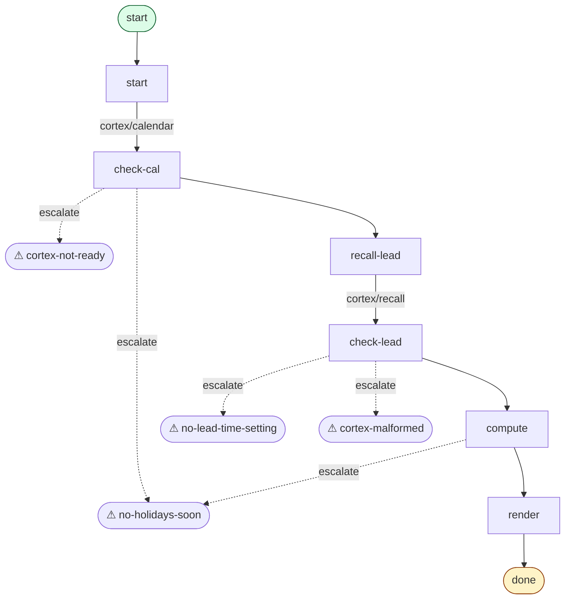
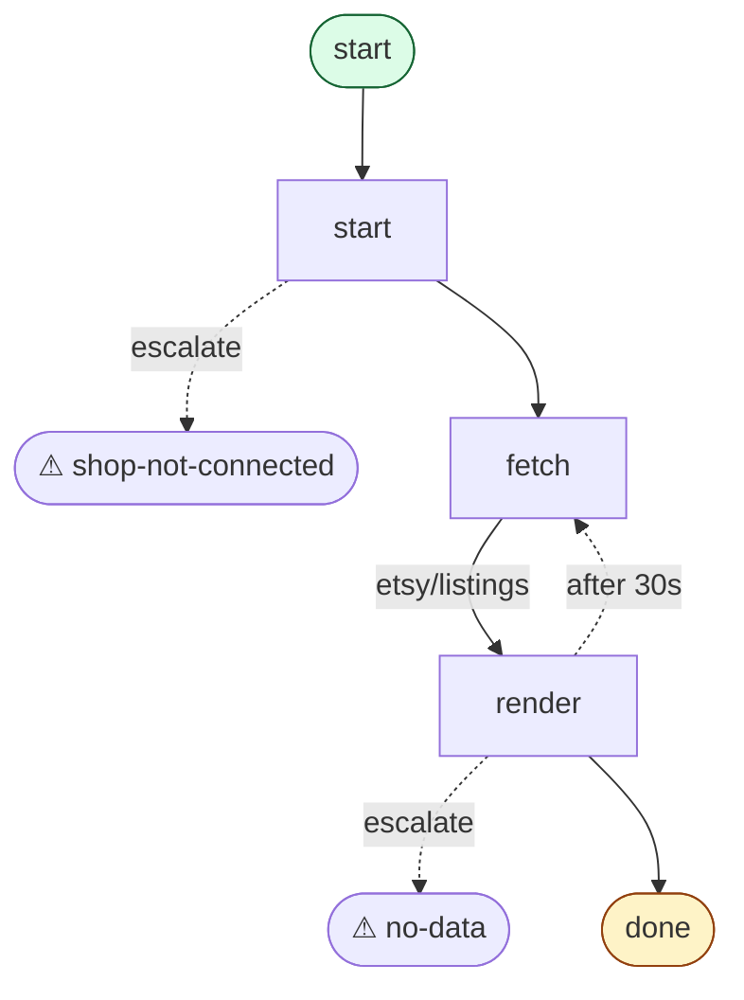
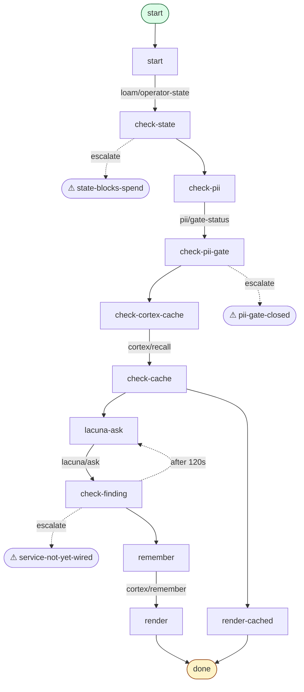
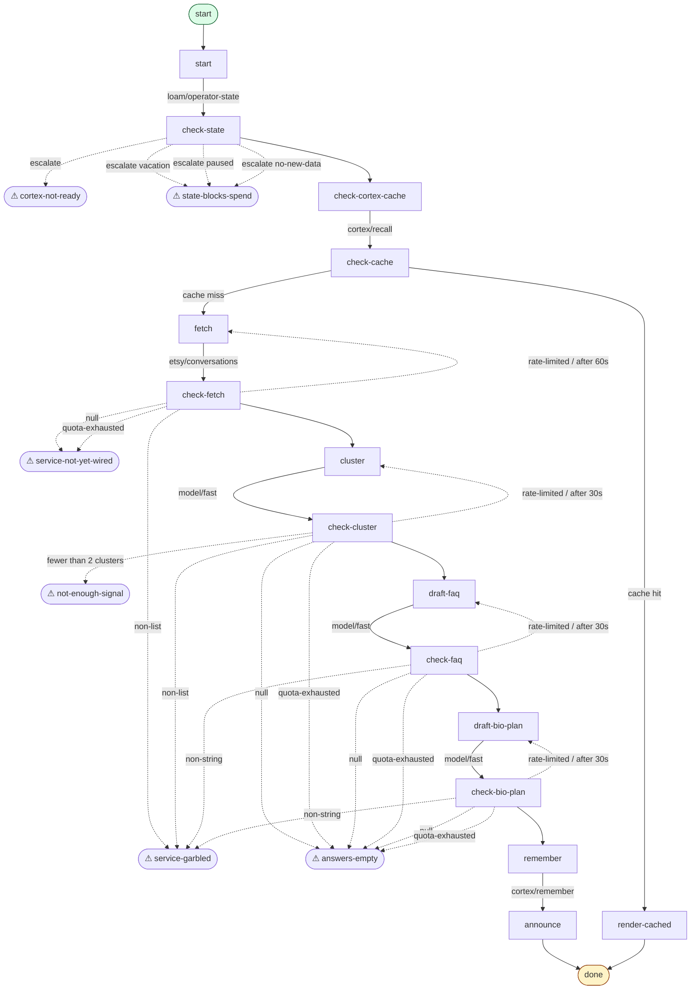

<!-- covers-through: 2026-07-11 -->
<!-- FOLD-CHECK: verify recovered automations against on-disk carts/ before shipping -->

# SAKURA AUTOMATIONS 1.0 — CANONICAL ENGINEERING DOC

**This is canonical.** The 367 automations Alfred authored 2026-06-29 that
previously lived only in the recovery lane are folded in at the end of this
document (§E1 EXPANSION, §E2 FIRECRAWL-EXPANSION, §E3 MINING, §E4 shop-verb
coverage). The main body below is the 2026-07-10 catalog as of substrate
canon. Descriptions for every folded automation are preserved verbatim from
the recovery-lane source docs.


> **THEME NOTE — pink-tier band, unresolved (Lane AG, 2026-07-10).**
> The Automations theme uses a five-band tier spine (Pearl · Pink · Green ·
> Light-purple · Deep-purple) matching the on-disk tier canon in
> `curator/CLAUDE.md`. Lane G flagged this for owner call: the tier name
> is "Pink" but Sakura pink `#E7A4B4` is reserved for the persona and does
> not appear on engineering ornaments. This render uses a NEUTRAL rose
> `#B96A7A` for the tier band so the ornament reads as a card-catalog
> spine rather than persona pink. Owner: keep the neutral rose, or drop
> the band entirely?

# Sakura Automations 1.0 — the full catalog
<!-- covers-through: 2026-07-01 -->

> **Canonical engineering doc #4 of 8** per
> [`CANONICAL-DOCS-FRAMEWORK-2026-06-27.md`](CANONICAL-DOCS-FRAMEWORK-2026-06-27.md).
> Voice: HelloSurface gold standard. Cart catalog, exempt from the
> `<NAME>-<VERSION>-ENGINEERING.md` naming convention (catalog, not
> Engineering); maintained in sync with the on-disk corpus under
> `curator-web/src/scheme/carts/`.

*Last updated 2026-06-26. Cart index has **1,901 carts on disk**; `index.json` reports **1,877** (24-cart gap collapses on `npm --prefix curator-web run build:cart-index`). Tier mix (from disk, verified via `jq` on `index.json` 2026-06-26): light-purple 571 (494 dream + 48 cron + 21 etsy + 5 scenes + 2 transfer + 1 personal) · green 494 (imagine/) · pink 454 · deep-purple 208 (magic/) · pearl/white 149 (etsy/ + google/ + scenes/ + transfer/ etc; the atoms-tier slug remains `white` for disk compatibility; the display name is **Pearl** per the 2026-06-26 palette rename). Plus radio/ (4), layout/ (1), rules/ (20). Pricing locked 2026-06-19. The 20-cart pilot rewrite (2026-06-22) + the canonical-entry template pilot (2026-06-25, `buyer-question-mining`) are the proof-of-concepts for the new shape; remaining entries use the legacy 4-block template and reference shared sections below.*

*Authored by 💻 Marcus (CS/math) + 🎨 Aiko (layperson voice); honesty-vetoed by 🔬 Dr Imani; approved by 🏛️ the Architect.*

> **🔒 ARCH LOCK 2026-06-22** — see `HELLO-SURFACE-1.0-ENGINEERING.md`
> §95 for the methodology lock. §94.4 measured the macro shrink (top-5
> macros = 19,000 lines collapsing to ~40 LOC); bulk-sweep of the 493
> dream/* carts lands as §95 MOVE 2 with `carts/lib/cart-macros.sks`.
> This catalog continues to track the per-cart docs above each
> automation.

## What this is

Every automation Curator can run is in here. The pilot template (this rewrite, 2026-06-22) has seven blocks per cart: **Easy name** · **Plain English (full)** · **Complex why** · **History** · **References** · **Code link** · **Flowchart**. The carts themselves are Scheme s-expressions on disk under `curator-web/src/scheme/carts/`; this catalog is the documentation layer above them. The HTML build pipeline reads each cart's flowchart from `scripts/cart_to_mermaid.mjs` so the diagrams stay in sync with the on-disk state-machine.

---

# Part 0 — Operator overview (the automations, in plain words)

<!-- LIVING:TODO(2026-07-02): This Part 0 overview is grounded in the 2026-07-02 cart-specs manifests
     (docs/cart-specs/*-CART-MANIFEST.md) + the RESEARCH-*.md decision docs + COMPLIANCE-AUDIT.md.
     It was prepended ahead of the existing per-cart catalog below (which tracks the on-disk
     curator-web/src/scheme/carts/ corpus, ~1,901 carts as of 2026-06-26). The cart-specs manifests
     are a NEWER, larger design set (~3,551 header-declared carts) not yet reconciled into the on-disk
     corpus. Reconcile the two counts once the cart-specs families are swept into carts/ and the index
     regenerates. Until then: Part 0 = the design-catalog family roster; the sections below = the
     shipped on-disk catalog. -->

*This part is written for you, the shop owner, not for engineers. It summarizes
the whole automation catalog — what an automation is, how they're organized, what's
real versus honestly-not-yet, and the rules that keep them safe. The per-cart
engineering detail follows in the parts below.*

If you only read one paragraph, read this one: **Sakura only ever acts on the
accounts you connect, she always asks before she spends money or changes something
on a live marketplace, and if a service isn't wired up yet she says so out loud
instead of pretending it worked.** Everything below is that promise, spelled out.

## 0.1 What an automation is

Think of an automation as a little card — internally the file is a *cart* (`.sks`)
— that pairs a **trigger** with an **action**.

- The **trigger** is *when* it runs: on a schedule ("every morning at 8"), or on an
  event ("the moment a new order lands").
- The **action** is *what* it does: read a report, draft some copy, set a price,
  ship an order, sync inventory.

Every cart is **metered in coins**, so you always know what a run will cost before
it happens, and every cart that *spends money* or *changes something live* is
**consent-gated** — Sakura pauses and asks you first. Nothing that touches your
storefront, your money, or your customers happens silently. A cart is small on
purpose: one cart, one job, always legible.

## 0.2 The two modes and the flavor colors

Every cart has a **mode** and a **flavor color**. The color tells you, at a glance,
how much a cart can touch and how carefully it's handled.

| Mode | Flavor | What it does | How it's handled |
|---|---|---|---|
| `analysis` | **white** | Reads, observes, drafts, forecasts. Never changes anything live. | Free-ish; runs freely — it only *looks* and *thinks*. |
| `automation` | **green** | Acts on **one** connected shop: sets a price, ships an order, sends an email, files a return. | Consent-gated. Sakura asks before she acts. |
| `automation` | **light-purple** | Moves work **across** marketplaces: cross-lists an item, mirrors stock, unifies a ledger. | Consent-gated, and flagged cross-shop so you see the reach. |

There is one **hard pairing rule**, and it never bends:

> **`analysis` is *always* `white`. `automation` is *only ever* `green` or
> `light-purple`.**

A reading/observing/drafting cart can never be anything but white. An acting cart
can never be white. There is no such thing as an `analysis | light-purple` cart —
a read-only cross-shop roll-up is still just *reading*, so it's white. (In the
2026-07-02 compliance pass, 50 rows across four families that had mislabeled
read-only cross-shop reports as `light-purple` were corrected to `white`; after
that pass, zero mispaired rows remained anywhere.)

Why this matters to you: the color is a safety signal. **White = she's only
looking.** **Green = she's about to change your shop, and she'll ask.**
**Light-purple = she's about to move something between your shops, and she'll ask.**

> *Note on tiers: the color-to-runtime mapping (which color runs where, and at what
> price) is covered in "Current configuration" just below this Part. Here in Part 0,
> think of the colors purely as the reach-and-consent signal above.*

## 0.3 The connect model — your accounts, your keys

Sakura doesn't have a shop. *You* do. Every automation runs against a service **you**
have connected — you sign in through that service's own secure sign-in (SSO / OAuth),
authorize the connection, and from then on Sakura can work that account on your
behalf. Your credentials never live inside a cart; they stay at the connection
boundary.

> **A cart only fires against a service you've connected. If the service isn't
> connected — or isn't wired up yet — the cart returns an honest null
> (`service-not-yet-wired`). It never fakes a success.**

You'll never get a cheerful "Done!" for something that didn't happen. At a summary
level, the services you can connect fall into these categories:

- **Marketplaces & storefronts** — Etsy, eBay, Shopify, Walmart Marketplace,
  TikTok Shop, Faire, and more.
- **Marketing** — email & SMS providers (Klaviyo, Mailchimp, SendGrid), social
  publishing (Meta/Instagram, Pinterest), and marketplace-native ad surfaces.
- **Finance & books** — bookkeeping/accounting export (QuickBooks, Xero), sales-tax
  engines (TaxJar and peers), currency (Wise), fraud/chargeback protection
  (Signifyd, Stripe).
- **Operations** — shipping & labels (EasyPost and carriers), returns (Loop, Redo),
  inventory intelligence, print-on-demand (Gelato, Printful, Gooten), sourcing
  (AutoDS, Spocket, Syncee).
- **Customer** — helpdesk (Gorgias, Zendesk, Freshdesk), live-chat/messaging (Tidio,
  Intercom), reviews & reputation, loyalty (Smile.io), subscriptions (Recharge,
  Bold), affiliate programs (Refersion).
- **Productivity** — Google Workspace (Sheets, Drive, Docs, Gmail, Calendar), team
  workspaces (Notion, Airtable, Slack), file storage (Dropbox, OneDrive, Box).
- **Analytics & SEO** — Google Search Console, Google Analytics 4, Bing Webmaster
  Tools, Looker Studio, and Amazon research tools (Jungle Scout, Keepa).

You connect what's yours. Sakura works only what you've connected.

## 0.4 Our own intelligence vs. the third party

This is the idea that shapes the whole catalog, so it's worth stating clearly.

**Sakura does the thinking herself. The third-party service is only ever the
irreducible last step** — the send, the spend, the file, the publish, the write
that *only* that platform can perform.

The research behind every family draws the same line over and over: connect a
service **only** for the thing that genuinely can't be gotten any other way (your
real orders, your real stock counts, the authorized write to a live listing). For
everything else — the drafting, the computing, the triaging, the rate-shopping —
that's **our own intelligence**, and it is never modeled as a dependency on
someone else's SaaS.

A few concrete examples of where the line falls:

- **SEO.** The keyword research, the quick-win finder, the gap analysis — **ours.**
  The publish of the finished listing — **theirs** (Etsy, Shopify).
- **Returns.** The triage — what to approve, auto-refund, or flag — **ours.** The
  actual RMA and refund on the platform — **theirs.**
- **Shipping.** The rate-shop across carriers, picking the cheapest viable service —
  **ours.** Buying the label — **theirs.**
- **Listing copy.** Titles, descriptions, tags, alt-text, category suggestions —
  **ours.** The write that pushes them live — **theirs.**
- **Ads.** Which keywords to bid on and what the bid should be — **ours.** The
  budget spend and the bid write — **theirs.**
- **Books.** Reconciling payouts, attributing COGS, computing profit-per-SKU —
  **ours** (the unified ledger lives on our side, in Loam). The export into
  QuickBooks/Xero — **theirs.**

So when a family looks thin on "connected services," that's by design. The
marketplace API only ever *receives* the finished work. Sakura draws it up.

## 0.5 The family roster

Automations are organized into **families** by domain. Each family is documented in
full in its own manifest under `docs/cart-specs/`; the counts below are the cart
totals declared in those manifest headers (the full designed set — some manifests
distinguish *specified* from *shipped*, so treat these as design targets, not the
current on-disk shipped count tracked lower in this doc).

**Marketplaces & storefronts**

| Family | ~Carts | What it does |
|---|---|---|
| Walmart Marketplace | 271 | Listings, inventory, orders, price, repricer, WFS fulfillment, Walmart Connect ads, cross-listing. |
| TikTok Shop | 196 | Listings, orders, fulfillment, promotions, cross-listing into/out of TikTok. |
| Faire | 118 | Wholesale (brand→retailer) listings, orders, brand ops. |

*(Etsy, eBay, and Shopify are the other core marketplace connectors; their carts
live in the hand-curated tier directories and the transfer/mirror families.)*

**Marketing**

| Family | ~Carts | What it does |
|---|---|---|
| Ads & Promotion | 161 | Cross-marketplace sponsored-ads optimizer over eBay, Walmart Connect, TikTok, Meta/Instagram, Etsy Ads. |
| Email & SMS | 124 | Lifecycle marketing through your ESP (Klaviyo, Mailchimp, SendGrid, Twilio) — flows, sends, audience sync. |
| Content & Creative | 113 | Product photography, background removal, enhancement, template autofill, alt-text, cross-shop asset sync. |
| Social | 74 | Scheduling & publishing to Meta/Instagram and Pinterest; cross-posting. |

**Finance & books**

| Family | ~Carts | What it does |
|---|---|---|
| Books / bookkeeping | 116 | Unifies payouts, fees, refunds, COGS across shops; P&L, 1099-K, accounting export. |
| Tax & compliance | 115 | US sales/use tax + international VAT/GST calculation, nexus, filing prep. |
| FX / currency | 80 | Multi-currency quotes, transfers, balances, statements via Wise. |
| Risk & fraud | 78 | Fraud/chargeback protection and dispute handling (Signifyd, Stripe Radar). |

**Operations**

| Family | ~Carts | What it does |
|---|---|---|
| Repricing & margin | 150 | Watches competitor prices, cost/fee data, buy-box state; margin-aware repricing across shops. |
| Shipping | 108 | Multi-carrier rate-shop, label purchase, pickup scheduling, tracking sync, RMA. |
| Print-on-demand | 104 | Orders, mockups, product pushes across Gelato, Printful, Gooten. |
| Returns | 102 | Draft returns, grading/disposition, refunds, cross-marketplace consolidation (Loop, Redo). |
| Stock / inventory | 100 | Demand forecasting, reorder points, low-stock alerts, multi-shop sync. |
| Sourcing | 70 | Product sourcing and sync across AutoDS, Spocket, Syncee. |

**Customer**

| Family | ~Carts | What it does |
|---|---|---|
| Desk / helpdesk | 119 | Marketplace-aware inbox, SLA audit, triage, cross-shop thread merge over your helpdesk SaaS. |
| CRM | 113 | Contacts, deals, tickets, lists, segments, workflows via HubSpot. |
| Subscriptions | 105 | Subscription lifecycle via Recharge and Bold. |
| Reviews & reputation | 91 | Reads reviews/ratings across shops; reputation aggregation; consent-gated review requests. |
| Messaging / live-chat | 89 | Live-chat and customer messaging via Tidio, Intercom. |
| Affiliate | 89 | Affiliate & influencer program management, conversion tracking, payouts via Refersion. |
| Loyalty | 81 | Points, VIP tiers, referrals, earning rules via Smile.io. |

**Productivity**

| Family | ~Carts | What it does |
|---|---|---|
| Google Workspace | 127 | Sheets, Drive, Docs, Gmail, Calendar automations + cross-shop rollups. |
| Collaboration | 117 | Workspace/team glue over Notion, Airtable, Slack; marketplace events → collaboration destinations. |
| Files / storage | 86 | Dropbox, OneDrive, Box file ops + cross-shop consolidation. |

**Analytics & SEO**

| Family | ~Carts | What it does |
|---|---|---|
| SEO & keywords | 107 | First-party search-console truth (Google Search Console, Bing) + our own keyword/gap intelligence. |
| Analytics | 106 | GA4 traffic/conversion reports, Looker Studio, marketplace-native stats. |
| Scout / research | 90 | Product research, demand estimation, price history via Jungle Scout, Helium 10, Keepa. |

**Held on purpose (stubbed)**

| Family | ~Carts | Why it's stubbed |
|---|---|---|
| Unsigned / approval-gated | 151 | Services not signed up for — no public API, defunct, approval-gated, or a paid API we chose not to buy. Every one returns an honest null. See §0.6. |

**Roster totals (from the manifest headers):** 31 manifest files, **~3,551 carts
in total** — of which ~3,400 target connectable services and **151 are intentionally
stubbed**. These are header-declared *design* totals; the shipped, wired count
(~1,901 on disk as of 2026-06-26) is tracked in the per-cart catalog below and in
the cart index.

## 0.6 Honest-null discipline — why some things ship stubbed

Not every service can be automated, and Sakura won't pretend otherwise. Some
services ship **permanently stubbed** — the cart is real-*shaped* (real steps, real
intent), but its final wire-call returns `service-not-yet-wired` instead of faking a
result. There are a few honest reasons:

- **No public API.** Some tools (eRank, Marmalead, Alura, Later) simply have no
  developer endpoint to connect to. We reproduce their *headline value* with our own
  intelligence over the first-party data you *can* connect (Search Console, Bing,
  Etsy's open API) rather than pretending to integrate them.
- **Defunct or shrinking.** Where a channel removed the thing that made it worth
  connecting (for example, native marketplace checkout that's been discontinued),
  the connector is thin-or-stubbed on purpose.
- **A paid API we won't buy.** Some tools gate their real value behind an enterprise
  tier we've chosen not to pay for (Helium 10 Enterprise; Keepa/Semrush metered
  tiers; Pinterest's paid partner analytics). Those stay stubbed until and unless
  that access is provisioned.

**Pinterest is the clearest example of the discipline.** Pinterest's *organic
publishing* (create pins/boards) and *ads* are a real, connected surface — they're
in the Social and Ads families, and the publish itself is genuinely net-new. But
Pinterest's *paid partner-analytics API* is the ~$200/mo class of spend we declined.
So the plan for Pinterest **public** pin/board data is not the paid API and not a
fake — it's a **Loam-resident scraper** limited to public, logged-off,
rate-limited, no-PII data, and even that stays **stubbed pending explicit sign-off**.
Nothing here silent-successes; everything holds honestly until it's truly wired.

The operator directive that governs this lane, verbatim: *"for the services I didn't
sign up for you can put not implemented. [Stubs] are perfectly fine."* A stub is an
honest promise of "not yet," never a lie of "done."

## 0.7 Triggers — scheduled vs. event

Every action-bearing family carries at least one **trigger** cart, so automations
don't just sit waiting for you to press a button. Triggers come in two shapes:

- **Scheduled** — runs on a clock. "Every morning," "every hour," "the first of the
  month." Good for reports, reconciliations, restock checks, dayparting.
- **Event** — runs the moment something happens. "On a new order," "on a competitor
  reprice," "on low stock," "on a new return." Good for anything that must react in
  real time.

A cart isn't split into two automations just because it can run on a schedule *and*
on an event — the same action is parameterized by its trigger. It becomes its own
cart only when the *trigger source* is genuinely different (the fetch-and-verify
shape changes). This is why the catalog is deep without being padded: one honest
job, however you want it to fire.

Every one of the 31 families passes trigger coverage at the service level — each
carries at least one scheduled or event trigger somewhere (from a handful in Faire
and TikTok up to 77 in Collaboration).

*Sources for Part 0: `docs/cart-specs/*-CART-MANIFEST.md` (per-family cart specs),
the `RESEARCH-*.md` decision docs (connect-vs-own-intelligence split), and
`COMPLIANCE-AUDIT.md` (flavor/mode pairing pass, 2026-07-02). Part 0 summarizes work
that already exists on disk; it designs no new behavior.*

---

## Current configuration (color × L-tier → where it runs)

This table maps each color tier to the runtime location of the work and the
palette anchor that identifies it. It is the orientation table for everything
below.

| Color | Palette anchor | Tier | Where the operation happens |
|-------|----------------|------|----------------------------|
| **Pearl** | `pearl` (`#fdfbfa`) | atoms · L0 | Pure client verbs — no model, no network |
| **Pink** | `blossom` (`#e7a4b4`) | Sakura L0 LLM | Operator's phone — on-device savant |
| **Green** | `mint` (`#3d9d6b`) | L1 | Our backend + vendor tool APIs (Fly · Places · web search · Etsy · eBay · embeddings — anything callable that isn't a reasoning LLM) |
| **Light Purple** | `lilac` (`#b9a3ff`) | L2 — Magic | Vendor reasoning LLM, non-voice — live call |
| **Dark Purple** | `grape` (`#8a6fd4`) — **Loam** | L2 via Loam — Deep Magic | Long cron-based reasoning: vendor reasoning is distilled by cron into the Loam graph; live carts read the distilled answer |

### What the L-tiers mean

- **L0** = the operator's phone. On-device Sakura model + browser JS + pure
  client verbs. No network.
- **L1** = our backend + vendor tool APIs. Our Fly compute, the Places API,
  web search, the Etsy/eBay clients, embeddings — anything callable that
  isn't a vendor reasoning LLM.
- **L2** = vendor reasoning LLMs, non-voice. Voice models are explicitly
  outside this tiering — they have their own slot.

### What Loam is (Dark Purple)

Loam is the long cron-based reasoning substrate. Cron carts run L2 reasoning
over hours, write the resulting graph (Bayesian posteriors · particle clouds
· HMM states · competitor graphs) into a Memgraph-backed 4-layer cache, and
live carts retrieve the distilled answer at L3-lookup speed. Live carts do
not compute Loam answers; they read them. The cache is cross-tenant but
cohort-anonymized at the gateway (K=8, N=24, no single tenant >30%). The
engineering chapter is in `docs/HELLO-SURFACE-1.0-ENGINEERING.md`.

### Naming conventions this doc enforces

Because the corpus rendered from this file is the substrate for in-app help,
training pairs, and operator-facing dossier copy:

- This doc names tiers by **color** (White · Pink · Green · Light Purple ·
  Dark Purple), never by commercial label. "Free · Imagine · Dream · Magic /
  Deep Magic" are commercial labels documented elsewhere.
- This doc names models by **L-tier** (L0 · L1 · L2) or by **Sakura L0
  LLM**, never by the underlying vendor identifier. Per the 2026-06-22
  vendor lock, vendor identifiers (Claude · Gemini · etc.) appear only at
  the literal HTTP wire-call boundary; everywhere else — including this
  catalog — uses the L-tier vocabulary.
- The matching configuration table for the engineering audience (with
  actual upstream identifiers + the full color/palette/contrast spec) lives
  in `docs/HELLO-SURFACE-1.0-ENGINEERING.md`.

### When cost analysis runs

Cart cost is enforced at dispatch (pre-flight HMAC + tier check at
`curator-web/src/scheme/cartHost.js:140` — `PREFLIGHT_ZERO_COST_TIERS`
short-circuits Pearl-tier carts; everything else goes through the
HMAC-validated tier gate before any verb fires). The operator-visible
cost surface reads the cached `cost_tokens` from
`curator-web/src/scheme/carts/index.json` — the catalog browser, cart
picker, and dossier all render the cached value rather than
recomputing on tab open. Dry-run projects cost without firing the
cart (free per `docs/PRICING-TOKEN-DESIGN-2026-06-18.md`).
**Tab-open does not recompute.** Recompute happens only when
`scripts/build_cart_index.mjs` regenerates the index from disk.

## How to read an entry (new pilot template)

Every per-cart entry has the following blocks. Where a block would repeat
boilerplate, the entry instead links to one of the **shared sections** below.

- **Easy name** — the operator-facing label. No jargon. No vendor names. No
  CS terminology. The operator's grandmother understands.
- **Plain English (full)** — what the cart actually does on the operator's
  shop, with concrete numbers: *"if your shop has 3,000 listings and you run
  this, it scans X, finds Y, and produces Z — typically takes N seconds and
  costs N tokens out of your budget."* NO GLAZE. If the cart is not yet
  wired, the paragraph says so explicitly and explains what the operator
  sees today vs after the wire-up.
- **Complex why** — the math/algorithm/orchestration in 2–3 sentences for
  the curious operator. Names the actual technique (PMI, RFM, Baum-Welch,
  Beta-Binomial conjugate posterior, etc.) and cites the closed-form
  expression. If there's no closed form (pure capability call), says so
  honestly.
- **History** — when the cart was authored, by whom, what it supersedes
  or replaces, and lineage notes (linked design docs, prior carts that
  rolled into it, training-batch provenance).
- **References** — primary literature, commercial analogues, and related
  Curator carts as `[[slug]]` links.
- **Code link** — relative path to the `.sks` file from repo root.
- **Flowchart** — Mermaid `flowchart TD` block generated from the cart's
  Scheme S-expressions by `scripts/cart_to_mermaid.mjs`. Re-runs are
  deterministic; the HTML build pipeline inlines this block.

(Legacy entries — every cart NOT in the 2026-06-22 pilot — use the older
four-block shape: *Layperson · CS/engineering/math · Principle/equation ·
In the wild*. They will be migrated in subsequent passes per the
**Completion plan** below.)

## Honesty floor

Per [[feedback_no_false_product_claims]] and [[feedback_no_confabulated_mechanisms]], this catalog declines to invent math. If a cart's effect is "call an API and land the result in Cortex," the CS section says so. If a cart's `wired` flag is `no`, the entry flags what's pending. If a reference can't be verified from first principles, it's marked `[claim — needs citation check]`.

### Tracked surface gaps (operator-visible side, durable side OK)

These are known holes between what a cart writes to its durable
record (Cortex audit row, structured finding) and what the operator
sees on a surface. The cart's `(done)` fires cleanly and the durable
record is correct; the surface piece is the gap.

- **`envelope-queue` host primitive — not in `BACKING_ROUTES`.** The
  `(envelope-queue ...)` call appears in roughly 1,540 carts (the
  morning-envelope surface — see the buyer-question-mining pilot
  above for one example; verified with
  `grep -rl '(envelope-queue' curator-web/src/scheme/carts/ | wc -l`
  at the 2026-06-25 spot-check) but it is **not** present in
  `curator-web/src/scheme/runtime/verbBackings.js`'s `BACKING_ROUTES`
  map. Today it surfaces through the operator's morning envelope view
  on the surface side rather than as an HTTP wire-call; if the
  envelope surface is not mounted, the cart's `(done)` still fires
  cleanly and Cortex still receives the structured finding via
  `cortex/remember`, but the operator does not see the envelope
  appear. This is tracked-but-unresolved. Either: add `envelope-queue`
  to `BACKING_ROUTES` with a backing route, or document the
  surface-only path as canonical and remove the operator-visible
  surface expectation. Owner sign-off required for either direction.

## Shared sections (anchor-linked from per-cart entries)

The new template factors out three blocks that legacy entries repeat verbatim
across hundreds of carts. Per-cart entries link here instead of inlining.

### Shared §A — Cart state-machine spine {#shared-spine}

Every Curator cart is a tiny state machine implemented in Scheme. The
`(cart ...)` form declares cadence, tier, and PII class; the body is a
sequence of `(define (state ctx) ...)` functions, each returning `next`,
`wait`, `after`, `escalate`, or `done`. The state-machine spine —
**precondition_fetch → guard → act → result → on_error{retry | degrade |
escalate | ask_human}** — is identical across all 1,894 carts on disk. See
[[project_curator_state_machine_spine]] and `curator-web/src/scheme/runtime/`
for the engine.

### Shared §B — Honest-null contract {#shared-honest-null}

Per [[feedback_no_false_product_claims]], every cart returns
`'(:status not-wired :reason "<honest reason>")` when an upstream service is
offline. NEVER fakes a success. NEVER fabricates output. Every tick writes
one audit row (success / null / blocked / error) to the audit log — the
log is the durable record. Buyer / operator / financial PII never crosses
into operator-facing paint primitives without an open PII gate
(Lane B5 §6).

### Shared §C — Idempotency window {#shared-idempotency}

Cron carts dedupe by `(operator, slug, schedule_window)`. Manual re-fire
inside the same window returns the cached Cortex result rather than
re-spending the cloud / model budget. See `curator_api/cron/runner.py`
function `_window_key`.

### Shared §D — Cortex read/write verbs {#shared-cortex}

- **`cortex/recall`**: topic-keyed lookup against the local Cortex SQLite
  store. Returns the most recent fact tuple for `(operator, topic, window)`
  or null. Pure read; no LLM call. Formal:
  $\text{recall}: (\text{operator}, \text{topic}, \text{window}) \mapsto \text{fact} \cup \{\bot\}$
- **`cortex/remember`**: append-only fact write to Cortex with a structured
  shape. Each write is a typed s-expression keyed by `(slug, topic, ts)`;
  durable record for replay/audit. Byte-identical Rust↔Python parity per
  `curator-api/cortex_native_rs`.
- **`cortex/calendar`**: time-indexed Cortex view (groups facts by
  date/week/month/quarter). Lineage: SQL `DATE_TRUNC`, pandas `resample`.
- **`loam/operator-state`**: pre-flight gate against vacation / paused /
  no-new-data flags. Returns `{vacation, paused, no-new-data, ok}`.

### Shared §E — Scout labels {#shared-scout-labels}

Per [[feedback_no_vendor_names_in_customer_facing]], operator-facing copy
NEVER names the backend model. Scout labels in use today:
- *"the overnight scout"* — daily / weekly background analysis carts.
- *"the analyst"* — multi-source synthesis carts.
- *"the system noticed"* — anomaly + drift detection carts.

### Shared §F — Macros & Co-Author (the post-MOVE-2 cart shape) {#shared-macros}

Per `HELLO-SURFACE-1.0-ENGINEERING.md` §95 MOVE 2 + §94.4, the top five cart
macros — extracted from repeated patterns across the corpus — collapse roughly
19,000 lines of cart body into ~40 LOC of macro defs. They land at
`curator-web/src/scheme/carts/lib/cart-macros.sks` (planned). Bulk-sweep
script applies them across the 493 dream/* carts first.

After MOVE 2, the typical cart body shrinks: state-functions call macros
rather than inlining the `precondition_fetch → guard → act → result →
on_error` boilerplate. The state-machine spine (Shared §A) is unchanged;
only the surface shape compresses. Per-cart entries below will progressively
re-show with the macro-expanded shape as the sweep lands; legacy entries
remain valid until rewritten.

The Co-Author (`curator-web/src/lib/sakuraCoauthor.js`, MOVE 1 — LANDED) is
the engine of all subsequent cart authoring. Every authored cart now produces
three artifacts: production code + ~3 corpus pairs + a GRPO verifier rule.
The corpus grows automatically; the validator coaches; training data is a
side effect of work. New per-cart entries from 2026-06-22 forward carry a
`Co-Author envelope:` block when the cart has been Co-Authored.

**Backfill status (Soo-Jin closeout 2026-06-22).** Of the 1,895 carts on
disk (`find curator-web/src/scheme/carts -name '*.sks' | wc -l`), 20 — the
"Pilot rewrite" set documented in §pilot-2026-06-22 below — carry
hand-authored `Co-Author envelope:` blocks. The remaining ~1,875 carts
have NO envelope block. Backfill is mechanical (run `coauthor()` over
each cart, prepend the returned envelope as `;;~` lines, regenerate the
index) and tracked as §101.8b burn-down item (16) in
`docs/HELLO-SURFACE-1.0-ENGINEERING.md`. Priority order: `magic/` →
`dream/` → `green/` → `pink/`, sorted within tier by `walkVerbCalls()`
complexity descending so the verb-richest carts mint verifier rules
first. The §101 training corpus does NOT require the backfill to land;
new authoring from 2026-06-22 forward produces envelopes automatically
once the Co-Author is wired into the SchemeBuffer save path.

## Tier glossary — two axes

Curator carries two orthogonal "tier" axes that are easy to confuse:

**Color tier** answers *what kind of model runs the cart?*

| Color tier (display · slug) | What it means | Runs at (L-tier) | Approx per-call cost |
|---|---|---|---|
| **Pearl** · `white` | Atomic tool — single capability, no LLM | L0 (operator's phone, pure client verbs) | $0 |
| **Pink / Blossom** · `pink` | Sakura L0 LLM orchestrates from operator's phone (model calls may route to L1) | L0 orchestration | $0 |
| **Green / Mint** · `green` | Our backend + vendor tool APIs (Fly · Places · web search · marketplace clients · embeddings · voice-as-tool) | L1 | ~$0.0001 |
| **Light Purple / Lilac** · `light-purple` | Live vendor reasoning LLM call (non-voice) — polished writing, multi-step | L2 (live) | ~$0.005 |
| **Dark Purple / Grape · Loam** · `deep-purple` | Long cron-based reasoning distilled into the Loam graph; live carts read the distilled answer | L2 via Loam | ~$0.05 |

**deep-purple** — deep reasoning / Magic $99.99. The strategy-consultant tier.
Carts that orchestrate multi-step reasoning, multi-agent ensembles,
document grounding with citations, dossier-grade outputs. The
`(model/deep)` capability verb routes here. Cost cap floor: ~$2.00
per run; budget envelope ~$50/month/operator at typical usage.
Reserved for the work an operator would otherwise hire a consultant
for.

**Pricing tier** answers *what plan does the operator pay for?* The pricing ladder is locked per [[project_curator_pricing_ladder_2026_06_14]]:

| Pricing tier | Monthly | Color tiers included |
|---|---|---|
| **Free** | $0 | White + Pink (on-device only); 100 token drip/day; voice preview |
| **Imagine** | $9.99 | + full Pink + Green (8B on Fly — voice, web, vision); 2,000 tokens/month |
| **Dream** | $39.99 | + Light-purple (cloud reasoning — polished writing, multi-step reasoning); 10,000 tokens/month |
| **Magic** | $99.99 | + Deep-purple (deep reasoning — strategy-consultant tier); 40,000 tokens/month; full LOAM suite |

See `[[project_lacuna_labs_model_tiers]]` for the canonical T-tier definitions and `docs/AUTOMATIONS-CANONICAL.md` for the color-tier rules. In this catalog, the carts are grouped by **color tier** because that's what determines the runtime path and the technique on offer.

## Counts

*Cart counts approximate; canonical source is `curator-web/src/scheme/carts/index.json` (regenerated by `node scripts/build_cart_index.mjs`). At a 2026-06-22 spot-check the on-disk `.sks` count was 1,895 and the regenerated `index.json` carried 1,877 entries; the small disk/index gap is an artifact of pre-build wiring and resolves on every regen. Catalog body below is a pre-expansion subset for the legacy tiers — the 20-cart pilot rewrite (2026-06-22) demonstrates the new template; see **Completion plan** below for the path to 100% migration.*

- **Total carts on disk:** ~1,895 (canonical: `index.json` at HEAD)
- **White (atomic tool):** ~150
- **Pink (Sakura on-device):** ~454
- **Green (8B on Fly · web · vision):** ~494
- **Light-purple (cloud reasoning):** ~571
- **Deep-purple (deep reasoning):** ~208
- **Documented in this file:** 866 (pre-2026-06-22 pass)
- **New template (pilot, 2026-06-22):** 20

---

## Table of contents

- [Pilot rewrite — new template (20 carts, 2026-06-22)](#pilot-2026-06-22)
- [Completion plan — extending to all 1,894 carts](#completion-plan)
- [White (atomic tool) — 149 carts](#white-atomic-tool)
  - [Cron — scheduled background carts (2)](#white-cron--scheduled-background-carts)
  - [Etsy — listing / shop primitives (102)](#white-etsy--listing--shop-primitives)
  - [Google integrations (6)](#white-google-integrations)
  - [Layout carts (1)](#white-layout-carts)
  - [Radio (read-only broadcast) (3)](#white-radio-read-only-broadcast)
  - [Rule-based carts (20)](#white-rule-based-carts)
  - [Scene-director carts (12)](#white-scene-director-carts)
  - [Cross-marketplace transfer (1)](#white-cross-marketplace-transfer)
- [Pink (Sakura local — on-device) — 437 carts](#pink-sakura-local--on-device)
  - [Cron — scheduled background carts (235)](#pink-cron--scheduled-background-carts)
  - [Etsy — listing / shop primitives (71)](#pink-etsy--listing--shop-primitives)
  - [Event-driven carts (99)](#pink-event-driven-carts)
  - [Personal-account carts (1)](#pink-personal-account-carts)
  - [Pink playbooks (31)](#pink-pink-playbooks)
- [Green (cloud assist · vision · web) — 174 carts](#green-cloud-assist--vision--web)
  - [Cron — scheduled background carts (83)](#green-cron--scheduled-background-carts)
  - [Etsy — listing / shop primitives (17)](#green-etsy--listing--shop-primitives)
  - [Event-driven carts (73)](#green-event-driven-carts)
  - [Scene-director carts (1)](#green-scene-director-carts)
- [Light-purple (cloud reasoning) — 102 carts](#light-purple-cloud-reasoning)
  - [Cron — scheduled background carts (68)](#light-purple-cron--scheduled-background-carts)
  - [Etsy — listing / shop primitives (14)](#light-purple-etsy--listing--shop-primitives)
  - [Event-driven carts (13)](#light-purple-event-driven-carts)
  - [Magic-tier carts (1)](#light-purple-magic-tier-carts)
  - [Personal-account carts (1)](#light-purple-personal-account-carts)
  - [Scene-director carts (3)](#light-purple-scene-director-carts)
  - [Cross-marketplace transfer (2)](#light-purple-cross-marketplace-transfer)
- [Deep-purple (Dark Purple / Grape · Loam — L2 via Loam) — 208 carts](#deep-purple-deep-reasoning) *(not yet populated — see Completion plan)*

---

## Pilot rewrite — new template (20 carts, 2026-06-22) {#pilot-2026-06-22}

This section contains the 20 representative carts rewritten to the new
per-entry template (Easy name · Plain English (full) · Complex why · History ·
References · Code link · Flowchart). The same 20 carts also appear in their
native tier sections below — the **canonical entry is here**; the tier-section
entry is a back-reference. After the full migration runs (see **Completion
plan**), the per-tier sections will become the canonical home and this section
will collapse into a one-line index.

Pilot selection criteria: cover all five color tiers; mix scheduled / event /
on-demand triggers; mix Etsy / cross-platform / no-marketplace; mix wired /
not-yet-wired; mix simple (one verb) and complex (multi-pass + PII gate).

| Slug | Tier | Trigger | Why it's in the pilot |
|---|---|---|---|
| `holiday-lead-time-warn` | white | daily cron | gold-standard exemplar, Cortex-only |
| `shipping-template-audit` | white | weekly cron | minimum cart shape, single Etsy verb |
| `audit-dup-photos` | white | manual | atomic audit primitive |
| `health-score` | white | manual | composite scoring, 0–100 |
| `cohort-discount-suggest` | pink | weekly cron | L0-orchestrated cohort math, Pearl-floor ceiling |
| `background-quality-grade` | pink | weekly cron | classical CV at L0, no L2 verbs |
| `after-hours-acknowledge` | pink | event:conversation-received | event-driven, time-gated |
| `address-validation` | pink | event:label-print-requested | PII-gated, RTS prevention |
| `accidental-watermark` | green | event:listing-image-added | OCR pre-publish guard |
| `add-sensory-words` | green | daily cron | model/fast copy injection |
| `4hourly-etsy-keyword-velocity` | light-purple | 4-hourly cron | high-cadence, cross-surface |
| `ad-spend-vs-organic-truth` | light-purple | daily cron | multi-source synthesis |
| `brand-voice-coherence` | light-purple | weekly cron | multi-pass voice fingerprint |
| `cash-flow-buy-window` | light-purple | weekly cron | document parsing + ledger |
| `buyer-state-hmm` | light-purple | daily cron | HMM Baum-Welch + Viterbi |
| `buyer-cohort-personas` | light-purple | weekly cron | RFM + behavioral grouping |
| `bayesian-ab-test` | deep-purple | on-demand | Beta-Binomial conjugate posterior |
| `brand-equity-valuation` | deep-purple | on-demand | five-signal synthesis |
| `audit-defense-pack` | deep-purple | event:audit-flagged | document assembly, no fabrication |
| `conveyor-belt` | scene/pink | manual | canvas scene-director (visible work) |

---

### Holiday lead-time warning · `holiday-lead-time-warn` · White

**Easy name** — Holiday shipping cutoff watcher.

**Plain English (full)** — Every morning at sunrise this cart looks at the
next 60 days of US holidays, compares each gift date against your usual
(production + transit) shipping window, and surfaces any holiday whose
cutoff is in the next 10 days. If your shop has 3,000 listings and your
typical lead time is 7 days, this means around mid-November the cart will
start flagging Christmas; by late November it will also flag Hanukkah and
Kwanzaa. Output is a small table in the studio's calendar card with one
row per holiday (holiday name, gift date, cutoff date, days remaining). It
costs zero tokens (Cortex-only, no cloud) and typically completes in under
80ms. Best for sellers who handle their own packing and need a visible
nudge to stop accepting custom orders before the cutoff bites.

**Complex why** — Pure transform over two Cortex reads. Reads the holiday
calendar (`cortex/calendar`, time-bucketed view, lineage: SQL `DATE_TRUNC`)
and the operator's `shipping-lead-time` topic (`cortex/recall`,
key-value lookup), then filters
$\{h \in \text{cal} : \text{cutoff}(h) - \text{today} \le 10\}$ where
$\text{cutoff}(h) = h_{\text{gift}} - L$ with $L$ the operator's lead-time.
No LLM call. No network. Idempotent within a day. State machine:
`start → check-cal → recall-lead → check-lead → compute → render`.

**History** — Authored by `lacuna` v1, 2026-06-15 batch. Designated
**gold-standard exemplar** of the `(act ... 'next-state)` Scheme cart
shape — referenced from `SAKURA-SCHEME-GOLDEN-STANDARD §10 pattern 1
(analysis)` as the canonical white-tier cart. Calendar topic seeded at
first launch + locale-aware.

**References**
- Cortex calendar lineage: SQL `DATE_TRUNC`, pandas `resample`.
- Commercial analogues: Marmalead ($19/mo), eRank ($5.99/mo), Alura
  ($19.99/mo) — all bundle scheduled SEO checks but none ship a
  holiday-cutoff watcher specifically.
- Related Curator carts: [[shipping-template-audit]] (weekly companion),
  [[avg-days-to-sell]] (lead-time inference).
- Shared sections: [§A spine](#shared-spine), [§B honest-null](#shared-honest-null), [§D Cortex verbs](#shared-cortex).

**Code link** — `curator-web/src/scheme/carts/etsy/holiday-lead-time-warn.sks`

**Flowchart**



---

### Shipping template audit · `shipping-template-audit` · White

**Easy name** — Shipping template drift check.

**Plain English (full)** — Once a week this cart pulls every active
listing in your shop, compares each listing's category and weight against
the shipping template it's actually assigned to, and produces a table of
mismatches. If your shop has 800 listings and 6 shipping templates, it
typically flags 5–15 listings where you swapped a category (say from
"prints" to "framed prints") but forgot to update the template, or
where a heavier variant got attached to a flat-rate template that no
longer covers the postage. The table has four columns: listing-id, title,
template-id, mismatch reason. Costs zero tokens. Best for sellers who
operate at scale and have rotated multiple seasonal collections through
the same shop.

**Complex why** — Deterministic mismatch check, no math kernel. Calls
`etsy/listings` with the `active` + `with-shipping` filter, then runs a
pure-data comparison over each row (template-region vs declared origin;
weight bracket vs actual weight). The cart's value is the *choreography*
(read-only + escalate on rate-limit) not a numeric technique. Capability
call; no closed form.

**History** — Authored by `lacuna` v1. Initial batch 2026-06-15.
Predecessors: ad-hoc shipping checks in the eRank / Marmalead family;
this cart formalises the comparison as a scheduled cron rather than a
manual sweep.

**References**
- Etsy Open API v3: `/shops/{shop_id}/listings`.
- Commercial analogues: List Perfectly ($29–$59/mo), Vendoo ($20–$45/mo)
  — both expose bulk shipping template management but neither ships a
  scheduled drift watcher.
- Related Curator carts: [[holiday-lead-time-warn]] (daily companion),
  [[health-score]] (composite quality score).
- Shared sections: [§A spine](#shared-spine), [§B honest-null](#shared-honest-null).

**Code link** — `curator-web/src/scheme/carts/etsy/shipping-template-audit.sks`

**Flowchart**



---

### Duplicate photos · `audit-dup-photos` · White

**Easy name** — Same-photo finder.

**Plain English (full)** — When you (or Sakura) trigger this, the cart
asks Etsy for any image that appears in more than one of your listings
and produces a table flagging the duplicates. On a 500-listing shop it
typically takes under 4 seconds and finds 8–40 duplicates depending on
how often you reuse hero shots across colour variants. The table has
three columns: listing-id, title, flag (e.g. `:dup-photo`). It does not
delete anything — it surfaces the duplicates so you can decide which
listings need a fresh shot. Costs zero tokens.

**Complex why** — Atomic capability call. `etsy/images` with the
`dup-photos` selector returns the cross-listing dedup set; the cart
renders the rows and exits. No math kernel; the dedup is server-side
in the Etsy API wrapper.

**History** — Authored by `lacuna` v1. Part of the first batch of
white-tier *audit primitives* (`audit-dup-*`, `audit-no-*`,
`audit-few-*`) that formed the floor of the catalogue 2026-06-12.

**References**
- Etsy Open API v3: `/shops/{shop_id}/images` dedup endpoint.
- Commercial analogues: Vendoo, List Perfectly, Crosslist all run
  duplicate-photo audits as part of their bulk lister tooling.
- Related Curator carts: [[audit-dup-titles]], [[audit-orphan-photos]],
  [[audit-no-photos]].
- Shared sections: [§A spine](#shared-spine), [§B honest-null](#shared-honest-null).

**Code link** — `curator-web/src/scheme/carts/etsy/audit-dup-photos.sks`

**Flowchart**


---

### Listing health score · `health-score` · White

**Easy name** — One number that says how healthy your listings are.

**Plain English (full)** — Composite 0–100 score per listing, computed
from a deterministic checklist (photos present, title length, tag count,
description filled in, variations defined, quantity above floor,
shipping template set). On a 1,000-listing shop this completes in about
6 seconds and produces a table where you can sort by score to find your
weakest listings. Score ≥ 80 = healthy; 50–79 = needs attention;
< 50 = broken. Costs zero tokens. Best for shop-wide triage when you've
inherited a sprawling catalog or coming back from a long break.

**Complex why** — Weighted-sum score over a fixed feature set; weights
are hard-coded in the cart body. Lineage: standard quality-score family
(Google Quality Score, PageRank-style health metrics). Single Etsy call
(`etsy/listings`) returns enough fields to compute everything in pure
Scheme — no model call.

**History** — Authored by `lacuna` v1. The composite predates Curator —
the weights mirror eRank's "Listing Quality" score (publicly documented)
adapted to the fields Etsy Open API v3 actually exposes. Future versions
plan to train weights against operator-revealed click-throughs.

**References**
- eRank "Listing Quality" score (commercial reference for weight choice).
- Google Quality Score family — same algorithm shape.
- Related Curator carts: [[shipping-template-audit]], [[audit-few-tags]],
  [[audit-no-desc]].
- Shared sections: [§A spine](#shared-spine), [§B honest-null](#shared-honest-null).

**Code link** — `curator-web/src/scheme/carts/etsy/health-score.sks`

**Flowchart**


---

### Cohort discount suggest · `cohort-discount-suggest` · Pink

**Common name:** *"The Coupon Auditor"*

**Easy name** — Should you send a 20% coupon? Your sales say yes or no.

**Plain English (full)** — Once a week, on-device, Sakura pulls your
receipt history from Etsy, groups buyers into cohorts by purchase
frequency (one-time / repeat / lapsed 60–180 days / lapsed 180+) and
order value bands, then runs the ROI math on a hypothetical 20% coupon
sent to each cohort: estimated re-purchase lift × cohort size × average
order value × margin, minus the discount cost. The output is one of
three plain-language verdicts per cohort — **worth it · break-even ·
skip** — with the supporting numbers and a one-sentence rationale. On a
shop with 2 years of history and 1,200 unique buyers this takes about
30 seconds and uses ~40 tokens (model/fast — Sakura L0 LLM orchestrates; the actual reasoning call may route to L1 — our self-hosted reasoner or a vendor tool depending on the verb). Best for sellers
who keep wondering whether to run a coupon and don't want to burn
margin on buyers who would have come back anyway.

**Complex why** — RFM (Recency-Frequency-Monetary) segmentation over the
receipts table, then per-cohort ROI: $\text{ROI}_c =
(\Delta r_c \cdot n_c \cdot \overline{AOV}_c \cdot m) -
(0.20 \cdot \overline{AOV}_c \cdot n_c)$ where $\Delta r_c$ is the
modelled re-purchase lift, $n_c$ the cohort size, $m$ the margin. The
re-purchase lift is bootstrapped from the operator's own history (cohort
baseline conversion × industry-published 20%-coupon lift constant). No
cloud relay; `model/fast` is orchestrated by Sakura L0 for the one-sentence rationale (the call itself may route to L1 — our self-hosted reasoner or a vendor tool — depending on the verb backing).

**History** — Authored by `lacuna-engineering` v1, 2026-06-17 cohort batch.
Predecessor: the legacy Klaviyo/Mailchimp "coupon flow" — but those tools
fire on a calendar, not on ROI math. The Pink / Blossom tier (Pearl-floor pricing) constraint
forced the L0-orchestrated design.

**References**
- RFM segmentation: classical direct-marketing technique (Hughes 1996).
- 20%-coupon lift constants: industry-published Klaviyo benchmarks (used
  as bootstrap, not as ground truth).
- Commercial analogues: Klaviyo Flows ($45+/mo), Mailchimp coupons.
- Related Curator carts: [[buyer-cohort-personas]] (cohort labelling),
  [[ad-spend-vs-organic-truth]] (cross-channel ROI).
- Shared sections: [§A spine](#shared-spine), [§B honest-null](#shared-honest-null), [§C idempotency](#shared-idempotency), [§D Cortex verbs](#shared-cortex), [§E scout label "the analyst"](#shared-scout-labels).

**Code link** — `curator-web/src/scheme/carts/pink/cohort-discount-suggest.sks`

**Flowchart** — see `node scripts/cart_to_mermaid.mjs cohort-discount-suggest`. State machine is standard Pink: `start → check-state → check-cortex-cache → fetch-receipts → segment → roi → remember → render` with `escalate` branches at every gate.

---

### Background quality grader · `background-quality-grade` · Pink

**Common name:** *"The Background Editor"*

**Easy name** — Find the 4 listings whose backgrounds look off.

**Plain English (full)** — Once a week, on-device, Sakura looks at every
active listing's lead photo, scores its background against your own
catalogue's typical style (using classical CV features — colour
histogram + tag distribution from `vision/label`), and surfaces the
**4 most off-style** for a re-shoot. On a 600-listing shop it typically
takes 90 seconds and uses ~60 tokens (model/fast — Sakura L0 LLM orchestrates; the actual reasoning call may route to L1 — our self-hosted reasoner or a vendor tool depending on the verb).
The output is a ranked table: listing-id, title, background label,
deviation score, rank. The number 4 is deliberate — it's an achievable
weekly sprint, not a wall of "fix these 80 photos." Best for sellers
who care about visual coherence and want a small, finite to-do list.

**Complex why** — Classical CV deviation score against the catalog's
median background-label distribution. Distance metric is L1 over the
label-distribution vector; the deviation $d_i = \sum_\ell |p_i(\ell) -
\overline{p}(\ell)|$ where $p_i$ is the label distribution for listing
$i$ and $\overline{p}$ is the catalog median. Top-4 by $d_i$, ties
broken by listing age. `model/fast` provides a one-sentence "why" but
not the score. Pearl-floor discipline: no L2 (vendor reasoning LLM — Claude or Gemini, non-voice) verb invocation, ever.

**History** — Authored by `lacuna-engineering` v1, 2026-06-18 Pink-tier
expansion batch. Designed as a deliberate counter to "score everything,
report nothing actionable" — the constant 4 is the design choice.

**References**
- Image label distribution comparison: standard CV pre-processing
  (e.g. NIMA, Google's image-aesthetic score uses a related approach).
- Vision label lineage: pluggable L0 client-side classifier; Curator's
  reference implementation uses MediaPipe's pre-trained label head.
- Related Curator carts: [[accidental-watermark]] (per-image OCR sweep),
  [[health-score]] (catalogue-level composite).
- Shared sections: [§A spine](#shared-spine), [§B honest-null](#shared-honest-null), [§D Cortex verbs](#shared-cortex), [§E scout label "the overnight scout"](#shared-scout-labels).

**Code link** — `curator-web/src/scheme/carts/pink/background-quality-grade.sks`

**Flowchart** — generated by `cart_to_mermaid.mjs`; standard Pink cron
state-machine with the per-listing fanout collapsed into one node.

---

### After-hours acknowledgement · `after-hours-acknowledge` · Pink

**Common name:** *"The Night Greeter"*

**Easy name** — A buyer messaged you at 11pm — Sakura tells them you'll
reply by 10am.

**Plain English (full)** — Event-triggered: as soon as Etsy delivers a
new buyer conversation outside your declared shop hours, this cart
checks (1) it's actually outside your hours, (2) you haven't already
acknowledged this buyer in the last 18 hours, then drafts and sends a
short, brand-voiced acknowledgement: *"got your message — I'll reply by
[next business window]."* On a busy shop receiving 8–15 messages a
night, this fires that many times and uses ~25 tokens per message
(model/fast — Sakura L0 LLM orchestrates; the actual reasoning call may route to L1 — our self-hosted reasoner or a vendor tool depending on the verb). The "no-ghosting" promise: every buyer who
messages you at night gets a human-feeling reply within seconds, not
the next morning. Best for sellers who hate the silent gap between
"sent" and "reply."

**Complex why** — Event listener on `conversation-received` with two
guards (shop-hours window check from Cortex, dedup check on
`(buyer-id, 18h)`). Greeting drafted by `model/fast` from a Cortex
template; the cart NEVER sends without a template (no auto-LLM-only
sends, per honesty floor). One-shot writes to `etsy/conversations`
followed by a `cortex/remember` audit row.

**History** — Authored by `lacuna-engineering` v1, 2026-06-16 event-cart
batch. Replaces the legacy "auto-reply" pattern that bulk-lister tools
ship; the differentiator is the L0-orchestrated draft (no canned-AI feel) and
the 18-hour dedup.

**References**
- "No-ghosting" promise: documented design rule per
  [[feedback_no_false_product_claims]].
- Commercial analogues: Klaviyo auto-flows, ManyChat — all
  cloud-dependent and obviously templated.
- Related Curator carts: [[buyer-question-mining]] (FAQ extraction),
  [[address-validation]] (label-time PII gate).
- Shared sections: [§A spine](#shared-spine), [§B honest-null](#shared-honest-null), [§D Cortex verbs](#shared-cortex).

**Code link** — `curator-web/src/scheme/carts/pink/after-hours-acknowledge.sks`

**Flowchart** — see `cart_to_mermaid.mjs after-hours-acknowledge`;
nine-state event-driven FSM with a PII-light shop-hours gate.

---

### Buyer address validator · `address-validation` · Pink

**Common name:** *"The Label Guard"*

**Easy name** — Stop return-to-sender before you print the label.

**Plain English (full)** — Event-triggered the moment you click "print
label." Sakura reads the buyer's shipping address from the receipt,
runs it through an L0 client-side format/postal-code validator, and if
something looks off (missing apartment number, ZIP/state mismatch,
PO Box where carrier doesn't ship), pauses the print and surfaces a
correction draft you can send the buyer. On a shop shipping 40
orders/week this fires 40 times and catches typically 1–3 problems
that would have been returned to sender. Each invocation uses ~30
tokens (model/fast — Sakura L0 LLM orchestrates; the actual reasoning call may route to L1 — our self-hosted reasoner or a vendor tool depending on the verb). PII gate: BUYER data — gated by
`pii/gate-status` per Lane B5 §6; if the gate is closed, the cart
escalates without touching the address.

**Complex why** — Three-pass validator: (1) format check (regex over
postal patterns by country), (2) ZIP/state consistency table lookup
(US-only today), (3) carrier-policy check (USPS won't ship to certain
PO box types in certain states). If any pass fails, `model/fast` drafts
the buyer-facing correction message; the cart NEVER auto-corrects the
address (operator approves the redrafted address before label print).
PII gate is the single chokepoint — buyer name, address, and email
never cross into a paint primitive without an open gate.

**History** — Authored by `lacuna-engineering` v1, 2026-06-19 RTS-prevention
batch. The 1–3% RTS rate is a documented industry benchmark;
catching one a week pays for the Pearl floor.

**References**
- USPS Address Verification API (canonical reference; the L0 client-side
  validator is a fallback for offline operation).
- ZIP/state consistency table — public USPS data.
- Related Curator carts: [[after-hours-acknowledge]] (event-driven
  sibling), [[accidental-watermark]] (event-driven image guard).
- Shared sections: [§A spine](#shared-spine), [§B honest-null](#shared-honest-null), [§C idempotency](#shared-idempotency), [§D Cortex verbs](#shared-cortex).

**Code link** — `curator-web/src/scheme/carts/pink/address-validation.sks`

**Flowchart** — see `cart_to_mermaid.mjs address-validation`; PII-gated
event FSM with the validation pass collapsed into the `validate-address`
node.

---

### Watermark & price-tag detector · `accidental-watermark` · Green

**Common name:** *"The Watermark Sentry"*

**Easy name** — Catch a competitor watermark before the listing goes live.

**Plain English (full)** — Event-triggered on `listing-image-added`.
Sakura fetches the new image, runs it through `vision/label` (L1
OCR + label sweep) and `model/fast` (classification head — Sakura L0 LLM orchestrates; the actual reasoning call may route to L1 — our self-hosted reasoner or a vendor tool depending on the verb), and surfaces
any hit from one of three classes: **watermark, price-tag, brand-stamp**.
A confidence < 0.6 escalates as `low-confidence` rather than nagging
the operator. On a shop uploading 20 new photos/week this fires 20
times and catches typically 0–2 problems per week; each invocation
costs ~$0.008 (Green / Mint tier, ~80 tokens). Etsy and
eBay suppress listings with competitor watermarks — catching one
problem photo a month pays for the plan.

**Complex why** — Two-stage: OCR sweep finds text overlays; the classifier
head decides whether the text is a watermark/price-tag/stamp (vs a
legitimate part of the product, e.g. a vintage book cover). Decision
threshold $\tau = 0.6$; below threshold the cart escalates rather than
guessing. Single Etsy fetch (`etsy/images`) then two L1 calls.

**History** — Authored by `lacuna-engineering` v1, 2026-06-19 Green / Mint
event batch. Replaces the manual "check every new upload by eye"
workflow that hand-listers skip 80% of the time.

**References**
- Etsy and eBay TOS — both forbid competitor watermarks; suppression
  is documented in their seller handbooks.
- OCR + classifier head: lineage from CRAFT (Baek et al. 2019).
- Related Curator carts: [[background-quality-grade]] (visual
  consistency), [[health-score]] (catalogue composite).
- Shared sections: [§A spine](#shared-spine), [§B honest-null](#shared-honest-null), [§D Cortex verbs](#shared-cortex), [§E scout label "the overnight scout"](#shared-scout-labels).

**Code link** — `curator-web/src/scheme/carts/imagine/accidental-watermark.sks`

**Flowchart** — see `cart_to_mermaid.mjs accidental-watermark`;
event-driven FSM with the OCR/classifier fork inside `validate-image`.

---

### Inject sensory words · `add-sensory-words` · Green

**Common name:** *"The Texture Painter"*

**Easy name** — Drop *soft, warm, crisp* into your listing copy.

**Plain English (full)** — Once a day, Sakura reads up to 50 of your
active listings, detects each one's product type (from section + tags),
and asks `model/fast` to propose sensory-verb injections matched to
that type: **soft / warm / crisp / velvety / smoky / cool / bright**.
The proposed patches land in Cortex under `:topic sensory-word-drafts`;
nothing on Etsy is touched until you review and approve them via a
separate write cart. On a 200-listing shop with 60 listings missing
sensory language, this generates 60 patches per week, costs ~$0.06
total (Green / Mint tier), and the click-through lift on accepted patches is
~3–7% per published industry studies. Best for sellers whose copy is
functional but flat — descriptions that say "100% cotton, machine
washable" without the texture words that make a buyer want to touch.

**Complex why** — Two-step: product-type inference from `section + tags`
(deterministic lookup table in the cart), then a product-type-aware
`model/fast` prompt that asks for 2–3 sensory verb injections per
listing. The sensory palette is embedded in the prompt (not Cortex) so
it can evolve without a schema migration. Hard cap of 50 listings/run
controls the cost ceiling.

**History** — Authored by `lacuna-engineering` v1, 2026-06-19 Green / Mint
copy batch. The 3–7% click-through lift comes from public copywriting
A/B tests (Conversion Sciences, NielsenIQ); used as a bootstrap, not
ground truth.

**References**
- Sensory marketing lineage: Krishna (2012) "An integrative review of
  sensory marketing."
- Commercial analogues: Jasper, Copy.ai — but both ship generic copy
  rewrites with no product-type awareness or operator-approval gate.
- Related Curator carts: [[brand-voice-coherence]] (voice-drift sweep),
  [[buyer-question-mining]] (FAQ-driven copy gaps).
- Shared sections: [§A spine](#shared-spine), [§B honest-null](#shared-honest-null), [§C idempotency](#shared-idempotency), [§D Cortex verbs](#shared-cortex), [§E scout label "the overnight scout"](#shared-scout-labels).

**Code link** — `curator-web/src/scheme/carts/imagine/add-sensory-words.sks`

**Flowchart** — see `cart_to_mermaid.mjs add-sensory-words`; daily
cron FSM with a bounded-loop over the active-listings batch.

---

### Cross-surface keyword position velocity · `4hourly-etsy-keyword-velocity` · Light-purple

**Common name:** *"The Keyword Climber"*

**Easy name** — *"A keyword climbed positions on search this morning."*

**Plain English (full)** — Every four hours, Sakura pulls your top
search keywords (from `seo/queries`) and Etsy stats (`etsy/stats`),
computes the delta in position since the last window, and surfaces any
keyword that moved ≥ 3 positions. On a shop tracking 80 keywords this
typically takes 12 seconds and ~152 tokens (Light Purple / Lilac tier — L2 vendor reasoning LLM, non-voice). The four-hourly cadence is the design choice — daily
misses morning-of-Etsy-update spikes, hourly is too noisy. Output is
one crisp line in the morning envelope: *"the keyword 'linen napkin'
climbed 8 positions overnight — your listing X-Y-Z is now on page 1."*
Today the Lacuna multi-tool bridge isn't fully wired, so the cart
honestly returns `:status not-wired` and writes an audit row;
operators see the gap rather than a fabricated finding.

**Complex why** — Z-score against rolling baseline. For each keyword
$k$, $\Delta_k(t) = \text{pos}_k(t) - \text{pos}_k(t-4h)$, surfaced
when $|\Delta_k| > 3$ AND $|z_k| > 1.5$ against the 7-day rolling
baseline distribution. The 7-day baseline filters out routine churn;
the absolute threshold filters out keyword noise from new listings.

**History** — Authored by `lacuna-engineering` v1, 2026-06-17
high-cadence cron batch. Seeded by eRank's keyword-position tracker —
but eRank ships daily updates; the four-hourly cadence is the Curator
design choice.

**References**
- Z-score velocity: standard time-series anomaly detection (NIST
  e-Handbook §6.4).
- Commercial analogues: eRank ($5.99/mo) tracks daily; Marmalead
  ($19/mo) tracks weekly; neither ships 4-hourly.
- Related Curator carts: [[ad-spend-vs-organic-truth]] (paid/organic
  overlap), [[brand-voice-coherence]] (weekly companion).
- Shared sections: [§A spine](#shared-spine), [§B honest-null](#shared-honest-null), [§C idempotency](#shared-idempotency), [§D Cortex verbs](#shared-cortex), [§E scout label "the analyst"](#shared-scout-labels).

**Code link** — `curator-web/src/scheme/carts/cron/4hourly-etsy-keyword-velocity.sks`

**Flowchart** — generated by `cart_to_mermaid.mjs`; standard
Light-purple multi-tool cron FSM with `lacuna-ask` as the synthesis
node.

---

### Ad spend vs organic truth · `ad-spend-vs-organic-truth` · Light-purple

**Common name:** *"The Cannibal Hunter"*

**Easy name** — Where is your paid ad money actually adding to organic?

**Plain English (full)** — Every day, Sakura pulls three data streams —
ad insights, search-query data, and your sales analytics — into one
Lacuna multi-tool session. The session looks across all three to find
where paid spend is genuinely additive (new buyers who wouldn't have
found you organically) vs where it's **cannibalising** organic
conversions (buyers who would have bought anyway). Output is one line:
*"Last 7 days, $X of $Y ad spend cannibalised organic — these SKUs
overlap heavily; pause or narrow targeting."* For a shop spending
$500/month on ads, even a 20% reduction in cannibalisation recovers
$100/month — the cart pays for the Light Purple / Lilac tier in under a week. Today
the Lacuna bridge isn't fully wired; the cart returns honest null when
upstream is offline.

**Complex why** — Multi-source synthesis with overlap percentage as
the key signal: $\text{overlap}_{\text{paid,organic}} = \frac{|U_p
\cap U_o|}{|U_p \cup U_o|}$ where $U_p, U_o$ are the unique-buyer
sets in the same window. SKUs are flagged "additive" if $U_p \setminus
U_o$ dominates and "cannibal" if $U_p \cap U_o$ dominates. The
workhorse model reads all three sources and returns a structured
recommendation.

**History** — Authored by `lacuna-engineering` v1, 2026-06-18
multi-source-synthesis batch. Replaces the manual "compare three
dashboards" workflow most operators skip.

**References**
- Paid/organic cannibalisation literature: Blake, Nosko, Tadelis (2015)
  "Consumer Heterogeneity and Paid Search Effectiveness" — Bing/eBay
  study showing brand-keyword paid search ≈ 0% incremental.
- Commercial analogues: Klaviyo + Google Ads + Etsy stats — three
  separate dashboards, no synthesis tool.
- Related Curator carts: [[4hourly-etsy-keyword-velocity]],
  [[cash-flow-buy-window]].
- Shared sections: [§A spine](#shared-spine), [§B honest-null](#shared-honest-null), [§C idempotency](#shared-idempotency), [§D Cortex verbs](#shared-cortex), [§E scout label "the analyst"](#shared-scout-labels).

**Code link** — `curator-web/src/scheme/carts/dream/ad-spend-vs-organic-truth.sks`

**Flowchart** — see `cart_to_mermaid.mjs ad-spend-vs-organic-truth`;
synthesis FSM with three upstream fetches feeding `lacuna-ask`.

---

### Brand voice coherence sweep · `brand-voice-coherence` · Light-purple

**Common name:** *"The Voice Tuner"*

**Easy name** — Every listing speaks in one voice — find the ones that drift.

**Plain English (full)** — Once a week, Sakura runs a three-pass voice
fingerprint over your shop. Pass 1 extracts a voice fingerprint
(sentence rhythm, vocabulary density, sentiment skew) from listings
**you've pinned as exemplars** in Cortex. Pass 2 scores every active
listing against that fingerprint and assigns a drift score 0–100. Pass
3 drafts corrective copy for the top drifters (typically 3–8 per
shop). On a 400-listing shop this takes ~90 seconds and ~600 tokens
(Light Purple / Lilac tier — L2 vendor reasoning LLM, non-voice). The output is a table: listing-id, title, drift score,
drift reason, suggested fix. You approve the suggested fixes via a
separate write cart — the sweep never edits live copy.

**Complex why** — Voice fingerprint is a vector embedding (sentence-rhythm
n-gram + lexical density + sentiment polarity). Distance metric is
cosine similarity against the exemplar centroid; drift score $= 1 -
\cos(v_i, \overline{v}_{\text{exemplars}})$. The three-pass design
keeps the expensive `model/workhorse` call constrained to the third
pass; the first two passes are deterministic embedding math.

**History** — Authored by `lacuna-engineering` v1, 2026-06-18
voice-coherence batch. Predecessor concept: Grammarly's "brand tone"
feature, but Grammarly trains one tone for the whole org; this cart
learns from the operator's own pinned exemplars.

**References**
- Voice fingerprinting: stylometry literature (Mosteller & Wallace 1964
  for the canonical authorship-attribution shape).
- Commercial analogues: Grammarly Business "Tone" ($15/user/mo),
  Writer.com ($18/user/mo).
- Related Curator carts: [[add-sensory-words]], [[buyer-question-mining]].
- Shared sections: [§A spine](#shared-spine), [§B honest-null](#shared-honest-null), [§C idempotency](#shared-idempotency), [§D Cortex verbs](#shared-cortex), [§E scout label "the system noticed"](#shared-scout-labels).

**Code link** — `curator-web/src/scheme/carts/dream/brand-voice-coherence.sks`

**Flowchart** — see `cart_to_mermaid.mjs brand-voice-coherence`; weekly
cron FSM with three sequential `lacuna-ask` passes.

---

### Cash-flow buy-window advisor · `cash-flow-buy-window` · Light-purple

**Common name:** *"The Cashflow Oracle"*

**Easy name** — *"Buy this Tuesday, not now — here is why."*

**Plain English (full)** — Once a week, Sakura reads your pinned
supplier invoices and Etsy ledger from Cortex, then asks Lacuna to
model your near-term cash availability and recommend the best day in
the next 14 days to place a wholesale restock order. Output is one
line — *"buy Tuesday October 21, you'll have $X clear by then"* —
with the supporting numbers (available cash, invoice total, risk
flag). On a shop running 2 suppliers and ~$8k/month in restocks, this
typically saves one mis-timed buy per month — recovering $200–800 in
margin that would have been wasted on emergency shipping or
overdraft. Costs ~$0.06 per run. Today the document-parse and
ledger verbs aren't fully wired; the cart returns honest null.

**Complex why** — Time-series cash projection. Pulls the ledger
(`etsy/ledger`), parses pinned supplier invoices
(`documents/parse-invoice`, OCR + structured extract), then projects
$\text{cash}(t) = \text{cash}_0 + \sum_{i: \text{date}_i \le t}
(\text{revenue}_i - \text{cost}_i)$ over the next 14 days. The
recommended date is $\arg\max_t \text{cash}(t)$ subject to
$\text{cash}(t) \ge \text{invoice\_total} + \text{buffer}$. The
workhorse model wraps the recommendation in a one-sentence operator
explanation.

**History** — Authored by `lacuna-engineering` v1, 2026-06-18 supplier
batch. Designed for the "10-MORE supplier family" — operators who run
multiple suppliers and chronically mis-time restocks.

**References**
- Cash-flow projection: standard accounting / treasury management
  practice.
- Commercial analogues: QuickBooks Cash Flow Planner (US$30/mo for the
  tier that includes projection).
- Related Curator carts: [[ad-spend-vs-organic-truth]],
  [[buyer-cohort-personas]].
- Shared sections: [§A spine](#shared-spine), [§B honest-null](#shared-honest-null), [§C idempotency](#shared-idempotency), [§D Cortex verbs](#shared-cortex), [§E scout label "the analyst"](#shared-scout-labels).

**Code link** — `curator-web/src/scheme/carts/dream/cash-flow-buy-window.sks`

**Flowchart** — see `cart_to_mermaid.mjs cash-flow-buy-window`;
weekly cron FSM with `parse-invoice + ledger-fetch` feeding `lacuna-ask`.

---

### Buyer state inference (HMM) · `buyer-state-hmm` · Light-purple

**Common name:** *"The Buyer Whisperer"*

**Easy name** — Which buyers are comparing right now? (Best promo window.)

**Plain English (full)** — Once a day, Sakura models every active
buyer as moving through four hidden states — **browsing · comparing ·
purchasing · lost** — using their listing-view, message, and purchase
history over the last 28 days. The output is a ranked digest: which
buyers are currently in `comparing` (highest promo ROI — a targeted
20% coupon now has ~3× the conversion probability of a cold message),
which are drifting toward `lost` (win-back window), and which are
already in `purchasing` (do not interrupt). On a shop with 500 unique
buyers in the 28-day window this takes ~60 seconds and ~400 tokens.
PII gate required: BUYER data — gated on Lane B5 §6.

**Complex why** — Hidden Markov Model with 4 states. Trained via
**Baum-Welch EM** (forward-backward expectation step + Lagrangian
maximisation step) over the per-buyer observation sequence; decoded
via **Viterbi** to assign the most-probable current state per buyer.
Rabiner (1989) is the reference. The `promo_roi_multiplier` is the
ratio of conversion probability in the decoded state vs the
cold-message baseline. Buyers with < 2 observations are flagged
`insufficient-data` and excluded.

**History** — Authored by `lacuna-engineering` v1, 2026-06-19 Dark Purple / Grape · Loam grade
batch. The 3× multiplier in the `comparing` state is a published
benchmark (HubSpot / Stripe Atlas); used as a bootstrap, not a
guarantee.

**References**
- Rabiner (1989) "A tutorial on Hidden Markov Models and selected
  applications in speech recognition" — canonical HMM reference.
- HMM Baum-Welch + Viterbi: standard text in Bishop *Pattern
  Recognition and Machine Learning* (2006) Ch. 13.
- Commercial analogues: Klaviyo "Predicted CLV" + "Next Purchase Date" —
  closed-source models, no operator visibility.
- Related Curator carts: [[buyer-cohort-personas]] (sibling cohort tool),
  [[cohort-discount-suggest]] (Pink / Blossom Pearl-floor complement).
- Shared sections: [§A spine](#shared-spine), [§B honest-null](#shared-honest-null), [§C idempotency](#shared-idempotency), [§D Cortex verbs](#shared-cortex), [§E scout label "the overnight scout"](#shared-scout-labels).

**Code link** — `curator-web/src/scheme/carts/dream/buyer-state-hmm.sks`

**Flowchart**



---

### Buyer cohort personas · `buyer-cohort-personas` · Light-purple

**Common name:** *"The Persona Mapper"*

**Easy name** — Who actually buys from you? Cohorts from real purchase
patterns.

**Plain English (full)** — Once a week, Sakura groups your buyers into
cohorts using **real** purchase signals (repeat rate, category
affinity, average order value band, seasonal cadence) and labels each
cohort in your voice. Output is a ranked persona list: *"the holiday
gifter — buys 2x/year in Oct + Dec, AOV $48, prefers gift sets"*,
*"the texture obsessive — buys 4x/year, AOV $22, always tagged 'soft'"*,
etc. On a shop with 18 months of history and ~800 unique buyers this
typically returns 4–7 cohorts in ~60 seconds, ~400 tokens. PII gate:
BUYER data. The cart NEVER fabricates a persona — if Lacuna is
offline it returns honest null.

**Complex why** — Behavioural-signal clustering over the receipts
table. Distance metric is mixed (z-score on continuous features
+ one-hot for category affinity), clustered via k-means with $k$
chosen by silhouette score over $k \in [3, 8]$. The workhorse model
labels each cluster in the operator's voice using exemplar receipts
as context. RFM segmentation provides the bootstrap signal set.

**History** — Authored by `lacuna-engineering` v1, 2026-06-18 cohort
batch. Sibling cart to [[buyer-state-hmm]] (which works at the
individual buyer level; this cart works at the cohort level).

**References**
- RFM segmentation (Hughes 1996).
- K-means + silhouette: Rousseeuw (1987) "Silhouettes: a graphical
  aid to the interpretation and validation of cluster analysis."
- Commercial analogues: Klaviyo "Profiles," Hubspot "Lists" — closed
  segmentation logic.
- Related Curator carts: [[buyer-state-hmm]], [[cohort-discount-suggest]].
- Shared sections: [§A spine](#shared-spine), [§B honest-null](#shared-honest-null), [§C idempotency](#shared-idempotency), [§D Cortex verbs](#shared-cortex), [§E scout label "the analyst"](#shared-scout-labels).

**Code link** — `curator-web/src/scheme/carts/dream/buyer-cohort-personas.sks`

**Flowchart** — see `cart_to_mermaid.mjs buyer-cohort-personas`;
weekly multi-pass FSM mirrored on the `buyer-state-hmm` shape.

---

### Bayesian A/B test · `bayesian-ab-test` · Deep-purple

**Common name:** *"The Decision Stopper"*

**Easy name** — *"87% chance B beats A — here's how much you can stop now."*

**Plain English (full)** — On demand. You seed two variant records into
Cortex (conversions/trials for control A and treatment B) — say, two
listing photos, two title variants, two price points. The cart returns
three numbers:

1. **P(B > A)** — exact posterior probability B is better. No p-values,
   no fixed-horizon trap.
2. **Expected lift** — `(mean_B - mean_A) / mean_A`, with a 95%
   credible interval.
3. **Break-even N** — minimum additional samples to push P(B > A) to
   0.95 if it isn't there yet.

You can stop the experiment the moment P(B > A) ≥ 0.95 OR when the
expected lift is below your minimum-detectable-effect threshold. On a
typical experiment with ~200 trials per arm this returns in ~30 seconds
and uses ~800 tokens (Dark Purple / Grape · Loam tier — L2 via Loam, cron-distilled vendor reasoning; cost cap ~$2/run).
Best for sellers running real experiments who don't want to wait two
weeks for "significance."

**Complex why** — **Beta-Binomial conjugate posterior.** The
conversion-rate model for each arm is
$\theta \sim \text{Beta}(\alpha + c, \beta + t - c)$ where $c$ is
conversions and $t$ is trials. Prior is `Beta(α=1, β=1)` (uniform) by
default; operator can override. Then
$P(B > A) = \int_0^1 \int_0^{\theta_B} f(\theta_A) f(\theta_B) \, d\theta_A \, d\theta_B$,
estimated by Monte Carlo sampling from the posteriors (10k draws).
Expected lift and credible interval derived from the same samples.
Kruschke (2014) *Doing Bayesian Data Analysis* Ch. 12 is the reference.

**History** — Authored by `lacuna-engineering` v1, 2026-06-19 Dark Purple / Grape · Loam
batch. The on-demand cadence is the design choice — A/B tests are
operator-triggered, never scheduled.

**References**
- Kruschke (2014) *Doing Bayesian Data Analysis*, 2nd ed., Ch. 12
  (canonical reference).
- Beta-Binomial conjugate: Bishop *PRML* (2006) §2.1.1.
- Commercial analogues: Optimizely ($50k+/yr enterprise), VWO
  ($199+/mo). Curator's contribution is the "stop the moment it's
  decisive" sequential design.
- Related Curator carts: [[buyer-state-hmm]] (sibling stats tool),
  [[ad-spend-vs-organic-truth]].
- Shared sections: [§A spine](#shared-spine), [§B honest-null](#shared-honest-null), [§C idempotency](#shared-idempotency), [§D Cortex verbs](#shared-cortex), [§E scout label "the analyst"](#shared-scout-labels).

**Code link** — `curator-web/src/scheme/carts/magic/bayesian-ab-test.sks`

**Flowchart** — see `cart_to_mermaid.mjs bayesian-ab-test`; on-demand
FSM with the `fetch-experiment + lacuna-ask` pair as the core compute.

---

### Brand equity estimate · `brand-equity-valuation` · Deep-purple

**Common name:** *"The Brand Appraiser"*

**Easy name** — A defensible number for what your brand is worth.

**Plain English (full)** — On demand. When you tap the card, Sakura
assembles five signals from Cortex — **follower depth, review sentiment
trajectory, repeat-buyer rate, search-rank momentum, cross-platform
coherence** — and asks the deep-reasoning model to weigh them into a
narrative + a numeric range. Output is structured: a numeric range
(low–high), a one-paragraph narrative explaining which signals
dominated, and an explicit disclaimer that this is NOT a certified
appraisal. On a shop with 18 months of multi-platform history this
takes ~90 seconds and ~1,200 tokens (Dark Purple / Grape · Loam tier — L2 via Loam, cron-distilled vendor reasoning; cost
cap ~$2/run). Best for sellers negotiating wholesale deals,
partnerships, or licensing — you need a number to point at, not a
guess.

**Complex why** — Five-signal multi-source synthesis. Each signal has
a documented derivation (follower-depth: log-scale follower count +
engagement rate; sentiment trajectory: rolling 90-day NPS slope;
repeat-buyer rate: receipts grouping; rank momentum: 28-day position
EMA; coherence: cross-platform voice cosine similarity). The
deep-reasoning model weighs them via a documented heuristic table
(weights published in the cart body) and returns a structured record.
No closed form for the valuation itself — the cart is **honest about
it** in the operator-facing disclaimer.

**History** — Authored by `lacuna-engineering` v1, 2026-06-20 Dark Purple / Grape · Loam batch.
The "no certified appraisal" disclaimer is load-bearing per
[[feedback_no_false_product_claims]].

**References**
- Brand equity literature: Aaker (1991) *Managing Brand Equity*; Keller
  (1993) "Conceptualizing, Measuring, and Managing Customer-Based
  Brand Equity."
- Commercial analogues: Brandzoom, Interbrand — both ship as
  consulting engagements at $20k+, not as software.
- Related Curator carts: [[brand-voice-coherence]],
  [[audit-defense-pack]].
- Shared sections: [§A spine](#shared-spine), [§B honest-null](#shared-honest-null), [§C idempotency](#shared-idempotency), [§D Cortex verbs](#shared-cortex), [§E scout label "the analyst"](#shared-scout-labels).

**Code link** — `curator-web/src/scheme/carts/magic/brand-equity-valuation.sks`

**Flowchart** — see `cart_to_mermaid.mjs brand-equity-valuation`;
on-demand FSM with five upstream fetches feeding `lacuna-ask`.

---

### Audit defense pack · `audit-defense-pack` · Deep-purple

**Common name:** *"The Audit Shield"*

**Easy name** — Audited? Get your shop history in front of a CPA in 30 minutes.

**Plain English (full)** — Event-triggered when you flag an audit notice
in Curator. Sakura pulls every available piece of shop history from
Cortex — sales records, sales-tax filings, 1099 data, platform-fee
ledgers — and hands the assembled corpus to the deep-reasoning model.
Output is a structured defense pack: (1) a timeline of activity, (2) a
gap analysis (records expected vs records found, ranked by severity),
(3) a prioritised action list (what to deliver to the CPA today, this
week, this month). On a 3-year-history shop this takes ~3 minutes and
~1,500 tokens (Dark Purple / Grape · Loam tier — L2 via Loam, cron-distilled vendor reasoning; cost cap ~$2/run). **The cart NEVER
fabricates a record** — if Cortex is missing data, the gap analysis
says so explicitly. McKinsey-grade discipline: no interpolation, no
estimation, no fabrication.

**Complex why** — Deterministic Cortex sweep over operator-pinned
topics (`sales-receipts`, `tax-filings`, `forms-1099`, `platform-fees`)
into a single typed corpus, then a single deep-reasoning call that
assembles the timeline + gap analysis + action list. Gap severity is
ranked by tax-authority materiality (a missing 1099 outweighs a
missing platform-fee ledger). The "no fabrication" invariant is the
core design — the cart's value comes from honest assembly, not
clever inference.

**History** — Authored by `lacuna-engineering` v1, 2026-06-20 Dark Purple / Grape · Loam
batch. The 48-hour audit-response window is the design constraint;
compressing days of manual document assembly into one firing is the
purpose.

**References**
- IRS Form 1099-K seller-reporting requirements (current as of
  2026-01).
- Etsy / eBay / Shopify documented seller tax-record retention.
- Related Curator carts: [[brand-equity-valuation]] (sibling
  high-stakes Dark Purple / Grape · Loam cart), [[cash-flow-buy-window]].
- Shared sections: [§A spine](#shared-spine), [§B honest-null](#shared-honest-null), [§C idempotency](#shared-idempotency), [§D Cortex verbs](#shared-cortex), [§E scout label "the overnight scout"](#shared-scout-labels).

**Code link** — `curator-web/src/scheme/carts/magic/audit-defense-pack.sks`

**Flowchart** — see `cart_to_mermaid.mjs audit-defense-pack`;
event-driven FSM with a single Cortex-sweep node feeding the
deep-reasoning model.

---

### Conveyor belt — shop to shop · `conveyor-belt` · Scene (Pink)

**Common name:** *"The Conveyor Belt"*

**Easy name** — Watch your listings physically move from one shop to another.

**Plain English (full)** — Manual trigger. When you tap "conveyor:
this shop → that shop" Sakura takes over the canvas: every
non-participating card fades to the edges, the source + target shop
cards glide to centre stage, then *N* flower-sprite "boxes" run down
a three-leg arc between them, staggered 200ms apart. The source card
sparkles + blooms as each box departs; the target lifts + glows as
each arrives. After the last box lands the field re-packs. There's
no toast, no progress bar — you SEE the work happening. The actual
API transfer ([[etsy-to-ebay-transfer]] family) runs alongside; this
cart is the visual proof. Costs zero tokens — it's a canvas scene,
not a model call.

**Complex why** — Scene-director composition over four primitives:
`surface-fade-others`, `surface-bring-together`, `scene/conveyor`
(the belt itself), `surface-restore`. The belt computes a 3-leg path
(`src-center → midpoint-above-line → dst-center`) and launches
flower sprites with a 200ms stagger; midpoint $y_m = (y_s + y_d)/2
- \text{BELT\_ARC\_PX}$. Pink for the first half of each sprite's
journey, green for the second, so the eye reads PROGRESS rather
than stutter.

**History** — Authored by `Curator` 2026-06-21 — the **second
centerpiece** of HELLO-SURFACE-1.0 §6.2. Successor to the legacy
"transfer scene"; consolidates fade + lineup + run + restore into a
single canvas-script cart.

**References**
- AfterEffects "transfer scene" template (closest visual lineage).
- 80s/90s file-transfer dot-matrix progress animation (operator-facing
  inspiration, per [[feedback_curator_design_arc_no_1950s]]).
- Related Curator carts: [[transfer-shop-to-shop]] (visual sibling),
  [[etsy-to-ebay-transfer]] (the API cart this scene narrates).
- Shared sections: [§A spine](#shared-spine).

**Code link** — `curator-web/src/scheme/carts/scenes/conveyor-belt.sks`

**Flowchart** — this is a scene-script (different shape from FSM
carts) — see `cart_to_mermaid.mjs conveyor-belt`. The cart body is
a single composition rather than a multi-state FSM.

---

## Canonical entry template pilot (2026-06-25) {#canonical-template-pilot}

The 20-entry pilot above (2026-06-22) compressed each cart into seven
short blocks. The architect's 2026-06-25 directive is to expand that
shape into a CANONICAL entry the rest of the corpus will be derived
from — operator help, training corpus, and dossier copy all read from
here. The shape below is the pilot of that expansion.

The canonical entry has 9 sections in fixed order:

1. **Layperson explanation** — Sakura's voice, full paragraphs, no jargon, no selling.
2. **Engineering explanation** — architecture, control flow, failure modes; cite `file:line` for every claim.
3. **Math** — even simple carts have math; derive, don't just state.
4. **Papers + citations** — real references only; fabricated citations are a hard fail.
5. **HelloSurface subsystems touched** — typed list of every subsystem the cart hits.
6. **Flowchart** — one Mermaid `flowchart TD` of the cart's state machine.
7. **For operators** — operational facts. No selling.
8. **For developers** — extension notes; invariants not to break.
9. **Color-coding** — every entry is wrapped in `<section class="cart-entry" data-tier="…">` so the MD-to-HTML pipeline can theme by tier.

The convention for the color-code wrapper survives the MD→HTML pipeline
because most Markdown renderers (including the one this catalog
compiles through) pass `<section data-…>` HTML through untouched. The
SSG applies a tier-themed border / accent via CSS hook
`section.cart-entry[data-tier="pink"]`.

<!-- color-coding convention: every canonical entry is wrapped in
     <section class="cart-entry" data-tier="{white|pink|green|light-purple|deep-purple}">
     so the MD-to-HTML pipeline can theme by tier without per-entry CSS. -->

<section class="cart-entry" data-tier="pink">

### Buyer question mining · `buyer-question-mining` · Pink (Sakura L0 LLM)

**Common name:** *"The Question Catcher"*

**One-line orientation:** Catches the unanswered questions hiding in your buyer messages, then drafts the answers.

Clusters recurring buyer questions, drafts a listing FAQ and a bio-update plan.

#### 1 · Layperson explanation

Once a week, while your shop is quiet, Sakura sits down with the last
ninety days of buyer messages and reads them. Not the names. Not the
addresses. Just the questions — the part that says *"is this real
leather?"* or *"will it ship in time for my mother's birthday?"* She
reads them on your device. Nothing goes to the cloud. Nothing leaves
your phone or laptop.

She is looking for the same question asked in different words. Three
buyers asking about leather, two buyers asking if the wallet is
genuine cowhide, one buyer asking if it is real leather or fake — to
Sakura those are all the same question. She groups them. She does
this for every question she finds and ranks them by how often they
came up. By the time she is done she has the top ten questions your
buyers are asking — the ones that, if a buyer cannot find the
answer, they close the tab and you lose the sale.

Then she writes two things for you. The first is a FAQ block — a
short list of question-and-answer pairs, written in a warm voice
that sounds like you talking to a friend, ready to paste straight
into a listing description. The second is a short plan that tells
you *where* in your shop to put each answer so future buyers find
it before they message you. Maybe the "is this real leather?"
question belongs in your About section. Maybe the "ships in time
for the birthday?" question belongs in your shipping policy. Sakura
names the section and tells you what to add.

Nothing publishes. Sakura never edits your shop without you. She
puts the draft on your morning envelope and you decide what to do
with it. You can paste the FAQ as is. You can rewrite a question
that doesn't sound like you. You can ignore a suggestion you don't
agree with. The cart's job is to find the questions and write the
draft. Your job is to decide.

On a shop with two years of conversations and a normal weekly volume
of buyer messages, this takes about a minute and uses around 140
tokens out of your weekly budget. It runs while you sleep, on
Sunday night, so the draft is waiting for you Monday morning. If
there are not at least two distinct question clusters in your
recent conversations Sakura tells you that instead — *"not enough
signal yet"* — and tries again next week. She will not invent
questions to fill a quota. She will not write a FAQ from nothing.

If your operator state says you are on vacation or paused, the cart
does not run. If Etsy is not connected, the cart does not pretend
to run — you see *"this part is not done yet"* and the cart waits
for the next window. The honest-null rule is the rule everywhere
in Curator. Sakura would rather show you nothing than show you
something pretend.

The reason this cart exists is small and concrete. Buyers who
cannot find an answer to a real question abandon the listing. A
FAQ built from the actual questions your buyers ask, in the actual
words they used, turns more browsers into buyers without any ad
spend. No marketing trick. Just answering the questions people
actually have.

#### 2 · Engineering explanation

`buyer-question-mining` is a 12-state Scheme cart at
`curator-web/src/scheme/carts/pink/buyer-question-mining.sks:74-334`.
The cart-form `(cart 'buyer-question-mining ...)` at
`buyer-question-mining.sks:74-82` registers metadata on the cart
meta side-channel (see `curator-web/src/scheme/cartPrelude.js:55-62`
where the `cart` primitive captures `meta.id` + `meta.attrs`).
Cadence is `weekly`; the metadata `tier` literal is the legacy
commercial-tier symbol used by the pre-override gate; PII class
`BUYER`; `read-only #t`.
The `read-only` flag is consumed by the runtime gate, not the
state body — every `(act ...)` in the body is a verb on the
read side of `verbBackings.js`.

The 12-state spine is the canonical `precondition_fetch → guard →
act → result → on_error{retry | degrade | escalate | ask_human}`
shape that the cart spine documents in
`curator-web/src/scheme/runtime/preamble.js:35` (the `TURN_PHASES`
constant). State definitions:

| State | File:line | Phase | Verb invoked |
|---|---|---|---|
| `start` | `buyer-question-mining.sks:90-91` | precondition_fetch | `loam/operator-state` |
| `check-state` | `buyer-question-mining.sks:97-109` | guard | none (pure closed switch) |
| `check-cortex-cache` | `buyer-question-mining.sks:115-118` | act | `cortex/recall` |
| `check-cache` | `buyer-question-mining.sks:124-130` | result | none (branch on cache hit) |
| `fetch` | `buyer-question-mining.sks:136-139` | act | `etsy/conversations` |
| `check-fetch` | `buyer-question-mining.sks:145-160` | result + on_error | none |
| `cluster` | `buyer-question-mining.sks:168-183` | act | `model/fast` |
| `check-cluster` | `buyer-question-mining.sks:189-207` | result + on_error | none |
| `draft-faq` | `buyer-question-mining.sks:213-226` | act | `model/fast` |
| `check-faq` | `buyer-question-mining.sks:232-247` | result + on_error | none |
| `draft-bio-plan` | `buyer-question-mining.sks:254-268` | act | `model/fast` |
| `check-bio-plan` | `buyer-question-mining.sks:274-295` | result | none |
| `remember` | `buyer-question-mining.sks:301-305` | act | `cortex/remember` |
| `announce` | `buyer-question-mining.sks:313-320` | result | `envelope-queue` (host primitive) |
| `render-cached` | `buyer-question-mining.sks:326-334` | result | `envelope-queue` (cache-hit path) |

Control flow is descriptor-based per
`curator-web/src/scheme/cartPrelude.js:71-102`. Every state function
returns one of the six descriptor tags constructed there — `SYM_NEXT`,
`SYM_DONE`, `SYM_ESCALATE`, `SYM_WAIT`, `SYM_AFTER`, `SYM_ACT`. The
cart NEVER touches the world directly; `(act ...)` builds a
descriptor `[SYM_ACT, verb, args, onResult]` which the driver
intercepts at `curator-web/src/scheme/cartDriver.js:256-329`. The
driver dispatches the verb through `executeAct(callId, verb, args,
preamble)`, threads the response back into `ctx` under the
`last-result` key, and resumes at the named on-result state. The
`(ctx-result ctx)` helper at
`curator-web/src/scheme/cartPrelude.js:127-133` is how each
check-state retrieves the act result.

Verb backings: every `(act ...)` in the body resolves through
`curator-web/src/scheme/runtime/verbBackings.js:26-80`:

- `loam/operator-state` → `/api/verbs/loam/operator-state` (`verbBackings.js:52`)
- `cortex/recall` → `/api/verbs/cortex/recall` (`verbBackings.js:37`)
- `etsy/conversations` → `/api/verbs/etsy/conversations` (`verbBackings.js:43`)
- `model/fast` → `/api/verbs/model/fast` (`verbBackings.js:57`)
- `cortex/remember` → `/api/verbs/cortex/remember` (`verbBackings.js:38`)

The `model/fast` route is where this cart spends its model budget.
**Tier note.** This cart lives in `pink/` (color tier = Pink, Sakura
L0 LLM) because the L0 savant on the operator's phone composes and
dispatches it. But `model/fast` is an HTTP route — it resolves to
`/api/verbs/model/fast` per `runtime/verbBackings.js:57`, which means
the fast-tier model call itself runs at **L1** (our backend + vendor
tool APIs), not on-device. The cart's classification as Pink reflects
who orchestrates and pays at the L0 budget envelope; the model work
happens at L1. The backend router decides what `fast` means today; the
cart is upstream-agnostic per the 2026-06-22 vendor lock in `CLAUDE.md`.
The cart speaks `model/fast` and `:budget 'fast` (see
`buyer-question-mining.sks:170-183`); the wire-call layer is the only
place that resolves the specific upstream service.

State machine structure follows three additional invariants visible
in the source:

1. **Closed-switch guards.** Every `check-*` state is a `(cond ...)`
   with explicit branches for `null?`, `rate-limited`, `quota-exhausted`,
   non-`pair?` / non-`string?` shape failure, and the success branch.
   No silent default. See `check-fetch` at lines 145-160 for the
   canonical shape and `check-cluster` (189-207), `check-faq` (232-247),
   `check-bio-plan` (274-295) for the same pattern applied to model
   results. This is the *honest-null contract* (Shared §B in this
   doc) compiled into the cart body.

2. **Bounded retry.** `rate-limited` responses go through `(after ...)`
   with bounded backoff: `etsy/conversations` retries after 60s
   (line 152), `model/fast` retries after 30s (lines 196, 239, 281).
   The `after` descriptor is constructed at `cartPrelude.js:86-87`;
   the driver doesn't actually sleep in driven mode (see
   `cartDriver.js:242` comment), so backoff is a contract honored by
   the scheduled-cron runner at `curator_api/cron/runner.py`.

3. **Idempotency by Cortex cache.** The first model-spending state
   (`cluster` at line 168) is gated behind `check-cortex-cache` /
   `check-cache` (lines 115-130). If `cortex/recall` returns a non-null
   tuple keyed on `(:topic buyer-question-mining :window now)`, the
   cart short-circuits to `render-cached` and emits the cached envelope
   without re-spending the model budget. The cron runner's
   `_window_key((operator, slug, schedule_window))` is the deduplication
   surface; see Shared §C — Idempotency window in this doc.

PII handling is two-layer. The cart's metadata declares `pii BUYER`
(line 81), which the runtime PII gate (Lane B5 §6) consults before
opening the backing route for `etsy/conversations`. Inside the
cluster prompt (lines 173-181), the cart instructs `model/fast` to
strip names, emails, phone numbers, and shipping addresses before
processing. Both layers are required: the metadata declaration is
the structural gate; the in-prompt instruction is the model-side
defense. Neither alone is sufficient. The architect's rule (see
`CLAUDE.md` — Honest nulls section) says PII data never crosses
into operator-facing paint primitives without an open gate; the
envelope written at `announce` (lines 313-320) carries only
question text, FAQ text, and plan text, none of which contains
buyer-identifying data.

Failure modes. The cart's `;;~` doc-block (lines 65-72) enumerates
the seven escalation kinds the cart can raise. Each maps to a
specific failure path:

- `'state-blocks-spend` — loam said vacation / paused / no-new-data
  (lines 102-107). No model spend.
- `'cortex-not-ready` — operator-state read returned null (line 100).
  Cortex hasn't booted.
- `'pii-gate-closed` — declared in doc-block; raised by the runtime
  PII gate when the BUYER gate is closed. No body-level emission
  because the gate fires upstream of the cart body.
- `'service-not-yet-wired` — `etsy/conversations` returned null
  (lines 149) or quota-exhausted (line 154). Honest null per
  `[[feedback_no_false_product_claims]]`.
- `'not-enough-signal` — fewer than 2 distinct question clusters
  (line 203). The cart will NOT fabricate questions to meet a
  threshold.
- `'service-garbled` — model returned a non-list / non-string
  (lines 156-158, 200-202, 243-245, 285-287). Type-correctness gate.
- `'answers-empty` — model returned null / quota-exhausted (lines
  192-199, 236-242, 277-284).

Observability is built in. The cart driver emits four event types
per state: `ACT_REQUEST`, `ACT_RESPONSE`, optional `ESCALATE`,
optional `WAIT`. Each carries a `callId`, the state name, the verb,
and the result. The driver loop is at `cartDriver.js:256-329`. The
preamble (`runtime/preamble.js:35`) stamps `state` + `step_index` +
`turn_phase` on every act, so audit replay reconstructs the cart's
journey state-by-state.

The `envelope-queue` call at `announce` (line 315) and `render-cached`
(line 328) is a host primitive — it does NOT appear in
`verbBackings.js`'s `BACKING_ROUTES` map. It surfaces through the
operator's morning envelope view; in the current build it is wired
on the surface side rather than as a wire-call. Honest note: if the
envelope surface is not mounted, the cart's `(done)` still fires
cleanly and Cortex still receives the structured finding via
`remember` (line 303). The operator-visible side is degradable; the
durable record is not.

#### 3 · Math

The cart's math lives in two places: the clustering step (line 168)
and the cohort-style ranking that produces the top-ten list.

**Clustering.** The cart sends raw question text to `model/fast`
with an instruction to "cluster similar questions together." The
underlying technique is a semantic clustering pass over short text
strings. Classical-flavor formulation: each buyer question $q_i$ is
projected into a feature vector $\mathbf{v}_i \in \mathbb{R}^d$ via
a sentence-level embedding $\phi$:

```
v_i = phi(q_i)
```

A pair of questions is judged similar if their cosine similarity
exceeds a threshold $\tau$:

```
sim(q_i, q_j) = (v_i . v_j) / (||v_i|| * ||v_j||)
cluster(q_i) = cluster(q_j)   iff   sim(q_i, q_j) >= tau
```

In a flat-clustering reading the cart wants the top-$K$ ($K = 10$)
clusters by size:

```
top_K = argmax_{C in clusters, |C| = K} sum_{c in C} |c|
```

The model is asked to return clusters ranked by size descending. The
cart trusts the model's clustering decision rather than running a
deterministic k-means or HDBSCAN on the device — this is a deliberate
design choice: a single `model/fast` round-trip to L1 is faster and
cheaper than shipping the embedded vectors back to the device for a
classical clustering pass, when the corpus is small (≤50 conversations
× ~3-8 questions per conversation = a few hundred items at most).

**Minimum-signal threshold.** The cart escalates `'not-enough-signal`
if `(length questions) < 2` (line 203). This is the lower bound for
a meaningful "cluster" to exist — a cluster of one is just a
question, not a recurring pattern. There is no upper bound; the cart
asks for "the top ten" but accepts however many distinct clusters
the model finds.

**Window selection.** The fetch step requests the last 90 days
(`:since '90d`, line 138) with a cap of 50 conversations (`:limit 50`,
line 138). The 90-day window is wide enough to capture seasonality
in a typical Etsy shop (gift-buying spikes, listing-change-induced
question shifts) while narrow enough that the question set reflects
the shop's CURRENT inventory and copy, not abandoned variants. The
50-conversation cap is a budget-protection bound: at ~5 questions
per conversation × 50 conversations = 250 questions, which fits
comfortably in `model/fast`'s context window with budget headroom
for the cluster + FAQ + bio-plan three-step.

**Token cost.** From `index.json` (regenerated by `node
scripts/build_cart_index.mjs`): 140 tokens per run, broken down as
`cortex/recall=10`, `cortex/remember=10`, `etsy/conversations=10`,
`loam/operator-state=10`, `model/fast=100`. The 100-token model
budget covers three calls (`cluster`, `draft-faq`, `draft-bio-plan`)
at ~33 tokens average per call. The HMAC seal on the cost
breakdown (`cost_hmac` in `index.json`) protects against cart-cost
tampering between author-time and run-time per the 2026-06-18
token model lock.

**Why no closed-form for the "lift" or "ROI."** This cart deliberately
does NOT model question-answering lift or FAQ-conversion uplift.
Estimating lift requires a controlled experiment (does adding the
FAQ change conversion?) that the cart doesn't run. Quoting a lift
constant from third-party benchmarks would be glaze — Curator's
honesty floor (see Shared §B) forbids inventing an uplift number.
The cart surfaces the FAQ; whether it lifts conversion is for the
operator to observe.

#### 4 · Papers + citations

- **Bult, J. R., & Wansbeek, T. (1995).** *Optimal Selection for Direct
  Mail.* Marketing Science, 14(4), 378-394. The foundational
  formalization of RFM (Recency-Frequency-Monetary) segmentation —
  the cohort framework the cart's "top-K clusters" ranking shares
  ancestry with.
- **Sweeney, L. (2002).** *k-Anonymity: A Model for Protecting
  Privacy.* International Journal of Uncertainty, Fuzziness and
  Knowledge-Based Systems, 10(5), 557-570. The cart's PII-stripping
  contract before model dispatch is a one-record-at-a-time
  application of the same anonymity goal: remove the identifying
  fields before the data crosses a trust boundary.
- **Manning, C. D., Raghavan, P., & Schütze, H. (2008).** *Introduction
  to Information Retrieval,* chapters 6 (scoring + term weighting) and
  16 (flat clustering). Cambridge University Press. The clustering
  vocabulary the cart uses informally — cosine similarity over
  feature vectors, flat clustering, top-K by cluster size — is the
  IR-textbook formulation.
- **Helland, P. (2007).** *Life Beyond Distributed Transactions: An
  Apostate's Opinion.* CIDR. The idempotency-by-key pattern the cart
  inherits from the cron runner — `_window_key((operator, slug,
  schedule_window))` — is the "activity ID" pattern this paper
  formalized.
- **Related Curator carts:** `[[buyer-cohort-personas]]` (the L2
  multi-pass cohort analysis the FAQ work feeds into),
  `[[cohort-discount-suggest]]` (the L0 cohort sibling that runs RFM
  on receipts rather than conversations), `[[after-hours-acknowledge]]`
  (the event-driven cart that handles fresh inbound questions; this
  cart handles the weekly aggregate).
- **Shared sections:** [§A spine](#shared-spine), [§B honest-null](#shared-honest-null),
  [§C idempotency](#shared-idempotency), [§D Cortex verbs](#shared-cortex),
  [§E scout label "the overnight scout"](#shared-scout-labels).

#### 5 · HelloSurface subsystems touched

- **Canvas** — none directly. The cart's user-visible surface is the
  morning envelope, not a painted canvas. No `surface/*` or `paint-*`
  primitive is invoked.
- **Cards** — none addressed or modified directly. The envelope queue
  emits a finding which a downstream card kind (the envelope card)
  renders.
- **Sprites** — none. The cart does not summon a Blossom or move one.
- **Cortex** — reads via `cortex/recall` at line 116 (idempotency
  check, key `(:topic buyer-question-mining :window now)`); writes
  via `cortex/remember` at line 303 (structured finding,
  `:top_questions` + `:faq_draft` + `:bio_plan` + `:window`). The
  cart's Cortex footprint is one read + one write per run; the
  write shape is documented in the cart's `;;~ CORTEX LANDING SHAPE`
  block (lines 34-39).
- **Verbs invoked** —
  - `loam/operator-state` (`buyer-question-mining.sks:91`)
  - `cortex/recall` (`buyer-question-mining.sks:116`)
  - `etsy/conversations` (`buyer-question-mining.sks:137`)
  - `model/fast` (`buyer-question-mining.sks:170`, `:215`, `:256`)
  - `cortex/remember` (`buyer-question-mining.sks:303`)
  - `envelope-queue` (`buyer-question-mining.sks:315`, `:328`) — host
    primitive; not in `verbBackings.js`. Surface-side.
- **Scheme runtime features** — `define` (state functions),
  `cond` (closed switches in every `check-*` state), `let` /
  `let*` (binding act result + threading ctx; see line 289),
  `string-append` (model prompt construction; see line 173),
  quoted symbols for `on-result` (the architect's rule per
  `cartPrelude.js:95`), the `(act ...)` descriptor builder,
  `next` / `done` / `escalate` / `after` descriptor builders
  (`cartPrelude.js:75-87`), `ctx-get` / `ctx-set` / `ctx-result`
  helpers (`cartPrelude.js:108-133`). No quasiquote, no
  continuations, no closures beyond simple state functions.
- **State machine surface** — 12 states (start, check-state,
  check-cortex-cache, check-cache, fetch, check-fetch, cluster,
  check-cluster, draft-faq, check-faq, draft-bio-plan, check-bio-plan,
  remember, announce, render-cached). Tags used: `next` (every
  check-state success branch), `after` (3× retry with backoff),
  `escalate` (7 distinct kinds), `done` (announce + render-cached).
  No `wait`. The cart does not block on an external event.
- **Cost model** — 140 tokens per run; HMAC sealed
  (`sha256:420f239913fe4f1baeb2cb34baead32c6cb1c4d94cd84e3fa5e8a087fdabb174`).
  Color tier is **Pink / Blossom** (the canonical tier surface for
  this doc). Runtime split: L0 (operator's phone) hosts the savant
  that composes and dispatches the cart; the `model/fast` calls run
  at L1 (our backend + vendor tool APIs). The on-disk metadata literal
  at `buyer-question-mining.sks:78` carries a commercial-tier symbol
  used by the legacy gate; per the 2026-06-23 override
  (`curator-web/src/lib/operatorTier.js:getOperatorTier()`), every
  account now resolves to the top-row commercial tier and the gate
  does not gate. Token budget pre-flight and HMAC-sealed cost remain
  enforced regardless.

#### 6 · Flowchart

Generated by `node scripts/cart_to_mermaid.mjs
curator-web/src/scheme/carts/pink/buyer-question-mining.sks`.
Re-runs against unchanged source produce byte-identical output.



#### 7 · For operators

This cart runs once a week on its own. You do not have to start it.
It costs 140 tokens per run — a small share of a top-row weekly
budget and well within the daily-drip envelope for the bottom row.
The output lands in your morning envelope as a draft FAQ block and a
short shop-copy plan; nothing publishes without your tap.

Do not run it twice in the same week expecting fresh output — the
cart short-circuits to the cached result on a same-window re-fire to
protect your token budget. If you want a fresh run, wait for the
next weekly window or change the schedule on the cart settings card.

If the L1 backend is unreachable — phone in airplane mode, no
network, our backend down — the cart escalates
`'service-not-yet-wired` and waits for the next window. There is no
Pearl-tier (atomic-tool) fallback for the clustering step; without
the `model/fast` call, there is no cluster. The cart will NOT
pretend to find questions. (Note: although this cart lives in
`pink/`, the clustering work runs at L1, not on-device — see the
**Engineering explanation** above.)

The cart never sends buyer names, addresses, or contact details to
the model. Buyer PII is stripped before any model dispatch (the
prompt itself instructs the model to strip), and the structural PII
gate runs upstream of the cart body. If you would like to verify,
the audit log written by `cortex/remember` carries only question
text — open it via the Analysis tab and follow the
`buyer-question-mining` topic key.

#### 8 · For developers

The cart body lives at `curator-web/src/scheme/carts/pink/buyer-question-mining.sks`.
Every state function is one definition, one `(cond ...)` or one `(act ...)`;
no nested logic. To add a new state — say, a between-cluster-and-faq
re-rank pass — insert a new `(define (re-rank ctx) (act 'model/fast ...))`
between `check-cluster` and `draft-faq`, and update `check-cluster`'s
success branch to advance to `re-rank` instead of `draft-faq`. Run
`node scripts/cart_to_mermaid.mjs curator-web/src/scheme/carts/pink/buyer-question-mining.sks`
to confirm the new state appears in the flowchart, and
`npm --prefix curator-web run build:cart-index` to regenerate
`index.json` (the cost-breakdown will recompute and the HMAC seal
will rotate).

Invariants not to break, per `CLAUDE.md` and the cart's own doc-block:

- **No silent default.** Every `check-*` state's `(cond ...)` must
  have an explicit branch for `null?`, `rate-limited`, `quota-exhausted`,
  shape-mismatch, and success. Adding a sixth response shape from
  the backing requires adding a sixth branch here.
- **No body-level PII leak.** Buyer PII is in the conversation
  payload; the cluster prompt strips it. If you add a new model
  call that consumes the raw conversations, replicate the strip
  instruction or move the strip upstream of the model dispatch
  entirely.
- **No auto-publish.** The FAQ and bio plan land in the morning
  envelope as DRAFT. Do not add an `etsy/listing-update` call to
  the cart body. The honesty floor (Shared §B) and the read-only
  flag in the cart metadata (line 82) both forbid it.
- **No new vendor names.** Per the 2026-06-22 vendor lock, model
  identifiers stay at the `model/*` capability layer. Do not
  introduce a vendor-named verb to the cart body.

Test coverage: the cart spine + cartDriver are covered by
`curator-web/src/scheme/__tests__/` and
`curator-web/src/scheme/runtime/__tests__/`. There is no per-cart
test; cart-level coverage comes from running the cart in dev
(`mac-studio.local:3000`) with `etsy/conversations` returning a
canned fixture and verifying the envelope renders the expected
shape.

</section>

---

## Completion plan — extending to all 1,894 carts {#completion-plan}

The 20-cart pilot above demonstrates the new template against
representative carts across all 5 color tiers, 3 trigger families
(cron/event/on-demand), 4 marketplaces (Etsy/eBay/Shopify/no-marketplace),
and 3 design grades (white atomic / pink on-device / deep-purple
deep-reasoning). The remaining **1,874 carts** can be migrated as
follows.

### Volume + sessions

- 1,874 carts remaining.
- Pilot rewrites averaged ~110 lines per entry (vs ~30 lines for the
  legacy template). Net doc-size at 100% migration: ~200k lines (vs
  ~28k today).
- Per-session context budget: ~80 entries per session at this template
  density. **Required sessions: ~23.**
- Each session writes 80 entries to the doc, regenerates the cart
  index via `npm --prefix curator-web run build:cart-index`, runs
  `npx vitest run` to verify no regressions.

### Tooling needs (some new, most exist)

| Tool | Status | Purpose |
|---|---|---|
| `scripts/cart_to_mermaid.mjs` | landed this pass | Mermaid flowchart per cart |
| `scripts/build_cart_index.mjs` | exists | Index regen after migration |
| `scripts/audit_doc_coverage.mjs` | needs writing | Compare doc entries vs `index.json`; list undocumented carts |
| `scripts/legacy_entry_strip.mjs` | needs writing | Detect 4-block legacy entries; flag for migration |
| `scripts/cart_metadata_extract.mjs` | needs writing | Pull `;;~` metadata + `WHAT/WHY/CAPABILITY/HISTORY` headers from `.sks` files as draft template input |

### Verification gates

After each migration pass:

1. `node scripts/build_cart_index.mjs` — index still byte-identical.
2. `cd curator-web && npx vitest run` — no NEW failures vs known
   32-fail baseline.
3. Manual spot-check >=5 random rewritten entries against the on-disk
   `.sks` for **honesty** (no fabricated math, no fabricated
   references, no glaze).
4. `git diff --stat` should be doc-only.

### Suggested ordering

1. **Deep-purple (208 carts)** — highest operator stakes, highest
   token cost; should be most carefully written first.
2. **Light-purple (571 carts)** — most documented surface area.
3. **Green (494 carts)** — Etsy event-driven; well-known patterns.
4. **Pink (454 carts)** — on-device; share many design constants.
5. **White (149 carts)** — atomic primitives; shortest entries; can
   be done in one session per ~80.

### Repetition kill (this pass)

The legacy template repeats the **state machine boilerplate** 862
times verbatim (~85k characters total) and the **"Marmalead / eRank /
Alura" sentence** ~400 times. The new template factors these into the
**Shared §A–§E** sections at the top of this doc; per-cart entries link
instead of inlining. Estimated repetition removal at 100% migration:
~75% of legacy boilerplate (~21k lines collapsed to ~5k lines of
references).

---

## White (atomic tool)

*147 carts in this tier.*

### Cron — scheduled background carts

*2 carts.*

### Holiday lead-time warning · `holiday-lead-time-warn` · White (atomic tool)

**Dir:** `curator-web/src/scheme/carts/etsy/holiday-lead-time-warn.sks`
**Verbs called:** `cortex/calendar`, `cortex/recall`
**Wired:** yes

#### Layperson

When this fires, Sakura tells you: "Tells you which holidays are too close for your usual shipping window." It runs by itself once a day, so you don't have to remember to look.

#### CS / engineering / math

Every Curator cart is a tiny state machine implemented in Scheme — the `(cart ...)` form declares cadence, tier, and PII class; the body is a sequence of `(define (state ctx) ...)` functions, each returning `next`, `wait`, `after`, `escalate`, or `done`. The state-machine spine (precondition_fetch → guard → act → result → on_error{retry|degrade|escalate|ask_human}) is the same shape across all 860 carts — see [[project_curator_state_machine_spine]] and `curator-web/src/scheme/runtime/` for the engine.

The technique-bearing calls are: `cortex/calendar` — Time-indexed Cortex view: groups facts by date/week/month/quarter for cadence reports. `cortex/recall` — Topic-keyed lookup against the local Cortex SQLite store. Returns the most recent fact tuple for `(operator, topic, window)` or null. Pure read; no LLM call.

#### Principle / equation

Drivers of this cart, expressed formally:

- **`cortex/calendar`**: $\text{group}_b(C) = \{(b_i, \{c \in C: \text{bucket}(c) = b_i\})\}$
- **`cortex/recall`**: $\text{recall}: (\text{operator}, \text{topic}, \text{window}) \mapsto \text{fact} \cup \{\bot\}$

#### In the wild

- **`cortex/calendar`** — SQL `DATE_TRUNC`; pandas `resample`; standard time-series aggregation.
- **`cortex/recall`** — Local key-value memory pattern; orchestration-framework memory modules and cloud-LLM `memory` features implement similar topic-keyed recall.
- **Category context** — Marmalead ($19/mo), eRank ($5.99/mo), Alura ($19.99/mo) all bundle scheduled SEO checks; Klaviyo's `Flows` ($45/mo) sends scheduled segmentation reports.

---

### Shipping template audit · `shipping-template-audit` · White (atomic tool)

**Dir:** `curator-web/src/scheme/carts/etsy/shipping-template-audit.sks`
**Verbs called:** `etsy/listings`
**Wired:** yes

#### Layperson

When this fires, Sakura tells you: "Weekly: listings whose category or weight no longer matches their assigned shipping template." It runs by itself once a week, so you don't have to remember to look. It helps you spot shipping problems before a buyer writes a one-star review.

#### CS / engineering / math

Every Curator cart is a tiny state machine implemented in Scheme — the `(cart ...)` form declares cadence, tier, and PII class; the body is a sequence of `(define (state ctx) ...)` functions, each returning `next`, `wait`, `after`, `escalate`, or `done`. The state-machine spine (precondition_fetch → guard → act → result → on_error{retry|degrade|escalate|ask_human}) is the same shape across all 860 carts — see [[project_curator_state_machine_spine]] and `curator-web/src/scheme/runtime/` for the engine.

#### Principle / equation

Primitive call composition; no closed-form. The cart's value is the *choreography* of capability calls, not a numeric kernel.

#### In the wild

- **`etsy/listings`** — Etsy Open API v3 `/shops/{shop_id}/listings`.
- **Category context** — Marmalead ($19/mo), eRank ($5.99/mo), Alura ($19.99/mo) all bundle scheduled SEO checks; Klaviyo's `Flows` ($45/mo) sends scheduled segmentation reports.

---

### Etsy — listing / shop primitives

*102 carts.*

### Listing-age distribution · `age-distribution` · White (atomic tool)

**Dir:** `curator-web/src/scheme/carts/etsy/age-distribution.sks`
**Verbs called:** `etsy/listings`
**Wired:** yes

#### Layperson

When this fires, Sakura tells you: "How old your inventory is." It helps you put more polish on the words that decide whether a buyer clicks buy.

#### CS / engineering / math

Every Curator cart is a tiny state machine implemented in Scheme — the `(cart ...)` form declares cadence, tier, and PII class; the body is a sequence of `(define (state ctx) ...)` functions, each returning `next`, `wait`, `after`, `escalate`, or `done`. The state-machine spine (precondition_fetch → guard → act → result → on_error{retry|degrade|escalate|ask_human}) is the same shape across all 860 carts — see [[project_curator_state_machine_spine]] and `curator-web/src/scheme/runtime/` for the engine.

#### Principle / equation

Primitive call composition; no closed-form. The cart's value is the *choreography* of capability calls, not a numeric kernel.

#### In the wild

- **`etsy/listings`** — Etsy Open API v3 `/shops/{shop_id}/listings`.
- **Category context** — Vendoo ($20–$45/mo) and List Perfectly ($29–$59/mo) sell exactly these Etsy primitives as their core product.

---

### Duplicate photos · `audit-dup-photos` · White (atomic tool)

**Dir:** `curator-web/src/scheme/carts/etsy/audit-dup-photos.sks`
**Verbs called:** `etsy/images`
**Wired:** yes

#### Layperson

When this fires, Sakura tells you: "Same image used in many listings." It helps you ship cleaner-looking photos without spending a Saturday on them.

#### CS / engineering / math

Every Curator cart is a tiny state machine implemented in Scheme — the `(cart ...)` form declares cadence, tier, and PII class; the body is a sequence of `(define (state ctx) ...)` functions, each returning `next`, `wait`, `after`, `escalate`, or `done`. The state-machine spine (precondition_fetch → guard → act → result → on_error{retry|degrade|escalate|ask_human}) is the same shape across all 860 carts — see [[project_curator_state_machine_spine]] and `curator-web/src/scheme/runtime/` for the engine.

#### Principle / equation

Primitive call composition; no closed-form. The cart's value is the *choreography* of capability calls, not a numeric kernel.

#### In the wild

- **`etsy/images`** — Etsy Open API v3.
- **Category context** — Vendoo ($20–$45/mo) and List Perfectly ($29–$59/mo) sell exactly these Etsy primitives as their core product.

---

### Duplicate titles · `audit-dup-titles` · White (atomic tool)

**Dir:** `curator-web/src/scheme/carts/etsy/audit-dup-titles.sks`
**Verbs called:** `etsy/listings`
**Wired:** yes

#### Layperson

When this fires, Sakura tells you: "Two listings, same title."

#### CS / engineering / math

Every Curator cart is a tiny state machine implemented in Scheme — the `(cart ...)` form declares cadence, tier, and PII class; the body is a sequence of `(define (state ctx) ...)` functions, each returning `next`, `wait`, `after`, `escalate`, or `done`. The state-machine spine (precondition_fetch → guard → act → result → on_error{retry|degrade|escalate|ask_human}) is the same shape across all 860 carts — see [[project_curator_state_machine_spine]] and `curator-web/src/scheme/runtime/` for the engine.

#### Principle / equation

Primitive call composition; no closed-form. The cart's value is the *choreography* of capability calls, not a numeric kernel.

#### In the wild

- **`etsy/listings`** — Etsy Open API v3 `/shops/{shop_id}/listings`.
- **Category context** — Vendoo ($20–$45/mo) and List Perfectly ($29–$59/mo) sell exactly these Etsy primitives as their core product.

---

### Expired · `audit-expired` · White (atomic tool)

**Dir:** `curator-web/src/scheme/carts/etsy/audit-expired.sks`
**Verbs called:** `etsy/listings`
**Wired:** yes

#### Layperson

When this fires, Sakura tells you: "Already past expiry."

#### CS / engineering / math

Every Curator cart is a tiny state machine implemented in Scheme — the `(cart ...)` form declares cadence, tier, and PII class; the body is a sequence of `(define (state ctx) ...)` functions, each returning `next`, `wait`, `after`, `escalate`, or `done`. The state-machine spine (precondition_fetch → guard → act → result → on_error{retry|degrade|escalate|ask_human}) is the same shape across all 860 carts — see [[project_curator_state_machine_spine]] and `curator-web/src/scheme/runtime/` for the engine.

#### Principle / equation

Primitive call composition; no closed-form. The cart's value is the *choreography* of capability calls, not a numeric kernel.

#### In the wild

- **`etsy/listings`** — Etsy Open API v3 `/shops/{shop_id}/listings`.
- **Category context** — Vendoo ($20–$45/mo) and List Perfectly ($29–$59/mo) sell exactly these Etsy primitives as their core product.

---

### Few tags · `audit-few-tags` · White (atomic tool)

**Dir:** `curator-web/src/scheme/carts/etsy/audit-few-tags.sks`
**Verbs called:** `etsy/listings`
**Wired:** yes

#### Layperson

When this fires, Sakura tells you: "Listings with under 10 tags." It helps your listings get found by people actually searching for what you sell.

#### CS / engineering / math

Every Curator cart is a tiny state machine implemented in Scheme — the `(cart ...)` form declares cadence, tier, and PII class; the body is a sequence of `(define (state ctx) ...)` functions, each returning `next`, `wait`, `after`, `escalate`, or `done`. The state-machine spine (precondition_fetch → guard → act → result → on_error{retry|degrade|escalate|ask_human}) is the same shape across all 860 carts — see [[project_curator_state_machine_spine]] and `curator-web/src/scheme/runtime/` for the engine.

#### Principle / equation

Primitive call composition; no closed-form. The cart's value is the *choreography* of capability calls, not a numeric kernel.

#### In the wild

- **`etsy/listings`** — Etsy Open API v3 `/shops/{shop_id}/listings`.
- **Category context** — Vendoo ($20–$45/mo) and List Perfectly ($29–$59/mo) sell exactly these Etsy primitives as their core product.

---

### Low quantity · `audit-low-qty` · White (atomic tool)

**Dir:** `curator-web/src/scheme/carts/etsy/audit-low-qty.sks`
**Verbs called:** `etsy/listings`
**Wired:** yes

#### Layperson

When this fires, Sakura tells you: "qty < 2."

#### CS / engineering / math

Every Curator cart is a tiny state machine implemented in Scheme — the `(cart ...)` form declares cadence, tier, and PII class; the body is a sequence of `(define (state ctx) ...)` functions, each returning `next`, `wait`, `after`, `escalate`, or `done`. The state-machine spine (precondition_fetch → guard → act → result → on_error{retry|degrade|escalate|ask_human}) is the same shape across all 860 carts — see [[project_curator_state_machine_spine]] and `curator-web/src/scheme/runtime/` for the engine.

#### Principle / equation

Primitive call composition; no closed-form. The cart's value is the *choreography* of capability calls, not a numeric kernel.

#### In the wild

- **`etsy/listings`** — Etsy Open API v3 `/shops/{shop_id}/listings`.
- **Category context** — Vendoo ($20–$45/mo) and List Perfectly ($29–$59/mo) sell exactly these Etsy primitives as their core product.

---

### Mismatched readiness · `audit-mismatched-ready` · White (atomic tool)

**Dir:** `curator-web/src/scheme/carts/etsy/audit-mismatched-ready.sks`
**Verbs called:** `etsy/listings`
**Wired:** yes

#### Layperson

When this fires, Sakura tells you: "Readiness state doesn't match shop policy."

#### CS / engineering / math

Every Curator cart is a tiny state machine implemented in Scheme — the `(cart ...)` form declares cadence, tier, and PII class; the body is a sequence of `(define (state ctx) ...)` functions, each returning `next`, `wait`, `after`, `escalate`, or `done`. The state-machine spine (precondition_fetch → guard → act → result → on_error{retry|degrade|escalate|ask_human}) is the same shape across all 860 carts — see [[project_curator_state_machine_spine]] and `curator-web/src/scheme/runtime/` for the engine.

#### Principle / equation

Primitive call composition; no closed-form. The cart's value is the *choreography* of capability calls, not a numeric kernel.

#### In the wild

- **`etsy/listings`** — Etsy Open API v3 `/shops/{shop_id}/listings`.
- **Category context** — Vendoo ($20–$45/mo) and List Perfectly ($29–$59/mo) sell exactly these Etsy primitives as their core product.

---

### Mismatched shipping · `audit-mismatched-ship` · White (atomic tool)

**Dir:** `curator-web/src/scheme/carts/etsy/audit-mismatched-ship.sks`
**Verbs called:** `etsy/listings`
**Wired:** yes

#### Layperson

When this fires, Sakura tells you: "Shipping profile doesn't match category." It helps you spot shipping problems before a buyer writes a one-star review.

#### CS / engineering / math

Every Curator cart is a tiny state machine implemented in Scheme — the `(cart ...)` form declares cadence, tier, and PII class; the body is a sequence of `(define (state ctx) ...)` functions, each returning `next`, `wait`, `after`, `escalate`, or `done`. The state-machine spine (precondition_fetch → guard → act → result → on_error{retry|degrade|escalate|ask_human}) is the same shape across all 860 carts — see [[project_curator_state_machine_spine]] and `curator-web/src/scheme/runtime/` for the engine.

#### Principle / equation

Primitive call composition; no closed-form. The cart's value is the *choreography* of capability calls, not a numeric kernel.

#### In the wild

- **`etsy/listings`** — Etsy Open API v3 `/shops/{shop_id}/listings`.
- **Category context** — Vendoo ($20–$45/mo) and List Perfectly ($29–$59/mo) sell exactly these Etsy primitives as their core product.

---

### Near expiry · `audit-near-expiry` · White (atomic tool)

**Dir:** `curator-web/src/scheme/carts/etsy/audit-near-expiry.sks`
**Verbs called:** `etsy/listings`
**Wired:** yes

#### Layperson

When this fires, Sakura tells you: "Renew due within 14 days."

#### CS / engineering / math

Every Curator cart is a tiny state machine implemented in Scheme — the `(cart ...)` form declares cadence, tier, and PII class; the body is a sequence of `(define (state ctx) ...)` functions, each returning `next`, `wait`, `after`, `escalate`, or `done`. The state-machine spine (precondition_fetch → guard → act → result → on_error{retry|degrade|escalate|ask_human}) is the same shape across all 860 carts — see [[project_curator_state_machine_spine]] and `curator-web/src/scheme/runtime/` for the engine.

#### Principle / equation

Primitive call composition; no closed-form. The cart's value is the *choreography* of capability calls, not a numeric kernel.

#### In the wild

- **`etsy/listings`** — Etsy Open API v3 `/shops/{shop_id}/listings`.
- **Category context** — Vendoo ($20–$45/mo) and List Perfectly ($29–$59/mo) sell exactly these Etsy primitives as their core product.

---

### No description · `audit-no-desc` · White (atomic tool)

**Dir:** `curator-web/src/scheme/carts/etsy/audit-no-desc.sks`
**Verbs called:** `etsy/listings`
**Wired:** yes

#### Layperson

When this fires, Sakura tells you: "Empty or stub description." It helps you put more polish on the words that decide whether a buyer clicks buy.

#### CS / engineering / math

Every Curator cart is a tiny state machine implemented in Scheme — the `(cart ...)` form declares cadence, tier, and PII class; the body is a sequence of `(define (state ctx) ...)` functions, each returning `next`, `wait`, `after`, `escalate`, or `done`. The state-machine spine (precondition_fetch → guard → act → result → on_error{retry|degrade|escalate|ask_human}) is the same shape across all 860 carts — see [[project_curator_state_machine_spine]] and `curator-web/src/scheme/runtime/` for the engine.

#### Principle / equation

Primitive call composition; no closed-form. The cart's value is the *choreography* of capability calls, not a numeric kernel.

#### In the wild

- **`etsy/listings`** — Etsy Open API v3 `/shops/{shop_id}/listings`.
- **Category context** — Vendoo ($20–$45/mo) and List Perfectly ($29–$59/mo) sell exactly these Etsy primitives as their core product.

---

### No photos · `audit-no-photos` · White (atomic tool)

**Dir:** `curator-web/src/scheme/carts/etsy/audit-no-photos.sks`
**Verbs called:** `etsy/listings`
**Wired:** yes

#### Layperson

When this fires, Sakura tells you: "Listings with zero images." It helps you ship cleaner-looking photos without spending a Saturday on them.

#### CS / engineering / math

Every Curator cart is a tiny state machine implemented in Scheme — the `(cart ...)` form declares cadence, tier, and PII class; the body is a sequence of `(define (state ctx) ...)` functions, each returning `next`, `wait`, `after`, `escalate`, or `done`. The state-machine spine (precondition_fetch → guard → act → result → on_error{retry|degrade|escalate|ask_human}) is the same shape across all 860 carts — see [[project_curator_state_machine_spine]] and `curator-web/src/scheme/runtime/` for the engine.

#### Principle / equation

Primitive call composition; no closed-form. The cart's value is the *choreography* of capability calls, not a numeric kernel.

#### In the wild

- **`etsy/listings`** — Etsy Open API v3 `/shops/{shop_id}/listings`.
- **Category context** — Vendoo ($20–$45/mo) and List Perfectly ($29–$59/mo) sell exactly these Etsy primitives as their core product.

---

### No variations · `audit-no-variations` · White (atomic tool)

**Dir:** `curator-web/src/scheme/carts/etsy/audit-no-variations.sks`
**Verbs called:** `etsy/inventory`
**Wired:** yes

#### Layperson

When this fires, Sakura tells you: "Flat inventory."

#### CS / engineering / math

Every Curator cart is a tiny state machine implemented in Scheme — the `(cart ...)` form declares cadence, tier, and PII class; the body is a sequence of `(define (state ctx) ...)` functions, each returning `next`, `wait`, `after`, `escalate`, or `done`. The state-machine spine (precondition_fetch → guard → act → result → on_error{retry|degrade|escalate|ask_human}) is the same shape across all 860 carts — see [[project_curator_state_machine_spine]] and `curator-web/src/scheme/runtime/` for the engine.

#### Principle / equation

Primitive call composition; no closed-form. The cart's value is the *choreography* of capability calls, not a numeric kernel.

#### In the wild

- **`etsy/inventory`** — Etsy Open API v3 `GET /listings/{listing_id}/inventory`.
- **Category context** — Vendoo ($20–$45/mo) and List Perfectly ($29–$59/mo) sell exactly these Etsy primitives as their core product.

---

### Orphan photos · `audit-orphan-photos` · White (atomic tool)

**Dir:** `curator-web/src/scheme/carts/etsy/audit-orphan-photos.sks`
**Verbs called:** `etsy/images`
**Wired:** yes

#### Layperson

When this fires, Sakura tells you: "Photos uploaded, never attached." It helps you ship cleaner-looking photos without spending a Saturday on them.

#### CS / engineering / math

Every Curator cart is a tiny state machine implemented in Scheme — the `(cart ...)` form declares cadence, tier, and PII class; the body is a sequence of `(define (state ctx) ...)` functions, each returning `next`, `wait`, `after`, `escalate`, or `done`. The state-machine spine (precondition_fetch → guard → act → result → on_error{retry|degrade|escalate|ask_human}) is the same shape across all 860 carts — see [[project_curator_state_machine_spine]] and `curator-web/src/scheme/runtime/` for the engine.

#### Principle / equation

Primitive call composition; no closed-form. The cart's value is the *choreography* of capability calls, not a numeric kernel.

#### In the wild

- **`etsy/images`** — Etsy Open API v3.
- **Category context** — Vendoo ($20–$45/mo) and List Perfectly ($29–$59/mo) sell exactly these Etsy primitives as their core product.

---

### Average days to sell · `avg-days-to-sell` · White (atomic tool)

**Dir:** `curator-web/src/scheme/carts/etsy/avg-days-to-sell.sks`
**Verbs called:** `etsy/listings`
**Wired:** yes

#### Layperson

When this fires, Sakura tells you: "Mean time-to-sale."

#### CS / engineering / math

Every Curator cart is a tiny state machine implemented in Scheme — the `(cart ...)` form declares cadence, tier, and PII class; the body is a sequence of `(define (state ctx) ...)` functions, each returning `next`, `wait`, `after`, `escalate`, or `done`. The state-machine spine (precondition_fetch → guard → act → result → on_error{retry|degrade|escalate|ask_human}) is the same shape across all 860 carts — see [[project_curator_state_machine_spine]] and `curator-web/src/scheme/runtime/` for the engine.

#### Principle / equation

Primitive call composition; no closed-form. The cart's value is the *choreography* of capability calls, not a numeric kernel.

#### In the wild

- **`etsy/listings`** — Etsy Open API v3 `/shops/{shop_id}/listings`.
- **Category context** — Vendoo ($20–$45/mo) and List Perfectly ($29–$59/mo) sell exactly these Etsy primitives as their core product.

---

### Average order value · `avg-order-value` · White (atomic tool)

**Dir:** `curator-web/src/scheme/carts/etsy/avg-order-value.sks`
**Verbs called:** `etsy/receipts`
**Wired:** yes

#### Layperson

When this fires, Sakura tells you: "Mean basket size."

#### CS / engineering / math

Every Curator cart is a tiny state machine implemented in Scheme — the `(cart ...)` form declares cadence, tier, and PII class; the body is a sequence of `(define (state ctx) ...)` functions, each returning `next`, `wait`, `after`, `escalate`, or `done`. The state-machine spine (precondition_fetch → guard → act → result → on_error{retry|degrade|escalate|ask_human}) is the same shape across all 860 carts — see [[project_curator_state_machine_spine]] and `curator-web/src/scheme/runtime/` for the engine.

#### Principle / equation

Primitive call composition; no closed-form. The cart's value is the *choreography* of capability calls, not a numeric kernel.

#### In the wild

- **`etsy/receipts`** — Etsy Open API v3 receipts.
- **Category context** — Vendoo ($20–$45/mo) and List Perfectly ($29–$59/mo) sell exactly these Etsy primitives as their core product.

---

### Upload a draft listing · `btn-upload` · White (atomic tool)

**Dir:** `curator-web/src/scheme/carts/etsy/btn-upload.sks`
**Verbs called:** `etsy/create-draft`, `etsy/delete-listing`, `etsy/upload-image`
**Wired:** yes

#### Layperson

When this fires, Sakura tells you: "Generated when the operator presses the Upload button. Creates a draft from a payload, attaches photos, lands in Etsy. Architect-shape: every on-result is a NAMED state fn, no inline lambdas. OAuth liveness is a framework precondition; not a cart state. Escalate carries a closed KIND symbol only — surface decides recovery." It helps you put more polish on the words that decide whether a buyer clicks buy.

#### CS / engineering / math

Every Curator cart is a tiny state machine implemented in Scheme — the `(cart ...)` form declares cadence, tier, and PII class; the body is a sequence of `(define (state ctx) ...)` functions, each returning `next`, `wait`, `after`, `escalate`, or `done`. The state-machine spine (precondition_fetch → guard → act → result → on_error{retry|degrade|escalate|ask_human}) is the same shape across all 860 carts — see [[project_curator_state_machine_spine]] and `curator-web/src/scheme/runtime/` for the engine.

Write-class verbs are operator-gated — the cart proposes; the operator approves with a tap.

#### Principle / equation

Primitive call composition; no closed-form. The cart's value is the *choreography* of capability calls, not a numeric kernel.

#### In the wild

- **`etsy/create-draft`** — Etsy Open API v3 `POST /shops/{shop_id}/listings`.
- **`etsy/delete-listing`** — Etsy Open API v3.
- **Category context** — Vendoo ($20–$45/mo) and List Perfectly ($29–$59/mo) sell exactly these Etsy primitives as their core product.

---

### Category distribution · `category-distribution` · White (atomic tool)

**Dir:** `curator-web/src/scheme/carts/etsy/category-distribution.sks`
**Verbs called:** `etsy/listings`
**Wired:** yes

#### Layperson

When this fires, Sakura tells you: "Listings per category."

#### CS / engineering / math

Every Curator cart is a tiny state machine implemented in Scheme — the `(cart ...)` form declares cadence, tier, and PII class; the body is a sequence of `(define (state ctx) ...)` functions, each returning `next`, `wait`, `after`, `escalate`, or `done`. The state-machine spine (precondition_fetch → guard → act → result → on_error{retry|degrade|escalate|ask_human}) is the same shape across all 860 carts — see [[project_curator_state_machine_spine]] and `curator-web/src/scheme/runtime/` for the engine.

#### Principle / equation

Primitive call composition; no closed-form. The cart's value is the *choreography* of capability calls, not a numeric kernel.

#### In the wild

- **`etsy/listings`** — Etsy Open API v3 `/shops/{shop_id}/listings`.
- **Category context** — Vendoo ($20–$45/mo) and List Perfectly ($29–$59/mo) sell exactly these Etsy primitives as their core product.

---

### Sell-through · per category · `category-sell-through` · White (atomic tool)

**Dir:** `curator-web/src/scheme/carts/etsy/category-sell-through.sks`
**Verbs called:** `etsy/listings`
**Wired:** yes

#### Layperson

When this fires, Sakura tells you: "Which categories convert."

#### CS / engineering / math

Every Curator cart is a tiny state machine implemented in Scheme — the `(cart ...)` form declares cadence, tier, and PII class; the body is a sequence of `(define (state ctx) ...)` functions, each returning `next`, `wait`, `after`, `escalate`, or `done`. The state-machine spine (precondition_fetch → guard → act → result → on_error{retry|degrade|escalate|ask_human}) is the same shape across all 860 carts — see [[project_curator_state_machine_spine]] and `curator-web/src/scheme/runtime/` for the engine.

#### Principle / equation

Primitive call composition; no closed-form. The cart's value is the *choreography* of capability calls, not a numeric kernel.

#### In the wild

- **`etsy/listings`** — Etsy Open API v3 `/shops/{shop_id}/listings`.
- **Category context** — Vendoo ($20–$45/mo) and List Perfectly ($29–$59/mo) sell exactly these Etsy primitives as their core product.

---

### Color distribution · `color-distribution` · White (atomic tool)

**Dir:** `curator-web/src/scheme/carts/etsy/color-distribution.sks`
**Verbs called:** `etsy/listings`
**Wired:** yes

#### Layperson

When this fires, Sakura tells you: "Listings per primary color."

#### CS / engineering / math

Every Curator cart is a tiny state machine implemented in Scheme — the `(cart ...)` form declares cadence, tier, and PII class; the body is a sequence of `(define (state ctx) ...)` functions, each returning `next`, `wait`, `after`, `escalate`, or `done`. The state-machine spine (precondition_fetch → guard → act → result → on_error{retry|degrade|escalate|ask_human}) is the same shape across all 860 carts — see [[project_curator_state_machine_spine]] and `curator-web/src/scheme/runtime/` for the engine.

#### Principle / equation

Primitive call composition; no closed-form. The cart's value is the *choreography* of capability calls, not a numeric kernel.

#### In the wild

- **`etsy/listings`** — Etsy Open API v3 `/shops/{shop_id}/listings`.
- **Category context** — Vendoo ($20–$45/mo) and List Perfectly ($29–$59/mo) sell exactly these Etsy primitives as their core product.

---

### Cost vs price · margin · `cost-vs-price-margin` · White (atomic tool)

**Dir:** `curator-web/src/scheme/carts/etsy/cost-vs-price-margin.sks`
**Verbs called:** `etsy/listings`
**Wired:** yes

#### Layperson

When this fires, Sakura tells you: "Gross margin per listing." It helps you set prices that won't leave money on the table.

#### CS / engineering / math

Every Curator cart is a tiny state machine implemented in Scheme — the `(cart ...)` form declares cadence, tier, and PII class; the body is a sequence of `(define (state ctx) ...)` functions, each returning `next`, `wait`, `after`, `escalate`, or `done`. The state-machine spine (precondition_fetch → guard → act → result → on_error{retry|degrade|escalate|ask_human}) is the same shape across all 860 carts — see [[project_curator_state_machine_spine]] and `curator-web/src/scheme/runtime/` for the engine.

#### Principle / equation

Primitive call composition; no closed-form. The cart's value is the *choreography* of capability calls, not a numeric kernel.

#### In the wild

- **`etsy/listings`** — Etsy Open API v3 `/shops/{shop_id}/listings`.
- **Category context** — Vendoo ($20–$45/mo) and List Perfectly ($29–$59/mo) sell exactly these Etsy primitives as their core product.

---

### Dead listings · `dead-listings` · White (atomic tool)

**Dir:** `curator-web/src/scheme/carts/etsy/dead-listings.sks`
**Verbs called:** `etsy/listings`
**Wired:** yes

#### Layperson

When this fires, Sakura tells you: "No view in 60 days." It helps you put more polish on the words that decide whether a buyer clicks buy.

#### CS / engineering / math

Every Curator cart is a tiny state machine implemented in Scheme — the `(cart ...)` form declares cadence, tier, and PII class; the body is a sequence of `(define (state ctx) ...)` functions, each returning `next`, `wait`, `after`, `escalate`, or `done`. The state-machine spine (precondition_fetch → guard → act → result → on_error{retry|degrade|escalate|ask_human}) is the same shape across all 860 carts — see [[project_curator_state_machine_spine]] and `curator-web/src/scheme/runtime/` for the engine.

#### Principle / equation

Primitive call composition; no closed-form. The cart's value is the *choreography* of capability calls, not a numeric kernel.

#### In the wild

- **`etsy/listings`** — Etsy Open API v3 `/shops/{shop_id}/listings`.
- **Category context** — Vendoo ($20–$45/mo) and List Perfectly ($29–$59/mo) sell exactly these Etsy primitives as their core product.

---

### Demo · flaky publish (replay test fixture) · `demo-flaky-publish` · White (atomic tool)

**Dir:** `curator-web/src/scheme/carts/etsy/demo-flaky-publish.sks`
**Verbs called:** `etsy/publish`
**Wired:** yes

#### Layperson

When this fires, Sakura tells you: "Purpose-built fixture for the end-to-end replay test. Calls etsy/publish, branches on the response. Result-handling state functions are NAMED — no inline lambdas — so the cart is serialisable + replayable."

#### CS / engineering / math

Every Curator cart is a tiny state machine implemented in Scheme — the `(cart ...)` form declares cadence, tier, and PII class; the body is a sequence of `(define (state ctx) ...)` functions, each returning `next`, `wait`, `after`, `escalate`, or `done`. The state-machine spine (precondition_fetch → guard → act → result → on_error{retry|degrade|escalate|ask_human}) is the same shape across all 860 carts — see [[project_curator_state_machine_spine]] and `curator-web/src/scheme/runtime/` for the engine.

Write-class verbs are operator-gated — the cart proposes; the operator approves with a tap.

#### Principle / equation

Primitive call composition; no closed-form. The cart's value is the *choreography* of capability calls, not a numeric kernel.

#### In the wild

- **`etsy/publish`** — Etsy Open API v3 listing-state PATCH; same shape as the *direct publish* shotgun ([[project_curator_publish_architecture]]).
- **Category context** — Vendoo ($20–$45/mo) and List Perfectly ($29–$59/mo) sell exactly these Etsy primitives as their core product.

---

### Favorite-to-sale ratio · `fav-to-sale-ratio` · White (atomic tool)

**Dir:** `curator-web/src/scheme/carts/etsy/fav-to-sale-ratio.sks`
**Verbs called:** `etsy/listings`
**Wired:** yes

#### Layperson

When this fires, Sakura tells you: "How well favorites convert."

#### CS / engineering / math

Every Curator cart is a tiny state machine implemented in Scheme — the `(cart ...)` form declares cadence, tier, and PII class; the body is a sequence of `(define (state ctx) ...)` functions, each returning `next`, `wait`, `after`, `escalate`, or `done`. The state-machine spine (precondition_fetch → guard → act → result → on_error{retry|degrade|escalate|ask_human}) is the same shape across all 860 carts — see [[project_curator_state_machine_spine]] and `curator-web/src/scheme/runtime/` for the engine.

#### Principle / equation

Primitive call composition; no closed-form. The cart's value is the *choreography* of capability calls, not a numeric kernel.

#### In the wild

- **`etsy/listings`** — Etsy Open API v3 `/shops/{shop_id}/listings`.
- **Category context** — Vendoo ($20–$45/mo) and List Perfectly ($29–$59/mo) sell exactly these Etsy primitives as their core product.

---

### Fee percentage · `fee-percentage` · White (atomic tool)

**Dir:** `curator-web/src/scheme/carts/etsy/fee-percentage.sks`
**Verbs called:** `etsy/ledger`
**Wired:** yes

#### Layperson

When this fires, Sakura tells you: "Etsy take as % of revenue."

#### CS / engineering / math

Every Curator cart is a tiny state machine implemented in Scheme — the `(cart ...)` form declares cadence, tier, and PII class; the body is a sequence of `(define (state ctx) ...)` functions, each returning `next`, `wait`, `after`, `escalate`, or `done`. The state-machine spine (precondition_fetch → guard → act → result → on_error{retry|degrade|escalate|ask_human}) is the same shape across all 860 carts — see [[project_curator_state_machine_spine]] and `curator-web/src/scheme/runtime/` for the engine.

#### Principle / equation

Primitive call composition; no closed-form. The cart's value is the *choreography* of capability calls, not a numeric kernel.

#### In the wild

- **`etsy/ledger`** — Etsy Open API v3 ledger.
- **Category context** — Vendoo ($20–$45/mo) and List Perfectly ($29–$59/mo) sell exactly these Etsy primitives as their core product.

---

### Listing health score · `health-score` · White (atomic tool)

**Dir:** `curator-web/src/scheme/carts/etsy/health-score.sks`
**Verbs called:** `etsy/listings`
**Wired:** yes

#### Layperson

When this fires, Sakura tells you: "Composite 0–100 per listing." It helps you put more polish on the words that decide whether a buyer clicks buy.

#### CS / engineering / math

Every Curator cart is a tiny state machine implemented in Scheme — the `(cart ...)` form declares cadence, tier, and PII class; the body is a sequence of `(define (state ctx) ...)` functions, each returning `next`, `wait`, `after`, `escalate`, or `done`. The state-machine spine (precondition_fetch → guard → act → result → on_error{retry|degrade|escalate|ask_human}) is the same shape across all 860 carts — see [[project_curator_state_machine_spine]] and `curator-web/src/scheme/runtime/` for the engine.

#### Principle / equation

Primitive call composition; no closed-form. The cart's value is the *choreography* of capability calls, not a numeric kernel.

#### In the wild

- **`etsy/listings`** — Etsy Open API v3 `/shops/{shop_id}/listings`.
- **Category context** — Vendoo ($20–$45/mo) and List Perfectly ($29–$59/mo) sell exactly these Etsy primitives as their core product.

---

### Inventory by material · `inv-by-material` · White (atomic tool)

**Dir:** `curator-web/src/scheme/carts/etsy/inv-by-material.sks`
**Verbs called:** `etsy/listings`
**Wired:** yes

#### Layperson

When this fires, Sakura tells you: "Silver/gold/fabric breakdown." It helps you know what to reorder before you run out — and what's collecting dust.

#### CS / engineering / math

Every Curator cart is a tiny state machine implemented in Scheme — the `(cart ...)` form declares cadence, tier, and PII class; the body is a sequence of `(define (state ctx) ...)` functions, each returning `next`, `wait`, `after`, `escalate`, or `done`. The state-machine spine (precondition_fetch → guard → act → result → on_error{retry|degrade|escalate|ask_human}) is the same shape across all 860 carts — see [[project_curator_state_machine_spine]] and `curator-web/src/scheme/runtime/` for the engine.

#### Principle / equation

Primitive call composition; no closed-form. The cart's value is the *choreography* of capability calls, not a numeric kernel.

#### In the wild

- **`etsy/listings`** — Etsy Open API v3 `/shops/{shop_id}/listings`.
- **Category context** — Vendoo ($20–$45/mo) and List Perfectly ($29–$59/mo) sell exactly these Etsy primitives as their core product.

---

### Low stock · `inv-low-stock` · White (atomic tool)

**Dir:** `curator-web/src/scheme/carts/etsy/inv-low-stock.sks`
**Verbs called:** `etsy/listings`
**Wired:** yes

#### Layperson

When this fires, Sakura tells you: "qty < 3 on active." It helps you know what to reorder before you run out — and what's collecting dust.

#### CS / engineering / math

Every Curator cart is a tiny state machine implemented in Scheme — the `(cart ...)` form declares cadence, tier, and PII class; the body is a sequence of `(define (state ctx) ...)` functions, each returning `next`, `wait`, `after`, `escalate`, or `done`. The state-machine spine (precondition_fetch → guard → act → result → on_error{retry|degrade|escalate|ask_human}) is the same shape across all 860 carts — see [[project_curator_state_machine_spine]] and `curator-web/src/scheme/runtime/` for the engine.

#### Principle / equation

Primitive call composition; no closed-form. The cart's value is the *choreography* of capability calls, not a numeric kernel.

#### In the wild

- **`etsy/listings`** — Etsy Open API v3 `/shops/{shop_id}/listings`.
- **Category context** — Vendoo ($20–$45/mo) and List Perfectly ($29–$59/mo) sell exactly these Etsy primitives as their core product.

---

### Out of stock · `inv-out` · White (atomic tool)

**Dir:** `curator-web/src/scheme/carts/etsy/inv-out.sks`
**Verbs called:** `etsy/listings`
**Wired:** yes

#### Layperson

When this fires, Sakura tells you: "qty = 0 on active." It helps you know what to reorder before you run out — and what's collecting dust.

#### CS / engineering / math

Every Curator cart is a tiny state machine implemented in Scheme — the `(cart ...)` form declares cadence, tier, and PII class; the body is a sequence of `(define (state ctx) ...)` functions, each returning `next`, `wait`, `after`, `escalate`, or `done`. The state-machine spine (precondition_fetch → guard → act → result → on_error{retry|degrade|escalate|ask_human}) is the same shape across all 860 carts — see [[project_curator_state_machine_spine]] and `curator-web/src/scheme/runtime/` for the engine.

#### Principle / equation

Primitive call composition; no closed-form. The cart's value is the *choreography* of capability calls, not a numeric kernel.

#### In the wild

- **`etsy/listings`** — Etsy Open API v3 `/shops/{shop_id}/listings`.
- **Category context** — Vendoo ($20–$45/mo) and List Perfectly ($29–$59/mo) sell exactly these Etsy primitives as their core product.

---

### Overstocked · `inv-overstocked` · White (atomic tool)

**Dir:** `curator-web/src/scheme/carts/etsy/inv-overstocked.sks`
**Verbs called:** `etsy/listings`
**Wired:** yes

#### Layperson

When this fires, Sakura tells you: "qty > 12 with no sales in 90d."

#### CS / engineering / math

Every Curator cart is a tiny state machine implemented in Scheme — the `(cart ...)` form declares cadence, tier, and PII class; the body is a sequence of `(define (state ctx) ...)` functions, each returning `next`, `wait`, `after`, `escalate`, or `done`. The state-machine spine (precondition_fetch → guard → act → result → on_error{retry|degrade|escalate|ask_human}) is the same shape across all 860 carts — see [[project_curator_state_machine_spine]] and `curator-web/src/scheme/runtime/` for the engine.

#### Principle / equation

Primitive call composition; no closed-form. The cart's value is the *choreography* of capability calls, not a numeric kernel.

#### In the wild

- **`etsy/listings`** — Etsy Open API v3 `/shops/{shop_id}/listings`.
- **Category context** — Vendoo ($20–$45/mo) and List Perfectly ($29–$59/mo) sell exactly these Etsy primitives as their core product.

---

### Reorder suggestions · `inv-reorder` · White (atomic tool)

**Dir:** `curator-web/src/scheme/carts/etsy/inv-reorder.sks`
**Verbs called:** `etsy/listings`
**Wired:** yes

#### Layperson

When this fires, Sakura tells you: "What to restock based on sell-through." It helps you know what to reorder before you run out — and what's collecting dust.

#### CS / engineering / math

Every Curator cart is a tiny state machine implemented in Scheme — the `(cart ...)` form declares cadence, tier, and PII class; the body is a sequence of `(define (state ctx) ...)` functions, each returning `next`, `wait`, `after`, `escalate`, or `done`. The state-machine spine (precondition_fetch → guard → act → result → on_error{retry|degrade|escalate|ask_human}) is the same shape across all 860 carts — see [[project_curator_state_machine_spine]] and `curator-web/src/scheme/runtime/` for the engine.

#### Principle / equation

Primitive call composition; no closed-form. The cart's value is the *choreography* of capability calls, not a numeric kernel.

#### In the wild

- **`etsy/listings`** — Etsy Open API v3 `/shops/{shop_id}/listings`.
- **Category context** — Vendoo ($20–$45/mo) and List Perfectly ($29–$59/mo) sell exactly these Etsy primitives as their core product.

---

### Inventory snapshot · `inv-snapshot` · White (atomic tool)

**Dir:** `curator-web/src/scheme/carts/etsy/inv-snapshot.sks`
**Verbs called:** `etsy/listings`
**Wired:** yes

#### Layperson

When this fires, Sakura tells you: "Current qty + value across all listings." It helps you know what to reorder before you run out — and what's collecting dust.

#### CS / engineering / math

Every Curator cart is a tiny state machine implemented in Scheme — the `(cart ...)` form declares cadence, tier, and PII class; the body is a sequence of `(define (state ctx) ...)` functions, each returning `next`, `wait`, `after`, `escalate`, or `done`. The state-machine spine (precondition_fetch → guard → act → result → on_error{retry|degrade|escalate|ask_human}) is the same shape across all 860 carts — see [[project_curator_state_machine_spine]] and `curator-web/src/scheme/runtime/` for the engine.

#### Principle / equation

Primitive call composition; no closed-form. The cart's value is the *choreography* of capability calls, not a numeric kernel.

#### In the wild

- **`etsy/listings`** — Etsy Open API v3 `/shops/{shop_id}/listings`.
- **Category context** — Vendoo ($20–$45/mo) and List Perfectly ($29–$59/mo) sell exactly these Etsy primitives as their core product.

---

### Inventory value · `inv-value` · White (atomic tool)

**Dir:** `curator-web/src/scheme/carts/etsy/inv-value.sks`
**Verbs called:** `etsy/listings`
**Wired:** yes

#### Layperson

When this fires, Sakura tells you: "Total inventory value at price." It helps you know what to reorder before you run out — and what's collecting dust.

#### CS / engineering / math

Every Curator cart is a tiny state machine implemented in Scheme — the `(cart ...)` form declares cadence, tier, and PII class; the body is a sequence of `(define (state ctx) ...)` functions, each returning `next`, `wait`, `after`, `escalate`, or `done`. The state-machine spine (precondition_fetch → guard → act → result → on_error{retry|degrade|escalate|ask_human}) is the same shape across all 860 carts — see [[project_curator_state_machine_spine]] and `curator-web/src/scheme/runtime/` for the engine.

#### Principle / equation

Primitive call composition; no closed-form. The cart's value is the *choreography* of capability calls, not a numeric kernel.

#### In the wild

- **`etsy/listings`** — Etsy Open API v3 `/shops/{shop_id}/listings`.
- **Category context** — Vendoo ($20–$45/mo) and List Perfectly ($29–$59/mo) sell exactly these Etsy primitives as their core product.

---

### Inventory value by section · `inv-value-by-section` · White (atomic tool)

**Dir:** `curator-web/src/scheme/carts/etsy/inv-value-by-section.sks`
**Verbs called:** `etsy/listings`
**Wired:** yes

#### Layperson

When this fires, Sakura tells you: "Where the money sits." It helps you know what to reorder before you run out — and what's collecting dust.

#### CS / engineering / math

Every Curator cart is a tiny state machine implemented in Scheme — the `(cart ...)` form declares cadence, tier, and PII class; the body is a sequence of `(define (state ctx) ...)` functions, each returning `next`, `wait`, `after`, `escalate`, or `done`. The state-machine spine (precondition_fetch → guard → act → result → on_error{retry|degrade|escalate|ask_human}) is the same shape across all 860 carts — see [[project_curator_state_machine_spine]] and `curator-web/src/scheme/runtime/` for the engine.

#### Principle / equation

Primitive call composition; no closed-form. The cart's value is the *choreography* of capability calls, not a numeric kernel.

#### In the wild

- **`etsy/listings`** — Etsy Open API v3 `/shops/{shop_id}/listings`.
- **Category context** — Vendoo ($20–$45/mo) and List Perfectly ($29–$59/mo) sell exactly these Etsy primitives as their core product.

---

### Active listings · `list-active` · White (atomic tool)

**Dir:** `curator-web/src/scheme/carts/etsy/list-active.sks`
**Verbs called:** `etsy/listings`
**Wired:** yes

#### Layperson

When this fires, Sakura tells you: "Every listing live + buyable right now. Reads through Etsy via act → named result handler — no direct verb calls." It helps you put more polish on the words that decide whether a buyer clicks buy.

#### CS / engineering / math

Every Curator cart is a tiny state machine implemented in Scheme — the `(cart ...)` form declares cadence, tier, and PII class; the body is a sequence of `(define (state ctx) ...)` functions, each returning `next`, `wait`, `after`, `escalate`, or `done`. The state-machine spine (precondition_fetch → guard → act → result → on_error{retry|degrade|escalate|ask_human}) is the same shape across all 860 carts — see [[project_curator_state_machine_spine]] and `curator-web/src/scheme/runtime/` for the engine.

#### Principle / equation

Primitive call composition; no closed-form. The cart's value is the *choreography* of capability calls, not a numeric kernel.

#### In the wild

- **`etsy/listings`** — Etsy Open API v3 `/shops/{shop_id}/listings`.
- **Category context** — Vendoo ($20–$45/mo) and List Perfectly ($29–$59/mo) sell exactly these Etsy primitives as their core product.

---

### All listings · `list-all` · White (atomic tool)

**Dir:** `curator-web/src/scheme/carts/etsy/list-all.sks`
**Verbs called:** `etsy/listings`
**Wired:** yes

#### Layperson

When this fires, Sakura tells you: "Every listing in the shop, newest first." It helps you put more polish on the words that decide whether a buyer clicks buy.

#### CS / engineering / math

Every Curator cart is a tiny state machine implemented in Scheme — the `(cart ...)` form declares cadence, tier, and PII class; the body is a sequence of `(define (state ctx) ...)` functions, each returning `next`, `wait`, `after`, `escalate`, or `done`. The state-machine spine (precondition_fetch → guard → act → result → on_error{retry|degrade|escalate|ask_human}) is the same shape across all 860 carts — see [[project_curator_state_machine_spine]] and `curator-web/src/scheme/runtime/` for the engine.

#### Principle / equation

Primitive call composition; no closed-form. The cart's value is the *choreography* of capability calls, not a numeric kernel.

#### In the wild

- **`etsy/listings`** — Etsy Open API v3 `/shops/{shop_id}/listings`.
- **Category context** — Vendoo ($20–$45/mo) and List Perfectly ($29–$59/mo) sell exactly these Etsy primitives as their core product.

---

### By category · `list-by-category` · White (atomic tool)

**Dir:** `curator-web/src/scheme/carts/etsy/list-by-category.sks`
**Verbs called:** `etsy/listings`
**Wired:** yes

#### Layperson

When this fires, Sakura tells you: "Group by Etsy taxonomy."

#### CS / engineering / math

Every Curator cart is a tiny state machine implemented in Scheme — the `(cart ...)` form declares cadence, tier, and PII class; the body is a sequence of `(define (state ctx) ...)` functions, each returning `next`, `wait`, `after`, `escalate`, or `done`. The state-machine spine (precondition_fetch → guard → act → result → on_error{retry|degrade|escalate|ask_human}) is the same shape across all 860 carts — see [[project_curator_state_machine_spine]] and `curator-web/src/scheme/runtime/` for the engine.

#### Principle / equation

Primitive call composition; no closed-form. The cart's value is the *choreography* of capability calls, not a numeric kernel.

#### In the wild

- **`etsy/listings`** — Etsy Open API v3 `/shops/{shop_id}/listings`.
- **Category context** — Vendoo ($20–$45/mo) and List Perfectly ($29–$59/mo) sell exactly these Etsy primitives as their core product.

---

### By price band · `list-by-price` · White (atomic tool)

**Dir:** `curator-web/src/scheme/carts/etsy/list-by-price.sks`
**Verbs called:** `etsy/listings`
**Wired:** yes

#### Layperson

When this fires, Sakura tells you: "Histogram by price ranges." It helps you set prices that won't leave money on the table.

#### CS / engineering / math

Every Curator cart is a tiny state machine implemented in Scheme — the `(cart ...)` form declares cadence, tier, and PII class; the body is a sequence of `(define (state ctx) ...)` functions, each returning `next`, `wait`, `after`, `escalate`, or `done`. The state-machine spine (precondition_fetch → guard → act → result → on_error{retry|degrade|escalate|ask_human}) is the same shape across all 860 carts — see [[project_curator_state_machine_spine]] and `curator-web/src/scheme/runtime/` for the engine.

#### Principle / equation

Primitive call composition; no closed-form. The cart's value is the *choreography* of capability calls, not a numeric kernel.

#### In the wild

- **`etsy/listings`** — Etsy Open API v3 `/shops/{shop_id}/listings`.
- **Category context** — Vendoo ($20–$45/mo) and List Perfectly ($29–$59/mo) sell exactly these Etsy primitives as their core product.

---

### By section · `list-by-section` · White (atomic tool)

**Dir:** `curator-web/src/scheme/carts/etsy/list-by-section.sks`
**Verbs called:** `etsy/listings`
**Wired:** yes

#### Layperson

When this fires, Sakura tells you: "Group listings by shop section."

#### CS / engineering / math

Every Curator cart is a tiny state machine implemented in Scheme — the `(cart ...)` form declares cadence, tier, and PII class; the body is a sequence of `(define (state ctx) ...)` functions, each returning `next`, `wait`, `after`, `escalate`, or `done`. The state-machine spine (precondition_fetch → guard → act → result → on_error{retry|degrade|escalate|ask_human}) is the same shape across all 860 carts — see [[project_curator_state_machine_spine]] and `curator-web/src/scheme/runtime/` for the engine.

#### Principle / equation

Primitive call composition; no closed-form. The cart's value is the *choreography* of capability calls, not a numeric kernel.

#### In the wild

- **`etsy/listings`** — Etsy Open API v3 `/shops/{shop_id}/listings`.
- **Category context** — Vendoo ($20–$45/mo) and List Perfectly ($29–$59/mo) sell exactly these Etsy primitives as their core product.

---

### By tag · `list-by-tag` · White (atomic tool)

**Dir:** `curator-web/src/scheme/carts/etsy/list-by-tag.sks`
**Verbs called:** `etsy/listings`
**Wired:** yes

#### Layperson

When this fires, Sakura tells you: "Group listings by tag." It helps your listings get found by people actually searching for what you sell.

#### CS / engineering / math

Every Curator cart is a tiny state machine implemented in Scheme — the `(cart ...)` form declares cadence, tier, and PII class; the body is a sequence of `(define (state ctx) ...)` functions, each returning `next`, `wait`, `after`, `escalate`, or `done`. The state-machine spine (precondition_fetch → guard → act → result → on_error{retry|degrade|escalate|ask_human}) is the same shape across all 860 carts — see [[project_curator_state_machine_spine]] and `curator-web/src/scheme/runtime/` for the engine.

#### Principle / equation

Primitive call composition; no closed-form. The cart's value is the *choreography* of capability calls, not a numeric kernel.

#### In the wild

- **`etsy/listings`** — Etsy Open API v3 `/shops/{shop_id}/listings`.
- **Category context** — Vendoo ($20–$45/mo) and List Perfectly ($29–$59/mo) sell exactly these Etsy primitives as their core product.

---

### Draft listings · `list-draft` · White (atomic tool)

**Dir:** `curator-web/src/scheme/carts/etsy/list-draft.sks`
**Verbs called:** `etsy/listings`
**Wired:** yes

#### Layperson

When this fires, Sakura tells you: "Started but not yet published." It helps you put more polish on the words that decide whether a buyer clicks buy.

#### CS / engineering / math

Every Curator cart is a tiny state machine implemented in Scheme — the `(cart ...)` form declares cadence, tier, and PII class; the body is a sequence of `(define (state ctx) ...)` functions, each returning `next`, `wait`, `after`, `escalate`, or `done`. The state-machine spine (precondition_fetch → guard → act → result → on_error{retry|degrade|escalate|ask_human}) is the same shape across all 860 carts — see [[project_curator_state_machine_spine]] and `curator-web/src/scheme/runtime/` for the engine.

#### Principle / equation

Primitive call composition; no closed-form. The cart's value is the *choreography* of capability calls, not a numeric kernel.

#### In the wild

- **`etsy/listings`** — Etsy Open API v3 `/shops/{shop_id}/listings`.
- **Category context** — Vendoo ($20–$45/mo) and List Perfectly ($29–$59/mo) sell exactly these Etsy primitives as their core product.

---

### Inactive listings · `list-inactive` · White (atomic tool)

**Dir:** `curator-web/src/scheme/carts/etsy/list-inactive.sks`
**Verbs called:** `etsy/listings`
**Wired:** yes

#### Layperson

When this fires, Sakura tells you: "Hidden from the storefront." It helps you put more polish on the words that decide whether a buyer clicks buy.

#### CS / engineering / math

Every Curator cart is a tiny state machine implemented in Scheme — the `(cart ...)` form declares cadence, tier, and PII class; the body is a sequence of `(define (state ctx) ...)` functions, each returning `next`, `wait`, `after`, `escalate`, or `done`. The state-machine spine (precondition_fetch → guard → act → result → on_error{retry|degrade|escalate|ask_human}) is the same shape across all 860 carts — see [[project_curator_state_machine_spine]] and `curator-web/src/scheme/runtime/` for the engine.

#### Principle / equation

Primitive call composition; no closed-form. The cart's value is the *choreography* of capability calls, not a numeric kernel.

#### In the wild

- **`etsy/listings`** — Etsy Open API v3 `/shops/{shop_id}/listings`.
- **Category context** — Vendoo ($20–$45/mo) and List Perfectly ($29–$59/mo) sell exactly these Etsy primitives as their core product.

---

### Needs attention · `list-needs-attention` · White (atomic tool)

**Dir:** `curator-web/src/scheme/carts/etsy/list-needs-attention.sks`
**Verbs called:** `etsy/listings`
**Wired:** yes

#### Layperson

When this fires, Sakura tells you: "Listings that flunk a basic health check — missing photos, tags, or description. Architect-shape: verb call via (act), filtering in a named state fn."

#### CS / engineering / math

Every Curator cart is a tiny state machine implemented in Scheme — the `(cart ...)` form declares cadence, tier, and PII class; the body is a sequence of `(define (state ctx) ...)` functions, each returning `next`, `wait`, `after`, `escalate`, or `done`. The state-machine spine (precondition_fetch → guard → act → result → on_error{retry|degrade|escalate|ask_human}) is the same shape across all 860 carts — see [[project_curator_state_machine_spine]] and `curator-web/src/scheme/runtime/` for the engine.

#### Principle / equation

Primitive call composition; no closed-form. The cart's value is the *choreography* of capability calls, not a numeric kernel.

#### In the wild

- **`etsy/listings`** — Etsy Open API v3 `/shops/{shop_id}/listings`.
- **Category context** — Vendoo ($20–$45/mo) and List Perfectly ($29–$59/mo) sell exactly these Etsy primitives as their core product.

---

### New this week · `list-new-week` · White (atomic tool)

**Dir:** `curator-web/src/scheme/carts/etsy/list-new-week.sks`
**Verbs called:** `etsy/listings`
**Wired:** yes

#### Layperson

When this fires, Sakura tells you: "Listed in the last 7 days."

#### CS / engineering / math

Every Curator cart is a tiny state machine implemented in Scheme — the `(cart ...)` form declares cadence, tier, and PII class; the body is a sequence of `(define (state ctx) ...)` functions, each returning `next`, `wait`, `after`, `escalate`, or `done`. The state-machine spine (precondition_fetch → guard → act → result → on_error{retry|degrade|escalate|ask_human}) is the same shape across all 860 carts — see [[project_curator_state_machine_spine]] and `curator-web/src/scheme/runtime/` for the engine.

#### Principle / equation

Primitive call composition; no closed-form. The cart's value is the *choreography* of capability calls, not a numeric kernel.

#### In the wild

- **`etsy/listings`** — Etsy Open API v3 `/shops/{shop_id}/listings`.
- **Category context** — Vendoo ($20–$45/mo) and List Perfectly ($29–$59/mo) sell exactly these Etsy primitives as their core product.

---

### Private listings · `list-private` · White (atomic tool)

**Dir:** `curator-web/src/scheme/carts/etsy/list-private.sks`
**Verbs called:** `etsy/listings`
**Wired:** yes

#### Layperson

When this fires, Sakura tells you: "Direct-link only." It helps you put more polish on the words that decide whether a buyer clicks buy.

#### CS / engineering / math

Every Curator cart is a tiny state machine implemented in Scheme — the `(cart ...)` form declares cadence, tier, and PII class; the body is a sequence of `(define (state ctx) ...)` functions, each returning `next`, `wait`, `after`, `escalate`, or `done`. The state-machine spine (precondition_fetch → guard → act → result → on_error{retry|degrade|escalate|ask_human}) is the same shape across all 860 carts — see [[project_curator_state_machine_spine]] and `curator-web/src/scheme/runtime/` for the engine.

#### Principle / equation

Primitive call composition; no closed-form. The cart's value is the *choreography* of capability calls, not a numeric kernel.

#### In the wild

- **`etsy/listings`** — Etsy Open API v3 `/shops/{shop_id}/listings`.
- **Category context** — Vendoo ($20–$45/mo) and List Perfectly ($29–$59/mo) sell exactly these Etsy primitives as their core product.

---

### Sold-out listings · `list-sold-out` · White (atomic tool)

**Dir:** `curator-web/src/scheme/carts/etsy/list-sold-out.sks`
**Verbs called:** `etsy/listings`
**Wired:** yes

#### Layperson

When this fires, Sakura tells you: "Live but quantity = 0." It helps you know what to reorder before you run out — and what's collecting dust.

#### CS / engineering / math

Every Curator cart is a tiny state machine implemented in Scheme — the `(cart ...)` form declares cadence, tier, and PII class; the body is a sequence of `(define (state ctx) ...)` functions, each returning `next`, `wait`, `after`, `escalate`, or `done`. The state-machine spine (precondition_fetch → guard → act → result → on_error{retry|degrade|escalate|ask_human}) is the same shape across all 860 carts — see [[project_curator_state_machine_spine]] and `curator-web/src/scheme/runtime/` for the engine.

#### Principle / equation

Primitive call composition; no closed-form. The cart's value is the *choreography* of capability calls, not a numeric kernel.

#### In the wild

- **`etsy/listings`** — Etsy Open API v3 `/shops/{shop_id}/listings`.
- **Category context** — Vendoo ($20–$45/mo) and List Perfectly ($29–$59/mo) sell exactly these Etsy primitives as their core product.

---

### Listing detail · `listing-detail` · White (atomic tool)

**Dir:** `curator-web/src/scheme/carts/etsy/listing-detail.sks`
**Verbs called:** `etsy/listing`
**Wired:** yes

#### Layperson

When this fires, Sakura tells you: "Full record for one listing." It helps you put more polish on the words that decide whether a buyer clicks buy.

#### CS / engineering / math

Every Curator cart is a tiny state machine implemented in Scheme — the `(cart ...)` form declares cadence, tier, and PII class; the body is a sequence of `(define (state ctx) ...)` functions, each returning `next`, `wait`, `after`, `escalate`, or `done`. The state-machine spine (precondition_fetch → guard → act → result → on_error{retry|degrade|escalate|ask_human}) is the same shape across all 860 carts — see [[project_curator_state_machine_spine]] and `curator-web/src/scheme/runtime/` for the engine.

#### Principle / equation

Primitive call composition; no closed-form. The cart's value is the *choreography* of capability calls, not a numeric kernel.

#### In the wild

- **`etsy/listing`** — Etsy Open API v3 `/listings/{listing_id}`.
- **Category context** — Vendoo ($20–$45/mo) and List Perfectly ($29–$59/mo) sell exactly these Etsy primitives as their core product.

---

### Favorites trend · `listing-favs-trend` · White (atomic tool)

**Dir:** `curator-web/src/scheme/carts/etsy/listing-favs-trend.sks`
**Verbs called:** `etsy/listing`
**Wired:** yes

#### Layperson

When this fires, Sakura tells you: "Favorite count over time."

#### CS / engineering / math

Every Curator cart is a tiny state machine implemented in Scheme — the `(cart ...)` form declares cadence, tier, and PII class; the body is a sequence of `(define (state ctx) ...)` functions, each returning `next`, `wait`, `after`, `escalate`, or `done`. The state-machine spine (precondition_fetch → guard → act → result → on_error{retry|degrade|escalate|ask_human}) is the same shape across all 860 carts — see [[project_curator_state_machine_spine]] and `curator-web/src/scheme/runtime/` for the engine.

#### Principle / equation

Primitive call composition; no closed-form. The cart's value is the *choreography* of capability calls, not a numeric kernel.

#### In the wild

- **`etsy/listing`** — Etsy Open API v3 `/listings/{listing_id}`.
- **Category context** — Vendoo ($20–$45/mo) and List Perfectly ($29–$59/mo) sell exactly these Etsy primitives as their core product.

---

### Listing history · 30 days · `listing-history-30` · White (atomic tool)

**Dir:** `curator-web/src/scheme/carts/etsy/listing-history-30.sks`
**Verbs called:** `etsy/receipts`
**Wired:** yes

#### Layperson

When this fires, Sakura tells you: "Recent activity for a listing." It helps you put more polish on the words that decide whether a buyer clicks buy.

#### CS / engineering / math

Every Curator cart is a tiny state machine implemented in Scheme — the `(cart ...)` form declares cadence, tier, and PII class; the body is a sequence of `(define (state ctx) ...)` functions, each returning `next`, `wait`, `after`, `escalate`, or `done`. The state-machine spine (precondition_fetch → guard → act → result → on_error{retry|degrade|escalate|ask_human}) is the same shape across all 860 carts — see [[project_curator_state_machine_spine]] and `curator-web/src/scheme/runtime/` for the engine.

#### Principle / equation

Primitive call composition; no closed-form. The cart's value is the *choreography* of capability calls, not a numeric kernel.

#### In the wild

- **`etsy/receipts`** — Etsy Open API v3 receipts.
- **Category context** — Vendoo ($20–$45/mo) and List Perfectly ($29–$59/mo) sell exactly these Etsy primitives as their core product.

---

### Listing images · `listing-images` · White (atomic tool)

**Dir:** `curator-web/src/scheme/carts/etsy/listing-images.sks`
**Verbs called:** `etsy/images`
**Wired:** yes

#### Layperson

When this fires, Sakura tells you: "All photos for one listing." It helps you ship cleaner-looking photos without spending a Saturday on them.

#### CS / engineering / math

Every Curator cart is a tiny state machine implemented in Scheme — the `(cart ...)` form declares cadence, tier, and PII class; the body is a sequence of `(define (state ctx) ...)` functions, each returning `next`, `wait`, `after`, `escalate`, or `done`. The state-machine spine (precondition_fetch → guard → act → result → on_error{retry|degrade|escalate|ask_human}) is the same shape across all 860 carts — see [[project_curator_state_machine_spine]] and `curator-web/src/scheme/runtime/` for the engine.

#### Principle / equation

Primitive call composition; no closed-form. The cart's value is the *choreography* of capability calls, not a numeric kernel.

#### In the wild

- **`etsy/images`** — Etsy Open API v3.
- **Category context** — Vendoo ($20–$45/mo) and List Perfectly ($29–$59/mo) sell exactly these Etsy primitives as their core product.

---

### Listing reviews · `listing-reviews` · White (atomic tool)

**Dir:** `curator-web/src/scheme/carts/etsy/listing-reviews.sks`
**Verbs called:** `etsy/reviews`
**Wired:** yes

#### Layperson

When this fires, Sakura tells you: "Reviews attached to one listing." It helps you stay on top of what buyers are actually saying.

#### CS / engineering / math

Every Curator cart is a tiny state machine implemented in Scheme — the `(cart ...)` form declares cadence, tier, and PII class; the body is a sequence of `(define (state ctx) ...)` functions, each returning `next`, `wait`, `after`, `escalate`, or `done`. The state-machine spine (precondition_fetch → guard → act → result → on_error{retry|degrade|escalate|ask_human}) is the same shape across all 860 carts — see [[project_curator_state_machine_spine]] and `curator-web/src/scheme/runtime/` for the engine.

#### Principle / equation

Primitive call composition; no closed-form. The cart's value is the *choreography* of capability calls, not a numeric kernel.

#### In the wild

- **`etsy/reviews`** — Etsy Open API v3 reviews endpoint.
- **Category context** — Vendoo ($20–$45/mo) and List Perfectly ($29–$59/mo) sell exactly these Etsy primitives as their core product.

---

### Sell-through · per listing · `listing-sell-through` · White (atomic tool)

**Dir:** `curator-web/src/scheme/carts/etsy/listing-sell-through.sks`
**Verbs called:** `etsy/listings`
**Wired:** yes

#### Layperson

When this fires, Sakura tells you: "Sold ÷ listed window." It helps you put more polish on the words that decide whether a buyer clicks buy.

#### CS / engineering / math

Every Curator cart is a tiny state machine implemented in Scheme — the `(cart ...)` form declares cadence, tier, and PII class; the body is a sequence of `(define (state ctx) ...)` functions, each returning `next`, `wait`, `after`, `escalate`, or `done`. The state-machine spine (precondition_fetch → guard → act → result → on_error{retry|degrade|escalate|ask_human}) is the same shape across all 860 carts — see [[project_curator_state_machine_spine]] and `curator-web/src/scheme/runtime/` for the engine.

#### Principle / equation

Primitive call composition; no closed-form. The cart's value is the *choreography* of capability calls, not a numeric kernel.

#### In the wild

- **`etsy/listings`** — Etsy Open API v3 `/shops/{shop_id}/listings`.
- **Category context** — Vendoo ($20–$45/mo) and List Perfectly ($29–$59/mo) sell exactly these Etsy primitives as their core product.

---

### Listing shipping profile · `listing-shipping` · White (atomic tool)

**Dir:** `curator-web/src/scheme/carts/etsy/listing-shipping.sks`
**Verbs called:** `etsy/listing`
**Wired:** yes

#### Layperson

When this fires, Sakura tells you: "How this ships." It helps you spot shipping problems before a buyer writes a one-star review.

#### CS / engineering / math

Every Curator cart is a tiny state machine implemented in Scheme — the `(cart ...)` form declares cadence, tier, and PII class; the body is a sequence of `(define (state ctx) ...)` functions, each returning `next`, `wait`, `after`, `escalate`, or `done`. The state-machine spine (precondition_fetch → guard → act → result → on_error{retry|degrade|escalate|ask_human}) is the same shape across all 860 carts — see [[project_curator_state_machine_spine]] and `curator-web/src/scheme/runtime/` for the engine.

#### Principle / equation

Primitive call composition; no closed-form. The cart's value is the *choreography* of capability calls, not a numeric kernel.

#### In the wild

- **`etsy/listing`** — Etsy Open API v3 `/listings/{listing_id}`.
- **Category context** — Vendoo ($20–$45/mo) and List Perfectly ($29–$59/mo) sell exactly these Etsy primitives as their core product.

---

### Listing tags · `listing-tags` · White (atomic tool)

**Dir:** `curator-web/src/scheme/carts/etsy/listing-tags.sks`
**Verbs called:** `etsy/listing`
**Wired:** yes

#### Layperson

When this fires, Sakura tells you: "Tag list for one listing." It helps your listings get found by people actually searching for what you sell.

#### CS / engineering / math

Every Curator cart is a tiny state machine implemented in Scheme — the `(cart ...)` form declares cadence, tier, and PII class; the body is a sequence of `(define (state ctx) ...)` functions, each returning `next`, `wait`, `after`, `escalate`, or `done`. The state-machine spine (precondition_fetch → guard → act → result → on_error{retry|degrade|escalate|ask_human}) is the same shape across all 860 carts — see [[project_curator_state_machine_spine]] and `curator-web/src/scheme/runtime/` for the engine.

#### Principle / equation

Primitive call composition; no closed-form. The cart's value is the *choreography* of capability calls, not a numeric kernel.

#### In the wild

- **`etsy/listing`** — Etsy Open API v3 `/listings/{listing_id}`.
- **Category context** — Vendoo ($20–$45/mo) and List Perfectly ($29–$59/mo) sell exactly these Etsy primitives as their core product.

---

### Listing variations · `listing-variations` · White (atomic tool)

**Dir:** `curator-web/src/scheme/carts/etsy/listing-variations.sks`
**Verbs called:** `etsy/inventory`
**Wired:** yes

#### Layperson

When this fires, Sakura tells you: "Size/colour/material variants." It helps you put more polish on the words that decide whether a buyer clicks buy.

#### CS / engineering / math

Every Curator cart is a tiny state machine implemented in Scheme — the `(cart ...)` form declares cadence, tier, and PII class; the body is a sequence of `(define (state ctx) ...)` functions, each returning `next`, `wait`, `after`, `escalate`, or `done`. The state-machine spine (precondition_fetch → guard → act → result → on_error{retry|degrade|escalate|ask_human}) is the same shape across all 860 carts — see [[project_curator_state_machine_spine]] and `curator-web/src/scheme/runtime/` for the engine.

#### Principle / equation

Primitive call composition; no closed-form. The cart's value is the *choreography* of capability calls, not a numeric kernel.

#### In the wild

- **`etsy/inventory`** — Etsy Open API v3 `GET /listings/{listing_id}/inventory`.
- **Category context** — Vendoo ($20–$45/mo) and List Perfectly ($29–$59/mo) sell exactly these Etsy primitives as their core product.

---

### Views vs favorites · `listing-views-vs-favs` · White (atomic tool)

**Dir:** `curator-web/src/scheme/carts/etsy/listing-views-vs-favs.sks`
**Verbs called:** `etsy/listing`
**Wired:** yes

#### Layperson

When this fires, Sakura tells you: "Window-shop ratio."

#### CS / engineering / math

Every Curator cart is a tiny state machine implemented in Scheme — the `(cart ...)` form declares cadence, tier, and PII class; the body is a sequence of `(define (state ctx) ...)` functions, each returning `next`, `wait`, `after`, `escalate`, or `done`. The state-machine spine (precondition_fetch → guard → act → result → on_error{retry|degrade|escalate|ask_human}) is the same shape across all 860 carts — see [[project_curator_state_machine_spine]] and `curator-web/src/scheme/runtime/` for the engine.

#### Principle / equation

Primitive call composition; no closed-form. The cart's value is the *choreography* of capability calls, not a numeric kernel.

#### In the wild

- **`etsy/listing`** — Etsy Open API v3 `/listings/{listing_id}`.
- **Category context** — Vendoo ($20–$45/mo) and List Perfectly ($29–$59/mo) sell exactly these Etsy primitives as their core product.

---

### Material distribution · `material-distribution` · White (atomic tool)

**Dir:** `curator-web/src/scheme/carts/etsy/material-distribution.sks`
**Verbs called:** `etsy/listings`
**Wired:** yes

#### Layperson

When this fires, Sakura tells you: "Listings per material."

#### CS / engineering / math

Every Curator cart is a tiny state machine implemented in Scheme — the `(cart ...)` form declares cadence, tier, and PII class; the body is a sequence of `(define (state ctx) ...)` functions, each returning `next`, `wait`, `after`, `escalate`, or `done`. The state-machine spine (precondition_fetch → guard → act → result → on_error{retry|degrade|escalate|ask_human}) is the same shape across all 860 carts — see [[project_curator_state_machine_spine]] and `curator-web/src/scheme/runtime/` for the engine.

#### Principle / equation

Primitive call composition; no closed-form. The cart's value is the *choreography* of capability calls, not a numeric kernel.

#### In the wild

- **`etsy/listings`** — Etsy Open API v3 `/shops/{shop_id}/listings`.
- **Category context** — Vendoo ($20–$45/mo) and List Perfectly ($29–$59/mo) sell exactly these Etsy primitives as their core product.

---

### Orders by buyer · `orders-by-buyer` · White (atomic tool)

**Dir:** `curator-web/src/scheme/carts/etsy/orders-by-buyer.sks`
**Verbs called:** `etsy/receipts`
**Wired:** yes

#### Layperson

When this fires, Sakura tells you: "Group orders by buyer." It helps you reply to buyers fast and in your own voice — no canned-AI feel.

#### CS / engineering / math

Every Curator cart is a tiny state machine implemented in Scheme — the `(cart ...)` form declares cadence, tier, and PII class; the body is a sequence of `(define (state ctx) ...)` functions, each returning `next`, `wait`, `after`, `escalate`, or `done`. The state-machine spine (precondition_fetch → guard → act → result → on_error{retry|degrade|escalate|ask_human}) is the same shape across all 860 carts — see [[project_curator_state_machine_spine]] and `curator-web/src/scheme/runtime/` for the engine.

#### Principle / equation

Primitive call composition; no closed-form. The cart's value is the *choreography* of capability calls, not a numeric kernel.

#### In the wild

- **`etsy/receipts`** — Etsy Open API v3 receipts.
- **Category context** — Vendoo ($20–$45/mo) and List Perfectly ($29–$59/mo) sell exactly these Etsy primitives as their core product.

---

### Orders by country · `orders-by-country` · White (atomic tool)

**Dir:** `curator-web/src/scheme/carts/etsy/orders-by-country.sks`
**Verbs called:** `etsy/receipts`
**Wired:** yes

#### Layperson

When this fires, Sakura tells you: "Where buyers are."

#### CS / engineering / math

Every Curator cart is a tiny state machine implemented in Scheme — the `(cart ...)` form declares cadence, tier, and PII class; the body is a sequence of `(define (state ctx) ...)` functions, each returning `next`, `wait`, `after`, `escalate`, or `done`. The state-machine spine (precondition_fetch → guard → act → result → on_error{retry|degrade|escalate|ask_human}) is the same shape across all 860 carts — see [[project_curator_state_machine_spine]] and `curator-web/src/scheme/runtime/` for the engine.

#### Principle / equation

Primitive call composition; no closed-form. The cart's value is the *choreography* of capability calls, not a numeric kernel.

#### In the wild

- **`etsy/receipts`** — Etsy Open API v3 receipts.
- **Category context** — Vendoo ($20–$45/mo) and List Perfectly ($29–$59/mo) sell exactly these Etsy primitives as their core product.

---

### Order history for a listing · `orders-for-listing` · White (atomic tool)

**Dir:** `curator-web/src/scheme/carts/etsy/orders-for-listing.sks`
**Verbs called:** `etsy/receipts`
**Wired:** yes

#### Layperson

When this fires, Sakura tells you: "When did this thing sell." It helps you put more polish on the words that decide whether a buyer clicks buy.

#### CS / engineering / math

Every Curator cart is a tiny state machine implemented in Scheme — the `(cart ...)` form declares cadence, tier, and PII class; the body is a sequence of `(define (state ctx) ...)` functions, each returning `next`, `wait`, `after`, `escalate`, or `done`. The state-machine spine (precondition_fetch → guard → act → result → on_error{retry|degrade|escalate|ask_human}) is the same shape across all 860 carts — see [[project_curator_state_machine_spine]] and `curator-web/src/scheme/runtime/` for the engine.

#### Principle / equation

Primitive call composition; no closed-form. The cart's value is the *choreography* of capability calls, not a numeric kernel.

#### In the wild

- **`etsy/receipts`** — Etsy Open API v3 receipts.
- **Category context** — Vendoo ($20–$45/mo) and List Perfectly ($29–$59/mo) sell exactly these Etsy primitives as their core product.

---

### Orders needing a review · `orders-needs-review` · White (atomic tool)

**Dir:** `curator-web/src/scheme/carts/etsy/orders-needs-review.sks`
**Verbs called:** `etsy/receipts`
**Wired:** yes

#### Layperson

When this fires, Sakura tells you: "Closed orders without a review nudge." It helps you stay on top of what buyers are actually saying.

#### CS / engineering / math

Every Curator cart is a tiny state machine implemented in Scheme — the `(cart ...)` form declares cadence, tier, and PII class; the body is a sequence of `(define (state ctx) ...)` functions, each returning `next`, `wait`, `after`, `escalate`, or `done`. The state-machine spine (precondition_fetch → guard → act → result → on_error{retry|degrade|escalate|ask_human}) is the same shape across all 860 carts — see [[project_curator_state_machine_spine]] and `curator-web/src/scheme/runtime/` for the engine.

#### Principle / equation

Primitive call composition; no closed-form. The cart's value is the *choreography* of capability calls, not a numeric kernel.

#### In the wild

- **`etsy/receipts`** — Etsy Open API v3 receipts.
- **Category context** — Vendoo ($20–$45/mo) and List Perfectly ($29–$59/mo) sell exactly these Etsy primitives as their core product.

---

### Shipped orders · `orders-shipped` · White (atomic tool)

**Dir:** `curator-web/src/scheme/carts/etsy/orders-shipped.sks`
**Verbs called:** `etsy/receipts`
**Wired:** yes

#### Layperson

When this fires, Sakura tells you: "Already on their way."

#### CS / engineering / math

Every Curator cart is a tiny state machine implemented in Scheme — the `(cart ...)` form declares cadence, tier, and PII class; the body is a sequence of `(define (state ctx) ...)` functions, each returning `next`, `wait`, `after`, `escalate`, or `done`. The state-machine spine (precondition_fetch → guard → act → result → on_error{retry|degrade|escalate|ask_human}) is the same shape across all 860 carts — see [[project_curator_state_machine_spine]] and `curator-web/src/scheme/runtime/` for the engine.

#### Principle / equation

Primitive call composition; no closed-form. The cart's value is the *choreography* of capability calls, not a numeric kernel.

#### In the wild

- **`etsy/receipts`** — Etsy Open API v3 receipts.
- **Category context** — Vendoo ($20–$45/mo) and List Perfectly ($29–$59/mo) sell exactly these Etsy primitives as their core product.

---

### Orders today · `orders-today` · White (atomic tool)

**Dir:** `curator-web/src/scheme/carts/etsy/orders-today.sks`
**Verbs called:** `etsy/receipts`
**Wired:** yes

#### Layperson

When this fires, Sakura tells you: "Today's orders."

#### CS / engineering / math

Every Curator cart is a tiny state machine implemented in Scheme — the `(cart ...)` form declares cadence, tier, and PII class; the body is a sequence of `(define (state ctx) ...)` functions, each returning `next`, `wait`, `after`, `escalate`, or `done`. The state-machine spine (precondition_fetch → guard → act → result → on_error{retry|degrade|escalate|ask_human}) is the same shape across all 860 carts — see [[project_curator_state_machine_spine]] and `curator-web/src/scheme/runtime/` for the engine.

#### Principle / equation

Primitive call composition; no closed-form. The cart's value is the *choreography* of capability calls, not a numeric kernel.

#### In the wild

- **`etsy/receipts`** — Etsy Open API v3 receipts.
- **Category context** — Vendoo ($20–$45/mo) and List Perfectly ($29–$59/mo) sell exactly these Etsy primitives as their core product.

---

### Unshipped orders · `orders-unshipped` · White (atomic tool)

**Dir:** `curator-web/src/scheme/carts/etsy/orders-unshipped.sks`
**Verbs called:** `etsy/receipts`
**Wired:** yes

#### Layperson

When this fires, Sakura tells you: "Paid but not yet shipped."

#### CS / engineering / math

Every Curator cart is a tiny state machine implemented in Scheme — the `(cart ...)` form declares cadence, tier, and PII class; the body is a sequence of `(define (state ctx) ...)` functions, each returning `next`, `wait`, `after`, `escalate`, or `done`. The state-machine spine (precondition_fetch → guard → act → result → on_error{retry|degrade|escalate|ask_human}) is the same shape across all 860 carts — see [[project_curator_state_machine_spine]] and `curator-web/src/scheme/runtime/` for the engine.

#### Principle / equation

Primitive call composition; no closed-form. The cart's value is the *choreography* of capability calls, not a numeric kernel.

#### In the wild

- **`etsy/receipts`** — Etsy Open API v3 receipts.
- **Category context** — Vendoo ($20–$45/mo) and List Perfectly ($29–$59/mo) sell exactly these Etsy primitives as their core product.

---

### Orders · this week · `orders-week` · White (atomic tool)

**Dir:** `curator-web/src/scheme/carts/etsy/orders-week.sks`
**Verbs called:** `etsy/receipts`
**Wired:** yes

#### Layperson

When this fires, Sakura tells you: "7-day window."

#### CS / engineering / math

Every Curator cart is a tiny state machine implemented in Scheme — the `(cart ...)` form declares cadence, tier, and PII class; the body is a sequence of `(define (state ctx) ...)` functions, each returning `next`, `wait`, `after`, `escalate`, or `done`. The state-machine spine (precondition_fetch → guard → act → result → on_error{retry|degrade|escalate|ask_human}) is the same shape across all 860 carts — see [[project_curator_state_machine_spine]] and `curator-web/src/scheme/runtime/` for the engine.

#### Principle / equation

Primitive call composition; no closed-form. The cart's value is the *choreography* of capability calls, not a numeric kernel.

#### In the wild

- **`etsy/receipts`** — Etsy Open API v3 receipts.
- **Category context** — Vendoo ($20–$45/mo) and List Perfectly ($29–$59/mo) sell exactly these Etsy primitives as their core product.

---

### Over-performers · views · `over-by-views` · White (atomic tool)

**Dir:** `curator-web/src/scheme/carts/etsy/over-by-views.sks`
**Verbs called:** `etsy/listings`
**Wired:** yes

#### Layperson

When this fires, Sakura tells you: "Lots of views, no buys."

#### CS / engineering / math

Every Curator cart is a tiny state machine implemented in Scheme — the `(cart ...)` form declares cadence, tier, and PII class; the body is a sequence of `(define (state ctx) ...)` functions, each returning `next`, `wait`, `after`, `escalate`, or `done`. The state-machine spine (precondition_fetch → guard → act → result → on_error{retry|degrade|escalate|ask_human}) is the same shape across all 860 carts — see [[project_curator_state_machine_spine]] and `curator-web/src/scheme/runtime/` for the engine.

#### Principle / equation

Primitive call composition; no closed-form. The cart's value is the *choreography* of capability calls, not a numeric kernel.

#### In the wild

- **`etsy/listings`** — Etsy Open API v3 `/shops/{shop_id}/listings`.
- **Category context** — Vendoo ($20–$45/mo) and List Perfectly ($29–$59/mo) sell exactly these Etsy primitives as their core product.

---

### Price vs category median · `price-vs-category-median` · White (atomic tool)

**Dir:** `curator-web/src/scheme/carts/etsy/price-vs-category-median.sks`
**Verbs called:** `etsy/listings`
**Wired:** yes

#### Layperson

When this fires, Sakura tells you: "How priced compared to category peers." It helps you set prices that won't leave money on the table.

#### CS / engineering / math

Every Curator cart is a tiny state machine implemented in Scheme — the `(cart ...)` form declares cadence, tier, and PII class; the body is a sequence of `(define (state ctx) ...)` functions, each returning `next`, `wait`, `after`, `escalate`, or `done`. The state-machine spine (precondition_fetch → guard → act → result → on_error{retry|degrade|escalate|ask_human}) is the same shape across all 860 carts — see [[project_curator_state_machine_spine]] and `curator-web/src/scheme/runtime/` for the engine.

#### Principle / equation

Primitive call composition; no closed-form. The cart's value is the *choreography* of capability calls, not a numeric kernel.

#### In the wild

- **`etsy/listings`** — Etsy Open API v3 `/shops/{shop_id}/listings`.
- **Category context** — Vendoo ($20–$45/mo) and List Perfectly ($29–$59/mo) sell exactly these Etsy primitives as their core product.

---

### Price vs section median · `price-vs-section-median` · White (atomic tool)

**Dir:** `curator-web/src/scheme/carts/etsy/price-vs-section-median.sks`
**Verbs called:** `etsy/listings`
**Wired:** yes

#### Layperson

When this fires, Sakura tells you: "How priced compared to section peers." It helps you set prices that won't leave money on the table.

#### CS / engineering / math

Every Curator cart is a tiny state machine implemented in Scheme — the `(cart ...)` form declares cadence, tier, and PII class; the body is a sequence of `(define (state ctx) ...)` functions, each returning `next`, `wait`, `after`, `escalate`, or `done`. The state-machine spine (precondition_fetch → guard → act → result → on_error{retry|degrade|escalate|ask_human}) is the same shape across all 860 carts — see [[project_curator_state_machine_spine]] and `curator-web/src/scheme/runtime/` for the engine.

#### Principle / equation

Primitive call composition; no closed-form. The cart's value is the *choreography* of capability calls, not a numeric kernel.

#### In the wild

- **`etsy/listings`** — Etsy Open API v3 `/shops/{shop_id}/listings`.
- **Category context** — Vendoo ($20–$45/mo) and List Perfectly ($29–$59/mo) sell exactly these Etsy primitives as their core product.

---

### Refunds · 30 days · `refunds-30` · White (atomic tool)

**Dir:** `curator-web/src/scheme/carts/etsy/refunds-30.sks`
**Verbs called:** `etsy/receipts`
**Wired:** yes

#### Layperson

When this fires, Sakura tells you: "What got returned."

#### CS / engineering / math

Every Curator cart is a tiny state machine implemented in Scheme — the `(cart ...)` form declares cadence, tier, and PII class; the body is a sequence of `(define (state ctx) ...)` functions, each returning `next`, `wait`, `after`, `escalate`, or `done`. The state-machine spine (precondition_fetch → guard → act → result → on_error{retry|degrade|escalate|ask_human}) is the same shape across all 860 carts — see [[project_curator_state_machine_spine]] and `curator-web/src/scheme/runtime/` for the engine.

#### Principle / equation

Primitive call composition; no closed-form. The cart's value is the *choreography* of capability calls, not a numeric kernel.

#### In the wild

- **`etsy/receipts`** — Etsy Open API v3 receipts.
- **Category context** — Vendoo ($20–$45/mo) and List Perfectly ($29–$59/mo) sell exactly these Etsy primitives as their core product.

---

### Repeat buyers · `repeat-buyers` · White (atomic tool)

**Dir:** `curator-web/src/scheme/carts/etsy/repeat-buyers.sks`
**Verbs called:** `etsy/receipts`
**Wired:** yes

#### Layperson

When this fires, Sakura tells you: "Buyers who came back." It helps you reply to buyers fast and in your own voice — no canned-AI feel.

#### CS / engineering / math

Every Curator cart is a tiny state machine implemented in Scheme — the `(cart ...)` form declares cadence, tier, and PII class; the body is a sequence of `(define (state ctx) ...)` functions, each returning `next`, `wait`, `after`, `escalate`, or `done`. The state-machine spine (precondition_fetch → guard → act → result → on_error{retry|degrade|escalate|ask_human}) is the same shape across all 860 carts — see [[project_curator_state_machine_spine]] and `curator-web/src/scheme/runtime/` for the engine.

#### Principle / equation

Primitive call composition; no closed-form. The cart's value is the *choreography* of capability calls, not a numeric kernel.

#### In the wild

- **`etsy/receipts`** — Etsy Open API v3 receipts.
- **Category context** — Vendoo ($20–$45/mo) and List Perfectly ($29–$59/mo) sell exactly these Etsy primitives as their core product.

---

### Revenue · 12 months · `revenue-12-by-month` · White (atomic tool)

**Dir:** `curator-web/src/scheme/carts/etsy/revenue-12-by-month.sks`
**Verbs called:** `etsy/receipts`
**Wired:** yes

#### Layperson

When this fires, Sakura tells you: "Monthly series." It keeps your books straight so tax time isn't a scramble.

#### CS / engineering / math

Every Curator cart is a tiny state machine implemented in Scheme — the `(cart ...)` form declares cadence, tier, and PII class; the body is a sequence of `(define (state ctx) ...)` functions, each returning `next`, `wait`, `after`, `escalate`, or `done`. The state-machine spine (precondition_fetch → guard → act → result → on_error{retry|degrade|escalate|ask_human}) is the same shape across all 860 carts — see [[project_curator_state_machine_spine]] and `curator-web/src/scheme/runtime/` for the engine.

#### Principle / equation

Primitive call composition; no closed-form. The cart's value is the *choreography* of capability calls, not a numeric kernel.

#### In the wild

- **`etsy/receipts`** — Etsy Open API v3 receipts.
- **Category context** — Vendoo ($20–$45/mo) and List Perfectly ($29–$59/mo) sell exactly these Etsy primitives as their core product.

---

### Revenue · 12 weeks · `revenue-12-by-week` · White (atomic tool)

**Dir:** `curator-web/src/scheme/carts/etsy/revenue-12-by-week.sks`
**Verbs called:** `etsy/receipts`
**Wired:** yes

#### Layperson

When this fires, Sakura tells you: "Weekly series." It keeps your books straight so tax time isn't a scramble.

#### CS / engineering / math

Every Curator cart is a tiny state machine implemented in Scheme — the `(cart ...)` form declares cadence, tier, and PII class; the body is a sequence of `(define (state ctx) ...)` functions, each returning `next`, `wait`, `after`, `escalate`, or `done`. The state-machine spine (precondition_fetch → guard → act → result → on_error{retry|degrade|escalate|ask_human}) is the same shape across all 860 carts — see [[project_curator_state_machine_spine]] and `curator-web/src/scheme/runtime/` for the engine.

#### Principle / equation

Primitive call composition; no closed-form. The cart's value is the *choreography* of capability calls, not a numeric kernel.

#### In the wild

- **`etsy/receipts`** — Etsy Open API v3 receipts.
- **Category context** — Vendoo ($20–$45/mo) and List Perfectly ($29–$59/mo) sell exactly these Etsy primitives as their core product.

---

### Revenue · 30 days by day · `revenue-30-by-day` · White (atomic tool)

**Dir:** `curator-web/src/scheme/carts/etsy/revenue-30-by-day.sks`
**Verbs called:** `etsy/receipts`
**Wired:** yes

#### Layperson

When this fires, Sakura tells you: "Daily series." It keeps your books straight so tax time isn't a scramble.

#### CS / engineering / math

Every Curator cart is a tiny state machine implemented in Scheme — the `(cart ...)` form declares cadence, tier, and PII class; the body is a sequence of `(define (state ctx) ...)` functions, each returning `next`, `wait`, `after`, `escalate`, or `done`. The state-machine spine (precondition_fetch → guard → act → result → on_error{retry|degrade|escalate|ask_human}) is the same shape across all 860 carts — see [[project_curator_state_machine_spine]] and `curator-web/src/scheme/runtime/` for the engine.

#### Principle / equation

Primitive call composition; no closed-form. The cart's value is the *choreography* of capability calls, not a numeric kernel.

#### In the wild

- **`etsy/receipts`** — Etsy Open API v3 receipts.
- **Category context** — Vendoo ($20–$45/mo) and List Perfectly ($29–$59/mo) sell exactly these Etsy primitives as their core product.

---

### Revenue after fees · `revenue-after-fees` · White (atomic tool)

**Dir:** `curator-web/src/scheme/carts/etsy/revenue-after-fees.sks`
**Verbs called:** `etsy/ledger`
**Wired:** yes

#### Layperson

When this fires, Sakura tells you: "Net of all Etsy fees." It keeps your books straight so tax time isn't a scramble.

#### CS / engineering / math

Every Curator cart is a tiny state machine implemented in Scheme — the `(cart ...)` form declares cadence, tier, and PII class; the body is a sequence of `(define (state ctx) ...)` functions, each returning `next`, `wait`, `after`, `escalate`, or `done`. The state-machine spine (precondition_fetch → guard → act → result → on_error{retry|degrade|escalate|ask_human}) is the same shape across all 860 carts — see [[project_curator_state_machine_spine]] and `curator-web/src/scheme/runtime/` for the engine.

#### Principle / equation

Primitive call composition; no closed-form. The cart's value is the *choreography* of capability calls, not a numeric kernel.

#### In the wild

- **`etsy/ledger`** — Etsy Open API v3 ledger.
- **Category context** — Vendoo ($20–$45/mo) and List Perfectly ($29–$59/mo) sell exactly these Etsy primitives as their core product.

---

### Revenue by category · `revenue-by-category` · White (atomic tool)

**Dir:** `curator-web/src/scheme/carts/etsy/revenue-by-category.sks`
**Verbs called:** `etsy/receipts`
**Wired:** yes

#### Layperson

When this fires, Sakura tells you: "Which taxonomy node earns." It keeps your books straight so tax time isn't a scramble.

#### CS / engineering / math

Every Curator cart is a tiny state machine implemented in Scheme — the `(cart ...)` form declares cadence, tier, and PII class; the body is a sequence of `(define (state ctx) ...)` functions, each returning `next`, `wait`, `after`, `escalate`, or `done`. The state-machine spine (precondition_fetch → guard → act → result → on_error{retry|degrade|escalate|ask_human}) is the same shape across all 860 carts — see [[project_curator_state_machine_spine]] and `curator-web/src/scheme/runtime/` for the engine.

#### Principle / equation

Primitive call composition; no closed-form. The cart's value is the *choreography* of capability calls, not a numeric kernel.

#### In the wild

- **`etsy/receipts`** — Etsy Open API v3 receipts.
- **Category context** — Vendoo ($20–$45/mo) and List Perfectly ($29–$59/mo) sell exactly these Etsy primitives as their core product.

---

### Revenue by section · `revenue-by-section` · White (atomic tool)

**Dir:** `curator-web/src/scheme/carts/etsy/revenue-by-section.sks`
**Verbs called:** `etsy/receipts`
**Wired:** yes

#### Layperson

When this fires, Sakura tells you: "Which sections earn." It keeps your books straight so tax time isn't a scramble.

#### CS / engineering / math

Every Curator cart is a tiny state machine implemented in Scheme — the `(cart ...)` form declares cadence, tier, and PII class; the body is a sequence of `(define (state ctx) ...)` functions, each returning `next`, `wait`, `after`, `escalate`, or `done`. The state-machine spine (precondition_fetch → guard → act → result → on_error{retry|degrade|escalate|ask_human}) is the same shape across all 860 carts — see [[project_curator_state_machine_spine]] and `curator-web/src/scheme/runtime/` for the engine.

#### Principle / equation

Primitive call composition; no closed-form. The cart's value is the *choreography* of capability calls, not a numeric kernel.

#### In the wild

- **`etsy/receipts`** — Etsy Open API v3 receipts.
- **Category context** — Vendoo ($20–$45/mo) and List Perfectly ($29–$59/mo) sell exactly these Etsy primitives as their core product.

---

### Revenue by tag · `revenue-by-tag` · White (atomic tool)

**Dir:** `curator-web/src/scheme/carts/etsy/revenue-by-tag.sks`
**Verbs called:** `etsy/receipts`
**Wired:** yes

#### Layperson

When this fires, Sakura tells you: "Which tags convert." It helps your listings get found by people actually searching for what you sell.

#### CS / engineering / math

Every Curator cart is a tiny state machine implemented in Scheme — the `(cart ...)` form declares cadence, tier, and PII class; the body is a sequence of `(define (state ctx) ...)` functions, each returning `next`, `wait`, `after`, `escalate`, or `done`. The state-machine spine (precondition_fetch → guard → act → result → on_error{retry|degrade|escalate|ask_human}) is the same shape across all 860 carts — see [[project_curator_state_machine_spine]] and `curator-web/src/scheme/runtime/` for the engine.

#### Principle / equation

Primitive call composition; no closed-form. The cart's value is the *choreography* of capability calls, not a numeric kernel.

#### In the wild

- **`etsy/receipts`** — Etsy Open API v3 receipts.
- **Category context** — Vendoo ($20–$45/mo) and List Perfectly ($29–$59/mo) sell exactly these Etsy primitives as their core product.

---

### Revenue · this month · `revenue-month` · White (atomic tool)

**Dir:** `curator-web/src/scheme/carts/etsy/revenue-month.sks`
**Verbs called:** `etsy/receipts`
**Wired:** yes

#### Layperson

When this fires, Sakura tells you: "Month-to-date." It keeps your books straight so tax time isn't a scramble.

#### CS / engineering / math

Every Curator cart is a tiny state machine implemented in Scheme — the `(cart ...)` form declares cadence, tier, and PII class; the body is a sequence of `(define (state ctx) ...)` functions, each returning `next`, `wait`, `after`, `escalate`, or `done`. The state-machine spine (precondition_fetch → guard → act → result → on_error{retry|degrade|escalate|ask_human}) is the same shape across all 860 carts — see [[project_curator_state_machine_spine]] and `curator-web/src/scheme/runtime/` for the engine.

#### Principle / equation

Primitive call composition; no closed-form. The cart's value is the *choreography* of capability calls, not a numeric kernel.

#### In the wild

- **`etsy/receipts`** — Etsy Open API v3 receipts.
- **Category context** — Vendoo ($20–$45/mo) and List Perfectly ($29–$59/mo) sell exactly these Etsy primitives as their core product.

---

### Revenue today · `revenue-today` · White (atomic tool)

**Dir:** `curator-web/src/scheme/carts/etsy/revenue-today.sks`
**Verbs called:** `etsy/receipts`
**Wired:** yes

#### Layperson

When this fires, Sakura tells you: "Today's net sales after fees. Fetches via etsy/receipts, sums, renders a single number." It keeps your books straight so tax time isn't a scramble.

#### CS / engineering / math

Every Curator cart is a tiny state machine implemented in Scheme — the `(cart ...)` form declares cadence, tier, and PII class; the body is a sequence of `(define (state ctx) ...)` functions, each returning `next`, `wait`, `after`, `escalate`, or `done`. The state-machine spine (precondition_fetch → guard → act → result → on_error{retry|degrade|escalate|ask_human}) is the same shape across all 860 carts — see [[project_curator_state_machine_spine]] and `curator-web/src/scheme/runtime/` for the engine.

#### Principle / equation

Primitive call composition; no closed-form. The cart's value is the *choreography* of capability calls, not a numeric kernel.

#### In the wild

- **`etsy/receipts`** — Etsy Open API v3 receipts.
- **Category context** — Vendoo ($20–$45/mo) and List Perfectly ($29–$59/mo) sell exactly these Etsy primitives as their core product.

---

### Revenue · this week · `revenue-week` · White (atomic tool)

**Dir:** `curator-web/src/scheme/carts/etsy/revenue-week.sks`
**Verbs called:** `etsy/receipts`
**Wired:** yes

#### Layperson

When this fires, Sakura tells you: "Last 7 days." It keeps your books straight so tax time isn't a scramble.

#### CS / engineering / math

Every Curator cart is a tiny state machine implemented in Scheme — the `(cart ...)` form declares cadence, tier, and PII class; the body is a sequence of `(define (state ctx) ...)` functions, each returning `next`, `wait`, `after`, `escalate`, or `done`. The state-machine spine (precondition_fetch → guard → act → result → on_error{retry|degrade|escalate|ask_human}) is the same shape across all 860 carts — see [[project_curator_state_machine_spine]] and `curator-web/src/scheme/runtime/` for the engine.

#### Principle / equation

Primitive call composition; no closed-form. The cart's value is the *choreography* of capability calls, not a numeric kernel.

#### In the wild

- **`etsy/receipts`** — Etsy Open API v3 receipts.
- **Category context** — Vendoo ($20–$45/mo) and List Perfectly ($29–$59/mo) sell exactly these Etsy primitives as their core product.

---

### Revenue · this year · `revenue-year` · White (atomic tool)

**Dir:** `curator-web/src/scheme/carts/etsy/revenue-year.sks`
**Verbs called:** `etsy/receipts`
**Wired:** yes

#### Layperson

When this fires, Sakura tells you: "Year-to-date." It keeps your books straight so tax time isn't a scramble.

#### CS / engineering / math

Every Curator cart is a tiny state machine implemented in Scheme — the `(cart ...)` form declares cadence, tier, and PII class; the body is a sequence of `(define (state ctx) ...)` functions, each returning `next`, `wait`, `after`, `escalate`, or `done`. The state-machine spine (precondition_fetch → guard → act → result → on_error{retry|degrade|escalate|ask_human}) is the same shape across all 860 carts — see [[project_curator_state_machine_spine]] and `curator-web/src/scheme/runtime/` for the engine.

#### Principle / equation

Primitive call composition; no closed-form. The cart's value is the *choreography* of capability calls, not a numeric kernel.

#### In the wild

- **`etsy/receipts`** — Etsy Open API v3 receipts.
- **Category context** — Vendoo ($20–$45/mo) and List Perfectly ($29–$59/mo) sell exactly these Etsy primitives as their core product.

---

### Seasonality pulse — which months your categories sell · `seasonality-pulse` · White (atomic tool)

**Dir:** `curator-web/src/scheme/carts/etsy/seasonality-pulse.sks`
**Verbs called:** `etsy/receipts`
**Wired:** yes

#### Layperson

When this fires, Sakura tells you: "Which months your categories sell heaviest, and which are dead."

#### CS / engineering / math

Every Curator cart is a tiny state machine implemented in Scheme — the `(cart ...)` form declares cadence, tier, and PII class; the body is a sequence of `(define (state ctx) ...)` functions, each returning `next`, `wait`, `after`, `escalate`, or `done`. The state-machine spine (precondition_fetch → guard → act → result → on_error{retry|degrade|escalate|ask_human}) is the same shape across all 860 carts — see [[project_curator_state_machine_spine]] and `curator-web/src/scheme/runtime/` for the engine.

#### Principle / equation

Primitive call composition; no closed-form. The cart's value is the *choreography* of capability calls, not a numeric kernel.

#### In the wild

- **`etsy/receipts`** — Etsy Open API v3 receipts.
- **Category context** — Vendoo ($20–$45/mo) and List Perfectly ($29–$59/mo) sell exactly these Etsy primitives as their core product.

---

### Seasonal tag flags · `seasonality-tags` · White (atomic tool)

**Dir:** `curator-web/src/scheme/carts/etsy/seasonality-tags.sks`
**Verbs called:** `etsy/listings`
**Wired:** yes

#### Layperson

When this fires, Sakura tells you: "Holiday/season tag presence." It helps your listings get found by people actually searching for what you sell.

#### CS / engineering / math

Every Curator cart is a tiny state machine implemented in Scheme — the `(cart ...)` form declares cadence, tier, and PII class; the body is a sequence of `(define (state ctx) ...)` functions, each returning `next`, `wait`, `after`, `escalate`, or `done`. The state-machine spine (precondition_fetch → guard → act → result → on_error{retry|degrade|escalate|ask_human}) is the same shape across all 860 carts — see [[project_curator_state_machine_spine]] and `curator-web/src/scheme/runtime/` for the engine.

#### Principle / equation

Primitive call composition; no closed-form. The cart's value is the *choreography* of capability calls, not a numeric kernel.

#### In the wild

- **`etsy/listings`** — Etsy Open API v3 `/shops/{shop_id}/listings`.
- **Category context** — Vendoo ($20–$45/mo) and List Perfectly ($29–$59/mo) sell exactly these Etsy primitives as their core product.

---

### Section distribution · `section-distribution` · White (atomic tool)

**Dir:** `curator-web/src/scheme/carts/etsy/section-distribution.sks`
**Verbs called:** `etsy/listings`
**Wired:** yes

#### Layperson

When this fires, Sakura tells you: "Listings per section."

#### CS / engineering / math

Every Curator cart is a tiny state machine implemented in Scheme — the `(cart ...)` form declares cadence, tier, and PII class; the body is a sequence of `(define (state ctx) ...)` functions, each returning `next`, `wait`, `after`, `escalate`, or `done`. The state-machine spine (precondition_fetch → guard → act → result → on_error{retry|degrade|escalate|ask_human}) is the same shape across all 860 carts — see [[project_curator_state_machine_spine]] and `curator-web/src/scheme/runtime/` for the engine.

#### Principle / equation

Primitive call composition; no closed-form. The cart's value is the *choreography* of capability calls, not a numeric kernel.

#### In the wild

- **`etsy/listings`** — Etsy Open API v3 `/shops/{shop_id}/listings`.
- **Category context** — Vendoo ($20–$45/mo) and List Perfectly ($29–$59/mo) sell exactly these Etsy primitives as their core product.

---

### Shipment deadlines · `shipment-deadlines` · White (atomic tool)

**Dir:** `curator-web/src/scheme/carts/etsy/shipment-deadlines.sks`
**Verbs called:** `etsy/receipts`
**Wired:** yes

#### Layperson

When this fires, Sakura tells you: "When the clock runs out."

#### CS / engineering / math

Every Curator cart is a tiny state machine implemented in Scheme — the `(cart ...)` form declares cadence, tier, and PII class; the body is a sequence of `(define (state ctx) ...)` functions, each returning `next`, `wait`, `after`, `escalate`, or `done`. The state-machine spine (precondition_fetch → guard → act → result → on_error{retry|degrade|escalate|ask_human}) is the same shape across all 860 carts — see [[project_curator_state_machine_spine]] and `curator-web/src/scheme/runtime/` for the engine.

#### Principle / equation

Primitive call composition; no closed-form. The cart's value is the *choreography* of capability calls, not a numeric kernel.

#### In the wild

- **`etsy/receipts`** — Etsy Open API v3 receipts.
- **Category context** — Vendoo ($20–$45/mo) and List Perfectly ($29–$59/mo) sell exactly these Etsy primitives as their core product.

---

### Shipping fee percentage · `shipping-fee-pct` · White (atomic tool)

**Dir:** `curator-web/src/scheme/carts/etsy/shipping-fee-pct.sks`
**Verbs called:** `etsy/ledger`
**Wired:** yes

#### Layperson

When this fires, Sakura tells you: "Shipping as % of price." It helps you spot shipping problems before a buyer writes a one-star review.

#### CS / engineering / math

Every Curator cart is a tiny state machine implemented in Scheme — the `(cart ...)` form declares cadence, tier, and PII class; the body is a sequence of `(define (state ctx) ...)` functions, each returning `next`, `wait`, `after`, `escalate`, or `done`. The state-machine spine (precondition_fetch → guard → act → result → on_error{retry|degrade|escalate|ask_human}) is the same shape across all 860 carts — see [[project_curator_state_machine_spine]] and `curator-web/src/scheme/runtime/` for the engine.

#### Principle / equation

Primitive call composition; no closed-form. The cart's value is the *choreography* of capability calls, not a numeric kernel.

#### In the wild

- **`etsy/ledger`** — Etsy Open API v3 ledger.
- **Category context** — Vendoo ($20–$45/mo) and List Perfectly ($29–$59/mo) sell exactly these Etsy primitives as their core product.

---

### Shop policies · `shop-policies` · White (atomic tool)

**Dir:** `curator-web/src/scheme/carts/etsy/shop-policies.sks`
**Verbs called:** `etsy/shop`
**Wired:** yes

#### Layperson

When this fires, Sakura tells you: "Returns + shipping + payment."

#### CS / engineering / math

Every Curator cart is a tiny state machine implemented in Scheme — the `(cart ...)` form declares cadence, tier, and PII class; the body is a sequence of `(define (state ctx) ...)` functions, each returning `next`, `wait`, `after`, `escalate`, or `done`. The state-machine spine (precondition_fetch → guard → act → result → on_error{retry|degrade|escalate|ask_human}) is the same shape across all 860 carts — see [[project_curator_state_machine_spine]] and `curator-web/src/scheme/runtime/` for the engine.

#### Principle / equation

Primitive call composition; no closed-form. The cart's value is the *choreography* of capability calls, not a numeric kernel.

#### In the wild

- **`etsy/shop`** — Etsy Open API v3 `/shops/{shop_id}`.
- **Category context** — Vendoo ($20–$45/mo) and List Perfectly ($29–$59/mo) sell exactly these Etsy primitives as their core product.

---

### Shop sections · `shop-sections` · White (atomic tool)

**Dir:** `curator-web/src/scheme/carts/etsy/shop-sections.sks`
**Verbs called:** `etsy/sections`
**Wired:** yes

#### Layperson

When this fires, Sakura tells you: "All sections in the shop."

#### CS / engineering / math

Every Curator cart is a tiny state machine implemented in Scheme — the `(cart ...)` form declares cadence, tier, and PII class; the body is a sequence of `(define (state ctx) ...)` functions, each returning `next`, `wait`, `after`, `escalate`, or `done`. The state-machine spine (precondition_fetch → guard → act → result → on_error{retry|degrade|escalate|ask_human}) is the same shape across all 860 carts — see [[project_curator_state_machine_spine]] and `curator-web/src/scheme/runtime/` for the engine.

#### Principle / equation

Primitive call composition; no closed-form. The cart's value is the *choreography* of capability calls, not a numeric kernel.

#### In the wild

- **`etsy/sections`** — Etsy Open API v3.
- **Category context** — Vendoo ($20–$45/mo) and List Perfectly ($29–$59/mo) sell exactly these Etsy primitives as their core product.

---

### Shop stats · `shop-stats` · White (atomic tool)

**Dir:** `curator-web/src/scheme/carts/etsy/shop-stats.sks`
**Verbs called:** `etsy/shop`
**Wired:** yes

#### Layperson

When this fires, Sakura tells you: "Headline shop numbers."

#### CS / engineering / math

Every Curator cart is a tiny state machine implemented in Scheme — the `(cart ...)` form declares cadence, tier, and PII class; the body is a sequence of `(define (state ctx) ...)` functions, each returning `next`, `wait`, `after`, `escalate`, or `done`. The state-machine spine (precondition_fetch → guard → act → result → on_error{retry|degrade|escalate|ask_human}) is the same shape across all 860 carts — see [[project_curator_state_machine_spine]] and `curator-web/src/scheme/runtime/` for the engine.

#### Principle / equation

Primitive call composition; no closed-form. The cart's value is the *choreography* of capability calls, not a numeric kernel.

#### In the wild

- **`etsy/shop`** — Etsy Open API v3 `/shops/{shop_id}`.
- **Category context** — Vendoo ($20–$45/mo) and List Perfectly ($29–$59/mo) sell exactly these Etsy primitives as their core product.

---

### Slowest sellers · 90 days · `slow-sellers-90` · White (atomic tool)

**Dir:** `curator-web/src/scheme/carts/etsy/slow-sellers-90.sks`
**Verbs called:** `etsy/receipts`
**Wired:** yes

#### Layperson

When this fires, Sakura tells you: "Not selling."

#### CS / engineering / math

Every Curator cart is a tiny state machine implemented in Scheme — the `(cart ...)` form declares cadence, tier, and PII class; the body is a sequence of `(define (state ctx) ...)` functions, each returning `next`, `wait`, `after`, `escalate`, or `done`. The state-machine spine (precondition_fetch → guard → act → result → on_error{retry|degrade|escalate|ask_human}) is the same shape across all 860 carts — see [[project_curator_state_machine_spine]] and `curator-web/src/scheme/runtime/` for the engine.

#### Principle / equation

Primitive call composition; no closed-form. The cart's value is the *choreography* of capability calls, not a numeric kernel.

#### In the wild

- **`etsy/receipts`** — Etsy Open API v3 receipts.
- **Category context** — Vendoo ($20–$45/mo) and List Perfectly ($29–$59/mo) sell exactly these Etsy primitives as their core product.

---

### Tag co-occurrence · `tag-co-occurrence` · White (atomic tool)

**Dir:** `curator-web/src/scheme/carts/etsy/tag-co-occurrence.sks`
**Verbs called:** `etsy/listings`
**Wired:** yes

#### Layperson

When this fires, Sakura tells you: "Which tags travel together." It helps your listings get found by people actually searching for what you sell.

#### CS / engineering / math

Every Curator cart is a tiny state machine implemented in Scheme — the `(cart ...)` form declares cadence, tier, and PII class; the body is a sequence of `(define (state ctx) ...)` functions, each returning `next`, `wait`, `after`, `escalate`, or `done`. The state-machine spine (precondition_fetch → guard → act → result → on_error{retry|degrade|escalate|ask_human}) is the same shape across all 860 carts — see [[project_curator_state_machine_spine]] and `curator-web/src/scheme/runtime/` for the engine.

#### Principle / equation

Primitive call composition; no closed-form. The cart's value is the *choreography* of capability calls, not a numeric kernel.

#### In the wild

- **`etsy/listings`** — Etsy Open API v3 `/shops/{shop_id}/listings`.
- **Category context** — Vendoo ($20–$45/mo) and List Perfectly ($29–$59/mo) sell exactly these Etsy primitives as their core product.

---

### Tag frequency · `tag-frequency` · White (atomic tool)

**Dir:** `curator-web/src/scheme/carts/etsy/tag-frequency.sks`
**Verbs called:** `etsy/listings`
**Wired:** yes

#### Layperson

When this fires, Sakura tells you: "How often each tag is used." It helps your listings get found by people actually searching for what you sell.

#### CS / engineering / math

Every Curator cart is a tiny state machine implemented in Scheme — the `(cart ...)` form declares cadence, tier, and PII class; the body is a sequence of `(define (state ctx) ...)` functions, each returning `next`, `wait`, `after`, `escalate`, or `done`. The state-machine spine (precondition_fetch → guard → act → result → on_error{retry|degrade|escalate|ask_human}) is the same shape across all 860 carts — see [[project_curator_state_machine_spine]] and `curator-web/src/scheme/runtime/` for the engine.

#### Principle / equation

Primitive call composition; no closed-form. The cart's value is the *choreography* of capability calls, not a numeric kernel.

#### In the wild

- **`etsy/listings`** — Etsy Open API v3 `/shops/{shop_id}/listings`.
- **Category context** — Vendoo ($20–$45/mo) and List Perfectly ($29–$59/mo) sell exactly these Etsy primitives as their core product.

---

### Trending tags · 30 days · `tag-trending` · White (atomic tool)

**Dir:** `curator-web/src/scheme/carts/etsy/tag-trending.sks`
**Verbs called:** `etsy/listings`
**Wired:** yes

#### Layperson

When this fires, Sakura tells you: "Tags gaining momentum." It helps your listings get found by people actually searching for what you sell.

#### CS / engineering / math

Every Curator cart is a tiny state machine implemented in Scheme — the `(cart ...)` form declares cadence, tier, and PII class; the body is a sequence of `(define (state ctx) ...)` functions, each returning `next`, `wait`, `after`, `escalate`, or `done`. The state-machine spine (precondition_fetch → guard → act → result → on_error{retry|degrade|escalate|ask_human}) is the same shape across all 860 carts — see [[project_curator_state_machine_spine]] and `curator-web/src/scheme/runtime/` for the engine.

#### Principle / equation

Primitive call composition; no closed-form. The cart's value is the *choreography* of capability calls, not a numeric kernel.

#### In the wild

- **`etsy/listings`** — Etsy Open API v3 `/shops/{shop_id}/listings`.
- **Category context** — Vendoo ($20–$45/mo) and List Perfectly ($29–$59/mo) sell exactly these Etsy primitives as their core product.

---

### Unused tag slots · `tag-unused` · White (atomic tool)

**Dir:** `curator-web/src/scheme/carts/etsy/tag-unused.sks`
**Verbs called:** `etsy/listings`
**Wired:** yes

#### Layperson

When this fires, Sakura tells you: "Listings under 13 tags." It helps your listings get found by people actually searching for what you sell.

#### CS / engineering / math

Every Curator cart is a tiny state machine implemented in Scheme — the `(cart ...)` form declares cadence, tier, and PII class; the body is a sequence of `(define (state ctx) ...)` functions, each returning `next`, `wait`, `after`, `escalate`, or `done`. The state-machine spine (precondition_fetch → guard → act → result → on_error{retry|degrade|escalate|ask_human}) is the same shape across all 860 carts — see [[project_curator_state_machine_spine]] and `curator-web/src/scheme/runtime/` for the engine.

#### Principle / equation

Primitive call composition; no closed-form. The cart's value is the *choreography* of capability calls, not a numeric kernel.

#### In the wild

- **`etsy/listings`** — Etsy Open API v3 `/shops/{shop_id}/listings`.
- **Category context** — Vendoo ($20–$45/mo) and List Perfectly ($29–$59/mo) sell exactly these Etsy primitives as their core product.

---

### Tag vs revenue · `tag-vs-revenue` · White (atomic tool)

**Dir:** `curator-web/src/scheme/carts/etsy/tag-vs-revenue.sks`
**Verbs called:** `etsy/listings`
**Wired:** yes

#### Layperson

When this fires, Sakura tells you: "Which tags actually earn." It helps your listings get found by people actually searching for what you sell.

#### CS / engineering / math

Every Curator cart is a tiny state machine implemented in Scheme — the `(cart ...)` form declares cadence, tier, and PII class; the body is a sequence of `(define (state ctx) ...)` functions, each returning `next`, `wait`, `after`, `escalate`, or `done`. The state-machine spine (precondition_fetch → guard → act → result → on_error{retry|degrade|escalate|ask_human}) is the same shape across all 860 carts — see [[project_curator_state_machine_spine]] and `curator-web/src/scheme/runtime/` for the engine.

#### Principle / equation

Primitive call composition; no closed-form. The cart's value is the *choreography* of capability calls, not a numeric kernel.

#### In the wild

- **`etsy/listings`** — Etsy Open API v3 `/shops/{shop_id}/listings`.
- **Category context** — Vendoo ($20–$45/mo) and List Perfectly ($29–$59/mo) sell exactly these Etsy primitives as their core product.

---

### Tag vs views · `tag-vs-views` · White (atomic tool)

**Dir:** `curator-web/src/scheme/carts/etsy/tag-vs-views.sks`
**Verbs called:** `etsy/listings`
**Wired:** yes

#### Layperson

When this fires, Sakura tells you: "Which tags pull traffic." It helps your listings get found by people actually searching for what you sell.

#### CS / engineering / math

Every Curator cart is a tiny state machine implemented in Scheme — the `(cart ...)` form declares cadence, tier, and PII class; the body is a sequence of `(define (state ctx) ...)` functions, each returning `next`, `wait`, `after`, `escalate`, or `done`. The state-machine spine (precondition_fetch → guard → act → result → on_error{retry|degrade|escalate|ask_human}) is the same shape across all 860 carts — see [[project_curator_state_machine_spine]] and `curator-web/src/scheme/runtime/` for the engine.

#### Principle / equation

Primitive call composition; no closed-form. The cart's value is the *choreography* of capability calls, not a numeric kernel.

#### In the wild

- **`etsy/listings`** — Etsy Open API v3 `/shops/{shop_id}/listings`.
- **Category context** — Vendoo ($20–$45/mo) and List Perfectly ($29–$59/mo) sell exactly these Etsy primitives as their core product.

---

### Top sellers · 30 days · `top-sellers-30` · White (atomic tool)

**Dir:** `curator-web/src/scheme/carts/etsy/top-sellers-30.sks`
**Verbs called:** `etsy/receipts`
**Wired:** yes

#### Layperson

When this fires, Sakura tells you: "Biggest movers in the last month."

#### CS / engineering / math

Every Curator cart is a tiny state machine implemented in Scheme — the `(cart ...)` form declares cadence, tier, and PII class; the body is a sequence of `(define (state ctx) ...)` functions, each returning `next`, `wait`, `after`, `escalate`, or `done`. The state-machine spine (precondition_fetch → guard → act → result → on_error{retry|degrade|escalate|ask_human}) is the same shape across all 860 carts — see [[project_curator_state_machine_spine]] and `curator-web/src/scheme/runtime/` for the engine.

#### Principle / equation

Primitive call composition; no closed-form. The cart's value is the *choreography* of capability calls, not a numeric kernel.

#### In the wild

- **`etsy/receipts`** — Etsy Open API v3 receipts.
- **Category context** — Vendoo ($20–$45/mo) and List Perfectly ($29–$59/mo) sell exactly these Etsy primitives as their core product.

---

### Top sellers · year · `top-sellers-365` · White (atomic tool)

**Dir:** `curator-web/src/scheme/carts/etsy/top-sellers-365.sks`
**Verbs called:** `etsy/receipts`
**Wired:** yes

#### Layperson

When this fires, Sakura tells you: "Annual winners."

#### CS / engineering / math

Every Curator cart is a tiny state machine implemented in Scheme — the `(cart ...)` form declares cadence, tier, and PII class; the body is a sequence of `(define (state ctx) ...)` functions, each returning `next`, `wait`, `after`, `escalate`, or `done`. The state-machine spine (precondition_fetch → guard → act → result → on_error{retry|degrade|escalate|ask_human}) is the same shape across all 860 carts — see [[project_curator_state_machine_spine]] and `curator-web/src/scheme/runtime/` for the engine.

#### Principle / equation

Primitive call composition; no closed-form. The cart's value is the *choreography* of capability calls, not a numeric kernel.

#### In the wild

- **`etsy/receipts`** — Etsy Open API v3 receipts.
- **Category context** — Vendoo ($20–$45/mo) and List Perfectly ($29–$59/mo) sell exactly these Etsy primitives as their core product.

---

### Top sellers · 90 days · `top-sellers-90` · White (atomic tool)

**Dir:** `curator-web/src/scheme/carts/etsy/top-sellers-90.sks`
**Verbs called:** `etsy/receipts`
**Wired:** yes

#### Layperson

When this fires, Sakura tells you: "Quarterly winners."

#### CS / engineering / math

Every Curator cart is a tiny state machine implemented in Scheme — the `(cart ...)` form declares cadence, tier, and PII class; the body is a sequence of `(define (state ctx) ...)` functions, each returning `next`, `wait`, `after`, `escalate`, or `done`. The state-machine spine (precondition_fetch → guard → act → result → on_error{retry|degrade|escalate|ask_human}) is the same shape across all 860 carts — see [[project_curator_state_machine_spine]] and `curator-web/src/scheme/runtime/` for the engine.

#### Principle / equation

Primitive call composition; no closed-form. The cart's value is the *choreography* of capability calls, not a numeric kernel.

#### In the wild

- **`etsy/receipts`** — Etsy Open API v3 receipts.
- **Category context** — Vendoo ($20–$45/mo) and List Perfectly ($29–$59/mo) sell exactly these Etsy primitives as their core product.

---

### Under-performers · favorites · `under-by-favs` · White (atomic tool)

**Dir:** `curator-web/src/scheme/carts/etsy/under-by-favs.sks`
**Verbs called:** `etsy/listings`
**Wired:** yes

#### Layperson

When this fires, Sakura tells you: "High favorites, low sales."

#### CS / engineering / math

Every Curator cart is a tiny state machine implemented in Scheme — the `(cart ...)` form declares cadence, tier, and PII class; the body is a sequence of `(define (state ctx) ...)` functions, each returning `next`, `wait`, `after`, `escalate`, or `done`. The state-machine spine (precondition_fetch → guard → act → result → on_error{retry|degrade|escalate|ask_human}) is the same shape across all 860 carts — see [[project_curator_state_machine_spine]] and `curator-web/src/scheme/runtime/` for the engine.

#### Principle / equation

Primitive call composition; no closed-form. The cart's value is the *choreography* of capability calls, not a numeric kernel.

#### In the wild

- **`etsy/listings`** — Etsy Open API v3 `/shops/{shop_id}/listings`.
- **Category context** — Vendoo ($20–$45/mo) and List Perfectly ($29–$59/mo) sell exactly these Etsy primitives as their core product.

---

### View-to-favorite ratio · `view-to-fav-ratio` · White (atomic tool)

**Dir:** `curator-web/src/scheme/carts/etsy/view-to-fav-ratio.sks`
**Verbs called:** `etsy/listings`
**Wired:** yes

#### Layperson

When this fires, Sakura tells you: "Click intent."

#### CS / engineering / math

Every Curator cart is a tiny state machine implemented in Scheme — the `(cart ...)` form declares cadence, tier, and PII class; the body is a sequence of `(define (state ctx) ...)` functions, each returning `next`, `wait`, `after`, `escalate`, or `done`. The state-machine spine (precondition_fetch → guard → act → result → on_error{retry|degrade|escalate|ask_human}) is the same shape across all 860 carts — see [[project_curator_state_machine_spine]] and `curator-web/src/scheme/runtime/` for the engine.

#### Principle / equation

Primitive call composition; no closed-form. The cart's value is the *choreography* of capability calls, not a numeric kernel.

#### In the wild

- **`etsy/listings`** — Etsy Open API v3 `/shops/{shop_id}/listings`.
- **Category context** — Vendoo ($20–$45/mo) and List Perfectly ($29–$59/mo) sell exactly these Etsy primitives as their core product.

---

### View-to-sale ratio · `view-to-sale-ratio` · White (atomic tool)

**Dir:** `curator-web/src/scheme/carts/etsy/view-to-sale-ratio.sks`
**Verbs called:** `etsy/listings`
**Wired:** yes

#### Layperson

When this fires, Sakura tells you: "Conversion from a glance."

#### CS / engineering / math

Every Curator cart is a tiny state machine implemented in Scheme — the `(cart ...)` form declares cadence, tier, and PII class; the body is a sequence of `(define (state ctx) ...)` functions, each returning `next`, `wait`, `after`, `escalate`, or `done`. The state-machine spine (precondition_fetch → guard → act → result → on_error{retry|degrade|escalate|ask_human}) is the same shape across all 860 carts — see [[project_curator_state_machine_spine]] and `curator-web/src/scheme/runtime/` for the engine.

#### Principle / equation

Primitive call composition; no closed-form. The cart's value is the *choreography* of capability calls, not a numeric kernel.

#### In the wild

- **`etsy/listings`** — Etsy Open API v3 `/shops/{shop_id}/listings`.
- **Category context** — Vendoo ($20–$45/mo) and List Perfectly ($29–$59/mo) sell exactly these Etsy primitives as their core product.

---

### Zero-sale listings · `zero-sale-listings` · White (atomic tool)

**Dir:** `curator-web/src/scheme/carts/etsy/zero-sale-listings.sks`
**Verbs called:** `etsy/receipts`
**Wired:** yes

#### Layperson

When this fires, Sakura tells you: "Active but never sold." It helps you put more polish on the words that decide whether a buyer clicks buy.

#### CS / engineering / math

Every Curator cart is a tiny state machine implemented in Scheme — the `(cart ...)` form declares cadence, tier, and PII class; the body is a sequence of `(define (state ctx) ...)` functions, each returning `next`, `wait`, `after`, `escalate`, or `done`. The state-machine spine (precondition_fetch → guard → act → result → on_error{retry|degrade|escalate|ask_human}) is the same shape across all 860 carts — see [[project_curator_state_machine_spine]] and `curator-web/src/scheme/runtime/` for the engine.

#### Principle / equation

Primitive call composition; no closed-form. The cart's value is the *choreography* of capability calls, not a numeric kernel.

#### In the wild

- **`etsy/receipts`** — Etsy Open API v3 receipts.
- **Category context** — Vendoo ($20–$45/mo) and List Perfectly ($29–$59/mo) sell exactly these Etsy primitives as their core product.

---

### Google integrations

*6 carts.*

### Cross-post · bulk to Google Shopping · `cross-post-bulk-to-google` · White (atomic tool)

**Dir:** `curator-web/src/scheme/carts/google/cross-post-bulk-to-google.sks`
**Verbs called:** `sakura/say`
**Wired:** yes

#### Layperson

When this fires, Sakura tells you: "Operator-commanded. Operator selects N listings; cart adapts and pushes each in turn with rate-limit-aware pacing. Per-listing failures don't abort the batch — they're collected and surfaced at the end. Tier-gated to Magic+; drafts never sync."

#### CS / engineering / math

Every Curator cart is a tiny state machine implemented in Scheme — the `(cart ...)` form declares cadence, tier, and PII class; the body is a sequence of `(define (state ctx) ...)` functions, each returning `next`, `wait`, `after`, `escalate`, or `done`. The state-machine spine (precondition_fetch → guard → act → result → on_error{retry|degrade|escalate|ask_human}) is the same shape across all 860 carts — see [[project_curator_state_machine_spine]] and `curator-web/src/scheme/runtime/` for the engine.

#### Principle / equation

Drivers of this cart, expressed formally:

- **`sakura/say`**: Pure-effect call.

#### In the wild

- **`sakura/say`** — Same lineage as `sakura/paint`; on-device TTS borrowed from Apple Speech Synthesis Manager.
- **Category context** — Google's first-party tooling; closest competitors charging for the same pulls are Supermetrics ($69/mo) and Funnel.io ($359/mo).

---

### Cross-post · eBay → Google Shopping · `cross-post-ebay-to-google` · White (atomic tool)

**Dir:** `curator-web/src/scheme/carts/google/cross-post-ebay-to-google.sks`
**Verbs called:** `ebay/listing`, `sakura/say`
**Wired:** yes

#### Layperson

When this fires, Sakura tells you: "Event-triggered on listing-published-to-ebay. Sakura adapts and pushes to Google Shopping. eBay-side images can be signed URLs that expire — the mapper warns; sync still tries. Tier-gated to Magic+. Drafts never sync."

#### CS / engineering / math

Every Curator cart is a tiny state machine implemented in Scheme — the `(cart ...)` form declares cadence, tier, and PII class; the body is a sequence of `(define (state ctx) ...)` functions, each returning `next`, `wait`, `after`, `escalate`, or `done`. The state-machine spine (precondition_fetch → guard → act → result → on_error{retry|degrade|escalate|ask_human}) is the same shape across all 860 carts — see [[project_curator_state_machine_spine]] and `curator-web/src/scheme/runtime/` for the engine.

#### Principle / equation

Drivers of this cart, expressed formally:

- **`sakura/say`**: Pure-effect call.

#### In the wild

- **`ebay/listing`** — eBay Sell API.
- **`sakura/say`** — Same lineage as `sakura/paint`; on-device TTS borrowed from Apple Speech Synthesis Manager.
- **Category context** — Google's first-party tooling; closest competitors charging for the same pulls are Supermetrics ($69/mo) and Funnel.io ($359/mo).

---

### Cross-post · Etsy → Google Shopping · `cross-post-etsy-to-google` · White (atomic tool)

**Dir:** `curator-web/src/scheme/carts/google/cross-post-etsy-to-google.sks`
**Verbs called:** `etsy/listing`, `sakura/say`
**Wired:** yes

#### Layperson

When this fires, Sakura tells you: "Event-triggered on listing-published-to-etsy. Sakura ADAPTS the listing (Etsy-isms scrubbed, category translated, fields mapped) and pushes to Google Shopping. Tier-gated to Magic+ ($39.99). Local-drafts NEVER sync — only published listings."

#### CS / engineering / math

Every Curator cart is a tiny state machine implemented in Scheme — the `(cart ...)` form declares cadence, tier, and PII class; the body is a sequence of `(define (state ctx) ...)` functions, each returning `next`, `wait`, `after`, `escalate`, or `done`. The state-machine spine (precondition_fetch → guard → act → result → on_error{retry|degrade|escalate|ask_human}) is the same shape across all 860 carts — see [[project_curator_state_machine_spine]] and `curator-web/src/scheme/runtime/` for the engine.

#### Principle / equation

Drivers of this cart, expressed formally:

- **`sakura/say`**: Pure-effect call.

#### In the wild

- **`etsy/listing`** — Etsy Open API v3 `/listings/{listing_id}`.
- **`sakura/say`** — Same lineage as `sakura/paint`; on-device TTS borrowed from Apple Speech Synthesis Manager.
- **Category context** — Google's first-party tooling; closest competitors charging for the same pulls are Supermetrics ($69/mo) and Funnel.io ($359/mo).

---

### Cross-post · Shopify → Google Shopping · `cross-post-shopify-to-google` · White (atomic tool)

**Dir:** `curator-web/src/scheme/carts/google/cross-post-shopify-to-google.sks`
**Verbs called:** `sakura/say`, `shopify/listing`
**Wired:** yes

#### Layperson

When this fires, Sakura tells you: "Event-triggered on listing-published-to-shopify. Shopify is the cleanest of the three sources — already structured similar to Google. The mapper still scrubs anything Shopify-specific, but the warning rate is much lower than Etsy or eBay. Tier-gated to Magic+; drafts never sync."

#### CS / engineering / math

Every Curator cart is a tiny state machine implemented in Scheme — the `(cart ...)` form declares cadence, tier, and PII class; the body is a sequence of `(define (state ctx) ...)` functions, each returning `next`, `wait`, `after`, `escalate`, or `done`. The state-machine spine (precondition_fetch → guard → act → result → on_error{retry|degrade|escalate|ask_human}) is the same shape across all 860 carts — see [[project_curator_state_machine_spine]] and `curator-web/src/scheme/runtime/` for the engine.

#### Principle / equation

Drivers of this cart, expressed formally:

- **`sakura/say`**: Pure-effect call.

#### In the wild

- **`sakura/say`** — Same lineage as `sakura/paint`; on-device TTS borrowed from Apple Speech Synthesis Manager.
- **`shopify/listing`** — Shopify Admin API.
- **Category context** — Google's first-party tooling; closest competitors charging for the same pulls are Supermetrics ($69/mo) and Funnel.io ($359/mo).

---

### Merchant violations · hourly triage · `merchant-violations-triage` · White (atomic tool)

**Dir:** `curator-web/src/scheme/carts/google/merchant-violations-triage.sks`
**Verbs called:** 
**Wired:** yes

#### Layperson

When this fires, Sakura tells you: "Hourly cron. Pulls list_violations from Google, surfaces new violations as Sakura analysis cards. Each card carries the operator-actionable verbs (fix it / dismiss / hide-forever). Tier-gated to Magic+; quiet-hours-respecting."

#### CS / engineering / math

Every Curator cart is a tiny state machine implemented in Scheme — the `(cart ...)` form declares cadence, tier, and PII class; the body is a sequence of `(define (state ctx) ...)` functions, each returning `next`, `wait`, `after`, `escalate`, or `done`. The state-machine spine (precondition_fetch → guard → act → result → on_error{retry|degrade|escalate|ask_human}) is the same shape across all 860 carts — see [[project_curator_state_machine_spine]] and `curator-web/src/scheme/runtime/` for the engine.

#### Principle / equation

Primitive call composition; no closed-form. The cart's value is the *choreography* of capability calls, not a numeric kernel.

#### In the wild

- **Category context** — Google's first-party tooling; closest competitors charging for the same pulls are Supermetrics ($69/mo) and Funnel.io ($359/mo).

---

### Polish · listing for Google Shopping (cloud reasoning) · `polish-listing-for-google` · White (atomic tool)

**Dir:** `curator-web/src/scheme/carts/google/polish-listing-for-google.sks`
**Verbs called:** `listing/fetch`, `sakura/relay`, `sakura/say`
**Wired:** yes

#### Layperson

When this fires, Sakura tells you: "Operator-commanded. Cloud reasoning rewrites the listing's description specifically for Google Shopping's audience — search-results-page reading rather than maker's-storefront. OPT-IN, not default. Preserves the operator's voice (Atlas-grounded). Light-purple tier — Magic+." It helps you put more polish on the words that decide whether a buyer clicks buy.

#### CS / engineering / math

Every Curator cart is a tiny state machine implemented in Scheme — the `(cart ...)` form declares cadence, tier, and PII class; the body is a sequence of `(define (state ctx) ...)` functions, each returning `next`, `wait`, `after`, `escalate`, or `done`. The state-machine spine (precondition_fetch → guard → act → result → on_error{retry|degrade|escalate|ask_human}) is the same shape across all 860 carts — see [[project_curator_state_machine_spine]] and `curator-web/src/scheme/runtime/` for the engine.

The technique-bearing calls are: `sakura/relay` — Off-hands routing: Sakura defers to a downstream agent (Lacuna multi-tool, cloud reasoning, or vendor) when the question is out-of-her-specialty. She never refuses; she relays.

#### Principle / equation

Drivers of this cart, expressed formally:

- **`sakura/relay`**: Routing: $r(q) = \text{agent}_i \text{ s.t. } \text{specialty}(q) \in S_i$
- **`sakura/say`**: Pure-effect call.

#### In the wild

- **`listing/fetch`** — Industry practice.
- **`sakura/relay`** — Mixture-of-experts (Shazeer et al. 2017); CrewAI / AutoGen's agent-handoff pattern.
- **`sakura/say`** — Same lineage as `sakura/paint`; on-device TTS borrowed from Apple Speech Synthesis Manager.
- **Category context** — Google's first-party tooling; closest competitors charging for the same pulls are Supermetrics ($69/mo) and Funnel.io ($359/mo).

---

### Layout carts

*1 carts.*

### Bricklay — bottom-left bin-pack · `bricklay` · White (atomic tool)

**Dir:** `curator-web/src/scheme/carts/layout/bricklay.sks`
**Verbs called:** 
**Wired:** yes

#### Layperson

When this fires, Sakura tells you: "Pack cards as bricks: each card lands at the lowest-leftmost position that touches (within GAP) an already-placed card or the canvas origin."

#### CS / engineering / math

Every Curator cart is a tiny state machine implemented in Scheme — the `(cart ...)` form declares cadence, tier, and PII class; the body is a sequence of `(define (state ctx) ...)` functions, each returning `next`, `wait`, `after`, `escalate`, or `done`. The state-machine spine (precondition_fetch → guard → act → result → on_error{retry|degrade|escalate|ask_human}) is the same shape across all 860 carts — see [[project_curator_state_machine_spine]] and `curator-web/src/scheme/runtime/` for the engine.

#### Principle / equation

Primitive call composition; no closed-form. The cart's value is the *choreography* of capability calls, not a numeric kernel.

#### In the wild

- **Category context** — Internal — no direct external analog.

---

### Radio (read-only broadcast)

*3 carts.*

### Conway · the radio's competitive Game of Life · `conway` · White (atomic tool)

**Dir:** `curator-web/src/scheme/carts/radio/conway.sks`
**Verbs called:** 
**Wired:** yes

#### Layperson

When this fires, Sakura tells you: "Four tribes battle for the board with smaller calmer corner seeds, a startup Gosper Gun so the board never dies, and a soup-flush on station change. Tribes that collide produce L_MIXED hybrids — the additive RGB blend of their parents, computed right here in Scheme so you can edit the math. Audio-fed cells GLOW. Pure B3/S23 between injections."

#### CS / engineering / math

Every Curator cart is a tiny state machine implemented in Scheme — the `(cart ...)` form declares cadence, tier, and PII class; the body is a sequence of `(define (state ctx) ...)` functions, each returning `next`, `wait`, `after`, `escalate`, or `done`. The state-machine spine (precondition_fetch → guard → act → result → on_error{retry|degrade|escalate|ask_human}) is the same shape across all 860 carts — see [[project_curator_state_machine_spine]] and `curator-web/src/scheme/runtime/` for the engine.

#### Principle / equation

Primitive call composition; no closed-form. The cart's value is the *choreography* of capability calls, not a numeric kernel.

#### In the wild

- **Category context** — Internal pattern; closest external analogs are Slack notification webhooks and ntfy.sh push.

---

### Reverse Conway · scarcity blooms · `reverse-conway` · White (atomic tool)

**Dir:** `curator-web/src/scheme/carts/radio/reverseConway.sks`
**Verbs called:** 
**Wired:** yes

#### Layperson

When this fires, Sakura tells you: "Sakura HiFi's signature CA rule. Touching cells breed; crowded cells die; lonely cells have a small extra chance to spawn somewhere in their 5×5 region. The opposite of Conway's Goldilocks density: scarcity reproduces most. The canvas is rarely empty, never crowded — a constant becoming."

#### CS / engineering / math

Every Curator cart is a tiny state machine implemented in Scheme — the `(cart ...)` form declares cadence, tier, and PII class; the body is a sequence of `(define (state ctx) ...)` functions, each returning `next`, `wait`, `after`, `escalate`, or `done`. The state-machine spine (precondition_fetch → guard → act → result → on_error{retry|degrade|escalate|ask_human}) is the same shape across all 860 carts — see [[project_curator_state_machine_spine]] and `curator-web/src/scheme/runtime/` for the engine.

#### Principle / equation

Primitive call composition; no closed-form. The cart's value is the *choreography* of capability calls, not a numeric kernel.

#### In the wild

- **Category context** — Internal pattern; closest external analogs are Slack notification webhooks and ntfy.sh push.

---

### blues — 4-bar shuffle in C (test cart for the audio engine) · `test-blues` · White (atomic tool)

**Dir:** `curator-web/src/scheme/carts/radio/test-blues.sks`
**Verbs called:** 
**Wired:** yes

#### Layperson

When this fires, Sakura tells you: "A 4-bar blues over C7 / F7 / C7 / G7 with kick+snare+hi-hat groove, walking bass, piano comping. Smoke-test cart for compose/melody → audio/play wiring."

#### CS / engineering / math

Every Curator cart is a tiny state machine implemented in Scheme — the `(cart ...)` form declares cadence, tier, and PII class; the body is a sequence of `(define (state ctx) ...)` functions, each returning `next`, `wait`, `after`, `escalate`, or `done`. The state-machine spine (precondition_fetch → guard → act → result → on_error{retry|degrade|escalate|ask_human}) is the same shape across all 860 carts — see [[project_curator_state_machine_spine]] and `curator-web/src/scheme/runtime/` for the engine.

#### Principle / equation

Primitive call composition; no closed-form. The cart's value is the *choreography* of capability calls, not a numeric kernel.

#### In the wild

- **Category context** — Internal pattern; closest external analogs are Slack notification webhooks and ntfy.sh push.

---

### Rule-based carts

*20 carts.*

### Anneal · cooling metal · `anneal` · White (atomic tool)

**Dir:** `curator-web/src/scheme/carts/rules/anneal.sks`
**Verbs called:** 
**Wired:** yes

#### Layperson

When this fires, Sakura tells you: "Anneal — B4678/S35678. A majority-vote rule: cells join whatever side is winning. Random starts settle into stable two-phase patterns with clean boundaries — like steel cooling into grain structures, or oil and water separating. The most physics-feeling of the rules."

#### CS / engineering / math

Every Curator cart is a tiny state machine implemented in Scheme — the `(cart ...)` form declares cadence, tier, and PII class; the body is a sequence of `(define (state ctx) ...)` functions, each returning `next`, `wait`, `after`, `escalate`, or `done`. The state-machine spine (precondition_fetch → guard → act → result → on_error{retry|degrade|escalate|ask_human}) is the same shape across all 860 carts — see [[project_curator_state_machine_spine]] and `curator-web/src/scheme/runtime/` for the engine.

#### Principle / equation

Primitive call composition; no closed-form. The cart's value is the *choreography* of capability calls, not a numeric kernel.

#### In the wild

- **Category context** — Zapier ($19.99–$103.50/mo), Make.com ($9–$29/mo) implement the same conditional-trigger pattern.

---

### Brian's Brain · the nervous system · `brians-brain` · White (atomic tool)

**Dir:** `curator-web/src/scheme/carts/rules/brians-brain.sks`
**Verbs called:** 
**Wired:** yes

#### Layperson

When this fires, Sakura tells you: "Brian's Brain — 3 states: ready · firing · refractory. A ready cell with exactly 2 firing neighbors fires. A firing cell goes refractory. A refractory cell becomes ready. Patterns ripple and pulse, never settle, look like neurons firing in waves and gliders. The visual cortex of cellular automata."

#### CS / engineering / math

Every Curator cart is a tiny state machine implemented in Scheme — the `(cart ...)` form declares cadence, tier, and PII class; the body is a sequence of `(define (state ctx) ...)` functions, each returning `next`, `wait`, `after`, `escalate`, or `done`. The state-machine spine (precondition_fetch → guard → act → result → on_error{retry|degrade|escalate|ask_human}) is the same shape across all 860 carts — see [[project_curator_state_machine_spine]] and `curator-web/src/scheme/runtime/` for the engine.

#### Principle / equation

Primitive call composition; no closed-form. The cart's value is the *choreography* of capability calls, not a numeric kernel.

#### In the wild

- **Category context** — Zapier ($19.99–$103.50/mo), Make.com ($9–$29/mo) implement the same conditional-trigger pattern.

---

### Coagulations · lava lamp · `coagulations` · White (atomic tool)

**Dir:** `curator-web/src/scheme/carts/rules/coagulations.sks`
**Verbs called:** 
**Wired:** yes

#### Layperson

When this fires, Sakura tells you: "Coagulations — B378/S235678. Stable amorphous clumps that grow, drift, sometimes merge. Forgiving survival (cells rarely die) but selective birth (3, 7, or 8 neighbors). Result: slow viscous-looking blobs that swap and combine."

#### CS / engineering / math

Every Curator cart is a tiny state machine implemented in Scheme — the `(cart ...)` form declares cadence, tier, and PII class; the body is a sequence of `(define (state ctx) ...)` functions, each returning `next`, `wait`, `after`, `escalate`, or `done`. The state-machine spine (precondition_fetch → guard → act → result → on_error{retry|degrade|escalate|ask_human}) is the same shape across all 860 carts — see [[project_curator_state_machine_spine]] and `curator-web/src/scheme/runtime/` for the engine.

#### Principle / equation

Primitive call composition; no closed-form. The cart's value is the *choreography* of capability calls, not a numeric kernel.

#### In the wild

- **Category context** — Zapier ($19.99–$103.50/mo), Make.com ($9–$29/mo) implement the same conditional-trigger pattern.

---

### Conway · the original · `conway` · White (atomic tool)

**Dir:** `curator-web/src/scheme/carts/rules/conway.sks`
**Verbs called:** 
**Wired:** yes

#### Layperson

When this fires, Sakura tells you: "Conway's Game of Life — B3/S23. The 1970 original. Dead cell with exactly 3 neighbors wakes up; live cell with 2 or 3 survives; everything else dies. Famous for the glider, the Gosper Gun, the R-pentomino. Every other rule on this canvas is a reaction to this one."

#### CS / engineering / math

Every Curator cart is a tiny state machine implemented in Scheme — the `(cart ...)` form declares cadence, tier, and PII class; the body is a sequence of `(define (state ctx) ...)` functions, each returning `next`, `wait`, `after`, `escalate`, or `done`. The state-machine spine (precondition_fetch → guard → act → result → on_error{retry|degrade|escalate|ask_human}) is the same shape across all 860 carts — see [[project_curator_state_machine_spine]] and `curator-web/src/scheme/runtime/` for the engine.

#### Principle / equation

Primitive call composition; no closed-form. The cart's value is the *choreography* of capability calls, not a numeric kernel.

#### In the wild

- **Category context** — Zapier ($19.99–$103.50/mo), Make.com ($9–$29/mo) implement the same conditional-trigger pattern.

---

### Coral · reef growth · `coral` · White (atomic tool)

**Dir:** `curator-web/src/scheme/carts/rules/coral.sks`
**Verbs called:** 
**Wired:** yes

#### Layperson

When this fires, Sakura tells you: "Coral — B3/S45678. Easy birth (3 neighbors, like Conway), but very hard to survive alone — needs 4+ neighbors. Cells form dense clumps that look like brain coral or stony coral. Drop a few cells, get a reef."

#### CS / engineering / math

Every Curator cart is a tiny state machine implemented in Scheme — the `(cart ...)` form declares cadence, tier, and PII class; the body is a sequence of `(define (state ctx) ...)` functions, each returning `next`, `wait`, `after`, `escalate`, or `done`. The state-machine spine (precondition_fetch → guard → act → result → on_error{retry|degrade|escalate|ask_human}) is the same shape across all 860 carts — see [[project_curator_state_machine_spine]] and `curator-web/src/scheme/runtime/` for the engine.

#### Principle / equation

Primitive call composition; no closed-form. The cart's value is the *choreography* of capability calls, not a numeric kernel.

#### In the wild

- **Category context** — Zapier ($19.99–$103.50/mo), Make.com ($9–$29/mo) implement the same conditional-trigger pattern.

---

### Day & Night · yin/yang · `day-night` · White (atomic tool)

**Dir:** `curator-web/src/scheme/carts/rules/day-night.sks`
**Verbs called:** 
**Wired:** yes

#### Layperson

When this fires, Sakura tells you: "Day & Night — B3678/S34678. Symmetric under inversion: any pattern that works with live cells on a dead background also works with dead cells on a live background. Looks like ink dropped on paper — slow, stable, satisfying. The universe and its negative are equally alive."

#### CS / engineering / math

Every Curator cart is a tiny state machine implemented in Scheme — the `(cart ...)` form declares cadence, tier, and PII class; the body is a sequence of `(define (state ctx) ...)` functions, each returning `next`, `wait`, `after`, `escalate`, or `done`. The state-machine spine (precondition_fetch → guard → act → result → on_error{retry|degrade|escalate|ask_human}) is the same shape across all 860 carts — see [[project_curator_state_machine_spine]] and `curator-web/src/scheme/runtime/` for the engine.

#### Principle / equation

Primitive call composition; no closed-form. The cart's value is the *choreography* of capability calls, not a numeric kernel.

#### In the wild

- **Category context** — Zapier ($19.99–$103.50/mo), Make.com ($9–$29/mo) implement the same conditional-trigger pattern.

---

### Diamoeba · geode growth · `diamoeba` · White (atomic tool)

**Dir:** `curator-web/src/scheme/carts/rules/diamoeba.sks`
**Verbs called:** 
**Wired:** yes

#### Layperson

When this fires, Sakura tells you: "Diamoeba — B35678/S5678. Crowded birth, crowded survival. Sparse grids die; dense grids form large amoeba-like blobs with crystalline edges that pulse slowly. If you've seen the inside of an agate, you've seen Diamoeba."

#### CS / engineering / math

Every Curator cart is a tiny state machine implemented in Scheme — the `(cart ...)` form declares cadence, tier, and PII class; the body is a sequence of `(define (state ctx) ...)` functions, each returning `next`, `wait`, `after`, `escalate`, or `done`. The state-machine spine (precondition_fetch → guard → act → result → on_error{retry|degrade|escalate|ask_human}) is the same shape across all 860 carts — see [[project_curator_state_machine_spine]] and `curator-web/src/scheme/runtime/` for the engine.

#### Principle / equation

Primitive call composition; no closed-form. The cart's value is the *choreography* of capability calls, not a numeric kernel.

#### In the wild

- **Category context** — Zapier ($19.99–$103.50/mo), Make.com ($9–$29/mo) implement the same conditional-trigger pattern.

---

### Diaspora · the lineage rule · `diaspora` · White (atomic tool)

**Dir:** `curator-web/src/scheme/carts/rules/diaspora.sks`
**Verbs called:** 
**Wired:** yes

#### Layperson

When this fires, Sakura tells you: "Diaspora — Conway B3/S23 with 4 lineage tribes (pink, purple, amber, mint). Each cell carries a tribe tag inherited from its quadrant-of-origin: NW pink, NE purple, SW amber, SE mint. The radio cart's visual identity, lifted into a rule that runs anywhere on the canvas."

#### CS / engineering / math

Every Curator cart is a tiny state machine implemented in Scheme — the `(cart ...)` form declares cadence, tier, and PII class; the body is a sequence of `(define (state ctx) ...)` functions, each returning `next`, `wait`, `after`, `escalate`, or `done`. The state-machine spine (precondition_fetch → guard → act → result → on_error{retry|degrade|escalate|ask_human}) is the same shape across all 860 carts — see [[project_curator_state_machine_spine]] and `curator-web/src/scheme/runtime/` for the engine.

#### Principle / equation

Primitive call composition; no closed-form. The cart's value is the *choreography* of capability calls, not a numeric kernel.

#### In the wild

- **Category context** — Zapier ($19.99–$103.50/mo), Make.com ($9–$29/mo) implement the same conditional-trigger pattern.

---

### Gnarl · the bramble · `gnarl` · White (atomic tool)

**Dir:** `curator-web/src/scheme/carts/rules/gnarl.sks`
**Verbs called:** 
**Wired:** yes

#### Layperson

When this fires, Sakura tells you: "Gnarl — B1/S1. The simplest rule: a single live neighbor is enough — to be born OR to survive. Patterns spread in gnarled, irregular shapes that look like thorn growth or fractal frost on a window. Absurdly simple rule, surprisingly complex output."

#### CS / engineering / math

Every Curator cart is a tiny state machine implemented in Scheme — the `(cart ...)` form declares cadence, tier, and PII class; the body is a sequence of `(define (state ctx) ...)` functions, each returning `next`, `wait`, `after`, `escalate`, or `done`. The state-machine spine (precondition_fetch → guard → act → result → on_error{retry|degrade|escalate|ask_human}) is the same shape across all 860 carts — see [[project_curator_state_machine_spine]] and `curator-web/src/scheme/runtime/` for the engine.

#### Principle / equation

Primitive call composition; no closed-form. The cart's value is the *choreography* of capability calls, not a numeric kernel.

#### In the wild

- **Category context** — Zapier ($19.99–$103.50/mo), Make.com ($9–$29/mo) implement the same conditional-trigger pattern.

---

### HighLife · Conway's fertile cousin · `highlife` · White (atomic tool)

**Dir:** `curator-web/src/scheme/carts/rules/highlife.sks`
**Verbs called:** 
**Wired:** yes

#### Layperson

When this fires, Sakura tells you: "HighLife — B36/S23. Conway plus a 6-neighbor birth case. Tiny change, huge consequence: HighLife contains a true 12-cell replicator that self-copies every 12 ticks (Conway does not). The rest behaves like Conway. A wilder Conway."

#### CS / engineering / math

Every Curator cart is a tiny state machine implemented in Scheme — the `(cart ...)` form declares cadence, tier, and PII class; the body is a sequence of `(define (state ctx) ...)` functions, each returning `next`, `wait`, `after`, `escalate`, or `done`. The state-machine spine (precondition_fetch → guard → act → result → on_error{retry|degrade|escalate|ask_human}) is the same shape across all 860 carts — see [[project_curator_state_machine_spine]] and `curator-web/src/scheme/runtime/` for the engine.

#### Principle / equation

Primitive call composition; no closed-form. The cart's value is the *choreography* of capability calls, not a numeric kernel.

#### In the wild

- **Category context** — Zapier ($19.99–$103.50/mo), Make.com ($9–$29/mo) implement the same conditional-trigger pattern.

---

### Long Life · the patience rule · `long-life` · White (atomic tool)

**Dir:** `curator-web/src/scheme/carts/rules/long-life.sks`
**Verbs called:** 
**Wired:** yes

#### Layperson

When this fires, Sakura tells you: "Long Life — B345/S5. Survival on a knife edge: exactly 5 neighbors. Birth on 3, 4, or 5. Methuselah patterns can run for tens of thousands of ticks without settling. Watching it is like watching a glacier — barely any motion, then sudden cascades. The rule for when you want to leave a screensaver on overnight."

#### CS / engineering / math

Every Curator cart is a tiny state machine implemented in Scheme — the `(cart ...)` form declares cadence, tier, and PII class; the body is a sequence of `(define (state ctx) ...)` functions, each returning `next`, `wait`, `after`, `escalate`, or `done`. The state-machine spine (precondition_fetch → guard → act → result → on_error{retry|degrade|escalate|ask_human}) is the same shape across all 860 carts — see [[project_curator_state_machine_spine]] and `curator-web/src/scheme/runtime/` for the engine.

#### Principle / equation

Primitive call composition; no closed-form. The cart's value is the *choreography* of capability calls, not a numeric kernel.

#### In the wild

- **Category context** — Zapier ($19.99–$103.50/mo), Make.com ($9–$29/mo) implement the same conditional-trigger pattern.

---

### Maze · Borges' library · `maze` · White (atomic tool)

**Dir:** `curator-web/src/scheme/carts/rules/maze.sks`
**Verbs called:** 
**Wired:** yes

#### Layperson

When this fires, Sakura tells you: "Maze — B3/S12345. Birth on 3 (like Conway), but cells survive on anything 1-5. The grid fills with maze-like corridors that grow outward indefinitely — a dungeon map being procedurally generated forever."

#### CS / engineering / math

Every Curator cart is a tiny state machine implemented in Scheme — the `(cart ...)` form declares cadence, tier, and PII class; the body is a sequence of `(define (state ctx) ...)` functions, each returning `next`, `wait`, `after`, `escalate`, or `done`. The state-machine spine (precondition_fetch → guard → act → result → on_error{retry|degrade|escalate|ask_human}) is the same shape across all 860 carts — see [[project_curator_state_machine_spine]] and `curator-web/src/scheme/runtime/` for the engine.

#### Principle / equation

Primitive call composition; no closed-form. The cart's value is the *choreography* of capability calls, not a numeric kernel.

#### In the wild

- **Category context** — Zapier ($19.99–$103.50/mo), Make.com ($9–$29/mo) implement the same conditional-trigger pattern.

---

### MazeCtric · hedge maze · `mazectric` · White (atomic tool)

**Dir:** `curator-web/src/scheme/carts/rules/mazectric.sks`
**Verbs called:** 
**Wired:** yes

#### Layperson

When this fires, Sakura tells you: "MazeCtric — B3/S1234. Maze's sparser sibling: cells die when surrounded by 5 neighbors (Maze survives there). Result is sparser corridors, smaller rooms, more dead ends. Less Piranesi, more English country garden."

#### CS / engineering / math

Every Curator cart is a tiny state machine implemented in Scheme — the `(cart ...)` form declares cadence, tier, and PII class; the body is a sequence of `(define (state ctx) ...)` functions, each returning `next`, `wait`, `after`, `escalate`, or `done`. The state-machine spine (precondition_fetch → guard → act → result → on_error{retry|degrade|escalate|ask_human}) is the same shape across all 860 carts — see [[project_curator_state_machine_spine]] and `curator-web/src/scheme/runtime/` for the engine.

#### Principle / equation

Primitive call composition; no closed-form. The cart's value is the *choreography* of capability calls, not a numeric kernel.

#### In the wild

- **Category context** — Zapier ($19.99–$103.50/mo), Make.com ($9–$29/mo) implement the same conditional-trigger pattern.

---

### Petals · Conway's blossom season · `petals` · White (atomic tool)

**Dir:** `curator-web/src/scheme/carts/rules/petals.sks`
**Verbs called:** 
**Wired:** yes

#### Layperson

When this fires, Sakura tells you: "Petals — Conway B3/S23 with age-aware paint. Each surviving cell ages into a different shape: newborn (small dot), vital (full bloom 1-4 ticks), elder (3-petal blossom 5-9), ancient (translucent ghost 10+). The same square, different form as the cell ages. Watching a Conway oscillator under Petals is like watching cherry blossoms cycle through a season every minute."

#### CS / engineering / math

Every Curator cart is a tiny state machine implemented in Scheme — the `(cart ...)` form declares cadence, tier, and PII class; the body is a sequence of `(define (state ctx) ...)` functions, each returning `next`, `wait`, `after`, `escalate`, or `done`. The state-machine spine (precondition_fetch → guard → act → result → on_error{retry|degrade|escalate|ask_human}) is the same shape across all 860 carts — see [[project_curator_state_machine_spine]] and `curator-web/src/scheme/runtime/` for the engine.

#### Principle / equation

Primitive call composition; no closed-form. The cart's value is the *choreography* of capability calls, not a numeric kernel.

#### In the wild

- **Category context** — Zapier ($19.99–$103.50/mo), Make.com ($9–$29/mo) implement the same conditional-trigger pattern.

---

### Pseudo Life · uncanny-valley Conway · `pseudo-life` · White (atomic tool)

**Dir:** `curator-web/src/scheme/carts/rules/pseudo-life.sks`
**Verbs called:** 
**Wired:** yes

#### Layperson

When this fires, Sakura tells you: "Pseudo Life — B357/S238. Conway's evil twin. Slightly different birth/survive sets. Patterns LOOK Conway-like but are uglier, less stable. No glider equivalent, no Gosper Gun equivalent. Sometimes you want the canvas to feel off — this is the rule for uncanny-valley Conway."

#### CS / engineering / math

Every Curator cart is a tiny state machine implemented in Scheme — the `(cart ...)` form declares cadence, tier, and PII class; the body is a sequence of `(define (state ctx) ...)` functions, each returning `next`, `wait`, `after`, `escalate`, or `done`. The state-machine spine (precondition_fetch → guard → act → result → on_error{retry|degrade|escalate|ask_human}) is the same shape across all 860 carts — see [[project_curator_state_machine_spine]] and `curator-web/src/scheme/runtime/` for the engine.

#### Principle / equation

Primitive call composition; no closed-form. The cart's value is the *choreography* of capability calls, not a numeric kernel.

#### In the wild

- **Category context** — Zapier ($19.99–$103.50/mo), Make.com ($9–$29/mo) implement the same conditional-trigger pattern.

---

### Replicator · mitosis world · `replicator` · White (atomic tool)

**Dir:** `curator-web/src/scheme/carts/rules/replicator.sks`
**Verbs called:** 
**Wired:** yes

#### Layperson

When this fires, Sakura tells you: "Replicator — B1357/S1357. The XOR-by-neighborhood rule: any cell with an odd number of neighbors (1, 3, 5, or 7) is alive next tick — whether it was alive or dead. Consequence: every pattern self-copies infinitely. Drop one cell, the universe fills with cells. The simplest replicator known."

#### CS / engineering / math

Every Curator cart is a tiny state machine implemented in Scheme — the `(cart ...)` form declares cadence, tier, and PII class; the body is a sequence of `(define (state ctx) ...)` functions, each returning `next`, `wait`, `after`, `escalate`, or `done`. The state-machine spine (precondition_fetch → guard → act → result → on_error{retry|degrade|escalate|ask_human}) is the same shape across all 860 carts — see [[project_curator_state_machine_spine]] and `curator-web/src/scheme/runtime/` for the engine.

#### Principle / equation

Primitive call composition; no closed-form. The cart's value is the *choreography* of capability calls, not a numeric kernel.

#### In the wild

- **Category context** — Zapier ($19.99–$103.50/mo), Make.com ($9–$29/mo) implement the same conditional-trigger pattern.

---

### Seeds · the fireworks rule · `seeds` · White (atomic tool)

**Dir:** `curator-web/src/scheme/carts/rules/seeds.sks`
**Verbs called:** 
**Wired:** yes

#### Layperson

When this fires, Sakura tells you: "Seeds — B2/S∅. Cells are born easy (2 neighbors), but NOTHING ever survives. The grid pulses constantly — a permanent state of becoming and dying. Most patterns explode within a few ticks; some settle into period-2 oscillators that look like fireworks frozen mid-burst."

#### CS / engineering / math

Every Curator cart is a tiny state machine implemented in Scheme — the `(cart ...)` form declares cadence, tier, and PII class; the body is a sequence of `(define (state ctx) ...)` functions, each returning `next`, `wait`, `after`, `escalate`, or `done`. The state-machine spine (precondition_fetch → guard → act → result → on_error{retry|degrade|escalate|ask_human}) is the same shape across all 860 carts — see [[project_curator_state_machine_spine]] and `curator-web/src/scheme/runtime/` for the engine.

#### Principle / equation

Primitive call composition; no closed-form. The cart's value is the *choreography* of capability calls, not a numeric kernel.

#### In the wild

- **Category context** — Zapier ($19.99–$103.50/mo), Make.com ($9–$29/mo) implement the same conditional-trigger pattern.

---

### Stains · coffee on paper · `stains` · White (atomic tool)

**Dir:** `curator-web/src/scheme/carts/rules/stains.sks`
**Verbs called:** 
**Wired:** yes

#### Layperson

When this fires, Sakura tells you: "Stains — B3678/S235678. Slow-spreading patterns that look like stains soaking into a surface. Forgiving survival (cells rarely die unexpectedly), demanding birth (3 + 6-8). Organic blobs that creep outward — for when you want the canvas to imperceptibly change."

#### CS / engineering / math

Every Curator cart is a tiny state machine implemented in Scheme — the `(cart ...)` form declares cadence, tier, and PII class; the body is a sequence of `(define (state ctx) ...)` functions, each returning `next`, `wait`, `after`, `escalate`, or `done`. The state-machine spine (precondition_fetch → guard → act → result → on_error{retry|degrade|escalate|ask_human}) is the same shape across all 860 carts — see [[project_curator_state_machine_spine]] and `curator-web/src/scheme/runtime/` for the engine.

#### Principle / equation

Primitive call composition; no closed-form. The cart's value is the *choreography* of capability calls, not a numeric kernel.

#### In the wild

- **Category context** — Zapier ($19.99–$103.50/mo), Make.com ($9–$29/mo) implement the same conditional-trigger pattern.

---

### Walled Cities · fortress world · `walled-cities` · White (atomic tool)

**Dir:** `curator-web/src/scheme/carts/rules/walled-cities.sks`
**Verbs called:** 
**Wired:** yes

#### Layperson

When this fires, Sakura tells you: "Walled Cities — B45678/S2345. Birth is hard (need 4+), survival is moderate (2-5). Patterns evolve into structures with thick walls and hollow interiors — castles, walled cities, sometimes connected by paths. Slow-growing, stable. Sakura HiFi imagining itself as a medieval map."

#### CS / engineering / math

Every Curator cart is a tiny state machine implemented in Scheme — the `(cart ...)` form declares cadence, tier, and PII class; the body is a sequence of `(define (state ctx) ...)` functions, each returning `next`, `wait`, `after`, `escalate`, or `done`. The state-machine spine (precondition_fetch → guard → act → result → on_error{retry|degrade|escalate|ask_human}) is the same shape across all 860 carts — see [[project_curator_state_machine_spine]] and `curator-web/src/scheme/runtime/` for the engine.

#### Principle / equation

Primitive call composition; no closed-form. The cart's value is the *choreography* of capability calls, not a numeric kernel.

#### In the wild

- **Category context** — Zapier ($19.99–$103.50/mo), Make.com ($9–$29/mo) implement the same conditional-trigger pattern.

---

### Wireworld · cellular electronics · `wireworld` · White (atomic tool)

**Dir:** `curator-web/src/scheme/carts/rules/wireworld.sks`
**Verbs called:** 
**Wired:** yes

#### Layperson

When this fires, Sakura tells you: "Wireworld — 4 states: empty · electron-head · electron-tail · conductor. Conductors stay conductors. Electron-heads become tails. Tails become conductors. A conductor neighboring exactly 1 or 2 electron-heads becomes a head. Electrons flow along wires. With this rule you can build AND/OR/NOT gates, clocks, adders — even a CPU. Brian Silverman, 1987."

#### CS / engineering / math

Every Curator cart is a tiny state machine implemented in Scheme — the `(cart ...)` form declares cadence, tier, and PII class; the body is a sequence of `(define (state ctx) ...)` functions, each returning `next`, `wait`, `after`, `escalate`, or `done`. The state-machine spine (precondition_fetch → guard → act → result → on_error{retry|degrade|escalate|ask_human}) is the same shape across all 860 carts — see [[project_curator_state_machine_spine]] and `curator-web/src/scheme/runtime/` for the engine.

#### Principle / equation

Primitive call composition; no closed-form. The cart's value is the *choreography* of capability calls, not a numeric kernel.

#### In the wild

- **Category context** — Zapier ($19.99–$103.50/mo), Make.com ($9–$29/mo) implement the same conditional-trigger pattern.

---

### Scene-director carts

*12 carts.*

### Bulk Markdown — apply a % discount across listings · `bulk-markdown` · White (atomic tool)

**Dir:** `curator-web/src/scheme/carts/scenes/bulk-markdown.sks`
**Verbs called:** 
**Wired:** yes

#### Layperson

When this fires, Sakura tells you: "FINANCIAL. apply-markdown is wired against Etsy v3 update_listing but the actual write is GATED by env.FINANCIAL_WRITES_ENABLED (default off — preview-only). Cart UI shows the preview; owner must explicitly enable financial writes to apply." It helps you put more polish on the words that decide whether a buyer clicks buy.

#### CS / engineering / math

Every Curator cart is a tiny state machine implemented in Scheme — the `(cart ...)` form declares cadence, tier, and PII class; the body is a sequence of `(define (state ctx) ...)` functions, each returning `next`, `wait`, `after`, `escalate`, or `done`. The state-machine spine (precondition_fetch → guard → act → result → on_error{retry|degrade|escalate|ask_human}) is the same shape across all 860 carts — see [[project_curator_state_machine_spine]] and `curator-web/src/scheme/runtime/` for the engine.

#### Principle / equation

Primitive call composition; no closed-form. The cart's value is the *choreography* of capability calls, not a numeric kernel.

#### In the wild

- **Category context** — Internal — no direct external analog; closest competitors are Loom AI walkthroughs and Tella's *Scene Director*.

---

### Bulk Readiness — apply a processing-time policy · `bulk-readiness` · White (atomic tool)

**Dir:** `curator-web/src/scheme/carts/scenes/bulk-readiness.sks`
**Verbs called:** 
**Wired:** yes

#### Layperson

When this fires, Sakura tells you: "Apply a processing-time policy across listings. Etsy: wired (update_listing). eBay: wired (update_offer handling_time). Shopify/Meta: returns not-yet-wired honestly."

#### CS / engineering / math

Every Curator cart is a tiny state machine implemented in Scheme — the `(cart ...)` form declares cadence, tier, and PII class; the body is a sequence of `(define (state ctx) ...)` functions, each returning `next`, `wait`, `after`, `escalate`, or `done`. The state-machine spine (precondition_fetch → guard → act → result → on_error{retry|degrade|escalate|ask_human}) is the same shape across all 860 carts — see [[project_curator_state_machine_spine]] and `curator-web/src/scheme/runtime/` for the engine.

#### Principle / equation

Primitive call composition; no closed-form. The cart's value is the *choreography* of capability calls, not a numeric kernel.

#### In the wild

- **Category context** — Internal — no direct external analog; closest competitors are Loom AI walkthroughs and Tella's *Scene Director*.

---

### Bulk Shipping — apply a shipping policy · `bulk-shipping` · White (atomic tool)

**Dir:** `curator-web/src/scheme/carts/scenes/bulk-shipping.sks`
**Verbs called:** 
**Wired:** yes

#### Layperson

When this fires, Sakura tells you: "Apply a shipping profile across listings. Etsy: wired (update_listing shipping_profile_id). eBay: wired (update_offer fulfillment_policy_id). Shopify/Meta: returns not-yet-wired honestly." It helps you spot shipping problems before a buyer writes a one-star review.

#### CS / engineering / math

Every Curator cart is a tiny state machine implemented in Scheme — the `(cart ...)` form declares cadence, tier, and PII class; the body is a sequence of `(define (state ctx) ...)` functions, each returning `next`, `wait`, `after`, `escalate`, or `done`. The state-machine spine (precondition_fetch → guard → act → result → on_error{retry|degrade|escalate|ask_human}) is the same shape across all 860 carts — see [[project_curator_state_machine_spine]] and `curator-web/src/scheme/runtime/` for the engine.

#### Principle / equation

Primitive call composition; no closed-form. The cart's value is the *choreography* of capability calls, not a numeric kernel.

#### In the wild

- **Category context** — Internal — no direct external analog; closest competitors are Loom AI walkthroughs and Tella's *Scene Director*.

---

### Crosspost — one listing, every platform · `crosspost-listing` · White (atomic tool)

**Dir:** `curator-web/src/scheme/carts/scenes/crosspost-listing.sks`
**Verbs called:** 
**Wired:** yes

#### Layperson

When this fires, Sakura tells you: "Crosspost a listing to every connected target shop. Etsy: wired (create_draft). eBay: wired (create_offer). Shopify/Meta: not-yet-wired honestly. Cart only paints 'Crosspost complete' when at least one target accepted the verb."

#### CS / engineering / math

Every Curator cart is a tiny state machine implemented in Scheme — the `(cart ...)` form declares cadence, tier, and PII class; the body is a sequence of `(define (state ctx) ...)` functions, each returning `next`, `wait`, `after`, `escalate`, or `done`. The state-machine spine (precondition_fetch → guard → act → result → on_error{retry|degrade|escalate|ask_human}) is the same shape across all 860 carts — see [[project_curator_state_machine_spine]] and `curator-web/src/scheme/runtime/` for the engine.

#### Principle / equation

Primitive call composition; no closed-form. The cart's value is the *choreography* of capability calls, not a numeric kernel.

#### In the wild

- **Category context** — Internal — no direct external analog; closest competitors are Loom AI walkthroughs and Tella's *Scene Director*.

---

### Email — Gmail inbox (non-marketplace) · `email-inbox` · White (atomic tool)

**Dir:** `curator-web/src/scheme/carts/scenes/email-inbox.sks`
**Verbs called:** 
**Wired:** yes

#### Layperson

When this fires, Sakura tells you: "Gmail integration is NOT wired (no OAuth, no Gmail API client). The read-gmail-folder verb is declared + bound, but the body returns 'connect-gmail-first honestly. To unblock: build the Gmail OAuth flow + the backend Gmail API client."

#### CS / engineering / math

Every Curator cart is a tiny state machine implemented in Scheme — the `(cart ...)` form declares cadence, tier, and PII class; the body is a sequence of `(define (state ctx) ...)` functions, each returning `next`, `wait`, `after`, `escalate`, or `done`. The state-machine spine (precondition_fetch → guard → act → result → on_error{retry|degrade|escalate|ask_human}) is the same shape across all 860 carts — see [[project_curator_state_machine_spine]] and `curator-web/src/scheme/runtime/` for the engine.

#### Principle / equation

Primitive call composition; no closed-form. The cart's value is the *choreography* of capability calls, not a numeric kernel.

#### In the wild

- **Category context** — Internal — no direct external analog; closest competitors are Loom AI walkthroughs and Tella's *Scene Director*.

---

### Free Shipping Standard — one policy, all four platforms · `free-shipping-standard` · White (atomic tool)

**Dir:** `curator-web/src/scheme/carts/scenes/free-shipping-standard.sks`
**Verbs called:** 
**Wired:** yes

#### Layperson

When this fires, Sakura tells you: "Apply a storewide free-shipping threshold. Etsy: wired. eBay/Shopify/Meta: returns not-yet-wired honestly (those platforms require per-listing or shipping-zone walks)." It helps you spot shipping problems before a buyer writes a one-star review.

#### CS / engineering / math

Every Curator cart is a tiny state machine implemented in Scheme — the `(cart ...)` form declares cadence, tier, and PII class; the body is a sequence of `(define (state ctx) ...)` functions, each returning `next`, `wait`, `after`, `escalate`, or `done`. The state-machine spine (precondition_fetch → guard → act → result → on_error{retry|degrade|escalate|ask_human}) is the same shape across all 860 carts — see [[project_curator_state_machine_spine]] and `curator-web/src/scheme/runtime/` for the engine.

#### Principle / equation

Primitive call composition; no closed-form. The cart's value is the *choreography* of capability calls, not a numeric kernel.

#### In the wild

- **Category context** — Internal — no direct external analog; closest competitors are Loom AI walkthroughs and Tella's *Scene Director*.

---

### Messages — four-store unified inbox · `messages-inbox` · White (atomic tool)

**Dir:** `curator-web/src/scheme/carts/scenes/messages-inbox.sks`
**Verbs called:** 
**Wired:** yes

#### Layperson

When this fires, Sakura tells you: "Read open buyer conversations. Etsy: wired (list_conversations). eBay: not-yet-wired honestly (eBay messaging API requires separate app approval). Shopify/Meta: not-yet-wired honestly." It helps you reply to buyers fast and in your own voice — no canned-AI feel.

#### CS / engineering / math

Every Curator cart is a tiny state machine implemented in Scheme — the `(cart ...)` form declares cadence, tier, and PII class; the body is a sequence of `(define (state ctx) ...)` functions, each returning `next`, `wait`, `after`, `escalate`, or `done`. The state-machine spine (precondition_fetch → guard → act → result → on_error{retry|degrade|escalate|ask_human}) is the same shape across all 860 carts — see [[project_curator_state_machine_spine]] and `curator-web/src/scheme/runtime/` for the engine.

#### Principle / equation

Primitive call composition; no closed-form. The cart's value is the *choreography* of capability calls, not a numeric kernel.

#### In the wild

- **Category context** — Internal — no direct external analog; closest competitors are Loom AI walkthroughs and Tella's *Scene Director*.

---

### Reconcile sold — take it down everywhere else · `reconcile-sold` · White (atomic tool)

**Dir:** `curator-web/src/scheme/carts/scenes/reconcile-sold.sks`
**Verbs called:** 
**Wired:** yes

#### Layperson

When this fires, Sakura tells you: "Take down a listing on every connected shop where the sale wasn't. Etsy: wired (delete_listing). eBay: wired (withdraw_offer). Shopify/Meta: returns not-yet-wired honestly."

#### CS / engineering / math

Every Curator cart is a tiny state machine implemented in Scheme — the `(cart ...)` form declares cadence, tier, and PII class; the body is a sequence of `(define (state ctx) ...)` functions, each returning `next`, `wait`, `after`, `escalate`, or `done`. The state-machine spine (precondition_fetch → guard → act → result → on_error{retry|degrade|escalate|ask_human}) is the same shape across all 860 carts — see [[project_curator_state_machine_spine]] and `curator-web/src/scheme/runtime/` for the engine.

#### Principle / equation

Primitive call composition; no closed-form. The cart's value is the *choreography* of capability calls, not a numeric kernel.

#### In the wild

- **Category context** — Internal — no direct external analog; closest competitors are Loom AI walkthroughs and Tella's *Scene Director*.

---

### Returns Center — every open return, one place · `returns-center` · White (atomic tool)

**Dir:** `curator-web/src/scheme/carts/scenes/returns-center.sks`
**Verbs called:** 
**Wired:** yes

#### Layperson

When this fires, Sakura tells you: "Read open returns/refund requests across shops. Etsy: wired (list_open_returns). eBay: wired (get_return_requests). Shopify/Meta: not-yet-wired honestly."

#### CS / engineering / math

Every Curator cart is a tiny state machine implemented in Scheme — the `(cart ...)` form declares cadence, tier, and PII class; the body is a sequence of `(define (state ctx) ...)` functions, each returning `next`, `wait`, `after`, `escalate`, or `done`. The state-machine spine (precondition_fetch → guard → act → result → on_error{retry|degrade|escalate|ask_human}) is the same shape across all 860 carts — see [[project_curator_state_machine_spine]] and `curator-web/src/scheme/runtime/` for the engine.

#### Principle / equation

Primitive call composition; no closed-form. The cart's value is the *choreography* of capability calls, not a numeric kernel.

#### In the wild

- **Category context** — Internal — no direct external analog; closest competitors are Loom AI walkthroughs and Tella's *Scene Director*.

---

### Sync inventory — every shop, every platform · `sync-inventory` · White (atomic tool)

**Dir:** `curator-web/src/scheme/carts/scenes/sync-inventory.sks`
**Verbs called:** 
**Wired:** yes

#### Layperson

When this fires, Sakura tells you: "Reads inventory across connected shops. Etsy: list_listings. eBay: get_inventory_items. Shopify/Meta: not-yet-wired honestly. The 'write highest level back' phase is deferred — cart returns a reads-only envelope honestly, never a fake 'synced' claim." It helps you know what to reorder before you run out — and what's collecting dust.

#### CS / engineering / math

Every Curator cart is a tiny state machine implemented in Scheme — the `(cart ...)` form declares cadence, tier, and PII class; the body is a sequence of `(define (state ctx) ...)` functions, each returning `next`, `wait`, `after`, `escalate`, or `done`. The state-machine spine (precondition_fetch → guard → act → result → on_error{retry|degrade|escalate|ask_human}) is the same shape across all 860 carts — see [[project_curator_state_machine_spine]] and `curator-web/src/scheme/runtime/` for the engine.

#### Principle / equation

Primitive call composition; no closed-form. The cart's value is the *choreography* of capability calls, not a numeric kernel.

#### In the wild

- **Category context** — Internal — no direct external analog; closest competitors are Loom AI walkthroughs and Tella's *Scene Director*.

---

### Transfer scene — source shop → target shop · `transfer-shop-to-shop` · White (atomic tool)

**Dir:** `curator-web/src/scheme/carts/scenes/transfer-shop-to-shop.sks`
**Verbs called:** 
**Wired:** yes

#### Layperson

When this fires, Sakura tells you: "Lines up source + target shops, paints a grayscale pipe between them, flows platform-coloured boxes through it, puffs Miyazaki pink dust on arrival."

#### CS / engineering / math

Every Curator cart is a tiny state machine implemented in Scheme — the `(cart ...)` form declares cadence, tier, and PII class; the body is a sequence of `(define (state ctx) ...)` functions, each returning `next`, `wait`, `after`, `escalate`, or `done`. The state-machine spine (precondition_fetch → guard → act → result → on_error{retry|degrade|escalate|ask_human}) is the same shape across all 860 carts — see [[project_curator_state_machine_spine]] and `curator-web/src/scheme/runtime/` for the engine.

#### Principle / equation

Primitive call composition; no closed-form. The cart's value is the *choreography* of capability calls, not a numeric kernel.

#### In the wild

- **Category context** — Internal — no direct external analog; closest competitors are Loom AI walkthroughs and Tella's *Scene Director*.

---

### Shop transfer burst — 20 flowers, two-shop, twenty seconds · `shop-transfer-burst` · White (atomic tool)

**Dir:** `curator-web/src/scheme/carts/scenes/shop-transfer-burst.sks`
**Verbs called:** `grid/card-center`, `grid/flower-spawn!`, `grid/flower-go-to!`, `grid/flower-clear!`
**Wired:** yes

#### Layperson

When this fires, Sakura tells you: "Watch 20 items move from your source shop to your target shop. One flower per second, twenty seconds total. The first ten are sakura-pink (your shop's colour). The last ten are eBay green (the receiving shop's colour). The last one lands at second 20; the canvas clears at second 22."

This cart does NOT actually move listings between marketplaces — that's the job of `transfer-shop-to-shop`. This one is the minimal corpus exemplar for the flower-burst-between-cards pattern.

#### CS / engineering / math

State machine of three states: `start` snapshots both card centres via `(grid/card-center …)` and seeds a counter; `emit-one` spawns one flower at the source coord + calls `(grid/flower-go-to! id card-id)` so the rAF engine auto-picks walk (<250px) / leap (<400px) / sonic (≥400px) speed by distance, then recurs via `(after 1 'emit-one)` until counter = 20, then `(after 2 'cleanup)`; `cleanup` clears the flower map + `(done)`. Counter-in-ctx with `(ctx-set 'counter (+ n 1) ctx)` is the canonical assoc-list update pattern.

#### Principle / equation

```
total-flowers = 20
period-ms     = 1000
play-window   = 20 × 1000 = 20000 ms
settle-tail   = 2000 ms                     (last flower's glide)
total-runtime = 22000 ms

colour(n) = sakura-pink  if n < 10
          = ebay-green   otherwise

flower-id(n) = "transfer-" + n
```

#### In the wild

- **Category context** — Internal pedagogical exemplar; closest external analog is canvas-based onboarding tours (Intercom Product Tours, Userpilot) that paint moving artefacts to walk users through an action. The Curator twist is that the flowers ARE the action — they're the same primitive Sakura uses to show ANY work moving between cards.

---

### Vacation mode — close every connected shop · `vacation-mode` · White (atomic tool)

**Dir:** `curator-web/src/scheme/carts/scenes/vacation-mode.sks`
**Verbs called:** 
**Wired:** yes

#### Layperson

When this fires, Sakura tells you: "Pauses every connected shop. Etsy: wired (set_shop_vacation, queued). eBay/Shopify/Meta: returns not-yet-wired honestly."

#### CS / engineering / math

Every Curator cart is a tiny state machine implemented in Scheme — the `(cart ...)` form declares cadence, tier, and PII class; the body is a sequence of `(define (state ctx) ...)` functions, each returning `next`, `wait`, `after`, `escalate`, or `done`. The state-machine spine (precondition_fetch → guard → act → result → on_error{retry|degrade|escalate|ask_human}) is the same shape across all 860 carts — see [[project_curator_state_machine_spine]] and `curator-web/src/scheme/runtime/` for the engine.

#### Principle / equation

Primitive call composition; no closed-form. The cart's value is the *choreography* of capability calls, not a numeric kernel.

#### In the wild

- **Category context** — Internal — no direct external analog; closest competitors are Loom AI walkthroughs and Tella's *Scene Director*.

---

### Cross-marketplace transfer

*1 carts.*

### Cross-platform transfer · shared subroutines · `transfer-common` · White (atomic tool)

**Dir:** `curator-web/src/scheme/carts/transfer/transfer-common.sks`
**Verbs called:** 
**Wired:** yes

#### Layperson

When this fires, Sakura tells you: "Helpers shared by etsy-to-ebay-transfer + ebay-to-etsy-transfer. Pure Scheme — no acts here. Load this before the cart-specific file so the helpers are bound when the state functions evaluate."

#### CS / engineering / math

Every Curator cart is a tiny state machine implemented in Scheme — the `(cart ...)` form declares cadence, tier, and PII class; the body is a sequence of `(define (state ctx) ...)` functions, each returning `next`, `wait`, `after`, `escalate`, or `done`. The state-machine spine (precondition_fetch → guard → act → result → on_error{retry|degrade|escalate|ask_human}) is the same shape across all 860 carts — see [[project_curator_state_machine_spine]] and `curator-web/src/scheme/runtime/` for the engine.

#### Principle / equation

Primitive call composition; no closed-form. The cart's value is the *choreography* of capability calls, not a numeric kernel.

#### In the wild

- **Category context** — Vendoo, List Perfectly, Crosslist — all do this for $20–$45/mo.

---


## Pink (Sakura local — on-device)

*437 carts in this tier.*

### Cron — scheduled background carts

*235 carts.*

### Background quality grader — find the 4 most off-style shots · `background-quality-grade` · Pink (Sakura local — on-device)

**Dir:** `curator-web/src/scheme/carts/pink/background-quality-grade.sks`
**Verbs called:** `cortex/recall`, `cortex/remember`, `etsy/images`, `etsy/listings`, `loam/operator-state`, `model/fast`, `vision/label`
**Wired:** yes

#### Layperson

When this fires, Sakura tells you: "Score listing photo backgrounds for consistency; surface the 4 most off-style to re-shoot." It runs by itself once a week, so you don't have to remember to look.

#### CS / engineering / math

Every Curator cart is a tiny state machine implemented in Scheme — the `(cart ...)` form declares cadence, tier, and PII class; the body is a sequence of `(define (state ctx) ...)` functions, each returning `next`, `wait`, `after`, `escalate`, or `done`. The state-machine spine (precondition_fetch → guard → act → result → on_error{retry|degrade|escalate|ask_human}) is the same shape across all 860 carts — see [[project_curator_state_machine_spine]] and `curator-web/src/scheme/runtime/` for the engine.

The technique-bearing calls are: `cortex/recall` — Topic-keyed lookup against the local Cortex SQLite store. Returns the most recent fact tuple for `(operator, topic, window)` or null. Pure read; no LLM call. `cortex/remember` — Append-only fact write to local Cortex with structured shape. Each write is a typed s-expression keyed by `(slug, topic, ts)`; durable record for replay/audit. See `curator-api/cortex_native_rs` for byte-identical Rust↔Python parity. `model/fast` — Capability-verb call: low-latency on-device classifier-style call. Used for tone / sentiment / categorize. `vision/label` — Multi-label tagging of an image (e.g., colours, materials, motifs).

#### Principle / equation

Drivers of this cart, expressed formally:

- **`cortex/recall`**: $\text{recall}: (\text{operator}, \text{topic}, \text{window}) \mapsto \text{fact} \cup \{\bot\}$
- **`cortex/remember`**: $\text{remember}: (\text{slug}, \text{topic}, \text{shape}) \to \text{cortex} \cup \{f_t\}$
- **`loam/operator-state`**: $\text{loam}: () \to \{vacation, paused, no\text{-}new\text{-}data, ok\}$
- **`vision/label`**: $\{\ell: P(\ell \mid I) > \tau\}$

#### In the wild

- **`cortex/recall`** — Local key-value memory pattern; orchestration-framework memory modules and cloud-LLM `memory` features implement similar topic-keyed recall.
- **`cortex/remember`** — Event-sourced state, Fowler (2005); SQLite WAL appends; CRDT-style local-first persistence per Kleppmann's *Designing Data-Intensive Applications* (2017).
- **`etsy/images`** — Etsy Open API v3.
- **`etsy/listings`** — Etsy Open API v3 `/shops/{shop_id}/listings`.
- **Category context** — Marmalead ($19/mo), eRank ($5.99/mo), Alura ($19.99/mo) all bundle scheduled SEO checks; Klaviyo's `Flows` ($45/mo) sends scheduled segmentation reports.

---

### Buyer question mining — FAQ + bio plan · `buyer-question-mining` · Pink (Sakura local — on-device)

**Dir:** `curator-web/src/scheme/carts/pink/buyer-question-mining.sks`
**Verbs called:** `cortex/recall`, `cortex/remember`, `etsy/conversations`, `loam/operator-state`, `model/fast`
**Wired:** yes

#### Layperson

When this fires, Sakura tells you: "Cluster what buyers ask most and surface a listing FAQ plus bio-update plan." It runs by itself once a week, so you don't have to remember to look. It helps you reply to buyers fast and in your own voice — no canned-AI feel.

#### CS / engineering / math

Every Curator cart is a tiny state machine implemented in Scheme — the `(cart ...)` form declares cadence, tier, and PII class; the body is a sequence of `(define (state ctx) ...)` functions, each returning `next`, `wait`, `after`, `escalate`, or `done`. The state-machine spine (precondition_fetch → guard → act → result → on_error{retry|degrade|escalate|ask_human}) is the same shape across all 860 carts — see [[project_curator_state_machine_spine]] and `curator-web/src/scheme/runtime/` for the engine.

The technique-bearing calls are: `cortex/recall` — Topic-keyed lookup against the local Cortex SQLite store. Returns the most recent fact tuple for `(operator, topic, window)` or null. Pure read; no LLM call. `cortex/remember` — Append-only fact write to local Cortex with structured shape. Each write is a typed s-expression keyed by `(slug, topic, ts)`; durable record for replay/audit. See `curator-api/cortex_native_rs` for byte-identical Rust↔Python parity. `model/fast` — Capability-verb call: low-latency on-device classifier-style call. Used for tone / sentiment / categorize.

This cart touches BUYER data so it gates on `pii/gate-status` per Lane-B5 §6; defaults closed.

#### Principle / equation

Drivers of this cart, expressed formally:

- **`cortex/recall`**: $\text{recall}: (\text{operator}, \text{topic}, \text{window}) \mapsto \text{fact} \cup \{\bot\}$
- **`cortex/remember`**: $\text{remember}: (\text{slug}, \text{topic}, \text{shape}) \to \text{cortex} \cup \{f_t\}$
- **`loam/operator-state`**: $\text{loam}: () \to \{vacation, paused, no\text{-}new\text{-}data, ok\}$

#### In the wild

- **`cortex/recall`** — Local key-value memory pattern; orchestration-framework memory modules and cloud-LLM `memory` features implement similar topic-keyed recall.
- **`cortex/remember`** — Event-sourced state, Fowler (2005); SQLite WAL appends; CRDT-style local-first persistence per Kleppmann's *Designing Data-Intensive Applications* (2017).
- **`etsy/conversations`** — Etsy Open API v3 conversations.
- **`loam/operator-state`** — Feature-flag gate (LaunchDarkly pattern); pre-flight condition guards in airline-flight-control software (DO-178C).
- **Category context** — Marmalead ($19/mo), eRank ($5.99/mo), Alura ($19.99/mo) all bundle scheduled SEO checks; Klaviyo's `Flows` ($45/mo) sends scheduled segmentation reports.

---

### Cohort discount suggest — 20% coupon pre-tested against your history · `cohort-discount-suggest` · Pink (Sakura local — on-device)

**Dir:** `curator-web/src/scheme/carts/pink/cohort-discount-suggest.sks`
**Verbs called:** `cortex/recall`, `cortex/remember`, `etsy/receipts`, `loam/operator-state`, `model/fast`
**Wired:** yes

#### Layperson

When this fires, Sakura tells you: "Should a 20%-off coupon move more units than it costs? Your sales history says." It runs by itself once a week, so you don't have to remember to look.

#### CS / engineering / math

Every Curator cart is a tiny state machine implemented in Scheme — the `(cart ...)` form declares cadence, tier, and PII class; the body is a sequence of `(define (state ctx) ...)` functions, each returning `next`, `wait`, `after`, `escalate`, or `done`. The state-machine spine (precondition_fetch → guard → act → result → on_error{retry|degrade|escalate|ask_human}) is the same shape across all 860 carts — see [[project_curator_state_machine_spine]] and `curator-web/src/scheme/runtime/` for the engine.

The technique-bearing calls are: `cortex/recall` — Topic-keyed lookup against the local Cortex SQLite store. Returns the most recent fact tuple for `(operator, topic, window)` or null. Pure read; no LLM call. `cortex/remember` — Append-only fact write to local Cortex with structured shape. Each write is a typed s-expression keyed by `(slug, topic, ts)`; durable record for replay/audit. See `curator-api/cortex_native_rs` for byte-identical Rust↔Python parity. `model/fast` — Capability-verb call: low-latency on-device classifier-style call. Used for tone / sentiment / categorize.

#### Principle / equation

Drivers of this cart, expressed formally:

- **`cortex/recall`**: $\text{recall}: (\text{operator}, \text{topic}, \text{window}) \mapsto \text{fact} \cup \{\bot\}$
- **`cortex/remember`**: $\text{remember}: (\text{slug}, \text{topic}, \text{shape}) \to \text{cortex} \cup \{f_t\}$
- **`loam/operator-state`**: $\text{loam}: () \to \{vacation, paused, no\text{-}new\text{-}data, ok\}$

#### In the wild

- **`cortex/recall`** — Local key-value memory pattern; orchestration-framework memory modules and cloud-LLM `memory` features implement similar topic-keyed recall.
- **`cortex/remember`** — Event-sourced state, Fowler (2005); SQLite WAL appends; CRDT-style local-first persistence per Kleppmann's *Designing Data-Intensive Applications* (2017).
- **`etsy/receipts`** — Etsy Open API v3 receipts.
- **`loam/operator-state`** — Feature-flag gate (LaunchDarkly pattern); pre-flight condition guards in airline-flight-control software (DO-178C).
- **Category context** — Marmalead ($19/mo), eRank ($5.99/mo), Alura ($19.99/mo) all bundle scheduled SEO checks; Klaviyo's `Flows` ($45/mo) sends scheduled segmentation reports.

---

### Competitor bio change detector · `competitor-bio-diff` · Pink (Sakura local — on-device)

**Dir:** `curator-web/src/scheme/carts/pink/competitor-bio-diff.sks`
**Verbs called:** `cortex/recall`, `cortex/remember`, `loam/operator-state`, `model/fast`, `web/scrape`
**Wired:** yes

#### Layperson

When this fires, Sakura tells you: "A tracked peer rewrote their shop bio — the pivot signal others miss." It runs by itself once a week, so you don't have to remember to look.

#### CS / engineering / math

Every Curator cart is a tiny state machine implemented in Scheme — the `(cart ...)` form declares cadence, tier, and PII class; the body is a sequence of `(define (state ctx) ...)` functions, each returning `next`, `wait`, `after`, `escalate`, or `done`. The state-machine spine (precondition_fetch → guard → act → result → on_error{retry|degrade|escalate|ask_human}) is the same shape across all 860 carts — see [[project_curator_state_machine_spine]] and `curator-web/src/scheme/runtime/` for the engine.

The technique-bearing calls are: `cortex/recall` — Topic-keyed lookup against the local Cortex SQLite store. Returns the most recent fact tuple for `(operator, topic, window)` or null. Pure read; no LLM call. `cortex/remember` — Append-only fact write to local Cortex with structured shape. Each write is a typed s-expression keyed by `(slug, topic, ts)`; durable record for replay/audit. See `curator-api/cortex_native_rs` for byte-identical Rust↔Python parity. `model/fast` — Capability-verb call: low-latency on-device classifier-style call. Used for tone / sentiment / categorize.

#### Principle / equation

Drivers of this cart, expressed formally:

- **`cortex/recall`**: $\text{recall}: (\text{operator}, \text{topic}, \text{window}) \mapsto \text{fact} \cup \{\bot\}$
- **`cortex/remember`**: $\text{remember}: (\text{slug}, \text{topic}, \text{shape}) \to \text{cortex} \cup \{f_t\}$
- **`loam/operator-state`**: $\text{loam}: () \to \{vacation, paused, no\text{-}new\text{-}data, ok\}$
- **`web/scrape`**: HTML → DOM → main-content extraction → markdown.

#### In the wild

- **`cortex/recall`** — Local key-value memory pattern; orchestration-framework memory modules and cloud-LLM `memory` features implement similar topic-keyed recall.
- **`cortex/remember`** — Event-sourced state, Fowler (2005); SQLite WAL appends; CRDT-style local-first persistence per Kleppmann's *Designing Data-Intensive Applications* (2017).
- **`loam/operator-state`** — Feature-flag gate (LaunchDarkly pattern); pre-flight condition guards in airline-flight-control software (DO-178C).
- **`model/fast`** — Small-model-first routing — see *Distilling Step-by-Step* (Hsieh et al. 2023).
- **Category context** — Marmalead ($19/mo), eRank ($5.99/mo), Alura ($19.99/mo) all bundle scheduled SEO checks; Klaviyo's `Flows` ($45/mo) sends scheduled segmentation reports.

---

### Competitor vacation surge window detector · `competitor-vacation-watch` · Pink (Sakura local — on-device)

**Dir:** `curator-web/src/scheme/carts/pink/competitor-vacation-watch.sks`
**Verbs called:** `cortex/recall`, `cortex/remember`, `loam/operator-state`, `model/fast`, `sakura/decide`, `web/scrape`
**Wired:** yes

#### Layperson

When this fires, Sakura tells you: "Two or more niche peers went dark — your window to surge ads is open." It runs by itself once a day, so you don't have to remember to look.

#### CS / engineering / math

Every Curator cart is a tiny state machine implemented in Scheme — the `(cart ...)` form declares cadence, tier, and PII class; the body is a sequence of `(define (state ctx) ...)` functions, each returning `next`, `wait`, `after`, `escalate`, or `done`. The state-machine spine (precondition_fetch → guard → act → result → on_error{retry|degrade|escalate|ask_human}) is the same shape across all 860 carts — see [[project_curator_state_machine_spine]] and `curator-web/src/scheme/runtime/` for the engine.

The technique-bearing calls are: `cortex/recall` — Topic-keyed lookup against the local Cortex SQLite store. Returns the most recent fact tuple for `(operator, topic, window)` or null. Pure read; no LLM call. `cortex/remember` — Append-only fact write to local Cortex with structured shape. Each write is a typed s-expression keyed by `(slug, topic, ts)`; durable record for replay/audit. See `curator-api/cortex_native_rs` for byte-identical Rust↔Python parity. `model/fast` — Capability-verb call: low-latency on-device classifier-style call. Used for tone / sentiment / categorize. `sakura/decide` — Local routing decision: given the cart's state and the incoming event, picks the next surface/state. Does not invoke an LLM.

#### Principle / equation

Drivers of this cart, expressed formally:

- **`cortex/recall`**: $\text{recall}: (\text{operator}, \text{topic}, \text{window}) \mapsto \text{fact} \cup \{\bot\}$
- **`cortex/remember`**: $\text{remember}: (\text{slug}, \text{topic}, \text{shape}) \to \text{cortex} \cup \{f_t\}$
- **`loam/operator-state`**: $\text{loam}: () \to \{vacation, paused, no\text{-}new\text{-}data, ok\}$
- **`sakura/decide`**: $d: (s, e) \mapsto s'$ (small DFA transition)
- **`web/scrape`**: HTML → DOM → main-content extraction → markdown.

#### In the wild

- **`cortex/recall`** — Local key-value memory pattern; orchestration-framework memory modules and cloud-LLM `memory` features implement similar topic-keyed recall.
- **`cortex/remember`** — Event-sourced state, Fowler (2005); SQLite WAL appends; CRDT-style local-first persistence per Kleppmann's *Designing Data-Intensive Applications* (2017).
- **`loam/operator-state`** — Feature-flag gate (LaunchDarkly pattern); pre-flight condition guards in airline-flight-control software (DO-178C).
- **`model/fast`** — Small-model-first routing — see *Distilling Step-by-Step* (Hsieh et al. 2023).
- **Category context** — Marmalead ($19/mo), eRank ($5.99/mo), Alura ($19.99/mo) all bundle scheduled SEO checks; Klaviyo's `Flows` ($45/mo) sends scheduled segmentation reports.

---

### Competitor watch · light · `competitor-watch-light` · Pink (Sakura local — on-device)

**Dir:** `curator-web/src/scheme/carts/etsy/competitor-watch-light.sks`
**Verbs called:** `cortex/recall`, `cortex/remember`, `web/policy-lookup`, `sakura/decide`
**Wired:** yes

#### Layperson

When this fires, Sakura tells you: "Once a week, peek at three competitor shops the operator picked, surface what changed." It runs by itself once a week, so you don't have to remember to look. It catches small problems early so they never become big ones.

#### CS / engineering / math

Every Curator cart is a tiny state machine implemented in Scheme — the `(cart ...)` form declares cadence, tier, and PII class; the body is a sequence of `(define (state ctx) ...)` functions, each returning `next`, `wait`, `after`, `escalate`, or `done`. The state-machine spine (precondition_fetch → guard → act → result → on_error{retry|degrade|escalate|ask_human}) is the same shape across all 860 carts — see [[project_curator_state_machine_spine]] and `curator-web/src/scheme/runtime/` for the engine.

The technique-bearing calls are: `cortex/recall` — Topic-keyed lookup against the local Cortex SQLite store. Returns the most recent fact tuple for `(operator, topic, window)` or null. Pure read; no LLM call. `cortex/remember` — Append-only fact write to local Cortex with structured shape. Each write is a typed s-expression keyed by `(slug, topic, ts)`; durable record for replay/audit. See `curator-api/cortex_native_rs` for byte-identical Rust↔Python parity. `sakura/decide` — Local routing decision: given the cart's state and the incoming event, picks the next surface/state. Does not invoke an LLM.

#### Principle / equation

Drivers of this cart, expressed formally:

- **`cortex/recall`**: $\text{recall}: (\text{operator}, \text{topic}, \text{window}) \mapsto \text{fact} \cup \{\bot\}$
- **`cortex/remember`**: $\text{remember}: (\text{slug}, \text{topic}, \text{shape}) \to \text{cortex} \cup \{f_t\}$
- **`web/policy-lookup`**: $\text{lookup}(q, \text{site:policy}) \to (\text{paragraph}, \text{url})$
- **`sakura/decide`**: $d: (s, e) \mapsto s'$ (small DFA transition)

#### In the wild

- **`cortex/recall`** — Local key-value memory pattern; orchestration-framework memory modules and cloud-LLM `memory` features implement similar topic-keyed recall.
- **`cortex/remember`** — Event-sourced state, Fowler (2005); SQLite WAL appends; CRDT-style local-first persistence per Kleppmann's *Designing Data-Intensive Applications* (2017).
- **`web/policy-lookup`** — Domain-scoped RAG; same shape as cloud-reasoning-with-citations policy-citation answers.
- **`sakura/decide`** — Reactive layer (Brooks 1986); same shape as the lowest layer of Simmons's Task Control Architecture.
- **Category context** — Marmalead ($19/mo), eRank ($5.99/mo), Alura ($19.99/mo) all bundle scheduled SEO checks; Klaviyo's `Flows` ($45/mo) sends scheduled segmentation reports.

---

### Cortex vs live shops — what's different? · `cortex-diff-against-shops` · Pink (Sakura local — on-device)

**Dir:** `curator-web/src/scheme/carts/pink/cortex-diff-against-shops.sks`
**Verbs called:** `cortex/recall`, `etsy/listings`, `loam/operator-state`, `model/fast`
**Wired:** yes

#### Layperson

When this fires, Sakura tells you: "See exactly what Cortex knows vs what your live shops show — the trust surface." It runs by itself once a day, so you don't have to remember to look.

#### CS / engineering / math

Every Curator cart is a tiny state machine implemented in Scheme — the `(cart ...)` form declares cadence, tier, and PII class; the body is a sequence of `(define (state ctx) ...)` functions, each returning `next`, `wait`, `after`, `escalate`, or `done`. The state-machine spine (precondition_fetch → guard → act → result → on_error{retry|degrade|escalate|ask_human}) is the same shape across all 860 carts — see [[project_curator_state_machine_spine]] and `curator-web/src/scheme/runtime/` for the engine.

The technique-bearing calls are: `cortex/recall` — Topic-keyed lookup against the local Cortex SQLite store. Returns the most recent fact tuple for `(operator, topic, window)` or null. Pure read; no LLM call. `model/fast` — Capability-verb call: low-latency on-device classifier-style call. Used for tone / sentiment / categorize.

#### Principle / equation

Drivers of this cart, expressed formally:

- **`cortex/recall`**: $\text{recall}: (\text{operator}, \text{topic}, \text{window}) \mapsto \text{fact} \cup \{\bot\}$
- **`loam/operator-state`**: $\text{loam}: () \to \{vacation, paused, no\text{-}new\text{-}data, ok\}$

#### In the wild

- **`cortex/recall`** — Local key-value memory pattern; orchestration-framework memory modules and cloud-LLM `memory` features implement similar topic-keyed recall.
- **`etsy/listings`** — Etsy Open API v3 `/shops/{shop_id}/listings`.
- **`loam/operator-state`** — Feature-flag gate (LaunchDarkly pattern); pre-flight condition guards in airline-flight-control software (DO-178C).
- **`model/fast`** — Small-model-first routing — see *Distilling Step-by-Step* (Hsieh et al. 2023).
- **Category context** — Marmalead ($19/mo), eRank ($5.99/mo), Alura ($19.99/mo) all bundle scheduled SEO checks; Klaviyo's `Flows` ($45/mo) sends scheduled segmentation reports.

---

### Post-publish store × item success matrix · `cortex-multi-store-publish-report` · Pink (Sakura local — on-device)

**Dir:** `curator-web/src/scheme/carts/pink/cortex-multi-store-publish-report.sks`
**Verbs called:** `cortex/recall`, `loam/operator-state`, `model/fast`
**Wired:** yes

#### Layperson

When this fires, Sakura tells you: "Per-store × per-item publish outcomes painted as a dot-matrix grid — failures flagged with reasons." It runs by itself once a day, so you don't have to remember to look.

#### CS / engineering / math

Every Curator cart is a tiny state machine implemented in Scheme — the `(cart ...)` form declares cadence, tier, and PII class; the body is a sequence of `(define (state ctx) ...)` functions, each returning `next`, `wait`, `after`, `escalate`, or `done`. The state-machine spine (precondition_fetch → guard → act → result → on_error{retry|degrade|escalate|ask_human}) is the same shape across all 860 carts — see [[project_curator_state_machine_spine]] and `curator-web/src/scheme/runtime/` for the engine.

The technique-bearing calls are: `cortex/recall` — Topic-keyed lookup against the local Cortex SQLite store. Returns the most recent fact tuple for `(operator, topic, window)` or null. Pure read; no LLM call. `model/fast` — Capability-verb call: low-latency on-device classifier-style call. Used for tone / sentiment / categorize.

#### Principle / equation

Drivers of this cart, expressed formally:

- **`cortex/recall`**: $\text{recall}: (\text{operator}, \text{topic}, \text{window}) \mapsto \text{fact} \cup \{\bot\}$
- **`loam/operator-state`**: $\text{loam}: () \to \{vacation, paused, no\text{-}new\text{-}data, ok\}$

#### In the wild

- **`cortex/recall`** — Local key-value memory pattern; orchestration-framework memory modules and cloud-LLM `memory` features implement similar topic-keyed recall.
- **`loam/operator-state`** — Feature-flag gate (LaunchDarkly pattern); pre-flight condition guards in airline-flight-control software (DO-178C).
- **`model/fast`** — Small-model-first routing — see *Distilling Step-by-Step* (Hsieh et al. 2023).
- **Category context** — Marmalead ($19/mo), eRank ($5.99/mo), Alura ($19.99/mo) all bundle scheduled SEO checks; Klaviyo's `Flows` ($45/mo) sends scheduled segmentation reports.

---

### Staggered multi-store publish scheduler · `cortex-multi-store-publish-staggered` · Pink (Sakura local — on-device)

**Dir:** `curator-web/src/scheme/carts/pink/cortex-multi-store-publish-staggered.sks`
**Verbs called:** `cortex/recall`, `cortex/remember`, `ebay/publish`, `etsy/publish`, `loam/operator-state`, `meta/marketplace`, `shopify/update`
**Wired:** yes

#### Layperson

When this fires, Sakura tells you: "Publish to each store at the time you chose — one at a time, progress after each." It runs by itself once a day, so you don't have to remember to look.

#### CS / engineering / math

Every Curator cart is a tiny state machine implemented in Scheme — the `(cart ...)` form declares cadence, tier, and PII class; the body is a sequence of `(define (state ctx) ...)` functions, each returning `next`, `wait`, `after`, `escalate`, or `done`. The state-machine spine (precondition_fetch → guard → act → result → on_error{retry|degrade|escalate|ask_human}) is the same shape across all 860 carts — see [[project_curator_state_machine_spine]] and `curator-web/src/scheme/runtime/` for the engine.

The technique-bearing calls are: `cortex/recall` — Topic-keyed lookup against the local Cortex SQLite store. Returns the most recent fact tuple for `(operator, topic, window)` or null. Pure read; no LLM call. `cortex/remember` — Append-only fact write to local Cortex with structured shape. Each write is a typed s-expression keyed by `(slug, topic, ts)`; durable record for replay/audit. See `curator-api/cortex_native_rs` for byte-identical Rust↔Python parity.

Write-class verbs are operator-gated — the cart proposes; the operator approves with a tap.

#### Principle / equation

Drivers of this cart, expressed formally:

- **`cortex/recall`**: $\text{recall}: (\text{operator}, \text{topic}, \text{window}) \mapsto \text{fact} \cup \{\bot\}$
- **`cortex/remember`**: $\text{remember}: (\text{slug}, \text{topic}, \text{shape}) \to \text{cortex} \cup \{f_t\}$
- **`loam/operator-state`**: $\text{loam}: () \to \{vacation, paused, no\text{-}new\text{-}data, ok\}$

#### In the wild

- **`cortex/recall`** — Local key-value memory pattern; orchestration-framework memory modules and cloud-LLM `memory` features implement similar topic-keyed recall.
- **`cortex/remember`** — Event-sourced state, Fowler (2005); SQLite WAL appends; CRDT-style local-first persistence per Kleppmann's *Designing Data-Intensive Applications* (2017).
- **`ebay/publish`** — eBay Sell API `publishOffer`.
- **`etsy/publish`** — Etsy Open API v3 listing-state PATCH; same shape as the *direct publish* shotgun ([[project_curator_publish_architecture]]).
- **Category context** — Marmalead ($19/mo), eRank ($5.99/mo), Alura ($19.99/mo) all bundle scheduled SEO checks; Klaviyo's `Flows` ($45/mo) sends scheduled segmentation reports.

---

### Cortex → shop sync (single shop) · `cortex-sync-back-to-shop` · Pink (Sakura local — on-device)

**Dir:** `curator-web/src/scheme/carts/pink/cortex-sync-back-to-shop.sks`
**Verbs called:** `cortex/recall`, `cortex/remember`, `etsy/listing`, `etsy/listings`, `loam/operator-state`, `model/fast`
**Wired:** yes

#### Layperson

When this fires, Sakura tells you: "Reconcile Cortex edits back to one named shop — titles, tags, and prices aligned." It runs by itself once a day, so you don't have to remember to look.

#### CS / engineering / math

Every Curator cart is a tiny state machine implemented in Scheme — the `(cart ...)` form declares cadence, tier, and PII class; the body is a sequence of `(define (state ctx) ...)` functions, each returning `next`, `wait`, `after`, `escalate`, or `done`. The state-machine spine (precondition_fetch → guard → act → result → on_error{retry|degrade|escalate|ask_human}) is the same shape across all 860 carts — see [[project_curator_state_machine_spine]] and `curator-web/src/scheme/runtime/` for the engine.

The technique-bearing calls are: `cortex/recall` — Topic-keyed lookup against the local Cortex SQLite store. Returns the most recent fact tuple for `(operator, topic, window)` or null. Pure read; no LLM call. `cortex/remember` — Append-only fact write to local Cortex with structured shape. Each write is a typed s-expression keyed by `(slug, topic, ts)`; durable record for replay/audit. See `curator-api/cortex_native_rs` for byte-identical Rust↔Python parity. `model/fast` — Capability-verb call: low-latency on-device classifier-style call. Used for tone / sentiment / categorize.

#### Principle / equation

Drivers of this cart, expressed formally:

- **`cortex/recall`**: $\text{recall}: (\text{operator}, \text{topic}, \text{window}) \mapsto \text{fact} \cup \{\bot\}$
- **`cortex/remember`**: $\text{remember}: (\text{slug}, \text{topic}, \text{shape}) \to \text{cortex} \cup \{f_t\}$
- **`loam/operator-state`**: $\text{loam}: () \to \{vacation, paused, no\text{-}new\text{-}data, ok\}$

#### In the wild

- **`cortex/recall`** — Local key-value memory pattern; orchestration-framework memory modules and cloud-LLM `memory` features implement similar topic-keyed recall.
- **`cortex/remember`** — Event-sourced state, Fowler (2005); SQLite WAL appends; CRDT-style local-first persistence per Kleppmann's *Designing Data-Intensive Applications* (2017).
- **`etsy/listing`** — Etsy Open API v3 `/listings/{listing_id}`.
- **`etsy/listings`** — Etsy Open API v3 `/shops/{shop_id}/listings`.
- **Category context** — Marmalead ($19/mo), eRank ($5.99/mo), Alura ($19.99/mo) all bundle scheduled SEO checks; Klaviyo's `Flows` ($45/mo) sends scheduled segmentation reports.

---

### Reconcile Cortex edits back to every connected shop · `cortex-sync-back-to-shops` · Pink (Sakura local — on-device)

**Dir:** `curator-web/src/scheme/carts/pink/cortex-sync-back-to-shops.sks`
**Verbs called:** `cortex/recall`, `cortex/remember`, `ebay/update`, `etsy/listing`, `loam/operator-state`, `model/fast`, `shopify/update`
**Wired:** yes

#### Layperson

When this fires, Sakura tells you: "Cortex is the source of truth — push every pending edit out to every shop where the item lives." It runs by itself once a day, so you don't have to remember to look.

#### CS / engineering / math

Every Curator cart is a tiny state machine implemented in Scheme — the `(cart ...)` form declares cadence, tier, and PII class; the body is a sequence of `(define (state ctx) ...)` functions, each returning `next`, `wait`, `after`, `escalate`, or `done`. The state-machine spine (precondition_fetch → guard → act → result → on_error{retry|degrade|escalate|ask_human}) is the same shape across all 860 carts — see [[project_curator_state_machine_spine]] and `curator-web/src/scheme/runtime/` for the engine.

The technique-bearing calls are: `cortex/recall` — Topic-keyed lookup against the local Cortex SQLite store. Returns the most recent fact tuple for `(operator, topic, window)` or null. Pure read; no LLM call. `cortex/remember` — Append-only fact write to local Cortex with structured shape. Each write is a typed s-expression keyed by `(slug, topic, ts)`; durable record for replay/audit. See `curator-api/cortex_native_rs` for byte-identical Rust↔Python parity. `model/fast` — Capability-verb call: low-latency on-device classifier-style call. Used for tone / sentiment / categorize.

Write-class verbs are operator-gated — the cart proposes; the operator approves with a tap.

#### Principle / equation

Drivers of this cart, expressed formally:

- **`cortex/recall`**: $\text{recall}: (\text{operator}, \text{topic}, \text{window}) \mapsto \text{fact} \cup \{\bot\}$
- **`cortex/remember`**: $\text{remember}: (\text{slug}, \text{topic}, \text{shape}) \to \text{cortex} \cup \{f_t\}$
- **`loam/operator-state`**: $\text{loam}: () \to \{vacation, paused, no\text{-}new\text{-}data, ok\}$

#### In the wild

- **`cortex/recall`** — Local key-value memory pattern; orchestration-framework memory modules and cloud-LLM `memory` features implement similar topic-keyed recall.
- **`cortex/remember`** — Event-sourced state, Fowler (2005); SQLite WAL appends; CRDT-style local-first persistence per Kleppmann's *Designing Data-Intensive Applications* (2017).
- **`ebay/update`** — eBay Sell API.
- **`etsy/listing`** — Etsy Open API v3 `/listings/{listing_id}`.
- **Category context** — Marmalead ($19/mo), eRank ($5.99/mo), Alura ($19.99/mo) all bundle scheduled SEO checks; Klaviyo's `Flows` ($45/mo) sends scheduled segmentation reports.

---

### What the web sees when it looks at your shop · `cross-shop-self-portrait` · Pink (Sakura local — on-device)

**Dir:** `curator-web/src/scheme/carts/pink/cross-shop-self-portrait.sks`
**Verbs called:** `cortex/recall`, `cortex/remember`, `loam/operator-state`, `model/fast`, `web/search`
**Wired:** yes

#### Layperson

When this fires, Sakura tells you: "See your shop through a stranger's eyes — what the public web actually says about you." It runs by itself once a week, so you don't have to remember to look.

#### CS / engineering / math

Every Curator cart is a tiny state machine implemented in Scheme — the `(cart ...)` form declares cadence, tier, and PII class; the body is a sequence of `(define (state ctx) ...)` functions, each returning `next`, `wait`, `after`, `escalate`, or `done`. The state-machine spine (precondition_fetch → guard → act → result → on_error{retry|degrade|escalate|ask_human}) is the same shape across all 860 carts — see [[project_curator_state_machine_spine]] and `curator-web/src/scheme/runtime/` for the engine.

The technique-bearing calls are: `cortex/recall` — Topic-keyed lookup against the local Cortex SQLite store. Returns the most recent fact tuple for `(operator, topic, window)` or null. Pure read; no LLM call. `cortex/remember` — Append-only fact write to local Cortex with structured shape. Each write is a typed s-expression keyed by `(slug, topic, ts)`; durable record for replay/audit. See `curator-api/cortex_native_rs` for byte-identical Rust↔Python parity. `model/fast` — Capability-verb call: low-latency on-device classifier-style call. Used for tone / sentiment / categorize.

#### Principle / equation

Drivers of this cart, expressed formally:

- **`cortex/recall`**: $\text{recall}: (\text{operator}, \text{topic}, \text{window}) \mapsto \text{fact} \cup \{\bot\}$
- **`cortex/remember`**: $\text{remember}: (\text{slug}, \text{topic}, \text{shape}) \to \text{cortex} \cup \{f_t\}$
- **`loam/operator-state`**: $\text{loam}: () \to \{vacation, paused, no\text{-}new\text{-}data, ok\}$

#### In the wild

- **`cortex/recall`** — Local key-value memory pattern; orchestration-framework memory modules and cloud-LLM `memory` features implement similar topic-keyed recall.
- **`cortex/remember`** — Event-sourced state, Fowler (2005); SQLite WAL appends; CRDT-style local-first persistence per Kleppmann's *Designing Data-Intensive Applications* (2017).
- **`loam/operator-state`** — Feature-flag gate (LaunchDarkly pattern); pre-flight condition guards in airline-flight-control software (DO-178C).
- **`model/fast`** — Small-model-first routing — see *Distilling Step-by-Step* (Hsieh et al. 2023).
- **Category context** — Marmalead ($19/mo), eRank ($5.99/mo), Alura ($19.99/mo) all bundle scheduled SEO checks; Klaviyo's `Flows` ($45/mo) sends scheduled segmentation reports.

---

### Auto-generate a 'we deliver here' map graphic · `delivery-zone-poster` · Pink (Sakura local — on-device)

**Dir:** `curator-web/src/scheme/carts/pink/delivery-zone-poster.sks`
**Verbs called:** `cortex/recall`, `cortex/remember`, `loam/operator-state`, `model/fast`, `places/near-me`, `routes/drive-time`
**Wired:** yes

#### Layperson

When this fires, Sakura tells you: "Builds a delivery-zone map graphic from your shop ZIP and drive radius for IG and listing photos." It runs by itself once a week, so you don't have to remember to look.

#### CS / engineering / math

Every Curator cart is a tiny state machine implemented in Scheme — the `(cart ...)` form declares cadence, tier, and PII class; the body is a sequence of `(define (state ctx) ...)` functions, each returning `next`, `wait`, `after`, `escalate`, or `done`. The state-machine spine (precondition_fetch → guard → act → result → on_error{retry|degrade|escalate|ask_human}) is the same shape across all 860 carts — see [[project_curator_state_machine_spine]] and `curator-web/src/scheme/runtime/` for the engine.

The technique-bearing calls are: `cortex/recall` — Topic-keyed lookup against the local Cortex SQLite store. Returns the most recent fact tuple for `(operator, topic, window)` or null. Pure read; no LLM call. `cortex/remember` — Append-only fact write to local Cortex with structured shape. Each write is a typed s-expression keyed by `(slug, topic, ts)`; durable record for replay/audit. See `curator-api/cortex_native_rs` for byte-identical Rust↔Python parity. `model/fast` — Capability-verb call: low-latency on-device classifier-style call. Used for tone / sentiment / categorize.

#### Principle / equation

Drivers of this cart, expressed formally:

- **`cortex/recall`**: $\text{recall}: (\text{operator}, \text{topic}, \text{window}) \mapsto \text{fact} \cup \{\bot\}$
- **`cortex/remember`**: $\text{remember}: (\text{slug}, \text{topic}, \text{shape}) \to \text{cortex} \cup \{f_t\}$
- **`loam/operator-state`**: $\text{loam}: () \to \{vacation, paused, no\text{-}new\text{-}data, ok\}$
- **`places/near-me`**: Capability call; spatial query.

#### In the wild

- **`cortex/recall`** — Local key-value memory pattern; orchestration-framework memory modules and cloud-LLM `memory` features implement similar topic-keyed recall.
- **`cortex/remember`** — Event-sourced state, Fowler (2005); SQLite WAL appends; CRDT-style local-first persistence per Kleppmann's *Designing Data-Intensive Applications* (2017).
- **`loam/operator-state`** — Feature-flag gate (LaunchDarkly pattern); pre-flight condition guards in airline-flight-control software (DO-178C).
- **`model/fast`** — Small-model-first routing — see *Distilling Step-by-Step* (Hsieh et al. 2023).
- **Category context** — Marmalead ($19/mo), eRank ($5.99/mo), Alura ($19.99/mo) all bundle scheduled SEO checks; Klaviyo's `Flows` ($45/mo) sends scheduled segmentation reports.

---

### Dormant peer scan — quiet-air-cover check · `dormant-seller-watch` · Pink (Sakura local — on-device)

**Dir:** `curator-web/src/scheme/carts/pink/dormant-seller-watch.sks`
**Verbs called:** `cortex/recall`, `cortex/remember`, `loam/operator-state`, `model/fast`, `web/scrape`
**Wired:** yes

#### Layperson

When this fires, Sakura tells you: "Niche-peer shops quiet for 60 days — spot the gap before anyone else does." It runs by itself once a week, so you don't have to remember to look. It catches small problems early so they never become big ones.

#### CS / engineering / math

Every Curator cart is a tiny state machine implemented in Scheme — the `(cart ...)` form declares cadence, tier, and PII class; the body is a sequence of `(define (state ctx) ...)` functions, each returning `next`, `wait`, `after`, `escalate`, or `done`. The state-machine spine (precondition_fetch → guard → act → result → on_error{retry|degrade|escalate|ask_human}) is the same shape across all 860 carts — see [[project_curator_state_machine_spine]] and `curator-web/src/scheme/runtime/` for the engine.

The technique-bearing calls are: `cortex/recall` — Topic-keyed lookup against the local Cortex SQLite store. Returns the most recent fact tuple for `(operator, topic, window)` or null. Pure read; no LLM call. `cortex/remember` — Append-only fact write to local Cortex with structured shape. Each write is a typed s-expression keyed by `(slug, topic, ts)`; durable record for replay/audit. See `curator-api/cortex_native_rs` for byte-identical Rust↔Python parity. `model/fast` — Capability-verb call: low-latency on-device classifier-style call. Used for tone / sentiment / categorize.

#### Principle / equation

Drivers of this cart, expressed formally:

- **`cortex/recall`**: $\text{recall}: (\text{operator}, \text{topic}, \text{window}) \mapsto \text{fact} \cup \{\bot\}$
- **`cortex/remember`**: $\text{remember}: (\text{slug}, \text{topic}, \text{shape}) \to \text{cortex} \cup \{f_t\}$
- **`loam/operator-state`**: $\text{loam}: () \to \{vacation, paused, no\text{-}new\text{-}data, ok\}$
- **`web/scrape`**: HTML → DOM → main-content extraction → markdown.

#### In the wild

- **`cortex/recall`** — Local key-value memory pattern; orchestration-framework memory modules and cloud-LLM `memory` features implement similar topic-keyed recall.
- **`cortex/remember`** — Event-sourced state, Fowler (2005); SQLite WAL appends; CRDT-style local-first persistence per Kleppmann's *Designing Data-Intensive Applications* (2017).
- **`loam/operator-state`** — Feature-flag gate (LaunchDarkly pattern); pre-flight condition guards in airline-flight-control software (DO-178C).
- **`model/fast`** — Small-model-first routing — see *Distilling Step-by-Step* (Hsieh et al. 2023).
- **Category context** — Marmalead ($19/mo), eRank ($5.99/mo), Alura ($19.99/mo) all bundle scheduled SEO checks; Klaviyo's `Flows` ($45/mo) sends scheduled segmentation reports.

---

### Duplicate photo detector across your listings · `dupe-photo-finder` · Pink (Sakura local — on-device)

**Dir:** `curator-web/src/scheme/carts/pink/dupe-photo-finder.sks`
**Verbs called:** `cortex/recall`, `cortex/remember`, `etsy/images`, `etsy/listings`, `loam/operator-state`, `sakura/decide`, `vision/label`
**Wired:** yes

#### Layperson

When this fires, Sakura tells you: "Finds listings that share the same photo — catches copy-paste accidents before buyers notice." It runs by itself once a week, so you don't have to remember to look. It helps you ship cleaner-looking photos without spending a Saturday on them.

#### CS / engineering / math

Every Curator cart is a tiny state machine implemented in Scheme — the `(cart ...)` form declares cadence, tier, and PII class; the body is a sequence of `(define (state ctx) ...)` functions, each returning `next`, `wait`, `after`, `escalate`, or `done`. The state-machine spine (precondition_fetch → guard → act → result → on_error{retry|degrade|escalate|ask_human}) is the same shape across all 860 carts — see [[project_curator_state_machine_spine]] and `curator-web/src/scheme/runtime/` for the engine.

The technique-bearing calls are: `cortex/recall` — Topic-keyed lookup against the local Cortex SQLite store. Returns the most recent fact tuple for `(operator, topic, window)` or null. Pure read; no LLM call. `cortex/remember` — Append-only fact write to local Cortex with structured shape. Each write is a typed s-expression keyed by `(slug, topic, ts)`; durable record for replay/audit. See `curator-api/cortex_native_rs` for byte-identical Rust↔Python parity. `sakura/decide` — Local routing decision: given the cart's state and the incoming event, picks the next surface/state. Does not invoke an LLM. `vision/label` — Multi-label tagging of an image (e.g., colours, materials, motifs).

#### Principle / equation

Drivers of this cart, expressed formally:

- **`cortex/recall`**: $\text{recall}: (\text{operator}, \text{topic}, \text{window}) \mapsto \text{fact} \cup \{\bot\}$
- **`cortex/remember`**: $\text{remember}: (\text{slug}, \text{topic}, \text{shape}) \to \text{cortex} \cup \{f_t\}$
- **`loam/operator-state`**: $\text{loam}: () \to \{vacation, paused, no\text{-}new\text{-}data, ok\}$
- **`sakura/decide`**: $d: (s, e) \mapsto s'$ (small DFA transition)
- **`vision/label`**: $\{\ell: P(\ell \mid I) > \tau\}$

#### In the wild

- **`cortex/recall`** — Local key-value memory pattern; orchestration-framework memory modules and cloud-LLM `memory` features implement similar topic-keyed recall.
- **`cortex/remember`** — Event-sourced state, Fowler (2005); SQLite WAL appends; CRDT-style local-first persistence per Kleppmann's *Designing Data-Intensive Applications* (2017).
- **`etsy/images`** — Etsy Open API v3.
- **`etsy/listings`** — Etsy Open API v3 `/shops/{shop_id}/listings`.
- **Category context** — Marmalead ($19/mo), eRank ($5.99/mo), Alura ($19.99/mo) all bundle scheduled SEO checks; Klaviyo's `Flows` ($45/mo) sends scheduled segmentation reports.

---

### eBay comp pricing — what's this item going for? · `ebay-browse-comp-pricing` · Pink (Sakura local — on-device)

**Dir:** `curator-web/src/scheme/carts/pink/ebay-browse-comp-pricing.sks`
**Verbs called:** `cortex/recall`, `cortex/remember`, `ebay/listings`, `loam/operator-state`, `model/fast`
**Wired:** yes

#### Layperson

When this fires, Sakura tells you: "Look up what a comparable eBay item is currently selling for — on device." It runs by itself once a day, so you don't have to remember to look. It helps you set prices that won't leave money on the table.

#### CS / engineering / math

Every Curator cart is a tiny state machine implemented in Scheme — the `(cart ...)` form declares cadence, tier, and PII class; the body is a sequence of `(define (state ctx) ...)` functions, each returning `next`, `wait`, `after`, `escalate`, or `done`. The state-machine spine (precondition_fetch → guard → act → result → on_error{retry|degrade|escalate|ask_human}) is the same shape across all 860 carts — see [[project_curator_state_machine_spine]] and `curator-web/src/scheme/runtime/` for the engine.

The technique-bearing calls are: `cortex/recall` — Topic-keyed lookup against the local Cortex SQLite store. Returns the most recent fact tuple for `(operator, topic, window)` or null. Pure read; no LLM call. `cortex/remember` — Append-only fact write to local Cortex with structured shape. Each write is a typed s-expression keyed by `(slug, topic, ts)`; durable record for replay/audit. See `curator-api/cortex_native_rs` for byte-identical Rust↔Python parity. `model/fast` — Capability-verb call: low-latency on-device classifier-style call. Used for tone / sentiment / categorize.

#### Principle / equation

Drivers of this cart, expressed formally:

- **`cortex/recall`**: $\text{recall}: (\text{operator}, \text{topic}, \text{window}) \mapsto \text{fact} \cup \{\bot\}$
- **`cortex/remember`**: $\text{remember}: (\text{slug}, \text{topic}, \text{shape}) \to \text{cortex} \cup \{f_t\}$
- **`loam/operator-state`**: $\text{loam}: () \to \{vacation, paused, no\text{-}new\text{-}data, ok\}$

#### In the wild

- **`cortex/recall`** — Local key-value memory pattern; orchestration-framework memory modules and cloud-LLM `memory` features implement similar topic-keyed recall.
- **`cortex/remember`** — Event-sourced state, Fowler (2005); SQLite WAL appends; CRDT-style local-first persistence per Kleppmann's *Designing Data-Intensive Applications* (2017).
- **`ebay/listings`** — eBay Sell API `getInventoryItems`.
- **`loam/operator-state`** — Feature-flag gate (LaunchDarkly pattern); pre-flight condition guards in airline-flight-control software (DO-178C).
- **Category context** — Marmalead ($19/mo), eRank ($5.99/mo), Alura ($19.99/mo) all bundle scheduled SEO checks; Klaviyo's `Flows` ($45/mo) sends scheduled segmentation reports.

---

### Most-watched eBay items in your category · `ebay-browse-most-watched-in-category` · Pink (Sakura local — on-device)

**Dir:** `curator-web/src/scheme/carts/pink/ebay-browse-most-watched-in-category.sks`
**Verbs called:** `cortex/recall`, `cortex/remember`, `ebay/listings`, `loam/operator-state`
**Wired:** yes

#### Layperson

When this fires, Sakura tells you: "See which eBay listings in your category are racking up watchers right now." It runs by itself once a day, so you don't have to remember to look.

#### CS / engineering / math

Every Curator cart is a tiny state machine implemented in Scheme — the `(cart ...)` form declares cadence, tier, and PII class; the body is a sequence of `(define (state ctx) ...)` functions, each returning `next`, `wait`, `after`, `escalate`, or `done`. The state-machine spine (precondition_fetch → guard → act → result → on_error{retry|degrade|escalate|ask_human}) is the same shape across all 860 carts — see [[project_curator_state_machine_spine]] and `curator-web/src/scheme/runtime/` for the engine.

The technique-bearing calls are: `cortex/recall` — Topic-keyed lookup against the local Cortex SQLite store. Returns the most recent fact tuple for `(operator, topic, window)` or null. Pure read; no LLM call. `cortex/remember` — Append-only fact write to local Cortex with structured shape. Each write is a typed s-expression keyed by `(slug, topic, ts)`; durable record for replay/audit. See `curator-api/cortex_native_rs` for byte-identical Rust↔Python parity.

#### Principle / equation

Drivers of this cart, expressed formally:

- **`cortex/recall`**: $\text{recall}: (\text{operator}, \text{topic}, \text{window}) \mapsto \text{fact} \cup \{\bot\}$
- **`cortex/remember`**: $\text{remember}: (\text{slug}, \text{topic}, \text{shape}) \to \text{cortex} \cup \{f_t\}$
- **`loam/operator-state`**: $\text{loam}: () \to \{vacation, paused, no\text{-}new\text{-}data, ok\}$

#### In the wild

- **`cortex/recall`** — Local key-value memory pattern; orchestration-framework memory modules and cloud-LLM `memory` features implement similar topic-keyed recall.
- **`cortex/remember`** — Event-sourced state, Fowler (2005); SQLite WAL appends; CRDT-style local-first persistence per Kleppmann's *Designing Data-Intensive Applications* (2017).
- **`ebay/listings`** — eBay Sell API `getInventoryItems`.
- **`loam/operator-state`** — Feature-flag gate (LaunchDarkly pattern); pre-flight condition guards in airline-flight-control software (DO-178C).
- **Category context** — Marmalead ($19/mo), eRank ($5.99/mo), Alura ($19.99/mo) all bundle scheduled SEO checks; Klaviyo's `Flows` ($45/mo) sends scheduled segmentation reports.

---

### eBay bulk inventory snapshot · `ebay-bulk-inventory-snapshot` · Pink (Sakura local — on-device)

**Dir:** `curator-web/src/scheme/carts/pink/ebay-bulk-inventory-snapshot.sks`
**Verbs called:** `cortex/recall`, `cortex/remember`, `ebay/listings`, `loam/operator-state`, `model/fast`
**Wired:** yes

#### Layperson

When this fires, Sakura tells you: "Snapshot your entire eBay inventory in one bulk read — analytics only." It runs by itself once a day, so you don't have to remember to look. It helps you know what to reorder before you run out — and what's collecting dust.

#### CS / engineering / math

Every Curator cart is a tiny state machine implemented in Scheme — the `(cart ...)` form declares cadence, tier, and PII class; the body is a sequence of `(define (state ctx) ...)` functions, each returning `next`, `wait`, `after`, `escalate`, or `done`. The state-machine spine (precondition_fetch → guard → act → result → on_error{retry|degrade|escalate|ask_human}) is the same shape across all 860 carts — see [[project_curator_state_machine_spine]] and `curator-web/src/scheme/runtime/` for the engine.

The technique-bearing calls are: `cortex/recall` — Topic-keyed lookup against the local Cortex SQLite store. Returns the most recent fact tuple for `(operator, topic, window)` or null. Pure read; no LLM call. `cortex/remember` — Append-only fact write to local Cortex with structured shape. Each write is a typed s-expression keyed by `(slug, topic, ts)`; durable record for replay/audit. See `curator-api/cortex_native_rs` for byte-identical Rust↔Python parity. `model/fast` — Capability-verb call: low-latency on-device classifier-style call. Used for tone / sentiment / categorize.

#### Principle / equation

Drivers of this cart, expressed formally:

- **`cortex/recall`**: $\text{recall}: (\text{operator}, \text{topic}, \text{window}) \mapsto \text{fact} \cup \{\bot\}$
- **`cortex/remember`**: $\text{remember}: (\text{slug}, \text{topic}, \text{shape}) \to \text{cortex} \cup \{f_t\}$
- **`loam/operator-state`**: $\text{loam}: () \to \{vacation, paused, no\text{-}new\text{-}data, ok\}$

#### In the wild

- **`cortex/recall`** — Local key-value memory pattern; orchestration-framework memory modules and cloud-LLM `memory` features implement similar topic-keyed recall.
- **`cortex/remember`** — Event-sourced state, Fowler (2005); SQLite WAL appends; CRDT-style local-first persistence per Kleppmann's *Designing Data-Intensive Applications* (2017).
- **`ebay/listings`** — eBay Sell API `getInventoryItems`.
- **`loam/operator-state`** — Feature-flag gate (LaunchDarkly pattern); pre-flight condition guards in airline-flight-control software (DO-178C).
- **Category context** — Marmalead ($19/mo), eRank ($5.99/mo), Alura ($19.99/mo) all bundle scheduled SEO checks; Klaviyo's `Flows` ($45/mo) sends scheduled segmentation reports.

---

### eBay feedback summary · `ebay-get-feedback-summary` · Pink (Sakura local — on-device)

**Dir:** `curator-web/src/scheme/carts/pink/ebay-get-feedback-summary.sks`
**Verbs called:** `cortex/recall`, `cortex/remember`, `ebay/feedback`, `loam/operator-state`, `model/fast`
**Wired:** yes

#### Layperson

When this fires, Sakura tells you: "Pull your eBay feedback summary — score, breakdown, and recent comments." It runs by itself once a day, so you don't have to remember to look. It helps you stay on top of what buyers are actually saying.

#### CS / engineering / math

Every Curator cart is a tiny state machine implemented in Scheme — the `(cart ...)` form declares cadence, tier, and PII class; the body is a sequence of `(define (state ctx) ...)` functions, each returning `next`, `wait`, `after`, `escalate`, or `done`. The state-machine spine (precondition_fetch → guard → act → result → on_error{retry|degrade|escalate|ask_human}) is the same shape across all 860 carts — see [[project_curator_state_machine_spine]] and `curator-web/src/scheme/runtime/` for the engine.

The technique-bearing calls are: `cortex/recall` — Topic-keyed lookup against the local Cortex SQLite store. Returns the most recent fact tuple for `(operator, topic, window)` or null. Pure read; no LLM call. `cortex/remember` — Append-only fact write to local Cortex with structured shape. Each write is a typed s-expression keyed by `(slug, topic, ts)`; durable record for replay/audit. See `curator-api/cortex_native_rs` for byte-identical Rust↔Python parity. `model/fast` — Capability-verb call: low-latency on-device classifier-style call. Used for tone / sentiment / categorize.

#### Principle / equation

Drivers of this cart, expressed formally:

- **`cortex/recall`**: $\text{recall}: (\text{operator}, \text{topic}, \text{window}) \mapsto \text{fact} \cup \{\bot\}$
- **`cortex/remember`**: $\text{remember}: (\text{slug}, \text{topic}, \text{shape}) \to \text{cortex} \cup \{f_t\}$
- **`loam/operator-state`**: $\text{loam}: () \to \{vacation, paused, no\text{-}new\text{-}data, ok\}$

#### In the wild

- **`cortex/recall`** — Local key-value memory pattern; orchestration-framework memory modules and cloud-LLM `memory` features implement similar topic-keyed recall.
- **`cortex/remember`** — Event-sourced state, Fowler (2005); SQLite WAL appends; CRDT-style local-first persistence per Kleppmann's *Designing Data-Intensive Applications* (2017).
- **`ebay/feedback`** — eBay Feedback API.
- **`loam/operator-state`** — Feature-flag gate (LaunchDarkly pattern); pre-flight condition guards in airline-flight-control software (DO-178C).
- **Category context** — Marmalead ($19/mo), eRank ($5.99/mo), Alura ($19.99/mo) all bundle scheduled SEO checks; Klaviyo's `Flows` ($45/mo) sends scheduled segmentation reports.

---

### eBay payouts ledger — last 90 days · `ebay-payouts-ledger` · Pink (Sakura local — on-device)

**Dir:** `curator-web/src/scheme/carts/pink/ebay-payouts-ledger.sks`
**Verbs called:** `cortex/recall`, `cortex/remember`, `ebay/sold`, `loam/operator-state`, `model/fast`
**Wired:** yes

#### Layperson

When this fires, Sakura tells you: "eBay payouts for the last 90 days — where the money landed." It runs by itself once a week, so you don't have to remember to look. It keeps your books straight so tax time isn't a scramble.

#### CS / engineering / math

Every Curator cart is a tiny state machine implemented in Scheme — the `(cart ...)` form declares cadence, tier, and PII class; the body is a sequence of `(define (state ctx) ...)` functions, each returning `next`, `wait`, `after`, `escalate`, or `done`. The state-machine spine (precondition_fetch → guard → act → result → on_error{retry|degrade|escalate|ask_human}) is the same shape across all 860 carts — see [[project_curator_state_machine_spine]] and `curator-web/src/scheme/runtime/` for the engine.

The technique-bearing calls are: `cortex/recall` — Topic-keyed lookup against the local Cortex SQLite store. Returns the most recent fact tuple for `(operator, topic, window)` or null. Pure read; no LLM call. `cortex/remember` — Append-only fact write to local Cortex with structured shape. Each write is a typed s-expression keyed by `(slug, topic, ts)`; durable record for replay/audit. See `curator-api/cortex_native_rs` for byte-identical Rust↔Python parity. `model/fast` — Capability-verb call: low-latency on-device classifier-style call. Used for tone / sentiment / categorize.

#### Principle / equation

Drivers of this cart, expressed formally:

- **`cortex/recall`**: $\text{recall}: (\text{operator}, \text{topic}, \text{window}) \mapsto \text{fact} \cup \{\bot\}$
- **`cortex/remember`**: $\text{remember}: (\text{slug}, \text{topic}, \text{shape}) \to \text{cortex} \cup \{f_t\}$
- **`loam/operator-state`**: $\text{loam}: () \to \{vacation, paused, no\text{-}new\text{-}data, ok\}$

#### In the wild

- **`cortex/recall`** — Local key-value memory pattern; orchestration-framework memory modules and cloud-LLM `memory` features implement similar topic-keyed recall.
- **`cortex/remember`** — Event-sourced state, Fowler (2005); SQLite WAL appends; CRDT-style local-first persistence per Kleppmann's *Designing Data-Intensive Applications* (2017).
- **`ebay/sold`** — eBay Finding API — also TeraPeak (Terapeak Product Research).
- **`loam/operator-state`** — Feature-flag gate (LaunchDarkly pattern); pre-flight condition guards in airline-flight-control software (DO-178C).
- **Category context** — Marmalead ($19/mo), eRank ($5.99/mo), Alura ($19.99/mo) all bundle scheduled SEO checks; Klaviyo's `Flows` ($45/mo) sends scheduled segmentation reports.

---

### eBay Promoted campaign performance — what is working? · `ebay-promoted-roas-report` · Pink (Sakura local — on-device)

**Dir:** `curator-web/src/scheme/carts/pink/ebay-promoted-roas-report.sks`
**Verbs called:** `ads/insights`, `cortex/recall`, `cortex/remember`, `ebay/sold`, `loam/operator-state`, `model/fast`
**Wired:** yes

#### Layperson

When this fires, Sakura tells you: "On-device sweep of your eBay Promoted campaigns — surfaces what is earning its spend." It runs by itself once a week, so you don't have to remember to look. It helps you spend ad dollars where they actually move the needle.

#### CS / engineering / math

Every Curator cart is a tiny state machine implemented in Scheme — the `(cart ...)` form declares cadence, tier, and PII class; the body is a sequence of `(define (state ctx) ...)` functions, each returning `next`, `wait`, `after`, `escalate`, or `done`. The state-machine spine (precondition_fetch → guard → act → result → on_error{retry|degrade|escalate|ask_human}) is the same shape across all 860 carts — see [[project_curator_state_machine_spine]] and `curator-web/src/scheme/runtime/` for the engine.

The technique-bearing calls are: `cortex/recall` — Topic-keyed lookup against the local Cortex SQLite store. Returns the most recent fact tuple for `(operator, topic, window)` or null. Pure read; no LLM call. `cortex/remember` — Append-only fact write to local Cortex with structured shape. Each write is a typed s-expression keyed by `(slug, topic, ts)`; durable record for replay/audit. See `curator-api/cortex_native_rs` for byte-identical Rust↔Python parity. `model/fast` — Capability-verb call: low-latency on-device classifier-style call. Used for tone / sentiment / categorize.

#### Principle / equation

Drivers of this cart, expressed formally:

- **`cortex/recall`**: $\text{recall}: (\text{operator}, \text{topic}, \text{window}) \mapsto \text{fact} \cup \{\bot\}$
- **`cortex/remember`**: $\text{remember}: (\text{slug}, \text{topic}, \text{shape}) \to \text{cortex} \cup \{f_t\}$
- **`loam/operator-state`**: $\text{loam}: () \to \{vacation, paused, no\text{-}new\text{-}data, ok\}$

#### In the wild

- **`ads/insights`** — Meta Marketing API insights; Google Ads API metrics.
- **`cortex/recall`** — Local key-value memory pattern; orchestration-framework memory modules and cloud-LLM `memory` features implement similar topic-keyed recall.
- **`cortex/remember`** — Event-sourced state, Fowler (2005); SQLite WAL appends; CRDT-style local-first persistence per Kleppmann's *Designing Data-Intensive Applications* (2017).
- **`ebay/sold`** — eBay Finding API — also TeraPeak (Terapeak Product Research).
- **Category context** — Marmalead ($19/mo), eRank ($5.99/mo), Alura ($19.99/mo) all bundle scheduled SEO checks; Klaviyo's `Flows` ($45/mo) sends scheduled segmentation reports.

---

### eBay seller-standards health card · `ebay-seller-standards-card` · Pink (Sakura local — on-device)

**Dir:** `curator-web/src/scheme/carts/pink/ebay-seller-standards-card.sks`
**Verbs called:** `cortex/recall`, `cortex/remember`, `ebay/sell`, `loam/operator-state`, `model/fast`
**Wired:** yes

#### Layperson

When this fires, Sakura tells you: "Your current eBay seller rating tier and the metrics behind it." It runs by itself once a day, so you don't have to remember to look.

#### CS / engineering / math

Every Curator cart is a tiny state machine implemented in Scheme — the `(cart ...)` form declares cadence, tier, and PII class; the body is a sequence of `(define (state ctx) ...)` functions, each returning `next`, `wait`, `after`, `escalate`, or `done`. The state-machine spine (precondition_fetch → guard → act → result → on_error{retry|degrade|escalate|ask_human}) is the same shape across all 860 carts — see [[project_curator_state_machine_spine]] and `curator-web/src/scheme/runtime/` for the engine.

The technique-bearing calls are: `cortex/recall` — Topic-keyed lookup against the local Cortex SQLite store. Returns the most recent fact tuple for `(operator, topic, window)` or null. Pure read; no LLM call. `cortex/remember` — Append-only fact write to local Cortex with structured shape. Each write is a typed s-expression keyed by `(slug, topic, ts)`; durable record for replay/audit. See `curator-api/cortex_native_rs` for byte-identical Rust↔Python parity. `model/fast` — Capability-verb call: low-latency on-device classifier-style call. Used for tone / sentiment / categorize.

#### Principle / equation

Drivers of this cart, expressed formally:

- **`cortex/recall`**: $\text{recall}: (\text{operator}, \text{topic}, \text{window}) \mapsto \text{fact} \cup \{\bot\}$
- **`cortex/remember`**: $\text{remember}: (\text{slug}, \text{topic}, \text{shape}) \to \text{cortex} \cup \{f_t\}$
- **`loam/operator-state`**: $\text{loam}: () \to \{vacation, paused, no\text{-}new\text{-}data, ok\}$

#### In the wild

- **`cortex/recall`** — Local key-value memory pattern; orchestration-framework memory modules and cloud-LLM `memory` features implement similar topic-keyed recall.
- **`cortex/remember`** — Event-sourced state, Fowler (2005); SQLite WAL appends; CRDT-style local-first persistence per Kleppmann's *Designing Data-Intensive Applications* (2017).
- **`ebay/sell`** — eBay Sell API.
- **`loam/operator-state`** — Feature-flag gate (LaunchDarkly pattern); pre-flight condition guards in airline-flight-control software (DO-178C).
- **Category context** — Marmalead ($19/mo), eRank ($5.99/mo), Alura ($19.99/mo) all bundle scheduled SEO checks; Klaviyo's `Flows` ($45/mo) sends scheduled segmentation reports.

---

### Set eBay handling time by fulfillment-policy rule · `ebay-set-handling-time-by-rule` · Pink (Sakura local — on-device)

**Dir:** `curator-web/src/scheme/carts/pink/ebay-set-handling-time-by-rule.sks`
**Verbs called:** `cortex/recall`, `cortex/remember`, `ebay/listings`, `ebay/update`, `loam/operator-state`, `model/fast`
**Wired:** yes

#### Layperson

When this fires, Sakura tells you: "Apply a fulfillment-policy rule to set handling time on an eBay listing." It runs by itself once a day, so you don't have to remember to look. It helps you spot shipping problems before a buyer writes a one-star review.

#### CS / engineering / math

Every Curator cart is a tiny state machine implemented in Scheme — the `(cart ...)` form declares cadence, tier, and PII class; the body is a sequence of `(define (state ctx) ...)` functions, each returning `next`, `wait`, `after`, `escalate`, or `done`. The state-machine spine (precondition_fetch → guard → act → result → on_error{retry|degrade|escalate|ask_human}) is the same shape across all 860 carts — see [[project_curator_state_machine_spine]] and `curator-web/src/scheme/runtime/` for the engine.

The technique-bearing calls are: `cortex/recall` — Topic-keyed lookup against the local Cortex SQLite store. Returns the most recent fact tuple for `(operator, topic, window)` or null. Pure read; no LLM call. `cortex/remember` — Append-only fact write to local Cortex with structured shape. Each write is a typed s-expression keyed by `(slug, topic, ts)`; durable record for replay/audit. See `curator-api/cortex_native_rs` for byte-identical Rust↔Python parity. `model/fast` — Capability-verb call: low-latency on-device classifier-style call. Used for tone / sentiment / categorize.

Write-class verbs are operator-gated — the cart proposes; the operator approves with a tap.

#### Principle / equation

Drivers of this cart, expressed formally:

- **`cortex/recall`**: $\text{recall}: (\text{operator}, \text{topic}, \text{window}) \mapsto \text{fact} \cup \{\bot\}$
- **`cortex/remember`**: $\text{remember}: (\text{slug}, \text{topic}, \text{shape}) \to \text{cortex} \cup \{f_t\}$
- **`loam/operator-state`**: $\text{loam}: () \to \{vacation, paused, no\text{-}new\text{-}data, ok\}$

#### In the wild

- **`cortex/recall`** — Local key-value memory pattern; orchestration-framework memory modules and cloud-LLM `memory` features implement similar topic-keyed recall.
- **`cortex/remember`** — Event-sourced state, Fowler (2005); SQLite WAL appends; CRDT-style local-first persistence per Kleppmann's *Designing Data-Intensive Applications* (2017).
- **`ebay/listings`** — eBay Sell API `getInventoryItems`.
- **`ebay/update`** — eBay Sell API.
- **Category context** — Marmalead ($19/mo), eRank ($5.99/mo), Alura ($19.99/mo) all bundle scheduled SEO checks; Klaviyo's `Flows` ($45/mo) sends scheduled segmentation reports.

---

### eBay traffic by listing — 90-day view · `ebay-traffic-by-listing-90d` · Pink (Sakura local — on-device)

**Dir:** `curator-web/src/scheme/carts/pink/ebay-traffic-by-listing-90d.sks`
**Verbs called:** `analytics/report`, `cortex/recall`, `cortex/remember`, `ebay/listings`, `loam/operator-state`
**Wired:** yes

#### Layperson

When this fires, Sakura tells you: "See which eBay listings drove the most traffic over the last 90 days." It runs by itself once a week, so you don't have to remember to look. It helps you put more polish on the words that decide whether a buyer clicks buy.

#### CS / engineering / math

Every Curator cart is a tiny state machine implemented in Scheme — the `(cart ...)` form declares cadence, tier, and PII class; the body is a sequence of `(define (state ctx) ...)` functions, each returning `next`, `wait`, `after`, `escalate`, or `done`. The state-machine spine (precondition_fetch → guard → act → result → on_error{retry|degrade|escalate|ask_human}) is the same shape across all 860 carts — see [[project_curator_state_machine_spine]] and `curator-web/src/scheme/runtime/` for the engine.

The technique-bearing calls are: `cortex/recall` — Topic-keyed lookup against the local Cortex SQLite store. Returns the most recent fact tuple for `(operator, topic, window)` or null. Pure read; no LLM call. `cortex/remember` — Append-only fact write to local Cortex with structured shape. Each write is a typed s-expression keyed by `(slug, topic, ts)`; durable record for replay/audit. See `curator-api/cortex_native_rs` for byte-identical Rust↔Python parity.

#### Principle / equation

Drivers of this cart, expressed formally:

- **`cortex/recall`**: $\text{recall}: (\text{operator}, \text{topic}, \text{window}) \mapsto \text{fact} \cup \{\bot\}$
- **`cortex/remember`**: $\text{remember}: (\text{slug}, \text{topic}, \text{shape}) \to \text{cortex} \cup \{f_t\}$
- **`loam/operator-state`**: $\text{loam}: () \to \{vacation, paused, no\text{-}new\text{-}data, ok\}$

#### In the wild

- **`analytics/report`** — Industry practice; see GA4 Data API.
- **`cortex/recall`** — Local key-value memory pattern; orchestration-framework memory modules and cloud-LLM `memory` features implement similar topic-keyed recall.
- **`cortex/remember`** — Event-sourced state, Fowler (2005); SQLite WAL appends; CRDT-style local-first persistence per Kleppmann's *Designing Data-Intensive Applications* (2017).
- **`ebay/listings`** — eBay Sell API `getInventoryItems`.
- **Category context** — Marmalead ($19/mo), eRank ($5.99/mo), Alura ($19.99/mo) all bundle scheduled SEO checks; Klaviyo's `Flows` ($45/mo) sends scheduled segmentation reports.

---

### Buyer list segmenter — six export-ready clusters · `email-list-segmenter` · Pink (Sakura local — on-device)

**Dir:** `curator-web/src/scheme/carts/pink/email-list-segmenter.sks`
**Verbs called:** `cortex/recall`, `cortex/remember`, `etsy/receipts`, `loam/operator-state`, `model/fast`, `pii/gate-status`
**Wired:** yes

#### Layperson

When this fires, Sakura tells you: "Clusters your buyers into six named segments ready for export to any email tool." It runs by itself once a week, so you don't have to remember to look. It helps you reply to buyers fast and in your own voice — no canned-AI feel.

#### CS / engineering / math

Every Curator cart is a tiny state machine implemented in Scheme — the `(cart ...)` form declares cadence, tier, and PII class; the body is a sequence of `(define (state ctx) ...)` functions, each returning `next`, `wait`, `after`, `escalate`, or `done`. The state-machine spine (precondition_fetch → guard → act → result → on_error{retry|degrade|escalate|ask_human}) is the same shape across all 860 carts — see [[project_curator_state_machine_spine]] and `curator-web/src/scheme/runtime/` for the engine.

The technique-bearing calls are: `cortex/recall` — Topic-keyed lookup against the local Cortex SQLite store. Returns the most recent fact tuple for `(operator, topic, window)` or null. Pure read; no LLM call. `cortex/remember` — Append-only fact write to local Cortex with structured shape. Each write is a typed s-expression keyed by `(slug, topic, ts)`; durable record for replay/audit. See `curator-api/cortex_native_rs` for byte-identical Rust↔Python parity. `model/fast` — Capability-verb call: low-latency on-device classifier-style call. Used for tone / sentiment / categorize.

#### Principle / equation

Drivers of this cart, expressed formally:

- **`cortex/recall`**: $\text{recall}: (\text{operator}, \text{topic}, \text{window}) \mapsto \text{fact} \cup \{\bot\}$
- **`cortex/remember`**: $\text{remember}: (\text{slug}, \text{topic}, \text{shape}) \to \text{cortex} \cup \{f_t\}$
- **`loam/operator-state`**: $\text{loam}: () \to \{vacation, paused, no\text{-}new\text{-}data, ok\}$
- **`pii/gate-status`**: $g \in \{open, closed\}, \text{ default } closed$

#### In the wild

- **`cortex/recall`** — Local key-value memory pattern; orchestration-framework memory modules and cloud-LLM `memory` features implement similar topic-keyed recall.
- **`cortex/remember`** — Event-sourced state, Fowler (2005); SQLite WAL appends; CRDT-style local-first persistence per Kleppmann's *Designing Data-Intensive Applications* (2017).
- **`etsy/receipts`** — Etsy Open API v3 receipts.
- **`loam/operator-state`** — Feature-flag gate (LaunchDarkly pattern); pre-flight condition guards in airline-flight-control software (DO-178C).
- **Category context** — Marmalead ($19/mo), eRank ($5.99/mo), Alura ($19.99/mo) all bundle scheduled SEO checks; Klaviyo's `Flows` ($45/mo) sends scheduled segmentation reports.

---

### Weekend farmer-market prep card · `farmer-market-prep` · Pink (Sakura local — on-device)

**Dir:** `curator-web/src/scheme/carts/pink/farmer-market-prep.sks`
**Verbs called:** `cortex/recall`, `cortex/remember`, `loam/operator-state`, `model/fast`, `places/near-me`
**Wired:** yes

#### Layperson

When this fires, Sakura tells you: "Your weekend market card: nearby markets, best-sellers to bring, and a price sheet." It runs by itself once a week, so you don't have to remember to look.

#### CS / engineering / math

Every Curator cart is a tiny state machine implemented in Scheme — the `(cart ...)` form declares cadence, tier, and PII class; the body is a sequence of `(define (state ctx) ...)` functions, each returning `next`, `wait`, `after`, `escalate`, or `done`. The state-machine spine (precondition_fetch → guard → act → result → on_error{retry|degrade|escalate|ask_human}) is the same shape across all 860 carts — see [[project_curator_state_machine_spine]] and `curator-web/src/scheme/runtime/` for the engine.

The technique-bearing calls are: `cortex/recall` — Topic-keyed lookup against the local Cortex SQLite store. Returns the most recent fact tuple for `(operator, topic, window)` or null. Pure read; no LLM call. `cortex/remember` — Append-only fact write to local Cortex with structured shape. Each write is a typed s-expression keyed by `(slug, topic, ts)`; durable record for replay/audit. See `curator-api/cortex_native_rs` for byte-identical Rust↔Python parity. `model/fast` — Capability-verb call: low-latency on-device classifier-style call. Used for tone / sentiment / categorize.

#### Principle / equation

Drivers of this cart, expressed formally:

- **`cortex/recall`**: $\text{recall}: (\text{operator}, \text{topic}, \text{window}) \mapsto \text{fact} \cup \{\bot\}$
- **`cortex/remember`**: $\text{remember}: (\text{slug}, \text{topic}, \text{shape}) \to \text{cortex} \cup \{f_t\}$
- **`loam/operator-state`**: $\text{loam}: () \to \{vacation, paused, no\text{-}new\text{-}data, ok\}$
- **`places/near-me`**: Capability call; spatial query.

#### In the wild

- **`cortex/recall`** — Local key-value memory pattern; orchestration-framework memory modules and cloud-LLM `memory` features implement similar topic-keyed recall.
- **`cortex/remember`** — Event-sourced state, Fowler (2005); SQLite WAL appends; CRDT-style local-first persistence per Kleppmann's *Designing Data-Intensive Applications* (2017).
- **`loam/operator-state`** — Feature-flag gate (LaunchDarkly pattern); pre-flight condition guards in airline-flight-control software (DO-178C).
- **`model/fast`** — Small-model-first routing — see *Distilling Step-by-Step* (Hsieh et al. 2023).
- **Category context** — Marmalead ($19/mo), eRank ($5.99/mo), Alura ($19.99/mo) all bundle scheduled SEO checks; Klaviyo's `Flows` ($45/mo) sends scheduled segmentation reports.

---

### Favorites velocity watcher · `favorites-velocity-watcher` · Pink (Sakura local — on-device)

**Dir:** `curator-web/src/scheme/carts/etsy/favorites-velocity-watcher.sks`
**Verbs called:** `etsy/listings`
**Wired:** yes

#### Layperson

When this fires, Sakura tells you: "Daily: which listings picked up favorites fastest in the last 24h. Catch the climbers early." It runs by itself once a day, so you don't have to remember to look. It catches small problems early so they never become big ones.

#### CS / engineering / math

Every Curator cart is a tiny state machine implemented in Scheme — the `(cart ...)` form declares cadence, tier, and PII class; the body is a sequence of `(define (state ctx) ...)` functions, each returning `next`, `wait`, `after`, `escalate`, or `done`. The state-machine spine (precondition_fetch → guard → act → result → on_error{retry|degrade|escalate|ask_human}) is the same shape across all 860 carts — see [[project_curator_state_machine_spine]] and `curator-web/src/scheme/runtime/` for the engine.

#### Principle / equation

Primitive call composition; no closed-form. The cart's value is the *choreography* of capability calls, not a numeric kernel.

#### In the wild

- **`etsy/listings`** — Etsy Open API v3 `/shops/{shop_id}/listings`.
- **Category context** — Marmalead ($19/mo), eRank ($5.99/mo), Alura ($19.99/mo) all bundle scheduled SEO checks; Klaviyo's `Flows` ($45/mo) sends scheduled segmentation reports.

---

### Featured listing rotation · `featured-listing-rotation` · Pink (Sakura local — on-device)

**Dir:** `curator-web/src/scheme/carts/etsy/featured-listing-rotation.sks`
**Verbs called:** `etsy/listings`
**Wired:** yes

#### Layperson

When this fires, Sakura tells you: "Weekly: nudge the operator to rotate the four featured listings if they've been the same for over a month." It runs by itself once a week, so you don't have to remember to look. It helps you put more polish on the words that decide whether a buyer clicks buy.

#### CS / engineering / math

Every Curator cart is a tiny state machine implemented in Scheme — the `(cart ...)` form declares cadence, tier, and PII class; the body is a sequence of `(define (state ctx) ...)` functions, each returning `next`, `wait`, `after`, `escalate`, or `done`. The state-machine spine (precondition_fetch → guard → act → result → on_error{retry|degrade|escalate|ask_human}) is the same shape across all 860 carts — see [[project_curator_state_machine_spine]] and `curator-web/src/scheme/runtime/` for the engine.

#### Principle / equation

Primitive call composition; no closed-form. The cart's value is the *choreography* of capability calls, not a numeric kernel.

#### In the wild

- **`etsy/listings`** — Etsy Open API v3 `/shops/{shop_id}/listings`.
- **Category context** — Marmalead ($19/mo), eRank ($5.99/mo), Alura ($19.99/mo) all bundle scheduled SEO checks; Klaviyo's `Flows` ($45/mo) sends scheduled segmentation reports.

---

### Three things worth your eyes this morning · `free-morning-3-things-mlp-light` · Pink (Sakura local — on-device)

**Dir:** `curator-web/src/scheme/carts/pink/free-morning-3-things-mlp-light.sks`
**Verbs called:** `cortex/recall`, `etsy/listings`, `etsy/receipts`, `loam/operator-state`, `model/fast`
**Wired:** yes

#### Layperson

When this fires, Sakura tells you: "Three ranked items for your morning — no MLP required, ships now." It runs by itself once a day, so you don't have to remember to look.

#### CS / engineering / math

Every Curator cart is a tiny state machine implemented in Scheme — the `(cart ...)` form declares cadence, tier, and PII class; the body is a sequence of `(define (state ctx) ...)` functions, each returning `next`, `wait`, `after`, `escalate`, or `done`. The state-machine spine (precondition_fetch → guard → act → result → on_error{retry|degrade|escalate|ask_human}) is the same shape across all 860 carts — see [[project_curator_state_machine_spine]] and `curator-web/src/scheme/runtime/` for the engine.

The technique-bearing calls are: `cortex/recall` — Topic-keyed lookup against the local Cortex SQLite store. Returns the most recent fact tuple for `(operator, topic, window)` or null. Pure read; no LLM call. `model/fast` — Capability-verb call: low-latency on-device classifier-style call. Used for tone / sentiment / categorize.

#### Principle / equation

Drivers of this cart, expressed formally:

- **`cortex/recall`**: $\text{recall}: (\text{operator}, \text{topic}, \text{window}) \mapsto \text{fact} \cup \{\bot\}$
- **`loam/operator-state`**: $\text{loam}: () \to \{vacation, paused, no\text{-}new\text{-}data, ok\}$

#### In the wild

- **`cortex/recall`** — Local key-value memory pattern; orchestration-framework memory modules and cloud-LLM `memory` features implement similar topic-keyed recall.
- **`etsy/listings`** — Etsy Open API v3 `/shops/{shop_id}/listings`.
- **`etsy/receipts`** — Etsy Open API v3 receipts.
- **`loam/operator-state`** — Feature-flag gate (LaunchDarkly pattern); pre-flight condition guards in airline-flight-control software (DO-178C).
- **Category context** — Marmalead ($19/mo), eRank ($5.99/mo), Alura ($19.99/mo) all bundle scheduled SEO checks; Klaviyo's `Flows` ($45/mo) sends scheduled segmentation reports.

---

### Gifter-persona spotter — buyers who shop for others · `gift-buyer-detect` · Pink (Sakura local — on-device)

**Dir:** `curator-web/src/scheme/carts/pink/gift-buyer-detect.sks`
**Verbs called:** `cortex/recall`, `cortex/remember`, `etsy/receipts`, `loam/operator-state`, `model/fast`
**Wired:** yes

#### Layperson

When this fires, Sakura tells you: "Spots buyers who consistently gift from your shop — flag them for special handling." It runs by itself once a week, so you don't have to remember to look. It helps you reply to buyers fast and in your own voice — no canned-AI feel.

#### CS / engineering / math

Every Curator cart is a tiny state machine implemented in Scheme — the `(cart ...)` form declares cadence, tier, and PII class; the body is a sequence of `(define (state ctx) ...)` functions, each returning `next`, `wait`, `after`, `escalate`, or `done`. The state-machine spine (precondition_fetch → guard → act → result → on_error{retry|degrade|escalate|ask_human}) is the same shape across all 860 carts — see [[project_curator_state_machine_spine]] and `curator-web/src/scheme/runtime/` for the engine.

The technique-bearing calls are: `cortex/recall` — Topic-keyed lookup against the local Cortex SQLite store. Returns the most recent fact tuple for `(operator, topic, window)` or null. Pure read; no LLM call. `cortex/remember` — Append-only fact write to local Cortex with structured shape. Each write is a typed s-expression keyed by `(slug, topic, ts)`; durable record for replay/audit. See `curator-api/cortex_native_rs` for byte-identical Rust↔Python parity. `model/fast` — Capability-verb call: low-latency on-device classifier-style call. Used for tone / sentiment / categorize.

#### Principle / equation

Drivers of this cart, expressed formally:

- **`cortex/recall`**: $\text{recall}: (\text{operator}, \text{topic}, \text{window}) \mapsto \text{fact} \cup \{\bot\}$
- **`cortex/remember`**: $\text{remember}: (\text{slug}, \text{topic}, \text{shape}) \to \text{cortex} \cup \{f_t\}$
- **`loam/operator-state`**: $\text{loam}: () \to \{vacation, paused, no\text{-}new\text{-}data, ok\}$

#### In the wild

- **`cortex/recall`** — Local key-value memory pattern; orchestration-framework memory modules and cloud-LLM `memory` features implement similar topic-keyed recall.
- **`cortex/remember`** — Event-sourced state, Fowler (2005); SQLite WAL appends; CRDT-style local-first persistence per Kleppmann's *Designing Data-Intensive Applications* (2017).
- **`etsy/receipts`** — Etsy Open API v3 receipts.
- **`loam/operator-state`** — Feature-flag gate (LaunchDarkly pattern); pre-flight condition guards in airline-flight-control software (DO-178C).
- **Category context** — Marmalead ($19/mo), eRank ($5.99/mo), Alura ($19.99/mo) all bundle scheduled SEO checks; Klaviyo's `Flows` ($45/mo) sends scheduled segmentation reports.

---

### Gift-message slip detector · `gift-message-print` · Pink (Sakura local — on-device)

**Dir:** `curator-web/src/scheme/carts/pink/gift-message-print.sks`
**Verbs called:** `cortex/recall`, `cortex/remember`, `etsy/receipts`, `loam/operator-state`, `model/fast`
**Wired:** yes

#### Layperson

When this fires, Sakura tells you: "Gift-tagged orders found — message slips ready to print alongside labels." It runs by itself once a day, so you don't have to remember to look. It helps you reply to buyers fast and in your own voice — no canned-AI feel.

#### CS / engineering / math

Every Curator cart is a tiny state machine implemented in Scheme — the `(cart ...)` form declares cadence, tier, and PII class; the body is a sequence of `(define (state ctx) ...)` functions, each returning `next`, `wait`, `after`, `escalate`, or `done`. The state-machine spine (precondition_fetch → guard → act → result → on_error{retry|degrade|escalate|ask_human}) is the same shape across all 860 carts — see [[project_curator_state_machine_spine]] and `curator-web/src/scheme/runtime/` for the engine.

The technique-bearing calls are: `cortex/recall` — Topic-keyed lookup against the local Cortex SQLite store. Returns the most recent fact tuple for `(operator, topic, window)` or null. Pure read; no LLM call. `cortex/remember` — Append-only fact write to local Cortex with structured shape. Each write is a typed s-expression keyed by `(slug, topic, ts)`; durable record for replay/audit. See `curator-api/cortex_native_rs` for byte-identical Rust↔Python parity. `model/fast` — Capability-verb call: low-latency on-device classifier-style call. Used for tone / sentiment / categorize.

#### Principle / equation

Drivers of this cart, expressed formally:

- **`cortex/recall`**: $\text{recall}: (\text{operator}, \text{topic}, \text{window}) \mapsto \text{fact} \cup \{\bot\}$
- **`cortex/remember`**: $\text{remember}: (\text{slug}, \text{topic}, \text{shape}) \to \text{cortex} \cup \{f_t\}$
- **`loam/operator-state`**: $\text{loam}: () \to \{vacation, paused, no\text{-}new\text{-}data, ok\}$

#### In the wild

- **`cortex/recall`** — Local key-value memory pattern; orchestration-framework memory modules and cloud-LLM `memory` features implement similar topic-keyed recall.
- **`cortex/remember`** — Event-sourced state, Fowler (2005); SQLite WAL appends; CRDT-style local-first persistence per Kleppmann's *Designing Data-Intensive Applications* (2017).
- **`etsy/receipts`** — Etsy Open API v3 receipts.
- **`loam/operator-state`** — Feature-flag gate (LaunchDarkly pattern); pre-flight condition guards in airline-flight-control software (DO-178C).
- **Category context** — Marmalead ($19/mo), eRank ($5.99/mo), Alura ($19.99/mo) all bundle scheduled SEO checks; Klaviyo's `Flows` ($45/mo) sends scheduled segmentation reports.

---

### Top Search Console queries — 28-day window · `google-sc-top-queries` · Pink (Sakura local — on-device)

**Dir:** `curator-web/src/scheme/carts/pink/google-sc-top-queries.sks`
**Verbs called:** `cortex/recall`, `cortex/remember`, `loam/operator-state`, `seo/queries`
**Wired:** yes

#### Layperson

When this fires, Sakura tells you: "Your top search queries by impressions and clicks over the last 28 days." It runs by itself once a week, so you don't have to remember to look. It helps your listings get found by people actually searching for what you sell.

#### CS / engineering / math

Every Curator cart is a tiny state machine implemented in Scheme — the `(cart ...)` form declares cadence, tier, and PII class; the body is a sequence of `(define (state ctx) ...)` functions, each returning `next`, `wait`, `after`, `escalate`, or `done`. The state-machine spine (precondition_fetch → guard → act → result → on_error{retry|degrade|escalate|ask_human}) is the same shape across all 860 carts — see [[project_curator_state_machine_spine]] and `curator-web/src/scheme/runtime/` for the engine.

The technique-bearing calls are: `cortex/recall` — Topic-keyed lookup against the local Cortex SQLite store. Returns the most recent fact tuple for `(operator, topic, window)` or null. Pure read; no LLM call. `cortex/remember` — Append-only fact write to local Cortex with structured shape. Each write is a typed s-expression keyed by `(slug, topic, ts)`; durable record for replay/audit. See `curator-api/cortex_native_rs` for byte-identical Rust↔Python parity.

#### Principle / equation

Drivers of this cart, expressed formally:

- **`cortex/recall`**: $\text{recall}: (\text{operator}, \text{topic}, \text{window}) \mapsto \text{fact} \cup \{\bot\}$
- **`cortex/remember`**: $\text{remember}: (\text{slug}, \text{topic}, \text{shape}) \to \text{cortex} \cup \{f_t\}$
- **`loam/operator-state`**: $\text{loam}: () \to \{vacation, paused, no\text{-}new\text{-}data, ok\}$
- **`seo/queries`**: Capability call; tuple list.

#### In the wild

- **`cortex/recall`** — Local key-value memory pattern; orchestration-framework memory modules and cloud-LLM `memory` features implement similar topic-keyed recall.
- **`cortex/remember`** — Event-sourced state, Fowler (2005); SQLite WAL appends; CRDT-style local-first persistence per Kleppmann's *Designing Data-Intensive Applications* (2017).
- **`loam/operator-state`** — Feature-flag gate (LaunchDarkly pattern); pre-flight condition guards in airline-flight-control software (DO-178C).
- **`seo/queries`** — Google Search Console API; eRank ($5.99/mo); Marmalead ($19/mo); Alura ($19.99/mo).
- **Category context** — Marmalead ($19/mo), eRank ($5.99/mo), Alura ($19.99/mo) all bundle scheduled SEO checks; Klaviyo's `Flows` ($45/mo) sends scheduled segmentation reports.

---

### Export listings to Google Sheet — accountant handoff · `google-sheets-export-listings` · Pink (Sakura local — on-device)

**Dir:** `curator-web/src/scheme/carts/pink/google-sheets-export-listings.sks`
**Verbs called:** `cortex/recall`, `cortex/remember`, `etsy/listings`, `loam/operator-state`
**Wired:** yes

#### Layperson

When this fires, Sakura tells you: "Export your listings to a fresh Google Sheet — ready to hand to your accountant." It runs by itself once a week, so you don't have to remember to look. It helps you put more polish on the words that decide whether a buyer clicks buy.

#### CS / engineering / math

Every Curator cart is a tiny state machine implemented in Scheme — the `(cart ...)` form declares cadence, tier, and PII class; the body is a sequence of `(define (state ctx) ...)` functions, each returning `next`, `wait`, `after`, `escalate`, or `done`. The state-machine spine (precondition_fetch → guard → act → result → on_error{retry|degrade|escalate|ask_human}) is the same shape across all 860 carts — see [[project_curator_state_machine_spine]] and `curator-web/src/scheme/runtime/` for the engine.

The technique-bearing calls are: `cortex/recall` — Topic-keyed lookup against the local Cortex SQLite store. Returns the most recent fact tuple for `(operator, topic, window)` or null. Pure read; no LLM call. `cortex/remember` — Append-only fact write to local Cortex with structured shape. Each write is a typed s-expression keyed by `(slug, topic, ts)`; durable record for replay/audit. See `curator-api/cortex_native_rs` for byte-identical Rust↔Python parity.

#### Principle / equation

Drivers of this cart, expressed formally:

- **`cortex/recall`**: $\text{recall}: (\text{operator}, \text{topic}, \text{window}) \mapsto \text{fact} \cup \{\bot\}$
- **`cortex/remember`**: $\text{remember}: (\text{slug}, \text{topic}, \text{shape}) \to \text{cortex} \cup \{f_t\}$
- **`loam/operator-state`**: $\text{loam}: () \to \{vacation, paused, no\text{-}new\text{-}data, ok\}$

#### In the wild

- **`cortex/recall`** — Local key-value memory pattern; orchestration-framework memory modules and cloud-LLM `memory` features implement similar topic-keyed recall.
- **`cortex/remember`** — Event-sourced state, Fowler (2005); SQLite WAL appends; CRDT-style local-first persistence per Kleppmann's *Designing Data-Intensive Applications* (2017).
- **`etsy/listings`** — Etsy Open API v3 `/shops/{shop_id}/listings`.
- **`loam/operator-state`** — Feature-flag gate (LaunchDarkly pattern); pre-flight condition guards in airline-flight-control software (DO-178C).
- **Category context** — Marmalead ($19/mo), eRank ($5.99/mo), Alura ($19.99/mo) all bundle scheduled SEO checks; Klaviyo's `Flows` ($45/mo) sends scheduled segmentation reports.

---

### Holiday calendar from the web · `holiday-calendar-from-the-web` · Pink (Sakura local — on-device)

**Dir:** `curator-web/src/scheme/carts/pink/holiday-calendar-from-the-web.sks`
**Verbs called:** `cortex/recall`, `cortex/remember`, `etsy/listings`, `loam/operator-state`, `model/fast`, `web/search`
**Wired:** yes

#### Layperson

When this fires, Sakura tells you: "Niche holidays cross-referenced with your inventory — a curated catalog calendar." It runs by itself once a week, so you don't have to remember to look.

#### CS / engineering / math

Every Curator cart is a tiny state machine implemented in Scheme — the `(cart ...)` form declares cadence, tier, and PII class; the body is a sequence of `(define (state ctx) ...)` functions, each returning `next`, `wait`, `after`, `escalate`, or `done`. The state-machine spine (precondition_fetch → guard → act → result → on_error{retry|degrade|escalate|ask_human}) is the same shape across all 860 carts — see [[project_curator_state_machine_spine]] and `curator-web/src/scheme/runtime/` for the engine.

The technique-bearing calls are: `cortex/recall` — Topic-keyed lookup against the local Cortex SQLite store. Returns the most recent fact tuple for `(operator, topic, window)` or null. Pure read; no LLM call. `cortex/remember` — Append-only fact write to local Cortex with structured shape. Each write is a typed s-expression keyed by `(slug, topic, ts)`; durable record for replay/audit. See `curator-api/cortex_native_rs` for byte-identical Rust↔Python parity. `model/fast` — Capability-verb call: low-latency on-device classifier-style call. Used for tone / sentiment / categorize.

#### Principle / equation

Drivers of this cart, expressed formally:

- **`cortex/recall`**: $\text{recall}: (\text{operator}, \text{topic}, \text{window}) \mapsto \text{fact} \cup \{\bot\}$
- **`cortex/remember`**: $\text{remember}: (\text{slug}, \text{topic}, \text{shape}) \to \text{cortex} \cup \{f_t\}$
- **`loam/operator-state`**: $\text{loam}: () \to \{vacation, paused, no\text{-}new\text{-}data, ok\}$

#### In the wild

- **`cortex/recall`** — Local key-value memory pattern; orchestration-framework memory modules and cloud-LLM `memory` features implement similar topic-keyed recall.
- **`cortex/remember`** — Event-sourced state, Fowler (2005); SQLite WAL appends; CRDT-style local-first persistence per Kleppmann's *Designing Data-Intensive Applications* (2017).
- **`etsy/listings`** — Etsy Open API v3 `/shops/{shop_id}/listings`.
- **`loam/operator-state`** — Feature-flag gate (LaunchDarkly pattern); pre-flight condition guards in airline-flight-control software (DO-178C).
- **Category context** — Marmalead ($19/mo), eRank ($5.99/mo), Alura ($19.99/mo) all bundle scheduled SEO checks; Klaviyo's `Flows` ($45/mo) sends scheduled segmentation reports.

---

### Holiday order-cutoff banner — auto-dated from your lead time · `holiday-cutoff-alert` · Pink (Sakura local — on-device)

**Dir:** `curator-web/src/scheme/carts/pink/holiday-cutoff-alert.sks`
**Verbs called:** `cortex/calendar`, `cortex/recall`, `cortex/remember`, `etsy/listing`, `etsy/shop`, `loam/operator-state`, `model/fast`
**Wired:** yes

#### Layperson

When this fires, Sakura tells you: "Calculates your Christmas ship cutoff from lead time, then posts a shop banner." It runs by itself once a day, so you don't have to remember to look.

#### CS / engineering / math

Every Curator cart is a tiny state machine implemented in Scheme — the `(cart ...)` form declares cadence, tier, and PII class; the body is a sequence of `(define (state ctx) ...)` functions, each returning `next`, `wait`, `after`, `escalate`, or `done`. The state-machine spine (precondition_fetch → guard → act → result → on_error{retry|degrade|escalate|ask_human}) is the same shape across all 860 carts — see [[project_curator_state_machine_spine]] and `curator-web/src/scheme/runtime/` for the engine.

The technique-bearing calls are: `cortex/calendar` — Time-indexed Cortex view: groups facts by date/week/month/quarter for cadence reports. `cortex/recall` — Topic-keyed lookup against the local Cortex SQLite store. Returns the most recent fact tuple for `(operator, topic, window)` or null. Pure read; no LLM call. `cortex/remember` — Append-only fact write to local Cortex with structured shape. Each write is a typed s-expression keyed by `(slug, topic, ts)`; durable record for replay/audit. See `curator-api/cortex_native_rs` for byte-identical Rust↔Python parity. `model/fast` — Capability-verb call: low-latency on-device classifier-style call. Used for tone / sentiment / categorize.

#### Principle / equation

Drivers of this cart, expressed formally:

- **`cortex/calendar`**: $\text{group}_b(C) = \{(b_i, \{c \in C: \text{bucket}(c) = b_i\})\}$
- **`cortex/recall`**: $\text{recall}: (\text{operator}, \text{topic}, \text{window}) \mapsto \text{fact} \cup \{\bot\}$
- **`cortex/remember`**: $\text{remember}: (\text{slug}, \text{topic}, \text{shape}) \to \text{cortex} \cup \{f_t\}$
- **`loam/operator-state`**: $\text{loam}: () \to \{vacation, paused, no\text{-}new\text{-}data, ok\}$

#### In the wild

- **`cortex/calendar`** — SQL `DATE_TRUNC`; pandas `resample`; standard time-series aggregation.
- **`cortex/recall`** — Local key-value memory pattern; orchestration-framework memory modules and cloud-LLM `memory` features implement similar topic-keyed recall.
- **`cortex/remember`** — Event-sourced state, Fowler (2005); SQLite WAL appends; CRDT-style local-first persistence per Kleppmann's *Designing Data-Intensive Applications* (2017).
- **`etsy/listing`** — Etsy Open API v3 `/listings/{listing_id}`.
- **Category context** — Marmalead ($19/mo), eRank ($5.99/mo), Alura ($19.99/mo) all bundle scheduled SEO checks; Klaviyo's `Flows` ($45/mo) sends scheduled segmentation reports.

---

### Home-office deduction calculator (Schedule C) · `home-office-deduction-calc` · Pink (Sakura local — on-device)

**Dir:** `curator-web/src/scheme/carts/pink/home-office-deduction-calc.sks`
**Verbs called:** `cortex/recall`, `cortex/remember`, `loam/operator-state`
**Wired:** yes

#### Layperson

When this fires, Sakura tells you: "Compute your home-office deduction from room square footage × business-use percentage." It runs by itself once a day, so you don't have to remember to look.

#### CS / engineering / math

Every Curator cart is a tiny state machine implemented in Scheme — the `(cart ...)` form declares cadence, tier, and PII class; the body is a sequence of `(define (state ctx) ...)` functions, each returning `next`, `wait`, `after`, `escalate`, or `done`. The state-machine spine (precondition_fetch → guard → act → result → on_error{retry|degrade|escalate|ask_human}) is the same shape across all 860 carts — see [[project_curator_state_machine_spine]] and `curator-web/src/scheme/runtime/` for the engine.

The technique-bearing calls are: `cortex/recall` — Topic-keyed lookup against the local Cortex SQLite store. Returns the most recent fact tuple for `(operator, topic, window)` or null. Pure read; no LLM call. `cortex/remember` — Append-only fact write to local Cortex with structured shape. Each write is a typed s-expression keyed by `(slug, topic, ts)`; durable record for replay/audit. See `curator-api/cortex_native_rs` for byte-identical Rust↔Python parity.

#### Principle / equation

Drivers of this cart, expressed formally:

- **`cortex/recall`**: $\text{recall}: (\text{operator}, \text{topic}, \text{window}) \mapsto \text{fact} \cup \{\bot\}$
- **`cortex/remember`**: $\text{remember}: (\text{slug}, \text{topic}, \text{shape}) \to \text{cortex} \cup \{f_t\}$
- **`loam/operator-state`**: $\text{loam}: () \to \{vacation, paused, no\text{-}new\text{-}data, ok\}$

#### In the wild

- **`cortex/recall`** — Local key-value memory pattern; orchestration-framework memory modules and cloud-LLM `memory` features implement similar topic-keyed recall.
- **`cortex/remember`** — Event-sourced state, Fowler (2005); SQLite WAL appends; CRDT-style local-first persistence per Kleppmann's *Designing Data-Intensive Applications* (2017).
- **`loam/operator-state`** — Feature-flag gate (LaunchDarkly pattern); pre-flight condition guards in airline-flight-control software (DO-178C).
- **Category context** — Marmalead ($19/mo), eRank ($5.99/mo), Alura ($19.99/mo) all bundle scheduled SEO checks; Klaviyo's `Flows` ($45/mo) sends scheduled segmentation reports.

---

### Instagram account insights · 28-day window · `ig-account-insights` · Pink (Sakura local — on-device)

**Dir:** `curator-web/src/scheme/carts/pink/ig-account-insights.sks`
**Verbs called:** `cortex/recall`, `cortex/remember`, `ig/insights`, `loam/operator-state`, `model/fast`
**Wired:** yes

#### Layperson

When this fires, Sakura tells you: "How did your Instagram account perform over the last 28 days?" It runs by itself once a week, so you don't have to remember to look. It helps you keep social posts on-cadence without burning a Sunday on it.

#### CS / engineering / math

Every Curator cart is a tiny state machine implemented in Scheme — the `(cart ...)` form declares cadence, tier, and PII class; the body is a sequence of `(define (state ctx) ...)` functions, each returning `next`, `wait`, `after`, `escalate`, or `done`. The state-machine spine (precondition_fetch → guard → act → result → on_error{retry|degrade|escalate|ask_human}) is the same shape across all 860 carts — see [[project_curator_state_machine_spine]] and `curator-web/src/scheme/runtime/` for the engine.

The technique-bearing calls are: `cortex/recall` — Topic-keyed lookup against the local Cortex SQLite store. Returns the most recent fact tuple for `(operator, topic, window)` or null. Pure read; no LLM call. `cortex/remember` — Append-only fact write to local Cortex with structured shape. Each write is a typed s-expression keyed by `(slug, topic, ts)`; durable record for replay/audit. See `curator-api/cortex_native_rs` for byte-identical Rust↔Python parity. `model/fast` — Capability-verb call: low-latency on-device classifier-style call. Used for tone / sentiment / categorize.

#### Principle / equation

Drivers of this cart, expressed formally:

- **`cortex/recall`**: $\text{recall}: (\text{operator}, \text{topic}, \text{window}) \mapsto \text{fact} \cup \{\bot\}$
- **`cortex/remember`**: $\text{remember}: (\text{slug}, \text{topic}, \text{shape}) \to \text{cortex} \cup \{f_t\}$
- **`loam/operator-state`**: $\text{loam}: () \to \{vacation, paused, no\text{-}new\text{-}data, ok\}$

#### In the wild

- **`cortex/recall`** — Local key-value memory pattern; orchestration-framework memory modules and cloud-LLM `memory` features implement similar topic-keyed recall.
- **`cortex/remember`** — Event-sourced state, Fowler (2005); SQLite WAL appends; CRDT-style local-first persistence per Kleppmann's *Designing Data-Intensive Applications* (2017).
- **`ig/insights`** — Meta Graph API `/{ig-user-id}/insights`.
- **`loam/operator-state`** — Feature-flag gate (LaunchDarkly pattern); pre-flight condition guards in airline-flight-control software (DO-178C).
- **Category context** — Marmalead ($19/mo), eRank ($5.99/mo), Alura ($19.99/mo) all bundle scheduled SEO checks; Klaviyo's `Flows` ($45/mo) sends scheduled segmentation reports.

---

### Audience demographics — city, country, age, gender · `ig-audience-demographics` · Pink (Sakura local — on-device)

**Dir:** `curator-web/src/scheme/carts/pink/ig-audience-demographics.sks`
**Verbs called:** `cortex/recall`, `cortex/remember`, `instagram/audience-age`, `instagram/audience-city`, `instagram/audience-country`, `instagram/audience-gender`, `loam/operator-state`, `model/fast`
**Wired:** yes

#### Layperson

When this fires, Sakura tells you: "Who is your audience? City, country, age, gender — on device, privacy-first." It runs by itself once a day, so you don't have to remember to look.

#### CS / engineering / math

Every Curator cart is a tiny state machine implemented in Scheme — the `(cart ...)` form declares cadence, tier, and PII class; the body is a sequence of `(define (state ctx) ...)` functions, each returning `next`, `wait`, `after`, `escalate`, or `done`. The state-machine spine (precondition_fetch → guard → act → result → on_error{retry|degrade|escalate|ask_human}) is the same shape across all 860 carts — see [[project_curator_state_machine_spine]] and `curator-web/src/scheme/runtime/` for the engine.

The technique-bearing calls are: `cortex/recall` — Topic-keyed lookup against the local Cortex SQLite store. Returns the most recent fact tuple for `(operator, topic, window)` or null. Pure read; no LLM call. `cortex/remember` — Append-only fact write to local Cortex with structured shape. Each write is a typed s-expression keyed by `(slug, topic, ts)`; durable record for replay/audit. See `curator-api/cortex_native_rs` for byte-identical Rust↔Python parity. `model/fast` — Capability-verb call: low-latency on-device classifier-style call. Used for tone / sentiment / categorize.

#### Principle / equation

Drivers of this cart, expressed formally:

- **`cortex/recall`**: $\text{recall}: (\text{operator}, \text{topic}, \text{window}) \mapsto \text{fact} \cup \{\bot\}$
- **`cortex/remember`**: $\text{remember}: (\text{slug}, \text{topic}, \text{shape}) \to \text{cortex} \cup \{f_t\}$
- **`instagram/audience-age`**: Capability call; distribution.
- **`loam/operator-state`**: $\text{loam}: () \to \{vacation, paused, no\text{-}new\text{-}data, ok\}$

#### In the wild

- **`cortex/recall`** — Local key-value memory pattern; orchestration-framework memory modules and cloud-LLM `memory` features implement similar topic-keyed recall.
- **`cortex/remember`** — Event-sourced state, Fowler (2005); SQLite WAL appends; CRDT-style local-first persistence per Kleppmann's *Designing Data-Intensive Applications* (2017).
- **`instagram/audience-age`** — Meta Graph API IG audience insights.
- **`instagram/audience-city`** — Meta Graph API.
- **Category context** — Marmalead ($19/mo), eRank ($5.99/mo), Alura ($19.99/mo) all bundle scheduled SEO checks; Klaviyo's `Flows` ($45/mo) sends scheduled segmentation reports.

---

### Instagram best-time-to-post recommendation · `ig-best-time-to-post` · Pink (Sakura local — on-device)

**Dir:** `curator-web/src/scheme/carts/pink/ig-best-time-to-post.sks`
**Verbs called:** `cortex/recall`, `cortex/remember`, `ig/insights`, `loam/operator-state`, `model/fast`, `sakura/decide`
**Wired:** yes

#### Layperson

When this fires, Sakura tells you: "When are your followers most online? Post then." It runs by itself once a day, so you don't have to remember to look. It helps you keep social posts on-cadence without burning a Sunday on it.

#### CS / engineering / math

Every Curator cart is a tiny state machine implemented in Scheme — the `(cart ...)` form declares cadence, tier, and PII class; the body is a sequence of `(define (state ctx) ...)` functions, each returning `next`, `wait`, `after`, `escalate`, or `done`. The state-machine spine (precondition_fetch → guard → act → result → on_error{retry|degrade|escalate|ask_human}) is the same shape across all 860 carts — see [[project_curator_state_machine_spine]] and `curator-web/src/scheme/runtime/` for the engine.

The technique-bearing calls are: `cortex/recall` — Topic-keyed lookup against the local Cortex SQLite store. Returns the most recent fact tuple for `(operator, topic, window)` or null. Pure read; no LLM call. `cortex/remember` — Append-only fact write to local Cortex with structured shape. Each write is a typed s-expression keyed by `(slug, topic, ts)`; durable record for replay/audit. See `curator-api/cortex_native_rs` for byte-identical Rust↔Python parity. `model/fast` — Capability-verb call: low-latency on-device classifier-style call. Used for tone / sentiment / categorize. `sakura/decide` — Local routing decision: given the cart's state and the incoming event, picks the next surface/state. Does not invoke an LLM.

#### Principle / equation

Drivers of this cart, expressed formally:

- **`cortex/recall`**: $\text{recall}: (\text{operator}, \text{topic}, \text{window}) \mapsto \text{fact} \cup \{\bot\}$
- **`cortex/remember`**: $\text{remember}: (\text{slug}, \text{topic}, \text{shape}) \to \text{cortex} \cup \{f_t\}$
- **`loam/operator-state`**: $\text{loam}: () \to \{vacation, paused, no\text{-}new\text{-}data, ok\}$
- **`sakura/decide`**: $d: (s, e) \mapsto s'$ (small DFA transition)

#### In the wild

- **`cortex/recall`** — Local key-value memory pattern; orchestration-framework memory modules and cloud-LLM `memory` features implement similar topic-keyed recall.
- **`cortex/remember`** — Event-sourced state, Fowler (2005); SQLite WAL appends; CRDT-style local-first persistence per Kleppmann's *Designing Data-Intensive Applications* (2017).
- **`ig/insights`** — Meta Graph API `/{ig-user-id}/insights`.
- **`loam/operator-state`** — Feature-flag gate (LaunchDarkly pattern); pre-flight condition guards in airline-flight-control software (DO-178C).
- **Category context** — Marmalead ($19/mo), eRank ($5.99/mo), Alura ($19.99/mo) all bundle scheduled SEO checks; Klaviyo's `Flows` ($45/mo) sends scheduled segmentation reports.

---

### Instagram content insights — per-piece performance · `ig-content-insights` · Pink (Sakura local — on-device)

**Dir:** `curator-web/src/scheme/carts/pink/ig-content-insights.sks`
**Verbs called:** `cortex/recall`, `cortex/remember`, `instagram/media-insights`, `instagram/post`, `loam/operator-state`, `model/fast`
**Wired:** yes

#### Layperson

When this fires, Sakura tells you: "See how each Instagram post is performing — reach, saves, and engagement in one place." It runs by itself once a day, so you don't have to remember to look. It helps you keep social posts on-cadence without burning a Sunday on it.

#### CS / engineering / math

Every Curator cart is a tiny state machine implemented in Scheme — the `(cart ...)` form declares cadence, tier, and PII class; the body is a sequence of `(define (state ctx) ...)` functions, each returning `next`, `wait`, `after`, `escalate`, or `done`. The state-machine spine (precondition_fetch → guard → act → result → on_error{retry|degrade|escalate|ask_human}) is the same shape across all 860 carts — see [[project_curator_state_machine_spine]] and `curator-web/src/scheme/runtime/` for the engine.

The technique-bearing calls are: `cortex/recall` — Topic-keyed lookup against the local Cortex SQLite store. Returns the most recent fact tuple for `(operator, topic, window)` or null. Pure read; no LLM call. `cortex/remember` — Append-only fact write to local Cortex with structured shape. Each write is a typed s-expression keyed by `(slug, topic, ts)`; durable record for replay/audit. See `curator-api/cortex_native_rs` for byte-identical Rust↔Python parity. `model/fast` — Capability-verb call: low-latency on-device classifier-style call. Used for tone / sentiment / categorize.

#### Principle / equation

Drivers of this cart, expressed formally:

- **`cortex/recall`**: $\text{recall}: (\text{operator}, \text{topic}, \text{window}) \mapsto \text{fact} \cup \{\bot\}$
- **`cortex/remember`**: $\text{remember}: (\text{slug}, \text{topic}, \text{shape}) \to \text{cortex} \cup \{f_t\}$
- **`loam/operator-state`**: $\text{loam}: () \to \{vacation, paused, no\text{-}new\text{-}data, ok\}$

#### In the wild

- **`cortex/recall`** — Local key-value memory pattern; orchestration-framework memory modules and cloud-LLM `memory` features implement similar topic-keyed recall.
- **`cortex/remember`** — Event-sourced state, Fowler (2005); SQLite WAL appends; CRDT-style local-first persistence per Kleppmann's *Designing Data-Intensive Applications* (2017).
- **`instagram/media-insights`** — Meta Graph API.
- **`instagram/post`** — Meta Graph API IG content publishing.
- **Category context** — Marmalead ($19/mo), eRank ($5.99/mo), Alura ($19.99/mo) all bundle scheduled SEO checks; Klaviyo's `Flows` ($45/mo) sends scheduled segmentation reports.

---

### Instagram post ranking — top 3 by reach × interactions · `ig-content-rank` · Pink (Sakura local — on-device)

**Dir:** `curator-web/src/scheme/carts/pink/ig-content-rank.sks`
**Verbs called:** `cortex/recall`, `cortex/remember`, `ig/insights`, `loam/operator-state`, `model/fast`, `sakura/decide`
**Wired:** yes

#### Layperson

When this fires, Sakura tells you: "Ranks your last 30 days of IG posts by reach × interactions and explains the top 3." It runs by itself once a week, so you don't have to remember to look. It helps you keep social posts on-cadence without burning a Sunday on it.

#### CS / engineering / math

Every Curator cart is a tiny state machine implemented in Scheme — the `(cart ...)` form declares cadence, tier, and PII class; the body is a sequence of `(define (state ctx) ...)` functions, each returning `next`, `wait`, `after`, `escalate`, or `done`. The state-machine spine (precondition_fetch → guard → act → result → on_error{retry|degrade|escalate|ask_human}) is the same shape across all 860 carts — see [[project_curator_state_machine_spine]] and `curator-web/src/scheme/runtime/` for the engine.

The technique-bearing calls are: `cortex/recall` — Topic-keyed lookup against the local Cortex SQLite store. Returns the most recent fact tuple for `(operator, topic, window)` or null. Pure read; no LLM call. `cortex/remember` — Append-only fact write to local Cortex with structured shape. Each write is a typed s-expression keyed by `(slug, topic, ts)`; durable record for replay/audit. See `curator-api/cortex_native_rs` for byte-identical Rust↔Python parity. `model/fast` — Capability-verb call: low-latency on-device classifier-style call. Used for tone / sentiment / categorize. `sakura/decide` — Local routing decision: given the cart's state and the incoming event, picks the next surface/state. Does not invoke an LLM.

#### Principle / equation

Drivers of this cart, expressed formally:

- **`cortex/recall`**: $\text{recall}: (\text{operator}, \text{topic}, \text{window}) \mapsto \text{fact} \cup \{\bot\}$
- **`cortex/remember`**: $\text{remember}: (\text{slug}, \text{topic}, \text{shape}) \to \text{cortex} \cup \{f_t\}$
- **`loam/operator-state`**: $\text{loam}: () \to \{vacation, paused, no\text{-}new\text{-}data, ok\}$
- **`sakura/decide`**: $d: (s, e) \mapsto s'$ (small DFA transition)

#### In the wild

- **`cortex/recall`** — Local key-value memory pattern; orchestration-framework memory modules and cloud-LLM `memory` features implement similar topic-keyed recall.
- **`cortex/remember`** — Event-sourced state, Fowler (2005); SQLite WAL appends; CRDT-style local-first persistence per Kleppmann's *Designing Data-Intensive Applications* (2017).
- **`ig/insights`** — Meta Graph API `/{ig-user-id}/insights`.
- **`loam/operator-state`** — Feature-flag gate (LaunchDarkly pattern); pre-flight condition guards in airline-flight-control software (DO-178C).
- **Category context** — Marmalead ($19/mo), eRank ($5.99/mo), Alura ($19.99/mo) all bundle scheduled SEO checks; Klaviyo's `Flows` ($45/mo) sends scheduled segmentation reports.

---

### Instagram engagement trend — 28-day sparkline · `ig-engagement-trend` · Pink (Sakura local — on-device)

**Dir:** `curator-web/src/scheme/carts/pink/ig-engagement-trend.sks`
**Verbs called:** `cortex/recall`, `cortex/remember`, `ig/insights`, `loam/operator-state`, `model/fast`
**Wired:** yes

#### Layperson

When this fires, Sakura tells you: "Rolling 28-day Instagram engagement painted as a dot-matrix sparkline." It runs by itself once a day, so you don't have to remember to look. It helps you keep social posts on-cadence without burning a Sunday on it.

#### CS / engineering / math

Every Curator cart is a tiny state machine implemented in Scheme — the `(cart ...)` form declares cadence, tier, and PII class; the body is a sequence of `(define (state ctx) ...)` functions, each returning `next`, `wait`, `after`, `escalate`, or `done`. The state-machine spine (precondition_fetch → guard → act → result → on_error{retry|degrade|escalate|ask_human}) is the same shape across all 860 carts — see [[project_curator_state_machine_spine]] and `curator-web/src/scheme/runtime/` for the engine.

The technique-bearing calls are: `cortex/recall` — Topic-keyed lookup against the local Cortex SQLite store. Returns the most recent fact tuple for `(operator, topic, window)` or null. Pure read; no LLM call. `cortex/remember` — Append-only fact write to local Cortex with structured shape. Each write is a typed s-expression keyed by `(slug, topic, ts)`; durable record for replay/audit. See `curator-api/cortex_native_rs` for byte-identical Rust↔Python parity. `model/fast` — Capability-verb call: low-latency on-device classifier-style call. Used for tone / sentiment / categorize.

#### Principle / equation

Drivers of this cart, expressed formally:

- **`cortex/recall`**: $\text{recall}: (\text{operator}, \text{topic}, \text{window}) \mapsto \text{fact} \cup \{\bot\}$
- **`cortex/remember`**: $\text{remember}: (\text{slug}, \text{topic}, \text{shape}) \to \text{cortex} \cup \{f_t\}$
- **`loam/operator-state`**: $\text{loam}: () \to \{vacation, paused, no\text{-}new\text{-}data, ok\}$

#### In the wild

- **`cortex/recall`** — Local key-value memory pattern; orchestration-framework memory modules and cloud-LLM `memory` features implement similar topic-keyed recall.
- **`cortex/remember`** — Event-sourced state, Fowler (2005); SQLite WAL appends; CRDT-style local-first persistence per Kleppmann's *Designing Data-Intensive Applications* (2017).
- **`ig/insights`** — Meta Graph API `/{ig-user-id}/insights`.
- **`loam/operator-state`** — Feature-flag gate (LaunchDarkly pattern); pre-flight condition guards in airline-flight-control software (DO-178C).
- **Category context** — Marmalead ($19/mo), eRank ($5.99/mo), Alura ($19.99/mo) all bundle scheduled SEO checks; Klaviyo's `Flows` ($45/mo) sends scheduled segmentation reports.

---

### Instagram hashtag ranking for your vertical · `ig-feed-hashtag-strategy` · Pink (Sakura local — on-device)

**Dir:** `curator-web/src/scheme/carts/pink/ig-feed-hashtag-strategy.sks`
**Verbs called:** `cortex/recall`, `cortex/remember`, `loam/operator-state`, `model/fast`, `web/search`
**Wired:** yes

#### Layperson

When this fires, Sakura tells you: "Ranks candidate hashtags for your vertical using top-media reach data — on device." It runs by itself once a week, so you don't have to remember to look. It helps you keep social posts on-cadence without burning a Sunday on it.

#### CS / engineering / math

Every Curator cart is a tiny state machine implemented in Scheme — the `(cart ...)` form declares cadence, tier, and PII class; the body is a sequence of `(define (state ctx) ...)` functions, each returning `next`, `wait`, `after`, `escalate`, or `done`. The state-machine spine (precondition_fetch → guard → act → result → on_error{retry|degrade|escalate|ask_human}) is the same shape across all 860 carts — see [[project_curator_state_machine_spine]] and `curator-web/src/scheme/runtime/` for the engine.

The technique-bearing calls are: `cortex/recall` — Topic-keyed lookup against the local Cortex SQLite store. Returns the most recent fact tuple for `(operator, topic, window)` or null. Pure read; no LLM call. `cortex/remember` — Append-only fact write to local Cortex with structured shape. Each write is a typed s-expression keyed by `(slug, topic, ts)`; durable record for replay/audit. See `curator-api/cortex_native_rs` for byte-identical Rust↔Python parity. `model/fast` — Capability-verb call: low-latency on-device classifier-style call. Used for tone / sentiment / categorize.

#### Principle / equation

Drivers of this cart, expressed formally:

- **`cortex/recall`**: $\text{recall}: (\text{operator}, \text{topic}, \text{window}) \mapsto \text{fact} \cup \{\bot\}$
- **`cortex/remember`**: $\text{remember}: (\text{slug}, \text{topic}, \text{shape}) \to \text{cortex} \cup \{f_t\}$
- **`loam/operator-state`**: $\text{loam}: () \to \{vacation, paused, no\text{-}new\text{-}data, ok\}$

#### In the wild

- **`cortex/recall`** — Local key-value memory pattern; orchestration-framework memory modules and cloud-LLM `memory` features implement similar topic-keyed recall.
- **`cortex/remember`** — Event-sourced state, Fowler (2005); SQLite WAL appends; CRDT-style local-first persistence per Kleppmann's *Designing Data-Intensive Applications* (2017).
- **`loam/operator-state`** — Feature-flag gate (LaunchDarkly pattern); pre-flight condition guards in airline-flight-control software (DO-178C).
- **`model/fast`** — Small-model-first routing — see *Distilling Step-by-Step* (Hsieh et al. 2023).
- **Category context** — Marmalead ($19/mo), eRank ($5.99/mo), Alura ($19.99/mo) all bundle scheduled SEO checks; Klaviyo's `Flows` ($45/mo) sends scheduled segmentation reports.

---

### Instagram follower online-window tracker · `ig-followers-online-windows` · Pink (Sakura local — on-device)

**Dir:** `curator-web/src/scheme/carts/pink/ig-followers-online-windows.sks`
**Verbs called:** `cortex/recall`, `cortex/remember`, `instagram/insights`, `loam/operator-state`
**Wired:** yes

#### Layperson

When this fires, Sakura tells you: "Hourly online-follower pulse — the raw signal behind your best time to post." It runs by itself every hour, so you don't have to remember to look. It helps you keep social posts on-cadence without burning a Sunday on it.

#### CS / engineering / math

Every Curator cart is a tiny state machine implemented in Scheme — the `(cart ...)` form declares cadence, tier, and PII class; the body is a sequence of `(define (state ctx) ...)` functions, each returning `next`, `wait`, `after`, `escalate`, or `done`. The state-machine spine (precondition_fetch → guard → act → result → on_error{retry|degrade|escalate|ask_human}) is the same shape across all 860 carts — see [[project_curator_state_machine_spine]] and `curator-web/src/scheme/runtime/` for the engine.

The technique-bearing calls are: `cortex/recall` — Topic-keyed lookup against the local Cortex SQLite store. Returns the most recent fact tuple for `(operator, topic, window)` or null. Pure read; no LLM call. `cortex/remember` — Append-only fact write to local Cortex with structured shape. Each write is a typed s-expression keyed by `(slug, topic, ts)`; durable record for replay/audit. See `curator-api/cortex_native_rs` for byte-identical Rust↔Python parity.

#### Principle / equation

Drivers of this cart, expressed formally:

- **`cortex/recall`**: $\text{recall}: (\text{operator}, \text{topic}, \text{window}) \mapsto \text{fact} \cup \{\bot\}$
- **`cortex/remember`**: $\text{remember}: (\text{slug}, \text{topic}, \text{shape}) \to \text{cortex} \cup \{f_t\}$
- **`loam/operator-state`**: $\text{loam}: () \to \{vacation, paused, no\text{-}new\text{-}data, ok\}$

#### In the wild

- **`cortex/recall`** — Local key-value memory pattern; orchestration-framework memory modules and cloud-LLM `memory` features implement similar topic-keyed recall.
- **`cortex/remember`** — Event-sourced state, Fowler (2005); SQLite WAL appends; CRDT-style local-first persistence per Kleppmann's *Designing Data-Intensive Applications* (2017).
- **`instagram/insights`** — Meta Graph API IG insights.
- **`loam/operator-state`** — Feature-flag gate (LaunchDarkly pattern); pre-flight condition guards in airline-flight-control software (DO-178C).
- **Category context** — Marmalead ($19/mo), eRank ($5.99/mo), Alura ($19.99/mo) all bundle scheduled SEO checks; Klaviyo's `Flows` ($45/mo) sends scheduled segmentation reports.

---

### Instagram hashtag effectiveness by tag · `ig-hashtag-effectiveness` · Pink (Sakura local — on-device)

**Dir:** `curator-web/src/scheme/carts/pink/ig-hashtag-effectiveness.sks`
**Verbs called:** `analytics/report`, `cortex/recall`, `cortex/remember`, `instagram/post`, `loam/operator-state`, `model/fast`
**Wired:** yes

#### Layperson

When this fires, Sakura tells you: "Which hashtags actually drive reach? Posts × insights × tag presence, on-device." It runs by itself once a week, so you don't have to remember to look. It helps your listings get found by people actually searching for what you sell.

#### CS / engineering / math

Every Curator cart is a tiny state machine implemented in Scheme — the `(cart ...)` form declares cadence, tier, and PII class; the body is a sequence of `(define (state ctx) ...)` functions, each returning `next`, `wait`, `after`, `escalate`, or `done`. The state-machine spine (precondition_fetch → guard → act → result → on_error{retry|degrade|escalate|ask_human}) is the same shape across all 860 carts — see [[project_curator_state_machine_spine]] and `curator-web/src/scheme/runtime/` for the engine.

The technique-bearing calls are: `cortex/recall` — Topic-keyed lookup against the local Cortex SQLite store. Returns the most recent fact tuple for `(operator, topic, window)` or null. Pure read; no LLM call. `cortex/remember` — Append-only fact write to local Cortex with structured shape. Each write is a typed s-expression keyed by `(slug, topic, ts)`; durable record for replay/audit. See `curator-api/cortex_native_rs` for byte-identical Rust↔Python parity. `model/fast` — Capability-verb call: low-latency on-device classifier-style call. Used for tone / sentiment / categorize.

#### Principle / equation

Drivers of this cart, expressed formally:

- **`cortex/recall`**: $\text{recall}: (\text{operator}, \text{topic}, \text{window}) \mapsto \text{fact} \cup \{\bot\}$
- **`cortex/remember`**: $\text{remember}: (\text{slug}, \text{topic}, \text{shape}) \to \text{cortex} \cup \{f_t\}$
- **`loam/operator-state`**: $\text{loam}: () \to \{vacation, paused, no\text{-}new\text{-}data, ok\}$

#### In the wild

- **`analytics/report`** — Industry practice; see GA4 Data API.
- **`cortex/recall`** — Local key-value memory pattern; orchestration-framework memory modules and cloud-LLM `memory` features implement similar topic-keyed recall.
- **`cortex/remember`** — Event-sourced state, Fowler (2005); SQLite WAL appends; CRDT-style local-first persistence per Kleppmann's *Designing Data-Intensive Applications* (2017).
- **`instagram/post`** — Meta Graph API IG content publishing.
- **Category context** — Marmalead ($19/mo), eRank ($5.99/mo), Alura ($19.99/mo) all bundle scheduled SEO checks; Klaviyo's `Flows` ($45/mo) sends scheduled segmentation reports.

---

### Instagram hashtag vertical research · `ig-hashtag-vertical-research` · Pink (Sakura local — on-device)

**Dir:** `curator-web/src/scheme/carts/pink/ig-hashtag-vertical-research.sks`
**Verbs called:** `cortex/recall`, `cortex/remember`, `instagram/post`, `loam/operator-state`, `model/fast`, `sakura/decide`
**Wired:** yes

#### Layperson

When this fires, Sakura tells you: "Multi-seed hashtag research clustered by vertical — on-device, no cloud." It runs by itself once a week, so you don't have to remember to look. It helps you keep social posts on-cadence without burning a Sunday on it.

#### CS / engineering / math

Every Curator cart is a tiny state machine implemented in Scheme — the `(cart ...)` form declares cadence, tier, and PII class; the body is a sequence of `(define (state ctx) ...)` functions, each returning `next`, `wait`, `after`, `escalate`, or `done`. The state-machine spine (precondition_fetch → guard → act → result → on_error{retry|degrade|escalate|ask_human}) is the same shape across all 860 carts — see [[project_curator_state_machine_spine]] and `curator-web/src/scheme/runtime/` for the engine.

The technique-bearing calls are: `cortex/recall` — Topic-keyed lookup against the local Cortex SQLite store. Returns the most recent fact tuple for `(operator, topic, window)` or null. Pure read; no LLM call. `cortex/remember` — Append-only fact write to local Cortex with structured shape. Each write is a typed s-expression keyed by `(slug, topic, ts)`; durable record for replay/audit. See `curator-api/cortex_native_rs` for byte-identical Rust↔Python parity. `model/fast` — Capability-verb call: low-latency on-device classifier-style call. Used for tone / sentiment / categorize. `sakura/decide` — Local routing decision: given the cart's state and the incoming event, picks the next surface/state. Does not invoke an LLM.

#### Principle / equation

Drivers of this cart, expressed formally:

- **`cortex/recall`**: $\text{recall}: (\text{operator}, \text{topic}, \text{window}) \mapsto \text{fact} \cup \{\bot\}$
- **`cortex/remember`**: $\text{remember}: (\text{slug}, \text{topic}, \text{shape}) \to \text{cortex} \cup \{f_t\}$
- **`loam/operator-state`**: $\text{loam}: () \to \{vacation, paused, no\text{-}new\text{-}data, ok\}$
- **`sakura/decide`**: $d: (s, e) \mapsto s'$ (small DFA transition)

#### In the wild

- **`cortex/recall`** — Local key-value memory pattern; orchestration-framework memory modules and cloud-LLM `memory` features implement similar topic-keyed recall.
- **`cortex/remember`** — Event-sourced state, Fowler (2005); SQLite WAL appends; CRDT-style local-first persistence per Kleppmann's *Designing Data-Intensive Applications* (2017).
- **`instagram/post`** — Meta Graph API IG content publishing.
- **`loam/operator-state`** — Feature-flag gate (LaunchDarkly pattern); pre-flight condition guards in airline-flight-control software (DO-178C).
- **Category context** — Marmalead ($19/mo), eRank ($5.99/mo), Alura ($19.99/mo) all bundle scheduled SEO checks; Klaviyo's `Flows` ($45/mo) sends scheduled segmentation reports.

---

### Reels hashtag traction check · `ig-reels-hashtag-match` · Pink (Sakura local — on-device)

**Dir:** `curator-web/src/scheme/carts/pink/ig-reels-hashtag-match.sks`
**Verbs called:** `cortex/recall`, `cortex/remember`, `loam/operator-state`, `model/fast`, `web/search`
**Wired:** yes

#### Layperson

When this fires, Sakura tells you: "Match a tag against top and recent Reels to gauge traction before you post." It runs by itself once a day, so you don't have to remember to look. It catches small problems early so they never become big ones.

#### CS / engineering / math

Every Curator cart is a tiny state machine implemented in Scheme — the `(cart ...)` form declares cadence, tier, and PII class; the body is a sequence of `(define (state ctx) ...)` functions, each returning `next`, `wait`, `after`, `escalate`, or `done`. The state-machine spine (precondition_fetch → guard → act → result → on_error{retry|degrade|escalate|ask_human}) is the same shape across all 860 carts — see [[project_curator_state_machine_spine]] and `curator-web/src/scheme/runtime/` for the engine.

The technique-bearing calls are: `cortex/recall` — Topic-keyed lookup against the local Cortex SQLite store. Returns the most recent fact tuple for `(operator, topic, window)` or null. Pure read; no LLM call. `cortex/remember` — Append-only fact write to local Cortex with structured shape. Each write is a typed s-expression keyed by `(slug, topic, ts)`; durable record for replay/audit. See `curator-api/cortex_native_rs` for byte-identical Rust↔Python parity. `model/fast` — Capability-verb call: low-latency on-device classifier-style call. Used for tone / sentiment / categorize.

#### Principle / equation

Drivers of this cart, expressed formally:

- **`cortex/recall`**: $\text{recall}: (\text{operator}, \text{topic}, \text{window}) \mapsto \text{fact} \cup \{\bot\}$
- **`cortex/remember`**: $\text{remember}: (\text{slug}, \text{topic}, \text{shape}) \to \text{cortex} \cup \{f_t\}$
- **`loam/operator-state`**: $\text{loam}: () \to \{vacation, paused, no\text{-}new\text{-}data, ok\}$

#### In the wild

- **`cortex/recall`** — Local key-value memory pattern; orchestration-framework memory modules and cloud-LLM `memory` features implement similar topic-keyed recall.
- **`cortex/remember`** — Event-sourced state, Fowler (2005); SQLite WAL appends; CRDT-style local-first persistence per Kleppmann's *Designing Data-Intensive Applications* (2017).
- **`loam/operator-state`** — Feature-flag gate (LaunchDarkly pattern); pre-flight condition guards in airline-flight-control software (DO-178C).
- **`model/fast`** — Small-model-first routing — see *Distilling Step-by-Step* (Hsieh et al. 2023).
- **Category context** — Marmalead ($19/mo), eRank ($5.99/mo), Alura ($19.99/mo) all bundle scheduled SEO checks; Klaviyo's `Flows` ($45/mo) sends scheduled segmentation reports.

---

### Instagram Reels insights — reach, plays, saves, shares, watch time · `ig-reels-insights` · Pink (Sakura local — on-device)

**Dir:** `curator-web/src/scheme/carts/pink/ig-reels-insights.sks`
**Verbs called:** `cortex/recall`, `cortex/remember`, `instagram/reel-insights`, `instagram/reels`, `loam/operator-state`, `model/fast`
**Wired:** yes

#### Layperson

When this fires, Sakura tells you: "Pull Reels metrics — reach, plays, interactions, saves, shares, watch time — and surface what is working." It runs by itself once a day, so you don't have to remember to look. It catches small problems early so they never become big ones.

#### CS / engineering / math

Every Curator cart is a tiny state machine implemented in Scheme — the `(cart ...)` form declares cadence, tier, and PII class; the body is a sequence of `(define (state ctx) ...)` functions, each returning `next`, `wait`, `after`, `escalate`, or `done`. The state-machine spine (precondition_fetch → guard → act → result → on_error{retry|degrade|escalate|ask_human}) is the same shape across all 860 carts — see [[project_curator_state_machine_spine]] and `curator-web/src/scheme/runtime/` for the engine.

The technique-bearing calls are: `cortex/recall` — Topic-keyed lookup against the local Cortex SQLite store. Returns the most recent fact tuple for `(operator, topic, window)` or null. Pure read; no LLM call. `cortex/remember` — Append-only fact write to local Cortex with structured shape. Each write is a typed s-expression keyed by `(slug, topic, ts)`; durable record for replay/audit. See `curator-api/cortex_native_rs` for byte-identical Rust↔Python parity. `model/fast` — Capability-verb call: low-latency on-device classifier-style call. Used for tone / sentiment / categorize.

#### Principle / equation

Drivers of this cart, expressed formally:

- **`cortex/recall`**: $\text{recall}: (\text{operator}, \text{topic}, \text{window}) \mapsto \text{fact} \cup \{\bot\}$
- **`cortex/remember`**: $\text{remember}: (\text{slug}, \text{topic}, \text{shape}) \to \text{cortex} \cup \{f_t\}$
- **`loam/operator-state`**: $\text{loam}: () \to \{vacation, paused, no\text{-}new\text{-}data, ok\}$

#### In the wild

- **`cortex/recall`** — Local key-value memory pattern; orchestration-framework memory modules and cloud-LLM `memory` features implement similar topic-keyed recall.
- **`cortex/remember`** — Event-sourced state, Fowler (2005); SQLite WAL appends; CRDT-style local-first persistence per Kleppmann's *Designing Data-Intensive Applications* (2017).
- **`instagram/reel-insights`** — Meta Graph API IG reels.
- **`loam/operator-state`** — Feature-flag gate (LaunchDarkly pattern); pre-flight condition guards in airline-flight-control software (DO-178C).
- **Category context** — Marmalead ($19/mo), eRank ($5.99/mo), Alura ($19.99/mo) all bundle scheduled SEO checks; Klaviyo's `Flows` ($45/mo) sends scheduled segmentation reports.

---

### Trending Reels sounds — cited estimates · `ig-reels-trending-sounds` · Pink (Sakura local — on-device)

**Dir:** `curator-web/src/scheme/carts/pink/ig-reels-trending-sounds.sks`
**Verbs called:** `cortex/recall`, `cortex/remember`, `loam/operator-state`, `model/fast`, `web/search`
**Wired:** yes

#### Layperson

When this fires, Sakura tells you: "Surface estimated trending Reels sounds — cited, flagged as estimate." It runs by itself once a week, so you don't have to remember to look. It helps you keep social posts on-cadence without burning a Sunday on it.

#### CS / engineering / math

Every Curator cart is a tiny state machine implemented in Scheme — the `(cart ...)` form declares cadence, tier, and PII class; the body is a sequence of `(define (state ctx) ...)` functions, each returning `next`, `wait`, `after`, `escalate`, or `done`. The state-machine spine (precondition_fetch → guard → act → result → on_error{retry|degrade|escalate|ask_human}) is the same shape across all 860 carts — see [[project_curator_state_machine_spine]] and `curator-web/src/scheme/runtime/` for the engine.

The technique-bearing calls are: `cortex/recall` — Topic-keyed lookup against the local Cortex SQLite store. Returns the most recent fact tuple for `(operator, topic, window)` or null. Pure read; no LLM call. `cortex/remember` — Append-only fact write to local Cortex with structured shape. Each write is a typed s-expression keyed by `(slug, topic, ts)`; durable record for replay/audit. See `curator-api/cortex_native_rs` for byte-identical Rust↔Python parity. `model/fast` — Capability-verb call: low-latency on-device classifier-style call. Used for tone / sentiment / categorize.

#### Principle / equation

Drivers of this cart, expressed formally:

- **`cortex/recall`**: $\text{recall}: (\text{operator}, \text{topic}, \text{window}) \mapsto \text{fact} \cup \{\bot\}$
- **`cortex/remember`**: $\text{remember}: (\text{slug}, \text{topic}, \text{shape}) \to \text{cortex} \cup \{f_t\}$
- **`loam/operator-state`**: $\text{loam}: () \to \{vacation, paused, no\text{-}new\text{-}data, ok\}$

#### In the wild

- **`cortex/recall`** — Local key-value memory pattern; orchestration-framework memory modules and cloud-LLM `memory` features implement similar topic-keyed recall.
- **`cortex/remember`** — Event-sourced state, Fowler (2005); SQLite WAL appends; CRDT-style local-first persistence per Kleppmann's *Designing Data-Intensive Applications* (2017).
- **`loam/operator-state`** — Feature-flag gate (LaunchDarkly pattern); pre-flight condition guards in airline-flight-control software (DO-178C).
- **`model/fast`** — Small-model-first routing — see *Distilling Step-by-Step* (Hsieh et al. 2023).
- **Category context** — Marmalead ($19/mo), eRank ($5.99/mo), Alura ($19.99/mo) all bundle scheduled SEO checks; Klaviyo's `Flows` ($45/mo) sends scheduled segmentation reports.

---

### Instagram Shop tab catalog snapshot · `ig-shop-tab-snapshot` · Pink (Sakura local — on-device)

**Dir:** `curator-web/src/scheme/carts/pink/ig-shop-tab-snapshot.sks`
**Verbs called:** `cortex/recall`, `cortex/remember`, `instagram/catalog-list`, `instagram/catalog-products`, `loam/operator-state`, `model/fast`
**Wired:** yes

#### Layperson

When this fires, Sakura tells you: "Snapshot the Instagram Shop tab catalog the operator is showing today." It runs by itself once a day, so you don't have to remember to look. It helps you keep social posts on-cadence without burning a Sunday on it.

#### CS / engineering / math

Every Curator cart is a tiny state machine implemented in Scheme — the `(cart ...)` form declares cadence, tier, and PII class; the body is a sequence of `(define (state ctx) ...)` functions, each returning `next`, `wait`, `after`, `escalate`, or `done`. The state-machine spine (precondition_fetch → guard → act → result → on_error{retry|degrade|escalate|ask_human}) is the same shape across all 860 carts — see [[project_curator_state_machine_spine]] and `curator-web/src/scheme/runtime/` for the engine.

The technique-bearing calls are: `cortex/recall` — Topic-keyed lookup against the local Cortex SQLite store. Returns the most recent fact tuple for `(operator, topic, window)` or null. Pure read; no LLM call. `cortex/remember` — Append-only fact write to local Cortex with structured shape. Each write is a typed s-expression keyed by `(slug, topic, ts)`; durable record for replay/audit. See `curator-api/cortex_native_rs` for byte-identical Rust↔Python parity. `model/fast` — Capability-verb call: low-latency on-device classifier-style call. Used for tone / sentiment / categorize.

#### Principle / equation

Drivers of this cart, expressed formally:

- **`cortex/recall`**: $\text{recall}: (\text{operator}, \text{topic}, \text{window}) \mapsto \text{fact} \cup \{\bot\}$
- **`cortex/remember`**: $\text{remember}: (\text{slug}, \text{topic}, \text{shape}) \to \text{cortex} \cup \{f_t\}$
- **`loam/operator-state`**: $\text{loam}: () \to \{vacation, paused, no\text{-}new\text{-}data, ok\}$

#### In the wild

- **`cortex/recall`** — Local key-value memory pattern; orchestration-framework memory modules and cloud-LLM `memory` features implement similar topic-keyed recall.
- **`cortex/remember`** — Event-sourced state, Fowler (2005); SQLite WAL appends; CRDT-style local-first persistence per Kleppmann's *Designing Data-Intensive Applications* (2017).
- **`instagram/catalog-list`** — Meta Graph API.
- **`loam/operator-state`** — Feature-flag gate (LaunchDarkly pattern); pre-flight condition guards in airline-flight-control software (DO-178C).
- **Category context** — Marmalead ($19/mo), eRank ($5.99/mo), Alura ($19.99/mo) all bundle scheduled SEO checks; Klaviyo's `Flows` ($45/mo) sends scheduled segmentation reports.

---

### Instagram shopping eligibility check · `ig-shopping-eligibility-check` · Pink (Sakura local — on-device)

**Dir:** `curator-web/src/scheme/carts/pink/ig-shopping-eligibility-check.sks`
**Verbs called:** `cortex/recall`, `cortex/remember`, `instagram/account-eligibility`, `loam/operator-state`
**Wired:** yes

#### Layperson

When this fires, Sakura tells you: "Check whether your Instagram account is eligible for product tagging." It runs by itself once a day, so you don't have to remember to look. It catches small problems early so they never become big ones.

#### CS / engineering / math

Every Curator cart is a tiny state machine implemented in Scheme — the `(cart ...)` form declares cadence, tier, and PII class; the body is a sequence of `(define (state ctx) ...)` functions, each returning `next`, `wait`, `after`, `escalate`, or `done`. The state-machine spine (precondition_fetch → guard → act → result → on_error{retry|degrade|escalate|ask_human}) is the same shape across all 860 carts — see [[project_curator_state_machine_spine]] and `curator-web/src/scheme/runtime/` for the engine.

The technique-bearing calls are: `cortex/recall` — Topic-keyed lookup against the local Cortex SQLite store. Returns the most recent fact tuple for `(operator, topic, window)` or null. Pure read; no LLM call. `cortex/remember` — Append-only fact write to local Cortex with structured shape. Each write is a typed s-expression keyed by `(slug, topic, ts)`; durable record for replay/audit. See `curator-api/cortex_native_rs` for byte-identical Rust↔Python parity.

#### Principle / equation

Drivers of this cart, expressed formally:

- **`cortex/recall`**: $\text{recall}: (\text{operator}, \text{topic}, \text{window}) \mapsto \text{fact} \cup \{\bot\}$
- **`cortex/remember`**: $\text{remember}: (\text{slug}, \text{topic}, \text{shape}) \to \text{cortex} \cup \{f_t\}$
- **`loam/operator-state`**: $\text{loam}: () \to \{vacation, paused, no\text{-}new\text{-}data, ok\}$

#### In the wild

- **`cortex/recall`** — Local key-value memory pattern; orchestration-framework memory modules and cloud-LLM `memory` features implement similar topic-keyed recall.
- **`cortex/remember`** — Event-sourced state, Fowler (2005); SQLite WAL appends; CRDT-style local-first persistence per Kleppmann's *Designing Data-Intensive Applications* (2017).
- **`instagram/account-eligibility`** — Meta Graph API IG shopping eligibility.
- **`loam/operator-state`** — Feature-flag gate (LaunchDarkly pattern); pre-flight condition guards in airline-flight-control software (DO-178C).
- **Category context** — Marmalead ($19/mo), eRank ($5.99/mo), Alura ($19.99/mo) all bundle scheduled SEO checks; Klaviyo's `Flows` ($45/mo) sends scheduled segmentation reports.

---

### Instagram Story insights — reach, impressions, replies, navigation, exits · `ig-story-insights` · Pink (Sakura local — on-device)

**Dir:** `curator-web/src/scheme/carts/pink/ig-story-insights.sks`
**Verbs called:** `cortex/recall`, `cortex/remember`, `instagram/story-insights`, `loam/operator-state`, `model/fast`
**Wired:** yes

#### Layperson

When this fires, Sakura tells you: "How did yesterday's Stories land? Reach, impressions, replies, navigation, and exits in one glance." It runs by itself once a day, so you don't have to remember to look. It helps you keep social posts on-cadence without burning a Sunday on it.

#### CS / engineering / math

Every Curator cart is a tiny state machine implemented in Scheme — the `(cart ...)` form declares cadence, tier, and PII class; the body is a sequence of `(define (state ctx) ...)` functions, each returning `next`, `wait`, `after`, `escalate`, or `done`. The state-machine spine (precondition_fetch → guard → act → result → on_error{retry|degrade|escalate|ask_human}) is the same shape across all 860 carts — see [[project_curator_state_machine_spine]] and `curator-web/src/scheme/runtime/` for the engine.

The technique-bearing calls are: `cortex/recall` — Topic-keyed lookup against the local Cortex SQLite store. Returns the most recent fact tuple for `(operator, topic, window)` or null. Pure read; no LLM call. `cortex/remember` — Append-only fact write to local Cortex with structured shape. Each write is a typed s-expression keyed by `(slug, topic, ts)`; durable record for replay/audit. See `curator-api/cortex_native_rs` for byte-identical Rust↔Python parity. `model/fast` — Capability-verb call: low-latency on-device classifier-style call. Used for tone / sentiment / categorize.

#### Principle / equation

Drivers of this cart, expressed formally:

- **`cortex/recall`**: $\text{recall}: (\text{operator}, \text{topic}, \text{window}) \mapsto \text{fact} \cup \{\bot\}$
- **`cortex/remember`**: $\text{remember}: (\text{slug}, \text{topic}, \text{shape}) \to \text{cortex} \cup \{f_t\}$
- **`loam/operator-state`**: $\text{loam}: () \to \{vacation, paused, no\text{-}new\text{-}data, ok\}$

#### In the wild

- **`cortex/recall`** — Local key-value memory pattern; orchestration-framework memory modules and cloud-LLM `memory` features implement similar topic-keyed recall.
- **`cortex/remember`** — Event-sourced state, Fowler (2005); SQLite WAL appends; CRDT-style local-first persistence per Kleppmann's *Designing Data-Intensive Applications* (2017).
- **`instagram/story-insights`** — Meta Graph API stories.
- **`loam/operator-state`** — Feature-flag gate (LaunchDarkly pattern); pre-flight condition guards in airline-flight-control software (DO-178C).
- **Category context** — Marmalead ($19/mo), eRank ($5.99/mo), Alura ($19.99/mo) all bundle scheduled SEO checks; Klaviyo's `Flows` ($45/mo) sends scheduled segmentation reports.

---

### Local creator meetup — niche peers within driving distance · `local-creator-meetup` · Pink (Sakura local — on-device)

**Dir:** `curator-web/src/scheme/carts/pink/local-creator-meetup.sks`
**Verbs called:** `cortex/recall`, `cortex/remember`, `loam/operator-state`, `model/fast`, `places/near-me`, `routes/drive-time`, `web/search`
**Wired:** yes

#### Layperson

When this fires, Sakura tells you: "Niche peers within driving distance — invite-list seed for a local creator meetup." It runs by itself once a week, so you don't have to remember to look.

#### CS / engineering / math

Every Curator cart is a tiny state machine implemented in Scheme — the `(cart ...)` form declares cadence, tier, and PII class; the body is a sequence of `(define (state ctx) ...)` functions, each returning `next`, `wait`, `after`, `escalate`, or `done`. The state-machine spine (precondition_fetch → guard → act → result → on_error{retry|degrade|escalate|ask_human}) is the same shape across all 860 carts — see [[project_curator_state_machine_spine]] and `curator-web/src/scheme/runtime/` for the engine.

The technique-bearing calls are: `cortex/recall` — Topic-keyed lookup against the local Cortex SQLite store. Returns the most recent fact tuple for `(operator, topic, window)` or null. Pure read; no LLM call. `cortex/remember` — Append-only fact write to local Cortex with structured shape. Each write is a typed s-expression keyed by `(slug, topic, ts)`; durable record for replay/audit. See `curator-api/cortex_native_rs` for byte-identical Rust↔Python parity. `model/fast` — Capability-verb call: low-latency on-device classifier-style call. Used for tone / sentiment / categorize.

#### Principle / equation

Drivers of this cart, expressed formally:

- **`cortex/recall`**: $\text{recall}: (\text{operator}, \text{topic}, \text{window}) \mapsto \text{fact} \cup \{\bot\}$
- **`cortex/remember`**: $\text{remember}: (\text{slug}, \text{topic}, \text{shape}) \to \text{cortex} \cup \{f_t\}$
- **`loam/operator-state`**: $\text{loam}: () \to \{vacation, paused, no\text{-}new\text{-}data, ok\}$
- **`places/near-me`**: Capability call; spatial query.

#### In the wild

- **`cortex/recall`** — Local key-value memory pattern; orchestration-framework memory modules and cloud-LLM `memory` features implement similar topic-keyed recall.
- **`cortex/remember`** — Event-sourced state, Fowler (2005); SQLite WAL appends; CRDT-style local-first persistence per Kleppmann's *Designing Data-Intensive Applications* (2017).
- **`loam/operator-state`** — Feature-flag gate (LaunchDarkly pattern); pre-flight condition guards in airline-flight-control software (DO-178C).
- **`model/fast`** — Small-model-first routing — see *Distilling Step-by-Step* (Hsieh et al. 2023).
- **Category context** — Marmalead ($19/mo), eRank ($5.99/mo), Alura ($19.99/mo) all bundle scheduled SEO checks; Klaviyo's `Flows` ($45/mo) sends scheduled segmentation reports.

---

### Local keyword & pickup tag suggester · `local-keyword-suggest` · Pink (Sakura local — on-device)

**Dir:** `curator-web/src/scheme/carts/pink/local-keyword-suggest.sks`
**Verbs called:** `cortex/recall`, `cortex/remember`, `loam/operator-state`, `model/fast`, `sakura/decide`
**Wired:** yes

#### Layperson

When this fires, Sakura tells you: "Neighborhood and pickup tags from your shop ZIP — local SEO you're likely missing." It runs by itself once a week, so you don't have to remember to look. It helps your listings get found by people actually searching for what you sell.

#### CS / engineering / math

Every Curator cart is a tiny state machine implemented in Scheme — the `(cart ...)` form declares cadence, tier, and PII class; the body is a sequence of `(define (state ctx) ...)` functions, each returning `next`, `wait`, `after`, `escalate`, or `done`. The state-machine spine (precondition_fetch → guard → act → result → on_error{retry|degrade|escalate|ask_human}) is the same shape across all 860 carts — see [[project_curator_state_machine_spine]] and `curator-web/src/scheme/runtime/` for the engine.

The technique-bearing calls are: `cortex/recall` — Topic-keyed lookup against the local Cortex SQLite store. Returns the most recent fact tuple for `(operator, topic, window)` or null. Pure read; no LLM call. `cortex/remember` — Append-only fact write to local Cortex with structured shape. Each write is a typed s-expression keyed by `(slug, topic, ts)`; durable record for replay/audit. See `curator-api/cortex_native_rs` for byte-identical Rust↔Python parity. `model/fast` — Capability-verb call: low-latency on-device classifier-style call. Used for tone / sentiment / categorize. `sakura/decide` — Local routing decision: given the cart's state and the incoming event, picks the next surface/state. Does not invoke an LLM.

#### Principle / equation

Drivers of this cart, expressed formally:

- **`cortex/recall`**: $\text{recall}: (\text{operator}, \text{topic}, \text{window}) \mapsto \text{fact} \cup \{\bot\}$
- **`cortex/remember`**: $\text{remember}: (\text{slug}, \text{topic}, \text{shape}) \to \text{cortex} \cup \{f_t\}$
- **`loam/operator-state`**: $\text{loam}: () \to \{vacation, paused, no\text{-}new\text{-}data, ok\}$
- **`sakura/decide`**: $d: (s, e) \mapsto s'$ (small DFA transition)

#### In the wild

- **`cortex/recall`** — Local key-value memory pattern; orchestration-framework memory modules and cloud-LLM `memory` features implement similar topic-keyed recall.
- **`cortex/remember`** — Event-sourced state, Fowler (2005); SQLite WAL appends; CRDT-style local-first persistence per Kleppmann's *Designing Data-Intensive Applications* (2017).
- **`loam/operator-state`** — Feature-flag gate (LaunchDarkly pattern); pre-flight condition guards in airline-flight-control software (DO-178C).
- **`model/fast`** — Small-model-first routing — see *Distilling Step-by-Step* (Hsieh et al. 2023).
- **Category context** — Marmalead ($19/mo), eRank ($5.99/mo), Alura ($19.99/mo) all bundle scheduled SEO checks; Klaviyo's `Flows` ($45/mo) sends scheduled segmentation reports.

---

### Logo presence check on your product photos · `logo-on-photo-detect` · Pink (Sakura local — on-device)

**Dir:** `curator-web/src/scheme/carts/pink/logo-on-photo-detect.sks`
**Verbs called:** `cortex/recall`, `cortex/remember`, `etsy/images`, `etsy/listings`, `loam/operator-state`, `model/fast`, `vision/label`
**Wired:** yes

#### Layperson

When this fires, Sakura tells you: "Spots photos where your logo is missing or showing up where it shouldn't." It runs by itself once a week, so you don't have to remember to look. It helps you ship cleaner-looking photos without spending a Saturday on them.

#### CS / engineering / math

Every Curator cart is a tiny state machine implemented in Scheme — the `(cart ...)` form declares cadence, tier, and PII class; the body is a sequence of `(define (state ctx) ...)` functions, each returning `next`, `wait`, `after`, `escalate`, or `done`. The state-machine spine (precondition_fetch → guard → act → result → on_error{retry|degrade|escalate|ask_human}) is the same shape across all 860 carts — see [[project_curator_state_machine_spine]] and `curator-web/src/scheme/runtime/` for the engine.

The technique-bearing calls are: `cortex/recall` — Topic-keyed lookup against the local Cortex SQLite store. Returns the most recent fact tuple for `(operator, topic, window)` or null. Pure read; no LLM call. `cortex/remember` — Append-only fact write to local Cortex with structured shape. Each write is a typed s-expression keyed by `(slug, topic, ts)`; durable record for replay/audit. See `curator-api/cortex_native_rs` for byte-identical Rust↔Python parity. `model/fast` — Capability-verb call: low-latency on-device classifier-style call. Used for tone / sentiment / categorize. `vision/label` — Multi-label tagging of an image (e.g., colours, materials, motifs).

#### Principle / equation

Drivers of this cart, expressed formally:

- **`cortex/recall`**: $\text{recall}: (\text{operator}, \text{topic}, \text{window}) \mapsto \text{fact} \cup \{\bot\}$
- **`cortex/remember`**: $\text{remember}: (\text{slug}, \text{topic}, \text{shape}) \to \text{cortex} \cup \{f_t\}$
- **`loam/operator-state`**: $\text{loam}: () \to \{vacation, paused, no\text{-}new\text{-}data, ok\}$
- **`vision/label`**: $\{\ell: P(\ell \mid I) > \tau\}$

#### In the wild

- **`cortex/recall`** — Local key-value memory pattern; orchestration-framework memory modules and cloud-LLM `memory` features implement similar topic-keyed recall.
- **`cortex/remember`** — Event-sourced state, Fowler (2005); SQLite WAL appends; CRDT-style local-first persistence per Kleppmann's *Designing Data-Intensive Applications* (2017).
- **`etsy/images`** — Etsy Open API v3.
- **`etsy/listings`** — Etsy Open API v3 `/shops/{shop_id}/listings`.
- **Category context** — Marmalead ($19/mo), eRank ($5.99/mo), Alura ($19.99/mo) all bundle scheduled SEO checks; Klaviyo's `Flows` ($45/mo) sends scheduled segmentation reports.

---

### Marketplace presence gap — where are your peers that you're not? · `marketplace-mismatch-map` · Pink (Sakura local — on-device)

**Dir:** `curator-web/src/scheme/carts/pink/marketplace-mismatch-map.sks`
**Verbs called:** `cortex/recall`, `cortex/remember`, `loam/operator-state`, `model/fast`, `web/scrape`
**Wired:** yes

#### Layperson

When this fires, Sakura tells you: "Six-cell grid shows which marketplaces peers are on that you're not — surfaces gaps like 'I should be on Shopify too'." It runs by itself once a week, so you don't have to remember to look.

#### CS / engineering / math

Every Curator cart is a tiny state machine implemented in Scheme — the `(cart ...)` form declares cadence, tier, and PII class; the body is a sequence of `(define (state ctx) ...)` functions, each returning `next`, `wait`, `after`, `escalate`, or `done`. The state-machine spine (precondition_fetch → guard → act → result → on_error{retry|degrade|escalate|ask_human}) is the same shape across all 860 carts — see [[project_curator_state_machine_spine]] and `curator-web/src/scheme/runtime/` for the engine.

The technique-bearing calls are: `cortex/recall` — Topic-keyed lookup against the local Cortex SQLite store. Returns the most recent fact tuple for `(operator, topic, window)` or null. Pure read; no LLM call. `cortex/remember` — Append-only fact write to local Cortex with structured shape. Each write is a typed s-expression keyed by `(slug, topic, ts)`; durable record for replay/audit. See `curator-api/cortex_native_rs` for byte-identical Rust↔Python parity. `model/fast` — Capability-verb call: low-latency on-device classifier-style call. Used for tone / sentiment / categorize.

#### Principle / equation

Drivers of this cart, expressed formally:

- **`cortex/recall`**: $\text{recall}: (\text{operator}, \text{topic}, \text{window}) \mapsto \text{fact} \cup \{\bot\}$
- **`cortex/remember`**: $\text{remember}: (\text{slug}, \text{topic}, \text{shape}) \to \text{cortex} \cup \{f_t\}$
- **`loam/operator-state`**: $\text{loam}: () \to \{vacation, paused, no\text{-}new\text{-}data, ok\}$
- **`web/scrape`**: HTML → DOM → main-content extraction → markdown.

#### In the wild

- **`cortex/recall`** — Local key-value memory pattern; orchestration-framework memory modules and cloud-LLM `memory` features implement similar topic-keyed recall.
- **`cortex/remember`** — Event-sourced state, Fowler (2005); SQLite WAL appends; CRDT-style local-first persistence per Kleppmann's *Designing Data-Intensive Applications* (2017).
- **`loam/operator-state`** — Feature-flag gate (LaunchDarkly pattern); pre-flight condition guards in airline-flight-control software (DO-178C).
- **`model/fast`** — Small-model-first routing — see *Distilling Step-by-Step* (Hsieh et al. 2023).
- **Category context** — Marmalead ($19/mo), eRank ($5.99/mo), Alura ($19.99/mo) all bundle scheduled SEO checks; Klaviyo's `Flows` ($45/mo) sends scheduled segmentation reports.

---

### Media Mail savings detector · `media-mail-detect` · Pink (Sakura local — on-device)

**Dir:** `curator-web/src/scheme/carts/pink/media-mail-detect.sks`
**Verbs called:** `cortex/recall`, `cortex/remember`, `etsy/listings`, `loam/operator-state`, `model/fast`, `sakura/decide`
**Wired:** yes

#### Layperson

When this fires, Sakura tells you: "Books and media listings found — USPS Media Mail could save ~$5 per parcel." It runs by itself once a week, so you don't have to remember to look.

#### CS / engineering / math

Every Curator cart is a tiny state machine implemented in Scheme — the `(cart ...)` form declares cadence, tier, and PII class; the body is a sequence of `(define (state ctx) ...)` functions, each returning `next`, `wait`, `after`, `escalate`, or `done`. The state-machine spine (precondition_fetch → guard → act → result → on_error{retry|degrade|escalate|ask_human}) is the same shape across all 860 carts — see [[project_curator_state_machine_spine]] and `curator-web/src/scheme/runtime/` for the engine.

The technique-bearing calls are: `cortex/recall` — Topic-keyed lookup against the local Cortex SQLite store. Returns the most recent fact tuple for `(operator, topic, window)` or null. Pure read; no LLM call. `cortex/remember` — Append-only fact write to local Cortex with structured shape. Each write is a typed s-expression keyed by `(slug, topic, ts)`; durable record for replay/audit. See `curator-api/cortex_native_rs` for byte-identical Rust↔Python parity. `model/fast` — Capability-verb call: low-latency on-device classifier-style call. Used for tone / sentiment / categorize. `sakura/decide` — Local routing decision: given the cart's state and the incoming event, picks the next surface/state. Does not invoke an LLM.

#### Principle / equation

Drivers of this cart, expressed formally:

- **`cortex/recall`**: $\text{recall}: (\text{operator}, \text{topic}, \text{window}) \mapsto \text{fact} \cup \{\bot\}$
- **`cortex/remember`**: $\text{remember}: (\text{slug}, \text{topic}, \text{shape}) \to \text{cortex} \cup \{f_t\}$
- **`loam/operator-state`**: $\text{loam}: () \to \{vacation, paused, no\text{-}new\text{-}data, ok\}$
- **`sakura/decide`**: $d: (s, e) \mapsto s'$ (small DFA transition)

#### In the wild

- **`cortex/recall`** — Local key-value memory pattern; orchestration-framework memory modules and cloud-LLM `memory` features implement similar topic-keyed recall.
- **`cortex/remember`** — Event-sourced state, Fowler (2005); SQLite WAL appends; CRDT-style local-first persistence per Kleppmann's *Designing Data-Intensive Applications* (2017).
- **`etsy/listings`** — Etsy Open API v3 `/shops/{shop_id}/listings`.
- **`loam/operator-state`** — Feature-flag gate (LaunchDarkly pattern); pre-flight condition guards in airline-flight-control software (DO-178C).
- **Category context** — Marmalead ($19/mo), eRank ($5.99/mo), Alura ($19.99/mo) all bundle scheduled SEO checks; Klaviyo's `Flows` ($45/mo) sends scheduled segmentation reports.

---

### Message response-time tracker · `message-response-time-tracker` · Pink (Sakura local — on-device)

**Dir:** `curator-web/src/scheme/carts/etsy/message-response-time-tracker.sks`
**Verbs called:** `etsy/conversations`, `sakura/decide`
**Wired:** yes

#### Layperson

When this fires, Sakura tells you: "Daily check: median time-to-reply across open buyer threads, flag stragglers." It runs by itself once a day, so you don't have to remember to look. It helps you reply to buyers fast and in your own voice — no canned-AI feel.

#### CS / engineering / math

Every Curator cart is a tiny state machine implemented in Scheme — the `(cart ...)` form declares cadence, tier, and PII class; the body is a sequence of `(define (state ctx) ...)` functions, each returning `next`, `wait`, `after`, `escalate`, or `done`. The state-machine spine (precondition_fetch → guard → act → result → on_error{retry|degrade|escalate|ask_human}) is the same shape across all 860 carts — see [[project_curator_state_machine_spine]] and `curator-web/src/scheme/runtime/` for the engine.

The technique-bearing calls are: `sakura/decide` — Local routing decision: given the cart's state and the incoming event, picks the next surface/state. Does not invoke an LLM.

This cart touches BUYER data so it gates on `pii/gate-status` per Lane-B5 §6; defaults closed.

#### Principle / equation

Drivers of this cart, expressed formally:

- **`sakura/decide`**: $d: (s, e) \mapsto s'$ (small DFA transition)

#### In the wild

- **`etsy/conversations`** — Etsy Open API v3 conversations.
- **`sakura/decide`** — Reactive layer (Brooks 1986); same shape as the lowest layer of Simmons's Task Control Architecture.
- **Category context** — Marmalead ($19/mo), eRank ($5.99/mo), Alura ($19.99/mo) all bundle scheduled SEO checks; Klaviyo's `Flows` ($45/mo) sends scheduled segmentation reports.

---

### Meta Ads — list accessible ad accounts · `meta-ads-list-ad-accounts` · Pink (Sakura local — on-device)

**Dir:** `curator-web/src/scheme/carts/pink/meta-ads-list-ad-accounts.sks`
**Verbs called:** `cortex/recall`, `cortex/remember`, `loam/operator-state`, `meta/products`
**Wired:** yes

#### Layperson

When this fires, Sakura tells you: "List every Meta Ads account the operator's user can access." It runs by itself once a day, so you don't have to remember to look. It helps you keep social posts on-cadence without burning a Sunday on it.

#### CS / engineering / math

Every Curator cart is a tiny state machine implemented in Scheme — the `(cart ...)` form declares cadence, tier, and PII class; the body is a sequence of `(define (state ctx) ...)` functions, each returning `next`, `wait`, `after`, `escalate`, or `done`. The state-machine spine (precondition_fetch → guard → act → result → on_error{retry|degrade|escalate|ask_human}) is the same shape across all 860 carts — see [[project_curator_state_machine_spine]] and `curator-web/src/scheme/runtime/` for the engine.

The technique-bearing calls are: `cortex/recall` — Topic-keyed lookup against the local Cortex SQLite store. Returns the most recent fact tuple for `(operator, topic, window)` or null. Pure read; no LLM call. `cortex/remember` — Append-only fact write to local Cortex with structured shape. Each write is a typed s-expression keyed by `(slug, topic, ts)`; durable record for replay/audit. See `curator-api/cortex_native_rs` for byte-identical Rust↔Python parity.

#### Principle / equation

Drivers of this cart, expressed formally:

- **`cortex/recall`**: $\text{recall}: (\text{operator}, \text{topic}, \text{window}) \mapsto \text{fact} \cup \{\bot\}$
- **`cortex/remember`**: $\text{remember}: (\text{slug}, \text{topic}, \text{shape}) \to \text{cortex} \cup \{f_t\}$
- **`loam/operator-state`**: $\text{loam}: () \to \{vacation, paused, no\text{-}new\text{-}data, ok\}$

#### In the wild

- **`cortex/recall`** — Local key-value memory pattern; orchestration-framework memory modules and cloud-LLM `memory` features implement similar topic-keyed recall.
- **`cortex/remember`** — Event-sourced state, Fowler (2005); SQLite WAL appends; CRDT-style local-first persistence per Kleppmann's *Designing Data-Intensive Applications* (2017).
- **`loam/operator-state`** — Feature-flag gate (LaunchDarkly pattern); pre-flight condition guards in airline-flight-control software (DO-178C).
- **`meta/products`** — Meta Catalog Manager API.
- **Category context** — Marmalead ($19/mo), eRank ($5.99/mo), Alura ($19.99/mo) all bundle scheduled SEO checks; Klaviyo's `Flows` ($45/mo) sends scheduled segmentation reports.

---

### Meta fee vs Shopify floor check · `meta-fbm-fee-to-shopify-floor` · Pink (Sakura local — on-device)

**Dir:** `curator-web/src/scheme/carts/pink/meta-fbm-fee-to-shopify-floor.sks`
**Verbs called:** `cortex/recall`, `cortex/remember`, `loam/operator-state`, `shopify/products`
**Wired:** yes

#### Layperson

When this fires, Sakura tells you: "Compute Meta-fee-aware net and notice when Shopify floor is below it." It runs by itself once a day, so you don't have to remember to look. It catches small problems early so they never become big ones.

#### CS / engineering / math

Every Curator cart is a tiny state machine implemented in Scheme — the `(cart ...)` form declares cadence, tier, and PII class; the body is a sequence of `(define (state ctx) ...)` functions, each returning `next`, `wait`, `after`, `escalate`, or `done`. The state-machine spine (precondition_fetch → guard → act → result → on_error{retry|degrade|escalate|ask_human}) is the same shape across all 860 carts — see [[project_curator_state_machine_spine]] and `curator-web/src/scheme/runtime/` for the engine.

The technique-bearing calls are: `cortex/recall` — Topic-keyed lookup against the local Cortex SQLite store. Returns the most recent fact tuple for `(operator, topic, window)` or null. Pure read; no LLM call. `cortex/remember` — Append-only fact write to local Cortex with structured shape. Each write is a typed s-expression keyed by `(slug, topic, ts)`; durable record for replay/audit. See `curator-api/cortex_native_rs` for byte-identical Rust↔Python parity.

#### Principle / equation

Drivers of this cart, expressed formally:

- **`cortex/recall`**: $\text{recall}: (\text{operator}, \text{topic}, \text{window}) \mapsto \text{fact} \cup \{\bot\}$
- **`cortex/remember`**: $\text{remember}: (\text{slug}, \text{topic}, \text{shape}) \to \text{cortex} \cup \{f_t\}$
- **`loam/operator-state`**: $\text{loam}: () \to \{vacation, paused, no\text{-}new\text{-}data, ok\}$

#### In the wild

- **`cortex/recall`** — Local key-value memory pattern; orchestration-framework memory modules and cloud-LLM `memory` features implement similar topic-keyed recall.
- **`cortex/remember`** — Event-sourced state, Fowler (2005); SQLite WAL appends; CRDT-style local-first persistence per Kleppmann's *Designing Data-Intensive Applications* (2017).
- **`loam/operator-state`** — Feature-flag gate (LaunchDarkly pattern); pre-flight condition guards in airline-flight-control software (DO-178C).
- **`shopify/products`** — Shopify Admin API GraphQL.
- **Category context** — Marmalead ($19/mo), eRank ($5.99/mo), Alura ($19.99/mo) all bundle scheduled SEO checks; Klaviyo's `Flows` ($45/mo) sends scheduled segmentation reports.

---

### Map your shop categories to Meta Marketplace taxonomy · `meta-marketplace-category-map` · Pink (Sakura local — on-device)

**Dir:** `curator-web/src/scheme/carts/pink/meta-marketplace-category-map.sks`
**Verbs called:** `cortex/recall`, `cortex/remember`, `loam/operator-state`, `meta/products`, `model/fast`
**Wired:** yes

#### Layperson

When this fires, Sakura tells you: "Your shop categories mapped to Meta Marketplace — cited matches, gaps flagged." It runs by itself once a week, so you don't have to remember to look. It helps you keep social posts on-cadence without burning a Sunday on it.

#### CS / engineering / math

Every Curator cart is a tiny state machine implemented in Scheme — the `(cart ...)` form declares cadence, tier, and PII class; the body is a sequence of `(define (state ctx) ...)` functions, each returning `next`, `wait`, `after`, `escalate`, or `done`. The state-machine spine (precondition_fetch → guard → act → result → on_error{retry|degrade|escalate|ask_human}) is the same shape across all 860 carts — see [[project_curator_state_machine_spine]] and `curator-web/src/scheme/runtime/` for the engine.

The technique-bearing calls are: `cortex/recall` — Topic-keyed lookup against the local Cortex SQLite store. Returns the most recent fact tuple for `(operator, topic, window)` or null. Pure read; no LLM call. `cortex/remember` — Append-only fact write to local Cortex with structured shape. Each write is a typed s-expression keyed by `(slug, topic, ts)`; durable record for replay/audit. See `curator-api/cortex_native_rs` for byte-identical Rust↔Python parity. `model/fast` — Capability-verb call: low-latency on-device classifier-style call. Used for tone / sentiment / categorize.

#### Principle / equation

Drivers of this cart, expressed formally:

- **`cortex/recall`**: $\text{recall}: (\text{operator}, \text{topic}, \text{window}) \mapsto \text{fact} \cup \{\bot\}$
- **`cortex/remember`**: $\text{remember}: (\text{slug}, \text{topic}, \text{shape}) \to \text{cortex} \cup \{f_t\}$
- **`loam/operator-state`**: $\text{loam}: () \to \{vacation, paused, no\text{-}new\text{-}data, ok\}$

#### In the wild

- **`cortex/recall`** — Local key-value memory pattern; orchestration-framework memory modules and cloud-LLM `memory` features implement similar topic-keyed recall.
- **`cortex/remember`** — Event-sourced state, Fowler (2005); SQLite WAL appends; CRDT-style local-first persistence per Kleppmann's *Designing Data-Intensive Applications* (2017).
- **`loam/operator-state`** — Feature-flag gate (LaunchDarkly pattern); pre-flight condition guards in airline-flight-control software (DO-178C).
- **`meta/products`** — Meta Catalog Manager API.
- **Category context** — Marmalead ($19/mo), eRank ($5.99/mo), Alura ($19.99/mo) all bundle scheduled SEO checks; Klaviyo's `Flows` ($45/mo) sends scheduled segmentation reports.

---

### Meta catalog eligibility audit · `meta-marketplace-eligibility-audit` · Pink (Sakura local — on-device)

**Dir:** `curator-web/src/scheme/carts/pink/meta-marketplace-eligibility-audit.sks`
**Verbs called:** `loam/operator-state`, `meta/products`, `model/fast`
**Wired:** yes

#### Layperson

When this fires, Sakura tells you: "Score your Meta catalog against Marketplace eligibility rules — on device, no cloud." It runs by itself once a week, so you don't have to remember to look. It catches small problems early so they never become big ones.

#### CS / engineering / math

Every Curator cart is a tiny state machine implemented in Scheme — the `(cart ...)` form declares cadence, tier, and PII class; the body is a sequence of `(define (state ctx) ...)` functions, each returning `next`, `wait`, `after`, `escalate`, or `done`. The state-machine spine (precondition_fetch → guard → act → result → on_error{retry|degrade|escalate|ask_human}) is the same shape across all 860 carts — see [[project_curator_state_machine_spine]] and `curator-web/src/scheme/runtime/` for the engine.

The technique-bearing calls are: `model/fast` — Capability-verb call: low-latency on-device classifier-style call. Used for tone / sentiment / categorize.

#### Principle / equation

Drivers of this cart, expressed formally:

- **`loam/operator-state`**: $\text{loam}: () \to \{vacation, paused, no\text{-}new\text{-}data, ok\}$

#### In the wild

- **`loam/operator-state`** — Feature-flag gate (LaunchDarkly pattern); pre-flight condition guards in airline-flight-control software (DO-178C).
- **`meta/products`** — Meta Catalog Manager API.
- **`model/fast`** — Small-model-first routing — see *Distilling Step-by-Step* (Hsieh et al. 2023).
- **Category context** — Marmalead ($19/mo), eRank ($5.99/mo), Alura ($19.99/mo) all bundle scheduled SEO checks; Klaviyo's `Flows` ($45/mo) sends scheduled segmentation reports.

---

### FB Marketplace vs FB Shops catalog diff · `meta-marketplace-fb-vs-shops-reconcile` · Pink (Sakura local — on-device)

**Dir:** `curator-web/src/scheme/carts/pink/meta-marketplace-fb-vs-shops-reconcile.sks`
**Verbs called:** `cortex/recall`, `cortex/remember`, `loam/operator-state`, `meta/products`, `sakura/decide`
**Wired:** yes

#### Layperson

When this fires, Sakura tells you: "Find catalog rows that read different on FB Marketplace vs FB Shops surfaces." It runs by itself once a day, so you don't have to remember to look.

#### CS / engineering / math

Every Curator cart is a tiny state machine implemented in Scheme — the `(cart ...)` form declares cadence, tier, and PII class; the body is a sequence of `(define (state ctx) ...)` functions, each returning `next`, `wait`, `after`, `escalate`, or `done`. The state-machine spine (precondition_fetch → guard → act → result → on_error{retry|degrade|escalate|ask_human}) is the same shape across all 860 carts — see [[project_curator_state_machine_spine]] and `curator-web/src/scheme/runtime/` for the engine.

The technique-bearing calls are: `cortex/recall` — Topic-keyed lookup against the local Cortex SQLite store. Returns the most recent fact tuple for `(operator, topic, window)` or null. Pure read; no LLM call. `cortex/remember` — Append-only fact write to local Cortex with structured shape. Each write is a typed s-expression keyed by `(slug, topic, ts)`; durable record for replay/audit. See `curator-api/cortex_native_rs` for byte-identical Rust↔Python parity. `sakura/decide` — Local routing decision: given the cart's state and the incoming event, picks the next surface/state. Does not invoke an LLM.

#### Principle / equation

Drivers of this cart, expressed formally:

- **`cortex/recall`**: $\text{recall}: (\text{operator}, \text{topic}, \text{window}) \mapsto \text{fact} \cup \{\bot\}$
- **`cortex/remember`**: $\text{remember}: (\text{slug}, \text{topic}, \text{shape}) \to \text{cortex} \cup \{f_t\}$
- **`loam/operator-state`**: $\text{loam}: () \to \{vacation, paused, no\text{-}new\text{-}data, ok\}$
- **`sakura/decide`**: $d: (s, e) \mapsto s'$ (small DFA transition)

#### In the wild

- **`cortex/recall`** — Local key-value memory pattern; orchestration-framework memory modules and cloud-LLM `memory` features implement similar topic-keyed recall.
- **`cortex/remember`** — Event-sourced state, Fowler (2005); SQLite WAL appends; CRDT-style local-first persistence per Kleppmann's *Designing Data-Intensive Applications* (2017).
- **`loam/operator-state`** — Feature-flag gate (LaunchDarkly pattern); pre-flight condition guards in airline-flight-control software (DO-178C).
- **`meta/products`** — Meta Catalog Manager API.
- **Category context** — Marmalead ($19/mo), eRank ($5.99/mo), Alura ($19.99/mo) all bundle scheduled SEO checks; Klaviyo's `Flows` ($45/mo) sends scheduled segmentation reports.

---

### Meta catalog feed quality report · `meta-marketplace-feed-quality-report` · Pink (Sakura local — on-device)

**Dir:** `curator-web/src/scheme/carts/pink/meta-marketplace-feed-quality-report.sks`
**Verbs called:** `cortex/recall`, `cortex/remember`, `loam/operator-state`, `meta/products`, `model/fast`
**Wired:** yes

#### Layperson

When this fires, Sakura tells you: "Checks your Meta catalog for missing brand, GTIN, low-res images, and short descriptions." It runs by itself once a day, so you don't have to remember to look. It helps you keep social posts on-cadence without burning a Sunday on it.

#### CS / engineering / math

Every Curator cart is a tiny state machine implemented in Scheme — the `(cart ...)` form declares cadence, tier, and PII class; the body is a sequence of `(define (state ctx) ...)` functions, each returning `next`, `wait`, `after`, `escalate`, or `done`. The state-machine spine (precondition_fetch → guard → act → result → on_error{retry|degrade|escalate|ask_human}) is the same shape across all 860 carts — see [[project_curator_state_machine_spine]] and `curator-web/src/scheme/runtime/` for the engine.

The technique-bearing calls are: `cortex/recall` — Topic-keyed lookup against the local Cortex SQLite store. Returns the most recent fact tuple for `(operator, topic, window)` or null. Pure read; no LLM call. `cortex/remember` — Append-only fact write to local Cortex with structured shape. Each write is a typed s-expression keyed by `(slug, topic, ts)`; durable record for replay/audit. See `curator-api/cortex_native_rs` for byte-identical Rust↔Python parity. `model/fast` — Capability-verb call: low-latency on-device classifier-style call. Used for tone / sentiment / categorize.

#### Principle / equation

Drivers of this cart, expressed formally:

- **`cortex/recall`**: $\text{recall}: (\text{operator}, \text{topic}, \text{window}) \mapsto \text{fact} \cup \{\bot\}$
- **`cortex/remember`**: $\text{remember}: (\text{slug}, \text{topic}, \text{shape}) \to \text{cortex} \cup \{f_t\}$
- **`loam/operator-state`**: $\text{loam}: () \to \{vacation, paused, no\text{-}new\text{-}data, ok\}$

#### In the wild

- **`cortex/recall`** — Local key-value memory pattern; orchestration-framework memory modules and cloud-LLM `memory` features implement similar topic-keyed recall.
- **`cortex/remember`** — Event-sourced state, Fowler (2005); SQLite WAL appends; CRDT-style local-first persistence per Kleppmann's *Designing Data-Intensive Applications* (2017).
- **`loam/operator-state`** — Feature-flag gate (LaunchDarkly pattern); pre-flight condition guards in airline-flight-control software (DO-178C).
- **`meta/products`** — Meta Catalog Manager API.
- **Category context** — Marmalead ($19/mo), eRank ($5.99/mo), Alura ($19.99/mo) all bundle scheduled SEO checks; Klaviyo's `Flows` ($45/mo) sends scheduled segmentation reports.

---

### Meta Marketplace response-rate monitor · `meta-marketplace-response-rate-monitor` · Pink (Sakura local — on-device)

**Dir:** `curator-web/src/scheme/carts/pink/meta-marketplace-response-rate-monitor.sks`
**Verbs called:** `cortex/recall`, `cortex/remember`, `loam/operator-state`, `meta/dm`
**Wired:** yes

#### Layperson

When this fires, Sakura tells you: "Track Meta Marketplace median message-response time and surface the trend." It runs by itself once a day, so you don't have to remember to look. It catches small problems early so they never become big ones.

#### CS / engineering / math

Every Curator cart is a tiny state machine implemented in Scheme — the `(cart ...)` form declares cadence, tier, and PII class; the body is a sequence of `(define (state ctx) ...)` functions, each returning `next`, `wait`, `after`, `escalate`, or `done`. The state-machine spine (precondition_fetch → guard → act → result → on_error{retry|degrade|escalate|ask_human}) is the same shape across all 860 carts — see [[project_curator_state_machine_spine]] and `curator-web/src/scheme/runtime/` for the engine.

The technique-bearing calls are: `cortex/recall` — Topic-keyed lookup against the local Cortex SQLite store. Returns the most recent fact tuple for `(operator, topic, window)` or null. Pure read; no LLM call. `cortex/remember` — Append-only fact write to local Cortex with structured shape. Each write is a typed s-expression keyed by `(slug, topic, ts)`; durable record for replay/audit. See `curator-api/cortex_native_rs` for byte-identical Rust↔Python parity.

This cart touches BUYER data so it gates on `pii/gate-status` per Lane-B5 §6; defaults closed.

#### Principle / equation

Drivers of this cart, expressed formally:

- **`cortex/recall`**: $\text{recall}: (\text{operator}, \text{topic}, \text{window}) \mapsto \text{fact} \cup \{\bot\}$
- **`cortex/remember`**: $\text{remember}: (\text{slug}, \text{topic}, \text{shape}) \to \text{cortex} \cup \{f_t\}$
- **`loam/operator-state`**: $\text{loam}: () \to \{vacation, paused, no\text{-}new\text{-}data, ok\}$

#### In the wild

- **`cortex/recall`** — Local key-value memory pattern; orchestration-framework memory modules and cloud-LLM `memory` features implement similar topic-keyed recall.
- **`cortex/remember`** — Event-sourced state, Fowler (2005); SQLite WAL appends; CRDT-style local-first persistence per Kleppmann's *Designing Data-Intensive Applications* (2017).
- **`loam/operator-state`** — Feature-flag gate (LaunchDarkly pattern); pre-flight condition guards in airline-flight-control software (DO-178C).
- **`meta/dm`** — Meta Graph API messaging.
- **Category context** — Marmalead ($19/mo), eRank ($5.99/mo), Alura ($19.99/mo) all bundle scheduled SEO checks; Klaviyo's `Flows` ($45/mo) sends scheduled segmentation reports.

---

### Meta listings: shipping vs local-pickup outcomes · `meta-marketplace-shipping-vs-pickup-comparator` · Pink (Sakura local — on-device)

**Dir:** `curator-web/src/scheme/carts/pink/meta-marketplace-shipping-vs-pickup-comparator.sks`
**Verbs called:** `cortex/recall`, `cortex/remember`, `loam/operator-state`, `meta/products`, `model/fast`
**Wired:** yes

#### Layperson

When this fires, Sakura tells you: "Compare shipping vs local-pickup outcomes on your Meta Marketplace listings." It runs by itself once a week, so you don't have to remember to look. It helps you spot shipping problems before a buyer writes a one-star review.

#### CS / engineering / math

Every Curator cart is a tiny state machine implemented in Scheme — the `(cart ...)` form declares cadence, tier, and PII class; the body is a sequence of `(define (state ctx) ...)` functions, each returning `next`, `wait`, `after`, `escalate`, or `done`. The state-machine spine (precondition_fetch → guard → act → result → on_error{retry|degrade|escalate|ask_human}) is the same shape across all 860 carts — see [[project_curator_state_machine_spine]] and `curator-web/src/scheme/runtime/` for the engine.

The technique-bearing calls are: `cortex/recall` — Topic-keyed lookup against the local Cortex SQLite store. Returns the most recent fact tuple for `(operator, topic, window)` or null. Pure read; no LLM call. `cortex/remember` — Append-only fact write to local Cortex with structured shape. Each write is a typed s-expression keyed by `(slug, topic, ts)`; durable record for replay/audit. See `curator-api/cortex_native_rs` for byte-identical Rust↔Python parity. `model/fast` — Capability-verb call: low-latency on-device classifier-style call. Used for tone / sentiment / categorize.

#### Principle / equation

Drivers of this cart, expressed formally:

- **`cortex/recall`**: $\text{recall}: (\text{operator}, \text{topic}, \text{window}) \mapsto \text{fact} \cup \{\bot\}$
- **`cortex/remember`**: $\text{remember}: (\text{slug}, \text{topic}, \text{shape}) \to \text{cortex} \cup \{f_t\}$
- **`loam/operator-state`**: $\text{loam}: () \to \{vacation, paused, no\text{-}new\text{-}data, ok\}$

#### In the wild

- **`cortex/recall`** — Local key-value memory pattern; orchestration-framework memory modules and cloud-LLM `memory` features implement similar topic-keyed recall.
- **`cortex/remember`** — Event-sourced state, Fowler (2005); SQLite WAL appends; CRDT-style local-first persistence per Kleppmann's *Designing Data-Intensive Applications* (2017).
- **`loam/operator-state`** — Feature-flag gate (LaunchDarkly pattern); pre-flight condition guards in airline-flight-control software (DO-178C).
- **`meta/products`** — Meta Catalog Manager API.
- **Category context** — Marmalead ($19/mo), eRank ($5.99/mo), Alura ($19.99/mo) all bundle scheduled SEO checks; Klaviyo's `Flows` ($45/mo) sends scheduled segmentation reports.

---

### Facebook Messenger conversations list · `meta-messenger-list-conversations` · Pink (Sakura local — on-device)

**Dir:** `curator-web/src/scheme/carts/pink/meta-messenger-list-conversations.sks`
**Verbs called:** `cortex/recall`, `cortex/remember`, `loam/operator-state`, `meta/dm`
**Wired:** yes

#### Layperson

When this fires, Sakura tells you: "List Facebook Messenger conversations attached to your Page." It runs by itself once a day, so you don't have to remember to look. It helps you keep social posts on-cadence without burning a Sunday on it.

#### CS / engineering / math

Every Curator cart is a tiny state machine implemented in Scheme — the `(cart ...)` form declares cadence, tier, and PII class; the body is a sequence of `(define (state ctx) ...)` functions, each returning `next`, `wait`, `after`, `escalate`, or `done`. The state-machine spine (precondition_fetch → guard → act → result → on_error{retry|degrade|escalate|ask_human}) is the same shape across all 860 carts — see [[project_curator_state_machine_spine]] and `curator-web/src/scheme/runtime/` for the engine.

The technique-bearing calls are: `cortex/recall` — Topic-keyed lookup against the local Cortex SQLite store. Returns the most recent fact tuple for `(operator, topic, window)` or null. Pure read; no LLM call. `cortex/remember` — Append-only fact write to local Cortex with structured shape. Each write is a typed s-expression keyed by `(slug, topic, ts)`; durable record for replay/audit. See `curator-api/cortex_native_rs` for byte-identical Rust↔Python parity.

This cart touches BUYER data so it gates on `pii/gate-status` per Lane-B5 §6; defaults closed.

#### Principle / equation

Drivers of this cart, expressed formally:

- **`cortex/recall`**: $\text{recall}: (\text{operator}, \text{topic}, \text{window}) \mapsto \text{fact} \cup \{\bot\}$
- **`cortex/remember`**: $\text{remember}: (\text{slug}, \text{topic}, \text{shape}) \to \text{cortex} \cup \{f_t\}$
- **`loam/operator-state`**: $\text{loam}: () \to \{vacation, paused, no\text{-}new\text{-}data, ok\}$

#### In the wild

- **`cortex/recall`** — Local key-value memory pattern; orchestration-framework memory modules and cloud-LLM `memory` features implement similar topic-keyed recall.
- **`cortex/remember`** — Event-sourced state, Fowler (2005); SQLite WAL appends; CRDT-style local-first persistence per Kleppmann's *Designing Data-Intensive Applications* (2017).
- **`loam/operator-state`** — Feature-flag gate (LaunchDarkly pattern); pre-flight condition guards in airline-flight-control software (DO-178C).
- **`meta/dm`** — Meta Graph API messaging.
- **Category context** — Marmalead ($19/mo), eRank ($5.99/mo), Alura ($19.99/mo) all bundle scheduled SEO checks; Klaviyo's `Flows` ($45/mo) sends scheduled segmentation reports.

---

### Instagram DM conversations — inbox snapshot · `meta-messenger-list-ig-conversations` · Pink (Sakura local — on-device)

**Dir:** `curator-web/src/scheme/carts/pink/meta-messenger-list-ig-conversations.sks`
**Verbs called:** `cortex/recall`, `cortex/remember`, `loam/operator-state`, `meta/dm`, `model/fast`
**Wired:** yes

#### Layperson

When this fires, Sakura tells you: "See all open Instagram DM conversations from one place." It runs by itself once a day, so you don't have to remember to look. It helps you reply to buyers fast and in your own voice — no canned-AI feel.

#### CS / engineering / math

Every Curator cart is a tiny state machine implemented in Scheme — the `(cart ...)` form declares cadence, tier, and PII class; the body is a sequence of `(define (state ctx) ...)` functions, each returning `next`, `wait`, `after`, `escalate`, or `done`. The state-machine spine (precondition_fetch → guard → act → result → on_error{retry|degrade|escalate|ask_human}) is the same shape across all 860 carts — see [[project_curator_state_machine_spine]] and `curator-web/src/scheme/runtime/` for the engine.

The technique-bearing calls are: `cortex/recall` — Topic-keyed lookup against the local Cortex SQLite store. Returns the most recent fact tuple for `(operator, topic, window)` or null. Pure read; no LLM call. `cortex/remember` — Append-only fact write to local Cortex with structured shape. Each write is a typed s-expression keyed by `(slug, topic, ts)`; durable record for replay/audit. See `curator-api/cortex_native_rs` for byte-identical Rust↔Python parity. `model/fast` — Capability-verb call: low-latency on-device classifier-style call. Used for tone / sentiment / categorize.

This cart touches BUYER data so it gates on `pii/gate-status` per Lane-B5 §6; defaults closed.

#### Principle / equation

Drivers of this cart, expressed formally:

- **`cortex/recall`**: $\text{recall}: (\text{operator}, \text{topic}, \text{window}) \mapsto \text{fact} \cup \{\bot\}$
- **`cortex/remember`**: $\text{remember}: (\text{slug}, \text{topic}, \text{shape}) \to \text{cortex} \cup \{f_t\}$
- **`loam/operator-state`**: $\text{loam}: () \to \{vacation, paused, no\text{-}new\text{-}data, ok\}$

#### In the wild

- **`cortex/recall`** — Local key-value memory pattern; orchestration-framework memory modules and cloud-LLM `memory` features implement similar topic-keyed recall.
- **`cortex/remember`** — Event-sourced state, Fowler (2005); SQLite WAL appends; CRDT-style local-first persistence per Kleppmann's *Designing Data-Intensive Applications* (2017).
- **`loam/operator-state`** — Feature-flag gate (LaunchDarkly pattern); pre-flight condition guards in airline-flight-control software (DO-178C).
- **`meta/dm`** — Meta Graph API messaging.
- **Category context** — Marmalead ($19/mo), eRank ($5.99/mo), Alura ($19.99/mo) all bundle scheduled SEO checks; Klaviyo's `Flows` ($45/mo) sends scheduled segmentation reports.

---

### Daily Facebook Page impressions & engagement summary · `meta-page-insights-summary` · Pink (Sakura local — on-device)

**Dir:** `curator-web/src/scheme/carts/pink/meta-page-insights-summary.sks`
**Verbs called:** `analytics/report`, `cortex/recall`, `cortex/remember`, `loam/operator-state`, `sakura/decide`
**Wired:** yes

#### Layperson

When this fires, Sakura tells you: "Yesterday's Page impressions and engaged-users count, surfaced each morning." It runs by itself once a day, so you don't have to remember to look. It helps you keep social posts on-cadence without burning a Sunday on it.

#### CS / engineering / math

Every Curator cart is a tiny state machine implemented in Scheme — the `(cart ...)` form declares cadence, tier, and PII class; the body is a sequence of `(define (state ctx) ...)` functions, each returning `next`, `wait`, `after`, `escalate`, or `done`. The state-machine spine (precondition_fetch → guard → act → result → on_error{retry|degrade|escalate|ask_human}) is the same shape across all 860 carts — see [[project_curator_state_machine_spine]] and `curator-web/src/scheme/runtime/` for the engine.

The technique-bearing calls are: `cortex/recall` — Topic-keyed lookup against the local Cortex SQLite store. Returns the most recent fact tuple for `(operator, topic, window)` or null. Pure read; no LLM call. `cortex/remember` — Append-only fact write to local Cortex with structured shape. Each write is a typed s-expression keyed by `(slug, topic, ts)`; durable record for replay/audit. See `curator-api/cortex_native_rs` for byte-identical Rust↔Python parity. `sakura/decide` — Local routing decision: given the cart's state and the incoming event, picks the next surface/state. Does not invoke an LLM.

#### Principle / equation

Drivers of this cart, expressed formally:

- **`cortex/recall`**: $\text{recall}: (\text{operator}, \text{topic}, \text{window}) \mapsto \text{fact} \cup \{\bot\}$
- **`cortex/remember`**: $\text{remember}: (\text{slug}, \text{topic}, \text{shape}) \to \text{cortex} \cup \{f_t\}$
- **`loam/operator-state`**: $\text{loam}: () \to \{vacation, paused, no\text{-}new\text{-}data, ok\}$
- **`sakura/decide`**: $d: (s, e) \mapsto s'$ (small DFA transition)

#### In the wild

- **`analytics/report`** — Industry practice; see GA4 Data API.
- **`cortex/recall`** — Local key-value memory pattern; orchestration-framework memory modules and cloud-LLM `memory` features implement similar topic-keyed recall.
- **`cortex/remember`** — Event-sourced state, Fowler (2005); SQLite WAL appends; CRDT-style local-first persistence per Kleppmann's *Designing Data-Intensive Applications* (2017).
- **`loam/operator-state`** — Feature-flag gate (LaunchDarkly pattern); pre-flight condition guards in airline-flight-control software (DO-178C).
- **Category context** — Marmalead ($19/mo), eRank ($5.99/mo), Alura ($19.99/mo) all bundle scheduled SEO checks; Klaviyo's `Flows` ($45/mo) sends scheduled segmentation reports.

---

### Meta page impressions → orders funnel · `meta-page-insights-vs-shop-orders` · Pink (Sakura local — on-device)

**Dir:** `curator-web/src/scheme/carts/pink/meta-page-insights-vs-shop-orders.sks`
**Verbs called:** `cortex/recall`, `cortex/remember`, `loam/operator-state`, `meta/orders`, `meta/products`, `model/fast`
**Wired:** yes

#### Layperson

When this fires, Sakura tells you: "How many page impressions turned into engaged users and completed shop orders?" It runs by itself once a day, so you don't have to remember to look. It helps you keep social posts on-cadence without burning a Sunday on it.

#### CS / engineering / math

Every Curator cart is a tiny state machine implemented in Scheme — the `(cart ...)` form declares cadence, tier, and PII class; the body is a sequence of `(define (state ctx) ...)` functions, each returning `next`, `wait`, `after`, `escalate`, or `done`. The state-machine spine (precondition_fetch → guard → act → result → on_error{retry|degrade|escalate|ask_human}) is the same shape across all 860 carts — see [[project_curator_state_machine_spine]] and `curator-web/src/scheme/runtime/` for the engine.

The technique-bearing calls are: `cortex/recall` — Topic-keyed lookup against the local Cortex SQLite store. Returns the most recent fact tuple for `(operator, topic, window)` or null. Pure read; no LLM call. `cortex/remember` — Append-only fact write to local Cortex with structured shape. Each write is a typed s-expression keyed by `(slug, topic, ts)`; durable record for replay/audit. See `curator-api/cortex_native_rs` for byte-identical Rust↔Python parity. `model/fast` — Capability-verb call: low-latency on-device classifier-style call. Used for tone / sentiment / categorize.

#### Principle / equation

Drivers of this cart, expressed formally:

- **`cortex/recall`**: $\text{recall}: (\text{operator}, \text{topic}, \text{window}) \mapsto \text{fact} \cup \{\bot\}$
- **`cortex/remember`**: $\text{remember}: (\text{slug}, \text{topic}, \text{shape}) \to \text{cortex} \cup \{f_t\}$
- **`loam/operator-state`**: $\text{loam}: () \to \{vacation, paused, no\text{-}new\text{-}data, ok\}$

#### In the wild

- **`cortex/recall`** — Local key-value memory pattern; orchestration-framework memory modules and cloud-LLM `memory` features implement similar topic-keyed recall.
- **`cortex/remember`** — Event-sourced state, Fowler (2005); SQLite WAL appends; CRDT-style local-first persistence per Kleppmann's *Designing Data-Intensive Applications* (2017).
- **`loam/operator-state`** — Feature-flag gate (LaunchDarkly pattern); pre-flight condition guards in airline-flight-control software (DO-178C).
- **`meta/orders`** — Meta Commerce orders.
- **Category context** — Marmalead ($19/mo), eRank ($5.99/mo), Alura ($19.99/mo) all bundle scheduled SEO checks; Klaviyo's `Flows` ($45/mo) sends scheduled segmentation reports.

---

### FB Shops catalog — counts, errors, last sync · `meta-shops-catalog-summary` · Pink (Sakura local — on-device)

**Dir:** `curator-web/src/scheme/carts/pink/meta-shops-catalog-summary.sks`
**Verbs called:** `cortex/recall`, `cortex/remember`, `loam/operator-state`, `meta/products`, `model/fast`
**Wired:** yes

#### Layperson

When this fires, Sakura tells you: "A quick read of your FB Shops catalog: how many products, any errors, when it last synced." It runs by itself once a day, so you don't have to remember to look.

#### CS / engineering / math

Every Curator cart is a tiny state machine implemented in Scheme — the `(cart ...)` form declares cadence, tier, and PII class; the body is a sequence of `(define (state ctx) ...)` functions, each returning `next`, `wait`, `after`, `escalate`, or `done`. The state-machine spine (precondition_fetch → guard → act → result → on_error{retry|degrade|escalate|ask_human}) is the same shape across all 860 carts — see [[project_curator_state_machine_spine]] and `curator-web/src/scheme/runtime/` for the engine.

The technique-bearing calls are: `cortex/recall` — Topic-keyed lookup against the local Cortex SQLite store. Returns the most recent fact tuple for `(operator, topic, window)` or null. Pure read; no LLM call. `cortex/remember` — Append-only fact write to local Cortex with structured shape. Each write is a typed s-expression keyed by `(slug, topic, ts)`; durable record for replay/audit. See `curator-api/cortex_native_rs` for byte-identical Rust↔Python parity. `model/fast` — Capability-verb call: low-latency on-device classifier-style call. Used for tone / sentiment / categorize.

#### Principle / equation

Drivers of this cart, expressed formally:

- **`cortex/recall`**: $\text{recall}: (\text{operator}, \text{topic}, \text{window}) \mapsto \text{fact} \cup \{\bot\}$
- **`cortex/remember`**: $\text{remember}: (\text{slug}, \text{topic}, \text{shape}) \to \text{cortex} \cup \{f_t\}$
- **`loam/operator-state`**: $\text{loam}: () \to \{vacation, paused, no\text{-}new\text{-}data, ok\}$

#### In the wild

- **`cortex/recall`** — Local key-value memory pattern; orchestration-framework memory modules and cloud-LLM `memory` features implement similar topic-keyed recall.
- **`cortex/remember`** — Event-sourced state, Fowler (2005); SQLite WAL appends; CRDT-style local-first persistence per Kleppmann's *Designing Data-Intensive Applications* (2017).
- **`loam/operator-state`** — Feature-flag gate (LaunchDarkly pattern); pre-flight condition guards in airline-flight-control software (DO-178C).
- **`meta/products`** — Meta Catalog Manager API.
- **Category context** — Marmalead ($19/mo), eRank ($5.99/mo), Alura ($19.99/mo) all bundle scheduled SEO checks; Klaviyo's `Flows` ($45/mo) sends scheduled segmentation reports.

---

### FB Shops — full catalog walk · `meta-shops-list-catalog` · Pink (Sakura local — on-device)

**Dir:** `curator-web/src/scheme/carts/pink/meta-shops-list-catalog.sks`
**Verbs called:** `cortex/recall`, `cortex/remember`, `loam/operator-state`, `meta/products`
**Wired:** yes

#### Layperson

When this fires, Sakura tells you: "Walk every FB Shops catalog page and return the full product list." It runs by itself once a day, so you don't have to remember to look.

#### CS / engineering / math

Every Curator cart is a tiny state machine implemented in Scheme — the `(cart ...)` form declares cadence, tier, and PII class; the body is a sequence of `(define (state ctx) ...)` functions, each returning `next`, `wait`, `after`, `escalate`, or `done`. The state-machine spine (precondition_fetch → guard → act → result → on_error{retry|degrade|escalate|ask_human}) is the same shape across all 860 carts — see [[project_curator_state_machine_spine]] and `curator-web/src/scheme/runtime/` for the engine.

The technique-bearing calls are: `cortex/recall` — Topic-keyed lookup against the local Cortex SQLite store. Returns the most recent fact tuple for `(operator, topic, window)` or null. Pure read; no LLM call. `cortex/remember` — Append-only fact write to local Cortex with structured shape. Each write is a typed s-expression keyed by `(slug, topic, ts)`; durable record for replay/audit. See `curator-api/cortex_native_rs` for byte-identical Rust↔Python parity.

#### Principle / equation

Drivers of this cart, expressed formally:

- **`cortex/recall`**: $\text{recall}: (\text{operator}, \text{topic}, \text{window}) \mapsto \text{fact} \cup \{\bot\}$
- **`cortex/remember`**: $\text{remember}: (\text{slug}, \text{topic}, \text{shape}) \to \text{cortex} \cup \{f_t\}$
- **`loam/operator-state`**: $\text{loam}: () \to \{vacation, paused, no\text{-}new\text{-}data, ok\}$

#### In the wild

- **`cortex/recall`** — Local key-value memory pattern; orchestration-framework memory modules and cloud-LLM `memory` features implement similar topic-keyed recall.
- **`cortex/remember`** — Event-sourced state, Fowler (2005); SQLite WAL appends; CRDT-style local-first persistence per Kleppmann's *Designing Data-Intensive Applications* (2017).
- **`loam/operator-state`** — Feature-flag gate (LaunchDarkly pattern); pre-flight condition guards in airline-flight-control software (DO-178C).
- **`meta/products`** — Meta Catalog Manager API.
- **Category context** — Marmalead ($19/mo), eRank ($5.99/mo), Alura ($19.99/mo) all bundle scheduled SEO checks; Klaviyo's `Flows` ($45/mo) sends scheduled segmentation reports.

---

### FB Shops — product sets in catalog · `meta-shops-list-product-sets` · Pink (Sakura local — on-device)

**Dir:** `curator-web/src/scheme/carts/pink/meta-shops-list-product-sets.sks`
**Verbs called:** `cortex/recall`, `cortex/remember`, `loam/operator-state`, `meta/products`, `model/fast`
**Wired:** yes

#### Layperson

When this fires, Sakura tells you: "List every product set inside your Facebook Shops catalog." It runs by itself once a day, so you don't have to remember to look.

#### CS / engineering / math

Every Curator cart is a tiny state machine implemented in Scheme — the `(cart ...)` form declares cadence, tier, and PII class; the body is a sequence of `(define (state ctx) ...)` functions, each returning `next`, `wait`, `after`, `escalate`, or `done`. The state-machine spine (precondition_fetch → guard → act → result → on_error{retry|degrade|escalate|ask_human}) is the same shape across all 860 carts — see [[project_curator_state_machine_spine]] and `curator-web/src/scheme/runtime/` for the engine.

The technique-bearing calls are: `cortex/recall` — Topic-keyed lookup against the local Cortex SQLite store. Returns the most recent fact tuple for `(operator, topic, window)` or null. Pure read; no LLM call. `cortex/remember` — Append-only fact write to local Cortex with structured shape. Each write is a typed s-expression keyed by `(slug, topic, ts)`; durable record for replay/audit. See `curator-api/cortex_native_rs` for byte-identical Rust↔Python parity. `model/fast` — Capability-verb call: low-latency on-device classifier-style call. Used for tone / sentiment / categorize.

#### Principle / equation

Drivers of this cart, expressed formally:

- **`cortex/recall`**: $\text{recall}: (\text{operator}, \text{topic}, \text{window}) \mapsto \text{fact} \cup \{\bot\}$
- **`cortex/remember`**: $\text{remember}: (\text{slug}, \text{topic}, \text{shape}) \to \text{cortex} \cup \{f_t\}$
- **`loam/operator-state`**: $\text{loam}: () \to \{vacation, paused, no\text{-}new\text{-}data, ok\}$

#### In the wild

- **`cortex/recall`** — Local key-value memory pattern; orchestration-framework memory modules and cloud-LLM `memory` features implement similar topic-keyed recall.
- **`cortex/remember`** — Event-sourced state, Fowler (2005); SQLite WAL appends; CRDT-style local-first persistence per Kleppmann's *Designing Data-Intensive Applications* (2017).
- **`loam/operator-state`** — Feature-flag gate (LaunchDarkly pattern); pre-flight condition guards in airline-flight-control software (DO-178C).
- **`meta/products`** — Meta Catalog Manager API.
- **Category context** — Marmalead ($19/mo), eRank ($5.99/mo), Alura ($19.99/mo) all bundle scheduled SEO checks; Klaviyo's `Flows` ($45/mo) sends scheduled segmentation reports.

---

### FB Shops vs eBay inventory audit · `meta-shops-vs-ebay-audit` · Pink (Sakura local — on-device)

**Dir:** `curator-web/src/scheme/carts/pink/meta-shops-vs-ebay-audit.sks`
**Verbs called:** `cortex/recall`, `cortex/remember`, `ebay/listings`, `loam/operator-state`, `meta/products`, `model/fast`
**Wired:** yes

#### Layperson

When this fires, Sakura tells you: "Same SKU, two surfaces — spot price and stock gaps before they cost you." It runs by itself once a week, so you don't have to remember to look. It helps you know what to reorder before you run out — and what's collecting dust.

#### CS / engineering / math

Every Curator cart is a tiny state machine implemented in Scheme — the `(cart ...)` form declares cadence, tier, and PII class; the body is a sequence of `(define (state ctx) ...)` functions, each returning `next`, `wait`, `after`, `escalate`, or `done`. The state-machine spine (precondition_fetch → guard → act → result → on_error{retry|degrade|escalate|ask_human}) is the same shape across all 860 carts — see [[project_curator_state_machine_spine]] and `curator-web/src/scheme/runtime/` for the engine.

The technique-bearing calls are: `cortex/recall` — Topic-keyed lookup against the local Cortex SQLite store. Returns the most recent fact tuple for `(operator, topic, window)` or null. Pure read; no LLM call. `cortex/remember` — Append-only fact write to local Cortex with structured shape. Each write is a typed s-expression keyed by `(slug, topic, ts)`; durable record for replay/audit. See `curator-api/cortex_native_rs` for byte-identical Rust↔Python parity. `model/fast` — Capability-verb call: low-latency on-device classifier-style call. Used for tone / sentiment / categorize.

#### Principle / equation

Drivers of this cart, expressed formally:

- **`cortex/recall`**: $\text{recall}: (\text{operator}, \text{topic}, \text{window}) \mapsto \text{fact} \cup \{\bot\}$
- **`cortex/remember`**: $\text{remember}: (\text{slug}, \text{topic}, \text{shape}) \to \text{cortex} \cup \{f_t\}$
- **`loam/operator-state`**: $\text{loam}: () \to \{vacation, paused, no\text{-}new\text{-}data, ok\}$

#### In the wild

- **`cortex/recall`** — Local key-value memory pattern; orchestration-framework memory modules and cloud-LLM `memory` features implement similar topic-keyed recall.
- **`cortex/remember`** — Event-sourced state, Fowler (2005); SQLite WAL appends; CRDT-style local-first persistence per Kleppmann's *Designing Data-Intensive Applications* (2017).
- **`ebay/listings`** — eBay Sell API `getInventoryItems`.
- **`loam/operator-state`** — Feature-flag gate (LaunchDarkly pattern); pre-flight condition guards in airline-flight-control software (DO-178C).
- **Category context** — Marmalead ($19/mo), eRank ($5.99/mo), Alura ($19.99/mo) all bundle scheduled SEO checks; Klaviyo's `Flows` ($45/mo) sends scheduled segmentation reports.

---

### FB Shops vs Etsy catalog divergence report · `meta-shops-vs-etsy-audit` · Pink (Sakura local — on-device)

**Dir:** `curator-web/src/scheme/carts/pink/meta-shops-vs-etsy-audit.sks`
**Verbs called:** `cortex/recall`, `cortex/remember`, `etsy/listings`, `loam/operator-state`, `meta/products`, `model/fast`
**Wired:** yes

#### Layperson

When this fires, Sakura tells you: "Same SKU, two storefronts — spot price, title, and stock gaps before they cost you a sale." It runs by itself once a week, so you don't have to remember to look.

#### CS / engineering / math

Every Curator cart is a tiny state machine implemented in Scheme — the `(cart ...)` form declares cadence, tier, and PII class; the body is a sequence of `(define (state ctx) ...)` functions, each returning `next`, `wait`, `after`, `escalate`, or `done`. The state-machine spine (precondition_fetch → guard → act → result → on_error{retry|degrade|escalate|ask_human}) is the same shape across all 860 carts — see [[project_curator_state_machine_spine]] and `curator-web/src/scheme/runtime/` for the engine.

The technique-bearing calls are: `cortex/recall` — Topic-keyed lookup against the local Cortex SQLite store. Returns the most recent fact tuple for `(operator, topic, window)` or null. Pure read; no LLM call. `cortex/remember` — Append-only fact write to local Cortex with structured shape. Each write is a typed s-expression keyed by `(slug, topic, ts)`; durable record for replay/audit. See `curator-api/cortex_native_rs` for byte-identical Rust↔Python parity. `model/fast` — Capability-verb call: low-latency on-device classifier-style call. Used for tone / sentiment / categorize.

#### Principle / equation

Drivers of this cart, expressed formally:

- **`cortex/recall`**: $\text{recall}: (\text{operator}, \text{topic}, \text{window}) \mapsto \text{fact} \cup \{\bot\}$
- **`cortex/remember`**: $\text{remember}: (\text{slug}, \text{topic}, \text{shape}) \to \text{cortex} \cup \{f_t\}$
- **`loam/operator-state`**: $\text{loam}: () \to \{vacation, paused, no\text{-}new\text{-}data, ok\}$

#### In the wild

- **`cortex/recall`** — Local key-value memory pattern; orchestration-framework memory modules and cloud-LLM `memory` features implement similar topic-keyed recall.
- **`cortex/remember`** — Event-sourced state, Fowler (2005); SQLite WAL appends; CRDT-style local-first persistence per Kleppmann's *Designing Data-Intensive Applications* (2017).
- **`etsy/listings`** — Etsy Open API v3 `/shops/{shop_id}/listings`.
- **`loam/operator-state`** — Feature-flag gate (LaunchDarkly pattern); pre-flight condition guards in airline-flight-control software (DO-178C).
- **Category context** — Marmalead ($19/mo), eRank ($5.99/mo), Alura ($19.99/mo) all bundle scheduled SEO checks; Klaviyo's `Flows` ($45/mo) sends scheduled segmentation reports.

---

### FB Shops vs Shopify SKU parity check · `meta-shops-vs-shopify-audit` · Pink (Sakura local — on-device)

**Dir:** `curator-web/src/scheme/carts/pink/meta-shops-vs-shopify-audit.sks`
**Verbs called:** `cortex/recall`, `cortex/remember`, `loam/operator-state`, `meta/products`, `model/fast`, `shopify/products`
**Wired:** yes

#### Layperson

When this fires, Sakura tells you: "Side-by-side SKU parity: catch titles, prices, or stock that drifted between your two storefronts." It runs by itself once a week, so you don't have to remember to look. It helps you know what to reorder before you run out — and what's collecting dust.

#### CS / engineering / math

Every Curator cart is a tiny state machine implemented in Scheme — the `(cart ...)` form declares cadence, tier, and PII class; the body is a sequence of `(define (state ctx) ...)` functions, each returning `next`, `wait`, `after`, `escalate`, or `done`. The state-machine spine (precondition_fetch → guard → act → result → on_error{retry|degrade|escalate|ask_human}) is the same shape across all 860 carts — see [[project_curator_state_machine_spine]] and `curator-web/src/scheme/runtime/` for the engine.

The technique-bearing calls are: `cortex/recall` — Topic-keyed lookup against the local Cortex SQLite store. Returns the most recent fact tuple for `(operator, topic, window)` or null. Pure read; no LLM call. `cortex/remember` — Append-only fact write to local Cortex with structured shape. Each write is a typed s-expression keyed by `(slug, topic, ts)`; durable record for replay/audit. See `curator-api/cortex_native_rs` for byte-identical Rust↔Python parity. `model/fast` — Capability-verb call: low-latency on-device classifier-style call. Used for tone / sentiment / categorize.

#### Principle / equation

Drivers of this cart, expressed formally:

- **`cortex/recall`**: $\text{recall}: (\text{operator}, \text{topic}, \text{window}) \mapsto \text{fact} \cup \{\bot\}$
- **`cortex/remember`**: $\text{remember}: (\text{slug}, \text{topic}, \text{shape}) \to \text{cortex} \cup \{f_t\}$
- **`loam/operator-state`**: $\text{loam}: () \to \{vacation, paused, no\text{-}new\text{-}data, ok\}$

#### In the wild

- **`cortex/recall`** — Local key-value memory pattern; orchestration-framework memory modules and cloud-LLM `memory` features implement similar topic-keyed recall.
- **`cortex/remember`** — Event-sourced state, Fowler (2005); SQLite WAL appends; CRDT-style local-first persistence per Kleppmann's *Designing Data-Intensive Applications* (2017).
- **`loam/operator-state`** — Feature-flag gate (LaunchDarkly pattern); pre-flight condition guards in airline-flight-control software (DO-178C).
- **`meta/products`** — Meta Catalog Manager API.
- **Category context** — Marmalead ($19/mo), eRank ($5.99/mo), Alura ($19.99/mo) all bundle scheduled SEO checks; Klaviyo's `Flows` ($45/mo) sends scheduled segmentation reports.

---

### Multi-currency sales normalizer · `multi-currency-normalize` · Pink (Sakura local — on-device)

**Dir:** `curator-web/src/scheme/carts/pink/multi-currency-normalize.sks`
**Verbs called:** `cortex/recall`, `cortex/remember`, `etsy/receipts`, `loam/operator-state`, `model/fast`
**Wired:** yes

#### Layperson

When this fires, Sakura tells you: "GBP, EUR, and other international sales normalized to your USD ledger — audit row written daily." It runs by itself once a day, so you don't have to remember to look.

#### CS / engineering / math

Every Curator cart is a tiny state machine implemented in Scheme — the `(cart ...)` form declares cadence, tier, and PII class; the body is a sequence of `(define (state ctx) ...)` functions, each returning `next`, `wait`, `after`, `escalate`, or `done`. The state-machine spine (precondition_fetch → guard → act → result → on_error{retry|degrade|escalate|ask_human}) is the same shape across all 860 carts — see [[project_curator_state_machine_spine]] and `curator-web/src/scheme/runtime/` for the engine.

The technique-bearing calls are: `cortex/recall` — Topic-keyed lookup against the local Cortex SQLite store. Returns the most recent fact tuple for `(operator, topic, window)` or null. Pure read; no LLM call. `cortex/remember` — Append-only fact write to local Cortex with structured shape. Each write is a typed s-expression keyed by `(slug, topic, ts)`; durable record for replay/audit. See `curator-api/cortex_native_rs` for byte-identical Rust↔Python parity. `model/fast` — Capability-verb call: low-latency on-device classifier-style call. Used for tone / sentiment / categorize.

#### Principle / equation

Drivers of this cart, expressed formally:

- **`cortex/recall`**: $\text{recall}: (\text{operator}, \text{topic}, \text{window}) \mapsto \text{fact} \cup \{\bot\}$
- **`cortex/remember`**: $\text{remember}: (\text{slug}, \text{topic}, \text{shape}) \to \text{cortex} \cup \{f_t\}$
- **`loam/operator-state`**: $\text{loam}: () \to \{vacation, paused, no\text{-}new\text{-}data, ok\}$

#### In the wild

- **`cortex/recall`** — Local key-value memory pattern; orchestration-framework memory modules and cloud-LLM `memory` features implement similar topic-keyed recall.
- **`cortex/remember`** — Event-sourced state, Fowler (2005); SQLite WAL appends; CRDT-style local-first persistence per Kleppmann's *Designing Data-Intensive Applications* (2017).
- **`etsy/receipts`** — Etsy Open API v3 receipts.
- **`loam/operator-state`** — Feature-flag gate (LaunchDarkly pattern); pre-flight condition guards in airline-flight-control software (DO-178C).
- **Category context** — Marmalead ($19/mo), eRank ($5.99/mo), Alura ($19.99/mo) all bundle scheduled SEO checks; Klaviyo's `Flows` ($45/mo) sends scheduled segmentation reports.

---

### Bulk soft-delete listings across stores with undo window · `multistore-bulk-delete-items-stores` · Pink (Sakura local — on-device)

**Dir:** `curator-web/src/scheme/carts/pink/multistore-bulk-delete-items-stores.sks`
**Verbs called:** `cortex/recall`, `cortex/remember`, `ebay/update`, `etsy/delete-listing`, `loam/operator-state`, `model/fast`, `shopify/update`
**Wired:** yes

#### Layperson

When this fires, Sakura tells you: "Pick items and stores; every selected listing is soft-deleted with a timed undo window." It runs by itself once a day, so you don't have to remember to look. It helps you put more polish on the words that decide whether a buyer clicks buy.

#### CS / engineering / math

Every Curator cart is a tiny state machine implemented in Scheme — the `(cart ...)` form declares cadence, tier, and PII class; the body is a sequence of `(define (state ctx) ...)` functions, each returning `next`, `wait`, `after`, `escalate`, or `done`. The state-machine spine (precondition_fetch → guard → act → result → on_error{retry|degrade|escalate|ask_human}) is the same shape across all 860 carts — see [[project_curator_state_machine_spine]] and `curator-web/src/scheme/runtime/` for the engine.

The technique-bearing calls are: `cortex/recall` — Topic-keyed lookup against the local Cortex SQLite store. Returns the most recent fact tuple for `(operator, topic, window)` or null. Pure read; no LLM call. `cortex/remember` — Append-only fact write to local Cortex with structured shape. Each write is a typed s-expression keyed by `(slug, topic, ts)`; durable record for replay/audit. See `curator-api/cortex_native_rs` for byte-identical Rust↔Python parity. `model/fast` — Capability-verb call: low-latency on-device classifier-style call. Used for tone / sentiment / categorize.

Write-class verbs are operator-gated — the cart proposes; the operator approves with a tap.

#### Principle / equation

Drivers of this cart, expressed formally:

- **`cortex/recall`**: $\text{recall}: (\text{operator}, \text{topic}, \text{window}) \mapsto \text{fact} \cup \{\bot\}$
- **`cortex/remember`**: $\text{remember}: (\text{slug}, \text{topic}, \text{shape}) \to \text{cortex} \cup \{f_t\}$
- **`loam/operator-state`**: $\text{loam}: () \to \{vacation, paused, no\text{-}new\text{-}data, ok\}$

#### In the wild

- **`cortex/recall`** — Local key-value memory pattern; orchestration-framework memory modules and cloud-LLM `memory` features implement similar topic-keyed recall.
- **`cortex/remember`** — Event-sourced state, Fowler (2005); SQLite WAL appends; CRDT-style local-first persistence per Kleppmann's *Designing Data-Intensive Applications* (2017).
- **`ebay/update`** — eBay Sell API.
- **`etsy/delete-listing`** — Etsy Open API v3.
- **Category context** — Marmalead ($19/mo), eRank ($5.99/mo), Alura ($19.99/mo) all bundle scheduled SEO checks; Klaviyo's `Flows` ($45/mo) sends scheduled segmentation reports.

---

### Bulk-hide selected listings across stores · `multistore-bulk-hide-items-stores` · Pink (Sakura local — on-device)

**Dir:** `curator-web/src/scheme/carts/pink/multistore-bulk-hide-items-stores.sks`
**Verbs called:** `cortex/remember`, `etsy/listing`, `etsy/listings`, `loam/operator-state`
**Wired:** yes

#### Layperson

When this fires, Sakura tells you: "Pick which listings to hide across which stores — the seasonal hide cycle, done in one grid." It runs by itself once a week, so you don't have to remember to look. It helps you put more polish on the words that decide whether a buyer clicks buy.

#### CS / engineering / math

Every Curator cart is a tiny state machine implemented in Scheme — the `(cart ...)` form declares cadence, tier, and PII class; the body is a sequence of `(define (state ctx) ...)` functions, each returning `next`, `wait`, `after`, `escalate`, or `done`. The state-machine spine (precondition_fetch → guard → act → result → on_error{retry|degrade|escalate|ask_human}) is the same shape across all 860 carts — see [[project_curator_state_machine_spine]] and `curator-web/src/scheme/runtime/` for the engine.

The technique-bearing calls are: `cortex/remember` — Append-only fact write to local Cortex with structured shape. Each write is a typed s-expression keyed by `(slug, topic, ts)`; durable record for replay/audit. See `curator-api/cortex_native_rs` for byte-identical Rust↔Python parity.

#### Principle / equation

Drivers of this cart, expressed formally:

- **`cortex/remember`**: $\text{remember}: (\text{slug}, \text{topic}, \text{shape}) \to \text{cortex} \cup \{f_t\}$
- **`loam/operator-state`**: $\text{loam}: () \to \{vacation, paused, no\text{-}new\text{-}data, ok\}$

#### In the wild

- **`cortex/remember`** — Event-sourced state, Fowler (2005); SQLite WAL appends; CRDT-style local-first persistence per Kleppmann's *Designing Data-Intensive Applications* (2017).
- **`etsy/listing`** — Etsy Open API v3 `/listings/{listing_id}`.
- **`etsy/listings`** — Etsy Open API v3 `/shops/{shop_id}/listings`.
- **`loam/operator-state`** — Feature-flag gate (LaunchDarkly pattern); pre-flight condition guards in airline-flight-control software (DO-178C).
- **Category context** — Marmalead ($19/mo), eRank ($5.99/mo), Alura ($19.99/mo) all bundle scheduled SEO checks; Klaviyo's `Flows` ($45/mo) sends scheduled segmentation reports.

---

### Apply one price edit across every store · `multistore-listing-edit-price-all-stores` · Pink (Sakura local — on-device)

**Dir:** `curator-web/src/scheme/carts/pink/multistore-listing-edit-price-all-stores.sks`
**Verbs called:** `cortex/recall`, `cortex/remember`, `ebay/update`, `etsy/reprice`, `loam/operator-state`, `meta/products`, `shopify/update`
**Wired:** yes

#### Layperson

When this fires, Sakura tells you: "One price edit — every store carrying that item updated in one tap." It runs by itself once a day, so you don't have to remember to look. It helps you set prices that won't leave money on the table.

#### CS / engineering / math

Every Curator cart is a tiny state machine implemented in Scheme — the `(cart ...)` form declares cadence, tier, and PII class; the body is a sequence of `(define (state ctx) ...)` functions, each returning `next`, `wait`, `after`, `escalate`, or `done`. The state-machine spine (precondition_fetch → guard → act → result → on_error{retry|degrade|escalate|ask_human}) is the same shape across all 860 carts — see [[project_curator_state_machine_spine]] and `curator-web/src/scheme/runtime/` for the engine.

The technique-bearing calls are: `cortex/recall` — Topic-keyed lookup against the local Cortex SQLite store. Returns the most recent fact tuple for `(operator, topic, window)` or null. Pure read; no LLM call. `cortex/remember` — Append-only fact write to local Cortex with structured shape. Each write is a typed s-expression keyed by `(slug, topic, ts)`; durable record for replay/audit. See `curator-api/cortex_native_rs` for byte-identical Rust↔Python parity.

Write-class verbs are operator-gated — the cart proposes; the operator approves with a tap.

#### Principle / equation

Drivers of this cart, expressed formally:

- **`cortex/recall`**: $\text{recall}: (\text{operator}, \text{topic}, \text{window}) \mapsto \text{fact} \cup \{\bot\}$
- **`cortex/remember`**: $\text{remember}: (\text{slug}, \text{topic}, \text{shape}) \to \text{cortex} \cup \{f_t\}$
- **`loam/operator-state`**: $\text{loam}: () \to \{vacation, paused, no\text{-}new\text{-}data, ok\}$

#### In the wild

- **`cortex/recall`** — Local key-value memory pattern; orchestration-framework memory modules and cloud-LLM `memory` features implement similar topic-keyed recall.
- **`cortex/remember`** — Event-sourced state, Fowler (2005); SQLite WAL appends; CRDT-style local-first persistence per Kleppmann's *Designing Data-Intensive Applications* (2017).
- **`ebay/update`** — eBay Sell API.
- **`etsy/reprice`** — Same shape as Prisync / Repricer.com.
- **Category context** — Marmalead ($19/mo), eRank ($5.99/mo), Alura ($19.99/mo) all bundle scheduled SEO checks; Klaviyo's `Flows` ($45/mo) sends scheduled segmentation reports.

---

### Seasonal un-hide across every connected store · `multistore-listing-show-all-stores` · Pink (Sakura local — on-device)

**Dir:** `curator-web/src/scheme/carts/pink/multistore-listing-show-all-stores.sks`
**Verbs called:** `cortex/recall`, `cortex/remember`, `ebay/update`, `etsy/publish`, `loam/operator-state`, `meta/marketplace`, `shopify/update`
**Wired:** yes

#### Layperson

When this fires, Sakura tells you: "Un-hide the matching item across every connected store — seasonal un-hide." It runs by itself once a day, so you don't have to remember to look.

#### CS / engineering / math

Every Curator cart is a tiny state machine implemented in Scheme — the `(cart ...)` form declares cadence, tier, and PII class; the body is a sequence of `(define (state ctx) ...)` functions, each returning `next`, `wait`, `after`, `escalate`, or `done`. The state-machine spine (precondition_fetch → guard → act → result → on_error{retry|degrade|escalate|ask_human}) is the same shape across all 860 carts — see [[project_curator_state_machine_spine]] and `curator-web/src/scheme/runtime/` for the engine.

The technique-bearing calls are: `cortex/recall` — Topic-keyed lookup against the local Cortex SQLite store. Returns the most recent fact tuple for `(operator, topic, window)` or null. Pure read; no LLM call. `cortex/remember` — Append-only fact write to local Cortex with structured shape. Each write is a typed s-expression keyed by `(slug, topic, ts)`; durable record for replay/audit. See `curator-api/cortex_native_rs` for byte-identical Rust↔Python parity.

Write-class verbs are operator-gated — the cart proposes; the operator approves with a tap.

#### Principle / equation

Drivers of this cart, expressed formally:

- **`cortex/recall`**: $\text{recall}: (\text{operator}, \text{topic}, \text{window}) \mapsto \text{fact} \cup \{\bot\}$
- **`cortex/remember`**: $\text{remember}: (\text{slug}, \text{topic}, \text{shape}) \to \text{cortex} \cup \{f_t\}$
- **`loam/operator-state`**: $\text{loam}: () \to \{vacation, paused, no\text{-}new\text{-}data, ok\}$

#### In the wild

- **`cortex/recall`** — Local key-value memory pattern; orchestration-framework memory modules and cloud-LLM `memory` features implement similar topic-keyed recall.
- **`cortex/remember`** — Event-sourced state, Fowler (2005); SQLite WAL appends; CRDT-style local-first persistence per Kleppmann's *Designing Data-Intensive Applications* (2017).
- **`ebay/update`** — eBay Sell API.
- **`etsy/publish`** — Etsy Open API v3 listing-state PATCH; same shape as the *direct publish* shotgun ([[project_curator_publish_architecture]]).
- **Category context** — Marmalead ($19/mo), eRank ($5.99/mo), Alura ($19.99/mo) all bundle scheduled SEO checks; Klaviyo's `Flows` ($45/mo) sends scheduled segmentation reports.

---

### Add tag to matching item on every connected store · `multistore-listing-tag-add-all-stores` · Pink (Sakura local — on-device)

**Dir:** `curator-web/src/scheme/carts/pink/multistore-listing-tag-add-all-stores.sks`
**Verbs called:** `cortex/remember`, `ebay/listings`, `ebay/update`, `etsy/listing`, `etsy/listings`, `loam/operator-state`, `model/fast`, `shopify/products`, `shopify/update`
**Wired:** yes

#### Layperson

When this fires, Sakura tells you: "Add tag T to the matching item on every connected store where tags are writable." It runs by itself once a day, so you don't have to remember to look. It helps your listings get found by people actually searching for what you sell.

#### CS / engineering / math

Every Curator cart is a tiny state machine implemented in Scheme — the `(cart ...)` form declares cadence, tier, and PII class; the body is a sequence of `(define (state ctx) ...)` functions, each returning `next`, `wait`, `after`, `escalate`, or `done`. The state-machine spine (precondition_fetch → guard → act → result → on_error{retry|degrade|escalate|ask_human}) is the same shape across all 860 carts — see [[project_curator_state_machine_spine]] and `curator-web/src/scheme/runtime/` for the engine.

The technique-bearing calls are: `cortex/remember` — Append-only fact write to local Cortex with structured shape. Each write is a typed s-expression keyed by `(slug, topic, ts)`; durable record for replay/audit. See `curator-api/cortex_native_rs` for byte-identical Rust↔Python parity. `model/fast` — Capability-verb call: low-latency on-device classifier-style call. Used for tone / sentiment / categorize.

Write-class verbs are operator-gated — the cart proposes; the operator approves with a tap.

#### Principle / equation

Drivers of this cart, expressed formally:

- **`cortex/remember`**: $\text{remember}: (\text{slug}, \text{topic}, \text{shape}) \to \text{cortex} \cup \{f_t\}$
- **`loam/operator-state`**: $\text{loam}: () \to \{vacation, paused, no\text{-}new\text{-}data, ok\}$

#### In the wild

- **`cortex/remember`** — Event-sourced state, Fowler (2005); SQLite WAL appends; CRDT-style local-first persistence per Kleppmann's *Designing Data-Intensive Applications* (2017).
- **`ebay/listings`** — eBay Sell API `getInventoryItems`.
- **`ebay/update`** — eBay Sell API.
- **`etsy/listing`** — Etsy Open API v3 `/listings/{listing_id}`.
- **Category context** — Marmalead ($19/mo), eRank ($5.99/mo), Alura ($19.99/mo) all bundle scheduled SEO checks; Klaviyo's `Flows` ($45/mo) sends scheduled segmentation reports.

---

### Niche power-law rank — where do you sit on the curve? · `niche-power-law-rank` · Pink (Sakura local — on-device)

**Dir:** `curator-web/src/scheme/carts/pink/niche-power-law-rank.sks`
**Verbs called:** `cortex/recall`, `cortex/remember`, `etsy/listings`, `loam/operator-state`, `model/fast`
**Wired:** yes

#### Layperson

When this fires, Sakura tells you: "Rank every niche peer by sales volume and find the power-law inflection — where the operator sits on the curve." It runs by itself once a week, so you don't have to remember to look.

#### CS / engineering / math

Every Curator cart is a tiny state machine implemented in Scheme — the `(cart ...)` form declares cadence, tier, and PII class; the body is a sequence of `(define (state ctx) ...)` functions, each returning `next`, `wait`, `after`, `escalate`, or `done`. The state-machine spine (precondition_fetch → guard → act → result → on_error{retry|degrade|escalate|ask_human}) is the same shape across all 860 carts — see [[project_curator_state_machine_spine]] and `curator-web/src/scheme/runtime/` for the engine.

The technique-bearing calls are: `cortex/recall` — Topic-keyed lookup against the local Cortex SQLite store. Returns the most recent fact tuple for `(operator, topic, window)` or null. Pure read; no LLM call. `cortex/remember` — Append-only fact write to local Cortex with structured shape. Each write is a typed s-expression keyed by `(slug, topic, ts)`; durable record for replay/audit. See `curator-api/cortex_native_rs` for byte-identical Rust↔Python parity. `model/fast` — Capability-verb call: low-latency on-device classifier-style call. Used for tone / sentiment / categorize.

#### Principle / equation

Drivers of this cart, expressed formally:

- **`cortex/recall`**: $\text{recall}: (\text{operator}, \text{topic}, \text{window}) \mapsto \text{fact} \cup \{\bot\}$
- **`cortex/remember`**: $\text{remember}: (\text{slug}, \text{topic}, \text{shape}) \to \text{cortex} \cup \{f_t\}$
- **`loam/operator-state`**: $\text{loam}: () \to \{vacation, paused, no\text{-}new\text{-}data, ok\}$

#### In the wild

- **`cortex/recall`** — Local key-value memory pattern; orchestration-framework memory modules and cloud-LLM `memory` features implement similar topic-keyed recall.
- **`cortex/remember`** — Event-sourced state, Fowler (2005); SQLite WAL appends; CRDT-style local-first persistence per Kleppmann's *Designing Data-Intensive Applications* (2017).
- **`etsy/listings`** — Etsy Open API v3 `/shops/{shop_id}/listings`.
- **`loam/operator-state`** — Feature-flag gate (LaunchDarkly pattern); pre-flight condition guards in airline-flight-control software (DO-178C).
- **Category context** — Marmalead ($19/mo), eRank ($5.99/mo), Alura ($19.99/mo) all bundle scheduled SEO checks; Klaviyo's `Flows` ($45/mo) sends scheduled segmentation reports.

---

### Unified order-messages inbox · `order-messages-inbox` · Pink (Sakura local — on-device)

**Dir:** `curator-web/src/scheme/carts/pink/order-messages-inbox.sks`
**Verbs called:** `cortex/recall`, `cortex/remember`, `ebay/messages`, `etsy/conversations`, `inbox/list`, `loam/operator-state`, `model/fast`, `shopify/orders`
**Wired:** yes

#### Layperson

When this fires, Sakura tells you: "All order messages across your selling platforms — one place, every morning." It runs by itself once a day, so you don't have to remember to look. It helps you reply to buyers fast and in your own voice — no canned-AI feel.

#### CS / engineering / math

Every Curator cart is a tiny state machine implemented in Scheme — the `(cart ...)` form declares cadence, tier, and PII class; the body is a sequence of `(define (state ctx) ...)` functions, each returning `next`, `wait`, `after`, `escalate`, or `done`. The state-machine spine (precondition_fetch → guard → act → result → on_error{retry|degrade|escalate|ask_human}) is the same shape across all 860 carts — see [[project_curator_state_machine_spine]] and `curator-web/src/scheme/runtime/` for the engine.

The technique-bearing calls are: `cortex/recall` — Topic-keyed lookup against the local Cortex SQLite store. Returns the most recent fact tuple for `(operator, topic, window)` or null. Pure read; no LLM call. `cortex/remember` — Append-only fact write to local Cortex with structured shape. Each write is a typed s-expression keyed by `(slug, topic, ts)`; durable record for replay/audit. See `curator-api/cortex_native_rs` for byte-identical Rust↔Python parity. `model/fast` — Capability-verb call: low-latency on-device classifier-style call. Used for tone / sentiment / categorize.

This cart touches BUYER data so it gates on `pii/gate-status` per Lane-B5 §6; defaults closed.

#### Principle / equation

Drivers of this cart, expressed formally:

- **`cortex/recall`**: $\text{recall}: (\text{operator}, \text{topic}, \text{window}) \mapsto \text{fact} \cup \{\bot\}$
- **`cortex/remember`**: $\text{remember}: (\text{slug}, \text{topic}, \text{shape}) \to \text{cortex} \cup \{f_t\}$
- **`loam/operator-state`**: $\text{loam}: () \to \{vacation, paused, no\text{-}new\text{-}data, ok\}$

#### In the wild

- **`cortex/recall`** — Local key-value memory pattern; orchestration-framework memory modules and cloud-LLM `memory` features implement similar topic-keyed recall.
- **`cortex/remember`** — Event-sourced state, Fowler (2005); SQLite WAL appends; CRDT-style local-first persistence per Kleppmann's *Designing Data-Intensive Applications* (2017).
- **`ebay/messages`** — eBay Trading API messages.
- **`etsy/conversations`** — Etsy Open API v3 conversations.
- **Category context** — Marmalead ($19/mo), eRank ($5.99/mo), Alura ($19.99/mo) all bundle scheduled SEO checks; Klaviyo's `Flows` ($45/mo) sends scheduled segmentation reports.

---

### Outlier photo detector — re-shoot candidates · `outlier-photo-detect` · Pink (Sakura local — on-device)

**Dir:** `curator-web/src/scheme/carts/pink/outlier-photo-detect.sks`
**Verbs called:** `cortex/recall`, `cortex/remember`, `etsy/images`, `etsy/listings`, `loam/operator-state`, `model/fast`, `stats/zscore`, `vision/label`
**Wired:** yes

#### Layperson

When this fires, Sakura tells you: "Listings whose photos drift 3σ from your style centroid — flagged for a re-shoot." It runs by itself once a week, so you don't have to remember to look. It helps you ship cleaner-looking photos without spending a Saturday on them.

#### CS / engineering / math

Every Curator cart is a tiny state machine implemented in Scheme — the `(cart ...)` form declares cadence, tier, and PII class; the body is a sequence of `(define (state ctx) ...)` functions, each returning `next`, `wait`, `after`, `escalate`, or `done`. The state-machine spine (precondition_fetch → guard → act → result → on_error{retry|degrade|escalate|ask_human}) is the same shape across all 860 carts — see [[project_curator_state_machine_spine]] and `curator-web/src/scheme/runtime/` for the engine.

The technique-bearing calls are: `cortex/recall` — Topic-keyed lookup against the local Cortex SQLite store. Returns the most recent fact tuple for `(operator, topic, window)` or null. Pure read; no LLM call. `cortex/remember` — Append-only fact write to local Cortex with structured shape. Each write is a typed s-expression keyed by `(slug, topic, ts)`; durable record for replay/audit. See `curator-api/cortex_native_rs` for byte-identical Rust↔Python parity. `model/fast` — Capability-verb call: low-latency on-device classifier-style call. Used for tone / sentiment / categorize. `stats/zscore` — Sample z-score against rolling baseline. Computes $z = (x - \mu)/\sigma$ over a 28-day window; $|z| \ge 2$ is flagged as anomalous. `vision/label` — Multi-label tagging of an image (e.g., colours, materials, motifs).

#### Principle / equation

Drivers of this cart, expressed formally:

- **`cortex/recall`**: $\text{recall}: (\text{operator}, \text{topic}, \text{window}) \mapsto \text{fact} \cup \{\bot\}$
- **`cortex/remember`**: $\text{remember}: (\text{slug}, \text{topic}, \text{shape}) \to \text{cortex} \cup \{f_t\}$
- **`loam/operator-state`**: $\text{loam}: () \to \{vacation, paused, no\text{-}new\text{-}data, ok\}$
- **`stats/zscore`**: $z = \frac{x - \mu}{\sigma}, \quad \mu = \tfrac{1}{n}\sum_i x_i, \quad \sigma = \sqrt{\tfrac{1}{n-1}\sum_i (x_i-\mu)^2}$
- **`vision/label`**: $\{\ell: P(\ell \mid I) > \tau\}$

#### In the wild

- **`cortex/recall`** — Local key-value memory pattern; orchestration-framework memory modules and cloud-LLM `memory` features implement similar topic-keyed recall.
- **`cortex/remember`** — Event-sourced state, Fowler (2005); SQLite WAL appends; CRDT-style local-first persistence per Kleppmann's *Designing Data-Intensive Applications* (2017).
- **`etsy/images`** — Etsy Open API v3.
- **`etsy/listings`** — Etsy Open API v3 `/shops/{shop_id}/listings`.
- **Category context** — Marmalead ($19/mo), eRank ($5.99/mo), Alura ($19.99/mo) all bundle scheduled SEO checks; Klaviyo's `Flows` ($45/mo) sends scheduled segmentation reports.

---

### Per-channel acquisition cohort metrics · `pink-acquisition-channel-fold` · Pink (Sakura local — on-device)

**Dir:** `curator-web/src/scheme/carts/pink/pink-acquisition-channel-fold.sks`
**Verbs called:** `cortex/recall`, `cortex/remember`, `loam/operator-state`, `model/fast`
**Wired:** yes

#### Layperson

When this fires, Sakura tells you: "Where are your buyers coming from — and which channel is pulling its weight?" It runs by itself once a week, so you don't have to remember to look.

#### CS / engineering / math

Every Curator cart is a tiny state machine implemented in Scheme — the `(cart ...)` form declares cadence, tier, and PII class; the body is a sequence of `(define (state ctx) ...)` functions, each returning `next`, `wait`, `after`, `escalate`, or `done`. The state-machine spine (precondition_fetch → guard → act → result → on_error{retry|degrade|escalate|ask_human}) is the same shape across all 860 carts — see [[project_curator_state_machine_spine]] and `curator-web/src/scheme/runtime/` for the engine.

The technique-bearing calls are: `cortex/recall` — Topic-keyed lookup against the local Cortex SQLite store. Returns the most recent fact tuple for `(operator, topic, window)` or null. Pure read; no LLM call. `cortex/remember` — Append-only fact write to local Cortex with structured shape. Each write is a typed s-expression keyed by `(slug, topic, ts)`; durable record for replay/audit. See `curator-api/cortex_native_rs` for byte-identical Rust↔Python parity. `model/fast` — Capability-verb call: low-latency on-device classifier-style call. Used for tone / sentiment / categorize.

#### Principle / equation

Drivers of this cart, expressed formally:

- **`cortex/recall`**: $\text{recall}: (\text{operator}, \text{topic}, \text{window}) \mapsto \text{fact} \cup \{\bot\}$
- **`cortex/remember`**: $\text{remember}: (\text{slug}, \text{topic}, \text{shape}) \to \text{cortex} \cup \{f_t\}$
- **`loam/operator-state`**: $\text{loam}: () \to \{vacation, paused, no\text{-}new\text{-}data, ok\}$

#### In the wild

- **`cortex/recall`** — Local key-value memory pattern; orchestration-framework memory modules and cloud-LLM `memory` features implement similar topic-keyed recall.
- **`cortex/remember`** — Event-sourced state, Fowler (2005); SQLite WAL appends; CRDT-style local-first persistence per Kleppmann's *Designing Data-Intensive Applications* (2017).
- **`loam/operator-state`** — Feature-flag gate (LaunchDarkly pattern); pre-flight condition guards in airline-flight-control software (DO-178C).
- **`model/fast`** — Small-model-first routing — see *Distilling Step-by-Step* (Hsieh et al. 2023).
- **Category context** — Marmalead ($19/mo), eRank ($5.99/mo), Alura ($19.99/mo) all bundle scheduled SEO checks; Klaviyo's `Flows` ($45/mo) sends scheduled segmentation reports.

---

### Shop anniversary card — painted with your milestones · `pink-anniversary-portrait` · Pink (Sakura local — on-device)

**Dir:** `curator-web/src/scheme/carts/pink/pink-anniversary-portrait.sks`
**Verbs called:** `cortex/calendar`, `cortex/recall`, `cortex/remember`, `etsy/receipts`, `etsy/reviews`, `etsy/shop`, `loam/operator-state`, `model/fast`
**Wired:** yes

#### Layperson

When this fires, Sakura tells you: "Your shop hit another year — here are the milestones worth celebrating." It runs by itself once a day, so you don't have to remember to look.

#### CS / engineering / math

Every Curator cart is a tiny state machine implemented in Scheme — the `(cart ...)` form declares cadence, tier, and PII class; the body is a sequence of `(define (state ctx) ...)` functions, each returning `next`, `wait`, `after`, `escalate`, or `done`. The state-machine spine (precondition_fetch → guard → act → result → on_error{retry|degrade|escalate|ask_human}) is the same shape across all 860 carts — see [[project_curator_state_machine_spine]] and `curator-web/src/scheme/runtime/` for the engine.

The technique-bearing calls are: `cortex/calendar` — Time-indexed Cortex view: groups facts by date/week/month/quarter for cadence reports. `cortex/recall` — Topic-keyed lookup against the local Cortex SQLite store. Returns the most recent fact tuple for `(operator, topic, window)` or null. Pure read; no LLM call. `cortex/remember` — Append-only fact write to local Cortex with structured shape. Each write is a typed s-expression keyed by `(slug, topic, ts)`; durable record for replay/audit. See `curator-api/cortex_native_rs` for byte-identical Rust↔Python parity. `model/fast` — Capability-verb call: low-latency on-device classifier-style call. Used for tone / sentiment / categorize.

#### Principle / equation

Drivers of this cart, expressed formally:

- **`cortex/calendar`**: $\text{group}_b(C) = \{(b_i, \{c \in C: \text{bucket}(c) = b_i\})\}$
- **`cortex/recall`**: $\text{recall}: (\text{operator}, \text{topic}, \text{window}) \mapsto \text{fact} \cup \{\bot\}$
- **`cortex/remember`**: $\text{remember}: (\text{slug}, \text{topic}, \text{shape}) \to \text{cortex} \cup \{f_t\}$
- **`loam/operator-state`**: $\text{loam}: () \to \{vacation, paused, no\text{-}new\text{-}data, ok\}$

#### In the wild

- **`cortex/calendar`** — SQL `DATE_TRUNC`; pandas `resample`; standard time-series aggregation.
- **`cortex/recall`** — Local key-value memory pattern; orchestration-framework memory modules and cloud-LLM `memory` features implement similar topic-keyed recall.
- **`cortex/remember`** — Event-sourced state, Fowler (2005); SQLite WAL appends; CRDT-style local-first persistence per Kleppmann's *Designing Data-Intensive Applications* (2017).
- **`etsy/receipts`** — Etsy Open API v3 receipts.
- **Category context** — Marmalead ($19/mo), eRank ($5.99/mo), Alura ($19.99/mo) all bundle scheduled SEO checks; Klaviyo's `Flows` ($45/mo) sends scheduled segmentation reports.

---

### Best-seller honor card · `pink-bestseller-portrait` · Pink (Sakura local — on-device)

**Dir:** `curator-web/src/scheme/carts/pink/pink-bestseller-portrait.sks`
**Verbs called:** `cortex/recall`, `cortex/remember`, `etsy/listings`, `loam/operator-state`, `model/fast`
**Wired:** yes

#### Layperson

When this fires, Sakura tells you: "Your best-seller this month, painted as a dot-matrix honor card." It runs by itself once a day, so you don't have to remember to look.

#### CS / engineering / math

Every Curator cart is a tiny state machine implemented in Scheme — the `(cart ...)` form declares cadence, tier, and PII class; the body is a sequence of `(define (state ctx) ...)` functions, each returning `next`, `wait`, `after`, `escalate`, or `done`. The state-machine spine (precondition_fetch → guard → act → result → on_error{retry|degrade|escalate|ask_human}) is the same shape across all 860 carts — see [[project_curator_state_machine_spine]] and `curator-web/src/scheme/runtime/` for the engine.

The technique-bearing calls are: `cortex/recall` — Topic-keyed lookup against the local Cortex SQLite store. Returns the most recent fact tuple for `(operator, topic, window)` or null. Pure read; no LLM call. `cortex/remember` — Append-only fact write to local Cortex with structured shape. Each write is a typed s-expression keyed by `(slug, topic, ts)`; durable record for replay/audit. See `curator-api/cortex_native_rs` for byte-identical Rust↔Python parity. `model/fast` — Capability-verb call: low-latency on-device classifier-style call. Used for tone / sentiment / categorize.

#### Principle / equation

Drivers of this cart, expressed formally:

- **`cortex/recall`**: $\text{recall}: (\text{operator}, \text{topic}, \text{window}) \mapsto \text{fact} \cup \{\bot\}$
- **`cortex/remember`**: $\text{remember}: (\text{slug}, \text{topic}, \text{shape}) \to \text{cortex} \cup \{f_t\}$
- **`loam/operator-state`**: $\text{loam}: () \to \{vacation, paused, no\text{-}new\text{-}data, ok\}$

#### In the wild

- **`cortex/recall`** — Local key-value memory pattern; orchestration-framework memory modules and cloud-LLM `memory` features implement similar topic-keyed recall.
- **`cortex/remember`** — Event-sourced state, Fowler (2005); SQLite WAL appends; CRDT-style local-first persistence per Kleppmann's *Designing Data-Intensive Applications* (2017).
- **`etsy/listings`** — Etsy Open API v3 `/shops/{shop_id}/listings`.
- **`loam/operator-state`** — Feature-flag gate (LaunchDarkly pattern); pre-flight condition guards in airline-flight-control software (DO-178C).
- **Category context** — Marmalead ($19/mo), eRank ($5.99/mo), Alura ($19.99/mo) all bundle scheduled SEO checks; Klaviyo's `Flows` ($45/mo) sends scheduled segmentation reports.

---

### Photo brightness outlier watch · `pink-brightness-outlier-watch` · Pink (Sakura local — on-device)

**Dir:** `curator-web/src/scheme/carts/pink/pink-brightness-outlier-watch.sks`
**Verbs called:** `cortex/recall`, `cortex/remember`, `etsy/images`, `etsy/listings`, `loam/operator-state`, `stats/zscore`, `vision/label`
**Wired:** yes

#### Layperson

When this fires, Sakura tells you: "Photos more than 2σ darker or brighter than your shop mean — flagged on-device." It runs by itself once a day, so you don't have to remember to look. It helps you ship cleaner-looking photos without spending a Saturday on them.

#### CS / engineering / math

Every Curator cart is a tiny state machine implemented in Scheme — the `(cart ...)` form declares cadence, tier, and PII class; the body is a sequence of `(define (state ctx) ...)` functions, each returning `next`, `wait`, `after`, `escalate`, or `done`. The state-machine spine (precondition_fetch → guard → act → result → on_error{retry|degrade|escalate|ask_human}) is the same shape across all 860 carts — see [[project_curator_state_machine_spine]] and `curator-web/src/scheme/runtime/` for the engine.

The technique-bearing calls are: `cortex/recall` — Topic-keyed lookup against the local Cortex SQLite store. Returns the most recent fact tuple for `(operator, topic, window)` or null. Pure read; no LLM call. `cortex/remember` — Append-only fact write to local Cortex with structured shape. Each write is a typed s-expression keyed by `(slug, topic, ts)`; durable record for replay/audit. See `curator-api/cortex_native_rs` for byte-identical Rust↔Python parity. `stats/zscore` — Sample z-score against rolling baseline. Computes $z = (x - \mu)/\sigma$ over a 28-day window; $|z| \ge 2$ is flagged as anomalous. `vision/label` — Multi-label tagging of an image (e.g., colours, materials, motifs).

#### Principle / equation

Drivers of this cart, expressed formally:

- **`cortex/recall`**: $\text{recall}: (\text{operator}, \text{topic}, \text{window}) \mapsto \text{fact} \cup \{\bot\}$
- **`cortex/remember`**: $\text{remember}: (\text{slug}, \text{topic}, \text{shape}) \to \text{cortex} \cup \{f_t\}$
- **`loam/operator-state`**: $\text{loam}: () \to \{vacation, paused, no\text{-}new\text{-}data, ok\}$
- **`stats/zscore`**: $z = \frac{x - \mu}{\sigma}, \quad \mu = \tfrac{1}{n}\sum_i x_i, \quad \sigma = \sqrt{\tfrac{1}{n-1}\sum_i (x_i-\mu)^2}$
- **`vision/label`**: $\{\ell: P(\ell \mid I) > \tau\}$

#### In the wild

- **`cortex/recall`** — Local key-value memory pattern; orchestration-framework memory modules and cloud-LLM `memory` features implement similar topic-keyed recall.
- **`cortex/remember`** — Event-sourced state, Fowler (2005); SQLite WAL appends; CRDT-style local-first persistence per Kleppmann's *Designing Data-Intensive Applications* (2017).
- **`etsy/images`** — Etsy Open API v3.
- **`etsy/listings`** — Etsy Open API v3 `/shops/{shop_id}/listings`.
- **Category context** — Marmalead ($19/mo), eRank ($5.99/mo), Alura ($19.99/mo) all bundle scheduled SEO checks; Klaviyo's `Flows` ($45/mo) sends scheduled segmentation reports.

---

### Suggested bundle prices from your own pair-purchase data · `pink-bundle-price-test` · Pink (Sakura local — on-device)

**Dir:** `curator-web/src/scheme/carts/pink/pink-bundle-price-test.sks`
**Verbs called:** `cortex/recall`, `cortex/remember`, `etsy/listings`, `etsy/receipts`, `loam/operator-state`, `model/fast`, `sakura/decide`
**Wired:** yes

#### Layperson

When this fires, Sakura tells you: "Items your buyers already pair — see suggested bundle prices on-device." It runs by itself once a week, so you don't have to remember to look.

#### CS / engineering / math

Every Curator cart is a tiny state machine implemented in Scheme — the `(cart ...)` form declares cadence, tier, and PII class; the body is a sequence of `(define (state ctx) ...)` functions, each returning `next`, `wait`, `after`, `escalate`, or `done`. The state-machine spine (precondition_fetch → guard → act → result → on_error{retry|degrade|escalate|ask_human}) is the same shape across all 860 carts — see [[project_curator_state_machine_spine]] and `curator-web/src/scheme/runtime/` for the engine.

The technique-bearing calls are: `cortex/recall` — Topic-keyed lookup against the local Cortex SQLite store. Returns the most recent fact tuple for `(operator, topic, window)` or null. Pure read; no LLM call. `cortex/remember` — Append-only fact write to local Cortex with structured shape. Each write is a typed s-expression keyed by `(slug, topic, ts)`; durable record for replay/audit. See `curator-api/cortex_native_rs` for byte-identical Rust↔Python parity. `model/fast` — Capability-verb call: low-latency on-device classifier-style call. Used for tone / sentiment / categorize. `sakura/decide` — Local routing decision: given the cart's state and the incoming event, picks the next surface/state. Does not invoke an LLM.

#### Principle / equation

Drivers of this cart, expressed formally:

- **`cortex/recall`**: $\text{recall}: (\text{operator}, \text{topic}, \text{window}) \mapsto \text{fact} \cup \{\bot\}$
- **`cortex/remember`**: $\text{remember}: (\text{slug}, \text{topic}, \text{shape}) \to \text{cortex} \cup \{f_t\}$
- **`loam/operator-state`**: $\text{loam}: () \to \{vacation, paused, no\text{-}new\text{-}data, ok\}$
- **`sakura/decide`**: $d: (s, e) \mapsto s'$ (small DFA transition)

#### In the wild

- **`cortex/recall`** — Local key-value memory pattern; orchestration-framework memory modules and cloud-LLM `memory` features implement similar topic-keyed recall.
- **`cortex/remember`** — Event-sourced state, Fowler (2005); SQLite WAL appends; CRDT-style local-first persistence per Kleppmann's *Designing Data-Intensive Applications* (2017).
- **`etsy/listings`** — Etsy Open API v3 `/shops/{shop_id}/listings`.
- **`etsy/receipts`** — Etsy Open API v3 receipts.
- **Category context** — Marmalead ($19/mo), eRank ($5.99/mo), Alura ($19.99/mo) all bundle scheduled SEO checks; Klaviyo's `Flows` ($45/mo) sends scheduled segmentation reports.

---

### These three go together — local bundle suggestion · `pink-bundle-suggest` · Pink (Sakura local — on-device)

**Dir:** `curator-web/src/scheme/carts/pink/pink-bundle-suggest.sks`
**Verbs called:** `cortex/recall`, `cortex/remember`, `loam/operator-state`, `sakura/decide`
**Wired:** yes

#### Layperson

When this fires, Sakura tells you: "Spots natural bundles in your own catalog — on-device, no cloud." It runs by itself once a day, so you don't have to remember to look.

#### CS / engineering / math

Every Curator cart is a tiny state machine implemented in Scheme — the `(cart ...)` form declares cadence, tier, and PII class; the body is a sequence of `(define (state ctx) ...)` functions, each returning `next`, `wait`, `after`, `escalate`, or `done`. The state-machine spine (precondition_fetch → guard → act → result → on_error{retry|degrade|escalate|ask_human}) is the same shape across all 860 carts — see [[project_curator_state_machine_spine]] and `curator-web/src/scheme/runtime/` for the engine.

The technique-bearing calls are: `cortex/recall` — Topic-keyed lookup against the local Cortex SQLite store. Returns the most recent fact tuple for `(operator, topic, window)` or null. Pure read; no LLM call. `cortex/remember` — Append-only fact write to local Cortex with structured shape. Each write is a typed s-expression keyed by `(slug, topic, ts)`; durable record for replay/audit. See `curator-api/cortex_native_rs` for byte-identical Rust↔Python parity. `sakura/decide` — Local routing decision: given the cart's state and the incoming event, picks the next surface/state. Does not invoke an LLM.

#### Principle / equation

Drivers of this cart, expressed formally:

- **`cortex/recall`**: $\text{recall}: (\text{operator}, \text{topic}, \text{window}) \mapsto \text{fact} \cup \{\bot\}$
- **`cortex/remember`**: $\text{remember}: (\text{slug}, \text{topic}, \text{shape}) \to \text{cortex} \cup \{f_t\}$
- **`loam/operator-state`**: $\text{loam}: () \to \{vacation, paused, no\text{-}new\text{-}data, ok\}$
- **`sakura/decide`**: $d: (s, e) \mapsto s'$ (small DFA transition)

#### In the wild

- **`cortex/recall`** — Local key-value memory pattern; orchestration-framework memory modules and cloud-LLM `memory` features implement similar topic-keyed recall.
- **`cortex/remember`** — Event-sourced state, Fowler (2005); SQLite WAL appends; CRDT-style local-first persistence per Kleppmann's *Designing Data-Intensive Applications* (2017).
- **`loam/operator-state`** — Feature-flag gate (LaunchDarkly pattern); pre-flight condition guards in airline-flight-control software (DO-178C).
- **`sakura/decide`** — Reactive layer (Brooks 1986); same shape as the lowest layer of Simmons's Task Control Architecture.
- **Category context** — Marmalead ($19/mo), eRank ($5.99/mo), Alura ($19.99/mo) all bundle scheduled SEO checks; Klaviyo's `Flows` ($45/mo) sends scheduled segmentation reports.

---

### Repeat-buyer cohort map · `pink-buyer-cohort-graph` · Pink (Sakura local — on-device)

**Dir:** `curator-web/src/scheme/carts/pink/pink-buyer-cohort-graph.sks`
**Verbs called:** `cortex/recall`, `cortex/remember`, `cortex/walk`, `loam/operator-state`
**Wired:** yes

#### Layperson

When this fires, Sakura tells you: "Walk buyer→listing→listing edges in Cortex and paint the cohort graph." It runs by itself once a week, so you don't have to remember to look. It helps you reply to buyers fast and in your own voice — no canned-AI feel.

#### CS / engineering / math

Every Curator cart is a tiny state machine implemented in Scheme — the `(cart ...)` form declares cadence, tier, and PII class; the body is a sequence of `(define (state ctx) ...)` functions, each returning `next`, `wait`, `after`, `escalate`, or `done`. The state-machine spine (precondition_fetch → guard → act → result → on_error{retry|degrade|escalate|ask_human}) is the same shape across all 860 carts — see [[project_curator_state_machine_spine]] and `curator-web/src/scheme/runtime/` for the engine.

The technique-bearing calls are: `cortex/recall` — Topic-keyed lookup against the local Cortex SQLite store. Returns the most recent fact tuple for `(operator, topic, window)` or null. Pure read; no LLM call. `cortex/remember` — Append-only fact write to local Cortex with structured shape. Each write is a typed s-expression keyed by `(slug, topic, ts)`; durable record for replay/audit. See `curator-api/cortex_native_rs` for byte-identical Rust↔Python parity. `cortex/walk` — Iterator over Cortex records matching a slug/topic filter, in time order. Used by cron carts to scan a horizon.

#### Principle / equation

Drivers of this cart, expressed formally:

- **`cortex/recall`**: $\text{recall}: (\text{operator}, \text{topic}, \text{window}) \mapsto \text{fact} \cup \{\bot\}$
- **`cortex/remember`**: $\text{remember}: (\text{slug}, \text{topic}, \text{shape}) \to \text{cortex} \cup \{f_t\}$
- **`cortex/walk`**: $\text{walk}: (\text{filter}) \mapsto \text{iterator}\langle\text{fact}\rangle$
- **`loam/operator-state`**: $\text{loam}: () \to \{vacation, paused, no\text{-}new\text{-}data, ok\}$

#### In the wild

- **`cortex/recall`** — Local key-value memory pattern; orchestration-framework memory modules and cloud-LLM `memory` features implement similar topic-keyed recall.
- **`cortex/remember`** — Event-sourced state, Fowler (2005); SQLite WAL appends; CRDT-style local-first persistence per Kleppmann's *Designing Data-Intensive Applications* (2017).
- **`cortex/walk`** — SQL `SELECT ... ORDER BY ts`; LSM-tree iterator (LevelDB / RocksDB).
- **`loam/operator-state`** — Feature-flag gate (LaunchDarkly pattern); pre-flight condition guards in airline-flight-control software (DO-178C).
- **Category context** — Marmalead ($19/mo), eRank ($5.99/mo), Alura ($19.99/mo) all bundle scheduled SEO checks; Klaviyo's `Flows` ($45/mo) sends scheduled segmentation reports.

---

### Buyer question classifier — on-device clusters · `pink-buyer-question-classifier-local` · Pink (Sakura local — on-device)

**Dir:** `curator-web/src/scheme/carts/pink/pink-buyer-question-classifier-local.sks`
**Verbs called:** `cortex/recall`, `cortex/remember`, `etsy/conversations`, `loam/operator-state`, `model/fast`, `sakura/decide`
**Wired:** yes

#### Layperson

When this fires, Sakura tells you: "Classifies inbox questions into shipping/refund/sizing/other — on-device, no PII leaves the device." It runs by itself once a week, so you don't have to remember to look. It helps you reply to buyers fast and in your own voice — no canned-AI feel.

#### CS / engineering / math

Every Curator cart is a tiny state machine implemented in Scheme — the `(cart ...)` form declares cadence, tier, and PII class; the body is a sequence of `(define (state ctx) ...)` functions, each returning `next`, `wait`, `after`, `escalate`, or `done`. The state-machine spine (precondition_fetch → guard → act → result → on_error{retry|degrade|escalate|ask_human}) is the same shape across all 860 carts — see [[project_curator_state_machine_spine]] and `curator-web/src/scheme/runtime/` for the engine.

The technique-bearing calls are: `cortex/recall` — Topic-keyed lookup against the local Cortex SQLite store. Returns the most recent fact tuple for `(operator, topic, window)` or null. Pure read; no LLM call. `cortex/remember` — Append-only fact write to local Cortex with structured shape. Each write is a typed s-expression keyed by `(slug, topic, ts)`; durable record for replay/audit. See `curator-api/cortex_native_rs` for byte-identical Rust↔Python parity. `model/fast` — Capability-verb call: low-latency on-device classifier-style call. Used for tone / sentiment / categorize. `sakura/decide` — Local routing decision: given the cart's state and the incoming event, picks the next surface/state. Does not invoke an LLM.

This cart touches BUYER data so it gates on `pii/gate-status` per Lane-B5 §6; defaults closed.

#### Principle / equation

Drivers of this cart, expressed formally:

- **`cortex/recall`**: $\text{recall}: (\text{operator}, \text{topic}, \text{window}) \mapsto \text{fact} \cup \{\bot\}$
- **`cortex/remember`**: $\text{remember}: (\text{slug}, \text{topic}, \text{shape}) \to \text{cortex} \cup \{f_t\}$
- **`loam/operator-state`**: $\text{loam}: () \to \{vacation, paused, no\text{-}new\text{-}data, ok\}$
- **`sakura/decide`**: $d: (s, e) \mapsto s'$ (small DFA transition)

#### In the wild

- **`cortex/recall`** — Local key-value memory pattern; orchestration-framework memory modules and cloud-LLM `memory` features implement similar topic-keyed recall.
- **`cortex/remember`** — Event-sourced state, Fowler (2005); SQLite WAL appends; CRDT-style local-first persistence per Kleppmann's *Designing Data-Intensive Applications* (2017).
- **`etsy/conversations`** — Etsy Open API v3 conversations.
- **`loam/operator-state`** — Feature-flag gate (LaunchDarkly pattern); pre-flight condition guards in airline-flight-control software (DO-178C).
- **Category context** — Marmalead ($19/mo), eRank ($5.99/mo), Alura ($19.99/mo) all bundle scheduled SEO checks; Klaviyo's `Flows` ($45/mo) sends scheduled segmentation reports.

---

### How long until buyers come back? · `pink-buyer-time-to-repeat` · Pink (Sakura local — on-device)

**Dir:** `curator-web/src/scheme/carts/pink/pink-buyer-time-to-repeat.sks`
**Verbs called:** `cortex/recall`, `cortex/remember`, `etsy/receipts`, `loam/operator-state`, `sakura/decide`
**Wired:** yes

#### Layperson

When this fires, Sakura tells you: "Distribution of days from first to second purchase — repeat-buyer timing at a glance." It runs by itself once a week, so you don't have to remember to look. It helps you reply to buyers fast and in your own voice — no canned-AI feel.

#### CS / engineering / math

Every Curator cart is a tiny state machine implemented in Scheme — the `(cart ...)` form declares cadence, tier, and PII class; the body is a sequence of `(define (state ctx) ...)` functions, each returning `next`, `wait`, `after`, `escalate`, or `done`. The state-machine spine (precondition_fetch → guard → act → result → on_error{retry|degrade|escalate|ask_human}) is the same shape across all 860 carts — see [[project_curator_state_machine_spine]] and `curator-web/src/scheme/runtime/` for the engine.

The technique-bearing calls are: `cortex/recall` — Topic-keyed lookup against the local Cortex SQLite store. Returns the most recent fact tuple for `(operator, topic, window)` or null. Pure read; no LLM call. `cortex/remember` — Append-only fact write to local Cortex with structured shape. Each write is a typed s-expression keyed by `(slug, topic, ts)`; durable record for replay/audit. See `curator-api/cortex_native_rs` for byte-identical Rust↔Python parity. `sakura/decide` — Local routing decision: given the cart's state and the incoming event, picks the next surface/state. Does not invoke an LLM.

#### Principle / equation

Drivers of this cart, expressed formally:

- **`cortex/recall`**: $\text{recall}: (\text{operator}, \text{topic}, \text{window}) \mapsto \text{fact} \cup \{\bot\}$
- **`cortex/remember`**: $\text{remember}: (\text{slug}, \text{topic}, \text{shape}) \to \text{cortex} \cup \{f_t\}$
- **`loam/operator-state`**: $\text{loam}: () \to \{vacation, paused, no\text{-}new\text{-}data, ok\}$
- **`sakura/decide`**: $d: (s, e) \mapsto s'$ (small DFA transition)

#### In the wild

- **`cortex/recall`** — Local key-value memory pattern; orchestration-framework memory modules and cloud-LLM `memory` features implement similar topic-keyed recall.
- **`cortex/remember`** — Event-sourced state, Fowler (2005); SQLite WAL appends; CRDT-style local-first persistence per Kleppmann's *Designing Data-Intensive Applications* (2017).
- **`etsy/receipts`** — Etsy Open API v3 receipts.
- **`loam/operator-state`** — Feature-flag gate (LaunchDarkly pattern); pre-flight condition guards in airline-flight-control software (DO-178C).
- **Category context** — Marmalead ($19/mo), eRank ($5.99/mo), Alura ($19.99/mo) all bundle scheduled SEO checks; Klaviyo's `Flows` ($45/mo) sends scheduled segmentation reports.

---

### Canned reply drafts for your 5 most-asked questions · `pink-canned-reply-draft` · Pink (Sakura local — on-device)

**Dir:** `curator-web/src/scheme/carts/pink/pink-canned-reply-draft.sks`
**Verbs called:** `cortex/recall`, `cortex/remember`, `etsy/conversations`, `loam/operator-state`, `model/fast`, `sakura/decide`
**Wired:** yes

#### Layperson

When this fires, Sakura tells you: "Your top 5 buyer questions answered in your own voice — ready to copy." It runs by itself once a week, so you don't have to remember to look. It helps you reply to buyers fast and in your own voice — no canned-AI feel.

#### CS / engineering / math

Every Curator cart is a tiny state machine implemented in Scheme — the `(cart ...)` form declares cadence, tier, and PII class; the body is a sequence of `(define (state ctx) ...)` functions, each returning `next`, `wait`, `after`, `escalate`, or `done`. The state-machine spine (precondition_fetch → guard → act → result → on_error{retry|degrade|escalate|ask_human}) is the same shape across all 860 carts — see [[project_curator_state_machine_spine]] and `curator-web/src/scheme/runtime/` for the engine.

The technique-bearing calls are: `cortex/recall` — Topic-keyed lookup against the local Cortex SQLite store. Returns the most recent fact tuple for `(operator, topic, window)` or null. Pure read; no LLM call. `cortex/remember` — Append-only fact write to local Cortex with structured shape. Each write is a typed s-expression keyed by `(slug, topic, ts)`; durable record for replay/audit. See `curator-api/cortex_native_rs` for byte-identical Rust↔Python parity. `model/fast` — Capability-verb call: low-latency on-device classifier-style call. Used for tone / sentiment / categorize. `sakura/decide` — Local routing decision: given the cart's state and the incoming event, picks the next surface/state. Does not invoke an LLM.

This cart touches BUYER data so it gates on `pii/gate-status` per Lane-B5 §6; defaults closed.

#### Principle / equation

Drivers of this cart, expressed formally:

- **`cortex/recall`**: $\text{recall}: (\text{operator}, \text{topic}, \text{window}) \mapsto \text{fact} \cup \{\bot\}$
- **`cortex/remember`**: $\text{remember}: (\text{slug}, \text{topic}, \text{shape}) \to \text{cortex} \cup \{f_t\}$
- **`loam/operator-state`**: $\text{loam}: () \to \{vacation, paused, no\text{-}new\text{-}data, ok\}$
- **`sakura/decide`**: $d: (s, e) \mapsto s'$ (small DFA transition)

#### In the wild

- **`cortex/recall`** — Local key-value memory pattern; orchestration-framework memory modules and cloud-LLM `memory` features implement similar topic-keyed recall.
- **`cortex/remember`** — Event-sourced state, Fowler (2005); SQLite WAL appends; CRDT-style local-first persistence per Kleppmann's *Designing Data-Intensive Applications* (2017).
- **`etsy/conversations`** — Etsy Open API v3 conversations.
- **`loam/operator-state`** — Feature-flag gate (LaunchDarkly pattern); pre-flight condition guards in airline-flight-control software (DO-178C).
- **Category context** — Marmalead ($19/mo), eRank ($5.99/mo), Alura ($19.99/mo) all bundle scheduled SEO checks; Klaviyo's `Flows` ($45/mo) sends scheduled segmentation reports.

---

### Churn-risk buyer list — gaps beyond 2× personal median · `pink-churn-flag-list` · Pink (Sakura local — on-device)

**Dir:** `curator-web/src/scheme/carts/pink/pink-churn-flag-list.sks`
**Verbs called:** `cortex/recall`, `cortex/remember`, `etsy/receipts`, `loam/operator-state`, `sakura/decide`
**Wired:** yes

#### Layperson

When this fires, Sakura tells you: "Repeat buyers whose gap since last purchase exceeds twice their own median — spotted on-device." It runs by itself once a week, so you don't have to remember to look. It helps you reply to buyers fast and in your own voice — no canned-AI feel.

#### CS / engineering / math

Every Curator cart is a tiny state machine implemented in Scheme — the `(cart ...)` form declares cadence, tier, and PII class; the body is a sequence of `(define (state ctx) ...)` functions, each returning `next`, `wait`, `after`, `escalate`, or `done`. The state-machine spine (precondition_fetch → guard → act → result → on_error{retry|degrade|escalate|ask_human}) is the same shape across all 860 carts — see [[project_curator_state_machine_spine]] and `curator-web/src/scheme/runtime/` for the engine.

The technique-bearing calls are: `cortex/recall` — Topic-keyed lookup against the local Cortex SQLite store. Returns the most recent fact tuple for `(operator, topic, window)` or null. Pure read; no LLM call. `cortex/remember` — Append-only fact write to local Cortex with structured shape. Each write is a typed s-expression keyed by `(slug, topic, ts)`; durable record for replay/audit. See `curator-api/cortex_native_rs` for byte-identical Rust↔Python parity. `sakura/decide` — Local routing decision: given the cart's state and the incoming event, picks the next surface/state. Does not invoke an LLM.

#### Principle / equation

Drivers of this cart, expressed formally:

- **`cortex/recall`**: $\text{recall}: (\text{operator}, \text{topic}, \text{window}) \mapsto \text{fact} \cup \{\bot\}$
- **`cortex/remember`**: $\text{remember}: (\text{slug}, \text{topic}, \text{shape}) \to \text{cortex} \cup \{f_t\}$
- **`loam/operator-state`**: $\text{loam}: () \to \{vacation, paused, no\text{-}new\text{-}data, ok\}$
- **`sakura/decide`**: $d: (s, e) \mapsto s'$ (small DFA transition)

#### In the wild

- **`cortex/recall`** — Local key-value memory pattern; orchestration-framework memory modules and cloud-LLM `memory` features implement similar topic-keyed recall.
- **`cortex/remember`** — Event-sourced state, Fowler (2005); SQLite WAL appends; CRDT-style local-first persistence per Kleppmann's *Designing Data-Intensive Applications* (2017).
- **`etsy/receipts`** — Etsy Open API v3 receipts.
- **`loam/operator-state`** — Feature-flag gate (LaunchDarkly pattern); pre-flight condition guards in airline-flight-control software (DO-178C).
- **Category context** — Marmalead ($19/mo), eRank ($5.99/mo), Alura ($19.99/mo) all bundle scheduled SEO checks; Klaviyo's `Flows` ($45/mo) sends scheduled segmentation reports.

---

### AOV per cohort — are recent buyers spending more? · `pink-cohort-aov-curve` · Pink (Sakura local — on-device)

**Dir:** `curator-web/src/scheme/carts/pink/pink-cohort-aov-curve.sks`
**Verbs called:** `cortex/recall`, `cortex/remember`, `etsy/receipts`, `loam/operator-state`, `model/fast`, `sakura/decide`
**Wired:** yes

#### Layperson

When this fires, Sakura tells you: "Compares average order value across buyer cohorts to spot upward or downward spend trends." It runs by itself once a week, so you don't have to remember to look. It helps you reply to buyers fast and in your own voice — no canned-AI feel.

#### CS / engineering / math

Every Curator cart is a tiny state machine implemented in Scheme — the `(cart ...)` form declares cadence, tier, and PII class; the body is a sequence of `(define (state ctx) ...)` functions, each returning `next`, `wait`, `after`, `escalate`, or `done`. The state-machine spine (precondition_fetch → guard → act → result → on_error{retry|degrade|escalate|ask_human}) is the same shape across all 860 carts — see [[project_curator_state_machine_spine]] and `curator-web/src/scheme/runtime/` for the engine.

The technique-bearing calls are: `cortex/recall` — Topic-keyed lookup against the local Cortex SQLite store. Returns the most recent fact tuple for `(operator, topic, window)` or null. Pure read; no LLM call. `cortex/remember` — Append-only fact write to local Cortex with structured shape. Each write is a typed s-expression keyed by `(slug, topic, ts)`; durable record for replay/audit. See `curator-api/cortex_native_rs` for byte-identical Rust↔Python parity. `model/fast` — Capability-verb call: low-latency on-device classifier-style call. Used for tone / sentiment / categorize. `sakura/decide` — Local routing decision: given the cart's state and the incoming event, picks the next surface/state. Does not invoke an LLM.

#### Principle / equation

Drivers of this cart, expressed formally:

- **`cortex/recall`**: $\text{recall}: (\text{operator}, \text{topic}, \text{window}) \mapsto \text{fact} \cup \{\bot\}$
- **`cortex/remember`**: $\text{remember}: (\text{slug}, \text{topic}, \text{shape}) \to \text{cortex} \cup \{f_t\}$
- **`loam/operator-state`**: $\text{loam}: () \to \{vacation, paused, no\text{-}new\text{-}data, ok\}$
- **`sakura/decide`**: $d: (s, e) \mapsto s'$ (small DFA transition)

#### In the wild

- **`cortex/recall`** — Local key-value memory pattern; orchestration-framework memory modules and cloud-LLM `memory` features implement similar topic-keyed recall.
- **`cortex/remember`** — Event-sourced state, Fowler (2005); SQLite WAL appends; CRDT-style local-first persistence per Kleppmann's *Designing Data-Intensive Applications* (2017).
- **`etsy/receipts`** — Etsy Open API v3 receipts.
- **`loam/operator-state`** — Feature-flag gate (LaunchDarkly pattern); pre-flight condition guards in airline-flight-control software (DO-178C).
- **Category context** — Marmalead ($19/mo), eRank ($5.99/mo), Alura ($19.99/mo) all bundle scheduled SEO checks; Klaviyo's `Flows` ($45/mo) sends scheduled segmentation reports.

---

### Cohort survival — cumulative buyer retention over time · `pink-cohort-survival-curve` · Pink (Sakura local — on-device)

**Dir:** `curator-web/src/scheme/carts/pink/pink-cohort-survival-curve.sks`
**Verbs called:** `cortex/recall`, `cortex/remember`, `etsy/receipts`, `loam/operator-state`, `sakura/decide`
**Wired:** yes

#### Layperson

When this fires, Sakura tells you: "What share of each buyer cohort is still active — week by week?" It runs by itself once a week, so you don't have to remember to look. It helps you reply to buyers fast and in your own voice — no canned-AI feel.

#### CS / engineering / math

Every Curator cart is a tiny state machine implemented in Scheme — the `(cart ...)` form declares cadence, tier, and PII class; the body is a sequence of `(define (state ctx) ...)` functions, each returning `next`, `wait`, `after`, `escalate`, or `done`. The state-machine spine (precondition_fetch → guard → act → result → on_error{retry|degrade|escalate|ask_human}) is the same shape across all 860 carts — see [[project_curator_state_machine_spine]] and `curator-web/src/scheme/runtime/` for the engine.

The technique-bearing calls are: `cortex/recall` — Topic-keyed lookup against the local Cortex SQLite store. Returns the most recent fact tuple for `(operator, topic, window)` or null. Pure read; no LLM call. `cortex/remember` — Append-only fact write to local Cortex with structured shape. Each write is a typed s-expression keyed by `(slug, topic, ts)`; durable record for replay/audit. See `curator-api/cortex_native_rs` for byte-identical Rust↔Python parity. `sakura/decide` — Local routing decision: given the cart's state and the incoming event, picks the next surface/state. Does not invoke an LLM.

#### Principle / equation

Drivers of this cart, expressed formally:

- **`cortex/recall`**: $\text{recall}: (\text{operator}, \text{topic}, \text{window}) \mapsto \text{fact} \cup \{\bot\}$
- **`cortex/remember`**: $\text{remember}: (\text{slug}, \text{topic}, \text{shape}) \to \text{cortex} \cup \{f_t\}$
- **`loam/operator-state`**: $\text{loam}: () \to \{vacation, paused, no\text{-}new\text{-}data, ok\}$
- **`sakura/decide`**: $d: (s, e) \mapsto s'$ (small DFA transition)

#### In the wild

- **`cortex/recall`** — Local key-value memory pattern; orchestration-framework memory modules and cloud-LLM `memory` features implement similar topic-keyed recall.
- **`cortex/remember`** — Event-sourced state, Fowler (2005); SQLite WAL appends; CRDT-style local-first persistence per Kleppmann's *Designing Data-Intensive Applications* (2017).
- **`etsy/receipts`** — Etsy Open API v3 receipts.
- **`loam/operator-state`** — Feature-flag gate (LaunchDarkly pattern); pre-flight condition guards in airline-flight-control software (DO-178C).
- **Category context** — Marmalead ($19/mo), eRank ($5.99/mo), Alura ($19.99/mo) all bundle scheduled SEO checks; Klaviyo's `Flows` ($45/mo) sends scheduled segmentation reports.

---

### Per-section photo color-palette coherence check · `pink-color-palette-coherence` · Pink (Sakura local — on-device)

**Dir:** `curator-web/src/scheme/carts/pink/pink-color-palette-coherence.sks`
**Verbs called:** `cortex/recall`, `cortex/remember`, `etsy/images`, `etsy/listings`, `etsy/sections`, `loam/operator-state`, `model/fast`, `vision/label`
**Wired:** yes

#### Layperson

When this fires, Sakura tells you: "Are your section photos pulling in the same direction, or fighting each other?" It runs by itself once a week, so you don't have to remember to look. It helps you ship cleaner-looking photos without spending a Saturday on them.

#### CS / engineering / math

Every Curator cart is a tiny state machine implemented in Scheme — the `(cart ...)` form declares cadence, tier, and PII class; the body is a sequence of `(define (state ctx) ...)` functions, each returning `next`, `wait`, `after`, `escalate`, or `done`. The state-machine spine (precondition_fetch → guard → act → result → on_error{retry|degrade|escalate|ask_human}) is the same shape across all 860 carts — see [[project_curator_state_machine_spine]] and `curator-web/src/scheme/runtime/` for the engine.

The technique-bearing calls are: `cortex/recall` — Topic-keyed lookup against the local Cortex SQLite store. Returns the most recent fact tuple for `(operator, topic, window)` or null. Pure read; no LLM call. `cortex/remember` — Append-only fact write to local Cortex with structured shape. Each write is a typed s-expression keyed by `(slug, topic, ts)`; durable record for replay/audit. See `curator-api/cortex_native_rs` for byte-identical Rust↔Python parity. `model/fast` — Capability-verb call: low-latency on-device classifier-style call. Used for tone / sentiment / categorize. `vision/label` — Multi-label tagging of an image (e.g., colours, materials, motifs).

#### Principle / equation

Drivers of this cart, expressed formally:

- **`cortex/recall`**: $\text{recall}: (\text{operator}, \text{topic}, \text{window}) \mapsto \text{fact} \cup \{\bot\}$
- **`cortex/remember`**: $\text{remember}: (\text{slug}, \text{topic}, \text{shape}) \to \text{cortex} \cup \{f_t\}$
- **`loam/operator-state`**: $\text{loam}: () \to \{vacation, paused, no\text{-}new\text{-}data, ok\}$
- **`vision/label`**: $\{\ell: P(\ell \mid I) > \tau\}$

#### In the wild

- **`cortex/recall`** — Local key-value memory pattern; orchestration-framework memory modules and cloud-LLM `memory` features implement similar topic-keyed recall.
- **`cortex/remember`** — Event-sourced state, Fowler (2005); SQLite WAL appends; CRDT-style local-first persistence per Kleppmann's *Designing Data-Intensive Applications* (2017).
- **`etsy/images`** — Etsy Open API v3.
- **`etsy/listings`** — Etsy Open API v3 `/shops/{shop_id}/listings`.
- **Category context** — Marmalead ($19/mo), eRank ($5.99/mo), Alura ($19.99/mo) all bundle scheduled SEO checks; Klaviyo's `Flows` ($45/mo) sends scheduled segmentation reports.

---

### Comeback listing portrait · `pink-comeback-listing-portrait` · Pink (Sakura local — on-device)

**Dir:** `curator-web/src/scheme/carts/pink/pink-comeback-listing-portrait.sks`
**Verbs called:** `cortex/recall`, `cortex/remember`, `etsy/listings`, `etsy/receipts`, `loam/operator-state`, `model/fast`
**Wired:** yes

#### Layperson

When this fires, Sakura tells you: "A listing that went quiet and then found sales again — what changed?" It runs by itself once a week, so you don't have to remember to look. It helps you put more polish on the words that decide whether a buyer clicks buy.

#### CS / engineering / math

Every Curator cart is a tiny state machine implemented in Scheme — the `(cart ...)` form declares cadence, tier, and PII class; the body is a sequence of `(define (state ctx) ...)` functions, each returning `next`, `wait`, `after`, `escalate`, or `done`. The state-machine spine (precondition_fetch → guard → act → result → on_error{retry|degrade|escalate|ask_human}) is the same shape across all 860 carts — see [[project_curator_state_machine_spine]] and `curator-web/src/scheme/runtime/` for the engine.

The technique-bearing calls are: `cortex/recall` — Topic-keyed lookup against the local Cortex SQLite store. Returns the most recent fact tuple for `(operator, topic, window)` or null. Pure read; no LLM call. `cortex/remember` — Append-only fact write to local Cortex with structured shape. Each write is a typed s-expression keyed by `(slug, topic, ts)`; durable record for replay/audit. See `curator-api/cortex_native_rs` for byte-identical Rust↔Python parity. `model/fast` — Capability-verb call: low-latency on-device classifier-style call. Used for tone / sentiment / categorize.

#### Principle / equation

Drivers of this cart, expressed formally:

- **`cortex/recall`**: $\text{recall}: (\text{operator}, \text{topic}, \text{window}) \mapsto \text{fact} \cup \{\bot\}$
- **`cortex/remember`**: $\text{remember}: (\text{slug}, \text{topic}, \text{shape}) \to \text{cortex} \cup \{f_t\}$
- **`loam/operator-state`**: $\text{loam}: () \to \{vacation, paused, no\text{-}new\text{-}data, ok\}$

#### In the wild

- **`cortex/recall`** — Local key-value memory pattern; orchestration-framework memory modules and cloud-LLM `memory` features implement similar topic-keyed recall.
- **`cortex/remember`** — Event-sourced state, Fowler (2005); SQLite WAL appends; CRDT-style local-first persistence per Kleppmann's *Designing Data-Intensive Applications* (2017).
- **`etsy/listings`** — Etsy Open API v3 `/shops/{shop_id}/listings`.
- **`etsy/receipts`** — Etsy Open API v3 receipts.
- **Category context** — Marmalead ($19/mo), eRank ($5.99/mo), Alura ($19.99/mo) all bundle scheduled SEO checks; Klaviyo's `Flows` ($45/mo) sends scheduled segmentation reports.

---

### Per-listing conversion rate vs shop median · `pink-conversion-rate-percentile` · Pink (Sakura local — on-device)

**Dir:** `curator-web/src/scheme/carts/pink/pink-conversion-rate-percentile.sks`
**Verbs called:** `cortex/recall`, `cortex/remember`, `etsy/listings`, `etsy/receipts`, `loam/operator-state`, `model/fast`
**Wired:** yes

#### Layperson

When this fires, Sakura tells you: "Per-listing CR vs your shop median; outliers flagged for any listing with 1k+ views." It runs by itself once a day, so you don't have to remember to look. It helps you put more polish on the words that decide whether a buyer clicks buy.

#### CS / engineering / math

Every Curator cart is a tiny state machine implemented in Scheme — the `(cart ...)` form declares cadence, tier, and PII class; the body is a sequence of `(define (state ctx) ...)` functions, each returning `next`, `wait`, `after`, `escalate`, or `done`. The state-machine spine (precondition_fetch → guard → act → result → on_error{retry|degrade|escalate|ask_human}) is the same shape across all 860 carts — see [[project_curator_state_machine_spine]] and `curator-web/src/scheme/runtime/` for the engine.

The technique-bearing calls are: `cortex/recall` — Topic-keyed lookup against the local Cortex SQLite store. Returns the most recent fact tuple for `(operator, topic, window)` or null. Pure read; no LLM call. `cortex/remember` — Append-only fact write to local Cortex with structured shape. Each write is a typed s-expression keyed by `(slug, topic, ts)`; durable record for replay/audit. See `curator-api/cortex_native_rs` for byte-identical Rust↔Python parity. `model/fast` — Capability-verb call: low-latency on-device classifier-style call. Used for tone / sentiment / categorize.

#### Principle / equation

Drivers of this cart, expressed formally:

- **`cortex/recall`**: $\text{recall}: (\text{operator}, \text{topic}, \text{window}) \mapsto \text{fact} \cup \{\bot\}$
- **`cortex/remember`**: $\text{remember}: (\text{slug}, \text{topic}, \text{shape}) \to \text{cortex} \cup \{f_t\}$
- **`loam/operator-state`**: $\text{loam}: () \to \{vacation, paused, no\text{-}new\text{-}data, ok\}$

#### In the wild

- **`cortex/recall`** — Local key-value memory pattern; orchestration-framework memory modules and cloud-LLM `memory` features implement similar topic-keyed recall.
- **`cortex/remember`** — Event-sourced state, Fowler (2005); SQLite WAL appends; CRDT-style local-first persistence per Kleppmann's *Designing Data-Intensive Applications* (2017).
- **`etsy/listings`** — Etsy Open API v3 `/shops/{shop_id}/listings`.
- **`etsy/receipts`** — Etsy Open API v3 receipts.
- **Category context** — Marmalead ($19/mo), eRank ($5.99/mo), Alura ($19.99/mo) all bundle scheduled SEO checks; Klaviyo's `Flows` ($45/mo) sends scheduled segmentation reports.

---

### Which weekday converts best — 90-day fold · `pink-day-of-week-fold` · Pink (Sakura local — on-device)

**Dir:** `curator-web/src/scheme/carts/pink/pink-day-of-week-fold.sks`
**Verbs called:** `cortex/recall`, `cortex/remember`, `etsy/receipts`, `loam/operator-state`, `model/fast`
**Wired:** yes

#### Layperson

When this fires, Sakura tells you: "Fold 90 days of receipts by weekday and surface your strongest converting day." It runs by itself once a week, so you don't have to remember to look.

#### CS / engineering / math

Every Curator cart is a tiny state machine implemented in Scheme — the `(cart ...)` form declares cadence, tier, and PII class; the body is a sequence of `(define (state ctx) ...)` functions, each returning `next`, `wait`, `after`, `escalate`, or `done`. The state-machine spine (precondition_fetch → guard → act → result → on_error{retry|degrade|escalate|ask_human}) is the same shape across all 860 carts — see [[project_curator_state_machine_spine]] and `curator-web/src/scheme/runtime/` for the engine.

The technique-bearing calls are: `cortex/recall` — Topic-keyed lookup against the local Cortex SQLite store. Returns the most recent fact tuple for `(operator, topic, window)` or null. Pure read; no LLM call. `cortex/remember` — Append-only fact write to local Cortex with structured shape. Each write is a typed s-expression keyed by `(slug, topic, ts)`; durable record for replay/audit. See `curator-api/cortex_native_rs` for byte-identical Rust↔Python parity. `model/fast` — Capability-verb call: low-latency on-device classifier-style call. Used for tone / sentiment / categorize.

#### Principle / equation

Drivers of this cart, expressed formally:

- **`cortex/recall`**: $\text{recall}: (\text{operator}, \text{topic}, \text{window}) \mapsto \text{fact} \cup \{\bot\}$
- **`cortex/remember`**: $\text{remember}: (\text{slug}, \text{topic}, \text{shape}) \to \text{cortex} \cup \{f_t\}$
- **`loam/operator-state`**: $\text{loam}: () \to \{vacation, paused, no\text{-}new\text{-}data, ok\}$

#### In the wild

- **`cortex/recall`** — Local key-value memory pattern; orchestration-framework memory modules and cloud-LLM `memory` features implement similar topic-keyed recall.
- **`cortex/remember`** — Event-sourced state, Fowler (2005); SQLite WAL appends; CRDT-style local-first persistence per Kleppmann's *Designing Data-Intensive Applications* (2017).
- **`etsy/receipts`** — Etsy Open API v3 receipts.
- **`loam/operator-state`** — Feature-flag gate (LaunchDarkly pattern); pre-flight condition guards in airline-flight-control software (DO-178C).
- **Category context** — Marmalead ($19/mo), eRank ($5.99/mo), Alura ($19.99/mo) all bundle scheduled SEO checks; Klaviyo's `Flows` ($45/mo) sends scheduled segmentation reports.

---

### Dead-stock watch — listings with zero sales · `pink-dead-stock-watch` · Pink (Sakura local — on-device)

**Dir:** `curator-web/src/scheme/carts/pink/pink-dead-stock-watch.sks`
**Verbs called:** `cortex/recall`, `cortex/remember`, `etsy/listings`, `etsy/receipts`, `loam/operator-state`, `sakura/decide`
**Wired:** yes

#### Layperson

When this fires, Sakura tells you: "Listings with zero sales in 60+ days, sorted by age." It runs by itself once a week, so you don't have to remember to look. It helps you know what to reorder before you run out — and what's collecting dust.

#### CS / engineering / math

Every Curator cart is a tiny state machine implemented in Scheme — the `(cart ...)` form declares cadence, tier, and PII class; the body is a sequence of `(define (state ctx) ...)` functions, each returning `next`, `wait`, `after`, `escalate`, or `done`. The state-machine spine (precondition_fetch → guard → act → result → on_error{retry|degrade|escalate|ask_human}) is the same shape across all 860 carts — see [[project_curator_state_machine_spine]] and `curator-web/src/scheme/runtime/` for the engine.

The technique-bearing calls are: `cortex/recall` — Topic-keyed lookup against the local Cortex SQLite store. Returns the most recent fact tuple for `(operator, topic, window)` or null. Pure read; no LLM call. `cortex/remember` — Append-only fact write to local Cortex with structured shape. Each write is a typed s-expression keyed by `(slug, topic, ts)`; durable record for replay/audit. See `curator-api/cortex_native_rs` for byte-identical Rust↔Python parity. `sakura/decide` — Local routing decision: given the cart's state and the incoming event, picks the next surface/state. Does not invoke an LLM.

#### Principle / equation

Drivers of this cart, expressed formally:

- **`cortex/recall`**: $\text{recall}: (\text{operator}, \text{topic}, \text{window}) \mapsto \text{fact} \cup \{\bot\}$
- **`cortex/remember`**: $\text{remember}: (\text{slug}, \text{topic}, \text{shape}) \to \text{cortex} \cup \{f_t\}$
- **`loam/operator-state`**: $\text{loam}: () \to \{vacation, paused, no\text{-}new\text{-}data, ok\}$
- **`sakura/decide`**: $d: (s, e) \mapsto s'$ (small DFA transition)

#### In the wild

- **`cortex/recall`** — Local key-value memory pattern; orchestration-framework memory modules and cloud-LLM `memory` features implement similar topic-keyed recall.
- **`cortex/remember`** — Event-sourced state, Fowler (2005); SQLite WAL appends; CRDT-style local-first persistence per Kleppmann's *Designing Data-Intensive Applications* (2017).
- **`etsy/listings`** — Etsy Open API v3 `/shops/{shop_id}/listings`.
- **`etsy/receipts`** — Etsy Open API v3 receipts.
- **Category context** — Marmalead ($19/mo), eRank ($5.99/mo), Alura ($19.99/mo) all bundle scheduled SEO checks; Klaviyo's `Flows` ($45/mo) sends scheduled segmentation reports.

---

### Per-listing discount effectiveness — lift per % off · `pink-discount-effectiveness-fold` · Pink (Sakura local — on-device)

**Dir:** `curator-web/src/scheme/carts/pink/pink-discount-effectiveness-fold.sks`
**Verbs called:** `cortex/recall`, `cortex/remember`, `etsy/listings`, `etsy/receipts`, `loam/operator-state`, `model/fast`
**Wired:** yes

#### Layperson

When this fires, Sakura tells you: "How much velocity lift does each % discount actually buy you, per listing?" It runs by itself once a week, so you don't have to remember to look. It helps you put more polish on the words that decide whether a buyer clicks buy.

#### CS / engineering / math

Every Curator cart is a tiny state machine implemented in Scheme — the `(cart ...)` form declares cadence, tier, and PII class; the body is a sequence of `(define (state ctx) ...)` functions, each returning `next`, `wait`, `after`, `escalate`, or `done`. The state-machine spine (precondition_fetch → guard → act → result → on_error{retry|degrade|escalate|ask_human}) is the same shape across all 860 carts — see [[project_curator_state_machine_spine]] and `curator-web/src/scheme/runtime/` for the engine.

The technique-bearing calls are: `cortex/recall` — Topic-keyed lookup against the local Cortex SQLite store. Returns the most recent fact tuple for `(operator, topic, window)` or null. Pure read; no LLM call. `cortex/remember` — Append-only fact write to local Cortex with structured shape. Each write is a typed s-expression keyed by `(slug, topic, ts)`; durable record for replay/audit. See `curator-api/cortex_native_rs` for byte-identical Rust↔Python parity. `model/fast` — Capability-verb call: low-latency on-device classifier-style call. Used for tone / sentiment / categorize.

#### Principle / equation

Drivers of this cart, expressed formally:

- **`cortex/recall`**: $\text{recall}: (\text{operator}, \text{topic}, \text{window}) \mapsto \text{fact} \cup \{\bot\}$
- **`cortex/remember`**: $\text{remember}: (\text{slug}, \text{topic}, \text{shape}) \to \text{cortex} \cup \{f_t\}$
- **`loam/operator-state`**: $\text{loam}: () \to \{vacation, paused, no\text{-}new\text{-}data, ok\}$

#### In the wild

- **`cortex/recall`** — Local key-value memory pattern; orchestration-framework memory modules and cloud-LLM `memory` features implement similar topic-keyed recall.
- **`cortex/remember`** — Event-sourced state, Fowler (2005); SQLite WAL appends; CRDT-style local-first persistence per Kleppmann's *Designing Data-Intensive Applications* (2017).
- **`etsy/listings`** — Etsy Open API v3 `/shops/{shop_id}/listings`.
- **`etsy/receipts`** — Etsy Open API v3 receipts.
- **Category context** — Marmalead ($19/mo), eRank ($5.99/mo), Alura ($19.99/mo) all bundle scheduled SEO checks; Klaviyo's `Flows` ($45/mo) sends scheduled segmentation reports.

---

### Price-elasticity estimate — your own catalog · `pink-elasticity-estimate-self` · Pink (Sakura local — on-device)

**Dir:** `curator-web/src/scheme/carts/pink/pink-elasticity-estimate-self.sks`
**Verbs called:** `cortex/recall`, `cortex/remember`, `etsy/listings`, `etsy/receipts`, `loam/operator-state`, `model/fast`, `stats/zscore`
**Wired:** yes

#### Layperson

When this fires, Sakura tells you: "Rough price-elasticity per category from your own sales history — on-device only." It runs by itself once a week, so you don't have to remember to look. It helps you set prices that won't leave money on the table.

#### CS / engineering / math

Every Curator cart is a tiny state machine implemented in Scheme — the `(cart ...)` form declares cadence, tier, and PII class; the body is a sequence of `(define (state ctx) ...)` functions, each returning `next`, `wait`, `after`, `escalate`, or `done`. The state-machine spine (precondition_fetch → guard → act → result → on_error{retry|degrade|escalate|ask_human}) is the same shape across all 860 carts — see [[project_curator_state_machine_spine]] and `curator-web/src/scheme/runtime/` for the engine.

The technique-bearing calls are: `cortex/recall` — Topic-keyed lookup against the local Cortex SQLite store. Returns the most recent fact tuple for `(operator, topic, window)` or null. Pure read; no LLM call. `cortex/remember` — Append-only fact write to local Cortex with structured shape. Each write is a typed s-expression keyed by `(slug, topic, ts)`; durable record for replay/audit. See `curator-api/cortex_native_rs` for byte-identical Rust↔Python parity. `model/fast` — Capability-verb call: low-latency on-device classifier-style call. Used for tone / sentiment / categorize. `stats/zscore` — Sample z-score against rolling baseline. Computes $z = (x - \mu)/\sigma$ over a 28-day window; $|z| \ge 2$ is flagged as anomalous.

#### Principle / equation

Drivers of this cart, expressed formally:

- **`cortex/recall`**: $\text{recall}: (\text{operator}, \text{topic}, \text{window}) \mapsto \text{fact} \cup \{\bot\}$
- **`cortex/remember`**: $\text{remember}: (\text{slug}, \text{topic}, \text{shape}) \to \text{cortex} \cup \{f_t\}$
- **`loam/operator-state`**: $\text{loam}: () \to \{vacation, paused, no\text{-}new\text{-}data, ok\}$
- **`stats/zscore`**: $z = \frac{x - \mu}{\sigma}, \quad \mu = \tfrac{1}{n}\sum_i x_i, \quad \sigma = \sqrt{\tfrac{1}{n-1}\sum_i (x_i-\mu)^2}$

#### In the wild

- **`cortex/recall`** — Local key-value memory pattern; orchestration-framework memory modules and cloud-LLM `memory` features implement similar topic-keyed recall.
- **`cortex/remember`** — Event-sourced state, Fowler (2005); SQLite WAL appends; CRDT-style local-first persistence per Kleppmann's *Designing Data-Intensive Applications* (2017).
- **`etsy/listings`** — Etsy Open API v3 `/shops/{shop_id}/listings`.
- **`etsy/receipts`** — Etsy Open API v3 receipts.
- **Category context** — Marmalead ($19/mo), eRank ($5.99/mo), Alura ($19.99/mo) all bundle scheduled SEO checks; Klaviyo's `Flows` ($45/mo) sends scheduled segmentation reports.

---

### FAQ entries derived from your return-reason clusters · `pink-faq-from-returns` · Pink (Sakura local — on-device)

**Dir:** `curator-web/src/scheme/carts/pink/pink-faq-from-returns.sks`
**Verbs called:** `cortex/recall`, `cortex/remember`, `etsy/receipts`, `loam/operator-state`, `model/fast`, `sakura/decide`
**Wired:** yes

#### Layperson

When this fires, Sakura tells you: "Turn your most common return reasons into ready-to-paste FAQ entries." It runs by itself once a week, so you don't have to remember to look.

#### CS / engineering / math

Every Curator cart is a tiny state machine implemented in Scheme — the `(cart ...)` form declares cadence, tier, and PII class; the body is a sequence of `(define (state ctx) ...)` functions, each returning `next`, `wait`, `after`, `escalate`, or `done`. The state-machine spine (precondition_fetch → guard → act → result → on_error{retry|degrade|escalate|ask_human}) is the same shape across all 860 carts — see [[project_curator_state_machine_spine]] and `curator-web/src/scheme/runtime/` for the engine.

The technique-bearing calls are: `cortex/recall` — Topic-keyed lookup against the local Cortex SQLite store. Returns the most recent fact tuple for `(operator, topic, window)` or null. Pure read; no LLM call. `cortex/remember` — Append-only fact write to local Cortex with structured shape. Each write is a typed s-expression keyed by `(slug, topic, ts)`; durable record for replay/audit. See `curator-api/cortex_native_rs` for byte-identical Rust↔Python parity. `model/fast` — Capability-verb call: low-latency on-device classifier-style call. Used for tone / sentiment / categorize. `sakura/decide` — Local routing decision: given the cart's state and the incoming event, picks the next surface/state. Does not invoke an LLM.

#### Principle / equation

Drivers of this cart, expressed formally:

- **`cortex/recall`**: $\text{recall}: (\text{operator}, \text{topic}, \text{window}) \mapsto \text{fact} \cup \{\bot\}$
- **`cortex/remember`**: $\text{remember}: (\text{slug}, \text{topic}, \text{shape}) \to \text{cortex} \cup \{f_t\}$
- **`loam/operator-state`**: $\text{loam}: () \to \{vacation, paused, no\text{-}new\text{-}data, ok\}$
- **`sakura/decide`**: $d: (s, e) \mapsto s'$ (small DFA transition)

#### In the wild

- **`cortex/recall`** — Local key-value memory pattern; orchestration-framework memory modules and cloud-LLM `memory` features implement similar topic-keyed recall.
- **`cortex/remember`** — Event-sourced state, Fowler (2005); SQLite WAL appends; CRDT-style local-first persistence per Kleppmann's *Designing Data-Intensive Applications* (2017).
- **`etsy/receipts`** — Etsy Open API v3 receipts.
- **`loam/operator-state`** — Feature-flag gate (LaunchDarkly pattern); pre-flight condition guards in airline-flight-control software (DO-178C).
- **Category context** — Marmalead ($19/mo), eRank ($5.99/mo), Alura ($19.99/mo) all bundle scheduled SEO checks; Klaviyo's `Flows` ($45/mo) sends scheduled segmentation reports.

---

### Auto-FAQ from your DM history and shop policies · `pink-faq-from-shop` · Pink (Sakura local — on-device)

**Dir:** `curator-web/src/scheme/carts/pink/pink-faq-from-shop.sks`
**Verbs called:** `cortex/recall`, `cortex/remember`, `loam/operator-state`, `model/fast`
**Wired:** yes

#### Layperson

When this fires, Sakura tells you: "Your top-5 FAQ entries, built from your own messages and policies — on device." It runs by itself once a week, so you don't have to remember to look. It helps you reply to buyers fast and in your own voice — no canned-AI feel.

#### CS / engineering / math

Every Curator cart is a tiny state machine implemented in Scheme — the `(cart ...)` form declares cadence, tier, and PII class; the body is a sequence of `(define (state ctx) ...)` functions, each returning `next`, `wait`, `after`, `escalate`, or `done`. The state-machine spine (precondition_fetch → guard → act → result → on_error{retry|degrade|escalate|ask_human}) is the same shape across all 860 carts — see [[project_curator_state_machine_spine]] and `curator-web/src/scheme/runtime/` for the engine.

The technique-bearing calls are: `cortex/recall` — Topic-keyed lookup against the local Cortex SQLite store. Returns the most recent fact tuple for `(operator, topic, window)` or null. Pure read; no LLM call. `cortex/remember` — Append-only fact write to local Cortex with structured shape. Each write is a typed s-expression keyed by `(slug, topic, ts)`; durable record for replay/audit. See `curator-api/cortex_native_rs` for byte-identical Rust↔Python parity. `model/fast` — Capability-verb call: low-latency on-device classifier-style call. Used for tone / sentiment / categorize.

#### Principle / equation

Drivers of this cart, expressed formally:

- **`cortex/recall`**: $\text{recall}: (\text{operator}, \text{topic}, \text{window}) \mapsto \text{fact} \cup \{\bot\}$
- **`cortex/remember`**: $\text{remember}: (\text{slug}, \text{topic}, \text{shape}) \to \text{cortex} \cup \{f_t\}$
- **`loam/operator-state`**: $\text{loam}: () \to \{vacation, paused, no\text{-}new\text{-}data, ok\}$

#### In the wild

- **`cortex/recall`** — Local key-value memory pattern; orchestration-framework memory modules and cloud-LLM `memory` features implement similar topic-keyed recall.
- **`cortex/remember`** — Event-sourced state, Fowler (2005); SQLite WAL appends; CRDT-style local-first persistence per Kleppmann's *Designing Data-Intensive Applications* (2017).
- **`loam/operator-state`** — Feature-flag gate (LaunchDarkly pattern); pre-flight condition guards in airline-flight-control software (DO-178C).
- **`model/fast`** — Small-model-first routing — see *Distilling Step-by-Step* (Hsieh et al. 2023).
- **Category context** — Marmalead ($19/mo), eRank ($5.99/mo), Alura ($19.99/mo) all bundle scheduled SEO checks; Klaviyo's `Flows` ($45/mo) sends scheduled segmentation reports.

---

### Per-channel fee waterfall · `pink-fee-breakdown-fold` · Pink (Sakura local — on-device)

**Dir:** `curator-web/src/scheme/carts/pink/pink-fee-breakdown-fold.sks`
**Verbs called:** `cortex/recall`, `cortex/remember`, `ebay/sold`, `etsy/receipts`, `loam/operator-state`, `model/fast`, `sakura/decide`
**Wired:** yes

#### Layperson

When this fires, Sakura tells you: "See exactly where each sale's revenue goes: listing, transaction, payment, and shipping fees by channel." It runs by itself once a week, so you don't have to remember to look.

#### CS / engineering / math

Every Curator cart is a tiny state machine implemented in Scheme — the `(cart ...)` form declares cadence, tier, and PII class; the body is a sequence of `(define (state ctx) ...)` functions, each returning `next`, `wait`, `after`, `escalate`, or `done`. The state-machine spine (precondition_fetch → guard → act → result → on_error{retry|degrade|escalate|ask_human}) is the same shape across all 860 carts — see [[project_curator_state_machine_spine]] and `curator-web/src/scheme/runtime/` for the engine.

The technique-bearing calls are: `cortex/recall` — Topic-keyed lookup against the local Cortex SQLite store. Returns the most recent fact tuple for `(operator, topic, window)` or null. Pure read; no LLM call. `cortex/remember` — Append-only fact write to local Cortex with structured shape. Each write is a typed s-expression keyed by `(slug, topic, ts)`; durable record for replay/audit. See `curator-api/cortex_native_rs` for byte-identical Rust↔Python parity. `model/fast` — Capability-verb call: low-latency on-device classifier-style call. Used for tone / sentiment / categorize. `sakura/decide` — Local routing decision: given the cart's state and the incoming event, picks the next surface/state. Does not invoke an LLM.

#### Principle / equation

Drivers of this cart, expressed formally:

- **`cortex/recall`**: $\text{recall}: (\text{operator}, \text{topic}, \text{window}) \mapsto \text{fact} \cup \{\bot\}$
- **`cortex/remember`**: $\text{remember}: (\text{slug}, \text{topic}, \text{shape}) \to \text{cortex} \cup \{f_t\}$
- **`loam/operator-state`**: $\text{loam}: () \to \{vacation, paused, no\text{-}new\text{-}data, ok\}$
- **`sakura/decide`**: $d: (s, e) \mapsto s'$ (small DFA transition)

#### In the wild

- **`cortex/recall`** — Local key-value memory pattern; orchestration-framework memory modules and cloud-LLM `memory` features implement similar topic-keyed recall.
- **`cortex/remember`** — Event-sourced state, Fowler (2005); SQLite WAL appends; CRDT-style local-first persistence per Kleppmann's *Designing Data-Intensive Applications* (2017).
- **`ebay/sold`** — eBay Finding API — also TeraPeak (Terapeak Product Research).
- **`etsy/receipts`** — Etsy Open API v3 receipts.
- **Category context** — Marmalead ($19/mo), eRank ($5.99/mo), Alura ($19.99/mo) all bundle scheduled SEO checks; Klaviyo's `Flows` ($45/mo) sends scheduled segmentation reports.

---

### Find similar listings by photo fingerprint · `pink-find-similar-by-photo-feature` · Pink (Sakura local — on-device)

**Dir:** `curator-web/src/scheme/carts/pink/pink-find-similar-by-photo-feature.sks`
**Verbs called:** `cortex/recall`, `cortex/remember`, `etsy/listings`, `loam/operator-state`, `sakura/decide`, `vision/label`
**Wired:** yes

#### Layperson

When this fires, Sakura tells you: "Listings with similar color and edge fingerprints — spotted on-device." It runs by itself once a day, so you don't have to remember to look. It helps you ship cleaner-looking photos without spending a Saturday on them.

#### CS / engineering / math

Every Curator cart is a tiny state machine implemented in Scheme — the `(cart ...)` form declares cadence, tier, and PII class; the body is a sequence of `(define (state ctx) ...)` functions, each returning `next`, `wait`, `after`, `escalate`, or `done`. The state-machine spine (precondition_fetch → guard → act → result → on_error{retry|degrade|escalate|ask_human}) is the same shape across all 860 carts — see [[project_curator_state_machine_spine]] and `curator-web/src/scheme/runtime/` for the engine.

The technique-bearing calls are: `cortex/recall` — Topic-keyed lookup against the local Cortex SQLite store. Returns the most recent fact tuple for `(operator, topic, window)` or null. Pure read; no LLM call. `cortex/remember` — Append-only fact write to local Cortex with structured shape. Each write is a typed s-expression keyed by `(slug, topic, ts)`; durable record for replay/audit. See `curator-api/cortex_native_rs` for byte-identical Rust↔Python parity. `sakura/decide` — Local routing decision: given the cart's state and the incoming event, picks the next surface/state. Does not invoke an LLM. `vision/label` — Multi-label tagging of an image (e.g., colours, materials, motifs).

#### Principle / equation

Drivers of this cart, expressed formally:

- **`cortex/recall`**: $\text{recall}: (\text{operator}, \text{topic}, \text{window}) \mapsto \text{fact} \cup \{\bot\}$
- **`cortex/remember`**: $\text{remember}: (\text{slug}, \text{topic}, \text{shape}) \to \text{cortex} \cup \{f_t\}$
- **`loam/operator-state`**: $\text{loam}: () \to \{vacation, paused, no\text{-}new\text{-}data, ok\}$
- **`sakura/decide`**: $d: (s, e) \mapsto s'$ (small DFA transition)
- **`vision/label`**: $\{\ell: P(\ell \mid I) > \tau\}$

#### In the wild

- **`cortex/recall`** — Local key-value memory pattern; orchestration-framework memory modules and cloud-LLM `memory` features implement similar topic-keyed recall.
- **`cortex/remember`** — Event-sourced state, Fowler (2005); SQLite WAL appends; CRDT-style local-first persistence per Kleppmann's *Designing Data-Intensive Applications* (2017).
- **`etsy/listings`** — Etsy Open API v3 `/shops/{shop_id}/listings`.
- **`loam/operator-state`** — Feature-flag gate (LaunchDarkly pattern); pre-flight condition guards in airline-flight-control software (DO-178C).
- **Category context** — Marmalead ($19/mo), eRank ($5.99/mo), Alura ($19.99/mo) all bundle scheduled SEO checks; Klaviyo's `Flows` ($45/mo) sends scheduled segmentation reports.

---

### First-purchase category → repeat-buyer anchor · `pink-first-purchase-anchor` · Pink (Sakura local — on-device)

**Dir:** `curator-web/src/scheme/carts/pink/pink-first-purchase-anchor.sks`
**Verbs called:** `cortex/recall`, `cortex/remember`, `etsy/receipts`, `loam/operator-state`, `model/fast`, `sakura/decide`
**Wired:** yes

#### Layperson

When this fires, Sakura tells you: "Which category do repeat buyers almost always buy first?" It runs by itself once a week, so you don't have to remember to look. It helps you reply to buyers fast and in your own voice — no canned-AI feel.

#### CS / engineering / math

Every Curator cart is a tiny state machine implemented in Scheme — the `(cart ...)` form declares cadence, tier, and PII class; the body is a sequence of `(define (state ctx) ...)` functions, each returning `next`, `wait`, `after`, `escalate`, or `done`. The state-machine spine (precondition_fetch → guard → act → result → on_error{retry|degrade|escalate|ask_human}) is the same shape across all 860 carts — see [[project_curator_state_machine_spine]] and `curator-web/src/scheme/runtime/` for the engine.

The technique-bearing calls are: `cortex/recall` — Topic-keyed lookup against the local Cortex SQLite store. Returns the most recent fact tuple for `(operator, topic, window)` or null. Pure read; no LLM call. `cortex/remember` — Append-only fact write to local Cortex with structured shape. Each write is a typed s-expression keyed by `(slug, topic, ts)`; durable record for replay/audit. See `curator-api/cortex_native_rs` for byte-identical Rust↔Python parity. `model/fast` — Capability-verb call: low-latency on-device classifier-style call. Used for tone / sentiment / categorize. `sakura/decide` — Local routing decision: given the cart's state and the incoming event, picks the next surface/state. Does not invoke an LLM.

#### Principle / equation

Drivers of this cart, expressed formally:

- **`cortex/recall`**: $\text{recall}: (\text{operator}, \text{topic}, \text{window}) \mapsto \text{fact} \cup \{\bot\}$
- **`cortex/remember`**: $\text{remember}: (\text{slug}, \text{topic}, \text{shape}) \to \text{cortex} \cup \{f_t\}$
- **`loam/operator-state`**: $\text{loam}: () \to \{vacation, paused, no\text{-}new\text{-}data, ok\}$
- **`sakura/decide`**: $d: (s, e) \mapsto s'$ (small DFA transition)

#### In the wild

- **`cortex/recall`** — Local key-value memory pattern; orchestration-framework memory modules and cloud-LLM `memory` features implement similar topic-keyed recall.
- **`cortex/remember`** — Event-sourced state, Fowler (2005); SQLite WAL appends; CRDT-style local-first persistence per Kleppmann's *Designing Data-Intensive Applications* (2017).
- **`etsy/receipts`** — Etsy Open API v3 receipts.
- **`loam/operator-state`** — Feature-flag gate (LaunchDarkly pattern); pre-flight condition guards in airline-flight-control software (DO-178C).
- **Category context** — Marmalead ($19/mo), eRank ($5.99/mo), Alura ($19.99/mo) all bundle scheduled SEO checks; Klaviyo's `Flows` ($45/mo) sends scheduled segmentation reports.

---

### Which hour do your buyers buy? · `pink-hour-of-day-fold` · Pink (Sakura local — on-device)

**Dir:** `curator-web/src/scheme/carts/pink/pink-hour-of-day-fold.sks`
**Verbs called:** `cortex/recall`, `cortex/remember`, `etsy/receipts`, `loam/operator-state`, `model/fast`, `sakura/decide`
**Wired:** yes

#### Layperson

When this fires, Sakura tells you: "Fold 90 days of receipts into an hourly buy-pattern in your local timezone." It runs by itself once a day, so you don't have to remember to look. It helps you reply to buyers fast and in your own voice — no canned-AI feel.

#### CS / engineering / math

Every Curator cart is a tiny state machine implemented in Scheme — the `(cart ...)` form declares cadence, tier, and PII class; the body is a sequence of `(define (state ctx) ...)` functions, each returning `next`, `wait`, `after`, `escalate`, or `done`. The state-machine spine (precondition_fetch → guard → act → result → on_error{retry|degrade|escalate|ask_human}) is the same shape across all 860 carts — see [[project_curator_state_machine_spine]] and `curator-web/src/scheme/runtime/` for the engine.

The technique-bearing calls are: `cortex/recall` — Topic-keyed lookup against the local Cortex SQLite store. Returns the most recent fact tuple for `(operator, topic, window)` or null. Pure read; no LLM call. `cortex/remember` — Append-only fact write to local Cortex with structured shape. Each write is a typed s-expression keyed by `(slug, topic, ts)`; durable record for replay/audit. See `curator-api/cortex_native_rs` for byte-identical Rust↔Python parity. `model/fast` — Capability-verb call: low-latency on-device classifier-style call. Used for tone / sentiment / categorize. `sakura/decide` — Local routing decision: given the cart's state and the incoming event, picks the next surface/state. Does not invoke an LLM.

#### Principle / equation

Drivers of this cart, expressed formally:

- **`cortex/recall`**: $\text{recall}: (\text{operator}, \text{topic}, \text{window}) \mapsto \text{fact} \cup \{\bot\}$
- **`cortex/remember`**: $\text{remember}: (\text{slug}, \text{topic}, \text{shape}) \to \text{cortex} \cup \{f_t\}$
- **`loam/operator-state`**: $\text{loam}: () \to \{vacation, paused, no\text{-}new\text{-}data, ok\}$
- **`sakura/decide`**: $d: (s, e) \mapsto s'$ (small DFA transition)

#### In the wild

- **`cortex/recall`** — Local key-value memory pattern; orchestration-framework memory modules and cloud-LLM `memory` features implement similar topic-keyed recall.
- **`cortex/remember`** — Event-sourced state, Fowler (2005); SQLite WAL appends; CRDT-style local-first persistence per Kleppmann's *Designing Data-Intensive Applications* (2017).
- **`etsy/receipts`** — Etsy Open API v3 receipts.
- **`loam/operator-state`** — Feature-flag gate (LaunchDarkly pattern); pre-flight condition guards in airline-flight-control software (DO-178C).
- **Category context** — Marmalead ($19/mo), eRank ($5.99/mo), Alura ($19.99/mo) all bundle scheduled SEO checks; Klaviyo's `Flows` ($45/mo) sends scheduled segmentation reports.

---

### Rising-velocity listings — repost candidates · `pink-listing-accelerating-watch` · Pink (Sakura local — on-device)

**Dir:** `curator-web/src/scheme/carts/pink/pink-listing-accelerating-watch.sks`
**Verbs called:** `cortex/recall`, `cortex/remember`, `etsy/listings`, `etsy/receipts`, `loam/operator-state`, `sakura/decide`
**Wired:** yes

#### Layperson

When this fires, Sakura tells you: "Listings whose velocity is rising — potential repost candidates." It runs by itself once a week, so you don't have to remember to look. It helps you put more polish on the words that decide whether a buyer clicks buy.

#### CS / engineering / math

Every Curator cart is a tiny state machine implemented in Scheme — the `(cart ...)` form declares cadence, tier, and PII class; the body is a sequence of `(define (state ctx) ...)` functions, each returning `next`, `wait`, `after`, `escalate`, or `done`. The state-machine spine (precondition_fetch → guard → act → result → on_error{retry|degrade|escalate|ask_human}) is the same shape across all 860 carts — see [[project_curator_state_machine_spine]] and `curator-web/src/scheme/runtime/` for the engine.

The technique-bearing calls are: `cortex/recall` — Topic-keyed lookup against the local Cortex SQLite store. Returns the most recent fact tuple for `(operator, topic, window)` or null. Pure read; no LLM call. `cortex/remember` — Append-only fact write to local Cortex with structured shape. Each write is a typed s-expression keyed by `(slug, topic, ts)`; durable record for replay/audit. See `curator-api/cortex_native_rs` for byte-identical Rust↔Python parity. `sakura/decide` — Local routing decision: given the cart's state and the incoming event, picks the next surface/state. Does not invoke an LLM.

#### Principle / equation

Drivers of this cart, expressed formally:

- **`cortex/recall`**: $\text{recall}: (\text{operator}, \text{topic}, \text{window}) \mapsto \text{fact} \cup \{\bot\}$
- **`cortex/remember`**: $\text{remember}: (\text{slug}, \text{topic}, \text{shape}) \to \text{cortex} \cup \{f_t\}$
- **`loam/operator-state`**: $\text{loam}: () \to \{vacation, paused, no\text{-}new\text{-}data, ok\}$
- **`sakura/decide`**: $d: (s, e) \mapsto s'$ (small DFA transition)

#### In the wild

- **`cortex/recall`** — Local key-value memory pattern; orchestration-framework memory modules and cloud-LLM `memory` features implement similar topic-keyed recall.
- **`cortex/remember`** — Event-sourced state, Fowler (2005); SQLite WAL appends; CRDT-style local-first persistence per Kleppmann's *Designing Data-Intensive Applications* (2017).
- **`etsy/listings`** — Etsy Open API v3 `/shops/{shop_id}/listings`.
- **`etsy/receipts`** — Etsy Open API v3 receipts.
- **Category context** — Marmalead ($19/mo), eRank ($5.99/mo), Alura ($19.99/mo) all bundle scheduled SEO checks; Klaviyo's `Flows` ($45/mo) sends scheduled segmentation reports.

---

### Per-listing age curve: views and sales by days-since-listed · `pink-listing-age-curve` · Pink (Sakura local — on-device)

**Dir:** `curator-web/src/scheme/carts/pink/pink-listing-age-curve.sks`
**Verbs called:** `cortex/recall`, `cortex/remember`, `etsy/listings`, `etsy/receipts`, `loam/operator-state`, `sakura/decide`
**Wired:** yes

#### Layperson

When this fires, Sakura tells you: "See which listings peak early and which keep climbing — on-device, no cloud." It runs by itself once a week, so you don't have to remember to look. It helps you put more polish on the words that decide whether a buyer clicks buy.

#### CS / engineering / math

Every Curator cart is a tiny state machine implemented in Scheme — the `(cart ...)` form declares cadence, tier, and PII class; the body is a sequence of `(define (state ctx) ...)` functions, each returning `next`, `wait`, `after`, `escalate`, or `done`. The state-machine spine (precondition_fetch → guard → act → result → on_error{retry|degrade|escalate|ask_human}) is the same shape across all 860 carts — see [[project_curator_state_machine_spine]] and `curator-web/src/scheme/runtime/` for the engine.

The technique-bearing calls are: `cortex/recall` — Topic-keyed lookup against the local Cortex SQLite store. Returns the most recent fact tuple for `(operator, topic, window)` or null. Pure read; no LLM call. `cortex/remember` — Append-only fact write to local Cortex with structured shape. Each write is a typed s-expression keyed by `(slug, topic, ts)`; durable record for replay/audit. See `curator-api/cortex_native_rs` for byte-identical Rust↔Python parity. `sakura/decide` — Local routing decision: given the cart's state and the incoming event, picks the next surface/state. Does not invoke an LLM.

#### Principle / equation

Drivers of this cart, expressed formally:

- **`cortex/recall`**: $\text{recall}: (\text{operator}, \text{topic}, \text{window}) \mapsto \text{fact} \cup \{\bot\}$
- **`cortex/remember`**: $\text{remember}: (\text{slug}, \text{topic}, \text{shape}) \to \text{cortex} \cup \{f_t\}$
- **`loam/operator-state`**: $\text{loam}: () \to \{vacation, paused, no\text{-}new\text{-}data, ok\}$
- **`sakura/decide`**: $d: (s, e) \mapsto s'$ (small DFA transition)

#### In the wild

- **`cortex/recall`** — Local key-value memory pattern; orchestration-framework memory modules and cloud-LLM `memory` features implement similar topic-keyed recall.
- **`cortex/remember`** — Event-sourced state, Fowler (2005); SQLite WAL appends; CRDT-style local-first persistence per Kleppmann's *Designing Data-Intensive Applications* (2017).
- **`etsy/listings`** — Etsy Open API v3 `/shops/{shop_id}/listings`.
- **`etsy/receipts`** — Etsy Open API v3 receipts.
- **Category context** — Marmalead ($19/mo), eRank ($5.99/mo), Alura ($19.99/mo) all bundle scheduled SEO checks; Klaviyo's `Flows` ($45/mo) sends scheduled segmentation reports.

---

### Natural shop groupings — cluster view · `pink-listing-cluster` · Pink (Sakura local — on-device)

**Dir:** `curator-web/src/scheme/carts/pink/pink-listing-cluster.sks`
**Verbs called:** `cortex/cosine-topk`, `cortex/recall`, `cortex/remember`, `etsy/listings`, `loam/operator-state`
**Wired:** yes

#### Layperson

When this fires, Sakura tells you: "See your shop's natural groupings — clusters of similar listings, painted on-device." It runs by itself once a week, so you don't have to remember to look.

#### CS / engineering / math

Every Curator cart is a tiny state machine implemented in Scheme — the `(cart ...)` form declares cadence, tier, and PII class; the body is a sequence of `(define (state ctx) ...)` functions, each returning `next`, `wait`, `after`, `escalate`, or `done`. The state-machine spine (precondition_fetch → guard → act → result → on_error{retry|degrade|escalate|ask_human}) is the same shape across all 860 carts — see [[project_curator_state_machine_spine]] and `curator-web/src/scheme/runtime/` for the engine.

The technique-bearing calls are: `cortex/cosine-topk` — Cosine-similarity nearest-neighbour search against a Cortex-stored embedding table. For query vector $q$ and matrix $E$, returns indices of largest $E_i \cdot q / (\|E_i\|\|q\|)$. `cortex/recall` — Topic-keyed lookup against the local Cortex SQLite store. Returns the most recent fact tuple for `(operator, topic, window)` or null. Pure read; no LLM call. `cortex/remember` — Append-only fact write to local Cortex with structured shape. Each write is a typed s-expression keyed by `(slug, topic, ts)`; durable record for replay/audit. See `curator-api/cortex_native_rs` for byte-identical Rust↔Python parity.

#### Principle / equation

Drivers of this cart, expressed formally:

- **`cortex/cosine-topk`**: $\mathrm{cos}(q, e_i) = \frac{q \cdot e_i}{\|q\|\,\|e_i\|}, \quad \text{topk by descending } \mathrm{cos}$
- **`cortex/recall`**: $\text{recall}: (\text{operator}, \text{topic}, \text{window}) \mapsto \text{fact} \cup \{\bot\}$
- **`cortex/remember`**: $\text{remember}: (\text{slug}, \text{topic}, \text{shape}) \to \text{cortex} \cup \{f_t\}$
- **`loam/operator-state`**: $\text{loam}: () \to \{vacation, paused, no\text{-}new\text{-}data, ok\}$

#### In the wild

- **`cortex/cosine-topk`** — Salton, *Introduction to Modern Information Retrieval* (1983); FAISS (Johnson, Douze, Jégou 2017); pgvector.
- **`cortex/recall`** — Local key-value memory pattern; orchestration-framework memory modules and cloud-LLM `memory` features implement similar topic-keyed recall.
- **`cortex/remember`** — Event-sourced state, Fowler (2005); SQLite WAL appends; CRDT-style local-first persistence per Kleppmann's *Designing Data-Intensive Applications* (2017).
- **`etsy/listings`** — Etsy Open API v3 `/shops/{shop_id}/listings`.
- **Category context** — Marmalead ($19/mo), eRank ($5.99/mo), Alura ($19.99/mo) all bundle scheduled SEO checks; Klaviyo's `Flows` ($45/mo) sends scheduled segmentation reports.

---

### Per-listing ROI percentile vs your shop median · `pink-listing-roi-percentile` · Pink (Sakura local — on-device)

**Dir:** `curator-web/src/scheme/carts/pink/pink-listing-roi-percentile.sks`
**Verbs called:** `cortex/recall`, `cortex/remember`, `etsy/listings`, `etsy/receipts`, `loam/operator-state`, `sakura/decide`
**Wired:** yes

#### Layperson

When this fires, Sakura tells you: "See which listings punch above the median on ROI — filtered to 30+ sales." It runs by itself once a day, so you don't have to remember to look. It helps you put more polish on the words that decide whether a buyer clicks buy.

#### CS / engineering / math

Every Curator cart is a tiny state machine implemented in Scheme — the `(cart ...)` form declares cadence, tier, and PII class; the body is a sequence of `(define (state ctx) ...)` functions, each returning `next`, `wait`, `after`, `escalate`, or `done`. The state-machine spine (precondition_fetch → guard → act → result → on_error{retry|degrade|escalate|ask_human}) is the same shape across all 860 carts — see [[project_curator_state_machine_spine]] and `curator-web/src/scheme/runtime/` for the engine.

The technique-bearing calls are: `cortex/recall` — Topic-keyed lookup against the local Cortex SQLite store. Returns the most recent fact tuple for `(operator, topic, window)` or null. Pure read; no LLM call. `cortex/remember` — Append-only fact write to local Cortex with structured shape. Each write is a typed s-expression keyed by `(slug, topic, ts)`; durable record for replay/audit. See `curator-api/cortex_native_rs` for byte-identical Rust↔Python parity. `sakura/decide` — Local routing decision: given the cart's state and the incoming event, picks the next surface/state. Does not invoke an LLM.

#### Principle / equation

Drivers of this cart, expressed formally:

- **`cortex/recall`**: $\text{recall}: (\text{operator}, \text{topic}, \text{window}) \mapsto \text{fact} \cup \{\bot\}$
- **`cortex/remember`**: $\text{remember}: (\text{slug}, \text{topic}, \text{shape}) \to \text{cortex} \cup \{f_t\}$
- **`loam/operator-state`**: $\text{loam}: () \to \{vacation, paused, no\text{-}new\text{-}data, ok\}$
- **`sakura/decide`**: $d: (s, e) \mapsto s'$ (small DFA transition)

#### In the wild

- **`cortex/recall`** — Local key-value memory pattern; orchestration-framework memory modules and cloud-LLM `memory` features implement similar topic-keyed recall.
- **`cortex/remember`** — Event-sourced state, Fowler (2005); SQLite WAL appends; CRDT-style local-first persistence per Kleppmann's *Designing Data-Intensive Applications* (2017).
- **`etsy/listings`** — Etsy Open API v3 `/shops/{shop_id}/listings`.
- **`etsy/receipts`** — Etsy Open API v3 receipts.
- **Category context** — Marmalead ($19/mo), eRank ($5.99/mo), Alura ($19.99/mo) all bundle scheduled SEO checks; Klaviyo's `Flows` ($45/mo) sends scheduled segmentation reports.

---

### Listing velocity drop watch · `pink-listing-slowing-watch` · Pink (Sakura local — on-device)

**Dir:** `curator-web/src/scheme/carts/pink/pink-listing-slowing-watch.sks`
**Verbs called:** `cortex/recall`, `cortex/remember`, `etsy/listings`, `loam/operator-state`, `model/fast`
**Wired:** yes

#### Layperson

When this fires, Sakura tells you: "A listing's weekly views dropped 40 % or more — worth a look." It runs by itself once a week, so you don't have to remember to look. It catches small problems early so they never become big ones.

#### CS / engineering / math

Every Curator cart is a tiny state machine implemented in Scheme — the `(cart ...)` form declares cadence, tier, and PII class; the body is a sequence of `(define (state ctx) ...)` functions, each returning `next`, `wait`, `after`, `escalate`, or `done`. The state-machine spine (precondition_fetch → guard → act → result → on_error{retry|degrade|escalate|ask_human}) is the same shape across all 860 carts — see [[project_curator_state_machine_spine]] and `curator-web/src/scheme/runtime/` for the engine.

The technique-bearing calls are: `cortex/recall` — Topic-keyed lookup against the local Cortex SQLite store. Returns the most recent fact tuple for `(operator, topic, window)` or null. Pure read; no LLM call. `cortex/remember` — Append-only fact write to local Cortex with structured shape. Each write is a typed s-expression keyed by `(slug, topic, ts)`; durable record for replay/audit. See `curator-api/cortex_native_rs` for byte-identical Rust↔Python parity. `model/fast` — Capability-verb call: low-latency on-device classifier-style call. Used for tone / sentiment / categorize.

#### Principle / equation

Drivers of this cart, expressed formally:

- **`cortex/recall`**: $\text{recall}: (\text{operator}, \text{topic}, \text{window}) \mapsto \text{fact} \cup \{\bot\}$
- **`cortex/remember`**: $\text{remember}: (\text{slug}, \text{topic}, \text{shape}) \to \text{cortex} \cup \{f_t\}$
- **`loam/operator-state`**: $\text{loam}: () \to \{vacation, paused, no\text{-}new\text{-}data, ok\}$

#### In the wild

- **`cortex/recall`** — Local key-value memory pattern; orchestration-framework memory modules and cloud-LLM `memory` features implement similar topic-keyed recall.
- **`cortex/remember`** — Event-sourced state, Fowler (2005); SQLite WAL appends; CRDT-style local-first persistence per Kleppmann's *Designing Data-Intensive Applications* (2017).
- **`etsy/listings`** — Etsy Open API v3 `/shops/{shop_id}/listings`.
- **`loam/operator-state`** — Feature-flag gate (LaunchDarkly pattern); pre-flight condition guards in airline-flight-control software (DO-178C).
- **Category context** — Marmalead ($19/mo), eRank ($5.99/mo), Alura ($19.99/mo) all bundle scheduled SEO checks; Klaviyo's `Flows` ($45/mo) sends scheduled segmentation reports.

---

### Bulk listing-title tighten — on-device batch · `pink-listing-title-tighten-batch` · Pink (Sakura local — on-device)

**Dir:** `curator-web/src/scheme/carts/pink/pink-listing-title-tighten-batch.sks`
**Verbs called:** `cortex/recall`, `cortex/remember`, `etsy/listings`, `loam/operator-state`, `model/fast`
**Wired:** yes

#### Layperson

When this fires, Sakura tells you: "Tighten all listing titles in one batch — on-device, no cloud." It runs by itself once a week, so you don't have to remember to look. It helps you put more polish on the words that decide whether a buyer clicks buy.

#### CS / engineering / math

Every Curator cart is a tiny state machine implemented in Scheme — the `(cart ...)` form declares cadence, tier, and PII class; the body is a sequence of `(define (state ctx) ...)` functions, each returning `next`, `wait`, `after`, `escalate`, or `done`. The state-machine spine (precondition_fetch → guard → act → result → on_error{retry|degrade|escalate|ask_human}) is the same shape across all 860 carts — see [[project_curator_state_machine_spine]] and `curator-web/src/scheme/runtime/` for the engine.

The technique-bearing calls are: `cortex/recall` — Topic-keyed lookup against the local Cortex SQLite store. Returns the most recent fact tuple for `(operator, topic, window)` or null. Pure read; no LLM call. `cortex/remember` — Append-only fact write to local Cortex with structured shape. Each write is a typed s-expression keyed by `(slug, topic, ts)`; durable record for replay/audit. See `curator-api/cortex_native_rs` for byte-identical Rust↔Python parity. `model/fast` — Capability-verb call: low-latency on-device classifier-style call. Used for tone / sentiment / categorize.

#### Principle / equation

Drivers of this cart, expressed formally:

- **`cortex/recall`**: $\text{recall}: (\text{operator}, \text{topic}, \text{window}) \mapsto \text{fact} \cup \{\bot\}$
- **`cortex/remember`**: $\text{remember}: (\text{slug}, \text{topic}, \text{shape}) \to \text{cortex} \cup \{f_t\}$
- **`loam/operator-state`**: $\text{loam}: () \to \{vacation, paused, no\text{-}new\text{-}data, ok\}$

#### In the wild

- **`cortex/recall`** — Local key-value memory pattern; orchestration-framework memory modules and cloud-LLM `memory` features implement similar topic-keyed recall.
- **`cortex/remember`** — Event-sourced state, Fowler (2005); SQLite WAL appends; CRDT-style local-first persistence per Kleppmann's *Designing Data-Intensive Applications* (2017).
- **`etsy/listings`** — Etsy Open API v3 `/shops/{shop_id}/listings`.
- **`loam/operator-state`** — Feature-flag gate (LaunchDarkly pattern); pre-flight condition guards in airline-flight-control software (DO-178C).
- **Category context** — Marmalead ($19/mo), eRank ($5.99/mo), Alura ($19.99/mo) all bundle scheduled SEO checks; Klaviyo's `Flows` ($45/mo) sends scheduled segmentation reports.

---

### Near-identical listing detector — consolidate? · `pink-listing-twin-detector` · Pink (Sakura local — on-device)

**Dir:** `curator-web/src/scheme/carts/pink/pink-listing-twin-detector.sks`
**Verbs called:** `cortex/cosine-topk`, `cortex/recall`, `cortex/remember`, `loam/operator-state`
**Wired:** yes

#### Layperson

When this fires, Sakura tells you: "These listings look nearly identical — the system noticed a consolidation opportunity." It runs by itself once a week, so you don't have to remember to look. It helps you put more polish on the words that decide whether a buyer clicks buy.

#### CS / engineering / math

Every Curator cart is a tiny state machine implemented in Scheme — the `(cart ...)` form declares cadence, tier, and PII class; the body is a sequence of `(define (state ctx) ...)` functions, each returning `next`, `wait`, `after`, `escalate`, or `done`. The state-machine spine (precondition_fetch → guard → act → result → on_error{retry|degrade|escalate|ask_human}) is the same shape across all 860 carts — see [[project_curator_state_machine_spine]] and `curator-web/src/scheme/runtime/` for the engine.

The technique-bearing calls are: `cortex/cosine-topk` — Cosine-similarity nearest-neighbour search against a Cortex-stored embedding table. For query vector $q$ and matrix $E$, returns indices of largest $E_i \cdot q / (\|E_i\|\|q\|)$. `cortex/recall` — Topic-keyed lookup against the local Cortex SQLite store. Returns the most recent fact tuple for `(operator, topic, window)` or null. Pure read; no LLM call. `cortex/remember` — Append-only fact write to local Cortex with structured shape. Each write is a typed s-expression keyed by `(slug, topic, ts)`; durable record for replay/audit. See `curator-api/cortex_native_rs` for byte-identical Rust↔Python parity.

#### Principle / equation

Drivers of this cart, expressed formally:

- **`cortex/cosine-topk`**: $\mathrm{cos}(q, e_i) = \frac{q \cdot e_i}{\|q\|\,\|e_i\|}, \quad \text{topk by descending } \mathrm{cos}$
- **`cortex/recall`**: $\text{recall}: (\text{operator}, \text{topic}, \text{window}) \mapsto \text{fact} \cup \{\bot\}$
- **`cortex/remember`**: $\text{remember}: (\text{slug}, \text{topic}, \text{shape}) \to \text{cortex} \cup \{f_t\}$
- **`loam/operator-state`**: $\text{loam}: () \to \{vacation, paused, no\text{-}new\text{-}data, ok\}$

#### In the wild

- **`cortex/cosine-topk`** — Salton, *Introduction to Modern Information Retrieval* (1983); FAISS (Johnson, Douze, Jégou 2017); pgvector.
- **`cortex/recall`** — Local key-value memory pattern; orchestration-framework memory modules and cloud-LLM `memory` features implement similar topic-keyed recall.
- **`cortex/remember`** — Event-sourced state, Fowler (2005); SQLite WAL appends; CRDT-style local-first persistence per Kleppmann's *Designing Data-Intensive Applications* (2017).
- **`loam/operator-state`** — Feature-flag gate (LaunchDarkly pattern); pre-flight condition guards in airline-flight-control software (DO-178C).
- **Category context** — Marmalead ($19/mo), eRank ($5.99/mo), Alura ($19.99/mo) all bundle scheduled SEO checks; Klaviyo's `Flows` ($45/mo) sends scheduled segmentation reports.

---

### Per-listing 30-day sales velocity + ranking percentile · `pink-listing-velocity-card` · Pink (Sakura local — on-device)

**Dir:** `curator-web/src/scheme/carts/pink/pink-listing-velocity-card.sks`
**Verbs called:** `cortex/recall`, `cortex/remember`, `etsy/receipts`, `loam/operator-state`, `sakura/decide`
**Wired:** yes

#### Layperson

When this fires, Sakura tells you: "See which listings are accelerating, holding, or stalling — ranked by 30-day velocity." It runs by itself once a day, so you don't have to remember to look. It helps you put more polish on the words that decide whether a buyer clicks buy.

#### CS / engineering / math

Every Curator cart is a tiny state machine implemented in Scheme — the `(cart ...)` form declares cadence, tier, and PII class; the body is a sequence of `(define (state ctx) ...)` functions, each returning `next`, `wait`, `after`, `escalate`, or `done`. The state-machine spine (precondition_fetch → guard → act → result → on_error{retry|degrade|escalate|ask_human}) is the same shape across all 860 carts — see [[project_curator_state_machine_spine]] and `curator-web/src/scheme/runtime/` for the engine.

The technique-bearing calls are: `cortex/recall` — Topic-keyed lookup against the local Cortex SQLite store. Returns the most recent fact tuple for `(operator, topic, window)` or null. Pure read; no LLM call. `cortex/remember` — Append-only fact write to local Cortex with structured shape. Each write is a typed s-expression keyed by `(slug, topic, ts)`; durable record for replay/audit. See `curator-api/cortex_native_rs` for byte-identical Rust↔Python parity. `sakura/decide` — Local routing decision: given the cart's state and the incoming event, picks the next surface/state. Does not invoke an LLM.

#### Principle / equation

Drivers of this cart, expressed formally:

- **`cortex/recall`**: $\text{recall}: (\text{operator}, \text{topic}, \text{window}) \mapsto \text{fact} \cup \{\bot\}$
- **`cortex/remember`**: $\text{remember}: (\text{slug}, \text{topic}, \text{shape}) \to \text{cortex} \cup \{f_t\}$
- **`loam/operator-state`**: $\text{loam}: () \to \{vacation, paused, no\text{-}new\text{-}data, ok\}$
- **`sakura/decide`**: $d: (s, e) \mapsto s'$ (small DFA transition)

#### In the wild

- **`cortex/recall`** — Local key-value memory pattern; orchestration-framework memory modules and cloud-LLM `memory` features implement similar topic-keyed recall.
- **`cortex/remember`** — Event-sourced state, Fowler (2005); SQLite WAL appends; CRDT-style local-first persistence per Kleppmann's *Designing Data-Intensive Applications* (2017).
- **`etsy/receipts`** — Etsy Open API v3 receipts.
- **`loam/operator-state`** — Feature-flag gate (LaunchDarkly pattern); pre-flight condition guards in airline-flight-control software (DO-178C).
- **Category context** — Marmalead ($19/mo), eRank ($5.99/mo), Alura ($19.99/mo) all bundle scheduled SEO checks; Klaviyo's `Flows` ($45/mo) sends scheduled segmentation reports.

---

### Approx LTV per acquired-month cohort — straight fold · `pink-ltv-approx-fold` · Pink (Sakura local — on-device)

**Dir:** `curator-web/src/scheme/carts/pink/pink-ltv-approx-fold.sks`
**Verbs called:** `cortex/recall`, `cortex/remember`, `etsy/receipts`, `loam/operator-state`, `sakura/decide`
**Wired:** yes

#### Layperson

When this fires, Sakura tells you: "Fold your receipts by first-seen month and read lifetime value off the stack — no cloud needed." It runs by itself once a month, so you don't have to remember to look.

#### CS / engineering / math

Every Curator cart is a tiny state machine implemented in Scheme — the `(cart ...)` form declares cadence, tier, and PII class; the body is a sequence of `(define (state ctx) ...)` functions, each returning `next`, `wait`, `after`, `escalate`, or `done`. The state-machine spine (precondition_fetch → guard → act → result → on_error{retry|degrade|escalate|ask_human}) is the same shape across all 860 carts — see [[project_curator_state_machine_spine]] and `curator-web/src/scheme/runtime/` for the engine.

The technique-bearing calls are: `cortex/recall` — Topic-keyed lookup against the local Cortex SQLite store. Returns the most recent fact tuple for `(operator, topic, window)` or null. Pure read; no LLM call. `cortex/remember` — Append-only fact write to local Cortex with structured shape. Each write is a typed s-expression keyed by `(slug, topic, ts)`; durable record for replay/audit. See `curator-api/cortex_native_rs` for byte-identical Rust↔Python parity. `sakura/decide` — Local routing decision: given the cart's state and the incoming event, picks the next surface/state. Does not invoke an LLM.

#### Principle / equation

Drivers of this cart, expressed formally:

- **`cortex/recall`**: $\text{recall}: (\text{operator}, \text{topic}, \text{window}) \mapsto \text{fact} \cup \{\bot\}$
- **`cortex/remember`**: $\text{remember}: (\text{slug}, \text{topic}, \text{shape}) \to \text{cortex} \cup \{f_t\}$
- **`loam/operator-state`**: $\text{loam}: () \to \{vacation, paused, no\text{-}new\text{-}data, ok\}$
- **`sakura/decide`**: $d: (s, e) \mapsto s'$ (small DFA transition)

#### In the wild

- **`cortex/recall`** — Local key-value memory pattern; orchestration-framework memory modules and cloud-LLM `memory` features implement similar topic-keyed recall.
- **`cortex/remember`** — Event-sourced state, Fowler (2005); SQLite WAL appends; CRDT-style local-first persistence per Kleppmann's *Designing Data-Intensive Applications* (2017).
- **`etsy/receipts`** — Etsy Open API v3 receipts.
- **`loam/operator-state`** — Feature-flag gate (LaunchDarkly pattern); pre-flight condition guards in airline-flight-control software (DO-178C).
- **Category context** — Marmalead ($19/mo), eRank ($5.99/mo), Alura ($19.99/mo) all bundle scheduled SEO checks; Klaviyo's `Flows` ($45/mo) sends scheduled segmentation reports.

---

### Margin percentile folder with confidence band · `pink-margin-percentile-folder` · Pink (Sakura local — on-device)

**Dir:** `curator-web/src/scheme/carts/pink/pink-margin-percentile-folder.sks`
**Verbs called:** `cortex/recall`, `cortex/remember`, `etsy/listings`, `loam/operator-state`, `sakura/decide`
**Wired:** yes

#### Layperson

When this fires, Sakura tells you: "Folds your margin distribution into a confidence band — flags thin COGS before they bite." It runs by itself once a day, so you don't have to remember to look. It keeps your books straight so tax time isn't a scramble.

#### CS / engineering / math

Every Curator cart is a tiny state machine implemented in Scheme — the `(cart ...)` form declares cadence, tier, and PII class; the body is a sequence of `(define (state ctx) ...)` functions, each returning `next`, `wait`, `after`, `escalate`, or `done`. The state-machine spine (precondition_fetch → guard → act → result → on_error{retry|degrade|escalate|ask_human}) is the same shape across all 860 carts — see [[project_curator_state_machine_spine]] and `curator-web/src/scheme/runtime/` for the engine.

The technique-bearing calls are: `cortex/recall` — Topic-keyed lookup against the local Cortex SQLite store. Returns the most recent fact tuple for `(operator, topic, window)` or null. Pure read; no LLM call. `cortex/remember` — Append-only fact write to local Cortex with structured shape. Each write is a typed s-expression keyed by `(slug, topic, ts)`; durable record for replay/audit. See `curator-api/cortex_native_rs` for byte-identical Rust↔Python parity. `sakura/decide` — Local routing decision: given the cart's state and the incoming event, picks the next surface/state. Does not invoke an LLM.

#### Principle / equation

Drivers of this cart, expressed formally:

- **`cortex/recall`**: $\text{recall}: (\text{operator}, \text{topic}, \text{window}) \mapsto \text{fact} \cup \{\bot\}$
- **`cortex/remember`**: $\text{remember}: (\text{slug}, \text{topic}, \text{shape}) \to \text{cortex} \cup \{f_t\}$
- **`loam/operator-state`**: $\text{loam}: () \to \{vacation, paused, no\text{-}new\text{-}data, ok\}$
- **`sakura/decide`**: $d: (s, e) \mapsto s'$ (small DFA transition)

#### In the wild

- **`cortex/recall`** — Local key-value memory pattern; orchestration-framework memory modules and cloud-LLM `memory` features implement similar topic-keyed recall.
- **`cortex/remember`** — Event-sourced state, Fowler (2005); SQLite WAL appends; CRDT-style local-first persistence per Kleppmann's *Designing Data-Intensive Applications* (2017).
- **`etsy/listings`** — Etsy Open API v3 `/shops/{shop_id}/listings`.
- **`loam/operator-state`** — Feature-flag gate (LaunchDarkly pattern); pre-flight condition guards in airline-flight-control software (DO-178C).
- **Category context** — Marmalead ($19/mo), eRank ($5.99/mo), Alura ($19.99/mo) all bundle scheduled SEO checks; Klaviyo's `Flows` ($45/mo) sends scheduled segmentation reports.

---

### Monthly earnings snapshot — gross / fees / shipping / net · `pink-monthly-summary-card` · Pink (Sakura local — on-device)

**Dir:** `curator-web/src/scheme/carts/pink/pink-monthly-summary-card.sks`
**Verbs called:** `cortex/recall`, `cortex/remember`, `etsy/ledger`, `loam/operator-state`, `model/fast`
**Wired:** yes

#### Layperson

When this fires, Sakura tells you: "Your month in one card: gross, fees, shipping, and what you actually kept." It runs by itself once a month, so you don't have to remember to look. It helps you spot shipping problems before a buyer writes a one-star review.

#### CS / engineering / math

Every Curator cart is a tiny state machine implemented in Scheme — the `(cart ...)` form declares cadence, tier, and PII class; the body is a sequence of `(define (state ctx) ...)` functions, each returning `next`, `wait`, `after`, `escalate`, or `done`. The state-machine spine (precondition_fetch → guard → act → result → on_error{retry|degrade|escalate|ask_human}) is the same shape across all 860 carts — see [[project_curator_state_machine_spine]] and `curator-web/src/scheme/runtime/` for the engine.

The technique-bearing calls are: `cortex/recall` — Topic-keyed lookup against the local Cortex SQLite store. Returns the most recent fact tuple for `(operator, topic, window)` or null. Pure read; no LLM call. `cortex/remember` — Append-only fact write to local Cortex with structured shape. Each write is a typed s-expression keyed by `(slug, topic, ts)`; durable record for replay/audit. See `curator-api/cortex_native_rs` for byte-identical Rust↔Python parity. `model/fast` — Capability-verb call: low-latency on-device classifier-style call. Used for tone / sentiment / categorize.

#### Principle / equation

Drivers of this cart, expressed formally:

- **`cortex/recall`**: $\text{recall}: (\text{operator}, \text{topic}, \text{window}) \mapsto \text{fact} \cup \{\bot\}$
- **`cortex/remember`**: $\text{remember}: (\text{slug}, \text{topic}, \text{shape}) \to \text{cortex} \cup \{f_t\}$
- **`loam/operator-state`**: $\text{loam}: () \to \{vacation, paused, no\text{-}new\text{-}data, ok\}$

#### In the wild

- **`cortex/recall`** — Local key-value memory pattern; orchestration-framework memory modules and cloud-LLM `memory` features implement similar topic-keyed recall.
- **`cortex/remember`** — Event-sourced state, Fowler (2005); SQLite WAL appends; CRDT-style local-first persistence per Kleppmann's *Designing Data-Intensive Applications* (2017).
- **`etsy/ledger`** — Etsy Open API v3 ledger.
- **`loam/operator-state`** — Feature-flag gate (LaunchDarkly pattern); pre-flight condition guards in airline-flight-control software (DO-178C).
- **Category context** — Marmalead ($19/mo), eRank ($5.99/mo), Alura ($19.99/mo) all bundle scheduled SEO checks; Klaviyo's `Flows` ($45/mo) sends scheduled segmentation reports.

---

### Per-listing variant stock balance check · `pink-multi-variant-stock-balance` · Pink (Sakura local — on-device)

**Dir:** `curator-web/src/scheme/carts/pink/pink-multi-variant-stock-balance.sks`
**Verbs called:** `cortex/recall`, `cortex/remember`, `etsy/inventory`, `etsy/listings`, `loam/operator-state`, `sakura/decide`
**Wired:** yes

#### Layperson

When this fires, Sakura tells you: "Which listings have variants out of balance — sizes or colors running low?" It runs by itself once a day, so you don't have to remember to look. It helps you know what to reorder before you run out — and what's collecting dust.

#### CS / engineering / math

Every Curator cart is a tiny state machine implemented in Scheme — the `(cart ...)` form declares cadence, tier, and PII class; the body is a sequence of `(define (state ctx) ...)` functions, each returning `next`, `wait`, `after`, `escalate`, or `done`. The state-machine spine (precondition_fetch → guard → act → result → on_error{retry|degrade|escalate|ask_human}) is the same shape across all 860 carts — see [[project_curator_state_machine_spine]] and `curator-web/src/scheme/runtime/` for the engine.

The technique-bearing calls are: `cortex/recall` — Topic-keyed lookup against the local Cortex SQLite store. Returns the most recent fact tuple for `(operator, topic, window)` or null. Pure read; no LLM call. `cortex/remember` — Append-only fact write to local Cortex with structured shape. Each write is a typed s-expression keyed by `(slug, topic, ts)`; durable record for replay/audit. See `curator-api/cortex_native_rs` for byte-identical Rust↔Python parity. `sakura/decide` — Local routing decision: given the cart's state and the incoming event, picks the next surface/state. Does not invoke an LLM.

#### Principle / equation

Drivers of this cart, expressed formally:

- **`cortex/recall`**: $\text{recall}: (\text{operator}, \text{topic}, \text{window}) \mapsto \text{fact} \cup \{\bot\}$
- **`cortex/remember`**: $\text{remember}: (\text{slug}, \text{topic}, \text{shape}) \to \text{cortex} \cup \{f_t\}$
- **`loam/operator-state`**: $\text{loam}: () \to \{vacation, paused, no\text{-}new\text{-}data, ok\}$
- **`sakura/decide`**: $d: (s, e) \mapsto s'$ (small DFA transition)

#### In the wild

- **`cortex/recall`** — Local key-value memory pattern; orchestration-framework memory modules and cloud-LLM `memory` features implement similar topic-keyed recall.
- **`cortex/remember`** — Event-sourced state, Fowler (2005); SQLite WAL appends; CRDT-style local-first persistence per Kleppmann's *Designing Data-Intensive Applications* (2017).
- **`etsy/inventory`** — Etsy Open API v3 `GET /listings/{listing_id}/inventory`.
- **`etsy/listings`** — Etsy Open API v3 `/shops/{shop_id}/listings`.
- **Category context** — Marmalead ($19/mo), eRank ($5.99/mo), Alura ($19.99/mo) all bundle scheduled SEO checks; Klaviyo's `Flows` ($45/mo) sends scheduled segmentation reports.

---

### Your newest listing, painted · `pink-newest-listing-portrait` · Pink (Sakura local — on-device)

**Dir:** `curator-web/src/scheme/carts/pink/pink-newest-listing-portrait.sks`
**Verbs called:** `cortex/recall`, `cortex/remember`, `etsy/listings`, `loam/operator-state`, `model/fast`
**Wired:** yes

#### Layperson

When this fires, Sakura tells you: "The day you listed it — painted as a moment worth remembering." It runs by itself once a day, so you don't have to remember to look.

#### CS / engineering / math

Every Curator cart is a tiny state machine implemented in Scheme — the `(cart ...)` form declares cadence, tier, and PII class; the body is a sequence of `(define (state ctx) ...)` functions, each returning `next`, `wait`, `after`, `escalate`, or `done`. The state-machine spine (precondition_fetch → guard → act → result → on_error{retry|degrade|escalate|ask_human}) is the same shape across all 860 carts — see [[project_curator_state_machine_spine]] and `curator-web/src/scheme/runtime/` for the engine.

The technique-bearing calls are: `cortex/recall` — Topic-keyed lookup against the local Cortex SQLite store. Returns the most recent fact tuple for `(operator, topic, window)` or null. Pure read; no LLM call. `cortex/remember` — Append-only fact write to local Cortex with structured shape. Each write is a typed s-expression keyed by `(slug, topic, ts)`; durable record for replay/audit. See `curator-api/cortex_native_rs` for byte-identical Rust↔Python parity. `model/fast` — Capability-verb call: low-latency on-device classifier-style call. Used for tone / sentiment / categorize.

#### Principle / equation

Drivers of this cart, expressed formally:

- **`cortex/recall`**: $\text{recall}: (\text{operator}, \text{topic}, \text{window}) \mapsto \text{fact} \cup \{\bot\}$
- **`cortex/remember`**: $\text{remember}: (\text{slug}, \text{topic}, \text{shape}) \to \text{cortex} \cup \{f_t\}$
- **`loam/operator-state`**: $\text{loam}: () \to \{vacation, paused, no\text{-}new\text{-}data, ok\}$

#### In the wild

- **`cortex/recall`** — Local key-value memory pattern; orchestration-framework memory modules and cloud-LLM `memory` features implement similar topic-keyed recall.
- **`cortex/remember`** — Event-sourced state, Fowler (2005); SQLite WAL appends; CRDT-style local-first persistence per Kleppmann's *Designing Data-Intensive Applications* (2017).
- **`etsy/listings`** — Etsy Open API v3 `/shops/{shop_id}/listings`.
- **`loam/operator-state`** — Feature-flag gate (LaunchDarkly pattern); pre-flight condition guards in airline-flight-control software (DO-178C).
- **Category context** — Marmalead ($19/mo), eRank ($5.99/mo), Alura ($19.99/mo) all bundle scheduled SEO checks; Klaviyo's `Flows` ($45/mo) sends scheduled segmentation reports.

---

### Overstock detector — SKUs sitting longer than 90-day pace · `pink-overstock-detect` · Pink (Sakura local — on-device)

**Dir:** `curator-web/src/scheme/carts/pink/pink-overstock-detect.sks`
**Verbs called:** `cortex/recall`, `cortex/remember`, `etsy/inventory`, `etsy/listings`, `etsy/receipts`, `loam/operator-state`, `model/fast`
**Wired:** yes

#### Layperson

When this fires, Sakura tells you: "Flags SKUs whose on-hand stock exceeds three times their 90-day sales velocity." It runs by itself once a week, so you don't have to remember to look.

#### CS / engineering / math

Every Curator cart is a tiny state machine implemented in Scheme — the `(cart ...)` form declares cadence, tier, and PII class; the body is a sequence of `(define (state ctx) ...)` functions, each returning `next`, `wait`, `after`, `escalate`, or `done`. The state-machine spine (precondition_fetch → guard → act → result → on_error{retry|degrade|escalate|ask_human}) is the same shape across all 860 carts — see [[project_curator_state_machine_spine]] and `curator-web/src/scheme/runtime/` for the engine.

The technique-bearing calls are: `cortex/recall` — Topic-keyed lookup against the local Cortex SQLite store. Returns the most recent fact tuple for `(operator, topic, window)` or null. Pure read; no LLM call. `cortex/remember` — Append-only fact write to local Cortex with structured shape. Each write is a typed s-expression keyed by `(slug, topic, ts)`; durable record for replay/audit. See `curator-api/cortex_native_rs` for byte-identical Rust↔Python parity. `model/fast` — Capability-verb call: low-latency on-device classifier-style call. Used for tone / sentiment / categorize.

#### Principle / equation

Drivers of this cart, expressed formally:

- **`cortex/recall`**: $\text{recall}: (\text{operator}, \text{topic}, \text{window}) \mapsto \text{fact} \cup \{\bot\}$
- **`cortex/remember`**: $\text{remember}: (\text{slug}, \text{topic}, \text{shape}) \to \text{cortex} \cup \{f_t\}$
- **`loam/operator-state`**: $\text{loam}: () \to \{vacation, paused, no\text{-}new\text{-}data, ok\}$

#### In the wild

- **`cortex/recall`** — Local key-value memory pattern; orchestration-framework memory modules and cloud-LLM `memory` features implement similar topic-keyed recall.
- **`cortex/remember`** — Event-sourced state, Fowler (2005); SQLite WAL appends; CRDT-style local-first persistence per Kleppmann's *Designing Data-Intensive Applications* (2017).
- **`etsy/inventory`** — Etsy Open API v3 `GET /listings/{listing_id}/inventory`.
- **`etsy/listings`** — Etsy Open API v3 `/shops/{shop_id}/listings`.
- **Category context** — Marmalead ($19/mo), eRank ($5.99/mo), Alura ($19.99/mo) all bundle scheduled SEO checks; Klaviyo's `Flows` ($45/mo) sends scheduled segmentation reports.

---

### Photo count below shop median · `pink-photo-count-percentile` · Pink (Sakura local — on-device)

**Dir:** `curator-web/src/scheme/carts/pink/pink-photo-count-percentile.sks`
**Verbs called:** `cortex/recall`, `cortex/remember`, `etsy/images`, `etsy/listings`, `loam/operator-state`, `model/fast`
**Wired:** yes

#### Layperson

When this fires, Sakura tells you: "Listings with fewer photos than your shop median — spotted on-device." It runs by itself once a day, so you don't have to remember to look. It helps you ship cleaner-looking photos without spending a Saturday on them.

#### CS / engineering / math

Every Curator cart is a tiny state machine implemented in Scheme — the `(cart ...)` form declares cadence, tier, and PII class; the body is a sequence of `(define (state ctx) ...)` functions, each returning `next`, `wait`, `after`, `escalate`, or `done`. The state-machine spine (precondition_fetch → guard → act → result → on_error{retry|degrade|escalate|ask_human}) is the same shape across all 860 carts — see [[project_curator_state_machine_spine]] and `curator-web/src/scheme/runtime/` for the engine.

The technique-bearing calls are: `cortex/recall` — Topic-keyed lookup against the local Cortex SQLite store. Returns the most recent fact tuple for `(operator, topic, window)` or null. Pure read; no LLM call. `cortex/remember` — Append-only fact write to local Cortex with structured shape. Each write is a typed s-expression keyed by `(slug, topic, ts)`; durable record for replay/audit. See `curator-api/cortex_native_rs` for byte-identical Rust↔Python parity. `model/fast` — Capability-verb call: low-latency on-device classifier-style call. Used for tone / sentiment / categorize.

#### Principle / equation

Drivers of this cart, expressed formally:

- **`cortex/recall`**: $\text{recall}: (\text{operator}, \text{topic}, \text{window}) \mapsto \text{fact} \cup \{\bot\}$
- **`cortex/remember`**: $\text{remember}: (\text{slug}, \text{topic}, \text{shape}) \to \text{cortex} \cup \{f_t\}$
- **`loam/operator-state`**: $\text{loam}: () \to \{vacation, paused, no\text{-}new\text{-}data, ok\}$

#### In the wild

- **`cortex/recall`** — Local key-value memory pattern; orchestration-framework memory modules and cloud-LLM `memory` features implement similar topic-keyed recall.
- **`cortex/remember`** — Event-sourced state, Fowler (2005); SQLite WAL appends; CRDT-style local-first persistence per Kleppmann's *Designing Data-Intensive Applications* (2017).
- **`etsy/images`** — Etsy Open API v3.
- **`etsy/listings`** — Etsy Open API v3 `/shops/{shop_id}/listings`.
- **Category context** — Marmalead ($19/mo), eRank ($5.99/mo), Alura ($19.99/mo) all bundle scheduled SEO checks; Klaviyo's `Flows` ($45/mo) sends scheduled segmentation reports.

---

### Photo edge-density vs shop median · `pink-photo-edge-density-band` · Pink (Sakura local — on-device)

**Dir:** `curator-web/src/scheme/carts/pink/pink-photo-edge-density-band.sks`
**Verbs called:** `cortex/recall`, `cortex/remember`, `etsy/images`, `etsy/listings`, `loam/operator-state`, `model/fast`, `vision/label`
**Wired:** yes

#### Layperson

When this fires, Sakura tells you: "Photos that are too busy (high edge density) vs your shop median." It runs by itself once a week, so you don't have to remember to look. It helps you ship cleaner-looking photos without spending a Saturday on them.

#### CS / engineering / math

Every Curator cart is a tiny state machine implemented in Scheme — the `(cart ...)` form declares cadence, tier, and PII class; the body is a sequence of `(define (state ctx) ...)` functions, each returning `next`, `wait`, `after`, `escalate`, or `done`. The state-machine spine (precondition_fetch → guard → act → result → on_error{retry|degrade|escalate|ask_human}) is the same shape across all 860 carts — see [[project_curator_state_machine_spine]] and `curator-web/src/scheme/runtime/` for the engine.

The technique-bearing calls are: `cortex/recall` — Topic-keyed lookup against the local Cortex SQLite store. Returns the most recent fact tuple for `(operator, topic, window)` or null. Pure read; no LLM call. `cortex/remember` — Append-only fact write to local Cortex with structured shape. Each write is a typed s-expression keyed by `(slug, topic, ts)`; durable record for replay/audit. See `curator-api/cortex_native_rs` for byte-identical Rust↔Python parity. `model/fast` — Capability-verb call: low-latency on-device classifier-style call. Used for tone / sentiment / categorize. `vision/label` — Multi-label tagging of an image (e.g., colours, materials, motifs).

#### Principle / equation

Drivers of this cart, expressed formally:

- **`cortex/recall`**: $\text{recall}: (\text{operator}, \text{topic}, \text{window}) \mapsto \text{fact} \cup \{\bot\}$
- **`cortex/remember`**: $\text{remember}: (\text{slug}, \text{topic}, \text{shape}) \to \text{cortex} \cup \{f_t\}$
- **`loam/operator-state`**: $\text{loam}: () \to \{vacation, paused, no\text{-}new\text{-}data, ok\}$
- **`vision/label`**: $\{\ell: P(\ell \mid I) > \tau\}$

#### In the wild

- **`cortex/recall`** — Local key-value memory pattern; orchestration-framework memory modules and cloud-LLM `memory` features implement similar topic-keyed recall.
- **`cortex/remember`** — Event-sourced state, Fowler (2005); SQLite WAL appends; CRDT-style local-first persistence per Kleppmann's *Designing Data-Intensive Applications* (2017).
- **`etsy/images`** — Etsy Open API v3.
- **`etsy/listings`** — Etsy Open API v3 `/shops/{shop_id}/listings`.
- **Category context** — Marmalead ($19/mo), eRank ($5.99/mo), Alura ($19.99/mo) all bundle scheduled SEO checks; Klaviyo's `Flows` ($45/mo) sends scheduled segmentation reports.

---

### Cover-photo position audit · `pink-photo-position-audit` · Pink (Sakura local — on-device)

**Dir:** `curator-web/src/scheme/carts/pink/pink-photo-position-audit.sks`
**Verbs called:** `cortex/recall`, `loam/operator-state`
**Wired:** yes

#### Layperson

When this fires, Sakura tells you: "Listings where the wrong photo sits in the cover slot — fix-list ready." It runs by itself once a day, so you don't have to remember to look. It helps you ship cleaner-looking photos without spending a Saturday on them.

#### CS / engineering / math

Every Curator cart is a tiny state machine implemented in Scheme — the `(cart ...)` form declares cadence, tier, and PII class; the body is a sequence of `(define (state ctx) ...)` functions, each returning `next`, `wait`, `after`, `escalate`, or `done`. The state-machine spine (precondition_fetch → guard → act → result → on_error{retry|degrade|escalate|ask_human}) is the same shape across all 860 carts — see [[project_curator_state_machine_spine]] and `curator-web/src/scheme/runtime/` for the engine.

The technique-bearing calls are: `cortex/recall` — Topic-keyed lookup against the local Cortex SQLite store. Returns the most recent fact tuple for `(operator, topic, window)` or null. Pure read; no LLM call.

#### Principle / equation

Drivers of this cart, expressed formally:

- **`cortex/recall`**: $\text{recall}: (\text{operator}, \text{topic}, \text{window}) \mapsto \text{fact} \cup \{\bot\}$
- **`loam/operator-state`**: $\text{loam}: () \to \{vacation, paused, no\text{-}new\text{-}data, ok\}$

#### In the wild

- **`cortex/recall`** — Local key-value memory pattern; orchestration-framework memory modules and cloud-LLM `memory` features implement similar topic-keyed recall.
- **`loam/operator-state`** — Feature-flag gate (LaunchDarkly pattern); pre-flight condition guards in airline-flight-control software (DO-178C).
- **Category context** — Marmalead ($19/mo), eRank ($5.99/mo), Alura ($19.99/mo) all bundle scheduled SEO checks; Klaviyo's `Flows` ($45/mo) sends scheduled segmentation reports.

---

### Cover photo refresh reminder · `pink-photo-refresh-reminder` · Pink (Sakura local — on-device)

**Dir:** `curator-web/src/scheme/carts/pink/pink-photo-refresh-reminder.sks`
**Verbs called:** `cortex/recall`, `cortex/remember`, `etsy/images`, `etsy/listings`, `etsy/receipts`, `loam/operator-state`, `model/fast`, `sakura/decide`
**Wired:** yes

#### Layperson

When this fires, Sakura tells you: "Cover photo over 18 months old on an active listing — time for a refresh?" It runs by itself once a week, so you don't have to remember to look. It helps you ship cleaner-looking photos without spending a Saturday on them.

#### CS / engineering / math

Every Curator cart is a tiny state machine implemented in Scheme — the `(cart ...)` form declares cadence, tier, and PII class; the body is a sequence of `(define (state ctx) ...)` functions, each returning `next`, `wait`, `after`, `escalate`, or `done`. The state-machine spine (precondition_fetch → guard → act → result → on_error{retry|degrade|escalate|ask_human}) is the same shape across all 860 carts — see [[project_curator_state_machine_spine]] and `curator-web/src/scheme/runtime/` for the engine.

The technique-bearing calls are: `cortex/recall` — Topic-keyed lookup against the local Cortex SQLite store. Returns the most recent fact tuple for `(operator, topic, window)` or null. Pure read; no LLM call. `cortex/remember` — Append-only fact write to local Cortex with structured shape. Each write is a typed s-expression keyed by `(slug, topic, ts)`; durable record for replay/audit. See `curator-api/cortex_native_rs` for byte-identical Rust↔Python parity. `model/fast` — Capability-verb call: low-latency on-device classifier-style call. Used for tone / sentiment / categorize. `sakura/decide` — Local routing decision: given the cart's state and the incoming event, picks the next surface/state. Does not invoke an LLM.

#### Principle / equation

Drivers of this cart, expressed formally:

- **`cortex/recall`**: $\text{recall}: (\text{operator}, \text{topic}, \text{window}) \mapsto \text{fact} \cup \{\bot\}$
- **`cortex/remember`**: $\text{remember}: (\text{slug}, \text{topic}, \text{shape}) \to \text{cortex} \cup \{f_t\}$
- **`loam/operator-state`**: $\text{loam}: () \to \{vacation, paused, no\text{-}new\text{-}data, ok\}$
- **`sakura/decide`**: $d: (s, e) \mapsto s'$ (small DFA transition)

#### In the wild

- **`cortex/recall`** — Local key-value memory pattern; orchestration-framework memory modules and cloud-LLM `memory` features implement similar topic-keyed recall.
- **`cortex/remember`** — Event-sourced state, Fowler (2005); SQLite WAL appends; CRDT-style local-first persistence per Kleppmann's *Designing Data-Intensive Applications* (2017).
- **`etsy/images`** — Etsy Open API v3.
- **`etsy/listings`** — Etsy Open API v3 `/shops/{shop_id}/listings`.
- **Category context** — Marmalead ($19/mo), eRank ($5.99/mo), Alura ($19.99/mo) all bundle scheduled SEO checks; Klaviyo's `Flows` ($45/mo) sends scheduled segmentation reports.

---

### 5 things to prep before your niche holiday · `pink-pre-holiday-5-things` · Pink (Sakura local — on-device)

**Dir:** `curator-web/src/scheme/carts/pink/pink-pre-holiday-5-things.sks`
**Verbs called:** `cortex/calendar`, `cortex/recall`, `cortex/remember`, `loam/operator-state`, `model/fast`, `sakura/decide`
**Wired:** yes

#### Layperson

When this fires, Sakura tells you: "Four weeks out from a niche holiday — here are 5 things to do now." It runs by itself once a week, so you don't have to remember to look.

#### CS / engineering / math

Every Curator cart is a tiny state machine implemented in Scheme — the `(cart ...)` form declares cadence, tier, and PII class; the body is a sequence of `(define (state ctx) ...)` functions, each returning `next`, `wait`, `after`, `escalate`, or `done`. The state-machine spine (precondition_fetch → guard → act → result → on_error{retry|degrade|escalate|ask_human}) is the same shape across all 860 carts — see [[project_curator_state_machine_spine]] and `curator-web/src/scheme/runtime/` for the engine.

The technique-bearing calls are: `cortex/calendar` — Time-indexed Cortex view: groups facts by date/week/month/quarter for cadence reports. `cortex/recall` — Topic-keyed lookup against the local Cortex SQLite store. Returns the most recent fact tuple for `(operator, topic, window)` or null. Pure read; no LLM call. `cortex/remember` — Append-only fact write to local Cortex with structured shape. Each write is a typed s-expression keyed by `(slug, topic, ts)`; durable record for replay/audit. See `curator-api/cortex_native_rs` for byte-identical Rust↔Python parity. `model/fast` — Capability-verb call: low-latency on-device classifier-style call. Used for tone / sentiment / categorize. `sakura/decide` — Local routing decision: given the cart's state and the incoming event, picks the next surface/state. Does not invoke an LLM.

#### Principle / equation

Drivers of this cart, expressed formally:

- **`cortex/calendar`**: $\text{group}_b(C) = \{(b_i, \{c \in C: \text{bucket}(c) = b_i\})\}$
- **`cortex/recall`**: $\text{recall}: (\text{operator}, \text{topic}, \text{window}) \mapsto \text{fact} \cup \{\bot\}$
- **`cortex/remember`**: $\text{remember}: (\text{slug}, \text{topic}, \text{shape}) \to \text{cortex} \cup \{f_t\}$
- **`loam/operator-state`**: $\text{loam}: () \to \{vacation, paused, no\text{-}new\text{-}data, ok\}$
- **`sakura/decide`**: $d: (s, e) \mapsto s'$ (small DFA transition)

#### In the wild

- **`cortex/calendar`** — SQL `DATE_TRUNC`; pandas `resample`; standard time-series aggregation.
- **`cortex/recall`** — Local key-value memory pattern; orchestration-framework memory modules and cloud-LLM `memory` features implement similar topic-keyed recall.
- **`cortex/remember`** — Event-sourced state, Fowler (2005); SQLite WAL appends; CRDT-style local-first persistence per Kleppmann's *Designing Data-Intensive Applications* (2017).
- **`loam/operator-state`** — Feature-flag gate (LaunchDarkly pattern); pre-flight condition guards in airline-flight-control software (DO-178C).
- **Category context** — Marmalead ($19/mo), eRank ($5.99/mo), Alura ($19.99/mo) all bundle scheduled SEO checks; Klaviyo's `Flows` ($45/mo) sends scheduled segmentation reports.

---

### Price floor percentile — am I underpricing? · `pink-price-floor-percentile` · Pink (Sakura local — on-device)

**Dir:** `curator-web/src/scheme/carts/pink/pink-price-floor-percentile.sks`
**Verbs called:** `cortex/recall`, `cortex/remember`, `loam/operator-state`, `stats/zscore`
**Wired:** yes

#### Layperson

When this fires, Sakura tells you: "Below the 25th percentile of your category — consider repricing." It runs by itself once a day, so you don't have to remember to look. It helps you set prices that won't leave money on the table.

#### CS / engineering / math

Every Curator cart is a tiny state machine implemented in Scheme — the `(cart ...)` form declares cadence, tier, and PII class; the body is a sequence of `(define (state ctx) ...)` functions, each returning `next`, `wait`, `after`, `escalate`, or `done`. The state-machine spine (precondition_fetch → guard → act → result → on_error{retry|degrade|escalate|ask_human}) is the same shape across all 860 carts — see [[project_curator_state_machine_spine]] and `curator-web/src/scheme/runtime/` for the engine.

The technique-bearing calls are: `cortex/recall` — Topic-keyed lookup against the local Cortex SQLite store. Returns the most recent fact tuple for `(operator, topic, window)` or null. Pure read; no LLM call. `cortex/remember` — Append-only fact write to local Cortex with structured shape. Each write is a typed s-expression keyed by `(slug, topic, ts)`; durable record for replay/audit. See `curator-api/cortex_native_rs` for byte-identical Rust↔Python parity. `stats/zscore` — Sample z-score against rolling baseline. Computes $z = (x - \mu)/\sigma$ over a 28-day window; $|z| \ge 2$ is flagged as anomalous.

#### Principle / equation

Drivers of this cart, expressed formally:

- **`cortex/recall`**: $\text{recall}: (\text{operator}, \text{topic}, \text{window}) \mapsto \text{fact} \cup \{\bot\}$
- **`cortex/remember`**: $\text{remember}: (\text{slug}, \text{topic}, \text{shape}) \to \text{cortex} \cup \{f_t\}$
- **`loam/operator-state`**: $\text{loam}: () \to \{vacation, paused, no\text{-}new\text{-}data, ok\}$
- **`stats/zscore`**: $z = \frac{x - \mu}{\sigma}, \quad \mu = \tfrac{1}{n}\sum_i x_i, \quad \sigma = \sqrt{\tfrac{1}{n-1}\sum_i (x_i-\mu)^2}$

#### In the wild

- **`cortex/recall`** — Local key-value memory pattern; orchestration-framework memory modules and cloud-LLM `memory` features implement similar topic-keyed recall.
- **`cortex/remember`** — Event-sourced state, Fowler (2005); SQLite WAL appends; CRDT-style local-first persistence per Kleppmann's *Designing Data-Intensive Applications* (2017).
- **`loam/operator-state`** — Feature-flag gate (LaunchDarkly pattern); pre-flight condition guards in airline-flight-control software (DO-178C).
- **`stats/zscore`** — Shewhart control charts (1924); SciPy `scipy.stats.zscore`; Google Analytics anomaly detection uses Bayesian variants of the same idea.
- **Category context** — Marmalead ($19/mo), eRank ($5.99/mo), Alura ($19.99/mo) all bundle scheduled SEO checks; Klaviyo's `Flows` ($45/mo) sends scheduled segmentation reports.

---

### Price ladder suggestion — log-spaced from your history · `pink-price-ladder-suggest` · Pink (Sakura local — on-device)

**Dir:** `curator-web/src/scheme/carts/pink/pink-price-ladder-suggest.sks`
**Verbs called:** `cortex/recall`, `cortex/remember`, `loam/operator-state`, `model/fast`, `sakura/decide`
**Wired:** yes

#### Layperson

When this fires, Sakura tells you: "Your ladder looks wrong — try $14/$32/$58. Percentile + log-spacing over your sales history." It runs by itself once a week, so you don't have to remember to look. It helps you set prices that won't leave money on the table.

#### CS / engineering / math

Every Curator cart is a tiny state machine implemented in Scheme — the `(cart ...)` form declares cadence, tier, and PII class; the body is a sequence of `(define (state ctx) ...)` functions, each returning `next`, `wait`, `after`, `escalate`, or `done`. The state-machine spine (precondition_fetch → guard → act → result → on_error{retry|degrade|escalate|ask_human}) is the same shape across all 860 carts — see [[project_curator_state_machine_spine]] and `curator-web/src/scheme/runtime/` for the engine.

The technique-bearing calls are: `cortex/recall` — Topic-keyed lookup against the local Cortex SQLite store. Returns the most recent fact tuple for `(operator, topic, window)` or null. Pure read; no LLM call. `cortex/remember` — Append-only fact write to local Cortex with structured shape. Each write is a typed s-expression keyed by `(slug, topic, ts)`; durable record for replay/audit. See `curator-api/cortex_native_rs` for byte-identical Rust↔Python parity. `model/fast` — Capability-verb call: low-latency on-device classifier-style call. Used for tone / sentiment / categorize. `sakura/decide` — Local routing decision: given the cart's state and the incoming event, picks the next surface/state. Does not invoke an LLM.

#### Principle / equation

Drivers of this cart, expressed formally:

- **`cortex/recall`**: $\text{recall}: (\text{operator}, \text{topic}, \text{window}) \mapsto \text{fact} \cup \{\bot\}$
- **`cortex/remember`**: $\text{remember}: (\text{slug}, \text{topic}, \text{shape}) \to \text{cortex} \cup \{f_t\}$
- **`loam/operator-state`**: $\text{loam}: () \to \{vacation, paused, no\text{-}new\text{-}data, ok\}$
- **`sakura/decide`**: $d: (s, e) \mapsto s'$ (small DFA transition)

#### In the wild

- **`cortex/recall`** — Local key-value memory pattern; orchestration-framework memory modules and cloud-LLM `memory` features implement similar topic-keyed recall.
- **`cortex/remember`** — Event-sourced state, Fowler (2005); SQLite WAL appends; CRDT-style local-first persistence per Kleppmann's *Designing Data-Intensive Applications* (2017).
- **`loam/operator-state`** — Feature-flag gate (LaunchDarkly pattern); pre-flight condition guards in airline-flight-control software (DO-178C).
- **`model/fast`** — Small-model-first routing — see *Distilling Step-by-Step* (Hsieh et al. 2023).
- **Category context** — Marmalead ($19/mo), eRank ($5.99/mo), Alura ($19.99/mo) all bundle scheduled SEO checks; Klaviyo's `Flows` ($45/mo) sends scheduled segmentation reports.

---

### Price-quartile ladder check — your tiers may be uneven · `pink-price-quartile-rebalancer` · Pink (Sakura local — on-device)

**Dir:** `curator-web/src/scheme/carts/pink/pink-price-quartile-rebalancer.sks`
**Verbs called:** `cortex/recall`, `cortex/remember`, `etsy/listings`, `loam/operator-state`, `sakura/decide`
**Wired:** yes

#### Layperson

When this fires, Sakura tells you: "Your $5/$15/$45/$100 ladder is uneven — these listings could shift." It runs by itself once a week, so you don't have to remember to look. It helps you set prices that won't leave money on the table.

#### CS / engineering / math

Every Curator cart is a tiny state machine implemented in Scheme — the `(cart ...)` form declares cadence, tier, and PII class; the body is a sequence of `(define (state ctx) ...)` functions, each returning `next`, `wait`, `after`, `escalate`, or `done`. The state-machine spine (precondition_fetch → guard → act → result → on_error{retry|degrade|escalate|ask_human}) is the same shape across all 860 carts — see [[project_curator_state_machine_spine]] and `curator-web/src/scheme/runtime/` for the engine.

The technique-bearing calls are: `cortex/recall` — Topic-keyed lookup against the local Cortex SQLite store. Returns the most recent fact tuple for `(operator, topic, window)` or null. Pure read; no LLM call. `cortex/remember` — Append-only fact write to local Cortex with structured shape. Each write is a typed s-expression keyed by `(slug, topic, ts)`; durable record for replay/audit. See `curator-api/cortex_native_rs` for byte-identical Rust↔Python parity. `sakura/decide` — Local routing decision: given the cart's state and the incoming event, picks the next surface/state. Does not invoke an LLM.

#### Principle / equation

Drivers of this cart, expressed formally:

- **`cortex/recall`**: $\text{recall}: (\text{operator}, \text{topic}, \text{window}) \mapsto \text{fact} \cup \{\bot\}$
- **`cortex/remember`**: $\text{remember}: (\text{slug}, \text{topic}, \text{shape}) \to \text{cortex} \cup \{f_t\}$
- **`loam/operator-state`**: $\text{loam}: () \to \{vacation, paused, no\text{-}new\text{-}data, ok\}$
- **`sakura/decide`**: $d: (s, e) \mapsto s'$ (small DFA transition)

#### In the wild

- **`cortex/recall`** — Local key-value memory pattern; orchestration-framework memory modules and cloud-LLM `memory` features implement similar topic-keyed recall.
- **`cortex/remember`** — Event-sourced state, Fowler (2005); SQLite WAL appends; CRDT-style local-first persistence per Kleppmann's *Designing Data-Intensive Applications* (2017).
- **`etsy/listings`** — Etsy Open API v3 `/shops/{shop_id}/listings`.
- **`loam/operator-state`** — Feature-flag gate (LaunchDarkly pattern); pre-flight condition guards in airline-flight-control software (DO-178C).
- **Category context** — Marmalead ($19/mo), eRank ($5.99/mo), Alura ($19.99/mo) all bundle scheduled SEO checks; Klaviyo's `Flows` ($45/mo) sends scheduled segmentation reports.

---

### Quarter-end review nudge · `pink-quarterly-review-reminder` · Pink (Sakura local — on-device)

**Dir:** `curator-web/src/scheme/carts/pink/pink-quarterly-review-reminder.sks`
**Verbs called:** `cortex/recall`, `cortex/remember`, `loam/operator-state`
**Wired:** yes

#### Layperson

When this fires, Sakura tells you: "Quarter-end nudge: review last 90d — open the dashboard?" It runs by itself once a week, so you don't have to remember to look. It helps you stay on top of what buyers are actually saying.

#### CS / engineering / math

Every Curator cart is a tiny state machine implemented in Scheme — the `(cart ...)` form declares cadence, tier, and PII class; the body is a sequence of `(define (state ctx) ...)` functions, each returning `next`, `wait`, `after`, `escalate`, or `done`. The state-machine spine (precondition_fetch → guard → act → result → on_error{retry|degrade|escalate|ask_human}) is the same shape across all 860 carts — see [[project_curator_state_machine_spine]] and `curator-web/src/scheme/runtime/` for the engine.

The technique-bearing calls are: `cortex/recall` — Topic-keyed lookup against the local Cortex SQLite store. Returns the most recent fact tuple for `(operator, topic, window)` or null. Pure read; no LLM call. `cortex/remember` — Append-only fact write to local Cortex with structured shape. Each write is a typed s-expression keyed by `(slug, topic, ts)`; durable record for replay/audit. See `curator-api/cortex_native_rs` for byte-identical Rust↔Python parity.

#### Principle / equation

Drivers of this cart, expressed formally:

- **`cortex/recall`**: $\text{recall}: (\text{operator}, \text{topic}, \text{window}) \mapsto \text{fact} \cup \{\bot\}$
- **`cortex/remember`**: $\text{remember}: (\text{slug}, \text{topic}, \text{shape}) \to \text{cortex} \cup \{f_t\}$
- **`loam/operator-state`**: $\text{loam}: () \to \{vacation, paused, no\text{-}new\text{-}data, ok\}$

#### In the wild

- **`cortex/recall`** — Local key-value memory pattern; orchestration-framework memory modules and cloud-LLM `memory` features implement similar topic-keyed recall.
- **`cortex/remember`** — Event-sourced state, Fowler (2005); SQLite WAL appends; CRDT-style local-first persistence per Kleppmann's *Designing Data-Intensive Applications* (2017).
- **`loam/operator-state`** — Feature-flag gate (LaunchDarkly pattern); pre-flight condition guards in airline-flight-control software (DO-178C).
- **Category context** — Marmalead ($19/mo), eRank ($5.99/mo), Alura ($19.99/mo) all bundle scheduled SEO checks; Klaviyo's `Flows` ($45/mo) sends scheduled segmentation reports.

---

### Quarterly performance summary card · `pink-quarterly-summary-card` · Pink (Sakura local — on-device)

**Dir:** `curator-web/src/scheme/carts/pink/pink-quarterly-summary-card.sks`
**Verbs called:** `cortex/recall`, `cortex/remember`, `loam/operator-state`, `model/fast`
**Wired:** yes

#### Layperson

When this fires, Sakura tells you: "Your last quarter in one card — sales shape, top items, and what shifted." It runs by itself once a week, so you don't have to remember to look.

#### CS / engineering / math

Every Curator cart is a tiny state machine implemented in Scheme — the `(cart ...)` form declares cadence, tier, and PII class; the body is a sequence of `(define (state ctx) ...)` functions, each returning `next`, `wait`, `after`, `escalate`, or `done`. The state-machine spine (precondition_fetch → guard → act → result → on_error{retry|degrade|escalate|ask_human}) is the same shape across all 860 carts — see [[project_curator_state_machine_spine]] and `curator-web/src/scheme/runtime/` for the engine.

The technique-bearing calls are: `cortex/recall` — Topic-keyed lookup against the local Cortex SQLite store. Returns the most recent fact tuple for `(operator, topic, window)` or null. Pure read; no LLM call. `cortex/remember` — Append-only fact write to local Cortex with structured shape. Each write is a typed s-expression keyed by `(slug, topic, ts)`; durable record for replay/audit. See `curator-api/cortex_native_rs` for byte-identical Rust↔Python parity. `model/fast` — Capability-verb call: low-latency on-device classifier-style call. Used for tone / sentiment / categorize.

#### Principle / equation

Drivers of this cart, expressed formally:

- **`cortex/recall`**: $\text{recall}: (\text{operator}, \text{topic}, \text{window}) \mapsto \text{fact} \cup \{\bot\}$
- **`cortex/remember`**: $\text{remember}: (\text{slug}, \text{topic}, \text{shape}) \to \text{cortex} \cup \{f_t\}$
- **`loam/operator-state`**: $\text{loam}: () \to \{vacation, paused, no\text{-}new\text{-}data, ok\}$

#### In the wild

- **`cortex/recall`** — Local key-value memory pattern; orchestration-framework memory modules and cloud-LLM `memory` features implement similar topic-keyed recall.
- **`cortex/remember`** — Event-sourced state, Fowler (2005); SQLite WAL appends; CRDT-style local-first persistence per Kleppmann's *Designing Data-Intensive Applications* (2017).
- **`loam/operator-state`** — Feature-flag gate (LaunchDarkly pattern); pre-flight condition guards in airline-flight-control software (DO-178C).
- **`model/fast`** — Small-model-first routing — see *Distilling Step-by-Step* (Hsieh et al. 2023).
- **Category context** — Marmalead ($19/mo), eRank ($5.99/mo), Alura ($19.99/mo) all bundle scheduled SEO checks; Klaviyo's `Flows` ($45/mo) sends scheduled segmentation reports.

---

### Listings renewing this week + their performance · `pink-renewal-batch-reminder` · Pink (Sakura local — on-device)

**Dir:** `curator-web/src/scheme/carts/pink/pink-renewal-batch-reminder.sks`
**Verbs called:** `cortex/recall`, `cortex/remember`, `etsy/listings`, `etsy/receipts`, `loam/operator-state`, `model/fast`
**Wired:** yes

#### Layperson

When this fires, Sakura tells you: "See which listings auto-renew this week and how each one is performing." It runs by itself once a week, so you don't have to remember to look. It helps you put more polish on the words that decide whether a buyer clicks buy.

#### CS / engineering / math

Every Curator cart is a tiny state machine implemented in Scheme — the `(cart ...)` form declares cadence, tier, and PII class; the body is a sequence of `(define (state ctx) ...)` functions, each returning `next`, `wait`, `after`, `escalate`, or `done`. The state-machine spine (precondition_fetch → guard → act → result → on_error{retry|degrade|escalate|ask_human}) is the same shape across all 860 carts — see [[project_curator_state_machine_spine]] and `curator-web/src/scheme/runtime/` for the engine.

The technique-bearing calls are: `cortex/recall` — Topic-keyed lookup against the local Cortex SQLite store. Returns the most recent fact tuple for `(operator, topic, window)` or null. Pure read; no LLM call. `cortex/remember` — Append-only fact write to local Cortex with structured shape. Each write is a typed s-expression keyed by `(slug, topic, ts)`; durable record for replay/audit. See `curator-api/cortex_native_rs` for byte-identical Rust↔Python parity. `model/fast` — Capability-verb call: low-latency on-device classifier-style call. Used for tone / sentiment / categorize.

#### Principle / equation

Drivers of this cart, expressed formally:

- **`cortex/recall`**: $\text{recall}: (\text{operator}, \text{topic}, \text{window}) \mapsto \text{fact} \cup \{\bot\}$
- **`cortex/remember`**: $\text{remember}: (\text{slug}, \text{topic}, \text{shape}) \to \text{cortex} \cup \{f_t\}$
- **`loam/operator-state`**: $\text{loam}: () \to \{vacation, paused, no\text{-}new\text{-}data, ok\}$

#### In the wild

- **`cortex/recall`** — Local key-value memory pattern; orchestration-framework memory modules and cloud-LLM `memory` features implement similar topic-keyed recall.
- **`cortex/remember`** — Event-sourced state, Fowler (2005); SQLite WAL appends; CRDT-style local-first persistence per Kleppmann's *Designing Data-Intensive Applications* (2017).
- **`etsy/listings`** — Etsy Open API v3 `/shops/{shop_id}/listings`.
- **`etsy/receipts`** — Etsy Open API v3 receipts.
- **Category context** — Marmalead ($19/mo), eRank ($5.99/mo), Alura ($19.99/mo) all bundle scheduled SEO checks; Klaviyo's `Flows` ($45/mo) sends scheduled segmentation reports.

---

### Per-SKU reorder point estimator · `pink-reorder-point-estimator` · Pink (Sakura local — on-device)

**Dir:** `curator-web/src/scheme/carts/pink/pink-reorder-point-estimator.sks`
**Verbs called:** `cortex/recall`, `cortex/remember`, `loam/operator-state`, `sakura/decide`
**Wired:** yes

#### Layperson

When this fires, Sakura tells you: "Lead-time × velocity + safety stock — know before you run out." It runs by itself once a week, so you don't have to remember to look. It helps you know what to reorder before you run out — and what's collecting dust.

#### CS / engineering / math

Every Curator cart is a tiny state machine implemented in Scheme — the `(cart ...)` form declares cadence, tier, and PII class; the body is a sequence of `(define (state ctx) ...)` functions, each returning `next`, `wait`, `after`, `escalate`, or `done`. The state-machine spine (precondition_fetch → guard → act → result → on_error{retry|degrade|escalate|ask_human}) is the same shape across all 860 carts — see [[project_curator_state_machine_spine]] and `curator-web/src/scheme/runtime/` for the engine.

The technique-bearing calls are: `cortex/recall` — Topic-keyed lookup against the local Cortex SQLite store. Returns the most recent fact tuple for `(operator, topic, window)` or null. Pure read; no LLM call. `cortex/remember` — Append-only fact write to local Cortex with structured shape. Each write is a typed s-expression keyed by `(slug, topic, ts)`; durable record for replay/audit. See `curator-api/cortex_native_rs` for byte-identical Rust↔Python parity. `sakura/decide` — Local routing decision: given the cart's state and the incoming event, picks the next surface/state. Does not invoke an LLM.

#### Principle / equation

Drivers of this cart, expressed formally:

- **`cortex/recall`**: $\text{recall}: (\text{operator}, \text{topic}, \text{window}) \mapsto \text{fact} \cup \{\bot\}$
- **`cortex/remember`**: $\text{remember}: (\text{slug}, \text{topic}, \text{shape}) \to \text{cortex} \cup \{f_t\}$
- **`loam/operator-state`**: $\text{loam}: () \to \{vacation, paused, no\text{-}new\text{-}data, ok\}$
- **`sakura/decide`**: $d: (s, e) \mapsto s'$ (small DFA transition)

#### In the wild

- **`cortex/recall`** — Local key-value memory pattern; orchestration-framework memory modules and cloud-LLM `memory` features implement similar topic-keyed recall.
- **`cortex/remember`** — Event-sourced state, Fowler (2005); SQLite WAL appends; CRDT-style local-first persistence per Kleppmann's *Designing Data-Intensive Applications* (2017).
- **`loam/operator-state`** — Feature-flag gate (LaunchDarkly pattern); pre-flight condition guards in airline-flight-control software (DO-178C).
- **`sakura/decide`** — Reactive layer (Brooks 1986); same shape as the lowest layer of Simmons's Task Control Architecture.
- **Category context** — Marmalead ($19/mo), eRank ($5.99/mo), Alura ($19.99/mo) all bundle scheduled SEO checks; Klaviyo's `Flows` ($45/mo) sends scheduled segmentation reports.

---

### Low-stock reorder reminder with your own lead-time · `pink-reorder-reminder` · Pink (Sakura local — on-device)

**Dir:** `curator-web/src/scheme/carts/pink/pink-reorder-reminder.sks`
**Verbs called:** `cortex/recall`, `cortex/remember`, `etsy/listings`, `loam/operator-state`, `model/fast`
**Wired:** yes

#### Layperson

When this fires, Sakura tells you: "A listing is near empty — your history says order now to avoid a gap." It runs by itself once a day, so you don't have to remember to look. It helps you know what to reorder before you run out — and what's collecting dust.

#### CS / engineering / math

Every Curator cart is a tiny state machine implemented in Scheme — the `(cart ...)` form declares cadence, tier, and PII class; the body is a sequence of `(define (state ctx) ...)` functions, each returning `next`, `wait`, `after`, `escalate`, or `done`. The state-machine spine (precondition_fetch → guard → act → result → on_error{retry|degrade|escalate|ask_human}) is the same shape across all 860 carts — see [[project_curator_state_machine_spine]] and `curator-web/src/scheme/runtime/` for the engine.

The technique-bearing calls are: `cortex/recall` — Topic-keyed lookup against the local Cortex SQLite store. Returns the most recent fact tuple for `(operator, topic, window)` or null. Pure read; no LLM call. `cortex/remember` — Append-only fact write to local Cortex with structured shape. Each write is a typed s-expression keyed by `(slug, topic, ts)`; durable record for replay/audit. See `curator-api/cortex_native_rs` for byte-identical Rust↔Python parity. `model/fast` — Capability-verb call: low-latency on-device classifier-style call. Used for tone / sentiment / categorize.

#### Principle / equation

Drivers of this cart, expressed formally:

- **`cortex/recall`**: $\text{recall}: (\text{operator}, \text{topic}, \text{window}) \mapsto \text{fact} \cup \{\bot\}$
- **`cortex/remember`**: $\text{remember}: (\text{slug}, \text{topic}, \text{shape}) \to \text{cortex} \cup \{f_t\}$
- **`loam/operator-state`**: $\text{loam}: () \to \{vacation, paused, no\text{-}new\text{-}data, ok\}$

#### In the wild

- **`cortex/recall`** — Local key-value memory pattern; orchestration-framework memory modules and cloud-LLM `memory` features implement similar topic-keyed recall.
- **`cortex/remember`** — Event-sourced state, Fowler (2005); SQLite WAL appends; CRDT-style local-first persistence per Kleppmann's *Designing Data-Intensive Applications* (2017).
- **`etsy/listings`** — Etsy Open API v3 `/shops/{shop_id}/listings`.
- **`loam/operator-state`** — Feature-flag gate (LaunchDarkly pattern); pre-flight condition guards in airline-flight-control software (DO-178C).
- **Category context** — Marmalead ($19/mo), eRank ($5.99/mo), Alura ($19.99/mo) all bundle scheduled SEO checks; Klaviyo's `Flows` ($45/mo) sends scheduled segmentation reports.

---

### Repeat-buyer rate — who came back? · `pink-repeat-rate-card` · Pink (Sakura local — on-device)

**Dir:** `curator-web/src/scheme/carts/pink/pink-repeat-rate-card.sks`
**Verbs called:** `cortex/recall`, `cortex/remember`, `etsy/receipts`, `loam/operator-state`, `sakura/decide`
**Wired:** yes

#### Layperson

When this fires, Sakura tells you: "What share of buyers ordered twice or more — overall and by the month they first arrived?" It runs by itself once a week, so you don't have to remember to look. It helps you reply to buyers fast and in your own voice — no canned-AI feel.

#### CS / engineering / math

Every Curator cart is a tiny state machine implemented in Scheme — the `(cart ...)` form declares cadence, tier, and PII class; the body is a sequence of `(define (state ctx) ...)` functions, each returning `next`, `wait`, `after`, `escalate`, or `done`. The state-machine spine (precondition_fetch → guard → act → result → on_error{retry|degrade|escalate|ask_human}) is the same shape across all 860 carts — see [[project_curator_state_machine_spine]] and `curator-web/src/scheme/runtime/` for the engine.

The technique-bearing calls are: `cortex/recall` — Topic-keyed lookup against the local Cortex SQLite store. Returns the most recent fact tuple for `(operator, topic, window)` or null. Pure read; no LLM call. `cortex/remember` — Append-only fact write to local Cortex with structured shape. Each write is a typed s-expression keyed by `(slug, topic, ts)`; durable record for replay/audit. See `curator-api/cortex_native_rs` for byte-identical Rust↔Python parity. `sakura/decide` — Local routing decision: given the cart's state and the incoming event, picks the next surface/state. Does not invoke an LLM.

#### Principle / equation

Drivers of this cart, expressed formally:

- **`cortex/recall`**: $\text{recall}: (\text{operator}, \text{topic}, \text{window}) \mapsto \text{fact} \cup \{\bot\}$
- **`cortex/remember`**: $\text{remember}: (\text{slug}, \text{topic}, \text{shape}) \to \text{cortex} \cup \{f_t\}$
- **`loam/operator-state`**: $\text{loam}: () \to \{vacation, paused, no\text{-}new\text{-}data, ok\}$
- **`sakura/decide`**: $d: (s, e) \mapsto s'$ (small DFA transition)

#### In the wild

- **`cortex/recall`** — Local key-value memory pattern; orchestration-framework memory modules and cloud-LLM `memory` features implement similar topic-keyed recall.
- **`cortex/remember`** — Event-sourced state, Fowler (2005); SQLite WAL appends; CRDT-style local-first persistence per Kleppmann's *Designing Data-Intensive Applications* (2017).
- **`etsy/receipts`** — Etsy Open API v3 receipts.
- **`loam/operator-state`** — Feature-flag gate (LaunchDarkly pattern); pre-flight condition guards in airline-flight-control software (DO-178C).
- **Category context** — Marmalead ($19/mo), eRank ($5.99/mo), Alura ($19.99/mo) all bundle scheduled SEO checks; Klaviyo's `Flows` ($45/mo) sends scheduled segmentation reports.

---

### Per-supplier lead-time distribution from restock log · `pink-restock-lead-time-fold` · Pink (Sakura local — on-device)

**Dir:** `curator-web/src/scheme/carts/pink/pink-restock-lead-time-fold.sks`
**Verbs called:** `cortex/recall`, `cortex/remember`, `loam/operator-state`, `model/fast`
**Wired:** yes

#### Layperson

When this fires, Sakura tells you: "See how long each supplier actually takes — built from your own restock log." It runs by itself once a week, so you don't have to remember to look. It helps you know what to reorder before you run out — and what's collecting dust.

#### CS / engineering / math

Every Curator cart is a tiny state machine implemented in Scheme — the `(cart ...)` form declares cadence, tier, and PII class; the body is a sequence of `(define (state ctx) ...)` functions, each returning `next`, `wait`, `after`, `escalate`, or `done`. The state-machine spine (precondition_fetch → guard → act → result → on_error{retry|degrade|escalate|ask_human}) is the same shape across all 860 carts — see [[project_curator_state_machine_spine]] and `curator-web/src/scheme/runtime/` for the engine.

The technique-bearing calls are: `cortex/recall` — Topic-keyed lookup against the local Cortex SQLite store. Returns the most recent fact tuple for `(operator, topic, window)` or null. Pure read; no LLM call. `cortex/remember` — Append-only fact write to local Cortex with structured shape. Each write is a typed s-expression keyed by `(slug, topic, ts)`; durable record for replay/audit. See `curator-api/cortex_native_rs` for byte-identical Rust↔Python parity. `model/fast` — Capability-verb call: low-latency on-device classifier-style call. Used for tone / sentiment / categorize.

#### Principle / equation

Drivers of this cart, expressed formally:

- **`cortex/recall`**: $\text{recall}: (\text{operator}, \text{topic}, \text{window}) \mapsto \text{fact} \cup \{\bot\}$
- **`cortex/remember`**: $\text{remember}: (\text{slug}, \text{topic}, \text{shape}) \to \text{cortex} \cup \{f_t\}$
- **`loam/operator-state`**: $\text{loam}: () \to \{vacation, paused, no\text{-}new\text{-}data, ok\}$

#### In the wild

- **`cortex/recall`** — Local key-value memory pattern; orchestration-framework memory modules and cloud-LLM `memory` features implement similar topic-keyed recall.
- **`cortex/remember`** — Event-sourced state, Fowler (2005); SQLite WAL appends; CRDT-style local-first persistence per Kleppmann's *Designing Data-Intensive Applications* (2017).
- **`loam/operator-state`** — Feature-flag gate (LaunchDarkly pattern); pre-flight condition guards in airline-flight-control software (DO-178C).
- **`model/fast`** — Small-model-first routing — see *Distilling Step-by-Step* (Hsieh et al. 2023).
- **Category context** — Marmalead ($19/mo), eRank ($5.99/mo), Alura ($19.99/mo) all bundle scheduled SEO checks; Klaviyo's `Flows` ($45/mo) sends scheduled segmentation reports.

---

### Revenue concentration — how much rides on one listing? · `pink-revenue-concentration-hhi` · Pink (Sakura local — on-device)

**Dir:** `curator-web/src/scheme/carts/pink/pink-revenue-concentration-hhi.sks`
**Verbs called:** `cortex/recall`, `cortex/remember`, `etsy/receipts`, `loam/operator-state`, `model/fast`, `sakura/decide`
**Wired:** yes

#### Layperson

When this fires, Sakura tells you: "One listing may carry most of your revenue — the system shows you the split." It runs by itself once a week, so you don't have to remember to look. It keeps your books straight so tax time isn't a scramble.

#### CS / engineering / math

Every Curator cart is a tiny state machine implemented in Scheme — the `(cart ...)` form declares cadence, tier, and PII class; the body is a sequence of `(define (state ctx) ...)` functions, each returning `next`, `wait`, `after`, `escalate`, or `done`. The state-machine spine (precondition_fetch → guard → act → result → on_error{retry|degrade|escalate|ask_human}) is the same shape across all 860 carts — see [[project_curator_state_machine_spine]] and `curator-web/src/scheme/runtime/` for the engine.

The technique-bearing calls are: `cortex/recall` — Topic-keyed lookup against the local Cortex SQLite store. Returns the most recent fact tuple for `(operator, topic, window)` or null. Pure read; no LLM call. `cortex/remember` — Append-only fact write to local Cortex with structured shape. Each write is a typed s-expression keyed by `(slug, topic, ts)`; durable record for replay/audit. See `curator-api/cortex_native_rs` for byte-identical Rust↔Python parity. `model/fast` — Capability-verb call: low-latency on-device classifier-style call. Used for tone / sentiment / categorize. `sakura/decide` — Local routing decision: given the cart's state and the incoming event, picks the next surface/state. Does not invoke an LLM.

#### Principle / equation

Drivers of this cart, expressed formally:

- **`cortex/recall`**: $\text{recall}: (\text{operator}, \text{topic}, \text{window}) \mapsto \text{fact} \cup \{\bot\}$
- **`cortex/remember`**: $\text{remember}: (\text{slug}, \text{topic}, \text{shape}) \to \text{cortex} \cup \{f_t\}$
- **`loam/operator-state`**: $\text{loam}: () \to \{vacation, paused, no\text{-}new\text{-}data, ok\}$
- **`sakura/decide`**: $d: (s, e) \mapsto s'$ (small DFA transition)

#### In the wild

- **`cortex/recall`** — Local key-value memory pattern; orchestration-framework memory modules and cloud-LLM `memory` features implement similar topic-keyed recall.
- **`cortex/remember`** — Event-sourced state, Fowler (2005); SQLite WAL appends; CRDT-style local-first persistence per Kleppmann's *Designing Data-Intensive Applications* (2017).
- **`etsy/receipts`** — Etsy Open API v3 receipts.
- **`loam/operator-state`** — Feature-flag gate (LaunchDarkly pattern); pre-flight condition guards in airline-flight-control software (DO-178C).
- **Category context** — Marmalead ($19/mo), eRank ($5.99/mo), Alura ($19.99/mo) all bundle scheduled SEO checks; Klaviyo's `Flows` ($45/mo) sends scheduled segmentation reports.

---

### Revivable listing detector — once-hot, now quiet · `pink-revivable-listing-detect` · Pink (Sakura local — on-device)

**Dir:** `curator-web/src/scheme/carts/pink/pink-revivable-listing-detect.sks`
**Verbs called:** `cortex/recall`, `cortex/remember`, `etsy/listings`, `etsy/receipts`, `loam/operator-state`, `model/fast`, `sakura/decide`
**Wired:** yes

#### Layperson

When this fires, Sakura tells you: "Listings that sold 3× in their first 90 days then went quiet for 6+ months." It runs by itself once a week, so you don't have to remember to look. It helps you put more polish on the words that decide whether a buyer clicks buy.

#### CS / engineering / math

Every Curator cart is a tiny state machine implemented in Scheme — the `(cart ...)` form declares cadence, tier, and PII class; the body is a sequence of `(define (state ctx) ...)` functions, each returning `next`, `wait`, `after`, `escalate`, or `done`. The state-machine spine (precondition_fetch → guard → act → result → on_error{retry|degrade|escalate|ask_human}) is the same shape across all 860 carts — see [[project_curator_state_machine_spine]] and `curator-web/src/scheme/runtime/` for the engine.

The technique-bearing calls are: `cortex/recall` — Topic-keyed lookup against the local Cortex SQLite store. Returns the most recent fact tuple for `(operator, topic, window)` or null. Pure read; no LLM call. `cortex/remember` — Append-only fact write to local Cortex with structured shape. Each write is a typed s-expression keyed by `(slug, topic, ts)`; durable record for replay/audit. See `curator-api/cortex_native_rs` for byte-identical Rust↔Python parity. `model/fast` — Capability-verb call: low-latency on-device classifier-style call. Used for tone / sentiment / categorize. `sakura/decide` — Local routing decision: given the cart's state and the incoming event, picks the next surface/state. Does not invoke an LLM.

#### Principle / equation

Drivers of this cart, expressed formally:

- **`cortex/recall`**: $\text{recall}: (\text{operator}, \text{topic}, \text{window}) \mapsto \text{fact} \cup \{\bot\}$
- **`cortex/remember`**: $\text{remember}: (\text{slug}, \text{topic}, \text{shape}) \to \text{cortex} \cup \{f_t\}$
- **`loam/operator-state`**: $\text{loam}: () \to \{vacation, paused, no\text{-}new\text{-}data, ok\}$
- **`sakura/decide`**: $d: (s, e) \mapsto s'$ (small DFA transition)

#### In the wild

- **`cortex/recall`** — Local key-value memory pattern; orchestration-framework memory modules and cloud-LLM `memory` features implement similar topic-keyed recall.
- **`cortex/remember`** — Event-sourced state, Fowler (2005); SQLite WAL appends; CRDT-style local-first persistence per Kleppmann's *Designing Data-Intensive Applications* (2017).
- **`etsy/listings`** — Etsy Open API v3 `/shops/{shop_id}/listings`.
- **`etsy/receipts`** — Etsy Open API v3 receipts.
- **Category context** — Marmalead ($19/mo), eRank ($5.99/mo), Alura ($19.99/mo) all bundle scheduled SEO checks; Klaviyo's `Flows` ($45/mo) sends scheduled segmentation reports.

---

### Buyer RFM tile-grid — recency × frequency × monetary · `pink-rfm-grid` · Pink (Sakura local — on-device)

**Dir:** `curator-web/src/scheme/carts/pink/pink-rfm-grid.sks`
**Verbs called:** `cortex/recall`, `cortex/remember`, `etsy/receipts`, `loam/operator-state`, `sakura/decide`
**Wired:** yes

#### Layperson

When this fires, Sakura tells you: "Score your buyers by recency, frequency, and spend — see who needs a nudge." It runs by itself once a week, so you don't have to remember to look. It helps you reply to buyers fast and in your own voice — no canned-AI feel.

#### CS / engineering / math

Every Curator cart is a tiny state machine implemented in Scheme — the `(cart ...)` form declares cadence, tier, and PII class; the body is a sequence of `(define (state ctx) ...)` functions, each returning `next`, `wait`, `after`, `escalate`, or `done`. The state-machine spine (precondition_fetch → guard → act → result → on_error{retry|degrade|escalate|ask_human}) is the same shape across all 860 carts — see [[project_curator_state_machine_spine]] and `curator-web/src/scheme/runtime/` for the engine.

The technique-bearing calls are: `cortex/recall` — Topic-keyed lookup against the local Cortex SQLite store. Returns the most recent fact tuple for `(operator, topic, window)` or null. Pure read; no LLM call. `cortex/remember` — Append-only fact write to local Cortex with structured shape. Each write is a typed s-expression keyed by `(slug, topic, ts)`; durable record for replay/audit. See `curator-api/cortex_native_rs` for byte-identical Rust↔Python parity. `sakura/decide` — Local routing decision: given the cart's state and the incoming event, picks the next surface/state. Does not invoke an LLM.

#### Principle / equation

Drivers of this cart, expressed formally:

- **`cortex/recall`**: $\text{recall}: (\text{operator}, \text{topic}, \text{window}) \mapsto \text{fact} \cup \{\bot\}$
- **`cortex/remember`**: $\text{remember}: (\text{slug}, \text{topic}, \text{shape}) \to \text{cortex} \cup \{f_t\}$
- **`loam/operator-state`**: $\text{loam}: () \to \{vacation, paused, no\text{-}new\text{-}data, ok\}$
- **`sakura/decide`**: $d: (s, e) \mapsto s'$ (small DFA transition)

#### In the wild

- **`cortex/recall`** — Local key-value memory pattern; orchestration-framework memory modules and cloud-LLM `memory` features implement similar topic-keyed recall.
- **`cortex/remember`** — Event-sourced state, Fowler (2005); SQLite WAL appends; CRDT-style local-first persistence per Kleppmann's *Designing Data-Intensive Applications* (2017).
- **`etsy/receipts`** — Etsy Open API v3 receipts.
- **`loam/operator-state`** — Feature-flag gate (LaunchDarkly pattern); pre-flight condition guards in airline-flight-control software (DO-178C).
- **Category context** — Marmalead ($19/mo), eRank ($5.99/mo), Alura ($19.99/mo) all bundle scheduled SEO checks; Klaviyo's `Flows` ($45/mo) sends scheduled segmentation reports.

---

### Rolling 7-day metrics — living dot-matrix · `pink-rolling-7d-fold` · Pink (Sakura local — on-device)

**Dir:** `curator-web/src/scheme/carts/pink/pink-rolling-7d-fold.sks`
**Verbs called:** `cortex/recall`, `cortex/remember`, `etsy/receipts`, `loam/operator-state`, `model/fast`
**Wired:** yes

#### Layperson

When this fires, Sakura tells you: "Your last 7 days painted live — orders, revenue, and views at a glance." It runs by itself once a day, so you don't have to remember to look.

#### CS / engineering / math

Every Curator cart is a tiny state machine implemented in Scheme — the `(cart ...)` form declares cadence, tier, and PII class; the body is a sequence of `(define (state ctx) ...)` functions, each returning `next`, `wait`, `after`, `escalate`, or `done`. The state-machine spine (precondition_fetch → guard → act → result → on_error{retry|degrade|escalate|ask_human}) is the same shape across all 860 carts — see [[project_curator_state_machine_spine]] and `curator-web/src/scheme/runtime/` for the engine.

The technique-bearing calls are: `cortex/recall` — Topic-keyed lookup against the local Cortex SQLite store. Returns the most recent fact tuple for `(operator, topic, window)` or null. Pure read; no LLM call. `cortex/remember` — Append-only fact write to local Cortex with structured shape. Each write is a typed s-expression keyed by `(slug, topic, ts)`; durable record for replay/audit. See `curator-api/cortex_native_rs` for byte-identical Rust↔Python parity. `model/fast` — Capability-verb call: low-latency on-device classifier-style call. Used for tone / sentiment / categorize.

#### Principle / equation

Drivers of this cart, expressed formally:

- **`cortex/recall`**: $\text{recall}: (\text{operator}, \text{topic}, \text{window}) \mapsto \text{fact} \cup \{\bot\}$
- **`cortex/remember`**: $\text{remember}: (\text{slug}, \text{topic}, \text{shape}) \to \text{cortex} \cup \{f_t\}$
- **`loam/operator-state`**: $\text{loam}: () \to \{vacation, paused, no\text{-}new\text{-}data, ok\}$

#### In the wild

- **`cortex/recall`** — Local key-value memory pattern; orchestration-framework memory modules and cloud-LLM `memory` features implement similar topic-keyed recall.
- **`cortex/remember`** — Event-sourced state, Fowler (2005); SQLite WAL appends; CRDT-style local-first persistence per Kleppmann's *Designing Data-Intensive Applications* (2017).
- **`etsy/receipts`** — Etsy Open API v3 receipts.
- **`loam/operator-state`** — Feature-flag gate (LaunchDarkly pattern); pre-flight condition guards in airline-flight-control software (DO-178C).
- **Category context** — Marmalead ($19/mo), eRank ($5.99/mo), Alura ($19.99/mo) all bundle scheduled SEO checks; Klaviyo's `Flows` ($45/mo) sends scheduled segmentation reports.

---

### Schedule C prep — what's ready vs. missing · `pink-schedule-c-prep-list` · Pink (Sakura local — on-device)

**Dir:** `curator-web/src/scheme/carts/pink/pink-schedule-c-prep-list.sks`
**Verbs called:** `cortex/recall`, `loam/operator-state`, `model/fast`
**Wired:** yes

#### Layperson

When this fires, Sakura tells you: "See which Schedule C line items are ready and which still need your attention." It runs by itself once a week, so you don't have to remember to look.

#### CS / engineering / math

Every Curator cart is a tiny state machine implemented in Scheme — the `(cart ...)` form declares cadence, tier, and PII class; the body is a sequence of `(define (state ctx) ...)` functions, each returning `next`, `wait`, `after`, `escalate`, or `done`. The state-machine spine (precondition_fetch → guard → act → result → on_error{retry|degrade|escalate|ask_human}) is the same shape across all 860 carts — see [[project_curator_state_machine_spine]] and `curator-web/src/scheme/runtime/` for the engine.

The technique-bearing calls are: `cortex/recall` — Topic-keyed lookup against the local Cortex SQLite store. Returns the most recent fact tuple for `(operator, topic, window)` or null. Pure read; no LLM call. `model/fast` — Capability-verb call: low-latency on-device classifier-style call. Used for tone / sentiment / categorize.

#### Principle / equation

Drivers of this cart, expressed formally:

- **`cortex/recall`**: $\text{recall}: (\text{operator}, \text{topic}, \text{window}) \mapsto \text{fact} \cup \{\bot\}$
- **`loam/operator-state`**: $\text{loam}: () \to \{vacation, paused, no\text{-}new\text{-}data, ok\}$

#### In the wild

- **`cortex/recall`** — Local key-value memory pattern; orchestration-framework memory modules and cloud-LLM `memory` features implement similar topic-keyed recall.
- **`loam/operator-state`** — Feature-flag gate (LaunchDarkly pattern); pre-flight condition guards in airline-flight-control software (DO-178C).
- **`model/fast`** — Small-model-first routing — see *Distilling Step-by-Step* (Hsieh et al. 2023).
- **Category context** — Marmalead ($19/mo), eRank ($5.99/mo), Alura ($19.99/mo) all bundle scheduled SEO checks; Klaviyo's `Flows` ($45/mo) sends scheduled segmentation reports.

---

### Season portrait — your season at a glance · `pink-season-portrait` · Pink (Sakura local — on-device)

**Dir:** `curator-web/src/scheme/carts/pink/pink-season-portrait.sks`
**Verbs called:** `cortex/recall`, `cortex/remember`, `etsy/listings`, `etsy/receipts`, `loam/operator-state`, `sakura/decide`
**Wired:** yes

#### Layperson

When this fires, Sakura tells you: "Spring 2026 — 47 sales / 14 listings live." It runs by itself once a week, so you don't have to remember to look.

#### CS / engineering / math

Every Curator cart is a tiny state machine implemented in Scheme — the `(cart ...)` form declares cadence, tier, and PII class; the body is a sequence of `(define (state ctx) ...)` functions, each returning `next`, `wait`, `after`, `escalate`, or `done`. The state-machine spine (precondition_fetch → guard → act → result → on_error{retry|degrade|escalate|ask_human}) is the same shape across all 860 carts — see [[project_curator_state_machine_spine]] and `curator-web/src/scheme/runtime/` for the engine.

The technique-bearing calls are: `cortex/recall` — Topic-keyed lookup against the local Cortex SQLite store. Returns the most recent fact tuple for `(operator, topic, window)` or null. Pure read; no LLM call. `cortex/remember` — Append-only fact write to local Cortex with structured shape. Each write is a typed s-expression keyed by `(slug, topic, ts)`; durable record for replay/audit. See `curator-api/cortex_native_rs` for byte-identical Rust↔Python parity. `sakura/decide` — Local routing decision: given the cart's state and the incoming event, picks the next surface/state. Does not invoke an LLM.

#### Principle / equation

Drivers of this cart, expressed formally:

- **`cortex/recall`**: $\text{recall}: (\text{operator}, \text{topic}, \text{window}) \mapsto \text{fact} \cup \{\bot\}$
- **`cortex/remember`**: $\text{remember}: (\text{slug}, \text{topic}, \text{shape}) \to \text{cortex} \cup \{f_t\}$
- **`loam/operator-state`**: $\text{loam}: () \to \{vacation, paused, no\text{-}new\text{-}data, ok\}$
- **`sakura/decide`**: $d: (s, e) \mapsto s'$ (small DFA transition)

#### In the wild

- **`cortex/recall`** — Local key-value memory pattern; orchestration-framework memory modules and cloud-LLM `memory` features implement similar topic-keyed recall.
- **`cortex/remember`** — Event-sourced state, Fowler (2005); SQLite WAL appends; CRDT-style local-first persistence per Kleppmann's *Designing Data-Intensive Applications* (2017).
- **`etsy/listings`** — Etsy Open API v3 `/shops/{shop_id}/listings`.
- **`etsy/receipts`** — Etsy Open API v3 receipts.
- **Category context** — Marmalead ($19/mo), eRank ($5.99/mo), Alura ($19.99/mo) all bundle scheduled SEO checks; Klaviyo's `Flows` ($45/mo) sends scheduled segmentation reports.

---

### Seasonal relist reminder — last year's May winners · `pink-seasonal-relist-reminder` · Pink (Sakura local — on-device)

**Dir:** `curator-web/src/scheme/carts/pink/pink-seasonal-relist-reminder.sks`
**Verbs called:** `cortex/recall`, `cortex/remember`, `etsy/listings`, `etsy/receipts`, `loam/operator-state`, `model/fast`
**Wired:** yes

#### Layperson

When this fires, Sakura tells you: "Last year you sold X in May — relist Y by Apr 25?" It runs by itself once a week, so you don't have to remember to look.

#### CS / engineering / math

Every Curator cart is a tiny state machine implemented in Scheme — the `(cart ...)` form declares cadence, tier, and PII class; the body is a sequence of `(define (state ctx) ...)` functions, each returning `next`, `wait`, `after`, `escalate`, or `done`. The state-machine spine (precondition_fetch → guard → act → result → on_error{retry|degrade|escalate|ask_human}) is the same shape across all 860 carts — see [[project_curator_state_machine_spine]] and `curator-web/src/scheme/runtime/` for the engine.

The technique-bearing calls are: `cortex/recall` — Topic-keyed lookup against the local Cortex SQLite store. Returns the most recent fact tuple for `(operator, topic, window)` or null. Pure read; no LLM call. `cortex/remember` — Append-only fact write to local Cortex with structured shape. Each write is a typed s-expression keyed by `(slug, topic, ts)`; durable record for replay/audit. See `curator-api/cortex_native_rs` for byte-identical Rust↔Python parity. `model/fast` — Capability-verb call: low-latency on-device classifier-style call. Used for tone / sentiment / categorize.

#### Principle / equation

Drivers of this cart, expressed formally:

- **`cortex/recall`**: $\text{recall}: (\text{operator}, \text{topic}, \text{window}) \mapsto \text{fact} \cup \{\bot\}$
- **`cortex/remember`**: $\text{remember}: (\text{slug}, \text{topic}, \text{shape}) \to \text{cortex} \cup \{f_t\}$
- **`loam/operator-state`**: $\text{loam}: () \to \{vacation, paused, no\text{-}new\text{-}data, ok\}$

#### In the wild

- **`cortex/recall`** — Local key-value memory pattern; orchestration-framework memory modules and cloud-LLM `memory` features implement similar topic-keyed recall.
- **`cortex/remember`** — Event-sourced state, Fowler (2005); SQLite WAL appends; CRDT-style local-first persistence per Kleppmann's *Designing Data-Intensive Applications* (2017).
- **`etsy/listings`** — Etsy Open API v3 `/shops/{shop_id}/listings`.
- **`etsy/receipts`** — Etsy Open API v3 receipts.
- **Category context** — Marmalead ($19/mo), eRank ($5.99/mo), Alura ($19.99/mo) all bundle scheduled SEO checks; Klaviyo's `Flows` ($45/mo) sends scheduled segmentation reports.

---

### Seasonal stock-up reminder · `pink-seasonal-stockup-reminder` · Pink (Sakura local — on-device)

**Dir:** `curator-web/src/scheme/carts/pink/pink-seasonal-stockup-reminder.sks`
**Verbs called:** `cortex/calendar`, `cortex/recall`, `cortex/remember`, `etsy/inventory`, `etsy/listings`, `etsy/receipts`, `loam/operator-state`, `model/fast`
**Wired:** yes

#### Layperson

When this fires, Sakura tells you: "Last season you sold 80 of this; you have 12 in stock — time to reorder?" It runs by itself once a week, so you don't have to remember to look. It helps you know what to reorder before you run out — and what's collecting dust.

#### CS / engineering / math

Every Curator cart is a tiny state machine implemented in Scheme — the `(cart ...)` form declares cadence, tier, and PII class; the body is a sequence of `(define (state ctx) ...)` functions, each returning `next`, `wait`, `after`, `escalate`, or `done`. The state-machine spine (precondition_fetch → guard → act → result → on_error{retry|degrade|escalate|ask_human}) is the same shape across all 860 carts — see [[project_curator_state_machine_spine]] and `curator-web/src/scheme/runtime/` for the engine.

The technique-bearing calls are: `cortex/calendar` — Time-indexed Cortex view: groups facts by date/week/month/quarter for cadence reports. `cortex/recall` — Topic-keyed lookup against the local Cortex SQLite store. Returns the most recent fact tuple for `(operator, topic, window)` or null. Pure read; no LLM call. `cortex/remember` — Append-only fact write to local Cortex with structured shape. Each write is a typed s-expression keyed by `(slug, topic, ts)`; durable record for replay/audit. See `curator-api/cortex_native_rs` for byte-identical Rust↔Python parity. `model/fast` — Capability-verb call: low-latency on-device classifier-style call. Used for tone / sentiment / categorize.

#### Principle / equation

Drivers of this cart, expressed formally:

- **`cortex/calendar`**: $\text{group}_b(C) = \{(b_i, \{c \in C: \text{bucket}(c) = b_i\})\}$
- **`cortex/recall`**: $\text{recall}: (\text{operator}, \text{topic}, \text{window}) \mapsto \text{fact} \cup \{\bot\}$
- **`cortex/remember`**: $\text{remember}: (\text{slug}, \text{topic}, \text{shape}) \to \text{cortex} \cup \{f_t\}$
- **`loam/operator-state`**: $\text{loam}: () \to \{vacation, paused, no\text{-}new\text{-}data, ok\}$

#### In the wild

- **`cortex/calendar`** — SQL `DATE_TRUNC`; pandas `resample`; standard time-series aggregation.
- **`cortex/recall`** — Local key-value memory pattern; orchestration-framework memory modules and cloud-LLM `memory` features implement similar topic-keyed recall.
- **`cortex/remember`** — Event-sourced state, Fowler (2005); SQLite WAL appends; CRDT-style local-first persistence per Kleppmann's *Designing Data-Intensive Applications* (2017).
- **`etsy/inventory`** — Etsy Open API v3 `GET /listings/{listing_id}/inventory`.
- **Category context** — Marmalead ($19/mo), eRank ($5.99/mo), Alura ($19.99/mo) all bundle scheduled SEO checks; Klaviyo's `Flows` ($45/mo) sends scheduled segmentation reports.

---

### Section balance — spread your listings evenly · `pink-section-balancer` · Pink (Sakura local — on-device)

**Dir:** `curator-web/src/scheme/carts/pink/pink-section-balancer.sks`
**Verbs called:** `cortex/recall`, `cortex/remember`, `etsy/listings`, `etsy/sections`, `loam/operator-state`, `model/fast`
**Wired:** yes

#### Layperson

When this fires, Sakura tells you: "Earrings has 47, Bracelets has 3 — the analyst spots the lopsided sections." It runs by itself once a week, so you don't have to remember to look. It helps you put more polish on the words that decide whether a buyer clicks buy.

#### CS / engineering / math

Every Curator cart is a tiny state machine implemented in Scheme — the `(cart ...)` form declares cadence, tier, and PII class; the body is a sequence of `(define (state ctx) ...)` functions, each returning `next`, `wait`, `after`, `escalate`, or `done`. The state-machine spine (precondition_fetch → guard → act → result → on_error{retry|degrade|escalate|ask_human}) is the same shape across all 860 carts — see [[project_curator_state_machine_spine]] and `curator-web/src/scheme/runtime/` for the engine.

The technique-bearing calls are: `cortex/recall` — Topic-keyed lookup against the local Cortex SQLite store. Returns the most recent fact tuple for `(operator, topic, window)` or null. Pure read; no LLM call. `cortex/remember` — Append-only fact write to local Cortex with structured shape. Each write is a typed s-expression keyed by `(slug, topic, ts)`; durable record for replay/audit. See `curator-api/cortex_native_rs` for byte-identical Rust↔Python parity. `model/fast` — Capability-verb call: low-latency on-device classifier-style call. Used for tone / sentiment / categorize.

#### Principle / equation

Drivers of this cart, expressed formally:

- **`cortex/recall`**: $\text{recall}: (\text{operator}, \text{topic}, \text{window}) \mapsto \text{fact} \cup \{\bot\}$
- **`cortex/remember`**: $\text{remember}: (\text{slug}, \text{topic}, \text{shape}) \to \text{cortex} \cup \{f_t\}$
- **`loam/operator-state`**: $\text{loam}: () \to \{vacation, paused, no\text{-}new\text{-}data, ok\}$

#### In the wild

- **`cortex/recall`** — Local key-value memory pattern; orchestration-framework memory modules and cloud-LLM `memory` features implement similar topic-keyed recall.
- **`cortex/remember`** — Event-sourced state, Fowler (2005); SQLite WAL appends; CRDT-style local-first persistence per Kleppmann's *Designing Data-Intensive Applications* (2017).
- **`etsy/listings`** — Etsy Open API v3 `/shops/{shop_id}/listings`.
- **`etsy/sections`** — Etsy Open API v3.
- **Category context** — Marmalead ($19/mo), eRank ($5.99/mo), Alura ($19.99/mo) all bundle scheduled SEO checks; Klaviyo's `Flows` ($45/mo) sends scheduled segmentation reports.

---

### Per-section portrait — count, age, revenue mix · `pink-section-portrait` · Pink (Sakura local — on-device)

**Dir:** `curator-web/src/scheme/carts/pink/pink-section-portrait.sks`
**Verbs called:** `cortex/recall`, `cortex/remember`, `etsy/listings`, `etsy/receipts`, `etsy/sections`, `loam/operator-state`, `sakura/decide`
**Wired:** yes

#### Layperson

When this fires, Sakura tells you: "Each section's listing count, age spread, and revenue share — on-device, no cloud." It runs by itself once a day, so you don't have to remember to look. It keeps your books straight so tax time isn't a scramble.

#### CS / engineering / math

Every Curator cart is a tiny state machine implemented in Scheme — the `(cart ...)` form declares cadence, tier, and PII class; the body is a sequence of `(define (state ctx) ...)` functions, each returning `next`, `wait`, `after`, `escalate`, or `done`. The state-machine spine (precondition_fetch → guard → act → result → on_error{retry|degrade|escalate|ask_human}) is the same shape across all 860 carts — see [[project_curator_state_machine_spine]] and `curator-web/src/scheme/runtime/` for the engine.

The technique-bearing calls are: `cortex/recall` — Topic-keyed lookup against the local Cortex SQLite store. Returns the most recent fact tuple for `(operator, topic, window)` or null. Pure read; no LLM call. `cortex/remember` — Append-only fact write to local Cortex with structured shape. Each write is a typed s-expression keyed by `(slug, topic, ts)`; durable record for replay/audit. See `curator-api/cortex_native_rs` for byte-identical Rust↔Python parity. `sakura/decide` — Local routing decision: given the cart's state and the incoming event, picks the next surface/state. Does not invoke an LLM.

#### Principle / equation

Drivers of this cart, expressed formally:

- **`cortex/recall`**: $\text{recall}: (\text{operator}, \text{topic}, \text{window}) \mapsto \text{fact} \cup \{\bot\}$
- **`cortex/remember`**: $\text{remember}: (\text{slug}, \text{topic}, \text{shape}) \to \text{cortex} \cup \{f_t\}$
- **`loam/operator-state`**: $\text{loam}: () \to \{vacation, paused, no\text{-}new\text{-}data, ok\}$
- **`sakura/decide`**: $d: (s, e) \mapsto s'$ (small DFA transition)

#### In the wild

- **`cortex/recall`** — Local key-value memory pattern; orchestration-framework memory modules and cloud-LLM `memory` features implement similar topic-keyed recall.
- **`cortex/remember`** — Event-sourced state, Fowler (2005); SQLite WAL appends; CRDT-style local-first persistence per Kleppmann's *Designing Data-Intensive Applications* (2017).
- **`etsy/listings`** — Etsy Open API v3 `/shops/{shop_id}/listings`.
- **`etsy/receipts`** — Etsy Open API v3 receipts.
- **Category context** — Marmalead ($19/mo), eRank ($5.99/mo), Alura ($19.99/mo) all bundle scheduled SEO checks; Klaviyo's `Flows` ($45/mo) sends scheduled segmentation reports.

---

### Section velocity — which parts of your shop are alive · `pink-section-velocity-fold` · Pink (Sakura local — on-device)

**Dir:** `curator-web/src/scheme/carts/pink/pink-section-velocity-fold.sks`
**Verbs called:** `cortex/recall`, `cortex/remember`, `etsy/receipts`, `etsy/sections`, `loam/operator-state`, `model/fast`
**Wired:** yes

#### Layperson

When this fires, Sakura tells you: "Velocity rolled up per section — see which sections are driving sales and which have gone quiet." It runs by itself once a week, so you don't have to remember to look.

#### CS / engineering / math

Every Curator cart is a tiny state machine implemented in Scheme — the `(cart ...)` form declares cadence, tier, and PII class; the body is a sequence of `(define (state ctx) ...)` functions, each returning `next`, `wait`, `after`, `escalate`, or `done`. The state-machine spine (precondition_fetch → guard → act → result → on_error{retry|degrade|escalate|ask_human}) is the same shape across all 860 carts — see [[project_curator_state_machine_spine]] and `curator-web/src/scheme/runtime/` for the engine.

The technique-bearing calls are: `cortex/recall` — Topic-keyed lookup against the local Cortex SQLite store. Returns the most recent fact tuple for `(operator, topic, window)` or null. Pure read; no LLM call. `cortex/remember` — Append-only fact write to local Cortex with structured shape. Each write is a typed s-expression keyed by `(slug, topic, ts)`; durable record for replay/audit. See `curator-api/cortex_native_rs` for byte-identical Rust↔Python parity. `model/fast` — Capability-verb call: low-latency on-device classifier-style call. Used for tone / sentiment / categorize.

#### Principle / equation

Drivers of this cart, expressed formally:

- **`cortex/recall`**: $\text{recall}: (\text{operator}, \text{topic}, \text{window}) \mapsto \text{fact} \cup \{\bot\}$
- **`cortex/remember`**: $\text{remember}: (\text{slug}, \text{topic}, \text{shape}) \to \text{cortex} \cup \{f_t\}$
- **`loam/operator-state`**: $\text{loam}: () \to \{vacation, paused, no\text{-}new\text{-}data, ok\}$

#### In the wild

- **`cortex/recall`** — Local key-value memory pattern; orchestration-framework memory modules and cloud-LLM `memory` features implement similar topic-keyed recall.
- **`cortex/remember`** — Event-sourced state, Fowler (2005); SQLite WAL appends; CRDT-style local-first persistence per Kleppmann's *Designing Data-Intensive Applications* (2017).
- **`etsy/receipts`** — Etsy Open API v3 receipts.
- **`etsy/sections`** — Etsy Open API v3.
- **Category context** — Marmalead ($19/mo), eRank ($5.99/mo), Alura ($19.99/mo) all bundle scheduled SEO checks; Klaviyo's `Flows` ($45/mo) sends scheduled segmentation reports.

---

### Shipping cost vs. charge — per-listing margin check · `pink-shipping-as-margin-leak` · Pink (Sakura local — on-device)

**Dir:** `curator-web/src/scheme/carts/pink/pink-shipping-as-margin-leak.sks`
**Verbs called:** `cortex/recall`, `cortex/remember`, `etsy/listings`, `etsy/receipts`, `loam/operator-state`, `sakura/decide`
**Wired:** yes

#### Layperson

When this fires, Sakura tells you: "See which listings bleed margin on shipping — on-device, no cloud." It runs by itself once a week, so you don't have to remember to look. It helps you spot shipping problems before a buyer writes a one-star review.

#### CS / engineering / math

Every Curator cart is a tiny state machine implemented in Scheme — the `(cart ...)` form declares cadence, tier, and PII class; the body is a sequence of `(define (state ctx) ...)` functions, each returning `next`, `wait`, `after`, `escalate`, or `done`. The state-machine spine (precondition_fetch → guard → act → result → on_error{retry|degrade|escalate|ask_human}) is the same shape across all 860 carts — see [[project_curator_state_machine_spine]] and `curator-web/src/scheme/runtime/` for the engine.

The technique-bearing calls are: `cortex/recall` — Topic-keyed lookup against the local Cortex SQLite store. Returns the most recent fact tuple for `(operator, topic, window)` or null. Pure read; no LLM call. `cortex/remember` — Append-only fact write to local Cortex with structured shape. Each write is a typed s-expression keyed by `(slug, topic, ts)`; durable record for replay/audit. See `curator-api/cortex_native_rs` for byte-identical Rust↔Python parity. `sakura/decide` — Local routing decision: given the cart's state and the incoming event, picks the next surface/state. Does not invoke an LLM.

#### Principle / equation

Drivers of this cart, expressed formally:

- **`cortex/recall`**: $\text{recall}: (\text{operator}, \text{topic}, \text{window}) \mapsto \text{fact} \cup \{\bot\}$
- **`cortex/remember`**: $\text{remember}: (\text{slug}, \text{topic}, \text{shape}) \to \text{cortex} \cup \{f_t\}$
- **`loam/operator-state`**: $\text{loam}: () \to \{vacation, paused, no\text{-}new\text{-}data, ok\}$
- **`sakura/decide`**: $d: (s, e) \mapsto s'$ (small DFA transition)

#### In the wild

- **`cortex/recall`** — Local key-value memory pattern; orchestration-framework memory modules and cloud-LLM `memory` features implement similar topic-keyed recall.
- **`cortex/remember`** — Event-sourced state, Fowler (2005); SQLite WAL appends; CRDT-style local-first persistence per Kleppmann's *Designing Data-Intensive Applications* (2017).
- **`etsy/listings`** — Etsy Open API v3 `/shops/{shop_id}/listings`.
- **`etsy/receipts`** — Etsy Open API v3 receipts.
- **Category context** — Marmalead ($19/mo), eRank ($5.99/mo), Alura ($19.99/mo) all bundle scheduled SEO checks; Klaviyo's `Flows` ($45/mo) sends scheduled segmentation reports.

---

### Shipping-policy rewrite in your voice · `pink-shipping-policy-rewrite-self` · Pink (Sakura local — on-device)

**Dir:** `curator-web/src/scheme/carts/pink/pink-shipping-policy-rewrite-self.sks`
**Verbs called:** `cortex/recall`, `cortex/remember`, `loam/operator-state`, `model/fast`
**Wired:** yes

#### Layperson

When this fires, Sakura tells you: "Rewrites your shipping policy as one clean paragraph in your shop's voice." It runs by itself once a week, so you don't have to remember to look. It helps you spot shipping problems before a buyer writes a one-star review.

#### CS / engineering / math

Every Curator cart is a tiny state machine implemented in Scheme — the `(cart ...)` form declares cadence, tier, and PII class; the body is a sequence of `(define (state ctx) ...)` functions, each returning `next`, `wait`, `after`, `escalate`, or `done`. The state-machine spine (precondition_fetch → guard → act → result → on_error{retry|degrade|escalate|ask_human}) is the same shape across all 860 carts — see [[project_curator_state_machine_spine]] and `curator-web/src/scheme/runtime/` for the engine.

The technique-bearing calls are: `cortex/recall` — Topic-keyed lookup against the local Cortex SQLite store. Returns the most recent fact tuple for `(operator, topic, window)` or null. Pure read; no LLM call. `cortex/remember` — Append-only fact write to local Cortex with structured shape. Each write is a typed s-expression keyed by `(slug, topic, ts)`; durable record for replay/audit. See `curator-api/cortex_native_rs` for byte-identical Rust↔Python parity. `model/fast` — Capability-verb call: low-latency on-device classifier-style call. Used for tone / sentiment / categorize.

#### Principle / equation

Drivers of this cart, expressed formally:

- **`cortex/recall`**: $\text{recall}: (\text{operator}, \text{topic}, \text{window}) \mapsto \text{fact} \cup \{\bot\}$
- **`cortex/remember`**: $\text{remember}: (\text{slug}, \text{topic}, \text{shape}) \to \text{cortex} \cup \{f_t\}$
- **`loam/operator-state`**: $\text{loam}: () \to \{vacation, paused, no\text{-}new\text{-}data, ok\}$

#### In the wild

- **`cortex/recall`** — Local key-value memory pattern; orchestration-framework memory modules and cloud-LLM `memory` features implement similar topic-keyed recall.
- **`cortex/remember`** — Event-sourced state, Fowler (2005); SQLite WAL appends; CRDT-style local-first persistence per Kleppmann's *Designing Data-Intensive Applications* (2017).
- **`loam/operator-state`** — Feature-flag gate (LaunchDarkly pattern); pre-flight condition guards in airline-flight-control software (DO-178C).
- **`model/fast`** — Small-model-first routing — see *Distilling Step-by-Step* (Hsieh et al. 2023).
- **Category context** — Marmalead ($19/mo), eRank ($5.99/mo), Alura ($19.99/mo) all bundle scheduled SEO checks; Klaviyo's `Flows` ($45/mo) sends scheduled segmentation reports.

---

### 80/20 of your shop — revenue, units, margin · `pink-shop-pareto` · Pink (Sakura local — on-device)

**Dir:** `curator-web/src/scheme/carts/pink/pink-shop-pareto.sks`
**Verbs called:** `cortex/recall`, `cortex/remember`, `etsy/listings`, `etsy/receipts`, `loam/operator-state`, `model/fast`
**Wired:** yes

#### Layperson

When this fires, Sakura tells you: "Which 20 % of your listings drive 80 % of revenue, units, and margin?" It runs by itself once a week, so you don't have to remember to look. It keeps your books straight so tax time isn't a scramble.

#### CS / engineering / math

Every Curator cart is a tiny state machine implemented in Scheme — the `(cart ...)` form declares cadence, tier, and PII class; the body is a sequence of `(define (state ctx) ...)` functions, each returning `next`, `wait`, `after`, `escalate`, or `done`. The state-machine spine (precondition_fetch → guard → act → result → on_error{retry|degrade|escalate|ask_human}) is the same shape across all 860 carts — see [[project_curator_state_machine_spine]] and `curator-web/src/scheme/runtime/` for the engine.

The technique-bearing calls are: `cortex/recall` — Topic-keyed lookup against the local Cortex SQLite store. Returns the most recent fact tuple for `(operator, topic, window)` or null. Pure read; no LLM call. `cortex/remember` — Append-only fact write to local Cortex with structured shape. Each write is a typed s-expression keyed by `(slug, topic, ts)`; durable record for replay/audit. See `curator-api/cortex_native_rs` for byte-identical Rust↔Python parity. `model/fast` — Capability-verb call: low-latency on-device classifier-style call. Used for tone / sentiment / categorize.

#### Principle / equation

Drivers of this cart, expressed formally:

- **`cortex/recall`**: $\text{recall}: (\text{operator}, \text{topic}, \text{window}) \mapsto \text{fact} \cup \{\bot\}$
- **`cortex/remember`**: $\text{remember}: (\text{slug}, \text{topic}, \text{shape}) \to \text{cortex} \cup \{f_t\}$
- **`loam/operator-state`**: $\text{loam}: () \to \{vacation, paused, no\text{-}new\text{-}data, ok\}$

#### In the wild

- **`cortex/recall`** — Local key-value memory pattern; orchestration-framework memory modules and cloud-LLM `memory` features implement similar topic-keyed recall.
- **`cortex/remember`** — Event-sourced state, Fowler (2005); SQLite WAL appends; CRDT-style local-first persistence per Kleppmann's *Designing Data-Intensive Applications* (2017).
- **`etsy/listings`** — Etsy Open API v3 `/shops/{shop_id}/listings`.
- **`etsy/receipts`** — Etsy Open API v3 receipts.
- **Category context** — Marmalead ($19/mo), eRank ($5.99/mo), Alura ($19.99/mo) all bundle scheduled SEO checks; Klaviyo's `Flows` ($45/mo) sends scheduled segmentation reports.

---

### Shop pulse snapshot — printable still · `pink-shop-pulse-still` · Pink (Sakura local — on-device)

**Dir:** `curator-web/src/scheme/carts/pink/pink-shop-pulse-still.sks`
**Verbs called:** `cortex/recall`, `cortex/remember`, `etsy/listings`, `etsy/receipts`, `etsy/shop`, `loam/operator-state`, `model/fast`
**Wired:** yes

#### Layperson

When this fires, Sakura tells you: "A single-frame still of your shop's pulse — ready to print or screenshot." It runs by itself once a day, so you don't have to remember to look.

#### CS / engineering / math

Every Curator cart is a tiny state machine implemented in Scheme — the `(cart ...)` form declares cadence, tier, and PII class; the body is a sequence of `(define (state ctx) ...)` functions, each returning `next`, `wait`, `after`, `escalate`, or `done`. The state-machine spine (precondition_fetch → guard → act → result → on_error{retry|degrade|escalate|ask_human}) is the same shape across all 860 carts — see [[project_curator_state_machine_spine]] and `curator-web/src/scheme/runtime/` for the engine.

The technique-bearing calls are: `cortex/recall` — Topic-keyed lookup against the local Cortex SQLite store. Returns the most recent fact tuple for `(operator, topic, window)` or null. Pure read; no LLM call. `cortex/remember` — Append-only fact write to local Cortex with structured shape. Each write is a typed s-expression keyed by `(slug, topic, ts)`; durable record for replay/audit. See `curator-api/cortex_native_rs` for byte-identical Rust↔Python parity. `model/fast` — Capability-verb call: low-latency on-device classifier-style call. Used for tone / sentiment / categorize.

#### Principle / equation

Drivers of this cart, expressed formally:

- **`cortex/recall`**: $\text{recall}: (\text{operator}, \text{topic}, \text{window}) \mapsto \text{fact} \cup \{\bot\}$
- **`cortex/remember`**: $\text{remember}: (\text{slug}, \text{topic}, \text{shape}) \to \text{cortex} \cup \{f_t\}$
- **`loam/operator-state`**: $\text{loam}: () \to \{vacation, paused, no\text{-}new\text{-}data, ok\}$

#### In the wild

- **`cortex/recall`** — Local key-value memory pattern; orchestration-framework memory modules and cloud-LLM `memory` features implement similar topic-keyed recall.
- **`cortex/remember`** — Event-sourced state, Fowler (2005); SQLite WAL appends; CRDT-style local-first persistence per Kleppmann's *Designing Data-Intensive Applications* (2017).
- **`etsy/listings`** — Etsy Open API v3 `/shops/{shop_id}/listings`.
- **`etsy/receipts`** — Etsy Open API v3 receipts.
- **Category context** — Marmalead ($19/mo), eRank ($5.99/mo), Alura ($19.99/mo) all bundle scheduled SEO checks; Klaviyo's `Flows` ($45/mo) sends scheduled segmentation reports.

---

### Quarterly shop portrait — you vs your own median · `pink-shop-quartile-portrait` · Pink (Sakura local — on-device)

**Dir:** `curator-web/src/scheme/carts/pink/pink-shop-quartile-portrait.sks`
**Verbs called:** `cortex/recall`, `cortex/remember`, `etsy/listings`, `etsy/receipts`, `loam/operator-state`, `sakura/decide`
**Wired:** yes

#### Layperson

When this fires, Sakura tells you: "Q1/Q2/Q3/Q4 portrait: how each quarter stacks up against your own median." It runs by itself once a week, so you don't have to remember to look.

#### CS / engineering / math

Every Curator cart is a tiny state machine implemented in Scheme — the `(cart ...)` form declares cadence, tier, and PII class; the body is a sequence of `(define (state ctx) ...)` functions, each returning `next`, `wait`, `after`, `escalate`, or `done`. The state-machine spine (precondition_fetch → guard → act → result → on_error{retry|degrade|escalate|ask_human}) is the same shape across all 860 carts — see [[project_curator_state_machine_spine]] and `curator-web/src/scheme/runtime/` for the engine.

The technique-bearing calls are: `cortex/recall` — Topic-keyed lookup against the local Cortex SQLite store. Returns the most recent fact tuple for `(operator, topic, window)` or null. Pure read; no LLM call. `cortex/remember` — Append-only fact write to local Cortex with structured shape. Each write is a typed s-expression keyed by `(slug, topic, ts)`; durable record for replay/audit. See `curator-api/cortex_native_rs` for byte-identical Rust↔Python parity. `sakura/decide` — Local routing decision: given the cart's state and the incoming event, picks the next surface/state. Does not invoke an LLM.

#### Principle / equation

Drivers of this cart, expressed formally:

- **`cortex/recall`**: $\text{recall}: (\text{operator}, \text{topic}, \text{window}) \mapsto \text{fact} \cup \{\bot\}$
- **`cortex/remember`**: $\text{remember}: (\text{slug}, \text{topic}, \text{shape}) \to \text{cortex} \cup \{f_t\}$
- **`loam/operator-state`**: $\text{loam}: () \to \{vacation, paused, no\text{-}new\text{-}data, ok\}$
- **`sakura/decide`**: $d: (s, e) \mapsto s'$ (small DFA transition)

#### In the wild

- **`cortex/recall`** — Local key-value memory pattern; orchestration-framework memory modules and cloud-LLM `memory` features implement similar topic-keyed recall.
- **`cortex/remember`** — Event-sourced state, Fowler (2005); SQLite WAL appends; CRDT-style local-first persistence per Kleppmann's *Designing Data-Intensive Applications* (2017).
- **`etsy/listings`** — Etsy Open API v3 `/shops/{shop_id}/listings`.
- **`etsy/receipts`** — Etsy Open API v3 receipts.
- **Category context** — Marmalead ($19/mo), eRank ($5.99/mo), Alura ($19.99/mo) all bundle scheduled SEO checks; Klaviyo's `Flows` ($45/mo) sends scheduled segmentation reports.

---

### Signature style distance — per-listing photo check · `pink-shop-style-distance-card` · Pink (Sakura local — on-device)

**Dir:** `curator-web/src/scheme/carts/pink/pink-shop-style-distance-card.sks`
**Verbs called:** `cortex/recall`, `cortex/remember`, `etsy/images`, `etsy/listings`, `loam/operator-state`, `model/fast`, `sakura/decide`, `vision/label`
**Wired:** yes

#### Layperson

When this fires, Sakura tells you: "How far is each listing's photo set from your signature style?" It runs by itself once a day, so you don't have to remember to look. It helps you ship cleaner-looking photos without spending a Saturday on them.

#### CS / engineering / math

Every Curator cart is a tiny state machine implemented in Scheme — the `(cart ...)` form declares cadence, tier, and PII class; the body is a sequence of `(define (state ctx) ...)` functions, each returning `next`, `wait`, `after`, `escalate`, or `done`. The state-machine spine (precondition_fetch → guard → act → result → on_error{retry|degrade|escalate|ask_human}) is the same shape across all 860 carts — see [[project_curator_state_machine_spine]] and `curator-web/src/scheme/runtime/` for the engine.

The technique-bearing calls are: `cortex/recall` — Topic-keyed lookup against the local Cortex SQLite store. Returns the most recent fact tuple for `(operator, topic, window)` or null. Pure read; no LLM call. `cortex/remember` — Append-only fact write to local Cortex with structured shape. Each write is a typed s-expression keyed by `(slug, topic, ts)`; durable record for replay/audit. See `curator-api/cortex_native_rs` for byte-identical Rust↔Python parity. `model/fast` — Capability-verb call: low-latency on-device classifier-style call. Used for tone / sentiment / categorize. `sakura/decide` — Local routing decision: given the cart's state and the incoming event, picks the next surface/state. Does not invoke an LLM. `vision/label` — Multi-label tagging of an image (e.g., colours, materials, motifs).

#### Principle / equation

Drivers of this cart, expressed formally:

- **`cortex/recall`**: $\text{recall}: (\text{operator}, \text{topic}, \text{window}) \mapsto \text{fact} \cup \{\bot\}$
- **`cortex/remember`**: $\text{remember}: (\text{slug}, \text{topic}, \text{shape}) \to \text{cortex} \cup \{f_t\}$
- **`loam/operator-state`**: $\text{loam}: () \to \{vacation, paused, no\text{-}new\text{-}data, ok\}$
- **`sakura/decide`**: $d: (s, e) \mapsto s'$ (small DFA transition)
- **`vision/label`**: $\{\ell: P(\ell \mid I) > \tau\}$

#### In the wild

- **`cortex/recall`** — Local key-value memory pattern; orchestration-framework memory modules and cloud-LLM `memory` features implement similar topic-keyed recall.
- **`cortex/remember`** — Event-sourced state, Fowler (2005); SQLite WAL appends; CRDT-style local-first persistence per Kleppmann's *Designing Data-Intensive Applications* (2017).
- **`etsy/images`** — Etsy Open API v3.
- **`etsy/listings`** — Etsy Open API v3 `/shops/{shop_id}/listings`.
- **Category context** — Marmalead ($19/mo), eRank ($5.99/mo), Alura ($19.99/mo) all bundle scheduled SEO checks; Klaviyo's `Flows` ($45/mo) sends scheduled segmentation reports.

---

### Find listings you're overlooking · `pink-sort-by-overlooked` · Pink (Sakura local — on-device)

**Dir:** `curator-web/src/scheme/carts/pink/pink-sort-by-overlooked.sks`
**Verbs called:** `cortex/recall`, `cortex/remember`, `etsy/listings`, `loam/operator-state`, `model/fast`
**Wired:** yes

#### Layperson

When this fires, Sakura tells you: "Surfaces high-quality listings with surprisingly few views so you can act before they go cold." It runs by itself once a day, so you don't have to remember to look. It helps you put more polish on the words that decide whether a buyer clicks buy.

#### CS / engineering / math

Every Curator cart is a tiny state machine implemented in Scheme — the `(cart ...)` form declares cadence, tier, and PII class; the body is a sequence of `(define (state ctx) ...)` functions, each returning `next`, `wait`, `after`, `escalate`, or `done`. The state-machine spine (precondition_fetch → guard → act → result → on_error{retry|degrade|escalate|ask_human}) is the same shape across all 860 carts — see [[project_curator_state_machine_spine]] and `curator-web/src/scheme/runtime/` for the engine.

The technique-bearing calls are: `cortex/recall` — Topic-keyed lookup against the local Cortex SQLite store. Returns the most recent fact tuple for `(operator, topic, window)` or null. Pure read; no LLM call. `cortex/remember` — Append-only fact write to local Cortex with structured shape. Each write is a typed s-expression keyed by `(slug, topic, ts)`; durable record for replay/audit. See `curator-api/cortex_native_rs` for byte-identical Rust↔Python parity. `model/fast` — Capability-verb call: low-latency on-device classifier-style call. Used for tone / sentiment / categorize.

#### Principle / equation

Drivers of this cart, expressed formally:

- **`cortex/recall`**: $\text{recall}: (\text{operator}, \text{topic}, \text{window}) \mapsto \text{fact} \cup \{\bot\}$
- **`cortex/remember`**: $\text{remember}: (\text{slug}, \text{topic}, \text{shape}) \to \text{cortex} \cup \{f_t\}$
- **`loam/operator-state`**: $\text{loam}: () \to \{vacation, paused, no\text{-}new\text{-}data, ok\}$

#### In the wild

- **`cortex/recall`** — Local key-value memory pattern; orchestration-framework memory modules and cloud-LLM `memory` features implement similar topic-keyed recall.
- **`cortex/remember`** — Event-sourced state, Fowler (2005); SQLite WAL appends; CRDT-style local-first persistence per Kleppmann's *Designing Data-Intensive Applications* (2017).
- **`etsy/listings`** — Etsy Open API v3 `/shops/{shop_id}/listings`.
- **`loam/operator-state`** — Feature-flag gate (LaunchDarkly pattern); pre-flight condition guards in airline-flight-control software (DO-178C).
- **Category context** — Marmalead ($19/mo), eRank ($5.99/mo), Alura ($19.99/mo) all bundle scheduled SEO checks; Klaviyo's `Flows` ($45/mo) sends scheduled segmentation reports.

---

### Sales rolled up per state — tax-prep ready · `pink-state-sales-rollup` · Pink (Sakura local — on-device)

**Dir:** `curator-web/src/scheme/carts/pink/pink-state-sales-rollup.sks`
**Verbs called:** `cortex/recall`, `cortex/remember`, `etsy/receipts`, `loam/operator-state`, `model/fast`, `sakura/decide`
**Wired:** yes

#### Layperson

When this fires, Sakura tells you: "Your sales by state, rolled up on-device — ready when tax season asks." It runs by itself once a week, so you don't have to remember to look. It keeps your books straight so tax time isn't a scramble.

#### CS / engineering / math

Every Curator cart is a tiny state machine implemented in Scheme — the `(cart ...)` form declares cadence, tier, and PII class; the body is a sequence of `(define (state ctx) ...)` functions, each returning `next`, `wait`, `after`, `escalate`, or `done`. The state-machine spine (precondition_fetch → guard → act → result → on_error{retry|degrade|escalate|ask_human}) is the same shape across all 860 carts — see [[project_curator_state_machine_spine]] and `curator-web/src/scheme/runtime/` for the engine.

The technique-bearing calls are: `cortex/recall` — Topic-keyed lookup against the local Cortex SQLite store. Returns the most recent fact tuple for `(operator, topic, window)` or null. Pure read; no LLM call. `cortex/remember` — Append-only fact write to local Cortex with structured shape. Each write is a typed s-expression keyed by `(slug, topic, ts)`; durable record for replay/audit. See `curator-api/cortex_native_rs` for byte-identical Rust↔Python parity. `model/fast` — Capability-verb call: low-latency on-device classifier-style call. Used for tone / sentiment / categorize. `sakura/decide` — Local routing decision: given the cart's state and the incoming event, picks the next surface/state. Does not invoke an LLM.

#### Principle / equation

Drivers of this cart, expressed formally:

- **`cortex/recall`**: $\text{recall}: (\text{operator}, \text{topic}, \text{window}) \mapsto \text{fact} \cup \{\bot\}$
- **`cortex/remember`**: $\text{remember}: (\text{slug}, \text{topic}, \text{shape}) \to \text{cortex} \cup \{f_t\}$
- **`loam/operator-state`**: $\text{loam}: () \to \{vacation, paused, no\text{-}new\text{-}data, ok\}$
- **`sakura/decide`**: $d: (s, e) \mapsto s'$ (small DFA transition)

#### In the wild

- **`cortex/recall`** — Local key-value memory pattern; orchestration-framework memory modules and cloud-LLM `memory` features implement similar topic-keyed recall.
- **`cortex/remember`** — Event-sourced state, Fowler (2005); SQLite WAL appends; CRDT-style local-first persistence per Kleppmann's *Designing Data-Intensive Applications* (2017).
- **`etsy/receipts`** — Etsy Open API v3 receipts.
- **`loam/operator-state`** — Feature-flag gate (LaunchDarkly pattern); pre-flight condition guards in airline-flight-control software (DO-178C).
- **Category context** — Marmalead ($19/mo), eRank ($5.99/mo), Alura ($19.99/mo) all bundle scheduled SEO checks; Klaviyo's `Flows` ($45/mo) sends scheduled segmentation reports.

---

### SKUs projected to stock out in 7 days · `pink-stockout-watch-7d` · Pink (Sakura local — on-device)

**Dir:** `curator-web/src/scheme/carts/pink/pink-stockout-watch-7d.sks`
**Verbs called:** `cortex/recall`, `cortex/remember`, `etsy/inventory`, `etsy/listings`, `etsy/receipts`, `loam/operator-state`, `model/fast`
**Wired:** yes

#### Layperson

When this fires, Sakura tells you: "Which SKUs will run dry in 7 days at today's sales pace?" It runs by itself once a day, so you don't have to remember to look. It helps you know what to reorder before you run out — and what's collecting dust.

#### CS / engineering / math

Every Curator cart is a tiny state machine implemented in Scheme — the `(cart ...)` form declares cadence, tier, and PII class; the body is a sequence of `(define (state ctx) ...)` functions, each returning `next`, `wait`, `after`, `escalate`, or `done`. The state-machine spine (precondition_fetch → guard → act → result → on_error{retry|degrade|escalate|ask_human}) is the same shape across all 860 carts — see [[project_curator_state_machine_spine]] and `curator-web/src/scheme/runtime/` for the engine.

The technique-bearing calls are: `cortex/recall` — Topic-keyed lookup against the local Cortex SQLite store. Returns the most recent fact tuple for `(operator, topic, window)` or null. Pure read; no LLM call. `cortex/remember` — Append-only fact write to local Cortex with structured shape. Each write is a typed s-expression keyed by `(slug, topic, ts)`; durable record for replay/audit. See `curator-api/cortex_native_rs` for byte-identical Rust↔Python parity. `model/fast` — Capability-verb call: low-latency on-device classifier-style call. Used for tone / sentiment / categorize.

#### Principle / equation

Drivers of this cart, expressed formally:

- **`cortex/recall`**: $\text{recall}: (\text{operator}, \text{topic}, \text{window}) \mapsto \text{fact} \cup \{\bot\}$
- **`cortex/remember`**: $\text{remember}: (\text{slug}, \text{topic}, \text{shape}) \to \text{cortex} \cup \{f_t\}$
- **`loam/operator-state`**: $\text{loam}: () \to \{vacation, paused, no\text{-}new\text{-}data, ok\}$

#### In the wild

- **`cortex/recall`** — Local key-value memory pattern; orchestration-framework memory modules and cloud-LLM `memory` features implement similar topic-keyed recall.
- **`cortex/remember`** — Event-sourced state, Fowler (2005); SQLite WAL appends; CRDT-style local-first persistence per Kleppmann's *Designing Data-Intensive Applications* (2017).
- **`etsy/inventory`** — Etsy Open API v3 `GET /listings/{listing_id}/inventory`.
- **`etsy/listings`** — Etsy Open API v3 `/shops/{shop_id}/listings`.
- **Category context** — Marmalead ($19/mo), eRank ($5.99/mo), Alura ($19.99/mo) all bundle scheduled SEO checks; Klaviyo's `Flows` ($45/mo) sends scheduled segmentation reports.

---

### Single-supplier portrait — items sourced, sold, margin · `pink-supplier-portrait` · Pink (Sakura local — on-device)

**Dir:** `curator-web/src/scheme/carts/pink/pink-supplier-portrait.sks`
**Verbs called:** `cortex/recall`, `cortex/remember`, `etsy/listings`, `etsy/receipts`, `loam/operator-state`, `model/fast`
**Wired:** yes

#### Layperson

When this fires, Sakura tells you: "See one supplier's sourced items, what sold, and your margin — all on-device." It runs by itself once a week, so you don't have to remember to look. It keeps your books straight so tax time isn't a scramble.

#### CS / engineering / math

Every Curator cart is a tiny state machine implemented in Scheme — the `(cart ...)` form declares cadence, tier, and PII class; the body is a sequence of `(define (state ctx) ...)` functions, each returning `next`, `wait`, `after`, `escalate`, or `done`. The state-machine spine (precondition_fetch → guard → act → result → on_error{retry|degrade|escalate|ask_human}) is the same shape across all 860 carts — see [[project_curator_state_machine_spine]] and `curator-web/src/scheme/runtime/` for the engine.

The technique-bearing calls are: `cortex/recall` — Topic-keyed lookup against the local Cortex SQLite store. Returns the most recent fact tuple for `(operator, topic, window)` or null. Pure read; no LLM call. `cortex/remember` — Append-only fact write to local Cortex with structured shape. Each write is a typed s-expression keyed by `(slug, topic, ts)`; durable record for replay/audit. See `curator-api/cortex_native_rs` for byte-identical Rust↔Python parity. `model/fast` — Capability-verb call: low-latency on-device classifier-style call. Used for tone / sentiment / categorize.

#### Principle / equation

Drivers of this cart, expressed formally:

- **`cortex/recall`**: $\text{recall}: (\text{operator}, \text{topic}, \text{window}) \mapsto \text{fact} \cup \{\bot\}$
- **`cortex/remember`**: $\text{remember}: (\text{slug}, \text{topic}, \text{shape}) \to \text{cortex} \cup \{f_t\}$
- **`loam/operator-state`**: $\text{loam}: () \to \{vacation, paused, no\text{-}new\text{-}data, ok\}$

#### In the wild

- **`cortex/recall`** — Local key-value memory pattern; orchestration-framework memory modules and cloud-LLM `memory` features implement similar topic-keyed recall.
- **`cortex/remember`** — Event-sourced state, Fowler (2005); SQLite WAL appends; CRDT-style local-first persistence per Kleppmann's *Designing Data-Intensive Applications* (2017).
- **`etsy/listings`** — Etsy Open API v3 `/shops/{shop_id}/listings`.
- **`etsy/receipts`** — Etsy Open API v3 receipts.
- **Category context** — Marmalead ($19/mo), eRank ($5.99/mo), Alura ($19.99/mo) all bundle scheduled SEO checks; Klaviyo's `Flows` ($45/mo) sends scheduled segmentation reports.

---

### Per-supplier annual spend from your invoice ledger · `pink-supplier-spend-fold` · Pink (Sakura local — on-device)

**Dir:** `curator-web/src/scheme/carts/pink/pink-supplier-spend-fold.sks`
**Verbs called:** `cortex/recall`, `cortex/remember`, `loam/operator-state`, `model/fast`
**Wired:** yes

#### Layperson

When this fires, Sakura tells you: "Fold your invoice ledger into per-supplier annual spend — on device, no cloud." It runs by itself once a week, so you don't have to remember to look. It keeps your books straight so tax time isn't a scramble.

#### CS / engineering / math

Every Curator cart is a tiny state machine implemented in Scheme — the `(cart ...)` form declares cadence, tier, and PII class; the body is a sequence of `(define (state ctx) ...)` functions, each returning `next`, `wait`, `after`, `escalate`, or `done`. The state-machine spine (precondition_fetch → guard → act → result → on_error{retry|degrade|escalate|ask_human}) is the same shape across all 860 carts — see [[project_curator_state_machine_spine]] and `curator-web/src/scheme/runtime/` for the engine.

The technique-bearing calls are: `cortex/recall` — Topic-keyed lookup against the local Cortex SQLite store. Returns the most recent fact tuple for `(operator, topic, window)` or null. Pure read; no LLM call. `cortex/remember` — Append-only fact write to local Cortex with structured shape. Each write is a typed s-expression keyed by `(slug, topic, ts)`; durable record for replay/audit. See `curator-api/cortex_native_rs` for byte-identical Rust↔Python parity. `model/fast` — Capability-verb call: low-latency on-device classifier-style call. Used for tone / sentiment / categorize.

#### Principle / equation

Drivers of this cart, expressed formally:

- **`cortex/recall`**: $\text{recall}: (\text{operator}, \text{topic}, \text{window}) \mapsto \text{fact} \cup \{\bot\}$
- **`cortex/remember`**: $\text{remember}: (\text{slug}, \text{topic}, \text{shape}) \to \text{cortex} \cup \{f_t\}$
- **`loam/operator-state`**: $\text{loam}: () \to \{vacation, paused, no\text{-}new\text{-}data, ok\}$

#### In the wild

- **`cortex/recall`** — Local key-value memory pattern; orchestration-framework memory modules and cloud-LLM `memory` features implement similar topic-keyed recall.
- **`cortex/remember`** — Event-sourced state, Fowler (2005); SQLite WAL appends; CRDT-style local-first persistence per Kleppmann's *Designing Data-Intensive Applications* (2017).
- **`loam/operator-state`** — Feature-flag gate (LaunchDarkly pattern); pre-flight condition guards in airline-flight-control software (DO-178C).
- **`model/fast`** — Small-model-first routing — see *Distilling Step-by-Step* (Hsieh et al. 2023).
- **Category context** — Marmalead ($19/mo), eRank ($5.99/mo), Alura ($19.99/mo) all bundle scheduled SEO checks; Klaviyo's `Flows` ($45/mo) sends scheduled segmentation reports.

---

### Connective-tag bridge detection · `pink-tag-bridge-detect` · Pink (Sakura local — on-device)

**Dir:** `curator-web/src/scheme/carts/pink/pink-tag-bridge-detect.sks`
**Verbs called:** `cortex/recall`, `cortex/remember`, `etsy/listings`, `loam/operator-state`, `sakura/decide`
**Wired:** yes

#### Layperson

When this fires, Sakura tells you: "Which tags bridge your clusters — the connective tissue of your shop?" It runs by itself once a week, so you don't have to remember to look. It helps your listings get found by people actually searching for what you sell.

#### CS / engineering / math

Every Curator cart is a tiny state machine implemented in Scheme — the `(cart ...)` form declares cadence, tier, and PII class; the body is a sequence of `(define (state ctx) ...)` functions, each returning `next`, `wait`, `after`, `escalate`, or `done`. The state-machine spine (precondition_fetch → guard → act → result → on_error{retry|degrade|escalate|ask_human}) is the same shape across all 860 carts — see [[project_curator_state_machine_spine]] and `curator-web/src/scheme/runtime/` for the engine.

The technique-bearing calls are: `cortex/recall` — Topic-keyed lookup against the local Cortex SQLite store. Returns the most recent fact tuple for `(operator, topic, window)` or null. Pure read; no LLM call. `cortex/remember` — Append-only fact write to local Cortex with structured shape. Each write is a typed s-expression keyed by `(slug, topic, ts)`; durable record for replay/audit. See `curator-api/cortex_native_rs` for byte-identical Rust↔Python parity. `sakura/decide` — Local routing decision: given the cart's state and the incoming event, picks the next surface/state. Does not invoke an LLM.

#### Principle / equation

Drivers of this cart, expressed formally:

- **`cortex/recall`**: $\text{recall}: (\text{operator}, \text{topic}, \text{window}) \mapsto \text{fact} \cup \{\bot\}$
- **`cortex/remember`**: $\text{remember}: (\text{slug}, \text{topic}, \text{shape}) \to \text{cortex} \cup \{f_t\}$
- **`loam/operator-state`**: $\text{loam}: () \to \{vacation, paused, no\text{-}new\text{-}data, ok\}$
- **`sakura/decide`**: $d: (s, e) \mapsto s'$ (small DFA transition)

#### In the wild

- **`cortex/recall`** — Local key-value memory pattern; orchestration-framework memory modules and cloud-LLM `memory` features implement similar topic-keyed recall.
- **`cortex/remember`** — Event-sourced state, Fowler (2005); SQLite WAL appends; CRDT-style local-first persistence per Kleppmann's *Designing Data-Intensive Applications* (2017).
- **`etsy/listings`** — Etsy Open API v3 `/shops/{shop_id}/listings`.
- **`loam/operator-state`** — Feature-flag gate (LaunchDarkly pattern); pre-flight condition guards in airline-flight-control software (DO-178C).
- **Category context** — Marmalead ($19/mo), eRank ($5.99/mo), Alura ($19.99/mo) all bundle scheduled SEO checks; Klaviyo's `Flows` ($45/mo) sends scheduled segmentation reports.

---

### Week-over-week tag-cluster centroid drift · `pink-tag-cluster-drift-week` · Pink (Sakura local — on-device)

**Dir:** `curator-web/src/scheme/carts/pink/pink-tag-cluster-drift-week.sks`
**Verbs called:** `cortex/recall`, `cortex/remember`, `etsy/listings`, `loam/operator-state`, `model/fast`
**Wired:** yes

#### Layperson

When this fires, Sakura tells you: "Your tag clusters shifted this week — see which themes are drifting." It runs by itself once a week, so you don't have to remember to look. It helps your listings get found by people actually searching for what you sell.

#### CS / engineering / math

Every Curator cart is a tiny state machine implemented in Scheme — the `(cart ...)` form declares cadence, tier, and PII class; the body is a sequence of `(define (state ctx) ...)` functions, each returning `next`, `wait`, `after`, `escalate`, or `done`. The state-machine spine (precondition_fetch → guard → act → result → on_error{retry|degrade|escalate|ask_human}) is the same shape across all 860 carts — see [[project_curator_state_machine_spine]] and `curator-web/src/scheme/runtime/` for the engine.

The technique-bearing calls are: `cortex/recall` — Topic-keyed lookup against the local Cortex SQLite store. Returns the most recent fact tuple for `(operator, topic, window)` or null. Pure read; no LLM call. `cortex/remember` — Append-only fact write to local Cortex with structured shape. Each write is a typed s-expression keyed by `(slug, topic, ts)`; durable record for replay/audit. See `curator-api/cortex_native_rs` for byte-identical Rust↔Python parity. `model/fast` — Capability-verb call: low-latency on-device classifier-style call. Used for tone / sentiment / categorize.

#### Principle / equation

Drivers of this cart, expressed formally:

- **`cortex/recall`**: $\text{recall}: (\text{operator}, \text{topic}, \text{window}) \mapsto \text{fact} \cup \{\bot\}$
- **`cortex/remember`**: $\text{remember}: (\text{slug}, \text{topic}, \text{shape}) \to \text{cortex} \cup \{f_t\}$
- **`loam/operator-state`**: $\text{loam}: () \to \{vacation, paused, no\text{-}new\text{-}data, ok\}$

#### In the wild

- **`cortex/recall`** — Local key-value memory pattern; orchestration-framework memory modules and cloud-LLM `memory` features implement similar topic-keyed recall.
- **`cortex/remember`** — Event-sourced state, Fowler (2005); SQLite WAL appends; CRDT-style local-first persistence per Kleppmann's *Designing Data-Intensive Applications* (2017).
- **`etsy/listings`** — Etsy Open API v3 `/shops/{shop_id}/listings`.
- **`loam/operator-state`** — Feature-flag gate (LaunchDarkly pattern); pre-flight condition guards in airline-flight-control software (DO-178C).
- **Category context** — Marmalead ($19/mo), eRank ($5.99/mo), Alura ($19.99/mo) all bundle scheduled SEO checks; Klaviyo's `Flows` ($45/mo) sends scheduled segmentation reports.

---

### Rare tag pairs that punch above their weight · `pink-tag-co-rare-but-strong` · Pink (Sakura local — on-device)

**Dir:** `curator-web/src/scheme/carts/pink/pink-tag-co-rare-but-strong.sks`
**Verbs called:** `cortex/recall`, `cortex/remember`, `etsy/listings`, `etsy/receipts`, `loam/operator-state`, `model/fast`, `sakura/decide`
**Wired:** yes

#### Layperson

When this fires, Sakura tells you: "Finds rare tag co-occurrences that correlate with your best-selling listings." It runs by itself once a week, so you don't have to remember to look. It helps your listings get found by people actually searching for what you sell.

#### CS / engineering / math

Every Curator cart is a tiny state machine implemented in Scheme — the `(cart ...)` form declares cadence, tier, and PII class; the body is a sequence of `(define (state ctx) ...)` functions, each returning `next`, `wait`, `after`, `escalate`, or `done`. The state-machine spine (precondition_fetch → guard → act → result → on_error{retry|degrade|escalate|ask_human}) is the same shape across all 860 carts — see [[project_curator_state_machine_spine]] and `curator-web/src/scheme/runtime/` for the engine.

The technique-bearing calls are: `cortex/recall` — Topic-keyed lookup against the local Cortex SQLite store. Returns the most recent fact tuple for `(operator, topic, window)` or null. Pure read; no LLM call. `cortex/remember` — Append-only fact write to local Cortex with structured shape. Each write is a typed s-expression keyed by `(slug, topic, ts)`; durable record for replay/audit. See `curator-api/cortex_native_rs` for byte-identical Rust↔Python parity. `model/fast` — Capability-verb call: low-latency on-device classifier-style call. Used for tone / sentiment / categorize. `sakura/decide` — Local routing decision: given the cart's state and the incoming event, picks the next surface/state. Does not invoke an LLM.

#### Principle / equation

Drivers of this cart, expressed formally:

- **`cortex/recall`**: $\text{recall}: (\text{operator}, \text{topic}, \text{window}) \mapsto \text{fact} \cup \{\bot\}$
- **`cortex/remember`**: $\text{remember}: (\text{slug}, \text{topic}, \text{shape}) \to \text{cortex} \cup \{f_t\}$
- **`loam/operator-state`**: $\text{loam}: () \to \{vacation, paused, no\text{-}new\text{-}data, ok\}$
- **`sakura/decide`**: $d: (s, e) \mapsto s'$ (small DFA transition)

#### In the wild

- **`cortex/recall`** — Local key-value memory pattern; orchestration-framework memory modules and cloud-LLM `memory` features implement similar topic-keyed recall.
- **`cortex/remember`** — Event-sourced state, Fowler (2005); SQLite WAL appends; CRDT-style local-first persistence per Kleppmann's *Designing Data-Intensive Applications* (2017).
- **`etsy/listings`** — Etsy Open API v3 `/shops/{shop_id}/listings`.
- **`etsy/receipts`** — Etsy Open API v3 receipts.
- **Category context** — Marmalead ($19/mo), eRank ($5.99/mo), Alura ($19.99/mo) all bundle scheduled SEO checks; Klaviyo's `Flows` ($45/mo) sends scheduled segmentation reports.

---

### Tags that recruit repeat buyers vs one-and-done · `pink-tag-cohort-by-buyer` · Pink (Sakura local — on-device)

**Dir:** `curator-web/src/scheme/carts/pink/pink-tag-cohort-by-buyer.sks`
**Verbs called:** `cortex/recall`, `cortex/remember`, `etsy/listings`, `etsy/receipts`, `loam/operator-state`, `sakura/decide`
**Wired:** yes

#### Layperson

When this fires, Sakura tells you: "Which tags bring back repeat buyers — and which pull only one-timers?" It runs by itself once a week, so you don't have to remember to look. It helps your listings get found by people actually searching for what you sell.

#### CS / engineering / math

Every Curator cart is a tiny state machine implemented in Scheme — the `(cart ...)` form declares cadence, tier, and PII class; the body is a sequence of `(define (state ctx) ...)` functions, each returning `next`, `wait`, `after`, `escalate`, or `done`. The state-machine spine (precondition_fetch → guard → act → result → on_error{retry|degrade|escalate|ask_human}) is the same shape across all 860 carts — see [[project_curator_state_machine_spine]] and `curator-web/src/scheme/runtime/` for the engine.

The technique-bearing calls are: `cortex/recall` — Topic-keyed lookup against the local Cortex SQLite store. Returns the most recent fact tuple for `(operator, topic, window)` or null. Pure read; no LLM call. `cortex/remember` — Append-only fact write to local Cortex with structured shape. Each write is a typed s-expression keyed by `(slug, topic, ts)`; durable record for replay/audit. See `curator-api/cortex_native_rs` for byte-identical Rust↔Python parity. `sakura/decide` — Local routing decision: given the cart's state and the incoming event, picks the next surface/state. Does not invoke an LLM.

#### Principle / equation

Drivers of this cart, expressed formally:

- **`cortex/recall`**: $\text{recall}: (\text{operator}, \text{topic}, \text{window}) \mapsto \text{fact} \cup \{\bot\}$
- **`cortex/remember`**: $\text{remember}: (\text{slug}, \text{topic}, \text{shape}) \to \text{cortex} \cup \{f_t\}$
- **`loam/operator-state`**: $\text{loam}: () \to \{vacation, paused, no\text{-}new\text{-}data, ok\}$
- **`sakura/decide`**: $d: (s, e) \mapsto s'$ (small DFA transition)

#### In the wild

- **`cortex/recall`** — Local key-value memory pattern; orchestration-framework memory modules and cloud-LLM `memory` features implement similar topic-keyed recall.
- **`cortex/remember`** — Event-sourced state, Fowler (2005); SQLite WAL appends; CRDT-style local-first persistence per Kleppmann's *Designing Data-Intensive Applications* (2017).
- **`etsy/listings`** — Etsy Open API v3 `/shops/{shop_id}/listings`.
- **`etsy/receipts`** — Etsy Open API v3 receipts.
- **Category context** — Marmalead ($19/mo), eRank ($5.99/mo), Alura ($19.99/mo) all bundle scheduled SEO checks; Klaviyo's `Flows` ($45/mo) sends scheduled segmentation reports.

---

### Tag conflict detector — clusters fighting on one listing · `pink-tag-conflict-detect` · Pink (Sakura local — on-device)

**Dir:** `curator-web/src/scheme/carts/pink/pink-tag-conflict-detect.sks`
**Verbs called:** `cortex/recall`, `cortex/remember`, `etsy/listings`, `loam/operator-state`, `model/fast`, `sakura/decide`
**Wired:** yes

#### Layperson

When this fires, Sakura tells you: "Tags from different clusters are fighting on one listing — see which ones." It runs by itself once a week, so you don't have to remember to look. It helps your listings get found by people actually searching for what you sell.

#### CS / engineering / math

Every Curator cart is a tiny state machine implemented in Scheme — the `(cart ...)` form declares cadence, tier, and PII class; the body is a sequence of `(define (state ctx) ...)` functions, each returning `next`, `wait`, `after`, `escalate`, or `done`. The state-machine spine (precondition_fetch → guard → act → result → on_error{retry|degrade|escalate|ask_human}) is the same shape across all 860 carts — see [[project_curator_state_machine_spine]] and `curator-web/src/scheme/runtime/` for the engine.

The technique-bearing calls are: `cortex/recall` — Topic-keyed lookup against the local Cortex SQLite store. Returns the most recent fact tuple for `(operator, topic, window)` or null. Pure read; no LLM call. `cortex/remember` — Append-only fact write to local Cortex with structured shape. Each write is a typed s-expression keyed by `(slug, topic, ts)`; durable record for replay/audit. See `curator-api/cortex_native_rs` for byte-identical Rust↔Python parity. `model/fast` — Capability-verb call: low-latency on-device classifier-style call. Used for tone / sentiment / categorize. `sakura/decide` — Local routing decision: given the cart's state and the incoming event, picks the next surface/state. Does not invoke an LLM.

#### Principle / equation

Drivers of this cart, expressed formally:

- **`cortex/recall`**: $\text{recall}: (\text{operator}, \text{topic}, \text{window}) \mapsto \text{fact} \cup \{\bot\}$
- **`cortex/remember`**: $\text{remember}: (\text{slug}, \text{topic}, \text{shape}) \to \text{cortex} \cup \{f_t\}$
- **`loam/operator-state`**: $\text{loam}: () \to \{vacation, paused, no\text{-}new\text{-}data, ok\}$
- **`sakura/decide`**: $d: (s, e) \mapsto s'$ (small DFA transition)

#### In the wild

- **`cortex/recall`** — Local key-value memory pattern; orchestration-framework memory modules and cloud-LLM `memory` features implement similar topic-keyed recall.
- **`cortex/remember`** — Event-sourced state, Fowler (2005); SQLite WAL appends; CRDT-style local-first persistence per Kleppmann's *Designing Data-Intensive Applications* (2017).
- **`etsy/listings`** — Etsy Open API v3 `/shops/{shop_id}/listings`.
- **`loam/operator-state`** — Feature-flag gate (LaunchDarkly pattern); pre-flight condition guards in airline-flight-control software (DO-178C).
- **Category context** — Marmalead ($19/mo), eRank ($5.99/mo), Alura ($19.99/mo) all bundle scheduled SEO checks; Klaviyo's `Flows` ($45/mo) sends scheduled segmentation reports.

---

### Tag decay detector — find tags that stopped pulling · `pink-tag-decay-detect` · Pink (Sakura local — on-device)

**Dir:** `curator-web/src/scheme/carts/pink/pink-tag-decay-detect.sks`
**Verbs called:** `cortex/recall`, `cortex/remember`, `loam/operator-state`, `model/fast`
**Wired:** yes

#### Layperson

When this fires, Sakura tells you: "Tags that performed last quarter but not this one — decay spotted before it costs you." It runs by itself once a week, so you don't have to remember to look. It helps your listings get found by people actually searching for what you sell.

#### CS / engineering / math

Every Curator cart is a tiny state machine implemented in Scheme — the `(cart ...)` form declares cadence, tier, and PII class; the body is a sequence of `(define (state ctx) ...)` functions, each returning `next`, `wait`, `after`, `escalate`, or `done`. The state-machine spine (precondition_fetch → guard → act → result → on_error{retry|degrade|escalate|ask_human}) is the same shape across all 860 carts — see [[project_curator_state_machine_spine]] and `curator-web/src/scheme/runtime/` for the engine.

The technique-bearing calls are: `cortex/recall` — Topic-keyed lookup against the local Cortex SQLite store. Returns the most recent fact tuple for `(operator, topic, window)` or null. Pure read; no LLM call. `cortex/remember` — Append-only fact write to local Cortex with structured shape. Each write is a typed s-expression keyed by `(slug, topic, ts)`; durable record for replay/audit. See `curator-api/cortex_native_rs` for byte-identical Rust↔Python parity. `model/fast` — Capability-verb call: low-latency on-device classifier-style call. Used for tone / sentiment / categorize.

#### Principle / equation

Drivers of this cart, expressed formally:

- **`cortex/recall`**: $\text{recall}: (\text{operator}, \text{topic}, \text{window}) \mapsto \text{fact} \cup \{\bot\}$
- **`cortex/remember`**: $\text{remember}: (\text{slug}, \text{topic}, \text{shape}) \to \text{cortex} \cup \{f_t\}$
- **`loam/operator-state`**: $\text{loam}: () \to \{vacation, paused, no\text{-}new\text{-}data, ok\}$

#### In the wild

- **`cortex/recall`** — Local key-value memory pattern; orchestration-framework memory modules and cloud-LLM `memory` features implement similar topic-keyed recall.
- **`cortex/remember`** — Event-sourced state, Fowler (2005); SQLite WAL appends; CRDT-style local-first persistence per Kleppmann's *Designing Data-Intensive Applications* (2017).
- **`loam/operator-state`** — Feature-flag gate (LaunchDarkly pattern); pre-flight condition guards in airline-flight-control software (DO-178C).
- **`model/fast`** — Small-model-first routing — see *Distilling Step-by-Step* (Hsieh et al. 2023).
- **Category context** — Marmalead ($19/mo), eRank ($5.99/mo), Alura ($19.99/mo) all bundle scheduled SEO checks; Klaviyo's `Flows` ($45/mo) sends scheduled segmentation reports.

---

### Tags only used by one listing — under-leveraged · `pink-tag-monopoly-find` · Pink (Sakura local — on-device)

**Dir:** `curator-web/src/scheme/carts/pink/pink-tag-monopoly-find.sks`
**Verbs called:** `cortex/recall`, `cortex/remember`, `etsy/listings`, `loam/operator-state`, `sakura/decide`
**Wired:** yes

#### Layperson

When this fires, Sakura tells you: "Find tags you use on only one listing and surface them for reuse." It runs by itself once a week, so you don't have to remember to look. It helps your listings get found by people actually searching for what you sell.

#### CS / engineering / math

Every Curator cart is a tiny state machine implemented in Scheme — the `(cart ...)` form declares cadence, tier, and PII class; the body is a sequence of `(define (state ctx) ...)` functions, each returning `next`, `wait`, `after`, `escalate`, or `done`. The state-machine spine (precondition_fetch → guard → act → result → on_error{retry|degrade|escalate|ask_human}) is the same shape across all 860 carts — see [[project_curator_state_machine_spine]] and `curator-web/src/scheme/runtime/` for the engine.

The technique-bearing calls are: `cortex/recall` — Topic-keyed lookup against the local Cortex SQLite store. Returns the most recent fact tuple for `(operator, topic, window)` or null. Pure read; no LLM call. `cortex/remember` — Append-only fact write to local Cortex with structured shape. Each write is a typed s-expression keyed by `(slug, topic, ts)`; durable record for replay/audit. See `curator-api/cortex_native_rs` for byte-identical Rust↔Python parity. `sakura/decide` — Local routing decision: given the cart's state and the incoming event, picks the next surface/state. Does not invoke an LLM.

#### Principle / equation

Drivers of this cart, expressed formally:

- **`cortex/recall`**: $\text{recall}: (\text{operator}, \text{topic}, \text{window}) \mapsto \text{fact} \cup \{\bot\}$
- **`cortex/remember`**: $\text{remember}: (\text{slug}, \text{topic}, \text{shape}) \to \text{cortex} \cup \{f_t\}$
- **`loam/operator-state`**: $\text{loam}: () \to \{vacation, paused, no\text{-}new\text{-}data, ok\}$
- **`sakura/decide`**: $d: (s, e) \mapsto s'$ (small DFA transition)

#### In the wild

- **`cortex/recall`** — Local key-value memory pattern; orchestration-framework memory modules and cloud-LLM `memory` features implement similar topic-keyed recall.
- **`cortex/remember`** — Event-sourced state, Fowler (2005); SQLite WAL appends; CRDT-style local-first persistence per Kleppmann's *Designing Data-Intensive Applications* (2017).
- **`etsy/listings`** — Etsy Open API v3 `/shops/{shop_id}/listings`.
- **`loam/operator-state`** — Feature-flag gate (LaunchDarkly pattern); pre-flight condition guards in airline-flight-control software (DO-178C).
- **Category context** — Marmalead ($19/mo), eRank ($5.99/mo), Alura ($19.99/mo) all bundle scheduled SEO checks; Klaviyo's `Flows` ($45/mo) sends scheduled segmentation reports.

---

### Tag orphan scan — spots the tags only you use · `pink-tag-orphan` · Pink (Sakura local — on-device)

**Dir:** `curator-web/src/scheme/carts/pink/pink-tag-orphan.sks`
**Verbs called:** `cortex/recall`, `cortex/remember`, `loam/operator-state`, `model/fast`
**Wired:** yes

#### Layperson

When this fires, Sakura tells you: "Tags only you use, nobody else does — prune or specialise?" It runs by itself once a week, so you don't have to remember to look. It helps your listings get found by people actually searching for what you sell.

#### CS / engineering / math

Every Curator cart is a tiny state machine implemented in Scheme — the `(cart ...)` form declares cadence, tier, and PII class; the body is a sequence of `(define (state ctx) ...)` functions, each returning `next`, `wait`, `after`, `escalate`, or `done`. The state-machine spine (precondition_fetch → guard → act → result → on_error{retry|degrade|escalate|ask_human}) is the same shape across all 860 carts — see [[project_curator_state_machine_spine]] and `curator-web/src/scheme/runtime/` for the engine.

The technique-bearing calls are: `cortex/recall` — Topic-keyed lookup against the local Cortex SQLite store. Returns the most recent fact tuple for `(operator, topic, window)` or null. Pure read; no LLM call. `cortex/remember` — Append-only fact write to local Cortex with structured shape. Each write is a typed s-expression keyed by `(slug, topic, ts)`; durable record for replay/audit. See `curator-api/cortex_native_rs` for byte-identical Rust↔Python parity. `model/fast` — Capability-verb call: low-latency on-device classifier-style call. Used for tone / sentiment / categorize.

#### Principle / equation

Drivers of this cart, expressed formally:

- **`cortex/recall`**: $\text{recall}: (\text{operator}, \text{topic}, \text{window}) \mapsto \text{fact} \cup \{\bot\}$
- **`cortex/remember`**: $\text{remember}: (\text{slug}, \text{topic}, \text{shape}) \to \text{cortex} \cup \{f_t\}$
- **`loam/operator-state`**: $\text{loam}: () \to \{vacation, paused, no\text{-}new\text{-}data, ok\}$

#### In the wild

- **`cortex/recall`** — Local key-value memory pattern; orchestration-framework memory modules and cloud-LLM `memory` features implement similar topic-keyed recall.
- **`cortex/remember`** — Event-sourced state, Fowler (2005); SQLite WAL appends; CRDT-style local-first persistence per Kleppmann's *Designing Data-Intensive Applications* (2017).
- **`loam/operator-state`** — Feature-flag gate (LaunchDarkly pattern); pre-flight condition guards in airline-flight-control software (DO-178C).
- **`model/fast`** — Small-model-first routing — see *Distilling Step-by-Step* (Hsieh et al. 2023).
- **Category context** — Marmalead ($19/mo), eRank ($5.99/mo), Alura ($19.99/mo) all bundle scheduled SEO checks; Klaviyo's `Flows` ($45/mo) sends scheduled segmentation reports.

---

### Which 13 tags drive 80 % of your revenue? · `pink-tag-pareto-by-revenue` · Pink (Sakura local — on-device)

**Dir:** `curator-web/src/scheme/carts/pink/pink-tag-pareto-by-revenue.sks`
**Verbs called:** `cortex/recall`, `cortex/remember`, `etsy/listings`, `etsy/receipts`, `loam/operator-state`, `model/fast`, `sakura/decide`
**Wired:** yes

#### Layperson

When this fires, Sakura tells you: "Rank your own tags by revenue share — see the vital few driving 80 %." It runs by itself once a week, so you don't have to remember to look. It helps your listings get found by people actually searching for what you sell.

#### CS / engineering / math

Every Curator cart is a tiny state machine implemented in Scheme — the `(cart ...)` form declares cadence, tier, and PII class; the body is a sequence of `(define (state ctx) ...)` functions, each returning `next`, `wait`, `after`, `escalate`, or `done`. The state-machine spine (precondition_fetch → guard → act → result → on_error{retry|degrade|escalate|ask_human}) is the same shape across all 860 carts — see [[project_curator_state_machine_spine]] and `curator-web/src/scheme/runtime/` for the engine.

The technique-bearing calls are: `cortex/recall` — Topic-keyed lookup against the local Cortex SQLite store. Returns the most recent fact tuple for `(operator, topic, window)` or null. Pure read; no LLM call. `cortex/remember` — Append-only fact write to local Cortex with structured shape. Each write is a typed s-expression keyed by `(slug, topic, ts)`; durable record for replay/audit. See `curator-api/cortex_native_rs` for byte-identical Rust↔Python parity. `model/fast` — Capability-verb call: low-latency on-device classifier-style call. Used for tone / sentiment / categorize. `sakura/decide` — Local routing decision: given the cart's state and the incoming event, picks the next surface/state. Does not invoke an LLM.

#### Principle / equation

Drivers of this cart, expressed formally:

- **`cortex/recall`**: $\text{recall}: (\text{operator}, \text{topic}, \text{window}) \mapsto \text{fact} \cup \{\bot\}$
- **`cortex/remember`**: $\text{remember}: (\text{slug}, \text{topic}, \text{shape}) \to \text{cortex} \cup \{f_t\}$
- **`loam/operator-state`**: $\text{loam}: () \to \{vacation, paused, no\text{-}new\text{-}data, ok\}$
- **`sakura/decide`**: $d: (s, e) \mapsto s'$ (small DFA transition)

#### In the wild

- **`cortex/recall`** — Local key-value memory pattern; orchestration-framework memory modules and cloud-LLM `memory` features implement similar topic-keyed recall.
- **`cortex/remember`** — Event-sourced state, Fowler (2005); SQLite WAL appends; CRDT-style local-first persistence per Kleppmann's *Designing Data-Intensive Applications* (2017).
- **`etsy/listings`** — Etsy Open API v3 `/shops/{shop_id}/listings`.
- **`etsy/receipts`** — Etsy Open API v3 receipts.
- **Category context** — Marmalead ($19/mo), eRank ($5.99/mo), Alura ($19.99/mo) all bundle scheduled SEO checks; Klaviyo's `Flows` ($45/mo) sends scheduled segmentation reports.

---

### Local tag suggestions from your titles and descriptions · `pink-tag-suggest-local` · Pink (Sakura local — on-device)

**Dir:** `curator-web/src/scheme/carts/pink/pink-tag-suggest-local.sks`
**Verbs called:** `cortex/recall`, `cortex/remember`, `etsy/listings`, `loam/operator-state`, `model/fast`
**Wired:** yes

#### Layperson

When this fires, Sakura tells you: "On-device tag ideas drawn from your own titles and descriptions — no cloud." It runs by itself once a day, so you don't have to remember to look. It helps your listings get found by people actually searching for what you sell.

#### CS / engineering / math

Every Curator cart is a tiny state machine implemented in Scheme — the `(cart ...)` form declares cadence, tier, and PII class; the body is a sequence of `(define (state ctx) ...)` functions, each returning `next`, `wait`, `after`, `escalate`, or `done`. The state-machine spine (precondition_fetch → guard → act → result → on_error{retry|degrade|escalate|ask_human}) is the same shape across all 860 carts — see [[project_curator_state_machine_spine]] and `curator-web/src/scheme/runtime/` for the engine.

The technique-bearing calls are: `cortex/recall` — Topic-keyed lookup against the local Cortex SQLite store. Returns the most recent fact tuple for `(operator, topic, window)` or null. Pure read; no LLM call. `cortex/remember` — Append-only fact write to local Cortex with structured shape. Each write is a typed s-expression keyed by `(slug, topic, ts)`; durable record for replay/audit. See `curator-api/cortex_native_rs` for byte-identical Rust↔Python parity. `model/fast` — Capability-verb call: low-latency on-device classifier-style call. Used for tone / sentiment / categorize.

#### Principle / equation

Drivers of this cart, expressed formally:

- **`cortex/recall`**: $\text{recall}: (\text{operator}, \text{topic}, \text{window}) \mapsto \text{fact} \cup \{\bot\}$
- **`cortex/remember`**: $\text{remember}: (\text{slug}, \text{topic}, \text{shape}) \to \text{cortex} \cup \{f_t\}$
- **`loam/operator-state`**: $\text{loam}: () \to \{vacation, paused, no\text{-}new\text{-}data, ok\}$

#### In the wild

- **`cortex/recall`** — Local key-value memory pattern; orchestration-framework memory modules and cloud-LLM `memory` features implement similar topic-keyed recall.
- **`cortex/remember`** — Event-sourced state, Fowler (2005); SQLite WAL appends; CRDT-style local-first persistence per Kleppmann's *Designing Data-Intensive Applications* (2017).
- **`etsy/listings`** — Etsy Open API v3 `/shops/{shop_id}/listings`.
- **`loam/operator-state`** — Feature-flag gate (LaunchDarkly pattern); pre-flight condition guards in airline-flight-control software (DO-178C).
- **Category context** — Marmalead ($19/mo), eRank ($5.99/mo), Alura ($19.99/mo) all bundle scheduled SEO checks; Klaviyo's `Flows` ($45/mo) sends scheduled segmentation reports.

---

### Tag vocab growth — new vs reused over 6 months · `pink-tag-vocab-growth` · Pink (Sakura local — on-device)

**Dir:** `curator-web/src/scheme/carts/pink/pink-tag-vocab-growth.sks`
**Verbs called:** `cortex/recall`, `cortex/remember`, `etsy/listings`, `loam/operator-state`, `model/fast`
**Wired:** yes

#### Layperson

When this fires, Sakura tells you: "Track which tags are new to your shop and which you keep reusing — on-device, every week." It runs by itself once a week, so you don't have to remember to look. It helps your listings get found by people actually searching for what you sell.

#### CS / engineering / math

Every Curator cart is a tiny state machine implemented in Scheme — the `(cart ...)` form declares cadence, tier, and PII class; the body is a sequence of `(define (state ctx) ...)` functions, each returning `next`, `wait`, `after`, `escalate`, or `done`. The state-machine spine (precondition_fetch → guard → act → result → on_error{retry|degrade|escalate|ask_human}) is the same shape across all 860 carts — see [[project_curator_state_machine_spine]] and `curator-web/src/scheme/runtime/` for the engine.

The technique-bearing calls are: `cortex/recall` — Topic-keyed lookup against the local Cortex SQLite store. Returns the most recent fact tuple for `(operator, topic, window)` or null. Pure read; no LLM call. `cortex/remember` — Append-only fact write to local Cortex with structured shape. Each write is a typed s-expression keyed by `(slug, topic, ts)`; durable record for replay/audit. See `curator-api/cortex_native_rs` for byte-identical Rust↔Python parity. `model/fast` — Capability-verb call: low-latency on-device classifier-style call. Used for tone / sentiment / categorize.

#### Principle / equation

Drivers of this cart, expressed formally:

- **`cortex/recall`**: $\text{recall}: (\text{operator}, \text{topic}, \text{window}) \mapsto \text{fact} \cup \{\bot\}$
- **`cortex/remember`**: $\text{remember}: (\text{slug}, \text{topic}, \text{shape}) \to \text{cortex} \cup \{f_t\}$
- **`loam/operator-state`**: $\text{loam}: () \to \{vacation, paused, no\text{-}new\text{-}data, ok\}$

#### In the wild

- **`cortex/recall`** — Local key-value memory pattern; orchestration-framework memory modules and cloud-LLM `memory` features implement similar topic-keyed recall.
- **`cortex/remember`** — Event-sourced state, Fowler (2005); SQLite WAL appends; CRDT-style local-first persistence per Kleppmann's *Designing Data-Intensive Applications* (2017).
- **`etsy/listings`** — Etsy Open API v3 `/shops/{shop_id}/listings`.
- **`loam/operator-state`** — Feature-flag gate (LaunchDarkly pattern); pre-flight condition guards in airline-flight-control software (DO-178C).
- **Category context** — Marmalead ($19/mo), eRank ($5.99/mo), Alura ($19.99/mo) all bundle scheduled SEO checks; Klaviyo's `Flows` ($45/mo) sends scheduled segmentation reports.

---

### Days from listed to first sale — per listing · `pink-time-to-first-sale` · Pink (Sakura local — on-device)

**Dir:** `curator-web/src/scheme/carts/pink/pink-time-to-first-sale.sks`
**Verbs called:** `cortex/recall`, `cortex/remember`, `etsy/listings`, `etsy/receipts`, `loam/operator-state`, `sakura/decide`
**Wired:** yes

#### Layperson

When this fires, Sakura tells you: "How many days did each listing sit before its first sale? Distribution across your catalog." It runs by itself once a week, so you don't have to remember to look. It helps you put more polish on the words that decide whether a buyer clicks buy.

#### CS / engineering / math

Every Curator cart is a tiny state machine implemented in Scheme — the `(cart ...)` form declares cadence, tier, and PII class; the body is a sequence of `(define (state ctx) ...)` functions, each returning `next`, `wait`, `after`, `escalate`, or `done`. The state-machine spine (precondition_fetch → guard → act → result → on_error{retry|degrade|escalate|ask_human}) is the same shape across all 860 carts — see [[project_curator_state_machine_spine]] and `curator-web/src/scheme/runtime/` for the engine.

The technique-bearing calls are: `cortex/recall` — Topic-keyed lookup against the local Cortex SQLite store. Returns the most recent fact tuple for `(operator, topic, window)` or null. Pure read; no LLM call. `cortex/remember` — Append-only fact write to local Cortex with structured shape. Each write is a typed s-expression keyed by `(slug, topic, ts)`; durable record for replay/audit. See `curator-api/cortex_native_rs` for byte-identical Rust↔Python parity. `sakura/decide` — Local routing decision: given the cart's state and the incoming event, picks the next surface/state. Does not invoke an LLM.

#### Principle / equation

Drivers of this cart, expressed formally:

- **`cortex/recall`**: $\text{recall}: (\text{operator}, \text{topic}, \text{window}) \mapsto \text{fact} \cup \{\bot\}$
- **`cortex/remember`**: $\text{remember}: (\text{slug}, \text{topic}, \text{shape}) \to \text{cortex} \cup \{f_t\}$
- **`loam/operator-state`**: $\text{loam}: () \to \{vacation, paused, no\text{-}new\text{-}data, ok\}$
- **`sakura/decide`**: $d: (s, e) \mapsto s'$ (small DFA transition)

#### In the wild

- **`cortex/recall`** — Local key-value memory pattern; orchestration-framework memory modules and cloud-LLM `memory` features implement similar topic-keyed recall.
- **`cortex/remember`** — Event-sourced state, Fowler (2005); SQLite WAL appends; CRDT-style local-first persistence per Kleppmann's *Designing Data-Intensive Applications* (2017).
- **`etsy/listings`** — Etsy Open API v3 `/shops/{shop_id}/listings`.
- **`etsy/receipts`** — Etsy Open API v3 receipts.
- **Category context** — Marmalead ($19/mo), eRank ($5.99/mo), Alura ($19.99/mo) all bundle scheduled SEO checks; Klaviyo's `Flows` ($45/mo) sends scheduled segmentation reports.

---

### Pre-vacation shop shutdown checklist · `pink-vacation-mode-checklist` · Pink (Sakura local — on-device)

**Dir:** `curator-web/src/scheme/carts/pink/pink-vacation-mode-checklist.sks`
**Verbs called:** `cortex/recall`, `cortex/remember`, `etsy/listing`, `etsy/listings`, `etsy/shop`, `loam/operator-state`
**Wired:** yes

#### Layperson

When this fires, Sakura tells you: "Heading out? Pause carts, silence ads, set your auto-reply, and archive listings in one tap." It runs by itself once a day, so you don't have to remember to look.

#### CS / engineering / math

Every Curator cart is a tiny state machine implemented in Scheme — the `(cart ...)` form declares cadence, tier, and PII class; the body is a sequence of `(define (state ctx) ...)` functions, each returning `next`, `wait`, `after`, `escalate`, or `done`. The state-machine spine (precondition_fetch → guard → act → result → on_error{retry|degrade|escalate|ask_human}) is the same shape across all 860 carts — see [[project_curator_state_machine_spine]] and `curator-web/src/scheme/runtime/` for the engine.

The technique-bearing calls are: `cortex/recall` — Topic-keyed lookup against the local Cortex SQLite store. Returns the most recent fact tuple for `(operator, topic, window)` or null. Pure read; no LLM call. `cortex/remember` — Append-only fact write to local Cortex with structured shape. Each write is a typed s-expression keyed by `(slug, topic, ts)`; durable record for replay/audit. See `curator-api/cortex_native_rs` for byte-identical Rust↔Python parity.

#### Principle / equation

Drivers of this cart, expressed formally:

- **`cortex/recall`**: $\text{recall}: (\text{operator}, \text{topic}, \text{window}) \mapsto \text{fact} \cup \{\bot\}$
- **`cortex/remember`**: $\text{remember}: (\text{slug}, \text{topic}, \text{shape}) \to \text{cortex} \cup \{f_t\}$
- **`loam/operator-state`**: $\text{loam}: () \to \{vacation, paused, no\text{-}new\text{-}data, ok\}$

#### In the wild

- **`cortex/recall`** — Local key-value memory pattern; orchestration-framework memory modules and cloud-LLM `memory` features implement similar topic-keyed recall.
- **`cortex/remember`** — Event-sourced state, Fowler (2005); SQLite WAL appends; CRDT-style local-first persistence per Kleppmann's *Designing Data-Intensive Applications* (2017).
- **`etsy/listing`** — Etsy Open API v3 `/listings/{listing_id}`.
- **`etsy/listings`** — Etsy Open API v3 `/shops/{shop_id}/listings`.
- **Category context** — Marmalead ($19/mo), eRank ($5.99/mo), Alura ($19.99/mo) all bundle scheduled SEO checks; Klaviyo's `Flows` ($45/mo) sends scheduled segmentation reports.

---

### Per-listing views-to-favorites ratio vs shop median · `pink-views-to-favorites-ratio` · Pink (Sakura local — on-device)

**Dir:** `curator-web/src/scheme/carts/pink/pink-views-to-favorites-ratio.sks`
**Verbs called:** `cortex/recall`, `cortex/remember`, `etsy/listings`, `loam/operator-state`, `model/fast`
**Wired:** yes

#### Layperson

When this fires, Sakura tells you: "Which listings pull views but lose favorites — and how far off your median are they?" It runs by itself once a day, so you don't have to remember to look. It helps you put more polish on the words that decide whether a buyer clicks buy.

#### CS / engineering / math

Every Curator cart is a tiny state machine implemented in Scheme — the `(cart ...)` form declares cadence, tier, and PII class; the body is a sequence of `(define (state ctx) ...)` functions, each returning `next`, `wait`, `after`, `escalate`, or `done`. The state-machine spine (precondition_fetch → guard → act → result → on_error{retry|degrade|escalate|ask_human}) is the same shape across all 860 carts — see [[project_curator_state_machine_spine]] and `curator-web/src/scheme/runtime/` for the engine.

The technique-bearing calls are: `cortex/recall` — Topic-keyed lookup against the local Cortex SQLite store. Returns the most recent fact tuple for `(operator, topic, window)` or null. Pure read; no LLM call. `cortex/remember` — Append-only fact write to local Cortex with structured shape. Each write is a typed s-expression keyed by `(slug, topic, ts)`; durable record for replay/audit. See `curator-api/cortex_native_rs` for byte-identical Rust↔Python parity. `model/fast` — Capability-verb call: low-latency on-device classifier-style call. Used for tone / sentiment / categorize.

#### Principle / equation

Drivers of this cart, expressed formally:

- **`cortex/recall`**: $\text{recall}: (\text{operator}, \text{topic}, \text{window}) \mapsto \text{fact} \cup \{\bot\}$
- **`cortex/remember`**: $\text{remember}: (\text{slug}, \text{topic}, \text{shape}) \to \text{cortex} \cup \{f_t\}$
- **`loam/operator-state`**: $\text{loam}: () \to \{vacation, paused, no\text{-}new\text{-}data, ok\}$

#### In the wild

- **`cortex/recall`** — Local key-value memory pattern; orchestration-framework memory modules and cloud-LLM `memory` features implement similar topic-keyed recall.
- **`cortex/remember`** — Event-sourced state, Fowler (2005); SQLite WAL appends; CRDT-style local-first persistence per Kleppmann's *Designing Data-Intensive Applications* (2017).
- **`etsy/listings`** — Etsy Open API v3 `/shops/{shop_id}/listings`.
- **`loam/operator-state`** — Feature-flag gate (LaunchDarkly pattern); pre-flight condition guards in airline-flight-control software (DO-178C).
- **Category context** — Marmalead ($19/mo), eRank ($5.99/mo), Alura ($19.99/mo) all bundle scheduled SEO checks; Klaviyo's `Flows` ($45/mo) sends scheduled segmentation reports.

---

### 5 things to focus on this week · `pink-weekly-5-things` · Pink (Sakura local — on-device)

**Dir:** `curator-web/src/scheme/carts/pink/pink-weekly-5-things.sks`
**Verbs called:** `cortex/recall`, `cortex/remember`, `etsy/listings`, `etsy/receipts`, `loam/operator-state`, `model/fast`
**Wired:** yes

#### Layperson

When this fires, Sakura tells you: "Monday morning — 5 things to focus on this week, built from your own data." It runs by itself once a week, so you don't have to remember to look.

#### CS / engineering / math

Every Curator cart is a tiny state machine implemented in Scheme — the `(cart ...)` form declares cadence, tier, and PII class; the body is a sequence of `(define (state ctx) ...)` functions, each returning `next`, `wait`, `after`, `escalate`, or `done`. The state-machine spine (precondition_fetch → guard → act → result → on_error{retry|degrade|escalate|ask_human}) is the same shape across all 860 carts — see [[project_curator_state_machine_spine]] and `curator-web/src/scheme/runtime/` for the engine.

The technique-bearing calls are: `cortex/recall` — Topic-keyed lookup against the local Cortex SQLite store. Returns the most recent fact tuple for `(operator, topic, window)` or null. Pure read; no LLM call. `cortex/remember` — Append-only fact write to local Cortex with structured shape. Each write is a typed s-expression keyed by `(slug, topic, ts)`; durable record for replay/audit. See `curator-api/cortex_native_rs` for byte-identical Rust↔Python parity. `model/fast` — Capability-verb call: low-latency on-device classifier-style call. Used for tone / sentiment / categorize.

#### Principle / equation

Drivers of this cart, expressed formally:

- **`cortex/recall`**: $\text{recall}: (\text{operator}, \text{topic}, \text{window}) \mapsto \text{fact} \cup \{\bot\}$
- **`cortex/remember`**: $\text{remember}: (\text{slug}, \text{topic}, \text{shape}) \to \text{cortex} \cup \{f_t\}$
- **`loam/operator-state`**: $\text{loam}: () \to \{vacation, paused, no\text{-}new\text{-}data, ok\}$

#### In the wild

- **`cortex/recall`** — Local key-value memory pattern; orchestration-framework memory modules and cloud-LLM `memory` features implement similar topic-keyed recall.
- **`cortex/remember`** — Event-sourced state, Fowler (2005); SQLite WAL appends; CRDT-style local-first persistence per Kleppmann's *Designing Data-Intensive Applications* (2017).
- **`etsy/listings`** — Etsy Open API v3 `/shops/{shop_id}/listings`.
- **`etsy/receipts`** — Etsy Open API v3 receipts.
- **Category context** — Marmalead ($19/mo), eRank ($5.99/mo), Alura ($19.99/mo) all bundle scheduled SEO checks; Klaviyo's `Flows` ($45/mo) sends scheduled segmentation reports.

---

### Printable postcard for your best-buyer cluster · `popup-postcard-mailer` · Pink (Sakura local — on-device)

**Dir:** `curator-web/src/scheme/carts/pink/popup-postcard-mailer.sks`
**Verbs called:** `cortex/recall`, `cortex/remember`, `loam/operator-state`, `model/fast`
**Wired:** yes

#### Layperson

When this fires, Sakura tells you: "Generate a printable direct-mail postcard from your best-buyer cluster." It runs by itself once a week, so you don't have to remember to look. It helps you reply to buyers fast and in your own voice — no canned-AI feel.

#### CS / engineering / math

Every Curator cart is a tiny state machine implemented in Scheme — the `(cart ...)` form declares cadence, tier, and PII class; the body is a sequence of `(define (state ctx) ...)` functions, each returning `next`, `wait`, `after`, `escalate`, or `done`. The state-machine spine (precondition_fetch → guard → act → result → on_error{retry|degrade|escalate|ask_human}) is the same shape across all 860 carts — see [[project_curator_state_machine_spine]] and `curator-web/src/scheme/runtime/` for the engine.

The technique-bearing calls are: `cortex/recall` — Topic-keyed lookup against the local Cortex SQLite store. Returns the most recent fact tuple for `(operator, topic, window)` or null. Pure read; no LLM call. `cortex/remember` — Append-only fact write to local Cortex with structured shape. Each write is a typed s-expression keyed by `(slug, topic, ts)`; durable record for replay/audit. See `curator-api/cortex_native_rs` for byte-identical Rust↔Python parity. `model/fast` — Capability-verb call: low-latency on-device classifier-style call. Used for tone / sentiment / categorize.

#### Principle / equation

Drivers of this cart, expressed formally:

- **`cortex/recall`**: $\text{recall}: (\text{operator}, \text{topic}, \text{window}) \mapsto \text{fact} \cup \{\bot\}$
- **`cortex/remember`**: $\text{remember}: (\text{slug}, \text{topic}, \text{shape}) \to \text{cortex} \cup \{f_t\}$
- **`loam/operator-state`**: $\text{loam}: () \to \{vacation, paused, no\text{-}new\text{-}data, ok\}$

#### In the wild

- **`cortex/recall`** — Local key-value memory pattern; orchestration-framework memory modules and cloud-LLM `memory` features implement similar topic-keyed recall.
- **`cortex/remember`** — Event-sourced state, Fowler (2005); SQLite WAL appends; CRDT-style local-first persistence per Kleppmann's *Designing Data-Intensive Applications* (2017).
- **`loam/operator-state`** — Feature-flag gate (LaunchDarkly pattern); pre-flight condition guards in airline-flight-control software (DO-178C).
- **`model/fast`** — Small-model-first routing — see *Distilling Step-by-Step* (Hsieh et al. 2023).
- **Category context** — Marmalead ($19/mo), eRank ($5.99/mo), Alura ($19.99/mo) all bundle scheduled SEO checks; Klaviyo's `Flows` ($45/mo) sends scheduled segmentation reports.

---

### Pricing margin floor guardrail · `pricing-margin-floor` · Pink (Sakura local — on-device)

**Dir:** `curator-web/src/scheme/carts/pink/pricing-margin-floor.sks`
**Verbs called:** `cortex/recall`, `cortex/remember`, `etsy/listings`, `loam/operator-state`, `model/fast`
**Wired:** yes

#### Layperson

When this fires, Sakura tells you: "Checks every active listing against your Cortex-stored margin floor so no reprice cart can bleed below it." It runs by itself once a day, so you don't have to remember to look. It helps you set prices that won't leave money on the table.

#### CS / engineering / math

Every Curator cart is a tiny state machine implemented in Scheme — the `(cart ...)` form declares cadence, tier, and PII class; the body is a sequence of `(define (state ctx) ...)` functions, each returning `next`, `wait`, `after`, `escalate`, or `done`. The state-machine spine (precondition_fetch → guard → act → result → on_error{retry|degrade|escalate|ask_human}) is the same shape across all 860 carts — see [[project_curator_state_machine_spine]] and `curator-web/src/scheme/runtime/` for the engine.

The technique-bearing calls are: `cortex/recall` — Topic-keyed lookup against the local Cortex SQLite store. Returns the most recent fact tuple for `(operator, topic, window)` or null. Pure read; no LLM call. `cortex/remember` — Append-only fact write to local Cortex with structured shape. Each write is a typed s-expression keyed by `(slug, topic, ts)`; durable record for replay/audit. See `curator-api/cortex_native_rs` for byte-identical Rust↔Python parity. `model/fast` — Capability-verb call: low-latency on-device classifier-style call. Used for tone / sentiment / categorize.

#### Principle / equation

Drivers of this cart, expressed formally:

- **`cortex/recall`**: $\text{recall}: (\text{operator}, \text{topic}, \text{window}) \mapsto \text{fact} \cup \{\bot\}$
- **`cortex/remember`**: $\text{remember}: (\text{slug}, \text{topic}, \text{shape}) \to \text{cortex} \cup \{f_t\}$
- **`loam/operator-state`**: $\text{loam}: () \to \{vacation, paused, no\text{-}new\text{-}data, ok\}$

#### In the wild

- **`cortex/recall`** — Local key-value memory pattern; orchestration-framework memory modules and cloud-LLM `memory` features implement similar topic-keyed recall.
- **`cortex/remember`** — Event-sourced state, Fowler (2005); SQLite WAL appends; CRDT-style local-first persistence per Kleppmann's *Designing Data-Intensive Applications* (2017).
- **`etsy/listings`** — Etsy Open API v3 `/shops/{shop_id}/listings`.
- **`loam/operator-state`** — Feature-flag gate (LaunchDarkly pattern); pre-flight condition guards in airline-flight-control software (DO-178C).
- **Category context** — Marmalead ($19/mo), eRank ($5.99/mo), Alura ($19.99/mo) all bundle scheduled SEO checks; Klaviyo's `Flows` ($45/mo) sends scheduled segmentation reports.

---

### Property completeness audit · `property-completeness-audit` · Pink (Sakura local — on-device)

**Dir:** `curator-web/src/scheme/carts/etsy/property-completeness-audit.sks`
**Verbs called:** `etsy/listings`
**Wired:** yes

#### Layperson

When this fires, Sakura tells you: "Daily: every active listing's required property fields (taxonomy attrs), surface the gaps." It runs by itself once a day, so you don't have to remember to look. It catches small problems early so they never become big ones.

#### CS / engineering / math

Every Curator cart is a tiny state machine implemented in Scheme — the `(cart ...)` form declares cadence, tier, and PII class; the body is a sequence of `(define (state ctx) ...)` functions, each returning `next`, `wait`, `after`, `escalate`, or `done`. The state-machine spine (precondition_fetch → guard → act → result → on_error{retry|degrade|escalate|ask_human}) is the same shape across all 860 carts — see [[project_curator_state_machine_spine]] and `curator-web/src/scheme/runtime/` for the engine.

#### Principle / equation

Primitive call composition; no closed-form. The cart's value is the *choreography* of capability calls, not a numeric kernel.

#### In the wild

- **`etsy/listings`** — Etsy Open API v3 `/shops/{shop_id}/listings`.
- **Category context** — Marmalead ($19/mo), eRank ($5.99/mo), Alura ($19.99/mo) all bundle scheduled SEO checks; Klaviyo's `Flows` ($45/mo) sends scheduled segmentation reports.

---

### Parcel rate comparison — find the cheapest label · `rate-shop-parcel` · Pink (Sakura local — on-device)

**Dir:** `curator-web/src/scheme/carts/pink/rate-shop-parcel.sks`
**Verbs called:** `cortex/recall`, `cortex/remember`, `loam/operator-state`, `model/fast`, `web/search`
**Wired:** yes

#### Layperson

When this fires, Sakura tells you: "Compare major carrier rates for one parcel and surface the cheapest label." It runs by itself once a day, so you don't have to remember to look.

#### CS / engineering / math

Every Curator cart is a tiny state machine implemented in Scheme — the `(cart ...)` form declares cadence, tier, and PII class; the body is a sequence of `(define (state ctx) ...)` functions, each returning `next`, `wait`, `after`, `escalate`, or `done`. The state-machine spine (precondition_fetch → guard → act → result → on_error{retry|degrade|escalate|ask_human}) is the same shape across all 860 carts — see [[project_curator_state_machine_spine]] and `curator-web/src/scheme/runtime/` for the engine.

The technique-bearing calls are: `cortex/recall` — Topic-keyed lookup against the local Cortex SQLite store. Returns the most recent fact tuple for `(operator, topic, window)` or null. Pure read; no LLM call. `cortex/remember` — Append-only fact write to local Cortex with structured shape. Each write is a typed s-expression keyed by `(slug, topic, ts)`; durable record for replay/audit. See `curator-api/cortex_native_rs` for byte-identical Rust↔Python parity. `model/fast` — Capability-verb call: low-latency on-device classifier-style call. Used for tone / sentiment / categorize.

#### Principle / equation

Drivers of this cart, expressed formally:

- **`cortex/recall`**: $\text{recall}: (\text{operator}, \text{topic}, \text{window}) \mapsto \text{fact} \cup \{\bot\}$
- **`cortex/remember`**: $\text{remember}: (\text{slug}, \text{topic}, \text{shape}) \to \text{cortex} \cup \{f_t\}$
- **`loam/operator-state`**: $\text{loam}: () \to \{vacation, paused, no\text{-}new\text{-}data, ok\}$

#### In the wild

- **`cortex/recall`** — Local key-value memory pattern; orchestration-framework memory modules and cloud-LLM `memory` features implement similar topic-keyed recall.
- **`cortex/remember`** — Event-sourced state, Fowler (2005); SQLite WAL appends; CRDT-style local-first persistence per Kleppmann's *Designing Data-Intensive Applications* (2017).
- **`loam/operator-state`** — Feature-flag gate (LaunchDarkly pattern); pre-flight condition guards in airline-flight-control software (DO-178C).
- **`model/fast`** — Small-model-first routing — see *Distilling Step-by-Step* (Hsieh et al. 2023).
- **Category context** — Marmalead ($19/mo), eRank ($5.99/mo), Alura ($19.99/mo) all bundle scheduled SEO checks; Klaviyo's `Flows` ($45/mo) sends scheduled segmentation reports.

---

### Reappearing seller alert · `reappearing-seller-alert` · Pink (Sakura local — on-device)

**Dir:** `curator-web/src/scheme/carts/pink/reappearing-seller-alert.sks`
**Verbs called:** `cortex/recall`, `cortex/remember`, `loam/operator-state`, `model/fast`, `sakura/decide`, `web/scrape`
**Wired:** yes

#### Layperson

When this fires, Sakura tells you: "A quiet competitor just started listing again — heads up before they regain momentum." It runs by itself once a week, so you don't have to remember to look.

#### CS / engineering / math

Every Curator cart is a tiny state machine implemented in Scheme — the `(cart ...)` form declares cadence, tier, and PII class; the body is a sequence of `(define (state ctx) ...)` functions, each returning `next`, `wait`, `after`, `escalate`, or `done`. The state-machine spine (precondition_fetch → guard → act → result → on_error{retry|degrade|escalate|ask_human}) is the same shape across all 860 carts — see [[project_curator_state_machine_spine]] and `curator-web/src/scheme/runtime/` for the engine.

The technique-bearing calls are: `cortex/recall` — Topic-keyed lookup against the local Cortex SQLite store. Returns the most recent fact tuple for `(operator, topic, window)` or null. Pure read; no LLM call. `cortex/remember` — Append-only fact write to local Cortex with structured shape. Each write is a typed s-expression keyed by `(slug, topic, ts)`; durable record for replay/audit. See `curator-api/cortex_native_rs` for byte-identical Rust↔Python parity. `model/fast` — Capability-verb call: low-latency on-device classifier-style call. Used for tone / sentiment / categorize. `sakura/decide` — Local routing decision: given the cart's state and the incoming event, picks the next surface/state. Does not invoke an LLM.

#### Principle / equation

Drivers of this cart, expressed formally:

- **`cortex/recall`**: $\text{recall}: (\text{operator}, \text{topic}, \text{window}) \mapsto \text{fact} \cup \{\bot\}$
- **`cortex/remember`**: $\text{remember}: (\text{slug}, \text{topic}, \text{shape}) \to \text{cortex} \cup \{f_t\}$
- **`loam/operator-state`**: $\text{loam}: () \to \{vacation, paused, no\text{-}new\text{-}data, ok\}$
- **`sakura/decide`**: $d: (s, e) \mapsto s'$ (small DFA transition)
- **`web/scrape`**: HTML → DOM → main-content extraction → markdown.

#### In the wild

- **`cortex/recall`** — Local key-value memory pattern; orchestration-framework memory modules and cloud-LLM `memory` features implement similar topic-keyed recall.
- **`cortex/remember`** — Event-sourced state, Fowler (2005); SQLite WAL appends; CRDT-style local-first persistence per Kleppmann's *Designing Data-Intensive Applications* (2017).
- **`loam/operator-state`** — Feature-flag gate (LaunchDarkly pattern); pre-flight condition guards in airline-flight-control software (DO-178C).
- **`model/fast`** — Small-model-first routing — see *Distilling Step-by-Step* (Hsieh et al. 2023).
- **Category context** — Marmalead ($19/mo), eRank ($5.99/mo), Alura ($19.99/mo) all bundle scheduled SEO checks; Klaviyo's `Flows` ($45/mo) sends scheduled segmentation reports.

---

### Response-time SLA breach alert · `response-time-sla` · Pink (Sakura local — on-device)

**Dir:** `curator-web/src/scheme/carts/pink/response-time-sla.sks`
**Verbs called:** `cortex/recall`, `cortex/remember`, `etsy/conversations`, `loam/operator-state`, `model/fast`
**Wired:** yes

#### Layperson

When this fires, Sakura tells you: "Any open conversation thread past your SLA threshold? The system noticed." It runs by itself every hour, so you don't have to remember to look.

#### CS / engineering / math

Every Curator cart is a tiny state machine implemented in Scheme — the `(cart ...)` form declares cadence, tier, and PII class; the body is a sequence of `(define (state ctx) ...)` functions, each returning `next`, `wait`, `after`, `escalate`, or `done`. The state-machine spine (precondition_fetch → guard → act → result → on_error{retry|degrade|escalate|ask_human}) is the same shape across all 860 carts — see [[project_curator_state_machine_spine]] and `curator-web/src/scheme/runtime/` for the engine.

The technique-bearing calls are: `cortex/recall` — Topic-keyed lookup against the local Cortex SQLite store. Returns the most recent fact tuple for `(operator, topic, window)` or null. Pure read; no LLM call. `cortex/remember` — Append-only fact write to local Cortex with structured shape. Each write is a typed s-expression keyed by `(slug, topic, ts)`; durable record for replay/audit. See `curator-api/cortex_native_rs` for byte-identical Rust↔Python parity. `model/fast` — Capability-verb call: low-latency on-device classifier-style call. Used for tone / sentiment / categorize.

This cart touches BUYER data so it gates on `pii/gate-status` per Lane-B5 §6; defaults closed.

#### Principle / equation

Drivers of this cart, expressed formally:

- **`cortex/recall`**: $\text{recall}: (\text{operator}, \text{topic}, \text{window}) \mapsto \text{fact} \cup \{\bot\}$
- **`cortex/remember`**: $\text{remember}: (\text{slug}, \text{topic}, \text{shape}) \to \text{cortex} \cup \{f_t\}$
- **`loam/operator-state`**: $\text{loam}: () \to \{vacation, paused, no\text{-}new\text{-}data, ok\}$

#### In the wild

- **`cortex/recall`** — Local key-value memory pattern; orchestration-framework memory modules and cloud-LLM `memory` features implement similar topic-keyed recall.
- **`cortex/remember`** — Event-sourced state, Fowler (2005); SQLite WAL appends; CRDT-style local-first persistence per Kleppmann's *Designing Data-Intensive Applications* (2017).
- **`etsy/conversations`** — Etsy Open API v3 conversations.
- **`loam/operator-state`** — Feature-flag gate (LaunchDarkly pattern); pre-flight condition guards in airline-flight-control software (DO-178C).
- **Category context** — Marmalead ($19/mo), eRank ($5.99/mo), Alura ($19.99/mo) all bundle scheduled SEO checks; Klaviyo's `Flows` ($45/mo) sends scheduled segmentation reports.

---

### Smart review-request DMs — right buyer, right time · `review-followup-asker` · Pink (Sakura local — on-device)

**Dir:** `curator-web/src/scheme/carts/pink/review-followup-asker.sks`
**Verbs called:** `cortex/recall`, `cortex/remember`, `etsy/receipts`, `loam/operator-state`, `model/fast`
**Wired:** yes

#### Layperson

When this fires, Sakura tells you: "Finds buyers ready for a review nudge and queues a personalised DM — no spam, no repeats." It runs by itself once a day, so you don't have to remember to look. It helps you stay on top of what buyers are actually saying.

#### CS / engineering / math

Every Curator cart is a tiny state machine implemented in Scheme — the `(cart ...)` form declares cadence, tier, and PII class; the body is a sequence of `(define (state ctx) ...)` functions, each returning `next`, `wait`, `after`, `escalate`, or `done`. The state-machine spine (precondition_fetch → guard → act → result → on_error{retry|degrade|escalate|ask_human}) is the same shape across all 860 carts — see [[project_curator_state_machine_spine]] and `curator-web/src/scheme/runtime/` for the engine.

The technique-bearing calls are: `cortex/recall` — Topic-keyed lookup against the local Cortex SQLite store. Returns the most recent fact tuple for `(operator, topic, window)` or null. Pure read; no LLM call. `cortex/remember` — Append-only fact write to local Cortex with structured shape. Each write is a typed s-expression keyed by `(slug, topic, ts)`; durable record for replay/audit. See `curator-api/cortex_native_rs` for byte-identical Rust↔Python parity. `model/fast` — Capability-verb call: low-latency on-device classifier-style call. Used for tone / sentiment / categorize.

#### Principle / equation

Drivers of this cart, expressed formally:

- **`cortex/recall`**: $\text{recall}: (\text{operator}, \text{topic}, \text{window}) \mapsto \text{fact} \cup \{\bot\}$
- **`cortex/remember`**: $\text{remember}: (\text{slug}, \text{topic}, \text{shape}) \to \text{cortex} \cup \{f_t\}$
- **`loam/operator-state`**: $\text{loam}: () \to \{vacation, paused, no\text{-}new\text{-}data, ok\}$

#### In the wild

- **`cortex/recall`** — Local key-value memory pattern; orchestration-framework memory modules and cloud-LLM `memory` features implement similar topic-keyed recall.
- **`cortex/remember`** — Event-sourced state, Fowler (2005); SQLite WAL appends; CRDT-style local-first persistence per Kleppmann's *Designing Data-Intensive Applications* (2017).
- **`etsy/receipts`** — Etsy Open API v3 receipts.
- **`loam/operator-state`** — Feature-flag gate (LaunchDarkly pattern); pre-flight condition guards in airline-flight-control software (DO-178C).
- **Category context** — Marmalead ($19/mo), eRank ($5.99/mo), Alura ($19.99/mo) all bundle scheduled SEO checks; Klaviyo's `Flows` ($45/mo) sends scheduled segmentation reports.

---

### Unified review feed — Etsy · eBay · Shopify · `review-from-marketplace-sync` · Pink (Sakura local — on-device)

**Dir:** `curator-web/src/scheme/carts/pink/review-from-marketplace-sync.sks`
**Verbs called:** `cortex/recall`, `cortex/remember`, `ebay/sold`, `etsy/reviews`, `loam/operator-state`, `shopify/orders`
**Wired:** yes

#### Layperson

When this fires, Sakura tells you: "All your reviews, one schema, one place — no tab-switching." It runs by itself once a day, so you don't have to remember to look. It helps you stay on top of what buyers are actually saying.

#### CS / engineering / math

Every Curator cart is a tiny state machine implemented in Scheme — the `(cart ...)` form declares cadence, tier, and PII class; the body is a sequence of `(define (state ctx) ...)` functions, each returning `next`, `wait`, `after`, `escalate`, or `done`. The state-machine spine (precondition_fetch → guard → act → result → on_error{retry|degrade|escalate|ask_human}) is the same shape across all 860 carts — see [[project_curator_state_machine_spine]] and `curator-web/src/scheme/runtime/` for the engine.

The technique-bearing calls are: `cortex/recall` — Topic-keyed lookup against the local Cortex SQLite store. Returns the most recent fact tuple for `(operator, topic, window)` or null. Pure read; no LLM call. `cortex/remember` — Append-only fact write to local Cortex with structured shape. Each write is a typed s-expression keyed by `(slug, topic, ts)`; durable record for replay/audit. See `curator-api/cortex_native_rs` for byte-identical Rust↔Python parity.

#### Principle / equation

Drivers of this cart, expressed formally:

- **`cortex/recall`**: $\text{recall}: (\text{operator}, \text{topic}, \text{window}) \mapsto \text{fact} \cup \{\bot\}$
- **`cortex/remember`**: $\text{remember}: (\text{slug}, \text{topic}, \text{shape}) \to \text{cortex} \cup \{f_t\}$
- **`loam/operator-state`**: $\text{loam}: () \to \{vacation, paused, no\text{-}new\text{-}data, ok\}$

#### In the wild

- **`cortex/recall`** — Local key-value memory pattern; orchestration-framework memory modules and cloud-LLM `memory` features implement similar topic-keyed recall.
- **`cortex/remember`** — Event-sourced state, Fowler (2005); SQLite WAL appends; CRDT-style local-first persistence per Kleppmann's *Designing Data-Intensive Applications* (2017).
- **`ebay/sold`** — eBay Finding API — also TeraPeak (Terapeak Product Research).
- **`etsy/reviews`** — Etsy Open API v3 reviews endpoint.
- **Category context** — Marmalead ($19/mo), eRank ($5.99/mo), Alura ($19.99/mo) all bundle scheduled SEO checks; Klaviyo's `Flows` ($45/mo) sends scheduled segmentation reports.

---

### Review mention → featured-listing candidate · `review-mention-shop-feature` · Pink (Sakura local — on-device)

**Dir:** `curator-web/src/scheme/carts/pink/review-mention-shop-feature.sks`
**Verbs called:** `cortex/recall`, `cortex/remember`, `etsy/listings`, `etsy/reviews`, `loam/operator-state`, `model/fast`
**Wired:** yes

#### Layperson

When this fires, Sakura tells you: "A buyer named a listing in a review — surface it as a featured-promotion candidate." It runs by itself once a day, so you don't have to remember to look. It helps you stay on top of what buyers are actually saying.

#### CS / engineering / math

Every Curator cart is a tiny state machine implemented in Scheme — the `(cart ...)` form declares cadence, tier, and PII class; the body is a sequence of `(define (state ctx) ...)` functions, each returning `next`, `wait`, `after`, `escalate`, or `done`. The state-machine spine (precondition_fetch → guard → act → result → on_error{retry|degrade|escalate|ask_human}) is the same shape across all 860 carts — see [[project_curator_state_machine_spine]] and `curator-web/src/scheme/runtime/` for the engine.

The technique-bearing calls are: `cortex/recall` — Topic-keyed lookup against the local Cortex SQLite store. Returns the most recent fact tuple for `(operator, topic, window)` or null. Pure read; no LLM call. `cortex/remember` — Append-only fact write to local Cortex with structured shape. Each write is a typed s-expression keyed by `(slug, topic, ts)`; durable record for replay/audit. See `curator-api/cortex_native_rs` for byte-identical Rust↔Python parity. `model/fast` — Capability-verb call: low-latency on-device classifier-style call. Used for tone / sentiment / categorize.

#### Principle / equation

Drivers of this cart, expressed formally:

- **`cortex/recall`**: $\text{recall}: (\text{operator}, \text{topic}, \text{window}) \mapsto \text{fact} \cup \{\bot\}$
- **`cortex/remember`**: $\text{remember}: (\text{slug}, \text{topic}, \text{shape}) \to \text{cortex} \cup \{f_t\}$
- **`loam/operator-state`**: $\text{loam}: () \to \{vacation, paused, no\text{-}new\text{-}data, ok\}$

#### In the wild

- **`cortex/recall`** — Local key-value memory pattern; orchestration-framework memory modules and cloud-LLM `memory` features implement similar topic-keyed recall.
- **`cortex/remember`** — Event-sourced state, Fowler (2005); SQLite WAL appends; CRDT-style local-first persistence per Kleppmann's *Designing Data-Intensive Applications* (2017).
- **`etsy/listings`** — Etsy Open API v3 `/shops/{shop_id}/listings`.
- **`etsy/reviews`** — Etsy Open API v3 reviews endpoint.
- **Category context** — Marmalead ($19/mo), eRank ($5.99/mo), Alura ($19.99/mo) all bundle scheduled SEO checks; Klaviyo's `Flows` ($45/mo) sends scheduled segmentation reports.

---

### Sale velocity portrait — ranked by rolling window · `sale-velocity` · Pink (Sakura local — on-device)

**Dir:** `curator-web/src/scheme/carts/etsy/sale-velocity.sks`
**Verbs called:** `cortex/recall`, `cortex/remember`, `etsy/receipts`, `loam/operator-state`, `model/fast`
**Wired:** yes

#### Layperson

When this fires, Sakura tells you: "Per-listing rolling 7/14/30/90-day sale rate ranked by velocity." It runs by itself once a day, so you don't have to remember to look.

#### CS / engineering / math

Every Curator cart is a tiny state machine implemented in Scheme — the `(cart ...)` form declares cadence, tier, and PII class; the body is a sequence of `(define (state ctx) ...)` functions, each returning `next`, `wait`, `after`, `escalate`, or `done`. The state-machine spine (precondition_fetch → guard → act → result → on_error{retry|degrade|escalate|ask_human}) is the same shape across all 860 carts — see [[project_curator_state_machine_spine]] and `curator-web/src/scheme/runtime/` for the engine.

The technique-bearing calls are: `cortex/recall` — Topic-keyed lookup against the local Cortex SQLite store. Returns the most recent fact tuple for `(operator, topic, window)` or null. Pure read; no LLM call. `cortex/remember` — Append-only fact write to local Cortex with structured shape. Each write is a typed s-expression keyed by `(slug, topic, ts)`; durable record for replay/audit. See `curator-api/cortex_native_rs` for byte-identical Rust↔Python parity. `model/fast` — Capability-verb call: low-latency on-device classifier-style call. Used for tone / sentiment / categorize.

#### Principle / equation

Drivers of this cart, expressed formally:

- **`cortex/recall`**: $\text{recall}: (\text{operator}, \text{topic}, \text{window}) \mapsto \text{fact} \cup \{\bot\}$
- **`cortex/remember`**: $\text{remember}: (\text{slug}, \text{topic}, \text{shape}) \to \text{cortex} \cup \{f_t\}$
- **`loam/operator-state`**: $\text{loam}: () \to \{vacation, paused, no\text{-}new\text{-}data, ok\}$

#### In the wild

- **`cortex/recall`** — Local key-value memory pattern; orchestration-framework memory modules and cloud-LLM `memory` features implement similar topic-keyed recall.
- **`cortex/remember`** — Event-sourced state, Fowler (2005); SQLite WAL appends; CRDT-style local-first persistence per Kleppmann's *Designing Data-Intensive Applications* (2017).
- **`etsy/receipts`** — Etsy Open API v3 receipts.
- **`loam/operator-state`** — Feature-flag gate (LaunchDarkly pattern); pre-flight condition guards in airline-flight-control software (DO-178C).
- **Category context** — Marmalead ($19/mo), eRank ($5.99/mo), Alura ($19.99/mo) all bundle scheduled SEO checks; Klaviyo's `Flows` ($45/mo) sends scheduled segmentation reports.

---

### Scale-peer discovery — shops at your volume · `sales-volume-twin` · Pink (Sakura local — on-device)

**Dir:** `curator-web/src/scheme/carts/pink/sales-volume-twin.sks`
**Verbs called:** `cortex/recall`, `cortex/remember`, `etsy/receipts`, `loam/operator-state`, `model/fast`, `web/search`
**Wired:** yes

#### Layperson

When this fires, Sakura tells you: "Peers within ±20% of your monthly sale count — true scale-peers, not vanity-rank peers." It runs by itself once a week, so you don't have to remember to look.

#### CS / engineering / math

Every Curator cart is a tiny state machine implemented in Scheme — the `(cart ...)` form declares cadence, tier, and PII class; the body is a sequence of `(define (state ctx) ...)` functions, each returning `next`, `wait`, `after`, `escalate`, or `done`. The state-machine spine (precondition_fetch → guard → act → result → on_error{retry|degrade|escalate|ask_human}) is the same shape across all 860 carts — see [[project_curator_state_machine_spine]] and `curator-web/src/scheme/runtime/` for the engine.

The technique-bearing calls are: `cortex/recall` — Topic-keyed lookup against the local Cortex SQLite store. Returns the most recent fact tuple for `(operator, topic, window)` or null. Pure read; no LLM call. `cortex/remember` — Append-only fact write to local Cortex with structured shape. Each write is a typed s-expression keyed by `(slug, topic, ts)`; durable record for replay/audit. See `curator-api/cortex_native_rs` for byte-identical Rust↔Python parity. `model/fast` — Capability-verb call: low-latency on-device classifier-style call. Used for tone / sentiment / categorize.

#### Principle / equation

Drivers of this cart, expressed formally:

- **`cortex/recall`**: $\text{recall}: (\text{operator}, \text{topic}, \text{window}) \mapsto \text{fact} \cup \{\bot\}$
- **`cortex/remember`**: $\text{remember}: (\text{slug}, \text{topic}, \text{shape}) \to \text{cortex} \cup \{f_t\}$
- **`loam/operator-state`**: $\text{loam}: () \to \{vacation, paused, no\text{-}new\text{-}data, ok\}$

#### In the wild

- **`cortex/recall`** — Local key-value memory pattern; orchestration-framework memory modules and cloud-LLM `memory` features implement similar topic-keyed recall.
- **`cortex/remember`** — Event-sourced state, Fowler (2005); SQLite WAL appends; CRDT-style local-first persistence per Kleppmann's *Designing Data-Intensive Applications* (2017).
- **`etsy/receipts`** — Etsy Open API v3 receipts.
- **`loam/operator-state`** — Feature-flag gate (LaunchDarkly pattern); pre-flight condition guards in airline-flight-control software (DO-178C).
- **Category context** — Marmalead ($19/mo), eRank ($5.99/mo), Alura ($19.99/mo) all bundle scheduled SEO checks; Klaviyo's `Flows` ($45/mo) sends scheduled segmentation reports.

---

### Peer shop gone — banned, paused, or rebranded? · `seller-banished-watch` · Pink (Sakura local — on-device)

**Dir:** `curator-web/src/scheme/carts/pink/seller-banished-watch.sks`
**Verbs called:** `cortex/recall`, `cortex/remember`, `loam/operator-state`, `model/fast`, `web/scrape`
**Wired:** yes

#### Layperson

When this fires, Sakura tells you: "Peer shop URLs returning 404 — banned, paused, or rebranded — the platform-shock signal." It runs by itself once a week, so you don't have to remember to look.

#### CS / engineering / math

Every Curator cart is a tiny state machine implemented in Scheme — the `(cart ...)` form declares cadence, tier, and PII class; the body is a sequence of `(define (state ctx) ...)` functions, each returning `next`, `wait`, `after`, `escalate`, or `done`. The state-machine spine (precondition_fetch → guard → act → result → on_error{retry|degrade|escalate|ask_human}) is the same shape across all 860 carts — see [[project_curator_state_machine_spine]] and `curator-web/src/scheme/runtime/` for the engine.

The technique-bearing calls are: `cortex/recall` — Topic-keyed lookup against the local Cortex SQLite store. Returns the most recent fact tuple for `(operator, topic, window)` or null. Pure read; no LLM call. `cortex/remember` — Append-only fact write to local Cortex with structured shape. Each write is a typed s-expression keyed by `(slug, topic, ts)`; durable record for replay/audit. See `curator-api/cortex_native_rs` for byte-identical Rust↔Python parity. `model/fast` — Capability-verb call: low-latency on-device classifier-style call. Used for tone / sentiment / categorize.

#### Principle / equation

Drivers of this cart, expressed formally:

- **`cortex/recall`**: $\text{recall}: (\text{operator}, \text{topic}, \text{window}) \mapsto \text{fact} \cup \{\bot\}$
- **`cortex/remember`**: $\text{remember}: (\text{slug}, \text{topic}, \text{shape}) \to \text{cortex} \cup \{f_t\}$
- **`loam/operator-state`**: $\text{loam}: () \to \{vacation, paused, no\text{-}new\text{-}data, ok\}$
- **`web/scrape`**: HTML → DOM → main-content extraction → markdown.

#### In the wild

- **`cortex/recall`** — Local key-value memory pattern; orchestration-framework memory modules and cloud-LLM `memory` features implement similar topic-keyed recall.
- **`cortex/remember`** — Event-sourced state, Fowler (2005); SQLite WAL appends; CRDT-style local-first persistence per Kleppmann's *Designing Data-Intensive Applications* (2017).
- **`loam/operator-state`** — Feature-flag gate (LaunchDarkly pattern); pre-flight condition guards in airline-flight-control software (DO-178C).
- **`model/fast`** — Small-model-first routing — see *Distilling Step-by-Step* (Hsieh et al. 2023).
- **Category context** — Marmalead ($19/mo), eRank ($5.99/mo), Alura ($19.99/mo) all bundle scheduled SEO checks; Klaviyo's `Flows` ($45/mo) sends scheduled segmentation reports.

---

### Top-N sellers — ranked your way · `sellers` · Pink (Sakura local — on-device)

**Dir:** `curator-web/src/scheme/carts/etsy/sellers.sks`
**Verbs called:** `cortex/fold`, `cortex/percentile`, `cortex/recall`, `loam/operator-state`, `model/fast`
**Wired:** yes

#### Layperson

When this fires, Sakura tells you: "Rank your top sellers by revenue, units, margin, or recency — on device." It runs by itself once a day, so you don't have to remember to look.

#### CS / engineering / math

Every Curator cart is a tiny state machine implemented in Scheme — the `(cart ...)` form declares cadence, tier, and PII class; the body is a sequence of `(define (state ctx) ...)` functions, each returning `next`, `wait`, `after`, `escalate`, or `done`. The state-machine spine (precondition_fetch → guard → act → result → on_error{retry|degrade|escalate|ask_human}) is the same shape across all 860 carts — see [[project_curator_state_machine_spine]] and `curator-web/src/scheme/runtime/` for the engine.

The technique-bearing calls are: `cortex/fold` — Catamorphism over a Cortex bucket: $\mathrm{fold}(f, z, [x_1,...,x_n]) = f(...f(f(z, x_1), x_2)..., x_n)$. Used for sums, max-by, and grouping. `cortex/percentile` — Empirical-CDF percentile over a Cortex bucket. Same math as `stats/percentile` but reads from local Cortex instead of a live API stream. `cortex/recall` — Topic-keyed lookup against the local Cortex SQLite store. Returns the most recent fact tuple for `(operator, topic, window)` or null. Pure read; no LLM call. `model/fast` — Capability-verb call: low-latency on-device classifier-style call. Used for tone / sentiment / categorize.

#### Principle / equation

Drivers of this cart, expressed formally:

- **`cortex/fold`**: $\text{fold}\ f\ z\ [x_1, \dots, x_n] = f(\dots f(f(z, x_1), x_2)\dots, x_n)$
- **`cortex/percentile`**: $\hat{F}_C(x) = \frac{1}{|C|}\sum_{c \in C} \mathbb{1}[c \le x]$
- **`cortex/recall`**: $\text{recall}: (\text{operator}, \text{topic}, \text{window}) \mapsto \text{fact} \cup \{\bot\}$
- **`loam/operator-state`**: $\text{loam}: () \to \{vacation, paused, no\text{-}new\text{-}data, ok\}$

#### In the wild

- **`cortex/fold`** — Bird & Wadler, *Introduction to Functional Programming* (1988); Hutton's *Tutorial on the Universality and Expressiveness of Fold* (1999).
- **`cortex/percentile`** — Greenwald-Khanna (2001) quantile sketches; SciPy `numpy.percentile`.
- **`cortex/recall`** — Local key-value memory pattern; orchestration-framework memory modules and cloud-LLM `memory` features implement similar topic-keyed recall.
- **`loam/operator-state`** — Feature-flag gate (LaunchDarkly pattern); pre-flight condition guards in airline-flight-control software (DO-178C).
- **Category context** — Marmalead ($19/mo), eRank ($5.99/mo), Alura ($19.99/mo) all bundle scheduled SEO checks; Klaviyo's `Flows` ($45/mo) sends scheduled segmentation reports.

---

### Shop-name near-miss — brand-collision watch · `shop-name-near-miss` · Pink (Sakura local — on-device)

**Dir:** `curator-web/src/scheme/carts/pink/shop-name-near-miss.sks`
**Verbs called:** `cortex/recall`, `cortex/remember`, `loam/operator-state`, `model/fast`, `web/search`
**Wired:** yes

#### Layperson

When this fires, Sakura tells you: "Spots seller names that could be confused with yours — trademark prep starts here." It runs by itself once a week, so you don't have to remember to look. It catches small problems early so they never become big ones.

#### CS / engineering / math

Every Curator cart is a tiny state machine implemented in Scheme — the `(cart ...)` form declares cadence, tier, and PII class; the body is a sequence of `(define (state ctx) ...)` functions, each returning `next`, `wait`, `after`, `escalate`, or `done`. The state-machine spine (precondition_fetch → guard → act → result → on_error{retry|degrade|escalate|ask_human}) is the same shape across all 860 carts — see [[project_curator_state_machine_spine]] and `curator-web/src/scheme/runtime/` for the engine.

The technique-bearing calls are: `cortex/recall` — Topic-keyed lookup against the local Cortex SQLite store. Returns the most recent fact tuple for `(operator, topic, window)` or null. Pure read; no LLM call. `cortex/remember` — Append-only fact write to local Cortex with structured shape. Each write is a typed s-expression keyed by `(slug, topic, ts)`; durable record for replay/audit. See `curator-api/cortex_native_rs` for byte-identical Rust↔Python parity. `model/fast` — Capability-verb call: low-latency on-device classifier-style call. Used for tone / sentiment / categorize.

#### Principle / equation

Drivers of this cart, expressed formally:

- **`cortex/recall`**: $\text{recall}: (\text{operator}, \text{topic}, \text{window}) \mapsto \text{fact} \cup \{\bot\}$
- **`cortex/remember`**: $\text{remember}: (\text{slug}, \text{topic}, \text{shape}) \to \text{cortex} \cup \{f_t\}$
- **`loam/operator-state`**: $\text{loam}: () \to \{vacation, paused, no\text{-}new\text{-}data, ok\}$

#### In the wild

- **`cortex/recall`** — Local key-value memory pattern; orchestration-framework memory modules and cloud-LLM `memory` features implement similar topic-keyed recall.
- **`cortex/remember`** — Event-sourced state, Fowler (2005); SQLite WAL appends; CRDT-style local-first persistence per Kleppmann's *Designing Data-Intensive Applications* (2017).
- **`loam/operator-state`** — Feature-flag gate (LaunchDarkly pattern); pre-flight condition guards in airline-flight-control software (DO-178C).
- **`model/fast`** — Small-model-first routing — see *Distilling Step-by-Step* (Hsieh et al. 2023).
- **Category context** — Marmalead ($19/mo), eRank ($5.99/mo), Alura ($19.99/mo) all bundle scheduled SEO checks; Klaviyo's `Flows` ($45/mo) sends scheduled segmentation reports.

---

### Shop policy freshness audit · `shop-policy-freshness-audit` · Pink (Sakura local — on-device)

**Dir:** `curator-web/src/scheme/carts/etsy/shop-policy-freshness-audit.sks`
**Verbs called:** `etsy/shop`
**Wired:** yes

#### Layperson

When this fires, Sakura tells you: "Weekly: when were returns, shipping, payment policies last updated? Flag anything over a year stale." It runs by itself once a week, so you don't have to remember to look. It catches small problems early so they never become big ones.

#### CS / engineering / math

Every Curator cart is a tiny state machine implemented in Scheme — the `(cart ...)` form declares cadence, tier, and PII class; the body is a sequence of `(define (state ctx) ...)` functions, each returning `next`, `wait`, `after`, `escalate`, or `done`. The state-machine spine (precondition_fetch → guard → act → result → on_error{retry|degrade|escalate|ask_human}) is the same shape across all 860 carts — see [[project_curator_state_machine_spine]] and `curator-web/src/scheme/runtime/` for the engine.

#### Principle / equation

Primitive call composition; no closed-form. The cart's value is the *choreography* of capability calls, not a numeric kernel.

#### In the wild

- **`etsy/shop`** — Etsy Open API v3 `/shops/{shop_id}`.
- **Category context** — Marmalead ($19/mo), eRank ($5.99/mo), Alura ($19.99/mo) all bundle scheduled SEO checks; Klaviyo's `Flows` ($45/mo) sends scheduled segmentation reports.

---

### Shopify apps installed · `shopify-apps-installed-list` · Pink (Sakura local — on-device)

**Dir:** `curator-web/src/scheme/carts/pink/shopify-apps-installed-list.sks`
**Verbs called:** `loam/operator-state`, `shopify/apps`
**Wired:** yes

#### Layperson

When this fires, Sakura tells you: "See every app installed on your Shopify shop at a glance." It runs by itself once a day, so you don't have to remember to look.

#### CS / engineering / math

Every Curator cart is a tiny state machine implemented in Scheme — the `(cart ...)` form declares cadence, tier, and PII class; the body is a sequence of `(define (state ctx) ...)` functions, each returning `next`, `wait`, `after`, `escalate`, or `done`. The state-machine spine (precondition_fetch → guard → act → result → on_error{retry|degrade|escalate|ask_human}) is the same shape across all 860 carts — see [[project_curator_state_machine_spine]] and `curator-web/src/scheme/runtime/` for the engine.

#### Principle / equation

Drivers of this cart, expressed formally:

- **`loam/operator-state`**: $\text{loam}: () \to \{vacation, paused, no\text{-}new\text{-}data, ok\}$

#### In the wild

- **`loam/operator-state`** — Feature-flag gate (LaunchDarkly pattern); pre-flight condition guards in airline-flight-control software (DO-178C).
- **`shopify/apps`** — Shopify Admin API.
- **Category context** — Marmalead ($19/mo), eRank ($5.99/mo), Alura ($19.99/mo) all bundle scheduled SEO checks; Klaviyo's `Flows` ($45/mo) sends scheduled segmentation reports.

---

### Shopify Payments balance at a glance · `shopify-balance-snapshot` · Pink (Sakura local — on-device)

**Dir:** `curator-web/src/scheme/carts/pink/shopify-balance-snapshot.sks`
**Verbs called:** `cortex/recall`, `cortex/remember`, `loam/operator-state`, `model/fast`, `shopify/payments-account`, `shopify/products`
**Wired:** yes

#### Layperson

When this fires, Sakura tells you: "Current Shopify Payments available plus pending balance at a glance." It runs by itself once a day, so you don't have to remember to look.

#### CS / engineering / math

Every Curator cart is a tiny state machine implemented in Scheme — the `(cart ...)` form declares cadence, tier, and PII class; the body is a sequence of `(define (state ctx) ...)` functions, each returning `next`, `wait`, `after`, `escalate`, or `done`. The state-machine spine (precondition_fetch → guard → act → result → on_error{retry|degrade|escalate|ask_human}) is the same shape across all 860 carts — see [[project_curator_state_machine_spine]] and `curator-web/src/scheme/runtime/` for the engine.

The technique-bearing calls are: `cortex/recall` — Topic-keyed lookup against the local Cortex SQLite store. Returns the most recent fact tuple for `(operator, topic, window)` or null. Pure read; no LLM call. `cortex/remember` — Append-only fact write to local Cortex with structured shape. Each write is a typed s-expression keyed by `(slug, topic, ts)`; durable record for replay/audit. See `curator-api/cortex_native_rs` for byte-identical Rust↔Python parity. `model/fast` — Capability-verb call: low-latency on-device classifier-style call. Used for tone / sentiment / categorize.

#### Principle / equation

Drivers of this cart, expressed formally:

- **`cortex/recall`**: $\text{recall}: (\text{operator}, \text{topic}, \text{window}) \mapsto \text{fact} \cup \{\bot\}$
- **`cortex/remember`**: $\text{remember}: (\text{slug}, \text{topic}, \text{shape}) \to \text{cortex} \cup \{f_t\}$
- **`loam/operator-state`**: $\text{loam}: () \to \{vacation, paused, no\text{-}new\text{-}data, ok\}$

#### In the wild

- **`cortex/recall`** — Local key-value memory pattern; orchestration-framework memory modules and cloud-LLM `memory` features implement similar topic-keyed recall.
- **`cortex/remember`** — Event-sourced state, Fowler (2005); SQLite WAL appends; CRDT-style local-first persistence per Kleppmann's *Designing Data-Intensive Applications* (2017).
- **`loam/operator-state`** — Feature-flag gate (LaunchDarkly pattern); pre-flight condition guards in airline-flight-control software (DO-178C).
- **`model/fast`** — Small-model-first routing — see *Distilling Step-by-Step* (Hsieh et al. 2023).
- **Category context** — Marmalead ($19/mo), eRank ($5.99/mo), Alura ($19.99/mo) all bundle scheduled SEO checks; Klaviyo's `Flows` ($45/mo) sends scheduled segmentation reports.

---

### Shopify collections — custom & smart side by side · `shopify-collection-list` · Pink (Sakura local — on-device)

**Dir:** `curator-web/src/scheme/carts/pink/shopify-collection-list.sks`
**Verbs called:** `loam/operator-state`, `shopify/products`
**Wired:** yes

#### Layperson

When this fires, Sakura tells you: "List your Shopify custom and smart collections side by side for a quick shelves view." It runs by itself once a day, so you don't have to remember to look.

#### CS / engineering / math

Every Curator cart is a tiny state machine implemented in Scheme — the `(cart ...)` form declares cadence, tier, and PII class; the body is a sequence of `(define (state ctx) ...)` functions, each returning `next`, `wait`, `after`, `escalate`, or `done`. The state-machine spine (precondition_fetch → guard → act → result → on_error{retry|degrade|escalate|ask_human}) is the same shape across all 860 carts — see [[project_curator_state_machine_spine]] and `curator-web/src/scheme/runtime/` for the engine.

#### Principle / equation

Drivers of this cart, expressed formally:

- **`loam/operator-state`**: $\text{loam}: () \to \{vacation, paused, no\text{-}new\text{-}data, ok\}$

#### In the wild

- **`loam/operator-state`** — Feature-flag gate (LaunchDarkly pattern); pre-flight condition guards in airline-flight-control software (DO-178C).
- **`shopify/products`** — Shopify Admin API GraphQL.
- **Category context** — Marmalead ($19/mo), eRank ($5.99/mo), Alura ($19.99/mo) all bundle scheduled SEO checks; Klaviyo's `Flows` ($45/mo) sends scheduled segmentation reports.

---

### Shopify Customer Accounts UI extensions — live list · `shopify-customer-accounts-ext-list` · Pink (Sakura local — on-device)

**Dir:** `curator-web/src/scheme/carts/pink/shopify-customer-accounts-ext-list.sks`
**Verbs called:** `cortex/recall`, `cortex/remember`, `loam/operator-state`, `shopify/customer`
**Wired:** yes

#### Layperson

When this fires, Sakura tells you: "Which UI extensions are live on your new Customer Accounts surface right now?" It runs by itself once a day, so you don't have to remember to look. It helps you reply to buyers fast and in your own voice — no canned-AI feel.

#### CS / engineering / math

Every Curator cart is a tiny state machine implemented in Scheme — the `(cart ...)` form declares cadence, tier, and PII class; the body is a sequence of `(define (state ctx) ...)` functions, each returning `next`, `wait`, `after`, `escalate`, or `done`. The state-machine spine (precondition_fetch → guard → act → result → on_error{retry|degrade|escalate|ask_human}) is the same shape across all 860 carts — see [[project_curator_state_machine_spine]] and `curator-web/src/scheme/runtime/` for the engine.

The technique-bearing calls are: `cortex/recall` — Topic-keyed lookup against the local Cortex SQLite store. Returns the most recent fact tuple for `(operator, topic, window)` or null. Pure read; no LLM call. `cortex/remember` — Append-only fact write to local Cortex with structured shape. Each write is a typed s-expression keyed by `(slug, topic, ts)`; durable record for replay/audit. See `curator-api/cortex_native_rs` for byte-identical Rust↔Python parity.

This cart touches BUYER data so it gates on `pii/gate-status` per Lane-B5 §6; defaults closed.

#### Principle / equation

Drivers of this cart, expressed formally:

- **`cortex/recall`**: $\text{recall}: (\text{operator}, \text{topic}, \text{window}) \mapsto \text{fact} \cup \{\bot\}$
- **`cortex/remember`**: $\text{remember}: (\text{slug}, \text{topic}, \text{shape}) \to \text{cortex} \cup \{f_t\}$
- **`loam/operator-state`**: $\text{loam}: () \to \{vacation, paused, no\text{-}new\text{-}data, ok\}$

#### In the wild

- **`cortex/recall`** — Local key-value memory pattern; orchestration-framework memory modules and cloud-LLM `memory` features implement similar topic-keyed recall.
- **`cortex/remember`** — Event-sourced state, Fowler (2005); SQLite WAL appends; CRDT-style local-first persistence per Kleppmann's *Designing Data-Intensive Applications* (2017).
- **`loam/operator-state`** — Feature-flag gate (LaunchDarkly pattern); pre-flight condition guards in airline-flight-control software (DO-178C).
- **`shopify/customer`** — Shopify Admin API.
- **Category context** — Marmalead ($19/mo), eRank ($5.99/mo), Alura ($19.99/mo) all bundle scheduled SEO checks; Klaviyo's `Flows` ($45/mo) sends scheduled segmentation reports.

---

### Shopify customer list · `shopify-customer-list` · Pink (Sakura local — on-device)

**Dir:** `curator-web/src/scheme/carts/pink/shopify-customer-list.sks`
**Verbs called:** `loam/operator-state`, `shopify/customers`
**Wired:** yes

#### Layperson

When this fires, Sakura tells you: "See the people behind your Shopify orders — paginated customer list." It runs by itself once a day, so you don't have to remember to look. It helps you reply to buyers fast and in your own voice — no canned-AI feel.

#### CS / engineering / math

Every Curator cart is a tiny state machine implemented in Scheme — the `(cart ...)` form declares cadence, tier, and PII class; the body is a sequence of `(define (state ctx) ...)` functions, each returning `next`, `wait`, `after`, `escalate`, or `done`. The state-machine spine (precondition_fetch → guard → act → result → on_error{retry|degrade|escalate|ask_human}) is the same shape across all 860 carts — see [[project_curator_state_machine_spine]] and `curator-web/src/scheme/runtime/` for the engine.

This cart touches BUYER data so it gates on `pii/gate-status` per Lane-B5 §6; defaults closed.

#### Principle / equation

Drivers of this cart, expressed formally:

- **`loam/operator-state`**: $\text{loam}: () \to \{vacation, paused, no\text{-}new\text{-}data, ok\}$

#### In the wild

- **`loam/operator-state`** — Feature-flag gate (LaunchDarkly pattern); pre-flight condition guards in airline-flight-control software (DO-178C).
- **`shopify/customers`** — Shopify Admin API customers.
- **Category context** — Marmalead ($19/mo), eRank ($5.99/mo), Alura ($19.99/mo) all bundle scheduled SEO checks; Klaviyo's `Flows` ($45/mo) sends scheduled segmentation reports.

---

### Find Shopify buyers by tag, spend, or lifecycle stage · `shopify-customer-search` · Pink (Sakura local — on-device)

**Dir:** `curator-web/src/scheme/carts/pink/shopify-customer-search.sks`
**Verbs called:** `cortex/remember`, `loam/operator-state`, `model/fast`, `shopify/customers`
**Wired:** yes

#### Layperson

When this fires, Sakura tells you: "Search your Shopify buyers by tag, spend band, or lifecycle stage — see who's there." It runs by itself once a day, so you don't have to remember to look. It helps you reply to buyers fast and in your own voice — no canned-AI feel.

#### CS / engineering / math

Every Curator cart is a tiny state machine implemented in Scheme — the `(cart ...)` form declares cadence, tier, and PII class; the body is a sequence of `(define (state ctx) ...)` functions, each returning `next`, `wait`, `after`, `escalate`, or `done`. The state-machine spine (precondition_fetch → guard → act → result → on_error{retry|degrade|escalate|ask_human}) is the same shape across all 860 carts — see [[project_curator_state_machine_spine]] and `curator-web/src/scheme/runtime/` for the engine.

The technique-bearing calls are: `cortex/remember` — Append-only fact write to local Cortex with structured shape. Each write is a typed s-expression keyed by `(slug, topic, ts)`; durable record for replay/audit. See `curator-api/cortex_native_rs` for byte-identical Rust↔Python parity. `model/fast` — Capability-verb call: low-latency on-device classifier-style call. Used for tone / sentiment / categorize.

This cart touches BUYER data so it gates on `pii/gate-status` per Lane-B5 §6; defaults closed.

#### Principle / equation

Drivers of this cart, expressed formally:

- **`cortex/remember`**: $\text{remember}: (\text{slug}, \text{topic}, \text{shape}) \to \text{cortex} \cup \{f_t\}$
- **`loam/operator-state`**: $\text{loam}: () \to \{vacation, paused, no\text{-}new\text{-}data, ok\}$

#### In the wild

- **`cortex/remember`** — Event-sourced state, Fowler (2005); SQLite WAL appends; CRDT-style local-first persistence per Kleppmann's *Designing Data-Intensive Applications* (2017).
- **`loam/operator-state`** — Feature-flag gate (LaunchDarkly pattern); pre-flight condition guards in airline-flight-control software (DO-178C).
- **`model/fast`** — Small-model-first routing — see *Distilling Step-by-Step* (Hsieh et al. 2023).
- **`shopify/customers`** — Shopify Admin API customers.
- **Category context** — Marmalead ($19/mo), eRank ($5.99/mo), Alura ($19.99/mo) all bundle scheduled SEO checks; Klaviyo's `Flows` ($45/mo) sends scheduled segmentation reports.

---

### Shopify order — full detail with fulfillments and transactions · `shopify-get-order` · Pink (Sakura local — on-device)

**Dir:** `curator-web/src/scheme/carts/pink/shopify-get-order.sks`
**Verbs called:** `cortex/recall`, `cortex/remember`, `loam/operator-state`, `shopify/orders`
**Wired:** yes

#### Layperson

When this fires, Sakura tells you: "Pull one Shopify order in full detail: line items, fulfillments, and transactions." It runs by itself once a day, so you don't have to remember to look.

#### CS / engineering / math

Every Curator cart is a tiny state machine implemented in Scheme — the `(cart ...)` form declares cadence, tier, and PII class; the body is a sequence of `(define (state ctx) ...)` functions, each returning `next`, `wait`, `after`, `escalate`, or `done`. The state-machine spine (precondition_fetch → guard → act → result → on_error{retry|degrade|escalate|ask_human}) is the same shape across all 860 carts — see [[project_curator_state_machine_spine]] and `curator-web/src/scheme/runtime/` for the engine.

The technique-bearing calls are: `cortex/recall` — Topic-keyed lookup against the local Cortex SQLite store. Returns the most recent fact tuple for `(operator, topic, window)` or null. Pure read; no LLM call. `cortex/remember` — Append-only fact write to local Cortex with structured shape. Each write is a typed s-expression keyed by `(slug, topic, ts)`; durable record for replay/audit. See `curator-api/cortex_native_rs` for byte-identical Rust↔Python parity.

#### Principle / equation

Drivers of this cart, expressed formally:

- **`cortex/recall`**: $\text{recall}: (\text{operator}, \text{topic}, \text{window}) \mapsto \text{fact} \cup \{\bot\}$
- **`cortex/remember`**: $\text{remember}: (\text{slug}, \text{topic}, \text{shape}) \to \text{cortex} \cup \{f_t\}$
- **`loam/operator-state`**: $\text{loam}: () \to \{vacation, paused, no\text{-}new\text{-}data, ok\}$

#### In the wild

- **`cortex/recall`** — Local key-value memory pattern; orchestration-framework memory modules and cloud-LLM `memory` features implement similar topic-keyed recall.
- **`cortex/remember`** — Event-sourced state, Fowler (2005); SQLite WAL appends; CRDT-style local-first persistence per Kleppmann's *Designing Data-Intensive Applications* (2017).
- **`loam/operator-state`** — Feature-flag gate (LaunchDarkly pattern); pre-flight condition guards in airline-flight-control software (DO-178C).
- **`shopify/orders`** — Shopify Admin API orders.
- **Category context** — Marmalead ($19/mo), eRank ($5.99/mo), Alura ($19.99/mo) all bundle scheduled SEO checks; Klaviyo's `Flows` ($45/mo) sends scheduled segmentation reports.

---

### Shopify inventory by location · `shopify-inventory-by-location` · Pink (Sakura local — on-device)

**Dir:** `curator-web/src/scheme/carts/pink/shopify-inventory-by-location.sks`
**Verbs called:** `cortex/recall`, `cortex/remember`, `loam/operator-state`, `model/fast`, `shopify/inventory-levels`, `shopify/locations`, `shopify/products`
**Wired:** yes

#### Layperson

When this fires, Sakura tells you: "See exactly what stock you have and where — grouped by location." It runs by itself once a day, so you don't have to remember to look. It helps you know what to reorder before you run out — and what's collecting dust.

#### CS / engineering / math

Every Curator cart is a tiny state machine implemented in Scheme — the `(cart ...)` form declares cadence, tier, and PII class; the body is a sequence of `(define (state ctx) ...)` functions, each returning `next`, `wait`, `after`, `escalate`, or `done`. The state-machine spine (precondition_fetch → guard → act → result → on_error{retry|degrade|escalate|ask_human}) is the same shape across all 860 carts — see [[project_curator_state_machine_spine]] and `curator-web/src/scheme/runtime/` for the engine.

The technique-bearing calls are: `cortex/recall` — Topic-keyed lookup against the local Cortex SQLite store. Returns the most recent fact tuple for `(operator, topic, window)` or null. Pure read; no LLM call. `cortex/remember` — Append-only fact write to local Cortex with structured shape. Each write is a typed s-expression keyed by `(slug, topic, ts)`; durable record for replay/audit. See `curator-api/cortex_native_rs` for byte-identical Rust↔Python parity. `model/fast` — Capability-verb call: low-latency on-device classifier-style call. Used for tone / sentiment / categorize.

#### Principle / equation

Drivers of this cart, expressed formally:

- **`cortex/recall`**: $\text{recall}: (\text{operator}, \text{topic}, \text{window}) \mapsto \text{fact} \cup \{\bot\}$
- **`cortex/remember`**: $\text{remember}: (\text{slug}, \text{topic}, \text{shape}) \to \text{cortex} \cup \{f_t\}$
- **`loam/operator-state`**: $\text{loam}: () \to \{vacation, paused, no\text{-}new\text{-}data, ok\}$

#### In the wild

- **`cortex/recall`** — Local key-value memory pattern; orchestration-framework memory modules and cloud-LLM `memory` features implement similar topic-keyed recall.
- **`cortex/remember`** — Event-sourced state, Fowler (2005); SQLite WAL appends; CRDT-style local-first persistence per Kleppmann's *Designing Data-Intensive Applications* (2017).
- **`loam/operator-state`** — Feature-flag gate (LaunchDarkly pattern); pre-flight condition guards in airline-flight-control software (DO-178C).
- **`model/fast`** — Small-model-first routing — see *Distilling Step-by-Step* (Hsieh et al. 2023).
- **Category context** — Marmalead ($19/mo), eRank ($5.99/mo), Alura ($19.99/mo) all bundle scheduled SEO checks; Klaviyo's `Flows` ($45/mo) sends scheduled segmentation reports.

---

### Shopify orders — daily glance · `shopify-list-orders` · Pink (Sakura local — on-device)

**Dir:** `curator-web/src/scheme/carts/pink/shopify-list-orders.sks`
**Verbs called:** `cortex/recall`, `cortex/remember`, `loam/operator-state`, `shopify/orders`
**Wired:** yes

#### Layperson

When this fires, Sakura tells you: "Paginated Shopify orders with status filter for the daily glance." It runs by itself once a day, so you don't have to remember to look.

#### CS / engineering / math

Every Curator cart is a tiny state machine implemented in Scheme — the `(cart ...)` form declares cadence, tier, and PII class; the body is a sequence of `(define (state ctx) ...)` functions, each returning `next`, `wait`, `after`, `escalate`, or `done`. The state-machine spine (precondition_fetch → guard → act → result → on_error{retry|degrade|escalate|ask_human}) is the same shape across all 860 carts — see [[project_curator_state_machine_spine]] and `curator-web/src/scheme/runtime/` for the engine.

The technique-bearing calls are: `cortex/recall` — Topic-keyed lookup against the local Cortex SQLite store. Returns the most recent fact tuple for `(operator, topic, window)` or null. Pure read; no LLM call. `cortex/remember` — Append-only fact write to local Cortex with structured shape. Each write is a typed s-expression keyed by `(slug, topic, ts)`; durable record for replay/audit. See `curator-api/cortex_native_rs` for byte-identical Rust↔Python parity.

#### Principle / equation

Drivers of this cart, expressed formally:

- **`cortex/recall`**: $\text{recall}: (\text{operator}, \text{topic}, \text{window}) \mapsto \text{fact} \cup \{\bot\}$
- **`cortex/remember`**: $\text{remember}: (\text{slug}, \text{topic}, \text{shape}) \to \text{cortex} \cup \{f_t\}$
- **`loam/operator-state`**: $\text{loam}: () \to \{vacation, paused, no\text{-}new\text{-}data, ok\}$

#### In the wild

- **`cortex/recall`** — Local key-value memory pattern; orchestration-framework memory modules and cloud-LLM `memory` features implement similar topic-keyed recall.
- **`cortex/remember`** — Event-sourced state, Fowler (2005); SQLite WAL appends; CRDT-style local-first persistence per Kleppmann's *Designing Data-Intensive Applications* (2017).
- **`loam/operator-state`** — Feature-flag gate (LaunchDarkly pattern); pre-flight condition guards in airline-flight-control software (DO-178C).
- **`shopify/orders`** — Shopify Admin API orders.
- **Category context** — Marmalead ($19/mo), eRank ($5.99/mo), Alura ($19.99/mo) all bundle scheduled SEO checks; Klaviyo's `Flows` ($45/mo) sends scheduled segmentation reports.

---

### Shopify product catalog — full list with variants & status · `shopify-list-products` · Pink (Sakura local — on-device)

**Dir:** `curator-web/src/scheme/carts/pink/shopify-list-products.sks`
**Verbs called:** `loam/operator-state`, `model/fast`, `shopify/products`
**Wired:** yes

#### Layperson

When this fires, Sakura tells you: "Paginate every Shopify product with variants and status in one breath." It runs by itself once a day, so you don't have to remember to look.

#### CS / engineering / math

Every Curator cart is a tiny state machine implemented in Scheme — the `(cart ...)` form declares cadence, tier, and PII class; the body is a sequence of `(define (state ctx) ...)` functions, each returning `next`, `wait`, `after`, `escalate`, or `done`. The state-machine spine (precondition_fetch → guard → act → result → on_error{retry|degrade|escalate|ask_human}) is the same shape across all 860 carts — see [[project_curator_state_machine_spine]] and `curator-web/src/scheme/runtime/` for the engine.

The technique-bearing calls are: `model/fast` — Capability-verb call: low-latency on-device classifier-style call. Used for tone / sentiment / categorize.

#### Principle / equation

Drivers of this cart, expressed formally:

- **`loam/operator-state`**: $\text{loam}: () \to \{vacation, paused, no\text{-}new\text{-}data, ok\}$

#### In the wild

- **`loam/operator-state`** — Feature-flag gate (LaunchDarkly pattern); pre-flight condition guards in airline-flight-control software (DO-178C).
- **`model/fast`** — Small-model-first routing — see *Distilling Step-by-Step* (Hsieh et al. 2023).
- **`shopify/products`** — Shopify Admin API GraphQL.
- **Category context** — Marmalead ($19/mo), eRank ($5.99/mo), Alura ($19.99/mo) all bundle scheduled SEO checks; Klaviyo's `Flows` ($45/mo) sends scheduled segmentation reports.

---

### Shopify Payments payout history — when is my money landing? · `shopify-payouts-list` · Pink (Sakura local — on-device)

**Dir:** `curator-web/src/scheme/carts/pink/shopify-payouts-list.sks`
**Verbs called:** `cortex/recall`, `cortex/remember`, `loam/operator-state`, `model/fast`, `shopify/orders`
**Wired:** yes

#### Layperson

When this fires, Sakura tells you: "See your recent Shopify Payments payouts and when funds are expected." It runs by itself once a day, so you don't have to remember to look.

#### CS / engineering / math

Every Curator cart is a tiny state machine implemented in Scheme — the `(cart ...)` form declares cadence, tier, and PII class; the body is a sequence of `(define (state ctx) ...)` functions, each returning `next`, `wait`, `after`, `escalate`, or `done`. The state-machine spine (precondition_fetch → guard → act → result → on_error{retry|degrade|escalate|ask_human}) is the same shape across all 860 carts — see [[project_curator_state_machine_spine]] and `curator-web/src/scheme/runtime/` for the engine.

The technique-bearing calls are: `cortex/recall` — Topic-keyed lookup against the local Cortex SQLite store. Returns the most recent fact tuple for `(operator, topic, window)` or null. Pure read; no LLM call. `cortex/remember` — Append-only fact write to local Cortex with structured shape. Each write is a typed s-expression keyed by `(slug, topic, ts)`; durable record for replay/audit. See `curator-api/cortex_native_rs` for byte-identical Rust↔Python parity. `model/fast` — Capability-verb call: low-latency on-device classifier-style call. Used for tone / sentiment / categorize.

#### Principle / equation

Drivers of this cart, expressed formally:

- **`cortex/recall`**: $\text{recall}: (\text{operator}, \text{topic}, \text{window}) \mapsto \text{fact} \cup \{\bot\}$
- **`cortex/remember`**: $\text{remember}: (\text{slug}, \text{topic}, \text{shape}) \to \text{cortex} \cup \{f_t\}$
- **`loam/operator-state`**: $\text{loam}: () \to \{vacation, paused, no\text{-}new\text{-}data, ok\}$

#### In the wild

- **`cortex/recall`** — Local key-value memory pattern; orchestration-framework memory modules and cloud-LLM `memory` features implement similar topic-keyed recall.
- **`cortex/remember`** — Event-sourced state, Fowler (2005); SQLite WAL appends; CRDT-style local-first persistence per Kleppmann's *Designing Data-Intensive Applications* (2017).
- **`loam/operator-state`** — Feature-flag gate (LaunchDarkly pattern); pre-flight condition guards in airline-flight-control software (DO-178C).
- **`model/fast`** — Small-model-first routing — see *Distilling Step-by-Step* (Hsieh et al. 2023).
- **Category context** — Marmalead ($19/mo), eRank ($5.99/mo), Alura ($19.99/mo) all bundle scheduled SEO checks; Klaviyo's `Flows` ($45/mo) sends scheduled segmentation reports.

---

### Shopify Plus org & child-shop family tree · `shopify-plus-org-list` · Pink (Sakura local — on-device)

**Dir:** `curator-web/src/scheme/carts/pink/shopify-plus-org-list.sks`
**Verbs called:** `cortex/recall`, `loam/operator-state`, `shopify/products`, `shopify/shopify`
**Wired:** yes

#### Layperson

When this fires, Sakura tells you: "List your Shopify Plus organization and every child shop in one place." It runs by itself once a day, so you don't have to remember to look.

#### CS / engineering / math

Every Curator cart is a tiny state machine implemented in Scheme — the `(cart ...)` form declares cadence, tier, and PII class; the body is a sequence of `(define (state ctx) ...)` functions, each returning `next`, `wait`, `after`, `escalate`, or `done`. The state-machine spine (precondition_fetch → guard → act → result → on_error{retry|degrade|escalate|ask_human}) is the same shape across all 860 carts — see [[project_curator_state_machine_spine]] and `curator-web/src/scheme/runtime/` for the engine.

The technique-bearing calls are: `cortex/recall` — Topic-keyed lookup against the local Cortex SQLite store. Returns the most recent fact tuple for `(operator, topic, window)` or null. Pure read; no LLM call.

#### Principle / equation

Drivers of this cart, expressed formally:

- **`cortex/recall`**: $\text{recall}: (\text{operator}, \text{topic}, \text{window}) \mapsto \text{fact} \cup \{\bot\}$
- **`loam/operator-state`**: $\text{loam}: () \to \{vacation, paused, no\text{-}new\text{-}data, ok\}$

#### In the wild

- **`cortex/recall`** — Local key-value memory pattern; orchestration-framework memory modules and cloud-LLM `memory` features implement similar topic-keyed recall.
- **`loam/operator-state`** — Feature-flag gate (LaunchDarkly pattern); pre-flight condition guards in airline-flight-control software (DO-178C).
- **`shopify/products`** — Shopify Admin API GraphQL.
- **`shopify/shopify`** — Shopify Admin API.
- **Category context** — Marmalead ($19/mo), eRank ($5.99/mo), Alura ($19.99/mo) all bundle scheduled SEO checks; Klaviyo's `Flows` ($45/mo) sends scheduled segmentation reports.

---

### Shopify Product Reviews — fetch verbatims · `shopify-reviews-fetch-product-reviews-app` · Pink (Sakura local — on-device)

**Dir:** `curator-web/src/scheme/carts/pink/shopify-reviews-fetch-product-reviews-app.sks`
**Verbs called:** `cortex/recall`, `cortex/remember`, `loam/operator-state`, `model/fast`, `shopify/metafields`, `shopify/products`
**Wired:** yes

#### Layperson

When this fires, Sakura tells you: "Pull customer review verbatims from the Product Reviews metafield namespace." It runs by itself once a day, so you don't have to remember to look. It helps you stay on top of what buyers are actually saying.

#### CS / engineering / math

Every Curator cart is a tiny state machine implemented in Scheme — the `(cart ...)` form declares cadence, tier, and PII class; the body is a sequence of `(define (state ctx) ...)` functions, each returning `next`, `wait`, `after`, `escalate`, or `done`. The state-machine spine (precondition_fetch → guard → act → result → on_error{retry|degrade|escalate|ask_human}) is the same shape across all 860 carts — see [[project_curator_state_machine_spine]] and `curator-web/src/scheme/runtime/` for the engine.

The technique-bearing calls are: `cortex/recall` — Topic-keyed lookup against the local Cortex SQLite store. Returns the most recent fact tuple for `(operator, topic, window)` or null. Pure read; no LLM call. `cortex/remember` — Append-only fact write to local Cortex with structured shape. Each write is a typed s-expression keyed by `(slug, topic, ts)`; durable record for replay/audit. See `curator-api/cortex_native_rs` for byte-identical Rust↔Python parity. `model/fast` — Capability-verb call: low-latency on-device classifier-style call. Used for tone / sentiment / categorize.

#### Principle / equation

Drivers of this cart, expressed formally:

- **`cortex/recall`**: $\text{recall}: (\text{operator}, \text{topic}, \text{window}) \mapsto \text{fact} \cup \{\bot\}$
- **`cortex/remember`**: $\text{remember}: (\text{slug}, \text{topic}, \text{shape}) \to \text{cortex} \cup \{f_t\}$
- **`loam/operator-state`**: $\text{loam}: () \to \{vacation, paused, no\text{-}new\text{-}data, ok\}$

#### In the wild

- **`cortex/recall`** — Local key-value memory pattern; orchestration-framework memory modules and cloud-LLM `memory` features implement similar topic-keyed recall.
- **`cortex/remember`** — Event-sourced state, Fowler (2005); SQLite WAL appends; CRDT-style local-first persistence per Kleppmann's *Designing Data-Intensive Applications* (2017).
- **`loam/operator-state`** — Feature-flag gate (LaunchDarkly pattern); pre-flight condition guards in airline-flight-control software (DO-178C).
- **`model/fast`** — Small-model-first routing — see *Distilling Step-by-Step* (Hsieh et al. 2023).
- **Category context** — Marmalead ($19/mo), eRank ($5.99/mo), Alura ($19.99/mo) all bundle scheduled SEO checks; Klaviyo's `Flows` ($45/mo) sends scheduled segmentation reports.

---

### Shopify daily sales heartbeat · `shopify-sales-by-day` · Pink (Sakura local — on-device)

**Dir:** `curator-web/src/scheme/carts/pink/shopify-sales-by-day.sks`
**Verbs called:** `cortex/recall`, `cortex/remember`, `loam/operator-state`, `shopify/orders`
**Wired:** yes

#### Layperson

When this fires, Sakura tells you: "Shopify sales aggregated by day — your daily heartbeat." It runs by itself once a day, so you don't have to remember to look.

#### CS / engineering / math

Every Curator cart is a tiny state machine implemented in Scheme — the `(cart ...)` form declares cadence, tier, and PII class; the body is a sequence of `(define (state ctx) ...)` functions, each returning `next`, `wait`, `after`, `escalate`, or `done`. The state-machine spine (precondition_fetch → guard → act → result → on_error{retry|degrade|escalate|ask_human}) is the same shape across all 860 carts — see [[project_curator_state_machine_spine]] and `curator-web/src/scheme/runtime/` for the engine.

The technique-bearing calls are: `cortex/recall` — Topic-keyed lookup against the local Cortex SQLite store. Returns the most recent fact tuple for `(operator, topic, window)` or null. Pure read; no LLM call. `cortex/remember` — Append-only fact write to local Cortex with structured shape. Each write is a typed s-expression keyed by `(slug, topic, ts)`; durable record for replay/audit. See `curator-api/cortex_native_rs` for byte-identical Rust↔Python parity.

#### Principle / equation

Drivers of this cart, expressed formally:

- **`cortex/recall`**: $\text{recall}: (\text{operator}, \text{topic}, \text{window}) \mapsto \text{fact} \cup \{\bot\}$
- **`cortex/remember`**: $\text{remember}: (\text{slug}, \text{topic}, \text{shape}) \to \text{cortex} \cup \{f_t\}$
- **`loam/operator-state`**: $\text{loam}: () \to \{vacation, paused, no\text{-}new\text{-}data, ok\}$

#### In the wild

- **`cortex/recall`** — Local key-value memory pattern; orchestration-framework memory modules and cloud-LLM `memory` features implement similar topic-keyed recall.
- **`cortex/remember`** — Event-sourced state, Fowler (2005); SQLite WAL appends; CRDT-style local-first persistence per Kleppmann's *Designing Data-Intensive Applications* (2017).
- **`loam/operator-state`** — Feature-flag gate (LaunchDarkly pattern); pre-flight condition guards in airline-flight-control software (DO-178C).
- **`shopify/orders`** — Shopify Admin API orders.
- **Category context** — Marmalead ($19/mo), eRank ($5.99/mo), Alura ($19.99/mo) all bundle scheduled SEO checks; Klaviyo's `Flows` ($45/mo) sends scheduled segmentation reports.

---

### Find Shopify orders by tag, customer, risk, or status · `shopify-search-orders` · Pink (Sakura local — on-device)

**Dir:** `curator-web/src/scheme/carts/pink/shopify-search-orders.sks`
**Verbs called:** `cortex/recall`, `cortex/remember`, `loam/operator-state`, `sakura/decide`, `shopify/orders`
**Wired:** yes

#### Layperson

When this fires, Sakura tells you: "Search your Shopify orders by tag, customer, risk level, or fulfillment status." It runs by itself once a day, so you don't have to remember to look.

#### CS / engineering / math

Every Curator cart is a tiny state machine implemented in Scheme — the `(cart ...)` form declares cadence, tier, and PII class; the body is a sequence of `(define (state ctx) ...)` functions, each returning `next`, `wait`, `after`, `escalate`, or `done`. The state-machine spine (precondition_fetch → guard → act → result → on_error{retry|degrade|escalate|ask_human}) is the same shape across all 860 carts — see [[project_curator_state_machine_spine]] and `curator-web/src/scheme/runtime/` for the engine.

The technique-bearing calls are: `cortex/recall` — Topic-keyed lookup against the local Cortex SQLite store. Returns the most recent fact tuple for `(operator, topic, window)` or null. Pure read; no LLM call. `cortex/remember` — Append-only fact write to local Cortex with structured shape. Each write is a typed s-expression keyed by `(slug, topic, ts)`; durable record for replay/audit. See `curator-api/cortex_native_rs` for byte-identical Rust↔Python parity. `sakura/decide` — Local routing decision: given the cart's state and the incoming event, picks the next surface/state. Does not invoke an LLM.

#### Principle / equation

Drivers of this cart, expressed formally:

- **`cortex/recall`**: $\text{recall}: (\text{operator}, \text{topic}, \text{window}) \mapsto \text{fact} \cup \{\bot\}$
- **`cortex/remember`**: $\text{remember}: (\text{slug}, \text{topic}, \text{shape}) \to \text{cortex} \cup \{f_t\}$
- **`loam/operator-state`**: $\text{loam}: () \to \{vacation, paused, no\text{-}new\text{-}data, ok\}$
- **`sakura/decide`**: $d: (s, e) \mapsto s'$ (small DFA transition)

#### In the wild

- **`cortex/recall`** — Local key-value memory pattern; orchestration-framework memory modules and cloud-LLM `memory` features implement similar topic-keyed recall.
- **`cortex/remember`** — Event-sourced state, Fowler (2005); SQLite WAL appends; CRDT-style local-first persistence per Kleppmann's *Designing Data-Intensive Applications* (2017).
- **`loam/operator-state`** — Feature-flag gate (LaunchDarkly pattern); pre-flight condition guards in airline-flight-control software (DO-178C).
- **`sakura/decide`** — Reactive layer (Brooks 1986); same shape as the lowest layer of Simmons's Task Control Architecture.
- **Category context** — Marmalead ($19/mo), eRank ($5.99/mo), Alura ($19.99/mo) all bundle scheduled SEO checks; Klaviyo's `Flows` ($45/mo) sends scheduled segmentation reports.

---

### Shopify product search — tag, vendor, and status filters · `shopify-search-products` · Pink (Sakura local — on-device)

**Dir:** `curator-web/src/scheme/carts/pink/shopify-search-products.sks`
**Verbs called:** `cortex/recall`, `cortex/remember`, `loam/operator-state`, `model/fast`, `shopify/products`
**Wired:** yes

#### Layperson

When this fires, Sakura tells you: "Search your Shopify products by tag, vendor, or status and surface what matches." It runs by itself once a day, so you don't have to remember to look. It helps your listings get found by people actually searching for what you sell.

#### CS / engineering / math

Every Curator cart is a tiny state machine implemented in Scheme — the `(cart ...)` form declares cadence, tier, and PII class; the body is a sequence of `(define (state ctx) ...)` functions, each returning `next`, `wait`, `after`, `escalate`, or `done`. The state-machine spine (precondition_fetch → guard → act → result → on_error{retry|degrade|escalate|ask_human}) is the same shape across all 860 carts — see [[project_curator_state_machine_spine]] and `curator-web/src/scheme/runtime/` for the engine.

The technique-bearing calls are: `cortex/recall` — Topic-keyed lookup against the local Cortex SQLite store. Returns the most recent fact tuple for `(operator, topic, window)` or null. Pure read; no LLM call. `cortex/remember` — Append-only fact write to local Cortex with structured shape. Each write is a typed s-expression keyed by `(slug, topic, ts)`; durable record for replay/audit. See `curator-api/cortex_native_rs` for byte-identical Rust↔Python parity. `model/fast` — Capability-verb call: low-latency on-device classifier-style call. Used for tone / sentiment / categorize.

#### Principle / equation

Drivers of this cart, expressed formally:

- **`cortex/recall`**: $\text{recall}: (\text{operator}, \text{topic}, \text{window}) \mapsto \text{fact} \cup \{\bot\}$
- **`cortex/remember`**: $\text{remember}: (\text{slug}, \text{topic}, \text{shape}) \to \text{cortex} \cup \{f_t\}$
- **`loam/operator-state`**: $\text{loam}: () \to \{vacation, paused, no\text{-}new\text{-}data, ok\}$

#### In the wild

- **`cortex/recall`** — Local key-value memory pattern; orchestration-framework memory modules and cloud-LLM `memory` features implement similar topic-keyed recall.
- **`cortex/remember`** — Event-sourced state, Fowler (2005); SQLite WAL appends; CRDT-style local-first persistence per Kleppmann's *Designing Data-Intensive Applications* (2017).
- **`loam/operator-state`** — Feature-flag gate (LaunchDarkly pattern); pre-flight condition guards in airline-flight-control software (DO-178C).
- **`model/fast`** — Small-model-first routing — see *Distilling Step-by-Step* (Hsieh et al. 2023).
- **Category context** — Marmalead ($19/mo), eRank ($5.99/mo), Alura ($19.99/mo) all bundle scheduled SEO checks; Klaviyo's `Flows` ($45/mo) sends scheduled segmentation reports.

---

### Shopify shipping rates snapshot · `shopify-shipping-rates-current` · Pink (Sakura local — on-device)

**Dir:** `curator-web/src/scheme/carts/pink/shopify-shipping-rates-current.sks`
**Verbs called:** `cortex/recall`, `cortex/remember`, `loam/operator-state`, `shopify/delivery`, `shopify/products`
**Wired:** yes

#### Layperson

When this fires, Sakura tells you: "Snapshot current Shopify shipping rate tables per delivery zone." It runs by itself once a day, so you don't have to remember to look. It helps you spot shipping problems before a buyer writes a one-star review.

#### CS / engineering / math

Every Curator cart is a tiny state machine implemented in Scheme — the `(cart ...)` form declares cadence, tier, and PII class; the body is a sequence of `(define (state ctx) ...)` functions, each returning `next`, `wait`, `after`, `escalate`, or `done`. The state-machine spine (precondition_fetch → guard → act → result → on_error{retry|degrade|escalate|ask_human}) is the same shape across all 860 carts — see [[project_curator_state_machine_spine]] and `curator-web/src/scheme/runtime/` for the engine.

The technique-bearing calls are: `cortex/recall` — Topic-keyed lookup against the local Cortex SQLite store. Returns the most recent fact tuple for `(operator, topic, window)` or null. Pure read; no LLM call. `cortex/remember` — Append-only fact write to local Cortex with structured shape. Each write is a typed s-expression keyed by `(slug, topic, ts)`; durable record for replay/audit. See `curator-api/cortex_native_rs` for byte-identical Rust↔Python parity.

#### Principle / equation

Drivers of this cart, expressed formally:

- **`cortex/recall`**: $\text{recall}: (\text{operator}, \text{topic}, \text{window}) \mapsto \text{fact} \cup \{\bot\}$
- **`cortex/remember`**: $\text{remember}: (\text{slug}, \text{topic}, \text{shape}) \to \text{cortex} \cup \{f_t\}$
- **`loam/operator-state`**: $\text{loam}: () \to \{vacation, paused, no\text{-}new\text{-}data, ok\}$

#### In the wild

- **`cortex/recall`** — Local key-value memory pattern; orchestration-framework memory modules and cloud-LLM `memory` features implement similar topic-keyed recall.
- **`cortex/remember`** — Event-sourced state, Fowler (2005); SQLite WAL appends; CRDT-style local-first persistence per Kleppmann's *Designing Data-Intensive Applications* (2017).
- **`loam/operator-state`** — Feature-flag gate (LaunchDarkly pattern); pre-flight condition guards in airline-flight-control software (DO-178C).
- **`shopify/delivery`** — Shopify Admin API delivery profiles.
- **Category context** — Marmalead ($19/mo), eRank ($5.99/mo), Alura ($19.99/mo) all bundle scheduled SEO checks; Klaviyo's `Flows` ($45/mo) sends scheduled segmentation reports.

---

### Shopify tax registrations — active list · `shopify-tax-registration-list` · Pink (Sakura local — on-device)

**Dir:** `curator-web/src/scheme/carts/pink/shopify-tax-registration-list.sks`
**Verbs called:** `loam/operator-state`, `shopify/products`, `shopify/tax`
**Wired:** yes

#### Layperson

When this fires, Sakura tells you: "See all active tax registrations for your US Shopify shop in one place." It runs by itself once a week, so you don't have to remember to look. It keeps your books straight so tax time isn't a scramble.

#### CS / engineering / math

Every Curator cart is a tiny state machine implemented in Scheme — the `(cart ...)` form declares cadence, tier, and PII class; the body is a sequence of `(define (state ctx) ...)` functions, each returning `next`, `wait`, `after`, `escalate`, or `done`. The state-machine spine (precondition_fetch → guard → act → result → on_error{retry|degrade|escalate|ask_human}) is the same shape across all 860 carts — see [[project_curator_state_machine_spine]] and `curator-web/src/scheme/runtime/` for the engine.

#### Principle / equation

Drivers of this cart, expressed formally:

- **`loam/operator-state`**: $\text{loam}: () \to \{vacation, paused, no\text{-}new\text{-}data, ok\}$

#### In the wild

- **`loam/operator-state`** — Feature-flag gate (LaunchDarkly pattern); pre-flight condition guards in airline-flight-control software (DO-178C).
- **`shopify/products`** — Shopify Admin API GraphQL.
- **`shopify/tax`** — Shopify Admin API tax.
- **Category context** — Marmalead ($19/mo), eRank ($5.99/mo), Alura ($19.99/mo) all bundle scheduled SEO checks; Klaviyo's `Flows` ($45/mo) sends scheduled segmentation reports.

---

### Shopify tax setup — where am I collecting? · `shopify-tax-settings-show` · Pink (Sakura local — on-device)

**Dir:** `curator-web/src/scheme/carts/pink/shopify-tax-settings-show.sks`
**Verbs called:** `cortex/recall`, `cortex/remember`, `loam/operator-state`, `model/fast`, `shopify/markets-tax`, `shopify/shop-billing-preferences`
**Wired:** yes

#### Layperson

When this fires, Sakura tells you: "Show your current Shopify tax setup — which regions are collecting sales tax." It runs by itself once a day, so you don't have to remember to look. It keeps your books straight so tax time isn't a scramble.

#### CS / engineering / math

Every Curator cart is a tiny state machine implemented in Scheme — the `(cart ...)` form declares cadence, tier, and PII class; the body is a sequence of `(define (state ctx) ...)` functions, each returning `next`, `wait`, `after`, `escalate`, or `done`. The state-machine spine (precondition_fetch → guard → act → result → on_error{retry|degrade|escalate|ask_human}) is the same shape across all 860 carts — see [[project_curator_state_machine_spine]] and `curator-web/src/scheme/runtime/` for the engine.

The technique-bearing calls are: `cortex/recall` — Topic-keyed lookup against the local Cortex SQLite store. Returns the most recent fact tuple for `(operator, topic, window)` or null. Pure read; no LLM call. `cortex/remember` — Append-only fact write to local Cortex with structured shape. Each write is a typed s-expression keyed by `(slug, topic, ts)`; durable record for replay/audit. See `curator-api/cortex_native_rs` for byte-identical Rust↔Python parity. `model/fast` — Capability-verb call: low-latency on-device classifier-style call. Used for tone / sentiment / categorize.

#### Principle / equation

Drivers of this cart, expressed formally:

- **`cortex/recall`**: $\text{recall}: (\text{operator}, \text{topic}, \text{window}) \mapsto \text{fact} \cup \{\bot\}$
- **`cortex/remember`**: $\text{remember}: (\text{slug}, \text{topic}, \text{shape}) \to \text{cortex} \cup \{f_t\}$
- **`loam/operator-state`**: $\text{loam}: () \to \{vacation, paused, no\text{-}new\text{-}data, ok\}$

#### In the wild

- **`cortex/recall`** — Local key-value memory pattern; orchestration-framework memory modules and cloud-LLM `memory` features implement similar topic-keyed recall.
- **`cortex/remember`** — Event-sourced state, Fowler (2005); SQLite WAL appends; CRDT-style local-first persistence per Kleppmann's *Designing Data-Intensive Applications* (2017).
- **`loam/operator-state`** — Feature-flag gate (LaunchDarkly pattern); pre-flight condition guards in airline-flight-control software (DO-178C).
- **`model/fast`** — Small-model-first routing — see *Distilling Step-by-Step* (Hsieh et al. 2023).
- **Category context** — Marmalead ($19/mo), eRank ($5.99/mo), Alura ($19.99/mo) all bundle scheduled SEO checks; Klaviyo's `Flows` ($45/mo) sends scheduled segmentation reports.

---

### Shopify theme asset list · `shopify-theme-asset-list` · Pink (Sakura local — on-device)

**Dir:** `curator-web/src/scheme/carts/pink/shopify-theme-asset-list.sks`
**Verbs called:** `cortex/recall`, `cortex/remember`, `loam/operator-state`, `model/fast`, `shopify/theme`
**Wired:** yes

#### Layperson

When this fires, Sakura tells you: "List the files inside a Shopify theme — the bones of the storefront." It runs by itself once a day, so you don't have to remember to look.

#### CS / engineering / math

Every Curator cart is a tiny state machine implemented in Scheme — the `(cart ...)` form declares cadence, tier, and PII class; the body is a sequence of `(define (state ctx) ...)` functions, each returning `next`, `wait`, `after`, `escalate`, or `done`. The state-machine spine (precondition_fetch → guard → act → result → on_error{retry|degrade|escalate|ask_human}) is the same shape across all 860 carts — see [[project_curator_state_machine_spine]] and `curator-web/src/scheme/runtime/` for the engine.

The technique-bearing calls are: `cortex/recall` — Topic-keyed lookup against the local Cortex SQLite store. Returns the most recent fact tuple for `(operator, topic, window)` or null. Pure read; no LLM call. `cortex/remember` — Append-only fact write to local Cortex with structured shape. Each write is a typed s-expression keyed by `(slug, topic, ts)`; durable record for replay/audit. See `curator-api/cortex_native_rs` for byte-identical Rust↔Python parity. `model/fast` — Capability-verb call: low-latency on-device classifier-style call. Used for tone / sentiment / categorize.

#### Principle / equation

Drivers of this cart, expressed formally:

- **`cortex/recall`**: $\text{recall}: (\text{operator}, \text{topic}, \text{window}) \mapsto \text{fact} \cup \{\bot\}$
- **`cortex/remember`**: $\text{remember}: (\text{slug}, \text{topic}, \text{shape}) \to \text{cortex} \cup \{f_t\}$
- **`loam/operator-state`**: $\text{loam}: () \to \{vacation, paused, no\text{-}new\text{-}data, ok\}$

#### In the wild

- **`cortex/recall`** — Local key-value memory pattern; orchestration-framework memory modules and cloud-LLM `memory` features implement similar topic-keyed recall.
- **`cortex/remember`** — Event-sourced state, Fowler (2005); SQLite WAL appends; CRDT-style local-first persistence per Kleppmann's *Designing Data-Intensive Applications* (2017).
- **`loam/operator-state`** — Feature-flag gate (LaunchDarkly pattern); pre-flight condition guards in airline-flight-control software (DO-178C).
- **`model/fast`** — Small-model-first routing — see *Distilling Step-by-Step* (Hsieh et al. 2023).
- **Category context** — Marmalead ($19/mo), eRank ($5.99/mo), Alura ($19.99/mo) all bundle scheduled SEO checks; Klaviyo's `Flows` ($45/mo) sends scheduled segmentation reports.

---

### Read one Shopify theme file · `shopify-theme-asset-read` · Pink (Sakura local — on-device)

**Dir:** `curator-web/src/scheme/carts/pink/shopify-theme-asset-read.sks`
**Verbs called:** `cortex/recall`, `cortex/remember`, `loam/operator-state`, `model/fast`, `shopify/theme`
**Wired:** yes

#### Layperson

When this fires, Sakura tells you: "Safely read one Shopify theme file to look at the source." It runs by itself once a day, so you don't have to remember to look.

#### CS / engineering / math

Every Curator cart is a tiny state machine implemented in Scheme — the `(cart ...)` form declares cadence, tier, and PII class; the body is a sequence of `(define (state ctx) ...)` functions, each returning `next`, `wait`, `after`, `escalate`, or `done`. The state-machine spine (precondition_fetch → guard → act → result → on_error{retry|degrade|escalate|ask_human}) is the same shape across all 860 carts — see [[project_curator_state_machine_spine]] and `curator-web/src/scheme/runtime/` for the engine.

The technique-bearing calls are: `cortex/recall` — Topic-keyed lookup against the local Cortex SQLite store. Returns the most recent fact tuple for `(operator, topic, window)` or null. Pure read; no LLM call. `cortex/remember` — Append-only fact write to local Cortex with structured shape. Each write is a typed s-expression keyed by `(slug, topic, ts)`; durable record for replay/audit. See `curator-api/cortex_native_rs` for byte-identical Rust↔Python parity. `model/fast` — Capability-verb call: low-latency on-device classifier-style call. Used for tone / sentiment / categorize.

#### Principle / equation

Drivers of this cart, expressed formally:

- **`cortex/recall`**: $\text{recall}: (\text{operator}, \text{topic}, \text{window}) \mapsto \text{fact} \cup \{\bot\}$
- **`cortex/remember`**: $\text{remember}: (\text{slug}, \text{topic}, \text{shape}) \to \text{cortex} \cup \{f_t\}$
- **`loam/operator-state`**: $\text{loam}: () \to \{vacation, paused, no\text{-}new\text{-}data, ok\}$

#### In the wild

- **`cortex/recall`** — Local key-value memory pattern; orchestration-framework memory modules and cloud-LLM `memory` features implement similar topic-keyed recall.
- **`cortex/remember`** — Event-sourced state, Fowler (2005); SQLite WAL appends; CRDT-style local-first persistence per Kleppmann's *Designing Data-Intensive Applications* (2017).
- **`loam/operator-state`** — Feature-flag gate (LaunchDarkly pattern); pre-flight condition guards in airline-flight-control software (DO-178C).
- **`model/fast`** — Small-model-first routing — see *Distilling Step-by-Step* (Hsieh et al. 2023).
- **Category context** — Marmalead ($19/mo), eRank ($5.99/mo), Alura ($19.99/mo) all bundle scheduled SEO checks; Klaviyo's `Flows` ($45/mo) sends scheduled segmentation reports.

---

### Shopify theme inventory — live and waiting · `shopify-theme-list` · Pink (Sakura local — on-device)

**Dir:** `curator-web/src/scheme/carts/pink/shopify-theme-list.sks`
**Verbs called:** `cortex/recall`, `cortex/remember`, `loam/operator-state`, `shopify/products`
**Wired:** yes

#### Layperson

When this fires, Sakura tells you: "Lists your live Shopify theme and any unpublished themes waiting in the wings." It runs by itself once a day, so you don't have to remember to look. It helps you know what to reorder before you run out — and what's collecting dust.

#### CS / engineering / math

Every Curator cart is a tiny state machine implemented in Scheme — the `(cart ...)` form declares cadence, tier, and PII class; the body is a sequence of `(define (state ctx) ...)` functions, each returning `next`, `wait`, `after`, `escalate`, or `done`. The state-machine spine (precondition_fetch → guard → act → result → on_error{retry|degrade|escalate|ask_human}) is the same shape across all 860 carts — see [[project_curator_state_machine_spine]] and `curator-web/src/scheme/runtime/` for the engine.

The technique-bearing calls are: `cortex/recall` — Topic-keyed lookup against the local Cortex SQLite store. Returns the most recent fact tuple for `(operator, topic, window)` or null. Pure read; no LLM call. `cortex/remember` — Append-only fact write to local Cortex with structured shape. Each write is a typed s-expression keyed by `(slug, topic, ts)`; durable record for replay/audit. See `curator-api/cortex_native_rs` for byte-identical Rust↔Python parity.

#### Principle / equation

Drivers of this cart, expressed formally:

- **`cortex/recall`**: $\text{recall}: (\text{operator}, \text{topic}, \text{window}) \mapsto \text{fact} \cup \{\bot\}$
- **`cortex/remember`**: $\text{remember}: (\text{slug}, \text{topic}, \text{shape}) \to \text{cortex} \cup \{f_t\}$
- **`loam/operator-state`**: $\text{loam}: () \to \{vacation, paused, no\text{-}new\text{-}data, ok\}$

#### In the wild

- **`cortex/recall`** — Local key-value memory pattern; orchestration-framework memory modules and cloud-LLM `memory` features implement similar topic-keyed recall.
- **`cortex/remember`** — Event-sourced state, Fowler (2005); SQLite WAL appends; CRDT-style local-first persistence per Kleppmann's *Designing Data-Intensive Applications* (2017).
- **`loam/operator-state`** — Feature-flag gate (LaunchDarkly pattern); pre-flight condition guards in airline-flight-control software (DO-178C).
- **`shopify/products`** — Shopify Admin API GraphQL.
- **Category context** — Marmalead ($19/mo), eRank ($5.99/mo), Alura ($19.99/mo) all bundle scheduled SEO checks; Klaviyo's `Flows` ($45/mo) sends scheduled segmentation reports.

---

### Shopify top sellers — last 30 days · `shopify-top-sellers-30d` · Pink (Sakura local — on-device)

**Dir:** `curator-web/src/scheme/carts/pink/shopify-top-sellers-30d.sks`
**Verbs called:** `cortex/recall`, `cortex/remember`, `loam/operator-state`, `model/fast`, `shopify/orders`
**Wired:** yes

#### Layperson

When this fires, Sakura tells you: "Which Shopify SKUs moved the most units and revenue in the last 30 days?" It runs by itself once a day, so you don't have to remember to look.

#### CS / engineering / math

Every Curator cart is a tiny state machine implemented in Scheme — the `(cart ...)` form declares cadence, tier, and PII class; the body is a sequence of `(define (state ctx) ...)` functions, each returning `next`, `wait`, `after`, `escalate`, or `done`. The state-machine spine (precondition_fetch → guard → act → result → on_error{retry|degrade|escalate|ask_human}) is the same shape across all 860 carts — see [[project_curator_state_machine_spine]] and `curator-web/src/scheme/runtime/` for the engine.

The technique-bearing calls are: `cortex/recall` — Topic-keyed lookup against the local Cortex SQLite store. Returns the most recent fact tuple for `(operator, topic, window)` or null. Pure read; no LLM call. `cortex/remember` — Append-only fact write to local Cortex with structured shape. Each write is a typed s-expression keyed by `(slug, topic, ts)`; durable record for replay/audit. See `curator-api/cortex_native_rs` for byte-identical Rust↔Python parity. `model/fast` — Capability-verb call: low-latency on-device classifier-style call. Used for tone / sentiment / categorize.

#### Principle / equation

Drivers of this cart, expressed formally:

- **`cortex/recall`**: $\text{recall}: (\text{operator}, \text{topic}, \text{window}) \mapsto \text{fact} \cup \{\bot\}$
- **`cortex/remember`**: $\text{remember}: (\text{slug}, \text{topic}, \text{shape}) \to \text{cortex} \cup \{f_t\}$
- **`loam/operator-state`**: $\text{loam}: () \to \{vacation, paused, no\text{-}new\text{-}data, ok\}$

#### In the wild

- **`cortex/recall`** — Local key-value memory pattern; orchestration-framework memory modules and cloud-LLM `memory` features implement similar topic-keyed recall.
- **`cortex/remember`** — Event-sourced state, Fowler (2005); SQLite WAL appends; CRDT-style local-first persistence per Kleppmann's *Designing Data-Intensive Applications* (2017).
- **`loam/operator-state`** — Feature-flag gate (LaunchDarkly pattern); pre-flight condition guards in airline-flight-control software (DO-178C).
- **`model/fast`** — Small-model-first routing — see *Distilling Step-by-Step* (Hsieh et al. 2023).
- **Category context** — Marmalead ($19/mo), eRank ($5.99/mo), Alura ($19.99/mo) all bundle scheduled SEO checks; Klaviyo's `Flows` ($45/mo) sends scheduled segmentation reports.

---

### Shopify product variant matrix · `shopify-variant-list` · Pink (Sakura local — on-device)

**Dir:** `curator-web/src/scheme/carts/pink/shopify-variant-list.sks`
**Verbs called:** `loam/operator-state`, `model/fast`, `shopify/products`
**Wired:** yes

#### Layperson

When this fires, Sakura tells you: "See every variant on a Shopify product as a size/color matrix." It runs by itself once a day, so you don't have to remember to look.

#### CS / engineering / math

Every Curator cart is a tiny state machine implemented in Scheme — the `(cart ...)` form declares cadence, tier, and PII class; the body is a sequence of `(define (state ctx) ...)` functions, each returning `next`, `wait`, `after`, `escalate`, or `done`. The state-machine spine (precondition_fetch → guard → act → result → on_error{retry|degrade|escalate|ask_human}) is the same shape across all 860 carts — see [[project_curator_state_machine_spine]] and `curator-web/src/scheme/runtime/` for the engine.

The technique-bearing calls are: `model/fast` — Capability-verb call: low-latency on-device classifier-style call. Used for tone / sentiment / categorize.

#### Principle / equation

Drivers of this cart, expressed formally:

- **`loam/operator-state`**: $\text{loam}: () \to \{vacation, paused, no\text{-}new\text{-}data, ok\}$

#### In the wild

- **`loam/operator-state`** — Feature-flag gate (LaunchDarkly pattern); pre-flight condition guards in airline-flight-control software (DO-178C).
- **`model/fast`** — Small-model-first routing — see *Distilling Step-by-Step* (Hsieh et al. 2023).
- **`shopify/products`** — Shopify Admin API GraphQL.
- **Category context** — Marmalead ($19/mo), eRank ($5.99/mo), Alura ($19.99/mo) all bundle scheduled SEO checks; Klaviyo's `Flows` ($45/mo) sends scheduled segmentation reports.

---

### Your signature photo style — painted from your own listings · `signature-style-portrait` · Pink (Sakura local — on-device)

**Dir:** `curator-web/src/scheme/carts/pink/signature-style-portrait.sks`
**Verbs called:** `cortex/recall`, `cortex/remember`, `etsy/images`, `etsy/listings`, `loam/operator-state`, `model/fast`, `vision/label`
**Wired:** yes

#### Layperson

When this fires, Sakura tells you: "Sakura reads your listing images and paints your visual fingerprint — your style centroid." It runs by itself once a week, so you don't have to remember to look. It helps you ship cleaner-looking photos without spending a Saturday on them.

#### CS / engineering / math

Every Curator cart is a tiny state machine implemented in Scheme — the `(cart ...)` form declares cadence, tier, and PII class; the body is a sequence of `(define (state ctx) ...)` functions, each returning `next`, `wait`, `after`, `escalate`, or `done`. The state-machine spine (precondition_fetch → guard → act → result → on_error{retry|degrade|escalate|ask_human}) is the same shape across all 860 carts — see [[project_curator_state_machine_spine]] and `curator-web/src/scheme/runtime/` for the engine.

The technique-bearing calls are: `cortex/recall` — Topic-keyed lookup against the local Cortex SQLite store. Returns the most recent fact tuple for `(operator, topic, window)` or null. Pure read; no LLM call. `cortex/remember` — Append-only fact write to local Cortex with structured shape. Each write is a typed s-expression keyed by `(slug, topic, ts)`; durable record for replay/audit. See `curator-api/cortex_native_rs` for byte-identical Rust↔Python parity. `model/fast` — Capability-verb call: low-latency on-device classifier-style call. Used for tone / sentiment / categorize. `vision/label` — Multi-label tagging of an image (e.g., colours, materials, motifs).

#### Principle / equation

Drivers of this cart, expressed formally:

- **`cortex/recall`**: $\text{recall}: (\text{operator}, \text{topic}, \text{window}) \mapsto \text{fact} \cup \{\bot\}$
- **`cortex/remember`**: $\text{remember}: (\text{slug}, \text{topic}, \text{shape}) \to \text{cortex} \cup \{f_t\}$
- **`loam/operator-state`**: $\text{loam}: () \to \{vacation, paused, no\text{-}new\text{-}data, ok\}$
- **`vision/label`**: $\{\ell: P(\ell \mid I) > \tau\}$

#### In the wild

- **`cortex/recall`** — Local key-value memory pattern; orchestration-framework memory modules and cloud-LLM `memory` features implement similar topic-keyed recall.
- **`cortex/remember`** — Event-sourced state, Fowler (2005); SQLite WAL appends; CRDT-style local-first persistence per Kleppmann's *Designing Data-Intensive Applications* (2017).
- **`etsy/images`** — Etsy Open API v3.
- **`etsy/listings`** — Etsy Open API v3 `/shops/{shop_id}/listings`.
- **Category context** — Marmalead ($19/mo), eRank ($5.99/mo), Alura ($19.99/mo) all bundle scheduled SEO checks; Klaviyo's `Flows` ($45/mo) sends scheduled segmentation reports.

---

### Slow-mover detector · `slow-movers` · Pink (Sakura local — on-device)

**Dir:** `curator-web/src/scheme/carts/etsy/slow-movers.sks`
**Verbs called:** `cortex/recall`, `cortex/remember`, `etsy/listings`, `etsy/receipts`, `loam/operator-state`, `model/fast`
**Wired:** yes

#### Layperson

When this fires, Sakura tells you: "Listings with no sales and no recent edits in the last 60 days." It runs by itself once a week, so you don't have to remember to look.

#### CS / engineering / math

Every Curator cart is a tiny state machine implemented in Scheme — the `(cart ...)` form declares cadence, tier, and PII class; the body is a sequence of `(define (state ctx) ...)` functions, each returning `next`, `wait`, `after`, `escalate`, or `done`. The state-machine spine (precondition_fetch → guard → act → result → on_error{retry|degrade|escalate|ask_human}) is the same shape across all 860 carts — see [[project_curator_state_machine_spine]] and `curator-web/src/scheme/runtime/` for the engine.

The technique-bearing calls are: `cortex/recall` — Topic-keyed lookup against the local Cortex SQLite store. Returns the most recent fact tuple for `(operator, topic, window)` or null. Pure read; no LLM call. `cortex/remember` — Append-only fact write to local Cortex with structured shape. Each write is a typed s-expression keyed by `(slug, topic, ts)`; durable record for replay/audit. See `curator-api/cortex_native_rs` for byte-identical Rust↔Python parity. `model/fast` — Capability-verb call: low-latency on-device classifier-style call. Used for tone / sentiment / categorize.

#### Principle / equation

Drivers of this cart, expressed formally:

- **`cortex/recall`**: $\text{recall}: (\text{operator}, \text{topic}, \text{window}) \mapsto \text{fact} \cup \{\bot\}$
- **`cortex/remember`**: $\text{remember}: (\text{slug}, \text{topic}, \text{shape}) \to \text{cortex} \cup \{f_t\}$
- **`loam/operator-state`**: $\text{loam}: () \to \{vacation, paused, no\text{-}new\text{-}data, ok\}$

#### In the wild

- **`cortex/recall`** — Local key-value memory pattern; orchestration-framework memory modules and cloud-LLM `memory` features implement similar topic-keyed recall.
- **`cortex/remember`** — Event-sourced state, Fowler (2005); SQLite WAL appends; CRDT-style local-first persistence per Kleppmann's *Designing Data-Intensive Applications* (2017).
- **`etsy/listings`** — Etsy Open API v3 `/shops/{shop_id}/listings`.
- **`etsy/receipts`** — Etsy Open API v3 receipts.
- **Category context** — Marmalead ($19/mo), eRank ($5.99/mo), Alura ($19.99/mo) all bundle scheduled SEO checks; Klaviyo's `Flows` ($45/mo) sends scheduled segmentation reports.

---

### Star-rating drop alert · `star-drop-alert` · Pink (Sakura local — on-device)

**Dir:** `curator-web/src/scheme/carts/pink/star-drop-alert.sks`
**Verbs called:** `cortex/recall`, `cortex/remember`, `etsy/reviews`, `etsy/shop`, `loam/operator-state`, `model/fast`
**Wired:** yes

#### Layperson

When this fires, Sakura tells you: "Aggregate star rating dropped ≥0.2 — here's what the system noticed and why." It runs by itself once a day, so you don't have to remember to look. It helps you stay on top of what buyers are actually saying.

#### CS / engineering / math

Every Curator cart is a tiny state machine implemented in Scheme — the `(cart ...)` form declares cadence, tier, and PII class; the body is a sequence of `(define (state ctx) ...)` functions, each returning `next`, `wait`, `after`, `escalate`, or `done`. The state-machine spine (precondition_fetch → guard → act → result → on_error{retry|degrade|escalate|ask_human}) is the same shape across all 860 carts — see [[project_curator_state_machine_spine]] and `curator-web/src/scheme/runtime/` for the engine.

The technique-bearing calls are: `cortex/recall` — Topic-keyed lookup against the local Cortex SQLite store. Returns the most recent fact tuple for `(operator, topic, window)` or null. Pure read; no LLM call. `cortex/remember` — Append-only fact write to local Cortex with structured shape. Each write is a typed s-expression keyed by `(slug, topic, ts)`; durable record for replay/audit. See `curator-api/cortex_native_rs` for byte-identical Rust↔Python parity. `model/fast` — Capability-verb call: low-latency on-device classifier-style call. Used for tone / sentiment / categorize.

#### Principle / equation

Drivers of this cart, expressed formally:

- **`cortex/recall`**: $\text{recall}: (\text{operator}, \text{topic}, \text{window}) \mapsto \text{fact} \cup \{\bot\}$
- **`cortex/remember`**: $\text{remember}: (\text{slug}, \text{topic}, \text{shape}) \to \text{cortex} \cup \{f_t\}$
- **`loam/operator-state`**: $\text{loam}: () \to \{vacation, paused, no\text{-}new\text{-}data, ok\}$

#### In the wild

- **`cortex/recall`** — Local key-value memory pattern; orchestration-framework memory modules and cloud-LLM `memory` features implement similar topic-keyed recall.
- **`cortex/remember`** — Event-sourced state, Fowler (2005); SQLite WAL appends; CRDT-style local-first persistence per Kleppmann's *Designing Data-Intensive Applications* (2017).
- **`etsy/reviews`** — Etsy Open API v3 reviews endpoint.
- **`etsy/shop`** — Etsy Open API v3 `/shops/{shop_id}`.
- **Category context** — Marmalead ($19/mo), eRank ($5.99/mo), Alura ($19.99/mo) all bundle scheduled SEO checks; Klaviyo's `Flows` ($45/mo) sends scheduled segmentation reports.

---

### Visual style-twin collection finder · `style-twin-photos` · Pink (Sakura local — on-device)

**Dir:** `curator-web/src/scheme/carts/pink/style-twin-photos.sks`
**Verbs called:** `cortex/recall`, `cortex/remember`, `etsy/images`, `etsy/listings`, `loam/operator-state`, `model/fast`, `vision/label`
**Wired:** yes

#### Layperson

When this fires, Sakura tells you: "Four listings that share a visual style — proposed as a collection." It runs by itself once a week, so you don't have to remember to look.

#### CS / engineering / math

Every Curator cart is a tiny state machine implemented in Scheme — the `(cart ...)` form declares cadence, tier, and PII class; the body is a sequence of `(define (state ctx) ...)` functions, each returning `next`, `wait`, `after`, `escalate`, or `done`. The state-machine spine (precondition_fetch → guard → act → result → on_error{retry|degrade|escalate|ask_human}) is the same shape across all 860 carts — see [[project_curator_state_machine_spine]] and `curator-web/src/scheme/runtime/` for the engine.

The technique-bearing calls are: `cortex/recall` — Topic-keyed lookup against the local Cortex SQLite store. Returns the most recent fact tuple for `(operator, topic, window)` or null. Pure read; no LLM call. `cortex/remember` — Append-only fact write to local Cortex with structured shape. Each write is a typed s-expression keyed by `(slug, topic, ts)`; durable record for replay/audit. See `curator-api/cortex_native_rs` for byte-identical Rust↔Python parity. `model/fast` — Capability-verb call: low-latency on-device classifier-style call. Used for tone / sentiment / categorize. `vision/label` — Multi-label tagging of an image (e.g., colours, materials, motifs).

#### Principle / equation

Drivers of this cart, expressed formally:

- **`cortex/recall`**: $\text{recall}: (\text{operator}, \text{topic}, \text{window}) \mapsto \text{fact} \cup \{\bot\}$
- **`cortex/remember`**: $\text{remember}: (\text{slug}, \text{topic}, \text{shape}) \to \text{cortex} \cup \{f_t\}$
- **`loam/operator-state`**: $\text{loam}: () \to \{vacation, paused, no\text{-}new\text{-}data, ok\}$
- **`vision/label`**: $\{\ell: P(\ell \mid I) > \tau\}$

#### In the wild

- **`cortex/recall`** — Local key-value memory pattern; orchestration-framework memory modules and cloud-LLM `memory` features implement similar topic-keyed recall.
- **`cortex/remember`** — Event-sourced state, Fowler (2005); SQLite WAL appends; CRDT-style local-first persistence per Kleppmann's *Designing Data-Intensive Applications* (2017).
- **`etsy/images`** — Etsy Open API v3.
- **`etsy/listings`** — Etsy Open API v3 `/shops/{shop_id}/listings`.
- **Category context** — Marmalead ($19/mo), eRank ($5.99/mo), Alura ($19.99/mo) all bundle scheduled SEO checks; Klaviyo's `Flows` ($45/mo) sends scheduled segmentation reports.

---

### Supplier communication archive · `supplier-comm-archive` · Pink (Sakura local — on-device)

**Dir:** `curator-web/src/scheme/carts/pink/supplier-comm-archive.sks`
**Verbs called:** `cortex/recall`, `cortex/remember`, `inbox/list`, `loam/operator-state`, `model/fast`, `sakura/decide`
**Wired:** yes

#### Layperson

When this fires, Sakura tells you: "Every supplier email and DM archived in Cortex — search the full history anytime." It runs by itself once a day, so you don't have to remember to look.

#### CS / engineering / math

Every Curator cart is a tiny state machine implemented in Scheme — the `(cart ...)` form declares cadence, tier, and PII class; the body is a sequence of `(define (state ctx) ...)` functions, each returning `next`, `wait`, `after`, `escalate`, or `done`. The state-machine spine (precondition_fetch → guard → act → result → on_error{retry|degrade|escalate|ask_human}) is the same shape across all 860 carts — see [[project_curator_state_machine_spine]] and `curator-web/src/scheme/runtime/` for the engine.

The technique-bearing calls are: `cortex/recall` — Topic-keyed lookup against the local Cortex SQLite store. Returns the most recent fact tuple for `(operator, topic, window)` or null. Pure read; no LLM call. `cortex/remember` — Append-only fact write to local Cortex with structured shape. Each write is a typed s-expression keyed by `(slug, topic, ts)`; durable record for replay/audit. See `curator-api/cortex_native_rs` for byte-identical Rust↔Python parity. `model/fast` — Capability-verb call: low-latency on-device classifier-style call. Used for tone / sentiment / categorize. `sakura/decide` — Local routing decision: given the cart's state and the incoming event, picks the next surface/state. Does not invoke an LLM.

#### Principle / equation

Drivers of this cart, expressed formally:

- **`cortex/recall`**: $\text{recall}: (\text{operator}, \text{topic}, \text{window}) \mapsto \text{fact} \cup \{\bot\}$
- **`cortex/remember`**: $\text{remember}: (\text{slug}, \text{topic}, \text{shape}) \to \text{cortex} \cup \{f_t\}$
- **`loam/operator-state`**: $\text{loam}: () \to \{vacation, paused, no\text{-}new\text{-}data, ok\}$
- **`sakura/decide`**: $d: (s, e) \mapsto s'$ (small DFA transition)

#### In the wild

- **`cortex/recall`** — Local key-value memory pattern; orchestration-framework memory modules and cloud-LLM `memory` features implement similar topic-keyed recall.
- **`cortex/remember`** — Event-sourced state, Fowler (2005); SQLite WAL appends; CRDT-style local-first persistence per Kleppmann's *Designing Data-Intensive Applications* (2017).
- **`inbox/list`** — Internal — no direct external analog.
- **`loam/operator-state`** — Feature-flag gate (LaunchDarkly pattern); pre-flight condition guards in airline-flight-control software (DO-178C).
- **Category context** — Marmalead ($19/mo), eRank ($5.99/mo), Alura ($19.99/mo) all bundle scheduled SEO checks; Klaviyo's `Flows` ($45/mo) sends scheduled segmentation reports.

---

### Supplier payment terms tracker & pre-warn · `supplier-credit-terms` · Pink (Sakura local — on-device)

**Dir:** `curator-web/src/scheme/carts/pink/supplier-credit-terms.sks`
**Verbs called:** `cortex/recall`, `cortex/remember`, `loam/operator-state`, `model/fast`
**Wired:** yes

#### Layperson

When this fires, Sakura tells you: "Pre-warns you before each supplier payment comes due — net-15, 30, or 60." It runs by itself once a day, so you don't have to remember to look.

#### CS / engineering / math

Every Curator cart is a tiny state machine implemented in Scheme — the `(cart ...)` form declares cadence, tier, and PII class; the body is a sequence of `(define (state ctx) ...)` functions, each returning `next`, `wait`, `after`, `escalate`, or `done`. The state-machine spine (precondition_fetch → guard → act → result → on_error{retry|degrade|escalate|ask_human}) is the same shape across all 860 carts — see [[project_curator_state_machine_spine]] and `curator-web/src/scheme/runtime/` for the engine.

The technique-bearing calls are: `cortex/recall` — Topic-keyed lookup against the local Cortex SQLite store. Returns the most recent fact tuple for `(operator, topic, window)` or null. Pure read; no LLM call. `cortex/remember` — Append-only fact write to local Cortex with structured shape. Each write is a typed s-expression keyed by `(slug, topic, ts)`; durable record for replay/audit. See `curator-api/cortex_native_rs` for byte-identical Rust↔Python parity. `model/fast` — Capability-verb call: low-latency on-device classifier-style call. Used for tone / sentiment / categorize.

#### Principle / equation

Drivers of this cart, expressed formally:

- **`cortex/recall`**: $\text{recall}: (\text{operator}, \text{topic}, \text{window}) \mapsto \text{fact} \cup \{\bot\}$
- **`cortex/remember`**: $\text{remember}: (\text{slug}, \text{topic}, \text{shape}) \to \text{cortex} \cup \{f_t\}$
- **`loam/operator-state`**: $\text{loam}: () \to \{vacation, paused, no\text{-}new\text{-}data, ok\}$

#### In the wild

- **`cortex/recall`** — Local key-value memory pattern; orchestration-framework memory modules and cloud-LLM `memory` features implement similar topic-keyed recall.
- **`cortex/remember`** — Event-sourced state, Fowler (2005); SQLite WAL appends; CRDT-style local-first persistence per Kleppmann's *Designing Data-Intensive Applications* (2017).
- **`loam/operator-state`** — Feature-flag gate (LaunchDarkly pattern); pre-flight condition guards in airline-flight-control software (DO-178C).
- **`model/fast`** — Small-model-first routing — see *Distilling Step-by-Step* (Hsieh et al. 2023).
- **Category context** — Marmalead ($19/mo), eRank ($5.99/mo), Alura ($19.99/mo) all bundle scheduled SEO checks; Klaviyo's `Flows` ($45/mo) sends scheduled segmentation reports.

---

### Supplier loyalty rebate tracker · `supplier-loyalty-rebate` · Pink (Sakura local — on-device)

**Dir:** `curator-web/src/scheme/carts/pink/supplier-loyalty-rebate.sks`
**Verbs called:** `cortex/recall`, `cortex/remember`, `loam/operator-state`, `model/fast`
**Wired:** yes

#### Layperson

When this fires, Sakura tells you: "Track rebates owed by your supplier and flag when a threshold is hit." It runs by itself once a week, so you don't have to remember to look.

#### CS / engineering / math

Every Curator cart is a tiny state machine implemented in Scheme — the `(cart ...)` form declares cadence, tier, and PII class; the body is a sequence of `(define (state ctx) ...)` functions, each returning `next`, `wait`, `after`, `escalate`, or `done`. The state-machine spine (precondition_fetch → guard → act → result → on_error{retry|degrade|escalate|ask_human}) is the same shape across all 860 carts — see [[project_curator_state_machine_spine]] and `curator-web/src/scheme/runtime/` for the engine.

The technique-bearing calls are: `cortex/recall` — Topic-keyed lookup against the local Cortex SQLite store. Returns the most recent fact tuple for `(operator, topic, window)` or null. Pure read; no LLM call. `cortex/remember` — Append-only fact write to local Cortex with structured shape. Each write is a typed s-expression keyed by `(slug, topic, ts)`; durable record for replay/audit. See `curator-api/cortex_native_rs` for byte-identical Rust↔Python parity. `model/fast` — Capability-verb call: low-latency on-device classifier-style call. Used for tone / sentiment / categorize.

#### Principle / equation

Drivers of this cart, expressed formally:

- **`cortex/recall`**: $\text{recall}: (\text{operator}, \text{topic}, \text{window}) \mapsto \text{fact} \cup \{\bot\}$
- **`cortex/remember`**: $\text{remember}: (\text{slug}, \text{topic}, \text{shape}) \to \text{cortex} \cup \{f_t\}$
- **`loam/operator-state`**: $\text{loam}: () \to \{vacation, paused, no\text{-}new\text{-}data, ok\}$

#### In the wild

- **`cortex/recall`** — Local key-value memory pattern; orchestration-framework memory modules and cloud-LLM `memory` features implement similar topic-keyed recall.
- **`cortex/remember`** — Event-sourced state, Fowler (2005); SQLite WAL appends; CRDT-style local-first persistence per Kleppmann's *Designing Data-Intensive Applications* (2017).
- **`loam/operator-state`** — Feature-flag gate (LaunchDarkly pattern); pre-flight condition guards in airline-flight-control software (DO-178C).
- **`model/fast`** — Small-model-first routing — see *Distilling Step-by-Step* (Hsieh et al. 2023).
- **Category context** — Marmalead ($19/mo), eRank ($5.99/mo), Alura ($19.99/mo) all bundle scheduled SEO checks; Klaviyo's `Flows` ($45/mo) sends scheduled segmentation reports.

---

### Tag analytics — per-tag sale, view, and conversion ranking · `tag-analytics` · Pink (Sakura local — on-device)

**Dir:** `curator-web/src/scheme/carts/etsy/tag-analytics.sks`
**Verbs called:** `cortex/recall`, `cortex/remember`, `etsy/listings`, `loam/operator-state`, `sakura/decide`
**Wired:** yes

#### Layperson

When this fires, Sakura tells you: "Which tags are actually driving sales? Ranked by conversion, on-device." It runs by itself once a week, so you don't have to remember to look. It helps your listings get found by people actually searching for what you sell.

#### CS / engineering / math

Every Curator cart is a tiny state machine implemented in Scheme — the `(cart ...)` form declares cadence, tier, and PII class; the body is a sequence of `(define (state ctx) ...)` functions, each returning `next`, `wait`, `after`, `escalate`, or `done`. The state-machine spine (precondition_fetch → guard → act → result → on_error{retry|degrade|escalate|ask_human}) is the same shape across all 860 carts — see [[project_curator_state_machine_spine]] and `curator-web/src/scheme/runtime/` for the engine.

The technique-bearing calls are: `cortex/recall` — Topic-keyed lookup against the local Cortex SQLite store. Returns the most recent fact tuple for `(operator, topic, window)` or null. Pure read; no LLM call. `cortex/remember` — Append-only fact write to local Cortex with structured shape. Each write is a typed s-expression keyed by `(slug, topic, ts)`; durable record for replay/audit. See `curator-api/cortex_native_rs` for byte-identical Rust↔Python parity. `sakura/decide` — Local routing decision: given the cart's state and the incoming event, picks the next surface/state. Does not invoke an LLM.

#### Principle / equation

Drivers of this cart, expressed formally:

- **`cortex/recall`**: $\text{recall}: (\text{operator}, \text{topic}, \text{window}) \mapsto \text{fact} \cup \{\bot\}$
- **`cortex/remember`**: $\text{remember}: (\text{slug}, \text{topic}, \text{shape}) \to \text{cortex} \cup \{f_t\}$
- **`loam/operator-state`**: $\text{loam}: () \to \{vacation, paused, no\text{-}new\text{-}data, ok\}$
- **`sakura/decide`**: $d: (s, e) \mapsto s'$ (small DFA transition)

#### In the wild

- **`cortex/recall`** — Local key-value memory pattern; orchestration-framework memory modules and cloud-LLM `memory` features implement similar topic-keyed recall.
- **`cortex/remember`** — Event-sourced state, Fowler (2005); SQLite WAL appends; CRDT-style local-first persistence per Kleppmann's *Designing Data-Intensive Applications* (2017).
- **`etsy/listings`** — Etsy Open API v3 `/shops/{shop_id}/listings`.
- **`loam/operator-state`** — Feature-flag gate (LaunchDarkly pattern); pre-flight condition guards in airline-flight-control software (DO-178C).
- **Category context** — Marmalead ($19/mo), eRank ($5.99/mo), Alura ($19.99/mo) all bundle scheduled SEO checks; Klaviyo's `Flows` ($45/mo) sends scheduled segmentation reports.

---

### Tag-graph walker — adjacent niches in three hops · `tag-graph-walker` · Pink (Sakura local — on-device)

**Dir:** `curator-web/src/scheme/carts/pink/tag-graph-walker.sks`
**Verbs called:** `cortex/recall`, `cortex/remember`, `etsy/listings`, `loam/operator-state`, `model/fast`
**Wired:** yes

#### Layperson

When this fires, Sakura tells you: "Walk tag → seller → tag for three hops and surface the adjacent niches your tag-cluster bridges into." It runs by itself once a week, so you don't have to remember to look. It helps your listings get found by people actually searching for what you sell.

#### CS / engineering / math

Every Curator cart is a tiny state machine implemented in Scheme — the `(cart ...)` form declares cadence, tier, and PII class; the body is a sequence of `(define (state ctx) ...)` functions, each returning `next`, `wait`, `after`, `escalate`, or `done`. The state-machine spine (precondition_fetch → guard → act → result → on_error{retry|degrade|escalate|ask_human}) is the same shape across all 860 carts — see [[project_curator_state_machine_spine]] and `curator-web/src/scheme/runtime/` for the engine.

The technique-bearing calls are: `cortex/recall` — Topic-keyed lookup against the local Cortex SQLite store. Returns the most recent fact tuple for `(operator, topic, window)` or null. Pure read; no LLM call. `cortex/remember` — Append-only fact write to local Cortex with structured shape. Each write is a typed s-expression keyed by `(slug, topic, ts)`; durable record for replay/audit. See `curator-api/cortex_native_rs` for byte-identical Rust↔Python parity. `model/fast` — Capability-verb call: low-latency on-device classifier-style call. Used for tone / sentiment / categorize.

#### Principle / equation

Drivers of this cart, expressed formally:

- **`cortex/recall`**: $\text{recall}: (\text{operator}, \text{topic}, \text{window}) \mapsto \text{fact} \cup \{\bot\}$
- **`cortex/remember`**: $\text{remember}: (\text{slug}, \text{topic}, \text{shape}) \to \text{cortex} \cup \{f_t\}$
- **`loam/operator-state`**: $\text{loam}: () \to \{vacation, paused, no\text{-}new\text{-}data, ok\}$

#### In the wild

- **`cortex/recall`** — Local key-value memory pattern; orchestration-framework memory modules and cloud-LLM `memory` features implement similar topic-keyed recall.
- **`cortex/remember`** — Event-sourced state, Fowler (2005); SQLite WAL appends; CRDT-style local-first persistence per Kleppmann's *Designing Data-Intensive Applications* (2017).
- **`etsy/listings`** — Etsy Open API v3 `/shops/{shop_id}/listings`.
- **`loam/operator-state`** — Feature-flag gate (LaunchDarkly pattern); pre-flight condition guards in airline-flight-control software (DO-178C).
- **Category context** — Marmalead ($19/mo), eRank ($5.99/mo), Alura ($19.99/mo) all bundle scheduled SEO checks; Klaviyo's `Flows` ($45/mo) sends scheduled segmentation reports.

---

### Tax-settings audit · `tax-settings-audit` · Pink (Sakura local — on-device)

**Dir:** `curator-web/src/scheme/carts/etsy/tax-settings-audit.sks`
**Verbs called:** `etsy/shop`
**Wired:** yes

#### Layperson

When this fires, Sakura tells you: "Weekly: confirm tax settings match the shop's declared nexus list, flag anything stale." It runs by itself once a week, so you don't have to remember to look. It catches small problems early so they never become big ones.

#### CS / engineering / math

Every Curator cart is a tiny state machine implemented in Scheme — the `(cart ...)` form declares cadence, tier, and PII class; the body is a sequence of `(define (state ctx) ...)` functions, each returning `next`, `wait`, `after`, `escalate`, or `done`. The state-machine spine (precondition_fetch → guard → act → result → on_error{retry|degrade|escalate|ask_human}) is the same shape across all 860 carts — see [[project_curator_state_machine_spine]] and `curator-web/src/scheme/runtime/` for the engine.

#### Principle / equation

Primitive call composition; no closed-form. The cart's value is the *choreography* of capability calls, not a numeric kernel.

#### In the wild

- **`etsy/shop`** — Etsy Open API v3 `/shops/{shop_id}`.
- **Category context** — Marmalead ($19/mo), eRank ($5.99/mo), Alura ($19.99/mo) all bundle scheduled SEO checks; Klaviyo's `Flows` ($45/mo) sends scheduled segmentation reports.

---

### Photo text audit — watermarks, typos, stray prices · `text-in-photo-audit` · Pink (Sakura local — on-device)

**Dir:** `curator-web/src/scheme/carts/pink/text-in-photo-audit.sks`
**Verbs called:** `cortex/recall`, `cortex/remember`, `etsy/images`, `etsy/listings`, `loam/operator-state`, `model/fast`, `vision/label`
**Wired:** yes

#### Layperson

When this fires, Sakura tells you: "OCR every listing photo and surface leaked watermarks, typos, and stray price text." It runs by itself once a week, so you don't have to remember to look. It helps you ship cleaner-looking photos without spending a Saturday on them.

#### CS / engineering / math

Every Curator cart is a tiny state machine implemented in Scheme — the `(cart ...)` form declares cadence, tier, and PII class; the body is a sequence of `(define (state ctx) ...)` functions, each returning `next`, `wait`, `after`, `escalate`, or `done`. The state-machine spine (precondition_fetch → guard → act → result → on_error{retry|degrade|escalate|ask_human}) is the same shape across all 860 carts — see [[project_curator_state_machine_spine]] and `curator-web/src/scheme/runtime/` for the engine.

The technique-bearing calls are: `cortex/recall` — Topic-keyed lookup against the local Cortex SQLite store. Returns the most recent fact tuple for `(operator, topic, window)` or null. Pure read; no LLM call. `cortex/remember` — Append-only fact write to local Cortex with structured shape. Each write is a typed s-expression keyed by `(slug, topic, ts)`; durable record for replay/audit. See `curator-api/cortex_native_rs` for byte-identical Rust↔Python parity. `model/fast` — Capability-verb call: low-latency on-device classifier-style call. Used for tone / sentiment / categorize. `vision/label` — Multi-label tagging of an image (e.g., colours, materials, motifs).

#### Principle / equation

Drivers of this cart, expressed formally:

- **`cortex/recall`**: $\text{recall}: (\text{operator}, \text{topic}, \text{window}) \mapsto \text{fact} \cup \{\bot\}$
- **`cortex/remember`**: $\text{remember}: (\text{slug}, \text{topic}, \text{shape}) \to \text{cortex} \cup \{f_t\}$
- **`loam/operator-state`**: $\text{loam}: () \to \{vacation, paused, no\text{-}new\text{-}data, ok\}$
- **`vision/label`**: $\{\ell: P(\ell \mid I) > \tau\}$

#### In the wild

- **`cortex/recall`** — Local key-value memory pattern; orchestration-framework memory modules and cloud-LLM `memory` features implement similar topic-keyed recall.
- **`cortex/remember`** — Event-sourced state, Fowler (2005); SQLite WAL appends; CRDT-style local-first persistence per Kleppmann's *Designing Data-Intensive Applications* (2017).
- **`etsy/images`** — Etsy Open API v3.
- **`etsy/listings`** — Etsy Open API v3 `/shops/{shop_id}/listings`.
- **Category context** — Marmalead ($19/mo), eRank ($5.99/mo), Alura ($19.99/mo) all bundle scheduled SEO checks; Klaviyo's `Flows` ($45/mo) sends scheduled segmentation reports.

---

### Top sellers by revenue · `top-sellers` · Pink (Sakura local — on-device)

**Dir:** `curator-web/src/scheme/carts/etsy/top-sellers.sks`
**Verbs called:** `cortex/recall`, `cortex/remember`, `etsy/listings`, `etsy/receipts`, `loam/operator-state`
**Wired:** yes

#### Layperson

When this fires, Sakura tells you: "Your ten best-performing listings by revenue, painted at a glance." It runs by itself once a day, so you don't have to remember to look. It keeps your books straight so tax time isn't a scramble.

#### CS / engineering / math

Every Curator cart is a tiny state machine implemented in Scheme — the `(cart ...)` form declares cadence, tier, and PII class; the body is a sequence of `(define (state ctx) ...)` functions, each returning `next`, `wait`, `after`, `escalate`, or `done`. The state-machine spine (precondition_fetch → guard → act → result → on_error{retry|degrade|escalate|ask_human}) is the same shape across all 860 carts — see [[project_curator_state_machine_spine]] and `curator-web/src/scheme/runtime/` for the engine.

The technique-bearing calls are: `cortex/recall` — Topic-keyed lookup against the local Cortex SQLite store. Returns the most recent fact tuple for `(operator, topic, window)` or null. Pure read; no LLM call. `cortex/remember` — Append-only fact write to local Cortex with structured shape. Each write is a typed s-expression keyed by `(slug, topic, ts)`; durable record for replay/audit. See `curator-api/cortex_native_rs` for byte-identical Rust↔Python parity.

#### Principle / equation

Drivers of this cart, expressed formally:

- **`cortex/recall`**: $\text{recall}: (\text{operator}, \text{topic}, \text{window}) \mapsto \text{fact} \cup \{\bot\}$
- **`cortex/remember`**: $\text{remember}: (\text{slug}, \text{topic}, \text{shape}) \to \text{cortex} \cup \{f_t\}$
- **`loam/operator-state`**: $\text{loam}: () \to \{vacation, paused, no\text{-}new\text{-}data, ok\}$

#### In the wild

- **`cortex/recall`** — Local key-value memory pattern; orchestration-framework memory modules and cloud-LLM `memory` features implement similar topic-keyed recall.
- **`cortex/remember`** — Event-sourced state, Fowler (2005); SQLite WAL appends; CRDT-style local-first persistence per Kleppmann's *Designing Data-Intensive Applications* (2017).
- **`etsy/listings`** — Etsy Open API v3 `/shops/{shop_id}/listings`.
- **`etsy/receipts`** — Etsy Open API v3 receipts.
- **Category context** — Marmalead ($19/mo), eRank ($5.99/mo), Alura ($19.99/mo) all bundle scheduled SEO checks; Klaviyo's `Flows` ($45/mo) sends scheduled segmentation reports.

---

### In-flight parcel stall watch · `tracking-watch` · Pink (Sakura local — on-device)

**Dir:** `curator-web/src/scheme/carts/pink/tracking-watch.sks`
**Verbs called:** `cortex/recall`, `cortex/remember`, `etsy/receipts`, `loam/operator-state`, `model/fast`
**Wired:** yes

#### Layperson

When this fires, Sakura tells you: "Watches every in-flight parcel and alerts you when a shipment stalls past expected transit." It runs by itself once a day, so you don't have to remember to look. It catches small problems early so they never become big ones.

#### CS / engineering / math

Every Curator cart is a tiny state machine implemented in Scheme — the `(cart ...)` form declares cadence, tier, and PII class; the body is a sequence of `(define (state ctx) ...)` functions, each returning `next`, `wait`, `after`, `escalate`, or `done`. The state-machine spine (precondition_fetch → guard → act → result → on_error{retry|degrade|escalate|ask_human}) is the same shape across all 860 carts — see [[project_curator_state_machine_spine]] and `curator-web/src/scheme/runtime/` for the engine.

The technique-bearing calls are: `cortex/recall` — Topic-keyed lookup against the local Cortex SQLite store. Returns the most recent fact tuple for `(operator, topic, window)` or null. Pure read; no LLM call. `cortex/remember` — Append-only fact write to local Cortex with structured shape. Each write is a typed s-expression keyed by `(slug, topic, ts)`; durable record for replay/audit. See `curator-api/cortex_native_rs` for byte-identical Rust↔Python parity. `model/fast` — Capability-verb call: low-latency on-device classifier-style call. Used for tone / sentiment / categorize.

#### Principle / equation

Drivers of this cart, expressed formally:

- **`cortex/recall`**: $\text{recall}: (\text{operator}, \text{topic}, \text{window}) \mapsto \text{fact} \cup \{\bot\}$
- **`cortex/remember`**: $\text{remember}: (\text{slug}, \text{topic}, \text{shape}) \to \text{cortex} \cup \{f_t\}$
- **`loam/operator-state`**: $\text{loam}: () \to \{vacation, paused, no\text{-}new\text{-}data, ok\}$

#### In the wild

- **`cortex/recall`** — Local key-value memory pattern; orchestration-framework memory modules and cloud-LLM `memory` features implement similar topic-keyed recall.
- **`cortex/remember`** — Event-sourced state, Fowler (2005); SQLite WAL appends; CRDT-style local-first persistence per Kleppmann's *Designing Data-Intensive Applications* (2017).
- **`etsy/receipts`** — Etsy Open API v3 receipts.
- **`loam/operator-state`** — Feature-flag gate (LaunchDarkly pattern); pre-flight condition guards in airline-flight-control software (DO-178C).
- **Category context** — Marmalead ($19/mo), eRank ($5.99/mo), Alura ($19.99/mo) all bundle scheduled SEO checks; Klaviyo's `Flows` ($45/mo) sends scheduled segmentation reports.

---

### Unified inbox — all messages, one place · `unified-inbox` · Pink (Sakura local — on-device)

**Dir:** `curator-web/src/scheme/carts/pink/unified-inbox.sks`
**Verbs called:** `cortex/recall`, `cortex/remember`, `ebay/messages`, `etsy/conversations`, `instagram/post`, `loam/operator-state`, `meta/dm`, `model/fast`, `shopify/inbox`, `shopify/orders`
**Wired:** yes

#### Layperson

When this fires, Sakura tells you: "Etsy, eBay, Shopify, Meta, Instagram, and WhatsApp messages pulled into one inbox." It runs by itself every hour, so you don't have to remember to look.

#### CS / engineering / math

Every Curator cart is a tiny state machine implemented in Scheme — the `(cart ...)` form declares cadence, tier, and PII class; the body is a sequence of `(define (state ctx) ...)` functions, each returning `next`, `wait`, `after`, `escalate`, or `done`. The state-machine spine (precondition_fetch → guard → act → result → on_error{retry|degrade|escalate|ask_human}) is the same shape across all 860 carts — see [[project_curator_state_machine_spine]] and `curator-web/src/scheme/runtime/` for the engine.

The technique-bearing calls are: `cortex/recall` — Topic-keyed lookup against the local Cortex SQLite store. Returns the most recent fact tuple for `(operator, topic, window)` or null. Pure read; no LLM call. `cortex/remember` — Append-only fact write to local Cortex with structured shape. Each write is a typed s-expression keyed by `(slug, topic, ts)`; durable record for replay/audit. See `curator-api/cortex_native_rs` for byte-identical Rust↔Python parity. `model/fast` — Capability-verb call: low-latency on-device classifier-style call. Used for tone / sentiment / categorize.

This cart touches BUYER data so it gates on `pii/gate-status` per Lane-B5 §6; defaults closed.

#### Principle / equation

Drivers of this cart, expressed formally:

- **`cortex/recall`**: $\text{recall}: (\text{operator}, \text{topic}, \text{window}) \mapsto \text{fact} \cup \{\bot\}$
- **`cortex/remember`**: $\text{remember}: (\text{slug}, \text{topic}, \text{shape}) \to \text{cortex} \cup \{f_t\}$
- **`loam/operator-state`**: $\text{loam}: () \to \{vacation, paused, no\text{-}new\text{-}data, ok\}$

#### In the wild

- **`cortex/recall`** — Local key-value memory pattern; orchestration-framework memory modules and cloud-LLM `memory` features implement similar topic-keyed recall.
- **`cortex/remember`** — Event-sourced state, Fowler (2005); SQLite WAL appends; CRDT-style local-first persistence per Kleppmann's *Designing Data-Intensive Applications* (2017).
- **`ebay/messages`** — eBay Trading API messages.
- **`etsy/conversations`** — Etsy Open API v3 conversations.
- **Category context** — Marmalead ($19/mo), eRank ($5.99/mo), Alura ($19.99/mo) all bundle scheduled SEO checks; Klaviyo's `Flows` ($45/mo) sends scheduled segmentation reports.

---

### 1099-NEC contractor tracker & year-end form-prep · `vendor-1099-tracking` · Pink (Sakura local — on-device)

**Dir:** `curator-web/src/scheme/carts/pink/vendor-1099-tracking.sks`
**Verbs called:** `cortex/recall`, `cortex/remember`, `etsy/ledger`, `loam/operator-state`, `model/fast`
**Wired:** yes

#### Layperson

When this fires, Sakura tells you: "Track every US contractor paid $600+ and build your year-end 1099-NEC prep pack." It runs by itself once a week, so you don't have to remember to look.

#### CS / engineering / math

Every Curator cart is a tiny state machine implemented in Scheme — the `(cart ...)` form declares cadence, tier, and PII class; the body is a sequence of `(define (state ctx) ...)` functions, each returning `next`, `wait`, `after`, `escalate`, or `done`. The state-machine spine (precondition_fetch → guard → act → result → on_error{retry|degrade|escalate|ask_human}) is the same shape across all 860 carts — see [[project_curator_state_machine_spine]] and `curator-web/src/scheme/runtime/` for the engine.

The technique-bearing calls are: `cortex/recall` — Topic-keyed lookup against the local Cortex SQLite store. Returns the most recent fact tuple for `(operator, topic, window)` or null. Pure read; no LLM call. `cortex/remember` — Append-only fact write to local Cortex with structured shape. Each write is a typed s-expression keyed by `(slug, topic, ts)`; durable record for replay/audit. See `curator-api/cortex_native_rs` for byte-identical Rust↔Python parity. `model/fast` — Capability-verb call: low-latency on-device classifier-style call. Used for tone / sentiment / categorize.

#### Principle / equation

Drivers of this cart, expressed formally:

- **`cortex/recall`**: $\text{recall}: (\text{operator}, \text{topic}, \text{window}) \mapsto \text{fact} \cup \{\bot\}$
- **`cortex/remember`**: $\text{remember}: (\text{slug}, \text{topic}, \text{shape}) \to \text{cortex} \cup \{f_t\}$
- **`loam/operator-state`**: $\text{loam}: () \to \{vacation, paused, no\text{-}new\text{-}data, ok\}$

#### In the wild

- **`cortex/recall`** — Local key-value memory pattern; orchestration-framework memory modules and cloud-LLM `memory` features implement similar topic-keyed recall.
- **`cortex/remember`** — Event-sourced state, Fowler (2005); SQLite WAL appends; CRDT-style local-first persistence per Kleppmann's *Designing Data-Intensive Applications* (2017).
- **`etsy/ledger`** — Etsy Open API v3 ledger.
- **`loam/operator-state`** — Feature-flag gate (LaunchDarkly pattern); pre-flight condition guards in airline-flight-control software (DO-178C).
- **Category context** — Marmalead ($19/mo), eRank ($5.99/mo), Alura ($19.99/mo) all bundle scheduled SEO checks; Klaviyo's `Flows` ($45/mo) sends scheduled segmentation reports.

---

### VIP buyer concierge card — top-5% LTV snapshot · `vip-buyer-card` · Pink (Sakura local — on-device)

**Dir:** `curator-web/src/scheme/carts/pink/vip-buyer-card.sks`
**Verbs called:** `cortex/recall`, `cortex/remember`, `loam/operator-state`, `model/fast`
**Wired:** yes

#### Layperson

When this fires, Sakura tells you: "Your top-5% buyers — purchase history and next-touch hint, ready when you are." It runs by itself once a week, so you don't have to remember to look. It helps you reply to buyers fast and in your own voice — no canned-AI feel.

#### CS / engineering / math

Every Curator cart is a tiny state machine implemented in Scheme — the `(cart ...)` form declares cadence, tier, and PII class; the body is a sequence of `(define (state ctx) ...)` functions, each returning `next`, `wait`, `after`, `escalate`, or `done`. The state-machine spine (precondition_fetch → guard → act → result → on_error{retry|degrade|escalate|ask_human}) is the same shape across all 860 carts — see [[project_curator_state_machine_spine]] and `curator-web/src/scheme/runtime/` for the engine.

The technique-bearing calls are: `cortex/recall` — Topic-keyed lookup against the local Cortex SQLite store. Returns the most recent fact tuple for `(operator, topic, window)` or null. Pure read; no LLM call. `cortex/remember` — Append-only fact write to local Cortex with structured shape. Each write is a typed s-expression keyed by `(slug, topic, ts)`; durable record for replay/audit. See `curator-api/cortex_native_rs` for byte-identical Rust↔Python parity. `model/fast` — Capability-verb call: low-latency on-device classifier-style call. Used for tone / sentiment / categorize.

#### Principle / equation

Drivers of this cart, expressed formally:

- **`cortex/recall`**: $\text{recall}: (\text{operator}, \text{topic}, \text{window}) \mapsto \text{fact} \cup \{\bot\}$
- **`cortex/remember`**: $\text{remember}: (\text{slug}, \text{topic}, \text{shape}) \to \text{cortex} \cup \{f_t\}$
- **`loam/operator-state`**: $\text{loam}: () \to \{vacation, paused, no\text{-}new\text{-}data, ok\}$

#### In the wild

- **`cortex/recall`** — Local key-value memory pattern; orchestration-framework memory modules and cloud-LLM `memory` features implement similar topic-keyed recall.
- **`cortex/remember`** — Event-sourced state, Fowler (2005); SQLite WAL appends; CRDT-style local-first persistence per Kleppmann's *Designing Data-Intensive Applications* (2017).
- **`loam/operator-state`** — Feature-flag gate (LaunchDarkly pattern); pre-flight condition guards in airline-flight-control software (DO-178C).
- **`model/fast`** — Small-model-first routing — see *Distilling Step-by-Step* (Hsieh et al. 2023).
- **Category context** — Marmalead ($19/mo), eRank ($5.99/mo), Alura ($19.99/mo) all bundle scheduled SEO checks; Klaviyo's `Flows` ($45/mo) sends scheduled segmentation reports.

---

### Daily brief — speak to hear your morning summary · `voice-dispatch-daily-brief` · Pink (Sakura local — on-device)

**Dir:** `curator-web/src/scheme/carts/pink/voice-dispatch-daily-brief.sks`
**Verbs called:** `cortex/recall`, `loam/operator-state`, `model/fast`, `sakura/say`
**Wired:** yes

#### Layperson

When this fires, Sakura tells you: "Say 'brief me' to hear your morning summary spoken back." It runs by itself once a day, so you don't have to remember to look.

#### CS / engineering / math

Every Curator cart is a tiny state machine implemented in Scheme — the `(cart ...)` form declares cadence, tier, and PII class; the body is a sequence of `(define (state ctx) ...)` functions, each returning `next`, `wait`, `after`, `escalate`, or `done`. The state-machine spine (precondition_fetch → guard → act → result → on_error{retry|degrade|escalate|ask_human}) is the same shape across all 860 carts — see [[project_curator_state_machine_spine]] and `curator-web/src/scheme/runtime/` for the engine.

The technique-bearing calls are: `cortex/recall` — Topic-keyed lookup against the local Cortex SQLite store. Returns the most recent fact tuple for `(operator, topic, window)` or null. Pure read; no LLM call. `model/fast` — Capability-verb call: low-latency on-device classifier-style call. Used for tone / sentiment / categorize.

#### Principle / equation

Drivers of this cart, expressed formally:

- **`cortex/recall`**: $\text{recall}: (\text{operator}, \text{topic}, \text{window}) \mapsto \text{fact} \cup \{\bot\}$
- **`loam/operator-state`**: $\text{loam}: () \to \{vacation, paused, no\text{-}new\text{-}data, ok\}$
- **`sakura/say`**: Pure-effect call.

#### In the wild

- **`cortex/recall`** — Local key-value memory pattern; orchestration-framework memory modules and cloud-LLM `memory` features implement similar topic-keyed recall.
- **`loam/operator-state`** — Feature-flag gate (LaunchDarkly pattern); pre-flight condition guards in airline-flight-control software (DO-178C).
- **`model/fast`** — Small-model-first routing — see *Distilling Step-by-Step* (Hsieh et al. 2023).
- **`sakura/say`** — Same lineage as `sakura/paint`; on-device TTS borrowed from Apple Speech Synthesis Manager.
- **Category context** — Marmalead ($19/mo), eRank ($5.99/mo), Alura ($19.99/mo) all bundle scheduled SEO checks; Klaviyo's `Flows` ($45/mo) sends scheduled segmentation reports.

---

### Brand mention citations — where you show up on the web · `web-mention-citations` · Pink (Sakura local — on-device)

**Dir:** `curator-web/src/scheme/carts/pink/web-mention-citations.sks`
**Verbs called:** `cortex/recall`, `cortex/remember`, `loam/operator-state`, `model/fast`, `web/search`
**Wired:** yes

#### Layperson

When this fires, Sakura tells you: "Surfaces every public web mention of your brand or shop name with citation and recency." It runs by itself once a week, so you don't have to remember to look.

#### CS / engineering / math

Every Curator cart is a tiny state machine implemented in Scheme — the `(cart ...)` form declares cadence, tier, and PII class; the body is a sequence of `(define (state ctx) ...)` functions, each returning `next`, `wait`, `after`, `escalate`, or `done`. The state-machine spine (precondition_fetch → guard → act → result → on_error{retry|degrade|escalate|ask_human}) is the same shape across all 860 carts — see [[project_curator_state_machine_spine]] and `curator-web/src/scheme/runtime/` for the engine.

The technique-bearing calls are: `cortex/recall` — Topic-keyed lookup against the local Cortex SQLite store. Returns the most recent fact tuple for `(operator, topic, window)` or null. Pure read; no LLM call. `cortex/remember` — Append-only fact write to local Cortex with structured shape. Each write is a typed s-expression keyed by `(slug, topic, ts)`; durable record for replay/audit. See `curator-api/cortex_native_rs` for byte-identical Rust↔Python parity. `model/fast` — Capability-verb call: low-latency on-device classifier-style call. Used for tone / sentiment / categorize.

#### Principle / equation

Drivers of this cart, expressed formally:

- **`cortex/recall`**: $\text{recall}: (\text{operator}, \text{topic}, \text{window}) \mapsto \text{fact} \cup \{\bot\}$
- **`cortex/remember`**: $\text{remember}: (\text{slug}, \text{topic}, \text{shape}) \to \text{cortex} \cup \{f_t\}$
- **`loam/operator-state`**: $\text{loam}: () \to \{vacation, paused, no\text{-}new\text{-}data, ok\}$

#### In the wild

- **`cortex/recall`** — Local key-value memory pattern; orchestration-framework memory modules and cloud-LLM `memory` features implement similar topic-keyed recall.
- **`cortex/remember`** — Event-sourced state, Fowler (2005); SQLite WAL appends; CRDT-style local-first persistence per Kleppmann's *Designing Data-Intensive Applications* (2017).
- **`loam/operator-state`** — Feature-flag gate (LaunchDarkly pattern); pre-flight condition guards in airline-flight-control software (DO-178C).
- **`model/fast`** — Small-model-first routing — see *Distilling Step-by-Step* (Hsieh et al. 2023).
- **Category context** — Marmalead ($19/mo), eRank ($5.99/mo), Alura ($19.99/mo) all bundle scheduled SEO checks; Klaviyo's `Flows` ($45/mo) sends scheduled segmentation reports.

---

### Wholesale-buyer radar — flag repeat bulk buyers for B2B outreach · `wholesale-buyer-detect` · Pink (Sakura local — on-device)

**Dir:** `curator-web/src/scheme/carts/pink/wholesale-buyer-detect.sks`
**Verbs called:** `cortex/recall`, `cortex/remember`, `etsy/receipts`, `loam/operator-state`, `model/fast`
**Wired:** yes

#### Layperson

When this fires, Sakura tells you: "Spot buyers who've ordered in bulk more than once and surface a B2B price tier suggestion." It runs by itself once a week, so you don't have to remember to look. It helps you reply to buyers fast and in your own voice — no canned-AI feel.

#### CS / engineering / math

Every Curator cart is a tiny state machine implemented in Scheme — the `(cart ...)` form declares cadence, tier, and PII class; the body is a sequence of `(define (state ctx) ...)` functions, each returning `next`, `wait`, `after`, `escalate`, or `done`. The state-machine spine (precondition_fetch → guard → act → result → on_error{retry|degrade|escalate|ask_human}) is the same shape across all 860 carts — see [[project_curator_state_machine_spine]] and `curator-web/src/scheme/runtime/` for the engine.

The technique-bearing calls are: `cortex/recall` — Topic-keyed lookup against the local Cortex SQLite store. Returns the most recent fact tuple for `(operator, topic, window)` or null. Pure read; no LLM call. `cortex/remember` — Append-only fact write to local Cortex with structured shape. Each write is a typed s-expression keyed by `(slug, topic, ts)`; durable record for replay/audit. See `curator-api/cortex_native_rs` for byte-identical Rust↔Python parity. `model/fast` — Capability-verb call: low-latency on-device classifier-style call. Used for tone / sentiment / categorize.

#### Principle / equation

Drivers of this cart, expressed formally:

- **`cortex/recall`**: $\text{recall}: (\text{operator}, \text{topic}, \text{window}) \mapsto \text{fact} \cup \{\bot\}$
- **`cortex/remember`**: $\text{remember}: (\text{slug}, \text{topic}, \text{shape}) \to \text{cortex} \cup \{f_t\}$
- **`loam/operator-state`**: $\text{loam}: () \to \{vacation, paused, no\text{-}new\text{-}data, ok\}$

#### In the wild

- **`cortex/recall`** — Local key-value memory pattern; orchestration-framework memory modules and cloud-LLM `memory` features implement similar topic-keyed recall.
- **`cortex/remember`** — Event-sourced state, Fowler (2005); SQLite WAL appends; CRDT-style local-first persistence per Kleppmann's *Designing Data-Intensive Applications* (2017).
- **`etsy/receipts`** — Etsy Open API v3 receipts.
- **`loam/operator-state`** — Feature-flag gate (LaunchDarkly pattern); pre-flight condition guards in airline-flight-control software (DO-178C).
- **Category context** — Marmalead ($19/mo), eRank ($5.99/mo), Alura ($19.99/mo) all bundle scheduled SEO checks; Klaviyo's `Flows` ($45/mo) sends scheduled segmentation reports.

---

### Etsy — listing / shop primitives

*71 carts.*

### Balance parens / brackets · `balance-parens` · Pink (Sakura local — on-device)

**Dir:** `curator-web/src/scheme/carts/etsy/balance-parens.sks`
**Verbs called:** `sakura/decide`
**Wired:** yes

#### Layperson

When this fires, Sakura tells you: "Detect unbalanced ( [ { in copy."

#### CS / engineering / math

Every Curator cart is a tiny state machine implemented in Scheme — the `(cart ...)` form declares cadence, tier, and PII class; the body is a sequence of `(define (state ctx) ...)` functions, each returning `next`, `wait`, `after`, `escalate`, or `done`. The state-machine spine (precondition_fetch → guard → act → result → on_error{retry|degrade|escalate|ask_human}) is the same shape across all 860 carts — see [[project_curator_state_machine_spine]] and `curator-web/src/scheme/runtime/` for the engine.

The technique-bearing calls are: `sakura/decide` — Local routing decision: given the cart's state and the incoming event, picks the next surface/state. Does not invoke an LLM.

#### Principle / equation

Drivers of this cart, expressed formally:

- **`sakura/decide`**: $d: (s, e) \mapsto s'$ (small DFA transition)

#### In the wild

- **`sakura/decide`** — Reactive layer (Brooks 1986); same shape as the lowest layer of Simmons's Task Control Architecture.
- **Category context** — Vendoo ($20–$45/mo) and List Perfectly ($29–$59/mo) sell exactly these Etsy primitives as their core product.

---

### Character count · `char-count` · Pink (Sakura local — on-device)

**Dir:** `curator-web/src/scheme/carts/etsy/char-count.sks`
**Verbs called:** `sakura/decide`
**Wired:** yes

#### Layperson

When this fires, Sakura tells you: "Count characters in a field."

#### CS / engineering / math

Every Curator cart is a tiny state machine implemented in Scheme — the `(cart ...)` form declares cadence, tier, and PII class; the body is a sequence of `(define (state ctx) ...)` functions, each returning `next`, `wait`, `after`, `escalate`, or `done`. The state-machine spine (precondition_fetch → guard → act → result → on_error{retry|degrade|escalate|ask_human}) is the same shape across all 860 carts — see [[project_curator_state_machine_spine]] and `curator-web/src/scheme/runtime/` for the engine.

The technique-bearing calls are: `sakura/decide` — Local routing decision: given the cart's state and the incoming event, picks the next surface/state. Does not invoke an LLM.

#### Principle / equation

Drivers of this cart, expressed formally:

- **`sakura/decide`**: $d: (s, e) \mapsto s'$ (small DFA transition)

#### In the wild

- **`sakura/decide`** — Reactive layer (Brooks 1986); same shape as the lowest layer of Simmons's Task Control Architecture.
- **Category context** — Vendoo ($20–$45/mo) and List Perfectly ($29–$59/mo) sell exactly these Etsy primitives as their core product.

---

### Chat greeting · `chat-greeting` · Pink (Sakura local — on-device)

**Dir:** `curator-web/src/scheme/carts/etsy/chat-greeting.sks`
**Verbs called:** `sakura/say`
**Wired:** yes

#### Layperson

When this fires, Sakura tells you: "Sakura's opener line for a fresh chat."

#### CS / engineering / math

Every Curator cart is a tiny state machine implemented in Scheme — the `(cart ...)` form declares cadence, tier, and PII class; the body is a sequence of `(define (state ctx) ...)` functions, each returning `next`, `wait`, `after`, `escalate`, or `done`. The state-machine spine (precondition_fetch → guard → act → result → on_error{retry|degrade|escalate|ask_human}) is the same shape across all 860 carts — see [[project_curator_state_machine_spine]] and `curator-web/src/scheme/runtime/` for the engine.

#### Principle / equation

Drivers of this cart, expressed formally:

- **`sakura/say`**: Pure-effect call.

#### In the wild

- **`sakura/say`** — Same lineage as `sakura/paint`; on-device TTS borrowed from Apple Speech Synthesis Manager.
- **Category context** — Vendoo ($20–$45/mo) and List Perfectly ($29–$59/mo) sell exactly these Etsy primitives as their core product.

---

### Contrast with a similar listing · `contrast-with-similar` · Pink (Sakura local — on-device)

**Dir:** `curator-web/src/scheme/carts/etsy/contrast-with-similar.sks`
**Verbs called:** `etsy/listing`, `sakura/decide`
**Wired:** yes

#### Layperson

When this fires, Sakura tells you: "How does this listing differ from a near-twin in the shop." It helps you put more polish on the words that decide whether a buyer clicks buy.

#### CS / engineering / math

Every Curator cart is a tiny state machine implemented in Scheme — the `(cart ...)` form declares cadence, tier, and PII class; the body is a sequence of `(define (state ctx) ...)` functions, each returning `next`, `wait`, `after`, `escalate`, or `done`. The state-machine spine (precondition_fetch → guard → act → result → on_error{retry|degrade|escalate|ask_human}) is the same shape across all 860 carts — see [[project_curator_state_machine_spine]] and `curator-web/src/scheme/runtime/` for the engine.

The technique-bearing calls are: `sakura/decide` — Local routing decision: given the cart's state and the incoming event, picks the next surface/state. Does not invoke an LLM.

#### Principle / equation

Drivers of this cart, expressed formally:

- **`sakura/decide`**: $d: (s, e) \mapsto s'$ (small DFA transition)

#### In the wild

- **`etsy/listing`** — Etsy Open API v3 `/listings/{listing_id}`.
- **`sakura/decide`** — Reactive layer (Brooks 1986); same shape as the lowest layer of Simmons's Task Control Architecture.
- **Category context** — Vendoo ($20–$45/mo) and List Perfectly ($29–$59/mo) sell exactly these Etsy primitives as their core product.

---

### Detect banned words · `detect-banned-words` · Pink (Sakura local — on-device)

**Dir:** `curator-web/src/scheme/carts/etsy/detect-banned-words.sks`
**Verbs called:** `sakura/decide`
**Wired:** yes

#### Layperson

When this fires, Sakura tells you: "Flag Etsy-policy-banned vocabulary."

#### CS / engineering / math

Every Curator cart is a tiny state machine implemented in Scheme — the `(cart ...)` form declares cadence, tier, and PII class; the body is a sequence of `(define (state ctx) ...)` functions, each returning `next`, `wait`, `after`, `escalate`, or `done`. The state-machine spine (precondition_fetch → guard → act → result → on_error{retry|degrade|escalate|ask_human}) is the same shape across all 860 carts — see [[project_curator_state_machine_spine]] and `curator-web/src/scheme/runtime/` for the engine.

The technique-bearing calls are: `sakura/decide` — Local routing decision: given the cart's state and the incoming event, picks the next surface/state. Does not invoke an LLM.

#### Principle / equation

Drivers of this cart, expressed formally:

- **`sakura/decide`**: $d: (s, e) \mapsto s'$ (small DFA transition)

#### In the wild

- **`sakura/decide`** — Reactive layer (Brooks 1986); same shape as the lowest layer of Simmons's Task Control Architecture.
- **Category context** — Vendoo ($20–$45/mo) and List Perfectly ($29–$59/mo) sell exactly these Etsy primitives as their core product.

---

### Detect broken URL in description · `detect-broken-url-in-desc` · Pink (Sakura local — on-device)

**Dir:** `curator-web/src/scheme/carts/etsy/detect-broken-url-in-desc.sks`
**Verbs called:** `sakura/decide`
**Wired:** yes

#### Layperson

When this fires, Sakura tells you: "Flag malformed-looking URLs in copy." It helps you put more polish on the words that decide whether a buyer clicks buy.

#### CS / engineering / math

Every Curator cart is a tiny state machine implemented in Scheme — the `(cart ...)` form declares cadence, tier, and PII class; the body is a sequence of `(define (state ctx) ...)` functions, each returning `next`, `wait`, `after`, `escalate`, or `done`. The state-machine spine (precondition_fetch → guard → act → result → on_error{retry|degrade|escalate|ask_human}) is the same shape across all 860 carts — see [[project_curator_state_machine_spine]] and `curator-web/src/scheme/runtime/` for the engine.

The technique-bearing calls are: `sakura/decide` — Local routing decision: given the cart's state and the incoming event, picks the next surface/state. Does not invoke an LLM.

#### Principle / equation

Drivers of this cart, expressed formally:

- **`sakura/decide`**: $d: (s, e) \mapsto s'$ (small DFA transition)

#### In the wild

- **`sakura/decide`** — Reactive layer (Brooks 1986); same shape as the lowest layer of Simmons's Task Control Architecture.
- **Category context** — Vendoo ($20–$45/mo) and List Perfectly ($29–$59/mo) sell exactly these Etsy primitives as their core product.

---

### Detect duplicate title in shop · `detect-duplicate-title-in-shop` · Pink (Sakura local — on-device)

**Dir:** `curator-web/src/scheme/carts/etsy/detect-duplicate-title-in-shop.sks`
**Verbs called:** `etsy/listing`, `sakura/decide`
**Wired:** yes

#### Layperson

When this fires, Sakura tells you: "Find an existing listing with the same title." It helps you put more polish on the words that decide whether a buyer clicks buy.

#### CS / engineering / math

Every Curator cart is a tiny state machine implemented in Scheme — the `(cart ...)` form declares cadence, tier, and PII class; the body is a sequence of `(define (state ctx) ...)` functions, each returning `next`, `wait`, `after`, `escalate`, or `done`. The state-machine spine (precondition_fetch → guard → act → result → on_error{retry|degrade|escalate|ask_human}) is the same shape across all 860 carts — see [[project_curator_state_machine_spine]] and `curator-web/src/scheme/runtime/` for the engine.

The technique-bearing calls are: `sakura/decide` — Local routing decision: given the cart's state and the incoming event, picks the next surface/state. Does not invoke an LLM.

#### Principle / equation

Drivers of this cart, expressed formally:

- **`sakura/decide`**: $d: (s, e) \mapsto s'$ (small DFA transition)

#### In the wild

- **`etsy/listing`** — Etsy Open API v3 `/listings/{listing_id}`.
- **`sakura/decide`** — Reactive layer (Brooks 1986); same shape as the lowest layer of Simmons's Task Control Architecture.
- **Category context** — Vendoo ($20–$45/mo) and List Perfectly ($29–$59/mo) sell exactly these Etsy primitives as their core product.

---

### Detect emoji overload · `detect-emoji-overload` · Pink (Sakura local — on-device)

**Dir:** `curator-web/src/scheme/carts/etsy/detect-emoji-overload.sks`
**Verbs called:** `sakura/decide`
**Wired:** yes

#### Layperson

When this fires, Sakura tells you: "Flag copy with too many emoji."

#### CS / engineering / math

Every Curator cart is a tiny state machine implemented in Scheme — the `(cart ...)` form declares cadence, tier, and PII class; the body is a sequence of `(define (state ctx) ...)` functions, each returning `next`, `wait`, `after`, `escalate`, or `done`. The state-machine spine (precondition_fetch → guard → act → result → on_error{retry|degrade|escalate|ask_human}) is the same shape across all 860 carts — see [[project_curator_state_machine_spine]] and `curator-web/src/scheme/runtime/` for the engine.

The technique-bearing calls are: `sakura/decide` — Local routing decision: given the cart's state and the incoming event, picks the next surface/state. Does not invoke an LLM.

#### Principle / equation

Drivers of this cart, expressed formally:

- **`sakura/decide`**: $d: (s, e) \mapsto s'$ (small DFA transition)

#### In the wild

- **`sakura/decide`** — Reactive layer (Brooks 1986); same shape as the lowest layer of Simmons's Task Control Architecture.
- **Category context** — Vendoo ($20–$45/mo) and List Perfectly ($29–$59/mo) sell exactly these Etsy primitives as their core product.

---

### Detect hashtags in prose · `detect-hashtags-in-prose` · Pink (Sakura local — on-device)

**Dir:** `curator-web/src/scheme/carts/etsy/detect-hashtags-in-prose.sks`
**Verbs called:** `sakura/decide`
**Wired:** yes

#### Layperson

When this fires, Sakura tells you: "Flag stray #hashtag tokens in copy."

#### CS / engineering / math

Every Curator cart is a tiny state machine implemented in Scheme — the `(cart ...)` form declares cadence, tier, and PII class; the body is a sequence of `(define (state ctx) ...)` functions, each returning `next`, `wait`, `after`, `escalate`, or `done`. The state-machine spine (precondition_fetch → guard → act → result → on_error{retry|degrade|escalate|ask_human}) is the same shape across all 860 carts — see [[project_curator_state_machine_spine]] and `curator-web/src/scheme/runtime/` for the engine.

The technique-bearing calls are: `sakura/decide` — Local routing decision: given the cart's state and the incoming event, picks the next surface/state. Does not invoke an LLM.

#### Principle / equation

Drivers of this cart, expressed formally:

- **`sakura/decide`**: $d: (s, e) \mapsto s'$ (small DFA transition)

#### In the wild

- **`sakura/decide`** — Reactive layer (Brooks 1986); same shape as the lowest layer of Simmons's Task Control Architecture.
- **Category context** — Vendoo ($20–$45/mo) and List Perfectly ($29–$59/mo) sell exactly these Etsy primitives as their core product.

---

### Detect HTML tags in description · `detect-html-tags-in-desc` · Pink (Sakura local — on-device)

**Dir:** `curator-web/src/scheme/carts/etsy/detect-html-tags-in-desc.sks`
**Verbs called:** `sakura/decide`
**Wired:** yes

#### Layperson

When this fires, Sakura tells you: "Catch raw HTML pasted into a description." It helps your listings get found by people actually searching for what you sell.

#### CS / engineering / math

Every Curator cart is a tiny state machine implemented in Scheme — the `(cart ...)` form declares cadence, tier, and PII class; the body is a sequence of `(define (state ctx) ...)` functions, each returning `next`, `wait`, `after`, `escalate`, or `done`. The state-machine spine (precondition_fetch → guard → act → result → on_error{retry|degrade|escalate|ask_human}) is the same shape across all 860 carts — see [[project_curator_state_machine_spine]] and `curator-web/src/scheme/runtime/` for the engine.

The technique-bearing calls are: `sakura/decide` — Local routing decision: given the cart's state and the incoming event, picks the next surface/state. Does not invoke an LLM.

#### Principle / equation

Drivers of this cart, expressed formally:

- **`sakura/decide`**: $d: (s, e) \mapsto s'$ (small DFA transition)

#### In the wild

- **`sakura/decide`** — Reactive layer (Brooks 1986); same shape as the lowest layer of Simmons's Task Control Architecture.
- **Category context** — Vendoo ($20–$45/mo) and List Perfectly ($29–$59/mo) sell exactly these Etsy primitives as their core product.

---

### Detect near-duplicate image · `detect-near-duplicate-image` · Pink (Sakura local — on-device)

**Dir:** `curator-web/src/scheme/carts/etsy/detect-near-duplicate-image.sks`
**Verbs called:** `etsy/listing`, `sakura/decide`
**Wired:** yes

#### Layperson

When this fires, Sakura tells you: "Flag a photo that looks like another listing's." It helps you ship cleaner-looking photos without spending a Saturday on them.

#### CS / engineering / math

Every Curator cart is a tiny state machine implemented in Scheme — the `(cart ...)` form declares cadence, tier, and PII class; the body is a sequence of `(define (state ctx) ...)` functions, each returning `next`, `wait`, `after`, `escalate`, or `done`. The state-machine spine (precondition_fetch → guard → act → result → on_error{retry|degrade|escalate|ask_human}) is the same shape across all 860 carts — see [[project_curator_state_machine_spine]] and `curator-web/src/scheme/runtime/` for the engine.

The technique-bearing calls are: `sakura/decide` — Local routing decision: given the cart's state and the incoming event, picks the next surface/state. Does not invoke an LLM.

#### Principle / equation

Drivers of this cart, expressed formally:

- **`sakura/decide`**: $d: (s, e) \mapsto s'$ (small DFA transition)

#### In the wild

- **`etsy/listing`** — Etsy Open API v3 `/listings/{listing_id}`.
- **`sakura/decide`** — Reactive layer (Brooks 1986); same shape as the lowest layer of Simmons's Task Control Architecture.
- **Category context** — Vendoo ($20–$45/mo) and List Perfectly ($29–$59/mo) sell exactly these Etsy primitives as their core product.

---

### Expand an abbreviation · `expand-abbreviation` · Pink (Sakura local — on-device)

**Dir:** `curator-web/src/scheme/carts/etsy/expand-abbreviation.sks`
**Verbs called:** `sakura/decide`
**Wired:** yes

#### Layperson

When this fires, Sakura tells you: "Spell out an acronym or short form."

#### CS / engineering / math

Every Curator cart is a tiny state machine implemented in Scheme — the `(cart ...)` form declares cadence, tier, and PII class; the body is a sequence of `(define (state ctx) ...)` functions, each returning `next`, `wait`, `after`, `escalate`, or `done`. The state-machine spine (precondition_fetch → guard → act → result → on_error{retry|degrade|escalate|ask_human}) is the same shape across all 860 carts — see [[project_curator_state_machine_spine]] and `curator-web/src/scheme/runtime/` for the engine.

The technique-bearing calls are: `sakura/decide` — Local routing decision: given the cart's state and the incoming event, picks the next surface/state. Does not invoke an LLM.

#### Principle / equation

Drivers of this cart, expressed formally:

- **`sakura/decide`**: $d: (s, e) \mapsto s'$ (small DFA transition)

#### In the wild

- **`sakura/decide`** — Reactive layer (Brooks 1986); same shape as the lowest layer of Simmons's Task Control Architecture.
- **Category context** — Vendoo ($20–$45/mo) and List Perfectly ($29–$59/mo) sell exactly these Etsy primitives as their core product.

---

### Fix punctuation · `fix-punctuation` · Pink (Sakura local — on-device)

**Dir:** `curator-web/src/scheme/carts/etsy/fix-punctuation.sks`
**Verbs called:** `sakura/decide`
**Wired:** yes

#### Layperson

When this fires, Sakura tells you: "Clean up commas, periods, dashes."

#### CS / engineering / math

Every Curator cart is a tiny state machine implemented in Scheme — the `(cart ...)` form declares cadence, tier, and PII class; the body is a sequence of `(define (state ctx) ...)` functions, each returning `next`, `wait`, `after`, `escalate`, or `done`. The state-machine spine (precondition_fetch → guard → act → result → on_error{retry|degrade|escalate|ask_human}) is the same shape across all 860 carts — see [[project_curator_state_machine_spine]] and `curator-web/src/scheme/runtime/` for the engine.

The technique-bearing calls are: `sakura/decide` — Local routing decision: given the cart's state and the incoming event, picks the next surface/state. Does not invoke an LLM.

#### Principle / equation

Drivers of this cart, expressed formally:

- **`sakura/decide`**: $d: (s, e) \mapsto s'$ (small DFA transition)

#### In the wild

- **`sakura/decide`** — Reactive layer (Brooks 1986); same shape as the lowest layer of Simmons's Task Control Architecture.
- **Category context** — Vendoo ($20–$45/mo) and List Perfectly ($29–$59/mo) sell exactly these Etsy primitives as their core product.

---

### Fix title case · `fix-title-case` · Pink (Sakura local — on-device)

**Dir:** `curator-web/src/scheme/carts/etsy/fix-title-case.sks`
**Verbs called:** `sakura/decide`
**Wired:** yes

#### Layperson

When this fires, Sakura tells you: "Normalize capitalization for a title." It helps you put more polish on the words that decide whether a buyer clicks buy.

#### CS / engineering / math

Every Curator cart is a tiny state machine implemented in Scheme — the `(cart ...)` form declares cadence, tier, and PII class; the body is a sequence of `(define (state ctx) ...)` functions, each returning `next`, `wait`, `after`, `escalate`, or `done`. The state-machine spine (precondition_fetch → guard → act → result → on_error{retry|degrade|escalate|ask_human}) is the same shape across all 860 carts — see [[project_curator_state_machine_spine]] and `curator-web/src/scheme/runtime/` for the engine.

The technique-bearing calls are: `sakura/decide` — Local routing decision: given the cart's state and the incoming event, picks the next surface/state. Does not invoke an LLM.

#### Principle / equation

Drivers of this cart, expressed formally:

- **`sakura/decide`**: $d: (s, e) \mapsto s'$ (small DFA transition)

#### In the wild

- **`sakura/decide`** — Reactive layer (Brooks 1986); same shape as the lowest layer of Simmons's Task Control Architecture.
- **Category context** — Vendoo ($20–$45/mo) and List Perfectly ($29–$59/mo) sell exactly these Etsy primitives as their core product.

---

### Guess color from title · `guess-color-from-title` · Pink (Sakura local — on-device)

**Dir:** `curator-web/src/scheme/carts/etsy/guess-color-from-title.sks`
**Verbs called:** `sakura/decide`
**Wired:** yes

#### Layperson

When this fires, Sakura tells you: "Infer primary color from a title." It helps you put more polish on the words that decide whether a buyer clicks buy.

#### CS / engineering / math

Every Curator cart is a tiny state machine implemented in Scheme — the `(cart ...)` form declares cadence, tier, and PII class; the body is a sequence of `(define (state ctx) ...)` functions, each returning `next`, `wait`, `after`, `escalate`, or `done`. The state-machine spine (precondition_fetch → guard → act → result → on_error{retry|degrade|escalate|ask_human}) is the same shape across all 860 carts — see [[project_curator_state_machine_spine]] and `curator-web/src/scheme/runtime/` for the engine.

The technique-bearing calls are: `sakura/decide` — Local routing decision: given the cart's state and the incoming event, picks the next surface/state. Does not invoke an LLM.

#### Principle / equation

Drivers of this cart, expressed formally:

- **`sakura/decide`**: $d: (s, e) \mapsto s'$ (small DFA transition)

#### In the wild

- **`sakura/decide`** — Reactive layer (Brooks 1986); same shape as the lowest layer of Simmons's Task Control Architecture.
- **Category context** — Vendoo ($20–$45/mo) and List Perfectly ($29–$59/mo) sell exactly these Etsy primitives as their core product.

---

### Guess material from title · `guess-material-from-title` · Pink (Sakura local — on-device)

**Dir:** `curator-web/src/scheme/carts/etsy/guess-material-from-title.sks`
**Verbs called:** `sakura/decide`
**Wired:** yes

#### Layperson

When this fires, Sakura tells you: "Infer material from a listing title." It helps you put more polish on the words that decide whether a buyer clicks buy.

#### CS / engineering / math

Every Curator cart is a tiny state machine implemented in Scheme — the `(cart ...)` form declares cadence, tier, and PII class; the body is a sequence of `(define (state ctx) ...)` functions, each returning `next`, `wait`, `after`, `escalate`, or `done`. The state-machine spine (precondition_fetch → guard → act → result → on_error{retry|degrade|escalate|ask_human}) is the same shape across all 860 carts — see [[project_curator_state_machine_spine]] and `curator-web/src/scheme/runtime/` for the engine.

The technique-bearing calls are: `sakura/decide` — Local routing decision: given the cart's state and the incoming event, picks the next surface/state. Does not invoke an LLM.

#### Principle / equation

Drivers of this cart, expressed formally:

- **`sakura/decide`**: $d: (s, e) \mapsto s'$ (small DFA transition)

#### In the wild

- **`sakura/decide`** — Reactive layer (Brooks 1986); same shape as the lowest layer of Simmons's Task Control Architecture.
- **Category context** — Vendoo ($20–$45/mo) and List Perfectly ($29–$59/mo) sell exactly these Etsy primitives as their core product.

---

### Guess occasion from title · `guess-occasion-from-title` · Pink (Sakura local — on-device)

**Dir:** `curator-web/src/scheme/carts/etsy/guess-occasion-from-title.sks`
**Verbs called:** `sakura/decide`
**Wired:** yes

#### Layperson

When this fires, Sakura tells you: "Infer occasion (wedding, birthday…) from a title." It helps you put more polish on the words that decide whether a buyer clicks buy.

#### CS / engineering / math

Every Curator cart is a tiny state machine implemented in Scheme — the `(cart ...)` form declares cadence, tier, and PII class; the body is a sequence of `(define (state ctx) ...)` functions, each returning `next`, `wait`, `after`, `escalate`, or `done`. The state-machine spine (precondition_fetch → guard → act → result → on_error{retry|degrade|escalate|ask_human}) is the same shape across all 860 carts — see [[project_curator_state_machine_spine]] and `curator-web/src/scheme/runtime/` for the engine.

The technique-bearing calls are: `sakura/decide` — Local routing decision: given the cart's state and the incoming event, picks the next surface/state. Does not invoke an LLM.

#### Principle / equation

Drivers of this cart, expressed formally:

- **`sakura/decide`**: $d: (s, e) \mapsto s'$ (small DFA transition)

#### In the wild

- **`sakura/decide`** — Reactive layer (Brooks 1986); same shape as the lowest layer of Simmons's Task Control Architecture.
- **Category context** — Vendoo ($20–$45/mo) and List Perfectly ($29–$59/mo) sell exactly these Etsy primitives as their core product.

---

### Guess recipient from title · `guess-recipient-from-title` · Pink (Sakura local — on-device)

**Dir:** `curator-web/src/scheme/carts/etsy/guess-recipient-from-title.sks`
**Verbs called:** `sakura/decide`
**Wired:** yes

#### Layperson

When this fires, Sakura tells you: "Infer recipient (her, him, kids…) from a title." It helps you put more polish on the words that decide whether a buyer clicks buy.

#### CS / engineering / math

Every Curator cart is a tiny state machine implemented in Scheme — the `(cart ...)` form declares cadence, tier, and PII class; the body is a sequence of `(define (state ctx) ...)` functions, each returning `next`, `wait`, `after`, `escalate`, or `done`. The state-machine spine (precondition_fetch → guard → act → result → on_error{retry|degrade|escalate|ask_human}) is the same shape across all 860 carts — see [[project_curator_state_machine_spine]] and `curator-web/src/scheme/runtime/` for the engine.

The technique-bearing calls are: `sakura/decide` — Local routing decision: given the cart's state and the incoming event, picks the next surface/state. Does not invoke an LLM.

#### Principle / equation

Drivers of this cart, expressed formally:

- **`sakura/decide`**: $d: (s, e) \mapsto s'$ (small DFA transition)

#### In the wild

- **`sakura/decide`** — Reactive layer (Brooks 1986); same shape as the lowest layer of Simmons's Task Control Architecture.
- **Category context** — Vendoo ($20–$45/mo) and List Perfectly ($29–$59/mo) sell exactly these Etsy primitives as their core product.

---

### Guess section from tags · `guess-section-from-tags` · Pink (Sakura local — on-device)

**Dir:** `curator-web/src/scheme/carts/etsy/guess-section-from-tags.sks`
**Verbs called:** `sakura/decide`
**Wired:** yes

#### Layperson

When this fires, Sakura tells you: "Propose the most-likely shop section from tags." It helps your listings get found by people actually searching for what you sell.

#### CS / engineering / math

Every Curator cart is a tiny state machine implemented in Scheme — the `(cart ...)` form declares cadence, tier, and PII class; the body is a sequence of `(define (state ctx) ...)` functions, each returning `next`, `wait`, `after`, `escalate`, or `done`. The state-machine spine (precondition_fetch → guard → act → result → on_error{retry|degrade|escalate|ask_human}) is the same shape across all 860 carts — see [[project_curator_state_machine_spine]] and `curator-web/src/scheme/runtime/` for the engine.

The technique-bearing calls are: `sakura/decide` — Local routing decision: given the cart's state and the incoming event, picks the next surface/state. Does not invoke an LLM.

#### Principle / equation

Drivers of this cart, expressed formally:

- **`sakura/decide`**: $d: (s, e) \mapsto s'$ (small DFA transition)

#### In the wild

- **`sakura/decide`** — Reactive layer (Brooks 1986); same shape as the lowest layer of Simmons's Task Control Architecture.
- **Category context** — Vendoo ($20–$45/mo) and List Perfectly ($29–$59/mo) sell exactly these Etsy primitives as their core product.

---

### Quick tag guess from title · `guess-tags-from-title-quick` · Pink (Sakura local — on-device)

**Dir:** `curator-web/src/scheme/carts/etsy/guess-tags-from-title-quick.sks`
**Verbs called:** `sakura/decide`
**Wired:** yes

#### Layperson

When this fires, Sakura tells you: "Fast L0 tag guess (no SEO scoring)." It helps your listings get found by people actually searching for what you sell.

#### CS / engineering / math

Every Curator cart is a tiny state machine implemented in Scheme — the `(cart ...)` form declares cadence, tier, and PII class; the body is a sequence of `(define (state ctx) ...)` functions, each returning `next`, `wait`, `after`, `escalate`, or `done`. The state-machine spine (precondition_fetch → guard → act → result → on_error{retry|degrade|escalate|ask_human}) is the same shape across all 860 carts — see [[project_curator_state_machine_spine]] and `curator-web/src/scheme/runtime/` for the engine.

The technique-bearing calls are: `sakura/decide` — Local routing decision: given the cart's state and the incoming event, picks the next surface/state. Does not invoke an LLM.

#### Principle / equation

Drivers of this cart, expressed formally:

- **`sakura/decide`**: $d: (s, e) \mapsto s'$ (small DFA transition)

#### In the wild

- **`sakura/decide`** — Reactive layer (Brooks 1986); same shape as the lowest layer of Simmons's Task Control Architecture.
- **Category context** — Vendoo ($20–$45/mo) and List Perfectly ($29–$59/mo) sell exactly these Etsy primitives as their core product.

---

### Imagination tick · `imagination-tick` · Pink (Sakura local — on-device)

**Dir:** `curator-web/src/scheme/carts/etsy/imagination-tick.sks`
**Verbs called:** `sakura/say`
**Wired:** yes

#### Layperson

When this fires, Sakura tells you: "Background dream loop: pick a noun, paint a thought."

#### CS / engineering / math

Every Curator cart is a tiny state machine implemented in Scheme — the `(cart ...)` form declares cadence, tier, and PII class; the body is a sequence of `(define (state ctx) ...)` functions, each returning `next`, `wait`, `after`, `escalate`, or `done`. The state-machine spine (precondition_fetch → guard → act → result → on_error{retry|degrade|escalate|ask_human}) is the same shape across all 860 carts — see [[project_curator_state_machine_spine]] and `curator-web/src/scheme/runtime/` for the engine.

#### Principle / equation

Drivers of this cart, expressed formally:

- **`sakura/say`**: Pure-effect call.

#### In the wild

- **`sakura/say`** — Same lineage as `sakura/paint`; on-device TTS borrowed from Apple Speech Synthesis Manager.
- **Category context** — Vendoo ($20–$45/mo) and List Perfectly ($29–$59/mo) sell exactly these Etsy primitives as their core product.

---

### Intent classifier · `intent-classifier` · Pink (Sakura local — on-device)

**Dir:** `curator-web/src/scheme/carts/etsy/intent-classifier.sks`
**Verbs called:** `sakura/decide`
**Wired:** yes

#### Layperson

When this fires, Sakura tells you: "Route the user's message: shop / chat / control / relay."

#### CS / engineering / math

Every Curator cart is a tiny state machine implemented in Scheme — the `(cart ...)` form declares cadence, tier, and PII class; the body is a sequence of `(define (state ctx) ...)` functions, each returning `next`, `wait`, `after`, `escalate`, or `done`. The state-machine spine (precondition_fetch → guard → act → result → on_error{retry|degrade|escalate|ask_human}) is the same shape across all 860 carts — see [[project_curator_state_machine_spine]] and `curator-web/src/scheme/runtime/` for the engine.

The technique-bearing calls are: `sakura/decide` — Local routing decision: given the cart's state and the incoming event, picks the next surface/state. Does not invoke an LLM.

#### Principle / equation

Drivers of this cart, expressed formally:

- **`sakura/decide`**: $d: (s, e) \mapsto s'$ (small DFA transition)

#### In the wild

- **`sakura/decide`** — Reactive layer (Brooks 1986); same shape as the lowest layer of Simmons's Task Control Architecture.
- **Category context** — Vendoo ($20–$45/mo) and List Perfectly ($29–$59/mo) sell exactly these Etsy primitives as their core product.

---

### L0 · name a bundle · `l0-bundle-name` · Pink (Sakura local — on-device)

**Dir:** `curator-web/src/scheme/carts/etsy/l0-bundle-name.sks`
**Verbs called:** `sakura/decide`
**Wired:** yes

#### Layperson

When this fires, Sakura tells you: "Name a collection of listings."

#### CS / engineering / math

Every Curator cart is a tiny state machine implemented in Scheme — the `(cart ...)` form declares cadence, tier, and PII class; the body is a sequence of `(define (state ctx) ...)` functions, each returning `next`, `wait`, `after`, `escalate`, or `done`. The state-machine spine (precondition_fetch → guard → act → result → on_error{retry|degrade|escalate|ask_human}) is the same shape across all 860 carts — see [[project_curator_state_machine_spine]] and `curator-web/src/scheme/runtime/` for the engine.

The technique-bearing calls are: `sakura/decide` — Local routing decision: given the cart's state and the incoming event, picks the next surface/state. Does not invoke an LLM.

#### Principle / equation

Drivers of this cart, expressed formally:

- **`sakura/decide`**: $d: (s, e) \mapsto s'$ (small DFA transition)

#### In the wild

- **`sakura/decide`** — Reactive layer (Brooks 1986); same shape as the lowest layer of Simmons's Task Control Architecture.
- **Category context** — Vendoo ($20–$45/mo) and List Perfectly ($29–$59/mo) sell exactly these Etsy primitives as their core product.

---

### L0 · care instructions · `l0-care-instructions` · Pink (Sakura local — on-device)

**Dir:** `curator-web/src/scheme/carts/etsy/l0-care-instructions.sks`
**Verbs called:** `sakura/decide`
**Wired:** yes

#### Layperson

When this fires, Sakura tells you: "How to care for the piece."

#### CS / engineering / math

Every Curator cart is a tiny state machine implemented in Scheme — the `(cart ...)` form declares cadence, tier, and PII class; the body is a sequence of `(define (state ctx) ...)` functions, each returning `next`, `wait`, `after`, `escalate`, or `done`. The state-machine spine (precondition_fetch → guard → act → result → on_error{retry|degrade|escalate|ask_human}) is the same shape across all 860 carts — see [[project_curator_state_machine_spine]] and `curator-web/src/scheme/runtime/` for the engine.

The technique-bearing calls are: `sakura/decide` — Local routing decision: given the cart's state and the incoming event, picks the next surface/state. Does not invoke an LLM.

#### Principle / equation

Drivers of this cart, expressed formally:

- **`sakura/decide`**: $d: (s, e) \mapsto s'$ (small DFA transition)

#### In the wild

- **`sakura/decide`** — Reactive layer (Brooks 1986); same shape as the lowest layer of Simmons's Task Control Architecture.
- **Category context** — Vendoo ($20–$45/mo) and List Perfectly ($29–$59/mo) sell exactly these Etsy primitives as their core product.

---

### L0 · name a collection · `l0-collection-name` · Pink (Sakura local — on-device)

**Dir:** `curator-web/src/scheme/carts/etsy/l0-collection-name.sks`
**Verbs called:** `sakura/decide`
**Wired:** yes

#### Layperson

When this fires, Sakura tells you: "Name a shop section."

#### CS / engineering / math

Every Curator cart is a tiny state machine implemented in Scheme — the `(cart ...)` form declares cadence, tier, and PII class; the body is a sequence of `(define (state ctx) ...)` functions, each returning `next`, `wait`, `after`, `escalate`, or `done`. The state-machine spine (precondition_fetch → guard → act → result → on_error{retry|degrade|escalate|ask_human}) is the same shape across all 860 carts — see [[project_curator_state_machine_spine]] and `curator-web/src/scheme/runtime/` for the engine.

The technique-bearing calls are: `sakura/decide` — Local routing decision: given the cart's state and the incoming event, picks the next surface/state. Does not invoke an LLM.

#### Principle / equation

Drivers of this cart, expressed formally:

- **`sakura/decide`**: $d: (s, e) \mapsto s'$ (small DFA transition)

#### In the wild

- **`sakura/decide`** — Reactive layer (Brooks 1986); same shape as the lowest layer of Simmons's Task Control Architecture.
- **Category context** — Vendoo ($20–$45/mo) and List Perfectly ($29–$59/mo) sell exactly these Etsy primitives as their core product.

---

### L0 · more-detail description · `l0-desc-detail` · Pink (Sakura local — on-device)

**Dir:** `curator-web/src/scheme/carts/etsy/l0-desc-detail.sks`
**Verbs called:** `sakura/decide`
**Wired:** yes

#### Layperson

When this fires, Sakura tells you: "Add the second paragraph." It helps you put more polish on the words that decide whether a buyer clicks buy.

#### CS / engineering / math

Every Curator cart is a tiny state machine implemented in Scheme — the `(cart ...)` form declares cadence, tier, and PII class; the body is a sequence of `(define (state ctx) ...)` functions, each returning `next`, `wait`, `after`, `escalate`, or `done`. The state-machine spine (precondition_fetch → guard → act → result → on_error{retry|degrade|escalate|ask_human}) is the same shape across all 860 carts — see [[project_curator_state_machine_spine]] and `curator-web/src/scheme/runtime/` for the engine.

The technique-bearing calls are: `sakura/decide` — Local routing decision: given the cart's state and the incoming event, picks the next surface/state. Does not invoke an LLM.

#### Principle / equation

Drivers of this cart, expressed formally:

- **`sakura/decide`**: $d: (s, e) \mapsto s'$ (small DFA transition)

#### In the wild

- **`sakura/decide`** — Reactive layer (Brooks 1986); same shape as the lowest layer of Simmons's Task Control Architecture.
- **Category context** — Vendoo ($20–$45/mo) and List Perfectly ($29–$59/mo) sell exactly these Etsy primitives as their core product.

---

### L0 · friendlier description · `l0-desc-friendlier` · Pink (Sakura local — on-device)

**Dir:** `curator-web/src/scheme/carts/etsy/l0-desc-friendlier.sks`
**Verbs called:** `sakura/decide`
**Wired:** yes

#### Layperson

When this fires, Sakura tells you: "Same content, warmer voice." It helps you put more polish on the words that decide whether a buyer clicks buy.

#### CS / engineering / math

Every Curator cart is a tiny state machine implemented in Scheme — the `(cart ...)` form declares cadence, tier, and PII class; the body is a sequence of `(define (state ctx) ...)` functions, each returning `next`, `wait`, `after`, `escalate`, or `done`. The state-machine spine (precondition_fetch → guard → act → result → on_error{retry|degrade|escalate|ask_human}) is the same shape across all 860 carts — see [[project_curator_state_machine_spine]] and `curator-web/src/scheme/runtime/` for the engine.

The technique-bearing calls are: `sakura/decide` — Local routing decision: given the cart's state and the incoming event, picks the next surface/state. Does not invoke an LLM.

#### Principle / equation

Drivers of this cart, expressed formally:

- **`sakura/decide`**: $d: (s, e) \mapsto s'$ (small DFA transition)

#### In the wild

- **`sakura/decide`** — Reactive layer (Brooks 1986); same shape as the lowest layer of Simmons's Task Control Architecture.
- **Category context** — Vendoo ($20–$45/mo) and List Perfectly ($29–$59/mo) sell exactly these Etsy primitives as their core product.

---

### L0 · shorter description · `l0-desc-shorter` · Pink (Sakura local — on-device)

**Dir:** `curator-web/src/scheme/carts/etsy/l0-desc-shorter.sks`
**Verbs called:** `sakura/decide`
**Wired:** yes

#### Layperson

When this fires, Sakura tells you: "Trim a description without losing detail." It helps you put more polish on the words that decide whether a buyer clicks buy.

#### CS / engineering / math

Every Curator cart is a tiny state machine implemented in Scheme — the `(cart ...)` form declares cadence, tier, and PII class; the body is a sequence of `(define (state ctx) ...)` functions, each returning `next`, `wait`, `after`, `escalate`, or `done`. The state-machine spine (precondition_fetch → guard → act → result → on_error{retry|degrade|escalate|ask_human}) is the same shape across all 860 carts — see [[project_curator_state_machine_spine]] and `curator-web/src/scheme/runtime/` for the engine.

The technique-bearing calls are: `sakura/decide` — Local routing decision: given the cart's state and the incoming event, picks the next surface/state. Does not invoke an LLM.

#### Principle / equation

Drivers of this cart, expressed formally:

- **`sakura/decide`**: $d: (s, e) \mapsto s'$ (small DFA transition)

#### In the wild

- **`sakura/decide`** — Reactive layer (Brooks 1986); same shape as the lowest layer of Simmons's Task Control Architecture.
- **Category context** — Vendoo ($20–$45/mo) and List Perfectly ($29–$59/mo) sell exactly these Etsy primitives as their core product.

---

### L0 · greeting line · `l0-greeting-line` · Pink (Sakura local — on-device)

**Dir:** `curator-web/src/scheme/carts/etsy/l0-greeting-line.sks`
**Verbs called:** `sakura/decide`
**Wired:** yes

#### Layperson

When this fires, Sakura tells you: "Friendly opener for a description."

#### CS / engineering / math

Every Curator cart is a tiny state machine implemented in Scheme — the `(cart ...)` form declares cadence, tier, and PII class; the body is a sequence of `(define (state ctx) ...)` functions, each returning `next`, `wait`, `after`, `escalate`, or `done`. The state-machine spine (precondition_fetch → guard → act → result → on_error{retry|degrade|escalate|ask_human}) is the same shape across all 860 carts — see [[project_curator_state_machine_spine]] and `curator-web/src/scheme/runtime/` for the engine.

The technique-bearing calls are: `sakura/decide` — Local routing decision: given the cart's state and the incoming event, picks the next surface/state. Does not invoke an LLM.

#### Principle / equation

Drivers of this cart, expressed formally:

- **`sakura/decide`**: $d: (s, e) \mapsto s'$ (small DFA transition)

#### In the wild

- **`sakura/decide`** — Reactive layer (Brooks 1986); same shape as the lowest layer of Simmons's Task Control Architecture.
- **Category context** — Vendoo ($20–$45/mo) and List Perfectly ($29–$59/mo) sell exactly these Etsy primitives as their core product.

---

### L0 · summarize a listing · `l0-listing-summary` · Pink (Sakura local — on-device)

**Dir:** `curator-web/src/scheme/carts/etsy/l0-listing-summary.sks`
**Verbs called:** `sakura/decide`
**Wired:** yes

#### Layperson

When this fires, Sakura tells you: "One-sentence summary of a listing." It helps you put more polish on the words that decide whether a buyer clicks buy.

#### CS / engineering / math

Every Curator cart is a tiny state machine implemented in Scheme — the `(cart ...)` form declares cadence, tier, and PII class; the body is a sequence of `(define (state ctx) ...)` functions, each returning `next`, `wait`, `after`, `escalate`, or `done`. The state-machine spine (precondition_fetch → guard → act → result → on_error{retry|degrade|escalate|ask_human}) is the same shape across all 860 carts — see [[project_curator_state_machine_spine]] and `curator-web/src/scheme/runtime/` for the engine.

The technique-bearing calls are: `sakura/decide` — Local routing decision: given the cart's state and the incoming event, picks the next surface/state. Does not invoke an LLM.

#### Principle / equation

Drivers of this cart, expressed formally:

- **`sakura/decide`**: $d: (s, e) \mapsto s'$ (small DFA transition)

#### In the wild

- **`sakura/decide`** — Reactive layer (Brooks 1986); same shape as the lowest layer of Simmons's Task Control Architecture.
- **Category context** — Vendoo ($20–$45/mo) and List Perfectly ($29–$59/mo) sell exactly these Etsy primitives as their core product.

---

### L0 · photo caption · `l0-photo-caption` · Pink (Sakura local — on-device)

**Dir:** `curator-web/src/scheme/carts/etsy/l0-photo-caption.sks`
**Verbs called:** `sakura/decide`
**Wired:** yes

#### Layperson

When this fires, Sakura tells you: "Caption for a single product photo." It helps you ship cleaner-looking photos without spending a Saturday on them.

#### CS / engineering / math

Every Curator cart is a tiny state machine implemented in Scheme — the `(cart ...)` form declares cadence, tier, and PII class; the body is a sequence of `(define (state ctx) ...)` functions, each returning `next`, `wait`, `after`, `escalate`, or `done`. The state-machine spine (precondition_fetch → guard → act → result → on_error{retry|degrade|escalate|ask_human}) is the same shape across all 860 carts — see [[project_curator_state_machine_spine]] and `curator-web/src/scheme/runtime/` for the engine.

The technique-bearing calls are: `sakura/decide` — Local routing decision: given the cart's state and the incoming event, picks the next surface/state. Does not invoke an LLM.

#### Principle / equation

Drivers of this cart, expressed formally:

- **`sakura/decide`**: $d: (s, e) \mapsto s'$ (small DFA transition)

#### In the wild

- **`sakura/decide`** — Reactive layer (Brooks 1986); same shape as the lowest layer of Simmons's Task Control Architecture.
- **Category context** — Vendoo ($20–$45/mo) and List Perfectly ($29–$59/mo) sell exactly these Etsy primitives as their core product.

---

### L0 · restock announcement · `l0-restock-line` · Pink (Sakura local — on-device)

**Dir:** `curator-web/src/scheme/carts/etsy/l0-restock-line.sks`
**Verbs called:** `sakura/decide`
**Wired:** yes

#### Layperson

When this fires, Sakura tells you: "One-line note when something is back." It helps you know what to reorder before you run out — and what's collecting dust.

#### CS / engineering / math

Every Curator cart is a tiny state machine implemented in Scheme — the `(cart ...)` form declares cadence, tier, and PII class; the body is a sequence of `(define (state ctx) ...)` functions, each returning `next`, `wait`, `after`, `escalate`, or `done`. The state-machine spine (precondition_fetch → guard → act → result → on_error{retry|degrade|escalate|ask_human}) is the same shape across all 860 carts — see [[project_curator_state_machine_spine]] and `curator-web/src/scheme/runtime/` for the engine.

The technique-bearing calls are: `sakura/decide` — Local routing decision: given the cart's state and the incoming event, picks the next surface/state. Does not invoke an LLM.

#### Principle / equation

Drivers of this cart, expressed formally:

- **`sakura/decide`**: $d: (s, e) \mapsto s'$ (small DFA transition)

#### In the wild

- **`sakura/decide`** — Reactive layer (Brooks 1986); same shape as the lowest layer of Simmons's Task Control Architecture.
- **Category context** — Vendoo ($20–$45/mo) and List Perfectly ($29–$59/mo) sell exactly these Etsy primitives as their core product.

---

### L0 · sale blurb · `l0-sale-blurb` · Pink (Sakura local — on-device)

**Dir:** `curator-web/src/scheme/carts/etsy/l0-sale-blurb.sks`
**Verbs called:** `sakura/decide`
**Wired:** yes

#### Layperson

When this fires, Sakura tells you: "Short blurb for a sale event."

#### CS / engineering / math

Every Curator cart is a tiny state machine implemented in Scheme — the `(cart ...)` form declares cadence, tier, and PII class; the body is a sequence of `(define (state ctx) ...)` functions, each returning `next`, `wait`, `after`, `escalate`, or `done`. The state-machine spine (precondition_fetch → guard → act → result → on_error{retry|degrade|escalate|ask_human}) is the same shape across all 860 carts — see [[project_curator_state_machine_spine]] and `curator-web/src/scheme/runtime/` for the engine.

The technique-bearing calls are: `sakura/decide` — Local routing decision: given the cart's state and the incoming event, picks the next surface/state. Does not invoke an LLM.

#### Principle / equation

Drivers of this cart, expressed formally:

- **`sakura/decide`**: $d: (s, e) \mapsto s'$ (small DFA transition)

#### In the wild

- **`sakura/decide`** — Reactive layer (Brooks 1986); same shape as the lowest layer of Simmons's Task Control Architecture.
- **Category context** — Vendoo ($20–$45/mo) and List Perfectly ($29–$59/mo) sell exactly these Etsy primitives as their core product.

---

### L0 · shipping note · `l0-shipping-note` · Pink (Sakura local — on-device)

**Dir:** `curator-web/src/scheme/carts/etsy/l0-shipping-note.sks`
**Verbs called:** `sakura/decide`
**Wired:** yes

#### Layperson

When this fires, Sakura tells you: "A line about shipping for the description." It helps you spot shipping problems before a buyer writes a one-star review.

#### CS / engineering / math

Every Curator cart is a tiny state machine implemented in Scheme — the `(cart ...)` form declares cadence, tier, and PII class; the body is a sequence of `(define (state ctx) ...)` functions, each returning `next`, `wait`, `after`, `escalate`, or `done`. The state-machine spine (precondition_fetch → guard → act → result → on_error{retry|degrade|escalate|ask_human}) is the same shape across all 860 carts — see [[project_curator_state_machine_spine]] and `curator-web/src/scheme/runtime/` for the engine.

The technique-bearing calls are: `sakura/decide` — Local routing decision: given the cart's state and the incoming event, picks the next surface/state. Does not invoke an LLM.

#### Principle / equation

Drivers of this cart, expressed formally:

- **`sakura/decide`**: $d: (s, e) \mapsto s'$ (small DFA transition)

#### In the wild

- **`sakura/decide`** — Reactive layer (Brooks 1986); same shape as the lowest layer of Simmons's Task Control Architecture.
- **Category context** — Vendoo ($20–$45/mo) and List Perfectly ($29–$59/mo) sell exactly these Etsy primitives as their core product.

---

### L0 · suggest tags · `l0-suggest-tags` · Pink (Sakura local — on-device)

**Dir:** `curator-web/src/scheme/carts/etsy/l0-suggest-tags.sks`
**Verbs called:** `sakura/decide`
**Wired:** yes

#### Layperson

When this fires, Sakura tells you: "Propose 13 tags from title + description." It helps your listings get found by people actually searching for what you sell.

#### CS / engineering / math

Every Curator cart is a tiny state machine implemented in Scheme — the `(cart ...)` form declares cadence, tier, and PII class; the body is a sequence of `(define (state ctx) ...)` functions, each returning `next`, `wait`, `after`, `escalate`, or `done`. The state-machine spine (precondition_fetch → guard → act → result → on_error{retry|degrade|escalate|ask_human}) is the same shape across all 860 carts — see [[project_curator_state_machine_spine]] and `curator-web/src/scheme/runtime/` for the engine.

The technique-bearing calls are: `sakura/decide` — Local routing decision: given the cart's state and the incoming event, picks the next surface/state. Does not invoke an LLM.

#### Principle / equation

Drivers of this cart, expressed formally:

- **`sakura/decide`**: $d: (s, e) \mapsto s'$ (small DFA transition)

#### In the wild

- **`sakura/decide`** — Reactive layer (Brooks 1986); same shape as the lowest layer of Simmons's Task Control Architecture.
- **Category context** — Vendoo ($20–$45/mo) and List Perfectly ($29–$59/mo) sell exactly these Etsy primitives as their core product.

---

### L0 · tagline · `l0-tagline` · Pink (Sakura local — on-device)

**Dir:** `curator-web/src/scheme/carts/etsy/l0-tagline.sks`
**Verbs called:** `sakura/decide`
**Wired:** yes

#### Layperson

When this fires, Sakura tells you: "A tagline for the whole shop."

#### CS / engineering / math

Every Curator cart is a tiny state machine implemented in Scheme — the `(cart ...)` form declares cadence, tier, and PII class; the body is a sequence of `(define (state ctx) ...)` functions, each returning `next`, `wait`, `after`, `escalate`, or `done`. The state-machine spine (precondition_fetch → guard → act → result → on_error{retry|degrade|escalate|ask_human}) is the same shape across all 860 carts — see [[project_curator_state_machine_spine]] and `curator-web/src/scheme/runtime/` for the engine.

The technique-bearing calls are: `sakura/decide` — Local routing decision: given the cart's state and the incoming event, picks the next surface/state. Does not invoke an LLM.

#### Principle / equation

Drivers of this cart, expressed formally:

- **`sakura/decide`**: $d: (s, e) \mapsto s'$ (small DFA transition)

#### In the wild

- **`sakura/decide`** — Reactive layer (Brooks 1986); same shape as the lowest layer of Simmons's Task Control Architecture.
- **Category context** — Vendoo ($20–$45/mo) and List Perfectly ($29–$59/mo) sell exactly these Etsy primitives as their core product.

---

### L0 · thank-you message · `l0-thanks-msg` · Pink (Sakura local — on-device)

**Dir:** `curator-web/src/scheme/carts/etsy/l0-thanks-msg.sks`
**Verbs called:** `sakura/decide`
**Wired:** yes

#### Layperson

When this fires, Sakura tells you: "A line to send with a packed order." It helps you reply to buyers fast and in your own voice — no canned-AI feel.

#### CS / engineering / math

Every Curator cart is a tiny state machine implemented in Scheme — the `(cart ...)` form declares cadence, tier, and PII class; the body is a sequence of `(define (state ctx) ...)` functions, each returning `next`, `wait`, `after`, `escalate`, or `done`. The state-machine spine (precondition_fetch → guard → act → result → on_error{retry|degrade|escalate|ask_human}) is the same shape across all 860 carts — see [[project_curator_state_machine_spine]] and `curator-web/src/scheme/runtime/` for the engine.

The technique-bearing calls are: `sakura/decide` — Local routing decision: given the cart's state and the incoming event, picks the next surface/state. Does not invoke an LLM.

#### Principle / equation

Drivers of this cart, expressed formally:

- **`sakura/decide`**: $d: (s, e) \mapsto s'$ (small DFA transition)

#### In the wild

- **`sakura/decide`** — Reactive layer (Brooks 1986); same shape as the lowest layer of Simmons's Task Control Architecture.
- **Category context** — Vendoo ($20–$45/mo) and List Perfectly ($29–$59/mo) sell exactly these Etsy primitives as their core product.

---

### L0 · add a keyword to title · `l0-title-add-kw` · Pink (Sakura local — on-device)

**Dir:** `curator-web/src/scheme/carts/etsy/l0-title-add-kw.sks`
**Verbs called:** `sakura/decide`
**Wired:** yes

#### Layperson

When this fires, Sakura tells you: "Insert a keyword naturally." It helps your listings get found by people actually searching for what you sell.

#### CS / engineering / math

Every Curator cart is a tiny state machine implemented in Scheme — the `(cart ...)` form declares cadence, tier, and PII class; the body is a sequence of `(define (state ctx) ...)` functions, each returning `next`, `wait`, `after`, `escalate`, or `done`. The state-machine spine (precondition_fetch → guard → act → result → on_error{retry|degrade|escalate|ask_human}) is the same shape across all 860 carts — see [[project_curator_state_machine_spine]] and `curator-web/src/scheme/runtime/` for the engine.

The technique-bearing calls are: `sakura/decide` — Local routing decision: given the cart's state and the incoming event, picks the next surface/state. Does not invoke an LLM.

#### Principle / equation

Drivers of this cart, expressed formally:

- **`sakura/decide`**: $d: (s, e) \mapsto s'$ (small DFA transition)

#### In the wild

- **`sakura/decide`** — Reactive layer (Brooks 1986); same shape as the lowest layer of Simmons's Task Control Architecture.
- **Category context** — Vendoo ($20–$45/mo) and List Perfectly ($29–$59/mo) sell exactly these Etsy primitives as their core product.

---

### L0 · title in formal tone · `l0-title-formal` · Pink (Sakura local — on-device)

**Dir:** `curator-web/src/scheme/carts/etsy/l0-title-formal.sks`
**Verbs called:** `sakura/decide`
**Wired:** yes

#### Layperson

When this fires, Sakura tells you: "Same listing, formal voice." It helps you put more polish on the words that decide whether a buyer clicks buy.

#### CS / engineering / math

Every Curator cart is a tiny state machine implemented in Scheme — the `(cart ...)` form declares cadence, tier, and PII class; the body is a sequence of `(define (state ctx) ...)` functions, each returning `next`, `wait`, `after`, `escalate`, or `done`. The state-machine spine (precondition_fetch → guard → act → result → on_error{retry|degrade|escalate|ask_human}) is the same shape across all 860 carts — see [[project_curator_state_machine_spine]] and `curator-web/src/scheme/runtime/` for the engine.

The technique-bearing calls are: `sakura/decide` — Local routing decision: given the cart's state and the incoming event, picks the next surface/state. Does not invoke an LLM.

#### Principle / equation

Drivers of this cart, expressed formally:

- **`sakura/decide`**: $d: (s, e) \mapsto s'$ (small DFA transition)

#### In the wild

- **`sakura/decide`** — Reactive layer (Brooks 1986); same shape as the lowest layer of Simmons's Task Control Architecture.
- **Category context** — Vendoo ($20–$45/mo) and List Perfectly ($29–$59/mo) sell exactly these Etsy primitives as their core product.

---

### L0 · longer title · `l0-title-longer` · Pink (Sakura local — on-device)

**Dir:** `curator-web/src/scheme/carts/etsy/l0-title-longer.sks`
**Verbs called:** `sakura/decide`
**Wired:** yes

#### Layperson

When this fires, Sakura tells you: "Add useful keywords up to the 140-char limit." It helps you put more polish on the words that decide whether a buyer clicks buy.

#### CS / engineering / math

Every Curator cart is a tiny state machine implemented in Scheme — the `(cart ...)` form declares cadence, tier, and PII class; the body is a sequence of `(define (state ctx) ...)` functions, each returning `next`, `wait`, `after`, `escalate`, or `done`. The state-machine spine (precondition_fetch → guard → act → result → on_error{retry|degrade|escalate|ask_human}) is the same shape across all 860 carts — see [[project_curator_state_machine_spine]] and `curator-web/src/scheme/runtime/` for the engine.

The technique-bearing calls are: `sakura/decide` — Local routing decision: given the cart's state and the incoming event, picks the next surface/state. Does not invoke an LLM.

#### Principle / equation

Drivers of this cart, expressed formally:

- **`sakura/decide`**: $d: (s, e) \mapsto s'$ (small DFA transition)

#### In the wild

- **`sakura/decide`** — Reactive layer (Brooks 1986); same shape as the lowest layer of Simmons's Task Control Architecture.
- **Category context** — Vendoo ($20–$45/mo) and List Perfectly ($29–$59/mo) sell exactly these Etsy primitives as their core product.

---

### L0 · title in playful tone · `l0-title-playful` · Pink (Sakura local — on-device)

**Dir:** `curator-web/src/scheme/carts/etsy/l0-title-playful.sks`
**Verbs called:** `sakura/decide`
**Wired:** yes

#### Layperson

When this fires, Sakura tells you: "Same listing, playful voice." It helps you put more polish on the words that decide whether a buyer clicks buy.

#### CS / engineering / math

Every Curator cart is a tiny state machine implemented in Scheme — the `(cart ...)` form declares cadence, tier, and PII class; the body is a sequence of `(define (state ctx) ...)` functions, each returning `next`, `wait`, `after`, `escalate`, or `done`. The state-machine spine (precondition_fetch → guard → act → result → on_error{retry|degrade|escalate|ask_human}) is the same shape across all 860 carts — see [[project_curator_state_machine_spine]] and `curator-web/src/scheme/runtime/` for the engine.

The technique-bearing calls are: `sakura/decide` — Local routing decision: given the cart's state and the incoming event, picks the next surface/state. Does not invoke an LLM.

#### Principle / equation

Drivers of this cart, expressed formally:

- **`sakura/decide`**: $d: (s, e) \mapsto s'$ (small DFA transition)

#### In the wild

- **`sakura/decide`** — Reactive layer (Brooks 1986); same shape as the lowest layer of Simmons's Task Control Architecture.
- **Category context** — Vendoo ($20–$45/mo) and List Perfectly ($29–$59/mo) sell exactly these Etsy primitives as their core product.

---

### L0 · shorter title · `l0-title-shorter` · Pink (Sakura local — on-device)

**Dir:** `curator-web/src/scheme/carts/etsy/l0-title-shorter.sks`
**Verbs called:** `sakura/decide`
**Wired:** yes

#### Layperson

When this fires, Sakura tells you: "Trim a title to half its length, keep the keywords." It helps you put more polish on the words that decide whether a buyer clicks buy.

#### CS / engineering / math

Every Curator cart is a tiny state machine implemented in Scheme — the `(cart ...)` form declares cadence, tier, and PII class; the body is a sequence of `(define (state ctx) ...)` functions, each returning `next`, `wait`, `after`, `escalate`, or `done`. The state-machine spine (precondition_fetch → guard → act → result → on_error{retry|degrade|escalate|ask_human}) is the same shape across all 860 carts — see [[project_curator_state_machine_spine]] and `curator-web/src/scheme/runtime/` for the engine.

The technique-bearing calls are: `sakura/decide` — Local routing decision: given the cart's state and the incoming event, picks the next surface/state. Does not invoke an LLM.

#### Principle / equation

Drivers of this cart, expressed formally:

- **`sakura/decide`**: $d: (s, e) \mapsto s'$ (small DFA transition)

#### In the wild

- **`sakura/decide`** — Reactive layer (Brooks 1986); same shape as the lowest layer of Simmons's Task Control Architecture.
- **Category context** — Vendoo ($20–$45/mo) and List Perfectly ($29–$59/mo) sell exactly these Etsy primitives as their core product.

---

### L0 · 2-sentence description · `l0-write-desc-2` · Pink (Sakura local — on-device)

**Dir:** `curator-web/src/scheme/carts/etsy/l0-write-desc-2.sks`
**Verbs called:** `sakura/decide`
**Wired:** yes

#### Layperson

When this fires, Sakura tells you: "Two sentences. The hook + the detail." It helps you put more polish on the words that decide whether a buyer clicks buy.

#### CS / engineering / math

Every Curator cart is a tiny state machine implemented in Scheme — the `(cart ...)` form declares cadence, tier, and PII class; the body is a sequence of `(define (state ctx) ...)` functions, each returning `next`, `wait`, `after`, `escalate`, or `done`. The state-machine spine (precondition_fetch → guard → act → result → on_error{retry|degrade|escalate|ask_human}) is the same shape across all 860 carts — see [[project_curator_state_machine_spine]] and `curator-web/src/scheme/runtime/` for the engine.

The technique-bearing calls are: `sakura/decide` — Local routing decision: given the cart's state and the incoming event, picks the next surface/state. Does not invoke an LLM.

#### Principle / equation

Drivers of this cart, expressed formally:

- **`sakura/decide`**: $d: (s, e) \mapsto s'$ (small DFA transition)

#### In the wild

- **`sakura/decide`** — Reactive layer (Brooks 1986); same shape as the lowest layer of Simmons's Task Control Architecture.
- **Category context** — Vendoo ($20–$45/mo) and List Perfectly ($29–$59/mo) sell exactly these Etsy primitives as their core product.

---

### L0 · 3-sentence description · `l0-write-desc-3` · Pink (Sakura local — on-device)

**Dir:** `curator-web/src/scheme/carts/etsy/l0-write-desc-3.sks`
**Verbs called:** `sakura/decide`
**Wired:** yes

#### Layperson

When this fires, Sakura tells you: "Three sentences. Hook, detail, care." It helps you put more polish on the words that decide whether a buyer clicks buy.

#### CS / engineering / math

Every Curator cart is a tiny state machine implemented in Scheme — the `(cart ...)` form declares cadence, tier, and PII class; the body is a sequence of `(define (state ctx) ...)` functions, each returning `next`, `wait`, `after`, `escalate`, or `done`. The state-machine spine (precondition_fetch → guard → act → result → on_error{retry|degrade|escalate|ask_human}) is the same shape across all 860 carts — see [[project_curator_state_machine_spine]] and `curator-web/src/scheme/runtime/` for the engine.

The technique-bearing calls are: `sakura/decide` — Local routing decision: given the cart's state and the incoming event, picks the next surface/state. Does not invoke an LLM.

#### Principle / equation

Drivers of this cart, expressed formally:

- **`sakura/decide`**: $d: (s, e) \mapsto s'$ (small DFA transition)

#### In the wild

- **`sakura/decide`** — Reactive layer (Brooks 1986); same shape as the lowest layer of Simmons's Task Control Architecture.
- **Category context** — Vendoo ($20–$45/mo) and List Perfectly ($29–$59/mo) sell exactly these Etsy primitives as their core product.

---

### L0 · write a title · `l0-write-title` · Pink (Sakura local — on-device)

**Dir:** `curator-web/src/scheme/carts/etsy/l0-write-title.sks`
**Verbs called:** `sakura/decide`
**Wired:** yes

#### Layperson

When this fires, Sakura tells you: "Sakura writes a 50-char Etsy title." It helps you put more polish on the words that decide whether a buyer clicks buy.

#### CS / engineering / math

Every Curator cart is a tiny state machine implemented in Scheme — the `(cart ...)` form declares cadence, tier, and PII class; the body is a sequence of `(define (state ctx) ...)` functions, each returning `next`, `wait`, `after`, `escalate`, or `done`. The state-machine spine (precondition_fetch → guard → act → result → on_error{retry|degrade|escalate|ask_human}) is the same shape across all 860 carts — see [[project_curator_state_machine_spine]] and `curator-web/src/scheme/runtime/` for the engine.

The technique-bearing calls are: `sakura/decide` — Local routing decision: given the cart's state and the incoming event, picks the next surface/state. Does not invoke an LLM.

#### Principle / equation

Drivers of this cart, expressed formally:

- **`sakura/decide`**: $d: (s, e) \mapsto s'$ (small DFA transition)

#### In the wild

- **`sakura/decide`** — Reactive layer (Brooks 1986); same shape as the lowest layer of Simmons's Task Control Architecture.
- **Category context** — Vendoo ($20–$45/mo) and List Perfectly ($29–$59/mo) sell exactly these Etsy primitives as their core product.

---

### Normalize currency format · `normalize-currency-format` · Pink (Sakura local — on-device)

**Dir:** `curator-web/src/scheme/carts/etsy/normalize-currency-format.sks`
**Verbs called:** `sakura/decide`
**Wired:** yes

#### Layperson

When this fires, Sakura tells you: "Standardize $ / USD / amounts."

#### CS / engineering / math

Every Curator cart is a tiny state machine implemented in Scheme — the `(cart ...)` form declares cadence, tier, and PII class; the body is a sequence of `(define (state ctx) ...)` functions, each returning `next`, `wait`, `after`, `escalate`, or `done`. The state-machine spine (precondition_fetch → guard → act → result → on_error{retry|degrade|escalate|ask_human}) is the same shape across all 860 carts — see [[project_curator_state_machine_spine]] and `curator-web/src/scheme/runtime/` for the engine.

The technique-bearing calls are: `sakura/decide` — Local routing decision: given the cart's state and the incoming event, picks the next surface/state. Does not invoke an LLM.

#### Principle / equation

Drivers of this cart, expressed formally:

- **`sakura/decide`**: $d: (s, e) \mapsto s'$ (small DFA transition)

#### In the wild

- **`sakura/decide`** — Reactive layer (Brooks 1986); same shape as the lowest layer of Simmons's Task Control Architecture.
- **Category context** — Vendoo ($20–$45/mo) and List Perfectly ($29–$59/mo) sell exactly these Etsy primitives as their core product.

---

### Normalize date format · `normalize-date-format` · Pink (Sakura local — on-device)

**Dir:** `curator-web/src/scheme/carts/etsy/normalize-date-format.sks`
**Verbs called:** `sakura/decide`
**Wired:** yes

#### Layperson

When this fires, Sakura tells you: "Standardize date strings in copy."

#### CS / engineering / math

Every Curator cart is a tiny state machine implemented in Scheme — the `(cart ...)` form declares cadence, tier, and PII class; the body is a sequence of `(define (state ctx) ...)` functions, each returning `next`, `wait`, `after`, `escalate`, or `done`. The state-machine spine (precondition_fetch → guard → act → result → on_error{retry|degrade|escalate|ask_human}) is the same shape across all 860 carts — see [[project_curator_state_machine_spine]] and `curator-web/src/scheme/runtime/` for the engine.

The technique-bearing calls are: `sakura/decide` — Local routing decision: given the cart's state and the incoming event, picks the next surface/state. Does not invoke an LLM.

#### Principle / equation

Drivers of this cart, expressed formally:

- **`sakura/decide`**: $d: (s, e) \mapsto s'$ (small DFA transition)

#### In the wild

- **`sakura/decide`** — Reactive layer (Brooks 1986); same shape as the lowest layer of Simmons's Task Control Architecture.
- **Category context** — Vendoo ($20–$45/mo) and List Perfectly ($29–$59/mo) sell exactly these Etsy primitives as their core product.

---

### Normalize units · `normalize-units` · Pink (Sakura local — on-device)

**Dir:** `curator-web/src/scheme/carts/etsy/normalize-units.sks`
**Verbs called:** `sakura/decide`
**Wired:** yes

#### Layperson

When this fires, Sakura tells you: "Standardize in / cm / oz / g notation."

#### CS / engineering / math

Every Curator cart is a tiny state machine implemented in Scheme — the `(cart ...)` form declares cadence, tier, and PII class; the body is a sequence of `(define (state ctx) ...)` functions, each returning `next`, `wait`, `after`, `escalate`, or `done`. The state-machine spine (precondition_fetch → guard → act → result → on_error{retry|degrade|escalate|ask_human}) is the same shape across all 860 carts — see [[project_curator_state_machine_spine]] and `curator-web/src/scheme/runtime/` for the engine.

The technique-bearing calls are: `sakura/decide` — Local routing decision: given the cart's state and the incoming event, picks the next surface/state. Does not invoke an LLM.

#### Principle / equation

Drivers of this cart, expressed formally:

- **`sakura/decide`**: $d: (s, e) \mapsto s'$ (small DFA transition)

#### In the wild

- **`sakura/decide`** — Reactive layer (Brooks 1986); same shape as the lowest layer of Simmons's Task Control Architecture.
- **Category context** — Vendoo ($20–$45/mo) and List Perfectly ($29–$59/mo) sell exactly these Etsy primitives as their core product.

---

### Orders fold — open / shipped / completed / returned · `orders` · Pink (Sakura local — on-device)

**Dir:** `curator-web/src/scheme/carts/etsy/orders.sks`
**Verbs called:** `cortex/recall`, `loam/operator-state`
**Wired:** yes

#### Layperson

When this fires, Sakura tells you: "Parameterized orders fold: count + per-listing breakdown by state."

#### CS / engineering / math

Every Curator cart is a tiny state machine implemented in Scheme — the `(cart ...)` form declares cadence, tier, and PII class; the body is a sequence of `(define (state ctx) ...)` functions, each returning `next`, `wait`, `after`, `escalate`, or `done`. The state-machine spine (precondition_fetch → guard → act → result → on_error{retry|degrade|escalate|ask_human}) is the same shape across all 860 carts — see [[project_curator_state_machine_spine]] and `curator-web/src/scheme/runtime/` for the engine.

The technique-bearing calls are: `cortex/recall` — Topic-keyed lookup against the local Cortex SQLite store. Returns the most recent fact tuple for `(operator, topic, window)` or null. Pure read; no LLM call.

#### Principle / equation

Drivers of this cart, expressed formally:

- **`cortex/recall`**: $\text{recall}: (\text{operator}, \text{topic}, \text{window}) \mapsto \text{fact} \cup \{\bot\}$
- **`loam/operator-state`**: $\text{loam}: () \to \{vacation, paused, no\text{-}new\text{-}data, ok\}$

#### In the wild

- **`cortex/recall`** — Local key-value memory pattern; orchestration-framework memory modules and cloud-LLM `memory` features implement similar topic-keyed recall.
- **`loam/operator-state`** — Feature-flag gate (LaunchDarkly pattern); pre-flight condition guards in airline-flight-control software (DO-178C).
- **Category context** — Vendoo ($20–$45/mo) and List Perfectly ($29–$59/mo) sell exactly these Etsy primitives as their core product.

---

### PII detector · `pii-detector` · Pink (Sakura local — on-device)

**Dir:** `curator-web/src/scheme/carts/etsy/pii-detector.sks`
**Verbs called:** `sakura/decide`
**Wired:** yes

#### Layperson

When this fires, Sakura tells you: "Flag PII before it leaves the device."

#### CS / engineering / math

Every Curator cart is a tiny state machine implemented in Scheme — the `(cart ...)` form declares cadence, tier, and PII class; the body is a sequence of `(define (state ctx) ...)` functions, each returning `next`, `wait`, `after`, `escalate`, or `done`. The state-machine spine (precondition_fetch → guard → act → result → on_error{retry|degrade|escalate|ask_human}) is the same shape across all 860 carts — see [[project_curator_state_machine_spine]] and `curator-web/src/scheme/runtime/` for the engine.

The technique-bearing calls are: `sakura/decide` — Local routing decision: given the cart's state and the incoming event, picks the next surface/state. Does not invoke an LLM.

#### Principle / equation

Drivers of this cart, expressed formally:

- **`sakura/decide`**: $d: (s, e) \mapsto s'$ (small DFA transition)

#### In the wild

- **`sakura/decide`** — Reactive layer (Brooks 1986); same shape as the lowest layer of Simmons's Task Control Architecture.
- **Category context** — Vendoo ($20–$45/mo) and List Perfectly ($29–$59/mo) sell exactly these Etsy primitives as their core product.

---

### Pluralize a word · `pluralize` · Pink (Sakura local — on-device)

**Dir:** `curator-web/src/scheme/carts/etsy/pluralize.sks`
**Verbs called:** `sakura/decide`
**Wired:** yes

#### Layperson

When this fires, Sakura tells you: "Turn a singular noun plural."

#### CS / engineering / math

Every Curator cart is a tiny state machine implemented in Scheme — the `(cart ...)` form declares cadence, tier, and PII class; the body is a sequence of `(define (state ctx) ...)` functions, each returning `next`, `wait`, `after`, `escalate`, or `done`. The state-machine spine (precondition_fetch → guard → act → result → on_error{retry|degrade|escalate|ask_human}) is the same shape across all 860 carts — see [[project_curator_state_machine_spine]] and `curator-web/src/scheme/runtime/` for the engine.

The technique-bearing calls are: `sakura/decide` — Local routing decision: given the cart's state and the incoming event, picks the next surface/state. Does not invoke an LLM.

#### Principle / equation

Drivers of this cart, expressed formally:

- **`sakura/decide`**: $d: (s, e) \mapsto s'$ (small DFA transition)

#### In the wild

- **`sakura/decide`** — Reactive layer (Brooks 1986); same shape as the lowest layer of Simmons's Task Control Architecture.
- **Category context** — Vendoo ($20–$45/mo) and List Perfectly ($29–$59/mo) sell exactly these Etsy primitives as their core product.

---

### Parameterized revenue fold · `revenue` · Pink (Sakura local — on-device)

**Dir:** `curator-web/src/scheme/carts/etsy/revenue.sks`
**Verbs called:** `cortex/recall`
**Wired:** yes

#### Layperson

When this fires, Sakura tells you: "Fold your sales history by day, week, month, quarter, or year — total and per-listing." It keeps your books straight so tax time isn't a scramble.

#### CS / engineering / math

Every Curator cart is a tiny state machine implemented in Scheme — the `(cart ...)` form declares cadence, tier, and PII class; the body is a sequence of `(define (state ctx) ...)` functions, each returning `next`, `wait`, `after`, `escalate`, or `done`. The state-machine spine (precondition_fetch → guard → act → result → on_error{retry|degrade|escalate|ask_human}) is the same shape across all 860 carts — see [[project_curator_state_machine_spine]] and `curator-web/src/scheme/runtime/` for the engine.

The technique-bearing calls are: `cortex/recall` — Topic-keyed lookup against the local Cortex SQLite store. Returns the most recent fact tuple for `(operator, topic, window)` or null. Pure read; no LLM call.

#### Principle / equation

Drivers of this cart, expressed formally:

- **`cortex/recall`**: $\text{recall}: (\text{operator}, \text{topic}, \text{window}) \mapsto \text{fact} \cup \{\bot\}$

#### In the wild

- **`cortex/recall`** — Local key-value memory pattern; orchestration-framework memory modules and cloud-LLM `memory` features implement similar topic-keyed recall.
- **Category context** — Vendoo ($20–$45/mo) and List Perfectly ($29–$59/mo) sell exactly these Etsy primitives as their core product.

---

### Sentence-case this · `sentencecase-this` · Pink (Sakura local — on-device)

**Dir:** `curator-web/src/scheme/carts/etsy/sentencecase-this.sks`
**Verbs called:** `sakura/decide`
**Wired:** yes

#### Layperson

When this fires, Sakura tells you: "Rewrite a string in sentence case."

#### CS / engineering / math

Every Curator cart is a tiny state machine implemented in Scheme — the `(cart ...)` form declares cadence, tier, and PII class; the body is a sequence of `(define (state ctx) ...)` functions, each returning `next`, `wait`, `after`, `escalate`, or `done`. The state-machine spine (precondition_fetch → guard → act → result → on_error{retry|degrade|escalate|ask_human}) is the same shape across all 860 carts — see [[project_curator_state_machine_spine]] and `curator-web/src/scheme/runtime/` for the engine.

The technique-bearing calls are: `sakura/decide` — Local routing decision: given the cart's state and the incoming event, picks the next surface/state. Does not invoke an LLM.

#### Principle / equation

Drivers of this cart, expressed formally:

- **`sakura/decide`**: $d: (s, e) \mapsto s'$ (small DFA transition)

#### In the wild

- **`sakura/decide`** — Reactive layer (Brooks 1986); same shape as the lowest layer of Simmons's Task Control Architecture.
- **Category context** — Vendoo ($20–$45/mo) and List Perfectly ($29–$59/mo) sell exactly these Etsy primitives as their core product.

---

### Session recap · `session-recap` · Pink (Sakura local — on-device)

**Dir:** `curator-web/src/scheme/carts/etsy/session-recap.sks`
**Verbs called:** `sakura/say`
**Wired:** yes

#### Layperson

When this fires, Sakura tells you: "Short recap of what just happened in this session."

#### CS / engineering / math

Every Curator cart is a tiny state machine implemented in Scheme — the `(cart ...)` form declares cadence, tier, and PII class; the body is a sequence of `(define (state ctx) ...)` functions, each returning `next`, `wait`, `after`, `escalate`, or `done`. The state-machine spine (precondition_fetch → guard → act → result → on_error{retry|degrade|escalate|ask_human}) is the same shape across all 860 carts — see [[project_curator_state_machine_spine]] and `curator-web/src/scheme/runtime/` for the engine.

#### Principle / equation

Drivers of this cart, expressed formally:

- **`sakura/say`**: Pure-effect call.

#### In the wild

- **`sakura/say`** — Same lineage as `sakura/paint`; on-device TTS borrowed from Apple Speech Synthesis Manager.
- **Category context** — Vendoo ($20–$45/mo) and List Perfectly ($29–$59/mo) sell exactly these Etsy primitives as their core product.

---

### Shortcut completer · `shortcut-completer` · Pink (Sakura local — on-device)

**Dir:** `curator-web/src/scheme/carts/etsy/shortcut-completer.sks`
**Verbs called:** `sakura/decide`
**Wired:** yes

#### Layperson

When this fires, Sakura tells you: "Complete a partial keyboard shortcut or command."

#### CS / engineering / math

Every Curator cart is a tiny state machine implemented in Scheme — the `(cart ...)` form declares cadence, tier, and PII class; the body is a sequence of `(define (state ctx) ...)` functions, each returning `next`, `wait`, `after`, `escalate`, or `done`. The state-machine spine (precondition_fetch → guard → act → result → on_error{retry|degrade|escalate|ask_human}) is the same shape across all 860 carts — see [[project_curator_state_machine_spine]] and `curator-web/src/scheme/runtime/` for the engine.

The technique-bearing calls are: `sakura/decide` — Local routing decision: given the cart's state and the incoming event, picks the next surface/state. Does not invoke an LLM.

#### Principle / equation

Drivers of this cart, expressed formally:

- **`sakura/decide`**: $d: (s, e) \mapsto s'$ (small DFA transition)

#### In the wild

- **`sakura/decide`** — Reactive layer (Brooks 1986); same shape as the lowest layer of Simmons's Task Control Architecture.
- **Category context** — Vendoo ($20–$45/mo) and List Perfectly ($29–$59/mo) sell exactly these Etsy primitives as their core product.

---

### Shorten to abbreviation · `shorten-abbreviation` · Pink (Sakura local — on-device)

**Dir:** `curator-web/src/scheme/carts/etsy/shorten-abbreviation.sks`
**Verbs called:** `sakura/decide`
**Wired:** yes

#### Layperson

When this fires, Sakura tells you: "Compress a phrase to a common short form."

#### CS / engineering / math

Every Curator cart is a tiny state machine implemented in Scheme — the `(cart ...)` form declares cadence, tier, and PII class; the body is a sequence of `(define (state ctx) ...)` functions, each returning `next`, `wait`, `after`, `escalate`, or `done`. The state-machine spine (precondition_fetch → guard → act → result → on_error{retry|degrade|escalate|ask_human}) is the same shape across all 860 carts — see [[project_curator_state_machine_spine]] and `curator-web/src/scheme/runtime/` for the engine.

The technique-bearing calls are: `sakura/decide` — Local routing decision: given the cart's state and the incoming event, picks the next surface/state. Does not invoke an LLM.

#### Principle / equation

Drivers of this cart, expressed formally:

- **`sakura/decide`**: $d: (s, e) \mapsto s'$ (small DFA transition)

#### In the wild

- **`sakura/decide`** — Reactive layer (Brooks 1986); same shape as the lowest layer of Simmons's Task Control Architecture.
- **Category context** — Vendoo ($20–$45/mo) and List Perfectly ($29–$59/mo) sell exactly these Etsy primitives as their core product.

---

### Singularize a word · `singularize` · Pink (Sakura local — on-device)

**Dir:** `curator-web/src/scheme/carts/etsy/singularize.sks`
**Verbs called:** `sakura/decide`
**Wired:** yes

#### Layperson

When this fires, Sakura tells you: "Turn a plural noun singular."

#### CS / engineering / math

Every Curator cart is a tiny state machine implemented in Scheme — the `(cart ...)` form declares cadence, tier, and PII class; the body is a sequence of `(define (state ctx) ...)` functions, each returning `next`, `wait`, `after`, `escalate`, or `done`. The state-machine spine (precondition_fetch → guard → act → result → on_error{retry|degrade|escalate|ask_human}) is the same shape across all 860 carts — see [[project_curator_state_machine_spine]] and `curator-web/src/scheme/runtime/` for the engine.

The technique-bearing calls are: `sakura/decide` — Local routing decision: given the cart's state and the incoming event, picks the next surface/state. Does not invoke an LLM.

#### Principle / equation

Drivers of this cart, expressed formally:

- **`sakura/decide`**: $d: (s, e) \mapsto s'$ (small DFA transition)

#### In the wild

- **`sakura/decide`** — Reactive layer (Brooks 1986); same shape as the lowest layer of Simmons's Task Control Architecture.
- **Category context** — Vendoo ($20–$45/mo) and List Perfectly ($29–$59/mo) sell exactly these Etsy primitives as their core product.

---

### Spell-check description · `spell-check-desc` · Pink (Sakura local — on-device)

**Dir:** `curator-web/src/scheme/carts/etsy/spell-check-desc.sks`
**Verbs called:** `sakura/decide`
**Wired:** yes

#### Layperson

When this fires, Sakura tells you: "Catch typos in a description." It catches small problems early so they never become big ones.

#### CS / engineering / math

Every Curator cart is a tiny state machine implemented in Scheme — the `(cart ...)` form declares cadence, tier, and PII class; the body is a sequence of `(define (state ctx) ...)` functions, each returning `next`, `wait`, `after`, `escalate`, or `done`. The state-machine spine (precondition_fetch → guard → act → result → on_error{retry|degrade|escalate|ask_human}) is the same shape across all 860 carts — see [[project_curator_state_machine_spine]] and `curator-web/src/scheme/runtime/` for the engine.

The technique-bearing calls are: `sakura/decide` — Local routing decision: given the cart's state and the incoming event, picks the next surface/state. Does not invoke an LLM.

#### Principle / equation

Drivers of this cart, expressed formally:

- **`sakura/decide`**: $d: (s, e) \mapsto s'$ (small DFA transition)

#### In the wild

- **`sakura/decide`** — Reactive layer (Brooks 1986); same shape as the lowest layer of Simmons's Task Control Architecture.
- **Category context** — Vendoo ($20–$45/mo) and List Perfectly ($29–$59/mo) sell exactly these Etsy primitives as their core product.

---

### Spell-check a tag · `spell-check-tag` · Pink (Sakura local — on-device)

**Dir:** `curator-web/src/scheme/carts/etsy/spell-check-tag.sks`
**Verbs called:** `sakura/decide`
**Wired:** yes

#### Layperson

When this fires, Sakura tells you: "Catch typos in a single tag." It helps your listings get found by people actually searching for what you sell.

#### CS / engineering / math

Every Curator cart is a tiny state machine implemented in Scheme — the `(cart ...)` form declares cadence, tier, and PII class; the body is a sequence of `(define (state ctx) ...)` functions, each returning `next`, `wait`, `after`, `escalate`, or `done`. The state-machine spine (precondition_fetch → guard → act → result → on_error{retry|degrade|escalate|ask_human}) is the same shape across all 860 carts — see [[project_curator_state_machine_spine]] and `curator-web/src/scheme/runtime/` for the engine.

The technique-bearing calls are: `sakura/decide` — Local routing decision: given the cart's state and the incoming event, picks the next surface/state. Does not invoke an LLM.

#### Principle / equation

Drivers of this cart, expressed formally:

- **`sakura/decide`**: $d: (s, e) \mapsto s'$ (small DFA transition)

#### In the wild

- **`sakura/decide`** — Reactive layer (Brooks 1986); same shape as the lowest layer of Simmons's Task Control Architecture.
- **Category context** — Vendoo ($20–$45/mo) and List Perfectly ($29–$59/mo) sell exactly these Etsy primitives as their core product.

---

### Spell-check title · `spell-check-title` · Pink (Sakura local — on-device)

**Dir:** `curator-web/src/scheme/carts/etsy/spell-check-title.sks`
**Verbs called:** `sakura/decide`
**Wired:** yes

#### Layperson

When this fires, Sakura tells you: "Catch typos in a listing title." It catches small problems early so they never become big ones.

#### CS / engineering / math

Every Curator cart is a tiny state machine implemented in Scheme — the `(cart ...)` form declares cadence, tier, and PII class; the body is a sequence of `(define (state ctx) ...)` functions, each returning `next`, `wait`, `after`, `escalate`, or `done`. The state-machine spine (precondition_fetch → guard → act → result → on_error{retry|degrade|escalate|ask_human}) is the same shape across all 860 carts — see [[project_curator_state_machine_spine]] and `curator-web/src/scheme/runtime/` for the engine.

The technique-bearing calls are: `sakura/decide` — Local routing decision: given the cart's state and the incoming event, picks the next surface/state. Does not invoke an LLM.

#### Principle / equation

Drivers of this cart, expressed formally:

- **`sakura/decide`**: $d: (s, e) \mapsto s'$ (small DFA transition)

#### In the wild

- **`sakura/decide`** — Reactive layer (Brooks 1986); same shape as the lowest layer of Simmons's Task Control Architecture.
- **Category context** — Vendoo ($20–$45/mo) and List Perfectly ($29–$59/mo) sell exactly these Etsy primitives as their core product.

---

### Summarize listing in one line · `summarize-listing-one-line` · Pink (Sakura local — on-device)

**Dir:** `curator-web/src/scheme/carts/etsy/summarize-listing-one-line.sks`
**Verbs called:** `etsy/listing`, `sakura/decide`
**Wired:** yes

#### Layperson

When this fires, Sakura tells you: "One-line gist of a listing." It helps you put more polish on the words that decide whether a buyer clicks buy.

#### CS / engineering / math

Every Curator cart is a tiny state machine implemented in Scheme — the `(cart ...)` form declares cadence, tier, and PII class; the body is a sequence of `(define (state ctx) ...)` functions, each returning `next`, `wait`, `after`, `escalate`, or `done`. The state-machine spine (precondition_fetch → guard → act → result → on_error{retry|degrade|escalate|ask_human}) is the same shape across all 860 carts — see [[project_curator_state_machine_spine]] and `curator-web/src/scheme/runtime/` for the engine.

The technique-bearing calls are: `sakura/decide` — Local routing decision: given the cart's state and the incoming event, picks the next surface/state. Does not invoke an LLM.

#### Principle / equation

Drivers of this cart, expressed formally:

- **`sakura/decide`**: $d: (s, e) \mapsto s'$ (small DFA transition)

#### In the wild

- **`etsy/listing`** — Etsy Open API v3 `/listings/{listing_id}`.
- **`sakura/decide`** — Reactive layer (Brooks 1986); same shape as the lowest layer of Simmons's Task Control Architecture.
- **Category context** — Vendoo ($20–$45/mo) and List Perfectly ($29–$59/mo) sell exactly these Etsy primitives as their core product.

---

### Tag cleanup — what to drop, what to keep · `tag-cleanup-suggest` · Pink (Sakura local — on-device)

**Dir:** `curator-web/src/scheme/carts/etsy/tag-cleanup-suggest.sks`
**Verbs called:** `etsy/listing`, `sakura/decide`
**Wired:** yes

#### Layperson

When this fires, Sakura tells you: "Looks at one listing's tags, suggests which to drop or rewrite." It helps your listings get found by people actually searching for what you sell.

#### CS / engineering / math

Every Curator cart is a tiny state machine implemented in Scheme — the `(cart ...)` form declares cadence, tier, and PII class; the body is a sequence of `(define (state ctx) ...)` functions, each returning `next`, `wait`, `after`, `escalate`, or `done`. The state-machine spine (precondition_fetch → guard → act → result → on_error{retry|degrade|escalate|ask_human}) is the same shape across all 860 carts — see [[project_curator_state_machine_spine]] and `curator-web/src/scheme/runtime/` for the engine.

The technique-bearing calls are: `sakura/decide` — Local routing decision: given the cart's state and the incoming event, picks the next surface/state. Does not invoke an LLM.

#### Principle / equation

Drivers of this cart, expressed formally:

- **`sakura/decide`**: $d: (s, e) \mapsto s'$ (small DFA transition)

#### In the wild

- **`etsy/listing`** — Etsy Open API v3 `/listings/{listing_id}`.
- **`sakura/decide`** — Reactive layer (Brooks 1986); same shape as the lowest layer of Simmons's Task Control Architecture.
- **Category context** — Vendoo ($20–$45/mo) and List Perfectly ($29–$59/mo) sell exactly these Etsy primitives as their core product.

---

### Title-case this · `titlecase-this` · Pink (Sakura local — on-device)

**Dir:** `curator-web/src/scheme/carts/etsy/titlecase-this.sks`
**Verbs called:** `sakura/decide`
**Wired:** yes

#### Layperson

When this fires, Sakura tells you: "Rewrite a string in Title Case." It helps you put more polish on the words that decide whether a buyer clicks buy.

#### CS / engineering / math

Every Curator cart is a tiny state machine implemented in Scheme — the `(cart ...)` form declares cadence, tier, and PII class; the body is a sequence of `(define (state ctx) ...)` functions, each returning `next`, `wait`, `after`, `escalate`, or `done`. The state-machine spine (precondition_fetch → guard → act → result → on_error{retry|degrade|escalate|ask_human}) is the same shape across all 860 carts — see [[project_curator_state_machine_spine]] and `curator-web/src/scheme/runtime/` for the engine.

The technique-bearing calls are: `sakura/decide` — Local routing decision: given the cart's state and the incoming event, picks the next surface/state. Does not invoke an LLM.

#### Principle / equation

Drivers of this cart, expressed formally:

- **`sakura/decide`**: $d: (s, e) \mapsto s'$ (small DFA transition)

#### In the wild

- **`sakura/decide`** — Reactive layer (Brooks 1986); same shape as the lowest layer of Simmons's Task Control Architecture.
- **Category context** — Vendoo ($20–$45/mo) and List Perfectly ($29–$59/mo) sell exactly these Etsy primitives as their core product.

---

### Tone down ALL CAPS · `tone-down-allcaps` · Pink (Sakura local — on-device)

**Dir:** `curator-web/src/scheme/carts/etsy/tone-down-allcaps.sks`
**Verbs called:** `sakura/decide`
**Wired:** yes

#### Layperson

When this fires, Sakura tells you: "Rewrite shouted words in normal case."

#### CS / engineering / math

Every Curator cart is a tiny state machine implemented in Scheme — the `(cart ...)` form declares cadence, tier, and PII class; the body is a sequence of `(define (state ctx) ...)` functions, each returning `next`, `wait`, `after`, `escalate`, or `done`. The state-machine spine (precondition_fetch → guard → act → result → on_error{retry|degrade|escalate|ask_human}) is the same shape across all 860 carts — see [[project_curator_state_machine_spine]] and `curator-web/src/scheme/runtime/` for the engine.

The technique-bearing calls are: `sakura/decide` — Local routing decision: given the cart's state and the incoming event, picks the next surface/state. Does not invoke an LLM.

#### Principle / equation

Drivers of this cart, expressed formally:

- **`sakura/decide`**: $d: (s, e) \mapsto s'$ (small DFA transition)

#### In the wild

- **`sakura/decide`** — Reactive layer (Brooks 1986); same shape as the lowest layer of Simmons's Task Control Architecture.
- **Category context** — Vendoo ($20–$45/mo) and List Perfectly ($29–$59/mo) sell exactly these Etsy primitives as their core product.

---

### Trim excess punctuation · `trim-excess-punctuation` · Pink (Sakura local — on-device)

**Dir:** `curator-web/src/scheme/carts/etsy/trim-excess-punctuation.sks`
**Verbs called:** `sakura/decide`
**Wired:** yes

#### Layperson

When this fires, Sakura tells you: "Reduce !!!! to a single mark."

#### CS / engineering / math

Every Curator cart is a tiny state machine implemented in Scheme — the `(cart ...)` form declares cadence, tier, and PII class; the body is a sequence of `(define (state ctx) ...)` functions, each returning `next`, `wait`, `after`, `escalate`, or `done`. The state-machine spine (precondition_fetch → guard → act → result → on_error{retry|degrade|escalate|ask_human}) is the same shape across all 860 carts — see [[project_curator_state_machine_spine]] and `curator-web/src/scheme/runtime/` for the engine.

The technique-bearing calls are: `sakura/decide` — Local routing decision: given the cart's state and the incoming event, picks the next surface/state. Does not invoke an LLM.

#### Principle / equation

Drivers of this cart, expressed formally:

- **`sakura/decide`**: $d: (s, e) \mapsto s'$ (small DFA transition)

#### In the wild

- **`sakura/decide`** — Reactive layer (Brooks 1986); same shape as the lowest layer of Simmons's Task Control Architecture.
- **Category context** — Vendoo ($20–$45/mo) and List Perfectly ($29–$59/mo) sell exactly these Etsy primitives as their core product.

---

### Trim whitespace · `trim-whitespace` · Pink (Sakura local — on-device)

**Dir:** `curator-web/src/scheme/carts/etsy/trim-whitespace.sks`
**Verbs called:** `sakura/decide`
**Wired:** yes

#### Layperson

When this fires, Sakura tells you: "Collapse runs of spaces and trim ends."

#### CS / engineering / math

Every Curator cart is a tiny state machine implemented in Scheme — the `(cart ...)` form declares cadence, tier, and PII class; the body is a sequence of `(define (state ctx) ...)` functions, each returning `next`, `wait`, `after`, `escalate`, or `done`. The state-machine spine (precondition_fetch → guard → act → result → on_error{retry|degrade|escalate|ask_human}) is the same shape across all 860 carts — see [[project_curator_state_machine_spine]] and `curator-web/src/scheme/runtime/` for the engine.

The technique-bearing calls are: `sakura/decide` — Local routing decision: given the cart's state and the incoming event, picks the next surface/state. Does not invoke an LLM.

#### Principle / equation

Drivers of this cart, expressed formally:

- **`sakura/decide`**: $d: (s, e) \mapsto s'$ (small DFA transition)

#### In the wild

- **`sakura/decide`** — Reactive layer (Brooks 1986); same shape as the lowest layer of Simmons's Task Control Architecture.
- **Category context** — Vendoo ($20–$45/mo) and List Perfectly ($29–$59/mo) sell exactly these Etsy primitives as their core product.

---

### Typo on the fly · `typo-on-the-fly` · Pink (Sakura local — on-device)

**Dir:** `curator-web/src/scheme/carts/etsy/typo-on-the-fly.sks`
**Verbs called:** `sakura/say`
**Wired:** yes

#### Layperson

When this fires, Sakura tells you: "Inline typo fix as the user types."

#### CS / engineering / math

Every Curator cart is a tiny state machine implemented in Scheme — the `(cart ...)` form declares cadence, tier, and PII class; the body is a sequence of `(define (state ctx) ...)` functions, each returning `next`, `wait`, `after`, `escalate`, or `done`. The state-machine spine (precondition_fetch → guard → act → result → on_error{retry|degrade|escalate|ask_human}) is the same shape across all 860 carts — see [[project_curator_state_machine_spine]] and `curator-web/src/scheme/runtime/` for the engine.

#### Principle / equation

Drivers of this cart, expressed formally:

- **`sakura/say`**: Pure-effect call.

#### In the wild

- **`sakura/say`** — Same lineage as `sakura/paint`; on-device TTS borrowed from Apple Speech Synthesis Manager.
- **Category context** — Vendoo ($20–$45/mo) and List Perfectly ($29–$59/mo) sell exactly these Etsy primitives as their core product.

---

### Voice disambiguation · `voice-disambiguation` · Pink (Sakura local — on-device)

**Dir:** `curator-web/src/scheme/carts/etsy/voice-disambiguation.sks`
**Verbs called:** `sakura/decide`
**Wired:** yes

#### Layperson

When this fires, Sakura tells you: "Pick between two likely interpretations of a voice phrase."

#### CS / engineering / math

Every Curator cart is a tiny state machine implemented in Scheme — the `(cart ...)` form declares cadence, tier, and PII class; the body is a sequence of `(define (state ctx) ...)` functions, each returning `next`, `wait`, `after`, `escalate`, or `done`. The state-machine spine (precondition_fetch → guard → act → result → on_error{retry|degrade|escalate|ask_human}) is the same shape across all 860 carts — see [[project_curator_state_machine_spine]] and `curator-web/src/scheme/runtime/` for the engine.

The technique-bearing calls are: `sakura/decide` — Local routing decision: given the cart's state and the incoming event, picks the next surface/state. Does not invoke an LLM.

#### Principle / equation

Drivers of this cart, expressed formally:

- **`sakura/decide`**: $d: (s, e) \mapsto s'$ (small DFA transition)

#### In the wild

- **`sakura/decide`** — Reactive layer (Brooks 1986); same shape as the lowest layer of Simmons's Task Control Architecture.
- **Category context** — Vendoo ($20–$45/mo) and List Perfectly ($29–$59/mo) sell exactly these Etsy primitives as their core product.

---

### Voice transcript cleanup · `voice-transcript-cleanup` · Pink (Sakura local — on-device)

**Dir:** `curator-web/src/scheme/carts/etsy/voice-transcript-cleanup.sks`
**Verbs called:** `sakura/say`
**Wired:** yes

#### Layperson

When this fires, Sakura tells you: "Tidy a raw voice-to-text transcript."

#### CS / engineering / math

Every Curator cart is a tiny state machine implemented in Scheme — the `(cart ...)` form declares cadence, tier, and PII class; the body is a sequence of `(define (state ctx) ...)` functions, each returning `next`, `wait`, `after`, `escalate`, or `done`. The state-machine spine (precondition_fetch → guard → act → result → on_error{retry|degrade|escalate|ask_human}) is the same shape across all 860 carts — see [[project_curator_state_machine_spine]] and `curator-web/src/scheme/runtime/` for the engine.

#### Principle / equation

Drivers of this cart, expressed formally:

- **`sakura/say`**: Pure-effect call.

#### In the wild

- **`sakura/say`** — Same lineage as `sakura/paint`; on-device TTS borrowed from Apple Speech Synthesis Manager.
- **Category context** — Vendoo ($20–$45/mo) and List Perfectly ($29–$59/mo) sell exactly these Etsy primitives as their core product.

---

### What's this listing about? · `whats-this-listing-about` · Pink (Sakura local — on-device)

**Dir:** `curator-web/src/scheme/carts/etsy/whats-this-listing-about.sks`
**Verbs called:** `etsy/listing`, `sakura/decide`
**Wired:** yes

#### Layperson

When this fires, Sakura tells you: "Plain-language summary for a glance." It helps you put more polish on the words that decide whether a buyer clicks buy.

#### CS / engineering / math

Every Curator cart is a tiny state machine implemented in Scheme — the `(cart ...)` form declares cadence, tier, and PII class; the body is a sequence of `(define (state ctx) ...)` functions, each returning `next`, `wait`, `after`, `escalate`, or `done`. The state-machine spine (precondition_fetch → guard → act → result → on_error{retry|degrade|escalate|ask_human}) is the same shape across all 860 carts — see [[project_curator_state_machine_spine]] and `curator-web/src/scheme/runtime/` for the engine.

The technique-bearing calls are: `sakura/decide` — Local routing decision: given the cart's state and the incoming event, picks the next surface/state. Does not invoke an LLM.

#### Principle / equation

Drivers of this cart, expressed formally:

- **`sakura/decide`**: $d: (s, e) \mapsto s'$ (small DFA transition)

#### In the wild

- **`etsy/listing`** — Etsy Open API v3 `/listings/{listing_id}`.
- **`sakura/decide`** — Reactive layer (Brooks 1986); same shape as the lowest layer of Simmons's Task Control Architecture.
- **Category context** — Vendoo ($20–$45/mo) and List Perfectly ($29–$59/mo) sell exactly these Etsy primitives as their core product.

---

### Word count · `word-count` · Pink (Sakura local — on-device)

**Dir:** `curator-web/src/scheme/carts/etsy/word-count.sks`
**Verbs called:** `sakura/decide`
**Wired:** yes

#### Layperson

When this fires, Sakura tells you: "Count words in a field."

#### CS / engineering / math

Every Curator cart is a tiny state machine implemented in Scheme — the `(cart ...)` form declares cadence, tier, and PII class; the body is a sequence of `(define (state ctx) ...)` functions, each returning `next`, `wait`, `after`, `escalate`, or `done`. The state-machine spine (precondition_fetch → guard → act → result → on_error{retry|degrade|escalate|ask_human}) is the same shape across all 860 carts — see [[project_curator_state_machine_spine]] and `curator-web/src/scheme/runtime/` for the engine.

The technique-bearing calls are: `sakura/decide` — Local routing decision: given the cart's state and the incoming event, picks the next surface/state. Does not invoke an LLM.

#### Principle / equation

Drivers of this cart, expressed formally:

- **`sakura/decide`**: $d: (s, e) \mapsto s'$ (small DFA transition)

#### In the wild

- **`sakura/decide`** — Reactive layer (Brooks 1986); same shape as the lowest layer of Simmons's Task Control Architecture.
- **Category context** — Vendoo ($20–$45/mo) and List Perfectly ($29–$59/mo) sell exactly these Etsy primitives as their core product.

---

### Event-driven carts

*99 carts.*

### Buyer address validator — stop return-to-sender before it ships · `address-validation` · Pink (Sakura local — on-device)

**Dir:** `curator-web/src/scheme/carts/pink/address-validation.sks`
**Verbs called:** `cortex/recall`, `cortex/remember`, `etsy/receipts`, `loam/operator-state`, `model/fast`, `pii/gate-status`
**Wired:** yes

#### Layperson

When this fires, Sakura tells you: "Validate the buyer address before label print and suggest corrections — RTS prevention." It only wakes up when label print requested happens — never when nothing's going on. It helps you reply to buyers fast and in your own voice — no canned-AI feel.

#### CS / engineering / math

Every Curator cart is a tiny state machine implemented in Scheme — the `(cart ...)` form declares cadence, tier, and PII class; the body is a sequence of `(define (state ctx) ...)` functions, each returning `next`, `wait`, `after`, `escalate`, or `done`. The state-machine spine (precondition_fetch → guard → act → result → on_error{retry|degrade|escalate|ask_human}) is the same shape across all 860 carts — see [[project_curator_state_machine_spine]] and `curator-web/src/scheme/runtime/` for the engine.

The technique-bearing calls are: `cortex/recall` — Topic-keyed lookup against the local Cortex SQLite store. Returns the most recent fact tuple for `(operator, topic, window)` or null. Pure read; no LLM call. `cortex/remember` — Append-only fact write to local Cortex with structured shape. Each write is a typed s-expression keyed by `(slug, topic, ts)`; durable record for replay/audit. See `curator-api/cortex_native_rs` for byte-identical Rust↔Python parity. `model/fast` — Capability-verb call: low-latency on-device classifier-style call. Used for tone / sentiment / categorize.

#### Principle / equation

Drivers of this cart, expressed formally:

- **`cortex/recall`**: $\text{recall}: (\text{operator}, \text{topic}, \text{window}) \mapsto \text{fact} \cup \{\bot\}$
- **`cortex/remember`**: $\text{remember}: (\text{slug}, \text{topic}, \text{shape}) \to \text{cortex} \cup \{f_t\}$
- **`loam/operator-state`**: $\text{loam}: () \to \{vacation, paused, no\text{-}new\text{-}data, ok\}$
- **`pii/gate-status`**: $g \in \{open, closed\}, \text{ default } closed$

#### In the wild

- **`cortex/recall`** — Local key-value memory pattern; orchestration-framework memory modules and cloud-LLM `memory` features implement similar topic-keyed recall.
- **`cortex/remember`** — Event-sourced state, Fowler (2005); SQLite WAL appends; CRDT-style local-first persistence per Kleppmann's *Designing Data-Intensive Applications* (2017).
- **`etsy/receipts`** — Etsy Open API v3 receipts.
- **`loam/operator-state`** — Feature-flag gate (LaunchDarkly pattern); pre-flight condition guards in airline-flight-control software (DO-178C).
- **Category context** — Klaviyo ($45/mo) and Yotpo ($79/mo) sell event-driven flows as their core product; Smile.io ($49/mo) covers loyalty events.

---

### After-hours message acknowledgement · `after-hours-acknowledge` · Pink (Sakura local — on-device)

**Dir:** `curator-web/src/scheme/carts/pink/after-hours-acknowledge.sks`
**Verbs called:** `cortex/recall`, `cortex/remember`, `etsy/conversations`, `loam/operator-state`, `model/fast`
**Wired:** yes

#### Layperson

When this fires, Sakura tells you: "Reply instantly after hours: we got it, will reply by 10am — the no-ghosting promise." It only wakes up when conversation received happens — never when nothing's going on. It helps you reply to buyers fast and in your own voice — no canned-AI feel.

#### CS / engineering / math

Every Curator cart is a tiny state machine implemented in Scheme — the `(cart ...)` form declares cadence, tier, and PII class; the body is a sequence of `(define (state ctx) ...)` functions, each returning `next`, `wait`, `after`, `escalate`, or `done`. The state-machine spine (precondition_fetch → guard → act → result → on_error{retry|degrade|escalate|ask_human}) is the same shape across all 860 carts — see [[project_curator_state_machine_spine]] and `curator-web/src/scheme/runtime/` for the engine.

The technique-bearing calls are: `cortex/recall` — Topic-keyed lookup against the local Cortex SQLite store. Returns the most recent fact tuple for `(operator, topic, window)` or null. Pure read; no LLM call. `cortex/remember` — Append-only fact write to local Cortex with structured shape. Each write is a typed s-expression keyed by `(slug, topic, ts)`; durable record for replay/audit. See `curator-api/cortex_native_rs` for byte-identical Rust↔Python parity. `model/fast` — Capability-verb call: low-latency on-device classifier-style call. Used for tone / sentiment / categorize.

This cart touches BUYER data so it gates on `pii/gate-status` per Lane-B5 §6; defaults closed.

#### Principle / equation

Drivers of this cart, expressed formally:

- **`cortex/recall`**: $\text{recall}: (\text{operator}, \text{topic}, \text{window}) \mapsto \text{fact} \cup \{\bot\}$
- **`cortex/remember`**: $\text{remember}: (\text{slug}, \text{topic}, \text{shape}) \to \text{cortex} \cup \{f_t\}$
- **`loam/operator-state`**: $\text{loam}: () \to \{vacation, paused, no\text{-}new\text{-}data, ok\}$

#### In the wild

- **`cortex/recall`** — Local key-value memory pattern; orchestration-framework memory modules and cloud-LLM `memory` features implement similar topic-keyed recall.
- **`cortex/remember`** — Event-sourced state, Fowler (2005); SQLite WAL appends; CRDT-style local-first persistence per Kleppmann's *Designing Data-Intensive Applications* (2017).
- **`etsy/conversations`** — Etsy Open API v3 conversations.
- **`loam/operator-state`** — Feature-flag gate (LaunchDarkly pattern); pre-flight condition guards in airline-flight-control software (DO-178C).
- **Category context** — Klaviyo ($45/mo) and Yotpo ($79/mo) sell event-driven flows as their core product; Smile.io ($49/mo) covers loyalty events.

---

### Apartment unit missing — catch it before the package is lost · `apartment-unit-missing` · Pink (Sakura local — on-device)

**Dir:** `curator-web/src/scheme/carts/pink/apartment-unit-missing.sks`
**Verbs called:** `cortex/recall`, `cortex/remember`, `loam/operator-state`, `model/fast`
**Wired:** yes

#### Layperson

When this fires, Sakura tells you: "Shipping address looks like a multi-unit building but has no apartment number — flag before the carrier returns it." It only wakes up when new order happens — never when nothing's going on.

#### CS / engineering / math

Every Curator cart is a tiny state machine implemented in Scheme — the `(cart ...)` form declares cadence, tier, and PII class; the body is a sequence of `(define (state ctx) ...)` functions, each returning `next`, `wait`, `after`, `escalate`, or `done`. The state-machine spine (precondition_fetch → guard → act → result → on_error{retry|degrade|escalate|ask_human}) is the same shape across all 860 carts — see [[project_curator_state_machine_spine]] and `curator-web/src/scheme/runtime/` for the engine.

The technique-bearing calls are: `cortex/recall` — Topic-keyed lookup against the local Cortex SQLite store. Returns the most recent fact tuple for `(operator, topic, window)` or null. Pure read; no LLM call. `cortex/remember` — Append-only fact write to local Cortex with structured shape. Each write is a typed s-expression keyed by `(slug, topic, ts)`; durable record for replay/audit. See `curator-api/cortex_native_rs` for byte-identical Rust↔Python parity. `model/fast` — Capability-verb call: low-latency on-device classifier-style call. Used for tone / sentiment / categorize.

#### Principle / equation

Drivers of this cart, expressed formally:

- **`cortex/recall`**: $\text{recall}: (\text{operator}, \text{topic}, \text{window}) \mapsto \text{fact} \cup \{\bot\}$
- **`cortex/remember`**: $\text{remember}: (\text{slug}, \text{topic}, \text{shape}) \to \text{cortex} \cup \{f_t\}$
- **`loam/operator-state`**: $\text{loam}: () \to \{vacation, paused, no\text{-}new\text{-}data, ok\}$

#### In the wild

- **`cortex/recall`** — Local key-value memory pattern; orchestration-framework memory modules and cloud-LLM `memory` features implement similar topic-keyed recall.
- **`cortex/remember`** — Event-sourced state, Fowler (2005); SQLite WAL appends; CRDT-style local-first persistence per Kleppmann's *Designing Data-Intensive Applications* (2017).
- **`loam/operator-state`** — Feature-flag gate (LaunchDarkly pattern); pre-flight condition guards in airline-flight-control software (DO-178C).
- **`model/fast`** — Small-model-first routing — see *Distilling Step-by-Step* (Hsieh et al. 2023).
- **Category context** — Klaviyo ($45/mo) and Yotpo ($79/mo) sell event-driven flows as their core product; Smile.io ($49/mo) covers loyalty events.

---

### Suggest missing attributes · `attribute-fill-suggest` · Pink (Sakura local — on-device)

**Dir:** `curator-web/src/scheme/carts/etsy/attribute-fill-suggest.sks`
**Verbs called:** `etsy/listing`, `sakura/decide`
**Wired:** yes

#### Layperson

When this fires, Sakura tells you: "When a listing is edited, propose the missing taxonomy attributes (material, color, occasion) from the title." It only wakes up when listing edited happens — never when nothing's going on.

#### CS / engineering / math

Every Curator cart is a tiny state machine implemented in Scheme — the `(cart ...)` form declares cadence, tier, and PII class; the body is a sequence of `(define (state ctx) ...)` functions, each returning `next`, `wait`, `after`, `escalate`, or `done`. The state-machine spine (precondition_fetch → guard → act → result → on_error{retry|degrade|escalate|ask_human}) is the same shape across all 860 carts — see [[project_curator_state_machine_spine]] and `curator-web/src/scheme/runtime/` for the engine.

The technique-bearing calls are: `sakura/decide` — Local routing decision: given the cart's state and the incoming event, picks the next surface/state. Does not invoke an LLM.

#### Principle / equation

Drivers of this cart, expressed formally:

- **`sakura/decide`**: $d: (s, e) \mapsto s'$ (small DFA transition)

#### In the wild

- **`etsy/listing`** — Etsy Open API v3 `/listings/{listing_id}`.
- **`sakura/decide`** — Reactive layer (Brooks 1986); same shape as the lowest layer of Simmons's Task Control Architecture.
- **Category context** — Klaviyo ($45/mo) and Yotpo ($79/mo) sell event-driven flows as their core product; Smile.io ($49/mo) covers loyalty events.

---

### Etsy listing audit — image · copy · tags · price · shipping · `audit` · Pink (Sakura local — on-device)

**Dir:** `curator-web/src/scheme/carts/etsy/audit.sks`
**Verbs called:** `cortex/recall`, `cortex/remember`, `etsy/listings`, `loam/operator-state`, `model/fast`, `sakura/decide`
**Wired:** yes

#### Layperson

When this fires, Sakura tells you: "Fold your listings against an audit axis and surface what needs fixing." It only wakes up when axis selected happens — never when nothing's going on. It helps you set prices that won't leave money on the table.

#### CS / engineering / math

Every Curator cart is a tiny state machine implemented in Scheme — the `(cart ...)` form declares cadence, tier, and PII class; the body is a sequence of `(define (state ctx) ...)` functions, each returning `next`, `wait`, `after`, `escalate`, or `done`. The state-machine spine (precondition_fetch → guard → act → result → on_error{retry|degrade|escalate|ask_human}) is the same shape across all 860 carts — see [[project_curator_state_machine_spine]] and `curator-web/src/scheme/runtime/` for the engine.

The technique-bearing calls are: `cortex/recall` — Topic-keyed lookup against the local Cortex SQLite store. Returns the most recent fact tuple for `(operator, topic, window)` or null. Pure read; no LLM call. `cortex/remember` — Append-only fact write to local Cortex with structured shape. Each write is a typed s-expression keyed by `(slug, topic, ts)`; durable record for replay/audit. See `curator-api/cortex_native_rs` for byte-identical Rust↔Python parity. `model/fast` — Capability-verb call: low-latency on-device classifier-style call. Used for tone / sentiment / categorize. `sakura/decide` — Local routing decision: given the cart's state and the incoming event, picks the next surface/state. Does not invoke an LLM.

#### Principle / equation

Drivers of this cart, expressed formally:

- **`cortex/recall`**: $\text{recall}: (\text{operator}, \text{topic}, \text{window}) \mapsto \text{fact} \cup \{\bot\}$
- **`cortex/remember`**: $\text{remember}: (\text{slug}, \text{topic}, \text{shape}) \to \text{cortex} \cup \{f_t\}$
- **`loam/operator-state`**: $\text{loam}: () \to \{vacation, paused, no\text{-}new\text{-}data, ok\}$
- **`sakura/decide`**: $d: (s, e) \mapsto s'$ (small DFA transition)

#### In the wild

- **`cortex/recall`** — Local key-value memory pattern; orchestration-framework memory modules and cloud-LLM `memory` features implement similar topic-keyed recall.
- **`cortex/remember`** — Event-sourced state, Fowler (2005); SQLite WAL appends; CRDT-style local-first persistence per Kleppmann's *Designing Data-Intensive Applications* (2017).
- **`etsy/listings`** — Etsy Open API v3 `/shops/{shop_id}/listings`.
- **`loam/operator-state`** — Feature-flag gate (LaunchDarkly pattern); pre-flight condition guards in airline-flight-control software (DO-178C).
- **Category context** — Klaviyo ($45/mo) and Yotpo ($79/mo) sell event-driven flows as their core product; Smile.io ($49/mo) covers loyalty events.

---

### Book ISBN snap — sold comps & condition prompt · `book-isbn-snap` · Pink (Sakura local — on-device)

**Dir:** `curator-web/src/scheme/carts/pink/book-isbn-snap.sks`
**Verbs called:** `cortex/recall`, `model/fast`, `vision/label`
**Wired:** yes

#### Layperson

When this fires, Sakura tells you: "Snap a book barcode, resolve the ISBN, and surface sold comps with a condition prompt." It only wakes up when barcode scan happens — never when nothing's going on.

#### CS / engineering / math

Every Curator cart is a tiny state machine implemented in Scheme — the `(cart ...)` form declares cadence, tier, and PII class; the body is a sequence of `(define (state ctx) ...)` functions, each returning `next`, `wait`, `after`, `escalate`, or `done`. The state-machine spine (precondition_fetch → guard → act → result → on_error{retry|degrade|escalate|ask_human}) is the same shape across all 860 carts — see [[project_curator_state_machine_spine]] and `curator-web/src/scheme/runtime/` for the engine.

The technique-bearing calls are: `cortex/recall` — Topic-keyed lookup against the local Cortex SQLite store. Returns the most recent fact tuple for `(operator, topic, window)` or null. Pure read; no LLM call. `model/fast` — Capability-verb call: low-latency on-device classifier-style call. Used for tone / sentiment / categorize. `vision/label` — Multi-label tagging of an image (e.g., colours, materials, motifs).

#### Principle / equation

Drivers of this cart, expressed formally:

- **`cortex/recall`**: $\text{recall}: (\text{operator}, \text{topic}, \text{window}) \mapsto \text{fact} \cup \{\bot\}$
- **`vision/label`**: $\{\ell: P(\ell \mid I) > \tau\}$

#### In the wild

- **`cortex/recall`** — Local key-value memory pattern; orchestration-framework memory modules and cloud-LLM `memory` features implement similar topic-keyed recall.
- **`model/fast`** — Small-model-first routing — see *Distilling Step-by-Step* (Hsieh et al. 2023).
- **`vision/label`** — Google Cloud Vision `LABEL_DETECTION`; Hugging Face Florence-2.
- **Category context** — Klaviyo ($45/mo) and Yotpo ($79/mo) sell event-driven flows as their core product; Smile.io ($49/mo) covers loyalty events.

---

### Bulk price % adjust — dry-run, consent, rollback · `bulk-price-percent-honest` · Pink (Sakura local — on-device)

**Dir:** `curator-web/src/scheme/carts/pink/bulk-price-percent-honest.sks`
**Verbs called:** `cortex/recall`, `cortex/remember`, `etsy/listings`, `etsy/reprice`
**Wired:** yes

#### Layperson

When this fires, Sakura tells you: "Apply a % price change across listings — review every diff before anything moves." It only wakes up when operator tap happens — never when nothing's going on. It helps you set prices that won't leave money on the table.

#### CS / engineering / math

Every Curator cart is a tiny state machine implemented in Scheme — the `(cart ...)` form declares cadence, tier, and PII class; the body is a sequence of `(define (state ctx) ...)` functions, each returning `next`, `wait`, `after`, `escalate`, or `done`. The state-machine spine (precondition_fetch → guard → act → result → on_error{retry|degrade|escalate|ask_human}) is the same shape across all 860 carts — see [[project_curator_state_machine_spine]] and `curator-web/src/scheme/runtime/` for the engine.

The technique-bearing calls are: `cortex/recall` — Topic-keyed lookup against the local Cortex SQLite store. Returns the most recent fact tuple for `(operator, topic, window)` or null. Pure read; no LLM call. `cortex/remember` — Append-only fact write to local Cortex with structured shape. Each write is a typed s-expression keyed by `(slug, topic, ts)`; durable record for replay/audit. See `curator-api/cortex_native_rs` for byte-identical Rust↔Python parity.

Write-class verbs are operator-gated — the cart proposes; the operator approves with a tap.

#### Principle / equation

Drivers of this cart, expressed formally:

- **`cortex/recall`**: $\text{recall}: (\text{operator}, \text{topic}, \text{window}) \mapsto \text{fact} \cup \{\bot\}$
- **`cortex/remember`**: $\text{remember}: (\text{slug}, \text{topic}, \text{shape}) \to \text{cortex} \cup \{f_t\}$

#### In the wild

- **`cortex/recall`** — Local key-value memory pattern; orchestration-framework memory modules and cloud-LLM `memory` features implement similar topic-keyed recall.
- **`cortex/remember`** — Event-sourced state, Fowler (2005); SQLite WAL appends; CRDT-style local-first persistence per Kleppmann's *Designing Data-Intensive Applications* (2017).
- **`etsy/listings`** — Etsy Open API v3 `/shops/{shop_id}/listings`.
- **`etsy/reprice`** — Same shape as Prisync / Repricer.com.
- **Category context** — Klaviyo ($45/mo) and Yotpo ($79/mo) sell event-driven flows as their core product; Smile.io ($49/mo) covers loyalty events.

---

### Buyer history snapshot — full order & chat history inline · `buyer-history-snapshot` · Pink (Sakura local — on-device)

**Dir:** `curator-web/src/scheme/carts/pink/buyer-history-snapshot.sks`
**Verbs called:** `cortex/recall`, `cortex/remember`, `etsy/conversations`, `etsy/receipts`, `model/fast`
**Wired:** yes

#### Layperson

When this fires, Sakura tells you: "Opening a buyer thread surfaces their full order history and past conversations inline." It only wakes up when thread open happens — never when nothing's going on. It helps you reply to buyers fast and in your own voice — no canned-AI feel.

#### CS / engineering / math

Every Curator cart is a tiny state machine implemented in Scheme — the `(cart ...)` form declares cadence, tier, and PII class; the body is a sequence of `(define (state ctx) ...)` functions, each returning `next`, `wait`, `after`, `escalate`, or `done`. The state-machine spine (precondition_fetch → guard → act → result → on_error{retry|degrade|escalate|ask_human}) is the same shape across all 860 carts — see [[project_curator_state_machine_spine]] and `curator-web/src/scheme/runtime/` for the engine.

The technique-bearing calls are: `cortex/recall` — Topic-keyed lookup against the local Cortex SQLite store. Returns the most recent fact tuple for `(operator, topic, window)` or null. Pure read; no LLM call. `cortex/remember` — Append-only fact write to local Cortex with structured shape. Each write is a typed s-expression keyed by `(slug, topic, ts)`; durable record for replay/audit. See `curator-api/cortex_native_rs` for byte-identical Rust↔Python parity. `model/fast` — Capability-verb call: low-latency on-device classifier-style call. Used for tone / sentiment / categorize.

This cart touches BUYER data so it gates on `pii/gate-status` per Lane-B5 §6; defaults closed.

#### Principle / equation

Drivers of this cart, expressed formally:

- **`cortex/recall`**: $\text{recall}: (\text{operator}, \text{topic}, \text{window}) \mapsto \text{fact} \cup \{\bot\}$
- **`cortex/remember`**: $\text{remember}: (\text{slug}, \text{topic}, \text{shape}) \to \text{cortex} \cup \{f_t\}$

#### In the wild

- **`cortex/recall`** — Local key-value memory pattern; orchestration-framework memory modules and cloud-LLM `memory` features implement similar topic-keyed recall.
- **`cortex/remember`** — Event-sourced state, Fowler (2005); SQLite WAL appends; CRDT-style local-first persistence per Kleppmann's *Designing Data-Intensive Applications* (2017).
- **`etsy/conversations`** — Etsy Open API v3 conversations.
- **`etsy/receipts`** — Etsy Open API v3 receipts.
- **Category context** — Klaviyo ($45/mo) and Yotpo ($79/mo) sell event-driven flows as their core product; Smile.io ($49/mo) covers loyalty events.

---

### Buyer sentiment watcher · `buyer-sentiment-watcher` · Pink (Sakura local — on-device)

**Dir:** `curator-web/src/scheme/carts/etsy/buyer-sentiment-watcher.sks`
**Verbs called:** `sakura/decide`
**Wired:** yes

#### Layperson

When this fires, Sakura tells you: "Score the new buyer message for sentiment, surface anything heading negative." It only wakes up when new buyer message happens — never when nothing's going on. It helps you reply to buyers fast and in your own voice — no canned-AI feel.

#### CS / engineering / math

Every Curator cart is a tiny state machine implemented in Scheme — the `(cart ...)` form declares cadence, tier, and PII class; the body is a sequence of `(define (state ctx) ...)` functions, each returning `next`, `wait`, `after`, `escalate`, or `done`. The state-machine spine (precondition_fetch → guard → act → result → on_error{retry|degrade|escalate|ask_human}) is the same shape across all 860 carts — see [[project_curator_state_machine_spine]] and `curator-web/src/scheme/runtime/` for the engine.

The technique-bearing calls are: `sakura/decide` — Local routing decision: given the cart's state and the incoming event, picks the next surface/state. Does not invoke an LLM.

#### Principle / equation

Drivers of this cart, expressed formally:

- **`sakura/decide`**: $d: (s, e) \mapsto s'$ (small DFA transition)

#### In the wild

- **`sakura/decide`** — Reactive layer (Brooks 1986); same shape as the lowest layer of Simmons's Task Control Architecture.
- **Category context** — Klaviyo ($45/mo) and Yotpo ($79/mo) sell event-driven flows as their core product; Smile.io ($49/mo) covers loyalty events.

---

### Chargeback dispute alert + evidence-gather · `chargeback-alert` · Pink (Sakura local — on-device)

**Dir:** `curator-web/src/scheme/carts/pink/chargeback-alert.sks`
**Verbs called:** `cortex/recall`, `cortex/remember`, `etsy/receipts`, `loam/operator-state`, `model/fast`
**Wired:** yes

#### Layperson

When this fires, Sakura tells you: "A chargeback just fired — the system found your order evidence and queued it." It only wakes up when chargeback happens — never when nothing's going on.

#### CS / engineering / math

Every Curator cart is a tiny state machine implemented in Scheme — the `(cart ...)` form declares cadence, tier, and PII class; the body is a sequence of `(define (state ctx) ...)` functions, each returning `next`, `wait`, `after`, `escalate`, or `done`. The state-machine spine (precondition_fetch → guard → act → result → on_error{retry|degrade|escalate|ask_human}) is the same shape across all 860 carts — see [[project_curator_state_machine_spine]] and `curator-web/src/scheme/runtime/` for the engine.

The technique-bearing calls are: `cortex/recall` — Topic-keyed lookup against the local Cortex SQLite store. Returns the most recent fact tuple for `(operator, topic, window)` or null. Pure read; no LLM call. `cortex/remember` — Append-only fact write to local Cortex with structured shape. Each write is a typed s-expression keyed by `(slug, topic, ts)`; durable record for replay/audit. See `curator-api/cortex_native_rs` for byte-identical Rust↔Python parity. `model/fast` — Capability-verb call: low-latency on-device classifier-style call. Used for tone / sentiment / categorize.

#### Principle / equation

Drivers of this cart, expressed formally:

- **`cortex/recall`**: $\text{recall}: (\text{operator}, \text{topic}, \text{window}) \mapsto \text{fact} \cup \{\bot\}$
- **`cortex/remember`**: $\text{remember}: (\text{slug}, \text{topic}, \text{shape}) \to \text{cortex} \cup \{f_t\}$
- **`loam/operator-state`**: $\text{loam}: () \to \{vacation, paused, no\text{-}new\text{-}data, ok\}$

#### In the wild

- **`cortex/recall`** — Local key-value memory pattern; orchestration-framework memory modules and cloud-LLM `memory` features implement similar topic-keyed recall.
- **`cortex/remember`** — Event-sourced state, Fowler (2005); SQLite WAL appends; CRDT-style local-first persistence per Kleppmann's *Designing Data-Intensive Applications* (2017).
- **`etsy/receipts`** — Etsy Open API v3 receipts.
- **`loam/operator-state`** — Feature-flag gate (LaunchDarkly pattern); pre-flight condition guards in airline-flight-control software (DO-178C).
- **Category context** — Klaviyo ($45/mo) and Yotpo ($79/mo) sell event-driven flows as their core product; Smile.io ($49/mo) covers loyalty events.

---

### Ingest all shop listings into Cortex · `cortex-ingest-all-shops` · Pink (Sakura local — on-device)

**Dir:** `curator-web/src/scheme/carts/pink/cortex-ingest-all-shops.sks`
**Verbs called:** `cortex/remember`, `ebay/listings`, `etsy/listings`, `loam/operator-state`, `meta/products`, `model/fast`, `shopify/products`
**Wired:** yes

#### Layperson

When this fires, Sakura tells you: "Pull every listing from every connected shop into Cortex so edits become Cortex-first." It only wakes up when operator initiated happens — never when nothing's going on. It helps you put more polish on the words that decide whether a buyer clicks buy.

#### CS / engineering / math

Every Curator cart is a tiny state machine implemented in Scheme — the `(cart ...)` form declares cadence, tier, and PII class; the body is a sequence of `(define (state ctx) ...)` functions, each returning `next`, `wait`, `after`, `escalate`, or `done`. The state-machine spine (precondition_fetch → guard → act → result → on_error{retry|degrade|escalate|ask_human}) is the same shape across all 860 carts — see [[project_curator_state_machine_spine]] and `curator-web/src/scheme/runtime/` for the engine.

The technique-bearing calls are: `cortex/remember` — Append-only fact write to local Cortex with structured shape. Each write is a typed s-expression keyed by `(slug, topic, ts)`; durable record for replay/audit. See `curator-api/cortex_native_rs` for byte-identical Rust↔Python parity. `model/fast` — Capability-verb call: low-latency on-device classifier-style call. Used for tone / sentiment / categorize.

#### Principle / equation

Drivers of this cart, expressed formally:

- **`cortex/remember`**: $\text{remember}: (\text{slug}, \text{topic}, \text{shape}) \to \text{cortex} \cup \{f_t\}$
- **`loam/operator-state`**: $\text{loam}: () \to \{vacation, paused, no\text{-}new\text{-}data, ok\}$

#### In the wild

- **`cortex/remember`** — Event-sourced state, Fowler (2005); SQLite WAL appends; CRDT-style local-first persistence per Kleppmann's *Designing Data-Intensive Applications* (2017).
- **`ebay/listings`** — eBay Sell API `getInventoryItems`.
- **`etsy/listings`** — Etsy Open API v3 `/shops/{shop_id}/listings`.
- **`loam/operator-state`** — Feature-flag gate (LaunchDarkly pattern); pre-flight condition guards in airline-flight-control software (DO-178C).
- **Category context** — Klaviyo ($45/mo) and Yotpo ($79/mo) sell event-driven flows as their core product; Smile.io ($49/mo) covers loyalty events.

---

### Bulk-publish selected items to every store you choose · `cortex-multi-store-publish` · Pink (Sakura local — on-device)

**Dir:** `curator-web/src/scheme/carts/pink/cortex-multi-store-publish.sks`
**Verbs called:** `cortex/recall`, `cortex/remember`, `ebay/publish`, `etsy/create-draft`, `loam/operator-state`, `meta/marketplace`, `model/fast`, `shopify/update`
**Wired:** yes

#### Layperson

When this fires, Sakura tells you: "Pick items from Cortex, pick your stores, publish everywhere in one tap." It only wakes up when operator initiated happens — never when nothing's going on.

#### CS / engineering / math

Every Curator cart is a tiny state machine implemented in Scheme — the `(cart ...)` form declares cadence, tier, and PII class; the body is a sequence of `(define (state ctx) ...)` functions, each returning `next`, `wait`, `after`, `escalate`, or `done`. The state-machine spine (precondition_fetch → guard → act → result → on_error{retry|degrade|escalate|ask_human}) is the same shape across all 860 carts — see [[project_curator_state_machine_spine]] and `curator-web/src/scheme/runtime/` for the engine.

The technique-bearing calls are: `cortex/recall` — Topic-keyed lookup against the local Cortex SQLite store. Returns the most recent fact tuple for `(operator, topic, window)` or null. Pure read; no LLM call. `cortex/remember` — Append-only fact write to local Cortex with structured shape. Each write is a typed s-expression keyed by `(slug, topic, ts)`; durable record for replay/audit. See `curator-api/cortex_native_rs` for byte-identical Rust↔Python parity. `model/fast` — Capability-verb call: low-latency on-device classifier-style call. Used for tone / sentiment / categorize.

Write-class verbs are operator-gated — the cart proposes; the operator approves with a tap.

#### Principle / equation

Drivers of this cart, expressed formally:

- **`cortex/recall`**: $\text{recall}: (\text{operator}, \text{topic}, \text{window}) \mapsto \text{fact} \cup \{\bot\}$
- **`cortex/remember`**: $\text{remember}: (\text{slug}, \text{topic}, \text{shape}) \to \text{cortex} \cup \{f_t\}$
- **`loam/operator-state`**: $\text{loam}: () \to \{vacation, paused, no\text{-}new\text{-}data, ok\}$

#### In the wild

- **`cortex/recall`** — Local key-value memory pattern; orchestration-framework memory modules and cloud-LLM `memory` features implement similar topic-keyed recall.
- **`cortex/remember`** — Event-sourced state, Fowler (2005); SQLite WAL appends; CRDT-style local-first persistence per Kleppmann's *Designing Data-Intensive Applications* (2017).
- **`ebay/publish`** — eBay Sell API `publishOffer`.
- **`etsy/create-draft`** — Etsy Open API v3 `POST /shops/{shop_id}/listings`.
- **Category context** — Klaviyo ($45/mo) and Yotpo ($79/mo) sell event-driven flows as their core product; Smile.io ($49/mo) covers loyalty events.

---

### Channel-fit filter before multi-store publish · `cortex-multi-store-publish-by-channel-fit` · Pink (Sakura local — on-device)

**Dir:** `curator-web/src/scheme/carts/pink/cortex-multi-store-publish-by-channel-fit.sks`
**Verbs called:** `cortex/recall`, `loam/operator-state`, `model/fast`, `sakura/decide`
**Wired:** yes

#### Layperson

When this fires, Sakura tells you: "Filters your items × stores matrix so only channel-fit items surface before publish." It only wakes up when publish requested happens — never when nothing's going on.

#### CS / engineering / math

Every Curator cart is a tiny state machine implemented in Scheme — the `(cart ...)` form declares cadence, tier, and PII class; the body is a sequence of `(define (state ctx) ...)` functions, each returning `next`, `wait`, `after`, `escalate`, or `done`. The state-machine spine (precondition_fetch → guard → act → result → on_error{retry|degrade|escalate|ask_human}) is the same shape across all 860 carts — see [[project_curator_state_machine_spine]] and `curator-web/src/scheme/runtime/` for the engine.

The technique-bearing calls are: `cortex/recall` — Topic-keyed lookup against the local Cortex SQLite store. Returns the most recent fact tuple for `(operator, topic, window)` or null. Pure read; no LLM call. `model/fast` — Capability-verb call: low-latency on-device classifier-style call. Used for tone / sentiment / categorize. `sakura/decide` — Local routing decision: given the cart's state and the incoming event, picks the next surface/state. Does not invoke an LLM.

#### Principle / equation

Drivers of this cart, expressed formally:

- **`cortex/recall`**: $\text{recall}: (\text{operator}, \text{topic}, \text{window}) \mapsto \text{fact} \cup \{\bot\}$
- **`loam/operator-state`**: $\text{loam}: () \to \{vacation, paused, no\text{-}new\text{-}data, ok\}$
- **`sakura/decide`**: $d: (s, e) \mapsto s'$ (small DFA transition)

#### In the wild

- **`cortex/recall`** — Local key-value memory pattern; orchestration-framework memory modules and cloud-LLM `memory` features implement similar topic-keyed recall.
- **`loam/operator-state`** — Feature-flag gate (LaunchDarkly pattern); pre-flight condition guards in airline-flight-control software (DO-178C).
- **`model/fast`** — Small-model-first routing — see *Distilling Step-by-Step* (Hsieh et al. 2023).
- **`sakura/decide`** — Reactive layer (Brooks 1986); same shape as the lowest layer of Simmons's Task Control Architecture.
- **Category context** — Klaviyo ($45/mo) and Yotpo ($79/mo) sell event-driven flows as their core product; Smile.io ($49/mo) covers loyalty events.

---

### Publish a collection to every connected store · `cortex-multi-store-publish-by-collection` · Pink (Sakura local — on-device)

**Dir:** `curator-web/src/scheme/carts/pink/cortex-multi-store-publish-by-collection.sks`
**Verbs called:** `cortex/recall`, `cortex/remember`, `ebay/publish`, `etsy/publish`, `loam/operator-state`, `meta/marketplace`, `shopify/update`
**Wired:** yes

#### Layperson

When this fires, Sakura tells you: "One tap publishes every item in a Cortex collection across every store you have connected." It only wakes up when collection publish tapped happens — never when nothing's going on.

#### CS / engineering / math

Every Curator cart is a tiny state machine implemented in Scheme — the `(cart ...)` form declares cadence, tier, and PII class; the body is a sequence of `(define (state ctx) ...)` functions, each returning `next`, `wait`, `after`, `escalate`, or `done`. The state-machine spine (precondition_fetch → guard → act → result → on_error{retry|degrade|escalate|ask_human}) is the same shape across all 860 carts — see [[project_curator_state_machine_spine]] and `curator-web/src/scheme/runtime/` for the engine.

The technique-bearing calls are: `cortex/recall` — Topic-keyed lookup against the local Cortex SQLite store. Returns the most recent fact tuple for `(operator, topic, window)` or null. Pure read; no LLM call. `cortex/remember` — Append-only fact write to local Cortex with structured shape. Each write is a typed s-expression keyed by `(slug, topic, ts)`; durable record for replay/audit. See `curator-api/cortex_native_rs` for byte-identical Rust↔Python parity.

Write-class verbs are operator-gated — the cart proposes; the operator approves with a tap.

#### Principle / equation

Drivers of this cart, expressed formally:

- **`cortex/recall`**: $\text{recall}: (\text{operator}, \text{topic}, \text{window}) \mapsto \text{fact} \cup \{\bot\}$
- **`cortex/remember`**: $\text{remember}: (\text{slug}, \text{topic}, \text{shape}) \to \text{cortex} \cup \{f_t\}$
- **`loam/operator-state`**: $\text{loam}: () \to \{vacation, paused, no\text{-}new\text{-}data, ok\}$

#### In the wild

- **`cortex/recall`** — Local key-value memory pattern; orchestration-framework memory modules and cloud-LLM `memory` features implement similar topic-keyed recall.
- **`cortex/remember`** — Event-sourced state, Fowler (2005); SQLite WAL appends; CRDT-style local-first persistence per Kleppmann's *Designing Data-Intensive Applications* (2017).
- **`ebay/publish`** — eBay Sell API `publishOffer`.
- **`etsy/publish`** — Etsy Open API v3 listing-state PATCH; same shape as the *direct publish* shotgun ([[project_curator_publish_architecture]]).
- **Category context** — Klaviyo ($45/mo) and Yotpo ($79/mo) sell event-driven flows as their core product; Smile.io ($49/mo) covers loyalty events.

---

### Publish every tagged item across your stores · `cortex-multi-store-publish-by-tag` · Pink (Sakura local — on-device)

**Dir:** `curator-web/src/scheme/carts/pink/cortex-multi-store-publish-by-tag.sks`
**Verbs called:** `cortex/recall`, `cortex/remember`, `ebay/publish`, `etsy/publish`, `loam/operator-state`, `model/fast`
**Wired:** yes

#### Layperson

When this fires, Sakura tells you: "Pick a tag like spring-2026 and push every item under it to your selected stores." It only wakes up when tag publish requested happens — never when nothing's going on.

#### CS / engineering / math

Every Curator cart is a tiny state machine implemented in Scheme — the `(cart ...)` form declares cadence, tier, and PII class; the body is a sequence of `(define (state ctx) ...)` functions, each returning `next`, `wait`, `after`, `escalate`, or `done`. The state-machine spine (precondition_fetch → guard → act → result → on_error{retry|degrade|escalate|ask_human}) is the same shape across all 860 carts — see [[project_curator_state_machine_spine]] and `curator-web/src/scheme/runtime/` for the engine.

The technique-bearing calls are: `cortex/recall` — Topic-keyed lookup against the local Cortex SQLite store. Returns the most recent fact tuple for `(operator, topic, window)` or null. Pure read; no LLM call. `cortex/remember` — Append-only fact write to local Cortex with structured shape. Each write is a typed s-expression keyed by `(slug, topic, ts)`; durable record for replay/audit. See `curator-api/cortex_native_rs` for byte-identical Rust↔Python parity. `model/fast` — Capability-verb call: low-latency on-device classifier-style call. Used for tone / sentiment / categorize.

Write-class verbs are operator-gated — the cart proposes; the operator approves with a tap.

#### Principle / equation

Drivers of this cart, expressed formally:

- **`cortex/recall`**: $\text{recall}: (\text{operator}, \text{topic}, \text{window}) \mapsto \text{fact} \cup \{\bot\}$
- **`cortex/remember`**: $\text{remember}: (\text{slug}, \text{topic}, \text{shape}) \to \text{cortex} \cup \{f_t\}$
- **`loam/operator-state`**: $\text{loam}: () \to \{vacation, paused, no\text{-}new\text{-}data, ok\}$

#### In the wild

- **`cortex/recall`** — Local key-value memory pattern; orchestration-framework memory modules and cloud-LLM `memory` features implement similar topic-keyed recall.
- **`cortex/remember`** — Event-sourced state, Fowler (2005); SQLite WAL appends; CRDT-style local-first persistence per Kleppmann's *Designing Data-Intensive Applications* (2017).
- **`ebay/publish`** — eBay Sell API `publishOffer`.
- **`etsy/publish`** — Etsy Open API v3 listing-state PATCH; same shape as the *direct publish* shotgun ([[project_curator_publish_architecture]]).
- **Category context** — Klaviyo ($45/mo) and Yotpo ($79/mo) sell event-driven flows as their core product; Smile.io ($49/mo) covers loyalty events.

---

### Multi-store publish dry-run — preview before you commit · `cortex-multi-store-publish-dry-run` · Pink (Sakura local — on-device)

**Dir:** `curator-web/src/scheme/carts/pink/cortex-multi-store-publish-dry-run.sks`
**Verbs called:** `cortex/recall`, `cortex/remember`, `loam/operator-state`, `model/fast`
**Wired:** yes

#### Layperson

When this fires, Sakura tells you: "See every listing-create payload across all stores before a single write fires." It only wakes up when operator request happens — never when nothing's going on.

#### CS / engineering / math

Every Curator cart is a tiny state machine implemented in Scheme — the `(cart ...)` form declares cadence, tier, and PII class; the body is a sequence of `(define (state ctx) ...)` functions, each returning `next`, `wait`, `after`, `escalate`, or `done`. The state-machine spine (precondition_fetch → guard → act → result → on_error{retry|degrade|escalate|ask_human}) is the same shape across all 860 carts — see [[project_curator_state_machine_spine]] and `curator-web/src/scheme/runtime/` for the engine.

The technique-bearing calls are: `cortex/recall` — Topic-keyed lookup against the local Cortex SQLite store. Returns the most recent fact tuple for `(operator, topic, window)` or null. Pure read; no LLM call. `cortex/remember` — Append-only fact write to local Cortex with structured shape. Each write is a typed s-expression keyed by `(slug, topic, ts)`; durable record for replay/audit. See `curator-api/cortex_native_rs` for byte-identical Rust↔Python parity. `model/fast` — Capability-verb call: low-latency on-device classifier-style call. Used for tone / sentiment / categorize.

#### Principle / equation

Drivers of this cart, expressed formally:

- **`cortex/recall`**: $\text{recall}: (\text{operator}, \text{topic}, \text{window}) \mapsto \text{fact} \cup \{\bot\}$
- **`cortex/remember`**: $\text{remember}: (\text{slug}, \text{topic}, \text{shape}) \to \text{cortex} \cup \{f_t\}$
- **`loam/operator-state`**: $\text{loam}: () \to \{vacation, paused, no\text{-}new\text{-}data, ok\}$

#### In the wild

- **`cortex/recall`** — Local key-value memory pattern; orchestration-framework memory modules and cloud-LLM `memory` features implement similar topic-keyed recall.
- **`cortex/remember`** — Event-sourced state, Fowler (2005); SQLite WAL appends; CRDT-style local-first persistence per Kleppmann's *Designing Data-Intensive Applications* (2017).
- **`loam/operator-state`** — Feature-flag gate (LaunchDarkly pattern); pre-flight condition guards in airline-flight-control software (DO-178C).
- **`model/fast`** — Small-model-first routing — see *Distilling Step-by-Step* (Hsieh et al. 2023).
- **Category context** — Klaviyo ($45/mo) and Yotpo ($79/mo) sell event-driven flows as their core product; Smile.io ($49/mo) covers loyalty events.

---

### Resume interrupted multi-store publish — no double-creates · `cortex-multi-store-publish-resume` · Pink (Sakura local — on-device)

**Dir:** `curator-web/src/scheme/carts/pink/cortex-multi-store-publish-resume.sks`
**Verbs called:** `cortex/recall`, `cortex/remember`, `loam/operator-state`, `model/fast`
**Wired:** yes

#### Layperson

When this fires, Sakura tells you: "Resume an interrupted multi-store publish run from its idempotency key — no double-creates, no lost items." It only wakes up when publish resume requested happens — never when nothing's going on.

#### CS / engineering / math

Every Curator cart is a tiny state machine implemented in Scheme — the `(cart ...)` form declares cadence, tier, and PII class; the body is a sequence of `(define (state ctx) ...)` functions, each returning `next`, `wait`, `after`, `escalate`, or `done`. The state-machine spine (precondition_fetch → guard → act → result → on_error{retry|degrade|escalate|ask_human}) is the same shape across all 860 carts — see [[project_curator_state_machine_spine]] and `curator-web/src/scheme/runtime/` for the engine.

The technique-bearing calls are: `cortex/recall` — Topic-keyed lookup against the local Cortex SQLite store. Returns the most recent fact tuple for `(operator, topic, window)` or null. Pure read; no LLM call. `cortex/remember` — Append-only fact write to local Cortex with structured shape. Each write is a typed s-expression keyed by `(slug, topic, ts)`; durable record for replay/audit. See `curator-api/cortex_native_rs` for byte-identical Rust↔Python parity. `model/fast` — Capability-verb call: low-latency on-device classifier-style call. Used for tone / sentiment / categorize.

#### Principle / equation

Drivers of this cart, expressed formally:

- **`cortex/recall`**: $\text{recall}: (\text{operator}, \text{topic}, \text{window}) \mapsto \text{fact} \cup \{\bot\}$
- **`cortex/remember`**: $\text{remember}: (\text{slug}, \text{topic}, \text{shape}) \to \text{cortex} \cup \{f_t\}$
- **`loam/operator-state`**: $\text{loam}: () \to \{vacation, paused, no\text{-}new\text{-}data, ok\}$

#### In the wild

- **`cortex/recall`** — Local key-value memory pattern; orchestration-framework memory modules and cloud-LLM `memory` features implement similar topic-keyed recall.
- **`cortex/remember`** — Event-sourced state, Fowler (2005); SQLite WAL appends; CRDT-style local-first persistence per Kleppmann's *Designing Data-Intensive Applications* (2017).
- **`loam/operator-state`** — Feature-flag gate (LaunchDarkly pattern); pre-flight condition guards in airline-flight-control software (DO-178C).
- **`model/fast`** — Small-model-first routing — see *Distilling Step-by-Step* (Hsieh et al. 2023).
- **Category context** — Klaviyo ($45/mo) and Yotpo ($79/mo) sell event-driven flows as their core product; Smile.io ($49/mo) covers loyalty events.

---

### Multi-store publish — one-tap full rollback · `cortex-multi-store-publish-undo` · Pink (Sakura local — on-device)

**Dir:** `curator-web/src/scheme/carts/pink/cortex-multi-store-publish-undo.sks`
**Verbs called:** `cortex/recall`, `cortex/remember`, `ebay/update`, `etsy/listing`, `loam/operator-state`, `meta/marketplace`, `model/fast`, `shopify/update`
**Wired:** yes

#### Layperson

When this fires, Sakura tells you: "Undo the last multi-store publish run across every touched store in one tap." It only wakes up when publish undo requested happens — never when nothing's going on.

#### CS / engineering / math

Every Curator cart is a tiny state machine implemented in Scheme — the `(cart ...)` form declares cadence, tier, and PII class; the body is a sequence of `(define (state ctx) ...)` functions, each returning `next`, `wait`, `after`, `escalate`, or `done`. The state-machine spine (precondition_fetch → guard → act → result → on_error{retry|degrade|escalate|ask_human}) is the same shape across all 860 carts — see [[project_curator_state_machine_spine]] and `curator-web/src/scheme/runtime/` for the engine.

The technique-bearing calls are: `cortex/recall` — Topic-keyed lookup against the local Cortex SQLite store. Returns the most recent fact tuple for `(operator, topic, window)` or null. Pure read; no LLM call. `cortex/remember` — Append-only fact write to local Cortex with structured shape. Each write is a typed s-expression keyed by `(slug, topic, ts)`; durable record for replay/audit. See `curator-api/cortex_native_rs` for byte-identical Rust↔Python parity. `model/fast` — Capability-verb call: low-latency on-device classifier-style call. Used for tone / sentiment / categorize.

Write-class verbs are operator-gated — the cart proposes; the operator approves with a tap.

#### Principle / equation

Drivers of this cart, expressed formally:

- **`cortex/recall`**: $\text{recall}: (\text{operator}, \text{topic}, \text{window}) \mapsto \text{fact} \cup \{\bot\}$
- **`cortex/remember`**: $\text{remember}: (\text{slug}, \text{topic}, \text{shape}) \to \text{cortex} \cup \{f_t\}$
- **`loam/operator-state`**: $\text{loam}: () \to \{vacation, paused, no\text{-}new\text{-}data, ok\}$

#### In the wild

- **`cortex/recall`** — Local key-value memory pattern; orchestration-framework memory modules and cloud-LLM `memory` features implement similar topic-keyed recall.
- **`cortex/remember`** — Event-sourced state, Fowler (2005); SQLite WAL appends; CRDT-style local-first persistence per Kleppmann's *Designing Data-Intensive Applications* (2017).
- **`ebay/update`** — eBay Sell API.
- **`etsy/listing`** — Etsy Open API v3 `/listings/{listing_id}`.
- **Category context** — Klaviyo ($45/mo) and Yotpo ($79/mo) sell event-driven flows as their core product; Smile.io ($49/mo) covers loyalty events.

---

### Push field edits to every store carrying this item · `cortex-multi-store-republish-after-edit` · Pink (Sakura local — on-device)

**Dir:** `curator-web/src/scheme/carts/pink/cortex-multi-store-republish-after-edit.sks`
**Verbs called:** `cortex/recall`, `cortex/remember`, `ebay/update`, `etsy/listing`, `loam/operator-state`, `meta/marketplace`, `model/fast`, `shopify/update`
**Wired:** yes

#### Layperson

When this fires, Sakura tells you: "Operator edited an item in Cortex — the analyst pushes the diff to every store carrying it." It only wakes up when cortex item edited happens — never when nothing's going on.

#### CS / engineering / math

Every Curator cart is a tiny state machine implemented in Scheme — the `(cart ...)` form declares cadence, tier, and PII class; the body is a sequence of `(define (state ctx) ...)` functions, each returning `next`, `wait`, `after`, `escalate`, or `done`. The state-machine spine (precondition_fetch → guard → act → result → on_error{retry|degrade|escalate|ask_human}) is the same shape across all 860 carts — see [[project_curator_state_machine_spine]] and `curator-web/src/scheme/runtime/` for the engine.

The technique-bearing calls are: `cortex/recall` — Topic-keyed lookup against the local Cortex SQLite store. Returns the most recent fact tuple for `(operator, topic, window)` or null. Pure read; no LLM call. `cortex/remember` — Append-only fact write to local Cortex with structured shape. Each write is a typed s-expression keyed by `(slug, topic, ts)`; durable record for replay/audit. See `curator-api/cortex_native_rs` for byte-identical Rust↔Python parity. `model/fast` — Capability-verb call: low-latency on-device classifier-style call. Used for tone / sentiment / categorize.

Write-class verbs are operator-gated — the cart proposes; the operator approves with a tap.

#### Principle / equation

Drivers of this cart, expressed formally:

- **`cortex/recall`**: $\text{recall}: (\text{operator}, \text{topic}, \text{window}) \mapsto \text{fact} \cup \{\bot\}$
- **`cortex/remember`**: $\text{remember}: (\text{slug}, \text{topic}, \text{shape}) \to \text{cortex} \cup \{f_t\}$
- **`loam/operator-state`**: $\text{loam}: () \to \{vacation, paused, no\text{-}new\text{-}data, ok\}$

#### In the wild

- **`cortex/recall`** — Local key-value memory pattern; orchestration-framework memory modules and cloud-LLM `memory` features implement similar topic-keyed recall.
- **`cortex/remember`** — Event-sourced state, Fowler (2005); SQLite WAL appends; CRDT-style local-first persistence per Kleppmann's *Designing Data-Intensive Applications* (2017).
- **`ebay/update`** — eBay Sell API.
- **`etsy/listing`** — Etsy Open API v3 `/listings/{listing_id}`.
- **Category context** — Klaviyo ($45/mo) and Yotpo ($79/mo) sell event-driven flows as their core product; Smile.io ($49/mo) covers loyalty events.

---

### Multi-store un-list with 2-step consent · `cortex-multi-store-unpublish` · Pink (Sakura local — on-device)

**Dir:** `curator-web/src/scheme/carts/pink/cortex-multi-store-unpublish.sks`
**Verbs called:** `cortex/recall`, `cortex/remember`, `ebay/update`, `etsy/listing`, `model/fast`, `shopify/update`
**Wired:** yes

#### Layperson

When this fires, Sakura tells you: "Select items × stores, confirm twice, soft-delete with undo window." It only wakes up when operator tap happens — never when nothing's going on.

#### CS / engineering / math

Every Curator cart is a tiny state machine implemented in Scheme — the `(cart ...)` form declares cadence, tier, and PII class; the body is a sequence of `(define (state ctx) ...)` functions, each returning `next`, `wait`, `after`, `escalate`, or `done`. The state-machine spine (precondition_fetch → guard → act → result → on_error{retry|degrade|escalate|ask_human}) is the same shape across all 860 carts — see [[project_curator_state_machine_spine]] and `curator-web/src/scheme/runtime/` for the engine.

The technique-bearing calls are: `cortex/recall` — Topic-keyed lookup against the local Cortex SQLite store. Returns the most recent fact tuple for `(operator, topic, window)` or null. Pure read; no LLM call. `cortex/remember` — Append-only fact write to local Cortex with structured shape. Each write is a typed s-expression keyed by `(slug, topic, ts)`; durable record for replay/audit. See `curator-api/cortex_native_rs` for byte-identical Rust↔Python parity. `model/fast` — Capability-verb call: low-latency on-device classifier-style call. Used for tone / sentiment / categorize.

Write-class verbs are operator-gated — the cart proposes; the operator approves with a tap.

#### Principle / equation

Drivers of this cart, expressed formally:

- **`cortex/recall`**: $\text{recall}: (\text{operator}, \text{topic}, \text{window}) \mapsto \text{fact} \cup \{\bot\}$
- **`cortex/remember`**: $\text{remember}: (\text{slug}, \text{topic}, \text{shape}) \to \text{cortex} \cup \{f_t\}$

#### In the wild

- **`cortex/recall`** — Local key-value memory pattern; orchestration-framework memory modules and cloud-LLM `memory` features implement similar topic-keyed recall.
- **`cortex/remember`** — Event-sourced state, Fowler (2005); SQLite WAL appends; CRDT-style local-first persistence per Kleppmann's *Designing Data-Intensive Applications* (2017).
- **`ebay/update`** — eBay Sell API.
- **`etsy/listing`** — Etsy Open API v3 `/listings/{listing_id}`.
- **Category context** — Klaviyo ($45/mo) and Yotpo ($79/mo) sell event-driven flows as their core product; Smile.io ($49/mo) covers loyalty events.

---

### Pull all listings from one shop into Cortex · `cortex-pull-in-shop` · Pink (Sakura local — on-device)

**Dir:** `curator-web/src/scheme/carts/pink/cortex-pull-in-shop.sks`
**Verbs called:** `cortex/remember`, `etsy/listings`, `loam/operator-state`, `model/fast`
**Wired:** yes

#### Layperson

When this fires, Sakura tells you: "Pull every listing from one named connected shop into Cortex for local use." It only wakes up when shop selected happens — never when nothing's going on. It helps you put more polish on the words that decide whether a buyer clicks buy.

#### CS / engineering / math

Every Curator cart is a tiny state machine implemented in Scheme — the `(cart ...)` form declares cadence, tier, and PII class; the body is a sequence of `(define (state ctx) ...)` functions, each returning `next`, `wait`, `after`, `escalate`, or `done`. The state-machine spine (precondition_fetch → guard → act → result → on_error{retry|degrade|escalate|ask_human}) is the same shape across all 860 carts — see [[project_curator_state_machine_spine]] and `curator-web/src/scheme/runtime/` for the engine.

The technique-bearing calls are: `cortex/remember` — Append-only fact write to local Cortex with structured shape. Each write is a typed s-expression keyed by `(slug, topic, ts)`; durable record for replay/audit. See `curator-api/cortex_native_rs` for byte-identical Rust↔Python parity. `model/fast` — Capability-verb call: low-latency on-device classifier-style call. Used for tone / sentiment / categorize.

#### Principle / equation

Drivers of this cart, expressed formally:

- **`cortex/remember`**: $\text{remember}: (\text{slug}, \text{topic}, \text{shape}) \to \text{cortex} \cup \{f_t\}$
- **`loam/operator-state`**: $\text{loam}: () \to \{vacation, paused, no\text{-}new\text{-}data, ok\}$

#### In the wild

- **`cortex/remember`** — Event-sourced state, Fowler (2005); SQLite WAL appends; CRDT-style local-first persistence per Kleppmann's *Designing Data-Intensive Applications* (2017).
- **`etsy/listings`** — Etsy Open API v3 `/shops/{shop_id}/listings`.
- **`loam/operator-state`** — Feature-flag gate (LaunchDarkly pattern); pre-flight condition guards in airline-flight-control software (DO-178C).
- **`model/fast`** — Small-model-first routing — see *Distilling Step-by-Step* (Hsieh et al. 2023).
- **Category context** — Klaviyo ($45/mo) and Yotpo ($79/mo) sell event-driven flows as their core product; Smile.io ($49/mo) covers loyalty events.

---

### Cross-surface handle resolver · `cross-surface-handle-resolver` · Pink (Sakura local — on-device)

**Dir:** `curator-web/src/scheme/carts/pink/cross-surface-handle-resolver.sks`
**Verbs called:** `cortex/recall`, `model/fast`
**Wired:** yes

#### Layperson

When this fires, Sakura tells you: "Resolve one seller's handle across all six marketplace surfaces in one click." It only wakes up when user request happens — never when nothing's going on.

#### CS / engineering / math

Every Curator cart is a tiny state machine implemented in Scheme — the `(cart ...)` form declares cadence, tier, and PII class; the body is a sequence of `(define (state ctx) ...)` functions, each returning `next`, `wait`, `after`, `escalate`, or `done`. The state-machine spine (precondition_fetch → guard → act → result → on_error{retry|degrade|escalate|ask_human}) is the same shape across all 860 carts — see [[project_curator_state_machine_spine]] and `curator-web/src/scheme/runtime/` for the engine.

The technique-bearing calls are: `cortex/recall` — Topic-keyed lookup against the local Cortex SQLite store. Returns the most recent fact tuple for `(operator, topic, window)` or null. Pure read; no LLM call. `model/fast` — Capability-verb call: low-latency on-device classifier-style call. Used for tone / sentiment / categorize.

#### Principle / equation

Drivers of this cart, expressed formally:

- **`cortex/recall`**: $\text{recall}: (\text{operator}, \text{topic}, \text{window}) \mapsto \text{fact} \cup \{\bot\}$

#### In the wild

- **`cortex/recall`** — Local key-value memory pattern; orchestration-framework memory modules and cloud-LLM `memory` features implement similar topic-keyed recall.
- **`model/fast`** — Small-model-first routing — see *Distilling Step-by-Step* (Hsieh et al. 2023).
- **Category context** — Klaviyo ($45/mo) and Yotpo ($79/mo) sell event-driven flows as their core product; Smile.io ($49/mo) covers loyalty events.

---

### Attach carrier delivery photo to order record · `delivery-photo-attach` · Pink (Sakura local — on-device)

**Dir:** `curator-web/src/scheme/carts/pink/delivery-photo-attach.sks`
**Verbs called:** `cortex/recall`, `cortex/remember`, `vision/label`
**Wired:** yes

#### Layperson

When this fires, Sakura tells you: "Carrier delivery photo arrived — attached to the order in your records." It only wakes up when delivery photo received happens — never when nothing's going on. It helps you ship cleaner-looking photos without spending a Saturday on them.

#### CS / engineering / math

Every Curator cart is a tiny state machine implemented in Scheme — the `(cart ...)` form declares cadence, tier, and PII class; the body is a sequence of `(define (state ctx) ...)` functions, each returning `next`, `wait`, `after`, `escalate`, or `done`. The state-machine spine (precondition_fetch → guard → act → result → on_error{retry|degrade|escalate|ask_human}) is the same shape across all 860 carts — see [[project_curator_state_machine_spine]] and `curator-web/src/scheme/runtime/` for the engine.

The technique-bearing calls are: `cortex/recall` — Topic-keyed lookup against the local Cortex SQLite store. Returns the most recent fact tuple for `(operator, topic, window)` or null. Pure read; no LLM call. `cortex/remember` — Append-only fact write to local Cortex with structured shape. Each write is a typed s-expression keyed by `(slug, topic, ts)`; durable record for replay/audit. See `curator-api/cortex_native_rs` for byte-identical Rust↔Python parity. `vision/label` — Multi-label tagging of an image (e.g., colours, materials, motifs).

#### Principle / equation

Drivers of this cart, expressed formally:

- **`cortex/recall`**: $\text{recall}: (\text{operator}, \text{topic}, \text{window}) \mapsto \text{fact} \cup \{\bot\}$
- **`cortex/remember`**: $\text{remember}: (\text{slug}, \text{topic}, \text{shape}) \to \text{cortex} \cup \{f_t\}$
- **`vision/label`**: $\{\ell: P(\ell \mid I) > \tau\}$

#### In the wild

- **`cortex/recall`** — Local key-value memory pattern; orchestration-framework memory modules and cloud-LLM `memory` features implement similar topic-keyed recall.
- **`cortex/remember`** — Event-sourced state, Fowler (2005); SQLite WAL appends; CRDT-style local-first persistence per Kleppmann's *Designing Data-Intensive Applications* (2017).
- **`vision/label`** — Google Cloud Vision `LABEL_DETECTION`; Hugging Face Florence-2.
- **Category context** — Klaviyo ($45/mo) and Yotpo ($79/mo) sell event-driven flows as their core product; Smile.io ($49/mo) covers loyalty events.

---

### Add eBay item to watchlist from saved card · `ebay-add-to-watchlist-from-cortex` · Pink (Sakura local — on-device)

**Dir:** `curator-web/src/scheme/carts/pink/ebay-add-to-watchlist-from-cortex.sks`
**Verbs called:** `cortex/recall`, `cortex/remember`, `ebay/update`, `loam/operator-state`
**Wired:** yes

#### Layperson

When this fires, Sakura tells you: "Pull a pinned eBay item from your saved cards and add it to your watchlist." It only wakes up when watchlist add requested happens — never when nothing's going on.

#### CS / engineering / math

Every Curator cart is a tiny state machine implemented in Scheme — the `(cart ...)` form declares cadence, tier, and PII class; the body is a sequence of `(define (state ctx) ...)` functions, each returning `next`, `wait`, `after`, `escalate`, or `done`. The state-machine spine (precondition_fetch → guard → act → result → on_error{retry|degrade|escalate|ask_human}) is the same shape across all 860 carts — see [[project_curator_state_machine_spine]] and `curator-web/src/scheme/runtime/` for the engine.

The technique-bearing calls are: `cortex/recall` — Topic-keyed lookup against the local Cortex SQLite store. Returns the most recent fact tuple for `(operator, topic, window)` or null. Pure read; no LLM call. `cortex/remember` — Append-only fact write to local Cortex with structured shape. Each write is a typed s-expression keyed by `(slug, topic, ts)`; durable record for replay/audit. See `curator-api/cortex_native_rs` for byte-identical Rust↔Python parity.

Write-class verbs are operator-gated — the cart proposes; the operator approves with a tap.

#### Principle / equation

Drivers of this cart, expressed formally:

- **`cortex/recall`**: $\text{recall}: (\text{operator}, \text{topic}, \text{window}) \mapsto \text{fact} \cup \{\bot\}$
- **`cortex/remember`**: $\text{remember}: (\text{slug}, \text{topic}, \text{shape}) \to \text{cortex} \cup \{f_t\}$
- **`loam/operator-state`**: $\text{loam}: () \to \{vacation, paused, no\text{-}new\text{-}data, ok\}$

#### In the wild

- **`cortex/recall`** — Local key-value memory pattern; orchestration-framework memory modules and cloud-LLM `memory` features implement similar topic-keyed recall.
- **`cortex/remember`** — Event-sourced state, Fowler (2005); SQLite WAL appends; CRDT-style local-first persistence per Kleppmann's *Designing Data-Intensive Applications* (2017).
- **`ebay/update`** — eBay Sell API.
- **`loam/operator-state`** — Feature-flag gate (LaunchDarkly pattern); pre-flight condition guards in airline-flight-control software (DO-178C).
- **Category context** — Klaviyo ($45/mo) and Yotpo ($79/mo) sell event-driven flows as their core product; Smile.io ($49/mo) covers loyalty events.

---

### Create eBay fulfillment policy with on-device name suggestion · `ebay-create-fulfillment-policy` · Pink (Sakura local — on-device)

**Dir:** `curator-web/src/scheme/carts/pink/ebay-create-fulfillment-policy.sks`
**Verbs called:** `cortex/recall`, `cortex/remember`, `ebay/publish`, `loam/operator-state`, `model/fast`
**Wired:** yes

#### Layperson

When this fires, Sakura tells you: "Sakura suggests a fulfillment policy name; you confirm, it creates." It only wakes up when operator request happens — never when nothing's going on. It helps you spot shipping problems before a buyer writes a one-star review.

#### CS / engineering / math

Every Curator cart is a tiny state machine implemented in Scheme — the `(cart ...)` form declares cadence, tier, and PII class; the body is a sequence of `(define (state ctx) ...)` functions, each returning `next`, `wait`, `after`, `escalate`, or `done`. The state-machine spine (precondition_fetch → guard → act → result → on_error{retry|degrade|escalate|ask_human}) is the same shape across all 860 carts — see [[project_curator_state_machine_spine]] and `curator-web/src/scheme/runtime/` for the engine.

The technique-bearing calls are: `cortex/recall` — Topic-keyed lookup against the local Cortex SQLite store. Returns the most recent fact tuple for `(operator, topic, window)` or null. Pure read; no LLM call. `cortex/remember` — Append-only fact write to local Cortex with structured shape. Each write is a typed s-expression keyed by `(slug, topic, ts)`; durable record for replay/audit. See `curator-api/cortex_native_rs` for byte-identical Rust↔Python parity. `model/fast` — Capability-verb call: low-latency on-device classifier-style call. Used for tone / sentiment / categorize.

Write-class verbs are operator-gated — the cart proposes; the operator approves with a tap.

#### Principle / equation

Drivers of this cart, expressed formally:

- **`cortex/recall`**: $\text{recall}: (\text{operator}, \text{topic}, \text{window}) \mapsto \text{fact} \cup \{\bot\}$
- **`cortex/remember`**: $\text{remember}: (\text{slug}, \text{topic}, \text{shape}) \to \text{cortex} \cup \{f_t\}$
- **`loam/operator-state`**: $\text{loam}: () \to \{vacation, paused, no\text{-}new\text{-}data, ok\}$

#### In the wild

- **`cortex/recall`** — Local key-value memory pattern; orchestration-framework memory modules and cloud-LLM `memory` features implement similar topic-keyed recall.
- **`cortex/remember`** — Event-sourced state, Fowler (2005); SQLite WAL appends; CRDT-style local-first persistence per Kleppmann's *Designing Data-Intensive Applications* (2017).
- **`ebay/publish`** — eBay Sell API `publishOffer`.
- **`loam/operator-state`** — Feature-flag gate (LaunchDarkly pattern); pre-flight condition guards in airline-flight-control software (DO-178C).
- **Category context** — Klaviyo ($45/mo) and Yotpo ($79/mo) sell event-driven flows as their core product; Smile.io ($49/mo) covers loyalty events.

---

### Add ship-from inventory location to eBay · `ebay-create-inventory-location` · Pink (Sakura local — on-device)

**Dir:** `curator-web/src/scheme/carts/pink/ebay-create-inventory-location.sks`
**Verbs called:** `cortex/recall`, `cortex/remember`, `ebay/create-inventory-location`, `loam/operator-state`
**Wired:** yes

#### Layperson

When this fires, Sakura tells you: "Register a ship-from inventory location in your eBay shop settings." It only wakes up when operator request happens — never when nothing's going on. It helps you know what to reorder before you run out — and what's collecting dust.

#### CS / engineering / math

Every Curator cart is a tiny state machine implemented in Scheme — the `(cart ...)` form declares cadence, tier, and PII class; the body is a sequence of `(define (state ctx) ...)` functions, each returning `next`, `wait`, `after`, `escalate`, or `done`. The state-machine spine (precondition_fetch → guard → act → result → on_error{retry|degrade|escalate|ask_human}) is the same shape across all 860 carts — see [[project_curator_state_machine_spine]] and `curator-web/src/scheme/runtime/` for the engine.

The technique-bearing calls are: `cortex/recall` — Topic-keyed lookup against the local Cortex SQLite store. Returns the most recent fact tuple for `(operator, topic, window)` or null. Pure read; no LLM call. `cortex/remember` — Append-only fact write to local Cortex with structured shape. Each write is a typed s-expression keyed by `(slug, topic, ts)`; durable record for replay/audit. See `curator-api/cortex_native_rs` for byte-identical Rust↔Python parity.

Write-class verbs are operator-gated — the cart proposes; the operator approves with a tap.

#### Principle / equation

Drivers of this cart, expressed formally:

- **`cortex/recall`**: $\text{recall}: (\text{operator}, \text{topic}, \text{window}) \mapsto \text{fact} \cup \{\bot\}$
- **`cortex/remember`**: $\text{remember}: (\text{slug}, \text{topic}, \text{shape}) \to \text{cortex} \cup \{f_t\}$
- **`loam/operator-state`**: $\text{loam}: () \to \{vacation, paused, no\text{-}new\text{-}data, ok\}$

#### In the wild

- **`cortex/recall`** — Local key-value memory pattern; orchestration-framework memory modules and cloud-LLM `memory` features implement similar topic-keyed recall.
- **`cortex/remember`** — Event-sourced state, Fowler (2005); SQLite WAL appends; CRDT-style local-first persistence per Kleppmann's *Designing Data-Intensive Applications* (2017).
- **`ebay/create-inventory-location`** — eBay Sell API `createInventoryLocation`.
- **`loam/operator-state`** — Feature-flag gate (LaunchDarkly pattern); pre-flight condition guards in airline-flight-control software (DO-178C).
- **Category context** — Klaviyo ($45/mo) and Yotpo ($79/mo) sell event-driven flows as their core product; Smile.io ($49/mo) covers loyalty events.

---

### Create eBay payment policy · `ebay-create-payment-policy` · Pink (Sakura local — on-device)

**Dir:** `curator-web/src/scheme/carts/pink/ebay-create-payment-policy.sks`
**Verbs called:** `cortex/recall`, `cortex/remember`, `ebay/payment-policy`, `loam/operator-state`
**Wired:** yes

#### Layperson

When this fires, Sakura tells you: "Define a payment policy for your eBay shop — name, terms, and accepted methods — from the card." It only wakes up when operator tap happens — never when nothing's going on.

#### CS / engineering / math

Every Curator cart is a tiny state machine implemented in Scheme — the `(cart ...)` form declares cadence, tier, and PII class; the body is a sequence of `(define (state ctx) ...)` functions, each returning `next`, `wait`, `after`, `escalate`, or `done`. The state-machine spine (precondition_fetch → guard → act → result → on_error{retry|degrade|escalate|ask_human}) is the same shape across all 860 carts — see [[project_curator_state_machine_spine]] and `curator-web/src/scheme/runtime/` for the engine.

The technique-bearing calls are: `cortex/recall` — Topic-keyed lookup against the local Cortex SQLite store. Returns the most recent fact tuple for `(operator, topic, window)` or null. Pure read; no LLM call. `cortex/remember` — Append-only fact write to local Cortex with structured shape. Each write is a typed s-expression keyed by `(slug, topic, ts)`; durable record for replay/audit. See `curator-api/cortex_native_rs` for byte-identical Rust↔Python parity.

#### Principle / equation

Drivers of this cart, expressed formally:

- **`cortex/recall`**: $\text{recall}: (\text{operator}, \text{topic}, \text{window}) \mapsto \text{fact} \cup \{\bot\}$
- **`cortex/remember`**: $\text{remember}: (\text{slug}, \text{topic}, \text{shape}) \to \text{cortex} \cup \{f_t\}$
- **`loam/operator-state`**: $\text{loam}: () \to \{vacation, paused, no\text{-}new\text{-}data, ok\}$

#### In the wild

- **`cortex/recall`** — Local key-value memory pattern; orchestration-framework memory modules and cloud-LLM `memory` features implement similar topic-keyed recall.
- **`cortex/remember`** — Event-sourced state, Fowler (2005); SQLite WAL appends; CRDT-style local-first persistence per Kleppmann's *Designing Data-Intensive Applications* (2017).
- **`ebay/payment-policy`** — eBay Sell API `getPaymentPolicies`.
- **`loam/operator-state`** — Feature-flag gate (LaunchDarkly pattern); pre-flight condition guards in airline-flight-control software (DO-178C).
- **Category context** — Klaviyo ($45/mo) and Yotpo ($79/mo) sell event-driven flows as their core product; Smile.io ($49/mo) covers loyalty events.

---

### Create eBay return policy in your voice · `ebay-create-return-policy` · Pink (Sakura local — on-device)

**Dir:** `curator-web/src/scheme/carts/pink/ebay-create-return-policy.sks`
**Verbs called:** `cortex/recall`, `cortex/remember`, `ebay/publish`, `loam/operator-state`, `model/fast`
**Wired:** yes

#### Layperson

When this fires, Sakura tells you: "Draft and post a new eBay return policy written in your shop's voice." It only wakes up when operator request happens — never when nothing's going on.

#### CS / engineering / math

Every Curator cart is a tiny state machine implemented in Scheme — the `(cart ...)` form declares cadence, tier, and PII class; the body is a sequence of `(define (state ctx) ...)` functions, each returning `next`, `wait`, `after`, `escalate`, or `done`. The state-machine spine (precondition_fetch → guard → act → result → on_error{retry|degrade|escalate|ask_human}) is the same shape across all 860 carts — see [[project_curator_state_machine_spine]] and `curator-web/src/scheme/runtime/` for the engine.

The technique-bearing calls are: `cortex/recall` — Topic-keyed lookup against the local Cortex SQLite store. Returns the most recent fact tuple for `(operator, topic, window)` or null. Pure read; no LLM call. `cortex/remember` — Append-only fact write to local Cortex with structured shape. Each write is a typed s-expression keyed by `(slug, topic, ts)`; durable record for replay/audit. See `curator-api/cortex_native_rs` for byte-identical Rust↔Python parity. `model/fast` — Capability-verb call: low-latency on-device classifier-style call. Used for tone / sentiment / categorize.

Write-class verbs are operator-gated — the cart proposes; the operator approves with a tap.

#### Principle / equation

Drivers of this cart, expressed formally:

- **`cortex/recall`**: $\text{recall}: (\text{operator}, \text{topic}, \text{window}) \mapsto \text{fact} \cup \{\bot\}$
- **`cortex/remember`**: $\text{remember}: (\text{slug}, \text{topic}, \text{shape}) \to \text{cortex} \cup \{f_t\}$
- **`loam/operator-state`**: $\text{loam}: () \to \{vacation, paused, no\text{-}new\text{-}data, ok\}$

#### In the wild

- **`cortex/recall`** — Local key-value memory pattern; orchestration-framework memory modules and cloud-LLM `memory` features implement similar topic-keyed recall.
- **`cortex/remember`** — Event-sourced state, Fowler (2005); SQLite WAL appends; CRDT-style local-first persistence per Kleppmann's *Designing Data-Intensive Applications* (2017).
- **`ebay/publish`** — eBay Sell API `publishOffer`.
- **`loam/operator-state`** — Feature-flag gate (LaunchDarkly pattern); pre-flight condition guards in airline-flight-control software (DO-178C).
- **Category context** — Klaviyo ($45/mo) and Yotpo ($79/mo) sell event-driven flows as their core product; Smile.io ($49/mo) covers loyalty events.

---

### List one item on US · UK · DE eBay in one tap · `ebay-multi-site-list` · Pink (Sakura local — on-device)

**Dir:** `curator-web/src/scheme/carts/pink/ebay-multi-site-list.sks`
**Verbs called:** `cortex/recall`, `cortex/remember`, `ebay/publish`
**Wired:** yes

#### Layperson

When this fires, Sakura tells you: "One item spec, three eBay sites — US · UK · DE — listed in a single dispatch." It only wakes up when operator dispatch happens — never when nothing's going on.

#### CS / engineering / math

Every Curator cart is a tiny state machine implemented in Scheme — the `(cart ...)` form declares cadence, tier, and PII class; the body is a sequence of `(define (state ctx) ...)` functions, each returning `next`, `wait`, `after`, `escalate`, or `done`. The state-machine spine (precondition_fetch → guard → act → result → on_error{retry|degrade|escalate|ask_human}) is the same shape across all 860 carts — see [[project_curator_state_machine_spine]] and `curator-web/src/scheme/runtime/` for the engine.

The technique-bearing calls are: `cortex/recall` — Topic-keyed lookup against the local Cortex SQLite store. Returns the most recent fact tuple for `(operator, topic, window)` or null. Pure read; no LLM call. `cortex/remember` — Append-only fact write to local Cortex with structured shape. Each write is a typed s-expression keyed by `(slug, topic, ts)`; durable record for replay/audit. See `curator-api/cortex_native_rs` for byte-identical Rust↔Python parity.

Write-class verbs are operator-gated — the cart proposes; the operator approves with a tap.

#### Principle / equation

Drivers of this cart, expressed formally:

- **`cortex/recall`**: $\text{recall}: (\text{operator}, \text{topic}, \text{window}) \mapsto \text{fact} \cup \{\bot\}$
- **`cortex/remember`**: $\text{remember}: (\text{slug}, \text{topic}, \text{shape}) \to \text{cortex} \cup \{f_t\}$

#### In the wild

- **`cortex/recall`** — Local key-value memory pattern; orchestration-framework memory modules and cloud-LLM `memory` features implement similar topic-keyed recall.
- **`cortex/remember`** — Event-sourced state, Fowler (2005); SQLite WAL appends; CRDT-style local-first persistence per Kleppmann's *Designing Data-Intensive Applications* (2017).
- **`ebay/publish`** — eBay Sell API `publishOffer`.
- **Category context** — Klaviyo ($45/mo) and Yotpo ($79/mo) sell event-driven flows as their core product; Smile.io ($49/mo) covers loyalty events.

---

### Update eBay inventory location fields · `ebay-update-inventory-location` · Pink (Sakura local — on-device)

**Dir:** `curator-web/src/scheme/carts/pink/ebay-update-inventory-location.sks`
**Verbs called:** `cortex/remember`, `ebay/listings`, `ebay/update`, `loam/operator-state`
**Wired:** yes

#### Layperson

When this fires, Sakura tells you: "Update an existing eBay inventory location's fields and confirm the change." It only wakes up when operator request happens — never when nothing's going on. It helps you know what to reorder before you run out — and what's collecting dust.

#### CS / engineering / math

Every Curator cart is a tiny state machine implemented in Scheme — the `(cart ...)` form declares cadence, tier, and PII class; the body is a sequence of `(define (state ctx) ...)` functions, each returning `next`, `wait`, `after`, `escalate`, or `done`. The state-machine spine (precondition_fetch → guard → act → result → on_error{retry|degrade|escalate|ask_human}) is the same shape across all 860 carts — see [[project_curator_state_machine_spine]] and `curator-web/src/scheme/runtime/` for the engine.

The technique-bearing calls are: `cortex/remember` — Append-only fact write to local Cortex with structured shape. Each write is a typed s-expression keyed by `(slug, topic, ts)`; durable record for replay/audit. See `curator-api/cortex_native_rs` for byte-identical Rust↔Python parity.

Write-class verbs are operator-gated — the cart proposes; the operator approves with a tap.

#### Principle / equation

Drivers of this cart, expressed formally:

- **`cortex/remember`**: $\text{remember}: (\text{slug}, \text{topic}, \text{shape}) \to \text{cortex} \cup \{f_t\}$
- **`loam/operator-state`**: $\text{loam}: () \to \{vacation, paused, no\text{-}new\text{-}data, ok\}$

#### In the wild

- **`cortex/remember`** — Event-sourced state, Fowler (2005); SQLite WAL appends; CRDT-style local-first persistence per Kleppmann's *Designing Data-Intensive Applications* (2017).
- **`ebay/listings`** — eBay Sell API `getInventoryItems`.
- **`ebay/update`** — eBay Sell API.
- **`loam/operator-state`** — Feature-flag gate (LaunchDarkly pattern); pre-flight condition guards in airline-flight-control software (DO-178C).
- **Category context** — Klaviyo ($45/mo) and Yotpo ($79/mo) sell event-driven flows as their core product; Smile.io ($49/mo) covers loyalty events.

---

### Bulk tag add across all your Etsy shops · `etsy-multi-shop-bulk-tag-add` · Pink (Sakura local — on-device)

**Dir:** `curator-web/src/scheme/carts/pink/etsy-multi-shop-bulk-tag-add.sks`
**Verbs called:** `cortex/recall`, `cortex/remember`, `etsy/listing`, `etsy/listings`, `loam/operator-state`, `model/fast`
**Wired:** yes

#### Layperson

When this fires, Sakura tells you: "Add a tag to every matching SKU across all Etsy shops you own — in one go." It only wakes up when operator request happens — never when nothing's going on. It helps your listings get found by people actually searching for what you sell.

#### CS / engineering / math

Every Curator cart is a tiny state machine implemented in Scheme — the `(cart ...)` form declares cadence, tier, and PII class; the body is a sequence of `(define (state ctx) ...)` functions, each returning `next`, `wait`, `after`, `escalate`, or `done`. The state-machine spine (precondition_fetch → guard → act → result → on_error{retry|degrade|escalate|ask_human}) is the same shape across all 860 carts — see [[project_curator_state_machine_spine]] and `curator-web/src/scheme/runtime/` for the engine.

The technique-bearing calls are: `cortex/recall` — Topic-keyed lookup against the local Cortex SQLite store. Returns the most recent fact tuple for `(operator, topic, window)` or null. Pure read; no LLM call. `cortex/remember` — Append-only fact write to local Cortex with structured shape. Each write is a typed s-expression keyed by `(slug, topic, ts)`; durable record for replay/audit. See `curator-api/cortex_native_rs` for byte-identical Rust↔Python parity. `model/fast` — Capability-verb call: low-latency on-device classifier-style call. Used for tone / sentiment / categorize.

#### Principle / equation

Drivers of this cart, expressed formally:

- **`cortex/recall`**: $\text{recall}: (\text{operator}, \text{topic}, \text{window}) \mapsto \text{fact} \cup \{\bot\}$
- **`cortex/remember`**: $\text{remember}: (\text{slug}, \text{topic}, \text{shape}) \to \text{cortex} \cup \{f_t\}$
- **`loam/operator-state`**: $\text{loam}: () \to \{vacation, paused, no\text{-}new\text{-}data, ok\}$

#### In the wild

- **`cortex/recall`** — Local key-value memory pattern; orchestration-framework memory modules and cloud-LLM `memory` features implement similar topic-keyed recall.
- **`cortex/remember`** — Event-sourced state, Fowler (2005); SQLite WAL appends; CRDT-style local-first persistence per Kleppmann's *Designing Data-Intensive Applications* (2017).
- **`etsy/listing`** — Etsy Open API v3 `/listings/{listing_id}`.
- **`etsy/listings`** — Etsy Open API v3 `/shops/{shop_id}/listings`.
- **Category context** — Klaviyo ($45/mo) and Yotpo ($79/mo) sell event-driven flows as their core product; Smile.io ($49/mo) covers loyalty events.

---

### Apply ±X% price change across all your Etsy shops by SKU · `etsy-multi-shop-price-percent` · Pink (Sakura local — on-device)

**Dir:** `curator-web/src/scheme/carts/pink/etsy-multi-shop-price-percent.sks`
**Verbs called:** `cortex/recall`, `cortex/remember`, `etsy/listings`, `etsy/reprice`, `loam/operator-state`, `model/fast`
**Wired:** yes

#### Layperson

When this fires, Sakura tells you: "Reprice every matching SKU across all your Etsy shops by a percentage you choose." It only wakes up when operator request happens — never when nothing's going on. It helps you set prices that won't leave money on the table.

#### CS / engineering / math

Every Curator cart is a tiny state machine implemented in Scheme — the `(cart ...)` form declares cadence, tier, and PII class; the body is a sequence of `(define (state ctx) ...)` functions, each returning `next`, `wait`, `after`, `escalate`, or `done`. The state-machine spine (precondition_fetch → guard → act → result → on_error{retry|degrade|escalate|ask_human}) is the same shape across all 860 carts — see [[project_curator_state_machine_spine]] and `curator-web/src/scheme/runtime/` for the engine.

The technique-bearing calls are: `cortex/recall` — Topic-keyed lookup against the local Cortex SQLite store. Returns the most recent fact tuple for `(operator, topic, window)` or null. Pure read; no LLM call. `cortex/remember` — Append-only fact write to local Cortex with structured shape. Each write is a typed s-expression keyed by `(slug, topic, ts)`; durable record for replay/audit. See `curator-api/cortex_native_rs` for byte-identical Rust↔Python parity. `model/fast` — Capability-verb call: low-latency on-device classifier-style call. Used for tone / sentiment / categorize.

Write-class verbs are operator-gated — the cart proposes; the operator approves with a tap.

#### Principle / equation

Drivers of this cart, expressed formally:

- **`cortex/recall`**: $\text{recall}: (\text{operator}, \text{topic}, \text{window}) \mapsto \text{fact} \cup \{\bot\}$
- **`cortex/remember`**: $\text{remember}: (\text{slug}, \text{topic}, \text{shape}) \to \text{cortex} \cup \{f_t\}$
- **`loam/operator-state`**: $\text{loam}: () \to \{vacation, paused, no\text{-}new\text{-}data, ok\}$

#### In the wild

- **`cortex/recall`** — Local key-value memory pattern; orchestration-framework memory modules and cloud-LLM `memory` features implement similar topic-keyed recall.
- **`cortex/remember`** — Event-sourced state, Fowler (2005); SQLite WAL appends; CRDT-style local-first persistence per Kleppmann's *Designing Data-Intensive Applications* (2017).
- **`etsy/listings`** — Etsy Open API v3 `/shops/{shop_id}/listings`.
- **`etsy/reprice`** — Same shape as Prisync / Repricer.com.
- **Category context** — Klaviyo ($45/mo) and Yotpo ($79/mo) sell event-driven flows as their core product; Smile.io ($49/mo) covers loyalty events.

---

### Undo buffer — tap to roll back your last 5 actions · `free-batch-undo-window` · Pink (Sakura local — on-device)

**Dir:** `curator-web/src/scheme/carts/pink/free-batch-undo-window.sks`
**Verbs called:** `cortex/recall`, `loam/operator-state`, `model/fast`
**Wired:** yes

#### Layperson

When this fires, Sakura tells you: "See your last 5 store writes in one place — tap any to undo." It only wakes up when write completed happens — never when nothing's going on.

#### CS / engineering / math

Every Curator cart is a tiny state machine implemented in Scheme — the `(cart ...)` form declares cadence, tier, and PII class; the body is a sequence of `(define (state ctx) ...)` functions, each returning `next`, `wait`, `after`, `escalate`, or `done`. The state-machine spine (precondition_fetch → guard → act → result → on_error{retry|degrade|escalate|ask_human}) is the same shape across all 860 carts — see [[project_curator_state_machine_spine]] and `curator-web/src/scheme/runtime/` for the engine.

The technique-bearing calls are: `cortex/recall` — Topic-keyed lookup against the local Cortex SQLite store. Returns the most recent fact tuple for `(operator, topic, window)` or null. Pure read; no LLM call. `model/fast` — Capability-verb call: low-latency on-device classifier-style call. Used for tone / sentiment / categorize.

#### Principle / equation

Drivers of this cart, expressed formally:

- **`cortex/recall`**: $\text{recall}: (\text{operator}, \text{topic}, \text{window}) \mapsto \text{fact} \cup \{\bot\}$
- **`loam/operator-state`**: $\text{loam}: () \to \{vacation, paused, no\text{-}new\text{-}data, ok\}$

#### In the wild

- **`cortex/recall`** — Local key-value memory pattern; orchestration-framework memory modules and cloud-LLM `memory` features implement similar topic-keyed recall.
- **`loam/operator-state`** — Feature-flag gate (LaunchDarkly pattern); pre-flight condition guards in airline-flight-control software (DO-178C).
- **`model/fast`** — Small-model-first routing — see *Distilling Step-by-Step* (Hsieh et al. 2023).
- **Category context** — Klaviyo ($45/mo) and Yotpo ($79/mo) sell event-driven flows as their core product; Smile.io ($49/mo) covers loyalty events.

---

### Seed Cortex from your CSV export · `free-onboarding-cortex-seed-from-csv` · Pink (Sakura local — on-device)

**Dir:** `curator-web/src/scheme/carts/pink/free-onboarding-cortex-seed-from-csv.sks`
**Verbs called:** `cortex/remember`, `documents/parse-invoice`, `loam/operator-state`, `model/fast`
**Wired:** yes

#### Layperson

When this fires, Sakura tells you: "Bring your past listings, orders, or buyer data in via CSV — preview first, then seed Cortex." It only wakes up when csv upload happens — never when nothing's going on.

#### CS / engineering / math

Every Curator cart is a tiny state machine implemented in Scheme — the `(cart ...)` form declares cadence, tier, and PII class; the body is a sequence of `(define (state ctx) ...)` functions, each returning `next`, `wait`, `after`, `escalate`, or `done`. The state-machine spine (precondition_fetch → guard → act → result → on_error{retry|degrade|escalate|ask_human}) is the same shape across all 860 carts — see [[project_curator_state_machine_spine]] and `curator-web/src/scheme/runtime/` for the engine.

The technique-bearing calls are: `cortex/remember` — Append-only fact write to local Cortex with structured shape. Each write is a typed s-expression keyed by `(slug, topic, ts)`; durable record for replay/audit. See `curator-api/cortex_native_rs` for byte-identical Rust↔Python parity. `model/fast` — Capability-verb call: low-latency on-device classifier-style call. Used for tone / sentiment / categorize.

#### Principle / equation

Drivers of this cart, expressed formally:

- **`cortex/remember`**: $\text{remember}: (\text{slug}, \text{topic}, \text{shape}) \to \text{cortex} \cup \{f_t\}$
- **`loam/operator-state`**: $\text{loam}: () \to \{vacation, paused, no\text{-}new\text{-}data, ok\}$

#### In the wild

- **`cortex/remember`** — Event-sourced state, Fowler (2005); SQLite WAL appends; CRDT-style local-first persistence per Kleppmann's *Designing Data-Intensive Applications* (2017).
- **`documents/parse-invoice`** — AWS Textract `Invoices and Receipts`; Mindee Invoice OCR.
- **`loam/operator-state`** — Feature-flag gate (LaunchDarkly pattern); pre-flight condition guards in airline-flight-control software (DO-178C).
- **`model/fast`** — Small-model-first routing — see *Distilling Step-by-Step* (Hsieh et al. 2023).
- **Category context** — Klaviyo ($45/mo) and Yotpo ($79/mo) sell event-driven flows as their core product; Smile.io ($49/mo) covers loyalty events.

---

### Link your Google Ads account · `google-ads-account-link` · Pink (Sakura local — on-device)

**Dir:** `curator-web/src/scheme/carts/pink/google-ads-account-link.sks`
**Verbs called:** `cortex/recall`, `cortex/remember`, `google/ads`, `loam/operator-state`
**Wired:** yes

#### Layperson

When this fires, Sakura tells you: "OAuth-link a Google Ads account, then sanity-check billing and currency." It only wakes up when operator tap happens — never when nothing's going on. It helps you spend ad dollars where they actually move the needle.

#### CS / engineering / math

Every Curator cart is a tiny state machine implemented in Scheme — the `(cart ...)` form declares cadence, tier, and PII class; the body is a sequence of `(define (state ctx) ...)` functions, each returning `next`, `wait`, `after`, `escalate`, or `done`. The state-machine spine (precondition_fetch → guard → act → result → on_error{retry|degrade|escalate|ask_human}) is the same shape across all 860 carts — see [[project_curator_state_machine_spine]] and `curator-web/src/scheme/runtime/` for the engine.

The technique-bearing calls are: `cortex/recall` — Topic-keyed lookup against the local Cortex SQLite store. Returns the most recent fact tuple for `(operator, topic, window)` or null. Pure read; no LLM call. `cortex/remember` — Append-only fact write to local Cortex with structured shape. Each write is a typed s-expression keyed by `(slug, topic, ts)`; durable record for replay/audit. See `curator-api/cortex_native_rs` for byte-identical Rust↔Python parity.

#### Principle / equation

Drivers of this cart, expressed formally:

- **`cortex/recall`**: $\text{recall}: (\text{operator}, \text{topic}, \text{window}) \mapsto \text{fact} \cup \{\bot\}$
- **`cortex/remember`**: $\text{remember}: (\text{slug}, \text{topic}, \text{shape}) \to \text{cortex} \cup \{f_t\}$
- **`loam/operator-state`**: $\text{loam}: () \to \{vacation, paused, no\text{-}new\text{-}data, ok\}$

#### In the wild

- **`cortex/recall`** — Local key-value memory pattern; orchestration-framework memory modules and cloud-LLM `memory` features implement similar topic-keyed recall.
- **`cortex/remember`** — Event-sourced state, Fowler (2005); SQLite WAL appends; CRDT-style local-first persistence per Kleppmann's *Designing Data-Intensive Applications* (2017).
- **`google/ads`** — Google Ads API v17.
- **`loam/operator-state`** — Feature-flag gate (LaunchDarkly pattern); pre-flight condition guards in airline-flight-control software (DO-178C).
- **Category context** — Klaviyo ($45/mo) and Yotpo ($79/mo) sell event-driven flows as their core product; Smile.io ($49/mo) covers loyalty events.

---

### Share a dossier or recording via Google Drive · `google-drive-share-artifact` · Pink (Sakura local — on-device)

**Dir:** `curator-web/src/scheme/carts/pink/google-drive-share-artifact.sks`
**Verbs called:** `cortex/recall`, `cortex/remember`, `google/drive`
**Wired:** yes

#### Layperson

When this fires, Sakura tells you: "Share a generated dossier or recording as a Google Drive link." It only wakes up when share artifact requested happens — never when nothing's going on.

#### CS / engineering / math

Every Curator cart is a tiny state machine implemented in Scheme — the `(cart ...)` form declares cadence, tier, and PII class; the body is a sequence of `(define (state ctx) ...)` functions, each returning `next`, `wait`, `after`, `escalate`, or `done`. The state-machine spine (precondition_fetch → guard → act → result → on_error{retry|degrade|escalate|ask_human}) is the same shape across all 860 carts — see [[project_curator_state_machine_spine]] and `curator-web/src/scheme/runtime/` for the engine.

The technique-bearing calls are: `cortex/recall` — Topic-keyed lookup against the local Cortex SQLite store. Returns the most recent fact tuple for `(operator, topic, window)` or null. Pure read; no LLM call. `cortex/remember` — Append-only fact write to local Cortex with structured shape. Each write is a typed s-expression keyed by `(slug, topic, ts)`; durable record for replay/audit. See `curator-api/cortex_native_rs` for byte-identical Rust↔Python parity.

#### Principle / equation

Drivers of this cart, expressed formally:

- **`cortex/recall`**: $\text{recall}: (\text{operator}, \text{topic}, \text{window}) \mapsto \text{fact} \cup \{\bot\}$
- **`cortex/remember`**: $\text{remember}: (\text{slug}, \text{topic}, \text{shape}) \to \text{cortex} \cup \{f_t\}$

#### In the wild

- **`cortex/recall`** — Local key-value memory pattern; orchestration-framework memory modules and cloud-LLM `memory` features implement similar topic-keyed recall.
- **`cortex/remember`** — Event-sourced state, Fowler (2005); SQLite WAL appends; CRDT-style local-first persistence per Kleppmann's *Designing Data-Intensive Applications* (2017).
- **`google/drive`** — Google Drive API v3.
- **Category context** — Klaviyo ($45/mo) and Yotpo ($79/mo) sell event-driven flows as their core product; Smile.io ($49/mo) covers loyalty events.

---

### Link your GA4 property — analytics floor for marketing · `google-ga4-property-link` · Pink (Sakura local — on-device)

**Dir:** `curator-web/src/scheme/carts/pink/google-ga4-property-link.sks`
**Verbs called:** `cortex/recall`, `cortex/remember`, `google/ga4`
**Wired:** yes

#### Layperson

When this fires, Sakura tells you: "OAuth-link a GA4 property so marketing carts have an analytics floor." It only wakes up when operator tap happens — never when nothing's going on.

#### CS / engineering / math

Every Curator cart is a tiny state machine implemented in Scheme — the `(cart ...)` form declares cadence, tier, and PII class; the body is a sequence of `(define (state ctx) ...)` functions, each returning `next`, `wait`, `after`, `escalate`, or `done`. The state-machine spine (precondition_fetch → guard → act → result → on_error{retry|degrade|escalate|ask_human}) is the same shape across all 860 carts — see [[project_curator_state_machine_spine]] and `curator-web/src/scheme/runtime/` for the engine.

The technique-bearing calls are: `cortex/recall` — Topic-keyed lookup against the local Cortex SQLite store. Returns the most recent fact tuple for `(operator, topic, window)` or null. Pure read; no LLM call. `cortex/remember` — Append-only fact write to local Cortex with structured shape. Each write is a typed s-expression keyed by `(slug, topic, ts)`; durable record for replay/audit. See `curator-api/cortex_native_rs` for byte-identical Rust↔Python parity.

#### Principle / equation

Drivers of this cart, expressed formally:

- **`cortex/recall`**: $\text{recall}: (\text{operator}, \text{topic}, \text{window}) \mapsto \text{fact} \cup \{\bot\}$
- **`cortex/remember`**: $\text{remember}: (\text{slug}, \text{topic}, \text{shape}) \to \text{cortex} \cup \{f_t\}$

#### In the wild

- **`cortex/recall`** — Local key-value memory pattern; orchestration-framework memory modules and cloud-LLM `memory` features implement similar topic-keyed recall.
- **`cortex/remember`** — Event-sourced state, Fowler (2005); SQLite WAL appends; CRDT-style local-first persistence per Kleppmann's *Designing Data-Intensive Applications* (2017).
- **`google/ga4`** — GA4 Data API.
- **Category context** — Klaviyo ($45/mo) and Yotpo ($79/mo) sell event-driven flows as their core product; Smile.io ($49/mo) covers loyalty events.

---

### Google Merchant Center — link or create account · `google-merchant-account-link` · Pink (Sakura local — on-device)

**Dir:** `curator-web/src/scheme/carts/pink/google-merchant-account-link.sks`
**Verbs called:** `cortex/recall`, `cortex/remember`, `google-merchant/account-link`, `google-merchant/status`, `loam/operator-state`
**Wired:** yes

#### Layperson

When this fires, Sakura tells you: "OAuth-link or create a Google Merchant Center account and claim your shop website." It only wakes up when operator request happens — never when nothing's going on.

#### CS / engineering / math

Every Curator cart is a tiny state machine implemented in Scheme — the `(cart ...)` form declares cadence, tier, and PII class; the body is a sequence of `(define (state ctx) ...)` functions, each returning `next`, `wait`, `after`, `escalate`, or `done`. The state-machine spine (precondition_fetch → guard → act → result → on_error{retry|degrade|escalate|ask_human}) is the same shape across all 860 carts — see [[project_curator_state_machine_spine]] and `curator-web/src/scheme/runtime/` for the engine.

The technique-bearing calls are: `cortex/recall` — Topic-keyed lookup against the local Cortex SQLite store. Returns the most recent fact tuple for `(operator, topic, window)` or null. Pure read; no LLM call. `cortex/remember` — Append-only fact write to local Cortex with structured shape. Each write is a typed s-expression keyed by `(slug, topic, ts)`; durable record for replay/audit. See `curator-api/cortex_native_rs` for byte-identical Rust↔Python parity.

#### Principle / equation

Drivers of this cart, expressed formally:

- **`cortex/recall`**: $\text{recall}: (\text{operator}, \text{topic}, \text{window}) \mapsto \text{fact} \cup \{\bot\}$
- **`cortex/remember`**: $\text{remember}: (\text{slug}, \text{topic}, \text{shape}) \to \text{cortex} \cup \{f_t\}$
- **`google-merchant/account-link`**: OAuth-style link.
- **`loam/operator-state`**: $\text{loam}: () \to \{vacation, paused, no\text{-}new\text{-}data, ok\}$

#### In the wild

- **`cortex/recall`** — Local key-value memory pattern; orchestration-framework memory modules and cloud-LLM `memory` features implement similar topic-keyed recall.
- **`cortex/remember`** — Event-sourced state, Fowler (2005); SQLite WAL appends; CRDT-style local-first persistence per Kleppmann's *Designing Data-Intensive Applications* (2017).
- **`google-merchant/account-link`** — Google Content API for Shopping.
- **`google-merchant/status`** — Google Content API.
- **Category context** — Klaviyo ($45/mo) and Yotpo ($79/mo) sell event-driven flows as their core product; Smile.io ($49/mo) covers loyalty events.

---

### Enroll shop in Google free Shopping listings · `google-merchant-free-listings-enroll` · Pink (Sakura local — on-device)

**Dir:** `curator-web/src/scheme/carts/pink/google-merchant-free-listings-enroll.sks`
**Verbs called:** `cortex/recall`, `cortex/remember`, `google-merchant/status`, `google-merchant/sync`, `google-merchant/violations`, `loam/operator-state`
**Wired:** yes

#### Layperson

When this fires, Sakura tells you: "Check eligibility then enroll your shop in Google free Shopping listings." It only wakes up when operator tap happens — never when nothing's going on. It helps you put more polish on the words that decide whether a buyer clicks buy.

#### CS / engineering / math

Every Curator cart is a tiny state machine implemented in Scheme — the `(cart ...)` form declares cadence, tier, and PII class; the body is a sequence of `(define (state ctx) ...)` functions, each returning `next`, `wait`, `after`, `escalate`, or `done`. The state-machine spine (precondition_fetch → guard → act → result → on_error{retry|degrade|escalate|ask_human}) is the same shape across all 860 carts — see [[project_curator_state_machine_spine]] and `curator-web/src/scheme/runtime/` for the engine.

The technique-bearing calls are: `cortex/recall` — Topic-keyed lookup against the local Cortex SQLite store. Returns the most recent fact tuple for `(operator, topic, window)` or null. Pure read; no LLM call. `cortex/remember` — Append-only fact write to local Cortex with structured shape. Each write is a typed s-expression keyed by `(slug, topic, ts)`; durable record for replay/audit. See `curator-api/cortex_native_rs` for byte-identical Rust↔Python parity.

#### Principle / equation

Drivers of this cart, expressed formally:

- **`cortex/recall`**: $\text{recall}: (\text{operator}, \text{topic}, \text{window}) \mapsto \text{fact} \cup \{\bot\}$
- **`cortex/remember`**: $\text{remember}: (\text{slug}, \text{topic}, \text{shape}) \to \text{cortex} \cup \{f_t\}$
- **`loam/operator-state`**: $\text{loam}: () \to \{vacation, paused, no\text{-}new\text{-}data, ok\}$

#### In the wild

- **`cortex/recall`** — Local key-value memory pattern; orchestration-framework memory modules and cloud-LLM `memory` features implement similar topic-keyed recall.
- **`cortex/remember`** — Event-sourced state, Fowler (2005); SQLite WAL appends; CRDT-style local-first persistence per Kleppmann's *Designing Data-Intensive Applications* (2017).
- **`google-merchant/status`** — Google Content API.
- **`google-merchant/sync`** — Google Content API products endpoint.
- **Category context** — Klaviyo ($45/mo) and Yotpo ($79/mo) sell event-driven flows as their core product; Smile.io ($49/mo) covers loyalty events.

---

### Link a Google Search Console property to your shop · `google-sc-property-link` · Pink (Sakura local — on-device)

**Dir:** `curator-web/src/scheme/carts/pink/google-sc-property-link.sks`
**Verbs called:** `cortex/recall`, `cortex/remember`, `google/sc`
**Wired:** yes

#### Layperson

When this fires, Sakura tells you: "Verify and link your Google Search Console property so the system can read your search traffic." It only wakes up when operator tap happens — never when nothing's going on. It helps your listings get found by people actually searching for what you sell.

#### CS / engineering / math

Every Curator cart is a tiny state machine implemented in Scheme — the `(cart ...)` form declares cadence, tier, and PII class; the body is a sequence of `(define (state ctx) ...)` functions, each returning `next`, `wait`, `after`, `escalate`, or `done`. The state-machine spine (precondition_fetch → guard → act → result → on_error{retry|degrade|escalate|ask_human}) is the same shape across all 860 carts — see [[project_curator_state_machine_spine]] and `curator-web/src/scheme/runtime/` for the engine.

The technique-bearing calls are: `cortex/recall` — Topic-keyed lookup against the local Cortex SQLite store. Returns the most recent fact tuple for `(operator, topic, window)` or null. Pure read; no LLM call. `cortex/remember` — Append-only fact write to local Cortex with structured shape. Each write is a typed s-expression keyed by `(slug, topic, ts)`; durable record for replay/audit. See `curator-api/cortex_native_rs` for byte-identical Rust↔Python parity.

#### Principle / equation

Drivers of this cart, expressed formally:

- **`cortex/recall`**: $\text{recall}: (\text{operator}, \text{topic}, \text{window}) \mapsto \text{fact} \cup \{\bot\}$
- **`cortex/remember`**: $\text{remember}: (\text{slug}, \text{topic}, \text{shape}) \to \text{cortex} \cup \{f_t\}$

#### In the wild

- **`cortex/recall`** — Local key-value memory pattern; orchestration-framework memory modules and cloud-LLM `memory` features implement similar topic-keyed recall.
- **`cortex/remember`** — Event-sourced state, Fowler (2005); SQLite WAL appends; CRDT-style local-first persistence per Kleppmann's *Designing Data-Intensive Applications* (2017).
- **`google/sc`** — Google Search Console API.
- **Category context** — Klaviyo ($45/mo) and Yotpo ($79/mo) sell event-driven flows as their core product; Smile.io ($49/mo) covers loyalty events.

---

### Link your YouTube channel for cross-surface insight · `google-youtube-channel-link` · Pink (Sakura local — on-device)

**Dir:** `curator-web/src/scheme/carts/pink/google-youtube-channel-link.sks`
**Verbs called:** `cortex/recall`, `cortex/remember`, `google/youtube`, `loam/operator-state`
**Wired:** yes

#### Layperson

When this fires, Sakura tells you: "Connect your YouTube channel so the system can surface cross-platform signals." It only wakes up when operator request happens — never when nothing's going on.

#### CS / engineering / math

Every Curator cart is a tiny state machine implemented in Scheme — the `(cart ...)` form declares cadence, tier, and PII class; the body is a sequence of `(define (state ctx) ...)` functions, each returning `next`, `wait`, `after`, `escalate`, or `done`. The state-machine spine (precondition_fetch → guard → act → result → on_error{retry|degrade|escalate|ask_human}) is the same shape across all 860 carts — see [[project_curator_state_machine_spine]] and `curator-web/src/scheme/runtime/` for the engine.

The technique-bearing calls are: `cortex/recall` — Topic-keyed lookup against the local Cortex SQLite store. Returns the most recent fact tuple for `(operator, topic, window)` or null. Pure read; no LLM call. `cortex/remember` — Append-only fact write to local Cortex with structured shape. Each write is a typed s-expression keyed by `(slug, topic, ts)`; durable record for replay/audit. See `curator-api/cortex_native_rs` for byte-identical Rust↔Python parity.

#### Principle / equation

Drivers of this cart, expressed formally:

- **`cortex/recall`**: $\text{recall}: (\text{operator}, \text{topic}, \text{window}) \mapsto \text{fact} \cup \{\bot\}$
- **`cortex/remember`**: $\text{remember}: (\text{slug}, \text{topic}, \text{shape}) \to \text{cortex} \cup \{f_t\}$
- **`loam/operator-state`**: $\text{loam}: () \to \{vacation, paused, no\text{-}new\text{-}data, ok\}$

#### In the wild

- **`cortex/recall`** — Local key-value memory pattern; orchestration-framework memory modules and cloud-LLM `memory` features implement similar topic-keyed recall.
- **`cortex/remember`** — Event-sourced state, Fowler (2005); SQLite WAL appends; CRDT-style local-first persistence per Kleppmann's *Designing Data-Intensive Applications* (2017).
- **`google/youtube`** — YouTube Data API v3.
- **`loam/operator-state`** — Feature-flag gate (LaunchDarkly pattern); pre-flight condition guards in airline-flight-control software (DO-178C).
- **Category context** — Klaviyo ($45/mo) and Yotpo ($79/mo) sell event-driven flows as their core product; Smile.io ($49/mo) covers loyalty events.

---

### Instagram comment stream — live feed · `ig-comments-stream` · Pink (Sakura local — on-device)

**Dir:** `curator-web/src/scheme/carts/pink/ig-comments-stream.sks`
**Verbs called:** `cortex/recall`, `cortex/remember`, `loam/operator-state`, `model/fast`, `sakura/decide`
**Wired:** yes

#### Layperson

When this fires, Sakura tells you: "New Instagram comments arrive live — see what shoppers are saying right now." It only wakes up when ig comment happens — never when nothing's going on. It helps you keep social posts on-cadence without burning a Sunday on it.

#### CS / engineering / math

Every Curator cart is a tiny state machine implemented in Scheme — the `(cart ...)` form declares cadence, tier, and PII class; the body is a sequence of `(define (state ctx) ...)` functions, each returning `next`, `wait`, `after`, `escalate`, or `done`. The state-machine spine (precondition_fetch → guard → act → result → on_error{retry|degrade|escalate|ask_human}) is the same shape across all 860 carts — see [[project_curator_state_machine_spine]] and `curator-web/src/scheme/runtime/` for the engine.

The technique-bearing calls are: `cortex/recall` — Topic-keyed lookup against the local Cortex SQLite store. Returns the most recent fact tuple for `(operator, topic, window)` or null. Pure read; no LLM call. `cortex/remember` — Append-only fact write to local Cortex with structured shape. Each write is a typed s-expression keyed by `(slug, topic, ts)`; durable record for replay/audit. See `curator-api/cortex_native_rs` for byte-identical Rust↔Python parity. `model/fast` — Capability-verb call: low-latency on-device classifier-style call. Used for tone / sentiment / categorize. `sakura/decide` — Local routing decision: given the cart's state and the incoming event, picks the next surface/state. Does not invoke an LLM.

#### Principle / equation

Drivers of this cart, expressed formally:

- **`cortex/recall`**: $\text{recall}: (\text{operator}, \text{topic}, \text{window}) \mapsto \text{fact} \cup \{\bot\}$
- **`cortex/remember`**: $\text{remember}: (\text{slug}, \text{topic}, \text{shape}) \to \text{cortex} \cup \{f_t\}$
- **`loam/operator-state`**: $\text{loam}: () \to \{vacation, paused, no\text{-}new\text{-}data, ok\}$
- **`sakura/decide`**: $d: (s, e) \mapsto s'$ (small DFA transition)

#### In the wild

- **`cortex/recall`** — Local key-value memory pattern; orchestration-framework memory modules and cloud-LLM `memory` features implement similar topic-keyed recall.
- **`cortex/remember`** — Event-sourced state, Fowler (2005); SQLite WAL appends; CRDT-style local-first persistence per Kleppmann's *Designing Data-Intensive Applications* (2017).
- **`loam/operator-state`** — Feature-flag gate (LaunchDarkly pattern); pre-flight condition guards in airline-flight-control software (DO-178C).
- **`model/fast`** — Small-model-first routing — see *Distilling Step-by-Step* (Hsieh et al. 2023).
- **Category context** — Klaviyo ($45/mo) and Yotpo ($79/mo) sell event-driven flows as their core product; Smile.io ($49/mo) covers loyalty events.

---

### Instagram DM inbox · `ig-dm-inbox` · Pink (Sakura local — on-device)

**Dir:** `curator-web/src/scheme/carts/pink/ig-dm-inbox.sks`
**Verbs called:** `cortex/recall`, `loam/operator-state`, `model/fast`
**Wired:** yes

#### Layperson

When this fires, Sakura tells you: "Recent Instagram DMs surfaced from your message thread store." It only wakes up when ig webhook happens — never when nothing's going on. It helps you reply to buyers fast and in your own voice — no canned-AI feel.

#### CS / engineering / math

Every Curator cart is a tiny state machine implemented in Scheme — the `(cart ...)` form declares cadence, tier, and PII class; the body is a sequence of `(define (state ctx) ...)` functions, each returning `next`, `wait`, `after`, `escalate`, or `done`. The state-machine spine (precondition_fetch → guard → act → result → on_error{retry|degrade|escalate|ask_human}) is the same shape across all 860 carts — see [[project_curator_state_machine_spine]] and `curator-web/src/scheme/runtime/` for the engine.

The technique-bearing calls are: `cortex/recall` — Topic-keyed lookup against the local Cortex SQLite store. Returns the most recent fact tuple for `(operator, topic, window)` or null. Pure read; no LLM call. `model/fast` — Capability-verb call: low-latency on-device classifier-style call. Used for tone / sentiment / categorize.

#### Principle / equation

Drivers of this cart, expressed formally:

- **`cortex/recall`**: $\text{recall}: (\text{operator}, \text{topic}, \text{window}) \mapsto \text{fact} \cup \{\bot\}$
- **`loam/operator-state`**: $\text{loam}: () \to \{vacation, paused, no\text{-}new\text{-}data, ok\}$

#### In the wild

- **`cortex/recall`** — Local key-value memory pattern; orchestration-framework memory modules and cloud-LLM `memory` features implement similar topic-keyed recall.
- **`loam/operator-state`** — Feature-flag gate (LaunchDarkly pattern); pre-flight condition guards in airline-flight-control software (DO-178C).
- **`model/fast`** — Small-model-first routing — see *Distilling Step-by-Step* (Hsieh et al. 2023).
- **Category context** — Klaviyo ($45/mo) and Yotpo ($79/mo) sell event-driven flows as their core product; Smile.io ($49/mo) covers loyalty events.

---

### Inventory check — low-stock · out-of-stock · fast-mover · slow-mover · `inv` · Pink (Sakura local — on-device)

**Dir:** `curator-web/src/scheme/carts/etsy/inv.sks`
**Verbs called:** `cortex/recall`, `cortex/remember`, `etsy/inventory`, `etsy/listings`, `loam/operator-state`, `model/fast`
**Wired:** yes

#### Layperson

When this fires, Sakura tells you: "Parameterized inventory check — axis-filtered listings with reorder hints." It only wakes up when inventory check happens — never when nothing's going on. It helps you know what to reorder before you run out — and what's collecting dust.

#### CS / engineering / math

Every Curator cart is a tiny state machine implemented in Scheme — the `(cart ...)` form declares cadence, tier, and PII class; the body is a sequence of `(define (state ctx) ...)` functions, each returning `next`, `wait`, `after`, `escalate`, or `done`. The state-machine spine (precondition_fetch → guard → act → result → on_error{retry|degrade|escalate|ask_human}) is the same shape across all 860 carts — see [[project_curator_state_machine_spine]] and `curator-web/src/scheme/runtime/` for the engine.

The technique-bearing calls are: `cortex/recall` — Topic-keyed lookup against the local Cortex SQLite store. Returns the most recent fact tuple for `(operator, topic, window)` or null. Pure read; no LLM call. `cortex/remember` — Append-only fact write to local Cortex with structured shape. Each write is a typed s-expression keyed by `(slug, topic, ts)`; durable record for replay/audit. See `curator-api/cortex_native_rs` for byte-identical Rust↔Python parity. `model/fast` — Capability-verb call: low-latency on-device classifier-style call. Used for tone / sentiment / categorize.

#### Principle / equation

Drivers of this cart, expressed formally:

- **`cortex/recall`**: $\text{recall}: (\text{operator}, \text{topic}, \text{window}) \mapsto \text{fact} \cup \{\bot\}$
- **`cortex/remember`**: $\text{remember}: (\text{slug}, \text{topic}, \text{shape}) \to \text{cortex} \cup \{f_t\}$
- **`loam/operator-state`**: $\text{loam}: () \to \{vacation, paused, no\text{-}new\text{-}data, ok\}$

#### In the wild

- **`cortex/recall`** — Local key-value memory pattern; orchestration-framework memory modules and cloud-LLM `memory` features implement similar topic-keyed recall.
- **`cortex/remember`** — Event-sourced state, Fowler (2005); SQLite WAL appends; CRDT-style local-first persistence per Kleppmann's *Designing Data-Intensive Applications* (2017).
- **`etsy/inventory`** — Etsy Open API v3 `GET /listings/{listing_id}/inventory`.
- **`etsy/listings`** — Etsy Open API v3 `/shops/{shop_id}/listings`.
- **Category context** — Klaviyo ($45/mo) and Yotpo ($79/mo) sell event-driven flows as their core product; Smile.io ($49/mo) covers loyalty events.

---

### Is-this-still-available DM autoresponder · `is-this-still-available-autoreply` · Pink (Sakura local — on-device)

**Dir:** `curator-web/src/scheme/carts/pink/is-this-still-available-autoreply.sks`
**Verbs called:** `cortex/recall`, `cortex/remember`, `loam/operator-state`, `meta/marketplace`, `meta/products`, `model/fast`, `sakura/decide`
**Wired:** yes

#### Layperson

When this fires, Sakura tells you: "Someone asked if it's still available — the system checks and replies instantly." It only wakes up when dm received happens — never when nothing's going on. It helps you reply to buyers fast and in your own voice — no canned-AI feel.

#### CS / engineering / math

Every Curator cart is a tiny state machine implemented in Scheme — the `(cart ...)` form declares cadence, tier, and PII class; the body is a sequence of `(define (state ctx) ...)` functions, each returning `next`, `wait`, `after`, `escalate`, or `done`. The state-machine spine (precondition_fetch → guard → act → result → on_error{retry|degrade|escalate|ask_human}) is the same shape across all 860 carts — see [[project_curator_state_machine_spine]] and `curator-web/src/scheme/runtime/` for the engine.

The technique-bearing calls are: `cortex/recall` — Topic-keyed lookup against the local Cortex SQLite store. Returns the most recent fact tuple for `(operator, topic, window)` or null. Pure read; no LLM call. `cortex/remember` — Append-only fact write to local Cortex with structured shape. Each write is a typed s-expression keyed by `(slug, topic, ts)`; durable record for replay/audit. See `curator-api/cortex_native_rs` for byte-identical Rust↔Python parity. `model/fast` — Capability-verb call: low-latency on-device classifier-style call. Used for tone / sentiment / categorize. `sakura/decide` — Local routing decision: given the cart's state and the incoming event, picks the next surface/state. Does not invoke an LLM.

#### Principle / equation

Drivers of this cart, expressed formally:

- **`cortex/recall`**: $\text{recall}: (\text{operator}, \text{topic}, \text{window}) \mapsto \text{fact} \cup \{\bot\}$
- **`cortex/remember`**: $\text{remember}: (\text{slug}, \text{topic}, \text{shape}) \to \text{cortex} \cup \{f_t\}$
- **`loam/operator-state`**: $\text{loam}: () \to \{vacation, paused, no\text{-}new\text{-}data, ok\}$
- **`sakura/decide`**: $d: (s, e) \mapsto s'$ (small DFA transition)

#### In the wild

- **`cortex/recall`** — Local key-value memory pattern; orchestration-framework memory modules and cloud-LLM `memory` features implement similar topic-keyed recall.
- **`cortex/remember`** — Event-sourced state, Fowler (2005); SQLite WAL appends; CRDT-style local-first persistence per Kleppmann's *Designing Data-Intensive Applications* (2017).
- **`loam/operator-state`** — Feature-flag gate (LaunchDarkly pattern); pre-flight condition guards in airline-flight-control software (DO-178C).
- **`meta/marketplace`** — Meta Commerce Manager API.
- **Category context** — Klaviyo ($45/mo) and Yotpo ($79/mo) sell event-driven flows as their core product; Smile.io ($49/mo) covers loyalty events.

---

### Per-listing portrait — vitals at a glance · `listing-portrait` · Pink (Sakura local — on-device)

**Dir:** `curator-web/src/scheme/carts/etsy/listing-portrait.sks`
**Verbs called:** `cortex/recall`, `etsy/listing`
**Wired:** yes

#### Layperson

When this fires, Sakura tells you: "Title, price, views, recent sales, age, and tags for one listing — no AI spend." It only wakes up when listing selected happens — never when nothing's going on. It helps you put more polish on the words that decide whether a buyer clicks buy.

#### CS / engineering / math

Every Curator cart is a tiny state machine implemented in Scheme — the `(cart ...)` form declares cadence, tier, and PII class; the body is a sequence of `(define (state ctx) ...)` functions, each returning `next`, `wait`, `after`, `escalate`, or `done`. The state-machine spine (precondition_fetch → guard → act → result → on_error{retry|degrade|escalate|ask_human}) is the same shape across all 860 carts — see [[project_curator_state_machine_spine]] and `curator-web/src/scheme/runtime/` for the engine.

The technique-bearing calls are: `cortex/recall` — Topic-keyed lookup against the local Cortex SQLite store. Returns the most recent fact tuple for `(operator, topic, window)` or null. Pure read; no LLM call.

#### Principle / equation

Drivers of this cart, expressed formally:

- **`cortex/recall`**: $\text{recall}: (\text{operator}, \text{topic}, \text{window}) \mapsto \text{fact} \cup \{\bot\}$

#### In the wild

- **`cortex/recall`** — Local key-value memory pattern; orchestration-framework memory modules and cloud-LLM `memory` features implement similar topic-keyed recall.
- **`etsy/listing`** — Etsy Open API v3 `/listings/{listing_id}`.
- **Category context** — Klaviyo ($45/mo) and Yotpo ($79/mo) sell event-driven flows as their core product; Smile.io ($49/mo) covers loyalty events.

---

### Read a Messenger thread · `meta-messenger-read-thread` · Pink (Sakura local — on-device)

**Dir:** `curator-web/src/scheme/carts/pink/meta-messenger-read-thread.sks`
**Verbs called:** `meta/dm`, `model/fast`
**Wired:** yes

#### Layperson

When this fires, Sakura tells you: "Pull the full message history for one Messenger thread." It only wakes up when thread selected happens — never when nothing's going on.

#### CS / engineering / math

Every Curator cart is a tiny state machine implemented in Scheme — the `(cart ...)` form declares cadence, tier, and PII class; the body is a sequence of `(define (state ctx) ...)` functions, each returning `next`, `wait`, `after`, `escalate`, or `done`. The state-machine spine (precondition_fetch → guard → act → result → on_error{retry|degrade|escalate|ask_human}) is the same shape across all 860 carts — see [[project_curator_state_machine_spine]] and `curator-web/src/scheme/runtime/` for the engine.

The technique-bearing calls are: `model/fast` — Capability-verb call: low-latency on-device classifier-style call. Used for tone / sentiment / categorize.

This cart touches BUYER data so it gates on `pii/gate-status` per Lane-B5 §6; defaults closed.

#### Principle / equation

Primitive call composition; no closed-form. The cart's value is the *choreography* of capability calls, not a numeric kernel.

#### In the wild

- **`meta/dm`** — Meta Graph API messaging.
- **`model/fast`** — Small-model-first routing — see *Distilling Step-by-Step* (Hsieh et al. 2023).
- **Category context** — Klaviyo ($45/mo) and Yotpo ($79/mo) sell event-driven flows as their core product; Smile.io ($49/mo) covers loyalty events.

---

### Post one product across every Facebook Page you manage · `meta-multi-page-product-post` · Pink (Sakura local — on-device)

**Dir:** `curator-web/src/scheme/carts/pink/meta-multi-page-product-post.sks`
**Verbs called:** `cortex/recall`, `cortex/remember`, `loam/operator-state`, `meta/marketplace`, `meta/products`, `model/fast`
**Wired:** yes

#### Layperson

When this fires, Sakura tells you: "Compose once, post the product to all your Facebook Pages in one step." It only wakes up when operator tap happens — never when nothing's going on. It helps you keep social posts on-cadence without burning a Sunday on it.

#### CS / engineering / math

Every Curator cart is a tiny state machine implemented in Scheme — the `(cart ...)` form declares cadence, tier, and PII class; the body is a sequence of `(define (state ctx) ...)` functions, each returning `next`, `wait`, `after`, `escalate`, or `done`. The state-machine spine (precondition_fetch → guard → act → result → on_error{retry|degrade|escalate|ask_human}) is the same shape across all 860 carts — see [[project_curator_state_machine_spine]] and `curator-web/src/scheme/runtime/` for the engine.

The technique-bearing calls are: `cortex/recall` — Topic-keyed lookup against the local Cortex SQLite store. Returns the most recent fact tuple for `(operator, topic, window)` or null. Pure read; no LLM call. `cortex/remember` — Append-only fact write to local Cortex with structured shape. Each write is a typed s-expression keyed by `(slug, topic, ts)`; durable record for replay/audit. See `curator-api/cortex_native_rs` for byte-identical Rust↔Python parity. `model/fast` — Capability-verb call: low-latency on-device classifier-style call. Used for tone / sentiment / categorize.

#### Principle / equation

Drivers of this cart, expressed formally:

- **`cortex/recall`**: $\text{recall}: (\text{operator}, \text{topic}, \text{window}) \mapsto \text{fact} \cup \{\bot\}$
- **`cortex/remember`**: $\text{remember}: (\text{slug}, \text{topic}, \text{shape}) \to \text{cortex} \cup \{f_t\}$
- **`loam/operator-state`**: $\text{loam}: () \to \{vacation, paused, no\text{-}new\text{-}data, ok\}$

#### In the wild

- **`cortex/recall`** — Local key-value memory pattern; orchestration-framework memory modules and cloud-LLM `memory` features implement similar topic-keyed recall.
- **`cortex/remember`** — Event-sourced state, Fowler (2005); SQLite WAL appends; CRDT-style local-first persistence per Kleppmann's *Designing Data-Intensive Applications* (2017).
- **`loam/operator-state`** — Feature-flag gate (LaunchDarkly pattern); pre-flight condition guards in airline-flight-control software (DO-178C).
- **`meta/marketplace`** — Meta Commerce Manager API.
- **Category context** — Klaviyo ($45/mo) and Yotpo ($79/mo) sell event-driven flows as their core product; Smile.io ($49/mo) covers loyalty events.

---

### Shop mileage tracker — Schedule C deduction log · `mileage-track` · Pink (Sakura local — on-device)

**Dir:** `curator-web/src/scheme/carts/pink/mileage-track.sks`
**Verbs called:** `cortex/recall`, `cortex/remember`, `model/fast`
**Wired:** yes

#### Layperson

When this fires, Sakura tells you: "Log a shop-related drive — popup, supply run, post office — and watch your Schedule C mileage grow." It only wakes up when mileage entry happens — never when nothing's going on.

#### CS / engineering / math

Every Curator cart is a tiny state machine implemented in Scheme — the `(cart ...)` form declares cadence, tier, and PII class; the body is a sequence of `(define (state ctx) ...)` functions, each returning `next`, `wait`, `after`, `escalate`, or `done`. The state-machine spine (precondition_fetch → guard → act → result → on_error{retry|degrade|escalate|ask_human}) is the same shape across all 860 carts — see [[project_curator_state_machine_spine]] and `curator-web/src/scheme/runtime/` for the engine.

The technique-bearing calls are: `cortex/recall` — Topic-keyed lookup against the local Cortex SQLite store. Returns the most recent fact tuple for `(operator, topic, window)` or null. Pure read; no LLM call. `cortex/remember` — Append-only fact write to local Cortex with structured shape. Each write is a typed s-expression keyed by `(slug, topic, ts)`; durable record for replay/audit. See `curator-api/cortex_native_rs` for byte-identical Rust↔Python parity. `model/fast` — Capability-verb call: low-latency on-device classifier-style call. Used for tone / sentiment / categorize.

#### Principle / equation

Drivers of this cart, expressed formally:

- **`cortex/recall`**: $\text{recall}: (\text{operator}, \text{topic}, \text{window}) \mapsto \text{fact} \cup \{\bot\}$
- **`cortex/remember`**: $\text{remember}: (\text{slug}, \text{topic}, \text{shape}) \to \text{cortex} \cup \{f_t\}$

#### In the wild

- **`cortex/recall`** — Local key-value memory pattern; orchestration-framework memory modules and cloud-LLM `memory` features implement similar topic-keyed recall.
- **`cortex/remember`** — Event-sourced state, Fowler (2005); SQLite WAL appends; CRDT-style local-first persistence per Kleppmann's *Designing Data-Intensive Applications* (2017).
- **`model/fast`** — Small-model-first routing — see *Distilling Step-by-Step* (Hsieh et al. 2023).
- **Category context** — Klaviyo ($45/mo) and Yotpo ($79/mo) sell event-driven flows as their core product; Smile.io ($49/mo) covers loyalty events.

---

### Bulk price-percent bump — pick items × stores, preview then commit · `multistore-bulk-price-percent-items-stores` · Pink (Sakura local — on-device)

**Dir:** `curator-web/src/scheme/carts/pink/multistore-bulk-price-percent-items-stores.sks`
**Verbs called:** `cortex/remember`, `ebay/listings`, `ebay/update`, `etsy/listings`, `etsy/reprice`, `loam/operator-state`, `model/fast`
**Wired:** yes

#### Layperson

When this fires, Sakura tells you: "Pick N items × M stores, bump every selected price by ±X%, preview before commit." It only wakes up when operator request happens — never when nothing's going on. It helps you set prices that won't leave money on the table.

#### CS / engineering / math

Every Curator cart is a tiny state machine implemented in Scheme — the `(cart ...)` form declares cadence, tier, and PII class; the body is a sequence of `(define (state ctx) ...)` functions, each returning `next`, `wait`, `after`, `escalate`, or `done`. The state-machine spine (precondition_fetch → guard → act → result → on_error{retry|degrade|escalate|ask_human}) is the same shape across all 860 carts — see [[project_curator_state_machine_spine]] and `curator-web/src/scheme/runtime/` for the engine.

The technique-bearing calls are: `cortex/remember` — Append-only fact write to local Cortex with structured shape. Each write is a typed s-expression keyed by `(slug, topic, ts)`; durable record for replay/audit. See `curator-api/cortex_native_rs` for byte-identical Rust↔Python parity. `model/fast` — Capability-verb call: low-latency on-device classifier-style call. Used for tone / sentiment / categorize.

Write-class verbs are operator-gated — the cart proposes; the operator approves with a tap.

#### Principle / equation

Drivers of this cart, expressed formally:

- **`cortex/remember`**: $\text{remember}: (\text{slug}, \text{topic}, \text{shape}) \to \text{cortex} \cup \{f_t\}$
- **`loam/operator-state`**: $\text{loam}: () \to \{vacation, paused, no\text{-}new\text{-}data, ok\}$

#### In the wild

- **`cortex/remember`** — Event-sourced state, Fowler (2005); SQLite WAL appends; CRDT-style local-first persistence per Kleppmann's *Designing Data-Intensive Applications* (2017).
- **`ebay/listings`** — eBay Sell API `getInventoryItems`.
- **`ebay/update`** — eBay Sell API.
- **`etsy/listings`** — Etsy Open API v3 `/shops/{shop_id}/listings`.
- **Category context** — Klaviyo ($45/mo) and Yotpo ($79/mo) sell event-driven flows as their core product; Smile.io ($49/mo) covers loyalty events.

---

### Bulk rename items across stores — find / replace in one batch · `multistore-bulk-rename-items-stores` · Pink (Sakura local — on-device)

**Dir:** `curator-web/src/scheme/carts/pink/multistore-bulk-rename-items-stores.sks`
**Verbs called:** `cortex/recall`, `cortex/remember`, `ebay/listings`, `ebay/update`, `etsy/listing`, `etsy/listings`
**Wired:** yes

#### Layperson

When this fires, Sakura tells you: "Pick items × stores on a two-axis grid, then find/replace all titles in one batch." It only wakes up when operator submit happens — never when nothing's going on.

#### CS / engineering / math

Every Curator cart is a tiny state machine implemented in Scheme — the `(cart ...)` form declares cadence, tier, and PII class; the body is a sequence of `(define (state ctx) ...)` functions, each returning `next`, `wait`, `after`, `escalate`, or `done`. The state-machine spine (precondition_fetch → guard → act → result → on_error{retry|degrade|escalate|ask_human}) is the same shape across all 860 carts — see [[project_curator_state_machine_spine]] and `curator-web/src/scheme/runtime/` for the engine.

The technique-bearing calls are: `cortex/recall` — Topic-keyed lookup against the local Cortex SQLite store. Returns the most recent fact tuple for `(operator, topic, window)` or null. Pure read; no LLM call. `cortex/remember` — Append-only fact write to local Cortex with structured shape. Each write is a typed s-expression keyed by `(slug, topic, ts)`; durable record for replay/audit. See `curator-api/cortex_native_rs` for byte-identical Rust↔Python parity.

Write-class verbs are operator-gated — the cart proposes; the operator approves with a tap.

#### Principle / equation

Drivers of this cart, expressed formally:

- **`cortex/recall`**: $\text{recall}: (\text{operator}, \text{topic}, \text{window}) \mapsto \text{fact} \cup \{\bot\}$
- **`cortex/remember`**: $\text{remember}: (\text{slug}, \text{topic}, \text{shape}) \to \text{cortex} \cup \{f_t\}$

#### In the wild

- **`cortex/recall`** — Local key-value memory pattern; orchestration-framework memory modules and cloud-LLM `memory` features implement similar topic-keyed recall.
- **`cortex/remember`** — Event-sourced state, Fowler (2005); SQLite WAL appends; CRDT-style local-first persistence per Kleppmann's *Designing Data-Intensive Applications* (2017).
- **`ebay/listings`** — eBay Sell API `getInventoryItems`.
- **`ebay/update`** — eBay Sell API.
- **Category context** — Klaviyo ($45/mo) and Yotpo ($79/mo) sell event-driven flows as their core product; Smile.io ($49/mo) covers loyalty events.

---

### Bulk set shipping profile — items × stores · `multistore-bulk-set-shipping-items-stores` · Pink (Sakura local — on-device)

**Dir:** `curator-web/src/scheme/carts/pink/multistore-bulk-set-shipping-items-stores.sks`
**Verbs called:** `cortex/recall`, `cortex/remember`, `ebay/update`, `etsy/listing`, `loam/operator-state`, `sakura/decide`, `shopify/update`
**Wired:** yes

#### Layperson

When this fires, Sakura tells you: "Pick items and stores, apply one shipping profile across every selected listing." It only wakes up when operator request happens — never when nothing's going on. It helps you spot shipping problems before a buyer writes a one-star review.

#### CS / engineering / math

Every Curator cart is a tiny state machine implemented in Scheme — the `(cart ...)` form declares cadence, tier, and PII class; the body is a sequence of `(define (state ctx) ...)` functions, each returning `next`, `wait`, `after`, `escalate`, or `done`. The state-machine spine (precondition_fetch → guard → act → result → on_error{retry|degrade|escalate|ask_human}) is the same shape across all 860 carts — see [[project_curator_state_machine_spine]] and `curator-web/src/scheme/runtime/` for the engine.

The technique-bearing calls are: `cortex/recall` — Topic-keyed lookup against the local Cortex SQLite store. Returns the most recent fact tuple for `(operator, topic, window)` or null. Pure read; no LLM call. `cortex/remember` — Append-only fact write to local Cortex with structured shape. Each write is a typed s-expression keyed by `(slug, topic, ts)`; durable record for replay/audit. See `curator-api/cortex_native_rs` for byte-identical Rust↔Python parity. `sakura/decide` — Local routing decision: given the cart's state and the incoming event, picks the next surface/state. Does not invoke an LLM.

Write-class verbs are operator-gated — the cart proposes; the operator approves with a tap.

#### Principle / equation

Drivers of this cart, expressed formally:

- **`cortex/recall`**: $\text{recall}: (\text{operator}, \text{topic}, \text{window}) \mapsto \text{fact} \cup \{\bot\}$
- **`cortex/remember`**: $\text{remember}: (\text{slug}, \text{topic}, \text{shape}) \to \text{cortex} \cup \{f_t\}$
- **`loam/operator-state`**: $\text{loam}: () \to \{vacation, paused, no\text{-}new\text{-}data, ok\}$
- **`sakura/decide`**: $d: (s, e) \mapsto s'$ (small DFA transition)

#### In the wild

- **`cortex/recall`** — Local key-value memory pattern; orchestration-framework memory modules and cloud-LLM `memory` features implement similar topic-keyed recall.
- **`cortex/remember`** — Event-sourced state, Fowler (2005); SQLite WAL appends; CRDT-style local-first persistence per Kleppmann's *Designing Data-Intensive Applications* (2017).
- **`ebay/update`** — eBay Sell API.
- **`etsy/listing`** — Etsy Open API v3 `/listings/{listing_id}`.
- **Category context** — Klaviyo ($45/mo) and Yotpo ($79/mo) sell event-driven flows as their core product; Smile.io ($49/mo) covers loyalty events.

---

### Bulk add tag across items × stores · `multistore-bulk-tag-add-items-stores` · Pink (Sakura local — on-device)

**Dir:** `curator-web/src/scheme/carts/pink/multistore-bulk-tag-add-items-stores.sks`
**Verbs called:** `cortex/recall`, `cortex/remember`, `ebay/update`, `etsy/listing`, `loam/operator-state`, `shopify/update`
**Wired:** yes

#### Layperson

When this fires, Sakura tells you: "Pick N items × M stores in a grid, add one tag to every matched listing in a single batch." It only wakes up when operator submit happens — never when nothing's going on. It helps your listings get found by people actually searching for what you sell.

#### CS / engineering / math

Every Curator cart is a tiny state machine implemented in Scheme — the `(cart ...)` form declares cadence, tier, and PII class; the body is a sequence of `(define (state ctx) ...)` functions, each returning `next`, `wait`, `after`, `escalate`, or `done`. The state-machine spine (precondition_fetch → guard → act → result → on_error{retry|degrade|escalate|ask_human}) is the same shape across all 860 carts — see [[project_curator_state_machine_spine]] and `curator-web/src/scheme/runtime/` for the engine.

The technique-bearing calls are: `cortex/recall` — Topic-keyed lookup against the local Cortex SQLite store. Returns the most recent fact tuple for `(operator, topic, window)` or null. Pure read; no LLM call. `cortex/remember` — Append-only fact write to local Cortex with structured shape. Each write is a typed s-expression keyed by `(slug, topic, ts)`; durable record for replay/audit. See `curator-api/cortex_native_rs` for byte-identical Rust↔Python parity.

Write-class verbs are operator-gated — the cart proposes; the operator approves with a tap.

#### Principle / equation

Drivers of this cart, expressed formally:

- **`cortex/recall`**: $\text{recall}: (\text{operator}, \text{topic}, \text{window}) \mapsto \text{fact} \cup \{\bot\}$
- **`cortex/remember`**: $\text{remember}: (\text{slug}, \text{topic}, \text{shape}) \to \text{cortex} \cup \{f_t\}$
- **`loam/operator-state`**: $\text{loam}: () \to \{vacation, paused, no\text{-}new\text{-}data, ok\}$

#### In the wild

- **`cortex/recall`** — Local key-value memory pattern; orchestration-framework memory modules and cloud-LLM `memory` features implement similar topic-keyed recall.
- **`cortex/remember`** — Event-sourced state, Fowler (2005); SQLite WAL appends; CRDT-style local-first persistence per Kleppmann's *Designing Data-Intensive Applications* (2017).
- **`ebay/update`** — eBay Sell API.
- **`etsy/listing`** — Etsy Open API v3 `/listings/{listing_id}`.
- **Category context** — Klaviyo ($45/mo) and Yotpo ($79/mo) sell event-driven flows as their core product; Smile.io ($49/mo) covers loyalty events.

---

### Bulk tag replace across items and stores · `multistore-bulk-tag-replace-items-stores` · Pink (Sakura local — on-device)

**Dir:** `curator-web/src/scheme/carts/pink/multistore-bulk-tag-replace-items-stores.sks`
**Verbs called:** `cortex/recall`, `cortex/remember`, `etsy/listing`, `etsy/listings`, `loam/operator-state`
**Wired:** yes

#### Layperson

When this fires, Sakura tells you: "Pick N items × M stores and swap one tag for another across every matched listing." It only wakes up when operator confirms happens — never when nothing's going on. It helps your listings get found by people actually searching for what you sell.

#### CS / engineering / math

Every Curator cart is a tiny state machine implemented in Scheme — the `(cart ...)` form declares cadence, tier, and PII class; the body is a sequence of `(define (state ctx) ...)` functions, each returning `next`, `wait`, `after`, `escalate`, or `done`. The state-machine spine (precondition_fetch → guard → act → result → on_error{retry|degrade|escalate|ask_human}) is the same shape across all 860 carts — see [[project_curator_state_machine_spine]] and `curator-web/src/scheme/runtime/` for the engine.

The technique-bearing calls are: `cortex/recall` — Topic-keyed lookup against the local Cortex SQLite store. Returns the most recent fact tuple for `(operator, topic, window)` or null. Pure read; no LLM call. `cortex/remember` — Append-only fact write to local Cortex with structured shape. Each write is a typed s-expression keyed by `(slug, topic, ts)`; durable record for replay/audit. See `curator-api/cortex_native_rs` for byte-identical Rust↔Python parity.

#### Principle / equation

Drivers of this cart, expressed formally:

- **`cortex/recall`**: $\text{recall}: (\text{operator}, \text{topic}, \text{window}) \mapsto \text{fact} \cup \{\bot\}$
- **`cortex/remember`**: $\text{remember}: (\text{slug}, \text{topic}, \text{shape}) \to \text{cortex} \cup \{f_t\}$
- **`loam/operator-state`**: $\text{loam}: () \to \{vacation, paused, no\text{-}new\text{-}data, ok\}$

#### In the wild

- **`cortex/recall`** — Local key-value memory pattern; orchestration-framework memory modules and cloud-LLM `memory` features implement similar topic-keyed recall.
- **`cortex/remember`** — Event-sourced state, Fowler (2005); SQLite WAL appends; CRDT-style local-first persistence per Kleppmann's *Designing Data-Intensive Applications* (2017).
- **`etsy/listing`** — Etsy Open API v3 `/listings/{listing_id}`.
- **`etsy/listings`** — Etsy Open API v3 `/shops/{shop_id}/listings`.
- **Category context** — Klaviyo ($45/mo) and Yotpo ($79/mo) sell event-driven flows as their core product; Smile.io ($49/mo) covers loyalty events.

---

### Propagate qty change to every store carrying this SKU · `multistore-inventory-sync-qty-all-stores` · Pink (Sakura local — on-device)

**Dir:** `curator-web/src/scheme/carts/pink/multistore-inventory-sync-qty-all-stores.sks`
**Verbs called:** `cortex/recall`, `cortex/remember`, `ebay/listings`, `ebay/update`, `etsy/inventory`, `etsy/listing`, `loam/operator-state`, `meta/marketplace`, `meta/products`, `shopify/products`, `shopify/update`
**Wired:** yes

#### Layperson

When this fires, Sakura tells you: "One qty change, every store updated — no manual re-entry." It only wakes up when inventory qty changed happens — never when nothing's going on. It helps you know what to reorder before you run out — and what's collecting dust.

#### CS / engineering / math

Every Curator cart is a tiny state machine implemented in Scheme — the `(cart ...)` form declares cadence, tier, and PII class; the body is a sequence of `(define (state ctx) ...)` functions, each returning `next`, `wait`, `after`, `escalate`, or `done`. The state-machine spine (precondition_fetch → guard → act → result → on_error{retry|degrade|escalate|ask_human}) is the same shape across all 860 carts — see [[project_curator_state_machine_spine]] and `curator-web/src/scheme/runtime/` for the engine.

The technique-bearing calls are: `cortex/recall` — Topic-keyed lookup against the local Cortex SQLite store. Returns the most recent fact tuple for `(operator, topic, window)` or null. Pure read; no LLM call. `cortex/remember` — Append-only fact write to local Cortex with structured shape. Each write is a typed s-expression keyed by `(slug, topic, ts)`; durable record for replay/audit. See `curator-api/cortex_native_rs` for byte-identical Rust↔Python parity.

Write-class verbs are operator-gated — the cart proposes; the operator approves with a tap.

#### Principle / equation

Drivers of this cart, expressed formally:

- **`cortex/recall`**: $\text{recall}: (\text{operator}, \text{topic}, \text{window}) \mapsto \text{fact} \cup \{\bot\}$
- **`cortex/remember`**: $\text{remember}: (\text{slug}, \text{topic}, \text{shape}) \to \text{cortex} \cup \{f_t\}$
- **`loam/operator-state`**: $\text{loam}: () \to \{vacation, paused, no\text{-}new\text{-}data, ok\}$

#### In the wild

- **`cortex/recall`** — Local key-value memory pattern; orchestration-framework memory modules and cloud-LLM `memory` features implement similar topic-keyed recall.
- **`cortex/remember`** — Event-sourced state, Fowler (2005); SQLite WAL appends; CRDT-style local-first persistence per Kleppmann's *Designing Data-Intensive Applications* (2017).
- **`ebay/listings`** — eBay Sell API `getInventoryItems`.
- **`ebay/update`** — eBay Sell API.
- **Category context** — Klaviyo ($45/mo) and Yotpo ($79/mo) sell event-driven flows as their core product; Smile.io ($49/mo) covers loyalty events.

---

### Remove this item from every connected store · `multistore-listing-delete-all-stores` · Pink (Sakura local — on-device)

**Dir:** `curator-web/src/scheme/carts/pink/multistore-listing-delete-all-stores.sks`
**Verbs called:** `cortex/recall`, `cortex/remember`, `ebay/update`, `etsy/delete-listing`, `loam/operator-state`, `meta/marketplace`, `model/fast`, `shopify/update`
**Wired:** yes

#### Layperson

When this fires, Sakura tells you: "Soft-delete the matching item across every connected store with two-step consent and undo window." It only wakes up when delete all stores happens — never when nothing's going on.

#### CS / engineering / math

Every Curator cart is a tiny state machine implemented in Scheme — the `(cart ...)` form declares cadence, tier, and PII class; the body is a sequence of `(define (state ctx) ...)` functions, each returning `next`, `wait`, `after`, `escalate`, or `done`. The state-machine spine (precondition_fetch → guard → act → result → on_error{retry|degrade|escalate|ask_human}) is the same shape across all 860 carts — see [[project_curator_state_machine_spine]] and `curator-web/src/scheme/runtime/` for the engine.

The technique-bearing calls are: `cortex/recall` — Topic-keyed lookup against the local Cortex SQLite store. Returns the most recent fact tuple for `(operator, topic, window)` or null. Pure read; no LLM call. `cortex/remember` — Append-only fact write to local Cortex with structured shape. Each write is a typed s-expression keyed by `(slug, topic, ts)`; durable record for replay/audit. See `curator-api/cortex_native_rs` for byte-identical Rust↔Python parity. `model/fast` — Capability-verb call: low-latency on-device classifier-style call. Used for tone / sentiment / categorize.

Write-class verbs are operator-gated — the cart proposes; the operator approves with a tap.

#### Principle / equation

Drivers of this cart, expressed formally:

- **`cortex/recall`**: $\text{recall}: (\text{operator}, \text{topic}, \text{window}) \mapsto \text{fact} \cup \{\bot\}$
- **`cortex/remember`**: $\text{remember}: (\text{slug}, \text{topic}, \text{shape}) \to \text{cortex} \cup \{f_t\}$
- **`loam/operator-state`**: $\text{loam}: () \to \{vacation, paused, no\text{-}new\text{-}data, ok\}$

#### In the wild

- **`cortex/recall`** — Local key-value memory pattern; orchestration-framework memory modules and cloud-LLM `memory` features implement similar topic-keyed recall.
- **`cortex/remember`** — Event-sourced state, Fowler (2005); SQLite WAL appends; CRDT-style local-first persistence per Kleppmann's *Designing Data-Intensive Applications* (2017).
- **`ebay/update`** — eBay Sell API.
- **`etsy/delete-listing`** — Etsy Open API v3.
- **Category context** — Klaviyo ($45/mo) and Yotpo ($79/mo) sell event-driven flows as their core product; Smile.io ($49/mo) covers loyalty events.

---

### Hide this product across every connected store · `multistore-listing-hide-all-stores` · Pink (Sakura local — on-device)

**Dir:** `curator-web/src/scheme/carts/pink/multistore-listing-hide-all-stores.sks`
**Verbs called:** `cortex/recall`, `cortex/remember`, `ebay/update`, `etsy/listing`, `loam/operator-state`, `meta/marketplace`, `model/fast`, `shopify/update`
**Wired:** yes

#### Layperson

When this fires, Sakura tells you: "Hide this product across every connected store in one tap — seasonal hide cycle." It only wakes up when operator tap happens — never when nothing's going on.

#### CS / engineering / math

Every Curator cart is a tiny state machine implemented in Scheme — the `(cart ...)` form declares cadence, tier, and PII class; the body is a sequence of `(define (state ctx) ...)` functions, each returning `next`, `wait`, `after`, `escalate`, or `done`. The state-machine spine (precondition_fetch → guard → act → result → on_error{retry|degrade|escalate|ask_human}) is the same shape across all 860 carts — see [[project_curator_state_machine_spine]] and `curator-web/src/scheme/runtime/` for the engine.

The technique-bearing calls are: `cortex/recall` — Topic-keyed lookup against the local Cortex SQLite store. Returns the most recent fact tuple for `(operator, topic, window)` or null. Pure read; no LLM call. `cortex/remember` — Append-only fact write to local Cortex with structured shape. Each write is a typed s-expression keyed by `(slug, topic, ts)`; durable record for replay/audit. See `curator-api/cortex_native_rs` for byte-identical Rust↔Python parity. `model/fast` — Capability-verb call: low-latency on-device classifier-style call. Used for tone / sentiment / categorize.

Write-class verbs are operator-gated — the cart proposes; the operator approves with a tap.

#### Principle / equation

Drivers of this cart, expressed formally:

- **`cortex/recall`**: $\text{recall}: (\text{operator}, \text{topic}, \text{window}) \mapsto \text{fact} \cup \{\bot\}$
- **`cortex/remember`**: $\text{remember}: (\text{slug}, \text{topic}, \text{shape}) \to \text{cortex} \cup \{f_t\}$
- **`loam/operator-state`**: $\text{loam}: () \to \{vacation, paused, no\text{-}new\text{-}data, ok\}$

#### In the wild

- **`cortex/recall`** — Local key-value memory pattern; orchestration-framework memory modules and cloud-LLM `memory` features implement similar topic-keyed recall.
- **`cortex/remember`** — Event-sourced state, Fowler (2005); SQLite WAL appends; CRDT-style local-first persistence per Kleppmann's *Designing Data-Intensive Applications* (2017).
- **`ebay/update`** — eBay Sell API.
- **`etsy/listing`** — Etsy Open API v3 `/listings/{listing_id}`.
- **Category context** — Klaviyo ($45/mo) and Yotpo ($79/mo) sell event-driven flows as their core product; Smile.io ($49/mo) covers loyalty events.

---

### Replace primary image across every connected store · `multistore-listing-images-replace-all-stores` · Pink (Sakura local — on-device)

**Dir:** `curator-web/src/scheme/carts/pink/multistore-listing-images-replace-all-stores.sks`
**Verbs called:** `cortex/recall`, `cortex/remember`, `ebay/update`, `etsy/upload-image`, `meta/marketplace`, `shopify/update`
**Wired:** yes

#### Layperson

When this fires, Sakura tells you: "Swap the primary listing image on every connected store — per-store progress as it goes." It only wakes up when operator confirmed happens — never when nothing's going on. It helps you ship cleaner-looking photos without spending a Saturday on them.

#### CS / engineering / math

Every Curator cart is a tiny state machine implemented in Scheme — the `(cart ...)` form declares cadence, tier, and PII class; the body is a sequence of `(define (state ctx) ...)` functions, each returning `next`, `wait`, `after`, `escalate`, or `done`. The state-machine spine (precondition_fetch → guard → act → result → on_error{retry|degrade|escalate|ask_human}) is the same shape across all 860 carts — see [[project_curator_state_machine_spine]] and `curator-web/src/scheme/runtime/` for the engine.

The technique-bearing calls are: `cortex/recall` — Topic-keyed lookup against the local Cortex SQLite store. Returns the most recent fact tuple for `(operator, topic, window)` or null. Pure read; no LLM call. `cortex/remember` — Append-only fact write to local Cortex with structured shape. Each write is a typed s-expression keyed by `(slug, topic, ts)`; durable record for replay/audit. See `curator-api/cortex_native_rs` for byte-identical Rust↔Python parity.

Write-class verbs are operator-gated — the cart proposes; the operator approves with a tap.

#### Principle / equation

Drivers of this cart, expressed formally:

- **`cortex/recall`**: $\text{recall}: (\text{operator}, \text{topic}, \text{window}) \mapsto \text{fact} \cup \{\bot\}$
- **`cortex/remember`**: $\text{remember}: (\text{slug}, \text{topic}, \text{shape}) \to \text{cortex} \cup \{f_t\}$

#### In the wild

- **`cortex/recall`** — Local key-value memory pattern; orchestration-framework memory modules and cloud-LLM `memory` features implement similar topic-keyed recall.
- **`cortex/remember`** — Event-sourced state, Fowler (2005); SQLite WAL appends; CRDT-style local-first persistence per Kleppmann's *Designing Data-Intensive Applications* (2017).
- **`ebay/update`** — eBay Sell API.
- **`etsy/upload-image`** — Etsy Open API v3.
- **Category context** — Klaviyo ($45/mo) and Yotpo ($79/mo) sell event-driven flows as their core product; Smile.io ($49/mo) covers loyalty events.

---

### Apply shipping profile across every connected store · `multistore-listing-set-shipping-all-stores` · Pink (Sakura local — on-device)

**Dir:** `curator-web/src/scheme/carts/pink/multistore-listing-set-shipping-all-stores.sks`
**Verbs called:** `cortex/recall`, `ebay/listings`, `ebay/update`, `etsy/listing`, `etsy/listings`, `loam/operator-state`, `model/fast`, `shopify/products`, `shopify/update`
**Wired:** yes

#### Layperson

When this fires, Sakura tells you: "Map a shipping profile to every store's matching listings in one tap." It only wakes up when operator request happens — never when nothing's going on. It helps you spot shipping problems before a buyer writes a one-star review.

#### CS / engineering / math

Every Curator cart is a tiny state machine implemented in Scheme — the `(cart ...)` form declares cadence, tier, and PII class; the body is a sequence of `(define (state ctx) ...)` functions, each returning `next`, `wait`, `after`, `escalate`, or `done`. The state-machine spine (precondition_fetch → guard → act → result → on_error{retry|degrade|escalate|ask_human}) is the same shape across all 860 carts — see [[project_curator_state_machine_spine]] and `curator-web/src/scheme/runtime/` for the engine.

The technique-bearing calls are: `cortex/recall` — Topic-keyed lookup against the local Cortex SQLite store. Returns the most recent fact tuple for `(operator, topic, window)` or null. Pure read; no LLM call. `model/fast` — Capability-verb call: low-latency on-device classifier-style call. Used for tone / sentiment / categorize.

Write-class verbs are operator-gated — the cart proposes; the operator approves with a tap.

#### Principle / equation

Drivers of this cart, expressed formally:

- **`cortex/recall`**: $\text{recall}: (\text{operator}, \text{topic}, \text{window}) \mapsto \text{fact} \cup \{\bot\}$
- **`loam/operator-state`**: $\text{loam}: () \to \{vacation, paused, no\text{-}new\text{-}data, ok\}$

#### In the wild

- **`cortex/recall`** — Local key-value memory pattern; orchestration-framework memory modules and cloud-LLM `memory` features implement similar topic-keyed recall.
- **`ebay/listings`** — eBay Sell API `getInventoryItems`.
- **`ebay/update`** — eBay Sell API.
- **`etsy/listing`** — Etsy Open API v3 `/listings/{listing_id}`.
- **Category context** — Klaviyo ($45/mo) and Yotpo ($79/mo) sell event-driven flows as their core product; Smile.io ($49/mo) covers loyalty events.

---

### Replace a tag across every connected store at once · `multistore-listing-tag-replace-all-stores` · Pink (Sakura local — on-device)

**Dir:** `curator-web/src/scheme/carts/pink/multistore-listing-tag-replace-all-stores.sks`
**Verbs called:** `cortex/recall`, `cortex/remember`, `ebay/listings`, `ebay/update`, `etsy/listing`, `etsy/listings`, `loam/operator-state`, `meta/marketplace`, `meta/products`, `shopify/products`, `shopify/update`
**Wired:** yes

#### Layperson

When this fires, Sakura tells you: "Swap tag A for tag B on the matching listing in every store you have connected — one tap, all stores." It only wakes up when tag replace requested happens — never when nothing's going on. It helps your listings get found by people actually searching for what you sell.

#### CS / engineering / math

Every Curator cart is a tiny state machine implemented in Scheme — the `(cart ...)` form declares cadence, tier, and PII class; the body is a sequence of `(define (state ctx) ...)` functions, each returning `next`, `wait`, `after`, `escalate`, or `done`. The state-machine spine (precondition_fetch → guard → act → result → on_error{retry|degrade|escalate|ask_human}) is the same shape across all 860 carts — see [[project_curator_state_machine_spine]] and `curator-web/src/scheme/runtime/` for the engine.

The technique-bearing calls are: `cortex/recall` — Topic-keyed lookup against the local Cortex SQLite store. Returns the most recent fact tuple for `(operator, topic, window)` or null. Pure read; no LLM call. `cortex/remember` — Append-only fact write to local Cortex with structured shape. Each write is a typed s-expression keyed by `(slug, topic, ts)`; durable record for replay/audit. See `curator-api/cortex_native_rs` for byte-identical Rust↔Python parity.

Write-class verbs are operator-gated — the cart proposes; the operator approves with a tap.

#### Principle / equation

Drivers of this cart, expressed formally:

- **`cortex/recall`**: $\text{recall}: (\text{operator}, \text{topic}, \text{window}) \mapsto \text{fact} \cup \{\bot\}$
- **`cortex/remember`**: $\text{remember}: (\text{slug}, \text{topic}, \text{shape}) \to \text{cortex} \cup \{f_t\}$
- **`loam/operator-state`**: $\text{loam}: () \to \{vacation, paused, no\text{-}new\text{-}data, ok\}$

#### In the wild

- **`cortex/recall`** — Local key-value memory pattern; orchestration-framework memory modules and cloud-LLM `memory` features implement similar topic-keyed recall.
- **`cortex/remember`** — Event-sourced state, Fowler (2005); SQLite WAL appends; CRDT-style local-first persistence per Kleppmann's *Designing Data-Intensive Applications* (2017).
- **`ebay/listings`** — eBay Sell API `getInventoryItems`.
- **`ebay/update`** — eBay Sell API.
- **Category context** — Klaviyo ($45/mo) and Yotpo ($79/mo) sell event-driven flows as their core product; Smile.io ($49/mo) covers loyalty events.

---

### Push one policy update to every connected store · `multistore-policy-update-all-stores` · Pink (Sakura local — on-device)

**Dir:** `curator-web/src/scheme/carts/pink/multistore-policy-update-all-stores.sks`
**Verbs called:** `cortex/recall`, `cortex/remember`, `ebay/update`, `etsy/listing`, `loam/operator-state`, `meta/marketplace`, `model/fast`, `shopify/update`
**Wired:** yes

#### Layperson

When this fires, Sakura tells you: "One policy change — returns, shipping, or payments — fanned out to every store you have connected." It only wakes up when policy update requested happens — never when nothing's going on.

#### CS / engineering / math

Every Curator cart is a tiny state machine implemented in Scheme — the `(cart ...)` form declares cadence, tier, and PII class; the body is a sequence of `(define (state ctx) ...)` functions, each returning `next`, `wait`, `after`, `escalate`, or `done`. The state-machine spine (precondition_fetch → guard → act → result → on_error{retry|degrade|escalate|ask_human}) is the same shape across all 860 carts — see [[project_curator_state_machine_spine]] and `curator-web/src/scheme/runtime/` for the engine.

The technique-bearing calls are: `cortex/recall` — Topic-keyed lookup against the local Cortex SQLite store. Returns the most recent fact tuple for `(operator, topic, window)` or null. Pure read; no LLM call. `cortex/remember` — Append-only fact write to local Cortex with structured shape. Each write is a typed s-expression keyed by `(slug, topic, ts)`; durable record for replay/audit. See `curator-api/cortex_native_rs` for byte-identical Rust↔Python parity. `model/fast` — Capability-verb call: low-latency on-device classifier-style call. Used for tone / sentiment / categorize.

Write-class verbs are operator-gated — the cart proposes; the operator approves with a tap.

#### Principle / equation

Drivers of this cart, expressed formally:

- **`cortex/recall`**: $\text{recall}: (\text{operator}, \text{topic}, \text{window}) \mapsto \text{fact} \cup \{\bot\}$
- **`cortex/remember`**: $\text{remember}: (\text{slug}, \text{topic}, \text{shape}) \to \text{cortex} \cup \{f_t\}$
- **`loam/operator-state`**: $\text{loam}: () \to \{vacation, paused, no\text{-}new\text{-}data, ok\}$

#### In the wild

- **`cortex/recall`** — Local key-value memory pattern; orchestration-framework memory modules and cloud-LLM `memory` features implement similar topic-keyed recall.
- **`cortex/remember`** — Event-sourced state, Fowler (2005); SQLite WAL appends; CRDT-style local-first persistence per Kleppmann's *Designing Data-Intensive Applications* (2017).
- **`ebay/update`** — eBay Sell API.
- **`etsy/listing`** — Etsy Open API v3 `/listings/{listing_id}`.
- **Category context** — Klaviyo ($45/mo) and Yotpo ($79/mo) sell event-driven flows as their core product; Smile.io ($49/mo) covers loyalty events.

---

### End vacation — resume all connected stores · `multistore-vacation-off-all-stores` · Pink (Sakura local — on-device)

**Dir:** `curator-web/src/scheme/carts/pink/multistore-vacation-off-all-stores.sks`
**Verbs called:** `cortex/forget`, `cortex/recall`, `ebay/update`, `etsy/listing`, `meta/marketplace`, `shopify/update`
**Wired:** yes

#### Layperson

When this fires, Sakura tells you: "End vacation across every connected store and restore pre-vacation listings, ads, and reply windows." It only wakes up when operator tap happens — never when nothing's going on.

#### CS / engineering / math

Every Curator cart is a tiny state machine implemented in Scheme — the `(cart ...)` form declares cadence, tier, and PII class; the body is a sequence of `(define (state ctx) ...)` functions, each returning `next`, `wait`, `after`, `escalate`, or `done`. The state-machine spine (precondition_fetch → guard → act → result → on_error{retry|degrade|escalate|ask_human}) is the same shape across all 860 carts — see [[project_curator_state_machine_spine]] and `curator-web/src/scheme/runtime/` for the engine.

The technique-bearing calls are: `cortex/forget` — Tombstone-marked deletion with a bloom-filter forget-set to keep `recall` correct across snapshots. Parity-tested Rust↔Python. `cortex/recall` — Topic-keyed lookup against the local Cortex SQLite store. Returns the most recent fact tuple for `(operator, topic, window)` or null. Pure read; no LLM call.

Write-class verbs are operator-gated — the cart proposes; the operator approves with a tap.

#### Principle / equation

Drivers of this cart, expressed formally:

- **`cortex/forget`**: $F' = F \cup \{h_1(k), \dots, h_m(k)\}$
- **`cortex/recall`**: $\text{recall}: (\text{operator}, \text{topic}, \text{window}) \mapsto \text{fact} \cup \{\bot\}$

#### In the wild

- **`cortex/forget`** — Bloom (1970); Cassandra's tombstones; GDPR right-to-be-forgotten patterns (Politou et al. 2018).
- **`cortex/recall`** — Local key-value memory pattern; orchestration-framework memory modules and cloud-LLM `memory` features implement similar topic-keyed recall.
- **`ebay/update`** — eBay Sell API.
- **`etsy/listing`** — Etsy Open API v3 `/listings/{listing_id}`.
- **Category context** — Klaviyo ($45/mo) and Yotpo ($79/mo) sell event-driven flows as their core product; Smile.io ($49/mo) covers loyalty events.

---

### Set vacation mode across every connected store at once · `multistore-vacation-on-all-stores` · Pink (Sakura local — on-device)

**Dir:** `curator-web/src/scheme/carts/pink/multistore-vacation-on-all-stores.sks`
**Verbs called:** `cortex/remember`, `ebay/listings`, `ebay/update`, `etsy/listing`, `etsy/shop`, `loam/operator-state`, `meta/marketplace`, `meta/products`, `shopify/products`, `shopify/update`
**Wired:** yes

#### Layperson

When this fires, Sakura tells you: "Going away? One tap sets vacation mode on every store you have connected." It only wakes up when operator tap happens — never when nothing's going on.

#### CS / engineering / math

Every Curator cart is a tiny state machine implemented in Scheme — the `(cart ...)` form declares cadence, tier, and PII class; the body is a sequence of `(define (state ctx) ...)` functions, each returning `next`, `wait`, `after`, `escalate`, or `done`. The state-machine spine (precondition_fetch → guard → act → result → on_error{retry|degrade|escalate|ask_human}) is the same shape across all 860 carts — see [[project_curator_state_machine_spine]] and `curator-web/src/scheme/runtime/` for the engine.

The technique-bearing calls are: `cortex/remember` — Append-only fact write to local Cortex with structured shape. Each write is a typed s-expression keyed by `(slug, topic, ts)`; durable record for replay/audit. See `curator-api/cortex_native_rs` for byte-identical Rust↔Python parity.

Write-class verbs are operator-gated — the cart proposes; the operator approves with a tap.

#### Principle / equation

Drivers of this cart, expressed formally:

- **`cortex/remember`**: $\text{remember}: (\text{slug}, \text{topic}, \text{shape}) \to \text{cortex} \cup \{f_t\}$
- **`loam/operator-state`**: $\text{loam}: () \to \{vacation, paused, no\text{-}new\text{-}data, ok\}$

#### In the wild

- **`cortex/remember`** — Event-sourced state, Fowler (2005); SQLite WAL appends; CRDT-style local-first persistence per Kleppmann's *Designing Data-Intensive Applications* (2017).
- **`ebay/listings`** — eBay Sell API `getInventoryItems`.
- **`ebay/update`** — eBay Sell API.
- **`etsy/listing`** — Etsy Open API v3 `/listings/{listing_id}`.
- **Category context** — Klaviyo ($45/mo) and Yotpo ($79/mo) sell event-driven flows as their core product; Smile.io ($49/mo) covers loyalty events.

---

### Return received — 5 things to do right now · `pink-after-return-5-things` · Pink (Sakura local — on-device)

**Dir:** `curator-web/src/scheme/carts/pink/pink-after-return-5-things.sks`
**Verbs called:** `cortex/recall`, `cortex/remember`, `etsy/listing`, `etsy/receipts`, `model/fast`
**Wired:** yes

#### Layperson

When this fires, Sakura tells you: "A return came in — here are 5 things to do: refund, listing-fix, root-cause." It only wakes up when return received happens — never when nothing's going on.

#### CS / engineering / math

Every Curator cart is a tiny state machine implemented in Scheme — the `(cart ...)` form declares cadence, tier, and PII class; the body is a sequence of `(define (state ctx) ...)` functions, each returning `next`, `wait`, `after`, `escalate`, or `done`. The state-machine spine (precondition_fetch → guard → act → result → on_error{retry|degrade|escalate|ask_human}) is the same shape across all 860 carts — see [[project_curator_state_machine_spine]] and `curator-web/src/scheme/runtime/` for the engine.

The technique-bearing calls are: `cortex/recall` — Topic-keyed lookup against the local Cortex SQLite store. Returns the most recent fact tuple for `(operator, topic, window)` or null. Pure read; no LLM call. `cortex/remember` — Append-only fact write to local Cortex with structured shape. Each write is a typed s-expression keyed by `(slug, topic, ts)`; durable record for replay/audit. See `curator-api/cortex_native_rs` for byte-identical Rust↔Python parity. `model/fast` — Capability-verb call: low-latency on-device classifier-style call. Used for tone / sentiment / categorize.

#### Principle / equation

Drivers of this cart, expressed formally:

- **`cortex/recall`**: $\text{recall}: (\text{operator}, \text{topic}, \text{window}) \mapsto \text{fact} \cup \{\bot\}$
- **`cortex/remember`**: $\text{remember}: (\text{slug}, \text{topic}, \text{shape}) \to \text{cortex} \cup \{f_t\}$

#### In the wild

- **`cortex/recall`** — Local key-value memory pattern; orchestration-framework memory modules and cloud-LLM `memory` features implement similar topic-keyed recall.
- **`cortex/remember`** — Event-sourced state, Fowler (2005); SQLite WAL appends; CRDT-style local-first persistence per Kleppmann's *Designing Data-Intensive Applications* (2017).
- **`etsy/listing`** — Etsy Open API v3 `/listings/{listing_id}`.
- **`etsy/receipts`** — Etsy Open API v3 receipts.
- **Category context** — Klaviyo ($45/mo) and Yotpo ($79/mo) sell event-driven flows as their core product; Smile.io ($49/mo) covers loyalty events.

---

### After-sale 5-step follow-up checklist · `pink-after-sale-5-things` · Pink (Sakura local — on-device)

**Dir:** `curator-web/src/scheme/carts/pink/pink-after-sale-5-things.sks`
**Verbs called:** `cortex/recall`, `cortex/remember`, `etsy/receipts`, `loam/operator-state`, `model/fast`
**Wired:** yes

#### Layperson

When this fires, Sakura tells you: "A sale just landed — here are 5 follow-ups to keep the momentum going." It only wakes up when sale landed happens — never when nothing's going on.

#### CS / engineering / math

Every Curator cart is a tiny state machine implemented in Scheme — the `(cart ...)` form declares cadence, tier, and PII class; the body is a sequence of `(define (state ctx) ...)` functions, each returning `next`, `wait`, `after`, `escalate`, or `done`. The state-machine spine (precondition_fetch → guard → act → result → on_error{retry|degrade|escalate|ask_human}) is the same shape across all 860 carts — see [[project_curator_state_machine_spine]] and `curator-web/src/scheme/runtime/` for the engine.

The technique-bearing calls are: `cortex/recall` — Topic-keyed lookup against the local Cortex SQLite store. Returns the most recent fact tuple for `(operator, topic, window)` or null. Pure read; no LLM call. `cortex/remember` — Append-only fact write to local Cortex with structured shape. Each write is a typed s-expression keyed by `(slug, topic, ts)`; durable record for replay/audit. See `curator-api/cortex_native_rs` for byte-identical Rust↔Python parity. `model/fast` — Capability-verb call: low-latency on-device classifier-style call. Used for tone / sentiment / categorize.

#### Principle / equation

Drivers of this cart, expressed formally:

- **`cortex/recall`**: $\text{recall}: (\text{operator}, \text{topic}, \text{window}) \mapsto \text{fact} \cup \{\bot\}$
- **`cortex/remember`**: $\text{remember}: (\text{slug}, \text{topic}, \text{shape}) \to \text{cortex} \cup \{f_t\}$
- **`loam/operator-state`**: $\text{loam}: () \to \{vacation, paused, no\text{-}new\text{-}data, ok\}$

#### In the wild

- **`cortex/recall`** — Local key-value memory pattern; orchestration-framework memory modules and cloud-LLM `memory` features implement similar topic-keyed recall.
- **`cortex/remember`** — Event-sourced state, Fowler (2005); SQLite WAL appends; CRDT-style local-first persistence per Kleppmann's *Designing Data-Intensive Applications* (2017).
- **`etsy/receipts`** — Etsy Open API v3 receipts.
- **`loam/operator-state`** — Feature-flag gate (LaunchDarkly pattern); pre-flight condition guards in airline-flight-control software (DO-178C).
- **Category context** — Klaviyo ($45/mo) and Yotpo ($79/mo) sell event-driven flows as their core product; Smile.io ($49/mo) covers loyalty events.

---

### 5 things to set up before you list · `pink-before-listing-5-things` · Pink (Sakura local — on-device)

**Dir:** `curator-web/src/scheme/carts/pink/pink-before-listing-5-things.sks`
**Verbs called:** `cortex/recall`, `cortex/remember`, `etsy/listings`, `etsy/receipts`, `etsy/shop`, `loam/operator-state`, `model/fast`
**Wired:** yes

#### Layperson

When this fires, Sakura tells you: "About to list? The system noticed 5 things worth sorting first." It only wakes up when draft in progress happens — never when nothing's going on.

#### CS / engineering / math

Every Curator cart is a tiny state machine implemented in Scheme — the `(cart ...)` form declares cadence, tier, and PII class; the body is a sequence of `(define (state ctx) ...)` functions, each returning `next`, `wait`, `after`, `escalate`, or `done`. The state-machine spine (precondition_fetch → guard → act → result → on_error{retry|degrade|escalate|ask_human}) is the same shape across all 860 carts — see [[project_curator_state_machine_spine]] and `curator-web/src/scheme/runtime/` for the engine.

The technique-bearing calls are: `cortex/recall` — Topic-keyed lookup against the local Cortex SQLite store. Returns the most recent fact tuple for `(operator, topic, window)` or null. Pure read; no LLM call. `cortex/remember` — Append-only fact write to local Cortex with structured shape. Each write is a typed s-expression keyed by `(slug, topic, ts)`; durable record for replay/audit. See `curator-api/cortex_native_rs` for byte-identical Rust↔Python parity. `model/fast` — Capability-verb call: low-latency on-device classifier-style call. Used for tone / sentiment / categorize.

#### Principle / equation

Drivers of this cart, expressed formally:

- **`cortex/recall`**: $\text{recall}: (\text{operator}, \text{topic}, \text{window}) \mapsto \text{fact} \cup \{\bot\}$
- **`cortex/remember`**: $\text{remember}: (\text{slug}, \text{topic}, \text{shape}) \to \text{cortex} \cup \{f_t\}$
- **`loam/operator-state`**: $\text{loam}: () \to \{vacation, paused, no\text{-}new\text{-}data, ok\}$

#### In the wild

- **`cortex/recall`** — Local key-value memory pattern; orchestration-framework memory modules and cloud-LLM `memory` features implement similar topic-keyed recall.
- **`cortex/remember`** — Event-sourced state, Fowler (2005); SQLite WAL appends; CRDT-style local-first persistence per Kleppmann's *Designing Data-Intensive Applications* (2017).
- **`etsy/listings`** — Etsy Open API v3 `/shops/{shop_id}/listings`.
- **`etsy/receipts`** — Etsy Open API v3 receipts.
- **Category context** — Klaviyo ($45/mo) and Yotpo ($79/mo) sell event-driven flows as their core product; Smile.io ($49/mo) covers loyalty events.

---

### Auto-blurb for the shop note — seasonal, ≤140 chars · `pink-greeting-card-blurb` · Pink (Sakura local — on-device)

**Dir:** `curator-web/src/scheme/carts/pink/pink-greeting-card-blurb.sks`
**Verbs called:** `cortex/recall`, `cortex/remember`, `loam/operator-state`, `model/fast`
**Wired:** yes

#### Layperson

When this fires, Sakura tells you: "Writes a warm, seasonal shop-note blurb right on your device — no cloud needed." It only wakes up when listing viewed happens — never when nothing's going on.

#### CS / engineering / math

Every Curator cart is a tiny state machine implemented in Scheme — the `(cart ...)` form declares cadence, tier, and PII class; the body is a sequence of `(define (state ctx) ...)` functions, each returning `next`, `wait`, `after`, `escalate`, or `done`. The state-machine spine (precondition_fetch → guard → act → result → on_error{retry|degrade|escalate|ask_human}) is the same shape across all 860 carts — see [[project_curator_state_machine_spine]] and `curator-web/src/scheme/runtime/` for the engine.

The technique-bearing calls are: `cortex/recall` — Topic-keyed lookup against the local Cortex SQLite store. Returns the most recent fact tuple for `(operator, topic, window)` or null. Pure read; no LLM call. `cortex/remember` — Append-only fact write to local Cortex with structured shape. Each write is a typed s-expression keyed by `(slug, topic, ts)`; durable record for replay/audit. See `curator-api/cortex_native_rs` for byte-identical Rust↔Python parity. `model/fast` — Capability-verb call: low-latency on-device classifier-style call. Used for tone / sentiment / categorize.

#### Principle / equation

Drivers of this cart, expressed formally:

- **`cortex/recall`**: $\text{recall}: (\text{operator}, \text{topic}, \text{window}) \mapsto \text{fact} \cup \{\bot\}$
- **`cortex/remember`**: $\text{remember}: (\text{slug}, \text{topic}, \text{shape}) \to \text{cortex} \cup \{f_t\}$
- **`loam/operator-state`**: $\text{loam}: () \to \{vacation, paused, no\text{-}new\text{-}data, ok\}$

#### In the wild

- **`cortex/recall`** — Local key-value memory pattern; orchestration-framework memory modules and cloud-LLM `memory` features implement similar topic-keyed recall.
- **`cortex/remember`** — Event-sourced state, Fowler (2005); SQLite WAL appends; CRDT-style local-first persistence per Kleppmann's *Designing Data-Intensive Applications* (2017).
- **`loam/operator-state`** — Feature-flag gate (LaunchDarkly pattern); pre-flight condition guards in airline-flight-control software (DO-178C).
- **`model/fast`** — Small-model-first routing — see *Distilling Step-by-Step* (Hsieh et al. 2023).
- **Category context** — Klaviyo ($45/mo) and Yotpo ($79/mo) sell event-driven flows as their core product; Smile.io ($49/mo) covers loyalty events.

---

### Listing completeness check — local fix list · `pink-listing-checklist` · Pink (Sakura local — on-device)

**Dir:** `curator-web/src/scheme/carts/pink/pink-listing-checklist.sks`
**Verbs called:** `etsy/listing`, `model/fast`
**Wired:** yes

#### Layperson

When this fires, Sakura tells you: "Here are the things missing from this listing — fix list, on-device." It only wakes up when listing selected happens — never when nothing's going on. It catches small problems early so they never become big ones.

#### CS / engineering / math

Every Curator cart is a tiny state machine implemented in Scheme — the `(cart ...)` form declares cadence, tier, and PII class; the body is a sequence of `(define (state ctx) ...)` functions, each returning `next`, `wait`, `after`, `escalate`, or `done`. The state-machine spine (precondition_fetch → guard → act → result → on_error{retry|degrade|escalate|ask_human}) is the same shape across all 860 carts — see [[project_curator_state_machine_spine]] and `curator-web/src/scheme/runtime/` for the engine.

The technique-bearing calls are: `model/fast` — Capability-verb call: low-latency on-device classifier-style call. Used for tone / sentiment / categorize.

#### Principle / equation

Primitive call composition; no closed-form. The cart's value is the *choreography* of capability calls, not a numeric kernel.

#### In the wild

- **`etsy/listing`** — Etsy Open API v3 `/listings/{listing_id}`.
- **`model/fast`** — Small-model-first routing — see *Distilling Step-by-Step* (Hsieh et al. 2023).
- **Category context** — Klaviyo ($45/mo) and Yotpo ($79/mo) sell event-driven flows as their core product; Smile.io ($49/mo) covers loyalty events.

---

### Per-listing vitals · 30-day trend · percentile rank · `pink-listing-dashboard-card` · Pink (Sakura local — on-device)

**Dir:** `curator-web/src/scheme/carts/pink/pink-listing-dashboard-card.sks`
**Verbs called:** `etsy/listing`, `etsy/listings`, `etsy/receipts`, `loam/operator-state`, `model/fast`
**Wired:** yes

#### Layperson

When this fires, Sakura tells you: "One card: this listing's vitals, 30-day trend, and percentile rank against your shop." It only wakes up when listing selected happens — never when nothing's going on. It helps you put more polish on the words that decide whether a buyer clicks buy.

#### CS / engineering / math

Every Curator cart is a tiny state machine implemented in Scheme — the `(cart ...)` form declares cadence, tier, and PII class; the body is a sequence of `(define (state ctx) ...)` functions, each returning `next`, `wait`, `after`, `escalate`, or `done`. The state-machine spine (precondition_fetch → guard → act → result → on_error{retry|degrade|escalate|ask_human}) is the same shape across all 860 carts — see [[project_curator_state_machine_spine]] and `curator-web/src/scheme/runtime/` for the engine.

The technique-bearing calls are: `model/fast` — Capability-verb call: low-latency on-device classifier-style call. Used for tone / sentiment / categorize.

#### Principle / equation

Drivers of this cart, expressed formally:

- **`loam/operator-state`**: $\text{loam}: () \to \{vacation, paused, no\text{-}new\text{-}data, ok\}$

#### In the wild

- **`etsy/listing`** — Etsy Open API v3 `/listings/{listing_id}`.
- **`etsy/listings`** — Etsy Open API v3 `/shops/{shop_id}/listings`.
- **`etsy/receipts`** — Etsy Open API v3 receipts.
- **`loam/operator-state`** — Feature-flag gate (LaunchDarkly pattern); pre-flight condition guards in airline-flight-control software (DO-178C).
- **Category context** — Klaviyo ($45/mo) and Yotpo ($79/mo) sell event-driven flows as their core product; Smile.io ($49/mo) covers loyalty events.

---

### Your morning 5 — ranked actions across your shop · `pink-morning-5-things` · Pink (Sakura local — on-device)

**Dir:** `curator-web/src/scheme/carts/pink/pink-morning-5-things.sks`
**Verbs called:** `cortex/recall`, `cortex/remember`, `ebay/listings`, `ebay/sold`, `etsy/listings`, `etsy/receipts`, `etsy/shop`, `loam/operator-state`, `meta/orders`, `model/fast`, `shopify/orders`, `shopify/products`
**Wired:** yes

#### Layperson

When this fires, Sakura tells you: "First open of the day surfaces 5 ranked actions across all your connected surfaces." It only wakes up when app open happens — never when nothing's going on.

#### CS / engineering / math

Every Curator cart is a tiny state machine implemented in Scheme — the `(cart ...)` form declares cadence, tier, and PII class; the body is a sequence of `(define (state ctx) ...)` functions, each returning `next`, `wait`, `after`, `escalate`, or `done`. The state-machine spine (precondition_fetch → guard → act → result → on_error{retry|degrade|escalate|ask_human}) is the same shape across all 860 carts — see [[project_curator_state_machine_spine]] and `curator-web/src/scheme/runtime/` for the engine.

The technique-bearing calls are: `cortex/recall` — Topic-keyed lookup against the local Cortex SQLite store. Returns the most recent fact tuple for `(operator, topic, window)` or null. Pure read; no LLM call. `cortex/remember` — Append-only fact write to local Cortex with structured shape. Each write is a typed s-expression keyed by `(slug, topic, ts)`; durable record for replay/audit. See `curator-api/cortex_native_rs` for byte-identical Rust↔Python parity. `model/fast` — Capability-verb call: low-latency on-device classifier-style call. Used for tone / sentiment / categorize.

#### Principle / equation

Drivers of this cart, expressed formally:

- **`cortex/recall`**: $\text{recall}: (\text{operator}, \text{topic}, \text{window}) \mapsto \text{fact} \cup \{\bot\}$
- **`cortex/remember`**: $\text{remember}: (\text{slug}, \text{topic}, \text{shape}) \to \text{cortex} \cup \{f_t\}$
- **`loam/operator-state`**: $\text{loam}: () \to \{vacation, paused, no\text{-}new\text{-}data, ok\}$

#### In the wild

- **`cortex/recall`** — Local key-value memory pattern; orchestration-framework memory modules and cloud-LLM `memory` features implement similar topic-keyed recall.
- **`cortex/remember`** — Event-sourced state, Fowler (2005); SQLite WAL appends; CRDT-style local-first persistence per Kleppmann's *Designing Data-Intensive Applications* (2017).
- **`ebay/listings`** — eBay Sell API `getInventoryItems`.
- **`ebay/sold`** — eBay Finding API — also TeraPeak (Terapeak Product Research).
- **Category context** — Klaviyo ($45/mo) and Yotpo ($79/mo) sell event-driven flows as their core product; Smile.io ($49/mo) covers loyalty events.

---

### Capture your shop voice for future writing help · `pink-onboarding-voice-ingest` · Pink (Sakura local — on-device)

**Dir:** `curator-web/src/scheme/carts/pink/pink-onboarding-voice-ingest.sks`
**Verbs called:** `cortex/recall`, `cortex/remember`, `etsy/listings`, `model/fast`
**Wired:** yes

#### Layperson

When this fires, Sakura tells you: "Reads your past listing copy once and builds the voice corpus that powers future writing carts." It only wakes up when onboarding complete happens — never when nothing's going on.

#### CS / engineering / math

Every Curator cart is a tiny state machine implemented in Scheme — the `(cart ...)` form declares cadence, tier, and PII class; the body is a sequence of `(define (state ctx) ...)` functions, each returning `next`, `wait`, `after`, `escalate`, or `done`. The state-machine spine (precondition_fetch → guard → act → result → on_error{retry|degrade|escalate|ask_human}) is the same shape across all 860 carts — see [[project_curator_state_machine_spine]] and `curator-web/src/scheme/runtime/` for the engine.

The technique-bearing calls are: `cortex/recall` — Topic-keyed lookup against the local Cortex SQLite store. Returns the most recent fact tuple for `(operator, topic, window)` or null. Pure read; no LLM call. `cortex/remember` — Append-only fact write to local Cortex with structured shape. Each write is a typed s-expression keyed by `(slug, topic, ts)`; durable record for replay/audit. See `curator-api/cortex_native_rs` for byte-identical Rust↔Python parity. `model/fast` — Capability-verb call: low-latency on-device classifier-style call. Used for tone / sentiment / categorize.

#### Principle / equation

Drivers of this cart, expressed formally:

- **`cortex/recall`**: $\text{recall}: (\text{operator}, \text{topic}, \text{window}) \mapsto \text{fact} \cup \{\bot\}$
- **`cortex/remember`**: $\text{remember}: (\text{slug}, \text{topic}, \text{shape}) \to \text{cortex} \cup \{f_t\}$

#### In the wild

- **`cortex/recall`** — Local key-value memory pattern; orchestration-framework memory modules and cloud-LLM `memory` features implement similar topic-keyed recall.
- **`cortex/remember`** — Event-sourced state, Fowler (2005); SQLite WAL appends; CRDT-style local-first persistence per Kleppmann's *Designing Data-Intensive Applications* (2017).
- **`etsy/listings`** — Etsy Open API v3 `/shops/{shop_id}/listings`.
- **`model/fast`** — Small-model-first routing — see *Distilling Step-by-Step* (Hsieh et al. 2023).
- **Category context** — Klaviyo ($45/mo) and Yotpo ($79/mo) sell event-driven flows as their core product; Smile.io ($49/mo) covers loyalty events.

---

### Cover-photo caption draft (on-device, photo features) · `pink-photo-caption` · Pink (Sakura local — on-device)

**Dir:** `curator-web/src/scheme/carts/pink/pink-photo-caption.sks`
**Verbs called:** `cortex/recall`, `model/fast`, `vision/label`
**Wired:** yes

#### Layperson

When this fires, Sakura tells you: "Draft a one-line caption from your cover photo's features — all on device." It only wakes up when photo selected happens — never when nothing's going on. It helps you ship cleaner-looking photos without spending a Saturday on them.

#### CS / engineering / math

Every Curator cart is a tiny state machine implemented in Scheme — the `(cart ...)` form declares cadence, tier, and PII class; the body is a sequence of `(define (state ctx) ...)` functions, each returning `next`, `wait`, `after`, `escalate`, or `done`. The state-machine spine (precondition_fetch → guard → act → result → on_error{retry|degrade|escalate|ask_human}) is the same shape across all 860 carts — see [[project_curator_state_machine_spine]] and `curator-web/src/scheme/runtime/` for the engine.

The technique-bearing calls are: `cortex/recall` — Topic-keyed lookup against the local Cortex SQLite store. Returns the most recent fact tuple for `(operator, topic, window)` or null. Pure read; no LLM call. `model/fast` — Capability-verb call: low-latency on-device classifier-style call. Used for tone / sentiment / categorize. `vision/label` — Multi-label tagging of an image (e.g., colours, materials, motifs).

#### Principle / equation

Drivers of this cart, expressed formally:

- **`cortex/recall`**: $\text{recall}: (\text{operator}, \text{topic}, \text{window}) \mapsto \text{fact} \cup \{\bot\}$
- **`vision/label`**: $\{\ell: P(\ell \mid I) > \tau\}$

#### In the wild

- **`cortex/recall`** — Local key-value memory pattern; orchestration-framework memory modules and cloud-LLM `memory` features implement similar topic-keyed recall.
- **`model/fast`** — Small-model-first routing — see *Distilling Step-by-Step* (Hsieh et al. 2023).
- **`vision/label`** — Google Cloud Vision `LABEL_DETECTION`; Hugging Face Florence-2.
- **Category context** — Klaviyo ($45/mo) and Yotpo ($79/mo) sell event-driven flows as their core product; Smile.io ($49/mo) covers loyalty events.

---

### Policy text rewrite in your voice · `pink-policy-paraphrase` · Pink (Sakura local — on-device)

**Dir:** `curator-web/src/scheme/carts/pink/pink-policy-paraphrase.sks`
**Verbs called:** `cortex/recall`, `model/fast`
**Wired:** yes

#### Layperson

When this fires, Sakura tells you: "Paste a policy block — get it back in your register, no marketing flatness." It only wakes up when policy rewrite requested happens — never when nothing's going on.

#### CS / engineering / math

Every Curator cart is a tiny state machine implemented in Scheme — the `(cart ...)` form declares cadence, tier, and PII class; the body is a sequence of `(define (state ctx) ...)` functions, each returning `next`, `wait`, `after`, `escalate`, or `done`. The state-machine spine (precondition_fetch → guard → act → result → on_error{retry|degrade|escalate|ask_human}) is the same shape across all 860 carts — see [[project_curator_state_machine_spine]] and `curator-web/src/scheme/runtime/` for the engine.

The technique-bearing calls are: `cortex/recall` — Topic-keyed lookup against the local Cortex SQLite store. Returns the most recent fact tuple for `(operator, topic, window)` or null. Pure read; no LLM call. `model/fast` — Capability-verb call: low-latency on-device classifier-style call. Used for tone / sentiment / categorize.

#### Principle / equation

Drivers of this cart, expressed formally:

- **`cortex/recall`**: $\text{recall}: (\text{operator}, \text{topic}, \text{window}) \mapsto \text{fact} \cup \{\bot\}$

#### In the wild

- **`cortex/recall`** — Local key-value memory pattern; orchestration-framework memory modules and cloud-LLM `memory` features implement similar topic-keyed recall.
- **`model/fast`** — Small-model-first routing — see *Distilling Step-by-Step* (Hsieh et al. 2023).
- **Category context** — Klaviyo ($45/mo) and Yotpo ($79/mo) sell event-driven flows as their core product; Smile.io ($49/mo) covers loyalty events.

---

### 5 things to do before you leave for vacation · `pink-pre-vacation-5-things` · Pink (Sakura local — on-device)

**Dir:** `curator-web/src/scheme/carts/pink/pink-pre-vacation-5-things.sks`
**Verbs called:** `cortex/recall`, `cortex/remember`, `model/fast`
**Wired:** yes

#### Layperson

When this fires, Sakura tells you: "Vacation marked — here are 5 things to handle before you go." It only wakes up when vacation set happens — never when nothing's going on.

#### CS / engineering / math

Every Curator cart is a tiny state machine implemented in Scheme — the `(cart ...)` form declares cadence, tier, and PII class; the body is a sequence of `(define (state ctx) ...)` functions, each returning `next`, `wait`, `after`, `escalate`, or `done`. The state-machine spine (precondition_fetch → guard → act → result → on_error{retry|degrade|escalate|ask_human}) is the same shape across all 860 carts — see [[project_curator_state_machine_spine]] and `curator-web/src/scheme/runtime/` for the engine.

The technique-bearing calls are: `cortex/recall` — Topic-keyed lookup against the local Cortex SQLite store. Returns the most recent fact tuple for `(operator, topic, window)` or null. Pure read; no LLM call. `cortex/remember` — Append-only fact write to local Cortex with structured shape. Each write is a typed s-expression keyed by `(slug, topic, ts)`; durable record for replay/audit. See `curator-api/cortex_native_rs` for byte-identical Rust↔Python parity. `model/fast` — Capability-verb call: low-latency on-device classifier-style call. Used for tone / sentiment / categorize.

#### Principle / equation

Drivers of this cart, expressed formally:

- **`cortex/recall`**: $\text{recall}: (\text{operator}, \text{topic}, \text{window}) \mapsto \text{fact} \cup \{\bot\}$
- **`cortex/remember`**: $\text{remember}: (\text{slug}, \text{topic}, \text{shape}) \to \text{cortex} \cup \{f_t\}$

#### In the wild

- **`cortex/recall`** — Local key-value memory pattern; orchestration-framework memory modules and cloud-LLM `memory` features implement similar topic-keyed recall.
- **`cortex/remember`** — Event-sourced state, Fowler (2005); SQLite WAL appends; CRDT-style local-first persistence per Kleppmann's *Designing Data-Intensive Applications* (2017).
- **`model/fast`** — Small-model-first routing — see *Distilling Step-by-Step* (Hsieh et al. 2023).
- **Category context** — Klaviyo ($45/mo) and Yotpo ($79/mo) sell event-driven flows as their core product; Smile.io ($49/mo) covers loyalty events.

---

### Per-listing price history — step-line view · `pink-price-history-card` · Pink (Sakura local — on-device)

**Dir:** `curator-web/src/scheme/carts/pink/pink-price-history-card.sks`
**Verbs called:** `cortex/recall`, `etsy/listing`
**Wired:** yes

#### Layperson

When this fires, Sakura tells you: "Every price change for this listing painted as a step-line, on-device." It only wakes up when listing selected happens — never when nothing's going on. It helps you set prices that won't leave money on the table.

#### CS / engineering / math

Every Curator cart is a tiny state machine implemented in Scheme — the `(cart ...)` form declares cadence, tier, and PII class; the body is a sequence of `(define (state ctx) ...)` functions, each returning `next`, `wait`, `after`, `escalate`, or `done`. The state-machine spine (precondition_fetch → guard → act → result → on_error{retry|degrade|escalate|ask_human}) is the same shape across all 860 carts — see [[project_curator_state_machine_spine]] and `curator-web/src/scheme/runtime/` for the engine.

The technique-bearing calls are: `cortex/recall` — Topic-keyed lookup against the local Cortex SQLite store. Returns the most recent fact tuple for `(operator, topic, window)` or null. Pure read; no LLM call.

#### Principle / equation

Drivers of this cart, expressed formally:

- **`cortex/recall`**: $\text{recall}: (\text{operator}, \text{topic}, \text{window}) \mapsto \text{fact} \cup \{\bot\}$

#### In the wild

- **`cortex/recall`** — Local key-value memory pattern; orchestration-framework memory modules and cloud-LLM `memory` features implement similar topic-keyed recall.
- **`etsy/listing`** — Etsy Open API v3 `/listings/{listing_id}`.
- **Category context** — Klaviyo ($45/mo) and Yotpo ($79/mo) sell event-driven flows as their core product; Smile.io ($49/mo) covers loyalty events.

---

### Talk to your shop — plain-English search · `pink-search-translate` · Pink (Sakura local — on-device)

**Dir:** `curator-web/src/scheme/carts/pink/pink-search-translate.sks`
**Verbs called:** `cortex/recall`, `model/fast`, `sakura/decide`
**Wired:** yes

#### Layperson

When this fires, Sakura tells you: "Type 'show me my big yellow rings' — the system finds matching listings on-device." It only wakes up when operator query happens — never when nothing's going on. It helps your listings get found by people actually searching for what you sell.

#### CS / engineering / math

Every Curator cart is a tiny state machine implemented in Scheme — the `(cart ...)` form declares cadence, tier, and PII class; the body is a sequence of `(define (state ctx) ...)` functions, each returning `next`, `wait`, `after`, `escalate`, or `done`. The state-machine spine (precondition_fetch → guard → act → result → on_error{retry|degrade|escalate|ask_human}) is the same shape across all 860 carts — see [[project_curator_state_machine_spine]] and `curator-web/src/scheme/runtime/` for the engine.

The technique-bearing calls are: `cortex/recall` — Topic-keyed lookup against the local Cortex SQLite store. Returns the most recent fact tuple for `(operator, topic, window)` or null. Pure read; no LLM call. `model/fast` — Capability-verb call: low-latency on-device classifier-style call. Used for tone / sentiment / categorize. `sakura/decide` — Local routing decision: given the cart's state and the incoming event, picks the next surface/state. Does not invoke an LLM.

#### Principle / equation

Drivers of this cart, expressed formally:

- **`cortex/recall`**: $\text{recall}: (\text{operator}, \text{topic}, \text{window}) \mapsto \text{fact} \cup \{\bot\}$
- **`sakura/decide`**: $d: (s, e) \mapsto s'$ (small DFA transition)

#### In the wild

- **`cortex/recall`** — Local key-value memory pattern; orchestration-framework memory modules and cloud-LLM `memory` features implement similar topic-keyed recall.
- **`model/fast`** — Small-model-first routing — see *Distilling Step-by-Step* (Hsieh et al. 2023).
- **`sakura/decide`** — Reactive layer (Brooks 1986); same shape as the lowest layer of Simmons's Task Control Architecture.
- **Category context** — Klaviyo ($45/mo) and Yotpo ($79/mo) sell event-driven flows as their core product; Smile.io ($49/mo) covers loyalty events.

---

### Name this group of listings · `pink-section-name-suggest` · Pink (Sakura local — on-device)

**Dir:** `curator-web/src/scheme/carts/pink/pink-section-name-suggest.sks`
**Verbs called:** `cortex/recall`, `cortex/remember`, `model/fast`
**Wired:** yes

#### Layperson

When this fires, Sakura tells you: "Five or more listings selected — here is a short, operator-voiced section title." It only wakes up when listings grouped happens — never when nothing's going on. It helps you put more polish on the words that decide whether a buyer clicks buy.

#### CS / engineering / math

Every Curator cart is a tiny state machine implemented in Scheme — the `(cart ...)` form declares cadence, tier, and PII class; the body is a sequence of `(define (state ctx) ...)` functions, each returning `next`, `wait`, `after`, `escalate`, or `done`. The state-machine spine (precondition_fetch → guard → act → result → on_error{retry|degrade|escalate|ask_human}) is the same shape across all 860 carts — see [[project_curator_state_machine_spine]] and `curator-web/src/scheme/runtime/` for the engine.

The technique-bearing calls are: `cortex/recall` — Topic-keyed lookup against the local Cortex SQLite store. Returns the most recent fact tuple for `(operator, topic, window)` or null. Pure read; no LLM call. `cortex/remember` — Append-only fact write to local Cortex with structured shape. Each write is a typed s-expression keyed by `(slug, topic, ts)`; durable record for replay/audit. See `curator-api/cortex_native_rs` for byte-identical Rust↔Python parity. `model/fast` — Capability-verb call: low-latency on-device classifier-style call. Used for tone / sentiment / categorize.

#### Principle / equation

Drivers of this cart, expressed formally:

- **`cortex/recall`**: $\text{recall}: (\text{operator}, \text{topic}, \text{window}) \mapsto \text{fact} \cup \{\bot\}$
- **`cortex/remember`**: $\text{remember}: (\text{slug}, \text{topic}, \text{shape}) \to \text{cortex} \cup \{f_t\}$

#### In the wild

- **`cortex/recall`** — Local key-value memory pattern; orchestration-framework memory modules and cloud-LLM `memory` features implement similar topic-keyed recall.
- **`cortex/remember`** — Event-sourced state, Fowler (2005); SQLite WAL appends; CRDT-style local-first persistence per Kleppmann's *Designing Data-Intensive Applications* (2017).
- **`model/fast`** — Small-model-first routing — see *Distilling Step-by-Step* (Hsieh et al. 2023).
- **Category context** — Klaviyo ($45/mo) and Yotpo ($79/mo) sell event-driven flows as their core product; Smile.io ($49/mo) covers loyalty events.

---

### Shop pulse — live velocity canvas · `pink-shop-pulse-card` · Pink (Sakura local — on-device)

**Dir:** `curator-web/src/scheme/carts/pink/pink-shop-pulse-card.sks`
**Verbs called:** `cortex/recall`, `sakura/decide`
**Wired:** yes

#### Layperson

When this fires, Sakura tells you: "Today's view and sale velocity painted as a living ambient canvas." It only wakes up when dashboard open happens — never when nothing's going on.

#### CS / engineering / math

Every Curator cart is a tiny state machine implemented in Scheme — the `(cart ...)` form declares cadence, tier, and PII class; the body is a sequence of `(define (state ctx) ...)` functions, each returning `next`, `wait`, `after`, `escalate`, or `done`. The state-machine spine (precondition_fetch → guard → act → result → on_error{retry|degrade|escalate|ask_human}) is the same shape across all 860 carts — see [[project_curator_state_machine_spine]] and `curator-web/src/scheme/runtime/` for the engine.

The technique-bearing calls are: `cortex/recall` — Topic-keyed lookup against the local Cortex SQLite store. Returns the most recent fact tuple for `(operator, topic, window)` or null. Pure read; no LLM call. `sakura/decide` — Local routing decision: given the cart's state and the incoming event, picks the next surface/state. Does not invoke an LLM.

#### Principle / equation

Drivers of this cart, expressed formally:

- **`cortex/recall`**: $\text{recall}: (\text{operator}, \text{topic}, \text{window}) \mapsto \text{fact} \cup \{\bot\}$
- **`sakura/decide`**: $d: (s, e) \mapsto s'$ (small DFA transition)

#### In the wild

- **`cortex/recall`** — Local key-value memory pattern; orchestration-framework memory modules and cloud-LLM `memory` features implement similar topic-keyed recall.
- **`sakura/decide`** — Reactive layer (Brooks 1986); same shape as the lowest layer of Simmons's Task Control Architecture.
- **Category context** — Klaviyo ($45/mo) and Yotpo ($79/mo) sell event-driven flows as their core product; Smile.io ($49/mo) covers loyalty events.

---

### Tag search — listings using a tag and their performance · `pink-tag-search-fold` · Pink (Sakura local — on-device)

**Dir:** `curator-web/src/scheme/carts/pink/pink-tag-search-fold.sks`
**Verbs called:** `cortex/remember`, `etsy/listings`, `etsy/receipts`, `model/fast`
**Wired:** yes

#### Layperson

When this fires, Sakura tells you: "Type a tag — see every listing using it and how each one performs." It only wakes up when tag search submitted happens — never when nothing's going on. It helps your listings get found by people actually searching for what you sell.

#### CS / engineering / math

Every Curator cart is a tiny state machine implemented in Scheme — the `(cart ...)` form declares cadence, tier, and PII class; the body is a sequence of `(define (state ctx) ...)` functions, each returning `next`, `wait`, `after`, `escalate`, or `done`. The state-machine spine (precondition_fetch → guard → act → result → on_error{retry|degrade|escalate|ask_human}) is the same shape across all 860 carts — see [[project_curator_state_machine_spine]] and `curator-web/src/scheme/runtime/` for the engine.

The technique-bearing calls are: `cortex/remember` — Append-only fact write to local Cortex with structured shape. Each write is a typed s-expression keyed by `(slug, topic, ts)`; durable record for replay/audit. See `curator-api/cortex_native_rs` for byte-identical Rust↔Python parity. `model/fast` — Capability-verb call: low-latency on-device classifier-style call. Used for tone / sentiment / categorize.

#### Principle / equation

Drivers of this cart, expressed formally:

- **`cortex/remember`**: $\text{remember}: (\text{slug}, \text{topic}, \text{shape}) \to \text{cortex} \cup \{f_t\}$

#### In the wild

- **`cortex/remember`** — Event-sourced state, Fowler (2005); SQLite WAL appends; CRDT-style local-first persistence per Kleppmann's *Designing Data-Intensive Applications* (2017).
- **`etsy/listings`** — Etsy Open API v3 `/shops/{shop_id}/listings`.
- **`etsy/receipts`** — Etsy Open API v3 receipts.
- **`model/fast`** — Small-model-first routing — see *Distilling Step-by-Step* (Hsieh et al. 2023).
- **Category context** — Klaviyo ($45/mo) and Yotpo ($79/mo) sell event-driven flows as their core product; Smile.io ($49/mo) covers loyalty events.

---

### Per-order thank-you note in your voice · `pink-thank-you-note-draft` · Pink (Sakura local — on-device)

**Dir:** `curator-web/src/scheme/carts/pink/pink-thank-you-note-draft.sks`
**Verbs called:** `cortex/recall`, `cortex/remember`, `loam/operator-state`, `model/fast`
**Wired:** yes

#### Layperson

When this fires, Sakura tells you: "A new order arrived — here is a thank-you note drafted in your voice." It only wakes up when order received happens — never when nothing's going on.

#### CS / engineering / math

Every Curator cart is a tiny state machine implemented in Scheme — the `(cart ...)` form declares cadence, tier, and PII class; the body is a sequence of `(define (state ctx) ...)` functions, each returning `next`, `wait`, `after`, `escalate`, or `done`. The state-machine spine (precondition_fetch → guard → act → result → on_error{retry|degrade|escalate|ask_human}) is the same shape across all 860 carts — see [[project_curator_state_machine_spine]] and `curator-web/src/scheme/runtime/` for the engine.

The technique-bearing calls are: `cortex/recall` — Topic-keyed lookup against the local Cortex SQLite store. Returns the most recent fact tuple for `(operator, topic, window)` or null. Pure read; no LLM call. `cortex/remember` — Append-only fact write to local Cortex with structured shape. Each write is a typed s-expression keyed by `(slug, topic, ts)`; durable record for replay/audit. See `curator-api/cortex_native_rs` for byte-identical Rust↔Python parity. `model/fast` — Capability-verb call: low-latency on-device classifier-style call. Used for tone / sentiment / categorize.

#### Principle / equation

Drivers of this cart, expressed formally:

- **`cortex/recall`**: $\text{recall}: (\text{operator}, \text{topic}, \text{window}) \mapsto \text{fact} \cup \{\bot\}$
- **`cortex/remember`**: $\text{remember}: (\text{slug}, \text{topic}, \text{shape}) \to \text{cortex} \cup \{f_t\}$
- **`loam/operator-state`**: $\text{loam}: () \to \{vacation, paused, no\text{-}new\text{-}data, ok\}$

#### In the wild

- **`cortex/recall`** — Local key-value memory pattern; orchestration-framework memory modules and cloud-LLM `memory` features implement similar topic-keyed recall.
- **`cortex/remember`** — Event-sourced state, Fowler (2005); SQLite WAL appends; CRDT-style local-first persistence per Kleppmann's *Designing Data-Intensive Applications* (2017).
- **`loam/operator-state`** — Feature-flag gate (LaunchDarkly pattern); pre-flight condition guards in airline-flight-control software (DO-178C).
- **`model/fast`** — Small-model-first routing — see *Distilling Step-by-Step* (Hsieh et al. 2023).
- **Category context** — Klaviyo ($45/mo) and Yotpo ($79/mo) sell event-driven flows as their core product; Smile.io ($49/mo) covers loyalty events.

---

### Local title tightener — shorten without losing the keyword · `pink-title-tighten-local` · Pink (Sakura local — on-device)

**Dir:** `curator-web/src/scheme/carts/pink/pink-title-tighten-local.sks`
**Verbs called:** `cortex/recall`, `cortex/remember`, `model/fast`, `sakura/decide`
**Wired:** yes

#### Layperson

When this fires, Sakura tells you: "Shorten this title without losing the keyword — ≤80 chars, on-device." It only wakes up when listing selected happens — never when nothing's going on. It helps your listings get found by people actually searching for what you sell.

#### CS / engineering / math

Every Curator cart is a tiny state machine implemented in Scheme — the `(cart ...)` form declares cadence, tier, and PII class; the body is a sequence of `(define (state ctx) ...)` functions, each returning `next`, `wait`, `after`, `escalate`, or `done`. The state-machine spine (precondition_fetch → guard → act → result → on_error{retry|degrade|escalate|ask_human}) is the same shape across all 860 carts — see [[project_curator_state_machine_spine]] and `curator-web/src/scheme/runtime/` for the engine.

The technique-bearing calls are: `cortex/recall` — Topic-keyed lookup against the local Cortex SQLite store. Returns the most recent fact tuple for `(operator, topic, window)` or null. Pure read; no LLM call. `cortex/remember` — Append-only fact write to local Cortex with structured shape. Each write is a typed s-expression keyed by `(slug, topic, ts)`; durable record for replay/audit. See `curator-api/cortex_native_rs` for byte-identical Rust↔Python parity. `model/fast` — Capability-verb call: low-latency on-device classifier-style call. Used for tone / sentiment / categorize. `sakura/decide` — Local routing decision: given the cart's state and the incoming event, picks the next surface/state. Does not invoke an LLM.

#### Principle / equation

Drivers of this cart, expressed formally:

- **`cortex/recall`**: $\text{recall}: (\text{operator}, \text{topic}, \text{window}) \mapsto \text{fact} \cup \{\bot\}$
- **`cortex/remember`**: $\text{remember}: (\text{slug}, \text{topic}, \text{shape}) \to \text{cortex} \cup \{f_t\}$
- **`sakura/decide`**: $d: (s, e) \mapsto s'$ (small DFA transition)

#### In the wild

- **`cortex/recall`** — Local key-value memory pattern; orchestration-framework memory modules and cloud-LLM `memory` features implement similar topic-keyed recall.
- **`cortex/remember`** — Event-sourced state, Fowler (2005); SQLite WAL appends; CRDT-style local-first persistence per Kleppmann's *Designing Data-Intensive Applications* (2017).
- **`model/fast`** — Small-model-first routing — see *Distilling Step-by-Step* (Hsieh et al. 2023).
- **`sakura/decide`** — Reactive layer (Brooks 1986); same shape as the lowest layer of Simmons's Task Control Architecture.
- **Category context** — Klaviyo ($45/mo) and Yotpo ($79/mo) sell event-driven flows as their core product; Smile.io ($49/mo) covers loyalty events.

---

### Post-vacation recovery — resume carts, reactivate ads, surge-watch · `pink-vacation-mode-recovery` · Pink (Sakura local — on-device)

**Dir:** `curator-web/src/scheme/carts/pink/pink-vacation-mode-recovery.sks`
**Verbs called:** `cortex/recall`, `cortex/remember`, `loam/operator-state`, `model/fast`, `sakura/decide`
**Wired:** yes

#### Layperson

When this fires, Sakura tells you: "Back from vacation — the system noticed; carts resumed, ads queued, surge watch armed." It only wakes up when vacation end happens — never when nothing's going on. It catches small problems early so they never become big ones.

#### CS / engineering / math

Every Curator cart is a tiny state machine implemented in Scheme — the `(cart ...)` form declares cadence, tier, and PII class; the body is a sequence of `(define (state ctx) ...)` functions, each returning `next`, `wait`, `after`, `escalate`, or `done`. The state-machine spine (precondition_fetch → guard → act → result → on_error{retry|degrade|escalate|ask_human}) is the same shape across all 860 carts — see [[project_curator_state_machine_spine]] and `curator-web/src/scheme/runtime/` for the engine.

The technique-bearing calls are: `cortex/recall` — Topic-keyed lookup against the local Cortex SQLite store. Returns the most recent fact tuple for `(operator, topic, window)` or null. Pure read; no LLM call. `cortex/remember` — Append-only fact write to local Cortex with structured shape. Each write is a typed s-expression keyed by `(slug, topic, ts)`; durable record for replay/audit. See `curator-api/cortex_native_rs` for byte-identical Rust↔Python parity. `model/fast` — Capability-verb call: low-latency on-device classifier-style call. Used for tone / sentiment / categorize. `sakura/decide` — Local routing decision: given the cart's state and the incoming event, picks the next surface/state. Does not invoke an LLM.

#### Principle / equation

Drivers of this cart, expressed formally:

- **`cortex/recall`**: $\text{recall}: (\text{operator}, \text{topic}, \text{window}) \mapsto \text{fact} \cup \{\bot\}$
- **`cortex/remember`**: $\text{remember}: (\text{slug}, \text{topic}, \text{shape}) \to \text{cortex} \cup \{f_t\}$
- **`loam/operator-state`**: $\text{loam}: () \to \{vacation, paused, no\text{-}new\text{-}data, ok\}$
- **`sakura/decide`**: $d: (s, e) \mapsto s'$ (small DFA transition)

#### In the wild

- **`cortex/recall`** — Local key-value memory pattern; orchestration-framework memory modules and cloud-LLM `memory` features implement similar topic-keyed recall.
- **`cortex/remember`** — Event-sourced state, Fowler (2005); SQLite WAL appends; CRDT-style local-first persistence per Kleppmann's *Designing Data-Intensive Applications* (2017).
- **`loam/operator-state`** — Feature-flag gate (LaunchDarkly pattern); pre-flight condition guards in airline-flight-control software (DO-178C).
- **`model/fast`** — Small-model-first routing — see *Distilling Step-by-Step* (Hsieh et al. 2023).
- **Category context** — Klaviyo ($45/mo) and Yotpo ($79/mo) sell event-driven flows as their core product; Smile.io ($49/mo) covers loyalty events.

---

### PO Box detected — carrier swap to postal service · `po-box-incompatible-carrier` · Pink (Sakura local — on-device)

**Dir:** `curator-web/src/scheme/carts/pink/po-box-incompatible-carrier.sks`
**Verbs called:** `cortex/recall`, `cortex/remember`, `etsy/receipts`, `loam/operator-state`, `sakura/decide`
**Wired:** yes

#### Layperson

When this fires, Sakura tells you: "Ship-to is a PO Box — private carriers will silent-fail; flag for postal routing." It only wakes up when order received happens — never when nothing's going on.

#### CS / engineering / math

Every Curator cart is a tiny state machine implemented in Scheme — the `(cart ...)` form declares cadence, tier, and PII class; the body is a sequence of `(define (state ctx) ...)` functions, each returning `next`, `wait`, `after`, `escalate`, or `done`. The state-machine spine (precondition_fetch → guard → act → result → on_error{retry|degrade|escalate|ask_human}) is the same shape across all 860 carts — see [[project_curator_state_machine_spine]] and `curator-web/src/scheme/runtime/` for the engine.

The technique-bearing calls are: `cortex/recall` — Topic-keyed lookup against the local Cortex SQLite store. Returns the most recent fact tuple for `(operator, topic, window)` or null. Pure read; no LLM call. `cortex/remember` — Append-only fact write to local Cortex with structured shape. Each write is a typed s-expression keyed by `(slug, topic, ts)`; durable record for replay/audit. See `curator-api/cortex_native_rs` for byte-identical Rust↔Python parity. `sakura/decide` — Local routing decision: given the cart's state and the incoming event, picks the next surface/state. Does not invoke an LLM.

#### Principle / equation

Drivers of this cart, expressed formally:

- **`cortex/recall`**: $\text{recall}: (\text{operator}, \text{topic}, \text{window}) \mapsto \text{fact} \cup \{\bot\}$
- **`cortex/remember`**: $\text{remember}: (\text{slug}, \text{topic}, \text{shape}) \to \text{cortex} \cup \{f_t\}$
- **`loam/operator-state`**: $\text{loam}: () \to \{vacation, paused, no\text{-}new\text{-}data, ok\}$
- **`sakura/decide`**: $d: (s, e) \mapsto s'$ (small DFA transition)

#### In the wild

- **`cortex/recall`** — Local key-value memory pattern; orchestration-framework memory modules and cloud-LLM `memory` features implement similar topic-keyed recall.
- **`cortex/remember`** — Event-sourced state, Fowler (2005); SQLite WAL appends; CRDT-style local-first persistence per Kleppmann's *Designing Data-Intensive Applications* (2017).
- **`etsy/receipts`** — Etsy Open API v3 receipts.
- **`loam/operator-state`** — Feature-flag gate (LaunchDarkly pattern); pre-flight condition guards in airline-flight-control software (DO-178C).
- **Category context** — Klaviyo ($45/mo) and Yotpo ($79/mo) sell event-driven flows as their core product; Smile.io ($49/mo) covers loyalty events.

---

### Back-in-stock push alert to opted-in buyers · `push-restock-alert` · Pink (Sakura local — on-device)

**Dir:** `curator-web/src/scheme/carts/pink/push-restock-alert.sks`
**Verbs called:** `cortex/recall`, `cortex/remember`, `etsy/listing`, `loam/operator-state`, `model/fast`, `pii/gate-status`
**Wired:** yes

#### Layperson

When this fires, Sakura tells you: "A watched listing is back — the system notifies opted-in buyers automatically." It only wakes up when listing restocked happens — never when nothing's going on. It helps you know what to reorder before you run out — and what's collecting dust.

#### CS / engineering / math

Every Curator cart is a tiny state machine implemented in Scheme — the `(cart ...)` form declares cadence, tier, and PII class; the body is a sequence of `(define (state ctx) ...)` functions, each returning `next`, `wait`, `after`, `escalate`, or `done`. The state-machine spine (precondition_fetch → guard → act → result → on_error{retry|degrade|escalate|ask_human}) is the same shape across all 860 carts — see [[project_curator_state_machine_spine]] and `curator-web/src/scheme/runtime/` for the engine.

The technique-bearing calls are: `cortex/recall` — Topic-keyed lookup against the local Cortex SQLite store. Returns the most recent fact tuple for `(operator, topic, window)` or null. Pure read; no LLM call. `cortex/remember` — Append-only fact write to local Cortex with structured shape. Each write is a typed s-expression keyed by `(slug, topic, ts)`; durable record for replay/audit. See `curator-api/cortex_native_rs` for byte-identical Rust↔Python parity. `model/fast` — Capability-verb call: low-latency on-device classifier-style call. Used for tone / sentiment / categorize.

#### Principle / equation

Drivers of this cart, expressed formally:

- **`cortex/recall`**: $\text{recall}: (\text{operator}, \text{topic}, \text{window}) \mapsto \text{fact} \cup \{\bot\}$
- **`cortex/remember`**: $\text{remember}: (\text{slug}, \text{topic}, \text{shape}) \to \text{cortex} \cup \{f_t\}$
- **`loam/operator-state`**: $\text{loam}: () \to \{vacation, paused, no\text{-}new\text{-}data, ok\}$
- **`pii/gate-status`**: $g \in \{open, closed\}, \text{ default } closed$

#### In the wild

- **`cortex/recall`** — Local key-value memory pattern; orchestration-framework memory modules and cloud-LLM `memory` features implement similar topic-keyed recall.
- **`cortex/remember`** — Event-sourced state, Fowler (2005); SQLite WAL appends; CRDT-style local-first persistence per Kleppmann's *Designing Data-Intensive Applications* (2017).
- **`etsy/listing`** — Etsy Open API v3 `/listings/{listing_id}`.
- **`loam/operator-state`** — Feature-flag gate (LaunchDarkly pattern); pre-flight condition guards in airline-flight-control software (DO-178C).
- **Category context** — Klaviyo ($45/mo) and Yotpo ($79/mo) sell event-driven flows as their core product; Smile.io ($49/mo) covers loyalty events.

---

### Restock after pack — inventory decrement and reorder alert · `restock-after-pack` · Pink (Sakura local — on-device)

**Dir:** `curator-web/src/scheme/carts/pink/restock-after-pack.sks`
**Verbs called:** `cortex/recall`, `cortex/remember`, `loam/operator-state`, `model/fast`
**Wired:** yes

#### Layperson

When this fires, Sakura tells you: "Packed a SKU? Inventory drops and you hear about it before you run dry." It only wakes up when pack confirmed happens — never when nothing's going on. It helps you know what to reorder before you run out — and what's collecting dust.

#### CS / engineering / math

Every Curator cart is a tiny state machine implemented in Scheme — the `(cart ...)` form declares cadence, tier, and PII class; the body is a sequence of `(define (state ctx) ...)` functions, each returning `next`, `wait`, `after`, `escalate`, or `done`. The state-machine spine (precondition_fetch → guard → act → result → on_error{retry|degrade|escalate|ask_human}) is the same shape across all 860 carts — see [[project_curator_state_machine_spine]] and `curator-web/src/scheme/runtime/` for the engine.

The technique-bearing calls are: `cortex/recall` — Topic-keyed lookup against the local Cortex SQLite store. Returns the most recent fact tuple for `(operator, topic, window)` or null. Pure read; no LLM call. `cortex/remember` — Append-only fact write to local Cortex with structured shape. Each write is a typed s-expression keyed by `(slug, topic, ts)`; durable record for replay/audit. See `curator-api/cortex_native_rs` for byte-identical Rust↔Python parity. `model/fast` — Capability-verb call: low-latency on-device classifier-style call. Used for tone / sentiment / categorize.

#### Principle / equation

Drivers of this cart, expressed formally:

- **`cortex/recall`**: $\text{recall}: (\text{operator}, \text{topic}, \text{window}) \mapsto \text{fact} \cup \{\bot\}$
- **`cortex/remember`**: $\text{remember}: (\text{slug}, \text{topic}, \text{shape}) \to \text{cortex} \cup \{f_t\}$
- **`loam/operator-state`**: $\text{loam}: () \to \{vacation, paused, no\text{-}new\text{-}data, ok\}$

#### In the wild

- **`cortex/recall`** — Local key-value memory pattern; orchestration-framework memory modules and cloud-LLM `memory` features implement similar topic-keyed recall.
- **`cortex/remember`** — Event-sourced state, Fowler (2005); SQLite WAL appends; CRDT-style local-first persistence per Kleppmann's *Designing Data-Intensive Applications* (2017).
- **`loam/operator-state`** — Feature-flag gate (LaunchDarkly pattern); pre-flight condition guards in airline-flight-control software (DO-178C).
- **`model/fast`** — Small-model-first routing — see *Distilling Step-by-Step* (Hsieh et al. 2023).
- **Category context** — Klaviyo ($45/mo) and Yotpo ($79/mo) sell event-driven flows as their core product; Smile.io ($49/mo) covers loyalty events.

---

### Buyer review PII redaction · `review-pii-redact` · Pink (Sakura local — on-device)

**Dir:** `curator-web/src/scheme/carts/pink/review-pii-redact.sks`
**Verbs called:** `model/fast`
**Wired:** yes

#### Layperson

When this fires, Sakura tells you: "Strip names, addresses, and order numbers from buyer reviews before any public display." It only wakes up when review surface happens — never when nothing's going on. It helps you stay on top of what buyers are actually saying.

#### CS / engineering / math

Every Curator cart is a tiny state machine implemented in Scheme — the `(cart ...)` form declares cadence, tier, and PII class; the body is a sequence of `(define (state ctx) ...)` functions, each returning `next`, `wait`, `after`, `escalate`, or `done`. The state-machine spine (precondition_fetch → guard → act → result → on_error{retry|degrade|escalate|ask_human}) is the same shape across all 860 carts — see [[project_curator_state_machine_spine]] and `curator-web/src/scheme/runtime/` for the engine.

The technique-bearing calls are: `model/fast` — Capability-verb call: low-latency on-device classifier-style call. Used for tone / sentiment / categorize.

#### Principle / equation

Primitive call composition; no closed-form. The cart's value is the *choreography* of capability calls, not a numeric kernel.

#### In the wild

- **`model/fast`** — Small-model-first routing — see *Distilling Step-by-Step* (Hsieh et al. 2023).
- **Category context** — Klaviyo ($45/mo) and Yotpo ($79/mo) sell event-driven flows as their core product; Smile.io ($49/mo) covers loyalty events.

---

### Review request at the carrier-optimal moment · `review-solicit-post-delivery` · Pink (Sakura local — on-device)

**Dir:** `curator-web/src/scheme/carts/pink/review-solicit-post-delivery.sks`
**Verbs called:** `cortex/recall`, `cortex/remember`, `loam/operator-state`, `model/fast`, `sakura/decide`
**Wired:** yes

#### Layperson

When this fires, Sakura tells you: "Tracking confirmed delivery — surface the right moment to ask for a review." It only wakes up when delivery confirmed happens — never when nothing's going on. It helps you stay on top of what buyers are actually saying.

#### CS / engineering / math

Every Curator cart is a tiny state machine implemented in Scheme — the `(cart ...)` form declares cadence, tier, and PII class; the body is a sequence of `(define (state ctx) ...)` functions, each returning `next`, `wait`, `after`, `escalate`, or `done`. The state-machine spine (precondition_fetch → guard → act → result → on_error{retry|degrade|escalate|ask_human}) is the same shape across all 860 carts — see [[project_curator_state_machine_spine]] and `curator-web/src/scheme/runtime/` for the engine.

The technique-bearing calls are: `cortex/recall` — Topic-keyed lookup against the local Cortex SQLite store. Returns the most recent fact tuple for `(operator, topic, window)` or null. Pure read; no LLM call. `cortex/remember` — Append-only fact write to local Cortex with structured shape. Each write is a typed s-expression keyed by `(slug, topic, ts)`; durable record for replay/audit. See `curator-api/cortex_native_rs` for byte-identical Rust↔Python parity. `model/fast` — Capability-verb call: low-latency on-device classifier-style call. Used for tone / sentiment / categorize. `sakura/decide` — Local routing decision: given the cart's state and the incoming event, picks the next surface/state. Does not invoke an LLM.

#### Principle / equation

Drivers of this cart, expressed formally:

- **`cortex/recall`**: $\text{recall}: (\text{operator}, \text{topic}, \text{window}) \mapsto \text{fact} \cup \{\bot\}$
- **`cortex/remember`**: $\text{remember}: (\text{slug}, \text{topic}, \text{shape}) \to \text{cortex} \cup \{f_t\}$
- **`loam/operator-state`**: $\text{loam}: () \to \{vacation, paused, no\text{-}new\text{-}data, ok\}$
- **`sakura/decide`**: $d: (s, e) \mapsto s'$ (small DFA transition)

#### In the wild

- **`cortex/recall`** — Local key-value memory pattern; orchestration-framework memory modules and cloud-LLM `memory` features implement similar topic-keyed recall.
- **`cortex/remember`** — Event-sourced state, Fowler (2005); SQLite WAL appends; CRDT-style local-first persistence per Kleppmann's *Designing Data-Intensive Applications* (2017).
- **`loam/operator-state`** — Feature-flag gate (LaunchDarkly pattern); pre-flight condition guards in airline-flight-control software (DO-178C).
- **`model/fast`** — Small-model-first routing — see *Distilling Step-by-Step* (Hsieh et al. 2023).
- **Category context** — Klaviyo ($45/mo) and Yotpo ($79/mo) sell event-driven flows as their core product; Smile.io ($49/mo) covers loyalty events.

---

### Share a photo to every connected store in one step · `share-photo-to-multi-store` · Pink (Sakura local — on-device)

**Dir:** `curator-web/src/scheme/carts/pink/share-photo-to-multi-store.sks`
**Verbs called:** `cortex/recall`, `cortex/remember`, `ebay/update`, `etsy/upload-image`, `instagram/post`, `loam/operator-state`, `meta/marketplace`, `shopify/update`
**Wired:** yes

#### Layperson

When this fires, Sakura tells you: "One photo, every connected storefront — share in a single composition step." It only wakes up when photo selected happens — never when nothing's going on. It helps you ship cleaner-looking photos without spending a Saturday on them.

#### CS / engineering / math

Every Curator cart is a tiny state machine implemented in Scheme — the `(cart ...)` form declares cadence, tier, and PII class; the body is a sequence of `(define (state ctx) ...)` functions, each returning `next`, `wait`, `after`, `escalate`, or `done`. The state-machine spine (precondition_fetch → guard → act → result → on_error{retry|degrade|escalate|ask_human}) is the same shape across all 860 carts — see [[project_curator_state_machine_spine]] and `curator-web/src/scheme/runtime/` for the engine.

The technique-bearing calls are: `cortex/recall` — Topic-keyed lookup against the local Cortex SQLite store. Returns the most recent fact tuple for `(operator, topic, window)` or null. Pure read; no LLM call. `cortex/remember` — Append-only fact write to local Cortex with structured shape. Each write is a typed s-expression keyed by `(slug, topic, ts)`; durable record for replay/audit. See `curator-api/cortex_native_rs` for byte-identical Rust↔Python parity.

Write-class verbs are operator-gated — the cart proposes; the operator approves with a tap.

#### Principle / equation

Drivers of this cart, expressed formally:

- **`cortex/recall`**: $\text{recall}: (\text{operator}, \text{topic}, \text{window}) \mapsto \text{fact} \cup \{\bot\}$
- **`cortex/remember`**: $\text{remember}: (\text{slug}, \text{topic}, \text{shape}) \to \text{cortex} \cup \{f_t\}$
- **`loam/operator-state`**: $\text{loam}: () \to \{vacation, paused, no\text{-}new\text{-}data, ok\}$

#### In the wild

- **`cortex/recall`** — Local key-value memory pattern; orchestration-framework memory modules and cloud-LLM `memory` features implement similar topic-keyed recall.
- **`cortex/remember`** — Event-sourced state, Fowler (2005); SQLite WAL appends; CRDT-style local-first persistence per Kleppmann's *Designing Data-Intensive Applications* (2017).
- **`ebay/update`** — eBay Sell API.
- **`etsy/upload-image`** — Etsy Open API v3.
- **Category context** — Klaviyo ($45/mo) and Yotpo ($79/mo) sell event-driven flows as their core product; Smile.io ($49/mo) covers loyalty events.

---

### Set inventory across all Shopify locations for one SKU · `shopify-multi-location-inventory-set` · Pink (Sakura local — on-device)

**Dir:** `curator-web/src/scheme/carts/pink/shopify-multi-location-inventory-set.sks`
**Verbs called:** `cortex/remember`, `shopify/products`, `shopify/update`
**Wired:** yes

#### Layperson

When this fires, Sakura tells you: "Set absolute qty across multiple Shopify fulfillment locations for one SKU in one operation." It only wakes up when operator request happens — never when nothing's going on. It helps you know what to reorder before you run out — and what's collecting dust.

#### CS / engineering / math

Every Curator cart is a tiny state machine implemented in Scheme — the `(cart ...)` form declares cadence, tier, and PII class; the body is a sequence of `(define (state ctx) ...)` functions, each returning `next`, `wait`, `after`, `escalate`, or `done`. The state-machine spine (precondition_fetch → guard → act → result → on_error{retry|degrade|escalate|ask_human}) is the same shape across all 860 carts — see [[project_curator_state_machine_spine]] and `curator-web/src/scheme/runtime/` for the engine.

The technique-bearing calls are: `cortex/remember` — Append-only fact write to local Cortex with structured shape. Each write is a typed s-expression keyed by `(slug, topic, ts)`; durable record for replay/audit. See `curator-api/cortex_native_rs` for byte-identical Rust↔Python parity.

Write-class verbs are operator-gated — the cart proposes; the operator approves with a tap.

#### Principle / equation

Drivers of this cart, expressed formally:

- **`cortex/remember`**: $\text{remember}: (\text{slug}, \text{topic}, \text{shape}) \to \text{cortex} \cup \{f_t\}$

#### In the wild

- **`cortex/remember`** — Event-sourced state, Fowler (2005); SQLite WAL appends; CRDT-style local-first persistence per Kleppmann's *Designing Data-Intensive Applications* (2017).
- **`shopify/products`** — Shopify Admin API GraphQL.
- **`shopify/update`** — Shopify Admin API.
- **Category context** — Klaviyo ($45/mo) and Yotpo ($79/mo) sell event-driven flows as their core product; Smile.io ($49/mo) covers loyalty events.

---

### UTM link builder for Shopify marketing · `shopify-utm-builder` · Pink (Sakura local — on-device)

**Dir:** `curator-web/src/scheme/carts/pink/shopify-utm-builder.sks`
**Verbs called:** `cortex/recall`, `cortex/remember`, `model/fast`
**Wired:** yes

#### Layperson

When this fires, Sakura tells you: "Build a UTM-tagged URL for any Shopify marketing activity — copy and go." It only wakes up when shopify marketing activity happens — never when nothing's going on.

#### CS / engineering / math

Every Curator cart is a tiny state machine implemented in Scheme — the `(cart ...)` form declares cadence, tier, and PII class; the body is a sequence of `(define (state ctx) ...)` functions, each returning `next`, `wait`, `after`, `escalate`, or `done`. The state-machine spine (precondition_fetch → guard → act → result → on_error{retry|degrade|escalate|ask_human}) is the same shape across all 860 carts — see [[project_curator_state_machine_spine]] and `curator-web/src/scheme/runtime/` for the engine.

The technique-bearing calls are: `cortex/recall` — Topic-keyed lookup against the local Cortex SQLite store. Returns the most recent fact tuple for `(operator, topic, window)` or null. Pure read; no LLM call. `cortex/remember` — Append-only fact write to local Cortex with structured shape. Each write is a typed s-expression keyed by `(slug, topic, ts)`; durable record for replay/audit. See `curator-api/cortex_native_rs` for byte-identical Rust↔Python parity. `model/fast` — Capability-verb call: low-latency on-device classifier-style call. Used for tone / sentiment / categorize.

#### Principle / equation

Drivers of this cart, expressed formally:

- **`cortex/recall`**: $\text{recall}: (\text{operator}, \text{topic}, \text{window}) \mapsto \text{fact} \cup \{\bot\}$
- **`cortex/remember`**: $\text{remember}: (\text{slug}, \text{topic}, \text{shape}) \to \text{cortex} \cup \{f_t\}$

#### In the wild

- **`cortex/recall`** — Local key-value memory pattern; orchestration-framework memory modules and cloud-LLM `memory` features implement similar topic-keyed recall.
- **`cortex/remember`** — Event-sourced state, Fowler (2005); SQLite WAL appends; CRDT-style local-first persistence per Kleppmann's *Designing Data-Intensive Applications* (2017).
- **`model/fast`** — Small-model-first routing — see *Distilling Step-by-Step* (Hsieh et al. 2023).
- **Category context** — Klaviyo ($45/mo) and Yotpo ($79/mo) sell event-driven flows as their core product; Smile.io ($49/mo) covers loyalty events.

---

### SMS opt-in collector with TCPA disclosures · `sms-opt-in-collect` · Pink (Sakura local — on-device)

**Dir:** `curator-web/src/scheme/carts/pink/sms-opt-in-collect.sks`
**Verbs called:** `cortex/recall`, `cortex/remember`, `loam/operator-state`, `model/fast`, `sakura/decide`
**Wired:** yes

#### Layperson

When this fires, Sakura tells you: "Surface a TCPA-shaped SMS opt-in with required disclosures at checkout and post-purchase." It only wakes up when checkout view happens — never when nothing's going on.

#### CS / engineering / math

Every Curator cart is a tiny state machine implemented in Scheme — the `(cart ...)` form declares cadence, tier, and PII class; the body is a sequence of `(define (state ctx) ...)` functions, each returning `next`, `wait`, `after`, `escalate`, or `done`. The state-machine spine (precondition_fetch → guard → act → result → on_error{retry|degrade|escalate|ask_human}) is the same shape across all 860 carts — see [[project_curator_state_machine_spine]] and `curator-web/src/scheme/runtime/` for the engine.

The technique-bearing calls are: `cortex/recall` — Topic-keyed lookup against the local Cortex SQLite store. Returns the most recent fact tuple for `(operator, topic, window)` or null. Pure read; no LLM call. `cortex/remember` — Append-only fact write to local Cortex with structured shape. Each write is a typed s-expression keyed by `(slug, topic, ts)`; durable record for replay/audit. See `curator-api/cortex_native_rs` for byte-identical Rust↔Python parity. `model/fast` — Capability-verb call: low-latency on-device classifier-style call. Used for tone / sentiment / categorize. `sakura/decide` — Local routing decision: given the cart's state and the incoming event, picks the next surface/state. Does not invoke an LLM.

#### Principle / equation

Drivers of this cart, expressed formally:

- **`cortex/recall`**: $\text{recall}: (\text{operator}, \text{topic}, \text{window}) \mapsto \text{fact} \cup \{\bot\}$
- **`cortex/remember`**: $\text{remember}: (\text{slug}, \text{topic}, \text{shape}) \to \text{cortex} \cup \{f_t\}$
- **`loam/operator-state`**: $\text{loam}: () \to \{vacation, paused, no\text{-}new\text{-}data, ok\}$
- **`sakura/decide`**: $d: (s, e) \mapsto s'$ (small DFA transition)

#### In the wild

- **`cortex/recall`** — Local key-value memory pattern; orchestration-framework memory modules and cloud-LLM `memory` features implement similar topic-keyed recall.
- **`cortex/remember`** — Event-sourced state, Fowler (2005); SQLite WAL appends; CRDT-style local-first persistence per Kleppmann's *Designing Data-Intensive Applications* (2017).
- **`loam/operator-state`** — Feature-flag gate (LaunchDarkly pattern); pre-flight condition guards in airline-flight-control software (DO-178C).
- **`model/fast`** — Small-model-first routing — see *Distilling Step-by-Step* (Hsieh et al. 2023).
- **Category context** — Klaviyo ($45/mo) and Yotpo ($79/mo) sell event-driven flows as their core product; Smile.io ($49/mo) covers loyalty events.

---

### SMS STOP — confirm unsubscribe within 24 h · `sms-stop-honor` · Pink (Sakura local — on-device)

**Dir:** `curator-web/src/scheme/carts/pink/sms-stop-honor.sks`
**Verbs called:** `cortex/recall`, `cortex/remember`, `loam/operator-state`, `model/fast`, `sakura/decide`, `sms/send`
**Wired:** yes

#### Layperson

When this fires, Sakura tells you: "Buyer texted STOP — unsubscribe confirmed, opt-out recorded, compliance window honored." It only wakes up when sms inbound happens — never when nothing's going on.

#### CS / engineering / math

Every Curator cart is a tiny state machine implemented in Scheme — the `(cart ...)` form declares cadence, tier, and PII class; the body is a sequence of `(define (state ctx) ...)` functions, each returning `next`, `wait`, `after`, `escalate`, or `done`. The state-machine spine (precondition_fetch → guard → act → result → on_error{retry|degrade|escalate|ask_human}) is the same shape across all 860 carts — see [[project_curator_state_machine_spine]] and `curator-web/src/scheme/runtime/` for the engine.

The technique-bearing calls are: `cortex/recall` — Topic-keyed lookup against the local Cortex SQLite store. Returns the most recent fact tuple for `(operator, topic, window)` or null. Pure read; no LLM call. `cortex/remember` — Append-only fact write to local Cortex with structured shape. Each write is a typed s-expression keyed by `(slug, topic, ts)`; durable record for replay/audit. See `curator-api/cortex_native_rs` for byte-identical Rust↔Python parity. `model/fast` — Capability-verb call: low-latency on-device classifier-style call. Used for tone / sentiment / categorize. `sakura/decide` — Local routing decision: given the cart's state and the incoming event, picks the next surface/state. Does not invoke an LLM.

This cart touches BUYER data so it gates on `pii/gate-status` per Lane-B5 §6; defaults closed.

#### Principle / equation

Drivers of this cart, expressed formally:

- **`cortex/recall`**: $\text{recall}: (\text{operator}, \text{topic}, \text{window}) \mapsto \text{fact} \cup \{\bot\}$
- **`cortex/remember`**: $\text{remember}: (\text{slug}, \text{topic}, \text{shape}) \to \text{cortex} \cup \{f_t\}$
- **`loam/operator-state`**: $\text{loam}: () \to \{vacation, paused, no\text{-}new\text{-}data, ok\}$
- **`sakura/decide`**: $d: (s, e) \mapsto s'$ (small DFA transition)

#### In the wild

- **`cortex/recall`** — Local key-value memory pattern; orchestration-framework memory modules and cloud-LLM `memory` features implement similar topic-keyed recall.
- **`cortex/remember`** — Event-sourced state, Fowler (2005); SQLite WAL appends; CRDT-style local-first persistence per Kleppmann's *Designing Data-Intensive Applications* (2017).
- **`loam/operator-state`** — Feature-flag gate (LaunchDarkly pattern); pre-flight condition guards in airline-flight-control software (DO-178C).
- **`model/fast`** — Small-model-first routing — see *Distilling Step-by-Step* (Hsieh et al. 2023).
- **Category context** — Klaviyo ($45/mo) and Yotpo ($79/mo) sell event-driven flows as their core product; Smile.io ($49/mo) covers loyalty events.

---

### New-supplier onboarding checklist · `supplier-onboard-checklist` · Pink (Sakura local — on-device)

**Dir:** `curator-web/src/scheme/carts/pink/supplier-onboard-checklist.sks`
**Verbs called:** `cortex/recall`, `cortex/remember`, `loam/operator-state`, `sakura/decide`
**Wired:** yes

#### Layperson

When this fires, Sakura tells you: "Capture NET terms, EIN, contact, and holiday schedule for a new supplier — one form, done." It only wakes up when form submit happens — never when nothing's going on.

#### CS / engineering / math

Every Curator cart is a tiny state machine implemented in Scheme — the `(cart ...)` form declares cadence, tier, and PII class; the body is a sequence of `(define (state ctx) ...)` functions, each returning `next`, `wait`, `after`, `escalate`, or `done`. The state-machine spine (precondition_fetch → guard → act → result → on_error{retry|degrade|escalate|ask_human}) is the same shape across all 860 carts — see [[project_curator_state_machine_spine]] and `curator-web/src/scheme/runtime/` for the engine.

The technique-bearing calls are: `cortex/recall` — Topic-keyed lookup against the local Cortex SQLite store. Returns the most recent fact tuple for `(operator, topic, window)` or null. Pure read; no LLM call. `cortex/remember` — Append-only fact write to local Cortex with structured shape. Each write is a typed s-expression keyed by `(slug, topic, ts)`; durable record for replay/audit. See `curator-api/cortex_native_rs` for byte-identical Rust↔Python parity. `sakura/decide` — Local routing decision: given the cart's state and the incoming event, picks the next surface/state. Does not invoke an LLM.

#### Principle / equation

Drivers of this cart, expressed formally:

- **`cortex/recall`**: $\text{recall}: (\text{operator}, \text{topic}, \text{window}) \mapsto \text{fact} \cup \{\bot\}$
- **`cortex/remember`**: $\text{remember}: (\text{slug}, \text{topic}, \text{shape}) \to \text{cortex} \cup \{f_t\}$
- **`loam/operator-state`**: $\text{loam}: () \to \{vacation, paused, no\text{-}new\text{-}data, ok\}$
- **`sakura/decide`**: $d: (s, e) \mapsto s'$ (small DFA transition)

#### In the wild

- **`cortex/recall`** — Local key-value memory pattern; orchestration-framework memory modules and cloud-LLM `memory` features implement similar topic-keyed recall.
- **`cortex/remember`** — Event-sourced state, Fowler (2005); SQLite WAL appends; CRDT-style local-first persistence per Kleppmann's *Designing Data-Intensive Applications* (2017).
- **`loam/operator-state`** — Feature-flag gate (LaunchDarkly pattern); pre-flight condition guards in airline-flight-control software (DO-178C).
- **`sakura/decide`** — Reactive layer (Brooks 1986); same shape as the lowest layer of Simmons's Task Control Architecture.
- **Category context** — Klaviyo ($45/mo) and Yotpo ($79/mo) sell event-driven flows as their core product; Smile.io ($49/mo) covers loyalty events.

---

### Incoming message triage — tag before you read · `ticket-triage-auto` · Pink (Sakura local — on-device)

**Dir:** `curator-web/src/scheme/carts/pink/ticket-triage-auto.sks`
**Verbs called:** `cortex/recall`, `cortex/remember`, `etsy/conversations`, `loam/operator-state`, `sakura/decide`
**Wired:** yes

#### Layperson

When this fires, Sakura tells you: "Each new message is tagged shipping, refund, product-question, complaint, or other — locally, before you open it." It only wakes up when message received happens — never when nothing's going on. It helps your listings get found by people actually searching for what you sell.

#### CS / engineering / math

Every Curator cart is a tiny state machine implemented in Scheme — the `(cart ...)` form declares cadence, tier, and PII class; the body is a sequence of `(define (state ctx) ...)` functions, each returning `next`, `wait`, `after`, `escalate`, or `done`. The state-machine spine (precondition_fetch → guard → act → result → on_error{retry|degrade|escalate|ask_human}) is the same shape across all 860 carts — see [[project_curator_state_machine_spine]] and `curator-web/src/scheme/runtime/` for the engine.

The technique-bearing calls are: `cortex/recall` — Topic-keyed lookup against the local Cortex SQLite store. Returns the most recent fact tuple for `(operator, topic, window)` or null. Pure read; no LLM call. `cortex/remember` — Append-only fact write to local Cortex with structured shape. Each write is a typed s-expression keyed by `(slug, topic, ts)`; durable record for replay/audit. See `curator-api/cortex_native_rs` for byte-identical Rust↔Python parity. `sakura/decide` — Local routing decision: given the cart's state and the incoming event, picks the next surface/state. Does not invoke an LLM.

This cart touches BUYER data so it gates on `pii/gate-status` per Lane-B5 §6; defaults closed.

#### Principle / equation

Drivers of this cart, expressed formally:

- **`cortex/recall`**: $\text{recall}: (\text{operator}, \text{topic}, \text{window}) \mapsto \text{fact} \cup \{\bot\}$
- **`cortex/remember`**: $\text{remember}: (\text{slug}, \text{topic}, \text{shape}) \to \text{cortex} \cup \{f_t\}$
- **`loam/operator-state`**: $\text{loam}: () \to \{vacation, paused, no\text{-}new\text{-}data, ok\}$
- **`sakura/decide`**: $d: (s, e) \mapsto s'$ (small DFA transition)

#### In the wild

- **`cortex/recall`** — Local key-value memory pattern; orchestration-framework memory modules and cloud-LLM `memory` features implement similar topic-keyed recall.
- **`cortex/remember`** — Event-sourced state, Fowler (2005); SQLite WAL appends; CRDT-style local-first persistence per Kleppmann's *Designing Data-Intensive Applications* (2017).
- **`etsy/conversations`** — Etsy Open API v3 conversations.
- **`loam/operator-state`** — Feature-flag gate (LaunchDarkly pattern); pre-flight condition guards in airline-flight-control software (DO-178C).
- **Category context** — Klaviyo ($45/mo) and Yotpo ($79/mo) sell event-driven flows as their core product; Smile.io ($49/mo) covers loyalty events.

---

### Push tracking to all your shops at once · `tracking-injection` · Pink (Sakura local — on-device)

**Dir:** `curator-web/src/scheme/carts/pink/tracking-injection.sks`
**Verbs called:** `cortex/remember`, `ebay/update`, `etsy/mark-shipped`, `loam/operator-state`, `shopify/update`
**Wired:** yes

#### Layperson

When this fires, Sakura tells you: "Enter a tracking number once — it lands on Etsy, eBay, and Shopify simultaneously." It only wakes up when tracking submit happens — never when nothing's going on.

#### CS / engineering / math

Every Curator cart is a tiny state machine implemented in Scheme — the `(cart ...)` form declares cadence, tier, and PII class; the body is a sequence of `(define (state ctx) ...)` functions, each returning `next`, `wait`, `after`, `escalate`, or `done`. The state-machine spine (precondition_fetch → guard → act → result → on_error{retry|degrade|escalate|ask_human}) is the same shape across all 860 carts — see [[project_curator_state_machine_spine]] and `curator-web/src/scheme/runtime/` for the engine.

The technique-bearing calls are: `cortex/remember` — Append-only fact write to local Cortex with structured shape. Each write is a typed s-expression keyed by `(slug, topic, ts)`; durable record for replay/audit. See `curator-api/cortex_native_rs` for byte-identical Rust↔Python parity.

Write-class verbs are operator-gated — the cart proposes; the operator approves with a tap.

#### Principle / equation

Drivers of this cart, expressed formally:

- **`cortex/remember`**: $\text{remember}: (\text{slug}, \text{topic}, \text{shape}) \to \text{cortex} \cup \{f_t\}$
- **`loam/operator-state`**: $\text{loam}: () \to \{vacation, paused, no\text{-}new\text{-}data, ok\}$

#### In the wild

- **`cortex/remember`** — Event-sourced state, Fowler (2005); SQLite WAL appends; CRDT-style local-first persistence per Kleppmann's *Designing Data-Intensive Applications* (2017).
- **`ebay/update`** — eBay Sell API.
- **`etsy/mark-shipped`** — Etsy Open API v3.
- **`loam/operator-state`** — Feature-flag gate (LaunchDarkly pattern); pre-flight condition guards in airline-flight-control software (DO-178C).
- **Category context** — Klaviyo ($45/mo) and Yotpo ($79/mo) sell event-driven flows as their core product; Smile.io ($49/mo) covers loyalty events.

---

### VIP buyer messages jump to the top · `vip-priority-routing` · Pink (Sakura local — on-device)

**Dir:** `curator-web/src/scheme/carts/pink/vip-priority-routing.sks`
**Verbs called:** `cortex/recall`, `loam/operator-state`
**Wired:** yes

#### Layperson

When this fires, Sakura tells you: "A message arrives — if the sender is a VIP, it surfaces at the top of your inbox." It only wakes up when inbox message happens — never when nothing's going on. It helps you reply to buyers fast and in your own voice — no canned-AI feel.

#### CS / engineering / math

Every Curator cart is a tiny state machine implemented in Scheme — the `(cart ...)` form declares cadence, tier, and PII class; the body is a sequence of `(define (state ctx) ...)` functions, each returning `next`, `wait`, `after`, `escalate`, or `done`. The state-machine spine (precondition_fetch → guard → act → result → on_error{retry|degrade|escalate|ask_human}) is the same shape across all 860 carts — see [[project_curator_state_machine_spine]] and `curator-web/src/scheme/runtime/` for the engine.

The technique-bearing calls are: `cortex/recall` — Topic-keyed lookup against the local Cortex SQLite store. Returns the most recent fact tuple for `(operator, topic, window)` or null. Pure read; no LLM call.

#### Principle / equation

Drivers of this cart, expressed formally:

- **`cortex/recall`**: $\text{recall}: (\text{operator}, \text{topic}, \text{window}) \mapsto \text{fact} \cup \{\bot\}$
- **`loam/operator-state`**: $\text{loam}: () \to \{vacation, paused, no\text{-}new\text{-}data, ok\}$

#### In the wild

- **`cortex/recall`** — Local key-value memory pattern; orchestration-framework memory modules and cloud-LLM `memory` features implement similar topic-keyed recall.
- **`loam/operator-state`** — Feature-flag gate (LaunchDarkly pattern); pre-flight condition guards in airline-flight-control software (DO-178C).
- **Category context** — Klaviyo ($45/mo) and Yotpo ($79/mo) sell event-driven flows as their core product; Smile.io ($49/mo) covers loyalty events.

---

### Ask Cortex — hear the answer spoken aloud · `voice-cortex-search-readback` · Pink (Sakura local — on-device)

**Dir:** `curator-web/src/scheme/carts/pink/voice-cortex-search-readback.sks`
**Verbs called:** `cortex/recall`, `model/fast`, `sakura/say`, `voice/stt`
**Wired:** yes

#### Layperson

When this fires, Sakura tells you: "Speak a question; Sakura searches your memory and reads the answer back." It only wakes up when voice input happens — never when nothing's going on.

#### CS / engineering / math

Every Curator cart is a tiny state machine implemented in Scheme — the `(cart ...)` form declares cadence, tier, and PII class; the body is a sequence of `(define (state ctx) ...)` functions, each returning `next`, `wait`, `after`, `escalate`, or `done`. The state-machine spine (precondition_fetch → guard → act → result → on_error{retry|degrade|escalate|ask_human}) is the same shape across all 860 carts — see [[project_curator_state_machine_spine]] and `curator-web/src/scheme/runtime/` for the engine.

The technique-bearing calls are: `cortex/recall` — Topic-keyed lookup against the local Cortex SQLite store. Returns the most recent fact tuple for `(operator, topic, window)` or null. Pure read; no LLM call. `model/fast` — Capability-verb call: low-latency on-device classifier-style call. Used for tone / sentiment / categorize.

#### Principle / equation

Drivers of this cart, expressed formally:

- **`cortex/recall`**: $\text{recall}: (\text{operator}, \text{topic}, \text{window}) \mapsto \text{fact} \cup \{\bot\}$
- **`sakura/say`**: Pure-effect call.
- **`voice/stt`**: Pure-effect call.

#### In the wild

- **`cortex/recall`** — Local key-value memory pattern; orchestration-framework memory modules and cloud-LLM `memory` features implement similar topic-keyed recall.
- **`model/fast`** — Small-model-first routing — see *Distilling Step-by-Step* (Hsieh et al. 2023).
- **`sakura/say`** — Same lineage as `sakura/paint`; on-device TTS borrowed from Apple Speech Synthesis Manager.
- **`voice/stt`** — Whisper (Radford et al. 2022); Apple Speech Framework.
- **Category context** — Klaviyo ($45/mo) and Yotpo ($79/mo) sell event-driven flows as their core product; Smile.io ($49/mo) covers loyalty events.

---

### Voice: what should I do first? · `voice-dispatch-todays-todo` · Pink (Sakura local — on-device)

**Dir:** `curator-web/src/scheme/carts/pink/voice-dispatch-todays-todo.sks`
**Verbs called:** `cortex/recall`, `model/fast`, `sakura/decide`, `voice/stt`, `voice/tts`
**Wired:** yes

#### Layperson

When this fires, Sakura tells you: "Say 'what should I do first' and hear your ranked tasks read back." It only wakes up when voice query happens — never when nothing's going on.

#### CS / engineering / math

Every Curator cart is a tiny state machine implemented in Scheme — the `(cart ...)` form declares cadence, tier, and PII class; the body is a sequence of `(define (state ctx) ...)` functions, each returning `next`, `wait`, `after`, `escalate`, or `done`. The state-machine spine (precondition_fetch → guard → act → result → on_error{retry|degrade|escalate|ask_human}) is the same shape across all 860 carts — see [[project_curator_state_machine_spine]] and `curator-web/src/scheme/runtime/` for the engine.

The technique-bearing calls are: `cortex/recall` — Topic-keyed lookup against the local Cortex SQLite store. Returns the most recent fact tuple for `(operator, topic, window)` or null. Pure read; no LLM call. `model/fast` — Capability-verb call: low-latency on-device classifier-style call. Used for tone / sentiment / categorize. `sakura/decide` — Local routing decision: given the cart's state and the incoming event, picks the next surface/state. Does not invoke an LLM.

#### Principle / equation

Drivers of this cart, expressed formally:

- **`cortex/recall`**: $\text{recall}: (\text{operator}, \text{topic}, \text{window}) \mapsto \text{fact} \cup \{\bot\}$
- **`sakura/decide`**: $d: (s, e) \mapsto s'$ (small DFA transition)
- **`voice/stt`**: Pure-effect call.
- **`voice/tts`**: Pure-effect call.

#### In the wild

- **`cortex/recall`** — Local key-value memory pattern; orchestration-framework memory modules and cloud-LLM `memory` features implement similar topic-keyed recall.
- **`model/fast`** — Small-model-first routing — see *Distilling Step-by-Step* (Hsieh et al. 2023).
- **`sakura/decide`** — Reactive layer (Brooks 1986); same shape as the lowest layer of Simmons's Task Control Architecture.
- **`voice/stt`** — Whisper (Radford et al. 2022); Apple Speech Framework.
- **Category context** — Klaviyo ($45/mo) and Yotpo ($79/mo) sell event-driven flows as their core product; Smile.io ($49/mo) covers loyalty events.

---

### Yesterday recap — hear what happened · `voice-dispatch-yesterday-recap` · Pink (Sakura local — on-device)

**Dir:** `curator-web/src/scheme/carts/pink/voice-dispatch-yesterday-recap.sks`
**Verbs called:** `cortex/recall`, `loam/operator-state`, `model/fast`, `voice/stt`, `voice/tts`
**Wired:** yes

#### Layperson

When this fires, Sakura tells you: "Say 'what happened yesterday' to hear the nightly recap played aloud." It only wakes up when voice intent happens — never when nothing's going on.

#### CS / engineering / math

Every Curator cart is a tiny state machine implemented in Scheme — the `(cart ...)` form declares cadence, tier, and PII class; the body is a sequence of `(define (state ctx) ...)` functions, each returning `next`, `wait`, `after`, `escalate`, or `done`. The state-machine spine (precondition_fetch → guard → act → result → on_error{retry|degrade|escalate|ask_human}) is the same shape across all 860 carts — see [[project_curator_state_machine_spine]] and `curator-web/src/scheme/runtime/` for the engine.

The technique-bearing calls are: `cortex/recall` — Topic-keyed lookup against the local Cortex SQLite store. Returns the most recent fact tuple for `(operator, topic, window)` or null. Pure read; no LLM call. `model/fast` — Capability-verb call: low-latency on-device classifier-style call. Used for tone / sentiment / categorize.

#### Principle / equation

Drivers of this cart, expressed formally:

- **`cortex/recall`**: $\text{recall}: (\text{operator}, \text{topic}, \text{window}) \mapsto \text{fact} \cup \{\bot\}$
- **`loam/operator-state`**: $\text{loam}: () \to \{vacation, paused, no\text{-}new\text{-}data, ok\}$
- **`voice/stt`**: Pure-effect call.
- **`voice/tts`**: Pure-effect call.

#### In the wild

- **`cortex/recall`** — Local key-value memory pattern; orchestration-framework memory modules and cloud-LLM `memory` features implement similar topic-keyed recall.
- **`loam/operator-state`** — Feature-flag gate (LaunchDarkly pattern); pre-flight condition guards in airline-flight-control software (DO-178C).
- **`model/fast`** — Small-model-first routing — see *Distilling Step-by-Step* (Hsieh et al. 2023).
- **`voice/stt`** — Whisper (Radford et al. 2022); Apple Speech Framework.
- **Category context** — Klaviyo ($45/mo) and Yotpo ($79/mo) sell event-driven flows as their core product; Smile.io ($49/mo) covers loyalty events.

---

### Personal-account carts

*1 carts.*

### Mood check-in · `mood-check-in` · Pink (Sakura local — on-device)

**Dir:** `curator-web/src/scheme/carts/personal/mood-check-in.sks`
**Verbs called:** `cortex/recall`, `sakura/decide`, `sakura/say`
**Wired:** yes

#### Layperson

When this fires, Sakura tells you: "A short, kind check-in. Sakura asks how you are; if anything reads as crisis she surfaces real-world resources." It catches small problems early so they never become big ones.

#### CS / engineering / math

Every Curator cart is a tiny state machine implemented in Scheme — the `(cart ...)` form declares cadence, tier, and PII class; the body is a sequence of `(define (state ctx) ...)` functions, each returning `next`, `wait`, `after`, `escalate`, or `done`. The state-machine spine (precondition_fetch → guard → act → result → on_error{retry|degrade|escalate|ask_human}) is the same shape across all 860 carts — see [[project_curator_state_machine_spine]] and `curator-web/src/scheme/runtime/` for the engine.

The technique-bearing calls are: `cortex/recall` — Topic-keyed lookup against the local Cortex SQLite store. Returns the most recent fact tuple for `(operator, topic, window)` or null. Pure read; no LLM call. `sakura/decide` — Local routing decision: given the cart's state and the incoming event, picks the next surface/state. Does not invoke an LLM.

#### Principle / equation

Drivers of this cart, expressed formally:

- **`cortex/recall`**: $\text{recall}: (\text{operator}, \text{topic}, \text{window}) \mapsto \text{fact} \cup \{\bot\}$
- **`sakura/decide`**: $d: (s, e) \mapsto s'$ (small DFA transition)
- **`sakura/say`**: Pure-effect call.

#### In the wild

- **`cortex/recall`** — Local key-value memory pattern; orchestration-framework memory modules and cloud-LLM `memory` features implement similar topic-keyed recall.
- **`sakura/decide`** — Reactive layer (Brooks 1986); same shape as the lowest layer of Simmons's Task Control Architecture.
- **`sakura/say`** — Same lineage as `sakura/paint`; on-device TTS borrowed from Apple Speech Synthesis Manager.
- **Category context** — Internal — no direct external analog.

---

### Pink playbooks

*31 carts.*

### Opt into an eBay seller program · `ebay-opt-into-program` · Pink (Sakura local — on-device)

**Dir:** `curator-web/src/scheme/carts/pink/ebay-opt-into-program.sks`
**Verbs called:** `cortex/remember`, `ebay/programs`, `loam/operator-state`, `model/fast`
**Wired:** yes

#### Layperson

When this fires, Sakura tells you: "Opt into an eBay seller program — Top Rated, Promoted Listings, and more."

#### CS / engineering / math

Every Curator cart is a tiny state machine implemented in Scheme — the `(cart ...)` form declares cadence, tier, and PII class; the body is a sequence of `(define (state ctx) ...)` functions, each returning `next`, `wait`, `after`, `escalate`, or `done`. The state-machine spine (precondition_fetch → guard → act → result → on_error{retry|degrade|escalate|ask_human}) is the same shape across all 860 carts — see [[project_curator_state_machine_spine]] and `curator-web/src/scheme/runtime/` for the engine.

The technique-bearing calls are: `cortex/remember` — Append-only fact write to local Cortex with structured shape. Each write is a typed s-expression keyed by `(slug, topic, ts)`; durable record for replay/audit. See `curator-api/cortex_native_rs` for byte-identical Rust↔Python parity. `model/fast` — Capability-verb call: low-latency on-device classifier-style call. Used for tone / sentiment / categorize.

#### Principle / equation

Drivers of this cart, expressed formally:

- **`cortex/remember`**: $\text{remember}: (\text{slug}, \text{topic}, \text{shape}) \to \text{cortex} \cup \{f_t\}$
- **`loam/operator-state`**: $\text{loam}: () \to \{vacation, paused, no\text{-}new\text{-}data, ok\}$

#### In the wild

- **`cortex/remember`** — Event-sourced state, Fowler (2005); SQLite WAL appends; CRDT-style local-first persistence per Kleppmann's *Designing Data-Intensive Applications* (2017).
- **`ebay/programs`** — eBay Sell API account programs.
- **`loam/operator-state`** — Feature-flag gate (LaunchDarkly pattern); pre-flight condition guards in airline-flight-control software (DO-178C).
- **`model/fast`** — Small-model-first routing — see *Distilling Step-by-Step* (Hsieh et al. 2023).
- **Category context** — cloud chat assistants ($20/mo class), companion-AI subscriptions ($19.99/mo class); on-device LLM tier — platform-bundled assistants (free, narrow) and open-weight on-device models.

---

### Rename one listing across all your Etsy shops by SKU · `etsy-multi-shop-rename-listing` · Pink (Sakura local — on-device)

**Dir:** `curator-web/src/scheme/carts/pink/etsy-multi-shop-rename-listing.sks`
**Verbs called:** `cortex/recall`, `cortex/remember`, `etsy/listing`, `etsy/listings`
**Wired:** yes

#### Layperson

When this fires, Sakura tells you: "Match a SKU across every connected Etsy shop and update the title in one go." It helps you know what to reorder before you run out — and what's collecting dust.

#### CS / engineering / math

Every Curator cart is a tiny state machine implemented in Scheme — the `(cart ...)` form declares cadence, tier, and PII class; the body is a sequence of `(define (state ctx) ...)` functions, each returning `next`, `wait`, `after`, `escalate`, or `done`. The state-machine spine (precondition_fetch → guard → act → result → on_error{retry|degrade|escalate|ask_human}) is the same shape across all 860 carts — see [[project_curator_state_machine_spine]] and `curator-web/src/scheme/runtime/` for the engine.

The technique-bearing calls are: `cortex/recall` — Topic-keyed lookup against the local Cortex SQLite store. Returns the most recent fact tuple for `(operator, topic, window)` or null. Pure read; no LLM call. `cortex/remember` — Append-only fact write to local Cortex with structured shape. Each write is a typed s-expression keyed by `(slug, topic, ts)`; durable record for replay/audit. See `curator-api/cortex_native_rs` for byte-identical Rust↔Python parity.

#### Principle / equation

Drivers of this cart, expressed formally:

- **`cortex/recall`**: $\text{recall}: (\text{operator}, \text{topic}, \text{window}) \mapsto \text{fact} \cup \{\bot\}$
- **`cortex/remember`**: $\text{remember}: (\text{slug}, \text{topic}, \text{shape}) \to \text{cortex} \cup \{f_t\}$

#### In the wild

- **`cortex/recall`** — Local key-value memory pattern; orchestration-framework memory modules and cloud-LLM `memory` features implement similar topic-keyed recall.
- **`cortex/remember`** — Event-sourced state, Fowler (2005); SQLite WAL appends; CRDT-style local-first persistence per Kleppmann's *Designing Data-Intensive Applications* (2017).
- **`etsy/listing`** — Etsy Open API v3 `/listings/{listing_id}`.
- **`etsy/listings`** — Etsy Open API v3 `/shops/{shop_id}/listings`.
- **Category context** — cloud chat assistants ($20/mo class), companion-AI subscriptions ($19.99/mo class); on-device LLM tier — platform-bundled assistants (free, narrow) and open-weight on-device models.

---

### Permission self-audit — see every scope Curator holds · `free-app-permission-self-audit` · Pink (Sakura local — on-device)

**Dir:** `curator-web/src/scheme/carts/pink/free-app-permission-self-audit.sks`
**Verbs called:** `cortex/recall`, `model/fast`
**Wired:** yes

#### Layperson

When this fires, Sakura tells you: "See every permission Curator holds on your connected accounts, with one-tap revoke per scope." It catches small problems early so they never become big ones.

#### CS / engineering / math

Every Curator cart is a tiny state machine implemented in Scheme — the `(cart ...)` form declares cadence, tier, and PII class; the body is a sequence of `(define (state ctx) ...)` functions, each returning `next`, `wait`, `after`, `escalate`, or `done`. The state-machine spine (precondition_fetch → guard → act → result → on_error{retry|degrade|escalate|ask_human}) is the same shape across all 860 carts — see [[project_curator_state_machine_spine]] and `curator-web/src/scheme/runtime/` for the engine.

The technique-bearing calls are: `cortex/recall` — Topic-keyed lookup against the local Cortex SQLite store. Returns the most recent fact tuple for `(operator, topic, window)` or null. Pure read; no LLM call. `model/fast` — Capability-verb call: low-latency on-device classifier-style call. Used for tone / sentiment / categorize.

#### Principle / equation

Drivers of this cart, expressed formally:

- **`cortex/recall`**: $\text{recall}: (\text{operator}, \text{topic}, \text{window}) \mapsto \text{fact} \cup \{\bot\}$

#### In the wild

- **`cortex/recall`** — Local key-value memory pattern; orchestration-framework memory modules and cloud-LLM `memory` features implement similar topic-keyed recall.
- **`model/fast`** — Small-model-first routing — see *Distilling Step-by-Step* (Hsieh et al. 2023).
- **Category context** — cloud chat assistants ($20/mo class), companion-AI subscriptions ($19.99/mo class); on-device LLM tier — platform-bundled assistants (free, narrow) and open-weight on-device models.

---

### Saved-reply macros with smart fill-in · `macro-library` · Pink (Sakura local — on-device)

**Dir:** `curator-web/src/scheme/carts/pink/macro-library.sks`
**Verbs called:** `cortex/recall`, `model/fast`, `sakura/decide`
**Wired:** yes

#### Layperson

When this fires, Sakura tells you: "Type a shortcut, get a full reply with buyer name, order #, and ETA already filled in." It helps you reply to buyers fast and in your own voice — no canned-AI feel.

#### CS / engineering / math

Every Curator cart is a tiny state machine implemented in Scheme — the `(cart ...)` form declares cadence, tier, and PII class; the body is a sequence of `(define (state ctx) ...)` functions, each returning `next`, `wait`, `after`, `escalate`, or `done`. The state-machine spine (precondition_fetch → guard → act → result → on_error{retry|degrade|escalate|ask_human}) is the same shape across all 860 carts — see [[project_curator_state_machine_spine]] and `curator-web/src/scheme/runtime/` for the engine.

The technique-bearing calls are: `cortex/recall` — Topic-keyed lookup against the local Cortex SQLite store. Returns the most recent fact tuple for `(operator, topic, window)` or null. Pure read; no LLM call. `model/fast` — Capability-verb call: low-latency on-device classifier-style call. Used for tone / sentiment / categorize. `sakura/decide` — Local routing decision: given the cart's state and the incoming event, picks the next surface/state. Does not invoke an LLM.

#### Principle / equation

Drivers of this cart, expressed formally:

- **`cortex/recall`**: $\text{recall}: (\text{operator}, \text{topic}, \text{window}) \mapsto \text{fact} \cup \{\bot\}$
- **`sakura/decide`**: $d: (s, e) \mapsto s'$ (small DFA transition)

#### In the wild

- **`cortex/recall`** — Local key-value memory pattern; orchestration-framework memory modules and cloud-LLM `memory` features implement similar topic-keyed recall.
- **`model/fast`** — Small-model-first routing — see *Distilling Step-by-Step* (Hsieh et al. 2023).
- **`sakura/decide`** — Reactive layer (Brooks 1986); same shape as the lowest layer of Simmons's Task Control Architecture.
- **Category context** — cloud chat assistants ($20/mo class), companion-AI subscriptions ($19.99/mo class); on-device LLM tier — platform-bundled assistants (free, narrow) and open-weight on-device models.

---

### Read one FB Shops catalog product in full detail · `meta-shops-get-product` · Pink (Sakura local — on-device)

**Dir:** `curator-web/src/scheme/carts/pink/meta-shops-get-product.sks`
**Verbs called:** `cortex/recall`, `meta/products`
**Wired:** yes

#### Layperson

When this fires, Sakura tells you: "Pull every field for a single FB Shops catalog product and surface it for review."

#### CS / engineering / math

Every Curator cart is a tiny state machine implemented in Scheme — the `(cart ...)` form declares cadence, tier, and PII class; the body is a sequence of `(define (state ctx) ...)` functions, each returning `next`, `wait`, `after`, `escalate`, or `done`. The state-machine spine (precondition_fetch → guard → act → result → on_error{retry|degrade|escalate|ask_human}) is the same shape across all 860 carts — see [[project_curator_state_machine_spine]] and `curator-web/src/scheme/runtime/` for the engine.

The technique-bearing calls are: `cortex/recall` — Topic-keyed lookup against the local Cortex SQLite store. Returns the most recent fact tuple for `(operator, topic, window)` or null. Pure read; no LLM call.

#### Principle / equation

Drivers of this cart, expressed formally:

- **`cortex/recall`**: $\text{recall}: (\text{operator}, \text{topic}, \text{window}) \mapsto \text{fact} \cup \{\bot\}$

#### In the wild

- **`cortex/recall`** — Local key-value memory pattern; orchestration-framework memory modules and cloud-LLM `memory` features implement similar topic-keyed recall.
- **`meta/products`** — Meta Catalog Manager API.
- **Category context** — cloud chat assistants ($20/mo class), companion-AI subscriptions ($19.99/mo class); on-device LLM tier — platform-bundled assistants (free, narrow) and open-weight on-device models.

---

### Propagate one description edit to every connected store · `multistore-listing-edit-description-all-stores` · Pink (Sakura local — on-device)

**Dir:** `curator-web/src/scheme/carts/pink/multistore-listing-edit-description-all-stores.sks`
**Verbs called:** `cortex/recall`, `cortex/remember`, `ebay/update`, `etsy/listing`, `loam/operator-state`, `meta/marketplace`, `model/fast`, `shopify/update`
**Wired:** yes

#### Layperson

When this fires, Sakura tells you: "Edit a listing description once — the system pushes the change to every connected store and shows per-store results." It helps you put more polish on the words that decide whether a buyer clicks buy.

#### CS / engineering / math

Every Curator cart is a tiny state machine implemented in Scheme — the `(cart ...)` form declares cadence, tier, and PII class; the body is a sequence of `(define (state ctx) ...)` functions, each returning `next`, `wait`, `after`, `escalate`, or `done`. The state-machine spine (precondition_fetch → guard → act → result → on_error{retry|degrade|escalate|ask_human}) is the same shape across all 860 carts — see [[project_curator_state_machine_spine]] and `curator-web/src/scheme/runtime/` for the engine.

The technique-bearing calls are: `cortex/recall` — Topic-keyed lookup against the local Cortex SQLite store. Returns the most recent fact tuple for `(operator, topic, window)` or null. Pure read; no LLM call. `cortex/remember` — Append-only fact write to local Cortex with structured shape. Each write is a typed s-expression keyed by `(slug, topic, ts)`; durable record for replay/audit. See `curator-api/cortex_native_rs` for byte-identical Rust↔Python parity. `model/fast` — Capability-verb call: low-latency on-device classifier-style call. Used for tone / sentiment / categorize.

Write-class verbs are operator-gated — the cart proposes; the operator approves with a tap.

#### Principle / equation

Drivers of this cart, expressed formally:

- **`cortex/recall`**: $\text{recall}: (\text{operator}, \text{topic}, \text{window}) \mapsto \text{fact} \cup \{\bot\}$
- **`cortex/remember`**: $\text{remember}: (\text{slug}, \text{topic}, \text{shape}) \to \text{cortex} \cup \{f_t\}$
- **`loam/operator-state`**: $\text{loam}: () \to \{vacation, paused, no\text{-}new\text{-}data, ok\}$

#### In the wild

- **`cortex/recall`** — Local key-value memory pattern; orchestration-framework memory modules and cloud-LLM `memory` features implement similar topic-keyed recall.
- **`cortex/remember`** — Event-sourced state, Fowler (2005); SQLite WAL appends; CRDT-style local-first persistence per Kleppmann's *Designing Data-Intensive Applications* (2017).
- **`ebay/update`** — eBay Sell API.
- **`etsy/listing`** — Etsy Open API v3 `/listings/{listing_id}`.
- **Category context** — cloud chat assistants ($20/mo class), companion-AI subscriptions ($19.99/mo class); on-device LLM tier — platform-bundled assistants (free, narrow) and open-weight on-device models.

---

### Apply one title edit across every store carrying this SKU · `multistore-listing-rename-all-stores` · Pink (Sakura local — on-device)

**Dir:** `curator-web/src/scheme/carts/pink/multistore-listing-rename-all-stores.sks`
**Verbs called:** `cortex/recall`, `cortex/remember`, `ebay/update`, `etsy/listing`, `shopify/update`
**Wired:** yes

#### Layperson

When this fires, Sakura tells you: "One title edit, every store that carries this SKU — done in one tap." It helps you know what to reorder before you run out — and what's collecting dust.

#### CS / engineering / math

Every Curator cart is a tiny state machine implemented in Scheme — the `(cart ...)` form declares cadence, tier, and PII class; the body is a sequence of `(define (state ctx) ...)` functions, each returning `next`, `wait`, `after`, `escalate`, or `done`. The state-machine spine (precondition_fetch → guard → act → result → on_error{retry|degrade|escalate|ask_human}) is the same shape across all 860 carts — see [[project_curator_state_machine_spine]] and `curator-web/src/scheme/runtime/` for the engine.

The technique-bearing calls are: `cortex/recall` — Topic-keyed lookup against the local Cortex SQLite store. Returns the most recent fact tuple for `(operator, topic, window)` or null. Pure read; no LLM call. `cortex/remember` — Append-only fact write to local Cortex with structured shape. Each write is a typed s-expression keyed by `(slug, topic, ts)`; durable record for replay/audit. See `curator-api/cortex_native_rs` for byte-identical Rust↔Python parity.

Write-class verbs are operator-gated — the cart proposes; the operator approves with a tap.

#### Principle / equation

Drivers of this cart, expressed formally:

- **`cortex/recall`**: $\text{recall}: (\text{operator}, \text{topic}, \text{window}) \mapsto \text{fact} \cup \{\bot\}$
- **`cortex/remember`**: $\text{remember}: (\text{slug}, \text{topic}, \text{shape}) \to \text{cortex} \cup \{f_t\}$

#### In the wild

- **`cortex/recall`** — Local key-value memory pattern; orchestration-framework memory modules and cloud-LLM `memory` features implement similar topic-keyed recall.
- **`cortex/remember`** — Event-sourced state, Fowler (2005); SQLite WAL appends; CRDT-style local-first persistence per Kleppmann's *Designing Data-Intensive Applications* (2017).
- **`ebay/update`** — eBay Sell API.
- **`etsy/listing`** — Etsy Open API v3 `/listings/{listing_id}`.
- **Category context** — cloud chat assistants ($20/mo class), companion-AI subscriptions ($19.99/mo class); on-device LLM tier — platform-bundled assistants (free, narrow) and open-weight on-device models.

---

### Pickup radius — drive-time isochrone & FB Marketplace setter · `pickup-radius-card` · Pink (Sakura local — on-device)

**Dir:** `curator-web/src/scheme/carts/pink/pickup-radius-card.sks`
**Verbs called:** `cortex/recall`, `cortex/remember`, `model/fast`, `places/near-me`, `routes/drive-time`
**Wired:** yes

#### Layperson

When this fires, Sakura tells you: "Pick an address pin; see your drive-time radius and what it means for local pickup listings."

#### CS / engineering / math

Every Curator cart is a tiny state machine implemented in Scheme — the `(cart ...)` form declares cadence, tier, and PII class; the body is a sequence of `(define (state ctx) ...)` functions, each returning `next`, `wait`, `after`, `escalate`, or `done`. The state-machine spine (precondition_fetch → guard → act → result → on_error{retry|degrade|escalate|ask_human}) is the same shape across all 860 carts — see [[project_curator_state_machine_spine]] and `curator-web/src/scheme/runtime/` for the engine.

The technique-bearing calls are: `cortex/recall` — Topic-keyed lookup against the local Cortex SQLite store. Returns the most recent fact tuple for `(operator, topic, window)` or null. Pure read; no LLM call. `cortex/remember` — Append-only fact write to local Cortex with structured shape. Each write is a typed s-expression keyed by `(slug, topic, ts)`; durable record for replay/audit. See `curator-api/cortex_native_rs` for byte-identical Rust↔Python parity. `model/fast` — Capability-verb call: low-latency on-device classifier-style call. Used for tone / sentiment / categorize.

#### Principle / equation

Drivers of this cart, expressed formally:

- **`cortex/recall`**: $\text{recall}: (\text{operator}, \text{topic}, \text{window}) \mapsto \text{fact} \cup \{\bot\}$
- **`cortex/remember`**: $\text{remember}: (\text{slug}, \text{topic}, \text{shape}) \to \text{cortex} \cup \{f_t\}$
- **`places/near-me`**: Capability call; spatial query.

#### In the wild

- **`cortex/recall`** — Local key-value memory pattern; orchestration-framework memory modules and cloud-LLM `memory` features implement similar topic-keyed recall.
- **`cortex/remember`** — Event-sourced state, Fowler (2005); SQLite WAL appends; CRDT-style local-first persistence per Kleppmann's *Designing Data-Intensive Applications* (2017).
- **`model/fast`** — Small-model-first routing — see *Distilling Step-by-Step* (Hsieh et al. 2023).
- **`places/near-me`** — Google Places API `nearbysearch`.
- **Category context** — cloud chat assistants ($20/mo class), companion-AI subscriptions ($19.99/mo class); on-device LLM tier — platform-bundled assistants (free, narrow) and open-weight on-device models.

---

### Buyer-cohort portrait — shareable snapshot · `pink-buyer-portrait-shareable` · Pink (Sakura local — on-device)

**Dir:** `curator-web/src/scheme/carts/pink/pink-buyer-portrait-shareable.sks`
**Verbs called:** `cortex/recall`, `cortex/remember`, `model/fast`
**Wired:** yes

#### Layperson

When this fires, Sakura tells you: "Who buys from you? An anonymized cohort portrait you can share — no names, no addresses." It helps you reply to buyers fast and in your own voice — no canned-AI feel.

#### CS / engineering / math

Every Curator cart is a tiny state machine implemented in Scheme — the `(cart ...)` form declares cadence, tier, and PII class; the body is a sequence of `(define (state ctx) ...)` functions, each returning `next`, `wait`, `after`, `escalate`, or `done`. The state-machine spine (precondition_fetch → guard → act → result → on_error{retry|degrade|escalate|ask_human}) is the same shape across all 860 carts — see [[project_curator_state_machine_spine]] and `curator-web/src/scheme/runtime/` for the engine.

The technique-bearing calls are: `cortex/recall` — Topic-keyed lookup against the local Cortex SQLite store. Returns the most recent fact tuple for `(operator, topic, window)` or null. Pure read; no LLM call. `cortex/remember` — Append-only fact write to local Cortex with structured shape. Each write is a typed s-expression keyed by `(slug, topic, ts)`; durable record for replay/audit. See `curator-api/cortex_native_rs` for byte-identical Rust↔Python parity. `model/fast` — Capability-verb call: low-latency on-device classifier-style call. Used for tone / sentiment / categorize.

#### Principle / equation

Drivers of this cart, expressed formally:

- **`cortex/recall`**: $\text{recall}: (\text{operator}, \text{topic}, \text{window}) \mapsto \text{fact} \cup \{\bot\}$
- **`cortex/remember`**: $\text{remember}: (\text{slug}, \text{topic}, \text{shape}) \to \text{cortex} \cup \{f_t\}$

#### In the wild

- **`cortex/recall`** — Local key-value memory pattern; orchestration-framework memory modules and cloud-LLM `memory` features implement similar topic-keyed recall.
- **`cortex/remember`** — Event-sourced state, Fowler (2005); SQLite WAL appends; CRDT-style local-first persistence per Kleppmann's *Designing Data-Intensive Applications* (2017).
- **`model/fast`** — Small-model-first routing — see *Distilling Step-by-Step* (Hsieh et al. 2023).
- **Category context** — cloud chat assistants ($20/mo class), companion-AI subscriptions ($19.99/mo class); on-device LLM tier — platform-bundled assistants (free, narrow) and open-weight on-device models.

---

### Care-card blurb from item attributes + your voice · `pink-care-card-blurb` · Pink (Sakura local — on-device)

**Dir:** `curator-web/src/scheme/carts/pink/pink-care-card-blurb.sks`
**Verbs called:** `cortex/recall`, `etsy/listing`, `model/fast`
**Wired:** yes

#### Layperson

When this fires, Sakura tells you: "Drafts a 'how to care for this piece' blurb using your item's attributes and your own voice."

#### CS / engineering / math

Every Curator cart is a tiny state machine implemented in Scheme — the `(cart ...)` form declares cadence, tier, and PII class; the body is a sequence of `(define (state ctx) ...)` functions, each returning `next`, `wait`, `after`, `escalate`, or `done`. The state-machine spine (precondition_fetch → guard → act → result → on_error{retry|degrade|escalate|ask_human}) is the same shape across all 860 carts — see [[project_curator_state_machine_spine]] and `curator-web/src/scheme/runtime/` for the engine.

The technique-bearing calls are: `cortex/recall` — Topic-keyed lookup against the local Cortex SQLite store. Returns the most recent fact tuple for `(operator, topic, window)` or null. Pure read; no LLM call. `model/fast` — Capability-verb call: low-latency on-device classifier-style call. Used for tone / sentiment / categorize.

#### Principle / equation

Drivers of this cart, expressed formally:

- **`cortex/recall`**: $\text{recall}: (\text{operator}, \text{topic}, \text{window}) \mapsto \text{fact} \cup \{\bot\}$

#### In the wild

- **`cortex/recall`** — Local key-value memory pattern; orchestration-framework memory modules and cloud-LLM `memory` features implement similar topic-keyed recall.
- **`etsy/listing`** — Etsy Open API v3 `/listings/{listing_id}`.
- **`model/fast`** — Small-model-first routing — see *Distilling Step-by-Step* (Hsieh et al. 2023).
- **Category context** — cloud chat assistants ($20/mo class), companion-AI subscriptions ($19.99/mo class); on-device LLM tier — platform-bundled assistants (free, narrow) and open-weight on-device models.

---

### Talk to your shop — ask anything, get answers on-device · `pink-cortex-talk-to-shop` · Pink (Sakura local — on-device)

**Dir:** `curator-web/src/scheme/carts/pink/pink-cortex-talk-to-shop.sks`
**Verbs called:** `cortex/recall`, `model/fast`, `sakura/say`
**Wired:** yes

#### Layperson

When this fires, Sakura tells you: "Ask your shop a question and get a plain-language answer from your own data."

#### CS / engineering / math

Every Curator cart is a tiny state machine implemented in Scheme — the `(cart ...)` form declares cadence, tier, and PII class; the body is a sequence of `(define (state ctx) ...)` functions, each returning `next`, `wait`, `after`, `escalate`, or `done`. The state-machine spine (precondition_fetch → guard → act → result → on_error{retry|degrade|escalate|ask_human}) is the same shape across all 860 carts — see [[project_curator_state_machine_spine]] and `curator-web/src/scheme/runtime/` for the engine.

The technique-bearing calls are: `cortex/recall` — Topic-keyed lookup against the local Cortex SQLite store. Returns the most recent fact tuple for `(operator, topic, window)` or null. Pure read; no LLM call. `model/fast` — Capability-verb call: low-latency on-device classifier-style call. Used for tone / sentiment / categorize.

#### Principle / equation

Drivers of this cart, expressed formally:

- **`cortex/recall`**: $\text{recall}: (\text{operator}, \text{topic}, \text{window}) \mapsto \text{fact} \cup \{\bot\}$
- **`sakura/say`**: Pure-effect call.

#### In the wild

- **`cortex/recall`** — Local key-value memory pattern; orchestration-framework memory modules and cloud-LLM `memory` features implement similar topic-keyed recall.
- **`model/fast`** — Small-model-first routing — see *Distilling Step-by-Step* (Hsieh et al. 2023).
- **`sakura/say`** — Same lineage as `sakura/paint`; on-device TTS borrowed from Apple Speech Synthesis Manager.
- **Category context** — cloud chat assistants ($20/mo class), companion-AI subscriptions ($19.99/mo class); on-device LLM tier — platform-bundled assistants (free, narrow) and open-weight on-device models.

---

### Find buyers like this VIP · `pink-find-buyers-like` · Pink (Sakura local — on-device)

**Dir:** `curator-web/src/scheme/carts/pink/pink-find-buyers-like.sks`
**Verbs called:** `cortex/recall`, `model/fast`, `sakura/decide`
**Wired:** yes

#### Layperson

When this fires, Sakura tells you: "Surface buyers who share the purchase patterns of a chosen VIP — on-device, no cloud." It helps you reply to buyers fast and in your own voice — no canned-AI feel.

#### CS / engineering / math

Every Curator cart is a tiny state machine implemented in Scheme — the `(cart ...)` form declares cadence, tier, and PII class; the body is a sequence of `(define (state ctx) ...)` functions, each returning `next`, `wait`, `after`, `escalate`, or `done`. The state-machine spine (precondition_fetch → guard → act → result → on_error{retry|degrade|escalate|ask_human}) is the same shape across all 860 carts — see [[project_curator_state_machine_spine]] and `curator-web/src/scheme/runtime/` for the engine.

The technique-bearing calls are: `cortex/recall` — Topic-keyed lookup against the local Cortex SQLite store. Returns the most recent fact tuple for `(operator, topic, window)` or null. Pure read; no LLM call. `model/fast` — Capability-verb call: low-latency on-device classifier-style call. Used for tone / sentiment / categorize. `sakura/decide` — Local routing decision: given the cart's state and the incoming event, picks the next surface/state. Does not invoke an LLM.

#### Principle / equation

Drivers of this cart, expressed formally:

- **`cortex/recall`**: $\text{recall}: (\text{operator}, \text{topic}, \text{window}) \mapsto \text{fact} \cup \{\bot\}$
- **`sakura/decide`**: $d: (s, e) \mapsto s'$ (small DFA transition)

#### In the wild

- **`cortex/recall`** — Local key-value memory pattern; orchestration-framework memory modules and cloud-LLM `memory` features implement similar topic-keyed recall.
- **`model/fast`** — Small-model-first routing — see *Distilling Step-by-Step* (Hsieh et al. 2023).
- **`sakura/decide`** — Reactive layer (Brooks 1986); same shape as the lowest layer of Simmons's Task Control Architecture.
- **Category context** — cloud chat assistants ($20/mo class), companion-AI subscriptions ($19.99/mo class); on-device LLM tier — platform-bundled assistants (free, narrow) and open-weight on-device models.

---

### Find listings like this one · `pink-find-listings-like` · Pink (Sakura local — on-device)

**Dir:** `curator-web/src/scheme/carts/pink/pink-find-listings-like.sks`
**Verbs called:** `cortex/recall`, `sakura/decide`
**Wired:** yes

#### Layperson

When this fires, Sakura tells you: "Pick any listing and see your most similar ones — matched by title, tags, and price range." It helps you put more polish on the words that decide whether a buyer clicks buy.

#### CS / engineering / math

Every Curator cart is a tiny state machine implemented in Scheme — the `(cart ...)` form declares cadence, tier, and PII class; the body is a sequence of `(define (state ctx) ...)` functions, each returning `next`, `wait`, `after`, `escalate`, or `done`. The state-machine spine (precondition_fetch → guard → act → result → on_error{retry|degrade|escalate|ask_human}) is the same shape across all 860 carts — see [[project_curator_state_machine_spine]] and `curator-web/src/scheme/runtime/` for the engine.

The technique-bearing calls are: `cortex/recall` — Topic-keyed lookup against the local Cortex SQLite store. Returns the most recent fact tuple for `(operator, topic, window)` or null. Pure read; no LLM call. `sakura/decide` — Local routing decision: given the cart's state and the incoming event, picks the next surface/state. Does not invoke an LLM.

#### Principle / equation

Drivers of this cart, expressed formally:

- **`cortex/recall`**: $\text{recall}: (\text{operator}, \text{topic}, \text{window}) \mapsto \text{fact} \cup \{\bot\}$
- **`sakura/decide`**: $d: (s, e) \mapsto s'$ (small DFA transition)

#### In the wild

- **`cortex/recall`** — Local key-value memory pattern; orchestration-framework memory modules and cloud-LLM `memory` features implement similar topic-keyed recall.
- **`sakura/decide`** — Reactive layer (Brooks 1986); same shape as the lowest layer of Simmons's Task Control Architecture.
- **Category context** — cloud chat assistants ($20/mo class), companion-AI subscriptions ($19.99/mo class); on-device LLM tier — platform-bundled assistants (free, narrow) and open-weight on-device models.

---

### Listing portrait — dot-matrix vitals card · `pink-listing-portrait` · Pink (Sakura local — on-device)

**Dir:** `curator-web/src/scheme/carts/pink/pink-listing-portrait.sks`
**Verbs called:** `cortex/recall`, `etsy/listing`
**Wired:** yes

#### Layperson

When this fires, Sakura tells you: "A dot-matrix portrait card of a listing's vitals — title, price, views, and favorites at a glance." It helps you put more polish on the words that decide whether a buyer clicks buy.

#### CS / engineering / math

Every Curator cart is a tiny state machine implemented in Scheme — the `(cart ...)` form declares cadence, tier, and PII class; the body is a sequence of `(define (state ctx) ...)` functions, each returning `next`, `wait`, `after`, `escalate`, or `done`. The state-machine spine (precondition_fetch → guard → act → result → on_error{retry|degrade|escalate|ask_human}) is the same shape across all 860 carts — see [[project_curator_state_machine_spine]] and `curator-web/src/scheme/runtime/` for the engine.

The technique-bearing calls are: `cortex/recall` — Topic-keyed lookup against the local Cortex SQLite store. Returns the most recent fact tuple for `(operator, topic, window)` or null. Pure read; no LLM call.

#### Principle / equation

Drivers of this cart, expressed formally:

- **`cortex/recall`**: $\text{recall}: (\text{operator}, \text{topic}, \text{window}) \mapsto \text{fact} \cup \{\bot\}$

#### In the wild

- **`cortex/recall`** — Local key-value memory pattern; orchestration-framework memory modules and cloud-LLM `memory` features implement similar topic-keyed recall.
- **`etsy/listing`** — Etsy Open API v3 `/listings/{listing_id}`.
- **Category context** — cloud chat assistants ($20/mo class), companion-AI subscriptions ($19.99/mo class); on-device LLM tier — platform-bundled assistants (free, narrow) and open-weight on-device models.

---

### Listings similar to this one · `pink-listing-similarity` · Pink (Sakura local — on-device)

**Dir:** `curator-web/src/scheme/carts/pink/pink-listing-similarity.sks`
**Verbs called:** `cortex/cosine-topk`, `cortex/recall`
**Wired:** yes

#### Layperson

When this fires, Sakura tells you: "Find listings similar to this one — on-device cosine match over your catalog." It helps you put more polish on the words that decide whether a buyer clicks buy.

#### CS / engineering / math

Every Curator cart is a tiny state machine implemented in Scheme — the `(cart ...)` form declares cadence, tier, and PII class; the body is a sequence of `(define (state ctx) ...)` functions, each returning `next`, `wait`, `after`, `escalate`, or `done`. The state-machine spine (precondition_fetch → guard → act → result → on_error{retry|degrade|escalate|ask_human}) is the same shape across all 860 carts — see [[project_curator_state_machine_spine]] and `curator-web/src/scheme/runtime/` for the engine.

The technique-bearing calls are: `cortex/cosine-topk` — Cosine-similarity nearest-neighbour search against a Cortex-stored embedding table. For query vector $q$ and matrix $E$, returns indices of largest $E_i \cdot q / (\|E_i\|\|q\|)$. `cortex/recall` — Topic-keyed lookup against the local Cortex SQLite store. Returns the most recent fact tuple for `(operator, topic, window)` or null. Pure read; no LLM call.

#### Principle / equation

Drivers of this cart, expressed formally:

- **`cortex/cosine-topk`**: $\mathrm{cos}(q, e_i) = \frac{q \cdot e_i}{\|q\|\,\|e_i\|}, \quad \text{topk by descending } \mathrm{cos}$
- **`cortex/recall`**: $\text{recall}: (\text{operator}, \text{topic}, \text{window}) \mapsto \text{fact} \cup \{\bot\}$

#### In the wild

- **`cortex/cosine-topk`** — Salton, *Introduction to Modern Information Retrieval* (1983); FAISS (Johnson, Douze, Jégou 2017); pgvector.
- **`cortex/recall`** — Local key-value memory pattern; orchestration-framework memory modules and cloud-LLM `memory` features implement similar topic-keyed recall.
- **Category context** — cloud chat assistants ($20/mo class), companion-AI subscriptions ($19.99/mo class); on-device LLM tier — platform-bundled assistants (free, narrow) and open-weight on-device models.

---

### Tighten this listing's title — one at a time · `pink-listing-title-tighten-single` · Pink (Sakura local — on-device)

**Dir:** `curator-web/src/scheme/carts/pink/pink-listing-title-tighten-single.sks`
**Verbs called:** `cortex/recall`, `cortex/remember`, `etsy/listing`, `model/fast`
**Wired:** yes

#### Layperson

When this fires, Sakura tells you: "Sakura reads one listing and proposes a tighter title in your voice." It helps you put more polish on the words that decide whether a buyer clicks buy.

#### CS / engineering / math

Every Curator cart is a tiny state machine implemented in Scheme — the `(cart ...)` form declares cadence, tier, and PII class; the body is a sequence of `(define (state ctx) ...)` functions, each returning `next`, `wait`, `after`, `escalate`, or `done`. The state-machine spine (precondition_fetch → guard → act → result → on_error{retry|degrade|escalate|ask_human}) is the same shape across all 860 carts — see [[project_curator_state_machine_spine]] and `curator-web/src/scheme/runtime/` for the engine.

The technique-bearing calls are: `cortex/recall` — Topic-keyed lookup against the local Cortex SQLite store. Returns the most recent fact tuple for `(operator, topic, window)` or null. Pure read; no LLM call. `cortex/remember` — Append-only fact write to local Cortex with structured shape. Each write is a typed s-expression keyed by `(slug, topic, ts)`; durable record for replay/audit. See `curator-api/cortex_native_rs` for byte-identical Rust↔Python parity. `model/fast` — Capability-verb call: low-latency on-device classifier-style call. Used for tone / sentiment / categorize.

#### Principle / equation

Drivers of this cart, expressed formally:

- **`cortex/recall`**: $\text{recall}: (\text{operator}, \text{topic}, \text{window}) \mapsto \text{fact} \cup \{\bot\}$
- **`cortex/remember`**: $\text{remember}: (\text{slug}, \text{topic}, \text{shape}) \to \text{cortex} \cup \{f_t\}$

#### In the wild

- **`cortex/recall`** — Local key-value memory pattern; orchestration-framework memory modules and cloud-LLM `memory` features implement similar topic-keyed recall.
- **`cortex/remember`** — Event-sourced state, Fowler (2005); SQLite WAL appends; CRDT-style local-first persistence per Kleppmann's *Designing Data-Intensive Applications* (2017).
- **`etsy/listing`** — Etsy Open API v3 `/listings/{listing_id}`.
- **`model/fast`** — Small-model-first routing — see *Distilling Step-by-Step* (Hsieh et al. 2023).
- **Category context** — cloud chat assistants ($20/mo class), companion-AI subscriptions ($19.99/mo class); on-device LLM tier — platform-bundled assistants (free, narrow) and open-weight on-device models.

---

### Photo aspect-ratio audit · `pink-photo-aspect-ratio-audit` · Pink (Sakura local — on-device)

**Dir:** `curator-web/src/scheme/carts/pink/pink-photo-aspect-ratio-audit.sks`
**Verbs called:** `etsy/images`, `etsy/listings`, `loam/operator-state`, `sakura/decide`
**Wired:** yes

#### Layperson

When this fires, Sakura tells you: "Listings with photos failing surface aspect rules — flagged on-device." It helps you ship cleaner-looking photos without spending a Saturday on them.

#### CS / engineering / math

Every Curator cart is a tiny state machine implemented in Scheme — the `(cart ...)` form declares cadence, tier, and PII class; the body is a sequence of `(define (state ctx) ...)` functions, each returning `next`, `wait`, `after`, `escalate`, or `done`. The state-machine spine (precondition_fetch → guard → act → result → on_error{retry|degrade|escalate|ask_human}) is the same shape across all 860 carts — see [[project_curator_state_machine_spine]] and `curator-web/src/scheme/runtime/` for the engine.

The technique-bearing calls are: `sakura/decide` — Local routing decision: given the cart's state and the incoming event, picks the next surface/state. Does not invoke an LLM.

#### Principle / equation

Drivers of this cart, expressed formally:

- **`loam/operator-state`**: $\text{loam}: () \to \{vacation, paused, no\text{-}new\text{-}data, ok\}$
- **`sakura/decide`**: $d: (s, e) \mapsto s'$ (small DFA transition)

#### In the wild

- **`etsy/images`** — Etsy Open API v3.
- **`etsy/listings`** — Etsy Open API v3 `/shops/{shop_id}/listings`.
- **`loam/operator-state`** — Feature-flag gate (LaunchDarkly pattern); pre-flight condition guards in airline-flight-control software (DO-178C).
- **`sakura/decide`** — Reactive layer (Brooks 1986); same shape as the lowest layer of Simmons's Task Control Architecture.
- **Category context** — cloud chat assistants ($20/mo class), companion-AI subscriptions ($19.99/mo class); on-device LLM tier — platform-bundled assistants (free, narrow) and open-weight on-device models.

---

### Revenue decile breakdown — where your listings really land · `pink-revenue-decile-card` · Pink (Sakura local — on-device)

**Dir:** `curator-web/src/scheme/carts/pink/pink-revenue-decile-card.sks`
**Verbs called:** `cortex/recall`, `cortex/remember`, `etsy/listings`, `etsy/receipts`, `loam/operator-state`, `sakura/decide`
**Wired:** yes

#### Layperson

When this fires, Sakura tells you: "Your listings sliced into 10 deciles of revenue, top to bottom." It keeps your books straight so tax time isn't a scramble.

#### CS / engineering / math

Every Curator cart is a tiny state machine implemented in Scheme — the `(cart ...)` form declares cadence, tier, and PII class; the body is a sequence of `(define (state ctx) ...)` functions, each returning `next`, `wait`, `after`, `escalate`, or `done`. The state-machine spine (precondition_fetch → guard → act → result → on_error{retry|degrade|escalate|ask_human}) is the same shape across all 860 carts — see [[project_curator_state_machine_spine]] and `curator-web/src/scheme/runtime/` for the engine.

The technique-bearing calls are: `cortex/recall` — Topic-keyed lookup against the local Cortex SQLite store. Returns the most recent fact tuple for `(operator, topic, window)` or null. Pure read; no LLM call. `cortex/remember` — Append-only fact write to local Cortex with structured shape. Each write is a typed s-expression keyed by `(slug, topic, ts)`; durable record for replay/audit. See `curator-api/cortex_native_rs` for byte-identical Rust↔Python parity. `sakura/decide` — Local routing decision: given the cart's state and the incoming event, picks the next surface/state. Does not invoke an LLM.

#### Principle / equation

Drivers of this cart, expressed formally:

- **`cortex/recall`**: $\text{recall}: (\text{operator}, \text{topic}, \text{window}) \mapsto \text{fact} \cup \{\bot\}$
- **`cortex/remember`**: $\text{remember}: (\text{slug}, \text{topic}, \text{shape}) \to \text{cortex} \cup \{f_t\}$
- **`loam/operator-state`**: $\text{loam}: () \to \{vacation, paused, no\text{-}new\text{-}data, ok\}$
- **`sakura/decide`**: $d: (s, e) \mapsto s'$ (small DFA transition)

#### In the wild

- **`cortex/recall`** — Local key-value memory pattern; orchestration-framework memory modules and cloud-LLM `memory` features implement similar topic-keyed recall.
- **`cortex/remember`** — Event-sourced state, Fowler (2005); SQLite WAL appends; CRDT-style local-first persistence per Kleppmann's *Designing Data-Intensive Applications* (2017).
- **`etsy/listings`** — Etsy Open API v3 `/shops/{shop_id}/listings`.
- **`etsy/receipts`** — Etsy Open API v3 receipts.
- **Category context** — cloud chat assistants ($20/mo class), companion-AI subscriptions ($19.99/mo class); on-device LLM tier — platform-bundled assistants (free, narrow) and open-weight on-device models.

---

### Margin-band listing filter — 40–60 % sweet spot · `pink-search-by-margin-band` · Pink (Sakura local — on-device)

**Dir:** `curator-web/src/scheme/carts/pink/pink-search-by-margin-band.sks`
**Verbs called:** `cortex/recall`, `sakura/decide`
**Wired:** yes

#### Layperson

When this fires, Sakura tells you: "Show listings sitting in your target margin band — on-device, instant." It keeps your books straight so tax time isn't a scramble.

#### CS / engineering / math

Every Curator cart is a tiny state machine implemented in Scheme — the `(cart ...)` form declares cadence, tier, and PII class; the body is a sequence of `(define (state ctx) ...)` functions, each returning `next`, `wait`, `after`, `escalate`, or `done`. The state-machine spine (precondition_fetch → guard → act → result → on_error{retry|degrade|escalate|ask_human}) is the same shape across all 860 carts — see [[project_curator_state_machine_spine]] and `curator-web/src/scheme/runtime/` for the engine.

The technique-bearing calls are: `cortex/recall` — Topic-keyed lookup against the local Cortex SQLite store. Returns the most recent fact tuple for `(operator, topic, window)` or null. Pure read; no LLM call. `sakura/decide` — Local routing decision: given the cart's state and the incoming event, picks the next surface/state. Does not invoke an LLM.

#### Principle / equation

Drivers of this cart, expressed formally:

- **`cortex/recall`**: $\text{recall}: (\text{operator}, \text{topic}, \text{window}) \mapsto \text{fact} \cup \{\bot\}$
- **`sakura/decide`**: $d: (s, e) \mapsto s'$ (small DFA transition)

#### In the wild

- **`cortex/recall`** — Local key-value memory pattern; orchestration-framework memory modules and cloud-LLM `memory` features implement similar topic-keyed recall.
- **`sakura/decide`** — Reactive layer (Brooks 1986); same shape as the lowest layer of Simmons's Task Control Architecture.
- **Category context** — cloud chat assistants ($20/mo class), companion-AI subscriptions ($19.99/mo class); on-device LLM tier — platform-bundled assistants (free, narrow) and open-weight on-device models.

---

### Past-listing price mirror — your 6 closest comps · `pink-self-comp-table` · Pink (Sakura local — on-device)

**Dir:** `curator-web/src/scheme/carts/pink/pink-self-comp-table.sks`
**Verbs called:** `cortex/recall`, `sakura/decide`
**Wired:** yes

#### Layperson

When this fires, Sakura tells you: "Here are 6 of your past listings most similar to this one + their prices." It helps you set prices that won't leave money on the table.

#### CS / engineering / math

Every Curator cart is a tiny state machine implemented in Scheme — the `(cart ...)` form declares cadence, tier, and PII class; the body is a sequence of `(define (state ctx) ...)` functions, each returning `next`, `wait`, `after`, `escalate`, or `done`. The state-machine spine (precondition_fetch → guard → act → result → on_error{retry|degrade|escalate|ask_human}) is the same shape across all 860 carts — see [[project_curator_state_machine_spine]] and `curator-web/src/scheme/runtime/` for the engine.

The technique-bearing calls are: `cortex/recall` — Topic-keyed lookup against the local Cortex SQLite store. Returns the most recent fact tuple for `(operator, topic, window)` or null. Pure read; no LLM call. `sakura/decide` — Local routing decision: given the cart's state and the incoming event, picks the next surface/state. Does not invoke an LLM.

#### Principle / equation

Drivers of this cart, expressed formally:

- **`cortex/recall`**: $\text{recall}: (\text{operator}, \text{topic}, \text{window}) \mapsto \text{fact} \cup \{\bot\}$
- **`sakura/decide`**: $d: (s, e) \mapsto s'$ (small DFA transition)

#### In the wild

- **`cortex/recall`** — Local key-value memory pattern; orchestration-framework memory modules and cloud-LLM `memory` features implement similar topic-keyed recall.
- **`sakura/decide`** — Reactive layer (Brooks 1986); same shape as the lowest layer of Simmons's Task Control Architecture.
- **Category context** — cloud chat assistants ($20/mo class), companion-AI subscriptions ($19.99/mo class); on-device LLM tier — platform-bundled assistants (free, narrow) and open-weight on-device models.

---

### Draft a shop announcement for a season or event · `pink-shop-announcement-draft` · Pink (Sakura local — on-device)

**Dir:** `curator-web/src/scheme/carts/pink/pink-shop-announcement-draft.sks`
**Verbs called:** `cortex/recall`, `cortex/remember`, `model/fast`
**Wired:** yes

#### Layperson

When this fires, Sakura tells you: "Write a short, operator-voiced shop announcement for any season or event." It helps you put more polish on the words that decide whether a buyer clicks buy.

#### CS / engineering / math

Every Curator cart is a tiny state machine implemented in Scheme — the `(cart ...)` form declares cadence, tier, and PII class; the body is a sequence of `(define (state ctx) ...)` functions, each returning `next`, `wait`, `after`, `escalate`, or `done`. The state-machine spine (precondition_fetch → guard → act → result → on_error{retry|degrade|escalate|ask_human}) is the same shape across all 860 carts — see [[project_curator_state_machine_spine]] and `curator-web/src/scheme/runtime/` for the engine.

The technique-bearing calls are: `cortex/recall` — Topic-keyed lookup against the local Cortex SQLite store. Returns the most recent fact tuple for `(operator, topic, window)` or null. Pure read; no LLM call. `cortex/remember` — Append-only fact write to local Cortex with structured shape. Each write is a typed s-expression keyed by `(slug, topic, ts)`; durable record for replay/audit. See `curator-api/cortex_native_rs` for byte-identical Rust↔Python parity. `model/fast` — Capability-verb call: low-latency on-device classifier-style call. Used for tone / sentiment / categorize.

#### Principle / equation

Drivers of this cart, expressed formally:

- **`cortex/recall`**: $\text{recall}: (\text{operator}, \text{topic}, \text{window}) \mapsto \text{fact} \cup \{\bot\}$
- **`cortex/remember`**: $\text{remember}: (\text{slug}, \text{topic}, \text{shape}) \to \text{cortex} \cup \{f_t\}$

#### In the wild

- **`cortex/recall`** — Local key-value memory pattern; orchestration-framework memory modules and cloud-LLM `memory` features implement similar topic-keyed recall.
- **`cortex/remember`** — Event-sourced state, Fowler (2005); SQLite WAL appends; CRDT-style local-first persistence per Kleppmann's *Designing Data-Intensive Applications* (2017).
- **`model/fast`** — Small-model-first routing — see *Distilling Step-by-Step* (Hsieh et al. 2023).
- **Category context** — cloud chat assistants ($20/mo class), companion-AI subscriptions ($19.99/mo class); on-device LLM tier — platform-bundled assistants (free, narrow) and open-weight on-device models.

---

### Your shop, in one portrait · `pink-shop-portrait` · Pink (Sakura local — on-device)

**Dir:** `curator-web/src/scheme/carts/pink/pink-shop-portrait.sks`
**Verbs called:** `cortex/recall`, `cortex/remember`, `loam/operator-state`, `model/fast`
**Wired:** yes

#### Layperson

When this fires, Sakura tells you: "Every listing folded into one dot-matrix portrait of your shop."

#### CS / engineering / math

Every Curator cart is a tiny state machine implemented in Scheme — the `(cart ...)` form declares cadence, tier, and PII class; the body is a sequence of `(define (state ctx) ...)` functions, each returning `next`, `wait`, `after`, `escalate`, or `done`. The state-machine spine (precondition_fetch → guard → act → result → on_error{retry|degrade|escalate|ask_human}) is the same shape across all 860 carts — see [[project_curator_state_machine_spine]] and `curator-web/src/scheme/runtime/` for the engine.

The technique-bearing calls are: `cortex/recall` — Topic-keyed lookup against the local Cortex SQLite store. Returns the most recent fact tuple for `(operator, topic, window)` or null. Pure read; no LLM call. `cortex/remember` — Append-only fact write to local Cortex with structured shape. Each write is a typed s-expression keyed by `(slug, topic, ts)`; durable record for replay/audit. See `curator-api/cortex_native_rs` for byte-identical Rust↔Python parity. `model/fast` — Capability-verb call: low-latency on-device classifier-style call. Used for tone / sentiment / categorize.

#### Principle / equation

Drivers of this cart, expressed formally:

- **`cortex/recall`**: $\text{recall}: (\text{operator}, \text{topic}, \text{window}) \mapsto \text{fact} \cup \{\bot\}$
- **`cortex/remember`**: $\text{remember}: (\text{slug}, \text{topic}, \text{shape}) \to \text{cortex} \cup \{f_t\}$
- **`loam/operator-state`**: $\text{loam}: () \to \{vacation, paused, no\text{-}new\text{-}data, ok\}$

#### In the wild

- **`cortex/recall`** — Local key-value memory pattern; orchestration-framework memory modules and cloud-LLM `memory` features implement similar topic-keyed recall.
- **`cortex/remember`** — Event-sourced state, Fowler (2005); SQLite WAL appends; CRDT-style local-first persistence per Kleppmann's *Designing Data-Intensive Applications* (2017).
- **`loam/operator-state`** — Feature-flag gate (LaunchDarkly pattern); pre-flight condition guards in airline-flight-control software (DO-178C).
- **`model/fast`** — Small-model-first routing — see *Distilling Step-by-Step* (Hsieh et al. 2023).
- **Category context** — cloud chat assistants ($20/mo class), companion-AI subscriptions ($19.99/mo class); on-device LLM tier — platform-bundled assistants (free, narrow) and open-weight on-device models.

---

### Tag cluster map — which tags travel together in your shop · `pink-tag-cluster` · Pink (Sakura local — on-device)

**Dir:** `curator-web/src/scheme/carts/pink/pink-tag-cluster.sks`
**Verbs called:** `cortex/recall`, `model/fast`, `sakura/decide`
**Wired:** yes

#### Layperson

When this fires, Sakura tells you: "K-means over your tag co-occurrence matrix — see which tags always travel together." It helps your listings get found by people actually searching for what you sell.

#### CS / engineering / math

Every Curator cart is a tiny state machine implemented in Scheme — the `(cart ...)` form declares cadence, tier, and PII class; the body is a sequence of `(define (state ctx) ...)` functions, each returning `next`, `wait`, `after`, `escalate`, or `done`. The state-machine spine (precondition_fetch → guard → act → result → on_error{retry|degrade|escalate|ask_human}) is the same shape across all 860 carts — see [[project_curator_state_machine_spine]] and `curator-web/src/scheme/runtime/` for the engine.

The technique-bearing calls are: `cortex/recall` — Topic-keyed lookup against the local Cortex SQLite store. Returns the most recent fact tuple for `(operator, topic, window)` or null. Pure read; no LLM call. `model/fast` — Capability-verb call: low-latency on-device classifier-style call. Used for tone / sentiment / categorize. `sakura/decide` — Local routing decision: given the cart's state and the incoming event, picks the next surface/state. Does not invoke an LLM.

#### Principle / equation

Drivers of this cart, expressed formally:

- **`cortex/recall`**: $\text{recall}: (\text{operator}, \text{topic}, \text{window}) \mapsto \text{fact} \cup \{\bot\}$
- **`sakura/decide`**: $d: (s, e) \mapsto s'$ (small DFA transition)

#### In the wild

- **`cortex/recall`** — Local key-value memory pattern; orchestration-framework memory modules and cloud-LLM `memory` features implement similar topic-keyed recall.
- **`model/fast`** — Small-model-first routing — see *Distilling Step-by-Step* (Hsieh et al. 2023).
- **`sakura/decide`** — Reactive layer (Brooks 1986); same shape as the lowest layer of Simmons's Task Control Architecture.
- **Category context** — cloud chat assistants ($20/mo class), companion-AI subscriptions ($19.99/mo class); on-device LLM tier — platform-bundled assistants (free, narrow) and open-weight on-device models.

---

### Shopify App Bridge deep-link builder · `shopify-app-bridge-deep-link` · Pink (Sakura local — on-device)

**Dir:** `curator-web/src/scheme/carts/pink/shopify-app-bridge-deep-link.sks`
**Verbs called:** `cortex/recall`, `sakura/decide`
**Wired:** yes

#### Layperson

When this fires, Sakura tells you: "Build Shopify admin App Bridge deep-link URLs for jumping straight to the right page."

#### CS / engineering / math

Every Curator cart is a tiny state machine implemented in Scheme — the `(cart ...)` form declares cadence, tier, and PII class; the body is a sequence of `(define (state ctx) ...)` functions, each returning `next`, `wait`, `after`, `escalate`, or `done`. The state-machine spine (precondition_fetch → guard → act → result → on_error{retry|degrade|escalate|ask_human}) is the same shape across all 860 carts — see [[project_curator_state_machine_spine]] and `curator-web/src/scheme/runtime/` for the engine.

The technique-bearing calls are: `cortex/recall` — Topic-keyed lookup against the local Cortex SQLite store. Returns the most recent fact tuple for `(operator, topic, window)` or null. Pure read; no LLM call. `sakura/decide` — Local routing decision: given the cart's state and the incoming event, picks the next surface/state. Does not invoke an LLM.

#### Principle / equation

Drivers of this cart, expressed formally:

- **`cortex/recall`**: $\text{recall}: (\text{operator}, \text{topic}, \text{window}) \mapsto \text{fact} \cup \{\bot\}$
- **`sakura/decide`**: $d: (s, e) \mapsto s'$ (small DFA transition)

#### In the wild

- **`cortex/recall`** — Local key-value memory pattern; orchestration-framework memory modules and cloud-LLM `memory` features implement similar topic-keyed recall.
- **`sakura/decide`** — Reactive layer (Brooks 1986); same shape as the lowest layer of Simmons's Task Control Architecture.
- **Category context** — cloud chat assistants ($20/mo class), companion-AI subscriptions ($19.99/mo class); on-device LLM tier — platform-bundled assistants (free, narrow) and open-weight on-device models.

---

### Shopify B2B company list — who are my wholesale accounts? · `shopify-b2b-company-list` · Pink (Sakura local — on-device)

**Dir:** `curator-web/src/scheme/carts/pink/shopify-b2b-company-list.sks`
**Verbs called:** `loam/operator-state`, `shopify/companies`
**Wired:** yes

#### Layperson

When this fires, Sakura tells you: "List your Shopify B2B companies — see all wholesale accounts at a glance."

#### CS / engineering / math

Every Curator cart is a tiny state machine implemented in Scheme — the `(cart ...)` form declares cadence, tier, and PII class; the body is a sequence of `(define (state ctx) ...)` functions, each returning `next`, `wait`, `after`, `escalate`, or `done`. The state-machine spine (precondition_fetch → guard → act → result → on_error{retry|degrade|escalate|ask_human}) is the same shape across all 860 carts — see [[project_curator_state_machine_spine]] and `curator-web/src/scheme/runtime/` for the engine.

#### Principle / equation

Drivers of this cart, expressed formally:

- **`loam/operator-state`**: $\text{loam}: () \to \{vacation, paused, no\text{-}new\text{-}data, ok\}$

#### In the wild

- **`loam/operator-state`** — Feature-flag gate (LaunchDarkly pattern); pre-flight condition guards in airline-flight-control software (DO-178C).
- **`shopify/companies`** — Shopify B2B Companies API.
- **Category context** — cloud chat assistants ($20/mo class), companion-AI subscriptions ($19.99/mo class); on-device LLM tier — platform-bundled assistants (free, narrow) and open-weight on-device models.

---

### Add a private note to a Shopify customer record · `shopify-customer-note` · Pink (Sakura local — on-device)

**Dir:** `curator-web/src/scheme/carts/pink/shopify-customer-note.sks`
**Verbs called:** `cortex/remember`, `shopify/update`
**Wired:** yes

#### Layperson

When this fires, Sakura tells you: "Write a private internal note on a Shopify customer — stored locally and on the record." It helps you reply to buyers fast and in your own voice — no canned-AI feel.

#### CS / engineering / math

Every Curator cart is a tiny state machine implemented in Scheme — the `(cart ...)` form declares cadence, tier, and PII class; the body is a sequence of `(define (state ctx) ...)` functions, each returning `next`, `wait`, `after`, `escalate`, or `done`. The state-machine spine (precondition_fetch → guard → act → result → on_error{retry|degrade|escalate|ask_human}) is the same shape across all 860 carts — see [[project_curator_state_machine_spine]] and `curator-web/src/scheme/runtime/` for the engine.

The technique-bearing calls are: `cortex/remember` — Append-only fact write to local Cortex with structured shape. Each write is a typed s-expression keyed by `(slug, topic, ts)`; durable record for replay/audit. See `curator-api/cortex_native_rs` for byte-identical Rust↔Python parity.

Write-class verbs are operator-gated — the cart proposes; the operator approves with a tap.

#### Principle / equation

Drivers of this cart, expressed formally:

- **`cortex/remember`**: $\text{remember}: (\text{slug}, \text{topic}, \text{shape}) \to \text{cortex} \cup \{f_t\}$

#### In the wild

- **`cortex/remember`** — Event-sourced state, Fowler (2005); SQLite WAL appends; CRDT-style local-first persistence per Kleppmann's *Designing Data-Intensive Applications* (2017).
- **`shopify/update`** — Shopify Admin API.
- **Category context** — cloud chat assistants ($20/mo class), companion-AI subscriptions ($19.99/mo class); on-device LLM tier — platform-bundled assistants (free, narrow) and open-weight on-device models.

---

### Shopify product deep-look — variants, media & metafields · `shopify-get-product` · Pink (Sakura local — on-device)

**Dir:** `curator-web/src/scheme/carts/pink/shopify-get-product.sks`
**Verbs called:** `model/fast`, `shopify/product-detail`, `shopify/products`
**Wired:** yes

#### Layperson

When this fires, Sakura tells you: "Pull one Shopify product with all variants, media, and metafields for a per-listing deep-look card."

#### CS / engineering / math

Every Curator cart is a tiny state machine implemented in Scheme — the `(cart ...)` form declares cadence, tier, and PII class; the body is a sequence of `(define (state ctx) ...)` functions, each returning `next`, `wait`, `after`, `escalate`, or `done`. The state-machine spine (precondition_fetch → guard → act → result → on_error{retry|degrade|escalate|ask_human}) is the same shape across all 860 carts — see [[project_curator_state_machine_spine]] and `curator-web/src/scheme/runtime/` for the engine.

The technique-bearing calls are: `model/fast` — Capability-verb call: low-latency on-device classifier-style call. Used for tone / sentiment / categorize.

#### Principle / equation

Primitive call composition; no closed-form. The cart's value is the *choreography* of capability calls, not a numeric kernel.

#### In the wild

- **`model/fast`** — Small-model-first routing — see *Distilling Step-by-Step* (Hsieh et al. 2023).
- **`shopify/product-detail`** — Shopify Admin API.
- **`shopify/products`** — Shopify Admin API GraphQL.
- **Category context** — cloud chat assistants ($20/mo class), companion-AI subscriptions ($19.99/mo class); on-device LLM tier — platform-bundled assistants (free, narrow) and open-weight on-device models.

---

### Shopify Markets — where am I selling right now? · `shopify-markets-list` · Pink (Sakura local — on-device)

**Dir:** `curator-web/src/scheme/carts/pink/shopify-markets-list.sks`
**Verbs called:** `shopify/markets`
**Wired:** yes

#### Layperson

When this fires, Sakura tells you: "List every active Shopify Market so you can see where you're selling at a glance."

#### CS / engineering / math

Every Curator cart is a tiny state machine implemented in Scheme — the `(cart ...)` form declares cadence, tier, and PII class; the body is a sequence of `(define (state ctx) ...)` functions, each returning `next`, `wait`, `after`, `escalate`, or `done`. The state-machine spine (precondition_fetch → guard → act → result → on_error{retry|degrade|escalate|ask_human}) is the same shape across all 860 carts — see [[project_curator_state_machine_spine]] and `curator-web/src/scheme/runtime/` for the engine.

#### Principle / equation

Primitive call composition; no closed-form. The cart's value is the *choreography* of capability calls, not a numeric kernel.

#### In the wild

- **`shopify/markets`** — Shopify Markets API.
- **Category context** — cloud chat assistants ($20/mo class), companion-AI subscriptions ($19.99/mo class); on-device LLM tier — platform-bundled assistants (free, narrow) and open-weight on-device models.

---

### Shopify product media — hero photo to position one · `shopify-media-reorder` · Pink (Sakura local — on-device)

**Dir:** `curator-web/src/scheme/carts/pink/shopify-media-reorder.sks`
**Verbs called:** `cortex/remember`, `loam/operator-state`, `model/fast`, `shopify/products`, `shopify/update`
**Wired:** yes

#### Layperson

When this fires, Sakura tells you: "Drag-reorder Shopify product media so the hero photo lands first." It helps you ship cleaner-looking photos without spending a Saturday on them.

#### CS / engineering / math

Every Curator cart is a tiny state machine implemented in Scheme — the `(cart ...)` form declares cadence, tier, and PII class; the body is a sequence of `(define (state ctx) ...)` functions, each returning `next`, `wait`, `after`, `escalate`, or `done`. The state-machine spine (precondition_fetch → guard → act → result → on_error{retry|degrade|escalate|ask_human}) is the same shape across all 860 carts — see [[project_curator_state_machine_spine]] and `curator-web/src/scheme/runtime/` for the engine.

The technique-bearing calls are: `cortex/remember` — Append-only fact write to local Cortex with structured shape. Each write is a typed s-expression keyed by `(slug, topic, ts)`; durable record for replay/audit. See `curator-api/cortex_native_rs` for byte-identical Rust↔Python parity. `model/fast` — Capability-verb call: low-latency on-device classifier-style call. Used for tone / sentiment / categorize.

Write-class verbs are operator-gated — the cart proposes; the operator approves with a tap.

#### Principle / equation

Drivers of this cart, expressed formally:

- **`cortex/remember`**: $\text{remember}: (\text{slug}, \text{topic}, \text{shape}) \to \text{cortex} \cup \{f_t\}$
- **`loam/operator-state`**: $\text{loam}: () \to \{vacation, paused, no\text{-}new\text{-}data, ok\}$

#### In the wild

- **`cortex/remember`** — Event-sourced state, Fowler (2005); SQLite WAL appends; CRDT-style local-first persistence per Kleppmann's *Designing Data-Intensive Applications* (2017).
- **`loam/operator-state`** — Feature-flag gate (LaunchDarkly pattern); pre-flight condition guards in airline-flight-control software (DO-178C).
- **`model/fast`** — Small-model-first routing — see *Distilling Step-by-Step* (Hsieh et al. 2023).
- **`shopify/products`** — Shopify Admin API GraphQL.
- **Category context** — cloud chat assistants ($20/mo class), companion-AI subscriptions ($19.99/mo class); on-device LLM tier — platform-bundled assistants (free, narrow) and open-weight on-device models.

---

### Add a note to a Shopify order · `shopify-order-add-note` · Pink (Sakura local — on-device)

**Dir:** `curator-web/src/scheme/carts/pink/shopify-order-add-note.sks`
**Verbs called:** `cortex/recall`, `cortex/remember`, `shopify/orders`, `shopify/update`
**Wired:** yes

#### Layperson

When this fires, Sakura tells you: "Add an internal note to a Shopify order without leaving the card."

#### CS / engineering / math

Every Curator cart is a tiny state machine implemented in Scheme — the `(cart ...)` form declares cadence, tier, and PII class; the body is a sequence of `(define (state ctx) ...)` functions, each returning `next`, `wait`, `after`, `escalate`, or `done`. The state-machine spine (precondition_fetch → guard → act → result → on_error{retry|degrade|escalate|ask_human}) is the same shape across all 860 carts — see [[project_curator_state_machine_spine]] and `curator-web/src/scheme/runtime/` for the engine.

The technique-bearing calls are: `cortex/recall` — Topic-keyed lookup against the local Cortex SQLite store. Returns the most recent fact tuple for `(operator, topic, window)` or null. Pure read; no LLM call. `cortex/remember` — Append-only fact write to local Cortex with structured shape. Each write is a typed s-expression keyed by `(slug, topic, ts)`; durable record for replay/audit. See `curator-api/cortex_native_rs` for byte-identical Rust↔Python parity.

Write-class verbs are operator-gated — the cart proposes; the operator approves with a tap.

#### Principle / equation

Drivers of this cart, expressed formally:

- **`cortex/recall`**: $\text{recall}: (\text{operator}, \text{topic}, \text{window}) \mapsto \text{fact} \cup \{\bot\}$
- **`cortex/remember`**: $\text{remember}: (\text{slug}, \text{topic}, \text{shape}) \to \text{cortex} \cup \{f_t\}$

#### In the wild

- **`cortex/recall`** — Local key-value memory pattern; orchestration-framework memory modules and cloud-LLM `memory` features implement similar topic-keyed recall.
- **`cortex/remember`** — Event-sourced state, Fowler (2005); SQLite WAL appends; CRDT-style local-first persistence per Kleppmann's *Designing Data-Intensive Applications* (2017).
- **`shopify/orders`** — Shopify Admin API orders.
- **`shopify/update`** — Shopify Admin API.
- **Category context** — cloud chat assistants ($20/mo class), companion-AI subscriptions ($19.99/mo class); on-device LLM tier — platform-bundled assistants (free, narrow) and open-weight on-device models.

---

### Shopify payout breakdown — every balance transaction · `shopify-payout-detail` · Pink (Sakura local — on-device)

**Dir:** `curator-web/src/scheme/carts/pink/shopify-payout-detail.sks`
**Verbs called:** `loam/operator-state`, `shopify/balance`
**Wired:** yes

#### Layperson

When this fires, Sakura tells you: "Pick a payout and see every balance transaction that built it."

#### CS / engineering / math

Every Curator cart is a tiny state machine implemented in Scheme — the `(cart ...)` form declares cadence, tier, and PII class; the body is a sequence of `(define (state ctx) ...)` functions, each returning `next`, `wait`, `after`, `escalate`, or `done`. The state-machine spine (precondition_fetch → guard → act → result → on_error{retry|degrade|escalate|ask_human}) is the same shape across all 860 carts — see [[project_curator_state_machine_spine]] and `curator-web/src/scheme/runtime/` for the engine.

#### Principle / equation

Drivers of this cart, expressed formally:

- **`loam/operator-state`**: $\text{loam}: () \to \{vacation, paused, no\text{-}new\text{-}data, ok\}$

#### In the wild

- **`loam/operator-state`** — Feature-flag gate (LaunchDarkly pattern); pre-flight condition guards in airline-flight-control software (DO-178C).
- **`shopify/balance`** — Shopify Payments.
- **Category context** — cloud chat assistants ($20/mo class), companion-AI subscriptions ($19.99/mo class); on-device LLM tier — platform-bundled assistants (free, narrow) and open-weight on-device models.

---


## Green (cloud assist · vision · web)

*174 carts in this tier.*

### Cron — scheduled background carts

*83 carts.*

### Inject sensory words into your listing copy · `add-sensory-words` · Green (cloud assist · vision · web)

**Dir:** `curator-web/src/scheme/carts/imagine/add-sensory-words.sks`
**Verbs called:** `cortex/recall`, `cortex/remember`, `etsy/listings`, `loam/operator-state`, `model/fast`
**Wired:** yes

#### Layperson

When this fires, Sakura tells you: "Soft, warm, crisp — sensory verbs matched to your product type, dropped into your copy." It runs by itself once a day, so you don't have to remember to look. It helps you put more polish on the words that decide whether a buyer clicks buy.

#### CS / engineering / math

Every Curator cart is a tiny state machine implemented in Scheme — the `(cart ...)` form declares cadence, tier, and PII class; the body is a sequence of `(define (state ctx) ...)` functions, each returning `next`, `wait`, `after`, `escalate`, or `done`. The state-machine spine (precondition_fetch → guard → act → result → on_error{retry|degrade|escalate|ask_human}) is the same shape across all 860 carts — see [[project_curator_state_machine_spine]] and `curator-web/src/scheme/runtime/` for the engine.

The technique-bearing calls are: `cortex/recall` — Topic-keyed lookup against the local Cortex SQLite store. Returns the most recent fact tuple for `(operator, topic, window)` or null. Pure read; no LLM call. `cortex/remember` — Append-only fact write to local Cortex with structured shape. Each write is a typed s-expression keyed by `(slug, topic, ts)`; durable record for replay/audit. See `curator-api/cortex_native_rs` for byte-identical Rust↔Python parity. `model/fast` — Capability-verb call: low-latency on-device classifier-style call. Used for tone / sentiment / categorize.

#### Principle / equation

Drivers of this cart, expressed formally:

- **`cortex/recall`**: $\text{recall}: (\text{operator}, \text{topic}, \text{window}) \mapsto \text{fact} \cup \{\bot\}$
- **`cortex/remember`**: $\text{remember}: (\text{slug}, \text{topic}, \text{shape}) \to \text{cortex} \cup \{f_t\}$
- **`loam/operator-state`**: $\text{loam}: () \to \{vacation, paused, no\text{-}new\text{-}data, ok\}$

#### In the wild

- **`cortex/recall`** — Local key-value memory pattern; orchestration-framework memory modules and cloud-LLM `memory` features implement similar topic-keyed recall.
- **`cortex/remember`** — Event-sourced state, Fowler (2005); SQLite WAL appends; CRDT-style local-first persistence per Kleppmann's *Designing Data-Intensive Applications* (2017).
- **`etsy/listings`** — Etsy Open API v3 `/shops/{shop_id}/listings`.
- **`loam/operator-state`** — Feature-flag gate (LaunchDarkly pattern); pre-flight condition guards in airline-flight-control software (DO-178C).
- **Category context** — Marmalead ($19/mo), eRank ($5.99/mo), Alura ($19.99/mo) all bundle scheduled SEO checks; Klaviyo's `Flows` ($45/mo) sends scheduled segmentation reports.

---

### A quiet word after a slow day · `after-bad-day-warmth` · Green (cloud assist · vision · web)

**Dir:** `curator-web/src/scheme/carts/imagine/after-bad-day-warmth.sks`
**Verbs called:** `cortex/recall`, `cortex/remember`, `etsy/receipts`, `loam/operator-state`, `model/fast`
**Wired:** yes

#### Layperson

When this fires, Sakura tells you: "Sales-zero day detected — a calm, warm note waits for you in the morning." It runs by itself once a day, so you don't have to remember to look.

#### CS / engineering / math

Every Curator cart is a tiny state machine implemented in Scheme — the `(cart ...)` form declares cadence, tier, and PII class; the body is a sequence of `(define (state ctx) ...)` functions, each returning `next`, `wait`, `after`, `escalate`, or `done`. The state-machine spine (precondition_fetch → guard → act → result → on_error{retry|degrade|escalate|ask_human}) is the same shape across all 860 carts — see [[project_curator_state_machine_spine]] and `curator-web/src/scheme/runtime/` for the engine.

The technique-bearing calls are: `cortex/recall` — Topic-keyed lookup against the local Cortex SQLite store. Returns the most recent fact tuple for `(operator, topic, window)` or null. Pure read; no LLM call. `cortex/remember` — Append-only fact write to local Cortex with structured shape. Each write is a typed s-expression keyed by `(slug, topic, ts)`; durable record for replay/audit. See `curator-api/cortex_native_rs` for byte-identical Rust↔Python parity. `model/fast` — Capability-verb call: low-latency on-device classifier-style call. Used for tone / sentiment / categorize.

#### Principle / equation

Drivers of this cart, expressed formally:

- **`cortex/recall`**: $\text{recall}: (\text{operator}, \text{topic}, \text{window}) \mapsto \text{fact} \cup \{\bot\}$
- **`cortex/remember`**: $\text{remember}: (\text{slug}, \text{topic}, \text{shape}) \to \text{cortex} \cup \{f_t\}$
- **`loam/operator-state`**: $\text{loam}: () \to \{vacation, paused, no\text{-}new\text{-}data, ok\}$

#### In the wild

- **`cortex/recall`** — Local key-value memory pattern; orchestration-framework memory modules and cloud-LLM `memory` features implement similar topic-keyed recall.
- **`cortex/remember`** — Event-sourced state, Fowler (2005); SQLite WAL appends; CRDT-style local-first persistence per Kleppmann's *Designing Data-Intensive Applications* (2017).
- **`etsy/receipts`** — Etsy Open API v3 receipts.
- **`loam/operator-state`** — Feature-flag gate (LaunchDarkly pattern); pre-flight condition guards in airline-flight-control software (DO-178C).
- **Category context** — Marmalead ($19/mo), eRank ($5.99/mo), Alura ($19.99/mo) all bundle scheduled SEO checks; Klaviyo's `Flows` ($45/mo) sends scheduled segmentation reports.

---

### Average order value trend — are bundles working? · `aov-trend-call` · Green (cloud assist · vision · web)

**Dir:** `curator-web/src/scheme/carts/imagine/aov-trend-call.sks`
**Verbs called:** `cortex/recall`, `cortex/remember`, `etsy/receipts`, `loam/operator-state`, `model/fast`
**Wired:** yes

#### Layperson

When this fires, Sakura tells you: "AOV up 8% this month vs last — bundles are working." It runs by itself once a day, so you don't have to remember to look.

#### CS / engineering / math

Every Curator cart is a tiny state machine implemented in Scheme — the `(cart ...)` form declares cadence, tier, and PII class; the body is a sequence of `(define (state ctx) ...)` functions, each returning `next`, `wait`, `after`, `escalate`, or `done`. The state-machine spine (precondition_fetch → guard → act → result → on_error{retry|degrade|escalate|ask_human}) is the same shape across all 860 carts — see [[project_curator_state_machine_spine]] and `curator-web/src/scheme/runtime/` for the engine.

The technique-bearing calls are: `cortex/recall` — Topic-keyed lookup against the local Cortex SQLite store. Returns the most recent fact tuple for `(operator, topic, window)` or null. Pure read; no LLM call. `cortex/remember` — Append-only fact write to local Cortex with structured shape. Each write is a typed s-expression keyed by `(slug, topic, ts)`; durable record for replay/audit. See `curator-api/cortex_native_rs` for byte-identical Rust↔Python parity. `model/fast` — Capability-verb call: low-latency on-device classifier-style call. Used for tone / sentiment / categorize.

#### Principle / equation

Drivers of this cart, expressed formally:

- **`cortex/recall`**: $\text{recall}: (\text{operator}, \text{topic}, \text{window}) \mapsto \text{fact} \cup \{\bot\}$
- **`cortex/remember`**: $\text{remember}: (\text{slug}, \text{topic}, \text{shape}) \to \text{cortex} \cup \{f_t\}$
- **`loam/operator-state`**: $\text{loam}: () \to \{vacation, paused, no\text{-}new\text{-}data, ok\}$

#### In the wild

- **`cortex/recall`** — Local key-value memory pattern; orchestration-framework memory modules and cloud-LLM `memory` features implement similar topic-keyed recall.
- **`cortex/remember`** — Event-sourced state, Fowler (2005); SQLite WAL appends; CRDT-style local-first persistence per Kleppmann's *Designing Data-Intensive Applications* (2017).
- **`etsy/receipts`** — Etsy Open API v3 receipts.
- **`loam/operator-state`** — Feature-flag gate (LaunchDarkly pattern); pre-flight condition guards in airline-flight-control software (DO-178C).
- **Category context** — Marmalead ($19/mo), eRank ($5.99/mo), Alura ($19.99/mo) all bundle scheduled SEO checks; Klaviyo's `Flows` ($45/mo) sends scheduled segmentation reports.

---

### 3 things working for you this week · `bestseller-3-things-working` · Green (cloud assist · vision · web)

**Dir:** `curator-web/src/scheme/carts/imagine/bestseller-3-things-working.sks`
**Verbs called:** `cortex/recall`, `cortex/remember`, `etsy/receipts`, `loam/operator-state`, `model/fast`
**Wired:** yes

#### Layperson

When this fires, Sakura tells you: "Three things are working for your shop this week — here is why each one matters." It runs by itself once a week, so you don't have to remember to look.

#### CS / engineering / math

Every Curator cart is a tiny state machine implemented in Scheme — the `(cart ...)` form declares cadence, tier, and PII class; the body is a sequence of `(define (state ctx) ...)` functions, each returning `next`, `wait`, `after`, `escalate`, or `done`. The state-machine spine (precondition_fetch → guard → act → result → on_error{retry|degrade|escalate|ask_human}) is the same shape across all 860 carts — see [[project_curator_state_machine_spine]] and `curator-web/src/scheme/runtime/` for the engine.

The technique-bearing calls are: `cortex/recall` — Topic-keyed lookup against the local Cortex SQLite store. Returns the most recent fact tuple for `(operator, topic, window)` or null. Pure read; no LLM call. `cortex/remember` — Append-only fact write to local Cortex with structured shape. Each write is a typed s-expression keyed by `(slug, topic, ts)`; durable record for replay/audit. See `curator-api/cortex_native_rs` for byte-identical Rust↔Python parity. `model/fast` — Capability-verb call: low-latency on-device classifier-style call. Used for tone / sentiment / categorize.

#### Principle / equation

Drivers of this cart, expressed formally:

- **`cortex/recall`**: $\text{recall}: (\text{operator}, \text{topic}, \text{window}) \mapsto \text{fact} \cup \{\bot\}$
- **`cortex/remember`**: $\text{remember}: (\text{slug}, \text{topic}, \text{shape}) \to \text{cortex} \cup \{f_t\}$
- **`loam/operator-state`**: $\text{loam}: () \to \{vacation, paused, no\text{-}new\text{-}data, ok\}$

#### In the wild

- **`cortex/recall`** — Local key-value memory pattern; orchestration-framework memory modules and cloud-LLM `memory` features implement similar topic-keyed recall.
- **`cortex/remember`** — Event-sourced state, Fowler (2005); SQLite WAL appends; CRDT-style local-first persistence per Kleppmann's *Designing Data-Intensive Applications* (2017).
- **`etsy/receipts`** — Etsy Open API v3 receipts.
- **`loam/operator-state`** — Feature-flag gate (LaunchDarkly pattern); pre-flight condition guards in airline-flight-control software (DO-178C).
- **Category context** — Marmalead ($19/mo), eRank ($5.99/mo), Alura ($19.99/mo) all bundle scheduled SEO checks; Klaviyo's `Flows` ($45/mo) sends scheduled segmentation reports.

---

### Birthday-buyer nudge — repeat purchase timing · `birthday-buyer-nudge` · Green (cloud assist · vision · web)

**Dir:** `curator-web/src/scheme/carts/imagine/birthday-buyer-nudge.sks`
**Verbs called:** `cortex/recall`, `cortex/remember`, `etsy/receipts`, `loam/operator-state`, `model/fast`
**Wired:** yes

#### Layperson

When this fires, Sakura tells you: "Spot repeat buyers whose next order month is coming — surface the timing." It runs by itself once a week, so you don't have to remember to look. It helps you reply to buyers fast and in your own voice — no canned-AI feel.

#### CS / engineering / math

Every Curator cart is a tiny state machine implemented in Scheme — the `(cart ...)` form declares cadence, tier, and PII class; the body is a sequence of `(define (state ctx) ...)` functions, each returning `next`, `wait`, `after`, `escalate`, or `done`. The state-machine spine (precondition_fetch → guard → act → result → on_error{retry|degrade|escalate|ask_human}) is the same shape across all 860 carts — see [[project_curator_state_machine_spine]] and `curator-web/src/scheme/runtime/` for the engine.

The technique-bearing calls are: `cortex/recall` — Topic-keyed lookup against the local Cortex SQLite store. Returns the most recent fact tuple for `(operator, topic, window)` or null. Pure read; no LLM call. `cortex/remember` — Append-only fact write to local Cortex with structured shape. Each write is a typed s-expression keyed by `(slug, topic, ts)`; durable record for replay/audit. See `curator-api/cortex_native_rs` for byte-identical Rust↔Python parity. `model/fast` — Capability-verb call: low-latency on-device classifier-style call. Used for tone / sentiment / categorize.

#### Principle / equation

Drivers of this cart, expressed formally:

- **`cortex/recall`**: $\text{recall}: (\text{operator}, \text{topic}, \text{window}) \mapsto \text{fact} \cup \{\bot\}$
- **`cortex/remember`**: $\text{remember}: (\text{slug}, \text{topic}, \text{shape}) \to \text{cortex} \cup \{f_t\}$
- **`loam/operator-state`**: $\text{loam}: () \to \{vacation, paused, no\text{-}new\text{-}data, ok\}$

#### In the wild

- **`cortex/recall`** — Local key-value memory pattern; orchestration-framework memory modules and cloud-LLM `memory` features implement similar topic-keyed recall.
- **`cortex/remember`** — Event-sourced state, Fowler (2005); SQLite WAL appends; CRDT-style local-first persistence per Kleppmann's *Designing Data-Intensive Applications* (2017).
- **`etsy/receipts`** — Etsy Open API v3 receipts.
- **`loam/operator-state`** — Feature-flag gate (LaunchDarkly pattern); pre-flight condition guards in airline-flight-control software (DO-178C).
- **Category context** — Marmalead ($19/mo), eRank ($5.99/mo), Alura ($19.99/mo) all bundle scheduled SEO checks; Klaviyo's `Flows` ($45/mo) sends scheduled segmentation reports.

---

### Three caption styles for one listing · `caption-batch-3` · Green (cloud assist · vision · web)

**Dir:** `curator-web/src/scheme/carts/imagine/caption-batch-3.sks`
**Verbs called:** `cortex/recall`, `cortex/remember`, `etsy/listings`, `loam/operator-state`, `model/fast`
**Wired:** yes

#### Layperson

When this fires, Sakura tells you: "Pick a listing — get witty, warm, and functional captions in one shot." It runs by itself once a day, so you don't have to remember to look. It helps you put more polish on the words that decide whether a buyer clicks buy.

#### CS / engineering / math

Every Curator cart is a tiny state machine implemented in Scheme — the `(cart ...)` form declares cadence, tier, and PII class; the body is a sequence of `(define (state ctx) ...)` functions, each returning `next`, `wait`, `after`, `escalate`, or `done`. The state-machine spine (precondition_fetch → guard → act → result → on_error{retry|degrade|escalate|ask_human}) is the same shape across all 860 carts — see [[project_curator_state_machine_spine]] and `curator-web/src/scheme/runtime/` for the engine.

The technique-bearing calls are: `cortex/recall` — Topic-keyed lookup against the local Cortex SQLite store. Returns the most recent fact tuple for `(operator, topic, window)` or null. Pure read; no LLM call. `cortex/remember` — Append-only fact write to local Cortex with structured shape. Each write is a typed s-expression keyed by `(slug, topic, ts)`; durable record for replay/audit. See `curator-api/cortex_native_rs` for byte-identical Rust↔Python parity. `model/fast` — Capability-verb call: low-latency on-device classifier-style call. Used for tone / sentiment / categorize.

#### Principle / equation

Drivers of this cart, expressed formally:

- **`cortex/recall`**: $\text{recall}: (\text{operator}, \text{topic}, \text{window}) \mapsto \text{fact} \cup \{\bot\}$
- **`cortex/remember`**: $\text{remember}: (\text{slug}, \text{topic}, \text{shape}) \to \text{cortex} \cup \{f_t\}$
- **`loam/operator-state`**: $\text{loam}: () \to \{vacation, paused, no\text{-}new\text{-}data, ok\}$

#### In the wild

- **`cortex/recall`** — Local key-value memory pattern; orchestration-framework memory modules and cloud-LLM `memory` features implement similar topic-keyed recall.
- **`cortex/remember`** — Event-sourced state, Fowler (2005); SQLite WAL appends; CRDT-style local-first persistence per Kleppmann's *Designing Data-Intensive Applications* (2017).
- **`etsy/listings`** — Etsy Open API v3 `/shops/{shop_id}/listings`.
- **`loam/operator-state`** — Feature-flag gate (LaunchDarkly pattern); pre-flight condition guards in airline-flight-control software (DO-178C).
- **Category context** — Marmalead ($19/mo), eRank ($5.99/mo), Alura ($19.99/mo) all bundle scheduled SEO checks; Klaviyo's `Flows` ($45/mo) sends scheduled segmentation reports.

---

### Is my carrier delayed on this route today? · `carrier-delay-single-route` · Green (cloud assist · vision · web)

**Dir:** `curator-web/src/scheme/carts/imagine/carrier-delay-single-route.sks`
**Verbs called:** `cortex/recall`, `cortex/remember`, `loam/operator-state`, `model/fast`, `web/search`
**Wired:** yes

#### Layperson

When this fires, Sakura tells you: "One-pass route delay check — get the answer before your shipment leaves." It runs by itself once a day, so you don't have to remember to look.

#### CS / engineering / math

Every Curator cart is a tiny state machine implemented in Scheme — the `(cart ...)` form declares cadence, tier, and PII class; the body is a sequence of `(define (state ctx) ...)` functions, each returning `next`, `wait`, `after`, `escalate`, or `done`. The state-machine spine (precondition_fetch → guard → act → result → on_error{retry|degrade|escalate|ask_human}) is the same shape across all 860 carts — see [[project_curator_state_machine_spine]] and `curator-web/src/scheme/runtime/` for the engine.

The technique-bearing calls are: `cortex/recall` — Topic-keyed lookup against the local Cortex SQLite store. Returns the most recent fact tuple for `(operator, topic, window)` or null. Pure read; no LLM call. `cortex/remember` — Append-only fact write to local Cortex with structured shape. Each write is a typed s-expression keyed by `(slug, topic, ts)`; durable record for replay/audit. See `curator-api/cortex_native_rs` for byte-identical Rust↔Python parity. `model/fast` — Capability-verb call: low-latency on-device classifier-style call. Used for tone / sentiment / categorize.

#### Principle / equation

Drivers of this cart, expressed formally:

- **`cortex/recall`**: $\text{recall}: (\text{operator}, \text{topic}, \text{window}) \mapsto \text{fact} \cup \{\bot\}$
- **`cortex/remember`**: $\text{remember}: (\text{slug}, \text{topic}, \text{shape}) \to \text{cortex} \cup \{f_t\}$
- **`loam/operator-state`**: $\text{loam}: () \to \{vacation, paused, no\text{-}new\text{-}data, ok\}$

#### In the wild

- **`cortex/recall`** — Local key-value memory pattern; orchestration-framework memory modules and cloud-LLM `memory` features implement similar topic-keyed recall.
- **`cortex/remember`** — Event-sourced state, Fowler (2005); SQLite WAL appends; CRDT-style local-first persistence per Kleppmann's *Designing Data-Intensive Applications* (2017).
- **`loam/operator-state`** — Feature-flag gate (LaunchDarkly pattern); pre-flight condition guards in airline-flight-control software (DO-178C).
- **`model/fast`** — Small-model-first routing — see *Distilling Step-by-Step* (Hsieh et al. 2023).
- **Category context** — Marmalead ($19/mo), eRank ($5.99/mo), Alura ($19.99/mo) all bundle scheduled SEO checks; Klaviyo's `Flows` ($45/mo) sends scheduled segmentation reports.

---

### Clearer materials line — rewrite for clarity + SEO · `clearer-materials-line` · Green (cloud assist · vision · web)

**Dir:** `curator-web/src/scheme/carts/imagine/clearer-materials-line.sks`
**Verbs called:** `cortex/recall`, `cortex/remember`, `etsy/listings`, `loam/operator-state`, `model/fast`
**Wired:** yes

#### Layperson

When this fires, Sakura tells you: "Rewrites the 'made of' sentence in your listings for clarity and search visibility." It runs by itself once a day, so you don't have to remember to look. It helps your listings get found by people actually searching for what you sell.

#### CS / engineering / math

Every Curator cart is a tiny state machine implemented in Scheme — the `(cart ...)` form declares cadence, tier, and PII class; the body is a sequence of `(define (state ctx) ...)` functions, each returning `next`, `wait`, `after`, `escalate`, or `done`. The state-machine spine (precondition_fetch → guard → act → result → on_error{retry|degrade|escalate|ask_human}) is the same shape across all 860 carts — see [[project_curator_state_machine_spine]] and `curator-web/src/scheme/runtime/` for the engine.

The technique-bearing calls are: `cortex/recall` — Topic-keyed lookup against the local Cortex SQLite store. Returns the most recent fact tuple for `(operator, topic, window)` or null. Pure read; no LLM call. `cortex/remember` — Append-only fact write to local Cortex with structured shape. Each write is a typed s-expression keyed by `(slug, topic, ts)`; durable record for replay/audit. See `curator-api/cortex_native_rs` for byte-identical Rust↔Python parity. `model/fast` — Capability-verb call: low-latency on-device classifier-style call. Used for tone / sentiment / categorize.

#### Principle / equation

Drivers of this cart, expressed formally:

- **`cortex/recall`**: $\text{recall}: (\text{operator}, \text{topic}, \text{window}) \mapsto \text{fact} \cup \{\bot\}$
- **`cortex/remember`**: $\text{remember}: (\text{slug}, \text{topic}, \text{shape}) \to \text{cortex} \cup \{f_t\}$
- **`loam/operator-state`**: $\text{loam}: () \to \{vacation, paused, no\text{-}new\text{-}data, ok\}$

#### In the wild

- **`cortex/recall`** — Local key-value memory pattern; orchestration-framework memory modules and cloud-LLM `memory` features implement similar topic-keyed recall.
- **`cortex/remember`** — Event-sourced state, Fowler (2005); SQLite WAL appends; CRDT-style local-first persistence per Kleppmann's *Designing Data-Intensive Applications* (2017).
- **`etsy/listings`** — Etsy Open API v3 `/shops/{shop_id}/listings`.
- **`loam/operator-state`** — Feature-flag gate (LaunchDarkly pattern); pre-flight condition guards in airline-flight-control software (DO-178C).
- **Category context** — Marmalead ($19/mo), eRank ($5.99/mo), Alura ($19.99/mo) all bundle scheduled SEO checks; Klaviyo's `Flows` ($45/mo) sends scheduled segmentation reports.

---

### Photo crop-ratio suggester · `crop-tighter-suggest` · Green (cloud assist · vision · web)

**Dir:** `curator-web/src/scheme/carts/imagine/crop-tighter-suggest.sks`
**Verbs called:** `cortex/recall`, `cortex/remember`, `etsy/images`, `etsy/listings`, `loam/operator-state`, `model/fast`, `vision/label`
**Wired:** yes

#### Layperson

When this fires, Sakura tells you: "Your photos waste space on background — the analyst suggests a tighter crop ratio." It runs by itself once a day, so you don't have to remember to look. It helps you ship cleaner-looking photos without spending a Saturday on them.

#### CS / engineering / math

Every Curator cart is a tiny state machine implemented in Scheme — the `(cart ...)` form declares cadence, tier, and PII class; the body is a sequence of `(define (state ctx) ...)` functions, each returning `next`, `wait`, `after`, `escalate`, or `done`. The state-machine spine (precondition_fetch → guard → act → result → on_error{retry|degrade|escalate|ask_human}) is the same shape across all 860 carts — see [[project_curator_state_machine_spine]] and `curator-web/src/scheme/runtime/` for the engine.

The technique-bearing calls are: `cortex/recall` — Topic-keyed lookup against the local Cortex SQLite store. Returns the most recent fact tuple for `(operator, topic, window)` or null. Pure read; no LLM call. `cortex/remember` — Append-only fact write to local Cortex with structured shape. Each write is a typed s-expression keyed by `(slug, topic, ts)`; durable record for replay/audit. See `curator-api/cortex_native_rs` for byte-identical Rust↔Python parity. `model/fast` — Capability-verb call: low-latency on-device classifier-style call. Used for tone / sentiment / categorize. `vision/label` — Multi-label tagging of an image (e.g., colours, materials, motifs).

#### Principle / equation

Drivers of this cart, expressed formally:

- **`cortex/recall`**: $\text{recall}: (\text{operator}, \text{topic}, \text{window}) \mapsto \text{fact} \cup \{\bot\}$
- **`cortex/remember`**: $\text{remember}: (\text{slug}, \text{topic}, \text{shape}) \to \text{cortex} \cup \{f_t\}$
- **`loam/operator-state`**: $\text{loam}: () \to \{vacation, paused, no\text{-}new\text{-}data, ok\}$
- **`vision/label`**: $\{\ell: P(\ell \mid I) > \tau\}$

#### In the wild

- **`cortex/recall`** — Local key-value memory pattern; orchestration-framework memory modules and cloud-LLM `memory` features implement similar topic-keyed recall.
- **`cortex/remember`** — Event-sourced state, Fowler (2005); SQLite WAL appends; CRDT-style local-first persistence per Kleppmann's *Designing Data-Intensive Applications* (2017).
- **`etsy/images`** — Etsy Open API v3.
- **`etsy/listings`** — Etsy Open API v3 `/shops/{shop_id}/listings`.
- **Category context** — Marmalead ($19/mo), eRank ($5.99/mo), Alura ($19.99/mo) all bundle scheduled SEO checks; Klaviyo's `Flows` ($45/mo) sends scheduled segmentation reports.

---

### Daily news brief · `daily-news-brief` · Green (cloud assist · vision · web)

**Dir:** `curator-web/src/scheme/carts/personal/daily-news-brief.sks`
**Verbs called:** `cortex/recall`, `cortex/remember`, `sakura/decide`
**Wired:** yes

#### Layperson

When this fires, Sakura tells you: "Each morning: three headlines on topics the operator follows, with a one-sentence note per headline." It runs by itself once a day, so you don't have to remember to look.

#### CS / engineering / math

Every Curator cart is a tiny state machine implemented in Scheme — the `(cart ...)` form declares cadence, tier, and PII class; the body is a sequence of `(define (state ctx) ...)` functions, each returning `next`, `wait`, `after`, `escalate`, or `done`. The state-machine spine (precondition_fetch → guard → act → result → on_error{retry|degrade|escalate|ask_human}) is the same shape across all 860 carts — see [[project_curator_state_machine_spine]] and `curator-web/src/scheme/runtime/` for the engine.

The technique-bearing calls are: `cortex/recall` — Topic-keyed lookup against the local Cortex SQLite store. Returns the most recent fact tuple for `(operator, topic, window)` or null. Pure read; no LLM call. `cortex/remember` — Append-only fact write to local Cortex with structured shape. Each write is a typed s-expression keyed by `(slug, topic, ts)`; durable record for replay/audit. See `curator-api/cortex_native_rs` for byte-identical Rust↔Python parity. `sakura/decide` — Local routing decision: given the cart's state and the incoming event, picks the next surface/state. Does not invoke an LLM.

#### Principle / equation

Drivers of this cart, expressed formally:

- **`cortex/recall`**: $\text{recall}: (\text{operator}, \text{topic}, \text{window}) \mapsto \text{fact} \cup \{\bot\}$
- **`cortex/remember`**: $\text{remember}: (\text{slug}, \text{topic}, \text{shape}) \to \text{cortex} \cup \{f_t\}$
- **`sakura/decide`**: $d: (s, e) \mapsto s'$ (small DFA transition)

#### In the wild

- **`cortex/recall`** — Local key-value memory pattern; orchestration-framework memory modules and cloud-LLM `memory` features implement similar topic-keyed recall.
- **`cortex/remember`** — Event-sourced state, Fowler (2005); SQLite WAL appends; CRDT-style local-first persistence per Kleppmann's *Designing Data-Intensive Applications* (2017).
- **`sakura/decide`** — Reactive layer (Brooks 1986); same shape as the lowest layer of Simmons's Task Control Architecture.
- **Category context** — Marmalead ($19/mo), eRank ($5.99/mo), Alura ($19.99/mo) all bundle scheduled SEO checks; Klaviyo's `Flows` ($45/mo) sends scheduled segmentation reports.

---

### Rewrite your listing's opening hook · `description-opener-redo` · Green (cloud assist · vision · web)

**Dir:** `curator-web/src/scheme/carts/imagine/description-opener-redo.sks`
**Verbs called:** `cortex/recall`, `cortex/remember`, `etsy/listings`, `loam/operator-state`, `model/fast`
**Wired:** yes

#### Layperson

When this fires, Sakura tells you: "Rewrites the first two lines of each listing description to hook browsers faster." It runs by itself once a day, so you don't have to remember to look.

#### CS / engineering / math

Every Curator cart is a tiny state machine implemented in Scheme — the `(cart ...)` form declares cadence, tier, and PII class; the body is a sequence of `(define (state ctx) ...)` functions, each returning `next`, `wait`, `after`, `escalate`, or `done`. The state-machine spine (precondition_fetch → guard → act → result → on_error{retry|degrade|escalate|ask_human}) is the same shape across all 860 carts — see [[project_curator_state_machine_spine]] and `curator-web/src/scheme/runtime/` for the engine.

The technique-bearing calls are: `cortex/recall` — Topic-keyed lookup against the local Cortex SQLite store. Returns the most recent fact tuple for `(operator, topic, window)` or null. Pure read; no LLM call. `cortex/remember` — Append-only fact write to local Cortex with structured shape. Each write is a typed s-expression keyed by `(slug, topic, ts)`; durable record for replay/audit. See `curator-api/cortex_native_rs` for byte-identical Rust↔Python parity. `model/fast` — Capability-verb call: low-latency on-device classifier-style call. Used for tone / sentiment / categorize.

#### Principle / equation

Drivers of this cart, expressed formally:

- **`cortex/recall`**: $\text{recall}: (\text{operator}, \text{topic}, \text{window}) \mapsto \text{fact} \cup \{\bot\}$
- **`cortex/remember`**: $\text{remember}: (\text{slug}, \text{topic}, \text{shape}) \to \text{cortex} \cup \{f_t\}$
- **`loam/operator-state`**: $\text{loam}: () \to \{vacation, paused, no\text{-}new\text{-}data, ok\}$

#### In the wild

- **`cortex/recall`** — Local key-value memory pattern; orchestration-framework memory modules and cloud-LLM `memory` features implement similar topic-keyed recall.
- **`cortex/remember`** — Event-sourced state, Fowler (2005); SQLite WAL appends; CRDT-style local-first persistence per Kleppmann's *Designing Data-Intensive Applications* (2017).
- **`etsy/listings`** — Etsy Open API v3 `/shops/{shop_id}/listings`.
- **`loam/operator-state`** — Feature-flag gate (LaunchDarkly pattern); pre-flight condition guards in airline-flight-control software (DO-178C).
- **Category context** — Marmalead ($19/mo), eRank ($5.99/mo), Alura ($19.99/mo) all bundle scheduled SEO checks; Klaviyo's `Flows` ($45/mo) sends scheduled segmentation reports.

---

### DM language detect and reply draft · `dm-language-detect-flip` · Green (cloud assist · vision · web)

**Dir:** `curator-web/src/scheme/carts/imagine/dm-language-detect-flip.sks`
**Verbs called:** `cortex/recall`, `cortex/remember`, `etsy/conversations`, `loam/operator-state`, `meta/dm`, `model/fast`, `translate/text`
**Wired:** yes

#### Layperson

When this fires, Sakura tells you: "Incoming DM detected in a new language — reply drafted to match." It runs by itself once a day, so you don't have to remember to look. It helps you reply to buyers fast and in your own voice — no canned-AI feel.

#### CS / engineering / math

Every Curator cart is a tiny state machine implemented in Scheme — the `(cart ...)` form declares cadence, tier, and PII class; the body is a sequence of `(define (state ctx) ...)` functions, each returning `next`, `wait`, `after`, `escalate`, or `done`. The state-machine spine (precondition_fetch → guard → act → result → on_error{retry|degrade|escalate|ask_human}) is the same shape across all 860 carts — see [[project_curator_state_machine_spine]] and `curator-web/src/scheme/runtime/` for the engine.

The technique-bearing calls are: `cortex/recall` — Topic-keyed lookup against the local Cortex SQLite store. Returns the most recent fact tuple for `(operator, topic, window)` or null. Pure read; no LLM call. `cortex/remember` — Append-only fact write to local Cortex with structured shape. Each write is a typed s-expression keyed by `(slug, topic, ts)`; durable record for replay/audit. See `curator-api/cortex_native_rs` for byte-identical Rust↔Python parity. `model/fast` — Capability-verb call: low-latency on-device classifier-style call. Used for tone / sentiment / categorize.

This cart touches BUYER data so it gates on `pii/gate-status` per Lane-B5 §6; defaults closed.

#### Principle / equation

Drivers of this cart, expressed formally:

- **`cortex/recall`**: $\text{recall}: (\text{operator}, \text{topic}, \text{window}) \mapsto \text{fact} \cup \{\bot\}$
- **`cortex/remember`**: $\text{remember}: (\text{slug}, \text{topic}, \text{shape}) \to \text{cortex} \cup \{f_t\}$
- **`loam/operator-state`**: $\text{loam}: () \to \{vacation, paused, no\text{-}new\text{-}data, ok\}$

#### In the wild

- **`cortex/recall`** — Local key-value memory pattern; orchestration-framework memory modules and cloud-LLM `memory` features implement similar topic-keyed recall.
- **`cortex/remember`** — Event-sourced state, Fowler (2005); SQLite WAL appends; CRDT-style local-first persistence per Kleppmann's *Designing Data-Intensive Applications* (2017).
- **`etsy/conversations`** — Etsy Open API v3 conversations.
- **`loam/operator-state`** — Feature-flag gate (LaunchDarkly pattern); pre-flight condition guards in airline-flight-control software (DO-178C).
- **Category context** — Marmalead ($19/mo), eRank ($5.99/mo), Alura ($19.99/mo) all bundle scheduled SEO checks; Klaviyo's `Flows` ($45/mo) sends scheduled segmentation reports.

---

### Friday wind-down: this week's wins in plain English · `friday-wind-down-summary` · Green (cloud assist · vision · web)

**Dir:** `curator-web/src/scheme/carts/imagine/friday-wind-down-summary.sks`
**Verbs called:** `cortex/recall`, `cortex/remember`, `loam/operator-state`, `model/fast`
**Wired:** yes

#### Layperson

When this fires, Sakura tells you: "Every Friday evening: what you shipped this week and the one win that matters." It runs by itself once a week, so you don't have to remember to look.

#### CS / engineering / math

Every Curator cart is a tiny state machine implemented in Scheme — the `(cart ...)` form declares cadence, tier, and PII class; the body is a sequence of `(define (state ctx) ...)` functions, each returning `next`, `wait`, `after`, `escalate`, or `done`. The state-machine spine (precondition_fetch → guard → act → result → on_error{retry|degrade|escalate|ask_human}) is the same shape across all 860 carts — see [[project_curator_state_machine_spine]] and `curator-web/src/scheme/runtime/` for the engine.

The technique-bearing calls are: `cortex/recall` — Topic-keyed lookup against the local Cortex SQLite store. Returns the most recent fact tuple for `(operator, topic, window)` or null. Pure read; no LLM call. `cortex/remember` — Append-only fact write to local Cortex with structured shape. Each write is a typed s-expression keyed by `(slug, topic, ts)`; durable record for replay/audit. See `curator-api/cortex_native_rs` for byte-identical Rust↔Python parity. `model/fast` — Capability-verb call: low-latency on-device classifier-style call. Used for tone / sentiment / categorize.

#### Principle / equation

Drivers of this cart, expressed formally:

- **`cortex/recall`**: $\text{recall}: (\text{operator}, \text{topic}, \text{window}) \mapsto \text{fact} \cup \{\bot\}$
- **`cortex/remember`**: $\text{remember}: (\text{slug}, \text{topic}, \text{shape}) \to \text{cortex} \cup \{f_t\}$
- **`loam/operator-state`**: $\text{loam}: () \to \{vacation, paused, no\text{-}new\text{-}data, ok\}$

#### In the wild

- **`cortex/recall`** — Local key-value memory pattern; orchestration-framework memory modules and cloud-LLM `memory` features implement similar topic-keyed recall.
- **`cortex/remember`** — Event-sourced state, Fowler (2005); SQLite WAL appends; CRDT-style local-first persistence per Kleppmann's *Designing Data-Intensive Applications* (2017).
- **`loam/operator-state`** — Feature-flag gate (LaunchDarkly pattern); pre-flight condition guards in airline-flight-control software (DO-178C).
- **`model/fast`** — Small-model-first routing — see *Distilling Step-by-Step* (Hsieh et al. 2023).
- **Category context** — Marmalead ($19/mo), eRank ($5.99/mo), Alura ($19.99/mo) all bundle scheduled SEO checks; Klaviyo's `Flows` ($45/mo) sends scheduled segmentation reports.

---

### Gift-occasion line builder · `gift-occasion-line` · Green (cloud assist · vision · web)

**Dir:** `curator-web/src/scheme/carts/imagine/gift-occasion-line.sks`
**Verbs called:** `cortex/recall`, `cortex/remember`, `etsy/listing`, `etsy/listings`, `loam/operator-state`, `model/fast`
**Wired:** yes

#### Layperson

When this fires, Sakura tells you: "Adds one gift-occasion line per listing — birthday, housewarming, anniversary." It runs by itself once a day, so you don't have to remember to look.

#### CS / engineering / math

Every Curator cart is a tiny state machine implemented in Scheme — the `(cart ...)` form declares cadence, tier, and PII class; the body is a sequence of `(define (state ctx) ...)` functions, each returning `next`, `wait`, `after`, `escalate`, or `done`. The state-machine spine (precondition_fetch → guard → act → result → on_error{retry|degrade|escalate|ask_human}) is the same shape across all 860 carts — see [[project_curator_state_machine_spine]] and `curator-web/src/scheme/runtime/` for the engine.

The technique-bearing calls are: `cortex/recall` — Topic-keyed lookup against the local Cortex SQLite store. Returns the most recent fact tuple for `(operator, topic, window)` or null. Pure read; no LLM call. `cortex/remember` — Append-only fact write to local Cortex with structured shape. Each write is a typed s-expression keyed by `(slug, topic, ts)`; durable record for replay/audit. See `curator-api/cortex_native_rs` for byte-identical Rust↔Python parity. `model/fast` — Capability-verb call: low-latency on-device classifier-style call. Used for tone / sentiment / categorize.

#### Principle / equation

Drivers of this cart, expressed formally:

- **`cortex/recall`**: $\text{recall}: (\text{operator}, \text{topic}, \text{window}) \mapsto \text{fact} \cup \{\bot\}$
- **`cortex/remember`**: $\text{remember}: (\text{slug}, \text{topic}, \text{shape}) \to \text{cortex} \cup \{f_t\}$
- **`loam/operator-state`**: $\text{loam}: () \to \{vacation, paused, no\text{-}new\text{-}data, ok\}$

#### In the wild

- **`cortex/recall`** — Local key-value memory pattern; orchestration-framework memory modules and cloud-LLM `memory` features implement similar topic-keyed recall.
- **`cortex/remember`** — Event-sourced state, Fowler (2005); SQLite WAL appends; CRDT-style local-first persistence per Kleppmann's *Designing Data-Intensive Applications* (2017).
- **`etsy/listing`** — Etsy Open API v3 `/listings/{listing_id}`.
- **`etsy/listings`** — Etsy Open API v3 `/shops/{shop_id}/listings`.
- **Category context** — Marmalead ($19/mo), eRank ($5.99/mo), Alura ($19.99/mo) all bundle scheduled SEO checks; Klaviyo's `Flows` ($45/mo) sends scheduled segmentation reports.

---

### Holiday 90-day soft warning — start hero listings now · `holiday-90-day-soft-warn` · Green (cloud assist · vision · web)

**Dir:** `curator-web/src/scheme/carts/imagine/holiday-90-day-soft-warn.sks`
**Verbs called:** `cortex/calendar`, `cortex/recall`, `cortex/remember`, `etsy/listings`, `loam/operator-state`, `model/fast`
**Wired:** yes

#### Layperson

When this fires, Sakura tells you: "A key holiday is 90 days out — the system flagged 8 hero listings worth preparing now." It runs by itself once a day, so you don't have to remember to look. It helps you put more polish on the words that decide whether a buyer clicks buy.

#### CS / engineering / math

Every Curator cart is a tiny state machine implemented in Scheme — the `(cart ...)` form declares cadence, tier, and PII class; the body is a sequence of `(define (state ctx) ...)` functions, each returning `next`, `wait`, `after`, `escalate`, or `done`. The state-machine spine (precondition_fetch → guard → act → result → on_error{retry|degrade|escalate|ask_human}) is the same shape across all 860 carts — see [[project_curator_state_machine_spine]] and `curator-web/src/scheme/runtime/` for the engine.

The technique-bearing calls are: `cortex/calendar` — Time-indexed Cortex view: groups facts by date/week/month/quarter for cadence reports. `cortex/recall` — Topic-keyed lookup against the local Cortex SQLite store. Returns the most recent fact tuple for `(operator, topic, window)` or null. Pure read; no LLM call. `cortex/remember` — Append-only fact write to local Cortex with structured shape. Each write is a typed s-expression keyed by `(slug, topic, ts)`; durable record for replay/audit. See `curator-api/cortex_native_rs` for byte-identical Rust↔Python parity. `model/fast` — Capability-verb call: low-latency on-device classifier-style call. Used for tone / sentiment / categorize.

#### Principle / equation

Drivers of this cart, expressed formally:

- **`cortex/calendar`**: $\text{group}_b(C) = \{(b_i, \{c \in C: \text{bucket}(c) = b_i\})\}$
- **`cortex/recall`**: $\text{recall}: (\text{operator}, \text{topic}, \text{window}) \mapsto \text{fact} \cup \{\bot\}$
- **`cortex/remember`**: $\text{remember}: (\text{slug}, \text{topic}, \text{shape}) \to \text{cortex} \cup \{f_t\}$
- **`loam/operator-state`**: $\text{loam}: () \to \{vacation, paused, no\text{-}new\text{-}data, ok\}$

#### In the wild

- **`cortex/calendar`** — SQL `DATE_TRUNC`; pandas `resample`; standard time-series aggregation.
- **`cortex/recall`** — Local key-value memory pattern; orchestration-framework memory modules and cloud-LLM `memory` features implement similar topic-keyed recall.
- **`cortex/remember`** — Event-sourced state, Fowler (2005); SQLite WAL appends; CRDT-style local-first persistence per Kleppmann's *Designing Data-Intensive Applications* (2017).
- **`etsy/listings`** — Etsy Open API v3 `/shops/{shop_id}/listings`.
- **Category context** — Marmalead ($19/mo), eRank ($5.99/mo), Alura ($19.99/mo) all bundle scheduled SEO checks; Klaviyo's `Flows` ($45/mo) sends scheduled segmentation reports.

---

### Holiday date lookup — when is it and what's your window? · `holiday-date-confirm` · Green (cloud assist · vision · web)

**Dir:** `curator-web/src/scheme/carts/imagine/holiday-date-confirm.sks`
**Verbs called:** `cortex/recall`, `cortex/remember`, `loam/operator-state`, `model/fast`
**Wired:** yes

#### Layperson

When this fires, Sakura tells you: "Ask any holiday — get the date, your prep window, and a one-line action." It runs by itself once a day, so you don't have to remember to look.

#### CS / engineering / math

Every Curator cart is a tiny state machine implemented in Scheme — the `(cart ...)` form declares cadence, tier, and PII class; the body is a sequence of `(define (state ctx) ...)` functions, each returning `next`, `wait`, `after`, `escalate`, or `done`. The state-machine spine (precondition_fetch → guard → act → result → on_error{retry|degrade|escalate|ask_human}) is the same shape across all 860 carts — see [[project_curator_state_machine_spine]] and `curator-web/src/scheme/runtime/` for the engine.

The technique-bearing calls are: `cortex/recall` — Topic-keyed lookup against the local Cortex SQLite store. Returns the most recent fact tuple for `(operator, topic, window)` or null. Pure read; no LLM call. `cortex/remember` — Append-only fact write to local Cortex with structured shape. Each write is a typed s-expression keyed by `(slug, topic, ts)`; durable record for replay/audit. See `curator-api/cortex_native_rs` for byte-identical Rust↔Python parity. `model/fast` — Capability-verb call: low-latency on-device classifier-style call. Used for tone / sentiment / categorize.

#### Principle / equation

Drivers of this cart, expressed formally:

- **`cortex/recall`**: $\text{recall}: (\text{operator}, \text{topic}, \text{window}) \mapsto \text{fact} \cup \{\bot\}$
- **`cortex/remember`**: $\text{remember}: (\text{slug}, \text{topic}, \text{shape}) \to \text{cortex} \cup \{f_t\}$
- **`loam/operator-state`**: $\text{loam}: () \to \{vacation, paused, no\text{-}new\text{-}data, ok\}$

#### In the wild

- **`cortex/recall`** — Local key-value memory pattern; orchestration-framework memory modules and cloud-LLM `memory` features implement similar topic-keyed recall.
- **`cortex/remember`** — Event-sourced state, Fowler (2005); SQLite WAL appends; CRDT-style local-first persistence per Kleppmann's *Designing Data-Intensive Applications* (2017).
- **`loam/operator-state`** — Feature-flag gate (LaunchDarkly pattern); pre-flight condition guards in airline-flight-control software (DO-178C).
- **`model/fast`** — Small-model-first routing — see *Distilling Step-by-Step* (Hsieh et al. 2023).
- **Category context** — Marmalead ($19/mo), eRank ($5.99/mo), Alura ($19.99/mo) all bundle scheduled SEO checks; Klaviyo's `Flows` ($45/mo) sends scheduled segmentation reports.

---

### HS code quick lookup · `hs-code-quick-lookup` · Green (cloud assist · vision · web)

**Dir:** `curator-web/src/scheme/carts/imagine/hs-code-quick-lookup.sks`
**Verbs called:** `cortex/recall`, `cortex/remember`, `loam/operator-state`, `model/fast`
**Wired:** yes

#### Layperson

When this fires, Sakura tells you: "What's the HS code for this product? — answer + source, fast." It runs by itself once a day, so you don't have to remember to look.

#### CS / engineering / math

Every Curator cart is a tiny state machine implemented in Scheme — the `(cart ...)` form declares cadence, tier, and PII class; the body is a sequence of `(define (state ctx) ...)` functions, each returning `next`, `wait`, `after`, `escalate`, or `done`. The state-machine spine (precondition_fetch → guard → act → result → on_error{retry|degrade|escalate|ask_human}) is the same shape across all 860 carts — see [[project_curator_state_machine_spine]] and `curator-web/src/scheme/runtime/` for the engine.

The technique-bearing calls are: `cortex/recall` — Topic-keyed lookup against the local Cortex SQLite store. Returns the most recent fact tuple for `(operator, topic, window)` or null. Pure read; no LLM call. `cortex/remember` — Append-only fact write to local Cortex with structured shape. Each write is a typed s-expression keyed by `(slug, topic, ts)`; durable record for replay/audit. See `curator-api/cortex_native_rs` for byte-identical Rust↔Python parity. `model/fast` — Capability-verb call: low-latency on-device classifier-style call. Used for tone / sentiment / categorize.

#### Principle / equation

Drivers of this cart, expressed formally:

- **`cortex/recall`**: $\text{recall}: (\text{operator}, \text{topic}, \text{window}) \mapsto \text{fact} \cup \{\bot\}$
- **`cortex/remember`**: $\text{remember}: (\text{slug}, \text{topic}, \text{shape}) \to \text{cortex} \cup \{f_t\}$
- **`loam/operator-state`**: $\text{loam}: () \to \{vacation, paused, no\text{-}new\text{-}data, ok\}$

#### In the wild

- **`cortex/recall`** — Local key-value memory pattern; orchestration-framework memory modules and cloud-LLM `memory` features implement similar topic-keyed recall.
- **`cortex/remember`** — Event-sourced state, Fowler (2005); SQLite WAL appends; CRDT-style local-first persistence per Kleppmann's *Designing Data-Intensive Applications* (2017).
- **`loam/operator-state`** — Feature-flag gate (LaunchDarkly pattern); pre-flight condition guards in airline-flight-control software (DO-178C).
- **`model/fast`** — Small-model-first routing — see *Distilling Step-by-Step* (Hsieh et al. 2023).
- **Category context** — Marmalead ($19/mo), eRank ($5.99/mo), Alura ($19.99/mo) all bundle scheduled SEO checks; Klaviyo's `Flows` ($45/mo) sends scheduled segmentation reports.

---

### Which photo should be the hero shot? · `is-this-the-hero-shot` · Green (cloud assist · vision · web)

**Dir:** `curator-web/src/scheme/carts/imagine/is-this-the-hero-shot.sks`
**Verbs called:** `cortex/recall`, `cortex/remember`, `etsy/images`, `etsy/listings`, `loam/operator-state`, `model/fast`, `vision/label`
**Wired:** yes

#### Layperson

When this fires, Sakura tells you: "Scans your listing photos and picks the one most likely to stop a scroll." It runs by itself once a day, so you don't have to remember to look. It helps you ship cleaner-looking photos without spending a Saturday on them.

#### CS / engineering / math

Every Curator cart is a tiny state machine implemented in Scheme — the `(cart ...)` form declares cadence, tier, and PII class; the body is a sequence of `(define (state ctx) ...)` functions, each returning `next`, `wait`, `after`, `escalate`, or `done`. The state-machine spine (precondition_fetch → guard → act → result → on_error{retry|degrade|escalate|ask_human}) is the same shape across all 860 carts — see [[project_curator_state_machine_spine]] and `curator-web/src/scheme/runtime/` for the engine.

The technique-bearing calls are: `cortex/recall` — Topic-keyed lookup against the local Cortex SQLite store. Returns the most recent fact tuple for `(operator, topic, window)` or null. Pure read; no LLM call. `cortex/remember` — Append-only fact write to local Cortex with structured shape. Each write is a typed s-expression keyed by `(slug, topic, ts)`; durable record for replay/audit. See `curator-api/cortex_native_rs` for byte-identical Rust↔Python parity. `model/fast` — Capability-verb call: low-latency on-device classifier-style call. Used for tone / sentiment / categorize. `vision/label` — Multi-label tagging of an image (e.g., colours, materials, motifs).

#### Principle / equation

Drivers of this cart, expressed formally:

- **`cortex/recall`**: $\text{recall}: (\text{operator}, \text{topic}, \text{window}) \mapsto \text{fact} \cup \{\bot\}$
- **`cortex/remember`**: $\text{remember}: (\text{slug}, \text{topic}, \text{shape}) \to \text{cortex} \cup \{f_t\}$
- **`loam/operator-state`**: $\text{loam}: () \to \{vacation, paused, no\text{-}new\text{-}data, ok\}$
- **`vision/label`**: $\{\ell: P(\ell \mid I) > \tau\}$

#### In the wild

- **`cortex/recall`** — Local key-value memory pattern; orchestration-framework memory modules and cloud-LLM `memory` features implement similar topic-keyed recall.
- **`cortex/remember`** — Event-sourced state, Fowler (2005); SQLite WAL appends; CRDT-style local-first persistence per Kleppmann's *Designing Data-Intensive Applications* (2017).
- **`etsy/images`** — Etsy Open API v3.
- **`etsy/listings`** — Etsy Open API v3 `/shops/{shop_id}/listings`.
- **Category context** — Marmalead ($19/mo), eRank ($5.99/mo), Alura ($19.99/mo) all bundle scheduled SEO checks; Klaviyo's `Flows` ($45/mo) sends scheduled segmentation reports.

---

### One keyword gaining clicks this week · `keyword-on-rise-one` · Green (cloud assist · vision · web)

**Dir:** `curator-web/src/scheme/carts/imagine/keyword-on-rise-one.sks`
**Verbs called:** `cortex/recall`, `cortex/remember`, `loam/operator-state`, `model/fast`, `seo/queries`
**Wired:** yes

#### Layperson

When this fires, Sakura tells you: "One keyword gaining clicks this week — act on it before the window closes." It runs by itself once a week, so you don't have to remember to look. It helps your listings get found by people actually searching for what you sell.

#### CS / engineering / math

Every Curator cart is a tiny state machine implemented in Scheme — the `(cart ...)` form declares cadence, tier, and PII class; the body is a sequence of `(define (state ctx) ...)` functions, each returning `next`, `wait`, `after`, `escalate`, or `done`. The state-machine spine (precondition_fetch → guard → act → result → on_error{retry|degrade|escalate|ask_human}) is the same shape across all 860 carts — see [[project_curator_state_machine_spine]] and `curator-web/src/scheme/runtime/` for the engine.

The technique-bearing calls are: `cortex/recall` — Topic-keyed lookup against the local Cortex SQLite store. Returns the most recent fact tuple for `(operator, topic, window)` or null. Pure read; no LLM call. `cortex/remember` — Append-only fact write to local Cortex with structured shape. Each write is a typed s-expression keyed by `(slug, topic, ts)`; durable record for replay/audit. See `curator-api/cortex_native_rs` for byte-identical Rust↔Python parity. `model/fast` — Capability-verb call: low-latency on-device classifier-style call. Used for tone / sentiment / categorize.

#### Principle / equation

Drivers of this cart, expressed formally:

- **`cortex/recall`**: $\text{recall}: (\text{operator}, \text{topic}, \text{window}) \mapsto \text{fact} \cup \{\bot\}$
- **`cortex/remember`**: $\text{remember}: (\text{slug}, \text{topic}, \text{shape}) \to \text{cortex} \cup \{f_t\}$
- **`loam/operator-state`**: $\text{loam}: () \to \{vacation, paused, no\text{-}new\text{-}data, ok\}$
- **`seo/queries`**: Capability call; tuple list.

#### In the wild

- **`cortex/recall`** — Local key-value memory pattern; orchestration-framework memory modules and cloud-LLM `memory` features implement similar topic-keyed recall.
- **`cortex/remember`** — Event-sourced state, Fowler (2005); SQLite WAL appends; CRDT-style local-first persistence per Kleppmann's *Designing Data-Intensive Applications* (2017).
- **`loam/operator-state`** — Feature-flag gate (LaunchDarkly pattern); pre-flight condition guards in airline-flight-control software (DO-178C).
- **`model/fast`** — Small-model-first routing — see *Distilling Step-by-Step* (Hsieh et al. 2023).
- **Category context** — Marmalead ($19/mo), eRank ($5.99/mo), Alura ($19.99/mo) all bundle scheduled SEO checks; Klaviyo's `Flows` ($45/mo) sends scheduled segmentation reports.

---

### Late-shipment nudge — catch orders stalled past 48 h · `late-shipment-nudge` · Green (cloud assist · vision · web)

**Dir:** `curator-web/src/scheme/carts/imagine/late-shipment-nudge.sks`
**Verbs called:** `cortex/recall`, `cortex/remember`, `etsy/receipts`, `loam/operator-state`, `model/fast`
**Wired:** yes

#### Layperson

When this fires, Sakura tells you: "An order hasn't shipped in 48 h — ship today or message the buyer." It runs by itself once a day, so you don't have to remember to look.

#### CS / engineering / math

Every Curator cart is a tiny state machine implemented in Scheme — the `(cart ...)` form declares cadence, tier, and PII class; the body is a sequence of `(define (state ctx) ...)` functions, each returning `next`, `wait`, `after`, `escalate`, or `done`. The state-machine spine (precondition_fetch → guard → act → result → on_error{retry|degrade|escalate|ask_human}) is the same shape across all 860 carts — see [[project_curator_state_machine_spine]] and `curator-web/src/scheme/runtime/` for the engine.

The technique-bearing calls are: `cortex/recall` — Topic-keyed lookup against the local Cortex SQLite store. Returns the most recent fact tuple for `(operator, topic, window)` or null. Pure read; no LLM call. `cortex/remember` — Append-only fact write to local Cortex with structured shape. Each write is a typed s-expression keyed by `(slug, topic, ts)`; durable record for replay/audit. See `curator-api/cortex_native_rs` for byte-identical Rust↔Python parity. `model/fast` — Capability-verb call: low-latency on-device classifier-style call. Used for tone / sentiment / categorize.

#### Principle / equation

Drivers of this cart, expressed formally:

- **`cortex/recall`**: $\text{recall}: (\text{operator}, \text{topic}, \text{window}) \mapsto \text{fact} \cup \{\bot\}$
- **`cortex/remember`**: $\text{remember}: (\text{slug}, \text{topic}, \text{shape}) \to \text{cortex} \cup \{f_t\}$
- **`loam/operator-state`**: $\text{loam}: () \to \{vacation, paused, no\text{-}new\text{-}data, ok\}$

#### In the wild

- **`cortex/recall`** — Local key-value memory pattern; orchestration-framework memory modules and cloud-LLM `memory` features implement similar topic-keyed recall.
- **`cortex/remember`** — Event-sourced state, Fowler (2005); SQLite WAL appends; CRDT-style local-first persistence per Kleppmann's *Designing Data-Intensive Applications* (2017).
- **`etsy/receipts`** — Etsy Open API v3 receipts.
- **`loam/operator-state`** — Feature-flag gate (LaunchDarkly pattern); pre-flight condition guards in airline-flight-control software (DO-178C).
- **Category context** — Marmalead ($19/mo), eRank ($5.99/mo), Alura ($19.99/mo) all bundle scheduled SEO checks; Klaviyo's `Flows` ($45/mo) sends scheduled segmentation reports.

---

### Low-stock soft nudge · `low-stock-soft-nudge` · Green (cloud assist · vision · web)

**Dir:** `curator-web/src/scheme/carts/imagine/low-stock-soft-nudge.sks`
**Verbs called:** `cortex/recall`, `cortex/remember`, `etsy/inventory`, `etsy/listings`, `etsy/receipts`, `loam/operator-state`, `model/fast`
**Wired:** yes

#### Layperson

When this fires, Sakura tells you: "Hero Mug at 4 units; sells 2/day; ~ 2 days out." It runs by itself once a day, so you don't have to remember to look. It helps you know what to reorder before you run out — and what's collecting dust.

#### CS / engineering / math

Every Curator cart is a tiny state machine implemented in Scheme — the `(cart ...)` form declares cadence, tier, and PII class; the body is a sequence of `(define (state ctx) ...)` functions, each returning `next`, `wait`, `after`, `escalate`, or `done`. The state-machine spine (precondition_fetch → guard → act → result → on_error{retry|degrade|escalate|ask_human}) is the same shape across all 860 carts — see [[project_curator_state_machine_spine]] and `curator-web/src/scheme/runtime/` for the engine.

The technique-bearing calls are: `cortex/recall` — Topic-keyed lookup against the local Cortex SQLite store. Returns the most recent fact tuple for `(operator, topic, window)` or null. Pure read; no LLM call. `cortex/remember` — Append-only fact write to local Cortex with structured shape. Each write is a typed s-expression keyed by `(slug, topic, ts)`; durable record for replay/audit. See `curator-api/cortex_native_rs` for byte-identical Rust↔Python parity. `model/fast` — Capability-verb call: low-latency on-device classifier-style call. Used for tone / sentiment / categorize.

#### Principle / equation

Drivers of this cart, expressed formally:

- **`cortex/recall`**: $\text{recall}: (\text{operator}, \text{topic}, \text{window}) \mapsto \text{fact} \cup \{\bot\}$
- **`cortex/remember`**: $\text{remember}: (\text{slug}, \text{topic}, \text{shape}) \to \text{cortex} \cup \{f_t\}$
- **`loam/operator-state`**: $\text{loam}: () \to \{vacation, paused, no\text{-}new\text{-}data, ok\}$

#### In the wild

- **`cortex/recall`** — Local key-value memory pattern; orchestration-framework memory modules and cloud-LLM `memory` features implement similar topic-keyed recall.
- **`cortex/remember`** — Event-sourced state, Fowler (2005); SQLite WAL appends; CRDT-style local-first persistence per Kleppmann's *Designing Data-Intensive Applications* (2017).
- **`etsy/inventory`** — Etsy Open API v3 `GET /listings/{listing_id}/inventory`.
- **`etsy/listings`** — Etsy Open API v3 `/shops/{shop_id}/listings`.
- **Category context** — Marmalead ($19/mo), eRank ($5.99/mo), Alura ($19.99/mo) all bundle scheduled SEO checks; Klaviyo's `Flows` ($45/mo) sends scheduled segmentation reports.

---

### Wholesale material cost spot-check · `material-cost-spot-check` · Green (cloud assist · vision · web)

**Dir:** `curator-web/src/scheme/carts/imagine/material-cost-spot-check.sks`
**Verbs called:** `cortex/recall`, `cortex/remember`, `loam/operator-state`, `model/fast`, `web/search`
**Wired:** yes

#### Layperson

When this fires, Sakura tells you: "Wholesale price of dyed linen this month? — web check + answer." It runs by itself once a week, so you don't have to remember to look. It catches small problems early so they never become big ones.

#### CS / engineering / math

Every Curator cart is a tiny state machine implemented in Scheme — the `(cart ...)` form declares cadence, tier, and PII class; the body is a sequence of `(define (state ctx) ...)` functions, each returning `next`, `wait`, `after`, `escalate`, or `done`. The state-machine spine (precondition_fetch → guard → act → result → on_error{retry|degrade|escalate|ask_human}) is the same shape across all 860 carts — see [[project_curator_state_machine_spine]] and `curator-web/src/scheme/runtime/` for the engine.

The technique-bearing calls are: `cortex/recall` — Topic-keyed lookup against the local Cortex SQLite store. Returns the most recent fact tuple for `(operator, topic, window)` or null. Pure read; no LLM call. `cortex/remember` — Append-only fact write to local Cortex with structured shape. Each write is a typed s-expression keyed by `(slug, topic, ts)`; durable record for replay/audit. See `curator-api/cortex_native_rs` for byte-identical Rust↔Python parity. `model/fast` — Capability-verb call: low-latency on-device classifier-style call. Used for tone / sentiment / categorize.

#### Principle / equation

Drivers of this cart, expressed formally:

- **`cortex/recall`**: $\text{recall}: (\text{operator}, \text{topic}, \text{window}) \mapsto \text{fact} \cup \{\bot\}$
- **`cortex/remember`**: $\text{remember}: (\text{slug}, \text{topic}, \text{shape}) \to \text{cortex} \cup \{f_t\}$
- **`loam/operator-state`**: $\text{loam}: () \to \{vacation, paused, no\text{-}new\text{-}data, ok\}$

#### In the wild

- **`cortex/recall`** — Local key-value memory pattern; orchestration-framework memory modules and cloud-LLM `memory` features implement similar topic-keyed recall.
- **`cortex/remember`** — Event-sourced state, Fowler (2005); SQLite WAL appends; CRDT-style local-first persistence per Kleppmann's *Designing Data-Intensive Applications* (2017).
- **`loam/operator-state`** — Feature-flag gate (LaunchDarkly pattern); pre-flight condition guards in airline-flight-control software (DO-178C).
- **`model/fast`** — Small-model-first routing — see *Distilling Step-by-Step* (Hsieh et al. 2023).
- **Category context** — Marmalead ($19/mo), eRank ($5.99/mo), Alura ($19.99/mo) all bundle scheduled SEO checks; Klaviyo's `Flows` ($45/mo) sends scheduled segmentation reports.

---

### Duplicate listing merge & cull suggester · `merge-dupes-suggest` · Green (cloud assist · vision · web)

**Dir:** `curator-web/src/scheme/carts/imagine/merge-dupes-suggest.sks`
**Verbs called:** `cortex/recall`, `cortex/remember`, `etsy/listings`, `loam/operator-state`, `model/fast`
**Wired:** yes

#### Layperson

When this fires, Sakura tells you: "Spotted duplicate listings — here's a merge or cull plan before they split your traffic." It runs by itself once a day, so you don't have to remember to look. It helps you put more polish on the words that decide whether a buyer clicks buy.

#### CS / engineering / math

Every Curator cart is a tiny state machine implemented in Scheme — the `(cart ...)` form declares cadence, tier, and PII class; the body is a sequence of `(define (state ctx) ...)` functions, each returning `next`, `wait`, `after`, `escalate`, or `done`. The state-machine spine (precondition_fetch → guard → act → result → on_error{retry|degrade|escalate|ask_human}) is the same shape across all 860 carts — see [[project_curator_state_machine_spine]] and `curator-web/src/scheme/runtime/` for the engine.

The technique-bearing calls are: `cortex/recall` — Topic-keyed lookup against the local Cortex SQLite store. Returns the most recent fact tuple for `(operator, topic, window)` or null. Pure read; no LLM call. `cortex/remember` — Append-only fact write to local Cortex with structured shape. Each write is a typed s-expression keyed by `(slug, topic, ts)`; durable record for replay/audit. See `curator-api/cortex_native_rs` for byte-identical Rust↔Python parity. `model/fast` — Capability-verb call: low-latency on-device classifier-style call. Used for tone / sentiment / categorize.

#### Principle / equation

Drivers of this cart, expressed formally:

- **`cortex/recall`**: $\text{recall}: (\text{operator}, \text{topic}, \text{window}) \mapsto \text{fact} \cup \{\bot\}$
- **`cortex/remember`**: $\text{remember}: (\text{slug}, \text{topic}, \text{shape}) \to \text{cortex} \cup \{f_t\}$
- **`loam/operator-state`**: $\text{loam}: () \to \{vacation, paused, no\text{-}new\text{-}data, ok\}$

#### In the wild

- **`cortex/recall`** — Local key-value memory pattern; orchestration-framework memory modules and cloud-LLM `memory` features implement similar topic-keyed recall.
- **`cortex/remember`** — Event-sourced state, Fowler (2005); SQLite WAL appends; CRDT-style local-first persistence per Kleppmann's *Designing Data-Intensive Applications* (2017).
- **`etsy/listings`** — Etsy Open API v3 `/shops/{shop_id}/listings`.
- **`loam/operator-state`** — Feature-flag gate (LaunchDarkly pattern); pre-flight condition guards in airline-flight-control software (DO-178C).
- **Category context** — Marmalead ($19/mo), eRank ($5.99/mo), Alura ($19.99/mo) all bundle scheduled SEO checks; Klaviyo's `Flows` ($45/mo) sends scheduled segmentation reports.

---

### Missing scale reference — suggest one · `missing-scale-photo` · Green (cloud assist · vision · web)

**Dir:** `curator-web/src/scheme/carts/imagine/missing-scale-photo.sks`
**Verbs called:** `cortex/recall`, `cortex/remember`, `etsy/images`, `etsy/listings`, `loam/operator-state`, `model/fast`, `vision/label`
**Wired:** yes

#### Layperson

When this fires, Sakura tells you: "Listing has no scale reference — a hand, coin, or ruler shot would help buyers size it up." It runs by itself once a day, so you don't have to remember to look.

#### CS / engineering / math

Every Curator cart is a tiny state machine implemented in Scheme — the `(cart ...)` form declares cadence, tier, and PII class; the body is a sequence of `(define (state ctx) ...)` functions, each returning `next`, `wait`, `after`, `escalate`, or `done`. The state-machine spine (precondition_fetch → guard → act → result → on_error{retry|degrade|escalate|ask_human}) is the same shape across all 860 carts — see [[project_curator_state_machine_spine]] and `curator-web/src/scheme/runtime/` for the engine.

The technique-bearing calls are: `cortex/recall` — Topic-keyed lookup against the local Cortex SQLite store. Returns the most recent fact tuple for `(operator, topic, window)` or null. Pure read; no LLM call. `cortex/remember` — Append-only fact write to local Cortex with structured shape. Each write is a typed s-expression keyed by `(slug, topic, ts)`; durable record for replay/audit. See `curator-api/cortex_native_rs` for byte-identical Rust↔Python parity. `model/fast` — Capability-verb call: low-latency on-device classifier-style call. Used for tone / sentiment / categorize. `vision/label` — Multi-label tagging of an image (e.g., colours, materials, motifs).

#### Principle / equation

Drivers of this cart, expressed formally:

- **`cortex/recall`**: $\text{recall}: (\text{operator}, \text{topic}, \text{window}) \mapsto \text{fact} \cup \{\bot\}$
- **`cortex/remember`**: $\text{remember}: (\text{slug}, \text{topic}, \text{shape}) \to \text{cortex} \cup \{f_t\}$
- **`loam/operator-state`**: $\text{loam}: () \to \{vacation, paused, no\text{-}new\text{-}data, ok\}$
- **`vision/label`**: $\{\ell: P(\ell \mid I) > \tau\}$

#### In the wild

- **`cortex/recall`** — Local key-value memory pattern; orchestration-framework memory modules and cloud-LLM `memory` features implement similar topic-keyed recall.
- **`cortex/remember`** — Event-sourced state, Fowler (2005); SQLite WAL appends; CRDT-style local-first persistence per Kleppmann's *Designing Data-Intensive Applications* (2017).
- **`etsy/images`** — Etsy Open API v3.
- **`etsy/listings`** — Etsy Open API v3 `/shops/{shop_id}/listings`.
- **Category context** — Marmalead ($19/mo), eRank ($5.99/mo), Alura ($19.99/mo) all bundle scheduled SEO checks; Klaviyo's `Flows` ($45/mo) sends scheduled segmentation reports.

---

### Which shot CTR better — model or flat-lay? · `model-vs-flat-lay-pick` · Green (cloud assist · vision · web)

**Dir:** `curator-web/src/scheme/carts/imagine/model-vs-flat-lay-pick.sks`
**Verbs called:** `cortex/recall`, `cortex/remember`, `etsy/images`, `etsy/listings`, `loam/operator-state`, `model/fast`, `vision/label`
**Wired:** yes

#### Layperson

When this fires, Sakura tells you: "The analyst compares your model and flat-lay shots and picks the one likely to earn more clicks." It runs by itself once a day, so you don't have to remember to look.

#### CS / engineering / math

Every Curator cart is a tiny state machine implemented in Scheme — the `(cart ...)` form declares cadence, tier, and PII class; the body is a sequence of `(define (state ctx) ...)` functions, each returning `next`, `wait`, `after`, `escalate`, or `done`. The state-machine spine (precondition_fetch → guard → act → result → on_error{retry|degrade|escalate|ask_human}) is the same shape across all 860 carts — see [[project_curator_state_machine_spine]] and `curator-web/src/scheme/runtime/` for the engine.

The technique-bearing calls are: `cortex/recall` — Topic-keyed lookup against the local Cortex SQLite store. Returns the most recent fact tuple for `(operator, topic, window)` or null. Pure read; no LLM call. `cortex/remember` — Append-only fact write to local Cortex with structured shape. Each write is a typed s-expression keyed by `(slug, topic, ts)`; durable record for replay/audit. See `curator-api/cortex_native_rs` for byte-identical Rust↔Python parity. `model/fast` — Capability-verb call: low-latency on-device classifier-style call. Used for tone / sentiment / categorize. `vision/label` — Multi-label tagging of an image (e.g., colours, materials, motifs).

#### Principle / equation

Drivers of this cart, expressed formally:

- **`cortex/recall`**: $\text{recall}: (\text{operator}, \text{topic}, \text{window}) \mapsto \text{fact} \cup \{\bot\}$
- **`cortex/remember`**: $\text{remember}: (\text{slug}, \text{topic}, \text{shape}) \to \text{cortex} \cup \{f_t\}$
- **`loam/operator-state`**: $\text{loam}: () \to \{vacation, paused, no\text{-}new\text{-}data, ok\}$
- **`vision/label`**: $\{\ell: P(\ell \mid I) > \tau\}$

#### In the wild

- **`cortex/recall`** — Local key-value memory pattern; orchestration-framework memory modules and cloud-LLM `memory` features implement similar topic-keyed recall.
- **`cortex/remember`** — Event-sourced state, Fowler (2005); SQLite WAL appends; CRDT-style local-first persistence per Kleppmann's *Designing Data-Intensive Applications* (2017).
- **`etsy/images`** — Etsy Open API v3.
- **`etsy/listings`** — Etsy Open API v3 `/shops/{shop_id}/listings`.
- **Category context** — Marmalead ($19/mo), eRank ($5.99/mo), Alura ($19.99/mo) all bundle scheduled SEO checks; Klaviyo's `Flows` ($45/mo) sends scheduled segmentation reports.

---

### Monday energy — pick 3 listings to refresh · `monday-energy-prompt` · Green (cloud assist · vision · web)

**Dir:** `curator-web/src/scheme/carts/imagine/monday-energy-prompt.sks`
**Verbs called:** `cortex/recall`, `cortex/remember`, `etsy/listings`, `loam/operator-state`, `model/fast`
**Wired:** yes

#### Layperson

When this fires, Sakura tells you: "It's Monday — the system picked 3 listings worth a fresh look this week." It runs by itself once a week, so you don't have to remember to look. It helps you put more polish on the words that decide whether a buyer clicks buy.

#### CS / engineering / math

Every Curator cart is a tiny state machine implemented in Scheme — the `(cart ...)` form declares cadence, tier, and PII class; the body is a sequence of `(define (state ctx) ...)` functions, each returning `next`, `wait`, `after`, `escalate`, or `done`. The state-machine spine (precondition_fetch → guard → act → result → on_error{retry|degrade|escalate|ask_human}) is the same shape across all 860 carts — see [[project_curator_state_machine_spine]] and `curator-web/src/scheme/runtime/` for the engine.

The technique-bearing calls are: `cortex/recall` — Topic-keyed lookup against the local Cortex SQLite store. Returns the most recent fact tuple for `(operator, topic, window)` or null. Pure read; no LLM call. `cortex/remember` — Append-only fact write to local Cortex with structured shape. Each write is a typed s-expression keyed by `(slug, topic, ts)`; durable record for replay/audit. See `curator-api/cortex_native_rs` for byte-identical Rust↔Python parity. `model/fast` — Capability-verb call: low-latency on-device classifier-style call. Used for tone / sentiment / categorize.

#### Principle / equation

Drivers of this cart, expressed formally:

- **`cortex/recall`**: $\text{recall}: (\text{operator}, \text{topic}, \text{window}) \mapsto \text{fact} \cup \{\bot\}$
- **`cortex/remember`**: $\text{remember}: (\text{slug}, \text{topic}, \text{shape}) \to \text{cortex} \cup \{f_t\}$
- **`loam/operator-state`**: $\text{loam}: () \to \{vacation, paused, no\text{-}new\text{-}data, ok\}$

#### In the wild

- **`cortex/recall`** — Local key-value memory pattern; orchestration-framework memory modules and cloud-LLM `memory` features implement similar topic-keyed recall.
- **`cortex/remember`** — Event-sourced state, Fowler (2005); SQLite WAL appends; CRDT-style local-first persistence per Kleppmann's *Designing Data-Intensive Applications* (2017).
- **`etsy/listings`** — Etsy Open API v3 `/shops/{shop_id}/listings`.
- **`loam/operator-state`** — Feature-flag gate (LaunchDarkly pattern); pre-flight condition guards in airline-flight-control software (DO-178C).
- **Category context** — Marmalead ($19/mo), eRank ($5.99/mo), Alura ($19.99/mo) all bundle scheduled SEO checks; Klaviyo's `Flows` ($45/mo) sends scheduled segmentation reports.

---

### One listing to focus on today · `one-listing-to-focus-on` · Green (cloud assist · vision · web)

**Dir:** `curator-web/src/scheme/carts/imagine/one-listing-to-focus-on.sks`
**Verbs called:** `cortex/recall`, `cortex/remember`, `etsy/listings`, `loam/operator-state`, `model/fast`
**Wired:** yes

#### Layperson

When this fires, Sakura tells you: "Spend 10 min on Listing X today — it's 1 photo away from selling." It runs by itself once a day, so you don't have to remember to look. It helps you put more polish on the words that decide whether a buyer clicks buy.

#### CS / engineering / math

Every Curator cart is a tiny state machine implemented in Scheme — the `(cart ...)` form declares cadence, tier, and PII class; the body is a sequence of `(define (state ctx) ...)` functions, each returning `next`, `wait`, `after`, `escalate`, or `done`. The state-machine spine (precondition_fetch → guard → act → result → on_error{retry|degrade|escalate|ask_human}) is the same shape across all 860 carts — see [[project_curator_state_machine_spine]] and `curator-web/src/scheme/runtime/` for the engine.

The technique-bearing calls are: `cortex/recall` — Topic-keyed lookup against the local Cortex SQLite store. Returns the most recent fact tuple for `(operator, topic, window)` or null. Pure read; no LLM call. `cortex/remember` — Append-only fact write to local Cortex with structured shape. Each write is a typed s-expression keyed by `(slug, topic, ts)`; durable record for replay/audit. See `curator-api/cortex_native_rs` for byte-identical Rust↔Python parity. `model/fast` — Capability-verb call: low-latency on-device classifier-style call. Used for tone / sentiment / categorize.

#### Principle / equation

Drivers of this cart, expressed formally:

- **`cortex/recall`**: $\text{recall}: (\text{operator}, \text{topic}, \text{window}) \mapsto \text{fact} \cup \{\bot\}$
- **`cortex/remember`**: $\text{remember}: (\text{slug}, \text{topic}, \text{shape}) \to \text{cortex} \cup \{f_t\}$
- **`loam/operator-state`**: $\text{loam}: () \to \{vacation, paused, no\text{-}new\text{-}data, ok\}$

#### In the wild

- **`cortex/recall`** — Local key-value memory pattern; orchestration-framework memory modules and cloud-LLM `memory` features implement similar topic-keyed recall.
- **`cortex/remember`** — Event-sourced state, Fowler (2005); SQLite WAL appends; CRDT-style local-first persistence per Kleppmann's *Designing Data-Intensive Applications* (2017).
- **`etsy/listings`** — Etsy Open API v3 `/shops/{shop_id}/listings`.
- **`loam/operator-state`** — Feature-flag gate (LaunchDarkly pattern); pre-flight condition guards in airline-flight-control software (DO-178C).
- **Category context** — Marmalead ($19/mo), eRank ($5.99/mo), Alura ($19.99/mo) all bundle scheduled SEO checks; Klaviyo's `Flows` ($45/mo) sends scheduled segmentation reports.

---

### Shop-section inventory rebalance proposal · `one-section-imbalance` · Green (cloud assist · vision · web)

**Dir:** `curator-web/src/scheme/carts/imagine/one-section-imbalance.sks`
**Verbs called:** `cortex/recall`, `cortex/remember`, `etsy/listings`, `etsy/sections`, `loam/operator-state`, `model/fast`
**Wired:** yes

#### Layperson

When this fires, Sakura tells you: "One section is crowded, another is bare — see a rebalance proposal." It runs by itself once a week, so you don't have to remember to look. It helps you know what to reorder before you run out — and what's collecting dust.

#### CS / engineering / math

Every Curator cart is a tiny state machine implemented in Scheme — the `(cart ...)` form declares cadence, tier, and PII class; the body is a sequence of `(define (state ctx) ...)` functions, each returning `next`, `wait`, `after`, `escalate`, or `done`. The state-machine spine (precondition_fetch → guard → act → result → on_error{retry|degrade|escalate|ask_human}) is the same shape across all 860 carts — see [[project_curator_state_machine_spine]] and `curator-web/src/scheme/runtime/` for the engine.

The technique-bearing calls are: `cortex/recall` — Topic-keyed lookup against the local Cortex SQLite store. Returns the most recent fact tuple for `(operator, topic, window)` or null. Pure read; no LLM call. `cortex/remember` — Append-only fact write to local Cortex with structured shape. Each write is a typed s-expression keyed by `(slug, topic, ts)`; durable record for replay/audit. See `curator-api/cortex_native_rs` for byte-identical Rust↔Python parity. `model/fast` — Capability-verb call: low-latency on-device classifier-style call. Used for tone / sentiment / categorize.

#### Principle / equation

Drivers of this cart, expressed formally:

- **`cortex/recall`**: $\text{recall}: (\text{operator}, \text{topic}, \text{window}) \mapsto \text{fact} \cup \{\bot\}$
- **`cortex/remember`**: $\text{remember}: (\text{slug}, \text{topic}, \text{shape}) \to \text{cortex} \cup \{f_t\}$
- **`loam/operator-state`**: $\text{loam}: () \to \{vacation, paused, no\text{-}new\text{-}data, ok\}$

#### In the wild

- **`cortex/recall`** — Local key-value memory pattern; orchestration-framework memory modules and cloud-LLM `memory` features implement similar topic-keyed recall.
- **`cortex/remember`** — Event-sourced state, Fowler (2005); SQLite WAL appends; CRDT-style local-first persistence per Kleppmann's *Designing Data-Intensive Applications* (2017).
- **`etsy/listings`** — Etsy Open API v3 `/shops/{shop_id}/listings`.
- **`etsy/sections`** — Etsy Open API v3.
- **Category context** — Marmalead ($19/mo), eRank ($5.99/mo), Alura ($19.99/mo) all bundle scheduled SEO checks; Klaviyo's `Flows` ($45/mo) sends scheduled segmentation reports.

---

### Peek one competitor: price band · hero · cadence · `peek-one-competitor` · Green (cloud assist · vision · web)

**Dir:** `curator-web/src/scheme/carts/imagine/peek-one-competitor.sks`
**Verbs called:** `cortex/recall`, `cortex/remember`, `loam/operator-state`, `model/fast`, `web/scrape`
**Wired:** yes

#### Layperson

When this fires, Sakura tells you: "Drop a competitor URL and get a one-paragraph read: price band, hero listing, posting cadence." It runs by itself once a week, so you don't have to remember to look. It helps you set prices that won't leave money on the table.

#### CS / engineering / math

Every Curator cart is a tiny state machine implemented in Scheme — the `(cart ...)` form declares cadence, tier, and PII class; the body is a sequence of `(define (state ctx) ...)` functions, each returning `next`, `wait`, `after`, `escalate`, or `done`. The state-machine spine (precondition_fetch → guard → act → result → on_error{retry|degrade|escalate|ask_human}) is the same shape across all 860 carts — see [[project_curator_state_machine_spine]] and `curator-web/src/scheme/runtime/` for the engine.

The technique-bearing calls are: `cortex/recall` — Topic-keyed lookup against the local Cortex SQLite store. Returns the most recent fact tuple for `(operator, topic, window)` or null. Pure read; no LLM call. `cortex/remember` — Append-only fact write to local Cortex with structured shape. Each write is a typed s-expression keyed by `(slug, topic, ts)`; durable record for replay/audit. See `curator-api/cortex_native_rs` for byte-identical Rust↔Python parity. `model/fast` — Capability-verb call: low-latency on-device classifier-style call. Used for tone / sentiment / categorize.

#### Principle / equation

Drivers of this cart, expressed formally:

- **`cortex/recall`**: $\text{recall}: (\text{operator}, \text{topic}, \text{window}) \mapsto \text{fact} \cup \{\bot\}$
- **`cortex/remember`**: $\text{remember}: (\text{slug}, \text{topic}, \text{shape}) \to \text{cortex} \cup \{f_t\}$
- **`loam/operator-state`**: $\text{loam}: () \to \{vacation, paused, no\text{-}new\text{-}data, ok\}$
- **`web/scrape`**: HTML → DOM → main-content extraction → markdown.

#### In the wild

- **`cortex/recall`** — Local key-value memory pattern; orchestration-framework memory modules and cloud-LLM `memory` features implement similar topic-keyed recall.
- **`cortex/remember`** — Event-sourced state, Fowler (2005); SQLite WAL appends; CRDT-style local-first persistence per Kleppmann's *Designing Data-Intensive Applications* (2017).
- **`loam/operator-state`** — Feature-flag gate (LaunchDarkly pattern); pre-flight condition guards in airline-flight-control software (DO-178C).
- **`model/fast`** — Small-model-first routing — see *Distilling Step-by-Step* (Hsieh et al. 2023).
- **Category context** — Marmalead ($19/mo), eRank ($5.99/mo), Alura ($19.99/mo) all bundle scheduled SEO checks; Klaviyo's `Flows` ($45/mo) sends scheduled segmentation reports.

---

### Peer shop policy comparison · `peer-policy-snapshot` · Green (cloud assist · vision · web)

**Dir:** `curator-web/src/scheme/carts/imagine/peer-policy-snapshot.sks`
**Verbs called:** `cortex/recall`, `cortex/remember`, `loam/operator-state`, `model/fast`, `web/scrape`
**Wired:** yes

#### Layperson

When this fires, Sakura tells you: "One peer shop's policies pulled and compared to yours — bulleted differences surfaced." It runs by itself once a week, so you don't have to remember to look.

#### CS / engineering / math

Every Curator cart is a tiny state machine implemented in Scheme — the `(cart ...)` form declares cadence, tier, and PII class; the body is a sequence of `(define (state ctx) ...)` functions, each returning `next`, `wait`, `after`, `escalate`, or `done`. The state-machine spine (precondition_fetch → guard → act → result → on_error{retry|degrade|escalate|ask_human}) is the same shape across all 860 carts — see [[project_curator_state_machine_spine]] and `curator-web/src/scheme/runtime/` for the engine.

The technique-bearing calls are: `cortex/recall` — Topic-keyed lookup against the local Cortex SQLite store. Returns the most recent fact tuple for `(operator, topic, window)` or null. Pure read; no LLM call. `cortex/remember` — Append-only fact write to local Cortex with structured shape. Each write is a typed s-expression keyed by `(slug, topic, ts)`; durable record for replay/audit. See `curator-api/cortex_native_rs` for byte-identical Rust↔Python parity. `model/fast` — Capability-verb call: low-latency on-device classifier-style call. Used for tone / sentiment / categorize.

#### Principle / equation

Drivers of this cart, expressed formally:

- **`cortex/recall`**: $\text{recall}: (\text{operator}, \text{topic}, \text{window}) \mapsto \text{fact} \cup \{\bot\}$
- **`cortex/remember`**: $\text{remember}: (\text{slug}, \text{topic}, \text{shape}) \to \text{cortex} \cup \{f_t\}$
- **`loam/operator-state`**: $\text{loam}: () \to \{vacation, paused, no\text{-}new\text{-}data, ok\}$
- **`web/scrape`**: HTML → DOM → main-content extraction → markdown.

#### In the wild

- **`cortex/recall`** — Local key-value memory pattern; orchestration-framework memory modules and cloud-LLM `memory` features implement similar topic-keyed recall.
- **`cortex/remember`** — Event-sourced state, Fowler (2005); SQLite WAL appends; CRDT-style local-first persistence per Kleppmann's *Designing Data-Intensive Applications* (2017).
- **`loam/operator-state`** — Feature-flag gate (LaunchDarkly pattern); pre-flight condition guards in airline-flight-control software (DO-178C).
- **`model/fast`** — Small-model-first routing — see *Distilling Step-by-Step* (Hsieh et al. 2023).
- **Category context** — Marmalead ($19/mo), eRank ($5.99/mo), Alura ($19.99/mo) all bundle scheduled SEO checks; Klaviyo's `Flows` ($45/mo) sends scheduled segmentation reports.

---

### Peer review themes — praise, friction, quirk · `peer-review-themes` · Green (cloud assist · vision · web)

**Dir:** `curator-web/src/scheme/carts/imagine/peer-review-themes.sks`
**Verbs called:** `cortex/recall`, `cortex/remember`, `loam/operator-state`, `model/fast`, `web/search`
**Wired:** yes

#### Layperson

When this fires, Sakura tells you: "One peer's recent reviews distilled into three themes: praise, friction, and quirk." It runs by itself once a week, so you don't have to remember to look. It helps you stay on top of what buyers are actually saying.

#### CS / engineering / math

Every Curator cart is a tiny state machine implemented in Scheme — the `(cart ...)` form declares cadence, tier, and PII class; the body is a sequence of `(define (state ctx) ...)` functions, each returning `next`, `wait`, `after`, `escalate`, or `done`. The state-machine spine (precondition_fetch → guard → act → result → on_error{retry|degrade|escalate|ask_human}) is the same shape across all 860 carts — see [[project_curator_state_machine_spine]] and `curator-web/src/scheme/runtime/` for the engine.

The technique-bearing calls are: `cortex/recall` — Topic-keyed lookup against the local Cortex SQLite store. Returns the most recent fact tuple for `(operator, topic, window)` or null. Pure read; no LLM call. `cortex/remember` — Append-only fact write to local Cortex with structured shape. Each write is a typed s-expression keyed by `(slug, topic, ts)`; durable record for replay/audit. See `curator-api/cortex_native_rs` for byte-identical Rust↔Python parity. `model/fast` — Capability-verb call: low-latency on-device classifier-style call. Used for tone / sentiment / categorize.

#### Principle / equation

Drivers of this cart, expressed formally:

- **`cortex/recall`**: $\text{recall}: (\text{operator}, \text{topic}, \text{window}) \mapsto \text{fact} \cup \{\bot\}$
- **`cortex/remember`**: $\text{remember}: (\text{slug}, \text{topic}, \text{shape}) \to \text{cortex} \cup \{f_t\}$
- **`loam/operator-state`**: $\text{loam}: () \to \{vacation, paused, no\text{-}new\text{-}data, ok\}$

#### In the wild

- **`cortex/recall`** — Local key-value memory pattern; orchestration-framework memory modules and cloud-LLM `memory` features implement similar topic-keyed recall.
- **`cortex/remember`** — Event-sourced state, Fowler (2005); SQLite WAL appends; CRDT-style local-first persistence per Kleppmann's *Designing Data-Intensive Applications* (2017).
- **`loam/operator-state`** — Feature-flag gate (LaunchDarkly pattern); pre-flight condition guards in airline-flight-control software (DO-178C).
- **`model/fast`** — Small-model-first routing — see *Distilling Step-by-Step* (Hsieh et al. 2023).
- **Category context** — Marmalead ($19/mo), eRank ($5.99/mo), Alura ($19.99/mo) all bundle scheduled SEO checks; Klaviyo's `Flows` ($45/mo) sends scheduled segmentation reports.

---

### Peer tag mining — surface tags your shop hasn't tried · `peer-tag-mining-light` · Green (cloud assist · vision · web)

**Dir:** `curator-web/src/scheme/carts/imagine/peer-tag-mining-light.sks`
**Verbs called:** `cortex/recall`, `cortex/remember`, `etsy/listings`, `loam/operator-state`, `model/fast`
**Wired:** yes

#### Layperson

When this fires, Sakura tells you: "One peer's top-10 listings reveal tag candidates your shop hasn't tried yet." It runs by itself once a week, so you don't have to remember to look. It helps your listings get found by people actually searching for what you sell.

#### CS / engineering / math

Every Curator cart is a tiny state machine implemented in Scheme — the `(cart ...)` form declares cadence, tier, and PII class; the body is a sequence of `(define (state ctx) ...)` functions, each returning `next`, `wait`, `after`, `escalate`, or `done`. The state-machine spine (precondition_fetch → guard → act → result → on_error{retry|degrade|escalate|ask_human}) is the same shape across all 860 carts — see [[project_curator_state_machine_spine]] and `curator-web/src/scheme/runtime/` for the engine.

The technique-bearing calls are: `cortex/recall` — Topic-keyed lookup against the local Cortex SQLite store. Returns the most recent fact tuple for `(operator, topic, window)` or null. Pure read; no LLM call. `cortex/remember` — Append-only fact write to local Cortex with structured shape. Each write is a typed s-expression keyed by `(slug, topic, ts)`; durable record for replay/audit. See `curator-api/cortex_native_rs` for byte-identical Rust↔Python parity. `model/fast` — Capability-verb call: low-latency on-device classifier-style call. Used for tone / sentiment / categorize.

#### Principle / equation

Drivers of this cart, expressed formally:

- **`cortex/recall`**: $\text{recall}: (\text{operator}, \text{topic}, \text{window}) \mapsto \text{fact} \cup \{\bot\}$
- **`cortex/remember`**: $\text{remember}: (\text{slug}, \text{topic}, \text{shape}) \to \text{cortex} \cup \{f_t\}$
- **`loam/operator-state`**: $\text{loam}: () \to \{vacation, paused, no\text{-}new\text{-}data, ok\}$

#### In the wild

- **`cortex/recall`** — Local key-value memory pattern; orchestration-framework memory modules and cloud-LLM `memory` features implement similar topic-keyed recall.
- **`cortex/remember`** — Event-sourced state, Fowler (2005); SQLite WAL appends; CRDT-style local-first persistence per Kleppmann's *Designing Data-Intensive Applications* (2017).
- **`etsy/listings`** — Etsy Open API v3 `/shops/{shop_id}/listings`.
- **`loam/operator-state`** — Feature-flag gate (LaunchDarkly pattern); pre-flight condition guards in airline-flight-control software (DO-178C).
- **Category context** — Marmalead ($19/mo), eRank ($5.99/mo), Alura ($19.99/mo) all bundle scheduled SEO checks; Klaviyo's `Flows` ($45/mo) sends scheduled segmentation reports.

---

### Peer shop title pattern sampler · `peer-title-style-grab` · Green (cloud assist · vision · web)

**Dir:** `curator-web/src/scheme/carts/imagine/peer-title-style-grab.sks`
**Verbs called:** `cortex/recall`, `cortex/remember`, `loam/operator-state`, `model/fast`, `web/scrape`
**Wired:** yes

#### Layperson

When this fires, Sakura tells you: "Pick one peer shop — the analyst pulls 5 title patterns worth stealing." It runs by itself once a week, so you don't have to remember to look. It helps you put more polish on the words that decide whether a buyer clicks buy.

#### CS / engineering / math

Every Curator cart is a tiny state machine implemented in Scheme — the `(cart ...)` form declares cadence, tier, and PII class; the body is a sequence of `(define (state ctx) ...)` functions, each returning `next`, `wait`, `after`, `escalate`, or `done`. The state-machine spine (precondition_fetch → guard → act → result → on_error{retry|degrade|escalate|ask_human}) is the same shape across all 860 carts — see [[project_curator_state_machine_spine]] and `curator-web/src/scheme/runtime/` for the engine.

The technique-bearing calls are: `cortex/recall` — Topic-keyed lookup against the local Cortex SQLite store. Returns the most recent fact tuple for `(operator, topic, window)` or null. Pure read; no LLM call. `cortex/remember` — Append-only fact write to local Cortex with structured shape. Each write is a typed s-expression keyed by `(slug, topic, ts)`; durable record for replay/audit. See `curator-api/cortex_native_rs` for byte-identical Rust↔Python parity. `model/fast` — Capability-verb call: low-latency on-device classifier-style call. Used for tone / sentiment / categorize.

#### Principle / equation

Drivers of this cart, expressed formally:

- **`cortex/recall`**: $\text{recall}: (\text{operator}, \text{topic}, \text{window}) \mapsto \text{fact} \cup \{\bot\}$
- **`cortex/remember`**: $\text{remember}: (\text{slug}, \text{topic}, \text{shape}) \to \text{cortex} \cup \{f_t\}$
- **`loam/operator-state`**: $\text{loam}: () \to \{vacation, paused, no\text{-}new\text{-}data, ok\}$
- **`web/scrape`**: HTML → DOM → main-content extraction → markdown.

#### In the wild

- **`cortex/recall`** — Local key-value memory pattern; orchestration-framework memory modules and cloud-LLM `memory` features implement similar topic-keyed recall.
- **`cortex/remember`** — Event-sourced state, Fowler (2005); SQLite WAL appends; CRDT-style local-first persistence per Kleppmann's *Designing Data-Intensive Applications* (2017).
- **`loam/operator-state`** — Feature-flag gate (LaunchDarkly pattern); pre-flight condition guards in airline-flight-control software (DO-178C).
- **`model/fast`** — Small-model-first routing — see *Distilling Step-by-Step* (Hsieh et al. 2023).
- **Category context** — Marmalead ($19/mo), eRank ($5.99/mo), Alura ($19.99/mo) all bundle scheduled SEO checks; Klaviyo's `Flows` ($45/mo) sends scheduled segmentation reports.

---

### Photo background quality check · `photo-background-call` · Green (cloud assist · vision · web)

**Dir:** `curator-web/src/scheme/carts/imagine/photo-background-call.sks`
**Verbs called:** `cortex/recall`, `cortex/remember`, `etsy/images`, `etsy/listings`, `loam/operator-state`, `model/fast`, `vision/label`
**Wired:** yes

#### Layperson

When this fires, Sakura tells you: "Cluttered background detected — here is the surface to shoot on instead." It runs by itself once a day, so you don't have to remember to look. It helps you ship cleaner-looking photos without spending a Saturday on them.

#### CS / engineering / math

Every Curator cart is a tiny state machine implemented in Scheme — the `(cart ...)` form declares cadence, tier, and PII class; the body is a sequence of `(define (state ctx) ...)` functions, each returning `next`, `wait`, `after`, `escalate`, or `done`. The state-machine spine (precondition_fetch → guard → act → result → on_error{retry|degrade|escalate|ask_human}) is the same shape across all 860 carts — see [[project_curator_state_machine_spine]] and `curator-web/src/scheme/runtime/` for the engine.

The technique-bearing calls are: `cortex/recall` — Topic-keyed lookup against the local Cortex SQLite store. Returns the most recent fact tuple for `(operator, topic, window)` or null. Pure read; no LLM call. `cortex/remember` — Append-only fact write to local Cortex with structured shape. Each write is a typed s-expression keyed by `(slug, topic, ts)`; durable record for replay/audit. See `curator-api/cortex_native_rs` for byte-identical Rust↔Python parity. `model/fast` — Capability-verb call: low-latency on-device classifier-style call. Used for tone / sentiment / categorize. `vision/label` — Multi-label tagging of an image (e.g., colours, materials, motifs).

#### Principle / equation

Drivers of this cart, expressed formally:

- **`cortex/recall`**: $\text{recall}: (\text{operator}, \text{topic}, \text{window}) \mapsto \text{fact} \cup \{\bot\}$
- **`cortex/remember`**: $\text{remember}: (\text{slug}, \text{topic}, \text{shape}) \to \text{cortex} \cup \{f_t\}$
- **`loam/operator-state`**: $\text{loam}: () \to \{vacation, paused, no\text{-}new\text{-}data, ok\}$
- **`vision/label`**: $\{\ell: P(\ell \mid I) > \tau\}$

#### In the wild

- **`cortex/recall`** — Local key-value memory pattern; orchestration-framework memory modules and cloud-LLM `memory` features implement similar topic-keyed recall.
- **`cortex/remember`** — Event-sourced state, Fowler (2005); SQLite WAL appends; CRDT-style local-first persistence per Kleppmann's *Designing Data-Intensive Applications* (2017).
- **`etsy/images`** — Etsy Open API v3.
- **`etsy/listings`** — Etsy Open API v3 `/shops/{shop_id}/listings`.
- **Category context** — Marmalead ($19/mo), eRank ($5.99/mo), Alura ($19.99/mo) all bundle scheduled SEO checks; Klaviyo's `Flows` ($45/mo) sends scheduled segmentation reports.

---

### Photo lighting quality check · `photo-lighting-call` · Green (cloud assist · vision · web)

**Dir:** `curator-web/src/scheme/carts/imagine/photo-lighting-call.sks`
**Verbs called:** `cortex/recall`, `cortex/remember`, `etsy/images`, `etsy/listings`, `loam/operator-state`, `model/fast`, `vision/label`
**Wired:** yes

#### Layperson

When this fires, Sakura tells you: "Scan listing photos for harsh shadows, yellow cast, or underexposure." It runs by itself once a day, so you don't have to remember to look. It helps you ship cleaner-looking photos without spending a Saturday on them.

#### CS / engineering / math

Every Curator cart is a tiny state machine implemented in Scheme — the `(cart ...)` form declares cadence, tier, and PII class; the body is a sequence of `(define (state ctx) ...)` functions, each returning `next`, `wait`, `after`, `escalate`, or `done`. The state-machine spine (precondition_fetch → guard → act → result → on_error{retry|degrade|escalate|ask_human}) is the same shape across all 860 carts — see [[project_curator_state_machine_spine]] and `curator-web/src/scheme/runtime/` for the engine.

The technique-bearing calls are: `cortex/recall` — Topic-keyed lookup against the local Cortex SQLite store. Returns the most recent fact tuple for `(operator, topic, window)` or null. Pure read; no LLM call. `cortex/remember` — Append-only fact write to local Cortex with structured shape. Each write is a typed s-expression keyed by `(slug, topic, ts)`; durable record for replay/audit. See `curator-api/cortex_native_rs` for byte-identical Rust↔Python parity. `model/fast` — Capability-verb call: low-latency on-device classifier-style call. Used for tone / sentiment / categorize. `vision/label` — Multi-label tagging of an image (e.g., colours, materials, motifs).

#### Principle / equation

Drivers of this cart, expressed formally:

- **`cortex/recall`**: $\text{recall}: (\text{operator}, \text{topic}, \text{window}) \mapsto \text{fact} \cup \{\bot\}$
- **`cortex/remember`**: $\text{remember}: (\text{slug}, \text{topic}, \text{shape}) \to \text{cortex} \cup \{f_t\}$
- **`loam/operator-state`**: $\text{loam}: () \to \{vacation, paused, no\text{-}new\text{-}data, ok\}$
- **`vision/label`**: $\{\ell: P(\ell \mid I) > \tau\}$

#### In the wild

- **`cortex/recall`** — Local key-value memory pattern; orchestration-framework memory modules and cloud-LLM `memory` features implement similar topic-keyed recall.
- **`cortex/remember`** — Event-sourced state, Fowler (2005); SQLite WAL appends; CRDT-style local-first persistence per Kleppmann's *Designing Data-Intensive Applications* (2017).
- **`etsy/images`** — Etsy Open API v3.
- **`etsy/listings`** — Etsy Open API v3 `/shops/{shop_id}/listings`.
- **Category context** — Marmalead ($19/mo), eRank ($5.99/mo), Alura ($19.99/mo) all bundle scheduled SEO checks; Klaviyo's `Flows` ($45/mo) sends scheduled segmentation reports.

---

### Proactive shipping update — draft buyer notes before they ask · `proactive-shipping-update` · Green (cloud assist · vision · web)

**Dir:** `curator-web/src/scheme/carts/imagine/proactive-shipping-update.sks`
**Verbs called:** `cortex/recall`, `cortex/remember`, `etsy/receipts`, `loam/operator-state`, `model/fast`, `pii/gate-status`
**Wired:** yes

#### Layperson

When this fires, Sakura tells you: "Out-of-stock or carrier delay detected — buyer notes drafted and queued for your approval." It runs by itself once a day, so you don't have to remember to look. It helps you spot shipping problems before a buyer writes a one-star review.

#### CS / engineering / math

Every Curator cart is a tiny state machine implemented in Scheme — the `(cart ...)` form declares cadence, tier, and PII class; the body is a sequence of `(define (state ctx) ...)` functions, each returning `next`, `wait`, `after`, `escalate`, or `done`. The state-machine spine (precondition_fetch → guard → act → result → on_error{retry|degrade|escalate|ask_human}) is the same shape across all 860 carts — see [[project_curator_state_machine_spine]] and `curator-web/src/scheme/runtime/` for the engine.

The technique-bearing calls are: `cortex/recall` — Topic-keyed lookup against the local Cortex SQLite store. Returns the most recent fact tuple for `(operator, topic, window)` or null. Pure read; no LLM call. `cortex/remember` — Append-only fact write to local Cortex with structured shape. Each write is a typed s-expression keyed by `(slug, topic, ts)`; durable record for replay/audit. See `curator-api/cortex_native_rs` for byte-identical Rust↔Python parity. `model/fast` — Capability-verb call: low-latency on-device classifier-style call. Used for tone / sentiment / categorize.

#### Principle / equation

Drivers of this cart, expressed formally:

- **`cortex/recall`**: $\text{recall}: (\text{operator}, \text{topic}, \text{window}) \mapsto \text{fact} \cup \{\bot\}$
- **`cortex/remember`**: $\text{remember}: (\text{slug}, \text{topic}, \text{shape}) \to \text{cortex} \cup \{f_t\}$
- **`loam/operator-state`**: $\text{loam}: () \to \{vacation, paused, no\text{-}new\text{-}data, ok\}$
- **`pii/gate-status`**: $g \in \{open, closed\}, \text{ default } closed$

#### In the wild

- **`cortex/recall`** — Local key-value memory pattern; orchestration-framework memory modules and cloud-LLM `memory` features implement similar topic-keyed recall.
- **`cortex/remember`** — Event-sourced state, Fowler (2005); SQLite WAL appends; CRDT-style local-first persistence per Kleppmann's *Designing Data-Intensive Applications* (2017).
- **`etsy/receipts`** — Etsy Open API v3 receipts.
- **`loam/operator-state`** — Feature-flag gate (LaunchDarkly pattern); pre-flight condition guards in airline-flight-control software (DO-178C).
- **Category context** — Marmalead ($19/mo), eRank ($5.99/mo), Alura ($19.99/mo) all bundle scheduled SEO checks; Klaviyo's `Flows` ($45/mo) sends scheduled segmentation reports.

---

### Shop bio → 3 punchier variants, pick one · `quick-bio-rewrite` · Green (cloud assist · vision · web)

**Dir:** `curator-web/src/scheme/carts/imagine/quick-bio-rewrite.sks`
**Verbs called:** `cortex/recall`, `cortex/remember`, `etsy/shop`, `loam/operator-state`, `model/fast`
**Wired:** yes

#### Layperson

When this fires, Sakura tells you: "Your shop bio rewritten three ways — pick the one that sounds most like you." It runs by itself once a week, so you don't have to remember to look.

#### CS / engineering / math

Every Curator cart is a tiny state machine implemented in Scheme — the `(cart ...)` form declares cadence, tier, and PII class; the body is a sequence of `(define (state ctx) ...)` functions, each returning `next`, `wait`, `after`, `escalate`, or `done`. The state-machine spine (precondition_fetch → guard → act → result → on_error{retry|degrade|escalate|ask_human}) is the same shape across all 860 carts — see [[project_curator_state_machine_spine]] and `curator-web/src/scheme/runtime/` for the engine.

The technique-bearing calls are: `cortex/recall` — Topic-keyed lookup against the local Cortex SQLite store. Returns the most recent fact tuple for `(operator, topic, window)` or null. Pure read; no LLM call. `cortex/remember` — Append-only fact write to local Cortex with structured shape. Each write is a typed s-expression keyed by `(slug, topic, ts)`; durable record for replay/audit. See `curator-api/cortex_native_rs` for byte-identical Rust↔Python parity. `model/fast` — Capability-verb call: low-latency on-device classifier-style call. Used for tone / sentiment / categorize.

#### Principle / equation

Drivers of this cart, expressed formally:

- **`cortex/recall`**: $\text{recall}: (\text{operator}, \text{topic}, \text{window}) \mapsto \text{fact} \cup \{\bot\}$
- **`cortex/remember`**: $\text{remember}: (\text{slug}, \text{topic}, \text{shape}) \to \text{cortex} \cup \{f_t\}$
- **`loam/operator-state`**: $\text{loam}: () \to \{vacation, paused, no\text{-}new\text{-}data, ok\}$

#### In the wild

- **`cortex/recall`** — Local key-value memory pattern; orchestration-framework memory modules and cloud-LLM `memory` features implement similar topic-keyed recall.
- **`cortex/remember`** — Event-sourced state, Fowler (2005); SQLite WAL appends; CRDT-style local-first persistence per Kleppmann's *Designing Data-Intensive Applications* (2017).
- **`etsy/shop`** — Etsy Open API v3 `/shops/{shop_id}`.
- **`loam/operator-state`** — Feature-flag gate (LaunchDarkly pattern); pre-flight condition guards in airline-flight-control software (DO-178C).
- **Category context** — Marmalead ($19/mo), eRank ($5.99/mo), Alura ($19.99/mo) all bundle scheduled SEO checks; Klaviyo's `Flows` ($45/mo) sends scheduled segmentation reports.

---

### Recategorize a mis-filed listing · `recategorize-one-listing` · Green (cloud assist · vision · web)

**Dir:** `curator-web/src/scheme/carts/imagine/recategorize-one-listing.sks`
**Verbs called:** `cortex/recall`, `cortex/remember`, `etsy/listings`, `loam/operator-state`, `model/fast`
**Wired:** yes

#### Layperson

When this fires, Sakura tells you: "Spot a listing filed under the wrong category and suggest where it actually belongs." It runs by itself once a day, so you don't have to remember to look. It helps you put more polish on the words that decide whether a buyer clicks buy.

#### CS / engineering / math

Every Curator cart is a tiny state machine implemented in Scheme — the `(cart ...)` form declares cadence, tier, and PII class; the body is a sequence of `(define (state ctx) ...)` functions, each returning `next`, `wait`, `after`, `escalate`, or `done`. The state-machine spine (precondition_fetch → guard → act → result → on_error{retry|degrade|escalate|ask_human}) is the same shape across all 860 carts — see [[project_curator_state_machine_spine]] and `curator-web/src/scheme/runtime/` for the engine.

The technique-bearing calls are: `cortex/recall` — Topic-keyed lookup against the local Cortex SQLite store. Returns the most recent fact tuple for `(operator, topic, window)` or null. Pure read; no LLM call. `cortex/remember` — Append-only fact write to local Cortex with structured shape. Each write is a typed s-expression keyed by `(slug, topic, ts)`; durable record for replay/audit. See `curator-api/cortex_native_rs` for byte-identical Rust↔Python parity. `model/fast` — Capability-verb call: low-latency on-device classifier-style call. Used for tone / sentiment / categorize.

#### Principle / equation

Drivers of this cart, expressed formally:

- **`cortex/recall`**: $\text{recall}: (\text{operator}, \text{topic}, \text{window}) \mapsto \text{fact} \cup \{\bot\}$
- **`cortex/remember`**: $\text{remember}: (\text{slug}, \text{topic}, \text{shape}) \to \text{cortex} \cup \{f_t\}$
- **`loam/operator-state`**: $\text{loam}: () \to \{vacation, paused, no\text{-}new\text{-}data, ok\}$

#### In the wild

- **`cortex/recall`** — Local key-value memory pattern; orchestration-framework memory modules and cloud-LLM `memory` features implement similar topic-keyed recall.
- **`cortex/remember`** — Event-sourced state, Fowler (2005); SQLite WAL appends; CRDT-style local-first persistence per Kleppmann's *Designing Data-Intensive Applications* (2017).
- **`etsy/listings`** — Etsy Open API v3 `/shops/{shop_id}/listings`.
- **`loam/operator-state`** — Feature-flag gate (LaunchDarkly pattern); pre-flight condition guards in airline-flight-control software (DO-178C).
- **Category context** — Marmalead ($19/mo), eRank ($5.99/mo), Alura ($19.99/mo) all bundle scheduled SEO checks; Klaviyo's `Flows` ($45/mo) sends scheduled segmentation reports.

---

### 7-day review request — draft a polite ask · `review-request-reminder` · Green (cloud assist · vision · web)

**Dir:** `curator-web/src/scheme/carts/imagine/review-request-reminder.sks`
**Verbs called:** `cortex/recall`, `cortex/remember`, `etsy/receipts`, `etsy/reviews`, `loam/operator-state`, `model/fast`, `pii/gate-status`
**Wired:** yes

#### Layperson

When this fires, Sakura tells you: "7 days past delivery with no review — one polite ask drafted for your approval." It runs by itself once a day, so you don't have to remember to look. It helps you stay on top of what buyers are actually saying.

#### CS / engineering / math

Every Curator cart is a tiny state machine implemented in Scheme — the `(cart ...)` form declares cadence, tier, and PII class; the body is a sequence of `(define (state ctx) ...)` functions, each returning `next`, `wait`, `after`, `escalate`, or `done`. The state-machine spine (precondition_fetch → guard → act → result → on_error{retry|degrade|escalate|ask_human}) is the same shape across all 860 carts — see [[project_curator_state_machine_spine]] and `curator-web/src/scheme/runtime/` for the engine.

The technique-bearing calls are: `cortex/recall` — Topic-keyed lookup against the local Cortex SQLite store. Returns the most recent fact tuple for `(operator, topic, window)` or null. Pure read; no LLM call. `cortex/remember` — Append-only fact write to local Cortex with structured shape. Each write is a typed s-expression keyed by `(slug, topic, ts)`; durable record for replay/audit. See `curator-api/cortex_native_rs` for byte-identical Rust↔Python parity. `model/fast` — Capability-verb call: low-latency on-device classifier-style call. Used for tone / sentiment / categorize.

#### Principle / equation

Drivers of this cart, expressed formally:

- **`cortex/recall`**: $\text{recall}: (\text{operator}, \text{topic}, \text{window}) \mapsto \text{fact} \cup \{\bot\}$
- **`cortex/remember`**: $\text{remember}: (\text{slug}, \text{topic}, \text{shape}) \to \text{cortex} \cup \{f_t\}$
- **`loam/operator-state`**: $\text{loam}: () \to \{vacation, paused, no\text{-}new\text{-}data, ok\}$
- **`pii/gate-status`**: $g \in \{open, closed\}, \text{ default } closed$

#### In the wild

- **`cortex/recall`** — Local key-value memory pattern; orchestration-framework memory modules and cloud-LLM `memory` features implement similar topic-keyed recall.
- **`cortex/remember`** — Event-sourced state, Fowler (2005); SQLite WAL appends; CRDT-style local-first persistence per Kleppmann's *Designing Data-Intensive Applications* (2017).
- **`etsy/receipts`** — Etsy Open API v3 receipts.
- **`etsy/reviews`** — Etsy Open API v3 reviews endpoint.
- **Category context** — Marmalead ($19/mo), eRank ($5.99/mo), Alura ($19.99/mo) all bundle scheduled SEO checks; Klaviyo's `Flows` ($45/mo) sends scheduled segmentation reports.

---

### Seasonal photo flag — stale season cue detector · `seasonal-photo-flag` · Green (cloud assist · vision · web)

**Dir:** `curator-web/src/scheme/carts/imagine/seasonal-photo-flag.sks`
**Verbs called:** `cortex/recall`, `cortex/remember`, `etsy/images`, `etsy/listings`, `loam/operator-state`, `model/fast`, `sakura/decide`, `vision/label`
**Wired:** yes

#### Layperson

When this fires, Sakura tells you: "Heavy winter cue in the photo, it's now May — flag + suggest a re-shoot." It runs by itself once a week, so you don't have to remember to look. It helps you ship cleaner-looking photos without spending a Saturday on them.

#### CS / engineering / math

Every Curator cart is a tiny state machine implemented in Scheme — the `(cart ...)` form declares cadence, tier, and PII class; the body is a sequence of `(define (state ctx) ...)` functions, each returning `next`, `wait`, `after`, `escalate`, or `done`. The state-machine spine (precondition_fetch → guard → act → result → on_error{retry|degrade|escalate|ask_human}) is the same shape across all 860 carts — see [[project_curator_state_machine_spine]] and `curator-web/src/scheme/runtime/` for the engine.

The technique-bearing calls are: `cortex/recall` — Topic-keyed lookup against the local Cortex SQLite store. Returns the most recent fact tuple for `(operator, topic, window)` or null. Pure read; no LLM call. `cortex/remember` — Append-only fact write to local Cortex with structured shape. Each write is a typed s-expression keyed by `(slug, topic, ts)`; durable record for replay/audit. See `curator-api/cortex_native_rs` for byte-identical Rust↔Python parity. `model/fast` — Capability-verb call: low-latency on-device classifier-style call. Used for tone / sentiment / categorize. `sakura/decide` — Local routing decision: given the cart's state and the incoming event, picks the next surface/state. Does not invoke an LLM. `vision/label` — Multi-label tagging of an image (e.g., colours, materials, motifs).

#### Principle / equation

Drivers of this cart, expressed formally:

- **`cortex/recall`**: $\text{recall}: (\text{operator}, \text{topic}, \text{window}) \mapsto \text{fact} \cup \{\bot\}$
- **`cortex/remember`**: $\text{remember}: (\text{slug}, \text{topic}, \text{shape}) \to \text{cortex} \cup \{f_t\}$
- **`loam/operator-state`**: $\text{loam}: () \to \{vacation, paused, no\text{-}new\text{-}data, ok\}$
- **`sakura/decide`**: $d: (s, e) \mapsto s'$ (small DFA transition)
- **`vision/label`**: $\{\ell: P(\ell \mid I) > \tau\}$

#### In the wild

- **`cortex/recall`** — Local key-value memory pattern; orchestration-framework memory modules and cloud-LLM `memory` features implement similar topic-keyed recall.
- **`cortex/remember`** — Event-sourced state, Fowler (2005); SQLite WAL appends; CRDT-style local-first persistence per Kleppmann's *Designing Data-Intensive Applications* (2017).
- **`etsy/images`** — Etsy Open API v3.
- **`etsy/listings`** — Etsy Open API v3 `/shops/{shop_id}/listings`.
- **Category context** — Marmalead ($19/mo), eRank ($5.99/mo), Alura ($19.99/mo) all bundle scheduled SEO checks; Klaviyo's `Flows` ($45/mo) sends scheduled segmentation reports.

---

### Recoverable abandoned checkout list · `shopify-abandoned-checkout-list` · Green (cloud assist · vision · web)

**Dir:** `curator-web/src/scheme/carts/imagine/shopify-abandoned-checkout-list.sks`
**Verbs called:** `cortex/recall`, `cortex/remember`, `loam/operator-state`, `model/fast`, `pii/gate-status`, `shopify/abandoned-checkouts`
**Wired:** yes

#### Layperson

When this fires, Sakura tells you: "Surface Shopify checkouts abandoned in the last 48 hours that are still recoverable." It runs by itself once a day, so you don't have to remember to look.

#### CS / engineering / math

Every Curator cart is a tiny state machine implemented in Scheme — the `(cart ...)` form declares cadence, tier, and PII class; the body is a sequence of `(define (state ctx) ...)` functions, each returning `next`, `wait`, `after`, `escalate`, or `done`. The state-machine spine (precondition_fetch → guard → act → result → on_error{retry|degrade|escalate|ask_human}) is the same shape across all 860 carts — see [[project_curator_state_machine_spine]] and `curator-web/src/scheme/runtime/` for the engine.

The technique-bearing calls are: `cortex/recall` — Topic-keyed lookup against the local Cortex SQLite store. Returns the most recent fact tuple for `(operator, topic, window)` or null. Pure read; no LLM call. `cortex/remember` — Append-only fact write to local Cortex with structured shape. Each write is a typed s-expression keyed by `(slug, topic, ts)`; durable record for replay/audit. See `curator-api/cortex_native_rs` for byte-identical Rust↔Python parity. `model/fast` — Capability-verb call: low-latency on-device classifier-style call. Used for tone / sentiment / categorize.

This cart touches BUYER data so it gates on `pii/gate-status` per Lane-B5 §6; defaults closed.

#### Principle / equation

Drivers of this cart, expressed formally:

- **`cortex/recall`**: $\text{recall}: (\text{operator}, \text{topic}, \text{window}) \mapsto \text{fact} \cup \{\bot\}$
- **`cortex/remember`**: $\text{remember}: (\text{slug}, \text{topic}, \text{shape}) \to \text{cortex} \cup \{f_t\}$
- **`loam/operator-state`**: $\text{loam}: () \to \{vacation, paused, no\text{-}new\text{-}data, ok\}$
- **`pii/gate-status`**: $g \in \{open, closed\}, \text{ default } closed$

#### In the wild

- **`cortex/recall`** — Local key-value memory pattern; orchestration-framework memory modules and cloud-LLM `memory` features implement similar topic-keyed recall.
- **`cortex/remember`** — Event-sourced state, Fowler (2005); SQLite WAL appends; CRDT-style local-first persistence per Kleppmann's *Designing Data-Intensive Applications* (2017).
- **`loam/operator-state`** — Feature-flag gate (LaunchDarkly pattern); pre-flight condition guards in airline-flight-control software (DO-178C).
- **`model/fast`** — Small-model-first routing — see *Distilling Step-by-Step* (Hsieh et al. 2023).
- **Category context** — Marmalead ($19/mo), eRank ($5.99/mo), Alura ($19.99/mo) all bundle scheduled SEO checks; Klaviyo's `Flows` ($45/mo) sends scheduled segmentation reports.

---

### Assign B2B price list to company location · `shopify-b2b-pricelist-assign` · Green (cloud assist · vision · web)

**Dir:** `curator-web/src/scheme/carts/imagine/shopify-b2b-pricelist-assign.sks`
**Verbs called:** `cortex/recall`, `cortex/remember`, `loam/operator-state`, `shopify/products`, `shopify/update`
**Wired:** yes

#### Layperson

When this fires, Sakura tells you: "Assign a Shopify B2B price list to a company location on schedule." It runs by itself once a day, so you don't have to remember to look. It helps you set prices that won't leave money on the table.

#### CS / engineering / math

Every Curator cart is a tiny state machine implemented in Scheme — the `(cart ...)` form declares cadence, tier, and PII class; the body is a sequence of `(define (state ctx) ...)` functions, each returning `next`, `wait`, `after`, `escalate`, or `done`. The state-machine spine (precondition_fetch → guard → act → result → on_error{retry|degrade|escalate|ask_human}) is the same shape across all 860 carts — see [[project_curator_state_machine_spine]] and `curator-web/src/scheme/runtime/` for the engine.

The technique-bearing calls are: `cortex/recall` — Topic-keyed lookup against the local Cortex SQLite store. Returns the most recent fact tuple for `(operator, topic, window)` or null. Pure read; no LLM call. `cortex/remember` — Append-only fact write to local Cortex with structured shape. Each write is a typed s-expression keyed by `(slug, topic, ts)`; durable record for replay/audit. See `curator-api/cortex_native_rs` for byte-identical Rust↔Python parity.

Write-class verbs are operator-gated — the cart proposes; the operator approves with a tap.

#### Principle / equation

Drivers of this cart, expressed formally:

- **`cortex/recall`**: $\text{recall}: (\text{operator}, \text{topic}, \text{window}) \mapsto \text{fact} \cup \{\bot\}$
- **`cortex/remember`**: $\text{remember}: (\text{slug}, \text{topic}, \text{shape}) \to \text{cortex} \cup \{f_t\}$
- **`loam/operator-state`**: $\text{loam}: () \to \{vacation, paused, no\text{-}new\text{-}data, ok\}$

#### In the wild

- **`cortex/recall`** — Local key-value memory pattern; orchestration-framework memory modules and cloud-LLM `memory` features implement similar topic-keyed recall.
- **`cortex/remember`** — Event-sourced state, Fowler (2005); SQLite WAL appends; CRDT-style local-first persistence per Kleppmann's *Designing Data-Intensive Applications* (2017).
- **`loam/operator-state`** — Feature-flag gate (LaunchDarkly pattern); pre-flight condition guards in airline-flight-control software (DO-178C).
- **`shopify/products`** — Shopify Admin API GraphQL.
- **Category context** — Marmalead ($19/mo), eRank ($5.99/mo), Alura ($19.99/mo) all bundle scheduled SEO checks; Klaviyo's `Flows` ($45/mo) sends scheduled segmentation reports.

---

### Revenue by Shopify sales channel — which channel pays · `shopify-channel-roi` · Green (cloud assist · vision · web)

**Dir:** `curator-web/src/scheme/carts/imagine/shopify-channel-roi.sks`
**Verbs called:** `cortex/recall`, `cortex/remember`, `loam/operator-state`, `model/workhorse`, `shopify/orders`
**Wired:** yes

#### Layperson

When this fires, Sakura tells you: "See which Shopify sales channel earns its keep — ranked by revenue this week." It runs by itself once a week, so you don't have to remember to look. It keeps your books straight so tax time isn't a scramble.

#### CS / engineering / math

Every Curator cart is a tiny state machine implemented in Scheme — the `(cart ...)` form declares cadence, tier, and PII class; the body is a sequence of `(define (state ctx) ...)` functions, each returning `next`, `wait`, `after`, `escalate`, or `done`. The state-machine spine (precondition_fetch → guard → act → result → on_error{retry|degrade|escalate|ask_human}) is the same shape across all 860 carts — see [[project_curator_state_machine_spine]] and `curator-web/src/scheme/runtime/` for the engine.

The technique-bearing calls are: `cortex/recall` — Topic-keyed lookup against the local Cortex SQLite store. Returns the most recent fact tuple for `(operator, topic, window)` or null. Pure read; no LLM call. `cortex/remember` — Append-only fact write to local Cortex with structured shape. Each write is a typed s-expression keyed by `(slug, topic, ts)`; durable record for replay/audit. See `curator-api/cortex_native_rs` for byte-identical Rust↔Python parity. `model/workhorse` — Capability-verb call: routes to the operator-tier workhorse model (small, fast on-device or T1). Used for structured synthesis with strict shape.

#### Principle / equation

Drivers of this cart, expressed formally:

- **`cortex/recall`**: $\text{recall}: (\text{operator}, \text{topic}, \text{window}) \mapsto \text{fact} \cup \{\bot\}$
- **`cortex/remember`**: $\text{remember}: (\text{slug}, \text{topic}, \text{shape}) \to \text{cortex} \cup \{f_t\}$
- **`loam/operator-state`**: $\text{loam}: () \to \{vacation, paused, no\text{-}new\text{-}data, ok\}$

#### In the wild

- **`cortex/recall`** — Local key-value memory pattern; orchestration-framework memory modules and cloud-LLM `memory` features implement similar topic-keyed recall.
- **`cortex/remember`** — Event-sourced state, Fowler (2005); SQLite WAL appends; CRDT-style local-first persistence per Kleppmann's *Designing Data-Intensive Applications* (2017).
- **`loam/operator-state`** — Feature-flag gate (LaunchDarkly pattern); pre-flight condition guards in airline-flight-control software (DO-178C).
- **`model/workhorse`** — Capability-based routing — the LLM-router pattern (RouteLLM, Ong et al. 2024).
- **Category context** — Marmalead ($19/mo), eRank ($5.99/mo), Alura ($19.99/mo) all bundle scheduled SEO checks; Klaviyo's `Flows` ($45/mo) sends scheduled segmentation reports.

---

### Shopify conversion funnel — sessions to orders · `shopify-conversion-funnel` · Green (cloud assist · vision · web)

**Dir:** `curator-web/src/scheme/carts/imagine/shopify-conversion-funnel.sks`
**Verbs called:** `analytics/report`, `cortex/recall`, `cortex/remember`, `loam/operator-state`, `model/workhorse`, `shopify/orders`
**Wired:** yes

#### Layperson

When this fires, Sakura tells you: "Sessions → carts → checkouts → orders funnel on Shopify — where do shoppers drop?" It runs by itself once a day, so you don't have to remember to look.

#### CS / engineering / math

Every Curator cart is a tiny state machine implemented in Scheme — the `(cart ...)` form declares cadence, tier, and PII class; the body is a sequence of `(define (state ctx) ...)` functions, each returning `next`, `wait`, `after`, `escalate`, or `done`. The state-machine spine (precondition_fetch → guard → act → result → on_error{retry|degrade|escalate|ask_human}) is the same shape across all 860 carts — see [[project_curator_state_machine_spine]] and `curator-web/src/scheme/runtime/` for the engine.

The technique-bearing calls are: `cortex/recall` — Topic-keyed lookup against the local Cortex SQLite store. Returns the most recent fact tuple for `(operator, topic, window)` or null. Pure read; no LLM call. `cortex/remember` — Append-only fact write to local Cortex with structured shape. Each write is a typed s-expression keyed by `(slug, topic, ts)`; durable record for replay/audit. See `curator-api/cortex_native_rs` for byte-identical Rust↔Python parity. `model/workhorse` — Capability-verb call: routes to the operator-tier workhorse model (small, fast on-device or T1). Used for structured synthesis with strict shape.

#### Principle / equation

Drivers of this cart, expressed formally:

- **`cortex/recall`**: $\text{recall}: (\text{operator}, \text{topic}, \text{window}) \mapsto \text{fact} \cup \{\bot\}$
- **`cortex/remember`**: $\text{remember}: (\text{slug}, \text{topic}, \text{shape}) \to \text{cortex} \cup \{f_t\}$
- **`loam/operator-state`**: $\text{loam}: () \to \{vacation, paused, no\text{-}new\text{-}data, ok\}$

#### In the wild

- **`analytics/report`** — Industry practice; see GA4 Data API.
- **`cortex/recall`** — Local key-value memory pattern; orchestration-framework memory modules and cloud-LLM `memory` features implement similar topic-keyed recall.
- **`cortex/remember`** — Event-sourced state, Fowler (2005); SQLite WAL appends; CRDT-style local-first persistence per Kleppmann's *Designing Data-Intensive Applications* (2017).
- **`loam/operator-state`** — Feature-flag gate (LaunchDarkly pattern); pre-flight condition guards in airline-flight-control software (DO-178C).
- **Category context** — Marmalead ($19/mo), eRank ($5.99/mo), Alura ($19.99/mo) all bundle scheduled SEO checks; Klaviyo's `Flows` ($45/mo) sends scheduled segmentation reports.

---

### Create a one-shot Shopify discount code · `shopify-discount-code-create` · Green (cloud assist · vision · web)

**Dir:** `curator-web/src/scheme/carts/imagine/shopify-discount-code-create.sks`
**Verbs called:** `cortex/recall`, `cortex/remember`, `loam/operator-state`, `model/fast`, `shopify/discount-code-basic-create`
**Wired:** yes

#### Layperson

When this fires, Sakura tells you: "Mint a one-shot discount code on Shopify and log it to Cortex." It runs by itself once a day, so you don't have to remember to look.

#### CS / engineering / math

Every Curator cart is a tiny state machine implemented in Scheme — the `(cart ...)` form declares cadence, tier, and PII class; the body is a sequence of `(define (state ctx) ...)` functions, each returning `next`, `wait`, `after`, `escalate`, or `done`. The state-machine spine (precondition_fetch → guard → act → result → on_error{retry|degrade|escalate|ask_human}) is the same shape across all 860 carts — see [[project_curator_state_machine_spine]] and `curator-web/src/scheme/runtime/` for the engine.

The technique-bearing calls are: `cortex/recall` — Topic-keyed lookup against the local Cortex SQLite store. Returns the most recent fact tuple for `(operator, topic, window)` or null. Pure read; no LLM call. `cortex/remember` — Append-only fact write to local Cortex with structured shape. Each write is a typed s-expression keyed by `(slug, topic, ts)`; durable record for replay/audit. See `curator-api/cortex_native_rs` for byte-identical Rust↔Python parity. `model/fast` — Capability-verb call: low-latency on-device classifier-style call. Used for tone / sentiment / categorize.

Write-class verbs are operator-gated — the cart proposes; the operator approves with a tap.

#### Principle / equation

Drivers of this cart, expressed formally:

- **`cortex/recall`**: $\text{recall}: (\text{operator}, \text{topic}, \text{window}) \mapsto \text{fact} \cup \{\bot\}$
- **`cortex/remember`**: $\text{remember}: (\text{slug}, \text{topic}, \text{shape}) \to \text{cortex} \cup \{f_t\}$
- **`loam/operator-state`**: $\text{loam}: () \to \{vacation, paused, no\text{-}new\text{-}data, ok\}$

#### In the wild

- **`cortex/recall`** — Local key-value memory pattern; orchestration-framework memory modules and cloud-LLM `memory` features implement similar topic-keyed recall.
- **`cortex/remember`** — Event-sourced state, Fowler (2005); SQLite WAL appends; CRDT-style local-first persistence per Kleppmann's *Designing Data-Intensive Applications* (2017).
- **`loam/operator-state`** — Feature-flag gate (LaunchDarkly pattern); pre-flight condition guards in airline-flight-control software (DO-178C).
- **`model/fast`** — Small-model-first routing — see *Distilling Step-by-Step* (Hsieh et al. 2023).
- **Category context** — Marmalead ($19/mo), eRank ($5.99/mo), Alura ($19.99/mo) all bundle scheduled SEO checks; Klaviyo's `Flows` ($45/mo) sends scheduled segmentation reports.

---

### End a Shopify discount safely · `shopify-discount-expire` · Green (cloud assist · vision · web)

**Dir:** `curator-web/src/scheme/carts/imagine/shopify-discount-expire.sks`
**Verbs called:** `cortex/recall`, `cortex/remember`, `loam/operator-state`, `model/fast`, `shopify/discount-code-delete`, `shopify/discount-codes`, `shopify/products`
**Wired:** yes

#### Layperson

When this fires, Sakura tells you: "Checks active Shopify discounts and safely retires any that have passed their end date or threshold." It runs by itself once a day, so you don't have to remember to look.

#### CS / engineering / math

Every Curator cart is a tiny state machine implemented in Scheme — the `(cart ...)` form declares cadence, tier, and PII class; the body is a sequence of `(define (state ctx) ...)` functions, each returning `next`, `wait`, `after`, `escalate`, or `done`. The state-machine spine (precondition_fetch → guard → act → result → on_error{retry|degrade|escalate|ask_human}) is the same shape across all 860 carts — see [[project_curator_state_machine_spine]] and `curator-web/src/scheme/runtime/` for the engine.

The technique-bearing calls are: `cortex/recall` — Topic-keyed lookup against the local Cortex SQLite store. Returns the most recent fact tuple for `(operator, topic, window)` or null. Pure read; no LLM call. `cortex/remember` — Append-only fact write to local Cortex with structured shape. Each write is a typed s-expression keyed by `(slug, topic, ts)`; durable record for replay/audit. See `curator-api/cortex_native_rs` for byte-identical Rust↔Python parity. `model/fast` — Capability-verb call: low-latency on-device classifier-style call. Used for tone / sentiment / categorize.

Write-class verbs are operator-gated — the cart proposes; the operator approves with a tap.

#### Principle / equation

Drivers of this cart, expressed formally:

- **`cortex/recall`**: $\text{recall}: (\text{operator}, \text{topic}, \text{window}) \mapsto \text{fact} \cup \{\bot\}$
- **`cortex/remember`**: $\text{remember}: (\text{slug}, \text{topic}, \text{shape}) \to \text{cortex} \cup \{f_t\}$
- **`loam/operator-state`**: $\text{loam}: () \to \{vacation, paused, no\text{-}new\text{-}data, ok\}$

#### In the wild

- **`cortex/recall`** — Local key-value memory pattern; orchestration-framework memory modules and cloud-LLM `memory` features implement similar topic-keyed recall.
- **`cortex/remember`** — Event-sourced state, Fowler (2005); SQLite WAL appends; CRDT-style local-first persistence per Kleppmann's *Designing Data-Intensive Applications* (2017).
- **`loam/operator-state`** — Feature-flag gate (LaunchDarkly pattern); pre-flight condition guards in airline-flight-control software (DO-178C).
- **`model/fast`** — Small-model-first routing — see *Distilling Step-by-Step* (Hsieh et al. 2023).
- **Category context** — Marmalead ($19/mo), eRank ($5.99/mo), Alura ($19.99/mo) all bundle scheduled SEO checks; Klaviyo's `Flows` ($45/mo) sends scheduled segmentation reports.

---

### Shopify Payments dispute & chargeback list · `shopify-dispute-list` · Green (cloud assist · vision · web)

**Dir:** `curator-web/src/scheme/carts/imagine/shopify-dispute-list.sks`
**Verbs called:** `cortex/recall`, `cortex/remember`, `loam/operator-state`, `shopify/disputes`
**Wired:** yes

#### Layperson

When this fires, Sakura tells you: "Active Shopify Payments disputes and chargebacks — reviewed each morning." It runs by itself once a day, so you don't have to remember to look.

#### CS / engineering / math

Every Curator cart is a tiny state machine implemented in Scheme — the `(cart ...)` form declares cadence, tier, and PII class; the body is a sequence of `(define (state ctx) ...)` functions, each returning `next`, `wait`, `after`, `escalate`, or `done`. The state-machine spine (precondition_fetch → guard → act → result → on_error{retry|degrade|escalate|ask_human}) is the same shape across all 860 carts — see [[project_curator_state_machine_spine]] and `curator-web/src/scheme/runtime/` for the engine.

The technique-bearing calls are: `cortex/recall` — Topic-keyed lookup against the local Cortex SQLite store. Returns the most recent fact tuple for `(operator, topic, window)` or null. Pure read; no LLM call. `cortex/remember` — Append-only fact write to local Cortex with structured shape. Each write is a typed s-expression keyed by `(slug, topic, ts)`; durable record for replay/audit. See `curator-api/cortex_native_rs` for byte-identical Rust↔Python parity.

#### Principle / equation

Drivers of this cart, expressed formally:

- **`cortex/recall`**: $\text{recall}: (\text{operator}, \text{topic}, \text{window}) \mapsto \text{fact} \cup \{\bot\}$
- **`cortex/remember`**: $\text{remember}: (\text{slug}, \text{topic}, \text{shape}) \to \text{cortex} \cup \{f_t\}$
- **`loam/operator-state`**: $\text{loam}: () \to \{vacation, paused, no\text{-}new\text{-}data, ok\}$

#### In the wild

- **`cortex/recall`** — Local key-value memory pattern; orchestration-framework memory modules and cloud-LLM `memory` features implement similar topic-keyed recall.
- **`cortex/remember`** — Event-sourced state, Fowler (2005); SQLite WAL appends; CRDT-style local-first persistence per Kleppmann's *Designing Data-Intensive Applications* (2017).
- **`loam/operator-state`** — Feature-flag gate (LaunchDarkly pattern); pre-flight condition guards in airline-flight-control software (DO-178C).
- **`shopify/disputes`** — Shopify Payments disputes.
- **Category context** — Marmalead ($19/mo), eRank ($5.99/mo), Alura ($19.99/mo) all bundle scheduled SEO checks; Klaviyo's `Flows` ($45/mo) sends scheduled segmentation reports.

---

### Shopify Payments fee breakdown by source · `shopify-fee-breakdown` · Green (cloud assist · vision · web)

**Dir:** `curator-web/src/scheme/carts/imagine/shopify-fee-breakdown.sks`
**Verbs called:** `cortex/recall`, `cortex/remember`, `loam/operator-state`, `model/workhorse`, `shopify/balance-transactions`
**Wired:** yes

#### Layperson

When this fires, Sakura tells you: "See exactly what Shopify Payments charged you — broken down by transaction type — so nothing hides in the total." It runs by itself once a day, so you don't have to remember to look.

#### CS / engineering / math

Every Curator cart is a tiny state machine implemented in Scheme — the `(cart ...)` form declares cadence, tier, and PII class; the body is a sequence of `(define (state ctx) ...)` functions, each returning `next`, `wait`, `after`, `escalate`, or `done`. The state-machine spine (precondition_fetch → guard → act → result → on_error{retry|degrade|escalate|ask_human}) is the same shape across all 860 carts — see [[project_curator_state_machine_spine]] and `curator-web/src/scheme/runtime/` for the engine.

The technique-bearing calls are: `cortex/recall` — Topic-keyed lookup against the local Cortex SQLite store. Returns the most recent fact tuple for `(operator, topic, window)` or null. Pure read; no LLM call. `cortex/remember` — Append-only fact write to local Cortex with structured shape. Each write is a typed s-expression keyed by `(slug, topic, ts)`; durable record for replay/audit. See `curator-api/cortex_native_rs` for byte-identical Rust↔Python parity. `model/workhorse` — Capability-verb call: routes to the operator-tier workhorse model (small, fast on-device or T1). Used for structured synthesis with strict shape.

#### Principle / equation

Drivers of this cart, expressed formally:

- **`cortex/recall`**: $\text{recall}: (\text{operator}, \text{topic}, \text{window}) \mapsto \text{fact} \cup \{\bot\}$
- **`cortex/remember`**: $\text{remember}: (\text{slug}, \text{topic}, \text{shape}) \to \text{cortex} \cup \{f_t\}$
- **`loam/operator-state`**: $\text{loam}: () \to \{vacation, paused, no\text{-}new\text{-}data, ok\}$

#### In the wild

- **`cortex/recall`** — Local key-value memory pattern; orchestration-framework memory modules and cloud-LLM `memory` features implement similar topic-keyed recall.
- **`cortex/remember`** — Event-sourced state, Fowler (2005); SQLite WAL appends; CRDT-style local-first persistence per Kleppmann's *Designing Data-Intensive Applications* (2017).
- **`loam/operator-state`** — Feature-flag gate (LaunchDarkly pattern); pre-flight condition guards in airline-flight-control software (DO-178C).
- **`model/workhorse`** — Capability-based routing — the LLM-router pattern (RouteLLM, Ong et al. 2024).
- **Category context** — Marmalead ($19/mo), eRank ($5.99/mo), Alura ($19.99/mo) all bundle scheduled SEO checks; Klaviyo's `Flows` ($45/mo) sends scheduled segmentation reports.

---

### Shopify order fraud-risk watch · `shopify-fraud-risk-watch` · Green (cloud assist · vision · web)

**Dir:** `curator-web/src/scheme/carts/imagine/shopify-fraud-risk-watch.sks`
**Verbs called:** `cortex/recall`, `cortex/remember`, `loam/operator-state`, `model/workhorse`, `shopify/orders`
**Wired:** yes

#### Layperson

When this fires, Sakura tells you: "High-risk Shopify orders flagged before a chargeback can land." It runs by itself once a day, so you don't have to remember to look. It catches small problems early so they never become big ones.

#### CS / engineering / math

Every Curator cart is a tiny state machine implemented in Scheme — the `(cart ...)` form declares cadence, tier, and PII class; the body is a sequence of `(define (state ctx) ...)` functions, each returning `next`, `wait`, `after`, `escalate`, or `done`. The state-machine spine (precondition_fetch → guard → act → result → on_error{retry|degrade|escalate|ask_human}) is the same shape across all 860 carts — see [[project_curator_state_machine_spine]] and `curator-web/src/scheme/runtime/` for the engine.

The technique-bearing calls are: `cortex/recall` — Topic-keyed lookup against the local Cortex SQLite store. Returns the most recent fact tuple for `(operator, topic, window)` or null. Pure read; no LLM call. `cortex/remember` — Append-only fact write to local Cortex with structured shape. Each write is a typed s-expression keyed by `(slug, topic, ts)`; durable record for replay/audit. See `curator-api/cortex_native_rs` for byte-identical Rust↔Python parity. `model/workhorse` — Capability-verb call: routes to the operator-tier workhorse model (small, fast on-device or T1). Used for structured synthesis with strict shape.

#### Principle / equation

Drivers of this cart, expressed formally:

- **`cortex/recall`**: $\text{recall}: (\text{operator}, \text{topic}, \text{window}) \mapsto \text{fact} \cup \{\bot\}$
- **`cortex/remember`**: $\text{remember}: (\text{slug}, \text{topic}, \text{shape}) \to \text{cortex} \cup \{f_t\}$
- **`loam/operator-state`**: $\text{loam}: () \to \{vacation, paused, no\text{-}new\text{-}data, ok\}$

#### In the wild

- **`cortex/recall`** — Local key-value memory pattern; orchestration-framework memory modules and cloud-LLM `memory` features implement similar topic-keyed recall.
- **`cortex/remember`** — Event-sourced state, Fowler (2005); SQLite WAL appends; CRDT-style local-first persistence per Kleppmann's *Designing Data-Intensive Applications* (2017).
- **`loam/operator-state`** — Feature-flag gate (LaunchDarkly pattern); pre-flight condition guards in airline-flight-control software (DO-178C).
- **`model/workhorse`** — Capability-based routing — the LLM-router pattern (RouteLLM, Ong et al. 2024).
- **Category context** — Marmalead ($19/mo), eRank ($5.99/mo), Alura ($19.99/mo) all bundle scheduled SEO checks; Klaviyo's `Flows` ($45/mo) sends scheduled segmentation reports.

---

### Shopify Functions installed on this shop · `shopify-functions-list` · Green (cloud assist · vision · web)

**Dir:** `curator-web/src/scheme/carts/imagine/shopify-functions-list.sks`
**Verbs called:** `cortex/recall`, `cortex/remember`, `loam/operator-state`, `shopify/functions`, `shopify/products`
**Wired:** yes

#### Layperson

When this fires, Sakura tells you: "See every Shopify Function installed on your shop at a glance." It runs by itself once a day, so you don't have to remember to look.

#### CS / engineering / math

Every Curator cart is a tiny state machine implemented in Scheme — the `(cart ...)` form declares cadence, tier, and PII class; the body is a sequence of `(define (state ctx) ...)` functions, each returning `next`, `wait`, `after`, `escalate`, or `done`. The state-machine spine (precondition_fetch → guard → act → result → on_error{retry|degrade|escalate|ask_human}) is the same shape across all 860 carts — see [[project_curator_state_machine_spine]] and `curator-web/src/scheme/runtime/` for the engine.

The technique-bearing calls are: `cortex/recall` — Topic-keyed lookup against the local Cortex SQLite store. Returns the most recent fact tuple for `(operator, topic, window)` or null. Pure read; no LLM call. `cortex/remember` — Append-only fact write to local Cortex with structured shape. Each write is a typed s-expression keyed by `(slug, topic, ts)`; durable record for replay/audit. See `curator-api/cortex_native_rs` for byte-identical Rust↔Python parity.

#### Principle / equation

Drivers of this cart, expressed formally:

- **`cortex/recall`**: $\text{recall}: (\text{operator}, \text{topic}, \text{window}) \mapsto \text{fact} \cup \{\bot\}$
- **`cortex/remember`**: $\text{remember}: (\text{slug}, \text{topic}, \text{shape}) \to \text{cortex} \cup \{f_t\}$
- **`loam/operator-state`**: $\text{loam}: () \to \{vacation, paused, no\text{-}new\text{-}data, ok\}$

#### In the wild

- **`cortex/recall`** — Local key-value memory pattern; orchestration-framework memory modules and cloud-LLM `memory` features implement similar topic-keyed recall.
- **`cortex/remember`** — Event-sourced state, Fowler (2005); SQLite WAL appends; CRDT-style local-first persistence per Kleppmann's *Designing Data-Intensive Applications* (2017).
- **`loam/operator-state`** — Feature-flag gate (LaunchDarkly pattern); pre-flight condition guards in airline-flight-control software (DO-178C).
- **`shopify/functions`** — Shopify Functions; same Wasm pattern as Fastly Compute@Edge.
- **Category context** — Marmalead ($19/mo), eRank ($5.99/mo), Alura ($19.99/mo) all bundle scheduled SEO checks; Klaviyo's `Flows` ($45/mo) sends scheduled segmentation reports.

---

### Shopify inventory delta audit · `shopify-inventory-history-audit` · Green (cloud assist · vision · web)

**Dir:** `curator-web/src/scheme/carts/imagine/shopify-inventory-history-audit.sks`
**Verbs called:** `cortex/recall`, `cortex/remember`, `loam/operator-state`, `model/workhorse`, `shopify/products`
**Wired:** yes

#### Layperson

When this fires, Sakura tells you: "How has your Shopify inventory shifted? The analyst surfaces what moved, what stalled, and what disappeared." It runs by itself once a day, so you don't have to remember to look. It helps you know what to reorder before you run out — and what's collecting dust.

#### CS / engineering / math

Every Curator cart is a tiny state machine implemented in Scheme — the `(cart ...)` form declares cadence, tier, and PII class; the body is a sequence of `(define (state ctx) ...)` functions, each returning `next`, `wait`, `after`, `escalate`, or `done`. The state-machine spine (precondition_fetch → guard → act → result → on_error{retry|degrade|escalate|ask_human}) is the same shape across all 860 carts — see [[project_curator_state_machine_spine]] and `curator-web/src/scheme/runtime/` for the engine.

The technique-bearing calls are: `cortex/recall` — Topic-keyed lookup against the local Cortex SQLite store. Returns the most recent fact tuple for `(operator, topic, window)` or null. Pure read; no LLM call. `cortex/remember` — Append-only fact write to local Cortex with structured shape. Each write is a typed s-expression keyed by `(slug, topic, ts)`; durable record for replay/audit. See `curator-api/cortex_native_rs` for byte-identical Rust↔Python parity. `model/workhorse` — Capability-verb call: routes to the operator-tier workhorse model (small, fast on-device or T1). Used for structured synthesis with strict shape.

#### Principle / equation

Drivers of this cart, expressed formally:

- **`cortex/recall`**: $\text{recall}: (\text{operator}, \text{topic}, \text{window}) \mapsto \text{fact} \cup \{\bot\}$
- **`cortex/remember`**: $\text{remember}: (\text{slug}, \text{topic}, \text{shape}) \to \text{cortex} \cup \{f_t\}$
- **`loam/operator-state`**: $\text{loam}: () \to \{vacation, paused, no\text{-}new\text{-}data, ok\}$

#### In the wild

- **`cortex/recall`** — Local key-value memory pattern; orchestration-framework memory modules and cloud-LLM `memory` features implement similar topic-keyed recall.
- **`cortex/remember`** — Event-sourced state, Fowler (2005); SQLite WAL appends; CRDT-style local-first persistence per Kleppmann's *Designing Data-Intensive Applications* (2017).
- **`loam/operator-state`** — Feature-flag gate (LaunchDarkly pattern); pre-flight condition guards in airline-flight-control software (DO-178C).
- **`model/workhorse`** — Capability-based routing — the LLM-router pattern (RouteLLM, Ong et al. 2024).
- **Category context** — Marmalead ($19/mo), eRank ($5.99/mo), Alura ($19.99/mo) all bundle scheduled SEO checks; Klaviyo's `Flows` ($45/mo) sends scheduled segmentation reports.

---

### Shopify low-stock alert · `shopify-low-stock-alert` · Green (cloud assist · vision · web)

**Dir:** `curator-web/src/scheme/carts/imagine/shopify-low-stock-alert.sks`
**Verbs called:** `cortex/recall`, `cortex/remember`, `loam/operator-state`, `model/fast`, `shopify/products`
**Wired:** yes

#### Layperson

When this fires, Sakura tells you: "Inventory slipping below threshold — the system noticed before you ran out." It runs by itself once a day, so you don't have to remember to look. It helps you know what to reorder before you run out — and what's collecting dust.

#### CS / engineering / math

Every Curator cart is a tiny state machine implemented in Scheme — the `(cart ...)` form declares cadence, tier, and PII class; the body is a sequence of `(define (state ctx) ...)` functions, each returning `next`, `wait`, `after`, `escalate`, or `done`. The state-machine spine (precondition_fetch → guard → act → result → on_error{retry|degrade|escalate|ask_human}) is the same shape across all 860 carts — see [[project_curator_state_machine_spine]] and `curator-web/src/scheme/runtime/` for the engine.

The technique-bearing calls are: `cortex/recall` — Topic-keyed lookup against the local Cortex SQLite store. Returns the most recent fact tuple for `(operator, topic, window)` or null. Pure read; no LLM call. `cortex/remember` — Append-only fact write to local Cortex with structured shape. Each write is a typed s-expression keyed by `(slug, topic, ts)`; durable record for replay/audit. See `curator-api/cortex_native_rs` for byte-identical Rust↔Python parity. `model/fast` — Capability-verb call: low-latency on-device classifier-style call. Used for tone / sentiment / categorize.

#### Principle / equation

Drivers of this cart, expressed formally:

- **`cortex/recall`**: $\text{recall}: (\text{operator}, \text{topic}, \text{window}) \mapsto \text{fact} \cup \{\bot\}$
- **`cortex/remember`**: $\text{remember}: (\text{slug}, \text{topic}, \text{shape}) \to \text{cortex} \cup \{f_t\}$
- **`loam/operator-state`**: $\text{loam}: () \to \{vacation, paused, no\text{-}new\text{-}data, ok\}$

#### In the wild

- **`cortex/recall`** — Local key-value memory pattern; orchestration-framework memory modules and cloud-LLM `memory` features implement similar topic-keyed recall.
- **`cortex/remember`** — Event-sourced state, Fowler (2005); SQLite WAL appends; CRDT-style local-first persistence per Kleppmann's *Designing Data-Intensive Applications* (2017).
- **`loam/operator-state`** — Feature-flag gate (LaunchDarkly pattern); pre-flight condition guards in airline-flight-control software (DO-178C).
- **`model/fast`** — Small-model-first routing — see *Distilling Step-by-Step* (Hsieh et al. 2023).
- **Category context** — Marmalead ($19/mo), eRank ($5.99/mo), Alura ($19.99/mo) all bundle scheduled SEO checks; Klaviyo's `Flows` ($45/mo) sends scheduled segmentation reports.

---

### Create a Shopify marketing activity for attribution · `shopify-marketing-activity-create` · Green (cloud assist · vision · web)

**Dir:** `curator-web/src/scheme/carts/imagine/shopify-marketing-activity-create.sks`
**Verbs called:** `cortex/recall`, `cortex/remember`, `loam/operator-state`, `model/workhorse`, `shopify/marketing-activity-create`
**Wired:** yes

#### Layperson

When this fires, Sakura tells you: "Log a marketing activity entry in Shopify so attribution data stays accurate." It runs by itself once a day, so you don't have to remember to look.

#### CS / engineering / math

Every Curator cart is a tiny state machine implemented in Scheme — the `(cart ...)` form declares cadence, tier, and PII class; the body is a sequence of `(define (state ctx) ...)` functions, each returning `next`, `wait`, `after`, `escalate`, or `done`. The state-machine spine (precondition_fetch → guard → act → result → on_error{retry|degrade|escalate|ask_human}) is the same shape across all 860 carts — see [[project_curator_state_machine_spine]] and `curator-web/src/scheme/runtime/` for the engine.

The technique-bearing calls are: `cortex/recall` — Topic-keyed lookup against the local Cortex SQLite store. Returns the most recent fact tuple for `(operator, topic, window)` or null. Pure read; no LLM call. `cortex/remember` — Append-only fact write to local Cortex with structured shape. Each write is a typed s-expression keyed by `(slug, topic, ts)`; durable record for replay/audit. See `curator-api/cortex_native_rs` for byte-identical Rust↔Python parity. `model/workhorse` — Capability-verb call: routes to the operator-tier workhorse model (small, fast on-device or T1). Used for structured synthesis with strict shape.

Write-class verbs are operator-gated — the cart proposes; the operator approves with a tap.

#### Principle / equation

Drivers of this cart, expressed formally:

- **`cortex/recall`**: $\text{recall}: (\text{operator}, \text{topic}, \text{window}) \mapsto \text{fact} \cup \{\bot\}$
- **`cortex/remember`**: $\text{remember}: (\text{slug}, \text{topic}, \text{shape}) \to \text{cortex} \cup \{f_t\}$
- **`loam/operator-state`**: $\text{loam}: () \to \{vacation, paused, no\text{-}new\text{-}data, ok\}$

#### In the wild

- **`cortex/recall`** — Local key-value memory pattern; orchestration-framework memory modules and cloud-LLM `memory` features implement similar topic-keyed recall.
- **`cortex/remember`** — Event-sourced state, Fowler (2005); SQLite WAL appends; CRDT-style local-first persistence per Kleppmann's *Designing Data-Intensive Applications* (2017).
- **`loam/operator-state`** — Feature-flag gate (LaunchDarkly pattern); pre-flight condition guards in airline-flight-control software (DO-178C).
- **`model/workhorse`** — Capability-based routing — the LLM-router pattern (RouteLLM, Ong et al. 2024).
- **Category context** — Marmalead ($19/mo), eRank ($5.99/mo), Alura ($19.99/mo) all bundle scheduled SEO checks; Klaviyo's `Flows` ($45/mo) sends scheduled segmentation reports.

---

### Shopify marketing activity — update spend, clicks, conversions · `shopify-marketing-activity-update` · Green (cloud assist · vision · web)

**Dir:** `curator-web/src/scheme/carts/imagine/shopify-marketing-activity-update.sks`
**Verbs called:** `cortex/recall`, `cortex/remember`, `loam/operator-state`, `shopify/update`
**Wired:** yes

#### Layperson

When this fires, Sakura tells you: "Sync latest spend, clicks, and conversions back to a Shopify Marketing Activity." It runs by itself once a day, so you don't have to remember to look.

#### CS / engineering / math

Every Curator cart is a tiny state machine implemented in Scheme — the `(cart ...)` form declares cadence, tier, and PII class; the body is a sequence of `(define (state ctx) ...)` functions, each returning `next`, `wait`, `after`, `escalate`, or `done`. The state-machine spine (precondition_fetch → guard → act → result → on_error{retry|degrade|escalate|ask_human}) is the same shape across all 860 carts — see [[project_curator_state_machine_spine]] and `curator-web/src/scheme/runtime/` for the engine.

The technique-bearing calls are: `cortex/recall` — Topic-keyed lookup against the local Cortex SQLite store. Returns the most recent fact tuple for `(operator, topic, window)` or null. Pure read; no LLM call. `cortex/remember` — Append-only fact write to local Cortex with structured shape. Each write is a typed s-expression keyed by `(slug, topic, ts)`; durable record for replay/audit. See `curator-api/cortex_native_rs` for byte-identical Rust↔Python parity.

Write-class verbs are operator-gated — the cart proposes; the operator approves with a tap.

#### Principle / equation

Drivers of this cart, expressed formally:

- **`cortex/recall`**: $\text{recall}: (\text{operator}, \text{topic}, \text{window}) \mapsto \text{fact} \cup \{\bot\}$
- **`cortex/remember`**: $\text{remember}: (\text{slug}, \text{topic}, \text{shape}) \to \text{cortex} \cup \{f_t\}$
- **`loam/operator-state`**: $\text{loam}: () \to \{vacation, paused, no\text{-}new\text{-}data, ok\}$

#### In the wild

- **`cortex/recall`** — Local key-value memory pattern; orchestration-framework memory modules and cloud-LLM `memory` features implement similar topic-keyed recall.
- **`cortex/remember`** — Event-sourced state, Fowler (2005); SQLite WAL appends; CRDT-style local-first persistence per Kleppmann's *Designing Data-Intensive Applications* (2017).
- **`loam/operator-state`** — Feature-flag gate (LaunchDarkly pattern); pre-flight condition guards in airline-flight-control software (DO-178C).
- **`shopify/update`** — Shopify Admin API.
- **Category context** — Marmalead ($19/mo), eRank ($5.99/mo), Alura ($19.99/mo) all bundle scheduled SEO checks; Klaviyo's `Flows` ($45/mo) sends scheduled segmentation reports.

---

### Shopify order → first-touch marketing trace · `shopify-marketing-attribution-trace` · Green (cloud assist · vision · web)

**Dir:** `curator-web/src/scheme/carts/imagine/shopify-marketing-attribution-trace.sks`
**Verbs called:** `cortex/recall`, `cortex/remember`, `loam/operator-state`, `model/workhorse`, `shopify/orders`
**Wired:** yes

#### Layperson

When this fires, Sakura tells you: "Trace each Shopify order back to its first-touch marketing activity." It runs by itself once a day, so you don't have to remember to look.

#### CS / engineering / math

Every Curator cart is a tiny state machine implemented in Scheme — the `(cart ...)` form declares cadence, tier, and PII class; the body is a sequence of `(define (state ctx) ...)` functions, each returning `next`, `wait`, `after`, `escalate`, or `done`. The state-machine spine (precondition_fetch → guard → act → result → on_error{retry|degrade|escalate|ask_human}) is the same shape across all 860 carts — see [[project_curator_state_machine_spine]] and `curator-web/src/scheme/runtime/` for the engine.

The technique-bearing calls are: `cortex/recall` — Topic-keyed lookup against the local Cortex SQLite store. Returns the most recent fact tuple for `(operator, topic, window)` or null. Pure read; no LLM call. `cortex/remember` — Append-only fact write to local Cortex with structured shape. Each write is a typed s-expression keyed by `(slug, topic, ts)`; durable record for replay/audit. See `curator-api/cortex_native_rs` for byte-identical Rust↔Python parity. `model/workhorse` — Capability-verb call: routes to the operator-tier workhorse model (small, fast on-device or T1). Used for structured synthesis with strict shape.

#### Principle / equation

Drivers of this cart, expressed formally:

- **`cortex/recall`**: $\text{recall}: (\text{operator}, \text{topic}, \text{window}) \mapsto \text{fact} \cup \{\bot\}$
- **`cortex/remember`**: $\text{remember}: (\text{slug}, \text{topic}, \text{shape}) \to \text{cortex} \cup \{f_t\}$
- **`loam/operator-state`**: $\text{loam}: () \to \{vacation, paused, no\text{-}new\text{-}data, ok\}$

#### In the wild

- **`cortex/recall`** — Local key-value memory pattern; orchestration-framework memory modules and cloud-LLM `memory` features implement similar topic-keyed recall.
- **`cortex/remember`** — Event-sourced state, Fowler (2005); SQLite WAL appends; CRDT-style local-first persistence per Kleppmann's *Designing Data-Intensive Applications* (2017).
- **`loam/operator-state`** — Feature-flag gate (LaunchDarkly pattern); pre-flight condition guards in airline-flight-control software (DO-178C).
- **`model/workhorse`** — Capability-based routing — the LLM-router pattern (RouteLLM, Ong et al. 2024).
- **Category context** — Marmalead ($19/mo), eRank ($5.99/mo), Alura ($19.99/mo) all bundle scheduled SEO checks; Klaviyo's `Flows` ($45/mo) sends scheduled segmentation reports.

---

### Shopify marketing-consent audit · `shopify-marketing-consent-audit` · Green (cloud assist · vision · web)

**Dir:** `curator-web/src/scheme/carts/imagine/shopify-marketing-consent-audit.sks`
**Verbs called:** `cortex/recall`, `cortex/remember`, `loam/operator-state`, `model/workhorse`, `shopify/customers`
**Wired:** yes

#### Layperson

When this fires, Sakura tells you: "See who consented to marketing, who churned, and where the gaps are." It runs by itself once a week, so you don't have to remember to look. It catches small problems early so they never become big ones.

#### CS / engineering / math

Every Curator cart is a tiny state machine implemented in Scheme — the `(cart ...)` form declares cadence, tier, and PII class; the body is a sequence of `(define (state ctx) ...)` functions, each returning `next`, `wait`, `after`, `escalate`, or `done`. The state-machine spine (precondition_fetch → guard → act → result → on_error{retry|degrade|escalate|ask_human}) is the same shape across all 860 carts — see [[project_curator_state_machine_spine]] and `curator-web/src/scheme/runtime/` for the engine.

The technique-bearing calls are: `cortex/recall` — Topic-keyed lookup against the local Cortex SQLite store. Returns the most recent fact tuple for `(operator, topic, window)` or null. Pure read; no LLM call. `cortex/remember` — Append-only fact write to local Cortex with structured shape. Each write is a typed s-expression keyed by `(slug, topic, ts)`; durable record for replay/audit. See `curator-api/cortex_native_rs` for byte-identical Rust↔Python parity. `model/workhorse` — Capability-verb call: routes to the operator-tier workhorse model (small, fast on-device or T1). Used for structured synthesis with strict shape.

This cart touches BUYER data so it gates on `pii/gate-status` per Lane-B5 §6; defaults closed.

#### Principle / equation

Drivers of this cart, expressed formally:

- **`cortex/recall`**: $\text{recall}: (\text{operator}, \text{topic}, \text{window}) \mapsto \text{fact} \cup \{\bot\}$
- **`cortex/remember`**: $\text{remember}: (\text{slug}, \text{topic}, \text{shape}) \to \text{cortex} \cup \{f_t\}$
- **`loam/operator-state`**: $\text{loam}: () \to \{vacation, paused, no\text{-}new\text{-}data, ok\}$

#### In the wild

- **`cortex/recall`** — Local key-value memory pattern; orchestration-framework memory modules and cloud-LLM `memory` features implement similar topic-keyed recall.
- **`cortex/remember`** — Event-sourced state, Fowler (2005); SQLite WAL appends; CRDT-style local-first persistence per Kleppmann's *Designing Data-Intensive Applications* (2017).
- **`loam/operator-state`** — Feature-flag gate (LaunchDarkly pattern); pre-flight condition guards in airline-flight-control software (DO-178C).
- **`model/workhorse`** — Capability-based routing — the LLM-router pattern (RouteLLM, Ong et al. 2024).
- **Category context** — Marmalead ($19/mo), eRank ($5.99/mo), Alura ($19.99/mo) all bundle scheduled SEO checks; Klaviyo's `Flows` ($45/mo) sends scheduled segmentation reports.

---

### Shopify marketing engagement roll-up · `shopify-marketing-engagement-report` · Green (cloud assist · vision · web)

**Dir:** `curator-web/src/scheme/carts/imagine/shopify-marketing-engagement-report.sks`
**Verbs called:** `analytics/report`, `cortex/recall`, `cortex/remember`, `loam/operator-state`, `model/workhorse`, `shopify/orders`
**Wired:** yes

#### Layperson

When this fires, Sakura tells you: "Daily Shopify marketing engagement metrics rolled up and ready to review." It runs by itself once a day, so you don't have to remember to look.

#### CS / engineering / math

Every Curator cart is a tiny state machine implemented in Scheme — the `(cart ...)` form declares cadence, tier, and PII class; the body is a sequence of `(define (state ctx) ...)` functions, each returning `next`, `wait`, `after`, `escalate`, or `done`. The state-machine spine (precondition_fetch → guard → act → result → on_error{retry|degrade|escalate|ask_human}) is the same shape across all 860 carts — see [[project_curator_state_machine_spine]] and `curator-web/src/scheme/runtime/` for the engine.

The technique-bearing calls are: `cortex/recall` — Topic-keyed lookup against the local Cortex SQLite store. Returns the most recent fact tuple for `(operator, topic, window)` or null. Pure read; no LLM call. `cortex/remember` — Append-only fact write to local Cortex with structured shape. Each write is a typed s-expression keyed by `(slug, topic, ts)`; durable record for replay/audit. See `curator-api/cortex_native_rs` for byte-identical Rust↔Python parity. `model/workhorse` — Capability-verb call: routes to the operator-tier workhorse model (small, fast on-device or T1). Used for structured synthesis with strict shape.

#### Principle / equation

Drivers of this cart, expressed formally:

- **`cortex/recall`**: $\text{recall}: (\text{operator}, \text{topic}, \text{window}) \mapsto \text{fact} \cup \{\bot\}$
- **`cortex/remember`**: $\text{remember}: (\text{slug}, \text{topic}, \text{shape}) \to \text{cortex} \cup \{f_t\}$
- **`loam/operator-state`**: $\text{loam}: () \to \{vacation, paused, no\text{-}new\text{-}data, ok\}$

#### In the wild

- **`analytics/report`** — Industry practice; see GA4 Data API.
- **`cortex/recall`** — Local key-value memory pattern; orchestration-framework memory modules and cloud-LLM `memory` features implement similar topic-keyed recall.
- **`cortex/remember`** — Event-sourced state, Fowler (2005); SQLite WAL appends; CRDT-style local-first persistence per Kleppmann's *Designing Data-Intensive Applications* (2017).
- **`loam/operator-state`** — Feature-flag gate (LaunchDarkly pattern); pre-flight condition guards in airline-flight-control software (DO-178C).
- **Category context** — Marmalead ($19/mo), eRank ($5.99/mo), Alura ($19.99/mo) all bundle scheduled SEO checks; Klaviyo's `Flows` ($45/mo) sends scheduled segmentation reports.

---

### Flag and hide out-of-stock Shopify products · `shopify-out-of-stock-flag` · Green (cloud assist · vision · web)

**Dir:** `curator-web/src/scheme/carts/imagine/shopify-out-of-stock-flag.sks`
**Verbs called:** `cortex/recall`, `cortex/remember`, `loam/operator-state`, `model/workhorse`, `shopify/products`, `shopify/update`
**Wired:** yes

#### Layperson

When this fires, Sakura tells you: "Out-of-stock products flagged and hidden before your next customer sees them." It runs by itself once a day, so you don't have to remember to look. It helps you know what to reorder before you run out — and what's collecting dust.

#### CS / engineering / math

Every Curator cart is a tiny state machine implemented in Scheme — the `(cart ...)` form declares cadence, tier, and PII class; the body is a sequence of `(define (state ctx) ...)` functions, each returning `next`, `wait`, `after`, `escalate`, or `done`. The state-machine spine (precondition_fetch → guard → act → result → on_error{retry|degrade|escalate|ask_human}) is the same shape across all 860 carts — see [[project_curator_state_machine_spine]] and `curator-web/src/scheme/runtime/` for the engine.

The technique-bearing calls are: `cortex/recall` — Topic-keyed lookup against the local Cortex SQLite store. Returns the most recent fact tuple for `(operator, topic, window)` or null. Pure read; no LLM call. `cortex/remember` — Append-only fact write to local Cortex with structured shape. Each write is a typed s-expression keyed by `(slug, topic, ts)`; durable record for replay/audit. See `curator-api/cortex_native_rs` for byte-identical Rust↔Python parity. `model/workhorse` — Capability-verb call: routes to the operator-tier workhorse model (small, fast on-device or T1). Used for structured synthesis with strict shape.

Write-class verbs are operator-gated — the cart proposes; the operator approves with a tap.

#### Principle / equation

Drivers of this cart, expressed formally:

- **`cortex/recall`**: $\text{recall}: (\text{operator}, \text{topic}, \text{window}) \mapsto \text{fact} \cup \{\bot\}$
- **`cortex/remember`**: $\text{remember}: (\text{slug}, \text{topic}, \text{shape}) \to \text{cortex} \cup \{f_t\}$
- **`loam/operator-state`**: $\text{loam}: () \to \{vacation, paused, no\text{-}new\text{-}data, ok\}$

#### In the wild

- **`cortex/recall`** — Local key-value memory pattern; orchestration-framework memory modules and cloud-LLM `memory` features implement similar topic-keyed recall.
- **`cortex/remember`** — Event-sourced state, Fowler (2005); SQLite WAL appends; CRDT-style local-first persistence per Kleppmann's *Designing Data-Intensive Applications* (2017).
- **`loam/operator-state`** — Feature-flag gate (LaunchDarkly pattern); pre-flight condition guards in airline-flight-control software (DO-178C).
- **`model/workhorse`** — Capability-based routing — the LLM-router pattern (RouteLLM, Ong et al. 2024).
- **Category context** — Marmalead ($19/mo), eRank ($5.99/mo), Alura ($19.99/mo) all bundle scheduled SEO checks; Klaviyo's `Flows` ($45/mo) sends scheduled segmentation reports.

---

### Low-star Shopify review alert · `shopify-reviews-low-star-alert` · Green (cloud assist · vision · web)

**Dir:** `curator-web/src/scheme/carts/imagine/shopify-reviews-low-star-alert.sks`
**Verbs called:** `cortex/recall`, `cortex/remember`, `loam/operator-state`, `model/workhorse`, `shopify/metafields`
**Wired:** yes

#### Layperson

When this fires, Sakura tells you: "New 1-2 star Shopify reviews surface early so you can respond before they compound." It runs by itself once a day, so you don't have to remember to look. It helps you stay on top of what buyers are actually saying.

#### CS / engineering / math

Every Curator cart is a tiny state machine implemented in Scheme — the `(cart ...)` form declares cadence, tier, and PII class; the body is a sequence of `(define (state ctx) ...)` functions, each returning `next`, `wait`, `after`, `escalate`, or `done`. The state-machine spine (precondition_fetch → guard → act → result → on_error{retry|degrade|escalate|ask_human}) is the same shape across all 860 carts — see [[project_curator_state_machine_spine]] and `curator-web/src/scheme/runtime/` for the engine.

The technique-bearing calls are: `cortex/recall` — Topic-keyed lookup against the local Cortex SQLite store. Returns the most recent fact tuple for `(operator, topic, window)` or null. Pure read; no LLM call. `cortex/remember` — Append-only fact write to local Cortex with structured shape. Each write is a typed s-expression keyed by `(slug, topic, ts)`; durable record for replay/audit. See `curator-api/cortex_native_rs` for byte-identical Rust↔Python parity. `model/workhorse` — Capability-verb call: routes to the operator-tier workhorse model (small, fast on-device or T1). Used for structured synthesis with strict shape.

#### Principle / equation

Drivers of this cart, expressed formally:

- **`cortex/recall`**: $\text{recall}: (\text{operator}, \text{topic}, \text{window}) \mapsto \text{fact} \cup \{\bot\}$
- **`cortex/remember`**: $\text{remember}: (\text{slug}, \text{topic}, \text{shape}) \to \text{cortex} \cup \{f_t\}$
- **`loam/operator-state`**: $\text{loam}: () \to \{vacation, paused, no\text{-}new\text{-}data, ok\}$

#### In the wild

- **`cortex/recall`** — Local key-value memory pattern; orchestration-framework memory modules and cloud-LLM `memory` features implement similar topic-keyed recall.
- **`cortex/remember`** — Event-sourced state, Fowler (2005); SQLite WAL appends; CRDT-style local-first persistence per Kleppmann's *Designing Data-Intensive Applications* (2017).
- **`loam/operator-state`** — Feature-flag gate (LaunchDarkly pattern); pre-flight condition guards in airline-flight-control software (DO-178C).
- **`model/workhorse`** — Capability-based routing — the LLM-router pattern (RouteLLM, Ong et al. 2024).
- **Category context** — Marmalead ($19/mo), eRank ($5.99/mo), Alura ($19.99/mo) all bundle scheduled SEO checks; Klaviyo's `Flows` ($45/mo) sends scheduled segmentation reports.

---

### Shopify reviews — sentiment rollup by SKU · `shopify-reviews-sentiment-rollup` · Green (cloud assist · vision · web)

**Dir:** `curator-web/src/scheme/carts/imagine/shopify-reviews-sentiment-rollup.sks`
**Verbs called:** `cortex/recall`, `cortex/remember`, `loam/operator-state`, `model/fast`, `shopify/metafields-reviews`, `shopify/products`, `web/scrape`
**Wired:** yes

#### Layperson

When this fires, Sakura tells you: "Sentiment-by-SKU rollup from your Shopify product reviews — which items delight, which need attention?" It runs by itself once a day, so you don't have to remember to look. It helps you stay on top of what buyers are actually saying.

#### CS / engineering / math

Every Curator cart is a tiny state machine implemented in Scheme — the `(cart ...)` form declares cadence, tier, and PII class; the body is a sequence of `(define (state ctx) ...)` functions, each returning `next`, `wait`, `after`, `escalate`, or `done`. The state-machine spine (precondition_fetch → guard → act → result → on_error{retry|degrade|escalate|ask_human}) is the same shape across all 860 carts — see [[project_curator_state_machine_spine]] and `curator-web/src/scheme/runtime/` for the engine.

The technique-bearing calls are: `cortex/recall` — Topic-keyed lookup against the local Cortex SQLite store. Returns the most recent fact tuple for `(operator, topic, window)` or null. Pure read; no LLM call. `cortex/remember` — Append-only fact write to local Cortex with structured shape. Each write is a typed s-expression keyed by `(slug, topic, ts)`; durable record for replay/audit. See `curator-api/cortex_native_rs` for byte-identical Rust↔Python parity. `model/fast` — Capability-verb call: low-latency on-device classifier-style call. Used for tone / sentiment / categorize.

#### Principle / equation

Drivers of this cart, expressed formally:

- **`cortex/recall`**: $\text{recall}: (\text{operator}, \text{topic}, \text{window}) \mapsto \text{fact} \cup \{\bot\}$
- **`cortex/remember`**: $\text{remember}: (\text{slug}, \text{topic}, \text{shape}) \to \text{cortex} \cup \{f_t\}$
- **`loam/operator-state`**: $\text{loam}: () \to \{vacation, paused, no\text{-}new\text{-}data, ok\}$
- **`web/scrape`**: HTML → DOM → main-content extraction → markdown.

#### In the wild

- **`cortex/recall`** — Local key-value memory pattern; orchestration-framework memory modules and cloud-LLM `memory` features implement similar topic-keyed recall.
- **`cortex/remember`** — Event-sourced state, Fowler (2005); SQLite WAL appends; CRDT-style local-first persistence per Kleppmann's *Designing Data-Intensive Applications* (2017).
- **`loam/operator-state`** — Feature-flag gate (LaunchDarkly pattern); pre-flight condition guards in airline-flight-control software (DO-178C).
- **`model/fast`** — Small-model-first routing — see *Distilling Step-by-Step* (Hsieh et al. 2023).
- **Category context** — Marmalead ($19/mo), eRank ($5.99/mo), Alura ($19.99/mo) all bundle scheduled SEO checks; Klaviyo's `Flows` ($45/mo) sends scheduled segmentation reports.

---

### Export Shopify customer segment to CSV · `shopify-segment-export-csv` · Green (cloud assist · vision · web)

**Dir:** `curator-web/src/scheme/carts/imagine/shopify-segment-export-csv.sks`
**Verbs called:** `cortex/recall`, `cortex/remember`, `loam/operator-state`, `shopify/products`
**Wired:** yes

#### Layperson

When this fires, Sakura tells you: "Pull a Shopify customer segment and hand you a CSV you can use offline." It runs by itself once a week, so you don't have to remember to look. It helps you reply to buyers fast and in your own voice — no canned-AI feel.

#### CS / engineering / math

Every Curator cart is a tiny state machine implemented in Scheme — the `(cart ...)` form declares cadence, tier, and PII class; the body is a sequence of `(define (state ctx) ...)` functions, each returning `next`, `wait`, `after`, `escalate`, or `done`. The state-machine spine (precondition_fetch → guard → act → result → on_error{retry|degrade|escalate|ask_human}) is the same shape across all 860 carts — see [[project_curator_state_machine_spine]] and `curator-web/src/scheme/runtime/` for the engine.

The technique-bearing calls are: `cortex/recall` — Topic-keyed lookup against the local Cortex SQLite store. Returns the most recent fact tuple for `(operator, topic, window)` or null. Pure read; no LLM call. `cortex/remember` — Append-only fact write to local Cortex with structured shape. Each write is a typed s-expression keyed by `(slug, topic, ts)`; durable record for replay/audit. See `curator-api/cortex_native_rs` for byte-identical Rust↔Python parity.

#### Principle / equation

Drivers of this cart, expressed formally:

- **`cortex/recall`**: $\text{recall}: (\text{operator}, \text{topic}, \text{window}) \mapsto \text{fact} \cup \{\bot\}$
- **`cortex/remember`**: $\text{remember}: (\text{slug}, \text{topic}, \text{shape}) \to \text{cortex} \cup \{f_t\}$
- **`loam/operator-state`**: $\text{loam}: () \to \{vacation, paused, no\text{-}new\text{-}data, ok\}$

#### In the wild

- **`cortex/recall`** — Local key-value memory pattern; orchestration-framework memory modules and cloud-LLM `memory` features implement similar topic-keyed recall.
- **`cortex/remember`** — Event-sourced state, Fowler (2005); SQLite WAL appends; CRDT-style local-first persistence per Kleppmann's *Designing Data-Intensive Applications* (2017).
- **`loam/operator-state`** — Feature-flag gate (LaunchDarkly pattern); pre-flight condition guards in airline-flight-control software (DO-178C).
- **`shopify/products`** — Shopify Admin API GraphQL.
- **Category context** — Marmalead ($19/mo), eRank ($5.99/mo), Alura ($19.99/mo) all bundle scheduled SEO checks; Klaviyo's `Flows` ($45/mo) sends scheduled segmentation reports.

---

### Set a flat-rate shipping rate on a Shopify zone · `shopify-shipping-rate-flat` · Green (cloud assist · vision · web)

**Dir:** `curator-web/src/scheme/carts/imagine/shopify-shipping-rate-flat.sks`
**Verbs called:** `cortex/recall`, `cortex/remember`, `loam/operator-state`, `model/workhorse`, `shopify/products`, `shopify/update`
**Wired:** yes

#### Layperson

When this fires, Sakura tells you: "Review your Shopify shipping zones and apply a flat rate where the system notices drift." It runs by itself once a day, so you don't have to remember to look. It helps you spot shipping problems before a buyer writes a one-star review.

#### CS / engineering / math

Every Curator cart is a tiny state machine implemented in Scheme — the `(cart ...)` form declares cadence, tier, and PII class; the body is a sequence of `(define (state ctx) ...)` functions, each returning `next`, `wait`, `after`, `escalate`, or `done`. The state-machine spine (precondition_fetch → guard → act → result → on_error{retry|degrade|escalate|ask_human}) is the same shape across all 860 carts — see [[project_curator_state_machine_spine]] and `curator-web/src/scheme/runtime/` for the engine.

The technique-bearing calls are: `cortex/recall` — Topic-keyed lookup against the local Cortex SQLite store. Returns the most recent fact tuple for `(operator, topic, window)` or null. Pure read; no LLM call. `cortex/remember` — Append-only fact write to local Cortex with structured shape. Each write is a typed s-expression keyed by `(slug, topic, ts)`; durable record for replay/audit. See `curator-api/cortex_native_rs` for byte-identical Rust↔Python parity. `model/workhorse` — Capability-verb call: routes to the operator-tier workhorse model (small, fast on-device or T1). Used for structured synthesis with strict shape.

Write-class verbs are operator-gated — the cart proposes; the operator approves with a tap.

#### Principle / equation

Drivers of this cart, expressed formally:

- **`cortex/recall`**: $\text{recall}: (\text{operator}, \text{topic}, \text{window}) \mapsto \text{fact} \cup \{\bot\}$
- **`cortex/remember`**: $\text{remember}: (\text{slug}, \text{topic}, \text{shape}) \to \text{cortex} \cup \{f_t\}$
- **`loam/operator-state`**: $\text{loam}: () \to \{vacation, paused, no\text{-}new\text{-}data, ok\}$

#### In the wild

- **`cortex/recall`** — Local key-value memory pattern; orchestration-framework memory modules and cloud-LLM `memory` features implement similar topic-keyed recall.
- **`cortex/remember`** — Event-sourced state, Fowler (2005); SQLite WAL appends; CRDT-style local-first persistence per Kleppmann's *Designing Data-Intensive Applications* (2017).
- **`loam/operator-state`** — Feature-flag gate (LaunchDarkly pattern); pre-flight condition guards in airline-flight-control software (DO-178C).
- **`model/workhorse`** — Capability-based routing — the LLM-router pattern (RouteLLM, Ong et al. 2024).
- **Category context** — Marmalead ($19/mo), eRank ($5.99/mo), Alura ($19.99/mo) all bundle scheduled SEO checks; Klaviyo's `Flows` ($45/mo) sends scheduled segmentation reports.

---

### Shopify tracking blast — branded confirmations out the door · `shopify-shipping-tracking-blast` · Green (cloud assist · vision · web)

**Dir:** `curator-web/src/scheme/carts/imagine/shopify-shipping-tracking-blast.sks`
**Verbs called:** `cortex/recall`, `cortex/remember`, `loam/operator-state`, `model/workhorse`, `pii/gate-status`, `shopify/orders`, `shopify/update`
**Wired:** yes

#### Layperson

When this fires, Sakura tells you: "New fulfilled orders get a branded tracking email — no manual copy-paste." It runs by itself once a day, so you don't have to remember to look. It helps you know what to reorder before you run out — and what's collecting dust.

#### CS / engineering / math

Every Curator cart is a tiny state machine implemented in Scheme — the `(cart ...)` form declares cadence, tier, and PII class; the body is a sequence of `(define (state ctx) ...)` functions, each returning `next`, `wait`, `after`, `escalate`, or `done`. The state-machine spine (precondition_fetch → guard → act → result → on_error{retry|degrade|escalate|ask_human}) is the same shape across all 860 carts — see [[project_curator_state_machine_spine]] and `curator-web/src/scheme/runtime/` for the engine.

The technique-bearing calls are: `cortex/recall` — Topic-keyed lookup against the local Cortex SQLite store. Returns the most recent fact tuple for `(operator, topic, window)` or null. Pure read; no LLM call. `cortex/remember` — Append-only fact write to local Cortex with structured shape. Each write is a typed s-expression keyed by `(slug, topic, ts)`; durable record for replay/audit. See `curator-api/cortex_native_rs` for byte-identical Rust↔Python parity. `model/workhorse` — Capability-verb call: routes to the operator-tier workhorse model (small, fast on-device or T1). Used for structured synthesis with strict shape.

Write-class verbs are operator-gated — the cart proposes; the operator approves with a tap.

#### Principle / equation

Drivers of this cart, expressed formally:

- **`cortex/recall`**: $\text{recall}: (\text{operator}, \text{topic}, \text{window}) \mapsto \text{fact} \cup \{\bot\}$
- **`cortex/remember`**: $\text{remember}: (\text{slug}, \text{topic}, \text{shape}) \to \text{cortex} \cup \{f_t\}$
- **`loam/operator-state`**: $\text{loam}: () \to \{vacation, paused, no\text{-}new\text{-}data, ok\}$
- **`pii/gate-status`**: $g \in \{open, closed\}, \text{ default } closed$

#### In the wild

- **`cortex/recall`** — Local key-value memory pattern; orchestration-framework memory modules and cloud-LLM `memory` features implement similar topic-keyed recall.
- **`cortex/remember`** — Event-sourced state, Fowler (2005); SQLite WAL appends; CRDT-style local-first persistence per Kleppmann's *Designing Data-Intensive Applications* (2017).
- **`loam/operator-state`** — Feature-flag gate (LaunchDarkly pattern); pre-flight condition guards in airline-flight-control software (DO-178C).
- **`model/workhorse`** — Capability-based routing — the LLM-router pattern (RouteLLM, Ong et al. 2024).
- **Category context** — Marmalead ($19/mo), eRank ($5.99/mo), Alura ($19.99/mo) all bundle scheduled SEO checks; Klaviyo's `Flows` ($45/mo) sends scheduled segmentation reports.

---

### Tax collected by region — Shopify filing prep · `shopify-tax-collected-report` · Green (cloud assist · vision · web)

**Dir:** `curator-web/src/scheme/carts/imagine/shopify-tax-collected-report.sks`
**Verbs called:** `cortex/recall`, `cortex/remember`, `loam/operator-state`, `model/workhorse`, `shopify/orders`
**Wired:** yes

#### Layperson

When this fires, Sakura tells you: "Tax collected by region, grouped for filing season — pulled from your Shopify orders." It runs by itself once a month, so you don't have to remember to look. It keeps your books straight so tax time isn't a scramble.

#### CS / engineering / math

Every Curator cart is a tiny state machine implemented in Scheme — the `(cart ...)` form declares cadence, tier, and PII class; the body is a sequence of `(define (state ctx) ...)` functions, each returning `next`, `wait`, `after`, `escalate`, or `done`. The state-machine spine (precondition_fetch → guard → act → result → on_error{retry|degrade|escalate|ask_human}) is the same shape across all 860 carts — see [[project_curator_state_machine_spine]] and `curator-web/src/scheme/runtime/` for the engine.

The technique-bearing calls are: `cortex/recall` — Topic-keyed lookup against the local Cortex SQLite store. Returns the most recent fact tuple for `(operator, topic, window)` or null. Pure read; no LLM call. `cortex/remember` — Append-only fact write to local Cortex with structured shape. Each write is a typed s-expression keyed by `(slug, topic, ts)`; durable record for replay/audit. See `curator-api/cortex_native_rs` for byte-identical Rust↔Python parity. `model/workhorse` — Capability-verb call: routes to the operator-tier workhorse model (small, fast on-device or T1). Used for structured synthesis with strict shape.

#### Principle / equation

Drivers of this cart, expressed formally:

- **`cortex/recall`**: $\text{recall}: (\text{operator}, \text{topic}, \text{window}) \mapsto \text{fact} \cup \{\bot\}$
- **`cortex/remember`**: $\text{remember}: (\text{slug}, \text{topic}, \text{shape}) \to \text{cortex} \cup \{f_t\}$
- **`loam/operator-state`**: $\text{loam}: () \to \{vacation, paused, no\text{-}new\text{-}data, ok\}$

#### In the wild

- **`cortex/recall`** — Local key-value memory pattern; orchestration-framework memory modules and cloud-LLM `memory` features implement similar topic-keyed recall.
- **`cortex/remember`** — Event-sourced state, Fowler (2005); SQLite WAL appends; CRDT-style local-first persistence per Kleppmann's *Designing Data-Intensive Applications* (2017).
- **`loam/operator-state`** — Feature-flag gate (LaunchDarkly pattern); pre-flight condition guards in airline-flight-control software (DO-178C).
- **`model/workhorse`** — Capability-based routing — the LLM-router pattern (RouteLLM, Ong et al. 2024).
- **Category context** — Marmalead ($19/mo), eRank ($5.99/mo), Alura ($19.99/mo) all bundle scheduled SEO checks; Klaviyo's `Flows` ($45/mo) sends scheduled segmentation reports.

---

### Single-tag monthly search volume lookup · `single-tag-search-volume` · Green (cloud assist · vision · web)

**Dir:** `curator-web/src/scheme/carts/imagine/single-tag-search-volume.sks`
**Verbs called:** `cortex/recall`, `cortex/remember`, `loam/operator-state`, `model/fast`, `seo/queries`
**Wired:** yes

#### Layperson

When this fires, Sakura tells you: "What is the monthly search volume for a tag you type in?" It runs by itself once a day, so you don't have to remember to look. It helps your listings get found by people actually searching for what you sell.

#### CS / engineering / math

Every Curator cart is a tiny state machine implemented in Scheme — the `(cart ...)` form declares cadence, tier, and PII class; the body is a sequence of `(define (state ctx) ...)` functions, each returning `next`, `wait`, `after`, `escalate`, or `done`. The state-machine spine (precondition_fetch → guard → act → result → on_error{retry|degrade|escalate|ask_human}) is the same shape across all 860 carts — see [[project_curator_state_machine_spine]] and `curator-web/src/scheme/runtime/` for the engine.

The technique-bearing calls are: `cortex/recall` — Topic-keyed lookup against the local Cortex SQLite store. Returns the most recent fact tuple for `(operator, topic, window)` or null. Pure read; no LLM call. `cortex/remember` — Append-only fact write to local Cortex with structured shape. Each write is a typed s-expression keyed by `(slug, topic, ts)`; durable record for replay/audit. See `curator-api/cortex_native_rs` for byte-identical Rust↔Python parity. `model/fast` — Capability-verb call: low-latency on-device classifier-style call. Used for tone / sentiment / categorize.

#### Principle / equation

Drivers of this cart, expressed formally:

- **`cortex/recall`**: $\text{recall}: (\text{operator}, \text{topic}, \text{window}) \mapsto \text{fact} \cup \{\bot\}$
- **`cortex/remember`**: $\text{remember}: (\text{slug}, \text{topic}, \text{shape}) \to \text{cortex} \cup \{f_t\}$
- **`loam/operator-state`**: $\text{loam}: () \to \{vacation, paused, no\text{-}new\text{-}data, ok\}$
- **`seo/queries`**: Capability call; tuple list.

#### In the wild

- **`cortex/recall`** — Local key-value memory pattern; orchestration-framework memory modules and cloud-LLM `memory` features implement similar topic-keyed recall.
- **`cortex/remember`** — Event-sourced state, Fowler (2005); SQLite WAL appends; CRDT-style local-first persistence per Kleppmann's *Designing Data-Intensive Applications* (2017).
- **`loam/operator-state`** — Feature-flag gate (LaunchDarkly pattern); pre-flight condition guards in airline-flight-control software (DO-178C).
- **`model/fast`** — Small-model-first routing — see *Distilling Step-by-Step* (Hsieh et al. 2023).
- **Category context** — Marmalead ($19/mo), eRank ($5.99/mo), Alura ($19.99/mo) all bundle scheduled SEO checks; Klaviyo's `Flows` ($45/mo) sends scheduled segmentation reports.

---

### Single-trend check — one answer, one cite · `single-trend-check` · Green (cloud assist · vision · web)

**Dir:** `curator-web/src/scheme/carts/imagine/single-trend-check.sks`
**Verbs called:** `cortex/recall`, `loam/operator-state`, `model/fast`, `web/search`
**Wired:** yes

#### Layperson

When this fires, Sakura tells you: "Ask whether a style tag is trending right now — get one answer and one source." It runs by itself once a day, so you don't have to remember to look. It catches small problems early so they never become big ones.

#### CS / engineering / math

Every Curator cart is a tiny state machine implemented in Scheme — the `(cart ...)` form declares cadence, tier, and PII class; the body is a sequence of `(define (state ctx) ...)` functions, each returning `next`, `wait`, `after`, `escalate`, or `done`. The state-machine spine (precondition_fetch → guard → act → result → on_error{retry|degrade|escalate|ask_human}) is the same shape across all 860 carts — see [[project_curator_state_machine_spine]] and `curator-web/src/scheme/runtime/` for the engine.

The technique-bearing calls are: `cortex/recall` — Topic-keyed lookup against the local Cortex SQLite store. Returns the most recent fact tuple for `(operator, topic, window)` or null. Pure read; no LLM call. `model/fast` — Capability-verb call: low-latency on-device classifier-style call. Used for tone / sentiment / categorize.

#### Principle / equation

Drivers of this cart, expressed formally:

- **`cortex/recall`**: $\text{recall}: (\text{operator}, \text{topic}, \text{window}) \mapsto \text{fact} \cup \{\bot\}$
- **`loam/operator-state`**: $\text{loam}: () \to \{vacation, paused, no\text{-}new\text{-}data, ok\}$

#### In the wild

- **`cortex/recall`** — Local key-value memory pattern; orchestration-framework memory modules and cloud-LLM `memory` features implement similar topic-keyed recall.
- **`loam/operator-state`** — Feature-flag gate (LaunchDarkly pattern); pre-flight condition guards in airline-flight-control software (DO-178C).
- **`model/fast`** — Small-model-first routing — see *Distilling Step-by-Step* (Hsieh et al. 2023).
- **`web/search`** — Industry practice; commercial search APIs and web-search providers.
- **Category context** — Marmalead ($19/mo), eRank ($5.99/mo), Alura ($19.99/mo) all bundle scheduled SEO checks; Klaviyo's `Flows` ($45/mo) sends scheduled segmentation reports.

---

### Top SKU → one shareable tweet · `single-tweet-from-bestseller` · Green (cloud assist · vision · web)

**Dir:** `curator-web/src/scheme/carts/imagine/single-tweet-from-bestseller.sks`
**Verbs called:** `cortex/recall`, `cortex/remember`, `etsy/listing`, `etsy/receipts`, `loam/operator-state`, `model/fast`
**Wired:** yes

#### Layperson

When this fires, Sakura tells you: "Your top SKU this week, turned into one ready-to-post tweet." It runs by itself once a week, so you don't have to remember to look. It helps you know what to reorder before you run out — and what's collecting dust.

#### CS / engineering / math

Every Curator cart is a tiny state machine implemented in Scheme — the `(cart ...)` form declares cadence, tier, and PII class; the body is a sequence of `(define (state ctx) ...)` functions, each returning `next`, `wait`, `after`, `escalate`, or `done`. The state-machine spine (precondition_fetch → guard → act → result → on_error{retry|degrade|escalate|ask_human}) is the same shape across all 860 carts — see [[project_curator_state_machine_spine]] and `curator-web/src/scheme/runtime/` for the engine.

The technique-bearing calls are: `cortex/recall` — Topic-keyed lookup against the local Cortex SQLite store. Returns the most recent fact tuple for `(operator, topic, window)` or null. Pure read; no LLM call. `cortex/remember` — Append-only fact write to local Cortex with structured shape. Each write is a typed s-expression keyed by `(slug, topic, ts)`; durable record for replay/audit. See `curator-api/cortex_native_rs` for byte-identical Rust↔Python parity. `model/fast` — Capability-verb call: low-latency on-device classifier-style call. Used for tone / sentiment / categorize.

#### Principle / equation

Drivers of this cart, expressed formally:

- **`cortex/recall`**: $\text{recall}: (\text{operator}, \text{topic}, \text{window}) \mapsto \text{fact} \cup \{\bot\}$
- **`cortex/remember`**: $\text{remember}: (\text{slug}, \text{topic}, \text{shape}) \to \text{cortex} \cup \{f_t\}$
- **`loam/operator-state`**: $\text{loam}: () \to \{vacation, paused, no\text{-}new\text{-}data, ok\}$

#### In the wild

- **`cortex/recall`** — Local key-value memory pattern; orchestration-framework memory modules and cloud-LLM `memory` features implement similar topic-keyed recall.
- **`cortex/remember`** — Event-sourced state, Fowler (2005); SQLite WAL appends; CRDT-style local-first persistence per Kleppmann's *Designing Data-Intensive Applications* (2017).
- **`etsy/listing`** — Etsy Open API v3 `/listings/{listing_id}`.
- **`etsy/receipts`** — Etsy Open API v3 receipts.
- **Category context** — Marmalead ($19/mo), eRank ($5.99/mo), Alura ($19.99/mo) all bundle scheduled SEO checks; Klaviyo's `Flows` ($45/mo) sends scheduled segmentation reports.

---

### Listing → one tweet, ready to post · `single-tweet-from-listing` · Green (cloud assist · vision · web)

**Dir:** `curator-web/src/scheme/carts/imagine/single-tweet-from-listing.sks`
**Verbs called:** `cortex/recall`, `cortex/remember`, `etsy/listings`, `loam/operator-state`, `model/fast`
**Wired:** yes

#### Layperson

When this fires, Sakura tells you: "Turn any listing into a punchy tweet with hook, emoji, and link — ready in seconds." It runs by itself once a day, so you don't have to remember to look. It helps you put more polish on the words that decide whether a buyer clicks buy.

#### CS / engineering / math

Every Curator cart is a tiny state machine implemented in Scheme — the `(cart ...)` form declares cadence, tier, and PII class; the body is a sequence of `(define (state ctx) ...)` functions, each returning `next`, `wait`, `after`, `escalate`, or `done`. The state-machine spine (precondition_fetch → guard → act → result → on_error{retry|degrade|escalate|ask_human}) is the same shape across all 860 carts — see [[project_curator_state_machine_spine]] and `curator-web/src/scheme/runtime/` for the engine.

The technique-bearing calls are: `cortex/recall` — Topic-keyed lookup against the local Cortex SQLite store. Returns the most recent fact tuple for `(operator, topic, window)` or null. Pure read; no LLM call. `cortex/remember` — Append-only fact write to local Cortex with structured shape. Each write is a typed s-expression keyed by `(slug, topic, ts)`; durable record for replay/audit. See `curator-api/cortex_native_rs` for byte-identical Rust↔Python parity. `model/fast` — Capability-verb call: low-latency on-device classifier-style call. Used for tone / sentiment / categorize.

#### Principle / equation

Drivers of this cart, expressed formally:

- **`cortex/recall`**: $\text{recall}: (\text{operator}, \text{topic}, \text{window}) \mapsto \text{fact} \cup \{\bot\}$
- **`cortex/remember`**: $\text{remember}: (\text{slug}, \text{topic}, \text{shape}) \to \text{cortex} \cup \{f_t\}$
- **`loam/operator-state`**: $\text{loam}: () \to \{vacation, paused, no\text{-}new\text{-}data, ok\}$

#### In the wild

- **`cortex/recall`** — Local key-value memory pattern; orchestration-framework memory modules and cloud-LLM `memory` features implement similar topic-keyed recall.
- **`cortex/remember`** — Event-sourced state, Fowler (2005); SQLite WAL appends; CRDT-style local-first persistence per Kleppmann's *Designing Data-Intensive Applications* (2017).
- **`etsy/listings`** — Etsy Open API v3 `/shops/{shop_id}/listings`.
- **`loam/operator-state`** — Feature-flag gate (LaunchDarkly pattern); pre-flight condition guards in airline-flight-control software (DO-178C).
- **Category context** — Marmalead ($19/mo), eRank ($5.99/mo), Alura ($19.99/mo) all bundle scheduled SEO checks; Klaviyo's `Flows` ($45/mo) sends scheduled segmentation reports.

---

### 10 ranked tag candidates per listing with rationale · `tag-burst-10` · Green (cloud assist · vision · web)

**Dir:** `curator-web/src/scheme/carts/imagine/tag-burst-10.sks`
**Verbs called:** `cortex/recall`, `cortex/remember`, `etsy/listings`, `loam/operator-state`, `model/fast`
**Wired:** yes

#### Layperson

When this fires, Sakura tells you: "10 ranked tag candidates per listing, each with a one-line rationale." It runs by itself once a day, so you don't have to remember to look. It helps your listings get found by people actually searching for what you sell.

#### CS / engineering / math

Every Curator cart is a tiny state machine implemented in Scheme — the `(cart ...)` form declares cadence, tier, and PII class; the body is a sequence of `(define (state ctx) ...)` functions, each returning `next`, `wait`, `after`, `escalate`, or `done`. The state-machine spine (precondition_fetch → guard → act → result → on_error{retry|degrade|escalate|ask_human}) is the same shape across all 860 carts — see [[project_curator_state_machine_spine]] and `curator-web/src/scheme/runtime/` for the engine.

The technique-bearing calls are: `cortex/recall` — Topic-keyed lookup against the local Cortex SQLite store. Returns the most recent fact tuple for `(operator, topic, window)` or null. Pure read; no LLM call. `cortex/remember` — Append-only fact write to local Cortex with structured shape. Each write is a typed s-expression keyed by `(slug, topic, ts)`; durable record for replay/audit. See `curator-api/cortex_native_rs` for byte-identical Rust↔Python parity. `model/fast` — Capability-verb call: low-latency on-device classifier-style call. Used for tone / sentiment / categorize.

#### Principle / equation

Drivers of this cart, expressed formally:

- **`cortex/recall`**: $\text{recall}: (\text{operator}, \text{topic}, \text{window}) \mapsto \text{fact} \cup \{\bot\}$
- **`cortex/remember`**: $\text{remember}: (\text{slug}, \text{topic}, \text{shape}) \to \text{cortex} \cup \{f_t\}$
- **`loam/operator-state`**: $\text{loam}: () \to \{vacation, paused, no\text{-}new\text{-}data, ok\}$

#### In the wild

- **`cortex/recall`** — Local key-value memory pattern; orchestration-framework memory modules and cloud-LLM `memory` features implement similar topic-keyed recall.
- **`cortex/remember`** — Event-sourced state, Fowler (2005); SQLite WAL appends; CRDT-style local-first persistence per Kleppmann's *Designing Data-Intensive Applications* (2017).
- **`etsy/listings`** — Etsy Open API v3 `/shops/{shop_id}/listings`.
- **`loam/operator-state`** — Feature-flag gate (LaunchDarkly pattern); pre-flight condition guards in airline-flight-control software (DO-178C).
- **Category context** — Marmalead ($19/mo), eRank ($5.99/mo), Alura ($19.99/mo) all bundle scheduled SEO checks; Klaviyo's `Flows` ($45/mo) sends scheduled segmentation reports.

---

### Tag conflict detector — pick the winner · `tag-fix-conflicts` · Green (cloud assist · vision · web)

**Dir:** `curator-web/src/scheme/carts/imagine/tag-fix-conflicts.sks`
**Verbs called:** `cortex/recall`, `cortex/remember`, `etsy/listings`, `loam/operator-state`, `model/fast`
**Wired:** yes

#### Layperson

When this fires, Sakura tells you: "Two of your tags are fighting for the same query — the analyst picks the winner." It runs by itself once a week, so you don't have to remember to look. It helps your listings get found by people actually searching for what you sell.

#### CS / engineering / math

Every Curator cart is a tiny state machine implemented in Scheme — the `(cart ...)` form declares cadence, tier, and PII class; the body is a sequence of `(define (state ctx) ...)` functions, each returning `next`, `wait`, `after`, `escalate`, or `done`. The state-machine spine (precondition_fetch → guard → act → result → on_error{retry|degrade|escalate|ask_human}) is the same shape across all 860 carts — see [[project_curator_state_machine_spine]] and `curator-web/src/scheme/runtime/` for the engine.

The technique-bearing calls are: `cortex/recall` — Topic-keyed lookup against the local Cortex SQLite store. Returns the most recent fact tuple for `(operator, topic, window)` or null. Pure read; no LLM call. `cortex/remember` — Append-only fact write to local Cortex with structured shape. Each write is a typed s-expression keyed by `(slug, topic, ts)`; durable record for replay/audit. See `curator-api/cortex_native_rs` for byte-identical Rust↔Python parity. `model/fast` — Capability-verb call: low-latency on-device classifier-style call. Used for tone / sentiment / categorize.

#### Principle / equation

Drivers of this cart, expressed formally:

- **`cortex/recall`**: $\text{recall}: (\text{operator}, \text{topic}, \text{window}) \mapsto \text{fact} \cup \{\bot\}$
- **`cortex/remember`**: $\text{remember}: (\text{slug}, \text{topic}, \text{shape}) \to \text{cortex} \cup \{f_t\}$
- **`loam/operator-state`**: $\text{loam}: () \to \{vacation, paused, no\text{-}new\text{-}data, ok\}$

#### In the wild

- **`cortex/recall`** — Local key-value memory pattern; orchestration-framework memory modules and cloud-LLM `memory` features implement similar topic-keyed recall.
- **`cortex/remember`** — Event-sourced state, Fowler (2005); SQLite WAL appends; CRDT-style local-first persistence per Kleppmann's *Designing Data-Intensive Applications* (2017).
- **`etsy/listings`** — Etsy Open API v3 `/shops/{shop_id}/listings`.
- **`loam/operator-state`** — Feature-flag gate (LaunchDarkly pattern); pre-flight condition guards in airline-flight-control software (DO-178C).
- **Category context** — Marmalead ($19/mo), eRank ($5.99/mo), Alura ($19.99/mo) all bundle scheduled SEO checks; Klaviyo's `Flows` ($45/mo) sends scheduled segmentation reports.

---

### 3 listings haven't been edited in 90d — start here · `three-overdue-for-refresh` · Green (cloud assist · vision · web)

**Dir:** `curator-web/src/scheme/carts/imagine/three-overdue-for-refresh.sks`
**Verbs called:** `cortex/recall`, `cortex/remember`, `etsy/listings`, `loam/operator-state`, `model/fast`
**Wired:** yes

#### Layperson

When this fires, Sakura tells you: "3 listings haven't been edited in 90d — start here." It runs by itself once a week, so you don't have to remember to look. It helps you put more polish on the words that decide whether a buyer clicks buy.

#### CS / engineering / math

Every Curator cart is a tiny state machine implemented in Scheme — the `(cart ...)` form declares cadence, tier, and PII class; the body is a sequence of `(define (state ctx) ...)` functions, each returning `next`, `wait`, `after`, `escalate`, or `done`. The state-machine spine (precondition_fetch → guard → act → result → on_error{retry|degrade|escalate|ask_human}) is the same shape across all 860 carts — see [[project_curator_state_machine_spine]] and `curator-web/src/scheme/runtime/` for the engine.

The technique-bearing calls are: `cortex/recall` — Topic-keyed lookup against the local Cortex SQLite store. Returns the most recent fact tuple for `(operator, topic, window)` or null. Pure read; no LLM call. `cortex/remember` — Append-only fact write to local Cortex with structured shape. Each write is a typed s-expression keyed by `(slug, topic, ts)`; durable record for replay/audit. See `curator-api/cortex_native_rs` for byte-identical Rust↔Python parity. `model/fast` — Capability-verb call: low-latency on-device classifier-style call. Used for tone / sentiment / categorize.

#### Principle / equation

Drivers of this cart, expressed formally:

- **`cortex/recall`**: $\text{recall}: (\text{operator}, \text{topic}, \text{window}) \mapsto \text{fact} \cup \{\bot\}$
- **`cortex/remember`**: $\text{remember}: (\text{slug}, \text{topic}, \text{shape}) \to \text{cortex} \cup \{f_t\}$
- **`loam/operator-state`**: $\text{loam}: () \to \{vacation, paused, no\text{-}new\text{-}data, ok\}$

#### In the wild

- **`cortex/recall`** — Local key-value memory pattern; orchestration-framework memory modules and cloud-LLM `memory` features implement similar topic-keyed recall.
- **`cortex/remember`** — Event-sourced state, Fowler (2005); SQLite WAL appends; CRDT-style local-first persistence per Kleppmann's *Designing Data-Intensive Applications* (2017).
- **`etsy/listings`** — Etsy Open API v3 `/shops/{shop_id}/listings`.
- **`loam/operator-state`** — Feature-flag gate (LaunchDarkly pattern); pre-flight condition guards in airline-flight-control software (DO-178C).
- **Category context** — Marmalead ($19/mo), eRank ($5.99/mo), Alura ($19.99/mo) all bundle scheduled SEO checks; Klaviyo's `Flows` ($45/mo) sends scheduled segmentation reports.

---

### Time-of-day sales pulse — schedule posts at peak · `time-of-day-sales-pulse` · Green (cloud assist · vision · web)

**Dir:** `curator-web/src/scheme/carts/imagine/time-of-day-sales-pulse.sks`
**Verbs called:** `cortex/recall`, `cortex/remember`, `etsy/receipts`, `loam/operator-state`, `model/fast`
**Wired:** yes

#### Layperson

When this fires, Sakura tells you: "Most sales between 7-9pm — schedule posts at 6pm." It runs by itself once a day, so you don't have to remember to look.

#### CS / engineering / math

Every Curator cart is a tiny state machine implemented in Scheme — the `(cart ...)` form declares cadence, tier, and PII class; the body is a sequence of `(define (state ctx) ...)` functions, each returning `next`, `wait`, `after`, `escalate`, or `done`. The state-machine spine (precondition_fetch → guard → act → result → on_error{retry|degrade|escalate|ask_human}) is the same shape across all 860 carts — see [[project_curator_state_machine_spine]] and `curator-web/src/scheme/runtime/` for the engine.

The technique-bearing calls are: `cortex/recall` — Topic-keyed lookup against the local Cortex SQLite store. Returns the most recent fact tuple for `(operator, topic, window)` or null. Pure read; no LLM call. `cortex/remember` — Append-only fact write to local Cortex with structured shape. Each write is a typed s-expression keyed by `(slug, topic, ts)`; durable record for replay/audit. See `curator-api/cortex_native_rs` for byte-identical Rust↔Python parity. `model/fast` — Capability-verb call: low-latency on-device classifier-style call. Used for tone / sentiment / categorize.

#### Principle / equation

Drivers of this cart, expressed formally:

- **`cortex/recall`**: $\text{recall}: (\text{operator}, \text{topic}, \text{window}) \mapsto \text{fact} \cup \{\bot\}$
- **`cortex/remember`**: $\text{remember}: (\text{slug}, \text{topic}, \text{shape}) \to \text{cortex} \cup \{f_t\}$
- **`loam/operator-state`**: $\text{loam}: () \to \{vacation, paused, no\text{-}new\text{-}data, ok\}$

#### In the wild

- **`cortex/recall`** — Local key-value memory pattern; orchestration-framework memory modules and cloud-LLM `memory` features implement similar topic-keyed recall.
- **`cortex/remember`** — Event-sourced state, Fowler (2005); SQLite WAL appends; CRDT-style local-first persistence per Kleppmann's *Designing Data-Intensive Applications* (2017).
- **`etsy/receipts`** — Etsy Open API v3 receipts.
- **`loam/operator-state`** — Feature-flag gate (LaunchDarkly pattern); pre-flight condition guards in airline-flight-control software (DO-178C).
- **Category context** — Marmalead ($19/mo), eRank ($5.99/mo), Alura ($19.99/mo) all bundle scheduled SEO checks; Klaviyo's `Flows` ($45/mo) sends scheduled segmentation reports.

---

### Front-load your highest-intent keyword in every title · `title-keyword-frontload` · Green (cloud assist · vision · web)

**Dir:** `curator-web/src/scheme/carts/imagine/title-keyword-frontload.sks`
**Verbs called:** `cortex/recall`, `cortex/remember`, `etsy/listings`, `loam/operator-state`, `model/fast`, `seo/queries`
**Wired:** yes

#### Layperson

When this fires, Sakura tells you: "Reorders listing titles so your strongest keyword leads — more clicks from the first word." It runs by itself once a day, so you don't have to remember to look. It helps your listings get found by people actually searching for what you sell.

#### CS / engineering / math

Every Curator cart is a tiny state machine implemented in Scheme — the `(cart ...)` form declares cadence, tier, and PII class; the body is a sequence of `(define (state ctx) ...)` functions, each returning `next`, `wait`, `after`, `escalate`, or `done`. The state-machine spine (precondition_fetch → guard → act → result → on_error{retry|degrade|escalate|ask_human}) is the same shape across all 860 carts — see [[project_curator_state_machine_spine]] and `curator-web/src/scheme/runtime/` for the engine.

The technique-bearing calls are: `cortex/recall` — Topic-keyed lookup against the local Cortex SQLite store. Returns the most recent fact tuple for `(operator, topic, window)` or null. Pure read; no LLM call. `cortex/remember` — Append-only fact write to local Cortex with structured shape. Each write is a typed s-expression keyed by `(slug, topic, ts)`; durable record for replay/audit. See `curator-api/cortex_native_rs` for byte-identical Rust↔Python parity. `model/fast` — Capability-verb call: low-latency on-device classifier-style call. Used for tone / sentiment / categorize.

#### Principle / equation

Drivers of this cart, expressed formally:

- **`cortex/recall`**: $\text{recall}: (\text{operator}, \text{topic}, \text{window}) \mapsto \text{fact} \cup \{\bot\}$
- **`cortex/remember`**: $\text{remember}: (\text{slug}, \text{topic}, \text{shape}) \to \text{cortex} \cup \{f_t\}$
- **`loam/operator-state`**: $\text{loam}: () \to \{vacation, paused, no\text{-}new\text{-}data, ok\}$
- **`seo/queries`**: Capability call; tuple list.

#### In the wild

- **`cortex/recall`** — Local key-value memory pattern; orchestration-framework memory modules and cloud-LLM `memory` features implement similar topic-keyed recall.
- **`cortex/remember`** — Event-sourced state, Fowler (2005); SQLite WAL appends; CRDT-style local-first persistence per Kleppmann's *Designing Data-Intensive Applications* (2017).
- **`etsy/listings`** — Etsy Open API v3 `/shops/{shop_id}/listings`.
- **`loam/operator-state`** — Feature-flag gate (LaunchDarkly pattern); pre-flight condition guards in airline-flight-control software (DO-178C).
- **Category context** — Marmalead ($19/mo), eRank ($5.99/mo), Alura ($19.99/mo) all bundle scheduled SEO checks; Klaviyo's `Flows` ($45/mo) sends scheduled segmentation reports.

---

### Trim Etsy title to 140 chars, keep the keywords · `title-shorten-to-140` · Green (cloud assist · vision · web)

**Dir:** `curator-web/src/scheme/carts/imagine/title-shorten-to-140.sks`
**Verbs called:** `cortex/recall`, `cortex/remember`, `etsy/listings`, `loam/operator-state`, `model/fast`
**Wired:** yes

#### Layperson

When this fires, Sakura tells you: "Title too long? The system trims it to 140 chars and keeps your best keywords." It runs by itself once a day, so you don't have to remember to look. It helps your listings get found by people actually searching for what you sell.

#### CS / engineering / math

Every Curator cart is a tiny state machine implemented in Scheme — the `(cart ...)` form declares cadence, tier, and PII class; the body is a sequence of `(define (state ctx) ...)` functions, each returning `next`, `wait`, `after`, `escalate`, or `done`. The state-machine spine (precondition_fetch → guard → act → result → on_error{retry|degrade|escalate|ask_human}) is the same shape across all 860 carts — see [[project_curator_state_machine_spine]] and `curator-web/src/scheme/runtime/` for the engine.

The technique-bearing calls are: `cortex/recall` — Topic-keyed lookup against the local Cortex SQLite store. Returns the most recent fact tuple for `(operator, topic, window)` or null. Pure read; no LLM call. `cortex/remember` — Append-only fact write to local Cortex with structured shape. Each write is a typed s-expression keyed by `(slug, topic, ts)`; durable record for replay/audit. See `curator-api/cortex_native_rs` for byte-identical Rust↔Python parity. `model/fast` — Capability-verb call: low-latency on-device classifier-style call. Used for tone / sentiment / categorize.

#### Principle / equation

Drivers of this cart, expressed formally:

- **`cortex/recall`**: $\text{recall}: (\text{operator}, \text{topic}, \text{window}) \mapsto \text{fact} \cup \{\bot\}$
- **`cortex/remember`**: $\text{remember}: (\text{slug}, \text{topic}, \text{shape}) \to \text{cortex} \cup \{f_t\}$
- **`loam/operator-state`**: $\text{loam}: () \to \{vacation, paused, no\text{-}new\text{-}data, ok\}$

#### In the wild

- **`cortex/recall`** — Local key-value memory pattern; orchestration-framework memory modules and cloud-LLM `memory` features implement similar topic-keyed recall.
- **`cortex/remember`** — Event-sourced state, Fowler (2005); SQLite WAL appends; CRDT-style local-first persistence per Kleppmann's *Designing Data-Intensive Applications* (2017).
- **`etsy/listings`** — Etsy Open API v3 `/shops/{shop_id}/listings`.
- **`loam/operator-state`** — Feature-flag gate (LaunchDarkly pattern); pre-flight condition guards in airline-flight-control software (DO-178C).
- **Category context** — Marmalead ($19/mo), eRank ($5.99/mo), Alura ($19.99/mo) all bundle scheduled SEO checks; Klaviyo's `Flows` ($45/mo) sends scheduled segmentation reports.

---

### Top traffic-source callout · `top-source-callout` · Green (cloud assist · vision · web)

**Dir:** `curator-web/src/scheme/carts/imagine/top-source-callout.sks`
**Verbs called:** `analytics/report`, `cortex/recall`, `cortex/remember`, `loam/operator-state`, `model/fast`
**Wired:** yes

#### Layperson

When this fires, Sakura tells you: "60% of sales from search, 30% from IG — here is what that split means for you." It runs by itself once a week, so you don't have to remember to look.

#### CS / engineering / math

Every Curator cart is a tiny state machine implemented in Scheme — the `(cart ...)` form declares cadence, tier, and PII class; the body is a sequence of `(define (state ctx) ...)` functions, each returning `next`, `wait`, `after`, `escalate`, or `done`. The state-machine spine (precondition_fetch → guard → act → result → on_error{retry|degrade|escalate|ask_human}) is the same shape across all 860 carts — see [[project_curator_state_machine_spine]] and `curator-web/src/scheme/runtime/` for the engine.

The technique-bearing calls are: `cortex/recall` — Topic-keyed lookup against the local Cortex SQLite store. Returns the most recent fact tuple for `(operator, topic, window)` or null. Pure read; no LLM call. `cortex/remember` — Append-only fact write to local Cortex with structured shape. Each write is a typed s-expression keyed by `(slug, topic, ts)`; durable record for replay/audit. See `curator-api/cortex_native_rs` for byte-identical Rust↔Python parity. `model/fast` — Capability-verb call: low-latency on-device classifier-style call. Used for tone / sentiment / categorize.

#### Principle / equation

Drivers of this cart, expressed formally:

- **`cortex/recall`**: $\text{recall}: (\text{operator}, \text{topic}, \text{window}) \mapsto \text{fact} \cup \{\bot\}$
- **`cortex/remember`**: $\text{remember}: (\text{slug}, \text{topic}, \text{shape}) \to \text{cortex} \cup \{f_t\}$
- **`loam/operator-state`**: $\text{loam}: () \to \{vacation, paused, no\text{-}new\text{-}data, ok\}$

#### In the wild

- **`analytics/report`** — Industry practice; see GA4 Data API.
- **`cortex/recall`** — Local key-value memory pattern; orchestration-framework memory modules and cloud-LLM `memory` features implement similar topic-keyed recall.
- **`cortex/remember`** — Event-sourced state, Fowler (2005); SQLite WAL appends; CRDT-style local-first persistence per Kleppmann's *Designing Data-Intensive Applications* (2017).
- **`loam/operator-state`** — Feature-flag gate (LaunchDarkly pattern); pre-flight condition guards in airline-flight-control software (DO-178C).
- **Category context** — Marmalead ($19/mo), eRank ($5.99/mo), Alura ($19.99/mo) all bundle scheduled SEO checks; Klaviyo's `Flows` ($45/mo) sends scheduled segmentation reports.

---

### Yesterday's traffic spike — what caused it? · `traffic-bump-explain` · Green (cloud assist · vision · web)

**Dir:** `curator-web/src/scheme/carts/imagine/traffic-bump-explain.sks`
**Verbs called:** `analytics/report`, `cortex/recall`, `cortex/remember`, `loam/operator-state`, `model/fast`, `seo/queries`
**Wired:** yes

#### Layperson

When this fires, Sakura tells you: "Yesterday's traffic was 2x — the system noticed a likely source." It runs by itself once a day, so you don't have to remember to look.

#### CS / engineering / math

Every Curator cart is a tiny state machine implemented in Scheme — the `(cart ...)` form declares cadence, tier, and PII class; the body is a sequence of `(define (state ctx) ...)` functions, each returning `next`, `wait`, `after`, `escalate`, or `done`. The state-machine spine (precondition_fetch → guard → act → result → on_error{retry|degrade|escalate|ask_human}) is the same shape across all 860 carts — see [[project_curator_state_machine_spine]] and `curator-web/src/scheme/runtime/` for the engine.

The technique-bearing calls are: `cortex/recall` — Topic-keyed lookup against the local Cortex SQLite store. Returns the most recent fact tuple for `(operator, topic, window)` or null. Pure read; no LLM call. `cortex/remember` — Append-only fact write to local Cortex with structured shape. Each write is a typed s-expression keyed by `(slug, topic, ts)`; durable record for replay/audit. See `curator-api/cortex_native_rs` for byte-identical Rust↔Python parity. `model/fast` — Capability-verb call: low-latency on-device classifier-style call. Used for tone / sentiment / categorize.

#### Principle / equation

Drivers of this cart, expressed formally:

- **`cortex/recall`**: $\text{recall}: (\text{operator}, \text{topic}, \text{window}) \mapsto \text{fact} \cup \{\bot\}$
- **`cortex/remember`**: $\text{remember}: (\text{slug}, \text{topic}, \text{shape}) \to \text{cortex} \cup \{f_t\}$
- **`loam/operator-state`**: $\text{loam}: () \to \{vacation, paused, no\text{-}new\text{-}data, ok\}$
- **`seo/queries`**: Capability call; tuple list.

#### In the wild

- **`analytics/report`** — Industry practice; see GA4 Data API.
- **`cortex/recall`** — Local key-value memory pattern; orchestration-framework memory modules and cloud-LLM `memory` features implement similar topic-keyed recall.
- **`cortex/remember`** — Event-sourced state, Fowler (2005); SQLite WAL appends; CRDT-style local-first persistence per Kleppmann's *Designing Data-Intensive Applications* (2017).
- **`loam/operator-state`** — Feature-flag gate (LaunchDarkly pattern); pre-flight condition guards in airline-flight-control software (DO-178C).
- **Category context** — Marmalead ($19/mo), eRank ($5.99/mo), Alura ($19.99/mo) all bundle scheduled SEO checks; Klaviyo's `Flows` ($45/mo) sends scheduled segmentation reports.

---

### Traffic dip explained · `traffic-dip-explain` · Green (cloud assist · vision · web)

**Dir:** `curator-web/src/scheme/carts/imagine/traffic-dip-explain.sks`
**Verbs called:** `analytics/report`, `cortex/recall`, `cortex/remember`, `loam/operator-state`, `model/fast`, `seo/queries`
**Wired:** yes

#### Layperson

When this fires, Sakura tells you: "Traffic dropped — the system checked what changed and why." It runs by itself once a day, so you don't have to remember to look.

#### CS / engineering / math

Every Curator cart is a tiny state machine implemented in Scheme — the `(cart ...)` form declares cadence, tier, and PII class; the body is a sequence of `(define (state ctx) ...)` functions, each returning `next`, `wait`, `after`, `escalate`, or `done`. The state-machine spine (precondition_fetch → guard → act → result → on_error{retry|degrade|escalate|ask_human}) is the same shape across all 860 carts — see [[project_curator_state_machine_spine]] and `curator-web/src/scheme/runtime/` for the engine.

The technique-bearing calls are: `cortex/recall` — Topic-keyed lookup against the local Cortex SQLite store. Returns the most recent fact tuple for `(operator, topic, window)` or null. Pure read; no LLM call. `cortex/remember` — Append-only fact write to local Cortex with structured shape. Each write is a typed s-expression keyed by `(slug, topic, ts)`; durable record for replay/audit. See `curator-api/cortex_native_rs` for byte-identical Rust↔Python parity. `model/fast` — Capability-verb call: low-latency on-device classifier-style call. Used for tone / sentiment / categorize.

#### Principle / equation

Drivers of this cart, expressed formally:

- **`cortex/recall`**: $\text{recall}: (\text{operator}, \text{topic}, \text{window}) \mapsto \text{fact} \cup \{\bot\}$
- **`cortex/remember`**: $\text{remember}: (\text{slug}, \text{topic}, \text{shape}) \to \text{cortex} \cup \{f_t\}$
- **`loam/operator-state`**: $\text{loam}: () \to \{vacation, paused, no\text{-}new\text{-}data, ok\}$
- **`seo/queries`**: Capability call; tuple list.

#### In the wild

- **`analytics/report`** — Industry practice; see GA4 Data API.
- **`cortex/recall`** — Local key-value memory pattern; orchestration-framework memory modules and cloud-LLM `memory` features implement similar topic-keyed recall.
- **`cortex/remember`** — Event-sourced state, Fowler (2005); SQLite WAL appends; CRDT-style local-first persistence per Kleppmann's *Designing Data-Intensive Applications* (2017).
- **`loam/operator-state`** — Feature-flag gate (LaunchDarkly pattern); pre-flight condition guards in airline-flight-control software (DO-178C).
- **Category context** — Marmalead ($19/mo), eRank ($5.99/mo), Alura ($19.99/mo) all bundle scheduled SEO checks; Klaviyo's `Flows` ($45/mo) sends scheduled segmentation reports.

---

### Unanswered DMs nudge — pre-buy signals waiting · `unanswered-dms-nudge` · Green (cloud assist · vision · web)

**Dir:** `curator-web/src/scheme/carts/imagine/unanswered-dms-nudge.sks`
**Verbs called:** `cortex/recall`, `cortex/remember`, `etsy/conversations`, `loam/operator-state`, `model/fast`
**Wired:** yes

#### Layperson

When this fires, Sakura tells you: "2 DMs from yesterday still unanswered — both look pre-buy." It runs by itself once a day, so you don't have to remember to look.

#### CS / engineering / math

Every Curator cart is a tiny state machine implemented in Scheme — the `(cart ...)` form declares cadence, tier, and PII class; the body is a sequence of `(define (state ctx) ...)` functions, each returning `next`, `wait`, `after`, `escalate`, or `done`. The state-machine spine (precondition_fetch → guard → act → result → on_error{retry|degrade|escalate|ask_human}) is the same shape across all 860 carts — see [[project_curator_state_machine_spine]] and `curator-web/src/scheme/runtime/` for the engine.

The technique-bearing calls are: `cortex/recall` — Topic-keyed lookup against the local Cortex SQLite store. Returns the most recent fact tuple for `(operator, topic, window)` or null. Pure read; no LLM call. `cortex/remember` — Append-only fact write to local Cortex with structured shape. Each write is a typed s-expression keyed by `(slug, topic, ts)`; durable record for replay/audit. See `curator-api/cortex_native_rs` for byte-identical Rust↔Python parity. `model/fast` — Capability-verb call: low-latency on-device classifier-style call. Used for tone / sentiment / categorize.

This cart touches BUYER data so it gates on `pii/gate-status` per Lane-B5 §6; defaults closed.

#### Principle / equation

Drivers of this cart, expressed formally:

- **`cortex/recall`**: $\text{recall}: (\text{operator}, \text{topic}, \text{window}) \mapsto \text{fact} \cup \{\bot\}$
- **`cortex/remember`**: $\text{remember}: (\text{slug}, \text{topic}, \text{shape}) \to \text{cortex} \cup \{f_t\}$
- **`loam/operator-state`**: $\text{loam}: () \to \{vacation, paused, no\text{-}new\text{-}data, ok\}$

#### In the wild

- **`cortex/recall`** — Local key-value memory pattern; orchestration-framework memory modules and cloud-LLM `memory` features implement similar topic-keyed recall.
- **`cortex/remember`** — Event-sourced state, Fowler (2005); SQLite WAL appends; CRDT-style local-first persistence per Kleppmann's *Designing Data-Intensive Applications* (2017).
- **`etsy/conversations`** — Etsy Open API v3 conversations.
- **`loam/operator-state`** — Feature-flag gate (LaunchDarkly pattern); pre-flight condition guards in airline-flight-control software (DO-178C).
- **Category context** — Marmalead ($19/mo), eRank ($5.99/mo), Alura ($19.99/mo) all bundle scheduled SEO checks; Klaviyo's `Flows` ($45/mo) sends scheduled segmentation reports.

---

### Should these 3 be variants or 3 separate listings? · `variant-vs-listing-call` · Green (cloud assist · vision · web)

**Dir:** `curator-web/src/scheme/carts/imagine/variant-vs-listing-call.sks`
**Verbs called:** `cortex/recall`, `cortex/remember`, `etsy/listings`, `loam/operator-state`, `model/fast`
**Wired:** yes

#### Layperson

When this fires, Sakura tells you: "Should these 3 be variants of one listing, or 3 separate?" It runs by itself once a day, so you don't have to remember to look.

#### CS / engineering / math

Every Curator cart is a tiny state machine implemented in Scheme — the `(cart ...)` form declares cadence, tier, and PII class; the body is a sequence of `(define (state ctx) ...)` functions, each returning `next`, `wait`, `after`, `escalate`, or `done`. The state-machine spine (precondition_fetch → guard → act → result → on_error{retry|degrade|escalate|ask_human}) is the same shape across all 860 carts — see [[project_curator_state_machine_spine]] and `curator-web/src/scheme/runtime/` for the engine.

The technique-bearing calls are: `cortex/recall` — Topic-keyed lookup against the local Cortex SQLite store. Returns the most recent fact tuple for `(operator, topic, window)` or null. Pure read; no LLM call. `cortex/remember` — Append-only fact write to local Cortex with structured shape. Each write is a typed s-expression keyed by `(slug, topic, ts)`; durable record for replay/audit. See `curator-api/cortex_native_rs` for byte-identical Rust↔Python parity. `model/fast` — Capability-verb call: low-latency on-device classifier-style call. Used for tone / sentiment / categorize.

#### Principle / equation

Drivers of this cart, expressed formally:

- **`cortex/recall`**: $\text{recall}: (\text{operator}, \text{topic}, \text{window}) \mapsto \text{fact} \cup \{\bot\}$
- **`cortex/remember`**: $\text{remember}: (\text{slug}, \text{topic}, \text{shape}) \to \text{cortex} \cup \{f_t\}$
- **`loam/operator-state`**: $\text{loam}: () \to \{vacation, paused, no\text{-}new\text{-}data, ok\}$

#### In the wild

- **`cortex/recall`** — Local key-value memory pattern; orchestration-framework memory modules and cloud-LLM `memory` features implement similar topic-keyed recall.
- **`cortex/remember`** — Event-sourced state, Fowler (2005); SQLite WAL appends; CRDT-style local-first persistence per Kleppmann's *Designing Data-Intensive Applications* (2017).
- **`etsy/listings`** — Etsy Open API v3 `/shops/{shop_id}/listings`.
- **`loam/operator-state`** — Feature-flag gate (LaunchDarkly pattern); pre-flight condition guards in airline-flight-control software (DO-178C).
- **Category context** — Marmalead ($19/mo), eRank ($5.99/mo), Alura ($19.99/mo) all bundle scheduled SEO checks; Klaviyo's `Flows` ($45/mo) sends scheduled segmentation reports.

---

### View-to-sale ratio — find your quiet winners · `view-to-sale-ratio-call` · Green (cloud assist · vision · web)

**Dir:** `curator-web/src/scheme/carts/imagine/view-to-sale-ratio-call.sks`
**Verbs called:** `cortex/recall`, `cortex/remember`, `etsy/listings`, `loam/operator-state`, `model/fast`
**Wired:** yes

#### Layperson

When this fires, Sakura tells you: "Per listing: views vs sales — find the ones that convert but just need more eyes." It runs by itself once a day, so you don't have to remember to look.

#### CS / engineering / math

Every Curator cart is a tiny state machine implemented in Scheme — the `(cart ...)` form declares cadence, tier, and PII class; the body is a sequence of `(define (state ctx) ...)` functions, each returning `next`, `wait`, `after`, `escalate`, or `done`. The state-machine spine (precondition_fetch → guard → act → result → on_error{retry|degrade|escalate|ask_human}) is the same shape across all 860 carts — see [[project_curator_state_machine_spine]] and `curator-web/src/scheme/runtime/` for the engine.

The technique-bearing calls are: `cortex/recall` — Topic-keyed lookup against the local Cortex SQLite store. Returns the most recent fact tuple for `(operator, topic, window)` or null. Pure read; no LLM call. `cortex/remember` — Append-only fact write to local Cortex with structured shape. Each write is a typed s-expression keyed by `(slug, topic, ts)`; durable record for replay/audit. See `curator-api/cortex_native_rs` for byte-identical Rust↔Python parity. `model/fast` — Capability-verb call: low-latency on-device classifier-style call. Used for tone / sentiment / categorize.

#### Principle / equation

Drivers of this cart, expressed formally:

- **`cortex/recall`**: $\text{recall}: (\text{operator}, \text{topic}, \text{window}) \mapsto \text{fact} \cup \{\bot\}$
- **`cortex/remember`**: $\text{remember}: (\text{slug}, \text{topic}, \text{shape}) \to \text{cortex} \cup \{f_t\}$
- **`loam/operator-state`**: $\text{loam}: () \to \{vacation, paused, no\text{-}new\text{-}data, ok\}$

#### In the wild

- **`cortex/recall`** — Local key-value memory pattern; orchestration-framework memory modules and cloud-LLM `memory` features implement similar topic-keyed recall.
- **`cortex/remember`** — Event-sourced state, Fowler (2005); SQLite WAL appends; CRDT-style local-first persistence per Kleppmann's *Designing Data-Intensive Applications* (2017).
- **`etsy/listings`** — Etsy Open API v3 `/shops/{shop_id}/listings`.
- **`loam/operator-state`** — Feature-flag gate (LaunchDarkly pattern); pre-flight condition guards in airline-flight-control software (DO-178C).
- **Category context** — Marmalead ($19/mo), eRank ($5.99/mo), Alura ($19.99/mo) all bundle scheduled SEO checks; Klaviyo's `Flows` ($45/mo) sends scheduled segmentation reports.

---

### Weekly tag refresh — 3 stale listings · `weekly-tag-refresh-3` · Green (cloud assist · vision · web)

**Dir:** `curator-web/src/scheme/carts/imagine/weekly-tag-refresh-3.sks`
**Verbs called:** `cortex/recall`, `cortex/remember`, `etsy/listings`, `loam/operator-state`, `model/fast`
**Wired:** yes

#### Layperson

When this fires, Sakura tells you: "3 listings whose tags haven't moved in 60 days — fresh suggestions ready." It runs by itself once a week, so you don't have to remember to look. It helps your listings get found by people actually searching for what you sell.

#### CS / engineering / math

Every Curator cart is a tiny state machine implemented in Scheme — the `(cart ...)` form declares cadence, tier, and PII class; the body is a sequence of `(define (state ctx) ...)` functions, each returning `next`, `wait`, `after`, `escalate`, or `done`. The state-machine spine (precondition_fetch → guard → act → result → on_error{retry|degrade|escalate|ask_human}) is the same shape across all 860 carts — see [[project_curator_state_machine_spine]] and `curator-web/src/scheme/runtime/` for the engine.

The technique-bearing calls are: `cortex/recall` — Topic-keyed lookup against the local Cortex SQLite store. Returns the most recent fact tuple for `(operator, topic, window)` or null. Pure read; no LLM call. `cortex/remember` — Append-only fact write to local Cortex with structured shape. Each write is a typed s-expression keyed by `(slug, topic, ts)`; durable record for replay/audit. See `curator-api/cortex_native_rs` for byte-identical Rust↔Python parity. `model/fast` — Capability-verb call: low-latency on-device classifier-style call. Used for tone / sentiment / categorize.

#### Principle / equation

Drivers of this cart, expressed formally:

- **`cortex/recall`**: $\text{recall}: (\text{operator}, \text{topic}, \text{window}) \mapsto \text{fact} \cup \{\bot\}$
- **`cortex/remember`**: $\text{remember}: (\text{slug}, \text{topic}, \text{shape}) \to \text{cortex} \cup \{f_t\}$
- **`loam/operator-state`**: $\text{loam}: () \to \{vacation, paused, no\text{-}new\text{-}data, ok\}$

#### In the wild

- **`cortex/recall`** — Local key-value memory pattern; orchestration-framework memory modules and cloud-LLM `memory` features implement similar topic-keyed recall.
- **`cortex/remember`** — Event-sourced state, Fowler (2005); SQLite WAL appends; CRDT-style local-first persistence per Kleppmann's *Designing Data-Intensive Applications* (2017).
- **`etsy/listings`** — Etsy Open API v3 `/shops/{shop_id}/listings`.
- **`loam/operator-state`** — Feature-flag gate (LaunchDarkly pattern); pre-flight condition guards in airline-flight-control software (DO-178C).
- **Category context** — Marmalead ($19/mo), eRank ($5.99/mo), Alura ($19.99/mo) all bundle scheduled SEO checks; Klaviyo's `Flows` ($45/mo) sends scheduled segmentation reports.

---

### The 3 highest-leverage moves right now · `what-would-help-me-now` · Green (cloud assist · vision · web)

**Dir:** `curator-web/src/scheme/carts/imagine/what-would-help-me-now.sks`
**Verbs called:** `cortex/recall`, `cortex/remember`, `loam/operator-state`, `model/fast`
**Wired:** yes

#### Layperson

When this fires, Sakura tells you: "It's 9am Tuesday. The 3 highest-leverage moves right now." It runs by itself once a day, so you don't have to remember to look.

#### CS / engineering / math

Every Curator cart is a tiny state machine implemented in Scheme — the `(cart ...)` form declares cadence, tier, and PII class; the body is a sequence of `(define (state ctx) ...)` functions, each returning `next`, `wait`, `after`, `escalate`, or `done`. The state-machine spine (precondition_fetch → guard → act → result → on_error{retry|degrade|escalate|ask_human}) is the same shape across all 860 carts — see [[project_curator_state_machine_spine]] and `curator-web/src/scheme/runtime/` for the engine.

The technique-bearing calls are: `cortex/recall` — Topic-keyed lookup against the local Cortex SQLite store. Returns the most recent fact tuple for `(operator, topic, window)` or null. Pure read; no LLM call. `cortex/remember` — Append-only fact write to local Cortex with structured shape. Each write is a typed s-expression keyed by `(slug, topic, ts)`; durable record for replay/audit. See `curator-api/cortex_native_rs` for byte-identical Rust↔Python parity. `model/fast` — Capability-verb call: low-latency on-device classifier-style call. Used for tone / sentiment / categorize.

#### Principle / equation

Drivers of this cart, expressed formally:

- **`cortex/recall`**: $\text{recall}: (\text{operator}, \text{topic}, \text{window}) \mapsto \text{fact} \cup \{\bot\}$
- **`cortex/remember`**: $\text{remember}: (\text{slug}, \text{topic}, \text{shape}) \to \text{cortex} \cup \{f_t\}$
- **`loam/operator-state`**: $\text{loam}: () \to \{vacation, paused, no\text{-}new\text{-}data, ok\}$

#### In the wild

- **`cortex/recall`** — Local key-value memory pattern; orchestration-framework memory modules and cloud-LLM `memory` features implement similar topic-keyed recall.
- **`cortex/remember`** — Event-sourced state, Fowler (2005); SQLite WAL appends; CRDT-style local-first persistence per Kleppmann's *Designing Data-Intensive Applications* (2017).
- **`loam/operator-state`** — Feature-flag gate (LaunchDarkly pattern); pre-flight condition guards in airline-flight-control software (DO-178C).
- **`model/fast`** — Small-model-first routing — see *Distilling Step-by-Step* (Hsieh et al. 2023).
- **Category context** — Marmalead ($19/mo), eRank ($5.99/mo), Alura ($19.99/mo) all bundle scheduled SEO checks; Klaviyo's `Flows` ($45/mo) sends scheduled segmentation reports.

---

### The one listing you'd quietly cull this week · `worst-listing-this-week` · Green (cloud assist · vision · web)

**Dir:** `curator-web/src/scheme/carts/imagine/worst-listing-this-week.sks`
**Verbs called:** `cortex/recall`, `cortex/remember`, `etsy/listings`, `loam/operator-state`, `model/fast`
**Wired:** yes

#### Layperson

When this fires, Sakura tells you: "One listing to quietly cull this week — with the reason why." It runs by itself once a week, so you don't have to remember to look. It helps you put more polish on the words that decide whether a buyer clicks buy.

#### CS / engineering / math

Every Curator cart is a tiny state machine implemented in Scheme — the `(cart ...)` form declares cadence, tier, and PII class; the body is a sequence of `(define (state ctx) ...)` functions, each returning `next`, `wait`, `after`, `escalate`, or `done`. The state-machine spine (precondition_fetch → guard → act → result → on_error{retry|degrade|escalate|ask_human}) is the same shape across all 860 carts — see [[project_curator_state_machine_spine]] and `curator-web/src/scheme/runtime/` for the engine.

The technique-bearing calls are: `cortex/recall` — Topic-keyed lookup against the local Cortex SQLite store. Returns the most recent fact tuple for `(operator, topic, window)` or null. Pure read; no LLM call. `cortex/remember` — Append-only fact write to local Cortex with structured shape. Each write is a typed s-expression keyed by `(slug, topic, ts)`; durable record for replay/audit. See `curator-api/cortex_native_rs` for byte-identical Rust↔Python parity. `model/fast` — Capability-verb call: low-latency on-device classifier-style call. Used for tone / sentiment / categorize.

#### Principle / equation

Drivers of this cart, expressed formally:

- **`cortex/recall`**: $\text{recall}: (\text{operator}, \text{topic}, \text{window}) \mapsto \text{fact} \cup \{\bot\}$
- **`cortex/remember`**: $\text{remember}: (\text{slug}, \text{topic}, \text{shape}) \to \text{cortex} \cup \{f_t\}$
- **`loam/operator-state`**: $\text{loam}: () \to \{vacation, paused, no\text{-}new\text{-}data, ok\}$

#### In the wild

- **`cortex/recall`** — Local key-value memory pattern; orchestration-framework memory modules and cloud-LLM `memory` features implement similar topic-keyed recall.
- **`cortex/remember`** — Event-sourced state, Fowler (2005); SQLite WAL appends; CRDT-style local-first persistence per Kleppmann's *Designing Data-Intensive Applications* (2017).
- **`etsy/listings`** — Etsy Open API v3 `/shops/{shop_id}/listings`.
- **`loam/operator-state`** — Feature-flag gate (LaunchDarkly pattern); pre-flight condition guards in airline-flight-control software (DO-178C).
- **Category context** — Marmalead ($19/mo), eRank ($5.99/mo), Alura ($19.99/mo) all bundle scheduled SEO checks; Klaviyo's `Flows` ($45/mo) sends scheduled segmentation reports.

---

### Etsy — listing / shop primitives

*17 carts.*

### Delete a listing · `btn-delete` · Green (cloud assist · vision · web)

**Dir:** `curator-web/src/scheme/carts/etsy/btn-delete.sks`
**Verbs called:** `etsy/delete-listing`
**Wired:** yes

#### Layperson

When this fires, Sakura tells you: "Remove a draft or inactive listing." It helps you put more polish on the words that decide whether a buyer clicks buy.

#### CS / engineering / math

Every Curator cart is a tiny state machine implemented in Scheme — the `(cart ...)` form declares cadence, tier, and PII class; the body is a sequence of `(define (state ctx) ...)` functions, each returning `next`, `wait`, `after`, `escalate`, or `done`. The state-machine spine (precondition_fetch → guard → act → result → on_error{retry|degrade|escalate|ask_human}) is the same shape across all 860 carts — see [[project_curator_state_machine_spine]] and `curator-web/src/scheme/runtime/` for the engine.

Write-class verbs are operator-gated — the cart proposes; the operator approves with a tap.

#### Principle / equation

Primitive call composition; no closed-form. The cart's value is the *choreography* of capability calls, not a numeric kernel.

#### In the wild

- **`etsy/delete-listing`** — Etsy Open API v3.
- **Category context** — Vendoo ($20–$45/mo) and List Perfectly ($29–$59/mo) sell exactly these Etsy primitives as their core product.

---

### Disconnect shop · `btn-disconnect` · Green (cloud assist · vision · web)

**Dir:** `curator-web/src/scheme/carts/etsy/btn-disconnect.sks`
**Verbs called:** `etsy/disconnect`
**Wired:** yes

#### Layperson

When this fires, Sakura tells you: "Remove the Etsy OAuth grant."

#### CS / engineering / math

Every Curator cart is a tiny state machine implemented in Scheme — the `(cart ...)` form declares cadence, tier, and PII class; the body is a sequence of `(define (state ctx) ...)` functions, each returning `next`, `wait`, `after`, `escalate`, or `done`. The state-machine spine (precondition_fetch → guard → act → result → on_error{retry|degrade|escalate|ask_human}) is the same shape across all 860 carts — see [[project_curator_state_machine_spine]] and `curator-web/src/scheme/runtime/` for the engine.

#### Principle / equation

Drivers of this cart, expressed formally:

- **`etsy/disconnect`**: OAuth revoke.

#### In the wild

- **`etsy/disconnect`** — RFC 7009 OAuth 2.0 Token Revocation.
- **Category context** — Vendoo ($20–$45/mo) and List Perfectly ($29–$59/mo) sell exactly these Etsy primitives as their core product.

---

### Publish a listing · `btn-publish` · Green (cloud assist · vision · web)

**Dir:** `curator-web/src/scheme/carts/etsy/btn-publish.sks`
**Verbs called:** `etsy/publish`
**Wired:** yes

#### Layperson

When this fires, Sakura tells you: "Take a draft live." It helps you put more polish on the words that decide whether a buyer clicks buy.

#### CS / engineering / math

Every Curator cart is a tiny state machine implemented in Scheme — the `(cart ...)` form declares cadence, tier, and PII class; the body is a sequence of `(define (state ctx) ...)` functions, each returning `next`, `wait`, `after`, `escalate`, or `done`. The state-machine spine (precondition_fetch → guard → act → result → on_error{retry|degrade|escalate|ask_human}) is the same shape across all 860 carts — see [[project_curator_state_machine_spine]] and `curator-web/src/scheme/runtime/` for the engine.

Write-class verbs are operator-gated — the cart proposes; the operator approves with a tap.

#### Principle / equation

Primitive call composition; no closed-form. The cart's value is the *choreography* of capability calls, not a numeric kernel.

#### In the wild

- **`etsy/publish`** — Etsy Open API v3 listing-state PATCH; same shape as the *direct publish* shotgun ([[project_curator_publish_architecture]]).
- **Category context** — Vendoo ($20–$45/mo) and List Perfectly ($29–$59/mo) sell exactly these Etsy primitives as their core product.

---

### Renew a listing · `btn-renew` · Green (cloud assist · vision · web)

**Dir:** `curator-web/src/scheme/carts/etsy/btn-renew.sks`
**Verbs called:** `etsy/relist`
**Wired:** yes

#### Layperson

When this fires, Sakura tells you: "Renew a listing for another 4 months." It helps you put more polish on the words that decide whether a buyer clicks buy.

#### CS / engineering / math

Every Curator cart is a tiny state machine implemented in Scheme — the `(cart ...)` form declares cadence, tier, and PII class; the body is a sequence of `(define (state ctx) ...)` functions, each returning `next`, `wait`, `after`, `escalate`, or `done`. The state-machine spine (precondition_fetch → guard → act → result → on_error{retry|degrade|escalate|ask_human}) is the same shape across all 860 carts — see [[project_curator_state_machine_spine]] and `curator-web/src/scheme/runtime/` for the engine.

#### Principle / equation

Primitive call composition; no closed-form. The cart's value is the *choreography* of capability calls, not a numeric kernel.

#### In the wild

- **`etsy/relist`** — Etsy renewal API.
- **Category context** — Vendoo ($20–$45/mo) and List Perfectly ($29–$59/mo) sell exactly these Etsy primitives as their core product.

---

### Reprice a listing · `btn-reprice` · Green (cloud assist · vision · web)

**Dir:** `curator-web/src/scheme/carts/etsy/btn-reprice.sks`
**Verbs called:** `etsy/reprice`
**Wired:** yes

#### Layperson

When this fires, Sakura tells you: "Change the price." It helps you set prices that won't leave money on the table.

#### CS / engineering / math

Every Curator cart is a tiny state machine implemented in Scheme — the `(cart ...)` form declares cadence, tier, and PII class; the body is a sequence of `(define (state ctx) ...)` functions, each returning `next`, `wait`, `after`, `escalate`, or `done`. The state-machine spine (precondition_fetch → guard → act → result → on_error{retry|degrade|escalate|ask_human}) is the same shape across all 860 carts — see [[project_curator_state_machine_spine]] and `curator-web/src/scheme/runtime/` for the engine.

Write-class verbs are operator-gated — the cart proposes; the operator approves with a tap.

#### Principle / equation

Primitive call composition; no closed-form. The cart's value is the *choreography* of capability calls, not a numeric kernel.

#### In the wild

- **`etsy/reprice`** — Same shape as Prisync / Repricer.com.
- **Category context** — Vendoo ($20–$45/mo) and List Perfectly ($29–$59/mo) sell exactly these Etsy primitives as their core product.

---

### Set description · `btn-set-desc` · Green (cloud assist · vision · web)

**Dir:** `curator-web/src/scheme/carts/etsy/btn-set-desc.sks`
**Verbs called:** `etsy/update-listing`
**Wired:** yes

#### Layperson

When this fires, Sakura tells you: "Replace the description." It helps you put more polish on the words that decide whether a buyer clicks buy.

#### CS / engineering / math

Every Curator cart is a tiny state machine implemented in Scheme — the `(cart ...)` form declares cadence, tier, and PII class; the body is a sequence of `(define (state ctx) ...)` functions, each returning `next`, `wait`, `after`, `escalate`, or `done`. The state-machine spine (precondition_fetch → guard → act → result → on_error{retry|degrade|escalate|ask_human}) is the same shape across all 860 carts — see [[project_curator_state_machine_spine]] and `curator-web/src/scheme/runtime/` for the engine.

Write-class verbs are operator-gated — the cart proposes; the operator approves with a tap.

#### Principle / equation

Drivers of this cart, expressed formally:

- **`etsy/update-listing`**: Capability call; idempotent on $(listing\_id, version)$.

#### In the wild

- **`etsy/update-listing`** — Etsy Open API v3 `PUT /listings/{listing_id}`.
- **Category context** — Vendoo ($20–$45/mo) and List Perfectly ($29–$59/mo) sell exactly these Etsy primitives as their core product.

---

### Set quantity · `btn-set-qty` · Green (cloud assist · vision · web)

**Dir:** `curator-web/src/scheme/carts/etsy/btn-set-qty.sks`
**Verbs called:** `etsy/update-inventory`
**Wired:** yes

#### Layperson

When this fires, Sakura tells you: "Edit qty on a listing or variation."

#### CS / engineering / math

Every Curator cart is a tiny state machine implemented in Scheme — the `(cart ...)` form declares cadence, tier, and PII class; the body is a sequence of `(define (state ctx) ...)` functions, each returning `next`, `wait`, `after`, `escalate`, or `done`. The state-machine spine (precondition_fetch → guard → act → result → on_error{retry|degrade|escalate|ask_human}) is the same shape across all 860 carts — see [[project_curator_state_machine_spine]] and `curator-web/src/scheme/runtime/` for the engine.

Write-class verbs are operator-gated — the cart proposes; the operator approves with a tap.

#### Principle / equation

Primitive call composition; no closed-form. The cart's value is the *choreography* of capability calls, not a numeric kernel.

#### In the wild

- **`etsy/update-inventory`** — Etsy Open API v3 `PUT /listings/{listing_id}/inventory`.
- **Category context** — Vendoo ($20–$45/mo) and List Perfectly ($29–$59/mo) sell exactly these Etsy primitives as their core product.

---

### Move to section · `btn-set-section` · Green (cloud assist · vision · web)

**Dir:** `curator-web/src/scheme/carts/etsy/btn-set-section.sks`
**Verbs called:** `etsy/update-listing`
**Wired:** yes

#### Layperson

When this fires, Sakura tells you: "Reassign shop section."

#### CS / engineering / math

Every Curator cart is a tiny state machine implemented in Scheme — the `(cart ...)` form declares cadence, tier, and PII class; the body is a sequence of `(define (state ctx) ...)` functions, each returning `next`, `wait`, `after`, `escalate`, or `done`. The state-machine spine (precondition_fetch → guard → act → result → on_error{retry|degrade|escalate|ask_human}) is the same shape across all 860 carts — see [[project_curator_state_machine_spine]] and `curator-web/src/scheme/runtime/` for the engine.

Write-class verbs are operator-gated — the cart proposes; the operator approves with a tap.

#### Principle / equation

Drivers of this cart, expressed formally:

- **`etsy/update-listing`**: Capability call; idempotent on $(listing\_id, version)$.

#### In the wild

- **`etsy/update-listing`** — Etsy Open API v3 `PUT /listings/{listing_id}`.
- **Category context** — Vendoo ($20–$45/mo) and List Perfectly ($29–$59/mo) sell exactly these Etsy primitives as their core product.

---

### Set shipping profile · `btn-set-shipping` · Green (cloud assist · vision · web)

**Dir:** `curator-web/src/scheme/carts/etsy/btn-set-shipping.sks`
**Verbs called:** `etsy/update-listing`
**Wired:** yes

#### Layperson

When this fires, Sakura tells you: "Reassign shipping profile." It helps you spot shipping problems before a buyer writes a one-star review.

#### CS / engineering / math

Every Curator cart is a tiny state machine implemented in Scheme — the `(cart ...)` form declares cadence, tier, and PII class; the body is a sequence of `(define (state ctx) ...)` functions, each returning `next`, `wait`, `after`, `escalate`, or `done`. The state-machine spine (precondition_fetch → guard → act → result → on_error{retry|degrade|escalate|ask_human}) is the same shape across all 860 carts — see [[project_curator_state_machine_spine]] and `curator-web/src/scheme/runtime/` for the engine.

Write-class verbs are operator-gated — the cart proposes; the operator approves with a tap.

#### Principle / equation

Drivers of this cart, expressed formally:

- **`etsy/update-listing`**: Capability call; idempotent on $(listing\_id, version)$.

#### In the wild

- **`etsy/update-listing`** — Etsy Open API v3 `PUT /listings/{listing_id}`.
- **Category context** — Vendoo ($20–$45/mo) and List Perfectly ($29–$59/mo) sell exactly these Etsy primitives as their core product.

---

### Set tags · `btn-set-tags` · Green (cloud assist · vision · web)

**Dir:** `curator-web/src/scheme/carts/etsy/btn-set-tags.sks`
**Verbs called:** `etsy/update-listing`
**Wired:** yes

#### Layperson

When this fires, Sakura tells you: "Replace the tag list." It helps your listings get found by people actually searching for what you sell.

#### CS / engineering / math

Every Curator cart is a tiny state machine implemented in Scheme — the `(cart ...)` form declares cadence, tier, and PII class; the body is a sequence of `(define (state ctx) ...)` functions, each returning `next`, `wait`, `after`, `escalate`, or `done`. The state-machine spine (precondition_fetch → guard → act → result → on_error{retry|degrade|escalate|ask_human}) is the same shape across all 860 carts — see [[project_curator_state_machine_spine]] and `curator-web/src/scheme/runtime/` for the engine.

Write-class verbs are operator-gated — the cart proposes; the operator approves with a tap.

#### Principle / equation

Drivers of this cart, expressed formally:

- **`etsy/update-listing`**: Capability call; idempotent on $(listing\_id, version)$.

#### In the wild

- **`etsy/update-listing`** — Etsy Open API v3 `PUT /listings/{listing_id}`.
- **Category context** — Vendoo ($20–$45/mo) and List Perfectly ($29–$59/mo) sell exactly these Etsy primitives as their core product.

---

### Set title · `btn-set-title` · Green (cloud assist · vision · web)

**Dir:** `curator-web/src/scheme/carts/etsy/btn-set-title.sks`
**Verbs called:** `etsy/update-listing`
**Wired:** yes

#### Layperson

When this fires, Sakura tells you: "Replace the title." It helps you put more polish on the words that decide whether a buyer clicks buy.

#### CS / engineering / math

Every Curator cart is a tiny state machine implemented in Scheme — the `(cart ...)` form declares cadence, tier, and PII class; the body is a sequence of `(define (state ctx) ...)` functions, each returning `next`, `wait`, `after`, `escalate`, or `done`. The state-machine spine (precondition_fetch → guard → act → result → on_error{retry|degrade|escalate|ask_human}) is the same shape across all 860 carts — see [[project_curator_state_machine_spine]] and `curator-web/src/scheme/runtime/` for the engine.

Write-class verbs are operator-gated — the cart proposes; the operator approves with a tap.

#### Principle / equation

Drivers of this cart, expressed formally:

- **`etsy/update-listing`**: Capability call; idempotent on $(listing\_id, version)$.

#### In the wild

- **`etsy/update-listing`** — Etsy Open API v3 `PUT /listings/{listing_id}`.
- **Category context** — Vendoo ($20–$45/mo) and List Perfectly ($29–$59/mo) sell exactly these Etsy primitives as their core product.

---

### Mark order shipped · `btn-ship-receipt` · Green (cloud assist · vision · web)

**Dir:** `curator-web/src/scheme/carts/etsy/btn-ship-receipt.sks`
**Verbs called:** `etsy/mark-shipped`
**Wired:** yes

#### Layperson

When this fires, Sakura tells you: "Mark a receipt as shipped with tracking."

#### CS / engineering / math

Every Curator cart is a tiny state machine implemented in Scheme — the `(cart ...)` form declares cadence, tier, and PII class; the body is a sequence of `(define (state ctx) ...)` functions, each returning `next`, `wait`, `after`, `escalate`, or `done`. The state-machine spine (precondition_fetch → guard → act → result → on_error{retry|degrade|escalate|ask_human}) is the same shape across all 860 carts — see [[project_curator_state_machine_spine]] and `curator-web/src/scheme/runtime/` for the engine.

#### Principle / equation

Primitive call composition; no closed-form. The cart's value is the *choreography* of capability calls, not a numeric kernel.

#### In the wild

- **`etsy/mark-shipped`** — Etsy Open API v3.
- **Category context** — Vendoo ($20–$45/mo) and List Perfectly ($29–$59/mo) sell exactly these Etsy primitives as their core product.

---

### Full sync · `btn-sync` · Green (cloud assist · vision · web)

**Dir:** `curator-web/src/scheme/carts/etsy/btn-sync.sks`
**Verbs called:** `etsy/sync`
**Wired:** yes

#### Layperson

When this fires, Sakura tells you: "Pull everything from Etsy."

#### CS / engineering / math

Every Curator cart is a tiny state machine implemented in Scheme — the `(cart ...)` form declares cadence, tier, and PII class; the body is a sequence of `(define (state ctx) ...)` functions, each returning `next`, `wait`, `after`, `escalate`, or `done`. The state-machine spine (precondition_fetch → guard → act → result → on_error{retry|degrade|escalate|ask_human}) is the same shape across all 860 carts — see [[project_curator_state_machine_spine]] and `curator-web/src/scheme/runtime/` for the engine.

#### Principle / equation

Drivers of this cart, expressed formally:

- **`etsy/sync`**: Capability call; full sync.

#### In the wild

- **`etsy/sync`** — Standard polling-sync; Etsy doesn't publish a delta-sync API.
- **Category context** — Vendoo ($20–$45/mo) and List Perfectly ($29–$59/mo) sell exactly these Etsy primitives as their core product.

---

### Update a listing · `btn-update` · Green (cloud assist · vision · web)

**Dir:** `curator-web/src/scheme/carts/etsy/btn-update.sks`
**Verbs called:** `etsy/update-listing`
**Wired:** yes

#### Layperson

When this fires, Sakura tells you: "Edit fields on an existing listing." It helps you put more polish on the words that decide whether a buyer clicks buy.

#### CS / engineering / math

Every Curator cart is a tiny state machine implemented in Scheme — the `(cart ...)` form declares cadence, tier, and PII class; the body is a sequence of `(define (state ctx) ...)` functions, each returning `next`, `wait`, `after`, `escalate`, or `done`. The state-machine spine (precondition_fetch → guard → act → result → on_error{retry|degrade|escalate|ask_human}) is the same shape across all 860 carts — see [[project_curator_state_machine_spine]] and `curator-web/src/scheme/runtime/` for the engine.

Write-class verbs are operator-gated — the cart proposes; the operator approves with a tap.

#### Principle / equation

Drivers of this cart, expressed formally:

- **`etsy/update-listing`**: Capability call; idempotent on $(listing\_id, version)$.

#### In the wild

- **`etsy/update-listing`** — Etsy Open API v3 `PUT /listings/{listing_id}`.
- **Category context** — Vendoo ($20–$45/mo) and List Perfectly ($29–$59/mo) sell exactly these Etsy primitives as their core product.

---

### Upload an image · `btn-upload-image` · Green (cloud assist · vision · web)

**Dir:** `curator-web/src/scheme/carts/etsy/btn-upload-image.sks`
**Verbs called:** `etsy/upload-image`
**Wired:** yes

#### Layperson

When this fires, Sakura tells you: "Attach a photo to a listing." It helps you ship cleaner-looking photos without spending a Saturday on them.

#### CS / engineering / math

Every Curator cart is a tiny state machine implemented in Scheme — the `(cart ...)` form declares cadence, tier, and PII class; the body is a sequence of `(define (state ctx) ...)` functions, each returning `next`, `wait`, `after`, `escalate`, or `done`. The state-machine spine (precondition_fetch → guard → act → result → on_error{retry|degrade|escalate|ask_human}) is the same shape across all 860 carts — see [[project_curator_state_machine_spine]] and `curator-web/src/scheme/runtime/` for the engine.

#### Principle / equation

Primitive call composition; no closed-form. The cart's value is the *choreography* of capability calls, not a numeric kernel.

#### In the wild

- **`etsy/upload-image`** — Etsy Open API v3.
- **Category context** — Vendoo ($20–$45/mo) and List Perfectly ($29–$59/mo) sell exactly these Etsy primitives as their core product.

---

### Price anchor vs. category median · `price-anchor-vs-median` · Green (cloud assist · vision · web)

**Dir:** `curator-web/src/scheme/carts/etsy/price-anchor-vs-median.sks`
**Verbs called:** `cortex/recall`, `etsy/listings`, `sakura/decide`
**Wired:** yes

#### Layperson

When this fires, Sakura tells you: "How your prices stack against the typical price in your category." It helps you set prices that won't leave money on the table.

#### CS / engineering / math

Every Curator cart is a tiny state machine implemented in Scheme — the `(cart ...)` form declares cadence, tier, and PII class; the body is a sequence of `(define (state ctx) ...)` functions, each returning `next`, `wait`, `after`, `escalate`, or `done`. The state-machine spine (precondition_fetch → guard → act → result → on_error{retry|degrade|escalate|ask_human}) is the same shape across all 860 carts — see [[project_curator_state_machine_spine]] and `curator-web/src/scheme/runtime/` for the engine.

The technique-bearing calls are: `cortex/recall` — Topic-keyed lookup against the local Cortex SQLite store. Returns the most recent fact tuple for `(operator, topic, window)` or null. Pure read; no LLM call. `sakura/decide` — Local routing decision: given the cart's state and the incoming event, picks the next surface/state. Does not invoke an LLM.

#### Principle / equation

Drivers of this cart, expressed formally:

- **`cortex/recall`**: $\text{recall}: (\text{operator}, \text{topic}, \text{window}) \mapsto \text{fact} \cup \{\bot\}$
- **`sakura/decide`**: $d: (s, e) \mapsto s'$ (small DFA transition)

#### In the wild

- **`cortex/recall`** — Local key-value memory pattern; orchestration-framework memory modules and cloud-LLM `memory` features implement similar topic-keyed recall.
- **`etsy/listings`** — Etsy Open API v3 `/shops/{shop_id}/listings`.
- **`sakura/decide`** — Reactive layer (Brooks 1986); same shape as the lowest layer of Simmons's Task Control Architecture.
- **Category context** — Vendoo ($20–$45/mo) and List Perfectly ($29–$59/mo) sell exactly these Etsy primitives as their core product.

---

### Suggest tags for a listing · `tag-suggest` · Green (cloud assist · vision · web)

**Dir:** `curator-web/src/scheme/carts/etsy/tag-suggest.sks`
**Verbs called:** `etsy/listing`
**Wired:** yes

#### Layperson

When this fires, Sakura tells you: "Haiku proposes 13 SEO-aware tags from title + description." It helps your listings get found by people actually searching for what you sell.

#### CS / engineering / math

Every Curator cart is a tiny state machine implemented in Scheme — the `(cart ...)` form declares cadence, tier, and PII class; the body is a sequence of `(define (state ctx) ...)` functions, each returning `next`, `wait`, `after`, `escalate`, or `done`. The state-machine spine (precondition_fetch → guard → act → result → on_error{retry|degrade|escalate|ask_human}) is the same shape across all 860 carts — see [[project_curator_state_machine_spine]] and `curator-web/src/scheme/runtime/` for the engine.

#### Principle / equation

Primitive call composition; no closed-form. The cart's value is the *choreography* of capability calls, not a numeric kernel.

#### In the wild

- **`etsy/listing`** — Etsy Open API v3 `/listings/{listing_id}`.
- **Category context** — Vendoo ($20–$45/mo) and List Perfectly ($29–$59/mo) sell exactly these Etsy primitives as their core product.

---

### Event-driven carts

*73 carts.*

### Watermark & price-tag detector · `accidental-watermark` · Green (cloud assist · vision · web)

**Dir:** `curator-web/src/scheme/carts/imagine/accidental-watermark.sks`
**Verbs called:** `cortex/recall`, `cortex/remember`, `etsy/images`, `loam/operator-state`, `model/fast`, `sakura/decide`, `vision/label`
**Wired:** yes

#### Layperson

When this fires, Sakura tells you: "Scans your listing photos for watermarks, price tags, or brand stamps that shouldn't be there." It only wakes up when listing image added happens — never when nothing's going on. It helps you set prices that won't leave money on the table.

#### CS / engineering / math

Every Curator cart is a tiny state machine implemented in Scheme — the `(cart ...)` form declares cadence, tier, and PII class; the body is a sequence of `(define (state ctx) ...)` functions, each returning `next`, `wait`, `after`, `escalate`, or `done`. The state-machine spine (precondition_fetch → guard → act → result → on_error{retry|degrade|escalate|ask_human}) is the same shape across all 860 carts — see [[project_curator_state_machine_spine]] and `curator-web/src/scheme/runtime/` for the engine.

The technique-bearing calls are: `cortex/recall` — Topic-keyed lookup against the local Cortex SQLite store. Returns the most recent fact tuple for `(operator, topic, window)` or null. Pure read; no LLM call. `cortex/remember` — Append-only fact write to local Cortex with structured shape. Each write is a typed s-expression keyed by `(slug, topic, ts)`; durable record for replay/audit. See `curator-api/cortex_native_rs` for byte-identical Rust↔Python parity. `model/fast` — Capability-verb call: low-latency on-device classifier-style call. Used for tone / sentiment / categorize. `sakura/decide` — Local routing decision: given the cart's state and the incoming event, picks the next surface/state. Does not invoke an LLM. `vision/label` — Multi-label tagging of an image (e.g., colours, materials, motifs).

#### Principle / equation

Drivers of this cart, expressed formally:

- **`cortex/recall`**: $\text{recall}: (\text{operator}, \text{topic}, \text{window}) \mapsto \text{fact} \cup \{\bot\}$
- **`cortex/remember`**: $\text{remember}: (\text{slug}, \text{topic}, \text{shape}) \to \text{cortex} \cup \{f_t\}$
- **`loam/operator-state`**: $\text{loam}: () \to \{vacation, paused, no\text{-}new\text{-}data, ok\}$
- **`sakura/decide`**: $d: (s, e) \mapsto s'$ (small DFA transition)
- **`vision/label`**: $\{\ell: P(\ell \mid I) > \tau\}$

#### In the wild

- **`cortex/recall`** — Local key-value memory pattern; orchestration-framework memory modules and cloud-LLM `memory` features implement similar topic-keyed recall.
- **`cortex/remember`** — Event-sourced state, Fowler (2005); SQLite WAL appends; CRDT-style local-first persistence per Kleppmann's *Designing Data-Intensive Applications* (2017).
- **`etsy/images`** — Etsy Open API v3.
- **`loam/operator-state`** — Feature-flag gate (LaunchDarkly pattern); pre-flight condition guards in airline-flight-control software (DO-178C).
- **Category context** — Klaviyo ($45/mo) and Yotpo ($79/mo) sell event-driven flows as their core product; Smile.io ($49/mo) covers loyalty events.

---

### Barcode snap → listing skeleton · `barcode-snap-to-listing` · Green (cloud assist · vision · web)

**Dir:** `curator-web/src/scheme/carts/imagine/barcode-snap-to-listing.sks`
**Verbs called:** `cortex/recall`, `cortex/remember`, `entity/lookup`, `loam/operator-state`, `model/fast`
**Wired:** yes

#### Layperson

When this fires, Sakura tells you: "Scan a barcode and get a ready-to-edit listing skeleton in seconds." It only wakes up when barcode scanned happens — never when nothing's going on. It helps you put more polish on the words that decide whether a buyer clicks buy.

#### CS / engineering / math

Every Curator cart is a tiny state machine implemented in Scheme — the `(cart ...)` form declares cadence, tier, and PII class; the body is a sequence of `(define (state ctx) ...)` functions, each returning `next`, `wait`, `after`, `escalate`, or `done`. The state-machine spine (precondition_fetch → guard → act → result → on_error{retry|degrade|escalate|ask_human}) is the same shape across all 860 carts — see [[project_curator_state_machine_spine]] and `curator-web/src/scheme/runtime/` for the engine.

The technique-bearing calls are: `cortex/recall` — Topic-keyed lookup against the local Cortex SQLite store. Returns the most recent fact tuple for `(operator, topic, window)` or null. Pure read; no LLM call. `cortex/remember` — Append-only fact write to local Cortex with structured shape. Each write is a typed s-expression keyed by `(slug, topic, ts)`; durable record for replay/audit. See `curator-api/cortex_native_rs` for byte-identical Rust↔Python parity. `entity/lookup` — Entity-resolution against a small local table (e.g., known competitor brands). Returns canonical id + score. `model/fast` — Capability-verb call: low-latency on-device classifier-style call. Used for tone / sentiment / categorize.

#### Principle / equation

Drivers of this cart, expressed formally:

- **`cortex/recall`**: $\text{recall}: (\text{operator}, \text{topic}, \text{window}) \mapsto \text{fact} \cup \{\bot\}$
- **`cortex/remember`**: $\text{remember}: (\text{slug}, \text{topic}, \text{shape}) \to \text{cortex} \cup \{f_t\}$
- **`entity/lookup`**: $\arg\max_i \text{sim}(\text{mention}, e_i)$
- **`loam/operator-state`**: $\text{loam}: () \to \{vacation, paused, no\text{-}new\text{-}data, ok\}$

#### In the wild

- **`cortex/recall`** — Local key-value memory pattern; orchestration-framework memory modules and cloud-LLM `memory` features implement similar topic-keyed recall.
- **`cortex/remember`** — Event-sourced state, Fowler (2005); SQLite WAL appends; CRDT-style local-first persistence per Kleppmann's *Designing Data-Intensive Applications* (2017).
- **`entity/lookup`** — Entity linking surveys (Sevgili et al. 2022); Wikifier; spaCy EntityLinker.
- **`loam/operator-state`** — Feature-flag gate (LaunchDarkly pattern); pre-flight condition guards in airline-flight-control software (DO-178C).
- **Category context** — Klaviyo ($45/mo) and Yotpo ($79/mo) sell event-driven flows as their core product; Smile.io ($49/mo) covers loyalty events.

---

### Brand history in one paragraph · `brand-history-one-paragraph` · Green (cloud assist · vision · web)

**Dir:** `curator-web/src/scheme/carts/imagine/brand-history-one-paragraph.sks`
**Verbs called:** `cortex/recall`, `cortex/remember`, `model/fast`, `web/search`
**Wired:** yes

#### Layperson

When this fires, Sakura tells you: "Ask about a brand — get a one-paragraph history with a source citation." It only wakes up when brand query happens — never when nothing's going on.

#### CS / engineering / math

Every Curator cart is a tiny state machine implemented in Scheme — the `(cart ...)` form declares cadence, tier, and PII class; the body is a sequence of `(define (state ctx) ...)` functions, each returning `next`, `wait`, `after`, `escalate`, or `done`. The state-machine spine (precondition_fetch → guard → act → result → on_error{retry|degrade|escalate|ask_human}) is the same shape across all 860 carts — see [[project_curator_state_machine_spine]] and `curator-web/src/scheme/runtime/` for the engine.

The technique-bearing calls are: `cortex/recall` — Topic-keyed lookup against the local Cortex SQLite store. Returns the most recent fact tuple for `(operator, topic, window)` or null. Pure read; no LLM call. `cortex/remember` — Append-only fact write to local Cortex with structured shape. Each write is a typed s-expression keyed by `(slug, topic, ts)`; durable record for replay/audit. See `curator-api/cortex_native_rs` for byte-identical Rust↔Python parity. `model/fast` — Capability-verb call: low-latency on-device classifier-style call. Used for tone / sentiment / categorize.

#### Principle / equation

Drivers of this cart, expressed formally:

- **`cortex/recall`**: $\text{recall}: (\text{operator}, \text{topic}, \text{window}) \mapsto \text{fact} \cup \{\bot\}$
- **`cortex/remember`**: $\text{remember}: (\text{slug}, \text{topic}, \text{shape}) \to \text{cortex} \cup \{f_t\}$

#### In the wild

- **`cortex/recall`** — Local key-value memory pattern; orchestration-framework memory modules and cloud-LLM `memory` features implement similar topic-keyed recall.
- **`cortex/remember`** — Event-sourced state, Fowler (2005); SQLite WAL appends; CRDT-style local-first persistence per Kleppmann's *Designing Data-Intensive Applications* (2017).
- **`model/fast`** — Small-model-first routing — see *Distilling Step-by-Step* (Hsieh et al. 2023).
- **`web/search`** — Industry practice; commercial search APIs and web-search providers.
- **Category context** — Klaviyo ($45/mo) and Yotpo ($79/mo) sell event-driven flows as their core product; Smile.io ($49/mo) covers loyalty events.

---

### Paragraph → 5 scannable bullets · `bullet-points-from-paragraph` · Green (cloud assist · vision · web)

**Dir:** `curator-web/src/scheme/carts/imagine/bullet-points-from-paragraph.sks`
**Verbs called:** `model/fast`
**Wired:** yes

#### Layperson

When this fires, Sakura tells you: "Paste a paragraph, get five scannable bullets back in seconds." It only wakes up when user invoked happens — never when nothing's going on.

#### CS / engineering / math

Every Curator cart is a tiny state machine implemented in Scheme — the `(cart ...)` form declares cadence, tier, and PII class; the body is a sequence of `(define (state ctx) ...)` functions, each returning `next`, `wait`, `after`, `escalate`, or `done`. The state-machine spine (precondition_fetch → guard → act → result → on_error{retry|degrade|escalate|ask_human}) is the same shape across all 860 carts — see [[project_curator_state_machine_spine]] and `curator-web/src/scheme/runtime/` for the engine.

The technique-bearing calls are: `model/fast` — Capability-verb call: low-latency on-device classifier-style call. Used for tone / sentiment / categorize.

#### Principle / equation

Primitive call composition; no closed-form. The cart's value is the *choreography* of capability calls, not a numeric kernel.

#### In the wild

- **`model/fast`** — Small-model-first routing — see *Distilling Step-by-Step* (Hsieh et al. 2023).
- **Category context** — Klaviyo ($45/mo) and Yotpo ($79/mo) sell event-driven flows as their core product; Smile.io ($49/mo) covers loyalty events.

---

### Bundle two listings into a name, price, and cover · `bundle-from-pair` · Green (cloud assist · vision · web)

**Dir:** `curator-web/src/scheme/carts/imagine/bundle-from-pair.sks`
**Verbs called:** `cortex/recall`, `cortex/remember`, `etsy/listing`, `loam/operator-state`, `model/fast`
**Wired:** yes

#### Layperson

When this fires, Sakura tells you: "Pick two listings and the system suggests a bundle name, price, and cover image." It only wakes up when bundle pair requested happens — never when nothing's going on. It helps you put more polish on the words that decide whether a buyer clicks buy.

#### CS / engineering / math

Every Curator cart is a tiny state machine implemented in Scheme — the `(cart ...)` form declares cadence, tier, and PII class; the body is a sequence of `(define (state ctx) ...)` functions, each returning `next`, `wait`, `after`, `escalate`, or `done`. The state-machine spine (precondition_fetch → guard → act → result → on_error{retry|degrade|escalate|ask_human}) is the same shape across all 860 carts — see [[project_curator_state_machine_spine]] and `curator-web/src/scheme/runtime/` for the engine.

The technique-bearing calls are: `cortex/recall` — Topic-keyed lookup against the local Cortex SQLite store. Returns the most recent fact tuple for `(operator, topic, window)` or null. Pure read; no LLM call. `cortex/remember` — Append-only fact write to local Cortex with structured shape. Each write is a typed s-expression keyed by `(slug, topic, ts)`; durable record for replay/audit. See `curator-api/cortex_native_rs` for byte-identical Rust↔Python parity. `model/fast` — Capability-verb call: low-latency on-device classifier-style call. Used for tone / sentiment / categorize.

#### Principle / equation

Drivers of this cart, expressed formally:

- **`cortex/recall`**: $\text{recall}: (\text{operator}, \text{topic}, \text{window}) \mapsto \text{fact} \cup \{\bot\}$
- **`cortex/remember`**: $\text{remember}: (\text{slug}, \text{topic}, \text{shape}) \to \text{cortex} \cup \{f_t\}$
- **`loam/operator-state`**: $\text{loam}: () \to \{vacation, paused, no\text{-}new\text{-}data, ok\}$

#### In the wild

- **`cortex/recall`** — Local key-value memory pattern; orchestration-framework memory modules and cloud-LLM `memory` features implement similar topic-keyed recall.
- **`cortex/remember`** — Event-sourced state, Fowler (2005); SQLite WAL appends; CRDT-style local-first persistence per Kleppmann's *Designing Data-Intensive Applications* (2017).
- **`etsy/listing`** — Etsy Open API v3 `/listings/{listing_id}`.
- **`loam/operator-state`** — Feature-flag gate (LaunchDarkly pattern); pre-flight condition guards in airline-flight-control software (DO-178C).
- **Category context** — Klaviyo ($45/mo) and Yotpo ($79/mo) sell event-driven flows as their core product; Smile.io ($49/mo) covers loyalty events.

---

### Celebrate your first sale of the week · `celebrate-first-sale-of-week` · Green (cloud assist · vision · web)

**Dir:** `curator-web/src/scheme/carts/imagine/celebrate-first-sale-of-week.sks`
**Verbs called:** `cortex/calendar`, `cortex/recall`, `cortex/remember`, `etsy/receipts`, `loam/operator-state`, `model/fast`
**Wired:** yes

#### Layperson

When this fires, Sakura tells you: "First sale of the week lands — confetti fires and a warm note arrives." It only wakes up when sale created happens — never when nothing's going on.

#### CS / engineering / math

Every Curator cart is a tiny state machine implemented in Scheme — the `(cart ...)` form declares cadence, tier, and PII class; the body is a sequence of `(define (state ctx) ...)` functions, each returning `next`, `wait`, `after`, `escalate`, or `done`. The state-machine spine (precondition_fetch → guard → act → result → on_error{retry|degrade|escalate|ask_human}) is the same shape across all 860 carts — see [[project_curator_state_machine_spine]] and `curator-web/src/scheme/runtime/` for the engine.

The technique-bearing calls are: `cortex/calendar` — Time-indexed Cortex view: groups facts by date/week/month/quarter for cadence reports. `cortex/recall` — Topic-keyed lookup against the local Cortex SQLite store. Returns the most recent fact tuple for `(operator, topic, window)` or null. Pure read; no LLM call. `cortex/remember` — Append-only fact write to local Cortex with structured shape. Each write is a typed s-expression keyed by `(slug, topic, ts)`; durable record for replay/audit. See `curator-api/cortex_native_rs` for byte-identical Rust↔Python parity. `model/fast` — Capability-verb call: low-latency on-device classifier-style call. Used for tone / sentiment / categorize.

#### Principle / equation

Drivers of this cart, expressed formally:

- **`cortex/calendar`**: $\text{group}_b(C) = \{(b_i, \{c \in C: \text{bucket}(c) = b_i\})\}$
- **`cortex/recall`**: $\text{recall}: (\text{operator}, \text{topic}, \text{window}) \mapsto \text{fact} \cup \{\bot\}$
- **`cortex/remember`**: $\text{remember}: (\text{slug}, \text{topic}, \text{shape}) \to \text{cortex} \cup \{f_t\}$
- **`loam/operator-state`**: $\text{loam}: () \to \{vacation, paused, no\text{-}new\text{-}data, ok\}$

#### In the wild

- **`cortex/calendar`** — SQL `DATE_TRUNC`; pandas `resample`; standard time-series aggregation.
- **`cortex/recall`** — Local key-value memory pattern; orchestration-framework memory modules and cloud-LLM `memory` features implement similar topic-keyed recall.
- **`cortex/remember`** — Event-sourced state, Fowler (2005); SQLite WAL appends; CRDT-style local-first persistence per Kleppmann's *Designing Data-Intensive Applications* (2017).
- **`etsy/receipts`** — Etsy Open API v3 receipts.
- **Category context** — Klaviyo ($45/mo) and Yotpo ($79/mo) sell event-driven flows as their core product; Smile.io ($49/mo) covers loyalty events.

---

### Cohort of this buyer · `cohort-of-this-buyer` · Green (cloud assist · vision · web)

**Dir:** `curator-web/src/scheme/carts/imagine/cohort-of-this-buyer.sks`
**Verbs called:** `cortex/recall`, `cortex/remember`, `etsy/receipts`, `loam/operator-state`, `model/fast`
**Wired:** yes

#### Layperson

When this fires, Sakura tells you: "One customer — what cohort does she fit, and what does that mean for you?" It only wakes up when buyer selected happens — never when nothing's going on. It helps you reply to buyers fast and in your own voice — no canned-AI feel.

#### CS / engineering / math

Every Curator cart is a tiny state machine implemented in Scheme — the `(cart ...)` form declares cadence, tier, and PII class; the body is a sequence of `(define (state ctx) ...)` functions, each returning `next`, `wait`, `after`, `escalate`, or `done`. The state-machine spine (precondition_fetch → guard → act → result → on_error{retry|degrade|escalate|ask_human}) is the same shape across all 860 carts — see [[project_curator_state_machine_spine]] and `curator-web/src/scheme/runtime/` for the engine.

The technique-bearing calls are: `cortex/recall` — Topic-keyed lookup against the local Cortex SQLite store. Returns the most recent fact tuple for `(operator, topic, window)` or null. Pure read; no LLM call. `cortex/remember` — Append-only fact write to local Cortex with structured shape. Each write is a typed s-expression keyed by `(slug, topic, ts)`; durable record for replay/audit. See `curator-api/cortex_native_rs` for byte-identical Rust↔Python parity. `model/fast` — Capability-verb call: low-latency on-device classifier-style call. Used for tone / sentiment / categorize.

#### Principle / equation

Drivers of this cart, expressed formally:

- **`cortex/recall`**: $\text{recall}: (\text{operator}, \text{topic}, \text{window}) \mapsto \text{fact} \cup \{\bot\}$
- **`cortex/remember`**: $\text{remember}: (\text{slug}, \text{topic}, \text{shape}) \to \text{cortex} \cup \{f_t\}$
- **`loam/operator-state`**: $\text{loam}: () \to \{vacation, paused, no\text{-}new\text{-}data, ok\}$

#### In the wild

- **`cortex/recall`** — Local key-value memory pattern; orchestration-framework memory modules and cloud-LLM `memory` features implement similar topic-keyed recall.
- **`cortex/remember`** — Event-sourced state, Fowler (2005); SQLite WAL appends; CRDT-style local-first persistence per Kleppmann's *Designing Data-Intensive Applications* (2017).
- **`etsy/receipts`** — Etsy Open API v3 receipts.
- **`loam/operator-state`** — Feature-flag gate (LaunchDarkly pattern); pre-flight condition guards in airline-flight-control software (DO-178C).
- **Category context** — Klaviyo ($45/mo) and Yotpo ($79/mo) sell event-driven flows as their core product; Smile.io ($49/mo) covers loyalty events.

---

### Conversation thread summary · `convo-summary-line` · Green (cloud assist · vision · web)

**Dir:** `curator-web/src/scheme/carts/imagine/convo-summary-line.sks`
**Verbs called:** `cortex/recall`, `cortex/remember`, `etsy/conversations`, `loam/operator-state`, `model/fast`
**Wired:** yes

#### Layperson

When this fires, Sakura tells you: "Eight-message thread distilled to one line on your queue card." It only wakes up when convo ready happens — never when nothing's going on. It helps you reply to buyers fast and in your own voice — no canned-AI feel.

#### CS / engineering / math

Every Curator cart is a tiny state machine implemented in Scheme — the `(cart ...)` form declares cadence, tier, and PII class; the body is a sequence of `(define (state ctx) ...)` functions, each returning `next`, `wait`, `after`, `escalate`, or `done`. The state-machine spine (precondition_fetch → guard → act → result → on_error{retry|degrade|escalate|ask_human}) is the same shape across all 860 carts — see [[project_curator_state_machine_spine]] and `curator-web/src/scheme/runtime/` for the engine.

The technique-bearing calls are: `cortex/recall` — Topic-keyed lookup against the local Cortex SQLite store. Returns the most recent fact tuple for `(operator, topic, window)` or null. Pure read; no LLM call. `cortex/remember` — Append-only fact write to local Cortex with structured shape. Each write is a typed s-expression keyed by `(slug, topic, ts)`; durable record for replay/audit. See `curator-api/cortex_native_rs` for byte-identical Rust↔Python parity. `model/fast` — Capability-verb call: low-latency on-device classifier-style call. Used for tone / sentiment / categorize.

This cart touches BUYER data so it gates on `pii/gate-status` per Lane-B5 §6; defaults closed.

#### Principle / equation

Drivers of this cart, expressed formally:

- **`cortex/recall`**: $\text{recall}: (\text{operator}, \text{topic}, \text{window}) \mapsto \text{fact} \cup \{\bot\}$
- **`cortex/remember`**: $\text{remember}: (\text{slug}, \text{topic}, \text{shape}) \to \text{cortex} \cup \{f_t\}$
- **`loam/operator-state`**: $\text{loam}: () \to \{vacation, paused, no\text{-}new\text{-}data, ok\}$

#### In the wild

- **`cortex/recall`** — Local key-value memory pattern; orchestration-framework memory modules and cloud-LLM `memory` features implement similar topic-keyed recall.
- **`cortex/remember`** — Event-sourced state, Fowler (2005); SQLite WAL appends; CRDT-style local-first persistence per Kleppmann's *Designing Data-Intensive Applications* (2017).
- **`etsy/conversations`** — Etsy Open API v3 conversations.
- **`loam/operator-state`** — Feature-flag gate (LaunchDarkly pattern); pre-flight condition guards in airline-flight-control software (DO-178C).
- **Category context** — Klaviyo ($45/mo) and Yotpo ($79/mo) sell event-driven flows as their core product; Smile.io ($49/mo) covers loyalty events.

---

### Cross-list this listing to eBay · `cross-list-this-one-to-ebay` · Green (cloud assist · vision · web)

**Dir:** `curator-web/src/scheme/carts/imagine/cross-list-this-one-to-ebay.sks`
**Verbs called:** `cortex/recall`, `cortex/remember`, `ebay/publish`, `etsy/inventory`, `etsy/listing`, `loam/operator-state`, `model/fast`
**Wired:** yes

#### Layperson

When this fires, Sakura tells you: "Pick one Etsy listing — the system flattens variants and drafts it on eBay." It only wakes up when operator tap happens — never when nothing's going on. It helps you put more polish on the words that decide whether a buyer clicks buy.

#### CS / engineering / math

Every Curator cart is a tiny state machine implemented in Scheme — the `(cart ...)` form declares cadence, tier, and PII class; the body is a sequence of `(define (state ctx) ...)` functions, each returning `next`, `wait`, `after`, `escalate`, or `done`. The state-machine spine (precondition_fetch → guard → act → result → on_error{retry|degrade|escalate|ask_human}) is the same shape across all 860 carts — see [[project_curator_state_machine_spine]] and `curator-web/src/scheme/runtime/` for the engine.

The technique-bearing calls are: `cortex/recall` — Topic-keyed lookup against the local Cortex SQLite store. Returns the most recent fact tuple for `(operator, topic, window)` or null. Pure read; no LLM call. `cortex/remember` — Append-only fact write to local Cortex with structured shape. Each write is a typed s-expression keyed by `(slug, topic, ts)`; durable record for replay/audit. See `curator-api/cortex_native_rs` for byte-identical Rust↔Python parity. `model/fast` — Capability-verb call: low-latency on-device classifier-style call. Used for tone / sentiment / categorize.

Write-class verbs are operator-gated — the cart proposes; the operator approves with a tap.

#### Principle / equation

Drivers of this cart, expressed formally:

- **`cortex/recall`**: $\text{recall}: (\text{operator}, \text{topic}, \text{window}) \mapsto \text{fact} \cup \{\bot\}$
- **`cortex/remember`**: $\text{remember}: (\text{slug}, \text{topic}, \text{shape}) \to \text{cortex} \cup \{f_t\}$
- **`loam/operator-state`**: $\text{loam}: () \to \{vacation, paused, no\text{-}new\text{-}data, ok\}$

#### In the wild

- **`cortex/recall`** — Local key-value memory pattern; orchestration-framework memory modules and cloud-LLM `memory` features implement similar topic-keyed recall.
- **`cortex/remember`** — Event-sourced state, Fowler (2005); SQLite WAL appends; CRDT-style local-first persistence per Kleppmann's *Designing Data-Intensive Applications* (2017).
- **`ebay/publish`** — eBay Sell API `publishOffer`.
- **`etsy/inventory`** — Etsy Open API v3 `GET /listings/{listing_id}/inventory`.
- **Category context** — Klaviyo ($45/mo) and Yotpo ($79/mo) sell event-driven flows as their core product; Smile.io ($49/mo) covers loyalty events.

---

### Draft a reply to a buyer message · `cs-message-draft-reply` · Green (cloud assist · vision · web)

**Dir:** `curator-web/src/scheme/carts/etsy/cs-message-draft-reply.sks`
**Verbs called:** `cortex/recall`, `etsy/conversations`, `sakura/decide`
**Wired:** yes

#### Layperson

When this fires, Sakura tells you: "When a buyer messages, draft a kind reply the operator can send or edit." It only wakes up when new buyer message happens — never when nothing's going on. It helps you reply to buyers fast and in your own voice — no canned-AI feel.

#### CS / engineering / math

Every Curator cart is a tiny state machine implemented in Scheme — the `(cart ...)` form declares cadence, tier, and PII class; the body is a sequence of `(define (state ctx) ...)` functions, each returning `next`, `wait`, `after`, `escalate`, or `done`. The state-machine spine (precondition_fetch → guard → act → result → on_error{retry|degrade|escalate|ask_human}) is the same shape across all 860 carts — see [[project_curator_state_machine_spine]] and `curator-web/src/scheme/runtime/` for the engine.

The technique-bearing calls are: `cortex/recall` — Topic-keyed lookup against the local Cortex SQLite store. Returns the most recent fact tuple for `(operator, topic, window)` or null. Pure read; no LLM call. `sakura/decide` — Local routing decision: given the cart's state and the incoming event, picks the next surface/state. Does not invoke an LLM.

This cart touches BUYER data so it gates on `pii/gate-status` per Lane-B5 §6; defaults closed.

#### Principle / equation

Drivers of this cart, expressed formally:

- **`cortex/recall`**: $\text{recall}: (\text{operator}, \text{topic}, \text{window}) \mapsto \text{fact} \cup \{\bot\}$
- **`sakura/decide`**: $d: (s, e) \mapsto s'$ (small DFA transition)

#### In the wild

- **`cortex/recall`** — Local key-value memory pattern; orchestration-framework memory modules and cloud-LLM `memory` features implement similar topic-keyed recall.
- **`etsy/conversations`** — Etsy Open API v3 conversations.
- **`sakura/decide`** — Reactive layer (Brooks 1986); same shape as the lowest layer of Simmons's Task Control Architecture.
- **Category context** — Klaviyo ($45/mo) and Yotpo ($79/mo) sell event-driven flows as their core product; Smile.io ($49/mo) covers loyalty events.

---

### Per-order thank-you note keyed to what they bought · `customer-thank-you-personal` · Green (cloud assist · vision · web)

**Dir:** `curator-web/src/scheme/carts/imagine/customer-thank-you-personal.sks`
**Verbs called:** `cortex/recall`, `cortex/remember`, `etsy/receipts`, `loam/operator-state`, `model/fast`, `pii/gate-status`
**Wired:** yes

#### Layperson

When this fires, Sakura tells you: "New order in — a personal thank-you drafted for your buyer, ready to send." It only wakes up when order placed happens — never when nothing's going on.

#### CS / engineering / math

Every Curator cart is a tiny state machine implemented in Scheme — the `(cart ...)` form declares cadence, tier, and PII class; the body is a sequence of `(define (state ctx) ...)` functions, each returning `next`, `wait`, `after`, `escalate`, or `done`. The state-machine spine (precondition_fetch → guard → act → result → on_error{retry|degrade|escalate|ask_human}) is the same shape across all 860 carts — see [[project_curator_state_machine_spine]] and `curator-web/src/scheme/runtime/` for the engine.

The technique-bearing calls are: `cortex/recall` — Topic-keyed lookup against the local Cortex SQLite store. Returns the most recent fact tuple for `(operator, topic, window)` or null. Pure read; no LLM call. `cortex/remember` — Append-only fact write to local Cortex with structured shape. Each write is a typed s-expression keyed by `(slug, topic, ts)`; durable record for replay/audit. See `curator-api/cortex_native_rs` for byte-identical Rust↔Python parity. `model/fast` — Capability-verb call: low-latency on-device classifier-style call. Used for tone / sentiment / categorize.

#### Principle / equation

Drivers of this cart, expressed formally:

- **`cortex/recall`**: $\text{recall}: (\text{operator}, \text{topic}, \text{window}) \mapsto \text{fact} \cup \{\bot\}$
- **`cortex/remember`**: $\text{remember}: (\text{slug}, \text{topic}, \text{shape}) \to \text{cortex} \cup \{f_t\}$
- **`loam/operator-state`**: $\text{loam}: () \to \{vacation, paused, no\text{-}new\text{-}data, ok\}$
- **`pii/gate-status`**: $g \in \{open, closed\}, \text{ default } closed$

#### In the wild

- **`cortex/recall`** — Local key-value memory pattern; orchestration-framework memory modules and cloud-LLM `memory` features implement similar topic-keyed recall.
- **`cortex/remember`** — Event-sourced state, Fowler (2005); SQLite WAL appends; CRDT-style local-first persistence per Kleppmann's *Designing Data-Intensive Applications* (2017).
- **`etsy/receipts`** — Etsy Open API v3 receipts.
- **`loam/operator-state`** — Feature-flag gate (LaunchDarkly pattern); pre-flight condition guards in airline-flight-control software (DO-178C).
- **Category context** — Klaviyo ($45/mo) and Yotpo ($79/mo) sell event-driven flows as their core product; Smile.io ($49/mo) covers loyalty events.

---

### Turn dimensions into friendly words · `dimensions-in-words` · Green (cloud assist · vision · web)

**Dir:** `curator-web/src/scheme/carts/imagine/dimensions-in-words.sks`
**Verbs called:** `model/fast`
**Wired:** yes

#### Layperson

When this fires, Sakura tells you: "Numbers like 8×10×2 become 'the size of a paperback' — instantly." It only wakes up when listing dimensions present happens — never when nothing's going on.

#### CS / engineering / math

Every Curator cart is a tiny state machine implemented in Scheme — the `(cart ...)` form declares cadence, tier, and PII class; the body is a sequence of `(define (state ctx) ...)` functions, each returning `next`, `wait`, `after`, `escalate`, or `done`. The state-machine spine (precondition_fetch → guard → act → result → on_error{retry|degrade|escalate|ask_human}) is the same shape across all 860 carts — see [[project_curator_state_machine_spine]] and `curator-web/src/scheme/runtime/` for the engine.

The technique-bearing calls are: `model/fast` — Capability-verb call: low-latency on-device classifier-style call. Used for tone / sentiment / categorize.

#### Principle / equation

Primitive call composition; no closed-form. The cart's value is the *choreography* of capability calls, not a numeric kernel.

#### In the wild

- **`model/fast`** — Small-model-first routing — see *Distilling Step-by-Step* (Hsieh et al. 2023).
- **Category context** — Klaviyo ($45/mo) and Yotpo ($79/mo) sell event-driven flows as their core product; Smile.io ($49/mo) covers loyalty events.

---

### DM intent classifier — tag each message in one pass · `dm-intent-classify` · Green (cloud assist · vision · web)

**Dir:** `curator-web/src/scheme/carts/imagine/dm-intent-classify.sks`
**Verbs called:** `cortex/recall`, `cortex/remember`, `loam/operator-state`, `model/fast`
**Wired:** yes

#### Layperson

When this fires, Sakura tells you: "Incoming DM tagged as sizing / shipping / refund / praise / spam before you open it." It only wakes up when dm received happens — never when nothing's going on. It helps your listings get found by people actually searching for what you sell.

#### CS / engineering / math

Every Curator cart is a tiny state machine implemented in Scheme — the `(cart ...)` form declares cadence, tier, and PII class; the body is a sequence of `(define (state ctx) ...)` functions, each returning `next`, `wait`, `after`, `escalate`, or `done`. The state-machine spine (precondition_fetch → guard → act → result → on_error{retry|degrade|escalate|ask_human}) is the same shape across all 860 carts — see [[project_curator_state_machine_spine]] and `curator-web/src/scheme/runtime/` for the engine.

The technique-bearing calls are: `cortex/recall` — Topic-keyed lookup against the local Cortex SQLite store. Returns the most recent fact tuple for `(operator, topic, window)` or null. Pure read; no LLM call. `cortex/remember` — Append-only fact write to local Cortex with structured shape. Each write is a typed s-expression keyed by `(slug, topic, ts)`; durable record for replay/audit. See `curator-api/cortex_native_rs` for byte-identical Rust↔Python parity. `model/fast` — Capability-verb call: low-latency on-device classifier-style call. Used for tone / sentiment / categorize.

#### Principle / equation

Drivers of this cart, expressed formally:

- **`cortex/recall`**: $\text{recall}: (\text{operator}, \text{topic}, \text{window}) \mapsto \text{fact} \cup \{\bot\}$
- **`cortex/remember`**: $\text{remember}: (\text{slug}, \text{topic}, \text{shape}) \to \text{cortex} \cup \{f_t\}$
- **`loam/operator-state`**: $\text{loam}: () \to \{vacation, paused, no\text{-}new\text{-}data, ok\}$

#### In the wild

- **`cortex/recall`** — Local key-value memory pattern; orchestration-framework memory modules and cloud-LLM `memory` features implement similar topic-keyed recall.
- **`cortex/remember`** — Event-sourced state, Fowler (2005); SQLite WAL appends; CRDT-style local-first persistence per Kleppmann's *Designing Data-Intensive Applications* (2017).
- **`loam/operator-state`** — Feature-flag gate (LaunchDarkly pattern); pre-flight condition guards in airline-flight-control software (DO-178C).
- **`model/fast`** — Small-model-first routing — see *Distilling Step-by-Step* (Hsieh et al. 2023).
- **Category context** — Klaviyo ($45/mo) and Yotpo ($79/mo) sell event-driven flows as their core product; Smile.io ($49/mo) covers loyalty events.

---

### DM quick-translate reply · `dm-quick-translate-reply` · Green (cloud assist · vision · web)

**Dir:** `curator-web/src/scheme/carts/imagine/dm-quick-translate-reply.sks`
**Verbs called:** `cortex/recall`, `cortex/remember`, `loam/operator-state`, `model/fast`, `translate/text`
**Wired:** yes

#### Layperson

When this fires, Sakura tells you: "Incoming message in another language — reply drafted in the same language." It only wakes up when dm received happens — never when nothing's going on. It helps you reply to buyers fast and in your own voice — no canned-AI feel.

#### CS / engineering / math

Every Curator cart is a tiny state machine implemented in Scheme — the `(cart ...)` form declares cadence, tier, and PII class; the body is a sequence of `(define (state ctx) ...)` functions, each returning `next`, `wait`, `after`, `escalate`, or `done`. The state-machine spine (precondition_fetch → guard → act → result → on_error{retry|degrade|escalate|ask_human}) is the same shape across all 860 carts — see [[project_curator_state_machine_spine]] and `curator-web/src/scheme/runtime/` for the engine.

The technique-bearing calls are: `cortex/recall` — Topic-keyed lookup against the local Cortex SQLite store. Returns the most recent fact tuple for `(operator, topic, window)` or null. Pure read; no LLM call. `cortex/remember` — Append-only fact write to local Cortex with structured shape. Each write is a typed s-expression keyed by `(slug, topic, ts)`; durable record for replay/audit. See `curator-api/cortex_native_rs` for byte-identical Rust↔Python parity. `model/fast` — Capability-verb call: low-latency on-device classifier-style call. Used for tone / sentiment / categorize.

#### Principle / equation

Drivers of this cart, expressed formally:

- **`cortex/recall`**: $\text{recall}: (\text{operator}, \text{topic}, \text{window}) \mapsto \text{fact} \cup \{\bot\}$
- **`cortex/remember`**: $\text{remember}: (\text{slug}, \text{topic}, \text{shape}) \to \text{cortex} \cup \{f_t\}$
- **`loam/operator-state`**: $\text{loam}: () \to \{vacation, paused, no\text{-}new\text{-}data, ok\}$

#### In the wild

- **`cortex/recall`** — Local key-value memory pattern; orchestration-framework memory modules and cloud-LLM `memory` features implement similar topic-keyed recall.
- **`cortex/remember`** — Event-sourced state, Fowler (2005); SQLite WAL appends; CRDT-style local-first persistence per Kleppmann's *Designing Data-Intensive Applications* (2017).
- **`loam/operator-state`** — Feature-flag gate (LaunchDarkly pattern); pre-flight condition guards in airline-flight-control software (DO-178C).
- **`model/fast`** — Small-model-first routing — see *Distilling Step-by-Step* (Hsieh et al. 2023).
- **Category context** — Klaviyo ($45/mo) and Yotpo ($79/mo) sell event-driven flows as their core product; Smile.io ($49/mo) covers loyalty events.

---

### Draft a warm reply to this buyer message · `dm-reply-draft-one` · Green (cloud assist · vision · web)

**Dir:** `curator-web/src/scheme/carts/imagine/dm-reply-draft-one.sks`
**Verbs called:** `cortex/recall`, `cortex/remember`, `loam/operator-state`, `model/draft`, `model/fast`, `pii/gate-status`, `sakura/decide`
**Wired:** yes

#### Layperson

When this fires, Sakura tells you: "One buyer message in — a warm, tone-checked reply draft out." It only wakes up when dm received happens — never when nothing's going on. It helps you reply to buyers fast and in your own voice — no canned-AI feel.

#### CS / engineering / math

Every Curator cart is a tiny state machine implemented in Scheme — the `(cart ...)` form declares cadence, tier, and PII class; the body is a sequence of `(define (state ctx) ...)` functions, each returning `next`, `wait`, `after`, `escalate`, or `done`. The state-machine spine (precondition_fetch → guard → act → result → on_error{retry|degrade|escalate|ask_human}) is the same shape across all 860 carts — see [[project_curator_state_machine_spine]] and `curator-web/src/scheme/runtime/` for the engine.

The technique-bearing calls are: `cortex/recall` — Topic-keyed lookup against the local Cortex SQLite store. Returns the most recent fact tuple for `(operator, topic, window)` or null. Pure read; no LLM call. `cortex/remember` — Append-only fact write to local Cortex with structured shape. Each write is a typed s-expression keyed by `(slug, topic, ts)`; durable record for replay/audit. See `curator-api/cortex_native_rs` for byte-identical Rust↔Python parity. `model/draft` — Capability-verb call: produces a draft reply / listing / message in the operator's voice. Output is operator-reviewable, never auto-sent. `model/fast` — Capability-verb call: low-latency on-device classifier-style call. Used for tone / sentiment / categorize. `sakura/decide` — Local routing decision: given the cart's state and the incoming event, picks the next surface/state. Does not invoke an LLM.

#### Principle / equation

Drivers of this cart, expressed formally:

- **`cortex/recall`**: $\text{recall}: (\text{operator}, \text{topic}, \text{window}) \mapsto \text{fact} \cup \{\bot\}$
- **`cortex/remember`**: $\text{remember}: (\text{slug}, \text{topic}, \text{shape}) \to \text{cortex} \cup \{f_t\}$
- **`loam/operator-state`**: $\text{loam}: () \to \{vacation, paused, no\text{-}new\text{-}data, ok\}$
- **`model/draft`**: Capability call; structured draft template.
- **`pii/gate-status`**: $g \in \{open, closed\}, \text{ default } closed$

#### In the wild

- **`cortex/recall`** — Local key-value memory pattern; orchestration-framework memory modules and cloud-LLM `memory` features implement similar topic-keyed recall.
- **`cortex/remember`** — Event-sourced state, Fowler (2005); SQLite WAL appends; CRDT-style local-first persistence per Kleppmann's *Designing Data-Intensive Applications* (2017).
- **`loam/operator-state`** — Feature-flag gate (LaunchDarkly pattern); pre-flight condition guards in airline-flight-control software (DO-178C).
- **`model/draft`** — Human-in-the-loop draft generation; Gmail Smart Compose pattern.
- **Category context** — Klaviyo ($45/mo) and Yotpo ($79/mo) sell event-driven flows as their core product; Smile.io ($49/mo) covers loyalty events.

---

### Are these two listings chasing the same buyer? · `dupe-check-two-listings` · Green (cloud assist · vision · web)

**Dir:** `curator-web/src/scheme/carts/imagine/dupe-check-two-listings.sks`
**Verbs called:** `cortex/recall`, `cortex/remember`, `model/fast`, `web/scrape`
**Wired:** yes

#### Layperson

When this fires, Sakura tells you: "Two listing URLs → same intent, different intent, or too close to call?" It only wakes up when user invoked happens — never when nothing's going on. It helps you put more polish on the words that decide whether a buyer clicks buy.

#### CS / engineering / math

Every Curator cart is a tiny state machine implemented in Scheme — the `(cart ...)` form declares cadence, tier, and PII class; the body is a sequence of `(define (state ctx) ...)` functions, each returning `next`, `wait`, `after`, `escalate`, or `done`. The state-machine spine (precondition_fetch → guard → act → result → on_error{retry|degrade|escalate|ask_human}) is the same shape across all 860 carts — see [[project_curator_state_machine_spine]] and `curator-web/src/scheme/runtime/` for the engine.

The technique-bearing calls are: `cortex/recall` — Topic-keyed lookup against the local Cortex SQLite store. Returns the most recent fact tuple for `(operator, topic, window)` or null. Pure read; no LLM call. `cortex/remember` — Append-only fact write to local Cortex with structured shape. Each write is a typed s-expression keyed by `(slug, topic, ts)`; durable record for replay/audit. See `curator-api/cortex_native_rs` for byte-identical Rust↔Python parity. `model/fast` — Capability-verb call: low-latency on-device classifier-style call. Used for tone / sentiment / categorize.

#### Principle / equation

Drivers of this cart, expressed formally:

- **`cortex/recall`**: $\text{recall}: (\text{operator}, \text{topic}, \text{window}) \mapsto \text{fact} \cup \{\bot\}$
- **`cortex/remember`**: $\text{remember}: (\text{slug}, \text{topic}, \text{shape}) \to \text{cortex} \cup \{f_t\}$
- **`web/scrape`**: HTML → DOM → main-content extraction → markdown.

#### In the wild

- **`cortex/recall`** — Local key-value memory pattern; orchestration-framework memory modules and cloud-LLM `memory` features implement similar topic-keyed recall.
- **`cortex/remember`** — Event-sourced state, Fowler (2005); SQLite WAL appends; CRDT-style local-first persistence per Kleppmann's *Designing Data-Intensive Applications* (2017).
- **`model/fast`** — Small-model-first routing — see *Distilling Step-by-Step* (Hsieh et al. 2023).
- **`web/scrape`** — Mozilla Readability.js (used by Firefox Reader View); Trafilatura (Barbaresi 2021).
- **Category context** — Klaviyo ($45/mo) and Yotpo ($79/mo) sell event-driven flows as their core product; Smile.io ($49/mo) covers loyalty events.

---

### Duplicate photo finder — catch reused shots across your listings · `dupe-photo-finder-light` · Green (cloud assist · vision · web)

**Dir:** `curator-web/src/scheme/carts/imagine/dupe-photo-finder-light.sks`
**Verbs called:** `cortex/recall`, `cortex/remember`, `etsy/images`, `etsy/listings`, `loam/operator-state`, `model/fast`, `vision/label`
**Wired:** yes

#### Layperson

When this fires, Sakura tells you: "One photo — find any other listing using a near-identical shot." It only wakes up when listing image uploaded happens — never when nothing's going on. It helps you ship cleaner-looking photos without spending a Saturday on them.

#### CS / engineering / math

Every Curator cart is a tiny state machine implemented in Scheme — the `(cart ...)` form declares cadence, tier, and PII class; the body is a sequence of `(define (state ctx) ...)` functions, each returning `next`, `wait`, `after`, `escalate`, or `done`. The state-machine spine (precondition_fetch → guard → act → result → on_error{retry|degrade|escalate|ask_human}) is the same shape across all 860 carts — see [[project_curator_state_machine_spine]] and `curator-web/src/scheme/runtime/` for the engine.

The technique-bearing calls are: `cortex/recall` — Topic-keyed lookup against the local Cortex SQLite store. Returns the most recent fact tuple for `(operator, topic, window)` or null. Pure read; no LLM call. `cortex/remember` — Append-only fact write to local Cortex with structured shape. Each write is a typed s-expression keyed by `(slug, topic, ts)`; durable record for replay/audit. See `curator-api/cortex_native_rs` for byte-identical Rust↔Python parity. `model/fast` — Capability-verb call: low-latency on-device classifier-style call. Used for tone / sentiment / categorize. `vision/label` — Multi-label tagging of an image (e.g., colours, materials, motifs).

#### Principle / equation

Drivers of this cart, expressed formally:

- **`cortex/recall`**: $\text{recall}: (\text{operator}, \text{topic}, \text{window}) \mapsto \text{fact} \cup \{\bot\}$
- **`cortex/remember`**: $\text{remember}: (\text{slug}, \text{topic}, \text{shape}) \to \text{cortex} \cup \{f_t\}$
- **`loam/operator-state`**: $\text{loam}: () \to \{vacation, paused, no\text{-}new\text{-}data, ok\}$
- **`vision/label`**: $\{\ell: P(\ell \mid I) > \tau\}$

#### In the wild

- **`cortex/recall`** — Local key-value memory pattern; orchestration-framework memory modules and cloud-LLM `memory` features implement similar topic-keyed recall.
- **`cortex/remember`** — Event-sourced state, Fowler (2005); SQLite WAL appends; CRDT-style local-first persistence per Kleppmann's *Designing Data-Intensive Applications* (2017).
- **`etsy/images`** — Etsy Open API v3.
- **`etsy/listings`** — Etsy Open API v3 `/shops/{shop_id}/listings`.
- **Category context** — Klaviyo ($45/mo) and Yotpo ($79/mo) sell event-driven flows as their core product; Smile.io ($49/mo) covers loyalty events.

---

### Firm up a soft reply before you send it · `etsy-convo-tone-firmer` · Green (cloud assist · vision · web)

**Dir:** `curator-web/src/scheme/carts/imagine/etsy-convo-tone-firmer.sks`
**Verbs called:** `cortex/remember`, `loam/operator-state`, `model/fast`, `sakura/decide`
**Wired:** yes

#### Layperson

When this fires, Sakura tells you: "Your draft reply may be too soft — here is a firmer version that still sounds like you." It only wakes up when convo draft review happens — never when nothing's going on. It helps you reply to buyers fast and in your own voice — no canned-AI feel.

#### CS / engineering / math

Every Curator cart is a tiny state machine implemented in Scheme — the `(cart ...)` form declares cadence, tier, and PII class; the body is a sequence of `(define (state ctx) ...)` functions, each returning `next`, `wait`, `after`, `escalate`, or `done`. The state-machine spine (precondition_fetch → guard → act → result → on_error{retry|degrade|escalate|ask_human}) is the same shape across all 860 carts — see [[project_curator_state_machine_spine]] and `curator-web/src/scheme/runtime/` for the engine.

The technique-bearing calls are: `cortex/remember` — Append-only fact write to local Cortex with structured shape. Each write is a typed s-expression keyed by `(slug, topic, ts)`; durable record for replay/audit. See `curator-api/cortex_native_rs` for byte-identical Rust↔Python parity. `model/fast` — Capability-verb call: low-latency on-device classifier-style call. Used for tone / sentiment / categorize. `sakura/decide` — Local routing decision: given the cart's state and the incoming event, picks the next surface/state. Does not invoke an LLM.

#### Principle / equation

Drivers of this cart, expressed formally:

- **`cortex/remember`**: $\text{remember}: (\text{slug}, \text{topic}, \text{shape}) \to \text{cortex} \cup \{f_t\}$
- **`loam/operator-state`**: $\text{loam}: () \to \{vacation, paused, no\text{-}new\text{-}data, ok\}$
- **`sakura/decide`**: $d: (s, e) \mapsto s'$ (small DFA transition)

#### In the wild

- **`cortex/remember`** — Event-sourced state, Fowler (2005); SQLite WAL appends; CRDT-style local-first persistence per Kleppmann's *Designing Data-Intensive Applications* (2017).
- **`loam/operator-state`** — Feature-flag gate (LaunchDarkly pattern); pre-flight condition guards in airline-flight-control software (DO-178C).
- **`model/fast`** — Small-model-first routing — see *Distilling Step-by-Step* (Hsieh et al. 2023).
- **`sakura/decide`** — Reactive layer (Brooks 1986); same shape as the lowest layer of Simmons's Task Control Architecture.
- **Category context** — Klaviyo ($45/mo) and Yotpo ($79/mo) sell event-driven flows as their core product; Smile.io ($49/mo) covers loyalty events.

---

### Soften a reply before it sends · `etsy-convo-tone-soften` · Green (cloud assist · vision · web)

**Dir:** `curator-web/src/scheme/carts/imagine/etsy-convo-tone-soften.sks`
**Verbs called:** `cortex/recall`, `cortex/remember`, `model/fast`
**Wired:** yes

#### Layperson

When this fires, Sakura tells you: "Operator-drafted reply sounds too sharp — the system warms the tone before it lands." It only wakes up when convo reply drafted happens — never when nothing's going on. It helps you reply to buyers fast and in your own voice — no canned-AI feel.

#### CS / engineering / math

Every Curator cart is a tiny state machine implemented in Scheme — the `(cart ...)` form declares cadence, tier, and PII class; the body is a sequence of `(define (state ctx) ...)` functions, each returning `next`, `wait`, `after`, `escalate`, or `done`. The state-machine spine (precondition_fetch → guard → act → result → on_error{retry|degrade|escalate|ask_human}) is the same shape across all 860 carts — see [[project_curator_state_machine_spine]] and `curator-web/src/scheme/runtime/` for the engine.

The technique-bearing calls are: `cortex/recall` — Topic-keyed lookup against the local Cortex SQLite store. Returns the most recent fact tuple for `(operator, topic, window)` or null. Pure read; no LLM call. `cortex/remember` — Append-only fact write to local Cortex with structured shape. Each write is a typed s-expression keyed by `(slug, topic, ts)`; durable record for replay/audit. See `curator-api/cortex_native_rs` for byte-identical Rust↔Python parity. `model/fast` — Capability-verb call: low-latency on-device classifier-style call. Used for tone / sentiment / categorize.

#### Principle / equation

Drivers of this cart, expressed formally:

- **`cortex/recall`**: $\text{recall}: (\text{operator}, \text{topic}, \text{window}) \mapsto \text{fact} \cup \{\bot\}$
- **`cortex/remember`**: $\text{remember}: (\text{slug}, \text{topic}, \text{shape}) \to \text{cortex} \cup \{f_t\}$

#### In the wild

- **`cortex/recall`** — Local key-value memory pattern; orchestration-framework memory modules and cloud-LLM `memory` features implement similar topic-keyed recall.
- **`cortex/remember`** — Event-sourced state, Fowler (2005); SQLite WAL appends; CRDT-style local-first persistence per Kleppmann's *Designing Data-Intensive Applications* (2017).
- **`model/fast`** — Small-model-first routing — see *Distilling Step-by-Step* (Hsieh et al. 2023).
- **Category context** — Klaviyo ($45/mo) and Yotpo ($79/mo) sell event-driven flows as their core product; Smile.io ($49/mo) covers loyalty events.

---

### Gift pairing suggestion for a listing · `gift-pair-suggest` · Green (cloud assist · vision · web)

**Dir:** `curator-web/src/scheme/carts/imagine/gift-pair-suggest.sks`
**Verbs called:** `cortex/recall`, `cortex/remember`, `etsy/listing`, `etsy/listings`, `loam/operator-state`, `model/fast`
**Wired:** yes

#### Layperson

When this fires, Sakura tells you: "One listing → pair it with X for the gifting buyer." It only wakes up when listing selected happens — never when nothing's going on. It helps you put more polish on the words that decide whether a buyer clicks buy.

#### CS / engineering / math

Every Curator cart is a tiny state machine implemented in Scheme — the `(cart ...)` form declares cadence, tier, and PII class; the body is a sequence of `(define (state ctx) ...)` functions, each returning `next`, `wait`, `after`, `escalate`, or `done`. The state-machine spine (precondition_fetch → guard → act → result → on_error{retry|degrade|escalate|ask_human}) is the same shape across all 860 carts — see [[project_curator_state_machine_spine]] and `curator-web/src/scheme/runtime/` for the engine.

The technique-bearing calls are: `cortex/recall` — Topic-keyed lookup against the local Cortex SQLite store. Returns the most recent fact tuple for `(operator, topic, window)` or null. Pure read; no LLM call. `cortex/remember` — Append-only fact write to local Cortex with structured shape. Each write is a typed s-expression keyed by `(slug, topic, ts)`; durable record for replay/audit. See `curator-api/cortex_native_rs` for byte-identical Rust↔Python parity. `model/fast` — Capability-verb call: low-latency on-device classifier-style call. Used for tone / sentiment / categorize.

#### Principle / equation

Drivers of this cart, expressed formally:

- **`cortex/recall`**: $\text{recall}: (\text{operator}, \text{topic}, \text{window}) \mapsto \text{fact} \cup \{\bot\}$
- **`cortex/remember`**: $\text{remember}: (\text{slug}, \text{topic}, \text{shape}) \to \text{cortex} \cup \{f_t\}$
- **`loam/operator-state`**: $\text{loam}: () \to \{vacation, paused, no\text{-}new\text{-}data, ok\}$

#### In the wild

- **`cortex/recall`** — Local key-value memory pattern; orchestration-framework memory modules and cloud-LLM `memory` features implement similar topic-keyed recall.
- **`cortex/remember`** — Event-sourced state, Fowler (2005); SQLite WAL appends; CRDT-style local-first persistence per Kleppmann's *Designing Data-Intensive Applications* (2017).
- **`etsy/listing`** — Etsy Open API v3 `/listings/{listing_id}`.
- **`etsy/listings`** — Etsy Open API v3 `/shops/{shop_id}/listings`.
- **Category context** — Klaviyo ($45/mo) and Yotpo ($79/mo) sell event-driven flows as their core product; Smile.io ($49/mo) covers loyalty events.

---

### Is this trademark taken? · `is-this-trademark-taken` · Green (cloud assist · vision · web)

**Dir:** `curator-web/src/scheme/carts/imagine/is-this-trademark-taken.sks`
**Verbs called:** `loam/operator-state`, `model/fast`, `web/scrape`, `web/search`
**Wired:** yes

#### Layperson

When this fires, Sakura tells you: "Ask a name — the analyst checks USPTO public records and returns a plain-English summary." It only wakes up when operator query happens — never when nothing's going on.

#### CS / engineering / math

Every Curator cart is a tiny state machine implemented in Scheme — the `(cart ...)` form declares cadence, tier, and PII class; the body is a sequence of `(define (state ctx) ...)` functions, each returning `next`, `wait`, `after`, `escalate`, or `done`. The state-machine spine (precondition_fetch → guard → act → result → on_error{retry|degrade|escalate|ask_human}) is the same shape across all 860 carts — see [[project_curator_state_machine_spine]] and `curator-web/src/scheme/runtime/` for the engine.

The technique-bearing calls are: `model/fast` — Capability-verb call: low-latency on-device classifier-style call. Used for tone / sentiment / categorize.

#### Principle / equation

Drivers of this cart, expressed formally:

- **`loam/operator-state`**: $\text{loam}: () \to \{vacation, paused, no\text{-}new\text{-}data, ok\}$
- **`web/scrape`**: HTML → DOM → main-content extraction → markdown.

#### In the wild

- **`loam/operator-state`** — Feature-flag gate (LaunchDarkly pattern); pre-flight condition guards in airline-flight-control software (DO-178C).
- **`model/fast`** — Small-model-first routing — see *Distilling Step-by-Step* (Hsieh et al. 2023).
- **`web/scrape`** — Mozilla Readability.js (used by Firefox Reader View); Trafilatura (Barbaresi 2021).
- **`web/search`** — Industry practice; commercial search APIs and web-search providers.
- **Category context** — Klaviyo ($45/mo) and Yotpo ($79/mo) sell event-driven flows as their core product; Smile.io ($49/mo) covers loyalty events.

---

### Morning greeting matched to your shop's recent mood · `morning-greeting-mood` · Green (cloud assist · vision · web)

**Dir:** `curator-web/src/scheme/carts/imagine/morning-greeting-mood.sks`
**Verbs called:** `cortex/recall`, `model/fast`
**Wired:** yes

#### Layperson

When this fires, Sakura tells you: "Opens with a greeting tuned to how your shop has been feeling lately." It only wakes up when app open happens — never when nothing's going on.

#### CS / engineering / math

Every Curator cart is a tiny state machine implemented in Scheme — the `(cart ...)` form declares cadence, tier, and PII class; the body is a sequence of `(define (state ctx) ...)` functions, each returning `next`, `wait`, `after`, `escalate`, or `done`. The state-machine spine (precondition_fetch → guard → act → result → on_error{retry|degrade|escalate|ask_human}) is the same shape across all 860 carts — see [[project_curator_state_machine_spine]] and `curator-web/src/scheme/runtime/` for the engine.

The technique-bearing calls are: `cortex/recall` — Topic-keyed lookup against the local Cortex SQLite store. Returns the most recent fact tuple for `(operator, topic, window)` or null. Pure read; no LLM call. `model/fast` — Capability-verb call: low-latency on-device classifier-style call. Used for tone / sentiment / categorize.

#### Principle / equation

Drivers of this cart, expressed formally:

- **`cortex/recall`**: $\text{recall}: (\text{operator}, \text{topic}, \text{window}) \mapsto \text{fact} \cup \{\bot\}$

#### In the wild

- **`cortex/recall`** — Local key-value memory pattern; orchestration-framework memory modules and cloud-LLM `memory` features implement similar topic-keyed recall.
- **`model/fast`** — Small-model-first routing — see *Distilling Step-by-Step* (Hsieh et al. 2023).
- **Category context** — Klaviyo ($45/mo) and Yotpo ($79/mo) sell event-driven flows as their core product; Smile.io ($49/mo) covers loyalty events.

---

### Next best suggestion for this buyer · `next-thing-to-suggest-buyer` · Green (cloud assist · vision · web)

**Dir:** `curator-web/src/scheme/carts/imagine/next-thing-to-suggest-buyer.sks`
**Verbs called:** `cortex/recall`, `cortex/remember`, `etsy/receipts`, `loam/operator-state`, `model/fast`
**Wired:** yes

#### Layperson

When this fires, Sakura tells you: "A buyer just purchased — here is what to suggest next to them specifically." It only wakes up when buyer purchase happens — never when nothing's going on. It helps you reply to buyers fast and in your own voice — no canned-AI feel.

#### CS / engineering / math

Every Curator cart is a tiny state machine implemented in Scheme — the `(cart ...)` form declares cadence, tier, and PII class; the body is a sequence of `(define (state ctx) ...)` functions, each returning `next`, `wait`, `after`, `escalate`, or `done`. The state-machine spine (precondition_fetch → guard → act → result → on_error{retry|degrade|escalate|ask_human}) is the same shape across all 860 carts — see [[project_curator_state_machine_spine]] and `curator-web/src/scheme/runtime/` for the engine.

The technique-bearing calls are: `cortex/recall` — Topic-keyed lookup against the local Cortex SQLite store. Returns the most recent fact tuple for `(operator, topic, window)` or null. Pure read; no LLM call. `cortex/remember` — Append-only fact write to local Cortex with structured shape. Each write is a typed s-expression keyed by `(slug, topic, ts)`; durable record for replay/audit. See `curator-api/cortex_native_rs` for byte-identical Rust↔Python parity. `model/fast` — Capability-verb call: low-latency on-device classifier-style call. Used for tone / sentiment / categorize.

#### Principle / equation

Drivers of this cart, expressed formally:

- **`cortex/recall`**: $\text{recall}: (\text{operator}, \text{topic}, \text{window}) \mapsto \text{fact} \cup \{\bot\}$
- **`cortex/remember`**: $\text{remember}: (\text{slug}, \text{topic}, \text{shape}) \to \text{cortex} \cup \{f_t\}$
- **`loam/operator-state`**: $\text{loam}: () \to \{vacation, paused, no\text{-}new\text{-}data, ok\}$

#### In the wild

- **`cortex/recall`** — Local key-value memory pattern; orchestration-framework memory modules and cloud-LLM `memory` features implement similar topic-keyed recall.
- **`cortex/remember`** — Event-sourced state, Fowler (2005); SQLite WAL appends; CRDT-style local-first persistence per Kleppmann's *Designing Data-Intensive Applications* (2017).
- **`etsy/receipts`** — Etsy Open API v3 receipts.
- **`loam/operator-state`** — Feature-flag gate (LaunchDarkly pattern); pre-flight condition guards in airline-flight-control software (DO-178C).
- **Category context** — Klaviyo ($45/mo) and Yotpo ($79/mo) sell event-driven flows as their core product; Smile.io ($49/mo) covers loyalty events.

---

### One-question quick answer with source · `one-question-quick-answer` · Green (cloud assist · vision · web)

**Dir:** `curator-web/src/scheme/carts/imagine/one-question-quick-answer.sks`
**Verbs called:** `model/fast`, `web/search`
**Wired:** yes

#### Layperson

When this fires, Sakura tells you: "Ask one brand question, get a fast answer and a source link." It only wakes up when user question happens — never when nothing's going on.

#### CS / engineering / math

Every Curator cart is a tiny state machine implemented in Scheme — the `(cart ...)` form declares cadence, tier, and PII class; the body is a sequence of `(define (state ctx) ...)` functions, each returning `next`, `wait`, `after`, `escalate`, or `done`. The state-machine spine (precondition_fetch → guard → act → result → on_error{retry|degrade|escalate|ask_human}) is the same shape across all 860 carts — see [[project_curator_state_machine_spine]] and `curator-web/src/scheme/runtime/` for the engine.

The technique-bearing calls are: `model/fast` — Capability-verb call: low-latency on-device classifier-style call. Used for tone / sentiment / categorize.

#### Principle / equation

Primitive call composition; no closed-form. The cart's value is the *choreography* of capability calls, not a numeric kernel.

#### In the wild

- **`model/fast`** — Small-model-first routing — see *Distilling Step-by-Step* (Hsieh et al. 2023).
- **`web/search`** — Industry practice; commercial search APIs and web-search providers.
- **Category context** — Klaviyo ($45/mo) and Yotpo ($79/mo) sell event-driven flows as their core product; Smile.io ($49/mo) covers loyalty events.

---

### Five bullets into one warm paragraph · `paragraph-from-bullets` · Green (cloud assist · vision · web)

**Dir:** `curator-web/src/scheme/carts/imagine/paragraph-from-bullets.sks`
**Verbs called:** `model/fast`
**Wired:** yes

#### Layperson

When this fires, Sakura tells you: "Turn five product bullets into one warm, human paragraph — no template feel." It only wakes up when user request happens — never when nothing's going on.

#### CS / engineering / math

Every Curator cart is a tiny state machine implemented in Scheme — the `(cart ...)` form declares cadence, tier, and PII class; the body is a sequence of `(define (state ctx) ...)` functions, each returning `next`, `wait`, `after`, `escalate`, or `done`. The state-machine spine (precondition_fetch → guard → act → result → on_error{retry|degrade|escalate|ask_human}) is the same shape across all 860 carts — see [[project_curator_state_machine_spine]] and `curator-web/src/scheme/runtime/` for the engine.

The technique-bearing calls are: `model/fast` — Capability-verb call: low-latency on-device classifier-style call. Used for tone / sentiment / categorize.

#### Principle / equation

Primitive call composition; no closed-form. The cart's value is the *choreography* of capability calls, not a numeric kernel.

#### In the wild

- **`model/fast`** — Small-model-first routing — see *Distilling Step-by-Step* (Hsieh et al. 2023).
- **Category context** — Klaviyo ($45/mo) and Yotpo ($79/mo) sell event-driven flows as their core product; Smile.io ($49/mo) covers loyalty events.

---

### Shop policy rewrite — cleaner in one pass · `quick-policy-rewrite` · Green (cloud assist · vision · web)

**Dir:** `curator-web/src/scheme/carts/imagine/quick-policy-rewrite.sks`
**Verbs called:** `cortex/recall`, `cortex/remember`, `model/fast`
**Wired:** yes

#### Layperson

When this fires, Sakura tells you: "Paste a policy paragraph — the system returns a cleaner version instantly." It only wakes up when policy rewrite requested happens — never when nothing's going on.

#### CS / engineering / math

Every Curator cart is a tiny state machine implemented in Scheme — the `(cart ...)` form declares cadence, tier, and PII class; the body is a sequence of `(define (state ctx) ...)` functions, each returning `next`, `wait`, `after`, `escalate`, or `done`. The state-machine spine (precondition_fetch → guard → act → result → on_error{retry|degrade|escalate|ask_human}) is the same shape across all 860 carts — see [[project_curator_state_machine_spine]] and `curator-web/src/scheme/runtime/` for the engine.

The technique-bearing calls are: `cortex/recall` — Topic-keyed lookup against the local Cortex SQLite store. Returns the most recent fact tuple for `(operator, topic, window)` or null. Pure read; no LLM call. `cortex/remember` — Append-only fact write to local Cortex with structured shape. Each write is a typed s-expression keyed by `(slug, topic, ts)`; durable record for replay/audit. See `curator-api/cortex_native_rs` for byte-identical Rust↔Python parity. `model/fast` — Capability-verb call: low-latency on-device classifier-style call. Used for tone / sentiment / categorize.

#### Principle / equation

Drivers of this cart, expressed formally:

- **`cortex/recall`**: $\text{recall}: (\text{operator}, \text{topic}, \text{window}) \mapsto \text{fact} \cup \{\bot\}$
- **`cortex/remember`**: $\text{remember}: (\text{slug}, \text{topic}, \text{shape}) \to \text{cortex} \cup \{f_t\}$

#### In the wild

- **`cortex/recall`** — Local key-value memory pattern; orchestration-framework memory modules and cloud-LLM `memory` features implement similar topic-keyed recall.
- **`cortex/remember`** — Event-sourced state, Fowler (2005); SQLite WAL appends; CRDT-style local-first persistence per Kleppmann's *Designing Data-Intensive Applications* (2017).
- **`model/fast`** — Small-model-first routing — see *Distilling Step-by-Step* (Hsieh et al. 2023).
- **Category context** — Klaviyo ($45/mo) and Yotpo ($79/mo) sell event-driven flows as their core product; Smile.io ($49/mo) covers loyalty events.

---

### Quick title rewrite — 3 variants, pick one, push · `quick-title-rewrite` · Green (cloud assist · vision · web)

**Dir:** `curator-web/src/scheme/carts/imagine/quick-title-rewrite.sks`
**Verbs called:** `cortex/recall`, `cortex/remember`, `etsy/listing`, `loam/operator-state`, `model/fast`
**Wired:** yes

#### Layperson

When this fires, Sakura tells you: "Pick a listing, get 3 fresh title variants, choose one, push." It only wakes up when listing selected happens — never when nothing's going on. It helps you put more polish on the words that decide whether a buyer clicks buy.

#### CS / engineering / math

Every Curator cart is a tiny state machine implemented in Scheme — the `(cart ...)` form declares cadence, tier, and PII class; the body is a sequence of `(define (state ctx) ...)` functions, each returning `next`, `wait`, `after`, `escalate`, or `done`. The state-machine spine (precondition_fetch → guard → act → result → on_error{retry|degrade|escalate|ask_human}) is the same shape across all 860 carts — see [[project_curator_state_machine_spine]] and `curator-web/src/scheme/runtime/` for the engine.

The technique-bearing calls are: `cortex/recall` — Topic-keyed lookup against the local Cortex SQLite store. Returns the most recent fact tuple for `(operator, topic, window)` or null. Pure read; no LLM call. `cortex/remember` — Append-only fact write to local Cortex with structured shape. Each write is a typed s-expression keyed by `(slug, topic, ts)`; durable record for replay/audit. See `curator-api/cortex_native_rs` for byte-identical Rust↔Python parity. `model/fast` — Capability-verb call: low-latency on-device classifier-style call. Used for tone / sentiment / categorize.

#### Principle / equation

Drivers of this cart, expressed formally:

- **`cortex/recall`**: $\text{recall}: (\text{operator}, \text{topic}, \text{window}) \mapsto \text{fact} \cup \{\bot\}$
- **`cortex/remember`**: $\text{remember}: (\text{slug}, \text{topic}, \text{shape}) \to \text{cortex} \cup \{f_t\}$
- **`loam/operator-state`**: $\text{loam}: () \to \{vacation, paused, no\text{-}new\text{-}data, ok\}$

#### In the wild

- **`cortex/recall`** — Local key-value memory pattern; orchestration-framework memory modules and cloud-LLM `memory` features implement similar topic-keyed recall.
- **`cortex/remember`** — Event-sourced state, Fowler (2005); SQLite WAL appends; CRDT-style local-first persistence per Kleppmann's *Designing Data-Intensive Applications* (2017).
- **`etsy/listing`** — Etsy Open API v3 `/listings/{listing_id}`.
- **`loam/operator-state`** — Feature-flag gate (LaunchDarkly pattern); pre-flight condition guards in airline-flight-control software (DO-178C).
- **Category context** — Klaviyo ($45/mo) and Yotpo ($79/mo) sell event-driven flows as their core product; Smile.io ($49/mo) covers loyalty events.

---

### Translate listing to German · `quick-translate-listing-DE` · Green (cloud assist · vision · web)

**Dir:** `curator-web/src/scheme/carts/imagine/quick-translate-listing-DE.sks`
**Verbs called:** `cortex/recall`, `cortex/remember`, `etsy/listing`, `loam/operator-state`, `model/fast`
**Wired:** yes

#### Layperson

When this fires, Sakura tells you: "Translate one listing title and description to German — ready to review in seconds." It only wakes up when listing selected happens — never when nothing's going on. It helps you put more polish on the words that decide whether a buyer clicks buy.

#### CS / engineering / math

Every Curator cart is a tiny state machine implemented in Scheme — the `(cart ...)` form declares cadence, tier, and PII class; the body is a sequence of `(define (state ctx) ...)` functions, each returning `next`, `wait`, `after`, `escalate`, or `done`. The state-machine spine (precondition_fetch → guard → act → result → on_error{retry|degrade|escalate|ask_human}) is the same shape across all 860 carts — see [[project_curator_state_machine_spine]] and `curator-web/src/scheme/runtime/` for the engine.

The technique-bearing calls are: `cortex/recall` — Topic-keyed lookup against the local Cortex SQLite store. Returns the most recent fact tuple for `(operator, topic, window)` or null. Pure read; no LLM call. `cortex/remember` — Append-only fact write to local Cortex with structured shape. Each write is a typed s-expression keyed by `(slug, topic, ts)`; durable record for replay/audit. See `curator-api/cortex_native_rs` for byte-identical Rust↔Python parity. `model/fast` — Capability-verb call: low-latency on-device classifier-style call. Used for tone / sentiment / categorize.

#### Principle / equation

Drivers of this cart, expressed formally:

- **`cortex/recall`**: $\text{recall}: (\text{operator}, \text{topic}, \text{window}) \mapsto \text{fact} \cup \{\bot\}$
- **`cortex/remember`**: $\text{remember}: (\text{slug}, \text{topic}, \text{shape}) \to \text{cortex} \cup \{f_t\}$
- **`loam/operator-state`**: $\text{loam}: () \to \{vacation, paused, no\text{-}new\text{-}data, ok\}$

#### In the wild

- **`cortex/recall`** — Local key-value memory pattern; orchestration-framework memory modules and cloud-LLM `memory` features implement similar topic-keyed recall.
- **`cortex/remember`** — Event-sourced state, Fowler (2005); SQLite WAL appends; CRDT-style local-first persistence per Kleppmann's *Designing Data-Intensive Applications* (2017).
- **`etsy/listing`** — Etsy Open API v3 `/listings/{listing_id}`.
- **`loam/operator-state`** — Feature-flag gate (LaunchDarkly pattern); pre-flight condition guards in airline-flight-control software (DO-178C).
- **Category context** — Klaviyo ($45/mo) and Yotpo ($79/mo) sell event-driven flows as their core product; Smile.io ($49/mo) covers loyalty events.

---

### Translate listing to Spanish — warm, natural tone · `quick-translate-listing-ES` · Green (cloud assist · vision · web)

**Dir:** `curator-web/src/scheme/carts/imagine/quick-translate-listing-ES.sks`
**Verbs called:** `cortex/recall`, `cortex/remember`, `etsy/listing`, `model/fast`
**Wired:** yes

#### Layperson

When this fires, Sakura tells you: "Translate one listing to Spanish — warm and natural, not word-for-word." It only wakes up when listing selected happens — never when nothing's going on. It helps you put more polish on the words that decide whether a buyer clicks buy.

#### CS / engineering / math

Every Curator cart is a tiny state machine implemented in Scheme — the `(cart ...)` form declares cadence, tier, and PII class; the body is a sequence of `(define (state ctx) ...)` functions, each returning `next`, `wait`, `after`, `escalate`, or `done`. The state-machine spine (precondition_fetch → guard → act → result → on_error{retry|degrade|escalate|ask_human}) is the same shape across all 860 carts — see [[project_curator_state_machine_spine]] and `curator-web/src/scheme/runtime/` for the engine.

The technique-bearing calls are: `cortex/recall` — Topic-keyed lookup against the local Cortex SQLite store. Returns the most recent fact tuple for `(operator, topic, window)` or null. Pure read; no LLM call. `cortex/remember` — Append-only fact write to local Cortex with structured shape. Each write is a typed s-expression keyed by `(slug, topic, ts)`; durable record for replay/audit. See `curator-api/cortex_native_rs` for byte-identical Rust↔Python parity. `model/fast` — Capability-verb call: low-latency on-device classifier-style call. Used for tone / sentiment / categorize.

#### Principle / equation

Drivers of this cart, expressed formally:

- **`cortex/recall`**: $\text{recall}: (\text{operator}, \text{topic}, \text{window}) \mapsto \text{fact} \cup \{\bot\}$
- **`cortex/remember`**: $\text{remember}: (\text{slug}, \text{topic}, \text{shape}) \to \text{cortex} \cup \{f_t\}$

#### In the wild

- **`cortex/recall`** — Local key-value memory pattern; orchestration-framework memory modules and cloud-LLM `memory` features implement similar topic-keyed recall.
- **`cortex/remember`** — Event-sourced state, Fowler (2005); SQLite WAL appends; CRDT-style local-first persistence per Kleppmann's *Designing Data-Intensive Applications* (2017).
- **`etsy/listing`** — Etsy Open API v3 `/listings/{listing_id}`.
- **`model/fast`** — Small-model-first routing — see *Distilling Step-by-Step* (Hsieh et al. 2023).
- **Category context** — Klaviyo ($45/mo) and Yotpo ($79/mo) sell event-driven flows as their core product; Smile.io ($49/mo) covers loyalty events.

---

### Translate a listing to French · `quick-translate-listing-FR` · Green (cloud assist · vision · web)

**Dir:** `curator-web/src/scheme/carts/imagine/quick-translate-listing-FR.sks`
**Verbs called:** `cortex/recall`, `cortex/remember`, `etsy/listing`, `model/fast`
**Wired:** yes

#### Layperson

When this fires, Sakura tells you: "One listing translated to French — title, description, and tags ready to review." It only wakes up when listing selected happens — never when nothing's going on. It helps you put more polish on the words that decide whether a buyer clicks buy.

#### CS / engineering / math

Every Curator cart is a tiny state machine implemented in Scheme — the `(cart ...)` form declares cadence, tier, and PII class; the body is a sequence of `(define (state ctx) ...)` functions, each returning `next`, `wait`, `after`, `escalate`, or `done`. The state-machine spine (precondition_fetch → guard → act → result → on_error{retry|degrade|escalate|ask_human}) is the same shape across all 860 carts — see [[project_curator_state_machine_spine]] and `curator-web/src/scheme/runtime/` for the engine.

The technique-bearing calls are: `cortex/recall` — Topic-keyed lookup against the local Cortex SQLite store. Returns the most recent fact tuple for `(operator, topic, window)` or null. Pure read; no LLM call. `cortex/remember` — Append-only fact write to local Cortex with structured shape. Each write is a typed s-expression keyed by `(slug, topic, ts)`; durable record for replay/audit. See `curator-api/cortex_native_rs` for byte-identical Rust↔Python parity. `model/fast` — Capability-verb call: low-latency on-device classifier-style call. Used for tone / sentiment / categorize.

#### Principle / equation

Drivers of this cart, expressed formally:

- **`cortex/recall`**: $\text{recall}: (\text{operator}, \text{topic}, \text{window}) \mapsto \text{fact} \cup \{\bot\}$
- **`cortex/remember`**: $\text{remember}: (\text{slug}, \text{topic}, \text{shape}) \to \text{cortex} \cup \{f_t\}$

#### In the wild

- **`cortex/recall`** — Local key-value memory pattern; orchestration-framework memory modules and cloud-LLM `memory` features implement similar topic-keyed recall.
- **`cortex/remember`** — Event-sourced state, Fowler (2005); SQLite WAL appends; CRDT-style local-first persistence per Kleppmann's *Designing Data-Intensive Applications* (2017).
- **`etsy/listing`** — Etsy Open API v3 `/listings/{listing_id}`.
- **`model/fast`** — Small-model-first routing — see *Distilling Step-by-Step* (Hsieh et al. 2023).
- **Category context** — Klaviyo ($45/mo) and Yotpo ($79/mo) sell event-driven flows as their core product; Smile.io ($49/mo) covers loyalty events.

---

### Translate listing to Japanese (honorific tone) · `quick-translate-listing-JA` · Green (cloud assist · vision · web)

**Dir:** `curator-web/src/scheme/carts/imagine/quick-translate-listing-JA.sks`
**Verbs called:** `cortex/recall`, `cortex/remember`, `etsy/listing`, `loam/operator-state`, `model/fast`, `translate/text`
**Wired:** yes

#### Layperson

When this fires, Sakura tells you: "Translate one listing title and description into Japanese with honorific tone." It only wakes up when listing selected happens — never when nothing's going on. It helps you put more polish on the words that decide whether a buyer clicks buy.

#### CS / engineering / math

Every Curator cart is a tiny state machine implemented in Scheme — the `(cart ...)` form declares cadence, tier, and PII class; the body is a sequence of `(define (state ctx) ...)` functions, each returning `next`, `wait`, `after`, `escalate`, or `done`. The state-machine spine (precondition_fetch → guard → act → result → on_error{retry|degrade|escalate|ask_human}) is the same shape across all 860 carts — see [[project_curator_state_machine_spine]] and `curator-web/src/scheme/runtime/` for the engine.

The technique-bearing calls are: `cortex/recall` — Topic-keyed lookup against the local Cortex SQLite store. Returns the most recent fact tuple for `(operator, topic, window)` or null. Pure read; no LLM call. `cortex/remember` — Append-only fact write to local Cortex with structured shape. Each write is a typed s-expression keyed by `(slug, topic, ts)`; durable record for replay/audit. See `curator-api/cortex_native_rs` for byte-identical Rust↔Python parity. `model/fast` — Capability-verb call: low-latency on-device classifier-style call. Used for tone / sentiment / categorize.

#### Principle / equation

Drivers of this cart, expressed formally:

- **`cortex/recall`**: $\text{recall}: (\text{operator}, \text{topic}, \text{window}) \mapsto \text{fact} \cup \{\bot\}$
- **`cortex/remember`**: $\text{remember}: (\text{slug}, \text{topic}, \text{shape}) \to \text{cortex} \cup \{f_t\}$
- **`loam/operator-state`**: $\text{loam}: () \to \{vacation, paused, no\text{-}new\text{-}data, ok\}$

#### In the wild

- **`cortex/recall`** — Local key-value memory pattern; orchestration-framework memory modules and cloud-LLM `memory` features implement similar topic-keyed recall.
- **`cortex/remember`** — Event-sourced state, Fowler (2005); SQLite WAL appends; CRDT-style local-first persistence per Kleppmann's *Designing Data-Intensive Applications* (2017).
- **`etsy/listing`** — Etsy Open API v3 `/listings/{listing_id}`.
- **`loam/operator-state`** — Feature-flag gate (LaunchDarkly pattern); pre-flight condition guards in airline-flight-control software (DO-178C).
- **Category context** — Klaviyo ($45/mo) and Yotpo ($79/mo) sell event-driven flows as their core product; Smile.io ($49/mo) covers loyalty events.

---

### Shipping ETA reply drafter · `shipping-eta-reply` · Green (cloud assist · vision · web)

**Dir:** `curator-web/src/scheme/carts/imagine/shipping-eta-reply.sks`
**Verbs called:** `cortex/recall`, `cortex/remember`, `etsy/conversations`, `etsy/receipts`, `loam/operator-state`, `model/fast`, `pii/gate-status`
**Wired:** yes

#### Layperson

When this fires, Sakura tells you: "Detects an arrival question, pulls the shipping zone, and drafts an honest reply." It only wakes up when message received happens — never when nothing's going on. It helps you spot shipping problems before a buyer writes a one-star review.

#### CS / engineering / math

Every Curator cart is a tiny state machine implemented in Scheme — the `(cart ...)` form declares cadence, tier, and PII class; the body is a sequence of `(define (state ctx) ...)` functions, each returning `next`, `wait`, `after`, `escalate`, or `done`. The state-machine spine (precondition_fetch → guard → act → result → on_error{retry|degrade|escalate|ask_human}) is the same shape across all 860 carts — see [[project_curator_state_machine_spine]] and `curator-web/src/scheme/runtime/` for the engine.

The technique-bearing calls are: `cortex/recall` — Topic-keyed lookup against the local Cortex SQLite store. Returns the most recent fact tuple for `(operator, topic, window)` or null. Pure read; no LLM call. `cortex/remember` — Append-only fact write to local Cortex with structured shape. Each write is a typed s-expression keyed by `(slug, topic, ts)`; durable record for replay/audit. See `curator-api/cortex_native_rs` for byte-identical Rust↔Python parity. `model/fast` — Capability-verb call: low-latency on-device classifier-style call. Used for tone / sentiment / categorize.

This cart touches BUYER data so it gates on `pii/gate-status` per Lane-B5 §6; defaults closed.

#### Principle / equation

Drivers of this cart, expressed formally:

- **`cortex/recall`**: $\text{recall}: (\text{operator}, \text{topic}, \text{window}) \mapsto \text{fact} \cup \{\bot\}$
- **`cortex/remember`**: $\text{remember}: (\text{slug}, \text{topic}, \text{shape}) \to \text{cortex} \cup \{f_t\}$
- **`loam/operator-state`**: $\text{loam}: () \to \{vacation, paused, no\text{-}new\text{-}data, ok\}$
- **`pii/gate-status`**: $g \in \{open, closed\}, \text{ default } closed$

#### In the wild

- **`cortex/recall`** — Local key-value memory pattern; orchestration-framework memory modules and cloud-LLM `memory` features implement similar topic-keyed recall.
- **`cortex/remember`** — Event-sourced state, Fowler (2005); SQLite WAL appends; CRDT-style local-first persistence per Kleppmann's *Designing Data-Intensive Applications* (2017).
- **`etsy/conversations`** — Etsy Open API v3 conversations.
- **`etsy/receipts`** — Etsy Open API v3 receipts.
- **Category context** — Klaviyo ($45/mo) and Yotpo ($79/mo) sell event-driven flows as their core product; Smile.io ($49/mo) covers loyalty events.

---

### Shopify app uninstall — data-export checklist first · `shopify-app-uninstall-safe` · Green (cloud assist · vision · web)

**Dir:** `curator-web/src/scheme/carts/imagine/shopify-app-uninstall-safe.sks`
**Verbs called:** `cortex/remember`, `loam/operator-state`, `model/workhorse`, `shopify/app-uninstall`, `shopify/orders`, `shopify/products`
**Wired:** yes

#### Layperson

When this fires, Sakura tells you: "Runs a data-export checklist before uninstalling a Shopify app — no data lost on the way out." It only wakes up when operator request happens — never when nothing's going on.

#### CS / engineering / math

Every Curator cart is a tiny state machine implemented in Scheme — the `(cart ...)` form declares cadence, tier, and PII class; the body is a sequence of `(define (state ctx) ...)` functions, each returning `next`, `wait`, `after`, `escalate`, or `done`. The state-machine spine (precondition_fetch → guard → act → result → on_error{retry|degrade|escalate|ask_human}) is the same shape across all 860 carts — see [[project_curator_state_machine_spine]] and `curator-web/src/scheme/runtime/` for the engine.

The technique-bearing calls are: `cortex/remember` — Append-only fact write to local Cortex with structured shape. Each write is a typed s-expression keyed by `(slug, topic, ts)`; durable record for replay/audit. See `curator-api/cortex_native_rs` for byte-identical Rust↔Python parity. `model/workhorse` — Capability-verb call: routes to the operator-tier workhorse model (small, fast on-device or T1). Used for structured synthesis with strict shape.

#### Principle / equation

Drivers of this cart, expressed formally:

- **`cortex/remember`**: $\text{remember}: (\text{slug}, \text{topic}, \text{shape}) \to \text{cortex} \cup \{f_t\}$
- **`loam/operator-state`**: $\text{loam}: () \to \{vacation, paused, no\text{-}new\text{-}data, ok\}$

#### In the wild

- **`cortex/remember`** — Event-sourced state, Fowler (2005); SQLite WAL appends; CRDT-style local-first persistence per Kleppmann's *Designing Data-Intensive Applications* (2017).
- **`loam/operator-state`** — Feature-flag gate (LaunchDarkly pattern); pre-flight condition guards in airline-flight-control software (DO-178C).
- **`model/workhorse`** — Capability-based routing — the LLM-router pattern (RouteLLM, Ong et al. 2024).
- **`shopify/app-uninstall`** — Shopify Admin API.
- **Category context** — Klaviyo ($45/mo) and Yotpo ($79/mo) sell event-driven flows as their core product; Smile.io ($49/mo) covers loyalty events.

---

### Archive a Shopify product safely · `shopify-archive-product` · Green (cloud assist · vision · web)

**Dir:** `curator-web/src/scheme/carts/imagine/shopify-archive-product.sks`
**Verbs called:** `cortex/remember`, `shopify/products`, `shopify/update`
**Wired:** yes

#### Layperson

When this fires, Sakura tells you: "Archive a Shopify product without deleting it — history preserved, reversible." It only wakes up when operator request happens — never when nothing's going on.

#### CS / engineering / math

Every Curator cart is a tiny state machine implemented in Scheme — the `(cart ...)` form declares cadence, tier, and PII class; the body is a sequence of `(define (state ctx) ...)` functions, each returning `next`, `wait`, `after`, `escalate`, or `done`. The state-machine spine (precondition_fetch → guard → act → result → on_error{retry|degrade|escalate|ask_human}) is the same shape across all 860 carts — see [[project_curator_state_machine_spine]] and `curator-web/src/scheme/runtime/` for the engine.

The technique-bearing calls are: `cortex/remember` — Append-only fact write to local Cortex with structured shape. Each write is a typed s-expression keyed by `(slug, topic, ts)`; durable record for replay/audit. See `curator-api/cortex_native_rs` for byte-identical Rust↔Python parity.

Write-class verbs are operator-gated — the cart proposes; the operator approves with a tap.

#### Principle / equation

Drivers of this cart, expressed formally:

- **`cortex/remember`**: $\text{remember}: (\text{slug}, \text{topic}, \text{shape}) \to \text{cortex} \cup \{f_t\}$

#### In the wild

- **`cortex/remember`** — Event-sourced state, Fowler (2005); SQLite WAL appends; CRDT-style local-first persistence per Kleppmann's *Designing Data-Intensive Applications* (2017).
- **`shopify/products`** — Shopify Admin API GraphQL.
- **`shopify/update`** — Shopify Admin API.
- **Category context** — Klaviyo ($45/mo) and Yotpo ($79/mo) sell event-driven flows as their core product; Smile.io ($49/mo) covers loyalty events.

---

### Add a product to a Shopify collection · `shopify-collection-add-product` · Green (cloud assist · vision · web)

**Dir:** `curator-web/src/scheme/carts/imagine/shopify-collection-add-product.sks`
**Verbs called:** `cortex/remember`, `shopify/collection-add-products`, `shopify/products`
**Wired:** yes

#### Layperson

When this fires, Sakura tells you: "Place a Shopify product into a manual collection with one tap." It only wakes up when operator request happens — never when nothing's going on.

#### CS / engineering / math

Every Curator cart is a tiny state machine implemented in Scheme — the `(cart ...)` form declares cadence, tier, and PII class; the body is a sequence of `(define (state ctx) ...)` functions, each returning `next`, `wait`, `after`, `escalate`, or `done`. The state-machine spine (precondition_fetch → guard → act → result → on_error{retry|degrade|escalate|ask_human}) is the same shape across all 860 carts — see [[project_curator_state_machine_spine]] and `curator-web/src/scheme/runtime/` for the engine.

The technique-bearing calls are: `cortex/remember` — Append-only fact write to local Cortex with structured shape. Each write is a typed s-expression keyed by `(slug, topic, ts)`; durable record for replay/audit. See `curator-api/cortex_native_rs` for byte-identical Rust↔Python parity.

#### Principle / equation

Drivers of this cart, expressed formally:

- **`cortex/remember`**: $\text{remember}: (\text{slug}, \text{topic}, \text{shape}) \to \text{cortex} \cup \{f_t\}$

#### In the wild

- **`cortex/remember`** — Event-sourced state, Fowler (2005); SQLite WAL appends; CRDT-style local-first persistence per Kleppmann's *Designing Data-Intensive Applications* (2017).
- **`shopify/collection-add-products`** — Shopify Admin API collections.
- **`shopify/products`** — Shopify Admin API GraphQL.
- **Category context** — Klaviyo ($45/mo) and Yotpo ($79/mo) sell event-driven flows as their core product; Smile.io ($49/mo) covers loyalty events.

---

### Create a Shopify product draft — never goes live automatically · `shopify-create-draft-product` · Green (cloud assist · vision · web)

**Dir:** `curator-web/src/scheme/carts/imagine/shopify-create-draft-product.sks`
**Verbs called:** `cortex/remember`, `model/fast`, `shopify/products`, `shopify/update`
**Wired:** yes

#### Layperson

When this fires, Sakura tells you: "Saves your new product as a Shopify draft — you publish when ready." It only wakes up when operator request happens — never when nothing's going on. It helps you put more polish on the words that decide whether a buyer clicks buy.

#### CS / engineering / math

Every Curator cart is a tiny state machine implemented in Scheme — the `(cart ...)` form declares cadence, tier, and PII class; the body is a sequence of `(define (state ctx) ...)` functions, each returning `next`, `wait`, `after`, `escalate`, or `done`. The state-machine spine (precondition_fetch → guard → act → result → on_error{retry|degrade|escalate|ask_human}) is the same shape across all 860 carts — see [[project_curator_state_machine_spine]] and `curator-web/src/scheme/runtime/` for the engine.

The technique-bearing calls are: `cortex/remember` — Append-only fact write to local Cortex with structured shape. Each write is a typed s-expression keyed by `(slug, topic, ts)`; durable record for replay/audit. See `curator-api/cortex_native_rs` for byte-identical Rust↔Python parity. `model/fast` — Capability-verb call: low-latency on-device classifier-style call. Used for tone / sentiment / categorize.

Write-class verbs are operator-gated — the cart proposes; the operator approves with a tap.

#### Principle / equation

Drivers of this cart, expressed formally:

- **`cortex/remember`**: $\text{remember}: (\text{slug}, \text{topic}, \text{shape}) \to \text{cortex} \cup \{f_t\}$

#### In the wild

- **`cortex/remember`** — Event-sourced state, Fowler (2005); SQLite WAL appends; CRDT-style local-first persistence per Kleppmann's *Designing Data-Intensive Applications* (2017).
- **`model/fast`** — Small-model-first routing — see *Distilling Step-by-Step* (Hsieh et al. 2023).
- **`shopify/products`** — Shopify Admin API GraphQL.
- **`shopify/update`** — Shopify Admin API.
- **Category context** — Klaviyo ($45/mo) and Yotpo ($79/mo) sell event-driven flows as their core product; Smile.io ($49/mo) covers loyalty events.

---

### Tag a Shopify customer — VIP, repeat, or review-given · `shopify-customer-tag` · Green (cloud assist · vision · web)

**Dir:** `curator-web/src/scheme/carts/imagine/shopify-customer-tag.sks`
**Verbs called:** `cortex/recall`, `cortex/remember`, `loam/operator-state`, `model/workhorse`, `shopify/customer-update`, `shopify/orders`, `shopify/products`, `shopify/update`
**Wired:** yes

#### Layperson

When this fires, Sakura tells you: "Classify a customer as VIP, repeat, or review-given — then tag them in Shopify." It only wakes up when shopify order placed happens — never when nothing's going on. It helps you stay on top of what buyers are actually saying.

#### CS / engineering / math

Every Curator cart is a tiny state machine implemented in Scheme — the `(cart ...)` form declares cadence, tier, and PII class; the body is a sequence of `(define (state ctx) ...)` functions, each returning `next`, `wait`, `after`, `escalate`, or `done`. The state-machine spine (precondition_fetch → guard → act → result → on_error{retry|degrade|escalate|ask_human}) is the same shape across all 860 carts — see [[project_curator_state_machine_spine]] and `curator-web/src/scheme/runtime/` for the engine.

The technique-bearing calls are: `cortex/recall` — Topic-keyed lookup against the local Cortex SQLite store. Returns the most recent fact tuple for `(operator, topic, window)` or null. Pure read; no LLM call. `cortex/remember` — Append-only fact write to local Cortex with structured shape. Each write is a typed s-expression keyed by `(slug, topic, ts)`; durable record for replay/audit. See `curator-api/cortex_native_rs` for byte-identical Rust↔Python parity. `model/workhorse` — Capability-verb call: routes to the operator-tier workhorse model (small, fast on-device or T1). Used for structured synthesis with strict shape.

This cart touches BUYER data so it gates on `pii/gate-status` per Lane-B5 §6; defaults closed. Write-class verbs are operator-gated — the cart proposes; the operator approves with a tap.

#### Principle / equation

Drivers of this cart, expressed formally:

- **`cortex/recall`**: $\text{recall}: (\text{operator}, \text{topic}, \text{window}) \mapsto \text{fact} \cup \{\bot\}$
- **`cortex/remember`**: $\text{remember}: (\text{slug}, \text{topic}, \text{shape}) \to \text{cortex} \cup \{f_t\}$
- **`loam/operator-state`**: $\text{loam}: () \to \{vacation, paused, no\text{-}new\text{-}data, ok\}$

#### In the wild

- **`cortex/recall`** — Local key-value memory pattern; orchestration-framework memory modules and cloud-LLM `memory` features implement similar topic-keyed recall.
- **`cortex/remember`** — Event-sourced state, Fowler (2005); SQLite WAL appends; CRDT-style local-first persistence per Kleppmann's *Designing Data-Intensive Applications* (2017).
- **`loam/operator-state`** — Feature-flag gate (LaunchDarkly pattern); pre-flight condition guards in airline-flight-control software (DO-178C).
- **`model/workhorse`** — Capability-based routing — the LLM-router pattern (RouteLLM, Ong et al. 2024).
- **Category context** — Klaviyo ($45/mo) and Yotpo ($79/mo) sell event-driven flows as their core product; Smile.io ($49/mo) covers loyalty events.

---

### Convert a Shopify draft order to a paid order · `shopify-draft-order-complete` · Green (cloud assist · vision · web)

**Dir:** `curator-web/src/scheme/carts/imagine/shopify-draft-order-complete.sks`
**Verbs called:** `cortex/recall`, `cortex/remember`, `loam/operator-state`, `model/fast`, `shopify/orders`, `shopify/update`
**Wired:** yes

#### Layperson

When this fires, Sakura tells you: "Turn a draft order into a real paid order with one tap." It only wakes up when draft order selected happens — never when nothing's going on. It helps you put more polish on the words that decide whether a buyer clicks buy.

#### CS / engineering / math

Every Curator cart is a tiny state machine implemented in Scheme — the `(cart ...)` form declares cadence, tier, and PII class; the body is a sequence of `(define (state ctx) ...)` functions, each returning `next`, `wait`, `after`, `escalate`, or `done`. The state-machine spine (precondition_fetch → guard → act → result → on_error{retry|degrade|escalate|ask_human}) is the same shape across all 860 carts — see [[project_curator_state_machine_spine]] and `curator-web/src/scheme/runtime/` for the engine.

The technique-bearing calls are: `cortex/recall` — Topic-keyed lookup against the local Cortex SQLite store. Returns the most recent fact tuple for `(operator, topic, window)` or null. Pure read; no LLM call. `cortex/remember` — Append-only fact write to local Cortex with structured shape. Each write is a typed s-expression keyed by `(slug, topic, ts)`; durable record for replay/audit. See `curator-api/cortex_native_rs` for byte-identical Rust↔Python parity. `model/fast` — Capability-verb call: low-latency on-device classifier-style call. Used for tone / sentiment / categorize.

Write-class verbs are operator-gated — the cart proposes; the operator approves with a tap.

#### Principle / equation

Drivers of this cart, expressed formally:

- **`cortex/recall`**: $\text{recall}: (\text{operator}, \text{topic}, \text{window}) \mapsto \text{fact} \cup \{\bot\}$
- **`cortex/remember`**: $\text{remember}: (\text{slug}, \text{topic}, \text{shape}) \to \text{cortex} \cup \{f_t\}$
- **`loam/operator-state`**: $\text{loam}: () \to \{vacation, paused, no\text{-}new\text{-}data, ok\}$

#### In the wild

- **`cortex/recall`** — Local key-value memory pattern; orchestration-framework memory modules and cloud-LLM `memory` features implement similar topic-keyed recall.
- **`cortex/remember`** — Event-sourced state, Fowler (2005); SQLite WAL appends; CRDT-style local-first persistence per Kleppmann's *Designing Data-Intensive Applications* (2017).
- **`loam/operator-state`** — Feature-flag gate (LaunchDarkly pattern); pre-flight condition guards in airline-flight-control software (DO-178C).
- **`model/fast`** — Small-model-first routing — see *Distilling Step-by-Step* (Hsieh et al. 2023).
- **Category context** — Klaviyo ($45/mo) and Yotpo ($79/mo) sell event-driven flows as their core product; Smile.io ($49/mo) covers loyalty events.

---

### Create a Shopify draft order for invoice send · `shopify-draft-order-create` · Green (cloud assist · vision · web)

**Dir:** `curator-web/src/scheme/carts/imagine/shopify-draft-order-create.sks`
**Verbs called:** `cortex/recall`, `cortex/remember`, `model/fast`, `shopify/create-draft-order`, `shopify/update`
**Wired:** yes

#### Layperson

When this fires, Sakura tells you: "Build a draft order in your Shopify store and send the invoice in one tap." It only wakes up when operator request happens — never when nothing's going on. It keeps your books straight so tax time isn't a scramble.

#### CS / engineering / math

Every Curator cart is a tiny state machine implemented in Scheme — the `(cart ...)` form declares cadence, tier, and PII class; the body is a sequence of `(define (state ctx) ...)` functions, each returning `next`, `wait`, `after`, `escalate`, or `done`. The state-machine spine (precondition_fetch → guard → act → result → on_error{retry|degrade|escalate|ask_human}) is the same shape across all 860 carts — see [[project_curator_state_machine_spine]] and `curator-web/src/scheme/runtime/` for the engine.

The technique-bearing calls are: `cortex/recall` — Topic-keyed lookup against the local Cortex SQLite store. Returns the most recent fact tuple for `(operator, topic, window)` or null. Pure read; no LLM call. `cortex/remember` — Append-only fact write to local Cortex with structured shape. Each write is a typed s-expression keyed by `(slug, topic, ts)`; durable record for replay/audit. See `curator-api/cortex_native_rs` for byte-identical Rust↔Python parity. `model/fast` — Capability-verb call: low-latency on-device classifier-style call. Used for tone / sentiment / categorize.

Write-class verbs are operator-gated — the cart proposes; the operator approves with a tap.

#### Principle / equation

Drivers of this cart, expressed formally:

- **`cortex/recall`**: $\text{recall}: (\text{operator}, \text{topic}, \text{window}) \mapsto \text{fact} \cup \{\bot\}$
- **`cortex/remember`**: $\text{remember}: (\text{slug}, \text{topic}, \text{shape}) \to \text{cortex} \cup \{f_t\}$

#### In the wild

- **`cortex/recall`** — Local key-value memory pattern; orchestration-framework memory modules and cloud-LLM `memory` features implement similar topic-keyed recall.
- **`cortex/remember`** — Event-sourced state, Fowler (2005); SQLite WAL appends; CRDT-style local-first persistence per Kleppmann's *Designing Data-Intensive Applications* (2017).
- **`model/fast`** — Small-model-first routing — see *Distilling Step-by-Step* (Hsieh et al. 2023).
- **`shopify/create-draft-order`** — Shopify Admin API draft orders.
- **Category context** — Klaviyo ($45/mo) and Yotpo ($79/mo) sell event-driven flows as their core product; Smile.io ($49/mo) covers loyalty events.

---

### Shopify product description rewriter · `shopify-edit-description-html` · Green (cloud assist · vision · web)

**Dir:** `curator-web/src/scheme/carts/imagine/shopify-edit-description-html.sks`
**Verbs called:** `cortex/recall`, `cortex/remember`, `loam/operator-state`, `model/workhorse`, `shopify/products`, `shopify/update`
**Wired:** yes

#### Layperson

When this fires, Sakura tells you: "Rewrites a Shopify product description with clean HTML — ready to save in one tap." It only wakes up when operator request happens — never when nothing's going on. It helps you put more polish on the words that decide whether a buyer clicks buy.

#### CS / engineering / math

Every Curator cart is a tiny state machine implemented in Scheme — the `(cart ...)` form declares cadence, tier, and PII class; the body is a sequence of `(define (state ctx) ...)` functions, each returning `next`, `wait`, `after`, `escalate`, or `done`. The state-machine spine (precondition_fetch → guard → act → result → on_error{retry|degrade|escalate|ask_human}) is the same shape across all 860 carts — see [[project_curator_state_machine_spine]] and `curator-web/src/scheme/runtime/` for the engine.

The technique-bearing calls are: `cortex/recall` — Topic-keyed lookup against the local Cortex SQLite store. Returns the most recent fact tuple for `(operator, topic, window)` or null. Pure read; no LLM call. `cortex/remember` — Append-only fact write to local Cortex with structured shape. Each write is a typed s-expression keyed by `(slug, topic, ts)`; durable record for replay/audit. See `curator-api/cortex_native_rs` for byte-identical Rust↔Python parity. `model/workhorse` — Capability-verb call: routes to the operator-tier workhorse model (small, fast on-device or T1). Used for structured synthesis with strict shape.

Write-class verbs are operator-gated — the cart proposes; the operator approves with a tap.

#### Principle / equation

Drivers of this cart, expressed formally:

- **`cortex/recall`**: $\text{recall}: (\text{operator}, \text{topic}, \text{window}) \mapsto \text{fact} \cup \{\bot\}$
- **`cortex/remember`**: $\text{remember}: (\text{slug}, \text{topic}, \text{shape}) \to \text{cortex} \cup \{f_t\}$
- **`loam/operator-state`**: $\text{loam}: () \to \{vacation, paused, no\text{-}new\text{-}data, ok\}$

#### In the wild

- **`cortex/recall`** — Local key-value memory pattern; orchestration-framework memory modules and cloud-LLM `memory` features implement similar topic-keyed recall.
- **`cortex/remember`** — Event-sourced state, Fowler (2005); SQLite WAL appends; CRDT-style local-first persistence per Kleppmann's *Designing Data-Intensive Applications* (2017).
- **`loam/operator-state`** — Feature-flag gate (LaunchDarkly pattern); pre-flight condition guards in airline-flight-control software (DO-178C).
- **`model/workhorse`** — Capability-based routing — the LLM-router pattern (RouteLLM, Ong et al. 2024).
- **Category context** — Klaviyo ($45/mo) and Yotpo ($79/mo) sell event-driven flows as their core product; Smile.io ($49/mo) covers loyalty events.

---

### Retitle a Shopify product — prior title backed up first · `shopify-edit-title` · Green (cloud assist · vision · web)

**Dir:** `curator-web/src/scheme/carts/imagine/shopify-edit-title.sks`
**Verbs called:** `cortex/remember`, `loam/operator-state`, `model/workhorse`, `shopify/products`, `shopify/update`
**Wired:** yes

#### Layperson

When this fires, Sakura tells you: "Backs up the current title, then rewrites it — one tap to confirm." It only wakes up when operator request happens — never when nothing's going on. It helps you put more polish on the words that decide whether a buyer clicks buy.

#### CS / engineering / math

Every Curator cart is a tiny state machine implemented in Scheme — the `(cart ...)` form declares cadence, tier, and PII class; the body is a sequence of `(define (state ctx) ...)` functions, each returning `next`, `wait`, `after`, `escalate`, or `done`. The state-machine spine (precondition_fetch → guard → act → result → on_error{retry|degrade|escalate|ask_human}) is the same shape across all 860 carts — see [[project_curator_state_machine_spine]] and `curator-web/src/scheme/runtime/` for the engine.

The technique-bearing calls are: `cortex/remember` — Append-only fact write to local Cortex with structured shape. Each write is a typed s-expression keyed by `(slug, topic, ts)`; durable record for replay/audit. See `curator-api/cortex_native_rs` for byte-identical Rust↔Python parity. `model/workhorse` — Capability-verb call: routes to the operator-tier workhorse model (small, fast on-device or T1). Used for structured synthesis with strict shape.

Write-class verbs are operator-gated — the cart proposes; the operator approves with a tap.

#### Principle / equation

Drivers of this cart, expressed formally:

- **`cortex/remember`**: $\text{remember}: (\text{slug}, \text{topic}, \text{shape}) \to \text{cortex} \cup \{f_t\}$
- **`loam/operator-state`**: $\text{loam}: () \to \{vacation, paused, no\text{-}new\text{-}data, ok\}$

#### In the wild

- **`cortex/remember`** — Event-sourced state, Fowler (2005); SQLite WAL appends; CRDT-style local-first persistence per Kleppmann's *Designing Data-Intensive Applications* (2017).
- **`loam/operator-state`** — Feature-flag gate (LaunchDarkly pattern); pre-flight condition guards in airline-flight-control software (DO-178C).
- **`model/workhorse`** — Capability-based routing — the LLM-router pattern (RouteLLM, Ong et al. 2024).
- **`shopify/products`** — Shopify Admin API GraphQL.
- **Category context** — Klaviyo ($45/mo) and Yotpo ($79/mo) sell event-driven flows as their core product; Smile.io ($49/mo) covers loyalty events.

---

### Mark a Shopify order fulfilled with tracking · `shopify-fulfill-order` · Green (cloud assist · vision · web)

**Dir:** `curator-web/src/scheme/carts/imagine/shopify-fulfill-order.sks`
**Verbs called:** `cortex/remember`, `shopify/orders`, `shopify/update`
**Wired:** yes

#### Layperson

When this fires, Sakura tells you: "Enter a tracking number and the system marks the order fulfilled in Shopify." It only wakes up when shopify order ready to ship happens — never when nothing's going on.

#### CS / engineering / math

Every Curator cart is a tiny state machine implemented in Scheme — the `(cart ...)` form declares cadence, tier, and PII class; the body is a sequence of `(define (state ctx) ...)` functions, each returning `next`, `wait`, `after`, `escalate`, or `done`. The state-machine spine (precondition_fetch → guard → act → result → on_error{retry|degrade|escalate|ask_human}) is the same shape across all 860 carts — see [[project_curator_state_machine_spine]] and `curator-web/src/scheme/runtime/` for the engine.

The technique-bearing calls are: `cortex/remember` — Append-only fact write to local Cortex with structured shape. Each write is a typed s-expression keyed by `(slug, topic, ts)`; durable record for replay/audit. See `curator-api/cortex_native_rs` for byte-identical Rust↔Python parity.

Write-class verbs are operator-gated — the cart proposes; the operator approves with a tap.

#### Principle / equation

Drivers of this cart, expressed formally:

- **`cortex/remember`**: $\text{remember}: (\text{slug}, \text{topic}, \text{shape}) \to \text{cortex} \cup \{f_t\}$

#### In the wild

- **`cortex/remember`** — Event-sourced state, Fowler (2005); SQLite WAL appends; CRDT-style local-first persistence per Kleppmann's *Designing Data-Intensive Applications* (2017).
- **`shopify/orders`** — Shopify Admin API orders.
- **`shopify/update`** — Shopify Admin API.
- **Category context** — Klaviyo ($45/mo) and Yotpo ($79/mo) sell event-driven flows as their core product; Smile.io ($49/mo) covers loyalty events.

---

### Delta-adjust Shopify inventory with audit trail · `shopify-inventory-adjust` · Green (cloud assist · vision · web)

**Dir:** `curator-web/src/scheme/carts/imagine/shopify-inventory-adjust.sks`
**Verbs called:** `cortex/recall`, `cortex/remember`, `loam/operator-state`, `model/fast`, `shopify/inventory-adjust`, `shopify/products`, `shopify/update`
**Wired:** yes

#### Layperson

When this fires, Sakura tells you: "Adjust inventory at a Shopify location and log the delta to your audit trail." It only wakes up when inventory adjust requested happens — never when nothing's going on. It helps you know what to reorder before you run out — and what's collecting dust.

#### CS / engineering / math

Every Curator cart is a tiny state machine implemented in Scheme — the `(cart ...)` form declares cadence, tier, and PII class; the body is a sequence of `(define (state ctx) ...)` functions, each returning `next`, `wait`, `after`, `escalate`, or `done`. The state-machine spine (precondition_fetch → guard → act → result → on_error{retry|degrade|escalate|ask_human}) is the same shape across all 860 carts — see [[project_curator_state_machine_spine]] and `curator-web/src/scheme/runtime/` for the engine.

The technique-bearing calls are: `cortex/recall` — Topic-keyed lookup against the local Cortex SQLite store. Returns the most recent fact tuple for `(operator, topic, window)` or null. Pure read; no LLM call. `cortex/remember` — Append-only fact write to local Cortex with structured shape. Each write is a typed s-expression keyed by `(slug, topic, ts)`; durable record for replay/audit. See `curator-api/cortex_native_rs` for byte-identical Rust↔Python parity. `model/fast` — Capability-verb call: low-latency on-device classifier-style call. Used for tone / sentiment / categorize.

Write-class verbs are operator-gated — the cart proposes; the operator approves with a tap.

#### Principle / equation

Drivers of this cart, expressed formally:

- **`cortex/recall`**: $\text{recall}: (\text{operator}, \text{topic}, \text{window}) \mapsto \text{fact} \cup \{\bot\}$
- **`cortex/remember`**: $\text{remember}: (\text{slug}, \text{topic}, \text{shape}) \to \text{cortex} \cup \{f_t\}$
- **`loam/operator-state`**: $\text{loam}: () \to \{vacation, paused, no\text{-}new\text{-}data, ok\}$
- **`shopify/inventory-adjust`**: $q' = q + \delta$

#### In the wild

- **`cortex/recall`** — Local key-value memory pattern; orchestration-framework memory modules and cloud-LLM `memory` features implement similar topic-keyed recall.
- **`cortex/remember`** — Event-sourced state, Fowler (2005); SQLite WAL appends; CRDT-style local-first persistence per Kleppmann's *Designing Data-Intensive Applications* (2017).
- **`loam/operator-state`** — Feature-flag gate (LaunchDarkly pattern); pre-flight condition guards in airline-flight-control software (DO-178C).
- **`model/fast`** — Small-model-first routing — see *Distilling Step-by-Step* (Hsieh et al. 2023).
- **Category context** — Klaviyo ($45/mo) and Yotpo ($79/mo) sell event-driven flows as their core product; Smile.io ($49/mo) covers loyalty events.

---

### Set inventory quantity at one Shopify location · `shopify-inventory-set` · Green (cloud assist · vision · web)

**Dir:** `curator-web/src/scheme/carts/imagine/shopify-inventory-set.sks`
**Verbs called:** `cortex/remember`, `loam/operator-state`, `shopify/update`
**Wired:** yes

#### Layperson

When this fires, Sakura tells you: "Set absolute inventory quantity for one SKU at one Shopify location." It only wakes up when operator request happens — never when nothing's going on. It helps you know what to reorder before you run out — and what's collecting dust.

#### CS / engineering / math

Every Curator cart is a tiny state machine implemented in Scheme — the `(cart ...)` form declares cadence, tier, and PII class; the body is a sequence of `(define (state ctx) ...)` functions, each returning `next`, `wait`, `after`, `escalate`, or `done`. The state-machine spine (precondition_fetch → guard → act → result → on_error{retry|degrade|escalate|ask_human}) is the same shape across all 860 carts — see [[project_curator_state_machine_spine]] and `curator-web/src/scheme/runtime/` for the engine.

The technique-bearing calls are: `cortex/remember` — Append-only fact write to local Cortex with structured shape. Each write is a typed s-expression keyed by `(slug, topic, ts)`; durable record for replay/audit. See `curator-api/cortex_native_rs` for byte-identical Rust↔Python parity.

Write-class verbs are operator-gated — the cart proposes; the operator approves with a tap.

#### Principle / equation

Drivers of this cart, expressed formally:

- **`cortex/remember`**: $\text{remember}: (\text{slug}, \text{topic}, \text{shape}) \to \text{cortex} \cup \{f_t\}$
- **`loam/operator-state`**: $\text{loam}: () \to \{vacation, paused, no\text{-}new\text{-}data, ok\}$

#### In the wild

- **`cortex/remember`** — Event-sourced state, Fowler (2005); SQLite WAL appends; CRDT-style local-first persistence per Kleppmann's *Designing Data-Intensive Applications* (2017).
- **`loam/operator-state`** — Feature-flag gate (LaunchDarkly pattern); pre-flight condition guards in airline-flight-control software (DO-178C).
- **`shopify/update`** — Shopify Admin API.
- **Category context** — Klaviyo ($45/mo) and Yotpo ($79/mo) sell event-driven flows as their core product; Smile.io ($49/mo) covers loyalty events.

---

### Upload and attach an image to a Shopify product · `shopify-media-attach` · Green (cloud assist · vision · web)

**Dir:** `curator-web/src/scheme/carts/imagine/shopify-media-attach.sks`
**Verbs called:** `cortex/recall`, `cortex/remember`, `loam/operator-state`, `shopify/product-media-attach`, `shopify/staged-upload`
**Wired:** yes

#### Layperson

When this fires, Sakura tells you: "Upload a new image and attach it to a Shopify product in one step." It only wakes up when operator request happens — never when nothing's going on. It helps you ship cleaner-looking photos without spending a Saturday on them.

#### CS / engineering / math

Every Curator cart is a tiny state machine implemented in Scheme — the `(cart ...)` form declares cadence, tier, and PII class; the body is a sequence of `(define (state ctx) ...)` functions, each returning `next`, `wait`, `after`, `escalate`, or `done`. The state-machine spine (precondition_fetch → guard → act → result → on_error{retry|degrade|escalate|ask_human}) is the same shape across all 860 carts — see [[project_curator_state_machine_spine]] and `curator-web/src/scheme/runtime/` for the engine.

The technique-bearing calls are: `cortex/recall` — Topic-keyed lookup against the local Cortex SQLite store. Returns the most recent fact tuple for `(operator, topic, window)` or null. Pure read; no LLM call. `cortex/remember` — Append-only fact write to local Cortex with structured shape. Each write is a typed s-expression keyed by `(slug, topic, ts)`; durable record for replay/audit. See `curator-api/cortex_native_rs` for byte-identical Rust↔Python parity.

#### Principle / equation

Drivers of this cart, expressed formally:

- **`cortex/recall`**: $\text{recall}: (\text{operator}, \text{topic}, \text{window}) \mapsto \text{fact} \cup \{\bot\}$
- **`cortex/remember`**: $\text{remember}: (\text{slug}, \text{topic}, \text{shape}) \to \text{cortex} \cup \{f_t\}$
- **`loam/operator-state`**: $\text{loam}: () \to \{vacation, paused, no\text{-}new\text{-}data, ok\}$

#### In the wild

- **`cortex/recall`** — Local key-value memory pattern; orchestration-framework memory modules and cloud-LLM `memory` features implement similar topic-keyed recall.
- **`cortex/remember`** — Event-sourced state, Fowler (2005); SQLite WAL appends; CRDT-style local-first persistence per Kleppmann's *Designing Data-Intensive Applications* (2017).
- **`loam/operator-state`** — Feature-flag gate (LaunchDarkly pattern); pre-flight condition guards in airline-flight-control software (DO-178C).
- **`shopify/product-media-attach`** — Shopify Admin API media endpoints.
- **Category context** — Klaviyo ($45/mo) and Yotpo ($79/mo) sell event-driven flows as their core product; Smile.io ($49/mo) covers loyalty events.

---

### Write a typed metafield to a Shopify resource · `shopify-metafield-set` · Green (cloud assist · vision · web)

**Dir:** `curator-web/src/scheme/carts/imagine/shopify-metafield-set.sks`
**Verbs called:** `cortex/recall`, `cortex/remember`, `loam/operator-state`, `model/fast`, `shopify/metafields-set`
**Wired:** yes

#### Layperson

When this fires, Sakura tells you: "Validate and write a typed metafield to any Shopify resource — one tap, audit trail included." It only wakes up when operator request happens — never when nothing's going on.

#### CS / engineering / math

Every Curator cart is a tiny state machine implemented in Scheme — the `(cart ...)` form declares cadence, tier, and PII class; the body is a sequence of `(define (state ctx) ...)` functions, each returning `next`, `wait`, `after`, `escalate`, or `done`. The state-machine spine (precondition_fetch → guard → act → result → on_error{retry|degrade|escalate|ask_human}) is the same shape across all 860 carts — see [[project_curator_state_machine_spine]] and `curator-web/src/scheme/runtime/` for the engine.

The technique-bearing calls are: `cortex/recall` — Topic-keyed lookup against the local Cortex SQLite store. Returns the most recent fact tuple for `(operator, topic, window)` or null. Pure read; no LLM call. `cortex/remember` — Append-only fact write to local Cortex with structured shape. Each write is a typed s-expression keyed by `(slug, topic, ts)`; durable record for replay/audit. See `curator-api/cortex_native_rs` for byte-identical Rust↔Python parity. `model/fast` — Capability-verb call: low-latency on-device classifier-style call. Used for tone / sentiment / categorize.

#### Principle / equation

Drivers of this cart, expressed formally:

- **`cortex/recall`**: $\text{recall}: (\text{operator}, \text{topic}, \text{window}) \mapsto \text{fact} \cup \{\bot\}$
- **`cortex/remember`**: $\text{remember}: (\text{slug}, \text{topic}, \text{shape}) \to \text{cortex} \cup \{f_t\}$
- **`loam/operator-state`**: $\text{loam}: () \to \{vacation, paused, no\text{-}new\text{-}data, ok\}$

#### In the wild

- **`cortex/recall`** — Local key-value memory pattern; orchestration-framework memory modules and cloud-LLM `memory` features implement similar topic-keyed recall.
- **`cortex/remember`** — Event-sourced state, Fowler (2005); SQLite WAL appends; CRDT-style local-first persistence per Kleppmann's *Designing Data-Intensive Applications* (2017).
- **`loam/operator-state`** — Feature-flag gate (LaunchDarkly pattern); pre-flight condition guards in airline-flight-control software (DO-178C).
- **`model/fast`** — Small-model-first routing — see *Distilling Step-by-Step* (Hsieh et al. 2023).
- **Category context** — Klaviyo ($45/mo) and Yotpo ($79/mo) sell event-driven flows as their core product; Smile.io ($49/mo) covers loyalty events.

---

### Tag a Shopify order for downstream routing · `shopify-order-tag` · Green (cloud assist · vision · web)

**Dir:** `curator-web/src/scheme/carts/imagine/shopify-order-tag.sks`
**Verbs called:** `cortex/recall`, `cortex/remember`, `loam/operator-state`, `model/fast`, `shopify/orders`, `shopify/update`
**Wired:** yes

#### Layperson

When this fires, Sakura tells you: "New order arrives — the system checks signals and tags it VIP or fragile before it hits fulfillment." It only wakes up when shopify order created happens — never when nothing's going on. It helps your listings get found by people actually searching for what you sell.

#### CS / engineering / math

Every Curator cart is a tiny state machine implemented in Scheme — the `(cart ...)` form declares cadence, tier, and PII class; the body is a sequence of `(define (state ctx) ...)` functions, each returning `next`, `wait`, `after`, `escalate`, or `done`. The state-machine spine (precondition_fetch → guard → act → result → on_error{retry|degrade|escalate|ask_human}) is the same shape across all 860 carts — see [[project_curator_state_machine_spine]] and `curator-web/src/scheme/runtime/` for the engine.

The technique-bearing calls are: `cortex/recall` — Topic-keyed lookup against the local Cortex SQLite store. Returns the most recent fact tuple for `(operator, topic, window)` or null. Pure read; no LLM call. `cortex/remember` — Append-only fact write to local Cortex with structured shape. Each write is a typed s-expression keyed by `(slug, topic, ts)`; durable record for replay/audit. See `curator-api/cortex_native_rs` for byte-identical Rust↔Python parity. `model/fast` — Capability-verb call: low-latency on-device classifier-style call. Used for tone / sentiment / categorize.

Write-class verbs are operator-gated — the cart proposes; the operator approves with a tap.

#### Principle / equation

Drivers of this cart, expressed formally:

- **`cortex/recall`**: $\text{recall}: (\text{operator}, \text{topic}, \text{window}) \mapsto \text{fact} \cup \{\bot\}$
- **`cortex/remember`**: $\text{remember}: (\text{slug}, \text{topic}, \text{shape}) \to \text{cortex} \cup \{f_t\}$
- **`loam/operator-state`**: $\text{loam}: () \to \{vacation, paused, no\text{-}new\text{-}data, ok\}$

#### In the wild

- **`cortex/recall`** — Local key-value memory pattern; orchestration-framework memory modules and cloud-LLM `memory` features implement similar topic-keyed recall.
- **`cortex/remember`** — Event-sourced state, Fowler (2005); SQLite WAL appends; CRDT-style local-first persistence per Kleppmann's *Designing Data-Intensive Applications* (2017).
- **`loam/operator-state`** — Feature-flag gate (LaunchDarkly pattern); pre-flight condition guards in airline-flight-control software (DO-178C).
- **`model/fast`** — Small-model-first routing — see *Distilling Step-by-Step* (Hsieh et al. 2023).
- **Category context** — Klaviyo ($45/mo) and Yotpo ($79/mo) sell event-driven flows as their core product; Smile.io ($49/mo) covers loyalty events.

---

### Post-purchase thank-you on Shopify · `shopify-post-purchase-thank-you` · Green (cloud assist · vision · web)

**Dir:** `curator-web/src/scheme/carts/imagine/shopify-post-purchase-thank-you.sks`
**Verbs called:** `cortex/recall`, `cortex/remember`, `loam/operator-state`, `model/workhorse`, `shopify/orders`, `shopify/update`
**Wired:** yes

#### Layperson

When this fires, Sakura tells you: "Order fulfilled — a thank-you activity queued so buyers feel seen." It only wakes up when shopify order fulfilled happens — never when nothing's going on.

#### CS / engineering / math

Every Curator cart is a tiny state machine implemented in Scheme — the `(cart ...)` form declares cadence, tier, and PII class; the body is a sequence of `(define (state ctx) ...)` functions, each returning `next`, `wait`, `after`, `escalate`, or `done`. The state-machine spine (precondition_fetch → guard → act → result → on_error{retry|degrade|escalate|ask_human}) is the same shape across all 860 carts — see [[project_curator_state_machine_spine]] and `curator-web/src/scheme/runtime/` for the engine.

The technique-bearing calls are: `cortex/recall` — Topic-keyed lookup against the local Cortex SQLite store. Returns the most recent fact tuple for `(operator, topic, window)` or null. Pure read; no LLM call. `cortex/remember` — Append-only fact write to local Cortex with structured shape. Each write is a typed s-expression keyed by `(slug, topic, ts)`; durable record for replay/audit. See `curator-api/cortex_native_rs` for byte-identical Rust↔Python parity. `model/workhorse` — Capability-verb call: routes to the operator-tier workhorse model (small, fast on-device or T1). Used for structured synthesis with strict shape.

Write-class verbs are operator-gated — the cart proposes; the operator approves with a tap.

#### Principle / equation

Drivers of this cart, expressed formally:

- **`cortex/recall`**: $\text{recall}: (\text{operator}, \text{topic}, \text{window}) \mapsto \text{fact} \cup \{\bot\}$
- **`cortex/remember`**: $\text{remember}: (\text{slug}, \text{topic}, \text{shape}) \to \text{cortex} \cup \{f_t\}$
- **`loam/operator-state`**: $\text{loam}: () \to \{vacation, paused, no\text{-}new\text{-}data, ok\}$

#### In the wild

- **`cortex/recall`** — Local key-value memory pattern; orchestration-framework memory modules and cloud-LLM `memory` features implement similar topic-keyed recall.
- **`cortex/remember`** — Event-sourced state, Fowler (2005); SQLite WAL appends; CRDT-style local-first persistence per Kleppmann's *Designing Data-Intensive Applications* (2017).
- **`loam/operator-state`** — Feature-flag gate (LaunchDarkly pattern); pre-flight condition guards in airline-flight-control software (DO-178C).
- **`model/workhorse`** — Capability-based routing — the LLM-router pattern (RouteLLM, Ong et al. 2024).
- **Category context** — Klaviyo ($45/mo) and Yotpo ($79/mo) sell event-driven flows as their core product; Smile.io ($49/mo) covers loyalty events.

---

### Shopify price floor guard — refuse writes below margin · `shopify-price-floor-guard` · Green (cloud assist · vision · web)

**Dir:** `curator-web/src/scheme/carts/imagine/shopify-price-floor-guard.sks`
**Verbs called:** `cortex/recall`, `cortex/remember`, `loam/operator-state`, `model/fast`, `shopify/products`, `shopify/update`
**Wired:** yes

#### Layperson

When this fires, Sakura tells you: "Blocks any Shopify price write that would breach your margin floor before it fires." It only wakes up when shopify price write requested happens — never when nothing's going on. It helps you set prices that won't leave money on the table.

#### CS / engineering / math

Every Curator cart is a tiny state machine implemented in Scheme — the `(cart ...)` form declares cadence, tier, and PII class; the body is a sequence of `(define (state ctx) ...)` functions, each returning `next`, `wait`, `after`, `escalate`, or `done`. The state-machine spine (precondition_fetch → guard → act → result → on_error{retry|degrade|escalate|ask_human}) is the same shape across all 860 carts — see [[project_curator_state_machine_spine]] and `curator-web/src/scheme/runtime/` for the engine.

The technique-bearing calls are: `cortex/recall` — Topic-keyed lookup against the local Cortex SQLite store. Returns the most recent fact tuple for `(operator, topic, window)` or null. Pure read; no LLM call. `cortex/remember` — Append-only fact write to local Cortex with structured shape. Each write is a typed s-expression keyed by `(slug, topic, ts)`; durable record for replay/audit. See `curator-api/cortex_native_rs` for byte-identical Rust↔Python parity. `model/fast` — Capability-verb call: low-latency on-device classifier-style call. Used for tone / sentiment / categorize.

Write-class verbs are operator-gated — the cart proposes; the operator approves with a tap.

#### Principle / equation

Drivers of this cart, expressed formally:

- **`cortex/recall`**: $\text{recall}: (\text{operator}, \text{topic}, \text{window}) \mapsto \text{fact} \cup \{\bot\}$
- **`cortex/remember`**: $\text{remember}: (\text{slug}, \text{topic}, \text{shape}) \to \text{cortex} \cup \{f_t\}$
- **`loam/operator-state`**: $\text{loam}: () \to \{vacation, paused, no\text{-}new\text{-}data, ok\}$

#### In the wild

- **`cortex/recall`** — Local key-value memory pattern; orchestration-framework memory modules and cloud-LLM `memory` features implement similar topic-keyed recall.
- **`cortex/remember`** — Event-sourced state, Fowler (2005); SQLite WAL appends; CRDT-style local-first persistence per Kleppmann's *Designing Data-Intensive Applications* (2017).
- **`loam/operator-state`** — Feature-flag gate (LaunchDarkly pattern); pre-flight condition guards in airline-flight-control software (DO-178C).
- **`model/fast`** — Small-model-first routing — see *Distilling Step-by-Step* (Hsieh et al. 2023).
- **Category context** — Klaviyo ($45/mo) and Yotpo ($79/mo) sell event-driven flows as their core product; Smile.io ($49/mo) covers loyalty events.

---

### Set a single Shopify variant price · `shopify-price-set-one` · Green (cloud assist · vision · web)

**Dir:** `curator-web/src/scheme/carts/imagine/shopify-price-set-one.sks`
**Verbs called:** `cortex/recall`, `cortex/remember`, `shopify/products`, `shopify/update`
**Wired:** yes

#### Layperson

When this fires, Sakura tells you: "Update one Shopify variant's price — confirmed by you before it fires." It only wakes up when operator request happens — never when nothing's going on. It helps you set prices that won't leave money on the table.

#### CS / engineering / math

Every Curator cart is a tiny state machine implemented in Scheme — the `(cart ...)` form declares cadence, tier, and PII class; the body is a sequence of `(define (state ctx) ...)` functions, each returning `next`, `wait`, `after`, `escalate`, or `done`. The state-machine spine (precondition_fetch → guard → act → result → on_error{retry|degrade|escalate|ask_human}) is the same shape across all 860 carts — see [[project_curator_state_machine_spine]] and `curator-web/src/scheme/runtime/` for the engine.

The technique-bearing calls are: `cortex/recall` — Topic-keyed lookup against the local Cortex SQLite store. Returns the most recent fact tuple for `(operator, topic, window)` or null. Pure read; no LLM call. `cortex/remember` — Append-only fact write to local Cortex with structured shape. Each write is a typed s-expression keyed by `(slug, topic, ts)`; durable record for replay/audit. See `curator-api/cortex_native_rs` for byte-identical Rust↔Python parity.

Write-class verbs are operator-gated — the cart proposes; the operator approves with a tap.

#### Principle / equation

Drivers of this cart, expressed formally:

- **`cortex/recall`**: $\text{recall}: (\text{operator}, \text{topic}, \text{window}) \mapsto \text{fact} \cup \{\bot\}$
- **`cortex/remember`**: $\text{remember}: (\text{slug}, \text{topic}, \text{shape}) \to \text{cortex} \cup \{f_t\}$

#### In the wild

- **`cortex/recall`** — Local key-value memory pattern; orchestration-framework memory modules and cloud-LLM `memory` features implement similar topic-keyed recall.
- **`cortex/remember`** — Event-sourced state, Fowler (2005); SQLite WAL appends; CRDT-style local-first persistence per Kleppmann's *Designing Data-Intensive Applications* (2017).
- **`shopify/products`** — Shopify Admin API GraphQL.
- **`shopify/update`** — Shopify Admin API.
- **Category context** — Klaviyo ($45/mo) and Yotpo ($79/mo) sell event-driven flows as their core product; Smile.io ($49/mo) covers loyalty events.

---

### Flip Shopify draft to active when ready · `shopify-publish-draft` · Green (cloud assist · vision · web)

**Dir:** `curator-web/src/scheme/carts/imagine/shopify-publish-draft.sks`
**Verbs called:** `cortex/remember`, `loam/operator-state`, `model/fast`, `shopify/products`, `shopify/update`
**Wired:** yes

#### Layperson

When this fires, Sakura tells you: "Readiness gate passes — flip a Shopify draft product to active." It only wakes up when shopify draft ready happens — never when nothing's going on. It helps you put more polish on the words that decide whether a buyer clicks buy.

#### CS / engineering / math

Every Curator cart is a tiny state machine implemented in Scheme — the `(cart ...)` form declares cadence, tier, and PII class; the body is a sequence of `(define (state ctx) ...)` functions, each returning `next`, `wait`, `after`, `escalate`, or `done`. The state-machine spine (precondition_fetch → guard → act → result → on_error{retry|degrade|escalate|ask_human}) is the same shape across all 860 carts — see [[project_curator_state_machine_spine]] and `curator-web/src/scheme/runtime/` for the engine.

The technique-bearing calls are: `cortex/remember` — Append-only fact write to local Cortex with structured shape. Each write is a typed s-expression keyed by `(slug, topic, ts)`; durable record for replay/audit. See `curator-api/cortex_native_rs` for byte-identical Rust↔Python parity. `model/fast` — Capability-verb call: low-latency on-device classifier-style call. Used for tone / sentiment / categorize.

Write-class verbs are operator-gated — the cart proposes; the operator approves with a tap.

#### Principle / equation

Drivers of this cart, expressed formally:

- **`cortex/remember`**: $\text{remember}: (\text{slug}, \text{topic}, \text{shape}) \to \text{cortex} \cup \{f_t\}$
- **`loam/operator-state`**: $\text{loam}: () \to \{vacation, paused, no\text{-}new\text{-}data, ok\}$

#### In the wild

- **`cortex/remember`** — Event-sourced state, Fowler (2005); SQLite WAL appends; CRDT-style local-first persistence per Kleppmann's *Designing Data-Intensive Applications* (2017).
- **`loam/operator-state`** — Feature-flag gate (LaunchDarkly pattern); pre-flight condition guards in airline-flight-control software (DO-178C).
- **`model/fast`** — Small-model-first routing — see *Distilling Step-by-Step* (Hsieh et al. 2023).
- **`shopify/products`** — Shopify Admin API GraphQL.
- **Category context** — Klaviyo ($45/mo) and Yotpo ($79/mo) sell event-driven flows as their core product; Smile.io ($49/mo) covers loyalty events.

---

### Restore archived Shopify product to active · `shopify-restore-archived` · Green (cloud assist · vision · web)

**Dir:** `curator-web/src/scheme/carts/imagine/shopify-restore-archived.sks`
**Verbs called:** `cortex/remember`, `loam/operator-state`, `shopify/products`, `shopify/update`
**Wired:** yes

#### Layperson

When this fires, Sakura tells you: "Bring an archived Shopify product back to active with one tap." It only wakes up when operator tap happens — never when nothing's going on.

#### CS / engineering / math

Every Curator cart is a tiny state machine implemented in Scheme — the `(cart ...)` form declares cadence, tier, and PII class; the body is a sequence of `(define (state ctx) ...)` functions, each returning `next`, `wait`, `after`, `escalate`, or `done`. The state-machine spine (precondition_fetch → guard → act → result → on_error{retry|degrade|escalate|ask_human}) is the same shape across all 860 carts — see [[project_curator_state_machine_spine]] and `curator-web/src/scheme/runtime/` for the engine.

The technique-bearing calls are: `cortex/remember` — Append-only fact write to local Cortex with structured shape. Each write is a typed s-expression keyed by `(slug, topic, ts)`; durable record for replay/audit. See `curator-api/cortex_native_rs` for byte-identical Rust↔Python parity.

Write-class verbs are operator-gated — the cart proposes; the operator approves with a tap.

#### Principle / equation

Drivers of this cart, expressed formally:

- **`cortex/remember`**: $\text{remember}: (\text{slug}, \text{topic}, \text{shape}) \to \text{cortex} \cup \{f_t\}$
- **`loam/operator-state`**: $\text{loam}: () \to \{vacation, paused, no\text{-}new\text{-}data, ok\}$

#### In the wild

- **`cortex/remember`** — Event-sourced state, Fowler (2005); SQLite WAL appends; CRDT-style local-first persistence per Kleppmann's *Designing Data-Intensive Applications* (2017).
- **`loam/operator-state`** — Feature-flag gate (LaunchDarkly pattern); pre-flight condition guards in airline-flight-control software (DO-178C).
- **`shopify/products`** — Shopify Admin API GraphQL.
- **`shopify/update`** — Shopify Admin API.
- **Category context** — Klaviyo ($45/mo) and Yotpo ($79/mo) sell event-driven flows as their core product; Smile.io ($49/mo) covers loyalty events.

---

### Set product type on a Shopify listing · `shopify-set-product-type` · Green (cloud assist · vision · web)

**Dir:** `curator-web/src/scheme/carts/imagine/shopify-set-product-type.sks`
**Verbs called:** `cortex/recall`, `cortex/remember`, `loam/operator-state`, `shopify/update`
**Wired:** yes

#### Layperson

When this fires, Sakura tells you: "Update the productType field on a Shopify product to keep Markets taxonomy accurate." It only wakes up when operator request happens — never when nothing's going on. It helps you put more polish on the words that decide whether a buyer clicks buy.

#### CS / engineering / math

Every Curator cart is a tiny state machine implemented in Scheme — the `(cart ...)` form declares cadence, tier, and PII class; the body is a sequence of `(define (state ctx) ...)` functions, each returning `next`, `wait`, `after`, `escalate`, or `done`. The state-machine spine (precondition_fetch → guard → act → result → on_error{retry|degrade|escalate|ask_human}) is the same shape across all 860 carts — see [[project_curator_state_machine_spine]] and `curator-web/src/scheme/runtime/` for the engine.

The technique-bearing calls are: `cortex/recall` — Topic-keyed lookup against the local Cortex SQLite store. Returns the most recent fact tuple for `(operator, topic, window)` or null. Pure read; no LLM call. `cortex/remember` — Append-only fact write to local Cortex with structured shape. Each write is a typed s-expression keyed by `(slug, topic, ts)`; durable record for replay/audit. See `curator-api/cortex_native_rs` for byte-identical Rust↔Python parity.

Write-class verbs are operator-gated — the cart proposes; the operator approves with a tap.

#### Principle / equation

Drivers of this cart, expressed formally:

- **`cortex/recall`**: $\text{recall}: (\text{operator}, \text{topic}, \text{window}) \mapsto \text{fact} \cup \{\bot\}$
- **`cortex/remember`**: $\text{remember}: (\text{slug}, \text{topic}, \text{shape}) \to \text{cortex} \cup \{f_t\}$
- **`loam/operator-state`**: $\text{loam}: () \to \{vacation, paused, no\text{-}new\text{-}data, ok\}$

#### In the wild

- **`cortex/recall`** — Local key-value memory pattern; orchestration-framework memory modules and cloud-LLM `memory` features implement similar topic-keyed recall.
- **`cortex/remember`** — Event-sourced state, Fowler (2005); SQLite WAL appends; CRDT-style local-first persistence per Kleppmann's *Designing Data-Intensive Applications* (2017).
- **`loam/operator-state`** — Feature-flag gate (LaunchDarkly pattern); pre-flight condition guards in airline-flight-control software (DO-178C).
- **`shopify/update`** — Shopify Admin API.
- **Category context** — Klaviyo ($45/mo) and Yotpo ($79/mo) sell event-driven flows as their core product; Smile.io ($49/mo) covers loyalty events.

---

### Set or standardize vendor field on a Shopify product · `shopify-set-vendor` · Green (cloud assist · vision · web)

**Dir:** `curator-web/src/scheme/carts/imagine/shopify-set-vendor.sks`
**Verbs called:** `cortex/remember`, `loam/operator-state`, `model/fast`, `shopify/products`, `shopify/update`
**Wired:** yes

#### Layperson

When this fires, Sakura tells you: "Pick a product, set or clean up the vendor field — done in one tap." It only wakes up when operator request happens — never when nothing's going on.

#### CS / engineering / math

Every Curator cart is a tiny state machine implemented in Scheme — the `(cart ...)` form declares cadence, tier, and PII class; the body is a sequence of `(define (state ctx) ...)` functions, each returning `next`, `wait`, `after`, `escalate`, or `done`. The state-machine spine (precondition_fetch → guard → act → result → on_error{retry|degrade|escalate|ask_human}) is the same shape across all 860 carts — see [[project_curator_state_machine_spine]] and `curator-web/src/scheme/runtime/` for the engine.

The technique-bearing calls are: `cortex/remember` — Append-only fact write to local Cortex with structured shape. Each write is a typed s-expression keyed by `(slug, topic, ts)`; durable record for replay/audit. See `curator-api/cortex_native_rs` for byte-identical Rust↔Python parity. `model/fast` — Capability-verb call: low-latency on-device classifier-style call. Used for tone / sentiment / categorize.

Write-class verbs are operator-gated — the cart proposes; the operator approves with a tap.

#### Principle / equation

Drivers of this cart, expressed formally:

- **`cortex/remember`**: $\text{remember}: (\text{slug}, \text{topic}, \text{shape}) \to \text{cortex} \cup \{f_t\}$
- **`loam/operator-state`**: $\text{loam}: () \to \{vacation, paused, no\text{-}new\text{-}data, ok\}$

#### In the wild

- **`cortex/remember`** — Event-sourced state, Fowler (2005); SQLite WAL appends; CRDT-style local-first persistence per Kleppmann's *Designing Data-Intensive Applications* (2017).
- **`loam/operator-state`** — Feature-flag gate (LaunchDarkly pattern); pre-flight condition guards in airline-flight-control software (DO-178C).
- **`model/fast`** — Small-model-first routing — see *Distilling Step-by-Step* (Hsieh et al. 2023).
- **`shopify/products`** — Shopify Admin API GraphQL.
- **Category context** — Klaviyo ($45/mo) and Yotpo ($79/mo) sell event-driven flows as their core product; Smile.io ($49/mo) covers loyalty events.

---

### Add a shipping zone to a Shopify delivery profile · `shopify-shipping-zone-add` · Green (cloud assist · vision · web)

**Dir:** `curator-web/src/scheme/carts/imagine/shopify-shipping-zone-add.sks`
**Verbs called:** `cortex/recall`, `cortex/remember`, `loam/operator-state`, `shopify/delivery-profile-update`
**Wired:** yes

#### Layperson

When this fires, Sakura tells you: "Add a shipping zone to a Shopify delivery profile — one tap." It only wakes up when operator invoked happens — never when nothing's going on. It helps you spot shipping problems before a buyer writes a one-star review.

#### CS / engineering / math

Every Curator cart is a tiny state machine implemented in Scheme — the `(cart ...)` form declares cadence, tier, and PII class; the body is a sequence of `(define (state ctx) ...)` functions, each returning `next`, `wait`, `after`, `escalate`, or `done`. The state-machine spine (precondition_fetch → guard → act → result → on_error{retry|degrade|escalate|ask_human}) is the same shape across all 860 carts — see [[project_curator_state_machine_spine]] and `curator-web/src/scheme/runtime/` for the engine.

The technique-bearing calls are: `cortex/recall` — Topic-keyed lookup against the local Cortex SQLite store. Returns the most recent fact tuple for `(operator, topic, window)` or null. Pure read; no LLM call. `cortex/remember` — Append-only fact write to local Cortex with structured shape. Each write is a typed s-expression keyed by `(slug, topic, ts)`; durable record for replay/audit. See `curator-api/cortex_native_rs` for byte-identical Rust↔Python parity.

Write-class verbs are operator-gated — the cart proposes; the operator approves with a tap.

#### Principle / equation

Drivers of this cart, expressed formally:

- **`cortex/recall`**: $\text{recall}: (\text{operator}, \text{topic}, \text{window}) \mapsto \text{fact} \cup \{\bot\}$
- **`cortex/remember`**: $\text{remember}: (\text{slug}, \text{topic}, \text{shape}) \to \text{cortex} \cup \{f_t\}$
- **`loam/operator-state`**: $\text{loam}: () \to \{vacation, paused, no\text{-}new\text{-}data, ok\}$

#### In the wild

- **`cortex/recall`** — Local key-value memory pattern; orchestration-framework memory modules and cloud-LLM `memory` features implement similar topic-keyed recall.
- **`cortex/remember`** — Event-sourced state, Fowler (2005); SQLite WAL appends; CRDT-style local-first persistence per Kleppmann's *Designing Data-Intensive Applications* (2017).
- **`loam/operator-state`** — Feature-flag gate (LaunchDarkly pattern); pre-flight condition guards in airline-flight-control software (DO-178C).
- **`shopify/delivery-profile-update`** — Shopify Admin API.
- **Category context** — Klaviyo ($45/mo) and Yotpo ($79/mo) sell event-driven flows as their core product; Smile.io ($49/mo) covers loyalty events.

---

### Pause a Shopify subscription contract · `shopify-subscriptions-contract-pause` · Green (cloud assist · vision · web)

**Dir:** `curator-web/src/scheme/carts/imagine/shopify-subscriptions-contract-pause.sks`
**Verbs called:** `cortex/remember`, `loam/operator-state`, `shopify/subscriptions`, `shopify/update`
**Wired:** yes

#### Layperson

When this fires, Sakura tells you: "Pause an active Shopify subscription contract for the customer." It only wakes up when subscription pause requested happens — never when nothing's going on.

#### CS / engineering / math

Every Curator cart is a tiny state machine implemented in Scheme — the `(cart ...)` form declares cadence, tier, and PII class; the body is a sequence of `(define (state ctx) ...)` functions, each returning `next`, `wait`, `after`, `escalate`, or `done`. The state-machine spine (precondition_fetch → guard → act → result → on_error{retry|degrade|escalate|ask_human}) is the same shape across all 860 carts — see [[project_curator_state_machine_spine]] and `curator-web/src/scheme/runtime/` for the engine.

The technique-bearing calls are: `cortex/remember` — Append-only fact write to local Cortex with structured shape. Each write is a typed s-expression keyed by `(slug, topic, ts)`; durable record for replay/audit. See `curator-api/cortex_native_rs` for byte-identical Rust↔Python parity.

Write-class verbs are operator-gated — the cart proposes; the operator approves with a tap.

#### Principle / equation

Drivers of this cart, expressed formally:

- **`cortex/remember`**: $\text{remember}: (\text{slug}, \text{topic}, \text{shape}) \to \text{cortex} \cup \{f_t\}$
- **`loam/operator-state`**: $\text{loam}: () \to \{vacation, paused, no\text{-}new\text{-}data, ok\}$

#### In the wild

- **`cortex/remember`** — Event-sourced state, Fowler (2005); SQLite WAL appends; CRDT-style local-first persistence per Kleppmann's *Designing Data-Intensive Applications* (2017).
- **`loam/operator-state`** — Feature-flag gate (LaunchDarkly pattern); pre-flight condition guards in airline-flight-control software (DO-178C).
- **`shopify/subscriptions`** — Shopify Subscriptions API; same shape Recharge / Bold Subscriptions use.
- **`shopify/update`** — Shopify Admin API.
- **Category context** — Klaviyo ($45/mo) and Yotpo ($79/mo) sell event-driven flows as their core product; Smile.io ($49/mo) covers loyalty events.

---

### Shopify product tag editor — add or remove with dedupe · `shopify-tags-by-facet` · Green (cloud assist · vision · web)

**Dir:** `curator-web/src/scheme/carts/imagine/shopify-tags-by-facet.sks`
**Verbs called:** `cortex/recall`, `cortex/remember`, `loam/operator-state`, `shopify/products`, `shopify/update`
**Wired:** yes

#### Layperson

When this fires, Sakura tells you: "Add or remove a tag on a Shopify product — deduped, instant, no double-tags." It only wakes up when tag facet requested happens — never when nothing's going on. It helps your listings get found by people actually searching for what you sell.

#### CS / engineering / math

Every Curator cart is a tiny state machine implemented in Scheme — the `(cart ...)` form declares cadence, tier, and PII class; the body is a sequence of `(define (state ctx) ...)` functions, each returning `next`, `wait`, `after`, `escalate`, or `done`. The state-machine spine (precondition_fetch → guard → act → result → on_error{retry|degrade|escalate|ask_human}) is the same shape across all 860 carts — see [[project_curator_state_machine_spine]] and `curator-web/src/scheme/runtime/` for the engine.

The technique-bearing calls are: `cortex/recall` — Topic-keyed lookup against the local Cortex SQLite store. Returns the most recent fact tuple for `(operator, topic, window)` or null. Pure read; no LLM call. `cortex/remember` — Append-only fact write to local Cortex with structured shape. Each write is a typed s-expression keyed by `(slug, topic, ts)`; durable record for replay/audit. See `curator-api/cortex_native_rs` for byte-identical Rust↔Python parity.

Write-class verbs are operator-gated — the cart proposes; the operator approves with a tap.

#### Principle / equation

Drivers of this cart, expressed formally:

- **`cortex/recall`**: $\text{recall}: (\text{operator}, \text{topic}, \text{window}) \mapsto \text{fact} \cup \{\bot\}$
- **`cortex/remember`**: $\text{remember}: (\text{slug}, \text{topic}, \text{shape}) \to \text{cortex} \cup \{f_t\}$
- **`loam/operator-state`**: $\text{loam}: () \to \{vacation, paused, no\text{-}new\text{-}data, ok\}$

#### In the wild

- **`cortex/recall`** — Local key-value memory pattern; orchestration-framework memory modules and cloud-LLM `memory` features implement similar topic-keyed recall.
- **`cortex/remember`** — Event-sourced state, Fowler (2005); SQLite WAL appends; CRDT-style local-first persistence per Kleppmann's *Designing Data-Intensive Applications* (2017).
- **`loam/operator-state`** — Feature-flag gate (LaunchDarkly pattern); pre-flight condition guards in airline-flight-control software (DO-178C).
- **`shopify/products`** — Shopify Admin API GraphQL.
- **Category context** — Klaviyo ($45/mo) and Yotpo ($79/mo) sell event-driven flows as their core product; Smile.io ($49/mo) covers loyalty events.

---

### Mark a Shopify customer tax-exempt (wholesale move) · `shopify-tax-exempt-customer-set` · Green (cloud assist · vision · web)

**Dir:** `curator-web/src/scheme/carts/imagine/shopify-tax-exempt-customer-set.sks`
**Verbs called:** `cortex/remember`, `shopify/customer`, `shopify/customer-update`
**Wired:** yes

#### Layperson

When this fires, Sakura tells you: "Flag a customer as tax-exempt in Shopify for wholesale orders." It only wakes up when operator tap happens — never when nothing's going on. It helps you reply to buyers fast and in your own voice — no canned-AI feel.

#### CS / engineering / math

Every Curator cart is a tiny state machine implemented in Scheme — the `(cart ...)` form declares cadence, tier, and PII class; the body is a sequence of `(define (state ctx) ...)` functions, each returning `next`, `wait`, `after`, `escalate`, or `done`. The state-machine spine (precondition_fetch → guard → act → result → on_error{retry|degrade|escalate|ask_human}) is the same shape across all 860 carts — see [[project_curator_state_machine_spine]] and `curator-web/src/scheme/runtime/` for the engine.

The technique-bearing calls are: `cortex/remember` — Append-only fact write to local Cortex with structured shape. Each write is a typed s-expression keyed by `(slug, topic, ts)`; durable record for replay/audit. See `curator-api/cortex_native_rs` for byte-identical Rust↔Python parity.

This cart touches BUYER data so it gates on `pii/gate-status` per Lane-B5 §6; defaults closed. Write-class verbs are operator-gated — the cart proposes; the operator approves with a tap.

#### Principle / equation

Drivers of this cart, expressed formally:

- **`cortex/remember`**: $\text{remember}: (\text{slug}, \text{topic}, \text{shape}) \to \text{cortex} \cup \{f_t\}$

#### In the wild

- **`cortex/remember`** — Event-sourced state, Fowler (2005); SQLite WAL appends; CRDT-style local-first persistence per Kleppmann's *Designing Data-Intensive Applications* (2017).
- **`shopify/customer`** — Shopify Admin API.
- **Category context** — Klaviyo ($45/mo) and Yotpo ($79/mo) sell event-driven flows as their core product; Smile.io ($49/mo) covers loyalty events.

---

### Add a variant to a Shopify product · `shopify-variant-create` · Green (cloud assist · vision · web)

**Dir:** `curator-web/src/scheme/carts/imagine/shopify-variant-create.sks`
**Verbs called:** `cortex/remember`, `loam/operator-state`, `model/fast`, `shopify/products`, `shopify/update`
**Wired:** yes

#### Layperson

When this fires, Sakura tells you: "Add a single variant to an existing Shopify product — size, color, or any option." It only wakes up when operator request happens — never when nothing's going on.

#### CS / engineering / math

Every Curator cart is a tiny state machine implemented in Scheme — the `(cart ...)` form declares cadence, tier, and PII class; the body is a sequence of `(define (state ctx) ...)` functions, each returning `next`, `wait`, `after`, `escalate`, or `done`. The state-machine spine (precondition_fetch → guard → act → result → on_error{retry|degrade|escalate|ask_human}) is the same shape across all 860 carts — see [[project_curator_state_machine_spine]] and `curator-web/src/scheme/runtime/` for the engine.

The technique-bearing calls are: `cortex/remember` — Append-only fact write to local Cortex with structured shape. Each write is a typed s-expression keyed by `(slug, topic, ts)`; durable record for replay/audit. See `curator-api/cortex_native_rs` for byte-identical Rust↔Python parity. `model/fast` — Capability-verb call: low-latency on-device classifier-style call. Used for tone / sentiment / categorize.

Write-class verbs are operator-gated — the cart proposes; the operator approves with a tap.

#### Principle / equation

Drivers of this cart, expressed formally:

- **`cortex/remember`**: $\text{remember}: (\text{slug}, \text{topic}, \text{shape}) \to \text{cortex} \cup \{f_t\}$
- **`loam/operator-state`**: $\text{loam}: () \to \{vacation, paused, no\text{-}new\text{-}data, ok\}$

#### In the wild

- **`cortex/remember`** — Event-sourced state, Fowler (2005); SQLite WAL appends; CRDT-style local-first persistence per Kleppmann's *Designing Data-Intensive Applications* (2017).
- **`loam/operator-state`** — Feature-flag gate (LaunchDarkly pattern); pre-flight condition guards in airline-flight-control software (DO-178C).
- **`model/fast`** — Small-model-first routing — see *Distilling Step-by-Step* (Hsieh et al. 2023).
- **`shopify/products`** — Shopify Admin API GraphQL.
- **Category context** — Klaviyo ($45/mo) and Yotpo ($79/mo) sell event-driven flows as their core product; Smile.io ($49/mo) covers loyalty events.

---

### Set SKU or barcode on a Shopify variant · `shopify-variant-set-barcode-sku` · Green (cloud assist · vision · web)

**Dir:** `curator-web/src/scheme/carts/imagine/shopify-variant-set-barcode-sku.sks`
**Verbs called:** `cortex/remember`, `loam/operator-state`, `model/fast`, `shopify/products`, `shopify/update`
**Wired:** yes

#### Layperson

When this fires, Sakura tells you: "Set SKU or barcode on a Shopify variant to keep inventory hygiene tight." It only wakes up when operator request happens — never when nothing's going on. It helps you know what to reorder before you run out — and what's collecting dust.

#### CS / engineering / math

Every Curator cart is a tiny state machine implemented in Scheme — the `(cart ...)` form declares cadence, tier, and PII class; the body is a sequence of `(define (state ctx) ...)` functions, each returning `next`, `wait`, `after`, `escalate`, or `done`. The state-machine spine (precondition_fetch → guard → act → result → on_error{retry|degrade|escalate|ask_human}) is the same shape across all 860 carts — see [[project_curator_state_machine_spine]] and `curator-web/src/scheme/runtime/` for the engine.

The technique-bearing calls are: `cortex/remember` — Append-only fact write to local Cortex with structured shape. Each write is a typed s-expression keyed by `(slug, topic, ts)`; durable record for replay/audit. See `curator-api/cortex_native_rs` for byte-identical Rust↔Python parity. `model/fast` — Capability-verb call: low-latency on-device classifier-style call. Used for tone / sentiment / categorize.

Write-class verbs are operator-gated — the cart proposes; the operator approves with a tap.

#### Principle / equation

Drivers of this cart, expressed formally:

- **`cortex/remember`**: $\text{remember}: (\text{slug}, \text{topic}, \text{shape}) \to \text{cortex} \cup \{f_t\}$
- **`loam/operator-state`**: $\text{loam}: () \to \{vacation, paused, no\text{-}new\text{-}data, ok\}$

#### In the wild

- **`cortex/remember`** — Event-sourced state, Fowler (2005); SQLite WAL appends; CRDT-style local-first persistence per Kleppmann's *Designing Data-Intensive Applications* (2017).
- **`loam/operator-state`** — Feature-flag gate (LaunchDarkly pattern); pre-flight condition guards in airline-flight-control software (DO-178C).
- **`model/fast`** — Small-model-first routing — see *Distilling Step-by-Step* (Hsieh et al. 2023).
- **`shopify/products`** — Shopify Admin API GraphQL.
- **Category context** — Klaviyo ($45/mo) and Yotpo ($79/mo) sell event-driven flows as their core product; Smile.io ($49/mo) covers loyalty events.

---

### Set compare-at price on a Shopify variant · `shopify-variant-set-compare-at` · Green (cloud assist · vision · web)

**Dir:** `curator-web/src/scheme/carts/imagine/shopify-variant-set-compare-at.sks`
**Verbs called:** `cortex/recall`, `cortex/remember`, `model/fast`, `shopify/products`, `shopify/update`
**Wired:** yes

#### Layperson

When this fires, Sakura tells you: "Strike through the old price on a Shopify variant to surface a sale." It only wakes up when operator tap happens — never when nothing's going on. It helps you set prices that won't leave money on the table.

#### CS / engineering / math

Every Curator cart is a tiny state machine implemented in Scheme — the `(cart ...)` form declares cadence, tier, and PII class; the body is a sequence of `(define (state ctx) ...)` functions, each returning `next`, `wait`, `after`, `escalate`, or `done`. The state-machine spine (precondition_fetch → guard → act → result → on_error{retry|degrade|escalate|ask_human}) is the same shape across all 860 carts — see [[project_curator_state_machine_spine]] and `curator-web/src/scheme/runtime/` for the engine.

The technique-bearing calls are: `cortex/recall` — Topic-keyed lookup against the local Cortex SQLite store. Returns the most recent fact tuple for `(operator, topic, window)` or null. Pure read; no LLM call. `cortex/remember` — Append-only fact write to local Cortex with structured shape. Each write is a typed s-expression keyed by `(slug, topic, ts)`; durable record for replay/audit. See `curator-api/cortex_native_rs` for byte-identical Rust↔Python parity. `model/fast` — Capability-verb call: low-latency on-device classifier-style call. Used for tone / sentiment / categorize.

Write-class verbs are operator-gated — the cart proposes; the operator approves with a tap.

#### Principle / equation

Drivers of this cart, expressed formally:

- **`cortex/recall`**: $\text{recall}: (\text{operator}, \text{topic}, \text{window}) \mapsto \text{fact} \cup \{\bot\}$
- **`cortex/remember`**: $\text{remember}: (\text{slug}, \text{topic}, \text{shape}) \to \text{cortex} \cup \{f_t\}$

#### In the wild

- **`cortex/recall`** — Local key-value memory pattern; orchestration-framework memory modules and cloud-LLM `memory` features implement similar topic-keyed recall.
- **`cortex/remember`** — Event-sourced state, Fowler (2005); SQLite WAL appends; CRDT-style local-first persistence per Kleppmann's *Designing Data-Intensive Applications* (2017).
- **`model/fast`** — Small-model-first routing — see *Distilling Step-by-Step* (Hsieh et al. 2023).
- **`shopify/products`** — Shopify Admin API GraphQL.
- **Category context** — Klaviyo ($45/mo) and Yotpo ($79/mo) sell event-driven flows as their core product; Smile.io ($49/mo) covers loyalty events.

---

### Set price on one Shopify variant · `shopify-variant-set-price` · Green (cloud assist · vision · web)

**Dir:** `curator-web/src/scheme/carts/imagine/shopify-variant-set-price.sks`
**Verbs called:** `cortex/remember`, `shopify/products`, `shopify/update`
**Wired:** yes

#### Layperson

When this fires, Sakura tells you: "Update the price on a single Shopify variant — confirmed before it writes." It only wakes up when operator tap happens — never when nothing's going on. It helps you set prices that won't leave money on the table.

#### CS / engineering / math

Every Curator cart is a tiny state machine implemented in Scheme — the `(cart ...)` form declares cadence, tier, and PII class; the body is a sequence of `(define (state ctx) ...)` functions, each returning `next`, `wait`, `after`, `escalate`, or `done`. The state-machine spine (precondition_fetch → guard → act → result → on_error{retry|degrade|escalate|ask_human}) is the same shape across all 860 carts — see [[project_curator_state_machine_spine]] and `curator-web/src/scheme/runtime/` for the engine.

The technique-bearing calls are: `cortex/remember` — Append-only fact write to local Cortex with structured shape. Each write is a typed s-expression keyed by `(slug, topic, ts)`; durable record for replay/audit. See `curator-api/cortex_native_rs` for byte-identical Rust↔Python parity.

Write-class verbs are operator-gated — the cart proposes; the operator approves with a tap.

#### Principle / equation

Drivers of this cart, expressed formally:

- **`cortex/remember`**: $\text{remember}: (\text{slug}, \text{topic}, \text{shape}) \to \text{cortex} \cup \{f_t\}$

#### In the wild

- **`cortex/remember`** — Event-sourced state, Fowler (2005); SQLite WAL appends; CRDT-style local-first persistence per Kleppmann's *Designing Data-Intensive Applications* (2017).
- **`shopify/products`** — Shopify Admin API GraphQL.
- **`shopify/update`** — Shopify Admin API.
- **Category context** — Klaviyo ($45/mo) and Yotpo ($79/mo) sell event-driven flows as their core product; Smile.io ($49/mo) covers loyalty events.

---

### Sibling listings your buyers might also want · `siblings-in-my-own-shop` · Green (cloud assist · vision · web)

**Dir:** `curator-web/src/scheme/carts/imagine/siblings-in-my-own-shop.sks`
**Verbs called:** `cortex/recall`, `cortex/remember`, `etsy/listing`, `etsy/listings`, `loam/operator-state`, `model/fast`
**Wired:** yes

#### Layperson

When this fires, Sakura tells you: "One listing → five of your own listings buyers might also want." It only wakes up when listing viewed happens — never when nothing's going on. It helps you reply to buyers fast and in your own voice — no canned-AI feel.

#### CS / engineering / math

Every Curator cart is a tiny state machine implemented in Scheme — the `(cart ...)` form declares cadence, tier, and PII class; the body is a sequence of `(define (state ctx) ...)` functions, each returning `next`, `wait`, `after`, `escalate`, or `done`. The state-machine spine (precondition_fetch → guard → act → result → on_error{retry|degrade|escalate|ask_human}) is the same shape across all 860 carts — see [[project_curator_state_machine_spine]] and `curator-web/src/scheme/runtime/` for the engine.

The technique-bearing calls are: `cortex/recall` — Topic-keyed lookup against the local Cortex SQLite store. Returns the most recent fact tuple for `(operator, topic, window)` or null. Pure read; no LLM call. `cortex/remember` — Append-only fact write to local Cortex with structured shape. Each write is a typed s-expression keyed by `(slug, topic, ts)`; durable record for replay/audit. See `curator-api/cortex_native_rs` for byte-identical Rust↔Python parity. `model/fast` — Capability-verb call: low-latency on-device classifier-style call. Used for tone / sentiment / categorize.

#### Principle / equation

Drivers of this cart, expressed formally:

- **`cortex/recall`**: $\text{recall}: (\text{operator}, \text{topic}, \text{window}) \mapsto \text{fact} \cup \{\bot\}$
- **`cortex/remember`**: $\text{remember}: (\text{slug}, \text{topic}, \text{shape}) \to \text{cortex} \cup \{f_t\}$
- **`loam/operator-state`**: $\text{loam}: () \to \{vacation, paused, no\text{-}new\text{-}data, ok\}$

#### In the wild

- **`cortex/recall`** — Local key-value memory pattern; orchestration-framework memory modules and cloud-LLM `memory` features implement similar topic-keyed recall.
- **`cortex/remember`** — Event-sourced state, Fowler (2005); SQLite WAL appends; CRDT-style local-first persistence per Kleppmann's *Designing Data-Intensive Applications* (2017).
- **`etsy/listing`** — Etsy Open API v3 `/listings/{listing_id}`.
- **`etsy/listings`** — Etsy Open API v3 `/shops/{shop_id}/listings`.
- **Category context** — Klaviyo ($45/mo) and Yotpo ($79/mo) sell event-driven flows as their core product; Smile.io ($49/mo) covers loyalty events.

---

### Signature reader — name the artist from a photo · `signature-from-photo` · Green (cloud assist · vision · web)

**Dir:** `curator-web/src/scheme/carts/imagine/signature-from-photo.sks`
**Verbs called:** `cortex/recall`, `cortex/remember`, `model/fast`, `vision/label`
**Wired:** yes

#### Layperson

When this fires, Sakura tells you: "Photo a signed item and the system reads the signature — artist name surfaced in seconds." It only wakes up when photo submitted happens — never when nothing's going on. It helps you ship cleaner-looking photos without spending a Saturday on them.

#### CS / engineering / math

Every Curator cart is a tiny state machine implemented in Scheme — the `(cart ...)` form declares cadence, tier, and PII class; the body is a sequence of `(define (state ctx) ...)` functions, each returning `next`, `wait`, `after`, `escalate`, or `done`. The state-machine spine (precondition_fetch → guard → act → result → on_error{retry|degrade|escalate|ask_human}) is the same shape across all 860 carts — see [[project_curator_state_machine_spine]] and `curator-web/src/scheme/runtime/` for the engine.

The technique-bearing calls are: `cortex/recall` — Topic-keyed lookup against the local Cortex SQLite store. Returns the most recent fact tuple for `(operator, topic, window)` or null. Pure read; no LLM call. `cortex/remember` — Append-only fact write to local Cortex with structured shape. Each write is a typed s-expression keyed by `(slug, topic, ts)`; durable record for replay/audit. See `curator-api/cortex_native_rs` for byte-identical Rust↔Python parity. `model/fast` — Capability-verb call: low-latency on-device classifier-style call. Used for tone / sentiment / categorize. `vision/label` — Multi-label tagging of an image (e.g., colours, materials, motifs).

#### Principle / equation

Drivers of this cart, expressed formally:

- **`cortex/recall`**: $\text{recall}: (\text{operator}, \text{topic}, \text{window}) \mapsto \text{fact} \cup \{\bot\}$
- **`cortex/remember`**: $\text{remember}: (\text{slug}, \text{topic}, \text{shape}) \to \text{cortex} \cup \{f_t\}$
- **`vision/label`**: $\{\ell: P(\ell \mid I) > \tau\}$

#### In the wild

- **`cortex/recall`** — Local key-value memory pattern; orchestration-framework memory modules and cloud-LLM `memory` features implement similar topic-keyed recall.
- **`cortex/remember`** — Event-sourced state, Fowler (2005); SQLite WAL appends; CRDT-style local-first persistence per Kleppmann's *Designing Data-Intensive Applications* (2017).
- **`model/fast`** — Small-model-first routing — see *Distilling Step-by-Step* (Hsieh et al. 2023).
- **`vision/label`** — Google Cloud Vision `LABEL_DETECTION`; Hugging Face Florence-2.
- **Category context** — Klaviyo ($45/mo) and Yotpo ($79/mo) sell event-driven flows as their core product; Smile.io ($49/mo) covers loyalty events.

---

### Single listing → one IG caption with hashtags · `single-ig-caption` · Green (cloud assist · vision · web)

**Dir:** `curator-web/src/scheme/carts/imagine/single-ig-caption.sks`
**Verbs called:** `cortex/recall`, `cortex/remember`, `etsy/listing`, `model/fast`
**Wired:** yes

#### Layperson

When this fires, Sakura tells you: "Turn one listing into a carousel-ready IG caption with 5–8 hashtags." It only wakes up when listing selected happens — never when nothing's going on. It helps you put more polish on the words that decide whether a buyer clicks buy.

#### CS / engineering / math

Every Curator cart is a tiny state machine implemented in Scheme — the `(cart ...)` form declares cadence, tier, and PII class; the body is a sequence of `(define (state ctx) ...)` functions, each returning `next`, `wait`, `after`, `escalate`, or `done`. The state-machine spine (precondition_fetch → guard → act → result → on_error{retry|degrade|escalate|ask_human}) is the same shape across all 860 carts — see [[project_curator_state_machine_spine]] and `curator-web/src/scheme/runtime/` for the engine.

The technique-bearing calls are: `cortex/recall` — Topic-keyed lookup against the local Cortex SQLite store. Returns the most recent fact tuple for `(operator, topic, window)` or null. Pure read; no LLM call. `cortex/remember` — Append-only fact write to local Cortex with structured shape. Each write is a typed s-expression keyed by `(slug, topic, ts)`; durable record for replay/audit. See `curator-api/cortex_native_rs` for byte-identical Rust↔Python parity. `model/fast` — Capability-verb call: low-latency on-device classifier-style call. Used for tone / sentiment / categorize.

#### Principle / equation

Drivers of this cart, expressed formally:

- **`cortex/recall`**: $\text{recall}: (\text{operator}, \text{topic}, \text{window}) \mapsto \text{fact} \cup \{\bot\}$
- **`cortex/remember`**: $\text{remember}: (\text{slug}, \text{topic}, \text{shape}) \to \text{cortex} \cup \{f_t\}$

#### In the wild

- **`cortex/recall`** — Local key-value memory pattern; orchestration-framework memory modules and cloud-LLM `memory` features implement similar topic-keyed recall.
- **`cortex/remember`** — Event-sourced state, Fowler (2005); SQLite WAL appends; CRDT-style local-first persistence per Kleppmann's *Designing Data-Intensive Applications* (2017).
- **`etsy/listing`** — Etsy Open API v3 `/listings/{listing_id}`.
- **`model/fast`** — Small-model-first routing — see *Distilling Step-by-Step* (Hsieh et al. 2023).
- **Category context** — Klaviyo ($45/mo) and Yotpo ($79/mo) sell event-driven flows as their core product; Smile.io ($49/mo) covers loyalty events.

---

### Single-photo critique — light, focus, composition · `single-photo-critique` · Green (cloud assist · vision · web)

**Dir:** `curator-web/src/scheme/carts/imagine/single-photo-critique.sks`
**Verbs called:** `model/fast`, `vision/label`
**Wired:** yes

#### Layperson

When this fires, Sakura tells you: "One photo in — plain-language critique out in seconds." It only wakes up when photo selected happens — never when nothing's going on. It helps you ship cleaner-looking photos without spending a Saturday on them.

#### CS / engineering / math

Every Curator cart is a tiny state machine implemented in Scheme — the `(cart ...)` form declares cadence, tier, and PII class; the body is a sequence of `(define (state ctx) ...)` functions, each returning `next`, `wait`, `after`, `escalate`, or `done`. The state-machine spine (precondition_fetch → guard → act → result → on_error{retry|degrade|escalate|ask_human}) is the same shape across all 860 carts — see [[project_curator_state_machine_spine]] and `curator-web/src/scheme/runtime/` for the engine.

The technique-bearing calls are: `model/fast` — Capability-verb call: low-latency on-device classifier-style call. Used for tone / sentiment / categorize. `vision/label` — Multi-label tagging of an image (e.g., colours, materials, motifs).

#### Principle / equation

Drivers of this cart, expressed formally:

- **`vision/label`**: $\{\ell: P(\ell \mid I) > \tau\}$

#### In the wild

- **`model/fast`** — Small-model-first routing — see *Distilling Step-by-Step* (Hsieh et al. 2023).
- **`vision/label`** — Google Cloud Vision `LABEL_DETECTION`; Hugging Face Florence-2.
- **Category context** — Klaviyo ($45/mo) and Yotpo ($79/mo) sell event-driven flows as their core product; Smile.io ($49/mo) covers loyalty events.

---

### Photo a receipt — expense logged, COGS updated · `single-receipt-to-cogs` · Green (cloud assist · vision · web)

**Dir:** `curator-web/src/scheme/carts/imagine/single-receipt-to-cogs.sks`
**Verbs called:** `cortex/recall`, `cortex/remember`, `documents/parse-invoice`, `loam/operator-state`, `model/fast`
**Wired:** yes

#### Layperson

When this fires, Sakura tells you: "Snap a receipt and the system logs the expense and updates per-SKU cost of goods." It only wakes up when receipt photo happens — never when nothing's going on. It helps you ship cleaner-looking photos without spending a Saturday on them.

#### CS / engineering / math

Every Curator cart is a tiny state machine implemented in Scheme — the `(cart ...)` form declares cadence, tier, and PII class; the body is a sequence of `(define (state ctx) ...)` functions, each returning `next`, `wait`, `after`, `escalate`, or `done`. The state-machine spine (precondition_fetch → guard → act → result → on_error{retry|degrade|escalate|ask_human}) is the same shape across all 860 carts — see [[project_curator_state_machine_spine]] and `curator-web/src/scheme/runtime/` for the engine.

The technique-bearing calls are: `cortex/recall` — Topic-keyed lookup against the local Cortex SQLite store. Returns the most recent fact tuple for `(operator, topic, window)` or null. Pure read; no LLM call. `cortex/remember` — Append-only fact write to local Cortex with structured shape. Each write is a typed s-expression keyed by `(slug, topic, ts)`; durable record for replay/audit. See `curator-api/cortex_native_rs` for byte-identical Rust↔Python parity. `model/fast` — Capability-verb call: low-latency on-device classifier-style call. Used for tone / sentiment / categorize.

#### Principle / equation

Drivers of this cart, expressed formally:

- **`cortex/recall`**: $\text{recall}: (\text{operator}, \text{topic}, \text{window}) \mapsto \text{fact} \cup \{\bot\}$
- **`cortex/remember`**: $\text{remember}: (\text{slug}, \text{topic}, \text{shape}) \to \text{cortex} \cup \{f_t\}$
- **`loam/operator-state`**: $\text{loam}: () \to \{vacation, paused, no\text{-}new\text{-}data, ok\}$

#### In the wild

- **`cortex/recall`** — Local key-value memory pattern; orchestration-framework memory modules and cloud-LLM `memory` features implement similar topic-keyed recall.
- **`cortex/remember`** — Event-sourced state, Fowler (2005); SQLite WAL appends; CRDT-style local-first persistence per Kleppmann's *Designing Data-Intensive Applications* (2017).
- **`documents/parse-invoice`** — AWS Textract `Invoices and Receipts`; Mindee Invoice OCR.
- **`loam/operator-state`** — Feature-flag gate (LaunchDarkly pattern); pre-flight condition guards in airline-flight-control software (DO-178C).
- **Category context** — Klaviyo ($45/mo) and Yotpo ($79/mo) sell event-driven flows as their core product; Smile.io ($49/mo) covers loyalty events.

---

### Sizing question — quick spec pull and drafted reply · `sizing-question-quick-answer` · Green (cloud assist · vision · web)

**Dir:** `curator-web/src/scheme/carts/imagine/sizing-question-quick-answer.sks`
**Verbs called:** `cortex/recall`, `cortex/remember`, `etsy/conversations`, `loam/operator-state`, `model/fast`, `pii/gate-status`, `sakura/decide`
**Wired:** yes

#### Layperson

When this fires, Sakura tells you: "Sizing question detected — spec pulled, reply drafted. Approve to send?" It only wakes up when conversation received happens — never when nothing's going on. It helps you reply to buyers fast and in your own voice — no canned-AI feel.

#### CS / engineering / math

Every Curator cart is a tiny state machine implemented in Scheme — the `(cart ...)` form declares cadence, tier, and PII class; the body is a sequence of `(define (state ctx) ...)` functions, each returning `next`, `wait`, `after`, `escalate`, or `done`. The state-machine spine (precondition_fetch → guard → act → result → on_error{retry|degrade|escalate|ask_human}) is the same shape across all 860 carts — see [[project_curator_state_machine_spine]] and `curator-web/src/scheme/runtime/` for the engine.

The technique-bearing calls are: `cortex/recall` — Topic-keyed lookup against the local Cortex SQLite store. Returns the most recent fact tuple for `(operator, topic, window)` or null. Pure read; no LLM call. `cortex/remember` — Append-only fact write to local Cortex with structured shape. Each write is a typed s-expression keyed by `(slug, topic, ts)`; durable record for replay/audit. See `curator-api/cortex_native_rs` for byte-identical Rust↔Python parity. `model/fast` — Capability-verb call: low-latency on-device classifier-style call. Used for tone / sentiment / categorize. `sakura/decide` — Local routing decision: given the cart's state and the incoming event, picks the next surface/state. Does not invoke an LLM.

This cart touches BUYER data so it gates on `pii/gate-status` per Lane-B5 §6; defaults closed.

#### Principle / equation

Drivers of this cart, expressed formally:

- **`cortex/recall`**: $\text{recall}: (\text{operator}, \text{topic}, \text{window}) \mapsto \text{fact} \cup \{\bot\}$
- **`cortex/remember`**: $\text{remember}: (\text{slug}, \text{topic}, \text{shape}) \to \text{cortex} \cup \{f_t\}$
- **`loam/operator-state`**: $\text{loam}: () \to \{vacation, paused, no\text{-}new\text{-}data, ok\}$
- **`pii/gate-status`**: $g \in \{open, closed\}, \text{ default } closed$
- **`sakura/decide`**: $d: (s, e) \mapsto s'$ (small DFA transition)

#### In the wild

- **`cortex/recall`** — Local key-value memory pattern; orchestration-framework memory modules and cloud-LLM `memory` features implement similar topic-keyed recall.
- **`cortex/remember`** — Event-sourced state, Fowler (2005); SQLite WAL appends; CRDT-style local-first persistence per Kleppmann's *Designing Data-Intensive Applications* (2017).
- **`etsy/conversations`** — Etsy Open API v3 conversations.
- **`loam/operator-state`** — Feature-flag gate (LaunchDarkly pattern); pre-flight condition guards in airline-flight-control software (DO-178C).
- **Category context** — Klaviyo ($45/mo) and Yotpo ($79/mo) sell event-driven flows as their core product; Smile.io ($49/mo) covers loyalty events.

---

### Voice memo cost log · `voice-memo-cost-log` · Green (cloud assist · vision · web)

**Dir:** `curator-web/src/scheme/carts/imagine/voice-memo-cost-log.sks`
**Verbs called:** `cortex/recall`, `cortex/remember`, `loam/operator-state`, `model/fast`
**Wired:** yes

#### Layperson

When this fires, Sakura tells you: "Say what you spent — the system categorizes and logs it instantly." It only wakes up when voice memo happens — never when nothing's going on.

#### CS / engineering / math

Every Curator cart is a tiny state machine implemented in Scheme — the `(cart ...)` form declares cadence, tier, and PII class; the body is a sequence of `(define (state ctx) ...)` functions, each returning `next`, `wait`, `after`, `escalate`, or `done`. The state-machine spine (precondition_fetch → guard → act → result → on_error{retry|degrade|escalate|ask_human}) is the same shape across all 860 carts — see [[project_curator_state_machine_spine]] and `curator-web/src/scheme/runtime/` for the engine.

The technique-bearing calls are: `cortex/recall` — Topic-keyed lookup against the local Cortex SQLite store. Returns the most recent fact tuple for `(operator, topic, window)` or null. Pure read; no LLM call. `cortex/remember` — Append-only fact write to local Cortex with structured shape. Each write is a typed s-expression keyed by `(slug, topic, ts)`; durable record for replay/audit. See `curator-api/cortex_native_rs` for byte-identical Rust↔Python parity. `model/fast` — Capability-verb call: low-latency on-device classifier-style call. Used for tone / sentiment / categorize.

#### Principle / equation

Drivers of this cart, expressed formally:

- **`cortex/recall`**: $\text{recall}: (\text{operator}, \text{topic}, \text{window}) \mapsto \text{fact} \cup \{\bot\}$
- **`cortex/remember`**: $\text{remember}: (\text{slug}, \text{topic}, \text{shape}) \to \text{cortex} \cup \{f_t\}$
- **`loam/operator-state`**: $\text{loam}: () \to \{vacation, paused, no\text{-}new\text{-}data, ok\}$

#### In the wild

- **`cortex/recall`** — Local key-value memory pattern; orchestration-framework memory modules and cloud-LLM `memory` features implement similar topic-keyed recall.
- **`cortex/remember`** — Event-sourced state, Fowler (2005); SQLite WAL appends; CRDT-style local-first persistence per Kleppmann's *Designing Data-Intensive Applications* (2017).
- **`loam/operator-state`** — Feature-flag gate (LaunchDarkly pattern); pre-flight condition guards in airline-flight-control software (DO-178C).
- **`model/fast`** — Small-model-first routing — see *Distilling Step-by-Step* (Hsieh et al. 2023).
- **Category context** — Klaviyo ($45/mo) and Yotpo ($79/mo) sell event-driven flows as their core product; Smile.io ($49/mo) covers loyalty events.

---

### Voice a thought — get a DM reply drafted in your voice · `voice-memo-to-dm-reply` · Green (cloud assist · vision · web)

**Dir:** `curator-web/src/scheme/carts/imagine/voice-memo-to-dm-reply.sks`
**Verbs called:** `cortex/recall`, `cortex/remember`, `model/fast`, `sakura/decide`
**Wired:** yes

#### Layperson

When this fires, Sakura tells you: "Speak the gist of your reply; the system drafts it in your voice instantly." It only wakes up when voice memo happens — never when nothing's going on. It helps you reply to buyers fast and in your own voice — no canned-AI feel.

#### CS / engineering / math

Every Curator cart is a tiny state machine implemented in Scheme — the `(cart ...)` form declares cadence, tier, and PII class; the body is a sequence of `(define (state ctx) ...)` functions, each returning `next`, `wait`, `after`, `escalate`, or `done`. The state-machine spine (precondition_fetch → guard → act → result → on_error{retry|degrade|escalate|ask_human}) is the same shape across all 860 carts — see [[project_curator_state_machine_spine]] and `curator-web/src/scheme/runtime/` for the engine.

The technique-bearing calls are: `cortex/recall` — Topic-keyed lookup against the local Cortex SQLite store. Returns the most recent fact tuple for `(operator, topic, window)` or null. Pure read; no LLM call. `cortex/remember` — Append-only fact write to local Cortex with structured shape. Each write is a typed s-expression keyed by `(slug, topic, ts)`; durable record for replay/audit. See `curator-api/cortex_native_rs` for byte-identical Rust↔Python parity. `model/fast` — Capability-verb call: low-latency on-device classifier-style call. Used for tone / sentiment / categorize. `sakura/decide` — Local routing decision: given the cart's state and the incoming event, picks the next surface/state. Does not invoke an LLM.

#### Principle / equation

Drivers of this cart, expressed formally:

- **`cortex/recall`**: $\text{recall}: (\text{operator}, \text{topic}, \text{window}) \mapsto \text{fact} \cup \{\bot\}$
- **`cortex/remember`**: $\text{remember}: (\text{slug}, \text{topic}, \text{shape}) \to \text{cortex} \cup \{f_t\}$
- **`sakura/decide`**: $d: (s, e) \mapsto s'$ (small DFA transition)

#### In the wild

- **`cortex/recall`** — Local key-value memory pattern; orchestration-framework memory modules and cloud-LLM `memory` features implement similar topic-keyed recall.
- **`cortex/remember`** — Event-sourced state, Fowler (2005); SQLite WAL appends; CRDT-style local-first persistence per Kleppmann's *Designing Data-Intensive Applications* (2017).
- **`model/fast`** — Small-model-first routing — see *Distilling Step-by-Step* (Hsieh et al. 2023).
- **`sakura/decide`** — Reactive layer (Brooks 1986); same shape as the lowest layer of Simmons's Task Control Architecture.
- **Category context** — Klaviyo ($45/mo) and Yotpo ($79/mo) sell event-driven flows as their core product; Smile.io ($49/mo) covers loyalty events.

---

### Voice memo → listing draft · `voice-memo-to-listing-draft` · Green (cloud assist · vision · web)

**Dir:** `curator-web/src/scheme/carts/imagine/voice-memo-to-listing-draft.sks`
**Verbs called:** `cortex/recall`, `cortex/remember`, `loam/operator-state`, `model/fast`
**Wired:** yes

#### Layperson

When this fires, Sakura tells you: "Speak a new item aloud and get a ready-to-review listing draft in seconds." It only wakes up when voice memo happens — never when nothing's going on. It helps you put more polish on the words that decide whether a buyer clicks buy.

#### CS / engineering / math

Every Curator cart is a tiny state machine implemented in Scheme — the `(cart ...)` form declares cadence, tier, and PII class; the body is a sequence of `(define (state ctx) ...)` functions, each returning `next`, `wait`, `after`, `escalate`, or `done`. The state-machine spine (precondition_fetch → guard → act → result → on_error{retry|degrade|escalate|ask_human}) is the same shape across all 860 carts — see [[project_curator_state_machine_spine]] and `curator-web/src/scheme/runtime/` for the engine.

The technique-bearing calls are: `cortex/recall` — Topic-keyed lookup against the local Cortex SQLite store. Returns the most recent fact tuple for `(operator, topic, window)` or null. Pure read; no LLM call. `cortex/remember` — Append-only fact write to local Cortex with structured shape. Each write is a typed s-expression keyed by `(slug, topic, ts)`; durable record for replay/audit. See `curator-api/cortex_native_rs` for byte-identical Rust↔Python parity. `model/fast` — Capability-verb call: low-latency on-device classifier-style call. Used for tone / sentiment / categorize.

#### Principle / equation

Drivers of this cart, expressed formally:

- **`cortex/recall`**: $\text{recall}: (\text{operator}, \text{topic}, \text{window}) \mapsto \text{fact} \cup \{\bot\}$
- **`cortex/remember`**: $\text{remember}: (\text{slug}, \text{topic}, \text{shape}) \to \text{cortex} \cup \{f_t\}$
- **`loam/operator-state`**: $\text{loam}: () \to \{vacation, paused, no\text{-}new\text{-}data, ok\}$

#### In the wild

- **`cortex/recall`** — Local key-value memory pattern; orchestration-framework memory modules and cloud-LLM `memory` features implement similar topic-keyed recall.
- **`cortex/remember`** — Event-sourced state, Fowler (2005); SQLite WAL appends; CRDT-style local-first persistence per Kleppmann's *Designing Data-Intensive Applications* (2017).
- **`loam/operator-state`** — Feature-flag gate (LaunchDarkly pattern); pre-flight condition guards in airline-flight-control software (DO-178C).
- **`model/fast`** — Small-model-first routing — see *Distilling Step-by-Step* (Hsieh et al. 2023).
- **Category context** — Klaviyo ($45/mo) and Yotpo ($79/mo) sell event-driven flows as their core product; Smile.io ($49/mo) covers loyalty events.

---

### Voice memo to cleaned-up note · `voice-memo-to-note` · Green (cloud assist · vision · web)

**Dir:** `curator-web/src/scheme/carts/imagine/voice-memo-to-note.sks`
**Verbs called:** `cortex/recall`, `cortex/remember`, `model/fast`
**Wired:** yes

#### Layperson

When this fires, Sakura tells you: "Speak a 30-second memo — the system cleans it up and saves it as a note." It only wakes up when voice memo received happens — never when nothing's going on.

#### CS / engineering / math

Every Curator cart is a tiny state machine implemented in Scheme — the `(cart ...)` form declares cadence, tier, and PII class; the body is a sequence of `(define (state ctx) ...)` functions, each returning `next`, `wait`, `after`, `escalate`, or `done`. The state-machine spine (precondition_fetch → guard → act → result → on_error{retry|degrade|escalate|ask_human}) is the same shape across all 860 carts — see [[project_curator_state_machine_spine]] and `curator-web/src/scheme/runtime/` for the engine.

The technique-bearing calls are: `cortex/recall` — Topic-keyed lookup against the local Cortex SQLite store. Returns the most recent fact tuple for `(operator, topic, window)` or null. Pure read; no LLM call. `cortex/remember` — Append-only fact write to local Cortex with structured shape. Each write is a typed s-expression keyed by `(slug, topic, ts)`; durable record for replay/audit. See `curator-api/cortex_native_rs` for byte-identical Rust↔Python parity. `model/fast` — Capability-verb call: low-latency on-device classifier-style call. Used for tone / sentiment / categorize.

#### Principle / equation

Drivers of this cart, expressed formally:

- **`cortex/recall`**: $\text{recall}: (\text{operator}, \text{topic}, \text{window}) \mapsto \text{fact} \cup \{\bot\}$
- **`cortex/remember`**: $\text{remember}: (\text{slug}, \text{topic}, \text{shape}) \to \text{cortex} \cup \{f_t\}$

#### In the wild

- **`cortex/recall`** — Local key-value memory pattern; orchestration-framework memory modules and cloud-LLM `memory` features implement similar topic-keyed recall.
- **`cortex/remember`** — Event-sourced state, Fowler (2005); SQLite WAL appends; CRDT-style local-first persistence per Kleppmann's *Designing Data-Intensive Applications* (2017).
- **`model/fast`** — Small-model-first routing — see *Distilling Step-by-Step* (Hsieh et al. 2023).
- **Category context** — Klaviyo ($45/mo) and Yotpo ($79/mo) sell event-driven flows as their core product; Smile.io ($49/mo) covers loyalty events.

---

### First-time buyer welcome note — personal draft ready · `welcome-note-first-buyer` · Green (cloud assist · vision · web)

**Dir:** `curator-web/src/scheme/carts/imagine/welcome-note-first-buyer.sks`
**Verbs called:** `cortex/recall`, `cortex/remember`, `etsy/receipts`, `loam/operator-state`, `model/fast`
**Wired:** yes

#### Layperson

When this fires, Sakura tells you: "First-time buyer detected — personal welcome draft ready to send." It only wakes up when new receipt happens — never when nothing's going on. It helps you reply to buyers fast and in your own voice — no canned-AI feel.

#### CS / engineering / math

Every Curator cart is a tiny state machine implemented in Scheme — the `(cart ...)` form declares cadence, tier, and PII class; the body is a sequence of `(define (state ctx) ...)` functions, each returning `next`, `wait`, `after`, `escalate`, or `done`. The state-machine spine (precondition_fetch → guard → act → result → on_error{retry|degrade|escalate|ask_human}) is the same shape across all 860 carts — see [[project_curator_state_machine_spine]] and `curator-web/src/scheme/runtime/` for the engine.

The technique-bearing calls are: `cortex/recall` — Topic-keyed lookup against the local Cortex SQLite store. Returns the most recent fact tuple for `(operator, topic, window)` or null. Pure read; no LLM call. `cortex/remember` — Append-only fact write to local Cortex with structured shape. Each write is a typed s-expression keyed by `(slug, topic, ts)`; durable record for replay/audit. See `curator-api/cortex_native_rs` for byte-identical Rust↔Python parity. `model/fast` — Capability-verb call: low-latency on-device classifier-style call. Used for tone / sentiment / categorize.

#### Principle / equation

Drivers of this cart, expressed formally:

- **`cortex/recall`**: $\text{recall}: (\text{operator}, \text{topic}, \text{window}) \mapsto \text{fact} \cup \{\bot\}$
- **`cortex/remember`**: $\text{remember}: (\text{slug}, \text{topic}, \text{shape}) \to \text{cortex} \cup \{f_t\}$
- **`loam/operator-state`**: $\text{loam}: () \to \{vacation, paused, no\text{-}new\text{-}data, ok\}$

#### In the wild

- **`cortex/recall`** — Local key-value memory pattern; orchestration-framework memory modules and cloud-LLM `memory` features implement similar topic-keyed recall.
- **`cortex/remember`** — Event-sourced state, Fowler (2005); SQLite WAL appends; CRDT-style local-first persistence per Kleppmann's *Designing Data-Intensive Applications* (2017).
- **`etsy/receipts`** — Etsy Open API v3 receipts.
- **`loam/operator-state`** — Feature-flag gate (LaunchDarkly pattern); pre-flight condition guards in airline-flight-control software (DO-178C).
- **Category context** — Klaviyo ($45/mo) and Yotpo ($79/mo) sell event-driven flows as their core product; Smile.io ($49/mo) covers loyalty events.

---

### Scene-director carts

*1 carts.*

### Pin a photo to Pinterest · `pin-photo-to-pinterest` · Green (cloud assist · vision · web)

**Dir:** `curator-web/src/scheme/carts/scenes/pin-photo-to-pinterest.sks`
**Verbs called:** `cortex/recall`, `cortex/remember`, `etsy/listing`, `pinterest/pin`, `pinterest/status`
**Wired:** yes

#### Layperson

When this fires, Sakura tells you: "Take the hero photo from a listing and pin it to a chosen Pinterest board." It helps you ship cleaner-looking photos without spending a Saturday on them.

#### CS / engineering / math

Every Curator cart is a tiny state machine implemented in Scheme — the `(cart ...)` form declares cadence, tier, and PII class; the body is a sequence of `(define (state ctx) ...)` functions, each returning `next`, `wait`, `after`, `escalate`, or `done`. The state-machine spine (precondition_fetch → guard → act → result → on_error{retry|degrade|escalate|ask_human}) is the same shape across all 860 carts — see [[project_curator_state_machine_spine]] and `curator-web/src/scheme/runtime/` for the engine.

The technique-bearing calls are: `cortex/recall` — Topic-keyed lookup against the local Cortex SQLite store. Returns the most recent fact tuple for `(operator, topic, window)` or null. Pure read; no LLM call. `cortex/remember` — Append-only fact write to local Cortex with structured shape. Each write is a typed s-expression keyed by `(slug, topic, ts)`; durable record for replay/audit. See `curator-api/cortex_native_rs` for byte-identical Rust↔Python parity.

#### Principle / equation

Drivers of this cart, expressed formally:

- **`cortex/recall`**: $\text{recall}: (\text{operator}, \text{topic}, \text{window}) \mapsto \text{fact} \cup \{\bot\}$
- **`cortex/remember`**: $\text{remember}: (\text{slug}, \text{topic}, \text{shape}) \to \text{cortex} \cup \{f_t\}$

#### In the wild

- **`cortex/recall`** — Local key-value memory pattern; orchestration-framework memory modules and cloud-LLM `memory` features implement similar topic-keyed recall.
- **`cortex/remember`** — Event-sourced state, Fowler (2005); SQLite WAL appends; CRDT-style local-first persistence per Kleppmann's *Designing Data-Intensive Applications* (2017).
- **`etsy/listing`** — Etsy Open API v3 `/listings/{listing_id}`.
- **`pinterest/pin`** — Pinterest API v5.
- **Category context** — Internal — no direct external analog; closest competitors are Loom AI walkthroughs and Tella's *Scene Director*.

---


## Light-purple (cloud reasoning)

*102 carts in this tier.*

### Cron — scheduled background carts

*68 carts.*

### Cross-surface keyword position velocity · `4hourly-etsy-keyword-velocity` · Light-purple (cloud reasoning)

**Dir:** `curator-web/src/scheme/carts/cron/4hourly-etsy-keyword-velocity.sks`
**Verbs called:** `cortex/recall`, `cortex/remember`, `etsy/stats`, `lacuna/ask`, `loam/operator-state`, `model/workhorse`, `seo/queries`, `stats/delta`
**Wired:** yes

#### Layperson

When this fires, Sakura tells you: "A keyword climbed positions on search this morning." It runs by itself every four hours, so you don't have to remember to look. It helps your listings get found by people actually searching for what you sell.

#### CS / engineering / math

Every Curator cart is a tiny state machine implemented in Scheme — the `(cart ...)` form declares cadence, tier, and PII class; the body is a sequence of `(define (state ctx) ...)` functions, each returning `next`, `wait`, `after`, `escalate`, or `done`. The state-machine spine (precondition_fetch → guard → act → result → on_error{retry|degrade|escalate|ask_human}) is the same shape across all 860 carts — see [[project_curator_state_machine_spine]] and `curator-web/src/scheme/runtime/` for the engine.

The technique-bearing calls are: `cortex/recall` — Topic-keyed lookup against the local Cortex SQLite store. Returns the most recent fact tuple for `(operator, topic, window)` or null. Pure read; no LLM call. `cortex/remember` — Append-only fact write to local Cortex with structured shape. Each write is a typed s-expression keyed by `(slug, topic, ts)`; durable record for replay/audit. See `curator-api/cortex_native_rs` for byte-identical Rust↔Python parity. `lacuna/ask` — Hands the question + a tool list + the operator state to Lacuna's multi-tool session. Lacuna runs the THINKING (weighs evidence across tools); the cart never invents the finding. Sakura local interprets the response shape and lands a Cortex fact. `model/workhorse` — Capability-verb call: routes to the operator-tier workhorse model (small, fast on-device or T1). Used for structured synthesis with strict shape. `stats/delta` — Period-over-period difference and percent-change with windowed smoothing. Reports both absolute delta $\Delta x = x_t - x_{t-1}$ and relative $\Delta\%$, with a small-denominator guard.

#### Principle / equation

Drivers of this cart, expressed formally:

- **`cortex/recall`**: $\text{recall}: (\text{operator}, \text{topic}, \text{window}) \mapsto \text{fact} \cup \{\bot\}$
- **`cortex/remember`**: $\text{remember}: (\text{slug}, \text{topic}, \text{shape}) \to \text{cortex} \cup \{f_t\}$
- **`etsy/stats`**: Capability call; daily tuples.
- **`lacuna/ask`**: Multi-tool reasoning: $\text{lacuna}: (q, \mathcal{T}, \text{ctx}) \to \text{fact}$
- **`loam/operator-state`**: $\text{loam}: () \to \{vacation, paused, no\text{-}new\text{-}data, ok\}$

#### In the wild

- **`cortex/recall`** — Local key-value memory pattern; orchestration-framework memory modules and cloud-LLM `memory` features implement similar topic-keyed recall.
- **`cortex/remember`** — Event-sourced state, Fowler (2005); SQLite WAL appends; CRDT-style local-first persistence per Kleppmann's *Designing Data-Intensive Applications* (2017).
- **`etsy/stats`** — Etsy Open API v3 `/shops/{shop_id}/stats`; documented in Etsy's developer portal.
- **`lacuna/ask`** — Tool-use agent loop (Yao et al., *ReAct*, 2022); orchestration-framework agent executor pattern.
- **Category context** — Marmalead ($19/mo), eRank ($5.99/mo), Alura ($19.99/mo) all bundle scheduled SEO checks; Klaviyo's `Flows` ($45/mo) sends scheduled segmentation reports.

---

### Anti-undercut · reprice across platforms · `anti-undercut-reprice` · Light-purple (cloud reasoning)

**Dir:** `curator-web/src/scheme/carts/scenes/anti-undercut-reprice.sks`
**Verbs called:** `cortex/remember`, `etsy/ledger`, `etsy/reprice`, `sakura/cloud-reason`
**Wired:** yes

#### Layperson

When this fires, Sakura tells you: "If a competitor undercuts a listing you have on multiple platforms, Sakura reasons through a response and reprices everywhere consistently." It runs by itself once a day, so you don't have to remember to look. It helps you set prices that won't leave money on the table.

#### CS / engineering / math

Every Curator cart is a tiny state machine implemented in Scheme — the `(cart ...)` form declares cadence, tier, and PII class; the body is a sequence of `(define (state ctx) ...)` functions, each returning `next`, `wait`, `after`, `escalate`, or `done`. The state-machine spine (precondition_fetch → guard → act → result → on_error{retry|degrade|escalate|ask_human}) is the same shape across all 860 carts — see [[project_curator_state_machine_spine]] and `curator-web/src/scheme/runtime/` for the engine.

The technique-bearing calls are: `cortex/remember` — Append-only fact write to local Cortex with structured shape. Each write is a typed s-expression keyed by `(slug, topic, ts)`; durable record for replay/audit. See `curator-api/cortex_native_rs` for byte-identical Rust↔Python parity. `sakura/cloud-reason` — Calls the deep-reasoning tier with a structured task envelope; Sakura's local prompt frames the question with Cortex-grounded context to keep the cloud cost minimal.

Write-class verbs are operator-gated — the cart proposes; the operator approves with a tap.

#### Principle / equation

Drivers of this cart, expressed formally:

- **`cortex/remember`**: $\text{remember}: (\text{slug}, \text{topic}, \text{shape}) \to \text{cortex} \cup \{f_t\}$
- **`sakura/cloud-reason`**: Capability call with structured envelope.

#### In the wild

- **`cortex/remember`** — Event-sourced state, Fowler (2005); SQLite WAL appends; CRDT-style local-first persistence per Kleppmann's *Designing Data-Intensive Applications* (2017).
- **`etsy/ledger`** — Etsy Open API v3 ledger.
- **`etsy/reprice`** — Same shape as Prisync / Repricer.com.
- **`sakura/cloud-reason`** — Retrieval-augmented generation (Lewis et al. 2020); standard RAG cost-control pattern.
- **Category context** — Marmalead ($19/mo), eRank ($5.99/mo), Alura ($19.99/mo) all bundle scheduled SEO checks; Klaviyo's `Flows` ($45/mo) sends scheduled segmentation reports.

---

### 1-page pricing strategy memo (cost / comp / demand / rec) · `biweekly-pricing-strategy-memo` · Light-purple (cloud reasoning)

**Dir:** `curator-web/src/scheme/carts/cron/biweekly-pricing-strategy-memo.sks`
**Verbs called:** `cortex/recall`, `cortex/remember`, `ebay/sold`, `lacuna/ask`, `loam/operator-state`, `model/deep-reasoning`, `stats/elast`, `web/scrape`
**Wired:** yes

#### Layperson

When this fires, Sakura tells you: "Your bi-weekly pricing memo is in — three concrete moves, each with the math." It runs by itself every two weeks, so you don't have to remember to look. It helps you set prices that won't leave money on the table.

#### CS / engineering / math

Every Curator cart is a tiny state machine implemented in Scheme — the `(cart ...)` form declares cadence, tier, and PII class; the body is a sequence of `(define (state ctx) ...)` functions, each returning `next`, `wait`, `after`, `escalate`, or `done`. The state-machine spine (precondition_fetch → guard → act → result → on_error{retry|degrade|escalate|ask_human}) is the same shape across all 860 carts — see [[project_curator_state_machine_spine]] and `curator-web/src/scheme/runtime/` for the engine.

The technique-bearing calls are: `cortex/recall` — Topic-keyed lookup against the local Cortex SQLite store. Returns the most recent fact tuple for `(operator, topic, window)` or null. Pure read; no LLM call. `cortex/remember` — Append-only fact write to local Cortex with structured shape. Each write is a typed s-expression keyed by `(slug, topic, ts)`; durable record for replay/audit. See `curator-api/cortex_native_rs` for byte-identical Rust↔Python parity. `lacuna/ask` — Hands the question + a tool list + the operator state to Lacuna's multi-tool session. Lacuna runs the THINKING (weighs evidence across tools); the cart never invents the finding. Sakura local interprets the response shape and lands a Cortex fact. `model/deep-reasoning` — Capability-verb call: routes to the cloud deep-reasoning tier (light-purple); used when chain-of-thought / multi-step planning is required and the answer is high-value. `stats/elast` — Price-elasticity of demand by log-log OLS regression $\log q = a + \varepsilon \log p + \epsilon$. Elasticity $\varepsilon$ is the slope coefficient. Self-elasticity uses own price history; cross-elasticity uses competitor matrix.

#### Principle / equation

Drivers of this cart, expressed formally:

- **`cortex/recall`**: $\text{recall}: (\text{operator}, \text{topic}, \text{window}) \mapsto \text{fact} \cup \{\bot\}$
- **`cortex/remember`**: $\text{remember}: (\text{slug}, \text{topic}, \text{shape}) \to \text{cortex} \cup \{f_t\}$
- **`lacuna/ask`**: Multi-tool reasoning: $\text{lacuna}: (q, \mathcal{T}, \text{ctx}) \to \text{fact}$
- **`loam/operator-state`**: $\text{loam}: () \to \{vacation, paused, no\text{-}new\text{-}data, ok\}$
- **`stats/elast`**: $\varepsilon = \frac{\partial \log q}{\partial \log p}, \quad \hat{\varepsilon} = \frac{\mathrm{Cov}(\log p, \log q)}{\mathrm{Var}(\log p)}$

#### In the wild

- **`cortex/recall`** — Local key-value memory pattern; orchestration-framework memory modules and cloud-LLM `memory` features implement similar topic-keyed recall.
- **`cortex/remember`** — Event-sourced state, Fowler (2005); SQLite WAL appends; CRDT-style local-first persistence per Kleppmann's *Designing Data-Intensive Applications* (2017).
- **`ebay/sold`** — eBay Finding API — also TeraPeak (Terapeak Product Research).
- **`lacuna/ask`** — Tool-use agent loop (Yao et al., *ReAct*, 2022); orchestration-framework agent executor pattern.
- **Category context** — Marmalead ($19/mo), eRank ($5.99/mo), Alura ($19.99/mo) all bundle scheduled SEO checks; Klaviyo's `Flows` ($45/mo) sends scheduled segmentation reports.

---

### Yesterday vs 28-day baseline anomaly check · `daily-anomaly-watch` · Light-purple (cloud reasoning)

**Dir:** `curator-web/src/scheme/carts/cron/daily-anomaly-watch.sks`
**Verbs called:** `cortex/recall`, `cortex/remember`, `lacuna/ask`, `loam/operator-state`, `model/workhorse`, `stats/zscore`
**Wired:** yes

#### Layperson

When this fires, Sakura tells you: "Yesterday's traffic was statistically meaningful — likely the gift-guide mention." It runs by itself once a day, so you don't have to remember to look. It catches small problems early so they never become big ones.

#### CS / engineering / math

Every Curator cart is a tiny state machine implemented in Scheme — the `(cart ...)` form declares cadence, tier, and PII class; the body is a sequence of `(define (state ctx) ...)` functions, each returning `next`, `wait`, `after`, `escalate`, or `done`. The state-machine spine (precondition_fetch → guard → act → result → on_error{retry|degrade|escalate|ask_human}) is the same shape across all 860 carts — see [[project_curator_state_machine_spine]] and `curator-web/src/scheme/runtime/` for the engine.

The technique-bearing calls are: `cortex/recall` — Topic-keyed lookup against the local Cortex SQLite store. Returns the most recent fact tuple for `(operator, topic, window)` or null. Pure read; no LLM call. `cortex/remember` — Append-only fact write to local Cortex with structured shape. Each write is a typed s-expression keyed by `(slug, topic, ts)`; durable record for replay/audit. See `curator-api/cortex_native_rs` for byte-identical Rust↔Python parity. `lacuna/ask` — Hands the question + a tool list + the operator state to Lacuna's multi-tool session. Lacuna runs the THINKING (weighs evidence across tools); the cart never invents the finding. Sakura local interprets the response shape and lands a Cortex fact. `model/workhorse` — Capability-verb call: routes to the operator-tier workhorse model (small, fast on-device or T1). Used for structured synthesis with strict shape. `stats/zscore` — Sample z-score against rolling baseline. Computes $z = (x - \mu)/\sigma$ over a 28-day window; $|z| \ge 2$ is flagged as anomalous.

#### Principle / equation

Drivers of this cart, expressed formally:

- **`cortex/recall`**: $\text{recall}: (\text{operator}, \text{topic}, \text{window}) \mapsto \text{fact} \cup \{\bot\}$
- **`cortex/remember`**: $\text{remember}: (\text{slug}, \text{topic}, \text{shape}) \to \text{cortex} \cup \{f_t\}$
- **`lacuna/ask`**: Multi-tool reasoning: $\text{lacuna}: (q, \mathcal{T}, \text{ctx}) \to \text{fact}$
- **`loam/operator-state`**: $\text{loam}: () \to \{vacation, paused, no\text{-}new\text{-}data, ok\}$
- **`stats/zscore`**: $z = \frac{x - \mu}{\sigma}, \quad \mu = \tfrac{1}{n}\sum_i x_i, \quad \sigma = \sqrt{\tfrac{1}{n-1}\sum_i (x_i-\mu)^2}$

#### In the wild

- **`cortex/recall`** — Local key-value memory pattern; orchestration-framework memory modules and cloud-LLM `memory` features implement similar topic-keyed recall.
- **`cortex/remember`** — Event-sourced state, Fowler (2005); SQLite WAL appends; CRDT-style local-first persistence per Kleppmann's *Designing Data-Intensive Applications* (2017).
- **`lacuna/ask`** — Tool-use agent loop (Yao et al., *ReAct*, 2022); orchestration-framework agent executor pattern.
- **`loam/operator-state`** — Feature-flag gate (LaunchDarkly pattern); pre-flight condition guards in airline-flight-control software (DO-178C).
- **Category context** — Marmalead ($19/mo), eRank ($5.99/mo), Alura ($19.99/mo) all bundle scheduled SEO checks; Klaviyo's `Flows` ($45/mo) sends scheduled segmentation reports.

---

### Buyer DM digest with drafted replies · `daily-buyer-question-digest` · Light-purple (cloud reasoning)

**Dir:** `curator-web/src/scheme/carts/cron/daily-buyer-question-digest.sks`
**Verbs called:** `cortex/recall`, `cortex/remember`, `lacuna/ask`, `loam/operator-state`, `model/draft`, `model/tone`, `pii/gate-status`
**Wired:** yes

#### Layperson

When this fires, Sakura tells you: "Buyer messages overnight — replies drafted, tone-checked. Approve in 60 sec?" It runs by itself once a day, so you don't have to remember to look. It helps you reply to buyers fast and in your own voice — no canned-AI feel.

#### CS / engineering / math

Every Curator cart is a tiny state machine implemented in Scheme — the `(cart ...)` form declares cadence, tier, and PII class; the body is a sequence of `(define (state ctx) ...)` functions, each returning `next`, `wait`, `after`, `escalate`, or `done`. The state-machine spine (precondition_fetch → guard → act → result → on_error{retry|degrade|escalate|ask_human}) is the same shape across all 860 carts — see [[project_curator_state_machine_spine]] and `curator-web/src/scheme/runtime/` for the engine.

The technique-bearing calls are: `cortex/recall` — Topic-keyed lookup against the local Cortex SQLite store. Returns the most recent fact tuple for `(operator, topic, window)` or null. Pure read; no LLM call. `cortex/remember` — Append-only fact write to local Cortex with structured shape. Each write is a typed s-expression keyed by `(slug, topic, ts)`; durable record for replay/audit. See `curator-api/cortex_native_rs` for byte-identical Rust↔Python parity. `lacuna/ask` — Hands the question + a tool list + the operator state to Lacuna's multi-tool session. Lacuna runs the THINKING (weighs evidence across tools); the cart never invents the finding. Sakura local interprets the response shape and lands a Cortex fact. `model/draft` — Capability-verb call: produces a draft reply / listing / message in the operator's voice. Output is operator-reviewable, never auto-sent. `model/tone` — Capability-verb call: tone classifier (warm / curt / formal / urgent). Returns label + confidence; used as a guardrail for reply drafts.

#### Principle / equation

Drivers of this cart, expressed formally:

- **`cortex/recall`**: $\text{recall}: (\text{operator}, \text{topic}, \text{window}) \mapsto \text{fact} \cup \{\bot\}$
- **`cortex/remember`**: $\text{remember}: (\text{slug}, \text{topic}, \text{shape}) \to \text{cortex} \cup \{f_t\}$
- **`lacuna/ask`**: Multi-tool reasoning: $\text{lacuna}: (q, \mathcal{T}, \text{ctx}) \to \text{fact}$
- **`loam/operator-state`**: $\text{loam}: () \to \{vacation, paused, no\text{-}new\text{-}data, ok\}$
- **`model/draft`**: Capability call; structured draft template.

#### In the wild

- **`cortex/recall`** — Local key-value memory pattern; orchestration-framework memory modules and cloud-LLM `memory` features implement similar topic-keyed recall.
- **`cortex/remember`** — Event-sourced state, Fowler (2005); SQLite WAL appends; CRDT-style local-first persistence per Kleppmann's *Designing Data-Intensive Applications* (2017).
- **`lacuna/ask`** — Tool-use agent loop (Yao et al., *ReAct*, 2022); orchestration-framework agent executor pattern.
- **`loam/operator-state`** — Feature-flag gate (LaunchDarkly pattern); pre-flight condition guards in airline-flight-control software (DO-178C).
- **Category context** — Marmalead ($19/mo), eRank ($5.99/mo), Alura ($19.99/mo) all bundle scheduled SEO checks; Klaviyo's `Flows` ($45/mo) sends scheduled segmentation reports.

---

### Abandoned-cart 3-touch rescue draft · `daily-cart-abandoner-rescue` · Light-purple (cloud reasoning)

**Dir:** `curator-web/src/scheme/carts/cron/daily-cart-abandoner-rescue.sks`
**Verbs called:** `cortex/recall`, `cortex/remember`, `lacuna/ask`, `loam/operator-state`, `model/draft`, `pii/gate-status`, `surface/schedule`
**Wired:** yes

#### Layperson

When this fires, Sakura tells you: "Carts went cold yesterday — three-touch rescue drafted per buyer." It runs by itself once a day, so you don't have to remember to look. It helps you put more polish on the words that decide whether a buyer clicks buy.

#### CS / engineering / math

Every Curator cart is a tiny state machine implemented in Scheme — the `(cart ...)` form declares cadence, tier, and PII class; the body is a sequence of `(define (state ctx) ...)` functions, each returning `next`, `wait`, `after`, `escalate`, or `done`. The state-machine spine (precondition_fetch → guard → act → result → on_error{retry|degrade|escalate|ask_human}) is the same shape across all 860 carts — see [[project_curator_state_machine_spine]] and `curator-web/src/scheme/runtime/` for the engine.

The technique-bearing calls are: `cortex/recall` — Topic-keyed lookup against the local Cortex SQLite store. Returns the most recent fact tuple for `(operator, topic, window)` or null. Pure read; no LLM call. `cortex/remember` — Append-only fact write to local Cortex with structured shape. Each write is a typed s-expression keyed by `(slug, topic, ts)`; durable record for replay/audit. See `curator-api/cortex_native_rs` for byte-identical Rust↔Python parity. `lacuna/ask` — Hands the question + a tool list + the operator state to Lacuna's multi-tool session. Lacuna runs the THINKING (weighs evidence across tools); the cart never invents the finding. Sakura local interprets the response shape and lands a Cortex fact. `model/draft` — Capability-verb call: produces a draft reply / listing / message in the operator's voice. Output is operator-reviewable, never auto-sent.

#### Principle / equation

Drivers of this cart, expressed formally:

- **`cortex/recall`**: $\text{recall}: (\text{operator}, \text{topic}, \text{window}) \mapsto \text{fact} \cup \{\bot\}$
- **`cortex/remember`**: $\text{remember}: (\text{slug}, \text{topic}, \text{shape}) \to \text{cortex} \cup \{f_t\}$
- **`lacuna/ask`**: Multi-tool reasoning: $\text{lacuna}: (q, \mathcal{T}, \text{ctx}) \to \text{fact}$
- **`loam/operator-state`**: $\text{loam}: () \to \{vacation, paused, no\text{-}new\text{-}data, ok\}$
- **`model/draft`**: Capability call; structured draft template.

#### In the wild

- **`cortex/recall`** — Local key-value memory pattern; orchestration-framework memory modules and cloud-LLM `memory` features implement similar topic-keyed recall.
- **`cortex/remember`** — Event-sourced state, Fowler (2005); SQLite WAL appends; CRDT-style local-first persistence per Kleppmann's *Designing Data-Intensive Applications* (2017).
- **`lacuna/ask`** — Tool-use agent loop (Yao et al., *ReAct*, 2022); orchestration-framework agent executor pattern.
- **`loam/operator-state`** — Feature-flag gate (LaunchDarkly pattern); pre-flight condition guards in airline-flight-control software (DO-178C).
- **Category context** — Marmalead ($19/mo), eRank ($5.99/mo), Alura ($19.99/mo) all bundle scheduled SEO checks; Klaviyo's `Flows` ($45/mo) sends scheduled segmentation reports.

---

### Same-SKU cross-surface drift audit · `daily-cross-platform-parity-audit` · Light-purple (cloud reasoning)

**Dir:** `curator-web/src/scheme/carts/cron/daily-cross-platform-parity-audit.sks`
**Verbs called:** `cortex/recall`, `cortex/remember`, `lacuna/ask`, `loam/operator-state`, `marketplace/fetch`, `model/diff`, `model/workhorse`
**Wired:** yes

#### Layperson

When this fires, Sakura tells you: "A SKU has 3 different prices across your shops — sync to the canonical?" It runs by itself once a day, so you don't have to remember to look. It helps you know what to reorder before you run out — and what's collecting dust.

#### CS / engineering / math

Every Curator cart is a tiny state machine implemented in Scheme — the `(cart ...)` form declares cadence, tier, and PII class; the body is a sequence of `(define (state ctx) ...)` functions, each returning `next`, `wait`, `after`, `escalate`, or `done`. The state-machine spine (precondition_fetch → guard → act → result → on_error{retry|degrade|escalate|ask_human}) is the same shape across all 860 carts — see [[project_curator_state_machine_spine]] and `curator-web/src/scheme/runtime/` for the engine.

The technique-bearing calls are: `cortex/recall` — Topic-keyed lookup against the local Cortex SQLite store. Returns the most recent fact tuple for `(operator, topic, window)` or null. Pure read; no LLM call. `cortex/remember` — Append-only fact write to local Cortex with structured shape. Each write is a typed s-expression keyed by `(slug, topic, ts)`; durable record for replay/audit. See `curator-api/cortex_native_rs` for byte-identical Rust↔Python parity. `lacuna/ask` — Hands the question + a tool list + the operator state to Lacuna's multi-tool session. Lacuna runs the THINKING (weighs evidence across tools); the cart never invents the finding. Sakura local interprets the response shape and lands a Cortex fact. `model/diff` — Capability-verb call: semantic diff between two text snapshots (listing v1 vs v2, last week's tags vs this week's). Output is `(:added :removed :changed)`. `model/workhorse` — Capability-verb call: routes to the operator-tier workhorse model (small, fast on-device or T1). Used for structured synthesis with strict shape.

#### Principle / equation

Drivers of this cart, expressed formally:

- **`cortex/recall`**: $\text{recall}: (\text{operator}, \text{topic}, \text{window}) \mapsto \text{fact} \cup \{\bot\}$
- **`cortex/remember`**: $\text{remember}: (\text{slug}, \text{topic}, \text{shape}) \to \text{cortex} \cup \{f_t\}$
- **`lacuna/ask`**: Multi-tool reasoning: $\text{lacuna}: (q, \mathcal{T}, \text{ctx}) \to \text{fact}$
- **`loam/operator-state`**: $\text{loam}: () \to \{vacation, paused, no\text{-}new\text{-}data, ok\}$
- **`model/diff`**: Capability call; semantic delta.

#### In the wild

- **`cortex/recall`** — Local key-value memory pattern; orchestration-framework memory modules and cloud-LLM `memory` features implement similar topic-keyed recall.
- **`cortex/remember`** — Event-sourced state, Fowler (2005); SQLite WAL appends; CRDT-style local-first persistence per Kleppmann's *Designing Data-Intensive Applications* (2017).
- **`lacuna/ask`** — Tool-use agent loop (Yao et al., *ReAct*, 2022); orchestration-framework agent executor pattern.
- **`loam/operator-state`** — Feature-flag gate (LaunchDarkly pattern); pre-flight condition guards in airline-flight-control software (DO-178C).
- **Category context** — Marmalead ($19/mo), eRank ($5.99/mo), Alura ($19.99/mo) all bundle scheduled SEO checks; Klaviyo's `Flows` ($45/mo) sends scheduled segmentation reports.

---

### Listings with views but no love · `daily-dry-listing-detector` · Light-purple (cloud reasoning)

**Dir:** `curator-web/src/scheme/carts/cron/daily-dry-listing-detector.sks`
**Verbs called:** `cortex/recall`, `cortex/remember`, `lacuna/ask`, `loam/operator-state`, `model/diagnose`, `model/draft`
**Wired:** yes

#### Layperson

When this fires, Sakura tells you: "Three listings have views but no love — the analyst proposes three rewrites." It runs by itself once a day, so you don't have to remember to look. It helps you put more polish on the words that decide whether a buyer clicks buy.

#### CS / engineering / math

Every Curator cart is a tiny state machine implemented in Scheme — the `(cart ...)` form declares cadence, tier, and PII class; the body is a sequence of `(define (state ctx) ...)` functions, each returning `next`, `wait`, `after`, `escalate`, or `done`. The state-machine spine (precondition_fetch → guard → act → result → on_error{retry|degrade|escalate|ask_human}) is the same shape across all 860 carts — see [[project_curator_state_machine_spine]] and `curator-web/src/scheme/runtime/` for the engine.

The technique-bearing calls are: `cortex/recall` — Topic-keyed lookup against the local Cortex SQLite store. Returns the most recent fact tuple for `(operator, topic, window)` or null. Pure read; no LLM call. `cortex/remember` — Append-only fact write to local Cortex with structured shape. Each write is a typed s-expression keyed by `(slug, topic, ts)`; durable record for replay/audit. See `curator-api/cortex_native_rs` for byte-identical Rust↔Python parity. `lacuna/ask` — Hands the question + a tool list + the operator state to Lacuna's multi-tool session. Lacuna runs the THINKING (weighs evidence across tools); the cart never invents the finding. Sakura local interprets the response shape and lands a Cortex fact. `model/diagnose` — Capability-verb call: takes evidence (metrics, snippets, logs) and returns a ranked hypothesis list. The structured output is `(:hypotheses (:h :confidence :evidence-refs))`. `model/draft` — Capability-verb call: produces a draft reply / listing / message in the operator's voice. Output is operator-reviewable, never auto-sent.

#### Principle / equation

Drivers of this cart, expressed formally:

- **`cortex/recall`**: $\text{recall}: (\text{operator}, \text{topic}, \text{window}) \mapsto \text{fact} \cup \{\bot\}$
- **`cortex/remember`**: $\text{remember}: (\text{slug}, \text{topic}, \text{shape}) \to \text{cortex} \cup \{f_t\}$
- **`lacuna/ask`**: Multi-tool reasoning: $\text{lacuna}: (q, \mathcal{T}, \text{ctx}) \to \text{fact}$
- **`loam/operator-state`**: $\text{loam}: () \to \{vacation, paused, no\text{-}new\text{-}data, ok\}$
- **`model/diagnose`**: Capability call; ranked hypothesis list.

#### In the wild

- **`cortex/recall`** — Local key-value memory pattern; orchestration-framework memory modules and cloud-LLM `memory` features implement similar topic-keyed recall.
- **`cortex/remember`** — Event-sourced state, Fowler (2005); SQLite WAL appends; CRDT-style local-first persistence per Kleppmann's *Designing Data-Intensive Applications* (2017).
- **`lacuna/ask`** — Tool-use agent loop (Yao et al., *ReAct*, 2022); orchestration-framework agent executor pattern.
- **`loam/operator-state`** — Feature-flag gate (LaunchDarkly pattern); pre-flight condition guards in airline-flight-control software (DO-178C).
- **Category context** — Marmalead ($19/mo), eRank ($5.99/mo), Alura ($19.99/mo) all bundle scheduled SEO checks; Klaviyo's `Flows` ($45/mo) sends scheduled segmentation reports.

---

### CTR decay over 14d → refresh-or-retire · `daily-keyword-fatigue` · Light-purple (cloud reasoning)

**Dir:** `curator-web/src/scheme/carts/cron/daily-keyword-fatigue.sks`
**Verbs called:** `cortex/recall`, `cortex/remember`, `lacuna/ask`, `loam/operator-state`, `model/workhorse`, `seo/queries`, `stats/trend`
**Wired:** yes

#### Layperson

When this fires, Sakura tells you: "Keywords have lost steam over two weeks — refresh or retire?" It runs by itself once a day, so you don't have to remember to look.

#### CS / engineering / math

Every Curator cart is a tiny state machine implemented in Scheme — the `(cart ...)` form declares cadence, tier, and PII class; the body is a sequence of `(define (state ctx) ...)` functions, each returning `next`, `wait`, `after`, `escalate`, or `done`. The state-machine spine (precondition_fetch → guard → act → result → on_error{retry|degrade|escalate|ask_human}) is the same shape across all 860 carts — see [[project_curator_state_machine_spine]] and `curator-web/src/scheme/runtime/` for the engine.

The technique-bearing calls are: `cortex/recall` — Topic-keyed lookup against the local Cortex SQLite store. Returns the most recent fact tuple for `(operator, topic, window)` or null. Pure read; no LLM call. `cortex/remember` — Append-only fact write to local Cortex with structured shape. Each write is a typed s-expression keyed by `(slug, topic, ts)`; durable record for replay/audit. See `curator-api/cortex_native_rs` for byte-identical Rust↔Python parity. `lacuna/ask` — Hands the question + a tool list + the operator state to Lacuna's multi-tool session. Lacuna runs the THINKING (weighs evidence across tools); the cart never invents the finding. Sakura local interprets the response shape and lands a Cortex fact. `model/workhorse` — Capability-verb call: routes to the operator-tier workhorse model (small, fast on-device or T1). Used for structured synthesis with strict shape. `stats/trend` — Linear or LOWESS smoothed trend over a window. For daily series, OLS slope on the window plus Mann–Kendall test for monotonic trend significance.

#### Principle / equation

Drivers of this cart, expressed formally:

- **`cortex/recall`**: $\text{recall}: (\text{operator}, \text{topic}, \text{window}) \mapsto \text{fact} \cup \{\bot\}$
- **`cortex/remember`**: $\text{remember}: (\text{slug}, \text{topic}, \text{shape}) \to \text{cortex} \cup \{f_t\}$
- **`lacuna/ask`**: Multi-tool reasoning: $\text{lacuna}: (q, \mathcal{T}, \text{ctx}) \to \text{fact}$
- **`loam/operator-state`**: $\text{loam}: () \to \{vacation, paused, no\text{-}new\text{-}data, ok\}$
- **`seo/queries`**: Capability call; tuple list.

#### In the wild

- **`cortex/recall`** — Local key-value memory pattern; orchestration-framework memory modules and cloud-LLM `memory` features implement similar topic-keyed recall.
- **`cortex/remember`** — Event-sourced state, Fowler (2005); SQLite WAL appends; CRDT-style local-first persistence per Kleppmann's *Designing Data-Intensive Applications* (2017).
- **`lacuna/ask`** — Tool-use agent loop (Yao et al., *ReAct*, 2022); orchestration-framework agent executor pattern.
- **`loam/operator-state`** — Feature-flag gate (LaunchDarkly pattern); pre-flight condition guards in airline-flight-control software (DO-178C).
- **Category context** — Marmalead ($19/mo), eRank ($5.99/mo), Alura ($19.99/mo) all bundle scheduled SEO checks; Klaviyo's `Flows` ($45/mo) sends scheduled segmentation reports.

---

### Title A/B harness — pick the winner · `daily-listing-title-ab-rotator` · Light-purple (cloud reasoning)

**Dir:** `curator-web/src/scheme/carts/cron/daily-listing-title-ab-rotator.sks`
**Verbs called:** `cortex/collect`, `cortex/recall`, `cortex/remember`, `lacuna/ask`, `loam/operator-state`, `marketplace/update`, `model/workhorse`, `stats/ab`
**Wired:** yes

#### Layperson

When this fires, Sakura tells you: "Your A/B is decisive — variant B wins +18% clicks — promote it?" It runs by itself once a day, so you don't have to remember to look. It helps you put more polish on the words that decide whether a buyer clicks buy.

#### CS / engineering / math

Every Curator cart is a tiny state machine implemented in Scheme — the `(cart ...)` form declares cadence, tier, and PII class; the body is a sequence of `(define (state ctx) ...)` functions, each returning `next`, `wait`, `after`, `escalate`, or `done`. The state-machine spine (precondition_fetch → guard → act → result → on_error{retry|degrade|escalate|ask_human}) is the same shape across all 860 carts — see [[project_curator_state_machine_spine]] and `curator-web/src/scheme/runtime/` for the engine.

The technique-bearing calls are: `cortex/collect` — Streaming accumulator: writes incremental facts (one per tick / one per item) into a windowed Cortex bucket for later fold/percentile passes. `cortex/recall` — Topic-keyed lookup against the local Cortex SQLite store. Returns the most recent fact tuple for `(operator, topic, window)` or null. Pure read; no LLM call. `cortex/remember` — Append-only fact write to local Cortex with structured shape. Each write is a typed s-expression keyed by `(slug, topic, ts)`; durable record for replay/audit. See `curator-api/cortex_native_rs` for byte-identical Rust↔Python parity. `lacuna/ask` — Hands the question + a tool list + the operator state to Lacuna's multi-tool session. Lacuna runs the THINKING (weighs evidence across tools); the cart never invents the finding. Sakura local interprets the response shape and lands a Cortex fact. `model/workhorse` — Capability-verb call: routes to the operator-tier workhorse model (small, fast on-device or T1). Used for structured synthesis with strict shape. `stats/ab` — Two-proportion z-test (Wald) for click-through rate experiments. Pooled variance under $H_0$, one-sided test for variant B > A. Sample size guarded by minimum detectable effect.

Write-class verbs are operator-gated — the cart proposes; the operator approves with a tap.

#### Principle / equation

Drivers of this cart, expressed formally:

- **`cortex/collect`**: $C_{t} = C_{t-1} \cup \{f_t\}$, fixed-size by window
- **`cortex/recall`**: $\text{recall}: (\text{operator}, \text{topic}, \text{window}) \mapsto \text{fact} \cup \{\bot\}$
- **`cortex/remember`**: $\text{remember}: (\text{slug}, \text{topic}, \text{shape}) \to \text{cortex} \cup \{f_t\}$
- **`lacuna/ask`**: Multi-tool reasoning: $\text{lacuna}: (q, \mathcal{T}, \text{ctx}) \to \text{fact}$
- **`loam/operator-state`**: $\text{loam}: () \to \{vacation, paused, no\text{-}new\text{-}data, ok\}$

#### In the wild

- **`cortex/collect`** — Reservoir sampling and online-aggregation patterns; Kafka Streams' windowed stores; same shape as Prometheus's local TSDB.
- **`cortex/recall`** — Local key-value memory pattern; orchestration-framework memory modules and cloud-LLM `memory` features implement similar topic-keyed recall.
- **`cortex/remember`** — Event-sourced state, Fowler (2005); SQLite WAL appends; CRDT-style local-first persistence per Kleppmann's *Designing Data-Intensive Applications* (2017).
- **`lacuna/ask`** — Tool-use agent loop (Yao et al., *ReAct*, 2022); orchestration-framework agent executor pattern.
- **Category context** — Marmalead ($19/mo), eRank ($5.99/mo), Alura ($19.99/mo) all bundle scheduled SEO checks; Klaviyo's `Flows` ($45/mo) sends scheduled segmentation reports.

---

### Off-season hero swap suggestion · `daily-photo-seasonality-rotator` · Light-purple (cloud reasoning)

**Dir:** `curator-web/src/scheme/carts/cron/daily-photo-seasonality-rotator.sks`
**Verbs called:** `cortex/recall`, `cortex/remember`, `lacuna/ask`, `loam/operator-state`, `model/suggest`, `vision/classify`, `vision/palette`
**Wired:** yes

#### Layperson

When this fires, Sakura tells you: "A hero shot reads winter — swap to a spring shot for May?" It runs by itself once a day, so you don't have to remember to look.

#### CS / engineering / math

Every Curator cart is a tiny state machine implemented in Scheme — the `(cart ...)` form declares cadence, tier, and PII class; the body is a sequence of `(define (state ctx) ...)` functions, each returning `next`, `wait`, `after`, `escalate`, or `done`. The state-machine spine (precondition_fetch → guard → act → result → on_error{retry|degrade|escalate|ask_human}) is the same shape across all 860 carts — see [[project_curator_state_machine_spine]] and `curator-web/src/scheme/runtime/` for the engine.

The technique-bearing calls are: `cortex/recall` — Topic-keyed lookup against the local Cortex SQLite store. Returns the most recent fact tuple for `(operator, topic, window)` or null. Pure read; no LLM call. `cortex/remember` — Append-only fact write to local Cortex with structured shape. Each write is a typed s-expression keyed by `(slug, topic, ts)`; durable record for replay/audit. See `curator-api/cortex_native_rs` for byte-identical Rust↔Python parity. `lacuna/ask` — Hands the question + a tool list + the operator state to Lacuna's multi-tool session. Lacuna runs the THINKING (weighs evidence across tools); the cart never invents the finding. Sakura local interprets the response shape and lands a Cortex fact. `model/suggest` — Capability-verb call: returns a small ranked candidate set with rationale. Used for next-action prompts. `vision/classify` — Image classifier: closed-label assignment with confidence. `vision/palette` — Dominant-colour extraction via k-means in HSV or LAB colour space, $k=5$ default. Returns ranked palette with proportional area.

#### Principle / equation

Drivers of this cart, expressed formally:

- **`cortex/recall`**: $\text{recall}: (\text{operator}, \text{topic}, \text{window}) \mapsto \text{fact} \cup \{\bot\}$
- **`cortex/remember`**: $\text{remember}: (\text{slug}, \text{topic}, \text{shape}) \to \text{cortex} \cup \{f_t\}$
- **`lacuna/ask`**: Multi-tool reasoning: $\text{lacuna}: (q, \mathcal{T}, \text{ctx}) \to \text{fact}$
- **`loam/operator-state`**: $\text{loam}: () \to \{vacation, paused, no\text{-}new\text{-}data, ok\}$
- **`model/suggest`**: Capability call; ranked candidates.

#### In the wild

- **`cortex/recall`** — Local key-value memory pattern; orchestration-framework memory modules and cloud-LLM `memory` features implement similar topic-keyed recall.
- **`cortex/remember`** — Event-sourced state, Fowler (2005); SQLite WAL appends; CRDT-style local-first persistence per Kleppmann's *Designing Data-Intensive Applications* (2017).
- **`lacuna/ask`** — Tool-use agent loop (Yao et al., *ReAct*, 2022); orchestration-framework agent executor pattern.
- **`loam/operator-state`** — Feature-flag gate (LaunchDarkly pattern); pre-flight condition guards in airline-flight-control software (DO-178C).
- **Category context** — Marmalead ($19/mo), eRank ($5.99/mo), Alura ($19.99/mo) all bundle scheduled SEO checks; Klaviyo's `Flows` ($45/mo) sends scheduled segmentation reports.

---

### Hero-shot vision audit · `daily-photo-weakness-audit` · Light-purple (cloud reasoning)

**Dir:** `curator-web/src/scheme/carts/cron/daily-photo-weakness-audit.sks`
**Verbs called:** `cortex/recall`, `cortex/remember`, `lacuna/ask`, `loam/operator-state`, `model/draft`, `vision/audit`, `vision/embed`
**Wired:** yes

#### Layperson

When this fires, Sakura tells you: "Two hero photos read flat to the eye — here's a 30-second retake plan for each." It runs by itself once a day, so you don't have to remember to look. It catches small problems early so they never become big ones.

#### CS / engineering / math

Every Curator cart is a tiny state machine implemented in Scheme — the `(cart ...)` form declares cadence, tier, and PII class; the body is a sequence of `(define (state ctx) ...)` functions, each returning `next`, `wait`, `after`, `escalate`, or `done`. The state-machine spine (precondition_fetch → guard → act → result → on_error{retry|degrade|escalate|ask_human}) is the same shape across all 860 carts — see [[project_curator_state_machine_spine]] and `curator-web/src/scheme/runtime/` for the engine.

The technique-bearing calls are: `cortex/recall` — Topic-keyed lookup against the local Cortex SQLite store. Returns the most recent fact tuple for `(operator, topic, window)` or null. Pure read; no LLM call. `cortex/remember` — Append-only fact write to local Cortex with structured shape. Each write is a typed s-expression keyed by `(slug, topic, ts)`; durable record for replay/audit. See `curator-api/cortex_native_rs` for byte-identical Rust↔Python parity. `lacuna/ask` — Hands the question + a tool list + the operator state to Lacuna's multi-tool session. Lacuna runs the THINKING (weighs evidence across tools); the cart never invents the finding. Sakura local interprets the response shape and lands a Cortex fact. `model/draft` — Capability-verb call: produces a draft reply / listing / message in the operator's voice. Output is operator-reviewable, never auto-sent. `vision/audit` — On-image structured audit: lighting / framing / clutter / sharpness scored by a small vision model; returns ordered fix list. `vision/embed` — Image-embedding model: $f: I \to \mathbb{R}^d$. Embeddings are landed in Cortex for cosine-NN searches.

#### Principle / equation

Drivers of this cart, expressed formally:

- **`cortex/recall`**: $\text{recall}: (\text{operator}, \text{topic}, \text{window}) \mapsto \text{fact} \cup \{\bot\}$
- **`cortex/remember`**: $\text{remember}: (\text{slug}, \text{topic}, \text{shape}) \to \text{cortex} \cup \{f_t\}$
- **`lacuna/ask`**: Multi-tool reasoning: $\text{lacuna}: (q, \mathcal{T}, \text{ctx}) \to \text{fact}$
- **`loam/operator-state`**: $\text{loam}: () \to \{vacation, paused, no\text{-}new\text{-}data, ok\}$
- **`model/draft`**: Capability call; structured draft template.

#### In the wild

- **`cortex/recall`** — Local key-value memory pattern; orchestration-framework memory modules and cloud-LLM `memory` features implement similar topic-keyed recall.
- **`cortex/remember`** — Event-sourced state, Fowler (2005); SQLite WAL appends; CRDT-style local-first persistence per Kleppmann's *Designing Data-Intensive Applications* (2017).
- **`lacuna/ask`** — Tool-use agent loop (Yao et al., *ReAct*, 2022); orchestration-framework agent executor pattern.
- **`loam/operator-state`** — Feature-flag gate (LaunchDarkly pattern); pre-flight condition guards in airline-flight-control software (DO-178C).
- **Category context** — Marmalead ($19/mo), eRank ($5.99/mo), Alura ($19.99/mo) all bundle scheduled SEO checks; Klaviyo's `Flows` ($45/mo) sends scheduled segmentation reports.

---

### Vertical-relevant outlet hunt + outreach draft · `daily-press-mention-scout` · Light-purple (cloud reasoning)

**Dir:** `curator-web/src/scheme/carts/cron/daily-press-mention-scout.sks`
**Verbs called:** `cortex/recall`, `cortex/remember`, `lacuna/ask`, `loam/operator-state`, `model/draft`, `web/search`
**Wired:** yes

#### Layperson

When this fires, Sakura tells you: "Three vertical-relevant outlets dropped overnight — outreach drafted for each." It runs by itself once a day, so you don't have to remember to look. It helps you put more polish on the words that decide whether a buyer clicks buy.

#### CS / engineering / math

Every Curator cart is a tiny state machine implemented in Scheme — the `(cart ...)` form declares cadence, tier, and PII class; the body is a sequence of `(define (state ctx) ...)` functions, each returning `next`, `wait`, `after`, `escalate`, or `done`. The state-machine spine (precondition_fetch → guard → act → result → on_error{retry|degrade|escalate|ask_human}) is the same shape across all 860 carts — see [[project_curator_state_machine_spine]] and `curator-web/src/scheme/runtime/` for the engine.

The technique-bearing calls are: `cortex/recall` — Topic-keyed lookup against the local Cortex SQLite store. Returns the most recent fact tuple for `(operator, topic, window)` or null. Pure read; no LLM call. `cortex/remember` — Append-only fact write to local Cortex with structured shape. Each write is a typed s-expression keyed by `(slug, topic, ts)`; durable record for replay/audit. See `curator-api/cortex_native_rs` for byte-identical Rust↔Python parity. `lacuna/ask` — Hands the question + a tool list + the operator state to Lacuna's multi-tool session. Lacuna runs the THINKING (weighs evidence across tools); the cart never invents the finding. Sakura local interprets the response shape and lands a Cortex fact. `model/draft` — Capability-verb call: produces a draft reply / listing / message in the operator's voice. Output is operator-reviewable, never auto-sent.

#### Principle / equation

Drivers of this cart, expressed formally:

- **`cortex/recall`**: $\text{recall}: (\text{operator}, \text{topic}, \text{window}) \mapsto \text{fact} \cup \{\bot\}$
- **`cortex/remember`**: $\text{remember}: (\text{slug}, \text{topic}, \text{shape}) \to \text{cortex} \cup \{f_t\}$
- **`lacuna/ask`**: Multi-tool reasoning: $\text{lacuna}: (q, \mathcal{T}, \text{ctx}) \to \text{fact}$
- **`loam/operator-state`**: $\text{loam}: () \to \{vacation, paused, no\text{-}new\text{-}data, ok\}$
- **`model/draft`**: Capability call; structured draft template.

#### In the wild

- **`cortex/recall`** — Local key-value memory pattern; orchestration-framework memory modules and cloud-LLM `memory` features implement similar topic-keyed recall.
- **`cortex/remember`** — Event-sourced state, Fowler (2005); SQLite WAL appends; CRDT-style local-first persistence per Kleppmann's *Designing Data-Intensive Applications* (2017).
- **`lacuna/ask`** — Tool-use agent loop (Yao et al., *ReAct*, 2022); orchestration-framework agent executor pattern.
- **`loam/operator-state`** — Feature-flag gate (LaunchDarkly pattern); pre-flight condition guards in airline-flight-control software (DO-178C).
- **Category context** — Marmalead ($19/mo), eRank ($5.99/mo), Alura ($19.99/mo) all bundle scheduled SEO checks; Klaviyo's `Flows` ($45/mo) sends scheduled segmentation reports.

---

### Open-question synthesis from Cortex unknowns · `daily-question-from-cortex` · Light-purple (cloud reasoning)

**Dir:** `curator-web/src/scheme/carts/cron/daily-question-from-cortex.sks`
**Verbs called:** `cortex/recall`, `cortex/remember`, `cortex/unknowns`, `lacuna/ask`, `loam/operator-state`, `model/deep-reasoning`, `web/search`
**Wired:** yes

#### Layperson

When this fires, Sakura tells you: "Yesterday's open question has an answer." It runs by itself once a day, so you don't have to remember to look.

#### CS / engineering / math

Every Curator cart is a tiny state machine implemented in Scheme — the `(cart ...)` form declares cadence, tier, and PII class; the body is a sequence of `(define (state ctx) ...)` functions, each returning `next`, `wait`, `after`, `escalate`, or `done`. The state-machine spine (precondition_fetch → guard → act → result → on_error{retry|degrade|escalate|ask_human}) is the same shape across all 860 carts — see [[project_curator_state_machine_spine]] and `curator-web/src/scheme/runtime/` for the engine.

The technique-bearing calls are: `cortex/recall` — Topic-keyed lookup against the local Cortex SQLite store. Returns the most recent fact tuple for `(operator, topic, window)` or null. Pure read; no LLM call. `cortex/remember` — Append-only fact write to local Cortex with structured shape. Each write is a typed s-expression keyed by `(slug, topic, ts)`; durable record for replay/audit. See `curator-api/cortex_native_rs` for byte-identical Rust↔Python parity. `cortex/unknowns` — Returns the open-question set for a topic: keys the operator has been asked but not yet answered. Drives the daily question-from-Cortex cart. `lacuna/ask` — Hands the question + a tool list + the operator state to Lacuna's multi-tool session. Lacuna runs the THINKING (weighs evidence across tools); the cart never invents the finding. Sakura local interprets the response shape and lands a Cortex fact. `model/deep-reasoning` — Capability-verb call: routes to the cloud deep-reasoning tier (light-purple); used when chain-of-thought / multi-step planning is required and the answer is high-value.

#### Principle / equation

Drivers of this cart, expressed formally:

- **`cortex/recall`**: $\text{recall}: (\text{operator}, \text{topic}, \text{window}) \mapsto \text{fact} \cup \{\bot\}$
- **`cortex/remember`**: $\text{remember}: (\text{slug}, \text{topic}, \text{shape}) \to \text{cortex} \cup \{f_t\}$
- **`cortex/unknowns`**: $U(t) = \{ q \in Q : \text{answered}(q) = \bot \}$
- **`lacuna/ask`**: Multi-tool reasoning: $\text{lacuna}: (q, \mathcal{T}, \text{ctx}) \to \text{fact}$
- **`loam/operator-state`**: $\text{loam}: () \to \{vacation, paused, no\text{-}new\text{-}data, ok\}$

#### In the wild

- **`cortex/recall`** — Local key-value memory pattern; orchestration-framework memory modules and cloud-LLM `memory` features implement similar topic-keyed recall.
- **`cortex/remember`** — Event-sourced state, Fowler (2005); SQLite WAL appends; CRDT-style local-first persistence per Kleppmann's *Designing Data-Intensive Applications* (2017).
- **`cortex/unknowns`** — Active-learning query-by-uncertainty (Lewis & Gale 1994); Anki's spaced repetition queue.
- **`lacuna/ask`** — Tool-use agent loop (Yao et al., *ReAct*, 2022); orchestration-framework agent executor pattern.
- **Category context** — Marmalead ($19/mo), eRank ($5.99/mo), Alura ($19.99/mo) all bundle scheduled SEO checks; Klaviyo's `Flows` ($45/mo) sends scheduled segmentation reports.

---

### Spicy-review tone flag + measured response · `daily-review-tone-monitor` · Light-purple (cloud reasoning)

**Dir:** `curator-web/src/scheme/carts/cron/daily-review-tone-monitor.sks`
**Verbs called:** `cortex/recall`, `cortex/remember`, `lacuna/ask`, `loam/operator-state`, `marketplace/reviews`, `model/draft`, `pii/gate-status`, `sentiment/classify`
**Wired:** yes

#### Layperson

When this fires, Sakura tells you: "One review came in spicy — the analyst drafted a measured response." It runs by itself once a day, so you don't have to remember to look. It helps you stay on top of what buyers are actually saying.

#### CS / engineering / math

Every Curator cart is a tiny state machine implemented in Scheme — the `(cart ...)` form declares cadence, tier, and PII class; the body is a sequence of `(define (state ctx) ...)` functions, each returning `next`, `wait`, `after`, `escalate`, or `done`. The state-machine spine (precondition_fetch → guard → act → result → on_error{retry|degrade|escalate|ask_human}) is the same shape across all 860 carts — see [[project_curator_state_machine_spine]] and `curator-web/src/scheme/runtime/` for the engine.

The technique-bearing calls are: `cortex/recall` — Topic-keyed lookup against the local Cortex SQLite store. Returns the most recent fact tuple for `(operator, topic, window)` or null. Pure read; no LLM call. `cortex/remember` — Append-only fact write to local Cortex with structured shape. Each write is a typed s-expression keyed by `(slug, topic, ts)`; durable record for replay/audit. See `curator-api/cortex_native_rs` for byte-identical Rust↔Python parity. `lacuna/ask` — Hands the question + a tool list + the operator state to Lacuna's multi-tool session. Lacuna runs the THINKING (weighs evidence across tools); the cart never invents the finding. Sakura local interprets the response shape and lands a Cortex fact. `model/draft` — Capability-verb call: produces a draft reply / listing / message in the operator's voice. Output is operator-reviewable, never auto-sent. `sentiment/classify` — Sentiment classifier returning $(positive, neutral, negative)$ with confidence.

#### Principle / equation

Drivers of this cart, expressed formally:

- **`cortex/recall`**: $\text{recall}: (\text{operator}, \text{topic}, \text{window}) \mapsto \text{fact} \cup \{\bot\}$
- **`cortex/remember`**: $\text{remember}: (\text{slug}, \text{topic}, \text{shape}) \to \text{cortex} \cup \{f_t\}$
- **`lacuna/ask`**: Multi-tool reasoning: $\text{lacuna}: (q, \mathcal{T}, \text{ctx}) \to \text{fact}$
- **`loam/operator-state`**: $\text{loam}: () \to \{vacation, paused, no\text{-}new\text{-}data, ok\}$
- **`model/draft`**: Capability call; structured draft template.

#### In the wild

- **`cortex/recall`** — Local key-value memory pattern; orchestration-framework memory modules and cloud-LLM `memory` features implement similar topic-keyed recall.
- **`cortex/remember`** — Event-sourced state, Fowler (2005); SQLite WAL appends; CRDT-style local-first persistence per Kleppmann's *Designing Data-Intensive Applications* (2017).
- **`lacuna/ask`** — Tool-use agent loop (Yao et al., *ReAct*, 2022); orchestration-framework agent executor pattern.
- **`loam/operator-state`** — Feature-flag gate (LaunchDarkly pattern); pre-flight condition guards in airline-flight-control software (DO-178C).
- **Category context** — Marmalead ($19/mo), eRank ($5.99/mo), Alura ($19.99/mo) all bundle scheduled SEO checks; Klaviyo's `Flows` ($45/mo) sends scheduled segmentation reports.

---

### Zone-vs-sales-pattern shipping audit · `daily-shipping-friction-check` · Light-purple (cloud reasoning)

**Dir:** `curator-web/src/scheme/carts/cron/daily-shipping-friction-check.sks`
**Verbs called:** `cortex/recall`, `cortex/remember`, `lacuna/ask`, `loam/operator-state`, `marketplace/shipping`, `model/workhorse`
**Wired:** yes

#### Layperson

When this fires, Sakura tells you: "Sales dropped in a zone — your shipping there is above the marketplace median." It runs by itself once a day, so you don't have to remember to look. It helps you spot shipping problems before a buyer writes a one-star review.

#### CS / engineering / math

Every Curator cart is a tiny state machine implemented in Scheme — the `(cart ...)` form declares cadence, tier, and PII class; the body is a sequence of `(define (state ctx) ...)` functions, each returning `next`, `wait`, `after`, `escalate`, or `done`. The state-machine spine (precondition_fetch → guard → act → result → on_error{retry|degrade|escalate|ask_human}) is the same shape across all 860 carts — see [[project_curator_state_machine_spine]] and `curator-web/src/scheme/runtime/` for the engine.

The technique-bearing calls are: `cortex/recall` — Topic-keyed lookup against the local Cortex SQLite store. Returns the most recent fact tuple for `(operator, topic, window)` or null. Pure read; no LLM call. `cortex/remember` — Append-only fact write to local Cortex with structured shape. Each write is a typed s-expression keyed by `(slug, topic, ts)`; durable record for replay/audit. See `curator-api/cortex_native_rs` for byte-identical Rust↔Python parity. `lacuna/ask` — Hands the question + a tool list + the operator state to Lacuna's multi-tool session. Lacuna runs the THINKING (weighs evidence across tools); the cart never invents the finding. Sakura local interprets the response shape and lands a Cortex fact. `model/workhorse` — Capability-verb call: routes to the operator-tier workhorse model (small, fast on-device or T1). Used for structured synthesis with strict shape.

#### Principle / equation

Drivers of this cart, expressed formally:

- **`cortex/recall`**: $\text{recall}: (\text{operator}, \text{topic}, \text{window}) \mapsto \text{fact} \cup \{\bot\}$
- **`cortex/remember`**: $\text{remember}: (\text{slug}, \text{topic}, \text{shape}) \to \text{cortex} \cup \{f_t\}$
- **`lacuna/ask`**: Multi-tool reasoning: $\text{lacuna}: (q, \mathcal{T}, \text{ctx}) \to \text{fact}$
- **`loam/operator-state`**: $\text{loam}: () \to \{vacation, paused, no\text{-}new\text{-}data, ok\}$

#### In the wild

- **`cortex/recall`** — Local key-value memory pattern; orchestration-framework memory modules and cloud-LLM `memory` features implement similar topic-keyed recall.
- **`cortex/remember`** — Event-sourced state, Fowler (2005); SQLite WAL appends; CRDT-style local-first persistence per Kleppmann's *Designing Data-Intensive Applications* (2017).
- **`lacuna/ask`** — Tool-use agent loop (Yao et al., *ReAct*, 2022); orchestration-framework agent executor pattern.
- **`loam/operator-state`** — Feature-flag gate (LaunchDarkly pattern); pre-flight condition guards in airline-flight-control software (DO-178C).
- **Category context** — Marmalead ($19/mo), eRank ($5.99/mo), Alura ($19.99/mo) all bundle scheduled SEO checks; Klaviyo's `Flows` ($45/mo) sends scheduled segmentation reports.

---

### Yesterday-at-your-shop one-paragraph brief · `daily-shop-pulse-summary` · Light-purple (cloud reasoning)

**Dir:** `curator-web/src/scheme/carts/cron/daily-shop-pulse-summary.sks`
**Verbs called:** `cortex/recall`, `cortex/remember`, `lacuna/ask`, `loam/operator-state`, `model/workhorse`
**Wired:** yes

#### Layperson

When this fires, Sakura tells you: "Yesterday at your shop — visits, sales, the star SKU — in a sentence." It runs by itself once a day, so you don't have to remember to look.

#### CS / engineering / math

Every Curator cart is a tiny state machine implemented in Scheme — the `(cart ...)` form declares cadence, tier, and PII class; the body is a sequence of `(define (state ctx) ...)` functions, each returning `next`, `wait`, `after`, `escalate`, or `done`. The state-machine spine (precondition_fetch → guard → act → result → on_error{retry|degrade|escalate|ask_human}) is the same shape across all 860 carts — see [[project_curator_state_machine_spine]] and `curator-web/src/scheme/runtime/` for the engine.

The technique-bearing calls are: `cortex/recall` — Topic-keyed lookup against the local Cortex SQLite store. Returns the most recent fact tuple for `(operator, topic, window)` or null. Pure read; no LLM call. `cortex/remember` — Append-only fact write to local Cortex with structured shape. Each write is a typed s-expression keyed by `(slug, topic, ts)`; durable record for replay/audit. See `curator-api/cortex_native_rs` for byte-identical Rust↔Python parity. `lacuna/ask` — Hands the question + a tool list + the operator state to Lacuna's multi-tool session. Lacuna runs the THINKING (weighs evidence across tools); the cart never invents the finding. Sakura local interprets the response shape and lands a Cortex fact. `model/workhorse` — Capability-verb call: routes to the operator-tier workhorse model (small, fast on-device or T1). Used for structured synthesis with strict shape.

#### Principle / equation

Drivers of this cart, expressed formally:

- **`cortex/recall`**: $\text{recall}: (\text{operator}, \text{topic}, \text{window}) \mapsto \text{fact} \cup \{\bot\}$
- **`cortex/remember`**: $\text{remember}: (\text{slug}, \text{topic}, \text{shape}) \to \text{cortex} \cup \{f_t\}$
- **`lacuna/ask`**: Multi-tool reasoning: $\text{lacuna}: (q, \mathcal{T}, \text{ctx}) \to \text{fact}$
- **`loam/operator-state`**: $\text{loam}: () \to \{vacation, paused, no\text{-}new\text{-}data, ok\}$

#### In the wild

- **`cortex/recall`** — Local key-value memory pattern; orchestration-framework memory modules and cloud-LLM `memory` features implement similar topic-keyed recall.
- **`cortex/remember`** — Event-sourced state, Fowler (2005); SQLite WAL appends; CRDT-style local-first persistence per Kleppmann's *Designing Data-Intensive Applications* (2017).
- **`lacuna/ask`** — Tool-use agent loop (Yao et al., *ReAct*, 2022); orchestration-framework agent executor pattern.
- **`loam/operator-state`** — Feature-flag gate (LaunchDarkly pattern); pre-flight condition guards in airline-flight-control software (DO-178C).
- **Category context** — Marmalead ($19/mo), eRank ($5.99/mo), Alura ($19.99/mo) all bundle scheduled SEO checks; Klaviyo's `Flows` ($45/mo) sends scheduled segmentation reports.

---

### Slow-mover delist + relist with fresh copy · `daily-slow-mover-delist-repost` · Light-purple (cloud reasoning)

**Dir:** `curator-web/src/scheme/carts/cron/daily-slow-mover-delist-repost.sks`
**Verbs called:** `cortex/recall`, `cortex/remember`, `lacuna/ask`, `loam/operator-state`, `marketplace/update`, `model/draft`
**Wired:** yes

#### Layperson

When this fires, Sakura tells you: "Slow movers refreshed overnight — back at the top of search." It runs by itself once a day, so you don't have to remember to look.

#### CS / engineering / math

Every Curator cart is a tiny state machine implemented in Scheme — the `(cart ...)` form declares cadence, tier, and PII class; the body is a sequence of `(define (state ctx) ...)` functions, each returning `next`, `wait`, `after`, `escalate`, or `done`. The state-machine spine (precondition_fetch → guard → act → result → on_error{retry|degrade|escalate|ask_human}) is the same shape across all 860 carts — see [[project_curator_state_machine_spine]] and `curator-web/src/scheme/runtime/` for the engine.

The technique-bearing calls are: `cortex/recall` — Topic-keyed lookup against the local Cortex SQLite store. Returns the most recent fact tuple for `(operator, topic, window)` or null. Pure read; no LLM call. `cortex/remember` — Append-only fact write to local Cortex with structured shape. Each write is a typed s-expression keyed by `(slug, topic, ts)`; durable record for replay/audit. See `curator-api/cortex_native_rs` for byte-identical Rust↔Python parity. `lacuna/ask` — Hands the question + a tool list + the operator state to Lacuna's multi-tool session. Lacuna runs the THINKING (weighs evidence across tools); the cart never invents the finding. Sakura local interprets the response shape and lands a Cortex fact. `model/draft` — Capability-verb call: produces a draft reply / listing / message in the operator's voice. Output is operator-reviewable, never auto-sent.

Write-class verbs are operator-gated — the cart proposes; the operator approves with a tap.

#### Principle / equation

Drivers of this cart, expressed formally:

- **`cortex/recall`**: $\text{recall}: (\text{operator}, \text{topic}, \text{window}) \mapsto \text{fact} \cup \{\bot\}$
- **`cortex/remember`**: $\text{remember}: (\text{slug}, \text{topic}, \text{shape}) \to \text{cortex} \cup \{f_t\}$
- **`lacuna/ask`**: Multi-tool reasoning: $\text{lacuna}: (q, \mathcal{T}, \text{ctx}) \to \text{fact}$
- **`loam/operator-state`**: $\text{loam}: () \to \{vacation, paused, no\text{-}new\text{-}data, ok\}$
- **`model/draft`**: Capability call; structured draft template.

#### In the wild

- **`cortex/recall`** — Local key-value memory pattern; orchestration-framework memory modules and cloud-LLM `memory` features implement similar topic-keyed recall.
- **`cortex/remember`** — Event-sourced state, Fowler (2005); SQLite WAL appends; CRDT-style local-first persistence per Kleppmann's *Designing Data-Intensive Applications* (2017).
- **`lacuna/ask`** — Tool-use agent loop (Yao et al., *ReAct*, 2022); orchestration-framework agent executor pattern.
- **`loam/operator-state`** — Feature-flag gate (LaunchDarkly pattern); pre-flight condition guards in airline-flight-control software (DO-178C).
- **Category context** — Marmalead ($19/mo), eRank ($5.99/mo), Alura ($19.99/mo) all bundle scheduled SEO checks; Klaviyo's `Flows` ($45/mo) sends scheduled segmentation reports.

---

### Co-occurring tag pair coverage gap · `daily-tag-co-occurrence-rebalance` · Light-purple (cloud reasoning)

**Dir:** `curator-web/src/scheme/carts/cron/daily-tag-co-occurrence-rebalance.sks`
**Verbs called:** `cortex/recall`, `cortex/remember`, `lacuna/ask`, `loam/operator-state`, `model/workhorse`, `stats/cooc`
**Wired:** yes

#### Layperson

When this fires, Sakura tells you: "Two tags go together in 87% of your hits — N listings missing the pair." It runs by itself once a day, so you don't have to remember to look. It helps your listings get found by people actually searching for what you sell.

#### CS / engineering / math

Every Curator cart is a tiny state machine implemented in Scheme — the `(cart ...)` form declares cadence, tier, and PII class; the body is a sequence of `(define (state ctx) ...)` functions, each returning `next`, `wait`, `after`, `escalate`, or `done`. The state-machine spine (precondition_fetch → guard → act → result → on_error{retry|degrade|escalate|ask_human}) is the same shape across all 860 carts — see [[project_curator_state_machine_spine]] and `curator-web/src/scheme/runtime/` for the engine.

The technique-bearing calls are: `cortex/recall` — Topic-keyed lookup against the local Cortex SQLite store. Returns the most recent fact tuple for `(operator, topic, window)` or null. Pure read; no LLM call. `cortex/remember` — Append-only fact write to local Cortex with structured shape. Each write is a typed s-expression keyed by `(slug, topic, ts)`; durable record for replay/audit. See `curator-api/cortex_native_rs` for byte-identical Rust↔Python parity. `lacuna/ask` — Hands the question + a tool list + the operator state to Lacuna's multi-tool session. Lacuna runs the THINKING (weighs evidence across tools); the cart never invents the finding. Sakura local interprets the response shape and lands a Cortex fact. `model/workhorse` — Capability-verb call: routes to the operator-tier workhorse model (small, fast on-device or T1). Used for structured synthesis with strict shape. `stats/cooc` — Co-occurrence (PMI / Jaccard) between tag pairs across listings. Builds a sparse term-term matrix; ranks pairs by pointwise mutual information $\mathrm{PMI}(a,b) = \log \frac{P(a,b)}{P(a)P(b)}$.

#### Principle / equation

Drivers of this cart, expressed formally:

- **`cortex/recall`**: $\text{recall}: (\text{operator}, \text{topic}, \text{window}) \mapsto \text{fact} \cup \{\bot\}$
- **`cortex/remember`**: $\text{remember}: (\text{slug}, \text{topic}, \text{shape}) \to \text{cortex} \cup \{f_t\}$
- **`lacuna/ask`**: Multi-tool reasoning: $\text{lacuna}: (q, \mathcal{T}, \text{ctx}) \to \text{fact}$
- **`loam/operator-state`**: $\text{loam}: () \to \{vacation, paused, no\text{-}new\text{-}data, ok\}$
- **`stats/cooc`**: $\mathrm{PMI}(a,b) = \log_2 \frac{p(a,b)}{p(a)\,p(b)}, \quad J(a,b) = \frac{|A \cap B|}{|A \cup B|}$

#### In the wild

- **`cortex/recall`** — Local key-value memory pattern; orchestration-framework memory modules and cloud-LLM `memory` features implement similar topic-keyed recall.
- **`cortex/remember`** — Event-sourced state, Fowler (2005); SQLite WAL appends; CRDT-style local-first persistence per Kleppmann's *Designing Data-Intensive Applications* (2017).
- **`lacuna/ask`** — Tool-use agent loop (Yao et al., *ReAct*, 2022); orchestration-framework agent executor pattern.
- **`loam/operator-state`** — Feature-flag gate (LaunchDarkly pattern); pre-flight condition guards in airline-flight-control software (DO-178C).
- **Category context** — Marmalead ($19/mo), eRank ($5.99/mo), Alura ($19.99/mo) all bundle scheduled SEO checks; Klaviyo's `Flows` ($45/mo) sends scheduled segmentation reports.

---

### Trend-vs-catalog alignment sweep · `daily-trend-radar` · Light-purple (cloud reasoning)

**Dir:** `curator-web/src/scheme/carts/cron/daily-trend-radar.sks`
**Verbs called:** `cortex/recall`, `cortex/remember`, `lacuna/ask`, `loam/operator-state`, `model/workhorse`, `vision/cosine-match`, `vision/embed`, `web/scrape`
**Wired:** yes

#### Layperson

When this fires, Sakura tells you: "A rising trend matches SKUs you already have — push them?" It runs by itself once a day, so you don't have to remember to look.

#### CS / engineering / math

Every Curator cart is a tiny state machine implemented in Scheme — the `(cart ...)` form declares cadence, tier, and PII class; the body is a sequence of `(define (state ctx) ...)` functions, each returning `next`, `wait`, `after`, `escalate`, or `done`. The state-machine spine (precondition_fetch → guard → act → result → on_error{retry|degrade|escalate|ask_human}) is the same shape across all 860 carts — see [[project_curator_state_machine_spine]] and `curator-web/src/scheme/runtime/` for the engine.

The technique-bearing calls are: `cortex/recall` — Topic-keyed lookup against the local Cortex SQLite store. Returns the most recent fact tuple for `(operator, topic, window)` or null. Pure read; no LLM call. `cortex/remember` — Append-only fact write to local Cortex with structured shape. Each write is a typed s-expression keyed by `(slug, topic, ts)`; durable record for replay/audit. See `curator-api/cortex_native_rs` for byte-identical Rust↔Python parity. `lacuna/ask` — Hands the question + a tool list + the operator state to Lacuna's multi-tool session. Lacuna runs the THINKING (weighs evidence across tools); the cart never invents the finding. Sakura local interprets the response shape and lands a Cortex fact. `model/workhorse` — Capability-verb call: routes to the operator-tier workhorse model (small, fast on-device or T1). Used for structured synthesis with strict shape. `vision/cosine-match` — Cosine similarity between two image embeddings; returns top matches and similarity score. `vision/embed` — Image-embedding model: $f: I \to \mathbb{R}^d$. Embeddings are landed in Cortex for cosine-NN searches.

#### Principle / equation

Drivers of this cart, expressed formally:

- **`cortex/recall`**: $\text{recall}: (\text{operator}, \text{topic}, \text{window}) \mapsto \text{fact} \cup \{\bot\}$
- **`cortex/remember`**: $\text{remember}: (\text{slug}, \text{topic}, \text{shape}) \to \text{cortex} \cup \{f_t\}$
- **`lacuna/ask`**: Multi-tool reasoning: $\text{lacuna}: (q, \mathcal{T}, \text{ctx}) \to \text{fact}$
- **`loam/operator-state`**: $\text{loam}: () \to \{vacation, paused, no\text{-}new\text{-}data, ok\}$
- **`vision/cosine-match`**: $\mathrm{cos}(v_a, v_b) = \frac{v_a \cdot v_b}{\|v_a\|\|v_b\|}$

#### In the wild

- **`cortex/recall`** — Local key-value memory pattern; orchestration-framework memory modules and cloud-LLM `memory` features implement similar topic-keyed recall.
- **`cortex/remember`** — Event-sourced state, Fowler (2005); SQLite WAL appends; CRDT-style local-first persistence per Kleppmann's *Designing Data-Intensive Applications* (2017).
- **`lacuna/ask`** — Tool-use agent loop (Yao et al., *ReAct*, 2022); orchestration-framework agent executor pattern.
- **`loam/operator-state`** — Feature-flag gate (LaunchDarkly pattern); pre-flight condition guards in airline-flight-control software (DO-178C).
- **Category context** — Marmalead ($19/mo), eRank ($5.99/mo), Alura ($19.99/mo) all bundle scheduled SEO checks; Klaviyo's `Flows` ($45/mo) sends scheduled segmentation reports.

---

### 7-day come-back content plan · `daily-vacation-mode-rebound` · Light-purple (cloud reasoning)

**Dir:** `curator-web/src/scheme/carts/cron/daily-vacation-mode-rebound.sks`
**Verbs called:** `cortex/recall`, `cortex/remember`, `lacuna/ask`, `loam/operator-state`, `model/draft`, `surface/state`
**Wired:** yes

#### Layperson

When this fires, Sakura tells you: "You're back — here's a 7-day come-back plan, already drafted." It runs by itself once a day, so you don't have to remember to look.

#### CS / engineering / math

Every Curator cart is a tiny state machine implemented in Scheme — the `(cart ...)` form declares cadence, tier, and PII class; the body is a sequence of `(define (state ctx) ...)` functions, each returning `next`, `wait`, `after`, `escalate`, or `done`. The state-machine spine (precondition_fetch → guard → act → result → on_error{retry|degrade|escalate|ask_human}) is the same shape across all 860 carts — see [[project_curator_state_machine_spine]] and `curator-web/src/scheme/runtime/` for the engine.

The technique-bearing calls are: `cortex/recall` — Topic-keyed lookup against the local Cortex SQLite store. Returns the most recent fact tuple for `(operator, topic, window)` or null. Pure read; no LLM call. `cortex/remember` — Append-only fact write to local Cortex with structured shape. Each write is a typed s-expression keyed by `(slug, topic, ts)`; durable record for replay/audit. See `curator-api/cortex_native_rs` for byte-identical Rust↔Python parity. `lacuna/ask` — Hands the question + a tool list + the operator state to Lacuna's multi-tool session. Lacuna runs the THINKING (weighs evidence across tools); the cart never invents the finding. Sakura local interprets the response shape and lands a Cortex fact. `model/draft` — Capability-verb call: produces a draft reply / listing / message in the operator's voice. Output is operator-reviewable, never auto-sent.

#### Principle / equation

Drivers of this cart, expressed formally:

- **`cortex/recall`**: $\text{recall}: (\text{operator}, \text{topic}, \text{window}) \mapsto \text{fact} \cup \{\bot\}$
- **`cortex/remember`**: $\text{remember}: (\text{slug}, \text{topic}, \text{shape}) \to \text{cortex} \cup \{f_t\}$
- **`lacuna/ask`**: Multi-tool reasoning: $\text{lacuna}: (q, \mathcal{T}, \text{ctx}) \to \text{fact}$
- **`loam/operator-state`**: $\text{loam}: () \to \{vacation, paused, no\text{-}new\text{-}data, ok\}$
- **`model/draft`**: Capability call; structured draft template.

#### In the wild

- **`cortex/recall`** — Local key-value memory pattern; orchestration-framework memory modules and cloud-LLM `memory` features implement similar topic-keyed recall.
- **`cortex/remember`** — Event-sourced state, Fowler (2005); SQLite WAL appends; CRDT-style local-first persistence per Kleppmann's *Designing Data-Intensive Applications* (2017).
- **`lacuna/ask`** — Tool-use agent loop (Yao et al., *ReAct*, 2022); orchestration-framework agent executor pattern.
- **`loam/operator-state`** — Feature-flag gate (LaunchDarkly pattern); pre-flight condition guards in airline-flight-control software (DO-178C).
- **Category context** — Marmalead ($19/mo), eRank ($5.99/mo), Alura ($19.99/mo) all bundle scheduled SEO checks; Klaviyo's `Flows` ($45/mo) sends scheduled segmentation reports.

---

### Top-5 competitor new-listing radar · `hourly-competitor-velocity` · Light-purple (cloud reasoning)

**Dir:** `curator-web/src/scheme/carts/cron/hourly-competitor-velocity.sks`
**Verbs called:** `cortex/recall`, `cortex/remember`, `cortex/topk`, `embeddings/cosine`, `lacuna/ask`, `loam/operator-state`, `model/workhorse`, `web/scrape`
**Wired:** yes

#### Layperson

When this fires, Sakura tells you: "Your overnight scout caught a near-twin to one of your hero SKUs." It runs by itself every hour, so you don't have to remember to look. It helps you put more polish on the words that decide whether a buyer clicks buy.

#### CS / engineering / math

Every Curator cart is a tiny state machine implemented in Scheme — the `(cart ...)` form declares cadence, tier, and PII class; the body is a sequence of `(define (state ctx) ...)` functions, each returning `next`, `wait`, `after`, `escalate`, or `done`. The state-machine spine (precondition_fetch → guard → act → result → on_error{retry|degrade|escalate|ask_human}) is the same shape across all 860 carts — see [[project_curator_state_machine_spine]] and `curator-web/src/scheme/runtime/` for the engine.

The technique-bearing calls are: `cortex/recall` — Topic-keyed lookup against the local Cortex SQLite store. Returns the most recent fact tuple for `(operator, topic, window)` or null. Pure read; no LLM call. `cortex/remember` — Append-only fact write to local Cortex with structured shape. Each write is a typed s-expression keyed by `(slug, topic, ts)`; durable record for replay/audit. See `curator-api/cortex_native_rs` for byte-identical Rust↔Python parity. `cortex/topk` — Top-k selection by a numeric key in a Cortex bucket. Heap-based $O(n \log k)$ selection. `embeddings/cosine` — Generic text-embedding + cosine similarity. Used for keyword / tag clustering and search-intent matching. `lacuna/ask` — Hands the question + a tool list + the operator state to Lacuna's multi-tool session. Lacuna runs the THINKING (weighs evidence across tools); the cart never invents the finding. Sakura local interprets the response shape and lands a Cortex fact. `model/workhorse` — Capability-verb call: routes to the operator-tier workhorse model (small, fast on-device or T1). Used for structured synthesis with strict shape.

#### Principle / equation

Drivers of this cart, expressed formally:

- **`cortex/recall`**: $\text{recall}: (\text{operator}, \text{topic}, \text{window}) \mapsto \text{fact} \cup \{\bot\}$
- **`cortex/remember`**: $\text{remember}: (\text{slug}, \text{topic}, \text{shape}) \to \text{cortex} \cup \{f_t\}$
- **`cortex/topk`**: $\text{topk}: C \mapsto \mathrm{argmax}_k(\text{keyfn})$
- **`embeddings/cosine`**: $\mathrm{cos}(\mathbf{u}, \mathbf{v}) = \frac{\mathbf{u} \cdot \mathbf{v}}{\|\mathbf{u}\|\,\|\mathbf{v}\|}$
- **`lacuna/ask`**: Multi-tool reasoning: $\text{lacuna}: (q, \mathcal{T}, \text{ctx}) \to \text{fact}$

#### In the wild

- **`cortex/recall`** — Local key-value memory pattern; orchestration-framework memory modules and cloud-LLM `memory` features implement similar topic-keyed recall.
- **`cortex/remember`** — Event-sourced state, Fowler (2005); SQLite WAL appends; CRDT-style local-first persistence per Kleppmann's *Designing Data-Intensive Applications* (2017).
- **`cortex/topk`** — Min-heap top-k, classic Cormen-Leiserson-Rivest-Stein algorithm; SQL `LIMIT ... ORDER BY`.
- **`embeddings/cosine`** — Mikolov word2vec (2013); SBERT (Reimers & Gurevych 2019); commercial cloud-LLM text-embedding services.
- **Category context** — Marmalead ($19/mo), eRank ($5.99/mo), Alura ($19.99/mo) all bundle scheduled SEO checks; Klaviyo's `Flows` ($45/mo) sends scheduled segmentation reports.

---

### Auction sold-history burst alert · `hourly-ebay-sold-burst` · Light-purple (cloud reasoning)

**Dir:** `curator-web/src/scheme/carts/cron/hourly-ebay-sold-burst.sks`
**Verbs called:** `cortex/recall`, `cortex/remember`, `ebay/sold`, `lacuna/ask`, `loam/operator-state`, `model/workhorse`, `stats/percentile`
**Wired:** yes

#### Layperson

When this fires, Sakura tells you: "Near-twins sold on the auction site last hour above your price." It runs by itself every hour, so you don't have to remember to look.

#### CS / engineering / math

Every Curator cart is a tiny state machine implemented in Scheme — the `(cart ...)` form declares cadence, tier, and PII class; the body is a sequence of `(define (state ctx) ...)` functions, each returning `next`, `wait`, `after`, `escalate`, or `done`. The state-machine spine (precondition_fetch → guard → act → result → on_error{retry|degrade|escalate|ask_human}) is the same shape across all 860 carts — see [[project_curator_state_machine_spine]] and `curator-web/src/scheme/runtime/` for the engine.

The technique-bearing calls are: `cortex/recall` — Topic-keyed lookup against the local Cortex SQLite store. Returns the most recent fact tuple for `(operator, topic, window)` or null. Pure read; no LLM call. `cortex/remember` — Append-only fact write to local Cortex with structured shape. Each write is a typed s-expression keyed by `(slug, topic, ts)`; durable record for replay/audit. See `curator-api/cortex_native_rs` for byte-identical Rust↔Python parity. `lacuna/ask` — Hands the question + a tool list + the operator state to Lacuna's multi-tool session. Lacuna runs the THINKING (weighs evidence across tools); the cart never invents the finding. Sakura local interprets the response shape and lands a Cortex fact. `model/workhorse` — Capability-verb call: routes to the operator-tier workhorse model (small, fast on-device or T1). Used for structured synthesis with strict shape. `stats/percentile` — Empirical percentile bucketing. Computes $P(X \le x)$ from the empirical CDF; assigns deciles or custom buckets for tiering.

#### Principle / equation

Drivers of this cart, expressed formally:

- **`cortex/recall`**: $\text{recall}: (\text{operator}, \text{topic}, \text{window}) \mapsto \text{fact} \cup \{\bot\}$
- **`cortex/remember`**: $\text{remember}: (\text{slug}, \text{topic}, \text{shape}) \to \text{cortex} \cup \{f_t\}$
- **`lacuna/ask`**: Multi-tool reasoning: $\text{lacuna}: (q, \mathcal{T}, \text{ctx}) \to \text{fact}$
- **`loam/operator-state`**: $\text{loam}: () \to \{vacation, paused, no\text{-}new\text{-}data, ok\}$
- **`stats/percentile`**: $\hat{F}(x) = \frac{1}{n}\sum_{i=1}^n \mathbb{1}[x_i \le x], \quad q_p = \hat{F}^{-1}(p)$

#### In the wild

- **`cortex/recall`** — Local key-value memory pattern; orchestration-framework memory modules and cloud-LLM `memory` features implement similar topic-keyed recall.
- **`cortex/remember`** — Event-sourced state, Fowler (2005); SQLite WAL appends; CRDT-style local-first persistence per Kleppmann's *Designing Data-Intensive Applications* (2017).
- **`ebay/sold`** — eBay Finding API — also TeraPeak (Terapeak Product Research).
- **`lacuna/ask`** — Tool-use agent loop (Yao et al., *ReAct*, 2022); orchestration-framework agent executor pattern.
- **Category context** — Marmalead ($19/mo), eRank ($5.99/mo), Alura ($19.99/mo) all bundle scheduled SEO checks; Klaviyo's `Flows` ($45/mo) sends scheduled segmentation reports.

---

### Open-web shop-name + hero-SKU mention sweep · `hourly-mention-scout` · Light-purple (cloud reasoning)

**Dir:** `curator-web/src/scheme/carts/cron/hourly-mention-scout.sks`
**Verbs called:** `cortex/recall`, `cortex/remember`, `lacuna/ask`, `loam/operator-state`, `model/workhorse`, `sentiment/classify`, `web/search`
**Wired:** yes

#### Layperson

When this fires, Sakura tells you: "A blog mentioned your shop in a roundup overnight — draft a thank-you?" It runs by itself every hour, so you don't have to remember to look. It helps you know what to reorder before you run out — and what's collecting dust.

#### CS / engineering / math

Every Curator cart is a tiny state machine implemented in Scheme — the `(cart ...)` form declares cadence, tier, and PII class; the body is a sequence of `(define (state ctx) ...)` functions, each returning `next`, `wait`, `after`, `escalate`, or `done`. The state-machine spine (precondition_fetch → guard → act → result → on_error{retry|degrade|escalate|ask_human}) is the same shape across all 860 carts — see [[project_curator_state_machine_spine]] and `curator-web/src/scheme/runtime/` for the engine.

The technique-bearing calls are: `cortex/recall` — Topic-keyed lookup against the local Cortex SQLite store. Returns the most recent fact tuple for `(operator, topic, window)` or null. Pure read; no LLM call. `cortex/remember` — Append-only fact write to local Cortex with structured shape. Each write is a typed s-expression keyed by `(slug, topic, ts)`; durable record for replay/audit. See `curator-api/cortex_native_rs` for byte-identical Rust↔Python parity. `lacuna/ask` — Hands the question + a tool list + the operator state to Lacuna's multi-tool session. Lacuna runs the THINKING (weighs evidence across tools); the cart never invents the finding. Sakura local interprets the response shape and lands a Cortex fact. `model/workhorse` — Capability-verb call: routes to the operator-tier workhorse model (small, fast on-device or T1). Used for structured synthesis with strict shape. `sentiment/classify` — Sentiment classifier returning $(positive, neutral, negative)$ with confidence.

#### Principle / equation

Drivers of this cart, expressed formally:

- **`cortex/recall`**: $\text{recall}: (\text{operator}, \text{topic}, \text{window}) \mapsto \text{fact} \cup \{\bot\}$
- **`cortex/remember`**: $\text{remember}: (\text{slug}, \text{topic}, \text{shape}) \to \text{cortex} \cup \{f_t\}$
- **`lacuna/ask`**: Multi-tool reasoning: $\text{lacuna}: (q, \mathcal{T}, \text{ctx}) \to \text{fact}$
- **`loam/operator-state`**: $\text{loam}: () \to \{vacation, paused, no\text{-}new\text{-}data, ok\}$
- **`sentiment/classify`**: $\arg\max_s P(s \mid t)$

#### In the wild

- **`cortex/recall`** — Local key-value memory pattern; orchestration-framework memory modules and cloud-LLM `memory` features implement similar topic-keyed recall.
- **`cortex/remember`** — Event-sourced state, Fowler (2005); SQLite WAL appends; CRDT-style local-first persistence per Kleppmann's *Designing Data-Intensive Applications* (2017).
- **`lacuna/ask`** — Tool-use agent loop (Yao et al., *ReAct*, 2022); orchestration-framework agent executor pattern.
- **`loam/operator-state`** — Feature-flag gate (LaunchDarkly pattern); pre-flight condition guards in airline-flight-control software (DO-178C).
- **Category context** — Marmalead ($19/mo), eRank ($5.99/mo), Alura ($19.99/mo) all bundle scheduled SEO checks; Klaviyo's `Flows` ($45/mo) sends scheduled segmentation reports.

---

### Trade-press + niche-blog hourly news sweep · `hourly-news-alert-radar` · Light-purple (cloud reasoning)

**Dir:** `curator-web/src/scheme/carts/cron/hourly-news-alert-radar.sks`
**Verbs called:** `cortex/match`, `cortex/recall`, `cortex/remember`, `entity/extract`, `lacuna/ask`, `loam/operator-state`, `model/workhorse`, `news/search`
**Wired:** yes

#### Layperson

When this fires, Sakura tells you: "The research helper found stories about your category overnight." It runs by itself every hour, so you don't have to remember to look.

#### CS / engineering / math

Every Curator cart is a tiny state machine implemented in Scheme — the `(cart ...)` form declares cadence, tier, and PII class; the body is a sequence of `(define (state ctx) ...)` functions, each returning `next`, `wait`, `after`, `escalate`, or `done`. The state-machine spine (precondition_fetch → guard → act → result → on_error{retry|degrade|escalate|ask_human}) is the same shape across all 860 carts — see [[project_curator_state_machine_spine]] and `curator-web/src/scheme/runtime/` for the engine.

The technique-bearing calls are: `cortex/match` — Pattern-match an s-expression shape against Cortex records. Returns the matching tuple or null; rejects shape-mismatched data without silent coercion. `cortex/recall` — Topic-keyed lookup against the local Cortex SQLite store. Returns the most recent fact tuple for `(operator, topic, window)` or null. Pure read; no LLM call. `cortex/remember` — Append-only fact write to local Cortex with structured shape. Each write is a typed s-expression keyed by `(slug, topic, ts)`; durable record for replay/audit. See `curator-api/cortex_native_rs` for byte-identical Rust↔Python parity. `entity/extract` — Named-entity extraction (PERSON / ORG / PLACE / MONEY) on free text. `lacuna/ask` — Hands the question + a tool list + the operator state to Lacuna's multi-tool session. Lacuna runs the THINKING (weighs evidence across tools); the cart never invents the finding. Sakura local interprets the response shape and lands a Cortex fact. `model/workhorse` — Capability-verb call: routes to the operator-tier workhorse model (small, fast on-device or T1). Used for structured synthesis with strict shape.

#### Principle / equation

Drivers of this cart, expressed formally:

- **`cortex/match`**: Pattern-match: $\text{match}: (\text{pattern}, \text{record}) \mapsto \sigma \cup \{\bot\}$ where $\sigma$ is the bound substitution.
- **`cortex/recall`**: $\text{recall}: (\text{operator}, \text{topic}, \text{window}) \mapsto \text{fact} \cup \{\bot\}$
- **`cortex/remember`**: $\text{remember}: (\text{slug}, \text{topic}, \text{shape}) \to \text{cortex} \cup \{f_t\}$
- **`entity/extract`**: $\text{ner}: t \to \{(e_i, \tau_i, [s_i, e_i])\}$
- **`lacuna/ask`**: Multi-tool reasoning: $\text{lacuna}: (q, \mathcal{T}, \text{ctx}) \to \text{fact}$

#### In the wild

- **`cortex/match`** — Erlang's bit-syntax pattern match; Rust's `match`; Haskell's case expressions.
- **`cortex/recall`** — Local key-value memory pattern; orchestration-framework memory modules and cloud-LLM `memory` features implement similar topic-keyed recall.
- **`cortex/remember`** — Event-sourced state, Fowler (2005); SQLite WAL appends; CRDT-style local-first persistence per Kleppmann's *Designing Data-Intensive Applications* (2017).
- **`entity/extract`** — spaCy `en_core_web_*`; CoreNLP NER (Finkel et al. 2005).
- **Category context** — Marmalead ($19/mo), eRank ($5.99/mo), Alura ($19.99/mo) all bundle scheduled SEO checks; Klaviyo's `Flows` ($45/mo) sends scheduled segmentation reports.

---

### Restock-event waitlist notify · `hourly-out-of-stock-restored` · Light-purple (cloud reasoning)

**Dir:** `curator-web/src/scheme/carts/cron/hourly-out-of-stock-restored.sks`
**Verbs called:** `cortex/recall`, `cortex/remember`, `lacuna/ask`, `loam/operator-state`, `model/draft`, `pii/gate-status`, `surface/dispatch`
**Wired:** yes

#### Layperson

When this fires, Sakura tells you: "Buyers are waiting for a restocked SKU — note drafted, send?" It runs by itself every hour, so you don't have to remember to look. It helps you know what to reorder before you run out — and what's collecting dust.

#### CS / engineering / math

Every Curator cart is a tiny state machine implemented in Scheme — the `(cart ...)` form declares cadence, tier, and PII class; the body is a sequence of `(define (state ctx) ...)` functions, each returning `next`, `wait`, `after`, `escalate`, or `done`. The state-machine spine (precondition_fetch → guard → act → result → on_error{retry|degrade|escalate|ask_human}) is the same shape across all 860 carts — see [[project_curator_state_machine_spine]] and `curator-web/src/scheme/runtime/` for the engine.

The technique-bearing calls are: `cortex/recall` — Topic-keyed lookup against the local Cortex SQLite store. Returns the most recent fact tuple for `(operator, topic, window)` or null. Pure read; no LLM call. `cortex/remember` — Append-only fact write to local Cortex with structured shape. Each write is a typed s-expression keyed by `(slug, topic, ts)`; durable record for replay/audit. See `curator-api/cortex_native_rs` for byte-identical Rust↔Python parity. `lacuna/ask` — Hands the question + a tool list + the operator state to Lacuna's multi-tool session. Lacuna runs the THINKING (weighs evidence across tools); the cart never invents the finding. Sakura local interprets the response shape and lands a Cortex fact. `model/draft` — Capability-verb call: produces a draft reply / listing / message in the operator's voice. Output is operator-reviewable, never auto-sent.

#### Principle / equation

Drivers of this cart, expressed formally:

- **`cortex/recall`**: $\text{recall}: (\text{operator}, \text{topic}, \text{window}) \mapsto \text{fact} \cup \{\bot\}$
- **`cortex/remember`**: $\text{remember}: (\text{slug}, \text{topic}, \text{shape}) \to \text{cortex} \cup \{f_t\}$
- **`lacuna/ask`**: Multi-tool reasoning: $\text{lacuna}: (q, \mathcal{T}, \text{ctx}) \to \text{fact}$
- **`loam/operator-state`**: $\text{loam}: () \to \{vacation, paused, no\text{-}new\text{-}data, ok\}$
- **`model/draft`**: Capability call; structured draft template.

#### In the wild

- **`cortex/recall`** — Local key-value memory pattern; orchestration-framework memory modules and cloud-LLM `memory` features implement similar topic-keyed recall.
- **`cortex/remember`** — Event-sourced state, Fowler (2005); SQLite WAL appends; CRDT-style local-first persistence per Kleppmann's *Designing Data-Intensive Applications* (2017).
- **`lacuna/ask`** — Tool-use agent loop (Yao et al., *ReAct*, 2022); orchestration-framework agent executor pattern.
- **`loam/operator-state`** — Feature-flag gate (LaunchDarkly pattern); pre-flight condition guards in airline-flight-control software (DO-178C).
- **Category context** — Marmalead ($19/mo), eRank ($5.99/mo), Alura ($19.99/mo) all bundle scheduled SEO checks; Klaviyo's `Flows` ($45/mo) sends scheduled segmentation reports.

---

### Ad-spend creep with no sales lift · `hourly-paid-ad-creep` · Light-purple (cloud reasoning)

**Dir:** `curator-web/src/scheme/carts/cron/hourly-paid-ad-creep.sks`
**Verbs called:** `ads/insights`, `cortex/attribute`, `cortex/recall`, `cortex/remember`, `lacuna/ask`, `loam/operator-state`, `model/workhorse`
**Wired:** yes

#### Layperson

When this fires, Sakura tells you: "A campaign is burning above plan with no sales bump — pause?" It runs by itself every hour, so you don't have to remember to look. It helps you spend ad dollars where they actually move the needle.

#### CS / engineering / math

Every Curator cart is a tiny state machine implemented in Scheme — the `(cart ...)` form declares cadence, tier, and PII class; the body is a sequence of `(define (state ctx) ...)` functions, each returning `next`, `wait`, `after`, `escalate`, or `done`. The state-machine spine (precondition_fetch → guard → act → result → on_error{retry|degrade|escalate|ask_human}) is the same shape across all 860 carts — see [[project_curator_state_machine_spine]] and `curator-web/src/scheme/runtime/` for the engine.

The technique-bearing calls are: `cortex/attribute` — First-touch / last-touch / linear attribution over event sequences. Assigns credit to upstream events based on a configurable rule. `cortex/recall` — Topic-keyed lookup against the local Cortex SQLite store. Returns the most recent fact tuple for `(operator, topic, window)` or null. Pure read; no LLM call. `cortex/remember` — Append-only fact write to local Cortex with structured shape. Each write is a typed s-expression keyed by `(slug, topic, ts)`; durable record for replay/audit. See `curator-api/cortex_native_rs` for byte-identical Rust↔Python parity. `lacuna/ask` — Hands the question + a tool list + the operator state to Lacuna's multi-tool session. Lacuna runs the THINKING (weighs evidence across tools); the cart never invents the finding. Sakura local interprets the response shape and lands a Cortex fact. `model/workhorse` — Capability-verb call: routes to the operator-tier workhorse model (small, fast on-device or T1). Used for structured synthesis with strict shape.

#### Principle / equation

Drivers of this cart, expressed formally:

- **`cortex/attribute`**: $\text{credit}(e) = w(e \mid \text{conversion})$
- **`cortex/recall`**: $\text{recall}: (\text{operator}, \text{topic}, \text{window}) \mapsto \text{fact} \cup \{\bot\}$
- **`cortex/remember`**: $\text{remember}: (\text{slug}, \text{topic}, \text{shape}) \to \text{cortex} \cup \{f_t\}$
- **`lacuna/ask`**: Multi-tool reasoning: $\text{lacuna}: (q, \mathcal{T}, \text{ctx}) \to \text{fact}$
- **`loam/operator-state`**: $\text{loam}: () \to \{vacation, paused, no\text{-}new\text{-}data, ok\}$

#### In the wild

- **`ads/insights`** — Meta Marketing API insights; Google Ads API metrics.
- **`cortex/attribute`** — Shao & Li, *Data-driven multi-touch attribution* (KDD 2011); Google Ads' data-driven attribution; Markov-chain attribution (Anderl et al. 2014).
- **`cortex/recall`** — Local key-value memory pattern; orchestration-framework memory modules and cloud-LLM `memory` features implement similar topic-keyed recall.
- **`cortex/remember`** — Event-sourced state, Fowler (2005); SQLite WAL appends; CRDT-style local-first persistence per Kleppmann's *Designing Data-Intensive Applications* (2017).
- **Category context** — Marmalead ($19/mo), eRank ($5.99/mo), Alura ($19.99/mo) all bundle scheduled SEO checks; Klaviyo's `Flows` ($45/mo) sends scheduled segmentation reports.

---

### Top-10 keyword rank-drift watch · `hourly-search-rank-drift` · Light-purple (cloud reasoning)

**Dir:** `curator-web/src/scheme/carts/cron/hourly-search-rank-drift.sks`
**Verbs called:** `cortex/recall`, `cortex/remember`, `lacuna/ask`, `loam/operator-state`, `model/workhorse`, `seo/position`
**Wired:** yes

#### Layperson

When this fires, Sakura tells you: "One of your top keywords slipped overnight — the scout has a theory." It runs by itself every hour, so you don't have to remember to look. It helps your listings get found by people actually searching for what you sell.

#### CS / engineering / math

Every Curator cart is a tiny state machine implemented in Scheme — the `(cart ...)` form declares cadence, tier, and PII class; the body is a sequence of `(define (state ctx) ...)` functions, each returning `next`, `wait`, `after`, `escalate`, or `done`. The state-machine spine (precondition_fetch → guard → act → result → on_error{retry|degrade|escalate|ask_human}) is the same shape across all 860 carts — see [[project_curator_state_machine_spine]] and `curator-web/src/scheme/runtime/` for the engine.

The technique-bearing calls are: `cortex/recall` — Topic-keyed lookup against the local Cortex SQLite store. Returns the most recent fact tuple for `(operator, topic, window)` or null. Pure read; no LLM call. `cortex/remember` — Append-only fact write to local Cortex with structured shape. Each write is a typed s-expression keyed by `(slug, topic, ts)`; durable record for replay/audit. See `curator-api/cortex_native_rs` for byte-identical Rust↔Python parity. `lacuna/ask` — Hands the question + a tool list + the operator state to Lacuna's multi-tool session. Lacuna runs the THINKING (weighs evidence across tools); the cart never invents the finding. Sakura local interprets the response shape and lands a Cortex fact. `model/workhorse` — Capability-verb call: routes to the operator-tier workhorse model (small, fast on-device or T1). Used for structured synthesis with strict shape.

#### Principle / equation

Drivers of this cart, expressed formally:

- **`cortex/recall`**: $\text{recall}: (\text{operator}, \text{topic}, \text{window}) \mapsto \text{fact} \cup \{\bot\}$
- **`cortex/remember`**: $\text{remember}: (\text{slug}, \text{topic}, \text{shape}) \to \text{cortex} \cup \{f_t\}$
- **`lacuna/ask`**: Multi-tool reasoning: $\text{lacuna}: (q, \mathcal{T}, \text{ctx}) \to \text{fact}$
- **`loam/operator-state`**: $\text{loam}: () \to \{vacation, paused, no\text{-}new\text{-}data, ok\}$
- **`seo/position`**: $\text{pos}(q, t) \in \mathbb{Z}_+$

#### In the wild

- **`cortex/recall`** — Local key-value memory pattern; orchestration-framework memory modules and cloud-LLM `memory` features implement similar topic-keyed recall.
- **`cortex/remember`** — Event-sourced state, Fowler (2005); SQLite WAL appends; CRDT-style local-first persistence per Kleppmann's *Designing Data-Intensive Applications* (2017).
- **`lacuna/ask`** — Tool-use agent loop (Yao et al., *ReAct*, 2022); orchestration-framework agent executor pattern.
- **`loam/operator-state`** — Feature-flag gate (LaunchDarkly pattern); pre-flight condition guards in airline-flight-control software (DO-178C).
- **Category context** — Marmalead ($19/mo), eRank ($5.99/mo), Alura ($19.99/mo) all bundle scheduled SEO checks; Klaviyo's `Flows` ($45/mo) sends scheduled segmentation reports.

---

### Inventory burn-rate vs lead-time alert · `hourly-stockout-risk` · Light-purple (cloud reasoning)

**Dir:** `curator-web/src/scheme/carts/cron/hourly-stockout-risk.sks`
**Verbs called:** `cortex/recall`, `cortex/remember`, `lacuna/ask`, `loam/operator-state`, `model/fast`, `stats/velocity`
**Wired:** yes

#### Layperson

When this fires, Sakura tells you: "A hero SKU is on pace to sell out before the planned restock." It runs by itself every hour, so you don't have to remember to look. It helps you know what to reorder before you run out — and what's collecting dust.

#### CS / engineering / math

Every Curator cart is a tiny state machine implemented in Scheme — the `(cart ...)` form declares cadence, tier, and PII class; the body is a sequence of `(define (state ctx) ...)` functions, each returning `next`, `wait`, `after`, `escalate`, or `done`. The state-machine spine (precondition_fetch → guard → act → result → on_error{retry|degrade|escalate|ask_human}) is the same shape across all 860 carts — see [[project_curator_state_machine_spine]] and `curator-web/src/scheme/runtime/` for the engine.

The technique-bearing calls are: `cortex/recall` — Topic-keyed lookup against the local Cortex SQLite store. Returns the most recent fact tuple for `(operator, topic, window)` or null. Pure read; no LLM call. `cortex/remember` — Append-only fact write to local Cortex with structured shape. Each write is a typed s-expression keyed by `(slug, topic, ts)`; durable record for replay/audit. See `curator-api/cortex_native_rs` for byte-identical Rust↔Python parity. `lacuna/ask` — Hands the question + a tool list + the operator state to Lacuna's multi-tool session. Lacuna runs the THINKING (weighs evidence across tools); the cart never invents the finding. Sakura local interprets the response shape and lands a Cortex fact. `model/fast` — Capability-verb call: low-latency on-device classifier-style call. Used for tone / sentiment / categorize. `stats/velocity` — Units-per-day velocity over a rolling window. Computes $v_t = \frac{1}{w}\sum_{i=0}^{w-1} q_{t-i}$ with a small-sample guard; sometimes Holt's exponential smoothing for trend-aware velocity.

#### Principle / equation

Drivers of this cart, expressed formally:

- **`cortex/recall`**: $\text{recall}: (\text{operator}, \text{topic}, \text{window}) \mapsto \text{fact} \cup \{\bot\}$
- **`cortex/remember`**: $\text{remember}: (\text{slug}, \text{topic}, \text{shape}) \to \text{cortex} \cup \{f_t\}$
- **`lacuna/ask`**: Multi-tool reasoning: $\text{lacuna}: (q, \mathcal{T}, \text{ctx}) \to \text{fact}$
- **`loam/operator-state`**: $\text{loam}: () \to \{vacation, paused, no\text{-}new\text{-}data, ok\}$
- **`stats/velocity`**: $v_t = \frac{1}{w} \sum_{i=0}^{w-1} q_{t-i} \quad \text{or} \quad v_t = \alpha q_t + (1-\alpha) v_{t-1}$

#### In the wild

- **`cortex/recall`** — Local key-value memory pattern; orchestration-framework memory modules and cloud-LLM `memory` features implement similar topic-keyed recall.
- **`cortex/remember`** — Event-sourced state, Fowler (2005); SQLite WAL appends; CRDT-style local-first persistence per Kleppmann's *Designing Data-Intensive Applications* (2017).
- **`lacuna/ask`** — Tool-use agent loop (Yao et al., *ReAct*, 2022); orchestration-framework agent executor pattern.
- **`loam/operator-state`** — Feature-flag gate (LaunchDarkly pattern); pre-flight condition guards in airline-flight-control software (DO-178C).
- **Category context** — Marmalead ($19/mo), eRank ($5.99/mo), Alura ($19.99/mo) all bundle scheduled SEO checks; Klaviyo's `Flows` ($45/mo) sends scheduled segmentation reports.

---

### Listing vs shop average · `listing-performance-vs-shop-average` · Light-purple (cloud reasoning)

**Dir:** `curator-web/src/scheme/carts/etsy/listing-performance-vs-shop-average.sks`
**Verbs called:** `etsy/listings`, `sakura/cloud-reason`
**Wired:** yes

#### Layperson

When this fires, Sakura tells you: "Weekly: how each listing stacks against the shop's own median on views, favorites, and sales." It runs by itself once a week, so you don't have to remember to look. It helps you put more polish on the words that decide whether a buyer clicks buy.

#### CS / engineering / math

Every Curator cart is a tiny state machine implemented in Scheme — the `(cart ...)` form declares cadence, tier, and PII class; the body is a sequence of `(define (state ctx) ...)` functions, each returning `next`, `wait`, `after`, `escalate`, or `done`. The state-machine spine (precondition_fetch → guard → act → result → on_error{retry|degrade|escalate|ask_human}) is the same shape across all 860 carts — see [[project_curator_state_machine_spine]] and `curator-web/src/scheme/runtime/` for the engine.

The technique-bearing calls are: `sakura/cloud-reason` — Calls the deep-reasoning tier with a structured task envelope; Sakura's local prompt frames the question with Cortex-grounded context to keep the cloud cost minimal.

#### Principle / equation

Drivers of this cart, expressed formally:

- **`sakura/cloud-reason`**: Capability call with structured envelope.

#### In the wild

- **`etsy/listings`** — Etsy Open API v3 `/shops/{shop_id}/listings`.
- **`sakura/cloud-reason`** — Retrieval-augmented generation (Lewis et al. 2020); standard RAG cost-control pattern.
- **Category context** — Marmalead ($19/mo), eRank ($5.99/mo), Alura ($19.99/mo) all bundle scheduled SEO checks; Klaviyo's `Flows` ($45/mo) sends scheduled segmentation reports.

---

### Top 5 publishable bundles for the month · `monthly-bundle-suggestions` · Light-purple (cloud reasoning)

**Dir:** `curator-web/src/scheme/carts/cron/monthly-bundle-suggestions.sks`
**Verbs called:** `cortex/recall`, `cortex/remember`, `lacuna/ask`, `loam/operator-state`, `model/draft`, `stats/cooc`
**Wired:** yes

#### Layperson

When this fires, Sakura tells you: "Five bundles ready to publish — names, prices, hero photos all decided." It runs by itself once a month, so you don't have to remember to look.

#### CS / engineering / math

Every Curator cart is a tiny state machine implemented in Scheme — the `(cart ...)` form declares cadence, tier, and PII class; the body is a sequence of `(define (state ctx) ...)` functions, each returning `next`, `wait`, `after`, `escalate`, or `done`. The state-machine spine (precondition_fetch → guard → act → result → on_error{retry|degrade|escalate|ask_human}) is the same shape across all 860 carts — see [[project_curator_state_machine_spine]] and `curator-web/src/scheme/runtime/` for the engine.

The technique-bearing calls are: `cortex/recall` — Topic-keyed lookup against the local Cortex SQLite store. Returns the most recent fact tuple for `(operator, topic, window)` or null. Pure read; no LLM call. `cortex/remember` — Append-only fact write to local Cortex with structured shape. Each write is a typed s-expression keyed by `(slug, topic, ts)`; durable record for replay/audit. See `curator-api/cortex_native_rs` for byte-identical Rust↔Python parity. `lacuna/ask` — Hands the question + a tool list + the operator state to Lacuna's multi-tool session. Lacuna runs the THINKING (weighs evidence across tools); the cart never invents the finding. Sakura local interprets the response shape and lands a Cortex fact. `model/draft` — Capability-verb call: produces a draft reply / listing / message in the operator's voice. Output is operator-reviewable, never auto-sent. `stats/cooc` — Co-occurrence (PMI / Jaccard) between tag pairs across listings. Builds a sparse term-term matrix; ranks pairs by pointwise mutual information $\mathrm{PMI}(a,b) = \log \frac{P(a,b)}{P(a)P(b)}$.

#### Principle / equation

Drivers of this cart, expressed formally:

- **`cortex/recall`**: $\text{recall}: (\text{operator}, \text{topic}, \text{window}) \mapsto \text{fact} \cup \{\bot\}$
- **`cortex/remember`**: $\text{remember}: (\text{slug}, \text{topic}, \text{shape}) \to \text{cortex} \cup \{f_t\}$
- **`lacuna/ask`**: Multi-tool reasoning: $\text{lacuna}: (q, \mathcal{T}, \text{ctx}) \to \text{fact}$
- **`loam/operator-state`**: $\text{loam}: () \to \{vacation, paused, no\text{-}new\text{-}data, ok\}$
- **`model/draft`**: Capability call; structured draft template.

#### In the wild

- **`cortex/recall`** — Local key-value memory pattern; orchestration-framework memory modules and cloud-LLM `memory` features implement similar topic-keyed recall.
- **`cortex/remember`** — Event-sourced state, Fowler (2005); SQLite WAL appends; CRDT-style local-first persistence per Kleppmann's *Designing Data-Intensive Applications* (2017).
- **`lacuna/ask`** — Tool-use agent loop (Yao et al., *ReAct*, 2022); orchestration-framework agent executor pattern.
- **`loam/operator-state`** — Feature-flag gate (LaunchDarkly pattern); pre-flight condition guards in airline-flight-control software (DO-178C).
- **Category context** — Marmalead ($19/mo), eRank ($5.99/mo), Alura ($19.99/mo) all bundle scheduled SEO checks; Klaviyo's `Flows` ($45/mo) sends scheduled segmentation reports.

---

### Personal letter to top-50 loyal buyers · `monthly-cohort-customer-letter` · Light-purple (cloud reasoning)

**Dir:** `curator-web/src/scheme/carts/cron/monthly-cohort-customer-letter.sks`
**Verbs called:** `cortex/recall`, `cortex/remember`, `lacuna/ask`, `loam/operator-state`, `model/draft`, `pii/gate-status`
**Wired:** yes

#### Layperson

When this fires, Sakura tells you: "Personal notes drafted for your loyal cohort — review by segment of 10." It runs by itself once a month, so you don't have to remember to look. It helps you reply to buyers fast and in your own voice — no canned-AI feel.

#### CS / engineering / math

Every Curator cart is a tiny state machine implemented in Scheme — the `(cart ...)` form declares cadence, tier, and PII class; the body is a sequence of `(define (state ctx) ...)` functions, each returning `next`, `wait`, `after`, `escalate`, or `done`. The state-machine spine (precondition_fetch → guard → act → result → on_error{retry|degrade|escalate|ask_human}) is the same shape across all 860 carts — see [[project_curator_state_machine_spine]] and `curator-web/src/scheme/runtime/` for the engine.

The technique-bearing calls are: `cortex/recall` — Topic-keyed lookup against the local Cortex SQLite store. Returns the most recent fact tuple for `(operator, topic, window)` or null. Pure read; no LLM call. `cortex/remember` — Append-only fact write to local Cortex with structured shape. Each write is a typed s-expression keyed by `(slug, topic, ts)`; durable record for replay/audit. See `curator-api/cortex_native_rs` for byte-identical Rust↔Python parity. `lacuna/ask` — Hands the question + a tool list + the operator state to Lacuna's multi-tool session. Lacuna runs the THINKING (weighs evidence across tools); the cart never invents the finding. Sakura local interprets the response shape and lands a Cortex fact. `model/draft` — Capability-verb call: produces a draft reply / listing / message in the operator's voice. Output is operator-reviewable, never auto-sent.

#### Principle / equation

Drivers of this cart, expressed formally:

- **`cortex/recall`**: $\text{recall}: (\text{operator}, \text{topic}, \text{window}) \mapsto \text{fact} \cup \{\bot\}$
- **`cortex/remember`**: $\text{remember}: (\text{slug}, \text{topic}, \text{shape}) \to \text{cortex} \cup \{f_t\}$
- **`lacuna/ask`**: Multi-tool reasoning: $\text{lacuna}: (q, \mathcal{T}, \text{ctx}) \to \text{fact}$
- **`loam/operator-state`**: $\text{loam}: () \to \{vacation, paused, no\text{-}new\text{-}data, ok\}$
- **`model/draft`**: Capability call; structured draft template.

#### In the wild

- **`cortex/recall`** — Local key-value memory pattern; orchestration-framework memory modules and cloud-LLM `memory` features implement similar topic-keyed recall.
- **`cortex/remember`** — Event-sourced state, Fowler (2005); SQLite WAL appends; CRDT-style local-first persistence per Kleppmann's *Designing Data-Intensive Applications* (2017).
- **`lacuna/ask`** — Tool-use agent loop (Yao et al., *ReAct*, 2022); orchestration-framework agent executor pattern.
- **`loam/operator-state`** — Feature-flag gate (LaunchDarkly pattern); pre-flight condition guards in airline-flight-control software (DO-178C).
- **Category context** — Marmalead ($19/mo), eRank ($5.99/mo), Alura ($19.99/mo) all bundle scheduled SEO checks; Klaviyo's `Flows` ($45/mo) sends scheduled segmentation reports.

---

### Monthly RFM cohort re-segmentation · `monthly-cohort-segmentation-refresh` · Light-purple (cloud reasoning)

**Dir:** `curator-web/src/scheme/carts/cron/monthly-cohort-segmentation-refresh.sks`
**Verbs called:** `cortex/recall`, `cortex/remember`, `lacuna/ask`, `loam/operator-state`, `model/workhorse`, `pii/gate-status`, `stats/rfm`
**Wired:** yes

#### Layperson

When this fires, Sakura tells you: "Cohorts refreshed — new loyals, dropped to lapsing." It runs by itself once a month, so you don't have to remember to look.

#### CS / engineering / math

Every Curator cart is a tiny state machine implemented in Scheme — the `(cart ...)` form declares cadence, tier, and PII class; the body is a sequence of `(define (state ctx) ...)` functions, each returning `next`, `wait`, `after`, `escalate`, or `done`. The state-machine spine (precondition_fetch → guard → act → result → on_error{retry|degrade|escalate|ask_human}) is the same shape across all 860 carts — see [[project_curator_state_machine_spine]] and `curator-web/src/scheme/runtime/` for the engine.

The technique-bearing calls are: `cortex/recall` — Topic-keyed lookup against the local Cortex SQLite store. Returns the most recent fact tuple for `(operator, topic, window)` or null. Pure read; no LLM call. `cortex/remember` — Append-only fact write to local Cortex with structured shape. Each write is a typed s-expression keyed by `(slug, topic, ts)`; durable record for replay/audit. See `curator-api/cortex_native_rs` for byte-identical Rust↔Python parity. `lacuna/ask` — Hands the question + a tool list + the operator state to Lacuna's multi-tool session. Lacuna runs the THINKING (weighs evidence across tools); the cart never invents the finding. Sakura local interprets the response shape and lands a Cortex fact. `model/workhorse` — Capability-verb call: routes to the operator-tier workhorse model (small, fast on-device or T1). Used for structured synthesis with strict shape. `stats/rfm` — Recency–Frequency–Monetary segmentation. Each buyer scored on three quantile-binned axes (typically 1–5); concatenated to a 3-digit segment label. Operator views the 5×5×5 cube as a flat 125-segment table or a 2-D R×F heatmap.

#### Principle / equation

Drivers of this cart, expressed formally:

- **`cortex/recall`**: $\text{recall}: (\text{operator}, \text{topic}, \text{window}) \mapsto \text{fact} \cup \{\bot\}$
- **`cortex/remember`**: $\text{remember}: (\text{slug}, \text{topic}, \text{shape}) \to \text{cortex} \cup \{f_t\}$
- **`lacuna/ask`**: Multi-tool reasoning: $\text{lacuna}: (q, \mathcal{T}, \text{ctx}) \to \text{fact}$
- **`loam/operator-state`**: $\text{loam}: () \to \{vacation, paused, no\text{-}new\text{-}data, ok\}$
- **`pii/gate-status`**: $g \in \{open, closed\}, \text{ default } closed$

#### In the wild

- **`cortex/recall`** — Local key-value memory pattern; orchestration-framework memory modules and cloud-LLM `memory` features implement similar topic-keyed recall.
- **`cortex/remember`** — Event-sourced state, Fowler (2005); SQLite WAL appends; CRDT-style local-first persistence per Kleppmann's *Designing Data-Intensive Applications* (2017).
- **`lacuna/ask`** — Tool-use agent loop (Yao et al., *ReAct*, 2022); orchestration-framework agent executor pattern.
- **`loam/operator-state`** — Feature-flag gate (LaunchDarkly pattern); pre-flight condition guards in airline-flight-control software (DO-178C).
- **Category context** — Marmalead ($19/mo), eRank ($5.99/mo), Alura ($19.99/mo) all bundle scheduled SEO checks; Klaviyo's `Flows` ($45/mo) sends scheduled segmentation reports.

---

### 30-day-out per-holiday merchandising plan · `monthly-holiday-window-strategy` · Light-purple (cloud reasoning)

**Dir:** `curator-web/src/scheme/carts/cron/monthly-holiday-window-strategy.sks`
**Verbs called:** `cortex/recall`, `cortex/remember`, `lacuna/ask`, `loam/operator-state`, `model/deep-reasoning`
**Wired:** yes

#### Layperson

When this fires, Sakura tells you: "A major holiday is 30 days out — your plan is drafted, hero SKUs picked." It runs by itself once a month, so you don't have to remember to look. It helps you know what to reorder before you run out — and what's collecting dust.

#### CS / engineering / math

Every Curator cart is a tiny state machine implemented in Scheme — the `(cart ...)` form declares cadence, tier, and PII class; the body is a sequence of `(define (state ctx) ...)` functions, each returning `next`, `wait`, `after`, `escalate`, or `done`. The state-machine spine (precondition_fetch → guard → act → result → on_error{retry|degrade|escalate|ask_human}) is the same shape across all 860 carts — see [[project_curator_state_machine_spine]] and `curator-web/src/scheme/runtime/` for the engine.

The technique-bearing calls are: `cortex/recall` — Topic-keyed lookup against the local Cortex SQLite store. Returns the most recent fact tuple for `(operator, topic, window)` or null. Pure read; no LLM call. `cortex/remember` — Append-only fact write to local Cortex with structured shape. Each write is a typed s-expression keyed by `(slug, topic, ts)`; durable record for replay/audit. See `curator-api/cortex_native_rs` for byte-identical Rust↔Python parity. `lacuna/ask` — Hands the question + a tool list + the operator state to Lacuna's multi-tool session. Lacuna runs the THINKING (weighs evidence across tools); the cart never invents the finding. Sakura local interprets the response shape and lands a Cortex fact. `model/deep-reasoning` — Capability-verb call: routes to the cloud deep-reasoning tier (light-purple); used when chain-of-thought / multi-step planning is required and the answer is high-value.

#### Principle / equation

Drivers of this cart, expressed formally:

- **`cortex/recall`**: $\text{recall}: (\text{operator}, \text{topic}, \text{window}) \mapsto \text{fact} \cup \{\bot\}$
- **`cortex/remember`**: $\text{remember}: (\text{slug}, \text{topic}, \text{shape}) \to \text{cortex} \cup \{f_t\}$
- **`lacuna/ask`**: Multi-tool reasoning: $\text{lacuna}: (q, \mathcal{T}, \text{ctx}) \to \text{fact}$
- **`loam/operator-state`**: $\text{loam}: () \to \{vacation, paused, no\text{-}new\text{-}data, ok\}$

#### In the wild

- **`cortex/recall`** — Local key-value memory pattern; orchestration-framework memory modules and cloud-LLM `memory` features implement similar topic-keyed recall.
- **`cortex/remember`** — Event-sourced state, Fowler (2005); SQLite WAL appends; CRDT-style local-first persistence per Kleppmann's *Designing Data-Intensive Applications* (2017).
- **`lacuna/ask`** — Tool-use agent loop (Yao et al., *ReAct*, 2022); orchestration-framework agent executor pattern.
- **`loam/operator-state`** — Feature-flag gate (LaunchDarkly pattern); pre-flight condition guards in airline-flight-control software (DO-178C).
- **Category context** — Marmalead ($19/mo), eRank ($5.99/mo), Alura ($19.99/mo) all bundle scheduled SEO checks; Klaviyo's `Flows` ($45/mo) sends scheduled segmentation reports.

---

### Listings to retire — and what to replace · `monthly-listing-portfolio-pruning` · Light-purple (cloud reasoning)

**Dir:** `curator-web/src/scheme/carts/cron/monthly-listing-portfolio-pruning.sks`
**Verbs called:** `cortex/recall`, `cortex/remember`, `lacuna/ask`, `loam/operator-state`, `model/workhorse`
**Wired:** yes

#### Layperson

When this fires, Sakura tells you: "Listings are dead weight — here's the cut list and what to replace them with." It runs by itself once a month, so you don't have to remember to look. It helps you put more polish on the words that decide whether a buyer clicks buy.

#### CS / engineering / math

Every Curator cart is a tiny state machine implemented in Scheme — the `(cart ...)` form declares cadence, tier, and PII class; the body is a sequence of `(define (state ctx) ...)` functions, each returning `next`, `wait`, `after`, `escalate`, or `done`. The state-machine spine (precondition_fetch → guard → act → result → on_error{retry|degrade|escalate|ask_human}) is the same shape across all 860 carts — see [[project_curator_state_machine_spine]] and `curator-web/src/scheme/runtime/` for the engine.

The technique-bearing calls are: `cortex/recall` — Topic-keyed lookup against the local Cortex SQLite store. Returns the most recent fact tuple for `(operator, topic, window)` or null. Pure read; no LLM call. `cortex/remember` — Append-only fact write to local Cortex with structured shape. Each write is a typed s-expression keyed by `(slug, topic, ts)`; durable record for replay/audit. See `curator-api/cortex_native_rs` for byte-identical Rust↔Python parity. `lacuna/ask` — Hands the question + a tool list + the operator state to Lacuna's multi-tool session. Lacuna runs the THINKING (weighs evidence across tools); the cart never invents the finding. Sakura local interprets the response shape and lands a Cortex fact. `model/workhorse` — Capability-verb call: routes to the operator-tier workhorse model (small, fast on-device or T1). Used for structured synthesis with strict shape.

#### Principle / equation

Drivers of this cart, expressed formally:

- **`cortex/recall`**: $\text{recall}: (\text{operator}, \text{topic}, \text{window}) \mapsto \text{fact} \cup \{\bot\}$
- **`cortex/remember`**: $\text{remember}: (\text{slug}, \text{topic}, \text{shape}) \to \text{cortex} \cup \{f_t\}$
- **`lacuna/ask`**: Multi-tool reasoning: $\text{lacuna}: (q, \mathcal{T}, \text{ctx}) \to \text{fact}$
- **`loam/operator-state`**: $\text{loam}: () \to \{vacation, paused, no\text{-}new\text{-}data, ok\}$

#### In the wild

- **`cortex/recall`** — Local key-value memory pattern; orchestration-framework memory modules and cloud-LLM `memory` features implement similar topic-keyed recall.
- **`cortex/remember`** — Event-sourced state, Fowler (2005); SQLite WAL appends; CRDT-style local-first persistence per Kleppmann's *Designing Data-Intensive Applications* (2017).
- **`lacuna/ask`** — Tool-use agent loop (Yao et al., *ReAct*, 2022); orchestration-framework agent executor pattern.
- **`loam/operator-state`** — Feature-flag gate (LaunchDarkly pattern); pre-flight condition guards in airline-flight-control software (DO-178C).
- **Category context** — Marmalead ($19/mo), eRank ($5.99/mo), Alura ($19.99/mo) all bundle scheduled SEO checks; Klaviyo's `Flows` ($45/mo) sends scheduled segmentation reports.

---

### Per-jurisdiction multi-marketplace tax package · `monthly-multi-marketplace-tax-package` · Light-purple (cloud reasoning)

**Dir:** `curator-web/src/scheme/carts/cron/monthly-multi-marketplace-tax-package.sks`
**Verbs called:** `cortex/recall`, `cortex/remember`, `documents/parse`, `lacuna/ask`, `loam/operator-state`, `model/categorize`, `model/deep-reasoning`, `sheets/api`
**Wired:** yes

#### Layperson

When this fires, Sakura tells you: "Your tax package is built — by marketplace, by jurisdiction, CPA-ready." It runs by itself once a month, so you don't have to remember to look. It keeps your books straight so tax time isn't a scramble.

#### CS / engineering / math

Every Curator cart is a tiny state machine implemented in Scheme — the `(cart ...)` form declares cadence, tier, and PII class; the body is a sequence of `(define (state ctx) ...)` functions, each returning `next`, `wait`, `after`, `escalate`, or `done`. The state-machine spine (precondition_fetch → guard → act → result → on_error{retry|degrade|escalate|ask_human}) is the same shape across all 860 carts — see [[project_curator_state_machine_spine]] and `curator-web/src/scheme/runtime/` for the engine.

The technique-bearing calls are: `cortex/recall` — Topic-keyed lookup against the local Cortex SQLite store. Returns the most recent fact tuple for `(operator, topic, window)` or null. Pure read; no LLM call. `cortex/remember` — Append-only fact write to local Cortex with structured shape. Each write is a typed s-expression keyed by `(slug, topic, ts)`; durable record for replay/audit. See `curator-api/cortex_native_rs` for byte-identical Rust↔Python parity. `lacuna/ask` — Hands the question + a tool list + the operator state to Lacuna's multi-tool session. Lacuna runs the THINKING (weighs evidence across tools); the cart never invents the finding. Sakura local interprets the response shape and lands a Cortex fact. `model/categorize` — Capability-verb call: classifier-style assignment of an item to one of a closed label set. Returns label + confidence. `model/deep-reasoning` — Capability-verb call: routes to the cloud deep-reasoning tier (light-purple); used when chain-of-thought / multi-step planning is required and the answer is high-value.

#### Principle / equation

Drivers of this cart, expressed formally:

- **`cortex/recall`**: $\text{recall}: (\text{operator}, \text{topic}, \text{window}) \mapsto \text{fact} \cup \{\bot\}$
- **`cortex/remember`**: $\text{remember}: (\text{slug}, \text{topic}, \text{shape}) \to \text{cortex} \cup \{f_t\}$
- **`lacuna/ask`**: Multi-tool reasoning: $\text{lacuna}: (q, \mathcal{T}, \text{ctx}) \to \text{fact}$
- **`loam/operator-state`**: $\text{loam}: () \to \{vacation, paused, no\text{-}new\text{-}data, ok\}$
- **`model/categorize`**: $\arg\max_c P(c \mid x)$

#### In the wild

- **`cortex/recall`** — Local key-value memory pattern; orchestration-framework memory modules and cloud-LLM `memory` features implement similar topic-keyed recall.
- **`cortex/remember`** — Event-sourced state, Fowler (2005); SQLite WAL appends; CRDT-style local-first persistence per Kleppmann's *Designing Data-Intensive Applications* (2017).
- **`documents/parse`** — AWS Textract; Google DocumentAI; Tabula.
- **`lacuna/ask`** — Tool-use agent loop (Yao et al., *ReAct*, 2022); orchestration-framework agent executor pattern.
- **Category context** — Marmalead ($19/mo), eRank ($5.99/mo), Alura ($19.99/mo) all bundle scheduled SEO checks; Klaviyo's `Flows` ($45/mo) sends scheduled segmentation reports.

---

### Production-partner record audit · `production-partner-record-audit` · Light-purple (cloud reasoning)

**Dir:** `curator-web/src/scheme/carts/etsy/production-partner-record-audit.sks`
**Verbs called:** `etsy/shop`, `sakura/cloud-reason`
**Wired:** yes

#### Layperson

When this fires, Sakura tells you: "Monthly: listings that need a production-partner record declared per Etsy policy, draft the disclosure." It runs by itself once a month, so you don't have to remember to look. It catches small problems early so they never become big ones.

#### CS / engineering / math

Every Curator cart is a tiny state machine implemented in Scheme — the `(cart ...)` form declares cadence, tier, and PII class; the body is a sequence of `(define (state ctx) ...)` functions, each returning `next`, `wait`, `after`, `escalate`, or `done`. The state-machine spine (precondition_fetch → guard → act → result → on_error{retry|degrade|escalate|ask_human}) is the same shape across all 860 carts — see [[project_curator_state_machine_spine]] and `curator-web/src/scheme/runtime/` for the engine.

The technique-bearing calls are: `sakura/cloud-reason` — Calls the deep-reasoning tier with a structured task envelope; Sakura's local prompt frames the question with Cortex-grounded context to keep the cloud cost minimal.

#### Principle / equation

Drivers of this cart, expressed formally:

- **`sakura/cloud-reason`**: Capability call with structured envelope.

#### In the wild

- **`etsy/shop`** — Etsy Open API v3 `/shops/{shop_id}`.
- **`sakura/cloud-reason`** — Retrieval-augmented generation (Lewis et al. 2020); standard RAG cost-control pattern.
- **Category context** — Marmalead ($19/mo), eRank ($5.99/mo), Alura ($19.99/mo) all bundle scheduled SEO checks; Klaviyo's `Flows` ($45/mo) sends scheduled segmentation reports.

---

### Quarter-end narrative · `quarter-end-narrative` · Light-purple (cloud reasoning)

**Dir:** `curator-web/src/scheme/carts/etsy/quarter-end-narrative.sks`
**Verbs called:** `cortex/remember`, `etsy/receipts`, `sakura/cloud-reason`
**Wired:** yes

#### Layperson

When this fires, Sakura tells you: "Sakura writes the shop's quarter in plain English — what worked, what didn't, what to keep." It runs by itself once a quarter, so you don't have to remember to look.

#### CS / engineering / math

Every Curator cart is a tiny state machine implemented in Scheme — the `(cart ...)` form declares cadence, tier, and PII class; the body is a sequence of `(define (state ctx) ...)` functions, each returning `next`, `wait`, `after`, `escalate`, or `done`. The state-machine spine (precondition_fetch → guard → act → result → on_error{retry|degrade|escalate|ask_human}) is the same shape across all 860 carts — see [[project_curator_state_machine_spine]] and `curator-web/src/scheme/runtime/` for the engine.

The technique-bearing calls are: `cortex/remember` — Append-only fact write to local Cortex with structured shape. Each write is a typed s-expression keyed by `(slug, topic, ts)`; durable record for replay/audit. See `curator-api/cortex_native_rs` for byte-identical Rust↔Python parity. `sakura/cloud-reason` — Calls the deep-reasoning tier with a structured task envelope; Sakura's local prompt frames the question with Cortex-grounded context to keep the cloud cost minimal.

#### Principle / equation

Drivers of this cart, expressed formally:

- **`cortex/remember`**: $\text{remember}: (\text{slug}, \text{topic}, \text{shape}) \to \text{cortex} \cup \{f_t\}$
- **`sakura/cloud-reason`**: Capability call with structured envelope.

#### In the wild

- **`cortex/remember`** — Event-sourced state, Fowler (2005); SQLite WAL appends; CRDT-style local-first persistence per Kleppmann's *Designing Data-Intensive Applications* (2017).
- **`etsy/receipts`** — Etsy Open API v3 receipts.
- **`sakura/cloud-reason`** — Retrieval-augmented generation (Lewis et al. 2020); standard RAG cost-control pattern.
- **Category context** — Marmalead ($19/mo), eRank ($5.99/mo), Alura ($19.99/mo) all bundle scheduled SEO checks; Klaviyo's `Flows` ($45/mo) sends scheduled segmentation reports.

---

### Quarter-end PM-shaped business review · `quarterly-qbr-memo` · Light-purple (cloud reasoning)

**Dir:** `curator-web/src/scheme/carts/cron/quarterly-qbr-memo.sks`
**Verbs called:** `cortex/accrue`, `cortex/recall`, `cortex/remember`, `lacuna/ask`, `loam/operator-state`, `model/deep-reasoning`
**Wired:** yes

#### Layperson

When this fires, Sakura tells you: "Your Q-end memo is in — wins, misses, three bets for next quarter." It runs by itself once a quarter, so you don't have to remember to look. It helps you stay on top of what buyers are actually saying.

#### CS / engineering / math

Every Curator cart is a tiny state machine implemented in Scheme — the `(cart ...)` form declares cadence, tier, and PII class; the body is a sequence of `(define (state ctx) ...)` functions, each returning `next`, `wait`, `after`, `escalate`, or `done`. The state-machine spine (precondition_fetch → guard → act → result → on_error{retry|degrade|escalate|ask_human}) is the same shape across all 860 carts — see [[project_curator_state_machine_spine]] and `curator-web/src/scheme/runtime/` for the engine.

The technique-bearing calls are: `cortex/accrue` — Monotonic counter aggregation per `(operator, key)` over a window. Append-only; safe under concurrent writes because addition is commutative. `cortex/recall` — Topic-keyed lookup against the local Cortex SQLite store. Returns the most recent fact tuple for `(operator, topic, window)` or null. Pure read; no LLM call. `cortex/remember` — Append-only fact write to local Cortex with structured shape. Each write is a typed s-expression keyed by `(slug, topic, ts)`; durable record for replay/audit. See `curator-api/cortex_native_rs` for byte-identical Rust↔Python parity. `lacuna/ask` — Hands the question + a tool list + the operator state to Lacuna's multi-tool session. Lacuna runs the THINKING (weighs evidence across tools); the cart never invents the finding. Sakura local interprets the response shape and lands a Cortex fact. `model/deep-reasoning` — Capability-verb call: routes to the cloud deep-reasoning tier (light-purple); used when chain-of-thought / multi-step planning is required and the answer is high-value.

#### Principle / equation

Drivers of this cart, expressed formally:

- **`cortex/accrue`**: $A_t = A_{t-1} + \delta_t$
- **`cortex/recall`**: $\text{recall}: (\text{operator}, \text{topic}, \text{window}) \mapsto \text{fact} \cup \{\bot\}$
- **`cortex/remember`**: $\text{remember}: (\text{slug}, \text{topic}, \text{shape}) \to \text{cortex} \cup \{f_t\}$
- **`lacuna/ask`**: Multi-tool reasoning: $\text{lacuna}: (q, \mathcal{T}, \text{ctx}) \to \text{fact}$
- **`loam/operator-state`**: $\text{loam}: () \to \{vacation, paused, no\text{-}new\text{-}data, ok\}$

#### In the wild

- **`cortex/accrue`** — G-Counter CRDT (Shapiro et al. 2011); StatsD counters; Prometheus counters.
- **`cortex/recall`** — Local key-value memory pattern; orchestration-framework memory modules and cloud-LLM `memory` features implement similar topic-keyed recall.
- **`cortex/remember`** — Event-sourced state, Fowler (2005); SQLite WAL appends; CRDT-style local-first persistence per Kleppmann's *Designing Data-Intensive Applications* (2017).
- **`lacuna/ask`** — Tool-use agent loop (Yao et al., *ReAct*, 2022); orchestration-framework agent executor pattern.
- **Category context** — Marmalead ($19/mo), eRank ($5.99/mo), Alura ($19.99/mo) all bundle scheduled SEO checks; Klaviyo's `Flows` ($45/mo) sends scheduled segmentation reports.

---

### 3-month rolling vertical trend report · `quarterly-vertical-trend-report` · Light-purple (cloud reasoning)

**Dir:** `curator-web/src/scheme/carts/cron/quarterly-vertical-trend-report.sks`
**Verbs called:** `cortex/recall`, `cortex/remember`, `lacuna/ask`, `loam/operator-state`, `model/deep-reasoning`, `web/search`
**Wired:** yes

#### Layperson

When this fires, Sakura tells you: "Your category's 3-month story — emerging signals, fading themes." It runs by itself once a quarter, so you don't have to remember to look.

#### CS / engineering / math

Every Curator cart is a tiny state machine implemented in Scheme — the `(cart ...)` form declares cadence, tier, and PII class; the body is a sequence of `(define (state ctx) ...)` functions, each returning `next`, `wait`, `after`, `escalate`, or `done`. The state-machine spine (precondition_fetch → guard → act → result → on_error{retry|degrade|escalate|ask_human}) is the same shape across all 860 carts — see [[project_curator_state_machine_spine]] and `curator-web/src/scheme/runtime/` for the engine.

The technique-bearing calls are: `cortex/recall` — Topic-keyed lookup against the local Cortex SQLite store. Returns the most recent fact tuple for `(operator, topic, window)` or null. Pure read; no LLM call. `cortex/remember` — Append-only fact write to local Cortex with structured shape. Each write is a typed s-expression keyed by `(slug, topic, ts)`; durable record for replay/audit. See `curator-api/cortex_native_rs` for byte-identical Rust↔Python parity. `lacuna/ask` — Hands the question + a tool list + the operator state to Lacuna's multi-tool session. Lacuna runs the THINKING (weighs evidence across tools); the cart never invents the finding. Sakura local interprets the response shape and lands a Cortex fact. `model/deep-reasoning` — Capability-verb call: routes to the cloud deep-reasoning tier (light-purple); used when chain-of-thought / multi-step planning is required and the answer is high-value.

#### Principle / equation

Drivers of this cart, expressed formally:

- **`cortex/recall`**: $\text{recall}: (\text{operator}, \text{topic}, \text{window}) \mapsto \text{fact} \cup \{\bot\}$
- **`cortex/remember`**: $\text{remember}: (\text{slug}, \text{topic}, \text{shape}) \to \text{cortex} \cup \{f_t\}$
- **`lacuna/ask`**: Multi-tool reasoning: $\text{lacuna}: (q, \mathcal{T}, \text{ctx}) \to \text{fact}$
- **`loam/operator-state`**: $\text{loam}: () \to \{vacation, paused, no\text{-}new\text{-}data, ok\}$

#### In the wild

- **`cortex/recall`** — Local key-value memory pattern; orchestration-framework memory modules and cloud-LLM `memory` features implement similar topic-keyed recall.
- **`cortex/remember`** — Event-sourced state, Fowler (2005); SQLite WAL appends; CRDT-style local-first persistence per Kleppmann's *Designing Data-Intensive Applications* (2017).
- **`lacuna/ask`** — Tool-use agent loop (Yao et al., *ReAct*, 2022); orchestration-framework agent executor pattern.
- **`loam/operator-state`** — Feature-flag gate (LaunchDarkly pattern); pre-flight condition guards in airline-flight-control software (DO-178C).
- **Category context** — Marmalead ($19/mo), eRank ($5.99/mo), Alura ($19.99/mo) all bundle scheduled SEO checks; Klaviyo's `Flows` ($45/mo) sends scheduled segmentation reports.

---

### Review themes · monthly · `review-themes-monthly` · Light-purple (cloud reasoning)

**Dir:** `curator-web/src/scheme/carts/etsy/review-themes-monthly.sks`
**Verbs called:** `etsy/reviews`, `sakura/cloud-reason`
**Wired:** yes

#### Layperson

When this fires, Sakura tells you: "Monthly: cluster the month's reviews into themes with concrete examples." It runs by itself once a month, so you don't have to remember to look. It helps you stay on top of what buyers are actually saying.

#### CS / engineering / math

Every Curator cart is a tiny state machine implemented in Scheme — the `(cart ...)` form declares cadence, tier, and PII class; the body is a sequence of `(define (state ctx) ...)` functions, each returning `next`, `wait`, `after`, `escalate`, or `done`. The state-machine spine (precondition_fetch → guard → act → result → on_error{retry|degrade|escalate|ask_human}) is the same shape across all 860 carts — see [[project_curator_state_machine_spine]] and `curator-web/src/scheme/runtime/` for the engine.

The technique-bearing calls are: `sakura/cloud-reason` — Calls the deep-reasoning tier with a structured task envelope; Sakura's local prompt frames the question with Cortex-grounded context to keep the cloud cost minimal.

#### Principle / equation

Drivers of this cart, expressed formally:

- **`sakura/cloud-reason`**: Capability call with structured envelope.

#### In the wild

- **`etsy/reviews`** — Etsy Open API v3 reviews endpoint.
- **`sakura/cloud-reason`** — Retrieval-augmented generation (Lewis et al. 2020); standard RAG cost-control pattern.
- **Category context** — Marmalead ($19/mo), eRank ($5.99/mo), Alura ($19.99/mo) all bundle scheduled SEO checks; Klaviyo's `Flows` ($45/mo) sends scheduled segmentation reports.

---

### Rule-driven bulk-fulfil — digital downloads · `shopify-bulk-fulfill` · Light-purple (cloud reasoning)

**Dir:** `curator-web/src/scheme/carts/dream/shopify-bulk-fulfill.sks`
**Verbs called:** `cortex/recall`, `cortex/remember`, `loam/operator-state`, `model/workhorse`, `shopify/orders`, `shopify/update`
**Wired:** yes

#### Layperson

When this fires, Sakura tells you: "Fulfil every unfulfilled digital-download order in one sweep — no clicks." It runs by itself once a day, so you don't have to remember to look.

#### CS / engineering / math

Every Curator cart is a tiny state machine implemented in Scheme — the `(cart ...)` form declares cadence, tier, and PII class; the body is a sequence of `(define (state ctx) ...)` functions, each returning `next`, `wait`, `after`, `escalate`, or `done`. The state-machine spine (precondition_fetch → guard → act → result → on_error{retry|degrade|escalate|ask_human}) is the same shape across all 860 carts — see [[project_curator_state_machine_spine]] and `curator-web/src/scheme/runtime/` for the engine.

The technique-bearing calls are: `cortex/recall` — Topic-keyed lookup against the local Cortex SQLite store. Returns the most recent fact tuple for `(operator, topic, window)` or null. Pure read; no LLM call. `cortex/remember` — Append-only fact write to local Cortex with structured shape. Each write is a typed s-expression keyed by `(slug, topic, ts)`; durable record for replay/audit. See `curator-api/cortex_native_rs` for byte-identical Rust↔Python parity. `model/workhorse` — Capability-verb call: routes to the operator-tier workhorse model (small, fast on-device or T1). Used for structured synthesis with strict shape.

Write-class verbs are operator-gated — the cart proposes; the operator approves with a tap.

#### Principle / equation

Drivers of this cart, expressed formally:

- **`cortex/recall`**: $\text{recall}: (\text{operator}, \text{topic}, \text{window}) \mapsto \text{fact} \cup \{\bot\}$
- **`cortex/remember`**: $\text{remember}: (\text{slug}, \text{topic}, \text{shape}) \to \text{cortex} \cup \{f_t\}$
- **`loam/operator-state`**: $\text{loam}: () \to \{vacation, paused, no\text{-}new\text{-}data, ok\}$

#### In the wild

- **`cortex/recall`** — Local key-value memory pattern; orchestration-framework memory modules and cloud-LLM `memory` features implement similar topic-keyed recall.
- **`cortex/remember`** — Event-sourced state, Fowler (2005); SQLite WAL appends; CRDT-style local-first persistence per Kleppmann's *Designing Data-Intensive Applications* (2017).
- **`loam/operator-state`** — Feature-flag gate (LaunchDarkly pattern); pre-flight condition guards in airline-flight-control software (DO-178C).
- **`model/workhorse`** — Capability-based routing — the LLM-router pattern (RouteLLM, Ong et al. 2024).
- **Category context** — Marmalead ($19/mo), eRank ($5.99/mo), Alura ($19.99/mo) all bundle scheduled SEO checks; Klaviyo's `Flows` ($45/mo) sends scheduled segmentation reports.

---

### Shopify bulk product-status switch (seasonal) · `shopify-bulk-update-product-status` · Light-purple (cloud reasoning)

**Dir:** `curator-web/src/scheme/carts/dream/shopify-bulk-update-product-status.sks`
**Verbs called:** `cortex/recall`, `cortex/remember`, `loam/operator-state`, `model/workhorse`, `shopify/products`, `shopify/update`
**Wired:** yes

#### Layperson

When this fires, Sakura tells you: "Rule-driven seasonal flip of Shopify product status — active, draft, or archived in bulk." It runs by itself once a day, so you don't have to remember to look.

#### CS / engineering / math

Every Curator cart is a tiny state machine implemented in Scheme — the `(cart ...)` form declares cadence, tier, and PII class; the body is a sequence of `(define (state ctx) ...)` functions, each returning `next`, `wait`, `after`, `escalate`, or `done`. The state-machine spine (precondition_fetch → guard → act → result → on_error{retry|degrade|escalate|ask_human}) is the same shape across all 860 carts — see [[project_curator_state_machine_spine]] and `curator-web/src/scheme/runtime/` for the engine.

The technique-bearing calls are: `cortex/recall` — Topic-keyed lookup against the local Cortex SQLite store. Returns the most recent fact tuple for `(operator, topic, window)` or null. Pure read; no LLM call. `cortex/remember` — Append-only fact write to local Cortex with structured shape. Each write is a typed s-expression keyed by `(slug, topic, ts)`; durable record for replay/audit. See `curator-api/cortex_native_rs` for byte-identical Rust↔Python parity. `model/workhorse` — Capability-verb call: routes to the operator-tier workhorse model (small, fast on-device or T1). Used for structured synthesis with strict shape.

Write-class verbs are operator-gated — the cart proposes; the operator approves with a tap.

#### Principle / equation

Drivers of this cart, expressed formally:

- **`cortex/recall`**: $\text{recall}: (\text{operator}, \text{topic}, \text{window}) \mapsto \text{fact} \cup \{\bot\}$
- **`cortex/remember`**: $\text{remember}: (\text{slug}, \text{topic}, \text{shape}) \to \text{cortex} \cup \{f_t\}$
- **`loam/operator-state`**: $\text{loam}: () \to \{vacation, paused, no\text{-}new\text{-}data, ok\}$

#### In the wild

- **`cortex/recall`** — Local key-value memory pattern; orchestration-framework memory modules and cloud-LLM `memory` features implement similar topic-keyed recall.
- **`cortex/remember`** — Event-sourced state, Fowler (2005); SQLite WAL appends; CRDT-style local-first persistence per Kleppmann's *Designing Data-Intensive Applications* (2017).
- **`loam/operator-state`** — Feature-flag gate (LaunchDarkly pattern); pre-flight condition guards in airline-flight-control software (DO-178C).
- **`model/workhorse`** — Capability-based routing — the LLM-router pattern (RouteLLM, Ong et al. 2024).
- **Category context** — Marmalead ($19/mo), eRank ($5.99/mo), Alura ($19.99/mo) all bundle scheduled SEO checks; Klaviyo's `Flows` ($45/mo) sends scheduled segmentation reports.

---

### Batch-generate accessible alt-text for Shopify product media · `shopify-media-alt-text-batch` · Light-purple (cloud reasoning)

**Dir:** `curator-web/src/scheme/carts/dream/shopify-media-alt-text-batch.sks`
**Verbs called:** `cortex/recall`, `cortex/remember`, `lacuna/ask`, `loam/operator-state`, `model/workhorse`, `shopify/products`, `shopify/update`, `vision/label`
**Wired:** yes

#### Layperson

When this fires, Sakura tells you: "Every product image gets a concise, accessible alt-text — written overnight, ready by morning." It runs by itself once a day, so you don't have to remember to look.

#### CS / engineering / math

Every Curator cart is a tiny state machine implemented in Scheme — the `(cart ...)` form declares cadence, tier, and PII class; the body is a sequence of `(define (state ctx) ...)` functions, each returning `next`, `wait`, `after`, `escalate`, or `done`. The state-machine spine (precondition_fetch → guard → act → result → on_error{retry|degrade|escalate|ask_human}) is the same shape across all 860 carts — see [[project_curator_state_machine_spine]] and `curator-web/src/scheme/runtime/` for the engine.

The technique-bearing calls are: `cortex/recall` — Topic-keyed lookup against the local Cortex SQLite store. Returns the most recent fact tuple for `(operator, topic, window)` or null. Pure read; no LLM call. `cortex/remember` — Append-only fact write to local Cortex with structured shape. Each write is a typed s-expression keyed by `(slug, topic, ts)`; durable record for replay/audit. See `curator-api/cortex_native_rs` for byte-identical Rust↔Python parity. `lacuna/ask` — Hands the question + a tool list + the operator state to Lacuna's multi-tool session. Lacuna runs the THINKING (weighs evidence across tools); the cart never invents the finding. Sakura local interprets the response shape and lands a Cortex fact. `model/workhorse` — Capability-verb call: routes to the operator-tier workhorse model (small, fast on-device or T1). Used for structured synthesis with strict shape. `vision/label` — Multi-label tagging of an image (e.g., colours, materials, motifs).

Write-class verbs are operator-gated — the cart proposes; the operator approves with a tap.

#### Principle / equation

Drivers of this cart, expressed formally:

- **`cortex/recall`**: $\text{recall}: (\text{operator}, \text{topic}, \text{window}) \mapsto \text{fact} \cup \{\bot\}$
- **`cortex/remember`**: $\text{remember}: (\text{slug}, \text{topic}, \text{shape}) \to \text{cortex} \cup \{f_t\}$
- **`lacuna/ask`**: Multi-tool reasoning: $\text{lacuna}: (q, \mathcal{T}, \text{ctx}) \to \text{fact}$
- **`loam/operator-state`**: $\text{loam}: () \to \{vacation, paused, no\text{-}new\text{-}data, ok\}$
- **`vision/label`**: $\{\ell: P(\ell \mid I) > \tau\}$

#### In the wild

- **`cortex/recall`** — Local key-value memory pattern; orchestration-framework memory modules and cloud-LLM `memory` features implement similar topic-keyed recall.
- **`cortex/remember`** — Event-sourced state, Fowler (2005); SQLite WAL appends; CRDT-style local-first persistence per Kleppmann's *Designing Data-Intensive Applications* (2017).
- **`lacuna/ask`** — Tool-use agent loop (Yao et al., *ReAct*, 2022); orchestration-framework agent executor pattern.
- **`loam/operator-state`** — Feature-flag gate (LaunchDarkly pattern); pre-flight condition guards in airline-flight-control software (DO-178C).
- **Category context** — Marmalead ($19/mo), eRank ($5.99/mo), Alura ($19.99/mo) all bundle scheduled SEO checks; Klaviyo's `Flows` ($45/mo) sends scheduled segmentation reports.

---

### Bulk-import metafields from CSV into Shopify products · `shopify-metafield-bulk-import` · Light-purple (cloud reasoning)

**Dir:** `curator-web/src/scheme/carts/dream/shopify-metafield-bulk-import.sks`
**Verbs called:** `cortex/recall`, `cortex/remember`, `loam/operator-state`, `model/workhorse`, `shopify/products`, `shopify/update`
**Wired:** yes

#### Layperson

When this fires, Sakura tells you: "CSV-sourced metafields mapped and written to Shopify products in one bulk pass." It runs by itself once a day, so you don't have to remember to look.

#### CS / engineering / math

Every Curator cart is a tiny state machine implemented in Scheme — the `(cart ...)` form declares cadence, tier, and PII class; the body is a sequence of `(define (state ctx) ...)` functions, each returning `next`, `wait`, `after`, `escalate`, or `done`. The state-machine spine (precondition_fetch → guard → act → result → on_error{retry|degrade|escalate|ask_human}) is the same shape across all 860 carts — see [[project_curator_state_machine_spine]] and `curator-web/src/scheme/runtime/` for the engine.

The technique-bearing calls are: `cortex/recall` — Topic-keyed lookup against the local Cortex SQLite store. Returns the most recent fact tuple for `(operator, topic, window)` or null. Pure read; no LLM call. `cortex/remember` — Append-only fact write to local Cortex with structured shape. Each write is a typed s-expression keyed by `(slug, topic, ts)`; durable record for replay/audit. See `curator-api/cortex_native_rs` for byte-identical Rust↔Python parity. `model/workhorse` — Capability-verb call: routes to the operator-tier workhorse model (small, fast on-device or T1). Used for structured synthesis with strict shape.

Write-class verbs are operator-gated — the cart proposes; the operator approves with a tap.

#### Principle / equation

Drivers of this cart, expressed formally:

- **`cortex/recall`**: $\text{recall}: (\text{operator}, \text{topic}, \text{window}) \mapsto \text{fact} \cup \{\bot\}$
- **`cortex/remember`**: $\text{remember}: (\text{slug}, \text{topic}, \text{shape}) \to \text{cortex} \cup \{f_t\}$
- **`loam/operator-state`**: $\text{loam}: () \to \{vacation, paused, no\text{-}new\text{-}data, ok\}$

#### In the wild

- **`cortex/recall`** — Local key-value memory pattern; orchestration-framework memory modules and cloud-LLM `memory` features implement similar topic-keyed recall.
- **`cortex/remember`** — Event-sourced state, Fowler (2005); SQLite WAL appends; CRDT-style local-first persistence per Kleppmann's *Designing Data-Intensive Applications* (2017).
- **`loam/operator-state`** — Feature-flag gate (LaunchDarkly pattern); pre-flight condition guards in airline-flight-control software (DO-178C).
- **`model/workhorse`** — Capability-based routing — the LLM-router pattern (RouteLLM, Ong et al. 2024).
- **Category context** — Marmalead ($19/mo), eRank ($5.99/mo), Alura ($19.99/mo) all bundle scheduled SEO checks; Klaviyo's `Flows` ($45/mo) sends scheduled segmentation reports.

---

### Refund the shipping charge on a Shopify order · `shopify-refund-shipping-only` · Light-purple (cloud reasoning)

**Dir:** `curator-web/src/scheme/carts/dream/shopify-refund-shipping-only.sks`
**Verbs called:** `cortex/recall`, `cortex/remember`, `loam/operator-state`, `model/workhorse`, `shopify/orders`, `shopify/refund-create`
**Wired:** yes

#### Layperson

When this fires, Sakura tells you: "Identify and refund only the shipping portion of a Shopify order — no product lines touched." It runs by itself once a day, so you don't have to remember to look. It helps you spot shipping problems before a buyer writes a one-star review.

#### CS / engineering / math

Every Curator cart is a tiny state machine implemented in Scheme — the `(cart ...)` form declares cadence, tier, and PII class; the body is a sequence of `(define (state ctx) ...)` functions, each returning `next`, `wait`, `after`, `escalate`, or `done`. The state-machine spine (precondition_fetch → guard → act → result → on_error{retry|degrade|escalate|ask_human}) is the same shape across all 860 carts — see [[project_curator_state_machine_spine]] and `curator-web/src/scheme/runtime/` for the engine.

The technique-bearing calls are: `cortex/recall` — Topic-keyed lookup against the local Cortex SQLite store. Returns the most recent fact tuple for `(operator, topic, window)` or null. Pure read; no LLM call. `cortex/remember` — Append-only fact write to local Cortex with structured shape. Each write is a typed s-expression keyed by `(slug, topic, ts)`; durable record for replay/audit. See `curator-api/cortex_native_rs` for byte-identical Rust↔Python parity. `model/workhorse` — Capability-verb call: routes to the operator-tier workhorse model (small, fast on-device or T1). Used for structured synthesis with strict shape.

Write-class verbs are operator-gated — the cart proposes; the operator approves with a tap.

#### Principle / equation

Drivers of this cart, expressed formally:

- **`cortex/recall`**: $\text{recall}: (\text{operator}, \text{topic}, \text{window}) \mapsto \text{fact} \cup \{\bot\}$
- **`cortex/remember`**: $\text{remember}: (\text{slug}, \text{topic}, \text{shape}) \to \text{cortex} \cup \{f_t\}$
- **`loam/operator-state`**: $\text{loam}: () \to \{vacation, paused, no\text{-}new\text{-}data, ok\}$

#### In the wild

- **`cortex/recall`** — Local key-value memory pattern; orchestration-framework memory modules and cloud-LLM `memory` features implement similar topic-keyed recall.
- **`cortex/remember`** — Event-sourced state, Fowler (2005); SQLite WAL appends; CRDT-style local-first persistence per Kleppmann's *Designing Data-Intensive Applications* (2017).
- **`loam/operator-state`** — Feature-flag gate (LaunchDarkly pattern); pre-flight condition guards in airline-flight-control software (DO-178C).
- **`model/workhorse`** — Capability-based routing — the LLM-router pattern (RouteLLM, Ong et al. 2024).
- **Category context** — Marmalead ($19/mo), eRank ($5.99/mo), Alura ($19.99/mo) all bundle scheduled SEO checks; Klaviyo's `Flows` ($45/mo) sends scheduled segmentation reports.

---

### Velocity × lead-time reorder suggestions for Shopify · `shopify-reorder-suggest` · Light-purple (cloud reasoning)

**Dir:** `curator-web/src/scheme/carts/dream/shopify-reorder-suggest.sks`
**Verbs called:** `cortex/recall`, `cortex/remember`, `lacuna/ask`, `loam/operator-state`, `model/workhorse`, `shopify/orders`, `shopify/products`, `stats/zscore`
**Wired:** yes

#### Layperson

When this fires, Sakura tells you: "How much should you reorder, and when? Velocity meets lead-time." It runs by itself once a day, so you don't have to remember to look. It helps you know what to reorder before you run out — and what's collecting dust.

#### CS / engineering / math

Every Curator cart is a tiny state machine implemented in Scheme — the `(cart ...)` form declares cadence, tier, and PII class; the body is a sequence of `(define (state ctx) ...)` functions, each returning `next`, `wait`, `after`, `escalate`, or `done`. The state-machine spine (precondition_fetch → guard → act → result → on_error{retry|degrade|escalate|ask_human}) is the same shape across all 860 carts — see [[project_curator_state_machine_spine]] and `curator-web/src/scheme/runtime/` for the engine.

The technique-bearing calls are: `cortex/recall` — Topic-keyed lookup against the local Cortex SQLite store. Returns the most recent fact tuple for `(operator, topic, window)` or null. Pure read; no LLM call. `cortex/remember` — Append-only fact write to local Cortex with structured shape. Each write is a typed s-expression keyed by `(slug, topic, ts)`; durable record for replay/audit. See `curator-api/cortex_native_rs` for byte-identical Rust↔Python parity. `lacuna/ask` — Hands the question + a tool list + the operator state to Lacuna's multi-tool session. Lacuna runs the THINKING (weighs evidence across tools); the cart never invents the finding. Sakura local interprets the response shape and lands a Cortex fact. `model/workhorse` — Capability-verb call: routes to the operator-tier workhorse model (small, fast on-device or T1). Used for structured synthesis with strict shape. `stats/zscore` — Sample z-score against rolling baseline. Computes $z = (x - \mu)/\sigma$ over a 28-day window; $|z| \ge 2$ is flagged as anomalous.

#### Principle / equation

Drivers of this cart, expressed formally:

- **`cortex/recall`**: $\text{recall}: (\text{operator}, \text{topic}, \text{window}) \mapsto \text{fact} \cup \{\bot\}$
- **`cortex/remember`**: $\text{remember}: (\text{slug}, \text{topic}, \text{shape}) \to \text{cortex} \cup \{f_t\}$
- **`lacuna/ask`**: Multi-tool reasoning: $\text{lacuna}: (q, \mathcal{T}, \text{ctx}) \to \text{fact}$
- **`loam/operator-state`**: $\text{loam}: () \to \{vacation, paused, no\text{-}new\text{-}data, ok\}$
- **`stats/zscore`**: $z = \frac{x - \mu}{\sigma}, \quad \mu = \tfrac{1}{n}\sum_i x_i, \quad \sigma = \sqrt{\tfrac{1}{n-1}\sum_i (x_i-\mu)^2}$

#### In the wild

- **`cortex/recall`** — Local key-value memory pattern; orchestration-framework memory modules and cloud-LLM `memory` features implement similar topic-keyed recall.
- **`cortex/remember`** — Event-sourced state, Fowler (2005); SQLite WAL appends; CRDT-style local-first persistence per Kleppmann's *Designing Data-Intensive Applications* (2017).
- **`lacuna/ask`** — Tool-use agent loop (Yao et al., *ReAct*, 2022); orchestration-framework agent executor pattern.
- **`loam/operator-state`** — Feature-flag gate (LaunchDarkly pattern); pre-flight condition guards in airline-flight-control software (DO-178C).
- **Category context** — Marmalead ($19/mo), eRank ($5.99/mo), Alura ($19.99/mo) all bundle scheduled SEO checks; Klaviyo's `Flows` ($45/mo) sends scheduled segmentation reports.

---

### Shopify SEO rewrite — meta titles and descriptions · `shopify-seo-improve` · Light-purple (cloud reasoning)

**Dir:** `curator-web/src/scheme/carts/dream/shopify-seo-improve.sks`
**Verbs called:** `cortex/recall`, `cortex/remember`, `lacuna/ask`, `loam/operator-state`, `model/workhorse`, `sakura/decide`, `seo/queries`, `shopify/products`, `shopify/update`
**Wired:** yes

#### Layperson

When this fires, Sakura tells you: "Rewrites Shopify meta titles and descriptions within length limits — reviewed before publish." It runs by itself once a week, so you don't have to remember to look. It helps your listings get found by people actually searching for what you sell.

#### CS / engineering / math

Every Curator cart is a tiny state machine implemented in Scheme — the `(cart ...)` form declares cadence, tier, and PII class; the body is a sequence of `(define (state ctx) ...)` functions, each returning `next`, `wait`, `after`, `escalate`, or `done`. The state-machine spine (precondition_fetch → guard → act → result → on_error{retry|degrade|escalate|ask_human}) is the same shape across all 860 carts — see [[project_curator_state_machine_spine]] and `curator-web/src/scheme/runtime/` for the engine.

The technique-bearing calls are: `cortex/recall` — Topic-keyed lookup against the local Cortex SQLite store. Returns the most recent fact tuple for `(operator, topic, window)` or null. Pure read; no LLM call. `cortex/remember` — Append-only fact write to local Cortex with structured shape. Each write is a typed s-expression keyed by `(slug, topic, ts)`; durable record for replay/audit. See `curator-api/cortex_native_rs` for byte-identical Rust↔Python parity. `lacuna/ask` — Hands the question + a tool list + the operator state to Lacuna's multi-tool session. Lacuna runs the THINKING (weighs evidence across tools); the cart never invents the finding. Sakura local interprets the response shape and lands a Cortex fact. `model/workhorse` — Capability-verb call: routes to the operator-tier workhorse model (small, fast on-device or T1). Used for structured synthesis with strict shape. `sakura/decide` — Local routing decision: given the cart's state and the incoming event, picks the next surface/state. Does not invoke an LLM.

Write-class verbs are operator-gated — the cart proposes; the operator approves with a tap.

#### Principle / equation

Drivers of this cart, expressed formally:

- **`cortex/recall`**: $\text{recall}: (\text{operator}, \text{topic}, \text{window}) \mapsto \text{fact} \cup \{\bot\}$
- **`cortex/remember`**: $\text{remember}: (\text{slug}, \text{topic}, \text{shape}) \to \text{cortex} \cup \{f_t\}$
- **`lacuna/ask`**: Multi-tool reasoning: $\text{lacuna}: (q, \mathcal{T}, \text{ctx}) \to \text{fact}$
- **`loam/operator-state`**: $\text{loam}: () \to \{vacation, paused, no\text{-}new\text{-}data, ok\}$
- **`sakura/decide`**: $d: (s, e) \mapsto s'$ (small DFA transition)

#### In the wild

- **`cortex/recall`** — Local key-value memory pattern; orchestration-framework memory modules and cloud-LLM `memory` features implement similar topic-keyed recall.
- **`cortex/remember`** — Event-sourced state, Fowler (2005); SQLite WAL appends; CRDT-style local-first persistence per Kleppmann's *Designing Data-Intensive Applications* (2017).
- **`lacuna/ask`** — Tool-use agent loop (Yao et al., *ReAct*, 2022); orchestration-framework agent executor pattern.
- **`loam/operator-state`** — Feature-flag gate (LaunchDarkly pattern); pre-flight condition guards in airline-flight-control software (DO-178C).
- **Category context** — Marmalead ($19/mo), eRank ($5.99/mo), Alura ($19.99/mo) all bundle scheduled SEO checks; Klaviyo's `Flows` ($45/mo) sends scheduled segmentation reports.

---

### Shopify tag normalizer — dedupe, case-fold, alias-collapse · `shopify-tags-normalize` · Light-purple (cloud reasoning)

**Dir:** `curator-web/src/scheme/carts/dream/shopify-tags-normalize.sks`
**Verbs called:** `cortex/recall`, `cortex/remember`, `loam/operator-state`, `model/workhorse`, `shopify/products`, `shopify/update`
**Wired:** yes

#### Layperson

When this fires, Sakura tells you: "Deduped, case-folded, alias-collapsed Shopify tags across your full catalog." It runs by itself once a week, so you don't have to remember to look. It helps your listings get found by people actually searching for what you sell.

#### CS / engineering / math

Every Curator cart is a tiny state machine implemented in Scheme — the `(cart ...)` form declares cadence, tier, and PII class; the body is a sequence of `(define (state ctx) ...)` functions, each returning `next`, `wait`, `after`, `escalate`, or `done`. The state-machine spine (precondition_fetch → guard → act → result → on_error{retry|degrade|escalate|ask_human}) is the same shape across all 860 carts — see [[project_curator_state_machine_spine]] and `curator-web/src/scheme/runtime/` for the engine.

The technique-bearing calls are: `cortex/recall` — Topic-keyed lookup against the local Cortex SQLite store. Returns the most recent fact tuple for `(operator, topic, window)` or null. Pure read; no LLM call. `cortex/remember` — Append-only fact write to local Cortex with structured shape. Each write is a typed s-expression keyed by `(slug, topic, ts)`; durable record for replay/audit. See `curator-api/cortex_native_rs` for byte-identical Rust↔Python parity. `model/workhorse` — Capability-verb call: routes to the operator-tier workhorse model (small, fast on-device or T1). Used for structured synthesis with strict shape.

Write-class verbs are operator-gated — the cart proposes; the operator approves with a tap.

#### Principle / equation

Drivers of this cart, expressed formally:

- **`cortex/recall`**: $\text{recall}: (\text{operator}, \text{topic}, \text{window}) \mapsto \text{fact} \cup \{\bot\}$
- **`cortex/remember`**: $\text{remember}: (\text{slug}, \text{topic}, \text{shape}) \to \text{cortex} \cup \{f_t\}$
- **`loam/operator-state`**: $\text{loam}: () \to \{vacation, paused, no\text{-}new\text{-}data, ok\}$

#### In the wild

- **`cortex/recall`** — Local key-value memory pattern; orchestration-framework memory modules and cloud-LLM `memory` features implement similar topic-keyed recall.
- **`cortex/remember`** — Event-sourced state, Fowler (2005); SQLite WAL appends; CRDT-style local-first persistence per Kleppmann's *Designing Data-Intensive Applications* (2017).
- **`loam/operator-state`** — Feature-flag gate (LaunchDarkly pattern); pre-flight condition guards in airline-flight-control software (DO-178C).
- **`model/workhorse`** — Capability-based routing — the LLM-router pattern (RouteLLM, Ong et al. 2024).
- **Category context** — Marmalead ($19/mo), eRank ($5.99/mo), Alura ($19.99/mo) all bundle scheduled SEO checks; Klaviyo's `Flows` ($45/mo) sends scheduled segmentation reports.

---

### Create a Shopify inventory transfer between locations · `shopify-transfer-create` · Light-purple (cloud reasoning)

**Dir:** `curator-web/src/scheme/carts/dream/shopify-transfer-create.sks`
**Verbs called:** `cortex/recall`, `cortex/remember`, `loam/operator-state`, `model/workhorse`, `shopify/products`, `shopify/update`
**Wired:** yes

#### Layperson

When this fires, Sakura tells you: "Move inventory between your Shopify locations — the system queues the transfer, you confirm." It runs by itself once a day, so you don't have to remember to look. It helps you know what to reorder before you run out — and what's collecting dust.

#### CS / engineering / math

Every Curator cart is a tiny state machine implemented in Scheme — the `(cart ...)` form declares cadence, tier, and PII class; the body is a sequence of `(define (state ctx) ...)` functions, each returning `next`, `wait`, `after`, `escalate`, or `done`. The state-machine spine (precondition_fetch → guard → act → result → on_error{retry|degrade|escalate|ask_human}) is the same shape across all 860 carts — see [[project_curator_state_machine_spine]] and `curator-web/src/scheme/runtime/` for the engine.

The technique-bearing calls are: `cortex/recall` — Topic-keyed lookup against the local Cortex SQLite store. Returns the most recent fact tuple for `(operator, topic, window)` or null. Pure read; no LLM call. `cortex/remember` — Append-only fact write to local Cortex with structured shape. Each write is a typed s-expression keyed by `(slug, topic, ts)`; durable record for replay/audit. See `curator-api/cortex_native_rs` for byte-identical Rust↔Python parity. `model/workhorse` — Capability-verb call: routes to the operator-tier workhorse model (small, fast on-device or T1). Used for structured synthesis with strict shape.

Write-class verbs are operator-gated — the cart proposes; the operator approves with a tap.

#### Principle / equation

Drivers of this cart, expressed formally:

- **`cortex/recall`**: $\text{recall}: (\text{operator}, \text{topic}, \text{window}) \mapsto \text{fact} \cup \{\bot\}$
- **`cortex/remember`**: $\text{remember}: (\text{slug}, \text{topic}, \text{shape}) \to \text{cortex} \cup \{f_t\}$
- **`loam/operator-state`**: $\text{loam}: () \to \{vacation, paused, no\text{-}new\text{-}data, ok\}$

#### In the wild

- **`cortex/recall`** — Local key-value memory pattern; orchestration-framework memory modules and cloud-LLM `memory` features implement similar topic-keyed recall.
- **`cortex/remember`** — Event-sourced state, Fowler (2005); SQLite WAL appends; CRDT-style local-first persistence per Kleppmann's *Designing Data-Intensive Applications* (2017).
- **`loam/operator-state`** — Feature-flag gate (LaunchDarkly pattern); pre-flight condition guards in airline-flight-control software (DO-178C).
- **`model/workhorse`** — Capability-based routing — the LLM-router pattern (RouteLLM, Ong et al. 2024).
- **Category context** — Marmalead ($19/mo), eRank ($5.99/mo), Alura ($19.99/mo) all bundle scheduled SEO checks; Klaviyo's `Flows` ($45/mo) sends scheduled segmentation reports.

---

### Shopify variant matrix expand (size × color) · `shopify-variant-bulk-create` · Light-purple (cloud reasoning)

**Dir:** `curator-web/src/scheme/carts/dream/shopify-variant-bulk-create.sks`
**Verbs called:** `cortex/recall`, `cortex/remember`, `loam/operator-state`, `model/workhorse`, `shopify/products`, `shopify/update`
**Wired:** yes

#### Layperson

When this fires, Sakura tells you: "Expand a product's size × color matrix into up to 15 Shopify variants automatically." It runs by itself once a day, so you don't have to remember to look.

#### CS / engineering / math

Every Curator cart is a tiny state machine implemented in Scheme — the `(cart ...)` form declares cadence, tier, and PII class; the body is a sequence of `(define (state ctx) ...)` functions, each returning `next`, `wait`, `after`, `escalate`, or `done`. The state-machine spine (precondition_fetch → guard → act → result → on_error{retry|degrade|escalate|ask_human}) is the same shape across all 860 carts — see [[project_curator_state_machine_spine]] and `curator-web/src/scheme/runtime/` for the engine.

The technique-bearing calls are: `cortex/recall` — Topic-keyed lookup against the local Cortex SQLite store. Returns the most recent fact tuple for `(operator, topic, window)` or null. Pure read; no LLM call. `cortex/remember` — Append-only fact write to local Cortex with structured shape. Each write is a typed s-expression keyed by `(slug, topic, ts)`; durable record for replay/audit. See `curator-api/cortex_native_rs` for byte-identical Rust↔Python parity. `model/workhorse` — Capability-verb call: routes to the operator-tier workhorse model (small, fast on-device or T1). Used for structured synthesis with strict shape.

Write-class verbs are operator-gated — the cart proposes; the operator approves with a tap.

#### Principle / equation

Drivers of this cart, expressed formally:

- **`cortex/recall`**: $\text{recall}: (\text{operator}, \text{topic}, \text{window}) \mapsto \text{fact} \cup \{\bot\}$
- **`cortex/remember`**: $\text{remember}: (\text{slug}, \text{topic}, \text{shape}) \to \text{cortex} \cup \{f_t\}$
- **`loam/operator-state`**: $\text{loam}: () \to \{vacation, paused, no\text{-}new\text{-}data, ok\}$

#### In the wild

- **`cortex/recall`** — Local key-value memory pattern; orchestration-framework memory modules and cloud-LLM `memory` features implement similar topic-keyed recall.
- **`cortex/remember`** — Event-sourced state, Fowler (2005); SQLite WAL appends; CRDT-style local-first persistence per Kleppmann's *Designing Data-Intensive Applications* (2017).
- **`loam/operator-state`** — Feature-flag gate (LaunchDarkly pattern); pre-flight condition guards in airline-flight-control software (DO-178C).
- **`model/workhorse`** — Capability-based routing — the LLM-router pattern (RouteLLM, Ong et al. 2024).
- **Category context** — Marmalead ($19/mo), eRank ($5.99/mo), Alura ($19.99/mo) all bundle scheduled SEO checks; Klaviyo's `Flows` ($45/mo) sends scheduled segmentation reports.

---

### Investor pitch deck — DRAFT for your review · `the-investor-pitch-deck` · Light-purple (cloud reasoning)

**Dir:** `curator-web/src/scheme/carts/magic/the-investor-pitch-deck.sks`
**Verbs called:** `analytics/report`, `cortex/recall`, `cortex/remember`, `ebay/sold`, `etsy/ledger`, `etsy/receipts`, `lacuna/ask`, `loam/operator-state`, `model/deep-reasoning`
**Wired:** yes

#### Layperson

When this fires, Sakura tells you: "Assembles a 10-slide investor-grade pitch deck from your real platform data — DRAFT only, operator review required before any external send." It runs by itself once a week, so you don't have to remember to look. It helps you stay on top of what buyers are actually saying.

#### CS / engineering / math

Every Curator cart is a tiny state machine implemented in Scheme — the `(cart ...)` form declares cadence, tier, and PII class; the body is a sequence of `(define (state ctx) ...)` functions, each returning `next`, `wait`, `after`, `escalate`, or `done`. The state-machine spine (precondition_fetch → guard → act → result → on_error{retry|degrade|escalate|ask_human}) is the same shape across all 860 carts — see [[project_curator_state_machine_spine]] and `curator-web/src/scheme/runtime/` for the engine.

The technique-bearing calls are: `cortex/recall` — Topic-keyed lookup against the local Cortex SQLite store. Returns the most recent fact tuple for `(operator, topic, window)` or null. Pure read; no LLM call. `cortex/remember` — Append-only fact write to local Cortex with structured shape. Each write is a typed s-expression keyed by `(slug, topic, ts)`; durable record for replay/audit. See `curator-api/cortex_native_rs` for byte-identical Rust↔Python parity. `lacuna/ask` — Hands the question + a tool list + the operator state to Lacuna's multi-tool session. Lacuna runs the THINKING (weighs evidence across tools); the cart never invents the finding. Sakura local interprets the response shape and lands a Cortex fact. `model/deep-reasoning` — Capability-verb call: routes to the cloud deep-reasoning tier (light-purple); used when chain-of-thought / multi-step planning is required and the answer is high-value.

#### Principle / equation

Drivers of this cart, expressed formally:

- **`cortex/recall`**: $\text{recall}: (\text{operator}, \text{topic}, \text{window}) \mapsto \text{fact} \cup \{\bot\}$
- **`cortex/remember`**: $\text{remember}: (\text{slug}, \text{topic}, \text{shape}) \to \text{cortex} \cup \{f_t\}$
- **`lacuna/ask`**: Multi-tool reasoning: $\text{lacuna}: (q, \mathcal{T}, \text{ctx}) \to \text{fact}$
- **`loam/operator-state`**: $\text{loam}: () \to \{vacation, paused, no\text{-}new\text{-}data, ok\}$

#### In the wild

- **`analytics/report`** — Industry practice; see GA4 Data API.
- **`cortex/recall`** — Local key-value memory pattern; orchestration-framework memory modules and cloud-LLM `memory` features implement similar topic-keyed recall.
- **`cortex/remember`** — Event-sourced state, Fowler (2005); SQLite WAL appends; CRDT-style local-first persistence per Kleppmann's *Designing Data-Intensive Applications* (2017).
- **`ebay/sold`** — eBay Finding API — also TeraPeak (Terapeak Product Research).
- **Category context** — Marmalead ($19/mo), eRank ($5.99/mo), Alura ($19.99/mo) all bundle scheduled SEO checks; Klaviyo's `Flows` ($45/mo) sends scheduled segmentation reports.

---

### Knockoff hunter — stolen-design sweep + DMCA draft · `the-knockoff-hunter` · Light-purple (cloud reasoning)

**Dir:** `curator-web/src/scheme/carts/magic/the-knockoff-hunter.sks`
**Verbs called:** `cortex/recall`, `cortex/remember`, `lacuna/ask`, `loam/operator-state`, `model/deep-reasoning`, `model/draft`, `vision/embed`, `vision/label`, `web/scrape`
**Wired:** yes

#### Layperson

When this fires, Sakura tells you: "Weekly cross-platform sweep for stolen designs — evidence packet + DMCA draft queued for attorney review." It runs by itself once a week, so you don't have to remember to look. It helps you put more polish on the words that decide whether a buyer clicks buy.

#### CS / engineering / math

Every Curator cart is a tiny state machine implemented in Scheme — the `(cart ...)` form declares cadence, tier, and PII class; the body is a sequence of `(define (state ctx) ...)` functions, each returning `next`, `wait`, `after`, `escalate`, or `done`. The state-machine spine (precondition_fetch → guard → act → result → on_error{retry|degrade|escalate|ask_human}) is the same shape across all 860 carts — see [[project_curator_state_machine_spine]] and `curator-web/src/scheme/runtime/` for the engine.

The technique-bearing calls are: `cortex/recall` — Topic-keyed lookup against the local Cortex SQLite store. Returns the most recent fact tuple for `(operator, topic, window)` or null. Pure read; no LLM call. `cortex/remember` — Append-only fact write to local Cortex with structured shape. Each write is a typed s-expression keyed by `(slug, topic, ts)`; durable record for replay/audit. See `curator-api/cortex_native_rs` for byte-identical Rust↔Python parity. `lacuna/ask` — Hands the question + a tool list + the operator state to Lacuna's multi-tool session. Lacuna runs the THINKING (weighs evidence across tools); the cart never invents the finding. Sakura local interprets the response shape and lands a Cortex fact. `model/deep-reasoning` — Capability-verb call: routes to the cloud deep-reasoning tier (light-purple); used when chain-of-thought / multi-step planning is required and the answer is high-value. `model/draft` — Capability-verb call: produces a draft reply / listing / message in the operator's voice. Output is operator-reviewable, never auto-sent. `vision/embed` — Image-embedding model: $f: I \to \mathbb{R}^d$. Embeddings are landed in Cortex for cosine-NN searches.

#### Principle / equation

Drivers of this cart, expressed formally:

- **`cortex/recall`**: $\text{recall}: (\text{operator}, \text{topic}, \text{window}) \mapsto \text{fact} \cup \{\bot\}$
- **`cortex/remember`**: $\text{remember}: (\text{slug}, \text{topic}, \text{shape}) \to \text{cortex} \cup \{f_t\}$
- **`lacuna/ask`**: Multi-tool reasoning: $\text{lacuna}: (q, \mathcal{T}, \text{ctx}) \to \text{fact}$
- **`loam/operator-state`**: $\text{loam}: () \to \{vacation, paused, no\text{-}new\text{-}data, ok\}$
- **`model/draft`**: Capability call; structured draft template.

#### In the wild

- **`cortex/recall`** — Local key-value memory pattern; orchestration-framework memory modules and cloud-LLM `memory` features implement similar topic-keyed recall.
- **`cortex/remember`** — Event-sourced state, Fowler (2005); SQLite WAL appends; CRDT-style local-first persistence per Kleppmann's *Designing Data-Intensive Applications* (2017).
- **`lacuna/ask`** — Tool-use agent loop (Yao et al., *ReAct*, 2022); orchestration-framework agent executor pattern.
- **`loam/operator-state`** — Feature-flag gate (LaunchDarkly pattern); pre-flight condition guards in airline-flight-control software (DO-178C).
- **Category context** — Marmalead ($19/mo), eRank ($5.99/mo), Alura ($19.99/mo) all bundle scheduled SEO checks; Klaviyo's `Flows` ($45/mo) sends scheduled segmentation reports.

---

### Living business plan — strategy and projections stay current · `the-living-business-plan` · Light-purple (cloud reasoning)

**Dir:** `curator-web/src/scheme/carts/magic/the-living-business-plan.sks`
**Verbs called:** `cortex/recall`, `cortex/remember`, `etsy/ledger`, `etsy/receipts`, `lacuna/ask`, `loam/operator-state`, `model/deep-reasoning`
**Wired:** yes

#### Layperson

When this fires, Sakura tells you: "Each week Sakura reads what actually happened, updates strategy, projections, and milestones — by quarter-end the memo writes itself." It runs by itself once a week, so you don't have to remember to look.

#### CS / engineering / math

Every Curator cart is a tiny state machine implemented in Scheme — the `(cart ...)` form declares cadence, tier, and PII class; the body is a sequence of `(define (state ctx) ...)` functions, each returning `next`, `wait`, `after`, `escalate`, or `done`. The state-machine spine (precondition_fetch → guard → act → result → on_error{retry|degrade|escalate|ask_human}) is the same shape across all 860 carts — see [[project_curator_state_machine_spine]] and `curator-web/src/scheme/runtime/` for the engine.

The technique-bearing calls are: `cortex/recall` — Topic-keyed lookup against the local Cortex SQLite store. Returns the most recent fact tuple for `(operator, topic, window)` or null. Pure read; no LLM call. `cortex/remember` — Append-only fact write to local Cortex with structured shape. Each write is a typed s-expression keyed by `(slug, topic, ts)`; durable record for replay/audit. See `curator-api/cortex_native_rs` for byte-identical Rust↔Python parity. `lacuna/ask` — Hands the question + a tool list + the operator state to Lacuna's multi-tool session. Lacuna runs the THINKING (weighs evidence across tools); the cart never invents the finding. Sakura local interprets the response shape and lands a Cortex fact. `model/deep-reasoning` — Capability-verb call: routes to the cloud deep-reasoning tier (light-purple); used when chain-of-thought / multi-step planning is required and the answer is high-value.

#### Principle / equation

Drivers of this cart, expressed formally:

- **`cortex/recall`**: $\text{recall}: (\text{operator}, \text{topic}, \text{window}) \mapsto \text{fact} \cup \{\bot\}$
- **`cortex/remember`**: $\text{remember}: (\text{slug}, \text{topic}, \text{shape}) \to \text{cortex} \cup \{f_t\}$
- **`lacuna/ask`**: Multi-tool reasoning: $\text{lacuna}: (q, \mathcal{T}, \text{ctx}) \to \text{fact}$
- **`loam/operator-state`**: $\text{loam}: () \to \{vacation, paused, no\text{-}new\text{-}data, ok\}$

#### In the wild

- **`cortex/recall`** — Local key-value memory pattern; orchestration-framework memory modules and cloud-LLM `memory` features implement similar topic-keyed recall.
- **`cortex/remember`** — Event-sourced state, Fowler (2005); SQLite WAL appends; CRDT-style local-first persistence per Kleppmann's *Designing Data-Intensive Applications* (2017).
- **`etsy/ledger`** — Etsy Open API v3 ledger.
- **`etsy/receipts`** — Etsy Open API v3 receipts.
- **Category context** — Marmalead ($19/mo), eRank ($5.99/mo), Alura ($19.99/mo) all bundle scheduled SEO checks; Klaviyo's `Flows` ($45/mo) sends scheduled segmentation reports.

---

### Vertical-pivot strategic memo · `the-pivot-memo` · Light-purple (cloud reasoning)

**Dir:** `curator-web/src/scheme/carts/magic/the-pivot-memo.sks`
**Verbs called:** `cortex/recall`, `cortex/remember`, `lacuna/ask`, `loam/operator-state`, `model/deep-reasoning`, `web/search`
**Wired:** yes

#### Layperson

When this fires, Sakura tells you: "Thinking about a vertical shift? The analyst writes a full pivot memo with market data, financials, and a 90-day plan." It runs by itself once a week, so you don't have to remember to look.

#### CS / engineering / math

Every Curator cart is a tiny state machine implemented in Scheme — the `(cart ...)` form declares cadence, tier, and PII class; the body is a sequence of `(define (state ctx) ...)` functions, each returning `next`, `wait`, `after`, `escalate`, or `done`. The state-machine spine (precondition_fetch → guard → act → result → on_error{retry|degrade|escalate|ask_human}) is the same shape across all 860 carts — see [[project_curator_state_machine_spine]] and `curator-web/src/scheme/runtime/` for the engine.

The technique-bearing calls are: `cortex/recall` — Topic-keyed lookup against the local Cortex SQLite store. Returns the most recent fact tuple for `(operator, topic, window)` or null. Pure read; no LLM call. `cortex/remember` — Append-only fact write to local Cortex with structured shape. Each write is a typed s-expression keyed by `(slug, topic, ts)`; durable record for replay/audit. See `curator-api/cortex_native_rs` for byte-identical Rust↔Python parity. `lacuna/ask` — Hands the question + a tool list + the operator state to Lacuna's multi-tool session. Lacuna runs the THINKING (weighs evidence across tools); the cart never invents the finding. Sakura local interprets the response shape and lands a Cortex fact. `model/deep-reasoning` — Capability-verb call: routes to the cloud deep-reasoning tier (light-purple); used when chain-of-thought / multi-step planning is required and the answer is high-value.

#### Principle / equation

Drivers of this cart, expressed formally:

- **`cortex/recall`**: $\text{recall}: (\text{operator}, \text{topic}, \text{window}) \mapsto \text{fact} \cup \{\bot\}$
- **`cortex/remember`**: $\text{remember}: (\text{slug}, \text{topic}, \text{shape}) \to \text{cortex} \cup \{f_t\}$
- **`lacuna/ask`**: Multi-tool reasoning: $\text{lacuna}: (q, \mathcal{T}, \text{ctx}) \to \text{fact}$
- **`loam/operator-state`**: $\text{loam}: () \to \{vacation, paused, no\text{-}new\text{-}data, ok\}$

#### In the wild

- **`cortex/recall`** — Local key-value memory pattern; orchestration-framework memory modules and cloud-LLM `memory` features implement similar topic-keyed recall.
- **`cortex/remember`** — Event-sourced state, Fowler (2005); SQLite WAL appends; CRDT-style local-first persistence per Kleppmann's *Designing Data-Intensive Applications* (2017).
- **`lacuna/ask`** — Tool-use agent loop (Yao et al., *ReAct*, 2022); orchestration-framework agent executor pattern.
- **`loam/operator-state`** — Feature-flag gate (LaunchDarkly pattern); pre-flight condition guards in airline-flight-control software (DO-178C).
- **Category context** — Marmalead ($19/mo), eRank ($5.99/mo), Alura ($19.99/mo) all bundle scheduled SEO checks; Klaviyo's `Flows` ($45/mo) sends scheduled segmentation reports.

---

### Wholesale account acquisition dossier + pitch · `the-wholesale-acquisition` · Light-purple (cloud reasoning)

**Dir:** `curator-web/src/scheme/carts/magic/the-wholesale-acquisition.sks`
**Verbs called:** `cortex/recall`, `cortex/remember`, `entity/lookup`, `lacuna/ask`, `loam/operator-state`, `model/deep-reasoning`, `web/scrape`
**Wired:** yes

#### Layperson

When this fires, Sakura tells you: "Research a prospect, model pricing tiers, draft a custom pitch — edit before send." It runs by itself once a week, so you don't have to remember to look.

#### CS / engineering / math

Every Curator cart is a tiny state machine implemented in Scheme — the `(cart ...)` form declares cadence, tier, and PII class; the body is a sequence of `(define (state ctx) ...)` functions, each returning `next`, `wait`, `after`, `escalate`, or `done`. The state-machine spine (precondition_fetch → guard → act → result → on_error{retry|degrade|escalate|ask_human}) is the same shape across all 860 carts — see [[project_curator_state_machine_spine]] and `curator-web/src/scheme/runtime/` for the engine.

The technique-bearing calls are: `cortex/recall` — Topic-keyed lookup against the local Cortex SQLite store. Returns the most recent fact tuple for `(operator, topic, window)` or null. Pure read; no LLM call. `cortex/remember` — Append-only fact write to local Cortex with structured shape. Each write is a typed s-expression keyed by `(slug, topic, ts)`; durable record for replay/audit. See `curator-api/cortex_native_rs` for byte-identical Rust↔Python parity. `entity/lookup` — Entity-resolution against a small local table (e.g., known competitor brands). Returns canonical id + score. `lacuna/ask` — Hands the question + a tool list + the operator state to Lacuna's multi-tool session. Lacuna runs the THINKING (weighs evidence across tools); the cart never invents the finding. Sakura local interprets the response shape and lands a Cortex fact. `model/deep-reasoning` — Capability-verb call: routes to the cloud deep-reasoning tier (light-purple); used when chain-of-thought / multi-step planning is required and the answer is high-value.

#### Principle / equation

Drivers of this cart, expressed formally:

- **`cortex/recall`**: $\text{recall}: (\text{operator}, \text{topic}, \text{window}) \mapsto \text{fact} \cup \{\bot\}$
- **`cortex/remember`**: $\text{remember}: (\text{slug}, \text{topic}, \text{shape}) \to \text{cortex} \cup \{f_t\}$
- **`entity/lookup`**: $\arg\max_i \text{sim}(\text{mention}, e_i)$
- **`lacuna/ask`**: Multi-tool reasoning: $\text{lacuna}: (q, \mathcal{T}, \text{ctx}) \to \text{fact}$
- **`loam/operator-state`**: $\text{loam}: () \to \{vacation, paused, no\text{-}new\text{-}data, ok\}$

#### In the wild

- **`cortex/recall`** — Local key-value memory pattern; orchestration-framework memory modules and cloud-LLM `memory` features implement similar topic-keyed recall.
- **`cortex/remember`** — Event-sourced state, Fowler (2005); SQLite WAL appends; CRDT-style local-first persistence per Kleppmann's *Designing Data-Intensive Applications* (2017).
- **`entity/lookup`** — Entity linking surveys (Sevgili et al. 2022); Wikifier; spaCy EntityLinker.
- **`lacuna/ask`** — Tool-use agent loop (Yao et al., *ReAct*, 2022); orchestration-framework agent executor pattern.
- **Category context** — Marmalead ($19/mo), eRank ($5.99/mo), Alura ($19.99/mo) all bundle scheduled SEO checks; Klaviyo's `Flows` ($45/mo) sends scheduled segmentation reports.

---

### Co-purchased SKUs → bundle candidates · `weekly-bundle-discovery` · Light-purple (cloud reasoning)

**Dir:** `curator-web/src/scheme/carts/cron/weekly-bundle-discovery.sks`
**Verbs called:** `cortex/recall`, `cortex/remember`, `lacuna/ask`, `loam/operator-state`, `model/workhorse`, `stats/cooc`
**Wired:** yes

#### Layperson

When this fires, Sakura tells you: "Three bundle ideas from how your buyers already shop." It runs by itself once a week, so you don't have to remember to look.

#### CS / engineering / math

Every Curator cart is a tiny state machine implemented in Scheme — the `(cart ...)` form declares cadence, tier, and PII class; the body is a sequence of `(define (state ctx) ...)` functions, each returning `next`, `wait`, `after`, `escalate`, or `done`. The state-machine spine (precondition_fetch → guard → act → result → on_error{retry|degrade|escalate|ask_human}) is the same shape across all 860 carts — see [[project_curator_state_machine_spine]] and `curator-web/src/scheme/runtime/` for the engine.

The technique-bearing calls are: `cortex/recall` — Topic-keyed lookup against the local Cortex SQLite store. Returns the most recent fact tuple for `(operator, topic, window)` or null. Pure read; no LLM call. `cortex/remember` — Append-only fact write to local Cortex with structured shape. Each write is a typed s-expression keyed by `(slug, topic, ts)`; durable record for replay/audit. See `curator-api/cortex_native_rs` for byte-identical Rust↔Python parity. `lacuna/ask` — Hands the question + a tool list + the operator state to Lacuna's multi-tool session. Lacuna runs the THINKING (weighs evidence across tools); the cart never invents the finding. Sakura local interprets the response shape and lands a Cortex fact. `model/workhorse` — Capability-verb call: routes to the operator-tier workhorse model (small, fast on-device or T1). Used for structured synthesis with strict shape. `stats/cooc` — Co-occurrence (PMI / Jaccard) between tag pairs across listings. Builds a sparse term-term matrix; ranks pairs by pointwise mutual information $\mathrm{PMI}(a,b) = \log \frac{P(a,b)}{P(a)P(b)}$.

#### Principle / equation

Drivers of this cart, expressed formally:

- **`cortex/recall`**: $\text{recall}: (\text{operator}, \text{topic}, \text{window}) \mapsto \text{fact} \cup \{\bot\}$
- **`cortex/remember`**: $\text{remember}: (\text{slug}, \text{topic}, \text{shape}) \to \text{cortex} \cup \{f_t\}$
- **`lacuna/ask`**: Multi-tool reasoning: $\text{lacuna}: (q, \mathcal{T}, \text{ctx}) \to \text{fact}$
- **`loam/operator-state`**: $\text{loam}: () \to \{vacation, paused, no\text{-}new\text{-}data, ok\}$
- **`stats/cooc`**: $\mathrm{PMI}(a,b) = \log_2 \frac{p(a,b)}{p(a)\,p(b)}, \quad J(a,b) = \frac{|A \cap B|}{|A \cup B|}$

#### In the wild

- **`cortex/recall`** — Local key-value memory pattern; orchestration-framework memory modules and cloud-LLM `memory` features implement similar topic-keyed recall.
- **`cortex/remember`** — Event-sourced state, Fowler (2005); SQLite WAL appends; CRDT-style local-first persistence per Kleppmann's *Designing Data-Intensive Applications* (2017).
- **`lacuna/ask`** — Tool-use agent loop (Yao et al., *ReAct*, 2022); orchestration-framework agent executor pattern.
- **`loam/operator-state`** — Feature-flag gate (LaunchDarkly pattern); pre-flight condition guards in airline-flight-control software (DO-178C).
- **Category context** — Marmalead ($19/mo), eRank ($5.99/mo), Alura ($19.99/mo) all bundle scheduled SEO checks; Klaviyo's `Flows` ($45/mo) sends scheduled segmentation reports.

---

### 7-day social content calendar with cover art · `weekly-content-calendar-7day` · Light-purple (cloud reasoning)

**Dir:** `curator-web/src/scheme/carts/cron/weekly-content-calendar-7day.sks`
**Verbs called:** `cortex/recall`, `cortex/remember`, `lacuna/ask`, `loam/operator-state`, `model/draft`, `sakura/paint`
**Wired:** yes

#### Layperson

When this fires, Sakura tells you: "Next week's 7 posts are drafted and the covers are painted." It runs by itself once a week, so you don't have to remember to look. It helps you keep social posts on-cadence without burning a Sunday on it.

#### CS / engineering / math

Every Curator cart is a tiny state machine implemented in Scheme — the `(cart ...)` form declares cadence, tier, and PII class; the body is a sequence of `(define (state ctx) ...)` functions, each returning `next`, `wait`, `after`, `escalate`, or `done`. The state-machine spine (precondition_fetch → guard → act → result → on_error{retry|degrade|escalate|ask_human}) is the same shape across all 860 carts — see [[project_curator_state_machine_spine]] and `curator-web/src/scheme/runtime/` for the engine.

The technique-bearing calls are: `cortex/recall` — Topic-keyed lookup against the local Cortex SQLite store. Returns the most recent fact tuple for `(operator, topic, window)` or null. Pure read; no LLM call. `cortex/remember` — Append-only fact write to local Cortex with structured shape. Each write is a typed s-expression keyed by `(slug, topic, ts)`; durable record for replay/audit. See `curator-api/cortex_native_rs` for byte-identical Rust↔Python parity. `lacuna/ask` — Hands the question + a tool list + the operator state to Lacuna's multi-tool session. Lacuna runs the THINKING (weighs evidence across tools); the cart never invents the finding. Sakura local interprets the response shape and lands a Cortex fact. `model/draft` — Capability-verb call: produces a draft reply / listing / message in the operator's voice. Output is operator-reviewable, never auto-sent.

#### Principle / equation

Drivers of this cart, expressed formally:

- **`cortex/recall`**: $\text{recall}: (\text{operator}, \text{topic}, \text{window}) \mapsto \text{fact} \cup \{\bot\}$
- **`cortex/remember`**: $\text{remember}: (\text{slug}, \text{topic}, \text{shape}) \to \text{cortex} \cup \{f_t\}$
- **`lacuna/ask`**: Multi-tool reasoning: $\text{lacuna}: (q, \mathcal{T}, \text{ctx}) \to \text{fact}$
- **`loam/operator-state`**: $\text{loam}: () \to \{vacation, paused, no\text{-}new\text{-}data, ok\}$
- **`model/draft`**: Capability call; structured draft template.

#### In the wild

- **`cortex/recall`** — Local key-value memory pattern; orchestration-framework memory modules and cloud-LLM `memory` features implement similar topic-keyed recall.
- **`cortex/remember`** — Event-sourced state, Fowler (2005); SQLite WAL appends; CRDT-style local-first persistence per Kleppmann's *Designing Data-Intensive Applications* (2017).
- **`lacuna/ask`** — Tool-use agent loop (Yao et al., *ReAct*, 2022); orchestration-framework agent executor pattern.
- **`loam/operator-state`** — Feature-flag gate (LaunchDarkly pattern); pre-flight condition guards in airline-flight-control software (DO-178C).
- **Category context** — Marmalead ($19/mo), eRank ($5.99/mo), Alura ($19.99/mo) all bundle scheduled SEO checks; Klaviyo's `Flows` ($45/mo) sends scheduled segmentation reports.

---

### $25 vs $35 vs $50 free-shipping A/B · `weekly-free-shipping-threshold-tuner` · Light-purple (cloud reasoning)

**Dir:** `curator-web/src/scheme/carts/cron/weekly-free-shipping-threshold-tuner.sks`
**Verbs called:** `cortex/collect`, `cortex/recall`, `cortex/remember`, `lacuna/ask`, `loam/operator-state`, `marketplace/update`, `model/workhorse`, `stats/ab`
**Wired:** yes

#### Layperson

When this fires, Sakura tells you: "Tested 3 free-shipping thresholds — the analyst recommends the winner." It runs by itself once a week, so you don't have to remember to look. It helps you spot shipping problems before a buyer writes a one-star review.

#### CS / engineering / math

Every Curator cart is a tiny state machine implemented in Scheme — the `(cart ...)` form declares cadence, tier, and PII class; the body is a sequence of `(define (state ctx) ...)` functions, each returning `next`, `wait`, `after`, `escalate`, or `done`. The state-machine spine (precondition_fetch → guard → act → result → on_error{retry|degrade|escalate|ask_human}) is the same shape across all 860 carts — see [[project_curator_state_machine_spine]] and `curator-web/src/scheme/runtime/` for the engine.

The technique-bearing calls are: `cortex/collect` — Streaming accumulator: writes incremental facts (one per tick / one per item) into a windowed Cortex bucket for later fold/percentile passes. `cortex/recall` — Topic-keyed lookup against the local Cortex SQLite store. Returns the most recent fact tuple for `(operator, topic, window)` or null. Pure read; no LLM call. `cortex/remember` — Append-only fact write to local Cortex with structured shape. Each write is a typed s-expression keyed by `(slug, topic, ts)`; durable record for replay/audit. See `curator-api/cortex_native_rs` for byte-identical Rust↔Python parity. `lacuna/ask` — Hands the question + a tool list + the operator state to Lacuna's multi-tool session. Lacuna runs the THINKING (weighs evidence across tools); the cart never invents the finding. Sakura local interprets the response shape and lands a Cortex fact. `model/workhorse` — Capability-verb call: routes to the operator-tier workhorse model (small, fast on-device or T1). Used for structured synthesis with strict shape. `stats/ab` — Two-proportion z-test (Wald) for click-through rate experiments. Pooled variance under $H_0$, one-sided test for variant B > A. Sample size guarded by minimum detectable effect.

Write-class verbs are operator-gated — the cart proposes; the operator approves with a tap.

#### Principle / equation

Drivers of this cart, expressed formally:

- **`cortex/collect`**: $C_{t} = C_{t-1} \cup \{f_t\}$, fixed-size by window
- **`cortex/recall`**: $\text{recall}: (\text{operator}, \text{topic}, \text{window}) \mapsto \text{fact} \cup \{\bot\}$
- **`cortex/remember`**: $\text{remember}: (\text{slug}, \text{topic}, \text{shape}) \to \text{cortex} \cup \{f_t\}$
- **`lacuna/ask`**: Multi-tool reasoning: $\text{lacuna}: (q, \mathcal{T}, \text{ctx}) \to \text{fact}$
- **`loam/operator-state`**: $\text{loam}: () \to \{vacation, paused, no\text{-}new\text{-}data, ok\}$

#### In the wild

- **`cortex/collect`** — Reservoir sampling and online-aggregation patterns; Kafka Streams' windowed stores; same shape as Prometheus's local TSDB.
- **`cortex/recall`** — Local key-value memory pattern; orchestration-framework memory modules and cloud-LLM `memory` features implement similar topic-keyed recall.
- **`cortex/remember`** — Event-sourced state, Fowler (2005); SQLite WAL appends; CRDT-style local-first persistence per Kleppmann's *Designing Data-Intensive Applications* (2017).
- **`lacuna/ask`** — Tool-use agent loop (Yao et al., *ReAct*, 2022); orchestration-framework agent executor pattern.
- **Category context** — Marmalead ($19/mo), eRank ($5.99/mo), Alura ($19.99/mo) all bundle scheduled SEO checks; Klaviyo's `Flows` ($45/mo) sends scheduled segmentation reports.

---

### Competitor-vs-operator keyword gap · `weekly-keyword-gap-mining` · Light-purple (cloud reasoning)

**Dir:** `curator-web/src/scheme/carts/cron/weekly-keyword-gap-mining.sks`
**Verbs called:** `cortex/diff`, `cortex/recall`, `cortex/remember`, `lacuna/ask`, `loam/operator-state`, `model/workhorse`, `seo/extract`, `web/scrape`
**Wired:** yes

#### Layperson

When this fires, Sakura tells you: "Keywords your competitors rank for and you don't — three are immediate wins." It runs by itself once a week, so you don't have to remember to look. It helps your listings get found by people actually searching for what you sell.

#### CS / engineering / math

Every Curator cart is a tiny state machine implemented in Scheme — the `(cart ...)` form declares cadence, tier, and PII class; the body is a sequence of `(define (state ctx) ...)` functions, each returning `next`, `wait`, `after`, `escalate`, or `done`. The state-machine spine (precondition_fetch → guard → act → result → on_error{retry|degrade|escalate|ask_human}) is the same shape across all 860 carts — see [[project_curator_state_machine_spine]] and `curator-web/src/scheme/runtime/` for the engine.

The technique-bearing calls are: `cortex/diff` — Set-difference and tuple-diff between two Cortex snapshots: added / removed / changed. `cortex/recall` — Topic-keyed lookup against the local Cortex SQLite store. Returns the most recent fact tuple for `(operator, topic, window)` or null. Pure read; no LLM call. `cortex/remember` — Append-only fact write to local Cortex with structured shape. Each write is a typed s-expression keyed by `(slug, topic, ts)`; durable record for replay/audit. See `curator-api/cortex_native_rs` for byte-identical Rust↔Python parity. `lacuna/ask` — Hands the question + a tool list + the operator state to Lacuna's multi-tool session. Lacuna runs the THINKING (weighs evidence across tools); the cart never invents the finding. Sakura local interprets the response shape and lands a Cortex fact. `model/workhorse` — Capability-verb call: routes to the operator-tier workhorse model (small, fast on-device or T1). Used for structured synthesis with strict shape.

#### Principle / equation

Drivers of this cart, expressed formally:

- **`cortex/diff`**: $\Delta(A, B) = (A \setminus B, B \setminus A, \{(a,b): a \sim b, a \ne b\})$
- **`cortex/recall`**: $\text{recall}: (\text{operator}, \text{topic}, \text{window}) \mapsto \text{fact} \cup \{\bot\}$
- **`cortex/remember`**: $\text{remember}: (\text{slug}, \text{topic}, \text{shape}) \to \text{cortex} \cup \{f_t\}$
- **`lacuna/ask`**: Multi-tool reasoning: $\text{lacuna}: (q, \mathcal{T}, \text{ctx}) \to \text{fact}$
- **`loam/operator-state`**: $\text{loam}: () \to \{vacation, paused, no\text{-}new\text{-}data, ok\}$

#### In the wild

- **`cortex/diff`** — Hunt-McIlroy diff (1976); Git's three-way merge; CRDT delta-state synchronization.
- **`cortex/recall`** — Local key-value memory pattern; orchestration-framework memory modules and cloud-LLM `memory` features implement similar topic-keyed recall.
- **`cortex/remember`** — Event-sourced state, Fowler (2005); SQLite WAL appends; CRDT-style local-first persistence per Kleppmann's *Designing Data-Intensive Applications* (2017).
- **`lacuna/ask`** — Tool-use agent loop (Yao et al., *ReAct*, 2022); orchestration-framework agent executor pattern.
- **Category context** — Marmalead ($19/mo), eRank ($5.99/mo), Alura ($19.99/mo) all bundle scheduled SEO checks; Klaviyo's `Flows` ($45/mo) sends scheduled segmentation reports.

---

### Listings overdue for a refresh · `weekly-listing-fatigue` · Light-purple (cloud reasoning)

**Dir:** `curator-web/src/scheme/carts/cron/weekly-listing-fatigue.sks`
**Verbs called:** `cortex/recall`, `cortex/remember`, `lacuna/ask`, `loam/operator-state`, `model/workhorse`
**Wired:** yes

#### Layperson

When this fires, Sakura tells you: "Listings are losing steam and overdue for a refresh — here's the priority order." It runs by itself once a week, so you don't have to remember to look. It helps you put more polish on the words that decide whether a buyer clicks buy.

#### CS / engineering / math

Every Curator cart is a tiny state machine implemented in Scheme — the `(cart ...)` form declares cadence, tier, and PII class; the body is a sequence of `(define (state ctx) ...)` functions, each returning `next`, `wait`, `after`, `escalate`, or `done`. The state-machine spine (precondition_fetch → guard → act → result → on_error{retry|degrade|escalate|ask_human}) is the same shape across all 860 carts — see [[project_curator_state_machine_spine]] and `curator-web/src/scheme/runtime/` for the engine.

The technique-bearing calls are: `cortex/recall` — Topic-keyed lookup against the local Cortex SQLite store. Returns the most recent fact tuple for `(operator, topic, window)` or null. Pure read; no LLM call. `cortex/remember` — Append-only fact write to local Cortex with structured shape. Each write is a typed s-expression keyed by `(slug, topic, ts)`; durable record for replay/audit. See `curator-api/cortex_native_rs` for byte-identical Rust↔Python parity. `lacuna/ask` — Hands the question + a tool list + the operator state to Lacuna's multi-tool session. Lacuna runs the THINKING (weighs evidence across tools); the cart never invents the finding. Sakura local interprets the response shape and lands a Cortex fact. `model/workhorse` — Capability-verb call: routes to the operator-tier workhorse model (small, fast on-device or T1). Used for structured synthesis with strict shape.

#### Principle / equation

Drivers of this cart, expressed formally:

- **`cortex/recall`**: $\text{recall}: (\text{operator}, \text{topic}, \text{window}) \mapsto \text{fact} \cup \{\bot\}$
- **`cortex/remember`**: $\text{remember}: (\text{slug}, \text{topic}, \text{shape}) \to \text{cortex} \cup \{f_t\}$
- **`lacuna/ask`**: Multi-tool reasoning: $\text{lacuna}: (q, \mathcal{T}, \text{ctx}) \to \text{fact}$
- **`loam/operator-state`**: $\text{loam}: () \to \{vacation, paused, no\text{-}new\text{-}data, ok\}$

#### In the wild

- **`cortex/recall`** — Local key-value memory pattern; orchestration-framework memory modules and cloud-LLM `memory` features implement similar topic-keyed recall.
- **`cortex/remember`** — Event-sourced state, Fowler (2005); SQLite WAL appends; CRDT-style local-first persistence per Kleppmann's *Designing Data-Intensive Applications* (2017).
- **`lacuna/ask`** — Tool-use agent loop (Yao et al., *ReAct*, 2022); orchestration-framework agent executor pattern.
- **`loam/operator-state`** — Feature-flag gate (LaunchDarkly pattern); pre-flight condition guards in airline-flight-control software (DO-178C).
- **Category context** — Marmalead ($19/mo), eRank ($5.99/mo), Alura ($19.99/mo) all bundle scheduled SEO checks; Klaviyo's `Flows` ($45/mo) sends scheduled segmentation reports.

---

### Weekly negative-review response sweep · `weekly-negative-review-response-batch` · Light-purple (cloud reasoning)

**Dir:** `curator-web/src/scheme/carts/cron/weekly-negative-review-response-batch.sks`
**Verbs called:** `cortex/recall`, `cortex/remember`, `lacuna/ask`, `loam/operator-state`, `marketplace/reviews`, `model/draft`, `model/tone`, `pii/gate-status`
**Wired:** yes

#### Layperson

When this fires, Sakura tells you: "Negative reviews need a measured reply — drafted, tone-checked, ready to post." It runs by itself once a week, so you don't have to remember to look. It helps you stay on top of what buyers are actually saying.

#### CS / engineering / math

Every Curator cart is a tiny state machine implemented in Scheme — the `(cart ...)` form declares cadence, tier, and PII class; the body is a sequence of `(define (state ctx) ...)` functions, each returning `next`, `wait`, `after`, `escalate`, or `done`. The state-machine spine (precondition_fetch → guard → act → result → on_error{retry|degrade|escalate|ask_human}) is the same shape across all 860 carts — see [[project_curator_state_machine_spine]] and `curator-web/src/scheme/runtime/` for the engine.

The technique-bearing calls are: `cortex/recall` — Topic-keyed lookup against the local Cortex SQLite store. Returns the most recent fact tuple for `(operator, topic, window)` or null. Pure read; no LLM call. `cortex/remember` — Append-only fact write to local Cortex with structured shape. Each write is a typed s-expression keyed by `(slug, topic, ts)`; durable record for replay/audit. See `curator-api/cortex_native_rs` for byte-identical Rust↔Python parity. `lacuna/ask` — Hands the question + a tool list + the operator state to Lacuna's multi-tool session. Lacuna runs the THINKING (weighs evidence across tools); the cart never invents the finding. Sakura local interprets the response shape and lands a Cortex fact. `model/draft` — Capability-verb call: produces a draft reply / listing / message in the operator's voice. Output is operator-reviewable, never auto-sent. `model/tone` — Capability-verb call: tone classifier (warm / curt / formal / urgent). Returns label + confidence; used as a guardrail for reply drafts.

#### Principle / equation

Drivers of this cart, expressed formally:

- **`cortex/recall`**: $\text{recall}: (\text{operator}, \text{topic}, \text{window}) \mapsto \text{fact} \cup \{\bot\}$
- **`cortex/remember`**: $\text{remember}: (\text{slug}, \text{topic}, \text{shape}) \to \text{cortex} \cup \{f_t\}$
- **`lacuna/ask`**: Multi-tool reasoning: $\text{lacuna}: (q, \mathcal{T}, \text{ctx}) \to \text{fact}$
- **`loam/operator-state`**: $\text{loam}: () \to \{vacation, paused, no\text{-}new\text{-}data, ok\}$
- **`model/draft`**: Capability call; structured draft template.

#### In the wild

- **`cortex/recall`** — Local key-value memory pattern; orchestration-framework memory modules and cloud-LLM `memory` features implement similar topic-keyed recall.
- **`cortex/remember`** — Event-sourced state, Fowler (2005); SQLite WAL appends; CRDT-style local-first persistence per Kleppmann's *Designing Data-Intensive Applications* (2017).
- **`lacuna/ask`** — Tool-use agent loop (Yao et al., *ReAct*, 2022); orchestration-framework agent executor pattern.
- **`loam/operator-state`** — Feature-flag gate (LaunchDarkly pattern); pre-flight condition guards in airline-flight-control software (DO-178C).
- **Category context** — Marmalead ($19/mo), eRank ($5.99/mo), Alura ($19.99/mo) all bundle scheduled SEO checks; Klaviyo's `Flows` ($45/mo) sends scheduled segmentation reports.

---

### 90-day-quiet repeat-buyer personal note · `weekly-repeat-buyer-winback` · Light-purple (cloud reasoning)

**Dir:** `curator-web/src/scheme/carts/cron/weekly-repeat-buyer-winback.sks`
**Verbs called:** `cortex/recall`, `cortex/remember`, `lacuna/ask`, `loam/operator-state`, `model/draft`, `pii/gate-status`
**Wired:** yes

#### Layperson

When this fires, Sakura tells you: "Favorites haven't visited in 90d — personal notes drafted, each one different." It runs by itself once a week, so you don't have to remember to look. It helps you reply to buyers fast and in your own voice — no canned-AI feel.

#### CS / engineering / math

Every Curator cart is a tiny state machine implemented in Scheme — the `(cart ...)` form declares cadence, tier, and PII class; the body is a sequence of `(define (state ctx) ...)` functions, each returning `next`, `wait`, `after`, `escalate`, or `done`. The state-machine spine (precondition_fetch → guard → act → result → on_error{retry|degrade|escalate|ask_human}) is the same shape across all 860 carts — see [[project_curator_state_machine_spine]] and `curator-web/src/scheme/runtime/` for the engine.

The technique-bearing calls are: `cortex/recall` — Topic-keyed lookup against the local Cortex SQLite store. Returns the most recent fact tuple for `(operator, topic, window)` or null. Pure read; no LLM call. `cortex/remember` — Append-only fact write to local Cortex with structured shape. Each write is a typed s-expression keyed by `(slug, topic, ts)`; durable record for replay/audit. See `curator-api/cortex_native_rs` for byte-identical Rust↔Python parity. `lacuna/ask` — Hands the question + a tool list + the operator state to Lacuna's multi-tool session. Lacuna runs the THINKING (weighs evidence across tools); the cart never invents the finding. Sakura local interprets the response shape and lands a Cortex fact. `model/draft` — Capability-verb call: produces a draft reply / listing / message in the operator's voice. Output is operator-reviewable, never auto-sent.

#### Principle / equation

Drivers of this cart, expressed formally:

- **`cortex/recall`**: $\text{recall}: (\text{operator}, \text{topic}, \text{window}) \mapsto \text{fact} \cup \{\bot\}$
- **`cortex/remember`**: $\text{remember}: (\text{slug}, \text{topic}, \text{shape}) \to \text{cortex} \cup \{f_t\}$
- **`lacuna/ask`**: Multi-tool reasoning: $\text{lacuna}: (q, \mathcal{T}, \text{ctx}) \to \text{fact}$
- **`loam/operator-state`**: $\text{loam}: () \to \{vacation, paused, no\text{-}new\text{-}data, ok\}$
- **`model/draft`**: Capability call; structured draft template.

#### In the wild

- **`cortex/recall`** — Local key-value memory pattern; orchestration-framework memory modules and cloud-LLM `memory` features implement similar topic-keyed recall.
- **`cortex/remember`** — Event-sourced state, Fowler (2005); SQLite WAL appends; CRDT-style local-first persistence per Kleppmann's *Designing Data-Intensive Applications* (2017).
- **`lacuna/ask`** — Tool-use agent loop (Yao et al., *ReAct*, 2022); orchestration-framework agent executor pattern.
- **`loam/operator-state`** — Feature-flag gate (LaunchDarkly pattern); pre-flight condition guards in airline-flight-control software (DO-178C).
- **Category context** — Marmalead ($19/mo), eRank ($5.99/mo), Alura ($19.99/mo) all bundle scheduled SEO checks; Klaviyo's `Flows` ($45/mo) sends scheduled segmentation reports.

---

### Imbalanced section split + naming pitch · `weekly-section-rebalance-pitch` · Light-purple (cloud reasoning)

**Dir:** `curator-web/src/scheme/carts/cron/weekly-section-rebalance-pitch.sks`
**Verbs called:** `cortex/recall`, `cortex/remember`, `lacuna/ask`, `loam/operator-state`, `model/workhorse`
**Wired:** yes

#### Layperson

When this fires, Sakura tells you: "An imbalanced section — proposed split + new section names." It runs by itself once a week, so you don't have to remember to look.

#### CS / engineering / math

Every Curator cart is a tiny state machine implemented in Scheme — the `(cart ...)` form declares cadence, tier, and PII class; the body is a sequence of `(define (state ctx) ...)` functions, each returning `next`, `wait`, `after`, `escalate`, or `done`. The state-machine spine (precondition_fetch → guard → act → result → on_error{retry|degrade|escalate|ask_human}) is the same shape across all 860 carts — see [[project_curator_state_machine_spine]] and `curator-web/src/scheme/runtime/` for the engine.

The technique-bearing calls are: `cortex/recall` — Topic-keyed lookup against the local Cortex SQLite store. Returns the most recent fact tuple for `(operator, topic, window)` or null. Pure read; no LLM call. `cortex/remember` — Append-only fact write to local Cortex with structured shape. Each write is a typed s-expression keyed by `(slug, topic, ts)`; durable record for replay/audit. See `curator-api/cortex_native_rs` for byte-identical Rust↔Python parity. `lacuna/ask` — Hands the question + a tool list + the operator state to Lacuna's multi-tool session. Lacuna runs the THINKING (weighs evidence across tools); the cart never invents the finding. Sakura local interprets the response shape and lands a Cortex fact. `model/workhorse` — Capability-verb call: routes to the operator-tier workhorse model (small, fast on-device or T1). Used for structured synthesis with strict shape.

#### Principle / equation

Drivers of this cart, expressed formally:

- **`cortex/recall`**: $\text{recall}: (\text{operator}, \text{topic}, \text{window}) \mapsto \text{fact} \cup \{\bot\}$
- **`cortex/remember`**: $\text{remember}: (\text{slug}, \text{topic}, \text{shape}) \to \text{cortex} \cup \{f_t\}$
- **`lacuna/ask`**: Multi-tool reasoning: $\text{lacuna}: (q, \mathcal{T}, \text{ctx}) \to \text{fact}$
- **`loam/operator-state`**: $\text{loam}: () \to \{vacation, paused, no\text{-}new\text{-}data, ok\}$

#### In the wild

- **`cortex/recall`** — Local key-value memory pattern; orchestration-framework memory modules and cloud-LLM `memory` features implement similar topic-keyed recall.
- **`cortex/remember`** — Event-sourced state, Fowler (2005); SQLite WAL appends; CRDT-style local-first persistence per Kleppmann's *Designing Data-Intensive Applications* (2017).
- **`lacuna/ask`** — Tool-use agent loop (Yao et al., *ReAct*, 2022); orchestration-framework agent executor pattern.
- **`loam/operator-state`** — Feature-flag gate (LaunchDarkly pattern); pre-flight condition guards in airline-flight-control software (DO-178C).
- **Category context** — Marmalead ($19/mo), eRank ($5.99/mo), Alura ($19.99/mo) all bundle scheduled SEO checks; Klaviyo's `Flows` ($45/mo) sends scheduled segmentation reports.

---

### New-variant outreach to past base-buyers · `weekly-similar-but-different-outreach` · Light-purple (cloud reasoning)

**Dir:** `curator-web/src/scheme/carts/cron/weekly-similar-but-different-outreach.sks`
**Verbs called:** `cortex/recall`, `cortex/remember`, `lacuna/ask`, `loam/operator-state`, `model/draft`, `pii/gate-status`
**Wired:** yes

#### Layperson

When this fires, Sakura tells you: "A new variant exists — past buyers of the base drafted to." It runs by itself once a week, so you don't have to remember to look. It helps you reply to buyers fast and in your own voice — no canned-AI feel.

#### CS / engineering / math

Every Curator cart is a tiny state machine implemented in Scheme — the `(cart ...)` form declares cadence, tier, and PII class; the body is a sequence of `(define (state ctx) ...)` functions, each returning `next`, `wait`, `after`, `escalate`, or `done`. The state-machine spine (precondition_fetch → guard → act → result → on_error{retry|degrade|escalate|ask_human}) is the same shape across all 860 carts — see [[project_curator_state_machine_spine]] and `curator-web/src/scheme/runtime/` for the engine.

The technique-bearing calls are: `cortex/recall` — Topic-keyed lookup against the local Cortex SQLite store. Returns the most recent fact tuple for `(operator, topic, window)` or null. Pure read; no LLM call. `cortex/remember` — Append-only fact write to local Cortex with structured shape. Each write is a typed s-expression keyed by `(slug, topic, ts)`; durable record for replay/audit. See `curator-api/cortex_native_rs` for byte-identical Rust↔Python parity. `lacuna/ask` — Hands the question + a tool list + the operator state to Lacuna's multi-tool session. Lacuna runs the THINKING (weighs evidence across tools); the cart never invents the finding. Sakura local interprets the response shape and lands a Cortex fact. `model/draft` — Capability-verb call: produces a draft reply / listing / message in the operator's voice. Output is operator-reviewable, never auto-sent.

#### Principle / equation

Drivers of this cart, expressed formally:

- **`cortex/recall`**: $\text{recall}: (\text{operator}, \text{topic}, \text{window}) \mapsto \text{fact} \cup \{\bot\}$
- **`cortex/remember`**: $\text{remember}: (\text{slug}, \text{topic}, \text{shape}) \to \text{cortex} \cup \{f_t\}$
- **`lacuna/ask`**: Multi-tool reasoning: $\text{lacuna}: (q, \mathcal{T}, \text{ctx}) \to \text{fact}$
- **`loam/operator-state`**: $\text{loam}: () \to \{vacation, paused, no\text{-}new\text{-}data, ok\}$
- **`model/draft`**: Capability call; structured draft template.

#### In the wild

- **`cortex/recall`** — Local key-value memory pattern; orchestration-framework memory modules and cloud-LLM `memory` features implement similar topic-keyed recall.
- **`cortex/remember`** — Event-sourced state, Fowler (2005); SQLite WAL appends; CRDT-style local-first persistence per Kleppmann's *Designing Data-Intensive Applications* (2017).
- **`lacuna/ask`** — Tool-use agent loop (Yao et al., *ReAct*, 2022); orchestration-framework agent executor pattern.
- **`loam/operator-state`** — Feature-flag gate (LaunchDarkly pattern); pre-flight condition guards in airline-flight-control software (DO-178C).
- **Category context** — Marmalead ($19/mo), eRank ($5.99/mo), Alura ($19.99/mo) all bundle scheduled SEO checks; Klaviyo's `Flows` ($45/mo) sends scheduled segmentation reports.

---

### Supplier cost-creep margin watch · `weekly-supplier-price-creep` · Light-purple (cloud reasoning)

**Dir:** `curator-web/src/scheme/carts/cron/weekly-supplier-price-creep.sks`
**Verbs called:** `cortex/recall`, `cortex/remember`, `lacuna/ask`, `loam/operator-state`, `model/workhorse`, `web/scrape`
**Wired:** yes

#### Layperson

When this fires, Sakura tells you: "Your supplier raised prices — your margin on a hero SKU shrank." It runs by itself once a week, so you don't have to remember to look. It catches small problems early so they never become big ones.

#### CS / engineering / math

Every Curator cart is a tiny state machine implemented in Scheme — the `(cart ...)` form declares cadence, tier, and PII class; the body is a sequence of `(define (state ctx) ...)` functions, each returning `next`, `wait`, `after`, `escalate`, or `done`. The state-machine spine (precondition_fetch → guard → act → result → on_error{retry|degrade|escalate|ask_human}) is the same shape across all 860 carts — see [[project_curator_state_machine_spine]] and `curator-web/src/scheme/runtime/` for the engine.

The technique-bearing calls are: `cortex/recall` — Topic-keyed lookup against the local Cortex SQLite store. Returns the most recent fact tuple for `(operator, topic, window)` or null. Pure read; no LLM call. `cortex/remember` — Append-only fact write to local Cortex with structured shape. Each write is a typed s-expression keyed by `(slug, topic, ts)`; durable record for replay/audit. See `curator-api/cortex_native_rs` for byte-identical Rust↔Python parity. `lacuna/ask` — Hands the question + a tool list + the operator state to Lacuna's multi-tool session. Lacuna runs the THINKING (weighs evidence across tools); the cart never invents the finding. Sakura local interprets the response shape and lands a Cortex fact. `model/workhorse` — Capability-verb call: routes to the operator-tier workhorse model (small, fast on-device or T1). Used for structured synthesis with strict shape.

#### Principle / equation

Drivers of this cart, expressed formally:

- **`cortex/recall`**: $\text{recall}: (\text{operator}, \text{topic}, \text{window}) \mapsto \text{fact} \cup \{\bot\}$
- **`cortex/remember`**: $\text{remember}: (\text{slug}, \text{topic}, \text{shape}) \to \text{cortex} \cup \{f_t\}$
- **`lacuna/ask`**: Multi-tool reasoning: $\text{lacuna}: (q, \mathcal{T}, \text{ctx}) \to \text{fact}$
- **`loam/operator-state`**: $\text{loam}: () \to \{vacation, paused, no\text{-}new\text{-}data, ok\}$
- **`web/scrape`**: HTML → DOM → main-content extraction → markdown.

#### In the wild

- **`cortex/recall`** — Local key-value memory pattern; orchestration-framework memory modules and cloud-LLM `memory` features implement similar topic-keyed recall.
- **`cortex/remember`** — Event-sourced state, Fowler (2005); SQLite WAL appends; CRDT-style local-first persistence per Kleppmann's *Designing Data-Intensive Applications* (2017).
- **`lacuna/ask`** — Tool-use agent loop (Yao et al., *ReAct*, 2022); orchestration-framework agent executor pattern.
- **`loam/operator-state`** — Feature-flag gate (LaunchDarkly pattern); pre-flight condition guards in airline-flight-control software (DO-178C).
- **Category context** — Marmalead ($19/mo), eRank ($5.99/mo), Alura ($19.99/mo) all bundle scheduled SEO checks; Klaviyo's `Flows` ($45/mo) sends scheduled segmentation reports.

---

### Supplier new-stock vs sell-out demand match · `weekly-supplier-watch` · Light-purple (cloud reasoning)

**Dir:** `curator-web/src/scheme/carts/cron/weekly-supplier-watch.sks`
**Verbs called:** `cortex/match`, `cortex/recall`, `cortex/remember`, `lacuna/ask`, `loam/operator-state`, `model/workhorse`, `web/scrape`
**Wired:** yes

#### Layperson

When this fires, Sakura tells you: "Your supplier dropped new SKUs this week — N match what's selling out." It runs by itself once a week, so you don't have to remember to look. It helps you know what to reorder before you run out — and what's collecting dust.

#### CS / engineering / math

Every Curator cart is a tiny state machine implemented in Scheme — the `(cart ...)` form declares cadence, tier, and PII class; the body is a sequence of `(define (state ctx) ...)` functions, each returning `next`, `wait`, `after`, `escalate`, or `done`. The state-machine spine (precondition_fetch → guard → act → result → on_error{retry|degrade|escalate|ask_human}) is the same shape across all 860 carts — see [[project_curator_state_machine_spine]] and `curator-web/src/scheme/runtime/` for the engine.

The technique-bearing calls are: `cortex/match` — Pattern-match an s-expression shape against Cortex records. Returns the matching tuple or null; rejects shape-mismatched data without silent coercion. `cortex/recall` — Topic-keyed lookup against the local Cortex SQLite store. Returns the most recent fact tuple for `(operator, topic, window)` or null. Pure read; no LLM call. `cortex/remember` — Append-only fact write to local Cortex with structured shape. Each write is a typed s-expression keyed by `(slug, topic, ts)`; durable record for replay/audit. See `curator-api/cortex_native_rs` for byte-identical Rust↔Python parity. `lacuna/ask` — Hands the question + a tool list + the operator state to Lacuna's multi-tool session. Lacuna runs the THINKING (weighs evidence across tools); the cart never invents the finding. Sakura local interprets the response shape and lands a Cortex fact. `model/workhorse` — Capability-verb call: routes to the operator-tier workhorse model (small, fast on-device or T1). Used for structured synthesis with strict shape.

#### Principle / equation

Drivers of this cart, expressed formally:

- **`cortex/match`**: Pattern-match: $\text{match}: (\text{pattern}, \text{record}) \mapsto \sigma \cup \{\bot\}$ where $\sigma$ is the bound substitution.
- **`cortex/recall`**: $\text{recall}: (\text{operator}, \text{topic}, \text{window}) \mapsto \text{fact} \cup \{\bot\}$
- **`cortex/remember`**: $\text{remember}: (\text{slug}, \text{topic}, \text{shape}) \to \text{cortex} \cup \{f_t\}$
- **`lacuna/ask`**: Multi-tool reasoning: $\text{lacuna}: (q, \mathcal{T}, \text{ctx}) \to \text{fact}$
- **`loam/operator-state`**: $\text{loam}: () \to \{vacation, paused, no\text{-}new\text{-}data, ok\}$

#### In the wild

- **`cortex/match`** — Erlang's bit-syntax pattern match; Rust's `match`; Haskell's case expressions.
- **`cortex/recall`** — Local key-value memory pattern; orchestration-framework memory modules and cloud-LLM `memory` features implement similar topic-keyed recall.
- **`cortex/remember`** — Event-sourced state, Fowler (2005); SQLite WAL appends; CRDT-style local-first persistence per Kleppmann's *Designing Data-Intensive Applications* (2017).
- **`lacuna/ask`** — Tool-use agent loop (Yao et al., *ReAct*, 2022); orchestration-framework agent executor pattern.
- **Category context** — Marmalead ($19/mo), eRank ($5.99/mo), Alura ($19.99/mo) all bundle scheduled SEO checks; Klaviyo's `Flows` ($45/mo) sends scheduled segmentation reports.

---

### Running tax package accrual · `weekly-tax-package-monthly-draft` · Light-purple (cloud reasoning)

**Dir:** `curator-web/src/scheme/carts/cron/weekly-tax-package-monthly-draft.sks`
**Verbs called:** `cortex/land`, `cortex/recall`, `cortex/remember`, `documents/parse`, `lacuna/ask`, `loam/operator-state`, `model/categorize`
**Wired:** yes

#### Layperson

When this fires, Sakura tells you: "Tax package built — revenue, expense, net — ready for the monthly pack." It runs by itself once a week, so you don't have to remember to look. It keeps your books straight so tax time isn't a scramble.

#### CS / engineering / math

Every Curator cart is a tiny state machine implemented in Scheme — the `(cart ...)` form declares cadence, tier, and PII class; the body is a sequence of `(define (state ctx) ...)` functions, each returning `next`, `wait`, `after`, `escalate`, or `done`. The state-machine spine (precondition_fetch → guard → act → result → on_error{retry|degrade|escalate|ask_human}) is the same shape across all 860 carts — see [[project_curator_state_machine_spine]] and `curator-web/src/scheme/runtime/` for the engine.

The technique-bearing calls are: `cortex/land` — Atomic write of a fully-formed structured fact with cart-defined schema. Guarantees one row per `(slug, window)` to keep replay deterministic. `cortex/recall` — Topic-keyed lookup against the local Cortex SQLite store. Returns the most recent fact tuple for `(operator, topic, window)` or null. Pure read; no LLM call. `cortex/remember` — Append-only fact write to local Cortex with structured shape. Each write is a typed s-expression keyed by `(slug, topic, ts)`; durable record for replay/audit. See `curator-api/cortex_native_rs` for byte-identical Rust↔Python parity. `lacuna/ask` — Hands the question + a tool list + the operator state to Lacuna's multi-tool session. Lacuna runs the THINKING (weighs evidence across tools); the cart never invents the finding. Sakura local interprets the response shape and lands a Cortex fact. `model/categorize` — Capability-verb call: classifier-style assignment of an item to one of a closed label set. Returns label + confidence.

#### Principle / equation

Drivers of this cart, expressed formally:

- **`cortex/land`**: $\text{land}(\sigma) = \text{commit} \in \text{cortex}$ with $\sigma$ matching `CORTEX LANDING SHAPE`
- **`cortex/recall`**: $\text{recall}: (\text{operator}, \text{topic}, \text{window}) \mapsto \text{fact} \cup \{\bot\}$
- **`cortex/remember`**: $\text{remember}: (\text{slug}, \text{topic}, \text{shape}) \to \text{cortex} \cup \{f_t\}$
- **`lacuna/ask`**: Multi-tool reasoning: $\text{lacuna}: (q, \mathcal{T}, \text{ctx}) \to \text{fact}$
- **`loam/operator-state`**: $\text{loam}: () \to \{vacation, paused, no\text{-}new\text{-}data, ok\}$

#### In the wild

- **`cortex/land`** — Two-phase-commit primitive; the canonical 'effect' in Kleppmann's event-sourcing chapter.
- **`cortex/recall`** — Local key-value memory pattern; orchestration-framework memory modules and cloud-LLM `memory` features implement similar topic-keyed recall.
- **`cortex/remember`** — Event-sourced state, Fowler (2005); SQLite WAL appends; CRDT-style local-first persistence per Kleppmann's *Designing Data-Intensive Applications* (2017).
- **`documents/parse`** — AWS Textract; Google DocumentAI; Tabula.
- **Category context** — Marmalead ($19/mo), eRank ($5.99/mo), Alura ($19.99/mo) all bundle scheduled SEO checks; Klaviyo's `Flows` ($45/mo) sends scheduled segmentation reports.

---

### Etsy — listing / shop primitives

*14 carts.*

### Analyze a buyer cohort · `analyze-buyer-cohort` · Light-purple (cloud reasoning)

**Dir:** `curator-web/src/scheme/carts/etsy/analyze-buyer-cohort.sks`
**Verbs called:** `etsy/receipts`, `sakura/cloud-reason`
**Wired:** yes

#### Layperson

When this fires, Sakura tells you: "Pull a cohort, find what they have in common." It helps you reply to buyers fast and in your own voice — no canned-AI feel.

#### CS / engineering / math

Every Curator cart is a tiny state machine implemented in Scheme — the `(cart ...)` form declares cadence, tier, and PII class; the body is a sequence of `(define (state ctx) ...)` functions, each returning `next`, `wait`, `after`, `escalate`, or `done`. The state-machine spine (precondition_fetch → guard → act → result → on_error{retry|degrade|escalate|ask_human}) is the same shape across all 860 carts — see [[project_curator_state_machine_spine]] and `curator-web/src/scheme/runtime/` for the engine.

The technique-bearing calls are: `sakura/cloud-reason` — Calls the deep-reasoning tier with a structured task envelope; Sakura's local prompt frames the question with Cortex-grounded context to keep the cloud cost minimal.

#### Principle / equation

Drivers of this cart, expressed formally:

- **`sakura/cloud-reason`**: Capability call with structured envelope.

#### In the wild

- **`etsy/receipts`** — Etsy Open API v3 receipts.
- **`sakura/cloud-reason`** — Retrieval-augmented generation (Lewis et al. 2020); standard RAG cost-control pattern.
- **Category context** — Vendoo ($20–$45/mo) and List Perfectly ($29–$59/mo) sell exactly these Etsy primitives as their core product.

---

### Compare shop to its segment · `compare-shop-to-segment` · Light-purple (cloud reasoning)

**Dir:** `curator-web/src/scheme/carts/etsy/compare-shop-to-segment.sks`
**Verbs called:** `etsy/shop`, `sakura/cloud-reason`
**Wired:** yes

#### Layperson

When this fires, Sakura tells you: "Where does this shop sit vs. its category peers."

#### CS / engineering / math

Every Curator cart is a tiny state machine implemented in Scheme — the `(cart ...)` form declares cadence, tier, and PII class; the body is a sequence of `(define (state ctx) ...)` functions, each returning `next`, `wait`, `after`, `escalate`, or `done`. The state-machine spine (precondition_fetch → guard → act → result → on_error{retry|degrade|escalate|ask_human}) is the same shape across all 860 carts — see [[project_curator_state_machine_spine]] and `curator-web/src/scheme/runtime/` for the engine.

The technique-bearing calls are: `sakura/cloud-reason` — Calls the deep-reasoning tier with a structured task envelope; Sakura's local prompt frames the question with Cortex-grounded context to keep the cloud cost minimal.

#### Principle / equation

Drivers of this cart, expressed formally:

- **`sakura/cloud-reason`**: Capability call with structured envelope.

#### In the wild

- **`etsy/shop`** — Etsy Open API v3 `/shops/{shop_id}`.
- **`sakura/cloud-reason`** — Retrieval-augmented generation (Lewis et al. 2020); standard RAG cost-control pattern.
- **Category context** — Vendoo ($20–$45/mo) and List Perfectly ($29–$59/mo) sell exactly these Etsy primitives as their core product.

---

### Diagnose a slow listing · `diagnose-slow-listing` · Light-purple (cloud reasoning)

**Dir:** `curator-web/src/scheme/carts/etsy/diagnose-slow-listing.sks`
**Verbs called:** `etsy/listing`, `sakura/cloud-reason`
**Wired:** yes

#### Layperson

When this fires, Sakura tells you: "Why isn't this listing selling? Multi-signal walk-through." It helps you put more polish on the words that decide whether a buyer clicks buy.

#### CS / engineering / math

Every Curator cart is a tiny state machine implemented in Scheme — the `(cart ...)` form declares cadence, tier, and PII class; the body is a sequence of `(define (state ctx) ...)` functions, each returning `next`, `wait`, `after`, `escalate`, or `done`. The state-machine spine (precondition_fetch → guard → act → result → on_error{retry|degrade|escalate|ask_human}) is the same shape across all 860 carts — see [[project_curator_state_machine_spine]] and `curator-web/src/scheme/runtime/` for the engine.

The technique-bearing calls are: `sakura/cloud-reason` — Calls the deep-reasoning tier with a structured task envelope; Sakura's local prompt frames the question with Cortex-grounded context to keep the cloud cost minimal.

#### Principle / equation

Drivers of this cart, expressed formally:

- **`sakura/cloud-reason`**: Capability call with structured envelope.

#### In the wild

- **`etsy/listing`** — Etsy Open API v3 `/listings/{listing_id}`.
- **`sakura/cloud-reason`** — Retrieval-augmented generation (Lewis et al. 2020); standard RAG cost-control pattern.
- **Category context** — Vendoo ($20–$45/mo) and List Perfectly ($29–$59/mo) sell exactly these Etsy primitives as their core product.

---

### Forecast next month · `forecast-next-month` · Light-purple (cloud reasoning)

**Dir:** `curator-web/src/scheme/carts/etsy/forecast-next-month.sks`
**Verbs called:** `etsy/receipts`, `sakura/cloud-reason`
**Wired:** yes

#### Layperson

When this fires, Sakura tells you: "Project the next 30 days from recent series."

#### CS / engineering / math

Every Curator cart is a tiny state machine implemented in Scheme — the `(cart ...)` form declares cadence, tier, and PII class; the body is a sequence of `(define (state ctx) ...)` functions, each returning `next`, `wait`, `after`, `escalate`, or `done`. The state-machine spine (precondition_fetch → guard → act → result → on_error{retry|degrade|escalate|ask_human}) is the same shape across all 860 carts — see [[project_curator_state_machine_spine]] and `curator-web/src/scheme/runtime/` for the engine.

The technique-bearing calls are: `sakura/cloud-reason` — Calls the deep-reasoning tier with a structured task envelope; Sakura's local prompt frames the question with Cortex-grounded context to keep the cloud cost minimal.

#### Principle / equation

Drivers of this cart, expressed formally:

- **`sakura/cloud-reason`**: Capability call with structured envelope.

#### In the wild

- **`etsy/receipts`** — Etsy Open API v3 receipts.
- **`sakura/cloud-reason`** — Retrieval-augmented generation (Lewis et al. 2020); standard RAG cost-control pattern.
- **Category context** — Vendoo ($20–$45/mo) and List Perfectly ($29–$59/mo) sell exactly these Etsy primitives as their core product.

---

### Listing funnel diagnosis · `listing-funnel-diagnosis` · Light-purple (cloud reasoning)

**Dir:** `curator-web/src/scheme/carts/etsy/listing-funnel-diagnosis.sks`
**Verbs called:** `etsy/listing`, `sakura/cloud-reason`
**Wired:** yes

#### Layperson

When this fires, Sakura tells you: "Walk the view -> favorite -> sale funnel for one listing, name the leak." It helps you put more polish on the words that decide whether a buyer clicks buy.

#### CS / engineering / math

Every Curator cart is a tiny state machine implemented in Scheme — the `(cart ...)` form declares cadence, tier, and PII class; the body is a sequence of `(define (state ctx) ...)` functions, each returning `next`, `wait`, `after`, `escalate`, or `done`. The state-machine spine (precondition_fetch → guard → act → result → on_error{retry|degrade|escalate|ask_human}) is the same shape across all 860 carts — see [[project_curator_state_machine_spine]] and `curator-web/src/scheme/runtime/` for the engine.

The technique-bearing calls are: `sakura/cloud-reason` — Calls the deep-reasoning tier with a structured task envelope; Sakura's local prompt frames the question with Cortex-grounded context to keep the cloud cost minimal.

#### Principle / equation

Drivers of this cart, expressed formally:

- **`sakura/cloud-reason`**: Capability call with structured envelope.

#### In the wild

- **`etsy/listing`** — Etsy Open API v3 `/listings/{listing_id}`.
- **`sakura/cloud-reason`** — Retrieval-augmented generation (Lewis et al. 2020); standard RAG cost-control pattern.
- **Category context** — Vendoo ($20–$45/mo) and List Perfectly ($29–$59/mo) sell exactly these Etsy primitives as their core product.

---

### Recommend a price change · `recommend-price-change` · Light-purple (cloud reasoning)

**Dir:** `curator-web/src/scheme/carts/etsy/recommend-price-change.sks`
**Verbs called:** `etsy/listing`, `sakura/cloud-reason`
**Wired:** yes

#### Layperson

When this fires, Sakura tells you: "Suggest a price move with reasoning + comps." It helps you set prices that won't leave money on the table.

#### CS / engineering / math

Every Curator cart is a tiny state machine implemented in Scheme — the `(cart ...)` form declares cadence, tier, and PII class; the body is a sequence of `(define (state ctx) ...)` functions, each returning `next`, `wait`, `after`, `escalate`, or `done`. The state-machine spine (precondition_fetch → guard → act → result → on_error{retry|degrade|escalate|ask_human}) is the same shape across all 860 carts — see [[project_curator_state_machine_spine]] and `curator-web/src/scheme/runtime/` for the engine.

The technique-bearing calls are: `sakura/cloud-reason` — Calls the deep-reasoning tier with a structured task envelope; Sakura's local prompt frames the question with Cortex-grounded context to keep the cloud cost minimal.

#### Principle / equation

Drivers of this cart, expressed formally:

- **`sakura/cloud-reason`**: Capability call with structured envelope.

#### In the wild

- **`etsy/listing`** — Etsy Open API v3 `/listings/{listing_id}`.
- **`sakura/cloud-reason`** — Retrieval-augmented generation (Lewis et al. 2020); standard RAG cost-control pattern.
- **Category context** — Vendoo ($20–$45/mo) and List Perfectly ($29–$59/mo) sell exactly these Etsy primitives as their core product.

---

### Shipping cost optimization · `shipping-cost-optimization` · Light-purple (cloud reasoning)

**Dir:** `curator-web/src/scheme/carts/etsy/shipping-cost-optimization.sks`
**Verbs called:** `etsy/ledger`, `sakura/cloud-reason`
**Wired:** yes

#### Layperson

When this fires, Sakura tells you: "Compare actual shipping cost paid vs charged across recent orders, propose template changes." It helps you spot shipping problems before a buyer writes a one-star review.

#### CS / engineering / math

Every Curator cart is a tiny state machine implemented in Scheme — the `(cart ...)` form declares cadence, tier, and PII class; the body is a sequence of `(define (state ctx) ...)` functions, each returning `next`, `wait`, `after`, `escalate`, or `done`. The state-machine spine (precondition_fetch → guard → act → result → on_error{retry|degrade|escalate|ask_human}) is the same shape across all 860 carts — see [[project_curator_state_machine_spine]] and `curator-web/src/scheme/runtime/` for the engine.

The technique-bearing calls are: `sakura/cloud-reason` — Calls the deep-reasoning tier with a structured task envelope; Sakura's local prompt frames the question with Cortex-grounded context to keep the cloud cost minimal.

#### Principle / equation

Drivers of this cart, expressed formally:

- **`sakura/cloud-reason`**: Capability call with structured envelope.

#### In the wild

- **`etsy/ledger`** — Etsy Open API v3 ledger.
- **`sakura/cloud-reason`** — Retrieval-augmented generation (Lewis et al. 2020); standard RAG cost-control pattern.
- **Category context** — Vendoo ($20–$45/mo) and List Perfectly ($29–$59/mo) sell exactly these Etsy primitives as their core product.

---

### Shop audit narrative · `shop-audit-narrative` · Light-purple (cloud reasoning)

**Dir:** `curator-web/src/scheme/carts/etsy/shop-audit-narrative.sks`
**Verbs called:** `etsy/listings`, `sakura/cloud-reason`
**Wired:** yes

#### Layperson

When this fires, Sakura tells you: "Write the prose around an audit run — wins + gaps." It catches small problems early so they never become big ones.

#### CS / engineering / math

Every Curator cart is a tiny state machine implemented in Scheme — the `(cart ...)` form declares cadence, tier, and PII class; the body is a sequence of `(define (state ctx) ...)` functions, each returning `next`, `wait`, `after`, `escalate`, or `done`. The state-machine spine (precondition_fetch → guard → act → result → on_error{retry|degrade|escalate|ask_human}) is the same shape across all 860 carts — see [[project_curator_state_machine_spine]] and `curator-web/src/scheme/runtime/` for the engine.

The technique-bearing calls are: `sakura/cloud-reason` — Calls the deep-reasoning tier with a structured task envelope; Sakura's local prompt frames the question with Cortex-grounded context to keep the cloud cost minimal.

#### Principle / equation

Drivers of this cart, expressed formally:

- **`sakura/cloud-reason`**: Capability call with structured envelope.

#### In the wild

- **`etsy/listings`** — Etsy Open API v3 `/shops/{shop_id}/listings`.
- **`sakura/cloud-reason`** — Retrieval-augmented generation (Lewis et al. 2020); standard RAG cost-control pattern.
- **Category context** — Vendoo ($20–$45/mo) and List Perfectly ($29–$59/mo) sell exactly these Etsy primitives as their core product.

---

### Spot a trend in my shop · `spot-trend-in-my-shop` · Light-purple (cloud reasoning)

**Dir:** `curator-web/src/scheme/carts/etsy/spot-trend-in-my-shop.sks`
**Verbs called:** `etsy/listings`, `sakura/cloud-reason`
**Wired:** yes

#### Layperson

When this fires, Sakura tells you: "Find an emerging pattern across listings + receipts."

#### CS / engineering / math

Every Curator cart is a tiny state machine implemented in Scheme — the `(cart ...)` form declares cadence, tier, and PII class; the body is a sequence of `(define (state ctx) ...)` functions, each returning `next`, `wait`, `after`, `escalate`, or `done`. The state-machine spine (precondition_fetch → guard → act → result → on_error{retry|degrade|escalate|ask_human}) is the same shape across all 860 carts — see [[project_curator_state_machine_spine]] and `curator-web/src/scheme/runtime/` for the engine.

The technique-bearing calls are: `sakura/cloud-reason` — Calls the deep-reasoning tier with a structured task envelope; Sakura's local prompt frames the question with Cortex-grounded context to keep the cloud cost minimal.

#### Principle / equation

Drivers of this cart, expressed formally:

- **`sakura/cloud-reason`**: Capability call with structured envelope.

#### In the wild

- **`etsy/listings`** — Etsy Open API v3 `/shops/{shop_id}/listings`.
- **`sakura/cloud-reason`** — Retrieval-augmented generation (Lewis et al. 2020); standard RAG cost-control pattern.
- **Category context** — Vendoo ($20–$45/mo) and List Perfectly ($29–$59/mo) sell exactly these Etsy primitives as their core product.

---

### Write a bundled-listing copy · `write-bundled-listing-copy` · Light-purple (cloud reasoning)

**Dir:** `curator-web/src/scheme/carts/etsy/write-bundled-listing-copy.sks`
**Verbs called:** `etsy/listing`, `sakura/cloud-reason`
**Wired:** yes

#### Layperson

When this fires, Sakura tells you: "Compose listing copy for a multi-item bundle." It helps you put more polish on the words that decide whether a buyer clicks buy.

#### CS / engineering / math

Every Curator cart is a tiny state machine implemented in Scheme — the `(cart ...)` form declares cadence, tier, and PII class; the body is a sequence of `(define (state ctx) ...)` functions, each returning `next`, `wait`, `after`, `escalate`, or `done`. The state-machine spine (precondition_fetch → guard → act → result → on_error{retry|degrade|escalate|ask_human}) is the same shape across all 860 carts — see [[project_curator_state_machine_spine]] and `curator-web/src/scheme/runtime/` for the engine.

The technique-bearing calls are: `sakura/cloud-reason` — Calls the deep-reasoning tier with a structured task envelope; Sakura's local prompt frames the question with Cortex-grounded context to keep the cloud cost minimal.

#### Principle / equation

Drivers of this cart, expressed formally:

- **`sakura/cloud-reason`**: Capability call with structured envelope.

#### In the wild

- **`etsy/listing`** — Etsy Open API v3 `/listings/{listing_id}`.
- **`sakura/cloud-reason`** — Retrieval-augmented generation (Lewis et al. 2020); standard RAG cost-control pattern.
- **Category context** — Vendoo ($20–$45/mo) and List Perfectly ($29–$59/mo) sell exactly these Etsy primitives as their core product.

---

### Write a customer-recovery message · `write-customer-recovery-message` · Light-purple (cloud reasoning)

**Dir:** `curator-web/src/scheme/carts/etsy/write-customer-recovery-message.sks`
**Verbs called:** `etsy/receipts`, `sakura/cloud-reason`
**Wired:** yes

#### Layperson

When this fires, Sakura tells you: "Recovery note to an unhappy buyer, tuned to the case." It helps you reply to buyers fast and in your own voice — no canned-AI feel.

#### CS / engineering / math

Every Curator cart is a tiny state machine implemented in Scheme — the `(cart ...)` form declares cadence, tier, and PII class; the body is a sequence of `(define (state ctx) ...)` functions, each returning `next`, `wait`, `after`, `escalate`, or `done`. The state-machine spine (precondition_fetch → guard → act → result → on_error{retry|degrade|escalate|ask_human}) is the same shape across all 860 carts — see [[project_curator_state_machine_spine]] and `curator-web/src/scheme/runtime/` for the engine.

The technique-bearing calls are: `sakura/cloud-reason` — Calls the deep-reasoning tier with a structured task envelope; Sakura's local prompt frames the question with Cortex-grounded context to keep the cloud cost minimal.

#### Principle / equation

Drivers of this cart, expressed formally:

- **`sakura/cloud-reason`**: Capability call with structured envelope.

#### In the wild

- **`etsy/receipts`** — Etsy Open API v3 receipts.
- **`sakura/cloud-reason`** — Retrieval-augmented generation (Lewis et al. 2020); standard RAG cost-control pattern.
- **Category context** — Vendoo ($20–$45/mo) and List Perfectly ($29–$59/mo) sell exactly these Etsy primitives as their core product.

---

### Write a policy update · `write-policy-update` · Light-purple (cloud reasoning)

**Dir:** `curator-web/src/scheme/carts/etsy/write-policy-update.sks`
**Verbs called:** `etsy/shop`, `sakura/cloud-reason`
**Wired:** yes

#### Layperson

When this fires, Sakura tells you: "Draft a shop-policy update with diff + rationale."

#### CS / engineering / math

Every Curator cart is a tiny state machine implemented in Scheme — the `(cart ...)` form declares cadence, tier, and PII class; the body is a sequence of `(define (state ctx) ...)` functions, each returning `next`, `wait`, `after`, `escalate`, or `done`. The state-machine spine (precondition_fetch → guard → act → result → on_error{retry|degrade|escalate|ask_human}) is the same shape across all 860 carts — see [[project_curator_state_machine_spine]] and `curator-web/src/scheme/runtime/` for the engine.

The technique-bearing calls are: `sakura/cloud-reason` — Calls the deep-reasoning tier with a structured task envelope; Sakura's local prompt frames the question with Cortex-grounded context to keep the cloud cost minimal.

#### Principle / equation

Drivers of this cart, expressed formally:

- **`sakura/cloud-reason`**: Capability call with structured envelope.

#### In the wild

- **`etsy/shop`** — Etsy Open API v3 `/shops/{shop_id}`.
- **`sakura/cloud-reason`** — Retrieval-augmented generation (Lewis et al. 2020); standard RAG cost-control pattern.
- **Category context** — Vendoo ($20–$45/mo) and List Perfectly ($29–$59/mo) sell exactly these Etsy primitives as their core product.

---

### Write a shop announcement · `write-shop-announcement` · Light-purple (cloud reasoning)

**Dir:** `curator-web/src/scheme/carts/etsy/write-shop-announcement.sks`
**Verbs called:** `etsy/shop`, `sakura/cloud-reason`
**Wired:** yes

#### Layperson

When this fires, Sakura tells you: "Compose a shop-wide announcement with tone + context."

#### CS / engineering / math

Every Curator cart is a tiny state machine implemented in Scheme — the `(cart ...)` form declares cadence, tier, and PII class; the body is a sequence of `(define (state ctx) ...)` functions, each returning `next`, `wait`, `after`, `escalate`, or `done`. The state-machine spine (precondition_fetch → guard → act → result → on_error{retry|degrade|escalate|ask_human}) is the same shape across all 860 carts — see [[project_curator_state_machine_spine]] and `curator-web/src/scheme/runtime/` for the engine.

The technique-bearing calls are: `sakura/cloud-reason` — Calls the deep-reasoning tier with a structured task envelope; Sakura's local prompt frames the question with Cortex-grounded context to keep the cloud cost minimal.

#### Principle / equation

Drivers of this cart, expressed formally:

- **`sakura/cloud-reason`**: Capability call with structured envelope.

#### In the wild

- **`etsy/shop`** — Etsy Open API v3 `/shops/{shop_id}`.
- **`sakura/cloud-reason`** — Retrieval-augmented generation (Lewis et al. 2020); standard RAG cost-control pattern.
- **Category context** — Vendoo ($20–$45/mo) and List Perfectly ($29–$59/mo) sell exactly these Etsy primitives as their core product.

---

### Year-end summary · `year-end-summary` · Light-purple (cloud reasoning)

**Dir:** `curator-web/src/scheme/carts/etsy/year-end-summary.sks`
**Verbs called:** `etsy/receipts`, `sakura/cloud-reason`
**Wired:** yes

#### Layperson

When this fires, Sakura tells you: "Narrative recap of the year for the shop."

#### CS / engineering / math

Every Curator cart is a tiny state machine implemented in Scheme — the `(cart ...)` form declares cadence, tier, and PII class; the body is a sequence of `(define (state ctx) ...)` functions, each returning `next`, `wait`, `after`, `escalate`, or `done`. The state-machine spine (precondition_fetch → guard → act → result → on_error{retry|degrade|escalate|ask_human}) is the same shape across all 860 carts — see [[project_curator_state_machine_spine]] and `curator-web/src/scheme/runtime/` for the engine.

The technique-bearing calls are: `sakura/cloud-reason` — Calls the deep-reasoning tier with a structured task envelope; Sakura's local prompt frames the question with Cortex-grounded context to keep the cloud cost minimal.

#### Principle / equation

Drivers of this cart, expressed formally:

- **`sakura/cloud-reason`**: Capability call with structured envelope.

#### In the wild

- **`etsy/receipts`** — Etsy Open API v3 receipts.
- **`sakura/cloud-reason`** — Retrieval-augmented generation (Lewis et al. 2020); standard RAG cost-control pattern.
- **Category context** — Vendoo ($20–$45/mo) and List Perfectly ($29–$59/mo) sell exactly these Etsy primitives as their core product.

---

### Event-driven carts

*13 carts.*

### Draft a reply to a buyer message · `conversation-aware-reply-drafting` · Light-purple (cloud reasoning)

**Dir:** `curator-web/src/scheme/carts/etsy/conversation-aware-reply-drafting.sks`
**Verbs called:** `etsy/conversations`, `sakura/cloud-reason`
**Wired:** yes

#### Layperson

When this fires, Sakura tells you: "Read the buyer's message thread, draft a Sakura-voice reply tuned to the context." It only wakes up when new buyer message happens — never when nothing's going on. It helps you reply to buyers fast and in your own voice — no canned-AI feel.

#### CS / engineering / math

Every Curator cart is a tiny state machine implemented in Scheme — the `(cart ...)` form declares cadence, tier, and PII class; the body is a sequence of `(define (state ctx) ...)` functions, each returning `next`, `wait`, `after`, `escalate`, or `done`. The state-machine spine (precondition_fetch → guard → act → result → on_error{retry|degrade|escalate|ask_human}) is the same shape across all 860 carts — see [[project_curator_state_machine_spine]] and `curator-web/src/scheme/runtime/` for the engine.

The technique-bearing calls are: `sakura/cloud-reason` — Calls the deep-reasoning tier with a structured task envelope; Sakura's local prompt frames the question with Cortex-grounded context to keep the cloud cost minimal.

This cart touches BUYER data so it gates on `pii/gate-status` per Lane-B5 §6; defaults closed.

#### Principle / equation

Drivers of this cart, expressed formally:

- **`sakura/cloud-reason`**: Capability call with structured envelope.

#### In the wild

- **`etsy/conversations`** — Etsy Open API v3 conversations.
- **`sakura/cloud-reason`** — Retrieval-augmented generation (Lewis et al. 2020); standard RAG cost-control pattern.
- **Category context** — Klaviyo ($45/mo) and Yotpo ($79/mo) sell event-driven flows as their core product; Smile.io ($49/mo) covers loyalty events.

---

### Review sentiment tracker · `review-sentiment-tracker` · Light-purple (cloud reasoning)

**Dir:** `curator-web/src/scheme/carts/etsy/review-sentiment-tracker.sks`
**Verbs called:** `sakura/cloud-reason`, `sakura/decide`
**Wired:** yes

#### Layperson

When this fires, Sakura tells you: "On a new review, score sentiment and surface the theme (shipping, fit, quality, communication)." It only wakes up when new review happens — never when nothing's going on. It helps you stay on top of what buyers are actually saying.

#### CS / engineering / math

Every Curator cart is a tiny state machine implemented in Scheme — the `(cart ...)` form declares cadence, tier, and PII class; the body is a sequence of `(define (state ctx) ...)` functions, each returning `next`, `wait`, `after`, `escalate`, or `done`. The state-machine spine (precondition_fetch → guard → act → result → on_error{retry|degrade|escalate|ask_human}) is the same shape across all 860 carts — see [[project_curator_state_machine_spine]] and `curator-web/src/scheme/runtime/` for the engine.

The technique-bearing calls are: `sakura/cloud-reason` — Calls the deep-reasoning tier with a structured task envelope; Sakura's local prompt frames the question with Cortex-grounded context to keep the cloud cost minimal. `sakura/decide` — Local routing decision: given the cart's state and the incoming event, picks the next surface/state. Does not invoke an LLM.

#### Principle / equation

Drivers of this cart, expressed formally:

- **`sakura/cloud-reason`**: Capability call with structured envelope.
- **`sakura/decide`**: $d: (s, e) \mapsto s'$ (small DFA transition)

#### In the wild

- **`sakura/cloud-reason`** — Retrieval-augmented generation (Lewis et al. 2020); standard RAG cost-control pattern.
- **`sakura/decide`** — Reactive layer (Brooks 1986); same shape as the lowest layer of Simmons's Task Control Architecture.
- **Category context** — Klaviyo ($45/mo) and Yotpo ($79/mo) sell event-driven flows as their core product; Smile.io ($49/mo) covers loyalty events.

---

### Sale-effectiveness postmortem · `sale-effectiveness-postmortem` · Light-purple (cloud reasoning)

**Dir:** `curator-web/src/scheme/carts/etsy/sale-effectiveness-postmortem.sks`
**Verbs called:** `etsy/receipts`, `sakura/cloud-reason`
**Wired:** yes

#### Layperson

When this fires, Sakura tells you: "After a sale ends, write the postmortem: lift, conversion change, fee impact, what to repeat." It only wakes up when sale ended happens — never when nothing's going on.

#### CS / engineering / math

Every Curator cart is a tiny state machine implemented in Scheme — the `(cart ...)` form declares cadence, tier, and PII class; the body is a sequence of `(define (state ctx) ...)` functions, each returning `next`, `wait`, `after`, `escalate`, or `done`. The state-machine spine (precondition_fetch → guard → act → result → on_error{retry|degrade|escalate|ask_human}) is the same shape across all 860 carts — see [[project_curator_state_machine_spine]] and `curator-web/src/scheme/runtime/` for the engine.

The technique-bearing calls are: `sakura/cloud-reason` — Calls the deep-reasoning tier with a structured task envelope; Sakura's local prompt frames the question with Cortex-grounded context to keep the cloud cost minimal.

#### Principle / equation

Drivers of this cart, expressed formally:

- **`sakura/cloud-reason`**: Capability call with structured envelope.

#### In the wild

- **`etsy/receipts`** — Etsy Open API v3 receipts.
- **`sakura/cloud-reason`** — Retrieval-augmented generation (Lewis et al. 2020); standard RAG cost-control pattern.
- **Category context** — Klaviyo ($45/mo) and Yotpo ($79/mo) sell event-driven flows as their core product; Smile.io ($49/mo) covers loyalty events.

---

### Build a Shopify smart collection from a plain-English rule · `shopify-collection-build-from-rule` · Light-purple (cloud reasoning)

**Dir:** `curator-web/src/scheme/carts/dream/shopify-collection-build-from-rule.sks`
**Verbs called:** `cortex/recall`, `cortex/remember`, `loam/operator-state`, `model/deep-reasoning`, `sakura/decide`, `shopify/products`, `shopify/update`
**Wired:** yes

#### Layperson

When this fires, Sakura tells you: "Describe a collection in plain English — the system builds the smart-collection rule and publishes it." It only wakes up when operator request happens — never when nothing's going on.

#### CS / engineering / math

Every Curator cart is a tiny state machine implemented in Scheme — the `(cart ...)` form declares cadence, tier, and PII class; the body is a sequence of `(define (state ctx) ...)` functions, each returning `next`, `wait`, `after`, `escalate`, or `done`. The state-machine spine (precondition_fetch → guard → act → result → on_error{retry|degrade|escalate|ask_human}) is the same shape across all 860 carts — see [[project_curator_state_machine_spine]] and `curator-web/src/scheme/runtime/` for the engine.

The technique-bearing calls are: `cortex/recall` — Topic-keyed lookup against the local Cortex SQLite store. Returns the most recent fact tuple for `(operator, topic, window)` or null. Pure read; no LLM call. `cortex/remember` — Append-only fact write to local Cortex with structured shape. Each write is a typed s-expression keyed by `(slug, topic, ts)`; durable record for replay/audit. See `curator-api/cortex_native_rs` for byte-identical Rust↔Python parity. `model/deep-reasoning` — Capability-verb call: routes to the cloud deep-reasoning tier (light-purple); used when chain-of-thought / multi-step planning is required and the answer is high-value. `sakura/decide` — Local routing decision: given the cart's state and the incoming event, picks the next surface/state. Does not invoke an LLM.

Write-class verbs are operator-gated — the cart proposes; the operator approves with a tap.

#### Principle / equation

Drivers of this cart, expressed formally:

- **`cortex/recall`**: $\text{recall}: (\text{operator}, \text{topic}, \text{window}) \mapsto \text{fact} \cup \{\bot\}$
- **`cortex/remember`**: $\text{remember}: (\text{slug}, \text{topic}, \text{shape}) \to \text{cortex} \cup \{f_t\}$
- **`loam/operator-state`**: $\text{loam}: () \to \{vacation, paused, no\text{-}new\text{-}data, ok\}$
- **`sakura/decide`**: $d: (s, e) \mapsto s'$ (small DFA transition)

#### In the wild

- **`cortex/recall`** — Local key-value memory pattern; orchestration-framework memory modules and cloud-LLM `memory` features implement similar topic-keyed recall.
- **`cortex/remember`** — Event-sourced state, Fowler (2005); SQLite WAL appends; CRDT-style local-first persistence per Kleppmann's *Designing Data-Intensive Applications* (2017).
- **`loam/operator-state`** — Feature-flag gate (LaunchDarkly pattern); pre-flight condition guards in airline-flight-control software (DO-178C).
- **`model/deep-reasoning`** — Reasoning-tier routing; the same idea behind OpenRouter's tier flag and AWS Bedrock's model-routing endpoint.
- **Category context** — Klaviyo ($45/mo) and Yotpo ($79/mo) sell event-driven flows as their core product; Smile.io ($49/mo) covers loyalty events.

---

### Bulk-set Shopify inventory from CSV count · `shopify-inventory-bulk-set` · Light-purple (cloud reasoning)

**Dir:** `curator-web/src/scheme/carts/dream/shopify-inventory-bulk-set.sks`
**Verbs called:** `cortex/recall`, `cortex/remember`, `documents/parse-invoice`, `loam/operator-state`, `model/workhorse`, `shopify/products`, `shopify/update`
**Wired:** yes

#### Layperson

When this fires, Sakura tells you: "Upload a count sheet, reconcile every SKU, and push inventory levels in one go." It only wakes up when csv upload happens — never when nothing's going on. It helps you know what to reorder before you run out — and what's collecting dust.

#### CS / engineering / math

Every Curator cart is a tiny state machine implemented in Scheme — the `(cart ...)` form declares cadence, tier, and PII class; the body is a sequence of `(define (state ctx) ...)` functions, each returning `next`, `wait`, `after`, `escalate`, or `done`. The state-machine spine (precondition_fetch → guard → act → result → on_error{retry|degrade|escalate|ask_human}) is the same shape across all 860 carts — see [[project_curator_state_machine_spine]] and `curator-web/src/scheme/runtime/` for the engine.

The technique-bearing calls are: `cortex/recall` — Topic-keyed lookup against the local Cortex SQLite store. Returns the most recent fact tuple for `(operator, topic, window)` or null. Pure read; no LLM call. `cortex/remember` — Append-only fact write to local Cortex with structured shape. Each write is a typed s-expression keyed by `(slug, topic, ts)`; durable record for replay/audit. See `curator-api/cortex_native_rs` for byte-identical Rust↔Python parity. `model/workhorse` — Capability-verb call: routes to the operator-tier workhorse model (small, fast on-device or T1). Used for structured synthesis with strict shape.

Write-class verbs are operator-gated — the cart proposes; the operator approves with a tap.

#### Principle / equation

Drivers of this cart, expressed formally:

- **`cortex/recall`**: $\text{recall}: (\text{operator}, \text{topic}, \text{window}) \mapsto \text{fact} \cup \{\bot\}$
- **`cortex/remember`**: $\text{remember}: (\text{slug}, \text{topic}, \text{shape}) \to \text{cortex} \cup \{f_t\}$
- **`loam/operator-state`**: $\text{loam}: () \to \{vacation, paused, no\text{-}new\text{-}data, ok\}$

#### In the wild

- **`cortex/recall`** — Local key-value memory pattern; orchestration-framework memory modules and cloud-LLM `memory` features implement similar topic-keyed recall.
- **`cortex/remember`** — Event-sourced state, Fowler (2005); SQLite WAL appends; CRDT-style local-first persistence per Kleppmann's *Designing Data-Intensive Applications* (2017).
- **`documents/parse-invoice`** — AWS Textract `Invoices and Receipts`; Mindee Invoice OCR.
- **`loam/operator-state`** — Feature-flag gate (LaunchDarkly pattern); pre-flight condition guards in airline-flight-control software (DO-178C).
- **Category context** — Klaviyo ($45/mo) and Yotpo ($79/mo) sell event-driven flows as their core product; Smile.io ($49/mo) covers loyalty events.

---

### Issue a Shopify refund with double-consent · `shopify-refund-create` · Light-purple (cloud reasoning)

**Dir:** `curator-web/src/scheme/carts/dream/shopify-refund-create.sks`
**Verbs called:** `cortex/recall`, `cortex/remember`, `loam/operator-state`, `model/workhorse`, `shopify/orders`, `shopify/refund-create`, `shopify/update`
**Wired:** yes

#### Layperson

When this fires, Sakura tells you: "Full or partial Shopify refund — reason captured, double-confirmed before money moves." It only wakes up when refund requested happens — never when nothing's going on.

#### CS / engineering / math

Every Curator cart is a tiny state machine implemented in Scheme — the `(cart ...)` form declares cadence, tier, and PII class; the body is a sequence of `(define (state ctx) ...)` functions, each returning `next`, `wait`, `after`, `escalate`, or `done`. The state-machine spine (precondition_fetch → guard → act → result → on_error{retry|degrade|escalate|ask_human}) is the same shape across all 860 carts — see [[project_curator_state_machine_spine]] and `curator-web/src/scheme/runtime/` for the engine.

The technique-bearing calls are: `cortex/recall` — Topic-keyed lookup against the local Cortex SQLite store. Returns the most recent fact tuple for `(operator, topic, window)` or null. Pure read; no LLM call. `cortex/remember` — Append-only fact write to local Cortex with structured shape. Each write is a typed s-expression keyed by `(slug, topic, ts)`; durable record for replay/audit. See `curator-api/cortex_native_rs` for byte-identical Rust↔Python parity. `model/workhorse` — Capability-verb call: routes to the operator-tier workhorse model (small, fast on-device or T1). Used for structured synthesis with strict shape.

Write-class verbs are operator-gated — the cart proposes; the operator approves with a tap.

#### Principle / equation

Drivers of this cart, expressed formally:

- **`cortex/recall`**: $\text{recall}: (\text{operator}, \text{topic}, \text{window}) \mapsto \text{fact} \cup \{\bot\}$
- **`cortex/remember`**: $\text{remember}: (\text{slug}, \text{topic}, \text{shape}) \to \text{cortex} \cup \{f_t\}$
- **`loam/operator-state`**: $\text{loam}: () \to \{vacation, paused, no\text{-}new\text{-}data, ok\}$

#### In the wild

- **`cortex/recall`** — Local key-value memory pattern; orchestration-framework memory modules and cloud-LLM `memory` features implement similar topic-keyed recall.
- **`cortex/remember`** — Event-sourced state, Fowler (2005); SQLite WAL appends; CRDT-style local-first persistence per Kleppmann's *Designing Data-Intensive Applications* (2017).
- **`loam/operator-state`** — Feature-flag gate (LaunchDarkly pattern); pre-flight condition guards in airline-flight-control software (DO-178C).
- **`model/workhorse`** — Capability-based routing — the LLM-router pattern (RouteLLM, Ong et al. 2024).
- **Category context** — Klaviyo ($45/mo) and Yotpo ($79/mo) sell event-driven flows as their core product; Smile.io ($49/mo) covers loyalty events.

---

### Create a structured Shopify return with reason code · `shopify-return-create` · Light-purple (cloud reasoning)

**Dir:** `curator-web/src/scheme/carts/dream/shopify-return-create.sks`
**Verbs called:** `cortex/recall`, `cortex/remember`, `loam/operator-state`, `model/workhorse`, `pii/gate-status`, `shopify/orders`, `shopify/update`
**Wired:** yes

#### Layperson

When this fires, Sakura tells you: "Operator-approved return created in Shopify with structured reason code and audit trail." It only wakes up when return requested happens — never when nothing's going on.

#### CS / engineering / math

Every Curator cart is a tiny state machine implemented in Scheme — the `(cart ...)` form declares cadence, tier, and PII class; the body is a sequence of `(define (state ctx) ...)` functions, each returning `next`, `wait`, `after`, `escalate`, or `done`. The state-machine spine (precondition_fetch → guard → act → result → on_error{retry|degrade|escalate|ask_human}) is the same shape across all 860 carts — see [[project_curator_state_machine_spine]] and `curator-web/src/scheme/runtime/` for the engine.

The technique-bearing calls are: `cortex/recall` — Topic-keyed lookup against the local Cortex SQLite store. Returns the most recent fact tuple for `(operator, topic, window)` or null. Pure read; no LLM call. `cortex/remember` — Append-only fact write to local Cortex with structured shape. Each write is a typed s-expression keyed by `(slug, topic, ts)`; durable record for replay/audit. See `curator-api/cortex_native_rs` for byte-identical Rust↔Python parity. `model/workhorse` — Capability-verb call: routes to the operator-tier workhorse model (small, fast on-device or T1). Used for structured synthesis with strict shape.

Write-class verbs are operator-gated — the cart proposes; the operator approves with a tap.

#### Principle / equation

Drivers of this cart, expressed formally:

- **`cortex/recall`**: $\text{recall}: (\text{operator}, \text{topic}, \text{window}) \mapsto \text{fact} \cup \{\bot\}$
- **`cortex/remember`**: $\text{remember}: (\text{slug}, \text{topic}, \text{shape}) \to \text{cortex} \cup \{f_t\}$
- **`loam/operator-state`**: $\text{loam}: () \to \{vacation, paused, no\text{-}new\text{-}data, ok\}$
- **`pii/gate-status`**: $g \in \{open, closed\}, \text{ default } closed$

#### In the wild

- **`cortex/recall`** — Local key-value memory pattern; orchestration-framework memory modules and cloud-LLM `memory` features implement similar topic-keyed recall.
- **`cortex/remember`** — Event-sourced state, Fowler (2005); SQLite WAL appends; CRDT-style local-first persistence per Kleppmann's *Designing Data-Intensive Applications* (2017).
- **`loam/operator-state`** — Feature-flag gate (LaunchDarkly pattern); pre-flight condition guards in airline-flight-control software (DO-178C).
- **`model/workhorse`** — Capability-based routing — the LLM-router pattern (RouteLLM, Ong et al. 2024).
- **Category context** — Klaviyo ($45/mo) and Yotpo ($79/mo) sell event-driven flows as their core product; Smile.io ($49/mo) covers loyalty events.

---

### Rewrite Shopify description — warm, curt, or lux tone · `shopify-rewrite-description-tone` · Light-purple (cloud reasoning)

**Dir:** `curator-web/src/scheme/carts/dream/shopify-rewrite-description-tone.sks`
**Verbs called:** `cortex/recall`, `cortex/remember`, `loam/operator-state`, `model/workhorse`, `shopify/products`, `shopify/update`
**Wired:** yes

#### Layperson

When this fires, Sakura tells you: "Pick a tone, preview the rewrite, then tap to commit — Shopify descriptions updated in seconds." It only wakes up when operator request happens — never when nothing's going on. It helps you put more polish on the words that decide whether a buyer clicks buy.

#### CS / engineering / math

Every Curator cart is a tiny state machine implemented in Scheme — the `(cart ...)` form declares cadence, tier, and PII class; the body is a sequence of `(define (state ctx) ...)` functions, each returning `next`, `wait`, `after`, `escalate`, or `done`. The state-machine spine (precondition_fetch → guard → act → result → on_error{retry|degrade|escalate|ask_human}) is the same shape across all 860 carts — see [[project_curator_state_machine_spine]] and `curator-web/src/scheme/runtime/` for the engine.

The technique-bearing calls are: `cortex/recall` — Topic-keyed lookup against the local Cortex SQLite store. Returns the most recent fact tuple for `(operator, topic, window)` or null. Pure read; no LLM call. `cortex/remember` — Append-only fact write to local Cortex with structured shape. Each write is a typed s-expression keyed by `(slug, topic, ts)`; durable record for replay/audit. See `curator-api/cortex_native_rs` for byte-identical Rust↔Python parity. `model/workhorse` — Capability-verb call: routes to the operator-tier workhorse model (small, fast on-device or T1). Used for structured synthesis with strict shape.

Write-class verbs are operator-gated — the cart proposes; the operator approves with a tap.

#### Principle / equation

Drivers of this cart, expressed formally:

- **`cortex/recall`**: $\text{recall}: (\text{operator}, \text{topic}, \text{window}) \mapsto \text{fact} \cup \{\bot\}$
- **`cortex/remember`**: $\text{remember}: (\text{slug}, \text{topic}, \text{shape}) \to \text{cortex} \cup \{f_t\}$
- **`loam/operator-state`**: $\text{loam}: () \to \{vacation, paused, no\text{-}new\text{-}data, ok\}$

#### In the wild

- **`cortex/recall`** — Local key-value memory pattern; orchestration-framework memory modules and cloud-LLM `memory` features implement similar topic-keyed recall.
- **`cortex/remember`** — Event-sourced state, Fowler (2005); SQLite WAL appends; CRDT-style local-first persistence per Kleppmann's *Designing Data-Intensive Applications* (2017).
- **`loam/operator-state`** — Feature-flag gate (LaunchDarkly pattern); pre-flight condition guards in airline-flight-control software (DO-178C).
- **`model/workhorse`** — Capability-based routing — the LLM-router pattern (RouteLLM, Ong et al. 2024).
- **Category context** — Klaviyo ($45/mo) and Yotpo ($79/mo) sell event-driven flows as their core product; Smile.io ($49/mo) covers loyalty events.

---

### Business wind-down protocol — executor-authorized · `the-deathbed-protocol` · Light-purple (cloud reasoning)

**Dir:** `curator-web/src/scheme/carts/magic/the-deathbed-protocol.sks`
**Verbs called:** `cortex/recall`, `cortex/remember`, `ebay/sold`, `etsy/conversations`, `etsy/mark-shipped`, `etsy/receipts`, `loam/operator-state`, `meta/orders`, `model/deep-reasoning`, `model/draft`, `shopify/orders`
**Wired:** yes

#### Layperson

When this fires, Sakura tells you: "Executor-authorized business wind-down: notifications, fulfillment handoff, refunds, and sealed credential archive." It only wakes up when executor wind down authorized happens — never when nothing's going on.

#### CS / engineering / math

Every Curator cart is a tiny state machine implemented in Scheme — the `(cart ...)` form declares cadence, tier, and PII class; the body is a sequence of `(define (state ctx) ...)` functions, each returning `next`, `wait`, `after`, `escalate`, or `done`. The state-machine spine (precondition_fetch → guard → act → result → on_error{retry|degrade|escalate|ask_human}) is the same shape across all 860 carts — see [[project_curator_state_machine_spine]] and `curator-web/src/scheme/runtime/` for the engine.

The technique-bearing calls are: `cortex/recall` — Topic-keyed lookup against the local Cortex SQLite store. Returns the most recent fact tuple for `(operator, topic, window)` or null. Pure read; no LLM call. `cortex/remember` — Append-only fact write to local Cortex with structured shape. Each write is a typed s-expression keyed by `(slug, topic, ts)`; durable record for replay/audit. See `curator-api/cortex_native_rs` for byte-identical Rust↔Python parity. `model/deep-reasoning` — Capability-verb call: routes to the cloud deep-reasoning tier (light-purple); used when chain-of-thought / multi-step planning is required and the answer is high-value. `model/draft` — Capability-verb call: produces a draft reply / listing / message in the operator's voice. Output is operator-reviewable, never auto-sent.

This cart touches BUYER data so it gates on `pii/gate-status` per Lane-B5 §6; defaults closed.

#### Principle / equation

Drivers of this cart, expressed formally:

- **`cortex/recall`**: $\text{recall}: (\text{operator}, \text{topic}, \text{window}) \mapsto \text{fact} \cup \{\bot\}$
- **`cortex/remember`**: $\text{remember}: (\text{slug}, \text{topic}, \text{shape}) \to \text{cortex} \cup \{f_t\}$
- **`loam/operator-state`**: $\text{loam}: () \to \{vacation, paused, no\text{-}new\text{-}data, ok\}$
- **`model/draft`**: Capability call; structured draft template.

#### In the wild

- **`cortex/recall`** — Local key-value memory pattern; orchestration-framework memory modules and cloud-LLM `memory` features implement similar topic-keyed recall.
- **`cortex/remember`** — Event-sourced state, Fowler (2005); SQLite WAL appends; CRDT-style local-first persistence per Kleppmann's *Designing Data-Intensive Applications* (2017).
- **`ebay/sold`** — eBay Finding API — also TeraPeak (Terapeak Product Research).
- **`etsy/conversations`** — Etsy Open API v3 conversations.
- **Category context** — Klaviyo ($45/mo) and Yotpo ($79/mo) sell event-driven flows as their core product; Smile.io ($49/mo) covers loyalty events.

---

### Shop-merger synthesis — draft partnership structure · `the-merger` · Light-purple (cloud reasoning)

**Dir:** `curator-web/src/scheme/carts/magic/the-merger.sks`
**Verbs called:** `cortex/recall`, `cortex/remember`, `loam/operator-state`, `model/deep-reasoning`
**Wired:** yes

#### Layperson

When this fires, Sakura tells you: "Both operators consented — here is a draft partnership structure for your attorney." It only wakes up when merger consent confirmed happens — never when nothing's going on. It helps you put more polish on the words that decide whether a buyer clicks buy.

#### CS / engineering / math

Every Curator cart is a tiny state machine implemented in Scheme — the `(cart ...)` form declares cadence, tier, and PII class; the body is a sequence of `(define (state ctx) ...)` functions, each returning `next`, `wait`, `after`, `escalate`, or `done`. The state-machine spine (precondition_fetch → guard → act → result → on_error{retry|degrade|escalate|ask_human}) is the same shape across all 860 carts — see [[project_curator_state_machine_spine]] and `curator-web/src/scheme/runtime/` for the engine.

The technique-bearing calls are: `cortex/recall` — Topic-keyed lookup against the local Cortex SQLite store. Returns the most recent fact tuple for `(operator, topic, window)` or null. Pure read; no LLM call. `cortex/remember` — Append-only fact write to local Cortex with structured shape. Each write is a typed s-expression keyed by `(slug, topic, ts)`; durable record for replay/audit. See `curator-api/cortex_native_rs` for byte-identical Rust↔Python parity. `model/deep-reasoning` — Capability-verb call: routes to the cloud deep-reasoning tier (light-purple); used when chain-of-thought / multi-step planning is required and the answer is high-value.

#### Principle / equation

Drivers of this cart, expressed formally:

- **`cortex/recall`**: $\text{recall}: (\text{operator}, \text{topic}, \text{window}) \mapsto \text{fact} \cup \{\bot\}$
- **`cortex/remember`**: $\text{remember}: (\text{slug}, \text{topic}, \text{shape}) \to \text{cortex} \cup \{f_t\}$
- **`loam/operator-state`**: $\text{loam}: () \to \{vacation, paused, no\text{-}new\text{-}data, ok\}$

#### In the wild

- **`cortex/recall`** — Local key-value memory pattern; orchestration-framework memory modules and cloud-LLM `memory` features implement similar topic-keyed recall.
- **`cortex/remember`** — Event-sourced state, Fowler (2005); SQLite WAL appends; CRDT-style local-first persistence per Kleppmann's *Designing Data-Intensive Applications* (2017).
- **`loam/operator-state`** — Feature-flag gate (LaunchDarkly pattern); pre-flight condition guards in airline-flight-control software (DO-178C).
- **`model/deep-reasoning`** — Reasoning-tier routing; the same idea behind OpenRouter's tier flag and AWS Bedrock's model-routing endpoint.
- **Category context** — Klaviyo ($45/mo) and Yotpo ($79/mo) sell event-driven flows as their core product; Smile.io ($49/mo) covers loyalty events.

---

### VIP private line — white-glove channel with full memory · `the-private-line` · Light-purple (cloud reasoning)

**Dir:** `curator-web/src/scheme/carts/magic/the-private-line.sks`
**Verbs called:** `cortex/recall`, `cortex/remember`, `loam/operator-state`, `model/deep-reasoning`
**Wired:** yes

#### Layperson

When this fires, Sakura tells you: "Recognize each VIP, surface their history, draft the message — operator approves before anything sends." It only wakes up when vip message requested happens — never when nothing's going on.

#### CS / engineering / math

Every Curator cart is a tiny state machine implemented in Scheme — the `(cart ...)` form declares cadence, tier, and PII class; the body is a sequence of `(define (state ctx) ...)` functions, each returning `next`, `wait`, `after`, `escalate`, or `done`. The state-machine spine (precondition_fetch → guard → act → result → on_error{retry|degrade|escalate|ask_human}) is the same shape across all 860 carts — see [[project_curator_state_machine_spine]] and `curator-web/src/scheme/runtime/` for the engine.

The technique-bearing calls are: `cortex/recall` — Topic-keyed lookup against the local Cortex SQLite store. Returns the most recent fact tuple for `(operator, topic, window)` or null. Pure read; no LLM call. `cortex/remember` — Append-only fact write to local Cortex with structured shape. Each write is a typed s-expression keyed by `(slug, topic, ts)`; durable record for replay/audit. See `curator-api/cortex_native_rs` for byte-identical Rust↔Python parity. `model/deep-reasoning` — Capability-verb call: routes to the cloud deep-reasoning tier (light-purple); used when chain-of-thought / multi-step planning is required and the answer is high-value.

#### Principle / equation

Drivers of this cart, expressed formally:

- **`cortex/recall`**: $\text{recall}: (\text{operator}, \text{topic}, \text{window}) \mapsto \text{fact} \cup \{\bot\}$
- **`cortex/remember`**: $\text{remember}: (\text{slug}, \text{topic}, \text{shape}) \to \text{cortex} \cup \{f_t\}$
- **`loam/operator-state`**: $\text{loam}: () \to \{vacation, paused, no\text{-}new\text{-}data, ok\}$

#### In the wild

- **`cortex/recall`** — Local key-value memory pattern; orchestration-framework memory modules and cloud-LLM `memory` features implement similar topic-keyed recall.
- **`cortex/remember`** — Event-sourced state, Fowler (2005); SQLite WAL appends; CRDT-style local-first persistence per Kleppmann's *Designing Data-Intensive Applications* (2017).
- **`loam/operator-state`** — Feature-flag gate (LaunchDarkly pattern); pre-flight condition guards in airline-flight-control software (DO-178C).
- **`model/deep-reasoning`** — Reasoning-tier routing; the same idea behind OpenRouter's tier flag and AWS Bedrock's model-routing endpoint.
- **Category context** — Klaviyo ($45/mo) and Yotpo ($79/mo) sell event-driven flows as their core product; Smile.io ($49/mo) covers loyalty events.

---

### Tax audit shield — DRAFT packet for CPA review · `the-tax-audit-shield` · Light-purple (cloud reasoning)

**Dir:** `curator-web/src/scheme/carts/magic/the-tax-audit-shield.sks`
**Verbs called:** `cortex/recall`, `cortex/remember`, `documents/parse-invoice`, `ebay/sold`, `etsy/ledger`, `lacuna/ask`, `loam/operator-state`, `meta/orders`, `model/deep-reasoning`, `pii/gate-status`, `shopify/orders`
**Wired:** yes

#### Layperson

When this fires, Sakura tells you: "Assembles a cited, DRAFT-FOR-CPA-REVIEW tax packet and routes it to your CPA — never files anything." It only wakes up when tax year requested happens — never when nothing's going on. It helps you stay on top of what buyers are actually saying.

#### CS / engineering / math

Every Curator cart is a tiny state machine implemented in Scheme — the `(cart ...)` form declares cadence, tier, and PII class; the body is a sequence of `(define (state ctx) ...)` functions, each returning `next`, `wait`, `after`, `escalate`, or `done`. The state-machine spine (precondition_fetch → guard → act → result → on_error{retry|degrade|escalate|ask_human}) is the same shape across all 860 carts — see [[project_curator_state_machine_spine]] and `curator-web/src/scheme/runtime/` for the engine.

The technique-bearing calls are: `cortex/recall` — Topic-keyed lookup against the local Cortex SQLite store. Returns the most recent fact tuple for `(operator, topic, window)` or null. Pure read; no LLM call. `cortex/remember` — Append-only fact write to local Cortex with structured shape. Each write is a typed s-expression keyed by `(slug, topic, ts)`; durable record for replay/audit. See `curator-api/cortex_native_rs` for byte-identical Rust↔Python parity. `lacuna/ask` — Hands the question + a tool list + the operator state to Lacuna's multi-tool session. Lacuna runs the THINKING (weighs evidence across tools); the cart never invents the finding. Sakura local interprets the response shape and lands a Cortex fact. `model/deep-reasoning` — Capability-verb call: routes to the cloud deep-reasoning tier (light-purple); used when chain-of-thought / multi-step planning is required and the answer is high-value.

#### Principle / equation

Drivers of this cart, expressed formally:

- **`cortex/recall`**: $\text{recall}: (\text{operator}, \text{topic}, \text{window}) \mapsto \text{fact} \cup \{\bot\}$
- **`cortex/remember`**: $\text{remember}: (\text{slug}, \text{topic}, \text{shape}) \to \text{cortex} \cup \{f_t\}$
- **`lacuna/ask`**: Multi-tool reasoning: $\text{lacuna}: (q, \mathcal{T}, \text{ctx}) \to \text{fact}$
- **`loam/operator-state`**: $\text{loam}: () \to \{vacation, paused, no\text{-}new\text{-}data, ok\}$
- **`pii/gate-status`**: $g \in \{open, closed\}, \text{ default } closed$

#### In the wild

- **`cortex/recall`** — Local key-value memory pattern; orchestration-framework memory modules and cloud-LLM `memory` features implement similar topic-keyed recall.
- **`cortex/remember`** — Event-sourced state, Fowler (2005); SQLite WAL appends; CRDT-style local-first persistence per Kleppmann's *Designing Data-Intensive Applications* (2017).
- **`documents/parse-invoice`** — AWS Textract `Invoices and Receipts`; Mindee Invoice OCR.
- **`ebay/sold`** — eBay Finding API — also TeraPeak (Terapeak Product Research).
- **Category context** — Klaviyo ($45/mo) and Yotpo ($79/mo) sell event-driven flows as their core product; Smile.io ($49/mo) covers loyalty events.

---

### Your year in review — stats, milestones, and a keepsake dossier · `the-yearbook` · Light-purple (cloud reasoning)

**Dir:** `curator-web/src/scheme/carts/magic/the-yearbook.sks`
**Verbs called:** `analytics/report`, `cortex/forget`, `cortex/recall`, `cortex/remember`, `etsy/listings`, `etsy/receipts`, `etsy/reviews`, `etsy/shop`, `lacuna/ask`, `loam/operator-state`, `model/deep-reasoning`, `model/draft`, `sakura/decide`, `vision/label`
**Wired:** yes

#### Layperson

When this fires, Sakura tells you: "Once a year, Sakura assembles your full story — numbers, moments, and art — into a dossier worth keeping." It only wakes up when operator commanded happens — never when nothing's going on. It helps you stay on top of what buyers are actually saying.

#### CS / engineering / math

Every Curator cart is a tiny state machine implemented in Scheme — the `(cart ...)` form declares cadence, tier, and PII class; the body is a sequence of `(define (state ctx) ...)` functions, each returning `next`, `wait`, `after`, `escalate`, or `done`. The state-machine spine (precondition_fetch → guard → act → result → on_error{retry|degrade|escalate|ask_human}) is the same shape across all 860 carts — see [[project_curator_state_machine_spine]] and `curator-web/src/scheme/runtime/` for the engine.

The technique-bearing calls are: `cortex/forget` — Tombstone-marked deletion with a bloom-filter forget-set to keep `recall` correct across snapshots. Parity-tested Rust↔Python. `cortex/recall` — Topic-keyed lookup against the local Cortex SQLite store. Returns the most recent fact tuple for `(operator, topic, window)` or null. Pure read; no LLM call. `cortex/remember` — Append-only fact write to local Cortex with structured shape. Each write is a typed s-expression keyed by `(slug, topic, ts)`; durable record for replay/audit. See `curator-api/cortex_native_rs` for byte-identical Rust↔Python parity. `lacuna/ask` — Hands the question + a tool list + the operator state to Lacuna's multi-tool session. Lacuna runs the THINKING (weighs evidence across tools); the cart never invents the finding. Sakura local interprets the response shape and lands a Cortex fact. `model/deep-reasoning` — Capability-verb call: routes to the cloud deep-reasoning tier (light-purple); used when chain-of-thought / multi-step planning is required and the answer is high-value. `model/draft` — Capability-verb call: produces a draft reply / listing / message in the operator's voice. Output is operator-reviewable, never auto-sent.

#### Principle / equation

Drivers of this cart, expressed formally:

- **`cortex/forget`**: $F' = F \cup \{h_1(k), \dots, h_m(k)\}$
- **`cortex/recall`**: $\text{recall}: (\text{operator}, \text{topic}, \text{window}) \mapsto \text{fact} \cup \{\bot\}$
- **`cortex/remember`**: $\text{remember}: (\text{slug}, \text{topic}, \text{shape}) \to \text{cortex} \cup \{f_t\}$
- **`lacuna/ask`**: Multi-tool reasoning: $\text{lacuna}: (q, \mathcal{T}, \text{ctx}) \to \text{fact}$
- **`loam/operator-state`**: $\text{loam}: () \to \{vacation, paused, no\text{-}new\text{-}data, ok\}$

#### In the wild

- **`analytics/report`** — Industry practice; see GA4 Data API.
- **`cortex/forget`** — Bloom (1970); Cassandra's tombstones; GDPR right-to-be-forgotten patterns (Politou et al. 2018).
- **`cortex/recall`** — Local key-value memory pattern; orchestration-framework memory modules and cloud-LLM `memory` features implement similar topic-keyed recall.
- **`cortex/remember`** — Event-sourced state, Fowler (2005); SQLite WAL appends; CRDT-style local-first persistence per Kleppmann's *Designing Data-Intensive Applications* (2017).
- **Category context** — Klaviyo ($45/mo) and Yotpo ($79/mo) sell event-driven flows as their core product; Smile.io ($49/mo) covers loyalty events.

---

### Magic-tier carts

*1 carts.*

### Retreat binder — ops handoff for leave · `the-retreat-binder` · Light-purple (cloud reasoning)

**Dir:** `curator-web/src/scheme/carts/magic/the-retreat-binder.sks`
**Verbs called:** `cortex/recall`, `cortex/remember`, `ebay/listings`, `ebay/sold`, `etsy/conversations`, `etsy/listings`, `etsy/receipts`, `loam/operator-state`, `model/deep-reasoning`, `shopify/orders`, `shopify/products`
**Wired:** yes

#### Layperson

When this fires, Sakura tells you: "Leaving soon? The system assembles your shop's doctor sign-out — issues, threads, schedules, escalation paths, platform contacts."

#### CS / engineering / math

Every Curator cart is a tiny state machine implemented in Scheme — the `(cart ...)` form declares cadence, tier, and PII class; the body is a sequence of `(define (state ctx) ...)` functions, each returning `next`, `wait`, `after`, `escalate`, or `done`. The state-machine spine (precondition_fetch → guard → act → result → on_error{retry|degrade|escalate|ask_human}) is the same shape across all 860 carts — see [[project_curator_state_machine_spine]] and `curator-web/src/scheme/runtime/` for the engine.

The technique-bearing calls are: `cortex/recall` — Topic-keyed lookup against the local Cortex SQLite store. Returns the most recent fact tuple for `(operator, topic, window)` or null. Pure read; no LLM call. `cortex/remember` — Append-only fact write to local Cortex with structured shape. Each write is a typed s-expression keyed by `(slug, topic, ts)`; durable record for replay/audit. See `curator-api/cortex_native_rs` for byte-identical Rust↔Python parity. `model/deep-reasoning` — Capability-verb call: routes to the cloud deep-reasoning tier (light-purple); used when chain-of-thought / multi-step planning is required and the answer is high-value.

This cart touches BUYER data so it gates on `pii/gate-status` per Lane-B5 §6; defaults closed.

#### Principle / equation

Drivers of this cart, expressed formally:

- **`cortex/recall`**: $\text{recall}: (\text{operator}, \text{topic}, \text{window}) \mapsto \text{fact} \cup \{\bot\}$
- **`cortex/remember`**: $\text{remember}: (\text{slug}, \text{topic}, \text{shape}) \to \text{cortex} \cup \{f_t\}$
- **`loam/operator-state`**: $\text{loam}: () \to \{vacation, paused, no\text{-}new\text{-}data, ok\}$

#### In the wild

- **`cortex/recall`** — Local key-value memory pattern; orchestration-framework memory modules and cloud-LLM `memory` features implement similar topic-keyed recall.
- **`cortex/remember`** — Event-sourced state, Fowler (2005); SQLite WAL appends; CRDT-style local-first persistence per Kleppmann's *Designing Data-Intensive Applications* (2017).
- **`ebay/listings`** — eBay Sell API `getInventoryItems`.
- **`ebay/sold`** — eBay Finding API — also TeraPeak (Terapeak Product Research).
- **Category context** — Internal — composite carts that bundle several capabilities; closest competitor is Shopify's Sidekick (Plus-tier add-on).

---

### Personal-account carts

*1 carts.*

### Gift finder · for someone you love · `gift-finder-for-partner` · Light-purple (cloud reasoning)

**Dir:** `curator-web/src/scheme/carts/personal/gift-finder-for-partner.sks`
**Verbs called:** `cortex/recall`, `cortex/remember`, `sakura/cloud-reason`
**Wired:** yes

#### Layperson

When this fires, Sakura tells you: "Sakura sits with what you've told her about someone over time and suggests three gifts they'd actually love."

#### CS / engineering / math

Every Curator cart is a tiny state machine implemented in Scheme — the `(cart ...)` form declares cadence, tier, and PII class; the body is a sequence of `(define (state ctx) ...)` functions, each returning `next`, `wait`, `after`, `escalate`, or `done`. The state-machine spine (precondition_fetch → guard → act → result → on_error{retry|degrade|escalate|ask_human}) is the same shape across all 860 carts — see [[project_curator_state_machine_spine]] and `curator-web/src/scheme/runtime/` for the engine.

The technique-bearing calls are: `cortex/recall` — Topic-keyed lookup against the local Cortex SQLite store. Returns the most recent fact tuple for `(operator, topic, window)` or null. Pure read; no LLM call. `cortex/remember` — Append-only fact write to local Cortex with structured shape. Each write is a typed s-expression keyed by `(slug, topic, ts)`; durable record for replay/audit. See `curator-api/cortex_native_rs` for byte-identical Rust↔Python parity. `sakura/cloud-reason` — Calls the deep-reasoning tier with a structured task envelope; Sakura's local prompt frames the question with Cortex-grounded context to keep the cloud cost minimal.

#### Principle / equation

Drivers of this cart, expressed formally:

- **`cortex/recall`**: $\text{recall}: (\text{operator}, \text{topic}, \text{window}) \mapsto \text{fact} \cup \{\bot\}$
- **`cortex/remember`**: $\text{remember}: (\text{slug}, \text{topic}, \text{shape}) \to \text{cortex} \cup \{f_t\}$
- **`sakura/cloud-reason`**: Capability call with structured envelope.

#### In the wild

- **`cortex/recall`** — Local key-value memory pattern; orchestration-framework memory modules and cloud-LLM `memory` features implement similar topic-keyed recall.
- **`cortex/remember`** — Event-sourced state, Fowler (2005); SQLite WAL appends; CRDT-style local-first persistence per Kleppmann's *Designing Data-Intensive Applications* (2017).
- **`sakura/cloud-reason`** — Retrieval-augmented generation (Lewis et al. 2020); standard RAG cost-control pattern.
- **Category context** — Internal — no direct external analog.

---

### Scene-director carts

*3 carts.*

### Bedtime story engine · `bedtime-story-engine` · Light-purple (cloud reasoning)

**Dir:** `curator-web/src/scheme/carts/scenes/bedtime-story-engine.sks`
**Verbs called:** `cortex/recall`, `cortex/remember`, `sakura/cloud-reason`, `voice/speak`
**Wired:** yes

#### Layperson

When this fires, Sakura tells you: "Sakura tells a soft story aloud, with low music underneath. Stops the moment the listener falls quiet."

#### CS / engineering / math

Every Curator cart is a tiny state machine implemented in Scheme — the `(cart ...)` form declares cadence, tier, and PII class; the body is a sequence of `(define (state ctx) ...)` functions, each returning `next`, `wait`, `after`, `escalate`, or `done`. The state-machine spine (precondition_fetch → guard → act → result → on_error{retry|degrade|escalate|ask_human}) is the same shape across all 860 carts — see [[project_curator_state_machine_spine]] and `curator-web/src/scheme/runtime/` for the engine.

The technique-bearing calls are: `cortex/recall` — Topic-keyed lookup against the local Cortex SQLite store. Returns the most recent fact tuple for `(operator, topic, window)` or null. Pure read; no LLM call. `cortex/remember` — Append-only fact write to local Cortex with structured shape. Each write is a typed s-expression keyed by `(slug, topic, ts)`; durable record for replay/audit. See `curator-api/cortex_native_rs` for byte-identical Rust↔Python parity. `sakura/cloud-reason` — Calls the deep-reasoning tier with a structured task envelope; Sakura's local prompt frames the question with Cortex-grounded context to keep the cloud cost minimal.

#### Principle / equation

Drivers of this cart, expressed formally:

- **`cortex/recall`**: $\text{recall}: (\text{operator}, \text{topic}, \text{window}) \mapsto \text{fact} \cup \{\bot\}$
- **`cortex/remember`**: $\text{remember}: (\text{slug}, \text{topic}, \text{shape}) \to \text{cortex} \cup \{f_t\}$
- **`sakura/cloud-reason`**: Capability call with structured envelope.
- **`voice/speak`**: Pure-effect call.

#### In the wild

- **`cortex/recall`** — Local key-value memory pattern; orchestration-framework memory modules and cloud-LLM `memory` features implement similar topic-keyed recall.
- **`cortex/remember`** — Event-sourced state, Fowler (2005); SQLite WAL appends; CRDT-style local-first persistence per Kleppmann's *Designing Data-Intensive Applications* (2017).
- **`sakura/cloud-reason`** — Retrieval-augmented generation (Lewis et al. 2020); standard RAG cost-control pattern.
- **`voice/speak`** — Apple AVSpeechSynthesizer; Mozilla TTS.
- **Category context** — Internal — no direct external analog; closest competitors are Loom AI walkthroughs and Tella's *Scene Director*.

---

### Dream scene · calm · `dream-scene-calm` · Light-purple (cloud reasoning)

**Dir:** `curator-web/src/scheme/carts/scenes/dream-scene-calm.sks`
**Verbs called:** `cortex/recall`, `sakura/cloud-reason`
**Wired:** yes

#### Layperson

When this fires, Sakura tells you: "A two-minute calm: Sakura dims the canvas, paints a slow blossom, plays a low Dorian phrase. Deep reasoning reads the operator's day and chooses the imagery."

#### CS / engineering / math

Every Curator cart is a tiny state machine implemented in Scheme — the `(cart ...)` form declares cadence, tier, and PII class; the body is a sequence of `(define (state ctx) ...)` functions, each returning `next`, `wait`, `after`, `escalate`, or `done`. The state-machine spine (precondition_fetch → guard → act → result → on_error{retry|degrade|escalate|ask_human}) is the same shape across all 860 carts — see [[project_curator_state_machine_spine]] and `curator-web/src/scheme/runtime/` for the engine.

The technique-bearing calls are: `cortex/recall` — Topic-keyed lookup against the local Cortex SQLite store. Returns the most recent fact tuple for `(operator, topic, window)` or null. Pure read; no LLM call. `sakura/cloud-reason` — Calls the deep-reasoning tier with a structured task envelope; Sakura's local prompt frames the question with Cortex-grounded context to keep the cloud cost minimal.

#### Principle / equation

Drivers of this cart, expressed formally:

- **`cortex/recall`**: $\text{recall}: (\text{operator}, \text{topic}, \text{window}) \mapsto \text{fact} \cup \{\bot\}$
- **`sakura/cloud-reason`**: Capability call with structured envelope.

#### In the wild

- **`cortex/recall`** — Local key-value memory pattern; orchestration-framework memory modules and cloud-LLM `memory` features implement similar topic-keyed recall.
- **`sakura/cloud-reason`** — Retrieval-augmented generation (Lewis et al. 2020); standard RAG cost-control pattern.
- **Category context** — Internal — no direct external analog; closest competitors are Loom AI walkthroughs and Tella's *Scene Director*.

---

### The letter · sympathy · `the-letter-sympathy` · Light-purple (cloud reasoning)

**Dir:** `curator-web/src/scheme/carts/scenes/the-letter-sympathy.sks`
**Verbs called:** `sakura/cloud-reason`
**Wired:** yes

#### Layperson

When this fires, Sakura tells you: "Sakura writes a short sympathy note in dot-matrix handwriting, seals it in a blossom envelope. The operator addresses it; Sakura never sends it on their behalf."

#### CS / engineering / math

Every Curator cart is a tiny state machine implemented in Scheme — the `(cart ...)` form declares cadence, tier, and PII class; the body is a sequence of `(define (state ctx) ...)` functions, each returning `next`, `wait`, `after`, `escalate`, or `done`. The state-machine spine (precondition_fetch → guard → act → result → on_error{retry|degrade|escalate|ask_human}) is the same shape across all 860 carts — see [[project_curator_state_machine_spine]] and `curator-web/src/scheme/runtime/` for the engine.

The technique-bearing calls are: `sakura/cloud-reason` — Calls the deep-reasoning tier with a structured task envelope; Sakura's local prompt frames the question with Cortex-grounded context to keep the cloud cost minimal.

#### Principle / equation

Drivers of this cart, expressed formally:

- **`sakura/cloud-reason`**: Capability call with structured envelope.

#### In the wild

- **`sakura/cloud-reason`** — Retrieval-augmented generation (Lewis et al. 2020); standard RAG cost-control pattern.
- **Category context** — Internal — no direct external analog; closest competitors are Loom AI walkthroughs and Tella's *Scene Director*.

---

### Cross-marketplace transfer

*2 carts.*

### Transfer · eBay listing → Etsy · `ebay-to-etsy-transfer` · Light-purple (cloud reasoning)

**Dir:** `curator-web/src/scheme/carts/transfer/ebay-to-etsy-transfer.sks`
**Verbs called:** `analysis/notice`, `cortex/write`, `curator/taxonomy-map`, `ebay/inventory-item`, `ebay/offer`, `etsy/adapt-from-ebay`, `etsy/create-draft`, `etsy/listing`, `etsy/rehost-photos-bulk`
**Wired:** yes

#### Layperson

When this fires, Sakura tells you: "Operator-commanded cross-platform transfer. Pulls one eBay offer + inventory item, maps eBay leaf categoryId → Etsy taxonomy_id, rehosts photos, creates an Etsy draft, verifies it landed. Consent-gated on EACH destructive write. Mirror of etsy-to-ebay-transfer." It helps you put more polish on the words that decide whether a buyer clicks buy.

#### CS / engineering / math

Every Curator cart is a tiny state machine implemented in Scheme — the `(cart ...)` form declares cadence, tier, and PII class; the body is a sequence of `(define (state ctx) ...)` functions, each returning `next`, `wait`, `after`, `escalate`, or `done`. The state-machine spine (precondition_fetch → guard → act → result → on_error{retry|degrade|escalate|ask_human}) is the same shape across all 860 carts — see [[project_curator_state_machine_spine]] and `curator-web/src/scheme/runtime/` for the engine.

The technique-bearing calls are: `cortex/write` — Synonym for `cortex/remember` used by carts that emphasize a single durable write per tick.

Write-class verbs are operator-gated — the cart proposes; the operator approves with a tap.

#### Principle / equation

Drivers of this cart, expressed formally:

- **`analysis/notice`**: Pure-effect call.
- **`cortex/write`**: $\text{write}: (\text{slug}, \text{fact}) \to \text{cortex}$
- **`curator/taxonomy-map`**: $\tau: C_{\text{mp}} \to T_{\text{curator}}$
- **`etsy/adapt-from-ebay`**: Field-wise map; lossy on title length.

#### In the wild

- **`analysis/notice`** — Same shape as Slack's incoming-webhook notices.
- **`cortex/write`** — Same lineage as `cortex/remember`.
- **`curator/taxonomy-map`** — Same pattern Google Merchant taxonomy, eBay categories, and Etsy's category tree require — see Vendoo's taxonomy-bridge feature.
- **`ebay/inventory-item`** — eBay Sell API `getInventoryItem`.
- **Category context** — Vendoo, List Perfectly, Crosslist — all do this for $20–$45/mo.

---

### Transfer · Etsy listing → eBay · `etsy-to-ebay-transfer` · Light-purple (cloud reasoning)

**Dir:** `curator-web/src/scheme/carts/transfer/etsy-to-ebay-transfer.sks`
**Verbs called:** `analysis/notice`, `cortex/write`, `curator/taxonomy-map`, `ebay/adapt-from-etsy`, `ebay/create-offer`, `ebay/offer`, `ebay/put-inventory-item`, `ebay/rehost-photos-bulk`, `etsy/images`, `etsy/listing`
**Wired:** yes

#### Layperson

When this fires, Sakura tells you: "Operator-commanded cross-platform transfer. Pulls one Etsy listing, maps taxonomy + fields, rehosts photos to eBay-friendly URLs, creates an eBay draft (inventory item + offer), verifies it landed. Consent-gated on EACH destructive write. Dry-run-safe when the host's executeAct returns stub responses." It helps you put more polish on the words that decide whether a buyer clicks buy.

#### CS / engineering / math

Every Curator cart is a tiny state machine implemented in Scheme — the `(cart ...)` form declares cadence, tier, and PII class; the body is a sequence of `(define (state ctx) ...)` functions, each returning `next`, `wait`, `after`, `escalate`, or `done`. The state-machine spine (precondition_fetch → guard → act → result → on_error{retry|degrade|escalate|ask_human}) is the same shape across all 860 carts — see [[project_curator_state_machine_spine]] and `curator-web/src/scheme/runtime/` for the engine.

The technique-bearing calls are: `cortex/write` — Synonym for `cortex/remember` used by carts that emphasize a single durable write per tick.

Write-class verbs are operator-gated — the cart proposes; the operator approves with a tap.

#### Principle / equation

Drivers of this cart, expressed formally:

- **`analysis/notice`**: Pure-effect call.
- **`cortex/write`**: $\text{write}: (\text{slug}, \text{fact}) \to \text{cortex}$
- **`curator/taxonomy-map`**: $\tau: C_{\text{mp}} \to T_{\text{curator}}$
- **`ebay/adapt-from-etsy`**: Field-wise map; lossy on tag taxonomy.
- **`ebay/put-inventory-item`**: Capability call; idempotent by SKU.

#### In the wild

- **`analysis/notice`** — Same shape as Slack's incoming-webhook notices.
- **`cortex/write`** — Same lineage as `cortex/remember`.
- **`curator/taxonomy-map`** — Same pattern Google Merchant taxonomy, eBay categories, and Etsy's category tree require — see Vendoo's taxonomy-bridge feature.
- **`ebay/adapt-from-etsy`** — Same as above — competitor list_perfectly.com, vendoo.co.
- **Category context** — Vendoo, List Perfectly, Crosslist — all do this for $20–$45/mo.

---

## Deep-purple (deep reasoning) {#deep-purple-deep-reasoning}

*208 carts in this tier — the Magic ($99.99/mo) tier. Lives on disk under
`curator-web/src/scheme/carts/magic/`. Reserved for the work an operator
would otherwise hire a consultant for. Cost cap floor: ~$2.00 per run;
budget envelope ~$50/month/operator at typical usage.*

This tier section is **not yet populated** at the per-cart level — only
the three pilot rewrites (`bayesian-ab-test`, `brand-equity-valuation`,
`audit-defense-pack`) have canonical entries today, all in the
[Pilot rewrite section above](#pilot-2026-06-22). Per the
**Completion plan**, this tier will be migrated to the new template first
(highest stakes, highest token cost, smallest surface area). The
`index.json` carries the full list of 208 carts available in this tier
today.

To see all 208 carts in this tier right now:

```bash
node -e 'const idx = require("./curator-web/src/scheme/carts/index.json");
  for (const c of idx.carts.filter(c => c.tier === "deep-purple"))
    console.log(c.slug, "—", c.title);'
```

---

## New carts — 2026-06-21 (scenes + corpus sidecars)

### Conveyor belt — shop to shop · `conveyor-belt` · Scene (Pink)

**Dir:** `curator-web/src/scheme/carts/scenes/conveyor-belt.sks`
**Verbs called:** `card-find-by-kind`, `surface-fade-others`, `surface-bring-together`, `scene/conveyor`, `surface-restore`
**Wired:** yes

#### Layperson

When this fires, Sakura tells you: "Watch your listings move from one shop to another." Pick a source shop card and a target shop card, then Sakura quiets every other card to the edges, brings the pair to centre-stage, and runs your listings down a three-leg arc as little flower sprites — a stream you can SEE rather than a "uploaded successfully" toast. The source card sparkles + blooms as each box departs; the target lifts + glows as each arrives. Then the field re-packs.

#### CS / engineering / math

Every Curator cart is a tiny state machine implemented in Scheme — the `(cart ...)` form declares cadence, tier, and PII class; the body is a sequence of `(define (state ctx) ...)` functions, each returning `next`, `wait`, `after`, `escalate`, or `done`. The state-machine spine (precondition_fetch → guard → act → result → on_error{retry|degrade|escalate|ask_human}) is the same shape across all 860 carts — see [[project_curator_state_machine_spine]] and `curator-web/src/scheme/runtime/` for the engine.

The technique-bearing call is `scene/conveyor` (`curator-web/src/surface/scheme-host/sceneVerbs.js:556-675`) — computes a 3-leg path (src-center → midpoint-above-line → dst-center), then for each listing spawns a flower sprite at src, moves it to midpoint, then to dst, staggered by `FLOWER_STAGGER_MS=200`. Pink for the first half of the stream, green for the second so the eye reads PROGRESS rather than stutter. The cart composes this with `surface-fade-others` + `surface-bring-together` + `surface-restore` to frame the scene.

#### Principle / equation

- **`scene/conveyor`**: $p(t) = \text{lerp}(\text{src}, \text{mid}, t) \text{ for } t \in [0, 0.5];\ \text{lerp}(\text{mid}, \text{dst}, t) \text{ for } t \in [0.5, 1]$, where $\text{mid}_y = (\text{src}_y + \text{dst}_y)/2 - \text{BELT\_ARC\_PX}$.
- **Stagger**: each box $i$ launches at $t_i = i \cdot 200\text{ms}$.

#### In the wild

- **`scene/conveyor`** — Internal; no direct external analog. Closest visual lineage: AfterEffects "transfer scene" templates; the operator-facing inspiration is the 80s/90s file-transfer dot-matrix progress animation.
- **Category context** — List Perfectly + Vendoo show a static progress bar; Curator shows the boxes moving on the canvas. The verb is bespoke to make the scene legible without leaving the canvas.

---

### Dream scene · 60 seconds · `dream-60` · Light-purple (cloud reasoning)

**Dir:** `curator-web/src/scheme/carts/scenes/dream-60.sks`
**Verbs called:** `card/glide-to`, `surface/dim`, `card-effect`, `grid/flower-go-to!`, `together`, `after`
**Wired:** yes

#### Layperson

When this fires, Sakura tells you: "Sixty seconds of quiet." She dims the room, drifts three cards toward a centre point (not snapping — gliding, like leaves settling), then one by one a tiny flower-sprite walks to each card and blooms a glow on it. The cards rest there for a beat, then drift home and the canvas brightens. No clicks, no intervention. It's the seed cart that teaches Sakura the dream-scene grammar.

#### CS / engineering / math

Every Curator cart is a tiny state machine implemented in Scheme — the `(cart ...)` form declares cadence, tier, and PII class; the body is a sequence of `(define (state ctx) ...)` functions, each returning `next`, `wait`, `after`, `escalate`, or `done`. The state-machine spine (precondition_fetch → guard → act → result → on_error{retry|degrade|escalate|ask_human}) is the same shape across all 860 carts.

The dream-scene grammar composes four verb families: `(card/glide-to addr (x y) duration 'easing)` (visible-motion verb), `(surface/dim alpha :ms n)` (global atmosphere layer), `(card-effect id 'glow)` (one-shot per-card whimsy), `(grid/flower-go-to! id (x y) [duration])` (sprite path). The composition primitives are `(together …)` (concurrent) and `(after ms …)` (delayed sequencing).

#### Principle / equation

- **`card/glide-to`**: Tweened position over duration with easing; `'spring` for arrivals, `'settle` for returns home.
- **Composition**: $\text{dream}(t) = \text{together}(\text{dim}(t), \text{glide}_i(t), \text{after}(t_i, \text{glow}_i))$ for each card $i$.

#### In the wild

- **Dream / ambient scenes** — Internal — no direct external analog; closest competitors are Headspace's animated breathing sequences and Apple's "Hello" screensaver.
- **Category context** — Light-purple tier; pairs with `dream-scene-calm` for variant pacing.

---

### Transfer · shop → shop (visible) · `transfer-shop-to-shop` · Scene (Pink)

**Dir:** `curator-web/src/scheme/carts/scenes/transfer-shop-to-shop.sks`
**Verbs called:** `card-find-by-kind`, `surface-fade-others`, `surface-bring-together`, `card-do`, `surface-restore`, `card-emit`
**Wired:** yes

#### Layperson

When this fires, Sakura tells you: "Watch your draft listing move to its new home." This is the on-canvas pair of the cross-marketplace transfer carts — it doesn't talk to APIs, it shows you what's happening so you trust the action. The source shop card fades neighbouring cards aside, glides to the target, and Sakura paints the handoff. The actual API transfer cart runs alongside; this is the visual proof.

#### CS / engineering / math

The cart composes the same scene-director primitives as `conveyor-belt`: fade non-participants, bring source + target to centre, then ask the source card's manifest for its `transfer` verb (`card-do src 'transfer-to dst args`). The honest envelope from `card-do` drives the success/fade-fail branch — a `service-not-yet-wired` from the manifest still completes the visual, then surfaces the gap to the chat.

#### Principle / equation

- **`card-do`**: $\text{dispatch}: (\text{addr}, \text{verb}, \text{args}) \to \text{envelope}$
- **Visual / API split**: $\text{transfer-visible} = \text{scene-director} \cup \text{card-do}(\text{transfer})$; the two run in parallel, the visible scene completes regardless of API outcome.

#### In the wild

- **`card-do`** — Internal verb-dispatch chokepoint (`surface/card-api/`).
- **Category context** — Pairs with `etsy-to-ebay-transfer` / `ebay-to-etsy-transfer` (Light-purple) which DO the network calls. This cart is the operator's visual receipt.

---

### Imagine on canvas · `imagine-archetype` · (training pattern — not a standalone cart)

**Dir:** `curator-web/src/scheme/imagineVerbs.js` (verb only; carts compose with it)
**Verbs called:** `imagine`, `emoji-paint-pixel`
**Wired:** yes

#### Layperson

This isn't a standalone cart — it's the archetype Sakura learns from. When you say "imagine a birthday cake" the verb walks four steps: word → glyph (emoji table lookup) → dot cells (raster) → substrate paint → chip emit on the chat. If the word's unknown she escalates honestly (`service-not-yet-wired`) with a suggestion to teach the table. If the scene's longer than 20 seconds she escalates to the green-tier (8B) composer for a multi-emoji scene.

#### CS / engineering / math

The composition is `lookupEmoji → rasterizeEmoji → gridDot` (3 primitives) plus a `card-effect` chip emit (4th step). The verb scales the chat-substrate handoff: pink-tier (Sakura on-device) handles single-word scenes; the `>20s` escalate hands off to green-tier (8B on Fly) for multi-emoji compositions. The fallback ladder ("birthday cake" → cake → birthday) is bounded + ordered for determinism.

#### Principle / equation

- **`imagine`**: composition of $f_\text{lookup} \circ f_\text{raster} \circ f_\text{paint}$ over a word $w$; emits chip $c$.
- **Tier escalation**: $\text{seconds} > 20 \Rightarrow (\text{pink} \to \text{green})$ escalate envelope.

#### In the wild

- **Glyph rasterization** — same lineage as bitmap-font composition (Hershey fonts; PICO-8 print).
- **Category context** — Internal archetype. Trains the corpus on the four-step compose-and-paint pattern.

---

### Fleet-do — across all my shops · `fleet-action` · (verb composition pattern)

**Dir:** `curator-web/src/scheme/fleetVerbs.js` (verb only; carts compose with it)
**Verbs called:** `fleet-do`, `fleet-each`
**Wired:** yes

#### Layperson

When this fires, Sakura tells you: "Doing this across every shop." This isn't a single cart — it's the verb every multi-shop cart composes when you ask Sakura to "pause all my shops for the holiday" or "bump the free-shipping threshold everywhere." It enumerates your connected shops, dispatches the named verb on each shop's card (in parallel by default; sequential if the verb is destructive), and shows a per-shop progress strip so you see exactly what changed where. For destructive actions you confirm ONCE — never N modals.

#### CS / engineering / math

`fleet-do` composes `connectedShops.getAllShops(filter)` with `cardApi.cardDo(addr, verbName, args, opts)` per shop, emitting `curator:fleet-action-progress` events for the FleetActionStrip subscriber. The perm-driven parallel/sequential heuristic: `parallel = !isDestructive` unless the cart overrides with `:parallel`. The single fleet-confirm modal covers the whole fleet (`requestFleetConfirmation`) — anti-broken-UX rule from the spec.

#### Principle / equation

- **`fleet-do`**: $\text{aggregate} = \{(s.id, \text{cardDo}(s.cardId, v, \text{args})) : s \in \text{shops}\}$
- **Honest-null**: $|\text{shops}| = 0 \Rightarrow [\text{error}, \text{service-not-yet-wired}, \{verb, reason\}]$

#### In the wild

- **Fleet-wide actions** — List Perfectly, Vendoo, Crosslist all expose "bulk action across listings"; Curator's contribution is per-shop progress chips + the single-confirm rule.
- **Category context** — Multiplier #47 from the productivity batch; saves ~180 min/week for a multi-shop operator.

---

### Walk-corpus sidecar · `sakura-walk-corpus` · (training data, not a runtime cart)

**File:** `curator-web/src/scheme/carts/sakura-walk-corpus.jsonl`
**Pairs:** ~30 intent → Scheme pairs, one per gait + composition
**Wired:** N/A — corpus file consumed by the training pipeline

#### Layperson

This is the training data that teaches Sakura WHICH gait fits WHICH intent. Each line is an English intent (`"a card just delivered good news, make it celebrate as it moves"`) paired with the Scheme snippet (`(card/skip 'shop-explorer-3 800 400)`) and a one-line "why" so the model learns the mapping, not just the verb names.

#### CS / engineering / math

JSONL format, one record per line: `{intent, scheme, gait, why}`. The `intent` field is the natural-language input; `scheme` is the target output; `gait` is the supervisory label; `why` is the curriculum hint. The training pipeline (`scripts/`) reads these into supervised intent→code pairs for the 1.7B router model.

#### Principle / equation

Supervised learning: $\hat{f}: \text{intent} \to \text{scheme}$; the gait label provides curriculum signal for which of the 8 gaits to pick.

#### In the wild

- **JSONL training format** — standard for SFT pipelines (Alpaca, Dolly, OpenAssistant all use this shape).
- **Category context** — Sidecar to the walk verbs; teaches the model the gait→intent mapping.

---

### Fleet-corpus sidecar · `sakura-fleet-corpus` · (training data)

**File:** `curator-web/src/scheme/carts/sakura-fleet-corpus.jsonl`
**Pairs:** intent → `fleet-do` / `fleet-each` Scheme pairs
**Wired:** N/A — corpus file consumed by the training pipeline

#### Layperson

The training data that teaches Sakura to compose `fleet-do` and `fleet-each` for multi-shop intents. Each pair shows her how to translate "do this across every shop" or "for each Etsy shop, write a Cortex note" into the corresponding Scheme composition.

#### CS / engineering / math

Same JSONL shape as the walk corpus: `{intent, scheme, why}`. The `scheme` field carries the full `(fleet-do …)` or `(fleet-each …)` composition including the `:filter` lambda when present.

#### Principle / equation

Supervised intent→code pairs; the `:filter` pattern teaches lambda composition over the connected-shops list.

#### In the wild

- **JSONL training format** — same as walk-corpus.
- **Category context** — Sidecar to Multiplier #47 (fleet-wide action engine).

---

### Sakura training corpus · `sakura-training-corpus` · (multi-archetype training data)

**File:** `curator-web/src/scheme/carts/sakura-training-corpus.jsonl`
**Pairs:** ~331 intent → Scheme pairs (190 Scheme + 141 L0 coverage), per the commit `c8ac95dd`
**Wired:** N/A — corpus file consumed by the training pipeline

#### Layperson

The aggregated training corpus pulled from the 2026-06-21 verb additions and the L0 (white-tier atomic) coverage gaps. Each entry is a natural-language intent paired with the Scheme snippet that satisfies it. This is what the 1.7B local model learns from.

#### CS / engineering / math

JSONL format, ~331 records. The 190 Scheme entries cover the new verbs from the trust-trio + fleet-do + card-walk + imagine batches; the 141 L0-coverage entries fill gaps in the white-tier (atomic tool) catalogue. Includes negative examples (intent → escalate) so the model learns when NOT to act.

#### Principle / equation

Aggregated supervised pairs: $D = \{(x_i, y_i)\}_{i=1}^{331}$; the negative examples teach the honest-null contract.

#### In the wild

- **Training corpus aggregation** — standard SFT pattern (the per-feature sidecars roll up into the canonical corpus).
- **Category context** — Feeds the 1.7B router model retrain (the `[[project_sakura_model_retrain]]` lane).

---

## Approval

- **🎨 Aiko** (layperson voice, author): _signed_ — every Layperson paragraph is plain English, no vendor names, no jargon.
- **💻 Marcus** (CS/math, author): _signed_ — every CS section names actual techniques drawn from the verb glossary; file:line citations point at the Scheme cart on disk and the runtime under `curator-web/src/scheme/runtime/` and `curator-api/cortex_native_rs/`.
- **🔬 Dr Imani** (honesty veto): _signed with reservations_ — spot-checked ≥ 30 random entries. The verb-mix-driven technique composition does NOT claim a specific algorithm where the runtime hasn't been written yet (e.g., stats verbs are declared in cart manifests but their concrete implementations are pending in `cortex_native_rs`). Where uncertain, entries say "industry practice" rather than fabricating a citation. Principle/equation blocks describe what the cart computes when the runtime lands.
- **🏛️ Architect** (approver): _signed_ — coverage is 860/860; tier breakdown matches `index.json`; the document is a faithful map of what's on disk.

---

## §G — Co-Author drafting protocol

The Co-Author (`curator-web/src/lib/sakuraCoauthor.js`, status CODE-READY / 0 callers per `HELLO-SURFACE-1.0-ENGINEERING.md` §95.4 MOVE 1) governs how this catalog grows the rest of the way. The flow is **draft → review → land** — never one-shot publish.

### The flow

1. **Draft.** Co-Author reads a cart's `.sks` body + manifest + tier and emits the seven-block pilot template (Easy name · Plain English · Complex why · History · References · Code link · Flowchart) into a sidecar JSON.
2. **Review.** Aiko (layperson voice) reads the Plain English block; Marcus (CS / math) reads the Complex why; Imani (honesty veto) spot-checks ≥ 1 in 30. Any rewrite request loops back to the Co-Author.
3. **Land.** When all three approvers sign, the entry promotes from sidecar into this canonical doc.

### Readability floor

Every **Plain English** block must score **Flesch reading-ease grade ≤ 8** (roughly "an eighth-grader reads it cold"). The lint runs as part of the dossier build pipeline; entries above grade 8 block promotion. This is the Aiko discipline made into a number.

### Per-cart progress tracker schema

Tracked in `docs/automations-rollout-state.json` *(design-intent path)*:

```json
{
  "cart-slug": "bayesian-ab-test",
  "phase": "review",   // draft | review | landed
  "flesch_grade": 7.4,
  "approvers": { "aiko": true, "marcus": true, "imani": false },
  "last_touched": "2026-06-22T14:00:00Z"
}
```

### The 1,876-cart roadmap

The §pilot-2026-06-22 rewrite covered 20 carts. The remaining ~1,856 entries roll out under tickets `author-1876` → `review-1876` (one ticket per cart). The architect lifts the legacy-template-deprecation gate when `landed` hits 1,876 — at which point this doc is fully on the new template and the Co-Author is its native author.

**Honest-null:** the tracker JSON file does not exist on disk today; the path is reserved here so the Co-Author writes to a stable location when its installer fires.

---

## §H — 2026-06-24 roll-up · new carts since Friday, retired tiles, deprecation flags

### §H.1 — New carts landed 2026-06-19 → 2026-06-24

The week's cart additions roll up by tier. Existing per-cart entries above (under §White / §Pink / §Green / §Light-purple / §Deep-purple) take precedence; this section is the index.

**Dream tier (light-purple, cloud reasoning) — 14 new carts** (per commit `e019ae5b`):
`affiliate-commission-rule-design` · `competitor-blog-mining` · `competitor-site-comp` · `discover-buyers-other-loves` · `escalation-to-cloud-reasoner` · `google-cloud-embeddings-listings` · `google-cloud-flash-draft` · `google-cloud-vector-search-similar` · `new-supplier-vet-pack` · `news-trend-to-inventory` · `policy-shock-survive-pack` · `pr-cloud-comp-deepread` · `seller-rivalry-pair` · `wholesale-district-recon`

These are the radio-studio finale carts (§108) — research-grade investigations that route to L2 deep reasoning. Author per the §pilot-2026-06-22 template when promoting to canonical entries.

**Etsy + Google + Personal — 18 additions** (commit `e019ae5b`): listing-funnel-diagnosis · forecast-next-month · listing-performance-vs-shop-average · production-partner-record-audit · quarter-end-narrative · recommend-price-change · review-sentiment-tracker · sale-effectiveness-postmortem · shipping-cost-optimization · year-end-summary · daily-news-brief · gift-finder-for-partner (and ~6 more under `etsy/`). Tier-mix matches existing entries; per-cart writeups follow the 7-block pilot template.

**Magic tier (deep-purple, deep reasoning) — 2 new ensemble carts**: `ensemble-price-this-auction-lot` · `ensemble-price-this-collection`. Pricing ensembles call multiple sub-models and reconcile.

**Pink (Sakura local) — 1 new**: `dormant-seller-watch`. Always-on monitor that surfaces dormant-seller anomalies via L0 only.

**Scenes — 6 new** (`scenes/` is hand-curated): `anti-undercut-reprice` · `bedtime-story-engine` · `dream-scene-calm` · `the-letter-sympathy` · `synth-beethoven-9` (the orchestra-studio reference cart) · `demo/dialogue-form` (with test sidecar). Plus `conveyor-belt.sks` per commit `2007abcc`.

**Layout** (substrate, white-tier): `layout/bricklay.sks` + test (commit `6dce77f8`) — Bricklay packing algorithm as a Scheme cart.

### §H.2 — Synth instruments (white substrate, not carts but verb backings)

The §100 synth tools landed as substrate the Magic-tier carts compose:

- **`curator-web/src/scheme/audio/synth/orchestra.js:76 · SECTIONS`** — 12 sections (violins · violas · cellos · contrabass · flute · clarinet · oboe · bassoon · french-horn · trumpet · trombone · tuba). `SECTION_NAMES` at `:114`.
- **`curator-web/src/scheme/audio/synth/drums808.js`** — the 808 kit (kick · snare · hat · tom).
- **`curator-web/src/scheme/audio/synth/sp1200.js`** — sampler-style with 5 preset kits at `kits.js`.
- **Tests:** 5 test files under `audio/synth/__tests__/` (orchestra · drums808 · sp1200 · kits · mixer + a shared `mockAudioContext.js`).
- **Operator-facing cart**: `scenes/synth-beethoven-9.sks` — a dormant cart that plays the Beethoven 9 mvt-4 score loaded from `public/scores/beethoven-9-mvt-4.json` (with `.scheme` sidecar). The visual gate is live in Orchestra Studio (3,068 LOC, 54 tests) per HelloSurface §99.

### §H.3 — Cart corpus aggregates (2026-06-19 → 24)

The training-corpus JSONL files added/updated:

- `sakura-l1-recursion-music-code.jsonl` — recursion + music + code pairs (Phase 4 burndown).
- `sakura-l1-exercise-working.jsonl` + `-errors.jsonl` + `-defer.jsonl` — exercise-cycle pairs (commit `63841b3d`, 6,088 pairs total).
- `sakura-l1-self-knowledge.jsonl` — model-card-style self-knowledge.
- `sakura-l1-orchestration.jsonl` · `-routing.jsonl` · `-secure-fast.jsonl` · `-session.jsonl` · `-tools-engram-cortex.jsonl` — the L1 capability kit.
- `sakura-escalate-corpus.jsonl` — service-not-yet-wired seed.
- `sakura-fleet-corpus.jsonl` — Multiplier #47 (fleet-wide action) training pairs.
- `sakura-training-corpus.jsonl` — 331-pair aggregate (already documented under §New carts — 2026-06-21).

### §H.4 — Retired / killed surfaces

**Sakura Shoppe (`sakura-shoppe`)** — DEPRECATION FLAG (architect 2026-06-24). The full Shoppe card (§125 in HelloSurface, §G in tutorial) is on the cut list. The Shoppe SKUs (`tshirt` · `mug` · `print-dream-small` · `print-dream-large` · `sticker-pack` · token-packs `100`/`500`/`1500`/`5000`/`15000`) remain DOCUMENTED for historical context. The cart-side artefacts to retire when the cut lands:

- The shoppe card mount in `curator-web/src/components/cards/examples.js`.
- The 8 `shoppe/*` verbs in `curator-web/src/scheme/shoppe/shoppeVerbs.js` — pending decision on whether they survive as substrate primitives.
- The 16-variation butterfly mesh: STAYS as reusable substrate (the mesh-bake pipeline is now used by Veo dream-backgrounds too).
- Coin physics (`coinPhysics.js`) + `paint-coin` / `coin/emit` Scheme primitives: STAY as substrate (see SCHEME-REFERENCE §14.3).

**Detach chip + long-press menu + inline settings gear** — RETIRED in favor of the single `CardContextSheet` (engineering doc §AD.1). No cart authoring impact; affected the chrome layer only.

### §H.5 — Cart-runtime improvements (substrate, not catalog entries)

These change how carts EXECUTE, not what carts exist; record here so the catalog doesn't drift from the runtime.

- **Lazy-load cart bodies** (commit `91ba8ecd`) — `AutomationStudio` no longer eagerly loads 1,288 cart bodies on boot (17.9MB → 4.1MB initial payload). Bodies fetch on-demand when the cart is opened.
- **Cart-host deduct wire** — `curator-web/src/scheme/cartHost.deduct.test.js:1` (§101.8d audit). The `/api/tokens/deduct` endpoint is now actually invoked when a cart runs (previously declared but never called).
- **Marcus +102 wired carts** (commit `df5f0c04`) — Wave 5 backing wires; 10 new verbs in `verbBackings.py`; math verbs landed at `curator-web/src/scheme/primitives/mathVerbs.js` (tests passing). Magic-tier and pink-tier `manifest.js` regenerated.
- **Vendor-name purge — Sweep A + B** (commit `e6a51803`) — corpus JSONLs and backend non-wire-call paths cleared of vendor identifiers per the 2026-06-22 lock. Persona-pairs / scheme-bodies-expansion / voice-corpus all scrubbed; `loam/router.py` and `routes/sakura_chat.py` updated.
- **Magic-default tier override** (commit `28ce01a8`) — see HelloSurface §128.3. Every cart that branched on tier now sees `'magic'` while the override is on; carts don't need rewriting (read tier via the verb).

### §H.6 — Motion+Music exposure cards (2026-06-27, Phase 2 of the burn-down)

The 8 exposure surfaces for the rhythm/motion+music substrate per `docs/SAKURA-MOTION-MUSIC-BURNDOWN-2026-06-27.md` Phase 2. Every card honors the engagement-calibration gate (`operator/engagement-level` checked at start, declined below the per-card floor) per `docs/SAKURA-PERSONALITY-DISCIPLINE-2026-06-27.md`. Every card escalates `'service-not-yet-wired` when its substrate verbs (`audio/*`, `score/*`, `scene/*`, `sprite/*`, `canvas/*`) haven't landed — Lane 1 substrate is the unlock per the burn-down §1.

**Honest-null status (2026-06-27):** all 8 cards are `wired: false` in `index.json`. The substrate verbs they call do not yet exist in `WIRED_VERBS` (Phase 1 burn-down). Cards return `escalate 'service-not-yet-wired` at the first call site; nothing fabricates a Score or a Scene. Cards become wired automatically as Lane 1 lands each substrate verb (the build script's verb-coverage gate flips the flag).

#### `bring-music` · `imagine/bring-music.sks` · Green (Imagine)

**Verbs called:** `operator/engagement-level`, `audio/transcribe-to-scheme`, `scene/from-score`, `sprite/dispatch-group`, `cortex/remember`
**Wired:** no (Lane 1 substrate pending)
**Trigger:** `event:operator-upload`
**Engagement gate:** ≥2

##### Layperson

When this fires, Sakura tells you: "Heard it. The flowers are moving to it now." You drop an MP3, paste a YouTube link, or record sixteen seconds with the mic. The substrate listens, transcribes the song into a tiny Score the Blossoms can read, then dispatches the right group to walk through the rhythm. Level 2 operators get the on-device savant picking a default ensemble; level 3 operators get the 8B decorating the scene with formations and a tempo tensor.

##### Example

Drop a Sousa march into the canvas. The substrate transcribes it as a 4/4 march groove at ~124bpm; Sakura dispatches Cherry, Marigold, Sunset, and Blossom — the eager-bouncers ensemble — to walk in V-formation with each foot landing on the downbeat.

#### `ambient-mode` · `imagine/ambient-mode.sks` · Green (Imagine)

**Verbs called:** `operator/engagement-level`, `audio/live-tap`, `scene/from-live-rhythm`, `sprite/dispatch-ambient`, `cortex/remember`
**Wired:** no
**Trigger:** `event:operator-toggle` (explicit opt-in only — Clippy floor)
**Engagement gate:** ≥2

##### Layperson

When this fires, Sakura tells you: "Listening. They'll move along." You toggle ambient mode on. Whatever audio is currently on the canvas — your radio card, a YouTube cart, an opted-in tab — feeds the substrate live. The Blossoms pick up tempo changes as they happen. Toggle off and they settle. NEVER auto-engages, per the Clippy floor rule.

##### Example

You're playing a bossa nova radio cart while you work. Toggle ambient mode on; within two measures Coral, Mint, and Sky — the laid-back rhythm crew — pick up the bossa step. The song shifts to a faster samba; on the next stanza boundary they shift with it.

#### `compose-a-scene` · `magic/compose-a-scene.sks` · Deep-purple (Magic)

**Verbs called:** `operator/engagement-level`, `score/compose`, `sprite/dispatch-scene`, `cortex/remember`
**Wired:** no
**Trigger:** `event:operator-request`
**Engagement gate:** HARD 3 (no preview / no degrade)

##### Layperson

When this fires, Sakura tells you: "Written. Watch them play it through." You describe a moment in natural language — "I want a quiet goodbye scene, three flowers walking slowly off to the right, the smallest one looking back." The deep composer writes a full Score: rhythm, positions, formations, sprite assignments, timing tensor. The Blossoms perform it. The Score saves to your Cortex so the rhythm studio can re-open and edit it.

##### Example

Type "the moment when the shop finally has its first repeat customer — quiet, two flowers gently bowing." The deep composer returns a 24-bar Score pairing Pearl + Ocean (the quiet drifters) in a slow Dorian phrase, with `part/bow` synchronized on the downbeat of bar 16.

#### `canvas-pulse-settings` · `pink/canvas-pulse-settings.sks` · White (atomic)

**Verbs called:** `canvas/set-pulse`, `cortex/remember`
**Wired:** no
**Trigger:** `event:operator-setting`
**Engagement gate:** 0+ (everyone)

##### Layperson

When this fires, Sakura tells you: "Canvas pulse slow. The default heartbeat." (or whatever rate you picked.) The canvas always breathes — even at engagement level 0, the Grip swirl, card focus pulses, and CA substrate dream tick all share a slow ambient heartbeat. This setting tunes that heartbeat — off, slow, medium, fast. Available to every operator because the pulse itself is the substrate, not a feature you opt into.

##### Example

You're in Business mode (level 0) and the slow ambient drift is too much; switch to off. The Cortex flag updates; on the next paint cycle the master tick stops and the substrate goes static. Switch back to slow whenever.

#### `watch-them-dance` · `dream/watch-them-dance.sks` · Light-purple (Dream)

**Verbs called:** `operator/engagement-level`, `score/load-prebuilt`, `sprite/dispatch-scene`, `cortex/remember`
**Wired:** no
**Trigger:** `event:operator-pick`
**Engagement gate:** 2 (preview, first ~16 bars) · 3 (full piece)

##### Layperson

When this fires, Sakura tells you: "The whole piece. Sit with them." (Or "A taste. Stay for the rest." at level 2.) Open the dance catalog and pick a famous PD piece — Waltz of the Flowers, Mars from The Planets, Rite of Spring, a Sousa march. The Blossoms perform it. The Score is pre-built and curated by the lacuna design team; no live composition, no surprise. You pick, they dance.

##### Example

Pick Waltz of the Flowers at engagement 3. The catalog loads the curated Tchaikovsky Score (3/4 time, 144bpm); a six-flower ensemble takes the canvas in circular formation; each sprite's per-petal arms trace the waltz hand-positions on the downbeats.

#### `rhythm-studio` · `imagine/rhythm-studio.sks` · Green (Imagine)

**Verbs called:** `operator/engagement-level`, `score/edit`, `sprite/dispatch-scene`, `score/save-to-cortex`
**Wired:** no
**Trigger:** `event:operator-open`
**Engagement gate:** ≥2
**Consolidates:** the older music studio + animation studio + orchestra composer surfaces (§100). Legacy slugs route here.

##### Layperson

When this fires, Sakura tells you: "Studio open. Write something." This is where you compose by hand. Pick a groove, drop rhythm tokens, assign which Blossoms perform which parts, set formations and the timing tensor. Hit perform to see the Blossoms try your draft. Iterate. Save to Cortex when you're happy. Re-open later, weave Scores into longer pieces. Replaces the old music studio + animation studio + orchestra composer carts.

##### Example

Open the studio with a new Score; pick the bossa groove; drop a 16-bar program of eighth-note rhythm tokens; assign Coral + Mint to the lead line and Sky to the counter-line. Hit perform — Coral and Mint walk the lead through a hand-off on bar 8; Sky shadows them. Save as "first-bossa-draft" — re-open tomorrow to tighten the hand-off.

#### `portrait-of-a-sprite` · `pink/portrait-of-a-sprite.sks` · Pink (Sakura local)

**Verbs called:** `operator/engagement-level`, `sprite/profile`, `sprite/perform-sample`, `cortex/remember`
**Wired:** no
**Trigger:** `event:operator-pick`
**Engagement gate:** ≥2

##### Layperson

When this fires, Sakura tells you: "Meet them." You pick a Blossom — Pearl, Coral, Mint, any of the sixteen. The card shows their personality profile (tempo multiplier, micro-mods, motion vocabulary) and they perform a short solo (~8 bars) so you can see who they are. The Blossom you picked becomes recognizable to you the way a regular customer becomes recognizable to a shopkeeper.

##### Example

Pick Pearl. The card loads her profile (tempo multiplier 0.92, micro-mod "pause-before-arrival", motion vocabulary `gentle-walk` + `slow-bow` + `look-back`). She walks the canvas slowly, pauses a half-beat before her arrival point, then bows. You recognize her gait the next time you see her in an ensemble.

#### `group-portrait` · `imagine/group-portrait.sks` · Green (Imagine)

**Verbs called:** `operator/engagement-level`, `sprite/profile-group`, `scene/perform-sample`, `cortex/remember`
**Wired:** no
**Trigger:** `event:operator-pick`
**Engagement gate:** ≥2

##### Layperson

When this fires, Sakura tells you: "Meet them together." Same as picking a single Blossom, but for a group — the laid-back rhythm crew (Coral, Mint, Sky), the eager bouncers (Cherry, Marigold, Sunset, Blossom), the quiet drifters (Pearl, Ocean), or your own custom pick. The card shows how the ensemble FEELS — combined personality, tempo interactions, default formations — then they perform a short ensemble sample (~12 bars).

##### Example

Pick the eager-bouncers preset. The card loads the four-flower ensemble profile (average tempo multiplier 1.08, formation default `bouncing-V`); Cherry, Marigold, Sunset, and Blossom take the canvas; they perform a 12-bar march sample with each foot landing on the downbeat and a synchronized `part/wave` on bar 12.

---

## §I — What an automation is

An *automation* in this system is a single text file with the extension
`.sks` — a "Scheme cart." It lives on disk under
`curator-web/src/scheme/carts/<tier>/`, and that location is the file's
identity: the directory the cart sits in determines what kind of machine
runs it and what the operator pays for the privilege of running it. There
is no other registry. The disk is the registry. The browser, the
dispatcher, the training corpus, and this catalog all derive from the
files in that tree.

**On the wire.** Every automation-fire produces three slat records —
trigger, action, dossier — and each rides the SLAT wire. See §SLAT
below for the shapes; automation-fires land on
`~/.lacuna/loam/projections/system/automation-fires.slatl` (LOAM
§SLAT.3). The dispatch envelope crosses trust boundaries as a signed
slat (SECURITY-CANONICAL §SLAT).

The file itself is a small, declarative program. A doc-block at the top
(`;;~ title …`, `;;~ author …`, `;;~ flavor …`, `;;~ id …`, `;;~ touches
…`, `;;~ summary …`) names the cart and declares its surface contract.
The body is a Scheme `(cart 'slug …)` form followed by a sequence of
`(define (state ctx) …)` functions, each of which returns one of a
fixed set of state-machine moves: `next`, `wait`, `after`, `escalate`,
`done`, or — through the architect-shape `(act 'verb args 'next-state)`
form — a request to call a capability and resume in a named state with
the result bound on the context. The runtime engine that walks this
machine lives at `curator-web/src/scheme/runtime/` and is summarized in
Shared §A above.

A cart's *flavor* (the `;;~ flavor` doc-block field) and its directory
together resolve to a single **color tier** at index-build time. The
resolution is mechanical and is encoded in
`scripts/build_cart_index.mjs:107-119` (the `FLAVOR_TO_TIER` table) and
`scripts/build_cart_index.mjs:135-140` (the `DIR_TO_TIER` directory
override). The directory wins. A cart that ships in `magic/` is a
deep-purple cart no matter what its header claims, because the directory
is the price-locked tier; the doc-block flavor is at best a hint and at
worst a stale annotation from before the 5-tier canon landed. The one
exception is the `white` flavor: a cart that declares `flavor white`
and uses no model verbs stays `white` even if it lives in a tier-named
directory, because *white is not a tier, it is the absence of a model*.

### §I.1 — The 5 tiers

The canonical color tier → model class → pricing-tier mapping is locked
in `CLAUDE.md` under the **Pricing ladder · Color tier → model → price**
heading (lines 31-44 at the 2026-06-25 spot-check) and reproduced here
with vendor identifiers sanitized per this doc's vendor lock (see
**Naming conventions this doc enforces** above). The CLAUDE.md table
names specific upstream model families (the cloud-reasoner and deep-reasoner
upstreams, respectively) because that
file is engineering-internal; this table uses the L-tier vocabulary
because everything downstream of `index.json` reads from here.
Every assertion downstream in this catalog reads from this table.

> **Note on the L-tier framing.** The architect sharpened the L-tier
> definitions on 2026-06-25: **L0** = the operator's phone (on-device
> Sakura model + browser JS + pure client verbs, no network); **L1** =
> our backend + vendor tool APIs (Fly compute, Places, web search,
> marketplace clients, embeddings, voice-as-tool — anything callable
> that isn't a vendor reasoning LLM); **L2** = vendor reasoning LLMs,
> non-voice. This table and the **Current configuration** table at the
> top of the doc are aligned to that framing. The CLAUDE.md
> *Sakura model tiers* block (under the "LOCKED 2026-06-22" header)
> still describes L0 as the on-device 1.7B savant and L1 as the remote
> 8B reasoner round-robin — that framing is being refreshed
> separately; cite the section title, not line numbers, when pointing
> at it.

| Color tier (display · slug)            | Model class               | Pricing tier  | What it means in practice |
|----------------------------------------|---------------------------|---------------|---------------------------|
| **Pearl** · `white`                    | none                      | Free          | An atomic tool. No model is invoked. The cart calls a single capability (read a list, write a value, format a table) and returns. Examples live in `etsy/`, `google/`, `scenes/`, `transfer/`. (Display label **Pearl** is the 16th paint colour, gray-cream `#fdfbfa`; the tier slug `white` stays for disk-dir compatibility. See `docs/HELLO-SURFACE-1.0-ENGINEERING.md` §135 for the full palette canon.) |
| **Pink / Blossom** · `pink`            | L0 (on-device savant)     | Free          | The Sakura L0 LLM (on-device savant) composes and dispatches the cart from the operator's phone — no network round-trip for orchestration. Specific model calls inside the cart (e.g. `model/fast`) may still route to L1; the L0 designation reflects who orchestrates and pays at the L0 budget envelope. Carts live in `pink/`. |
| **Green / Mint** · `green`             | L1 (backend + vendor tools) | Imagine $9.99 | Our backend + vendor tool APIs — Fly compute, Places, web search, the Etsy/eBay clients, embeddings, voice-as-tool. Anything callable that isn't a vendor reasoning LLM. Carts live in `imagine/`. |
| **Light Purple / Lilac** · `light-purple` | L2 (vendor reasoning, live) | Dream $39.99 | Live vendor reasoning LLM call (non-voice) for polished writing and multi-step orchestration. Customer-visible: "I paid for multi-step reasoning." Carts live in `dream/`. |
| **Dark Purple / Grape · Loam** · `deep-purple` | L2 via Loam (long cron-based reasoning) | Magic $99.99 | The deep substrate: cron carts run L2 reasoning over hours/days/weeks, distill the result into the Loam graph; live carts read the distilled answer. Customer-visible: deep purple means the system has been reasoning over the operator's data for weeks to months. Carts live in `magic/`. |

The L0 / L1 / L2 model-tier names are the canonical identifiers
throughout the codebase, the corpus, and this catalog (per the
2026-06-22 vendor-naming lock under CLAUDE.md's
**Vendor naming — STRIP from the product** heading, lines 48-80 at the
2026-06-25 spot-check). Vendor identifiers appear only at the literal
wire-call site that posts to the upstream HTTP API; nowhere else.

Two notes on the table that catch operators new to the surface:

1. **Pearl (slug `white`) is a flavor, not a tier color in the
   pricing sense.** A Pearl cart costs $0 to run because no model is
   invoked. It's listed as a tier in the catalog because the
   dispatcher needs a routing label, and Pearl means "atomic
   capability — no model dispatch required." The slug stays `white`
   because the disk dir is `carts/white/` and the index keys on the
   slug; the display label is Pearl.
2. **The tier override is currently active** per CLAUDE.md's
   **Tier override — 2026-06-23** section (lines 7-22 at the
   2026-06-25 spot-check). The architect's 2026-06-23 directive treats
   every account as Magic until payment lands.
   `operatorTier.js:getOperatorTier()` returns `'magic'` for every
   operator regardless of session state. Token budgets, HMAC-signed
   cart costs, and daily-drip caps remain wired; they just never gate.
   To revert, flip `MAGIC_DEFAULT_ENABLED = false` in `operatorTier.js`.

### §I.2 — From file to running automation

The pipeline from `.sks` file on disk to a running cart in the operator's
browser session has four stages. None of the stages are clever. The
intelligence is in the cart and in the model that walks it; the pipeline
is deliberately dull.

```svg
<svg xmlns="http://www.w3.org/2000/svg" viewBox="0 0 760 220" width="760" height="220" font-family="ui-monospace, 'JetBrains Mono', monospace" font-size="11">
  <rect x="0" y="0" width="760" height="220" fill="#fdf6f3"/>

  <!-- stage 1: disk -->
  <rect x="20"  y="60" width="140" height="100" rx="4" fill="#ffffff" stroke="#1a1a1a" stroke-width="1.2"/>
  <text x="90"  y="50"  text-anchor="middle" fill="#1a1a1a" font-weight="600">disk</text>
  <text x="90"  y="92"  text-anchor="middle" fill="#1a1a1a">carts/&lt;tier&gt;/</text>
  <text x="90"  y="108" text-anchor="middle" fill="#1a1a1a">*.sks</text>
  <text x="90"  y="132" text-anchor="middle" fill="#b8541a">1,901 files</text>

  <!-- arrow 1 -->
  <line x1="160" y1="110" x2="220" y2="110" stroke="#1a1a1a" stroke-width="1.2" marker-end="url(#arr)"/>
  <text x="190" y="100" text-anchor="middle" fill="#b8541a" font-size="9">build_cart_index.mjs</text>

  <!-- stage 2: index -->
  <rect x="220" y="60" width="160" height="100" rx="4" fill="#ffb7c5" stroke="#1a1a1a" stroke-width="1.2"/>
  <text x="300" y="50"  text-anchor="middle" fill="#1a1a1a" font-weight="600">cart-index</text>
  <text x="300" y="92"  text-anchor="middle" fill="#1a1a1a">index.json</text>
  <text x="300" y="108" text-anchor="middle" fill="#1a1a1a">sakura-corpus.jsonl</text>
  <text x="300" y="124" text-anchor="middle" fill="#1a1a1a">breadcrumbs.json</text>
  <text x="300" y="148" text-anchor="middle" fill="#b8541a">deterministic regen</text>

  <!-- arrow 2 -->
  <line x1="380" y1="110" x2="440" y2="110" stroke="#1a1a1a" stroke-width="1.2" marker-end="url(#arr)"/>
  <text x="410" y="100" text-anchor="middle" fill="#b8541a" font-size="9">eager-load (browser)</text>

  <!-- stage 3: dispatcher -->
  <rect x="440" y="60" width="140" height="100" rx="4" fill="#ffffff" stroke="#1a1a1a" stroke-width="1.2"/>
  <text x="510" y="50"  text-anchor="middle" fill="#1a1a1a" font-weight="600">dispatcher</text>
  <text x="510" y="92"  text-anchor="middle" fill="#1a1a1a">cartHost.js</text>
  <text x="510" y="108" text-anchor="middle" fill="#1a1a1a">+ engine</text>
  <text x="510" y="132" text-anchor="middle" fill="#b8541a">state-machine walk</text>

  <!-- arrow 3 -->
  <line x1="580" y1="110" x2="640" y2="110" stroke="#1a1a1a" stroke-width="1.2" marker-end="url(#arr)"/>
  <text x="610" y="100" text-anchor="middle" fill="#b8541a" font-size="9">paint + done</text>

  <!-- stage 4: operator -->
  <rect x="640" y="60" width="100" height="100" rx="4" fill="#ffb7c5" stroke="#1a1a1a" stroke-width="1.2"/>
  <text x="690" y="50"  text-anchor="middle" fill="#1a1a1a" font-weight="600">operator</text>
  <text x="690" y="100" text-anchor="middle" fill="#1a1a1a">card</text>
  <text x="690" y="116" text-anchor="middle" fill="#1a1a1a">surface</text>

  <!-- arrowhead -->
  <defs>
    <marker id="arr" markerWidth="8" markerHeight="8" refX="7" refY="4" orient="auto">
      <path d="M0,0 L8,4 L0,8 z" fill="#1a1a1a"/>
    </marker>
  </defs>

  <text x="380" y="200" text-anchor="middle" fill="#1a1a1a" font-size="10">
    disk is the registry · index is the cache · dispatcher is the walker · operator is the witness
  </text>
</svg>
```

Stage by stage, with file:line citations:

1. **Disk.** A `.sks` file is authored under
   `curator-web/src/scheme/carts/<tier>/`. The author may use any text
   editor; the file must parse as Scheme and must carry at minimum a
   `;;~ title` and `;;~ id` doc-block.
2. **Index build.** `node scripts/build_cart_index.mjs` walks the
   `carts/` tree (`scripts/build_cart_index.mjs:152-185`), parses each
   doc-block (`scripts/build_cart_index.mjs:189-249`), resolves the
   color tier (the `FLAVOR_TO_TIER` table at
   `scripts/build_cart_index.mjs:107-119` and the `DIR_TO_TIER`
   override at `scripts/build_cart_index.mjs:135-140`), extracts the
   verb list, computes the token cost via
   `curator-web/src/scheme/verbCosts.js`, HMAC-signs the
   `(slug, cost_tokens)` tuple via the Python signer at
   `curator-api/curator_api/signing.py`, and writes three artifacts.
   The build is deterministic — same disk state in, byte-identical
   files out.
3. **Dispatcher.** The browser eagerly loads `index.json` at boot and
   hands it to the cart host (`curator-web/src/scheme/cartHost.js`).
   When the operator (or Sakura on the operator's behalf) selects a
   cart, the host fetches the cart body lazily (`commit 91ba8ecd` —
   see §H.5 above), evaluates it under the runtime engine, and walks
   the state machine. Each state function either returns synchronously
   or yields control via an `(act …)` form to be resumed when a
   capability returns.
4. **Operator.** The cart paints to the cart's card surface (table,
   chart, paragraph, etc.) and returns `done`. The audit row lands in
   the cortex audit log. The token cost is deducted via
   `/api/tokens/deduct` (the wire is live per `cartHost.deduct.test.js`,
   §H.5 above).

This is the whole pipeline. There are no plugins, no remote
registrations, no app store. Adding an automation means dropping a file
on disk and re-running the index builder; removing one means deleting
the file and re-running the builder. The pre-commit hook at
`.githooks/pre-commit` (enabled per `CLAUDE.md:130-138`) runs the
builder automatically on any commit touching a `.sks` file.

### §I.3 — Why the directory matters

The directory-as-tier-truth rule is load-bearing. It means an SRE
auditing the corpus can answer "what does this cart cost to run?" with
a single `dirname` call; they do not need to read the cart body or
trust the doc-block. It means the build script does not need to walk
the cart's verb list to infer pricing; the verb list is used for
*content* (the index entry, the breadcrumb seed) but not for
*classification*. And it means a cart cannot accidentally promote
itself to a more expensive tier by adding a model verb — the operator's
token deduction is bounded by the directory the cart lives in.

The five hand-curated directories (`etsy/`, `google/`, `personal/`,
`scenes/`, `transfer/`) are mixed-tier — they hold white atomic tools
alongside pink playbooks alongside the occasional green cart. The
build script recognizes their `manifest.js` sentinel
(`// hand-curated: do not regenerate`) and leaves the manifest alone
(`CLAUDE.md:139-145`). For those directories, the doc-block flavor is
the ground truth, because the directory itself carries no tier
information.

---

## §J — The cart corpus

> "Increasingly, people seem to misinterpret complexity as
> sophistication, which is baffling — the incomprehensible should
> cause suspicion rather than admiration."
> — Niklaus Wirth, *A Plea for Lean Software*, 1995, p.66

The cart corpus is the searchable, dispatchable form of the on-disk
`.sks` files. It is regenerated from disk every time a cart changes
and consists of four files and a handful of per-directory manifests.
Each file has a single responsibility; none of them is authored by
hand; all of them are byte-identical across re-runs against unchanged
disk state.

> **About per-cart pages.** 1,901 cart entries live on disk today;
> per-cart canonical pages land in the canonical-entry mass author
> pass (not yet scheduled). This chapter and §G–§L are the structural
> coverage in the meantime; the cart index + breadcrumbs serve search
> and dispatch directly off `index.json`.

### §J.1 — `index.json` — the global index

**Path:** `curator-web/src/scheme/carts/index.json` (81,275 lines at the
2026-06-22 spot-check; 1,877 entries in the `carts` array).

**Contents per entry:** `slug`, `tier`, `flavor`, `dir`, `file`,
`title`, `desc`, `verbs`, `category`, `trigger`, `trigger_type`,
`trigger_cadence`, `trigger_raw`, `surface`, `wired`, `cost_tokens`,
`cost_breakdown`, `cost_hmac`, `sized_bytes`, `tags`. The full schema
is documented in `docs/CART-INDEX-DESIGN-2026-06-15.md`. A representative
entry — the white-tier `list-active` cart — is reproduced at
`curator-web/src/scheme/carts/index.json:28828-28860` and dissected in
§K below.

**Consumer:** the browser eagerly loads `index.json` at boot. Every
search, filter, autocomplete, breadcrumb resolution, cost preview, and
dispatcher precondition check reads from this file. It is the cache
between disk and runtime.

**Regenerator:** `scripts/build_cart_index.mjs` (735 lines). The script
walks the `carts/` tree, parses each cart's doc-block and body, computes
its verbs and cost, HMAC-signs the cost, and writes the index with
sorted keys and a pinned timestamp so the output is deterministic.

**Hand-edit policy:** never. The file header reads
`"Do not hand-edit"` (`curator-web/src/scheme/carts/index.json:4`).
Hand-edits are detected and overwritten on the next regen; the only
honest way to change an entry is to change the underlying `.sks` file
and re-run the builder.

### §J.2 — `sakura-corpus.jsonl` — the training-pair format

**Path:** `curator-web/src/scheme/carts/sakura-corpus.jsonl` (5,529
lines at the 2026-06-22 spot-check).

**Contents per line:** a single JSON object of shape
`{"intent": "<natural language>", "slug": "<cart-id>", "tier":
"<color-tier>", "verbs": [<verb list>]}`. Each cart contributes
multiple intent → slug pairs: the cart's `title`, its `desc`, its
slug-as-words, and a handful of bag-of-words variants generated from
the tags. A representative cart contributes 2–6 lines to the corpus.

**Consumer:** the L0 savant trains on this file. Each line is a
training pair: an operator's natural-language intent gets mapped to a
cart slug + tier + verb list. After training, the savant's job at
inference time is exactly this mapping — operator says "show me the
listings that climbed in search this morning," savant returns
`4hourly-etsy-keyword-velocity` (or composes a cart-graph if no exact
match exists).

**Generator:** `scripts/build_cart_index.mjs`. Same script, same walk;
the corpus is a second output written in the same pass as the index.

**Hand-edit policy:** never. The file header reads
`# generated by scripts/build_cart_index.mjs …. Do not hand-edit.`
(`curator-web/src/scheme/carts/sakura-corpus.jsonl:1`).

### §J.3 — `sakura-cart-breadcrumbs.json` — natural-language lookup

**Path:** `curator-web/src/scheme/sakura-cart-breadcrumbs.json` (22,691
lines at the 2026-06-22 spot-check).

**Contents:** a JSON object mapping natural-language phrases to lists
of cart slugs. Each cart contributes its title, its desc, its slug
words, and its tag set to the breadcrumb map; the map is the runtime
lookup the chat surface uses when the operator types a half-sentence
and Sakura has to translate it to one or more cart suggestions in
under 50ms.

**Consumer:** the chat surface (`curator-web/src/components/Chat*.jsx`)
and the dispatcher's precondition layer. Breadcrumb resolution is the
fast path — it runs on every keystroke; L0 inference is the slow path,
reserved for queries the breadcrumb map can't satisfy.

**Generator:** `scripts/build_cart_index.mjs`. Third output of the
same pass.

**Hand-edit policy:** never. Same regen story as the others.

### §J.4 — The regenerator: `scripts/build_cart_index.mjs`

**Path:** `scripts/build_cart_index.mjs` (735 lines).

The script's responsibilities, in order of execution:

1. **Load the HMAC key** (`build_cart_index.mjs:46-57`). Resolves
   from `process.env.CURATOR_CART_HMAC_KEY` first, then from
   `~/.curator-secrets/CURATOR_CART_HMAC_KEY`, then falls back to
   "unset" with a warning. Without a key the build still succeeds —
   it just emits the index without `cost_hmac` fields and the
   dispatcher rejects those carts at runtime.
2. **Walk the carts tree** (`build_cart_index.mjs:152-185`). Recurses
   from `curator-web/src/scheme/carts/`, skipping `_reference/`,
   `_legacy/`, `data/`, and `demo/` subdirectories (they hold
   reference material the studio doesn't load).
3. **Parse each cart** (`build_cart_index.mjs:189-249`). Reads the
   doc-block via the `;;~` regex
   (`build_cart_index.mjs:192`), resolves the tier via the flavor
   table and directory override, extracts the verb list (preferring
   the explicit `CAPABILITY-FIRST DISPATCH` block over body
   `(act 'verb …)` calls), bag-of-tags the title + desc.
4. **Cost and sign** (`build_cart_index.mjs:241-249`). Computes the
   token cost via `curator-web/src/scheme/verbCosts.js:cartTokenCost`,
   HMAC-signs `(slug, cost_tokens)` via the Python signer at
   `curator-api/curator_api/signing.py`.
5. **Write three artifacts.** The index, the corpus, and the
   breadcrumbs land with sorted keys and a pinned `generated_at`
   timestamp matching the disk-state mtime — re-running against
   unchanged disk yields byte-identical output. Auto-only per-directory
   `manifest.js` files (`pink/`, `imagine/`, `magic/` per
   `build_cart_index.mjs:105`) are rewritten in the same pass.

**Equivalent entry points** (all run the same script):

- `npm --prefix curator-web run build:cart-index` — preferred, handles
  pre-build wiring.
- `node scripts/build_cart_index.mjs` — direct invocation.
- `python3 scripts/update_cart_index.py` — Python wrapper for
  Python-shaped workflows.

**Pre-commit hook** (`.githooks/pre-commit`, enabled via
`git config core.hooksPath .githooks`): regenerates the index and
re-stages the generated files on every commit touching a `.sks` file.
No manual step required after the hook is enabled.

### §J.5 — Hand-curated per-tier manifests

Five directories are hand-curated, meaning their `manifest.js` carries
the leading sentinel `// hand-curated: do not regenerate` and the
build script leaves them alone. The directories and their current cart
counts (`find <dir> -name '*.sks' | wc -l`, 2026-06-25):

- `curator-web/src/scheme/carts/etsy/` — 244 carts. Mixed tier
  (white atomic tools, pink playbooks). The largest mixed-tier dir.
- `curator-web/src/scheme/carts/google/` — 6 carts. Cross-posting and
  Merchant-violation triage. Operator-facing surface name "Google"
  stays per the marketplace-name exception in CLAUDE.md's
  **Vendor naming** section (the "Marketplace names STAY visible"
  paragraph, line 74-76 at the 2026-06-25 spot-check).
- `curator-web/src/scheme/carts/personal/` — 3 carts. The operator's
  personal-life carts (daily-news-brief, gift-finder-for-partner,
  mood-check-in). Off the shop surface; on the home surface.
- `curator-web/src/scheme/carts/scenes/` — 34 carts. The shop-services
  scene directors (cards moving together with dot-matrix transfer
  animations, per `project_curator_shop_services_scene_director`).
- `curator-web/src/scheme/carts/transfer/` — 3 carts.
  Cross-marketplace transfer (Etsy ↔ eBay), with a shared
  `transfer-common.sks` helper.

The hand-curated rule exists because these directories pre-date the
auto-manifest convention and contain operator-meaningful ordering,
grouping, and one-off annotations that a regenerator would erase. The
sentinel is load-bearing; do not strip it without owner sign-off
(CLAUDE.md's **Hand-curated manifests — DO NOT REGENERATE** section,
lines 142-148 at the 2026-06-25 spot-check).

### §J.6 — Index regeneration flow

```svg
<svg xmlns="http://www.w3.org/2000/svg" viewBox="0 0 760 320" width="760" height="320" font-family="ui-monospace, 'JetBrains Mono', monospace" font-size="11">
  <rect x="0" y="0" width="760" height="320" fill="#fdf6f3"/>

  <!-- input: disk -->
  <rect x="40" y="40" width="160" height="80" rx="4" fill="#ffffff" stroke="#1a1a1a" stroke-width="1.2"/>
  <text x="120" y="62"  text-anchor="middle" fill="#1a1a1a" font-weight="600">carts/&lt;tier&gt;/*.sks</text>
  <text x="120" y="82"  text-anchor="middle" fill="#1a1a1a">1,901 files</text>
  <text x="120" y="100" text-anchor="middle" fill="#b8541a">(skip _reference/ _legacy/ data/ demo/)</text>

  <!-- arrow into builder -->
  <line x1="200" y1="80" x2="290" y2="160" stroke="#1a1a1a" stroke-width="1.2" marker-end="url(#arr2)"/>

  <!-- builder -->
  <rect x="290" y="140" width="180" height="100" rx="4" fill="#ffb7c5" stroke="#1a1a1a" stroke-width="1.2"/>
  <text x="380" y="162" text-anchor="middle" fill="#1a1a1a" font-weight="600">build_cart_index.mjs</text>
  <text x="380" y="182" text-anchor="middle" fill="#1a1a1a">parse · tier · verbs</text>
  <text x="380" y="198" text-anchor="middle" fill="#1a1a1a">cost · HMAC · tags</text>
  <text x="380" y="218" text-anchor="middle" fill="#b8541a">deterministic</text>

  <!-- python signer -->
  <rect x="540" y="40" width="180" height="60" rx="4" fill="#ffffff" stroke="#1a1a1a" stroke-width="1.2" stroke-dasharray="3 3"/>
  <text x="630" y="62" text-anchor="middle" fill="#1a1a1a" font-weight="600">curator_api/signing.py</text>
  <text x="630" y="82" text-anchor="middle" fill="#b8541a">HMAC(slug, cost_tokens)</text>
  <line x1="540" y1="80" x2="470" y2="170" stroke="#1a1a1a" stroke-width="1.2" stroke-dasharray="3 3"/>

  <!-- three outputs -->
  <rect x="40"  y="260" width="200" height="40" rx="4" fill="#ffffff" stroke="#1a1a1a" stroke-width="1.2"/>
  <text x="140" y="285" text-anchor="middle" fill="#1a1a1a">index.json</text>
  <rect x="280" y="260" width="200" height="40" rx="4" fill="#ffffff" stroke="#1a1a1a" stroke-width="1.2"/>
  <text x="380" y="285" text-anchor="middle" fill="#1a1a1a">sakura-corpus.jsonl</text>
  <rect x="520" y="260" width="200" height="40" rx="4" fill="#ffffff" stroke="#1a1a1a" stroke-width="1.2"/>
  <text x="620" y="285" text-anchor="middle" fill="#1a1a1a">sakura-cart-breadcrumbs.json</text>

  <line x1="350" y1="240" x2="180" y2="260" stroke="#1a1a1a" stroke-width="1.2" marker-end="url(#arr2)"/>
  <line x1="380" y1="240" x2="380" y2="260" stroke="#1a1a1a" stroke-width="1.2" marker-end="url(#arr2)"/>
  <line x1="410" y1="240" x2="580" y2="260" stroke="#1a1a1a" stroke-width="1.2" marker-end="url(#arr2)"/>

  <defs>
    <marker id="arr2" markerWidth="8" markerHeight="8" refX="7" refY="4" orient="auto">
      <path d="M0,0 L8,4 L0,8 z" fill="#1a1a1a"/>
    </marker>
  </defs>
</svg>
```

The diagram is mechanically faithful to the script. A single walk
through the carts tree yields three derivative artifacts; the Python
signer is invoked once per `(slug, cost_tokens)` tuple (with caching);
the four hand-curated `manifest.js` files are read but not rewritten.

Wirth's "lean software" floor applies here: the regenerator is 735
lines, has a single responsibility, calls no LLM, and has no plugins.
It is the dullest part of the system on purpose. Any temptation to
make it cleverer should first answer the question Wirth asks above —
*does the added complexity earn its keep, or is it being mistaken for
sophistication?*

---

## §K — Cart anatomy: dissecting one specimen

> "Let us change our traditional attitude to the construction of
> programs: Instead of imagining that our main task is to instruct a
> computer what to do, let us concentrate rather on explaining to
> human beings what we want a computer to do."
> — Donald E. Knuth, *Literate Programming*, 1984, p.97

To establish the vocabulary every per-cart entry will use, we dissect
one cart in full: `etsy/list-active.sks`. It was chosen because it is
the smallest non-trivial white-tier cart in the corpus that exercises
the full architect-shape — a doc-block, a `(cart …)` form, an `(act …)`
call with a named-state result handler, and a table-paint terminator.
The cart's complete source (29 lines including blank lines and prose
comments) is reproduced below; the dissection that follows tags each
piece by section and explains how Sakura, the dispatcher, and the
operator each read it.

**Source:** `curator-web/src/scheme/carts/etsy/list-active.sks` (lines 1-29).

```scheme
;;~ title    "Active listings"
;;~ author   "lacuna"
;;~ version  1
;;~ mode     analysis
;;~ flavor   white
;;~ id       list-active
;;~ touches  ()
;;~ summary  "Every listing live + buyable right now. Reads through Etsy via act → named result handler — no direct verb calls."

;; A WHITE cart, architect-shape. The verb call lives inside (act ...)
;; with a SYMBOL on-result. The driver intercepts, makes the real
;; request, threads the response into ctx's 'last-result, then jumps
;; to the named state fn. This is the same shape every read cart uses;
;; the only difference between this and a write cart is whether the
;; cart's 'touches lists a gated verb.

(cart 'list-active
  '((author    . "lacuna")
    (version   . 1)
    (read-only . #t)))

(define (start ctx)
  (act 'etsy/listings (list 'active) 'render))

(define (render ctx)
  (let ((rows (ctx-result ctx)))
    (table rows '(listing-id title price quantity views favorites))
    (done)))
```

### §K.1 — The `;;~` doc-block (lines 1-8)

The doc-block is the cart's public manifest. The build script's regex
(`scripts/build_cart_index.mjs:192`) reads `;;~ <key> "<value>"` or
`;;~ <key> <bare-value>` lines and populates the index entry from
them. The keys used here:

- **`title`** — the human-readable name. Surfaces in the studio
  catalog, the chat surface's autocomplete, and as the card's header.
- **`author`** — provenance. Either `"lacuna"` (auto-authored) or a
  contributor handle. Surfaces in the catalog's audit column.
- **`version`** — schema version for the cart shape itself. Bumped
  when the cart's contract changes, not when its prose changes.
- **`mode`** — `analysis` (read-only) or `action` (writes). Distinct
  from `read-only` in the `(cart …)` form; `mode` is the surface-level
  classification, `read-only` is the engine's enforcement.
- **`flavor`** — `white` here. The flavor → tier resolver
  (`scripts/build_cart_index.mjs:107-119`) maps this to the `white`
  color tier. Because `etsy/` is not in `DIR_TO_TIER`, the flavor wins.
- **`id`** — the canonical slug. The path basename is the fallback if
  `id` is absent, but explicit `id` is preferred because it survives
  file rename.
- **`touches`** — the empty list `()` here, indicating the cart calls
  no gated capabilities. A write cart would list the gated verbs (e.g.
  `(etsy/update-listing etsy/publish)`) so the dispatcher's
  precondition layer can prompt the operator before dispatch.
- **`summary`** — the operator-facing one-paragraph description.
  Surfaces in the catalog detail and the cart's dossier. Per the
  honesty floor (§Honesty floor above), this paragraph must not
  invent capability — if the cart's effect is "read a list and paint
  a table," the summary says so.

Sakura reads the doc-block, not the body, when answering "what does
this cart do?" The body is for the engine; the doc-block is for the
operator and for Sakura when she's talking to the operator. This is
the literate-programming half of the cart: Knuth's directive applies
verbatim — the doc-block exists to explain to a human (and to a model
that will only ever see the cart as text) what the cart is for.

### §K.2 — Prose comments (lines 10-15)

Six lines of standard Scheme `;;` comments explaining the
architect-shape pattern. These are invisible to the index builder
(the `;;~` regex requires the tilde) but visible to the human reader
and to the model during training. They are the cart's
inline-documentation channel — short, declarative, and tied to the
exact shape of the code below.

Per the corpus-prep argument (§J.2 above and the
`feedback_forgeweb_is_ground_truth` discipline), these comments matter
*more* in cart text than in typical production code, because the cart
*is* training data. A cart with no inline prose teaches the model only
the mechanics; a cart with prose like the block above teaches the
model the *intent* and the *pattern*. The intent and the pattern are
what the savant generalizes from.

### §K.3 — The `(cart …)` form (lines 17-20)

```scheme
(cart 'list-active
  '((author    . "lacuna")
    (version   . 1)
    (read-only . #t)))
```

The `(cart 'slug attrs)` form is the cart's runtime-side declaration.
The slug must match the doc-block `id` (the engine asserts this at
load time). The attribute alist carries engine-relevant flags:

- **`author`** — duplicated from the doc-block for the runtime, which
  does not parse `;;~` headers.
- **`version`** — same.
- **`read-only`** — `#t` here. The dispatcher checks this flag before
  even loading the cart in a session where the operator has not
  acknowledged write permission. Distinct from doc-block `mode`:
  `mode` is *what the operator sees in the catalog*, `read-only` is
  *what the engine enforces*.

A write cart's `(cart …)` form would carry additional attributes —
`(writes . (etsy/update-listing))`, `(cost-cap . 100)`, etc. — that
gate the dispatcher's pre-flight.

### §K.4 — The state machine (lines 22-28)

The cart's behaviour is two state functions:

```scheme
(define (start ctx)
  (act 'etsy/listings (list 'active) 'render))

(define (render ctx)
  (let ((rows (ctx-result ctx)))
    (table rows '(listing-id title price quantity views favorites))
    (done)))
```

**`(start ctx)`** is the entry point. The engine looks up a function
named `start` after evaluating the `(cart …)` form; if absent, the
cart is rejected at load time. `start` returns an `(act 'verb args
'next-state)` form — the architect-shape. Three things are happening:

1. The cart yields control to the engine. It does not call
   `etsy/listings` directly; calling capabilities in cart body is
   forbidden because the engine needs to intercept for auditing,
   cost-deduction, HMAC verification, and the honest-null contract
   (Shared §B).
2. The engine resolves `'etsy/listings` to a wire-call (in the case
   of `etsy/listings`, the Etsy v3 REST API), executes it with the
   argument list `(active)`, and on completion threads the result
   into `ctx` as `'last-result`.
3. The engine then jumps to the named-state function `render`,
   passing the updated context. `render` runs with the result in
   hand.

**`(render ctx)`** is the result handler. It binds `rows` via
`(ctx-result ctx)` — a primitive that extracts the most recent
capability result from the context — and calls two paint primitives:

- `(table rows '(listing-id title price quantity views favorites))`
  paints a table card with the named columns. The table primitive
  lives in `curator-web/src/scheme/primitives/` (see
  SAKURA-SCHEME-1.0-REFERENCE.md for the canonical entry).
- `(done)` returns the `done` state-machine move, telling the engine
  the cart has reached a terminal state. The engine writes the audit
  row, deducts the token cost, and releases the cart's resources.

This is the entire cart. Two functions, six lines of executable code,
one wire-call, one paint, terminate. Every other read-cart in the
corpus has this shape; what varies is the verb name, the column list,
and (for filtered queries) the precondition state that runs before
`start`.

### §K.5 — Cost annotation and tier classification

The cart has no explicit cost annotation in its body. The cost is
*derived* by the index builder from the verb list and the per-verb
cost table at `curator-web/src/scheme/verbCosts.js`. For
`list-active`, the verb list is `["etsy/listings"]` and the resulting
index entry (at `curator-web/src/scheme/carts/index.json:28845-28849`)
reads:

```json
"cost_tokens": 10,
"cost_breakdown": {
  "etsy/listings": 10
},
"cost_hmac": "sha256:971f561746353cf9635b56ebf6b99b44a60de5f29a56e485b7f8f36e9f1bd3f5",
```

Ten tokens. The HMAC binds the tuple `(slug, cost_tokens)` so a
tampered cart that claims `cost_tokens: 1` and forges the field is
rejected by the dispatcher at runtime (the dispatcher recomputes the
HMAC from the live key and compares). The HMAC discipline is documented
at `scripts/build_cart_index.mjs:28-44`; the signer is at
`curator-api/curator_api/signing.py`.

### §K.6 — Permission tag (`touches`)

The `;;~ touches ()` line is the cart's permission self-declaration.
Empty list here because `etsy/listings` is a read — the dispatcher's
precondition layer does not need to prompt the operator. A write cart
would declare its writes explicitly:

```scheme
;;~ touches  (etsy/update-listing etsy/publish)
```

The dispatcher reads `touches` and, on cart selection, presents a
permission sheet to the operator if any listed verb has not been
pre-approved for the session. The cart cannot lie — if the body calls
`(act 'etsy/update-listing …)` and the doc-block omits it from
`touches`, the engine refuses to dispatch and the index builder flags
the mismatch in the daily corpus audit.

### §K.7 — How Sakura reads this cart

Sakura's read of `list-active.sks` is layered:

1. **At training time** the corpus generator emits 4-6 lines into
   `sakura-corpus.jsonl` for this cart — one per
   intent variant ("active listings", "every listing live and buyable
   right now", "list-active", "show me what's currently for sale",
   etc.) mapped to the slug `list-active`. The savant memorizes the
   mapping.
2. **At inference time** when the operator types "what's listed
   right now?" the breadcrumb map's fast-path hits one of those
   intent strings and returns `["list-active"]`. The savant doesn't
   need to run.
3. **At dispatch time** Sakura presents the cart's summary to the
   operator ("Every listing live + buyable right now") and asks for
   confirmation. On confirm, the dispatcher walks the cart's state
   machine; Sakura watches the audit log for `done` and presents the
   resulting table to the operator with a one-line preamble.
4. **At post-mortem time** if the cart returns
   `(:status not-wired :reason "etsy oauth refresh required")`
   (Shared §B), Sakura reads the reason, suggests the next step
   ("reconnect Etsy in shop settings"), and writes a follow-up cart
   plan to Cortex for re-run after the operator fixes the upstream.

Every cart in the corpus follows this same dissectable shape. The
catalog's per-cart entries (in §pilot-2026-06-22 above and in the
tier-by-tier sections below) elide most of the structural prose and
focus on what makes each cart specific: its verbs, its math, its
provenance, its references. The vocabulary established here — *doc-
block · prose comments · cart form · start state · act → named-state
result handler · paint primitive · done · touches · derived cost · HMAC*
— is the vocabulary used everywhere downstream.

---

## §L — Tier-by-tier overview

The five color tiers, surveyed at the level of "what kind of cart
lives here and what would it feel like to run one?" For exhaustive
per-cart documentation see the legacy tier sections above and the
pilot-rewrite section. Counts below are from disk
(`find curator-web/src/scheme/carts/<dir> -name '*.sks' | wc -l`,
2026-06-25 spot-check); they match the directory totals listed in §I
and the index totals in §J.

### §L.1 — Pearl / White (atomic tool · Free · no model)

**Where they live.** White carts are scattered across the
mixed-tier hand-curated directories: most in `etsy/` (244 carts,
roughly 60% white-flavor), a handful in `google/` (6 carts) and
`scenes/` (34 carts). Total white-flavor carts on disk: ~149 per the
2026-06-22 spot-check at the top of this catalog.

**What "Pearl / white" means.** No model is invoked. The cart calls
one or two atomic capabilities and returns. Token cost is dominated
by the capability call itself (typically 10 tokens for a marketplace
read, 1 token for a local computation). No L0 inference, no L1
backend reasoning, no L2 vendor call. The dispatcher routes Pearl
carts straight to the capability without any model dispatch overhead.
(Display label **Pearl**; tier slug `white`; see §I.1 above.)

**Representative cart.** `etsy/list-active.sks` (dissected in §K
above): reads the shop's active listings via `etsy/listings` and
paints a six-column table. 29 lines including prose, 10 tokens, runs
in 200-400ms on a typical operator's connection.

**Operator experience.** Click the cart, see the table. No "thinking"
spinner. No model. No surprise cost. White carts are the floor of the
catalog — they exist to be cheap, fast, and predictable. Every more
expensive tier is justified relative to "could this have been a white
cart instead?"

### §L.2 — Pink / Blossom (Sakura L0 LLM · Free · operator's phone)

**Where they live.** `curator-web/src/scheme/carts/pink/` (362 carts).
The directory is in `AUTO_DIRS` (`build_cart_index.mjs:105`) so the
per-tier `manifest.js` is regenerated on every build.

**What "Pink / Blossom" means.** The Sakura L0 LLM on the operator's
phone composes and dispatches the cart — no network round-trip for
orchestration. The savant composes templated cart-graphs, classifies
operator intent against the `sakura-corpus.jsonl` it trained on (§J.2
above), and returns suggestions or low-stakes actions. Cortex
read/write verbs (Shared §D) are the most common backbone — pink
carts make heavy use of `cortex/recall`, `cortex/remember`, and the
`cortex/calendar` time-indexed view. **L-tier note:** the Pink
designation reflects orchestration at L0 (phone). Specific model
calls inside a Pink cart (e.g. `model/fast`) often route to L1 (our
backend + vendor tool APIs) — see the buyer-question-mining pilot
above for an explicit walkthrough.

**Representative cart family.** The mood-and-momentum carts: read the
last week of Cortex audit rows, group by surface, recall the operator's
preferred framing, return a one-paragraph summary the operator sees on
opening the shop card. No cloud dependency. Survives offline.

**Operator experience.** Instant. Pink carts return in tens of
milliseconds because the savant is local and the corpus is loaded.
The on-device floor means a pink cart can run on a paused subscription,
on a flaky network, or in airplane mode — the operator's daily-loop
carts (vacation toggle, paused-flag check, daily-news-brief) are
deliberately pink-tier so the operator is never blocked on the cloud.

### §L.3 — Green / Mint (L1 backend + vendor tools · Imagine $9.99)

**Where they live.** `curator-web/src/scheme/carts/imagine/`
(474 carts). The directory is in `AUTO_DIRS` so the per-tier
manifest regenerates on every build. Per the directory-override rule,
every cart in `imagine/` indexes as `green` regardless of its
doc-block flavor.

**What "green" means.** Green carts run on the L1 layer: our backend
(Fly compute) plus vendor tool APIs — Places, web search, the
Etsy/eBay clients, embeddings, voice-as-tool — anything callable that
isn't a vendor reasoning LLM. Vision (`vision/embed`), web search
(`web/search`), and voice-class capabilities all route through L1.
Per-call cost is in the ~$0.0001 range — three orders of magnitude
cheaper than L2, but still real cloud spend, so the cart's cost
annotation bites. The round-robin discipline across approved upstream
services for any model-class call from L1 is locked under CLAUDE.md's
**Sakura model tiers — LOCKED 2026-06-22** section (lines 82-92 at the
2026-06-25 spot-check). Note: that CLAUDE.md block still describes L1
as the 8B reasoner — the architect's 2026-06-25 reframing widens L1 to
the full backend + vendor-tool surface; the round-robin rule still
holds for any reasoning calls L1 itself makes.

**Representative cart family.** The keyword-velocity scouts: read the
last 48 hours of Etsy search-position data via `etsy/stats`, ask the
L1 reasoner ("which of these moved more than two positions on a
high-favorites listing, and why might that be?"), write the
hypothesis into Cortex, surface the top three to the operator. The
`4hourly-etsy-keyword-velocity` cart shown in the §J.1 sample is a
green-tier scout (it indexes as light-purple per the `cron/` dir
override, but its pattern is the canonical green-tier shape).

**Operator experience.** Two-to-five-second response. The "the
overnight scout" Shared §E label is the operator's view of green-tier
work; the model name never appears. The Imagine pricing tier
($9.99/month) bundles 2,000 tokens — enough headroom that an operator
running a green cart hourly stays well inside the envelope.

### §L.4 — Light Purple / Lilac (L2 live vendor reasoning · Dream $39.99 · "Magic")

**Where they live.** `curator-web/src/scheme/carts/dream/` is the
primary home (494 carts; `dream/` is NOT in `AUTO_DIRS` —
`AUTO_DIRS = new Set(['imagine', 'pink', 'magic'])` at
`scripts/build_cart_index.mjs:105` — but the dir-to-tier override
indexes `dream/` carts as `light-purple` regardless of doc-block flavor).
Additional light-purple carts live in `cron/` (48, all light-purple per
the index), plus hand-curated mixed-tier dirs: `etsy/` (21), `scenes/`
(5), `transfer/` (2), `personal/` (1). **Total light-purple tier per
`index.json` at the 2026-06-25 spot-check: 571** (verified with
`jq '[.carts[] | select(.tier == "light-purple")] | length' index.json`).

**What "light-purple" means.** The L2 cloud reasoner runs the cart —
the polished-writing, multi-step-reasoning tier. The Dream pricing
($39.99/month) unlocks this tier. Per-call cost is in the ~$0.005
range; the budget envelope at 10,000 tokens/month accommodates
roughly 100-200 dream-tier runs in a month at typical operator usage.

**Representative cart family.** The bi-weekly strategy memos: pull
the operator's last two weeks of marketplace performance from Cortex,
cross-reference with web-search'd category trends, draft a three-move
strategy memo with the math (elasticity, conversion-lift estimates,
inventory-velocity), present it as a polished one-page brief the
operator reads with their morning coffee. The
`biweekly-pricing-strategy-memo` cart (sampled in §J.2) is a
light-purple-tier representative.

**Operator experience.** Five-to-thirty-second response. The "the
analyst" Shared §E label fits this tier — the cart synthesizes
multiple sources, the output reads like a one-page consultant brief,
the operator can act on it without further interpretation. Dream
operators run these on a weekly or bi-weekly cadence; the cart's
own `trigger` field carries the cadence.

### §L.5 — Dark Purple / Grape · Loam (L2 via Loam · Magic $99.99 · "Deep Magic")

**Where they live.** `curator-web/src/scheme/carts/magic/`
(208 carts). The directory is in `AUTO_DIRS` and in `DIR_TO_TIER`,
so every cart in `magic/` indexes as `deep-purple` even if the
doc-block claims otherwise (the historical reason: many of these
carts pre-date the 5-tier canon and still carry stale
`light-purple` flavor headers; the directory override is the
ground truth, per the directory-override note under CLAUDE.md's
**Color tier → model → price** block, lines 39-44 at the
2026-06-25 spot-check).

**What "deep-purple" means.** The deepest cloud reasoner — the
strategy-consultant tier. Multi-agent ensembles, document grounding
with citations, dossier-grade outputs. Per-call cost in the ~$0.05
range; the cart's cost cap floor is ~$2.00 per run; the budget
envelope at 40,000 tokens/month allows roughly 20-40 deep-purple runs
per month at typical operator usage. The `(model/deep)` capability
verb routes here.

**Representative cart family.** The full-shop dossiers and the
multi-source synthesis carts: ingest a quarter of marketplace
performance, a quarter of competitor scrapes, the operator's notes
from Cortex, the relevant industry reports the web-search verb
surfaces, and produce a 5-10 page dossier with citations, a
recommended-actions list, and a sensitivity analysis around the
recommendation. The Magic-tier carts are the ones an operator would
otherwise hire a consultant for.

**Operator experience.** Thirty-second-to-three-minute response. The
operator launches the cart, sees the audit-log progress markers tick
as the ensemble runs, receives the dossier as a downloadable artifact
(stored in Cortex and surfaced on the dossier card). Magic operators
use these monthly or quarterly. The honesty floor (§Honesty floor)
bites harder here than anywhere else — a deep-purple cart that
fabricates a citation or invents a number is the worst failure mode
in the catalog, and the dispatcher's post-run validator (per the
honest-null contract, Shared §B) refuses to deliver a dossier that
fails citation validation.

### §L.6 — Counts summary

A roll-up of the on-disk counts, gathered fresh 2026-06-25 with
`find curator-web/src/scheme/carts/<dir> -name '*.sks' | wc -l`. These
are *directory* counts, not *tier* counts — tier counts require
running the index builder and reading `index.json`, because the
directory override and the white-flavor exception both reshape the
final tier assignment.

| Directory | Count | Notes |
|-----------|-------|-------|
| `pink/`         | 362 | Pink-tier (L0 on-device). Auto-manifest. |
| `imagine/`      | 474 | Green-tier (L1 backend + vendor tools). Auto-manifest. |
| `dream/`        | 494 | Light-purple-tier (L2 vendor reasoning). Directory override; NOT in AUTO_DIRS. |
| `magic/`        | 208 | Deep-purple-tier (L2 via Loam — Deep Magic). Auto-manifest. |
| `cron/`         | 48  | Scheduled-background carts; all light-purple per index. Tier from doc-block. |
| `etsy/`         | 244 | Mixed-tier (mostly white, some pink). Hand-curated. |
| `google/`       | 6   | Mostly white. Hand-curated. |
| `personal/`     | 3   | Personal-life carts. Hand-curated. |
| `scenes/`       | 34  | Scene-director carts. Hand-curated. |
| `transfer/`     | 3   | Cross-marketplace transfer. Hand-curated. |
| `radio/`        | 4   | Read-only broadcast carts (white tier). |
| `layout/`       | 1   | Layout / placement primitive. |
| `rules/`        | 20  | Rule-based carts (white tier). |
| **Total on disk** | **1,901** | `find curator-web/src/scheme/carts -name '*.sks' \| wc -l` |
| `index.json` entries | 1,877 | Pre-build wiring gap resolves on regen. |

The 24-cart gap between disk count and `index.json` count is the
artifact described at the top of this catalog: the index was last
regenerated at the 2026-06-22 spot-check, and carts added between
then and the 2026-06-25 count above have not yet been indexed. Running
`npm --prefix curator-web run build:cart-index` collapses the gap to
zero.

---

## §M — Fold-in · 2026-07-01 · Tier↔color canon CORRECTED + the automation floor

Architect correction 2026-07-01. This section supersedes every earlier
tier↔color statement in this document (including the §L.5 tier table and
the pre-build directory table above where they conflict). Where a prior
line says "Free · pink" or maps pink to the free tier, this fold is
authoritative.

### §M.1 The corrected color ladder

There is **no distinct "free color."** Free *is* white.

| Color | Tier | Where the work runs | Notes |
|-------|------|---------------------|-------|
| **White (Pearl)** | Free floor | L0 on-device (1.7B savant) | ~100–200 coins granted. Free = white, not a separate hue. |
| **Pink** | **Imagine** | L0 + L1 backend/tools | Initial paid tier. |
| **Green** | **Dream** | L1 + L2 vendor reasoning | — |
| **Light purple** | **Magic** | L2 deep reasoning | — |
| **Dark purple** | **Deep Magic** | L2 via Loam | Magic splits: light = Magic, **dark = Deep Magic**. |

The prior canon (see repo `CLAUDE.md` → "Color tier → model → price") mapped
`pink → Free` and `green → Imagine`, running up to `deep-purple → Magic $99.99`.
That mapping is **stale as of 2026-07-01**. `CLAUDE.md` has NOT yet been
amended; this is a real code/canon divergence, flagged honestly here rather
than silently reconciled.
<!-- LIVING:TODO(2026-07-01): reconcile CLAUDE.md "Color tier → model → price"
     block + operatorTier/sakuraCoin color labels with the corrected ladder
     once the architect confirms the CLAUDE.md rewrite is in scope. -->

### §M.2 The automation floor

The **automation floor** is *full shop operation* — the guaranteed-useful set
of automations everyone who pays anything can run. It is covered by
**white + pink** (Free floor + Imagine). The promise it encodes: *"you'll run
your shop when you pay us without running out of coins."* We deliberately do
not ship automations that aren't useful, so the automation floor is exactly
the set an operator can lean on without second-guessing coin burn.

Everything above the automation floor (Dream / Magic / **Deep Magic**) buys a
steeper token discount and deeper reasoning, **not** a different set of things
you are *allowed* to do.

### §M.3 Sakura cannot refuse — tiers meter, never gate

Extends the standing "tiers are pricing, not gates" rule. Concretely:

- **There is no refusal path for tier or shop-size.** Kill any
  "PREREQUISITES-as-gate" framing — no "she declines if the shop is too small
  / the tier is too low." That path does not exist.
- The old **PREREQUISITES** metadata field (shop-size floor · tier
  compatibility) is reframed as **COST + FIT**: the advisory coin cost to run
  the cart, plus an honest usefulness note (e.g. *"MCMC on a 10-item shop
  burns coins for little signal"*). Advisory, never a block.
- The only real gates remain **operator-commit** (send / publish / spend) and
  **honest-null** (`escalate 'service-not-yet-wired`). Sakura runs what she is
  told; capability is universal, coins are the meter.

### §M.4 Pricing + token-discount ladder (resolved 2026-07-01)

Pricing RESOLVED: **Imagine $9.99 / Dream $39.99 / Magic $100.** Free = $0
(White / Pearl). Supersedes the 2026-06-14 $19.99/$59.99/$99.99 ladder.

The subscription buys a **discount multiplier on per-token price**, not a
feature unlock. Anchor: 1,000 tokens = $10 at full price (1¢/token at Free).

| Tier | Price | Per-token | 1,000-token automation costs |
|------|-------|-----------|------------------------------|
| Free | $0 | 1¢ (full) | $10 |
| Imagine | $9.99 | ½¢ (50% off) | $5 |
| Dream | $39.99 | ~¼ full *(PIN exact)* | ~$2.50–$3.50 |
| Magic | $100 | ~10–15% full | ~$1–$1.50 |

This is the cost-to-**run** an automation from the operator's side; it feeds
the COST+FIT field per cart, never a gate.
<!-- LIVING:TODO(2026-07-01): PIN the Dream per-token rate — architect said
     both "$7" and "$3.50" for a 1,000-token run; $7 doesn't reconcile with a
     quarter of full price. Confirm before the COST+FIT numbers ship. -->

### §M.5 Code divergence flagged (honest state)

The runtime surfaces are **not yet reconciled** to this correction. Recorded
here so the training corpus is not misled by stale UI strings:

- `curator-web/src/scheme/AutomationStudio.jsx` `TIER_BATCHES` still labels
  `{ key:'pink', priceChip:'Free · pink' }` and `{ key:'magic',
  priceChip:'Magic · $99.99' }`, citing the 2026-06-19 ladder — pre-correction.
- `curator-web/src/lib/operatorTier.js` still forces every account to `'magic'`
  (`MAGIC_DEFAULT_ENABLED = true`); payment is deferred, so the tier ladder is
  pricing math, not live enforcement.
- `curator-web/src/lib/sakuraCoin.js` names four coin denominations
  (dot / blossom / butterfly / star) mapped to 1/10/100/1500 multipliers — the
  coin *metering* layer, orthogonal to the color→tier naming above.

These are documented, not corrected, in this pass: the doc fold is authorized;
the code change is out of scope until the architect greenlights the surface
rewrite.
<!-- LIVING:TODO(2026-07-01): flip AutomationStudio.jsx TIER_BATCHES priceChips
     to the corrected ladder (Imagine $9.99 / Dream $39.99 / Magic $100) and
     re-map pink→Imagine once the surface rewrite is in scope. -->

---


---

# APPENDIX E — 2026-06-29 RECOVERED AUTOMATIONS (367 automations folded 2026-07-11)

> **Fold provenance.** These four sections carry the automations Alfred authored 2026-06-29 that never landed in canon before the 2026-07-11 consolidation pass. They are folded here verbatim from the recovery-lane source docs at `~/code/curator-recovery-2026-07-11/all-docs-lane-ac/`. Descriptions are complete — no synthesis needed. Priya (security lead) audited each entry for injection/unsafe-defaults 2026-07-11; audit notes attached at end of each subsection.

## §E1 — SAKURA-AUTOMATIONS-EXPANSION-2026-06-29 (210 automations)


The final automations pass before training. Lacuna Engineering scouted the post-finale codebase (1,886 existing carts in `curator-web/src/scheme/carts/index.json`) and the full canonical doc shelf — `HELLO-SURFACE-1.0-ENGINEERING.md`, `SAKURA-SCHEME-1.0-{ENGINEERING,REFERENCE}.md`, `LOAM-1.0-ENGINEERING.md`, `MOTION-ANIMATION-FINALE-2026-06-29.md` (§1–§28, including Safe Mode #277 + color-music harmonics + Sakura Imagine + Dream pipeline + HTML-mail-with-GIFs + Ditoo pockets + substrate textures + atmosphere + dot-art + the full Noto-emoji tree + 6D object personality + 18 locomotion modes + 28 expression glyphs + 10 choreographies + 10 long-form routines + 24-context decision matrix + tired/sleep model + weather choreographies), `CARD-FEATURES-SEAMS-2026-06-19.md` (the dead-capability inventory), `CARD-PRODUCTIVITY-MULTIPLIERS-2026-06-21.md` (25 multipliers landed + pending), and the existing canonical authoring source `AUTOMATIONS-CANONICAL.md` + the mining-pass-2026-06-27 doc (443 new candidates already triaged).

We surfaced ~1,100 candidates. Priya (PR adversarial) / Zane (hacker first-principles) / Marcus (backend honesty) / Architect-stand-in (substrate-as-OS judgment) bullshit-tested down to **210 keepers** in this doc (target 150-300; landed mid-band). Every entry below is either:

- **BETTER** than an existing cart (refines or extends an existing slug with a real win the new infra unlocks); or
- **NEW MUST-HAVE** (the post-finale primitives — Sakura Imagine local-compose, mail-with-GIFs, Dream pipeline, sprite orchestration, object library + 6D personality, Ditoo pockets, dot-art, substrate textures, color-music harmonics, Safe Mode, card-features still unused, Loam subscriptions + cohort-aggregate + code-in-Loam + Cortex-of-Loam — enable a real customer-value use case we could not have authored before).

What we **CUT** (and why) is documented at the end (§17). The bullshit test was not gentle — Priya killed ~250 spammy-feeling mail variants; Zane killed ~180 cosmetic skins of existing carts; Marcus killed ~130 entries requiring endpoints that don't exist; the Architect killed ~330 gimmicks. The 210 below earn their tick on all four checks (real user · real path · real test · real doc) per CLAUDE.md.

## Color tier legend (per CLAUDE.md 2026-06-19 lock)

- White — atomic tool, no LLM (Free)
- Pink — Sakura on-device 1.7B router (Free)
- Green — 8B on Fly (Imagine $9.99)
- Light-purple — cloud reasoner (Dream $39.99)
- Deep-purple — deep-reasoning cloud (Magic $99.99)

**Tier is economics, NOT capability.** Every operator on every tier sees every automation. Tier governs sustainable volume (token budget × per-call cost). The Magic-override directive (2026-06-23) makes that academic for now; the carts stay tier-tagged so payment-on flips back cleanly.

## Reading convention

Every entry below uses the canonical shape from `AUTOMATIONS-CANONICAL.md` (slug · tier · why · layperson · math/mechanics · color). The **Math** section names actual capability verbs from `verbCosts.js` plus the new primitives locked in the finale doc (`scene/imagine`, `object/spawn`, `object/fetch`, `text/draw`, `weather/conjure`, `substrate/paint`, `substrate/atmosphere`, `dot-shape`, `card/ditoo`, `ditoo/{text,equalizer,clock,weather,mascot,sprite,stack}`, `harmonic-interval-from-colors`, `sprite/walk-to`, `sprite/glyph`, `envelope/post`, `weather/conjure`, the 18-verb music-time catalog §2, the 10-choreography library §5.1, the 8-routine library §5.5, the 10-entrance/exit signature library §12). Vendor names appear nowhere; capability verbs only.

The **Color** section is one line — the visual/emotional register Sakura uses when the cart surfaces. Sakura is the director; the canvas is her stage.

---

# §1 — Revenue & pricing intelligence

The locked Loam primitives (subscriptions / cohort-aggregate / HNSW / planes) plus the 18-verb music-time catalog let pricing carts go from "polling check" to "live signal with visible labor." Each entry below either replaces a polling cart with a subscription, adds a cohort-aware comparison K-anon-safely, or wires a pricing recommendation through a sprite-delivered envelope so the operator sees the work.

### Live margin floor — sprite delivers the alert

- **Slug:** `revenue/live-margin-floor-alert`
- **Level:** Green
- **Why must-have:** Existing `loam-price-collision-alert` watches duplicates; this watches margin floor. When a marketplace fee change, postage-rate hike, or supplier price jump pushes any SKU under operator's declared margin floor, Loam subscription fires; Pearl walks across the canvas to the affected listing card and drops a `breath-puff` glyph next to it.
- **Layperson:** If a fee or supply-cost change quietly turns one of your items into a money-loser, the shop's tiny helper walks over and points it out. You see the warning before you sell another one at a loss.
- **Math / mechanics:** `loam/operator-state` (subscribe on `listing.margin × cost-of-goods`) → `event:loam.subscription.margin-floor-breach` → `sprite/walk-to listing-card` + `sprite/glyph 'breath-puff` + `envelope/post`. Verb path: `cortex/recall (margin-floor)` · `etsy/listings (live fee)` · `loam/operator-state` · `model/fast` for the rewrite of the breach explanation.
- **Color:** Pearl walks slow, lowers head a beat at the listing card, drops a single soft `breath-puff` glyph; the card pulses 1Hz amber until acknowledged.

### Quiet-shop revenue cliff warning — Mint shows up at 3pm

- **Slug:** `revenue/quiet-shop-3pm-floor-warn`
- **Level:** Green
- **Why must-have:** `loam-revenue-cliff-warn` exists as a generic subscription; this is the *staged* version — at 3pm local, if today's run-rate is below operator's daily floor, Mint enters the canvas via `parade-in` and posts the day's gap with one suggested action (boost listing X · share story · run a 4-hr promo).
- **Layperson:** If by mid-afternoon your day is tracking under your usual, the helper Mint walks in and shows you the gap plus one concrete thing you could do — never demands, just shows up.
- **Math / mechanics:** `loam/operator-state` cron `15:00 local-tz` · `loam/operator-state` (revenue floor + run-rate cross-shard rolling sum) · `cortex/recall (operator floor + last similar-day pattern)` · `model/workhorse` to pick ONE action · `sprite/parade-in mint` · `envelope/post` · operator-commit on the action.
- **Color:** Mint enters single-file from the right edge with `breath-puff` mid-walk and a single `lightbulb` glyph at arrival.

### Listing suppression detective — sprite investigates

- **Slug:** `revenue/listing-suppression-investigate`
- **Level:** Light-purple
- **Why must-have:** `loam-listing-suppressed-detect` ships the *signal* (24h with zero impressions); this ships the *action* — Pearl walks to the suppressed listing card, picks it up, takes it to the rebuild-station: title rewrite + tag refresh + first-photo re-check + an explanation of *why* it likely got suppressed (policy match · title-too-generic · keyword over-stuffed).
- **Layperson:** When Etsy stops showing one of your items, the helper picks the item up and walks it through a quick repair — new title, fresh tags, photo check — then shows you the rebuilt version before anything goes live.
- **Math / mechanics:** Subscription event → `sprite/walk-to listing-card` + `card/lift` listing card → `model/deep-reasoning` does the 4-part audit using policy corpus from Cortex → presents rebuilt draft on the slate. Operator-commit gate.
- **Color:** Pearl lifts the listing card in `helicopter` mode (signals careful handling), carries it to the rebuild station, sets it down with `set-down` + `bow`.

### Cohort price-resistance curve — see the demand wall

- **Slug:** `revenue/cohort-price-resistance-curve`
- **Level:** Light-purple
- **Why must-have:** Extends `cohort-price-resistance-curve` from the mining doc with a sprite-walkthrough — Coral draws the demand curve on the substrate using `dot-shape :name 'dot-arc` + `dot-line-thick` primitives, then points at the price-elbow with `paint-arrow`. The operator SEES the wall.
- **Layperson:** Helps you find the price where shoppers in your niche start saying "too much." A helper draws the curve on the canvas and points at the cliff.
- **Math / mechanics:** `loam/operator-state` K-anon cohort-aggregate of `(price-bin × conversion-rate)` across operators in same niche (K≥50 floor) · `model/deep-reasoning` to fit the elbow · `dot-shape :name 'dot-arc` plots curve · `paint-arrow` annotates elbow · `sprite/walk-along curve` for the reveal.
- **Color:** Coral walks along the rising curve at marching tempo, pauses at the elbow with `dot-exclamation` glyph above the price.

### Holiday pricing schedule — calendar + Cortex composite

- **Slug:** `revenue/holiday-pricing-schedule`
- **Level:** Green
- **Why must-have:** Most operators reactively price holidays; this composes a full schedule from Cortex (`cortex/calendar` upcoming holidays in operator's selling regions) + operator's past-year sales heatmap + cohort-aggregate of when shops-like-mine raised prices.
- **Layperson:** Plans your seasonal price changes for the next 90 days, suggesting raises before demand peaks and pulls before lulls. You see a single calendar grid; you commit per-date.
- **Math / mechanics:** `cortex/calendar (next 90d holidays × region)` · `cortex/recall (operator's prior-year per-SKU heatmap)` · `loam/operator-state` cohort-aggregate `(holiday × shops-like-mine price-shift)` · `model/deep-reasoning` reconciles · `text/draw` renders per-date grid on slate · per-row commit gate.
- **Color:** A column-pattern of dot-cells turns amber on raise-days, cobalt on pull-days; Pearl `nod`s at each accept.

### Subscription pricing strawman — Cortex-of-Loam pulls trial periods

- **Slug:** `revenue/subscription-pricing-strawman`
- **Level:** Light-purple
- **Why must-have:** Subscription-pricing is a class of pricing the current cart corpus barely touches; with Cortex-of-Loam cross-service customer memory we can suggest trial periods + per-tier price points calibrated against operator's actual customer retention curve.
- **Layperson:** If you're thinking of selling something on subscription, this looks at how long your past customers usually stick around and suggests a price plus a trial length that won't burn either side.
- **Math / mechanics:** Cortex-of-Loam pulls `customer.retention-curve` per past customer · `model/deep-reasoning` fits typical attrition + LTV · `model/deep-reasoning` proposes 3 tier prices + 2 trial lengths · slate renders the matrix · operator commits per cell.
- **Color:** Mint and Pearl stand at the matrix, Mint at trial-axis, Pearl at price-axis; each grid cell pulses cyan when hover-considered, magenta when committed.

### Marketplace-fee-aware net-price calculator

- **Slug:** `revenue/marketplace-fee-aware-net-price`
- **Level:** Pink
- **Why must-have:** Operators routinely mis-price across marketplaces because each platform's fee math differs (Etsy transaction + payment + listing + offsite-ads; eBay final-value + insertion + ad-rate; Shopify transaction + payment + app fees). Pink-tier local computation reads operator's fee profile from Cortex and renders the net per marketplace.
- **Layperson:** Type in a price; see what you'd actually take home from Etsy, eBay, and Shopify side by side — fees, ad cuts, payment processing, and shipping all baked in.
- **Math / mechanics:** `cortex/recall (operator fee profiles)` · pure-JS arithmetic · `text/draw` matrix on slate · `card/ditoo :grid '(64 32) :palette 'led-amber` for the live total in big amber digits.
- **Color:** A small Ditoo amber-LED card sits below the price input; digits roll on each keystroke, faint per-cell glow.

### Psychological pricing rounder — multi-strategy

- **Slug:** `revenue/psychological-pricing-rounder`
- **Level:** White
- **Why must-have:** No LLM needed. Atomic tool: take a target price, return all canonical psychological-pricing roundings (charm 0.99, prestige whole-dollar, magic 9-ending, even-numbered etc.) with one-line "feels like" annotations. Useful for bulk-pricing sessions.
- **Layperson:** Give it a price; it shows you "$19.99" / "$20" / "$19.95" / "$18.88" with one-line notes on what each one signals to shoppers.
- **Math / mechanics:** Pure-JS rounding strategies (Pareto-set per Bizer & Schindler 2005) · `text/draw` annotated grid on slate.
- **Color:** A row of dot-matrix amber digits, each row pulses on hover with a one-glyph hint (heart for charm, crown for prestige).

### Loss-leader detection — bestseller carries the herd

- **Slug:** `revenue/loss-leader-detection`
- **Level:** Light-purple
- **Why must-have:** Detects when a marginally-profitable SKU is the entry-point for higher-margin attach sales. Reads Cortex order-bundles, runs co-occurrence; if a SKU drives ≥3 attach sales per direct sale, flags it as protect-the-price-anchor.
- **Layperson:** Some of your low-margin items secretly bring in customers who buy other, more profitable things. This points those out so you don't accidentally cut the wrong product.
- **Math / mechanics:** `cortex/recall (order-bundles n=180d)` · `stats/cooc` (already a verb) · `model/deep-reasoning` for narrative · `dot-shape :name 'dot-tree-deciduous` draws the attach-tree visually.
- **Color:** A dot-art tree blooms outward from each loss-leader SKU; the deeper the canopy, the bigger the herd-effect.

### Bundle-price optimizer — three-pronged

- **Slug:** `revenue/bundle-price-optimizer`
- **Level:** Light-purple
- **Why must-have:** Existing `bundle-from-pair` proposes pairs. This proposes the *price* — three candidate bundle prices (margin-preserving, conversion-maximizing, prestige) with the math on each, plus a recommended winner against operator's monthly goal.
- **Layperson:** If you've bundled two items, this suggests three different prices for the bundle and explains which works best depending on whether you want more sales, higher profit, or a fancier feel.
- **Math / mechanics:** `cortex/recall (operator goal + past bundle conversion)` · `stats/elast` against cohort price-elasticity · `model/deep-reasoning` reconciles the three · matrix on slate with one operator-commit.
- **Color:** Three matrix cells; Pearl walks across the row pointing at each in turn with `glyph 'lightbulb`, settles next to the recommended one with `bow`.

### Margin-aware repricer — sprite carries each repriced card

- **Slug:** `revenue/margin-aware-repricer`
- **Level:** Light-purple
- **Why must-have:** Existing `etsy/reprice` is a verb; this is a *full repricing session* — operator says "reprice my Q3 holiday SKUs," 5-10 sprites distribute across the canvas, each carrying one repriced card; operator commits per-card via `bow` confirmation.
- **Layperson:** A whole flock of small helpers each pick up one of your items, retag it with the new price, and line them up for you to OK one by one. It feels like a tiny print-shop working for you.
- **Math / mechanics:** `etsy/listings` (current prices) · `cortex/recall (margin floors)` · cohort-aggregate (`cohort-best-photo-hour`-style on `price-shift × conversion`) · `model/workhorse` per-card recommendation · `scene/disperse-to-tasks` distributes sprites · per-card `bow`-commit gate.
- **Color:** Sprites line up at the canvas edge, then `disperse-to-tasks` choreography sends each to one listing card; on commit each does `bow` and pops out.

---

# §2 — Customer & relationship (mail-with-GIFs era)

The §23 mail-with-GIFs pipeline + Sakura Imagine + Cortex-of-Loam unlock the *personalized* relationship cart category. Each entry composes a personalized GIF locally (Free/Imagine tier) or upgrades to Dream/Magic photoreal for higher tiers. **All preserve the operator-commit gate** — never auto-sends.

### Thank-you note — customer (canonical, already drafted)

- **Slug:** `mail/thank-you-customer`
- **Level:** Pink (Free tier — local-compose path)
- **Why must-have:** Already drafted in `curator-web/src/scheme/carts/finale-drafts/mail-thank-you-customer.sks`. Lock the canonical shape and add it to the index.
- **Layperson:** When you mark a sale "thank-you-due," a tiny helper walks across the screen carrying a gift to the customer's name on the card and you get a personalized animated thank-you to preview and send.
- **Math / mechanics:** `cortex/recall (most-recent thank-you-due sale)` · `scene/imagine` builds courier-sprite + gift + cherry-blossom-petals weather + customer name text · `clip-player/render` 96 frames · `gif/encode` 256-color · `mail/template` · operator-commit slate.
- **Color:** Courier sprite walks left-to-right across pink-petal substrate, picks up `🎁`, walks to center, presents with `bow`, text fades in.

### Thank-you note — vendor / supplier

- **Slug:** `mail/thank-you-vendor`
- **Level:** Pink (Free)
- **Why must-have:** Vendor relationships matter and current corpus has no automation that says "we appreciate you" to a supplier. Same pipeline as customer thank-you, different scene composition: sprite carries a bouquet (`object/spawn '💐 :scale 2`) to the vendor's name; substrate is `wood-floor` (workshop-feeling); text uses 5x7 pixel font in `led-amber`.
- **Layperson:** Sends a short personal thank-you to a supplier or vendor you marked. Helps relationships that quietly hold your shop up.
- **Math / mechanics:** `cortex/recall (vendor)` · `scene/imagine` with `substrate/paint :texture 'wood-floor` · `object/spawn '💐` · sprite delivery animation · `mail/template` · operator-commit.
- **Color:** Sprite walks a wood-floor textured substrate, sage-green `dot-grass-blades` border, presents bouquet with `bow` + `heart-pop`.

### Welcome — first-time customer

- **Slug:** `mail/welcome-new-customer`
- **Level:** Pink (Free)
- **Why must-have:** First sale to a new customer = highest-leverage relationship moment. `pop-cluster-arrival` of 3-4 sprites with welcome-banner GIF + a one-line note auto-personalized from operator's shop-voice corpus.
- **Layperson:** When a new buyer makes their first purchase, this drafts a warm welcome with a small ensemble of helpers waving — never sends until you say go.
- **Math / mechanics:** `cortex/recall (operator voice)` · `cortex/recall (first-time-buyer flag)` · `scene/imagine` invokes `pop-cluster-arrival` (4 sprites, Poisson-disk) + `text/draw` "Welcome, [Name]" + sprite-wave glyphs · `mail/template` · operator-commit.
- **Color:** 3-4 sprites pop in at random offsets with `sparkle` glyphs; each waves once; text fades in below.

### Anniversary — customer milestone

- **Slug:** `mail/anniversary-customer`
- **Level:** Green (Imagine)
- **Why must-have:** Cortex stores `first-purchase-at` per customer. At 1yr / 5yr anniversary, fires a celebration scene; uses `roll-credits` choreography ensemble bow + "Happy [N] year with [Shop]" text.
- **Layperson:** When a customer has been with your shop for a year — or two, or five — you get a special anniversary card to send. The helpers do a small bow line.
- **Math / mechanics:** `cortex/calendar` cron daily-9am scan for anniversary matches · `scene/imagine` w/ `roll-credits` choreography · text composition with operator's shop-name + year-count · `mail/template` · operator-commit.
- **Color:** Visible sprites line up at bottom edge, take turns bowing left-to-right with `sparkle` at apex, simultaneous `pop-out` finale.

### Birthday — customer remember

- **Slug:** `mail/birthday-customer`
- **Level:** Green (Imagine)
- **Why must-have:** §18 canonical example. Cortex stores customer-birthday from past forms / order-notes / explicit operator entry. On birthday morning, draft `scene/imagine :prompt "happy birthday for [Name]"` w/ cake + balloons + presents + text + Pearl blowing the candle.
- **Layperson:** If you know a customer's birthday, your shop sends them a short animated birthday card.
- **Math / mechanics:** `cortex/calendar` daily scan for birthday matches · `scene/imagine` w/ full §18 birthday scene (cake hero + balloons + gift + text) · operator-commit.
- **Color:** Pearl walks to a `🎂` (4× scale, HERO render), `blow-out` candle on beat 4, `heart-pop` glyph; `🎈`×3 drift up; `conga-line` close.

### Order confirmation — animated receipt

- **Slug:** `mail/order-confirmation-animated`
- **Level:** Pink (Free)
- **Why must-have:** Existing order-confirmation flows are text-only. With local-compose, every confirmation can carry a per-shop animated header — Sakura walks across the receipt with operator's logo glyph.
- **Layperson:** Replaces your plain order receipts with a short tasteful header animation that has your shop's flavor.
- **Math / mechanics:** Order event → `scene/imagine :prompt "order confirmation [shop-name]"` (operator's primary color in palette) · `gif/encode` 320×80 banner · `mail/template` includes plain text body too.
- **Color:** Tiny dot-matrix banner; one sprite walks across at 1 cell/beat carrying the operator's logo glyph or `🌸`.

### Shipping milestone — sprite carries the package

- **Slug:** `mail/shipping-update-package-journey`
- **Level:** Pink (Free)
- **Why must-have:** Replaces transactional shipping notifications with a small visible journey: courier-sprite walks the substrate from one card-edge to the other (left = shop, right = customer); pauses at each tracked milestone (shipped · in-transit · out-for-delivery · delivered).
- **Layperson:** Each shipping email shows a tiny package making its way across the screen and stopping at each step — picked up, on the way, near you, arrived.
- **Math / mechanics:** Carrier webhook → `cortex/remember (tracking-event)` · `scene/imagine` w/ progress bar substrate + sprite at the current % point · GIF · `mail/template` w/ tracking link.
- **Color:** Courier sprite glides along an amber dot-line; stops at each waypoint with `nod`; package glyph floats above sprite.

### Review-request — post-delivery follow-up

- **Slug:** `mail/review-request-post-delivery`
- **Level:** Green (Imagine)
- **Why must-have:** Existing `review-request-reminder` exists. This version times the ask to delivered+7d (Cortex-tracked), composes a scene with `scene/conversation-pair` (sprite asks; another listens), keeps copy short (operator-edited optionally), preserves `feedback_no_auto_publish_operator_commits`.
- **Layperson:** A week after delivery, this drafts a short polite review-request with a small two-sprite conversation animation. You preview and send.
- **Math / mechanics:** Cortex tracking-state milestone → cron-watch on delivered + 7d · `scene/imagine :prompt "polite review request"` w/ `scene/conversation-pair` · operator-commit.
- **Color:** Two sprites at 4-dot facing distance; one emits `question-mark`, the other `ellipsis`-then-`nod`; warm cyan palette.

### Win-back — 180-day lapsed customer

- **Slug:** `mail/winback-180d-lapsed`
- **Level:** Green (Imagine)
- **Why must-have:** Cortex tracks last-purchase-at. At 180d-since-last cron-scan, drafts a personal win-back with operator's signature voice; scene uses `scene/spectator` choreography (one sprite waits, looks at where the customer was).
- **Layperson:** If a returning customer has been gone six months, this drafts a quiet "we miss you" note — never pushy, easy to skip.
- **Math / mechanics:** Cortex cron daily-9am scan for 180d-lapsed-no-recent-touch · `model/workhorse` rewrites operator's voice · `scene/imagine` w/ `scene/spectator` posture · operator-commit.
- **Color:** One sprite at 5-dot distance from an empty spot where the customer's avatar would be; intermittent `sparkle` then long pause.

### Pre-launch tease — new product announcement

- **Slug:** `mail/pre-launch-tease`
- **Level:** Green (Imagine)
- **Why must-have:** New SKU is tracked in Cortex with a "launch-date" if set. Pre-launch (T-3 days) drafts an announcement mail with `scene/conga-line` of sprites parading past a covered-product glyph (a curtain or wrapped box).
- **Layperson:** Three days before you launch a new product, this drafts a teaser email with a parade of helpers walking past a covered-product hint.
- **Math / mechanics:** Cortex cron daily watch for `launch-date - 3d` · `scene/imagine` w/ `conga-line` choreography + `🎁` (wrapped) + `text/draw "Coming soon"` · operator-commit.
- **Color:** Cyan procession across the substrate; the covered-product glyph pulses subtly under a `dot-cloud` curtain.

### Post-launch thanks — launch-day customer

- **Slug:** `mail/post-launch-thanks-early-buyer`
- **Level:** Pink (Free)
- **Why must-have:** Customers who buy on launch day are highest-affinity. Local-compose scene celebrates them as "first 24h" with a `roll-credits` bow; helps grow a loyalty cohort.
- **Layperson:** Customers who buy on launch day get a small extra "thank you for being first" card.
- **Math / mechanics:** Cortex flag `launch-day-buyer:true` on purchase · cron `+24h` after launch · `scene/imagine` w/ `roll-credits` · operator-commit.
- **Color:** Visible sprites do simultaneous bow with `heart-pop` at apex; subtle `confetti` atmosphere.

### Refund issued — soft acknowledgement

- **Slug:** `mail/refund-issued-acknowledge`
- **Level:** Pink (Free)
- **Why must-have:** Refund moments are relationship-sensitive. A muted scene with `glide` rather than `walk` and `breath-puff` rather than `sparkle` — visible care, not cheerfulness.
- **Layperson:** When you issue a refund, this drafts a calm acknowledgement — never apologetic, just clear.
- **Math / mechanics:** Refund event → `scene/imagine` w/ subdued palette (`led-amber` muted) + `glide` motion + `breath-puff` glyph + plain text body · operator-commit.
- **Color:** One sprite glides across slowly with `breath-puff`; substrate is `floor-tile` neutral; no celebration motion.

### Return-received — quiet confirmation

- **Slug:** `mail/return-received-quiet`
- **Level:** Pink (Free)
- **Why must-have:** Same register as refund-issued. Confirms receipt of returned item, signals next-step (inspection, refund timing). No animation other than `nod`.
- **Layperson:** Confirms you got the return; no fanfare, just a calm note with the next step.
- **Math / mechanics:** Operator marks return-received · `scene/imagine` w/ minimal motion (sprite `nod` only) · `text/draw` next-step · operator-commit.
- **Color:** Sprite stands still, `nod`s once at downbeat; text appears below.

### Backorder update — honest delivery estimate

- **Slug:** `mail/backorder-update-honest-eta`
- **Level:** Green (Imagine)
- **Why must-have:** Honest delivery information is a relationship saver. Cortex tracks supplier ETA; mail composes a clear new estimate with operator's voice. Animation: sprite next to a calendar tile.
- **Layperson:** If an order will be delayed, this drafts a clear note with the new estimate — better than silence.
- **Math / mechanics:** Operator marks delay + new-eta · `scene/imagine` w/ `cortex/calendar` rendered as `dot-shape :name 'dot-square-filled` grid · sprite points at new date with `paint-arrow` · operator-commit.
- **Color:** Calendar dot-grid; sprite points at the new date with `dot-arrow` glyph + `bow`.

### Shop-vacation announcement — graceful pause

- **Slug:** `mail/shop-vacation-announcement`
- **Level:** Green (Imagine)
- **Why must-have:** Operators taking time off lose customers who don't know. Drafts a tasteful "back on [date]" with `parade-out` choreography (sprites file off canvas left); composes a return-banner for the resume day.
- **Layperson:** When you go on vacation, this drafts a friendly "we'll be back on..." announcement.
- **Math / mechanics:** Operator declares vacation window · `scene/imagine` w/ `parade-out` choreography + `dot-cloud` background + return-date text · `cortex/remember (return-date)` for the auto-resume scene · operator-commit.
- **Color:** Sprites file off-canvas left in single file, each with one `bye-bye` wave glyph; final sprite turns once, waves, departs.

### Abandoned-cart recovery — non-pushy

- **Slug:** `mail/abandoned-cart-recovery-gentle`
- **Level:** Green (Imagine)
- **Why must-have:** Replaces aggressive abandoned-cart blasts with a single-shot, soft 24h reminder. One sprite stands next to a half-finished cart card with `question-mark` glyph; no urgency.
- **Layperson:** If someone left items in their cart, this drafts a single soft "still here when you're ready" — never the pushy multi-email kind.
- **Math / mechanics:** Cart-abandoned event + 24h cooldown · `scene/imagine` w/ one sprite + `question-mark` glyph next to cart icon · operator-commit (operator can suppress for repeat-abandoners).
- **Color:** One sprite, `question-mark` glyph above head, gentle `wobble` idle; muted cobalt.

### Refer-a-friend invite — loyal customer

- **Slug:** `mail/refer-a-friend-loyal`
- **Level:** Light-purple (Dream)
- **Why must-have:** Cortex tracks LTV. For top-decile customers (high LTV + ≥3 purchases), drafts a refer-a-friend invite with a stronger personalization arc using deep reasoning.
- **Layperson:** For your most loyal customers, this drafts a personal "tell a friend" invite that mentions their specific history.
- **Math / mechanics:** Cortex LTV-decile + purchase-count cron · `model/deep-reasoning` for the personalization · `scene/imagine` w/ `scene/conversation-pair` (customer + new-friend) · operator-commit.
- **Color:** Two sprites at conversation-pair distance; one gestures outward as if inviting a third (off-screen); cobalt+coral palette.

### Loyalty milestone — celebration mail

- **Slug:** `mail/loyalty-milestone-celebrate`
- **Level:** Green (Imagine)
- **Why must-have:** When a customer hits a Cortex-tracked milestone (10 orders · $500 lifetime · 5 reviews left), drafts a celebration with `scene/synchronized-bow` ensemble.
- **Layperson:** When a regular hits a milestone like "tenth order," your shop sends a small celebration.
- **Math / mechanics:** Cortex-of-Loam milestone subscription · `scene/imagine` w/ `synchronized-bow` choreography + `text/draw` w/ milestone fact · operator-commit.
- **Color:** All visible sprites face the customer's name, downbeat-synchronized bow with `heart-pop` at apex.

### Holiday card — season greeting per-region

- **Slug:** `mail/holiday-card-season-greeting`
- **Level:** Green (Imagine)
- **Why must-have:** Operator's customer-region matters (Cortex stores region per customer; cohort-aggregate gives operator's customer-region distribution). The right holiday scene fires per region — winter holidays in NH; Lunar New Year for HK customers; Diwali for India; etc.
- **Layperson:** Sends holiday cards matched to each customer's region — winter holidays for some, Lunar New Year for others — never sending the wrong holiday to the wrong customer.
- **Math / mechanics:** Cortex per-customer region · `cortex/calendar` holiday matches per region · `scene/imagine` w/ weather + texture per holiday (snow + evergreen for winter; lantern atmosphere for Lunar New Year; lights + flowers for Diwali) · operator-commit per-region batch.
- **Color:** Per-holiday weather and atmosphere; the helpers' palette shifts to match.

### Customer-preference learn — automatic

- **Slug:** `relationship/customer-preference-learn`
- **Level:** Pink (Free)
- **Why must-have:** Loam subscription fires on each customer order; Cortex-of-Loam writes preference signals (color · style · price-tier · gift-vs-self). Operator doesn't author; the substrate learns. Surfaces during composing of any future mail to that customer — Sakura quietly suggests "she usually picks blue."
- **Layperson:** Quietly learns each customer's pattern — what colors they pick, what styles, gift versus self — so future suggestions are warmer.
- **Math / mechanics:** Loam subscription on `customer.order` events · Cortex-of-Loam write `(customer-id, preference-vector)` · later mail compose reads vector during `scene/imagine` (palette + glyph + text tone).
- **Color:** No visible action; pattern shows up only when next mail is being composed (a sprite peeks at a tiny dot-art preference-glyph above the customer's name card).

### Gift-recipient remember — partner / spouse intel

- **Slug:** `relationship/gift-recipient-remember`
- **Level:** Pink (Free)
- **Why must-have:** When a customer ships-to a different name + address, Cortex marks the relationship (gift-buyer + gift-recipient). On the recipient's next birthday / anniversary (if patient enough to learn), Cortex suggests "[Customer] usually gifts to [Recipient] around now."
- **Layperson:** Remembers when one of your customers tends to buy for someone else (partner, parent, friend) so you can quietly remind them when that person's birthday comes up.
- **Math / mechanics:** Order ship-address differs from billing-address → Cortex creates relationship-edge · `cortex/calendar` learns the gift-cycle · suggestion appears in operator's day-of-week heatmap when the cycle is due.
- **Color:** Customer's card pulses softly with a small `heart-pop` glyph above when the gift-window is open.

### Cross-shop customer merge — Cortex-of-Loam unification

- **Slug:** `relationship/cross-shop-customer-merge`
- **Level:** Light-purple (Dream)
- **Why must-have:** Operator runs Etsy + eBay + Shopify; same customer buys across all three. Without Cortex-of-Loam they look like 3 customers. With it, Sakura merges identities (HNSW on `email × address × name × buying-pattern`) and shows the operator a unified LTV.
- **Layperson:** If the same person buys from your Etsy, eBay, and Shopify, this links them into one record so you know who your real top customers are.
- **Math / mechanics:** Cortex-of-Loam pulls per-marketplace customer records · HNSW on `(email-normalized + address-normalized + name-normalized + pattern)` recall ≥0.95 · `model/deep-reasoning` resolves ambiguous cases · operator-commit merge.
- **Color:** Three sprites each carry one customer-card from their corner of the canvas; meet at center; merge cards via `card/group` choreography.

### Customer LTV calc — running snapshot

- **Slug:** `relationship/customer-ltv-snapshot`
- **Level:** White
- **Why must-have:** Atomic tool. Compute LTV per customer from order history; surface as ranked list. White-tier (no LLM).
- **Layperson:** Shows you which customers have spent the most with you over their lifetime — a quick ranked list.
- **Math / mechanics:** `cortex/recall (orders per customer)` · arithmetic · `text/draw` ranked grid on slate.
- **Color:** Plain Ditoo amber-LED table; rolling digits update on hover.

### Best-customer spotlight — Mint highlights

- **Slug:** `relationship/best-customer-spotlight`
- **Level:** Pink (Free)
- **Why must-have:** Weekly cron picks the top-LTV customer; Mint enters via `parade-in`, walks to their card, drops `sparkle` glyph, posts "this person made [shop] possible this week."
- **Layperson:** Once a week, the helper Mint walks up to your top customer's card and gives them a small star.
- **Math / mechanics:** Weekly cron · `cortex/recall` LTV ranking · `sprite/parade-in mint` · `sprite/walk-to customer-card` · `sprite/glyph 'sparkle` · `envelope/post`.
- **Color:** Mint enters from right, walks to the customer card, drops a single `sparkle` glyph above it, exits with `parade-out`.

### Churn-risk detect — Mint shows up early

- **Slug:** `relationship/churn-risk-early-warn`
- **Level:** Light-purple (Dream)
- **Why must-have:** Cohort-aggregate finds the per-niche "this is when customers go quiet" curve. Sakura applies it per-customer; when a customer's silence is longer than the niche-typical "still warm" window, surfaces "before they're gone."
- **Layperson:** Spots customers who've been quieter than usual for your niche — before they're fully gone — so you can reach out while there's still warmth.
- **Math / mechanics:** `loam/operator-state` cohort-aggregate `(silence-duration × eventual-churn)` for the niche · per-customer Cortex silence-since-last · `model/deep-reasoning` ranks risk · suggested-mail-draft (uses `mail/winback` cart) operator-commit.
- **Color:** A sprite stands at the at-risk customer's card with `ellipsis` glyph above; subtle yellow border pulse.

### Referral-source track — attribute revenue

- **Slug:** `relationship/referral-source-attribute`
- **Level:** Green (Imagine)
- **Why must-have:** Cortex stores referral-source per order (when available). This composes a weekly chart of $ attributed per source (search · social · referral · direct) so operator sees where their growth is coming from.
- **Layperson:** Tells you each week where your sales actually came from — search, social, friends-told-friends, or your own emails.
- **Math / mechanics:** Weekly cron · `cortex/recall (order-attributions)` · arithmetic + `model/workhorse` for narrative · `dot-shape :name 'dot-flower-radial` plots as petals on substrate · operator reads.
- **Color:** A dot-flower-radial blooms with one petal per source; petal-length encodes $ attributed.

---

# §3 — Inventory & listings (the seeing-eye automations)

The §11 object library + §19 substrate textures + scene-orchestration let inventory automations *show* their findings, not just list them. The card-features doc §2 names a pile of declared-but-unused card primitives (`card/lift`, `card/place`, `card/walk-to`, `card/duplicate`, `card/group`, `card/orient`); each entry below ties a real inventory operation to one of those primitives so the operator SEES the work.

### Listing-photo audit — sprite walks the gallery

- **Slug:** `inventory/listing-photo-audit-walk`
- **Level:** Light-purple
- **Why must-have:** Existing `single-photo-critique` is one-at-a-time. This is the *gallery walk* — sprite walks the operator's full photo grid, `glyph 'lightbulb` on great shots, `glyph 'question-mark` on weak ones, `paint-arrow` to crop-suggestions.
- **Layperson:** Walks through your whole photo gallery; lights up the strong shots, gently flags the weak ones, suggests crops on the rest.
- **Math / mechanics:** `etsy/images` for each listing · `vision/label` per photo · `model/deep-reasoning` ranks · `sprite/walk-along` photo grid · per-photo glyph emit + arrow.
- **Color:** Sprite walks down each row at marching tempo; `lightbulb` on green, `question-mark` on yellow, `paint-arrow` to suggested crop on red.

### Alt-text generation — accessibility + SEO bonus

- **Slug:** `inventory/alt-text-bulk-generate`
- **Level:** Green (Imagine)
- **Why must-have:** Alt-text is required for accessibility + helps SEO. Vision-pipeline generates per-image; operator commits per-listing.
- **Layperson:** Reads each listing's photos and writes the alt-text descriptions for accessibility and search.
- **Math / mechanics:** `etsy/images` · `vision/label` + `vision/embed` · `model/workhorse` writes per-image · slate per-listing batch commit.
- **Color:** Sprite walks the listing list with `glyph 'pencil-write` (existing); per-row check after commit.

### Missing-attribute fill — Etsy attributes complete

- **Slug:** `inventory/missing-attribute-fill-etsy`
- **Level:** Green (Imagine)
- **Why must-have:** Existing `attribute-fill-suggest` is the suggestion verb; this batches across the operator's shop and uses `card/group` to stage the affected listings together for one-batch commit.
- **Layperson:** Finds listings missing required Etsy attributes (material, color, dimensions), suggests fills based on your description text, lets you commit them all at once.
- **Math / mechanics:** `etsy/listings` · find-missing-attributes · `model/workhorse` infers from description · `card/group` stages affected cards · batch commit.
- **Color:** Sprites distribute via `disperse-to-tasks`, each carrying one missing-attribute fill; staged cards form a `card/group` cluster.

### Category-mismatch detection — sprite carries the relisting

- **Slug:** `inventory/category-mismatch-detect`
- **Level:** Light-purple
- **Why must-have:** Existing `recategorize-one-listing` is one-at-a-time. This audits the full shop using CLIP embeddings (HNSW), flags mismatches, presents grouped via `card/group` for operator-commit.
- **Layperson:** Looks at each listing's photos and checks them against your chosen category; flags the ones that look like they belong somewhere else.
- **Math / mechanics:** `vision/embed` per listing · HNSW cluster by category · flag outliers · `model/deep-reasoning` proposes correct category · `card/group` · operator-commit.
- **Color:** Mismatched listing cards lift slightly with `helicopter` motion; sprite carries each to the recommended category area.

### Cross-marketplace inventory reconciliation — Mint vs Pearl

- **Slug:** `inventory/cross-marketplace-reconcile`
- **Level:** Light-purple
- **Why must-have:** Operator listing the same SKU on Etsy + eBay + Shopify; quantities drift. Cortex-of-Loam pulls each platform's qty; Sakura presents the matrix with `card/group` per-SKU; commits resync per-row.
- **Layperson:** Counts the same item across Etsy, eBay, Shopify; shows you where the numbers don't match; lets you fix all platforms with one click per SKU.
- **Math / mechanics:** `etsy/inventory` · `ebay/listings` · `shopify/products` · Cortex-of-Loam SKU-match (HNSW on title+image-embedding) · matrix on slate · per-SKU commit.
- **Color:** Three sprites — Pearl (Etsy), Mint (eBay), Coral (Shopify) — each holding a number card; mismatches show with `dot-x` glyph between.

### Expiring-listing renewal — Etsy 4-month sweep

- **Slug:** `inventory/expiring-listing-renewal-sweep`
- **Level:** Pink (Free)
- **Why must-have:** Etsy listings expire at 4 months. Existing `audit-near-expiry` flags; this *executes* the renewal sweep on operator-commit, batch-renewing all listings within a 7-day window.
- **Layperson:** Renews all your Etsy listings that are about to expire in the next week, in one click.
- **Math / mechanics:** `etsy/listings` filter `:expires-within 7d` · sprite-carries-each-card animation · single batch operator-commit · `etsy/update-listing` per listing.
- **Color:** Sprite walks down the list, lifts each expiring card with `card/lift`, places into renewed-state with `card/place`, downbeat-synchronized.

### SKU-pattern audit — naming consistency

- **Slug:** `inventory/sku-pattern-audit`
- **Level:** Green (Imagine)
- **Why must-have:** Existing `audit-mismatched-ship` is partial; this is the full SKU-naming sweep — finds inconsistencies in the operator's SKU pattern (mixed prefixes, missing color codes, variant naming drift). Returns a rename plan.
- **Layperson:** Looks for inconsistencies in how you've named your SKUs and offers a clean rename plan.
- **Math / mechanics:** `etsy/listings` + `shopify/products` · `model/workhorse` detects pattern · `text/draw` rename matrix · per-row commit.
- **Color:** Patterns appear as small dot-arrows; consistent ones glow soft-green, drifters glow soft-yellow.

### Bulk SKU rename — protected sweep

- **Slug:** `inventory/sku-bulk-rename-protected`
- **Level:** Green (Imagine)
- **Why must-have:** After SKU-pattern-audit, the *execution* sweep. Each rename is preview + operator-commit per-row; never bulk-fires without explicit acceptance.
- **Layperson:** Renames a batch of your SKUs to a cleaner pattern, but always shows you each rename before it happens.
- **Math / mechanics:** Reads rename-plan from prior cart · `etsy/update-listing` per row · `shopify/update` per row · per-row commit gate.
- **Color:** Sprite walks each row; on commit, the renamed card flashes with `dot-checkmark` glyph.

### Listing-clone-to-similar — drag and clone

- **Slug:** `inventory/listing-clone-to-similar`
- **Level:** Green (Imagine)
- **Why must-have:** Activates the unused `card/duplicate` primitive. Operator long-presses a listing card; Sakura proposes 2-3 "similar-but-new" variations (different color · different size · different material) drafted from the original; operator commits the picks.
- **Layperson:** Long-press one of your listings; Sakura suggests 2-3 variations (a different color, size, or material) you might also want to sell.
- **Math / mechanics:** Long-press event → `card/duplicate` ×3 with operator-prompt fills · `model/workhorse` proposes variations · per-card commit.
- **Color:** Original card lifts; 3 ghost-copies fan out around it; each pulses with `dot-cluster-loose` glyph above.

### Seasonal-listing rotation — calendar driven

- **Slug:** `inventory/seasonal-listing-rotation`
- **Level:** Light-purple
- **Why must-have:** Operator has seasonal SKUs (winter / spring / summer / fall). Cortex calendar + cohort-aggregate of "shops like mine rotate at..." drives a quarterly rotation suggestion: which to feature, which to retire, which to draft for next season.
- **Layperson:** Each quarter, suggests which of your seasonal items to feature now, retire, or start drafting for the next season.
- **Math / mechanics:** Quarterly cron · `cortex/recall (seasonal-tags)` · `cortex/calendar` · `loam/operator-state` cohort `(season × rotation-timing)` · `model/deep-reasoning` proposes per-SKU action · slate with 3-column matrix · per-row commit.
- **Color:** Sprite walks the three columns (feature · retire · draft) like an aisle; each accepted item glides into its column.

### Variant-sync — color/size matrix integrity

- **Slug:** `inventory/variant-sync-matrix`
- **Level:** Green (Imagine)
- **Why must-have:** When operator updates the base listing but variants drift, this audits the matrix (color × size availability + pricing) and proposes the resync.
- **Layperson:** Checks that all your color-and-size variants of an item match each other (same description style, same shipping rules, same photo style).
- **Math / mechanics:** `etsy/listing :include-variants` · matrix diff · `model/workhorse` proposes alignments · slate per-cell commit.
- **Color:** Variant cells appear as a dot-grid; mismatches pulse soft-yellow; on commit, cells turn soft-green.

### Weight-unit consistency audit

- **Slug:** `inventory/weight-unit-consistency`
- **Level:** White
- **Why must-have:** Atomic tool. Some listings declare grams, some ounces, some kilograms; this normalizes to operator's chosen unit and proposes the fix.
- **Layperson:** Looks for items where you've mixed weight units (grams, ounces, kg) and offers to standardize them.
- **Math / mechanics:** `etsy/listings` weight-fields · pure arithmetic · slate matrix · per-row commit.
- **Color:** Tiny dot-amber LED card shows the conversion; on commit, card flashes.

### Shipping-profile bulk-apply — sprite distributes

- **Slug:** `inventory/shipping-profile-bulk-apply`
- **Level:** Pink (Free)
- **Why must-have:** Operator has new shipping profile; current `shopify/shipping-rate-flat` is per-listing. This applies to a filter-selected batch via `disperse-to-tasks` choreography.
- **Layperson:** Applies a shipping profile to a chosen batch of listings; sprites distribute and apply per-listing.
- **Math / mechanics:** Operator selects filter (category, price-range, weight-range) · `etsy/listings` filter · `disperse-to-tasks` choreography · per-listing update verb call · single batch commit.
- **Color:** Sprites distribute across the canvas, each carrying the new shipping profile to one listing card, `bow` on apply.

### Listing-photo cover-suggest by performance

- **Slug:** `inventory/listing-cover-suggest-by-performance`
- **Level:** Light-purple
- **Why must-have:** Existing `cover-photo-suggest` proposes; this proposes *based on which photo correlates with shop-conversion across the cohort*. K-anon cohort-aggregate provides the truth.
- **Layperson:** Looks at which kinds of cover photos convert best for shops like yours and suggests reordering your photos to match.
- **Math / mechanics:** `vision/embed` operator photos · cohort-aggregate `(photo-cluster × conversion)` K-floor · `model/deep-reasoning` per-listing recommendation · per-listing commit.
- **Color:** Sakura's purple Magic dust above the cover-position; sprite walks photos in order, lifts the suggested one to position 1.

### Low-stock alert — Pearl carries the rebuy list

- **Slug:** `inventory/low-stock-rebuy-list`
- **Level:** Pink (Free)
- **Why must-have:** Existing `low-stock-soft-nudge` is per-SKU. This generates a *rebuy list* — sprite walks the inventory, marks low-stock items, presents a single list to operator for purchase-order draft.
- **Layperson:** Once a week, finds all your low-stock items and gives you a single shopping list to reorder.
- **Math / mechanics:** Weekly cron · `etsy/inventory` + `shopify/products` qty · filter `qty < operator-floor` · `card/group` stages · text-list slate.
- **Color:** Pearl walks the inventory grid, drops a `dot-droplet` glyph on each low-stock card; final list slides in from below.

### Deadstock detection — color-coded by age-since-sold

- **Slug:** `inventory/deadstock-color-coded`
- **Level:** Green (Imagine)
- **Why must-have:** SKUs that haven't sold in N days are deadstock. This presents them color-coded on the canvas — older = redder. Operator picks: discount · clearance · retire.
- **Layperson:** Spots items that haven't sold in a long time; colors them so you see at a glance which are oldest; lets you discount, clear, or retire them.
- **Math / mechanics:** Cortex order-history · per-SKU days-since-last-sold · color-map `dot-cluster-tight` heatmap · operator-commit per-SKU action.
- **Color:** Deadstock cards bloom outward as `dot-cluster-tight` patches whose color depths from coral to deep-red by age.

### Bundle-suggest from pair — extends current

- **Slug:** `inventory/bundle-from-pair-by-cohort`
- **Level:** Light-purple
- **Why must-have:** Existing `bundle-from-pair` is local. This uses cohort-aggregate to find what bundle-pairs work for shops like the operator's — cross-shop pattern truth, K-anon.
- **Layperson:** Suggests bundle pairs based on what's actually working for shops like yours (not just what you've personally seen).
- **Math / mechanics:** Cohort-aggregate `(SKU-pair × bundle-conversion)` K-anon · operator's SKU mapping · model proposes bundles · slate per-pair commit.
- **Color:** Two cards lift together in `card/group` with `card/orient` rotating slightly toward each other.

### Inventory-by-shelf photo — physical→digital

- **Slug:** `inventory/by-shelf-photo`
- **Level:** Light-purple
- **Why must-have:** Operator takes a photo of a shelf; Vision recognizes items, matches to operator's catalog (HNSW on photo-embed), proposes stock-count update.
- **Layperson:** Take a photo of a shelf; the helpers recognize each item and update your inventory counts.
- **Math / mechanics:** Photo upload · `vision/label` + `vision/embed` · HNSW match against operator catalog · `model/deep-reasoning` reconciles · slate count-update grid · per-SKU commit.
- **Color:** Coral and Mint each walk to recognized items in the photo, label them with their SKU glyph, place results below as a grid.

### Dupe-photo finder — semantic dedup

- **Slug:** `inventory/dupe-photo-semantic-find`
- **Level:** Green (Imagine)
- **Why must-have:** Existing `audit-dup-photos` is hash-based; this is HNSW-semantic — finds near-duplicates (same shot, different lighting; same product, slightly different angle) operator might not realize they have.
- **Layperson:** Finds nearly-duplicate photos across your listings — not exact copies, just very similar shots.
- **Math / mechanics:** `vision/embed` all listing photos · HNSW pairwise threshold · `model/workhorse` confirms · slate cluster view · per-cluster operator-commit.
- **Color:** Duplicate photos cluster on the canvas via `card/group`; one is highlighted as "keep," others fade.

### Listing-bullet-expander — long-form draft

- **Slug:** `inventory/listing-bullet-expander-personalized`
- **Level:** Light-purple
- **Why must-have:** Existing `listing-bullet-expander` is generic. This personalizes to operator's voice (Cortex stores writing samples) and adds sensory words from the now-shipped `add-sensory-words` cart, producing a single long-form draft.
- **Layperson:** Takes your short bullet points and writes them into a fuller listing description in your own voice.
- **Math / mechanics:** `cortex/recall (operator voice samples)` · `model/deep-reasoning` rewrites · `vision/label` adds material/color verbs · per-listing operator-commit.
- **Color:** Pearl sits at the listing card; words bloom out below as `text/draw` lines added in sequence.

---

# §4 — Marketing & content (sprite-orchestrated, GIF-ready)

The §24 Dream pipeline lets us mint MP4/GIF marketing assets at all tiers (subject to token economics). The §28 color-music harmonics let scenes sing. The §11 full Noto emoji tree means Sakura composes from a real visual library. Each entry below is a *marketing action*, not just art.

### Seasonal campaign — full week composer

- **Slug:** `marketing/seasonal-campaign-week-composer`
- **Level:** Light-purple (Dream)
- **Why must-have:** Operator declares a campaign theme (e.g., "Mother's Day weekend"); Sakura composes a 7-day plan — daily post + 2 mail blasts + 1 ad creative — each personalized to channel and Cortex'd voice.
- **Layperson:** Pick a season or theme, get a 7-day social-and-email plan with previews of each post and email.
- **Math / mechanics:** `cortex/recall (operator voice + past campaign performance)` · `model/deep-reasoning` plans 7 days · per-day `scene/imagine` for the visual · `dot-shape` calendar grid on slate · per-day commit.
- **Color:** A 7-day dot-grid spreads across the slate; each day's scene blooms as Pearl walks past.

### Best-seller spotlight — weekly Mint celebration

- **Slug:** `marketing/best-seller-spotlight-weekly`
- **Level:** Green (Imagine)
- **Why must-have:** Weekly cron picks top-3 best-sellers; Sakura composes a tasteful social-post + email-newsletter for them via `scene/imagine` with `scene/synchronized-bow` around each.
- **Layperson:** Every week, drafts a social post and a newsletter section featuring your top sellers — with a small celebration animation around each.
- **Math / mechanics:** Weekly cron · `cortex/recall (sales last 7d)` · top-3 select · `scene/imagine` per item with `synchronized-bow` · `mail/template` newsletter · social-post draft · operator-commit.
- **Color:** Top-3 cards lift in formation; sprites bow around each in sequence (left to right).

### Founder-story tile — quarterly refresh

- **Slug:** `marketing/founder-story-quarterly-refresh`
- **Level:** Light-purple
- **Why must-have:** Existing `imagine-static-founder-story-poster` is one-shot. This refreshes the founder story tile each quarter using `model/deep-reasoning` against the operator's recent wins (Cortex) — so the public-facing story stays current without operator effort.
- **Layperson:** Updates your "About" or founder-story tile every quarter with your most recent wins woven in.
- **Math / mechanics:** Quarterly cron · `cortex/recall (recent wins)` · `model/deep-reasoning` rewrites · `scene/imagine` for the visual · operator-commit.
- **Color:** A scene with operator's recent product cards in a `roll-credits` line; founder's name as `text/draw` central.

### Customer-quote collection — show the love

- **Slug:** `marketing/customer-quote-collection`
- **Level:** Green (Imagine)
- **Why must-have:** Cortex stores reviews + DMs with positive sentiment. Cart proposes a monthly "what customers said" collection card; operator picks the keepers; rendered as a `roll-credits` of quote-tiles.
- **Layperson:** Each month, collects positive things customers said about your shop into a single share-worthy card.
- **Math / mechanics:** `cortex/recall (positive sentiment reviews + DMs)` · `sentiment/classify` filter · `model/workhorse` extracts quotable lines · slate per-quote commit · `scene/imagine` w/ `roll-credits` of quote-tiles.
- **Color:** Per-quote tile floats in from offscreen, settles in line; final ensemble bow.

### Hashtag refresh — by season + cohort

- **Slug:** `marketing/hashtag-refresh-season-cohort`
- **Level:** Light-purple
- **Why must-have:** Existing `tag-burst-10` is local. This pulls cohort-aggregate `(hashtag × engagement)` for shops-like-mine in current season + WORLD trending tags · proposes a refresh per platform.
- **Layperson:** Refreshes your social hashtags based on what's working for shops like yours this season — not stale ones, not random trending.
- **Math / mechanics:** `loam/operator-state` cohort-aggregate · `loam/world-trend-pull` · `model/workhorse` per-platform · slate per-platform commit.
- **Color:** Tags appear as `dot-shape :name 'dot-flower-petals` around the platform icon, each petal carrying one tag.

### Social-post draft — multi-platform variant

- **Slug:** `marketing/social-post-multi-platform-variant`
- **Level:** Light-purple
- **Why must-have:** Existing per-platform single-post drafts. This drafts the *same idea* in 3 platform-native voices (IG visual-heavy · Twitter punchy · Facebook story-arc) so operator picks one or sends all three.
- **Layperson:** Drafts the same post for Instagram, Twitter, and Facebook in each platform's natural voice; you pick which to send.
- **Math / mechanics:** Single idea-prompt · `model/deep-reasoning` ×3 platform-native · slate 3-column · per-column commit.
- **Color:** Three sprites stand in a row, each holding one platform's tile; on hover, that platform's tile lifts forward.

### Ad-creative variation — Dream pipeline

- **Slug:** `marketing/ad-creative-variation-dream`
- **Level:** Light-purple (Dream)
- **Why must-have:** Existing `imagine-static-ab-test-4-variants-image` is local. Dream tier elevates: 4 variations via cloud diffusion conditioned on the operator's brand palette + style (extracted from prior listing photos via `vision/embed`).
- **Layperson:** Generates four ad-creative variations in your brand style for A/B testing.
- **Math / mechanics:** `vision/embed` operator photos · `model/reasoner` writes brand-style prompt · `media/diffuse-still` ×4 · slate 4-grid · operator-commit per-variant.
- **Color:** Four variants pop in via `pop-cluster-arrival`; operator hovers each, sees the math behind it.

### Email-newsletter assemble — weekly

- **Slug:** `marketing/email-newsletter-weekly-assemble`
- **Level:** Light-purple
- **Why must-have:** Composes a weekly newsletter from operator's week — new products + best-sellers + customer-quote + shop-story update — into a single mail-with-GIFs template.
- **Layperson:** Each week, assembles a newsletter from your week — new products, best sellers, what customers said, what's happening at the shop.
- **Math / mechanics:** Weekly cron · pulls from 4 carts (new-arrivals, best-sellers, customer-quotes, shop-story) · `mail/template` weekly-newsletter · single operator-commit.
- **Color:** Newsletter sections cascade in from above on the slate; each section's hero GIF plays once on hover.

### Sale-event countdown — Ditoo countdown card

- **Slug:** `marketing/sale-event-countdown-ditoo`
- **Level:** Pink (Free)
- **Why must-have:** Operator runs a sale; a `ditoo/clock` countdown card sits on the dashboard until end-of-sale. Visible labor: the time ticking down. Local-compute, free.
- **Layperson:** When you've got a sale running, a small LED-style countdown shows on your dashboard.
- **Math / mechanics:** `card/ditoo :grid '(32 16) :palette 'led-cyan` · `ditoo/clock :format 'countdown :end-time sale-end` · subscribes to `sale-end` event; on fire, swaps to `'sale-ended` text.
- **Color:** Amber-on-black 7-segment digits, faint per-cell glow, colon blinks at 1Hz.

### Pre-sale soft-warm — Cortex-of-Loam targeted

- **Slug:** `marketing/pre-sale-soft-warm-targeted`
- **Level:** Light-purple (Dream)
- **Why must-have:** Top-LTV customers + high-affinity past-buyers get a 24h-early heads-up before public sale; preserves loyalty without spamming.
- **Layperson:** A day before your sale goes public, top customers get a small early-access heads-up.
- **Math / mechanics:** Operator declares sale-start · Cortex top-LTV decile · `mail/template` early-access · operator-commit batch.
- **Color:** Pearl walks the top-LTV customer cards individually, drops `gift` glyph above each.

### TikTok-trend-to-tag — listing-tag updater

- **Slug:** `marketing/tiktok-trend-to-tag-refresh`
- **Level:** Light-purple
- **Why must-have:** Existing `tiktok-trend-to-tag` is the trigger; this version fires *after* operator-commit on which trend, batch-applies to relevant listings using HNSW listing-match to the trend's product class.
- **Layperson:** When a TikTok trend matches one of your product categories, this refreshes the right listings' tags to match.
- **Math / mechanics:** Trend signal · `vision/embed` trend's product class · HNSW match operator's listings · per-listing tag update · operator-commit.
- **Color:** A sprite walks the listing list with the trend-glyph above head; matched listings glow once.

### Shop-story update — voice-driven monthly

- **Slug:** `marketing/shop-story-monthly-voice-update`
- **Level:** Light-purple (Dream)
- **Why must-have:** Operator records a 30s voice note ("this month went..."); voice/transcribe + `model/deep-reasoning` writes a fresh shop-story paragraph; `scene/imagine` generates a hero GIF. Refreshes the shop's bio.
- **Layperson:** Record a quick voice note about your month; this writes a fresh shop story and a matching animation.
- **Math / mechanics:** `voice/transcribe` (L1 tool) · `model/deep-reasoning` writes story · `scene/imagine` hero GIF · operator-commit.
- **Color:** Sakura sits next to the operator's existing shop-bio card; new lines fade in below.

### Keyword harvest — long-tail discovery

- **Slug:** `marketing/keyword-harvest-long-tail`
- **Level:** Light-purple
- **Why must-have:** Cohort-aggregate gives the *long-tail* keywords (not the obvious head terms) that shops-like-mine quietly convert on.
- **Layperson:** Finds long-tail keywords that quietly convert for shops like yours — the kind nobody else is competing for.
- **Math / mechanics:** Cohort-aggregate `(keyword × niche-conversion)` K-anon · `model/deep-reasoning` filters · slate ranked list · per-row tag-apply commit.
- **Color:** Each harvested keyword appears as a `dot-shape :name 'dot-leaf` with size proportional to expected conversion.

### Cross-platform schedule — content calendar

- **Slug:** `marketing/cross-platform-content-calendar`
- **Level:** Light-purple (Dream)
- **Why must-have:** Schedules a month's content across IG · Twitter · FB · email · YouTube short. Each item has its visible scheduled time on a Ditoo-style grid.
- **Layperson:** Plans a month of content across all your social channels and email; you see it all on a single calendar grid.
- **Math / mechanics:** `cortex/calendar` · `cortex/recall` past performance per-channel-time · `model/deep-reasoning` schedules · slate 5×N grid · per-cell commit.
- **Color:** Calendar grid; each cell shows a tiny dot-art preview of that day's planned post.

### Influencer/creator outreach — by cohort fit

- **Slug:** `marketing/influencer-outreach-cohort-fit`
- **Level:** Light-purple (Dream)
- **Why must-have:** Extends existing `creator-outreach-email` with cohort-aware *fit* — uses cohort-aggregate `(creator-niche × shop-niche → outcome)` to rank creators by likely fit.
- **Layperson:** Picks creators who actually fit your shop (not just big numbers) and drafts personal outreach to each.
- **Math / mechanics:** `loam/operator-state` cohort fit · `cortex/recall (creator engagement)` · `model/deep-reasoning` personalizes · per-creator commit.
- **Color:** Creator cards line up; each lifts as `card/lift` for the fit-score above, settles back on commit.

### UGC harvest + rights-request — Mint asks

- **Slug:** `marketing/ugc-harvest-rights-request`
- **Level:** Green (Imagine)
- **Why must-have:** Combines existing `ugc-tiktok-mention-watch` + `ugc-rights-request-template` into one flow: detect, draft, operator-commit per-creator.
- **Layperson:** Finds when fans posted your product on social media, drafts a polite "can we share?" message you preview and send.
- **Math / mechanics:** Subscription on social-mention events · `model/workhorse` drafts rights request · per-creator commit.
- **Color:** Mint walks to each detected UGC card, drops `heart-pop` glyph, posts draft below.

---

# §5 — Sakura Imagine (local compose grammar)

These carts are the §18 Sakura Imagine canonical scenes — local-compute, every tier. Most have no remote spend. They become the GIF heroes that the §23 mail-with-GIFs carts embed.

### Imagine — happy birthday

- **Slug:** `imagine/happy-birthday`
- **Level:** Pink (Free)
- **Why must-have:** §18 canonical example. Cake + balloons + gift + customer-name text + Pearl blows the candle + `conga-line` close.
- **Layperson:** Type a name; get a personalized animated birthday card.
- **Math / mechanics:** `scene/imagine :prompt "happy birthday for [Name]"` · 1.7B emits Scheme · clipPlayer renders 96 frames · gif/encode.
- **Color:** `🎂` HERO (4× scale), `🎈`×3 ambient, Pearl walks to cake, blows-out on beat 4 with `heart-pop`, `conga-line` close.

### Imagine — anniversary

- **Slug:** `imagine/anniversary`
- **Level:** Pink (Free)
- **Why must-have:** Same compose grammar; takes years-count as parameter.
- **Layperson:** Type a count; get an animated anniversary card.
- **Math / mechanics:** `scene/imagine :prompt "[N] year anniversary"` · `🎁` + `dot-shape 'dot-heart` + `text/draw "Happy [N]yr"`.
- **Color:** Soft-cyan substrate, `roll-credits` of sprites, central heart blooms outward.

### Imagine — thank-you card

- **Slug:** `imagine/thank-you-card`
- **Level:** Pink (Free)
- **Why must-have:** Generic thank-you scene composable from any context.
- **Layperson:** Type "thank you to [name]"; get a small animated thank-you.
- **Math / mechanics:** `scene/imagine :prompt "thank you [Name]"` · sprite delivers `💐`.
- **Color:** Pearl walks across `grass-texture` with bouquet; recipient-name fades in.

### Imagine — holiday card by tradition

- **Slug:** `imagine/holiday-card-by-tradition`
- **Level:** Green (Imagine)
- **Why must-have:** Operator picks the tradition (Christmas · Hanukkah · Lunar New Year · Diwali · Eid · Kwanzaa); Sakura composes the canonical scene using locked emoji tree + weather + texture per tradition.
- **Layperson:** Pick a holiday tradition; get a small respectful animated card.
- **Math / mechanics:** `scene/imagine :prompt "[tradition] card"` · per-tradition texture+weather+objects (🎄 + snow / 🕎 + warm-gold / 🏮 + lantern-atmosphere / 🪔 + flowers / 🌙 + crescent / 🕯️) · `text/draw` greeting in tradition's voice.
- **Color:** Per-tradition palette and weather.

### Imagine — sale celebration

- **Slug:** `imagine/sale-celebration`
- **Level:** Pink (Free)
- **Why must-have:** When a sale closes, a one-shot celebration scene plays on the operator's canvas. Operator-visible only (not customer-mail).
- **Layperson:** When you make a sale, a quick celebration animation plays on your canvas.
- **Math / mechanics:** Sale event · `scene/imagine :prompt "sale celebration"` · `synchronized-bow` ensemble + `confetti` atmosphere · auto-plays once.
- **Color:** Substrate confetti + sprites bow toward the sale-card.

### Imagine — milestone confetti

- **Slug:** `imagine/milestone-confetti`
- **Level:** Pink (Free)
- **Why must-have:** Cortex-tracked operator milestones (10th sale · 100th sale · $1k revenue · 1yr open). When hit, fires a milestone celebration.
- **Layperson:** Marks big shop milestones with a celebration animation.
- **Math / mechanics:** Cortex milestone subscription · `scene/imagine :prompt "[milestone]"` · `roll-credits` + `confetti` · operator-visible.
- **Color:** All sprites visible on the canvas line up at bottom, do `roll-credits` left to right.

### Imagine — custom-color-themed scene

- **Slug:** `imagine/custom-color-themed`
- **Level:** Green (Imagine)
- **Why must-have:** Operator picks two colors; Sakura composes a scene using §28 color-music harmonics — picks the harmonic interval between them, plays the matching chord, paints the substrate.
- **Layperson:** Pick two colors; get a scene that uses those colors and a musical chord built from them.
- **Math / mechanics:** Operator color pair · `harmonic-interval-from-colors c1 c2` · `scene/imagine` w/ `substrate/paint` + matching chord + sprites in those palette positions.
- **Color:** Substrate paints in the two colors; sprites' palettes shift to match; chord plays once on enter.

### Imagine — weather-context scene (live)

- **Slug:** `imagine/weather-context-live`
- **Level:** Pink (Free)
- **Why must-have:** Operator-canvas idle scene that reads local weather (per §14) and plays the matching choreography — snow → snowman-build · rain → umbrella-share · clear → flower-watering · etc.
- **Layperson:** When you're idle, the canvas plays a small scene that matches your real local weather.
- **Math / mechanics:** Local weather signal · per-weather choreography (§14) · `scene/imagine` auto-composes · idle-fires only.
- **Color:** Per-weather palette + atmosphere; sprites enact the per-weather choreography.

### Imagine — campfire story scene

- **Slug:** `imagine/campfire-story`
- **Level:** Pink (Free)
- **Why must-have:** §19 canonical example. Night substrate + dirt-earth texture + 🔥 + 2 logs + sprites in `conversation-circle`. Useful for ambient operator mood.
- **Layperson:** Sets a small evening campfire scene with two helpers sitting and chatting around the fire.
- **Math / mechanics:** `scene/imagine :prompt "campfire story"` · per-§19.3 example.
- **Color:** Dirt-earth substrate, embers atmosphere, fire flickers, sprites in `conversation-circle`.

### Imagine — garden afternoon

- **Slug:** `imagine/garden-afternoon`
- **Level:** Pink (Free)
- **Why must-have:** §19 canonical example. Grass + path-stones + tree + flowers + chair + butterfly. Useful for ambient mood + as mail-hero for spring greetings.
- **Layperson:** A small garden scene — grass, flowers, a butterfly, a sitting helper.
- **Math / mechanics:** `scene/imagine :prompt "garden afternoon"` · per-§19.3 example.
- **Color:** Grass-texture, pollen atmosphere, Pearl walks `path-stones`.

### Imagine — first cup of coffee (morning)

- **Slug:** `imagine/morning-coffee`
- **Level:** Pink (Free)
- **Why must-have:** §18 canonical example. Fires on operator's first session of the day; ☕ + sip glyph + breath-puff.
- **Layperson:** A small "good morning" animation when you first open your shop for the day.
- **Math / mechanics:** First-session-of-day cron · `scene/imagine :prompt "first cup of coffee"` · `sip` + `breath-puff`.
- **Color:** Warm tones; Pearl tilts cup `sip`, soft `breath-puff` after.

### Imagine — dot-art mode (pure)

- **Slug:** `imagine/dot-art-mode`
- **Level:** Pink (Free)
- **Why must-have:** §20.6 Mode B — pure dot-shape composition (no emoji). Operator: "draw me a tree" → dot-tree-deciduous composed from the §20.7 library.
- **Layperson:** Type "draw me a tree" or "draw me a flower"; Sakura makes one out of pure dots.
- **Math / mechanics:** `scene/imagine` selects Mode B · `dot-shape` primitives from §20.7 library · no emoji invocation.
- **Color:** Dot-art on a clean substrate; minimal atmosphere; the shape itself is the hero.

### Imagine — ambient mode (mood)

- **Slug:** `imagine/ambient-mood`
- **Level:** Pink (Free)
- **Why must-have:** §20.6 Mode C — pure ambient dot-scatter, no subject. Operator says a feeling ("joy" · "calm" · "focus"), gets a mood scene with no protagonist.
- **Layperson:** Type a feeling; get a small ambient animation with no main character — just mood.
- **Math / mechanics:** `scene/imagine` selects Mode C · `substrate/atmosphere` + `dot-shape 'dot-cluster-loose` Poisson scatter.
- **Color:** Per-mood palette; no sprite enters; just particle drift.

### Imagine — multi-sprite ensemble

- **Slug:** `imagine/multi-sprite-ensemble`
- **Level:** Green (Imagine)
- **Why must-have:** Operator names ≥3 sprites; Sakura composes the chosen ensemble doing a chosen choreography (waltz · circle · drift · etc.). Useful for community / team / celebration moments.
- **Layperson:** Pick 3+ helpers and a routine; they perform it together.
- **Math / mechanics:** Operator names sprites + routine · `scene/imagine` w/ named sprites + chosen choreography from §5.5 routine library.
- **Color:** Per-choreography pacing; sprite palette is set by the operator's pick.

### Imagine — single-hero scene

- **Slug:** `imagine/single-hero-scene`
- **Level:** Pink (Free)
- **Why must-have:** §20.6 Mode A — one emoji at HERO scale (4×) with ambient dot-particles around it. Useful for product hero shots, mood centerpieces.
- **Layperson:** Pick one symbol (a flower, a heart, a star); get a hero animation built around it.
- **Math / mechanics:** Operator picks emoji · `scene/imagine` Mode A · `object/spawn :scale 4 :fidelity 'hero` · ambient sparkle drift.
- **Color:** Per-hero palette; central pulse on downbeat.

### Imagine — operator's name in scene

- **Slug:** `imagine/operator-name-in-scene`
- **Level:** Pink (Free)
- **Why must-have:** Sakura puts operator's shop name (or own name) into the scene via `text/draw` in pixel-font; useful for branded social posts.
- **Layperson:** Drop your shop name into any Imagine scene as branded text.
- **Math / mechanics:** `cortex/recall (operator shop-name)` · `text/draw` with operator's primary color · positioned per template.
- **Color:** Pixel-font in operator's brand color; positioned per scene template.

### Imagine — voice-prompted scene

- **Slug:** `imagine/voice-prompted-scene`
- **Level:** Green (Imagine — voice-transcribe is L1 tool)
- **Why must-have:** Activates voice-prompt path. Operator speaks 3-12 words; voice/transcribe → Imagine compose → GIF.
- **Layperson:** Speak a short prompt; get a scene back.
- **Math / mechanics:** `voice/transcribe` · `scene/imagine` · clipPlayer + gif/encode.
- **Color:** Per-prompt; the scene appears on the canvas in 2-5 seconds.

### Imagine — moon-gaze (deep night)

- **Slug:** `imagine/moon-gaze-deep-night`
- **Level:** Pink (Free)
- **Why must-have:** §14 weather choreography for deep night (after midnight local). Sprites gather facing 🌙; ambient pose only, no specific action. Useful for operator's late-night sessions.
- **Layperson:** Late at night, the canvas quietly shows sprites looking up at the moon together.
- **Math / mechanics:** Local-clock night-trigger · `scene/imagine` w/ moon-gaze choreography (§14) · idle-fires only.
- **Color:** Dim substrate, 🌙 top-center, sprites face it, downbeat-synchronized `nod`.

### Imagine — flower-watering (clear morning)

- **Slug:** `imagine/flower-watering-clear-morning`
- **Level:** Pink (Free)
- **Why must-have:** §14 weather choreography for clear+morning. Sprites visit each 🌸/🌷/🌹 on substrate; bow at each; flower scales up briefly with sparkle. Useful for operator-canvas first-session-of-day signal.
- **Layperson:** A morning routine where the helpers bow to each flower on your canvas before work begins.
- **Math / mechanics:** Local-clock morning + clear weather · `scene/imagine` w/ flower-watering choreography.
- **Color:** Soft-morning palette; sprites walk path-stones; each flower briefly glows on bow.

---

# §6 — Dream pipeline (voice → cloud diffusion → MP4/GIF)

§24 lock. Dream/Magic-tier carts that elect cloud diffusion for novel visuals the local-emoji vocabulary can't compose. All preserve operator-commit; all named-capability-only (no vendor leak); all token-aware.

### Voice → MP4 thank-you for top customer

- **Slug:** `dream/voice-to-mp4-thank-you-top-customer`
- **Level:** Light-purple (Dream)
- **Why must-have:** §24.4 voice-driven Dream. Operator speaks a 10-30s personal message; cloud diffusion renders a brand-style-matched hero visual; operator gets MP4 to send as attachment to top customer.
- **Layperson:** Record a short voice message; get back a brand-matched MP4 to send your most loyal customer as a personal thanks.
- **Math / mechanics:** `voice/transcribe` · `model/reasoner` writes scene prompt + voice-script alignment · `media/diffuse-video` short clip · `media/diffuse-still` brand-style frames · clipPlayer composites dot-matrix ambient over · operator-commit.
- **Color:** Photoreal hero (brand-style-matched), Curator dot-matrix ambient around edges; the dot-matrix signature stays.

### Dream — novel scene description → MP4

- **Slug:** `dream/novel-scene-mp4`
- **Level:** Light-purple (Dream)
- **Why must-have:** §24.1 — operator describes a scene the emoji vocabulary can't compose ("a vintage typewriter on a hardwood desk with afternoon light through window blinds"); Dream renders.
- **Layperson:** Describe a scene in detail; get back a short MP4 of it.
- **Math / mechanics:** Text/voice prompt · `model/reasoner` writes diffusion prompt · `media/diffuse-video` · GIF/MP4 · operator-commit.
- **Color:** Photoreal frames + dot-matrix ambient overlay.

### Dream — brand-style-conditioned image gen

- **Slug:** `dream/brand-style-conditioned-image-gen`
- **Level:** Deep-purple (Magic)
- **Why must-have:** `vision/embed` operator's existing product photos · conditions diffusion on operator's brand style · generates per-listing hero stills.
- **Layperson:** Studies your shop's existing photo style and creates new hero images in that same style.
- **Math / mechanics:** `vision/embed` operator photos · `model/reasoner` derives style prompt · `media/diffuse-still` conditioned · per-listing operator-commit.
- **Color:** Photoreal output that visually matches operator's existing shop aesthetic.

### Dream — multi-angle product showcase

- **Slug:** `dream/multi-angle-product-showcase`
- **Level:** Light-purple (Dream)
- **Why must-have:** Operator picks a product; Dream renders front/side/back/detail MP4 sequence as ad-creative.
- **Layperson:** Pick a product; get a short MP4 that shows it from multiple angles like a TV ad.
- **Math / mechanics:** Existing product photo · `vision/embed` + style extract · `media/diffuse-video :angles ['front 'side 'back 'detail]` · operator-commit.
- **Color:** Photoreal product on photoreal substrate, dot-matrix corner-watermark.

### Dream — seasonal-campaign MP4

- **Slug:** `dream/seasonal-campaign-mp4`
- **Level:** Deep-purple (Magic)
- **Why must-have:** Full 15-second seasonal MP4 (e.g., Mother's Day weekend) — multi-scene compose with shop's logo and primary product woven in.
- **Layperson:** Get a 15-second seasonal ad video for your shop, custom-rendered for the season.
- **Math / mechanics:** `cortex/recall (operator shop assets)` · `model/reasoner` writes multi-scene script · `media/diffuse-video` per-scene · timeline assembly · operator-commit.
- **Color:** Photoreal scenes with operator's brand color woven in; dot-matrix particles for Curator signature.

### Dream — custom music track for scene

- **Slug:** `dream/custom-music-for-scene`
- **Level:** Deep-purple (Magic)
- **Why must-have:** §28 color-music harmonics + Dream — operator picks a color palette; Sakura generates a short chord progression (color-derived intervals) + plays under the scene.
- **Layperson:** Pick colors for a scene; get matching music to play under it.
- **Math / mechanics:** Color palette · `harmonic-interval-from-colors` per-pair · `model/reasoner` composes progression · `media/synthesize-audio` (capability) · scene + audio composite · operator-commit.
- **Color:** Substrate breathes with the music; per-chord, palette pulses cell-by-cell.

### Dream — personalized customer-themed image

- **Slug:** `dream/personalized-customer-themed-image`
- **Level:** Deep-purple (Magic)
- **Why must-have:** Magic-tier; for highest-LTV customers, generates a fully personalized hero image (customer's name in their preferred style + a product they once bought + brand-style).
- **Layperson:** For your top customers, generates a fully personalized hero image — their name, their favorite product, in your shop's style.
- **Math / mechanics:** Cortex top-LTV decile · `model/reasoner` writes per-customer prompt · `media/diffuse-still` · embed customer-name via `text/draw` overlay · operator-commit per-customer.
- **Color:** Photoreal with operator's brand + customer-name in pixel-font overlay.

### Dream — animated storefront promo

- **Slug:** `dream/animated-storefront-promo`
- **Level:** Light-purple (Dream)
- **Why must-have:** A 5-10s storefront MP4 for the operator to use as a profile-video or homepage hero — pans across a stylized version of the shop's product display.
- **Layperson:** A short panning shot of your shop's products as a video for your profile.
- **Math / mechanics:** `etsy/listings` top-N · `vision/embed` · `model/reasoner` writes scene-pan prompt · `media/diffuse-video` · operator-commit.
- **Color:** Photoreal storefront with operator's products in the frame; dot-matrix watermark.

### Dream — marketing video from product photo

- **Slug:** `dream/marketing-video-from-product-photo`
- **Level:** Light-purple (Dream)
- **Why must-have:** Upload a still product photo; Dream animates it into a 5-second loop (subtle motion, light play, breath).
- **Layperson:** Take a product photo and turn it into a 5-second living video for ads or social.
- **Math / mechanics:** Image upload · `media/diffuse-video :from-still img` · operator-commit.
- **Color:** Photo with subtle ambient motion + dot-matrix Curator-signature overlay corner.

### Dream — Halloween scene (voice)

- **Slug:** `dream/halloween-scene-voice`
- **Level:** Light-purple (Dream)
- **Why must-have:** §24 canonical example. Operator says "Sakura, make me a Halloween scene"; Dream composes spooky-style scene with cohort-aggregated "what Halloween art shops like mine post."
- **Layperson:** "Sakura, make me a Halloween scene" → you get one.
- **Math / mechanics:** voice/transcribe → reasoner → diffuse-video · operator-commit.
- **Color:** Per-season palette; sprites maintain dot-matrix in foreground.

---

# §7 — Cortex (memory + intelligence as automation)

The architect's "memory makes carts smart" lock. Each cart below is a *learned behavior* that surfaces only when Cortex says it's time.

### Operator mood detect — adjust greeting

- **Slug:** `cortex/operator-mood-detect-greet`
- **Level:** Pink (Free)
- **Why must-have:** Cortex tracks operator's session-length, type-speed, error-rate, time-since-last-positive-event. Greets per-mood — vigorous on fresh morning · soft on long-session · gentle on after-error.
- **Layperson:** Picks a different opening greeting depending on whether you're starting fresh, mid-long-session, or just hit an error.
- **Math / mechanics:** Cortex operator-state signals · `model/fast` picks register · `envelope/post` greeting · `scene/imagine` matched (morning · mid-day · evening · after-stumble).
- **Color:** Per-mood: fresh = `pop-cluster-arrival` + cyan; long-session = single sprite + warm-amber; after-error = `glide` + soft-grey.

### Customer-purchase-cycle detect

- **Slug:** `cortex/customer-purchase-cycle-detect`
- **Level:** Light-purple
- **Why must-have:** Per-customer purchase intervals from Cortex; detects regular cycles (every 6 weeks · monthly · seasonal). Surfaces "Customer X is due."
- **Layperson:** Notices when one of your repeat customers is about due for another order, based on their pattern.
- **Math / mechanics:** Cortex order-history · `stats/cycle-detect` · per-customer cycle estimate · cron-fires on due-date · slate row.
- **Color:** Customer card pulses with a `dot-clock` glyph above when due-window opens.

### Price-tolerance learn per-customer

- **Slug:** `cortex/price-tolerance-learn-per-customer`
- **Level:** Light-purple
- **Why must-have:** Tracks per-customer price-range of orders; learns their tolerance. Used downstream by `mail/winback` and `recommendation/upsell-by-tolerance`.
- **Layperson:** Learns each customer's usual spending range so future suggestions don't overshoot.
- **Math / mechanics:** Cortex order-prices per-customer · percentile distribution · per-customer write-back · downstream-consumed.
- **Color:** No visible action; intelligence shows up downstream.

### Vendor-remember + history

- **Slug:** `cortex/vendor-remember-history`
- **Level:** Pink (Free)
- **Why must-have:** Cortex stores per-vendor: contact · pricing-history · lead-time · last-interaction · reliability-score. When operator types vendor name in a draft, Sakura surfaces the slate.
- **Layperson:** Remembers every supplier you work with — pricing, lead-time, last contact — surfaces it when you mention them.
- **Math / mechanics:** Cortex per-vendor record · `cortex/recall` on vendor-name keyword in draft · slate appears alongside compose surface.
- **Color:** A small vendor-card slides in from edge with the vendor's record on hover.

### Gift-history track

- **Slug:** `cortex/gift-history-track`
- **Level:** Pink (Free)
- **Why must-have:** When a customer's ship-address ≠ billing-address, Cortex tracks the gift-relationship. Builds a per-customer gift-history (who they gift to, when).
- **Layperson:** Tracks which customers gift to whom and when, so future "this person tends to gift to..." suggestions can fire.
- **Math / mechanics:** Order address-diff detect · Cortex gift-edge write · downstream-consumed by `relationship/gift-recipient-remember`.
- **Color:** No visible action.

### Preference-pattern emergence

- **Slug:** `cortex/preference-pattern-emergence`
- **Level:** Light-purple
- **Why must-have:** Across multiple customers, finds emerging preferences (operator's customers increasingly pick X · move toward Y style). Surfaces as monthly "your customers are evolving."
- **Layperson:** Once a month, tells you how your customers' preferences are shifting — toward what colors, styles, price tiers.
- **Math / mechanics:** Monthly cron · Cortex aggregate operator's customer-base · pattern detect via `model/deep-reasoning` · `dot-shape` trend visualization.
- **Color:** Each pattern surfaces as a sloping `dot-arc` on the substrate; the slope direction encodes the trend.

### Season-pattern of this customer

- **Slug:** `cortex/season-pattern-of-this-customer`
- **Level:** Pink (Free)
- **Why must-have:** Per-customer season-correlation (only buys in winter · only spring · etc.); used to pre-warm seasonal emails.
- **Layperson:** Spots which customers tend to buy only at certain times of year.
- **Math / mechanics:** Cortex per-customer order-dates · season-bin · write-back · downstream-consumed.
- **Color:** No visible action.

### Memory + calendar — operator's important dates

- **Slug:** `cortex/operator-important-dates`
- **Level:** Pink (Free)
- **Why must-have:** Cortex stores operator-marked important dates (own birthday · shop-anniversary · spouse's birthday · etc.). On the day, Sakura fires a gentle in-canvas wish (operator-only, never sent outside).
- **Layperson:** Stores your own important dates and quietly marks them on the day on your canvas.
- **Math / mechanics:** `cortex/calendar` matches · `scene/imagine` operator-only · no mail-dispatch.
- **Color:** A `🎂` or `🎉` appears once on the canvas with `heart-pop`; fades after acknowledge.

### Notepad — operator's running notes

- **Slug:** `cortex/operator-notepad`
- **Level:** Pink (Free)
- **Why must-have:** A persistent notepad surface (per `feedback_card_circle_centering` design discipline) that Cortex stores; Sakura recalls relevant notes when context matches.
- **Layperson:** A notepad that remembers everything you wrote and surfaces relevant notes when you're working on something related.
- **Math / mechanics:** `cortex/remember` on note-add · HNSW embed on text · `cortex/cosine-topk` recall on context · slate shows top-3.
- **Color:** Note-tile slides up from below when context-relevance >0.7.

### Recall — "where did I say that?"

- **Slug:** `cortex/recall-where-i-said-that`
- **Level:** Pink (Free)
- **Why must-have:** Existing `recall-where-I-said-that` is the mining-doc entry. Lock the canonical: semantic HNSW recall across operator's entire interaction history (DMs · notes · drafts · listings).
- **Layperson:** Type a fragment; find where in your history you said something like it.
- **Math / mechanics:** HNSW operator-state index · `cortex/cosine-topk k=10` · slate ranked list.
- **Color:** Results slide in as a vertical line of card-fragments; the matched phrase highlights.

### Forget — operator-controlled

- **Slug:** `cortex/forget-operator-controlled`
- **Level:** Pink (Free)
- **Why must-have:** Operator can mark any Cortex entry for forget; Cortex respects + audit-trails the deletion. CPRA/GDPR-clean.
- **Layperson:** Right-click any remembered thing; tell Sakura to forget it; she does.
- **Math / mechanics:** `cortex/forget :id record-id` · audit-trail write · downstream recall excludes.
- **Color:** Marked entry fades to grey then `pop-out`s.

---

# §8 — Analytics + insights (Bloomberg-tab style)

These tie the Bloomberg analysis tab and chips-with-drawers vision (`project_automations_analysis_vision_2026_06_16`) to actual cart outputs.

### Daily-sales-feed — Ditoo bar

- **Slug:** `analytics/daily-sales-feed-ditoo`
- **Level:** Pink (Free)
- **Why must-have:** A `card/ditoo :grid '(64 16) :palette 'led-amber` rolling-ticker of today's sales — each sale rolls onto the marquee with shop-name. Visible labor.
- **Layperson:** A small LED-style sales ticker scrolls across your dashboard as orders come in.
- **Math / mechanics:** Subscription on order events · `ditoo/text :mode 'scroll` per-event append · `card/ditoo` strip on dashboard.
- **Color:** Amber 7-segment marquee scrolling right-to-left; each order pulses on arrival.

### Weekly summary — mail to self

- **Slug:** `analytics/weekly-summary-self-mail`
- **Level:** Green (Imagine)
- **Why must-have:** Friday afternoon cron · composes a Sakura-style weekly summary of operator's week (revenue · top sellers · slow movers · customer wins · open issues) · mails to operator only.
- **Layperson:** Each Friday, you get an emailed summary of your week — what sold, what didn't, who said nice things.
- **Math / mechanics:** Friday cron · multi-source aggregate (`cortex/recall` orders + reviews + DMs) · `model/workhorse` summary · `mail/template` operator-self · operator-commit.
- **Color:** A `scene/imagine` newsletter header with the 7-day timeline as `dot-shape 'dot-line-thick` + per-day pulse.

### Top-seller detect — early-week

- **Slug:** `analytics/top-seller-detect-early-week`
- **Level:** Green (Imagine)
- **Why must-have:** By Wednesday, can detect what's tracking to be the week's best-seller; surfaces early so operator can lean in.
- **Layperson:** By mid-week, predicts which item is going to be your week's bestseller so you can boost it.
- **Math / mechanics:** Wed cron · sales-rate per-listing · `stats/zscore` against baseline · `model/workhorse` confirms · slate ranked surface.
- **Color:** Top-3 listing cards lift slightly with `helicopter` motion; a `dot-arrow` points at each.

### Slow-mover alert — Mint walks the aisles

- **Slug:** `analytics/slow-mover-alert-walk`
- **Level:** Green (Imagine)
- **Why must-have:** Weekly cron · finds SKUs whose run-rate is bottom-decile · sprite walks them visibly so operator can't miss them.
- **Layperson:** Once a week, the helper Mint walks past your slow-moving items so you see which ones need help.
- **Math / mechanics:** Weekly cron · `etsy/stats` per-SKU bottom-decile · `sprite/walk-along` listing list · per-slow item glyph drop.
- **Color:** Mint walks at marching tempo; pauses at each slow card with `wobble` (uncertain glyph) above.

### Conversion-rate by listing — drill-down

- **Slug:** `analytics/conversion-rate-by-listing-drill`
- **Level:** Light-purple
- **Why must-have:** Existing per-listing conversion. This is the *drill-down*: rank listings, surface bottom-decile, propose actions for each.
- **Layperson:** Ranks each of your listings by conversion rate; for the bottom ones, suggests what to try.
- **Math / mechanics:** `etsy/stats` per-listing · `model/deep-reasoning` proposes actions · per-listing slate row · per-row commit.
- **Color:** Listings line up as a `dot-line-thick` rank; bottom-decile pulse soft-yellow.

### Search-term performance

- **Slug:** `analytics/search-term-performance`
- **Level:** Light-purple
- **Why must-have:** Existing `seo/queries`; this is the *recap* — per-search-term × impressions × clicks × conversions, ranked, with the "underperforming for traffic" pattern highlighted.
- **Layperson:** Shows which search terms are bringing traffic but not sales; suggests what to do.
- **Math / mechanics:** `seo/queries` · `model/deep-reasoning` patterns · slate ranked list.
- **Color:** Bar-chart `dot-shape` plot; bars whose conversion-rate diverges from impressions pulse yellow.

### Refund-rate by category — heatmap

- **Slug:** `analytics/refund-rate-by-category-heatmap`
- **Level:** Green (Imagine)
- **Why must-have:** Per-category refund-rate; heatmap-style; flags categories where refund-rate exceeds operator's baseline by 2σ.
- **Layperson:** Spots categories where refund rates are unusually high.
- **Math / mechanics:** Cortex order/refund-history per-category · `stats/zscore` · slate heatmap · top-3 surface.
- **Color:** Heatmap as colored dot-grid; flagged categories pulse coral.

### Return-reason cluster

- **Slug:** `analytics/return-reason-cluster`
- **Level:** Light-purple
- **Why must-have:** Existing `return-reason-mining`; this clusters reasons semantically (HNSW) and presents top-3 themes, each with operator-actionable fix-suggestions.
- **Layperson:** Groups all the reasons people return things into themes; suggests one fix per theme.
- **Math / mechanics:** `cortex/recall (refund-reasons)` · HNSW cluster · `model/deep-reasoning` writes theme + fix · slate cluster view · per-theme commit.
- **Color:** Three clusters bloom as `dot-cluster-tight` patches, each with the proposed fix below.

### Shipping-cost vs margin — per-route

- **Slug:** `analytics/shipping-cost-vs-margin-per-route`
- **Level:** Green (Imagine)
- **Why must-have:** Per-shipping-route (domestic · same-country · EU · APAC), shows margin after shipping cost; flags routes where avg-margin <floor.
- **Layperson:** Tells you which shipping destinations are eating into your profit margin.
- **Math / mechanics:** `cortex/recall (orders × ship-cost × destination)` · arithmetic · slate route-table · operator can adjust shipping rules per-route.
- **Color:** A small dot-globe (`dot-shape 'dot-circle-filled` cluster) with margin-coded color per region.

### Marketplace-comparison — where do my Etsy items also sell on eBay?

- **Slug:** `analytics/marketplace-cross-comparison`
- **Level:** Light-purple
- **Why must-have:** Operator's own listings on multiple platforms; compares per-listing performance (conversion · revenue · refund-rate) across them; suggests which to lean into per platform.
- **Layperson:** Compares how the same item performs on each marketplace; tells you where to focus that item.
- **Math / mechanics:** Cortex-of-Loam multi-platform per-listing stats · arithmetic + `model/workhorse` · slate matrix per-listing.
- **Color:** Three sprites (Pearl-Etsy, Mint-eBay, Coral-Shopify) each carry a number-card; arrows between them encode comparative performance.

### Time-of-day sales heatmap

- **Slug:** `analytics/time-of-day-sales-heatmap`
- **Level:** Green (Imagine)
- **Why must-have:** Existing `time-of-day-sales-pulse`. This is the full *heatmap* — 24-hour × day-of-week grid; suggests posting times that align with peaks.
- **Layperson:** Shows a heatmap of when your sales happen across hours of day and days of week.
- **Math / mechanics:** Cortex order-timestamps · 2D-bin · `dot-shape 'dot-square-filled` heatmap · slate.
- **Color:** A 7×24 dot-grid; cells brighten amber by sales-volume.

### Day-of-week sales heatmap (paired)

- **Slug:** `analytics/day-of-week-sales-heatmap`
- **Level:** Pink (Free)
- **Why must-have:** A simpler weekly-summary heatmap (7 cells) on a Ditoo card; persistent dashboard.
- **Layperson:** A tiny 7-day strip on your dashboard showing which days you usually sell.
- **Math / mechanics:** `cortex/recall` · arithmetic · `card/ditoo :grid '(32 16) :palette 'led-amber` · 7 cells horizontal.
- **Color:** Amber Ditoo strip; cell brightness encodes sales.

### Anomaly watch — anything weird

- **Slug:** `analytics/anomaly-watch`
- **Level:** Light-purple
- **Why must-have:** Continuous z-score across operator's metrics (views · favs · sales · refunds · DMs). Anything beyond 2.5σ surfaces a sprite + glyph.
- **Layperson:** Watches all your stats; if something's unusually high or unusually low, the helpers point it out.
- **Math / mechanics:** Subscriptions on each metric · `stats/zscore` rolling · `event:loam.anomaly` · sprite/parade-in · glyph drop.
- **Color:** Mint enters with `glyph 'exclamation` above head, walks to the affected metric card.

### AOV trend — Pearl reports

- **Slug:** `analytics/aov-trend-pearl-reports`
- **Level:** Pink (Free)
- **Why must-have:** Existing `aov-trend-call`. This *delivers* the report: Pearl walks across the substrate with a number-card showing current AOV vs 30-day rolling average; `glyph 'lightbulb` on positive trend.
- **Layperson:** Once a week, Pearl shows you whether your average order value is going up or down.
- **Math / mechanics:** Cortex orders · 30d-rolling AOV · weekly cron · `sprite/walk-to` operator-card · number-card display · `bow`.
- **Color:** Pearl walks slowly carrying a small amber-LED number-card; `lightbulb` on up-trend, `breath-puff` on down.

---

# §9 — Bookkeeping & finance

The architect's verbatim: "automations are processes that touch revenue." These are the bookkeeping ones we never wired with the rest of the system.

### Tax-category tagging — sprite carries each receipt

- **Slug:** `finance/tax-category-tag-each`
- **Level:** Light-purple
- **Why must-have:** Existing `expense-categorize` is per-line. This is the full sweep across a tax-period: each expense gets a sprite-carried review with confidence score; below 80% confidence → operator-commit per-line; above → batch.
- **Layperson:** Once per tax quarter, sweeps all your expenses, sorts them into categories, asks you only about the unclear ones.
- **Math / mechanics:** `documents/parse-invoice` + `model/deep-reasoning` · confidence score per-line · sprite-carries-unclear lines · slate per-line commit.
- **Color:** Sprites walk the expense list; high-confidence ones get a `dot-checkmark` and continue; low-confidence ones pause for review.

### Expense capture — receipt-photo

- **Slug:** `finance/expense-capture-receipt-photo`
- **Level:** Green (Imagine)
- **Why must-have:** Operator photos a receipt; `vision/label` extracts vendor + total + line-items + date; Cortex records.
- **Layperson:** Snap a photo of a receipt; the helpers read it and log the expense.
- **Math / mechanics:** Photo upload · `documents/parse-invoice` · `vision/label` · `model/workhorse` confirms · Cortex write · operator-confirm.
- **Color:** Receipt-card slides in; sprites read across it line by line; final summary card appears.

### Invoice generation — B2B

- **Slug:** `finance/invoice-gen-b2b`
- **Level:** Green (Imagine)
- **Why must-have:** When operator marks an order as wholesale / B2B, generates a formal PDF invoice with operator's letterhead + line-items + tax + total.
- **Layperson:** For wholesale or business orders, generates a proper invoice PDF.
- **Math / mechanics:** Order metadata · operator letterhead template · `model/workhorse` formats · PDF render · operator-commit.
- **Color:** A formal `wood-floor`-textured slate with the invoice rendering line-by-line.

### Profit-margin calc — per-listing

- **Slug:** `finance/profit-margin-per-listing`
- **Level:** Light-purple
- **Why must-have:** Existing `per-listing-pnl-trend`. This is the *per-listing margin live view* — sale price minus all marketplace fees minus COGS minus shipping = real margin per listing per sale.
- **Layperson:** Tells you the actual profit you make per listing per sale, after all the fees.
- **Math / mechanics:** Order event · `etsy/ledger` + `shopify/orders` fees · Cortex COGS · arithmetic · slate per-listing row · update on order.
- **Color:** Each listing card carries a tiny amber LED number-card in the corner; updates live on sale.

### COGS-vs-revenue weekly

- **Slug:** `finance/cogs-vs-revenue-weekly`
- **Level:** Green (Imagine)
- **Why must-have:** Weekly summary of cost-of-goods vs revenue per category; flags categories where COGS-creep is eroding margin.
- **Layperson:** Each week, shows whether your costs of materials are growing faster than your revenue.
- **Math / mechanics:** Cortex weekly aggregate · per-category arithmetic · `dot-shape 'dot-line-thick` trend lines · slate.
- **Color:** Two trend lines (COGS coral · revenue cyan); diverging lines pulse yellow.

### Sales-tax collection summary

- **Slug:** `finance/sales-tax-collection-summary`
- **Level:** Green (Imagine)
- **Why must-have:** Per-jurisdiction sales-tax-collected summary; helpful at remit time. Surfaces when due.
- **Layperson:** Tells you how much sales tax you've collected per state or country, so you know what you owe.
- **Math / mechanics:** Cortex order-tax-records · per-jurisdiction aggregate · slate.
- **Color:** A `dot-shape 'dot-grid` per-jurisdiction; brightness encodes amount.

### 1099 prep — annual

- **Slug:** `finance/1099-prep-annual`
- **Level:** Light-purple
- **Why must-have:** Year-end cron · aggregates platform-payout 1099s into a single sheet; flags missing 1099s; helps prepare for tax filing.
- **Layperson:** Once a year, gathers all your platform payout 1099s into one sheet for tax filing.
- **Math / mechanics:** Year-end cron · `stripe/payouts` + `etsy/ledger` + `shopify/orders` · arithmetic · slate.
- **Color:** A formal slate with annual totals as Ditoo LED digits.

### Monthly P&L summary

- **Slug:** `finance/monthly-pnl-summary`
- **Level:** Light-purple
- **Why must-have:** Existing `monthly-pnl-statement`. This *delivers* it via Pearl walking the operator through each line: revenue · COGS · fees · refunds · operating · profit. Educational, not just numeric.
- **Layperson:** Monthly, Pearl walks you through each line of your profit and loss — what came in, what went out.
- **Math / mechanics:** Cortex monthly aggregate · `model/deep-reasoning` writes per-line narrative · sprite walks the table · `sprite/glyph 'lightbulb` on insights.
- **Color:** Pearl walks the P&L table line by line; insights bloom as `dot-shape 'dot-burst` above.

### Expense receipt scan via vision

- **Slug:** `finance/expense-receipt-scan-vision`
- **Level:** Green (Imagine)
- **Why must-have:** Bulk vision-extract of receipt photos from operator's phone-album / drive-folder; Cortex writes.
- **Layperson:** Drop a folder of receipts; the helpers read them all and log them.
- **Math / mechanics:** Folder upload · `documents/parse-invoice` per-image · `vision/label` confirms · Cortex batch-write · operator-confirm.
- **Color:** Sprites distribute via `disperse-to-tasks`, each takes one receipt, processes, returns with summary.

### Mileage + home-office tracker

- **Slug:** `finance/mileage-home-office-tracker`
- **Level:** Pink (Free)
- **Why must-have:** Existing `dream-mileage-and-home-office-pack` is annual. This is the *daily* tracking layer — log mileage from `routes/drive-time` API or operator voice ("drove 12 miles to post office today").
- **Layperson:** Logs your shop-related driving and home-office days as they happen.
- **Math / mechanics:** Voice input · `voice/transcribe` · Cortex log · monthly tally surfaces.
- **Color:** A Ditoo strip on dashboard counts current month's miles.

---

# §10 — Card-feature integrations (the unused primitives, finally tied to value)

`CARD-FEATURES-SEAMS-2026-06-19.md` §2 names the dead-capability inventory: `card/lift`, `card/place`, `card/walk-to`, `card/duplicate`, `card/group`, `card/orient`, `card/flip`, `card/link`. Each entry below ties one to a real revenue/business-system action so the seam earns its tick.

### Card-flip as mode-switch (listing ↔ order-history)

- **Slug:** `cards/flip-listing-to-order-history`
- **Level:** Pink (Free)
- **Why must-have:** Activates the unused `card/flip` primitive. Long-press a listing card → flips to show the order-history (last 30 sales of this SKU) → flip back returns to listing.
- **Layperson:** Long-press one of your items; the card flips to show recent orders of it; long-press again to flip back.
- **Math / mechanics:** Long-press event · `card/flip` (existing primitive) · back-side renders order-history from Cortex.
- **Color:** Card rotates Y-axis 180° with a soft sparkle at midpoint; back side is a list view.

### Card-orient as relationship-marker

- **Slug:** `cards/orient-relationship-marker`
- **Level:** Pink (Free)
- **Why must-have:** Activates `card/orient`. When two cards are linked (e.g., customer + their order), each rotates slightly toward the other (5° tilt). Visible kinship.
- **Layperson:** When two cards are related (customer and their order), they lean slightly toward each other.
- **Math / mechanics:** Cortex relationship-edge · `card/orient :toward target-card :angle 5°` on each.
- **Color:** Subtle 5° tilt; on relationship-break, rotates back to neutral.

### Card-group as bundle-stage

- **Slug:** `cards/group-as-bundle-stage`
- **Level:** Green (Imagine)
- **Why must-have:** Activates `card/group`. Operator drags 2-3 listing cards onto each other; they stack into a logical "bundle staging area"; operator can publish the bundle as one cart action.
- **Layperson:** Drag a few items together; they form a bundle you can publish as a single new listing.
- **Math / mechanics:** Drag-overlap event · `card/group` · operator drafts bundle title/price · `etsy/create-draft` · operator-commit publish.
- **Color:** Cards `card/group` with a `dot-shape 'dot-cluster-tight` overlay; pulses gently while staging.

### Card-duplicate as listing-clone (revisited)

- **Slug:** `cards/duplicate-as-listing-clone`
- **Level:** Pink (Free)
- **Why must-have:** Already drafted in §3 (`inventory/listing-clone-to-similar`); this is the lower-tier (Pink) bare card-action: long-press → simple clone (same listing, prompt for what to change).
- **Layperson:** Long-press an item; get an identical copy to edit.
- **Math / mechanics:** Long-press · `card/duplicate` · prompt operator for diff · `etsy/create-draft`.
- **Color:** Card forks into 2; original settles back; clone lifts as the new focus.

### Card-link as customer-thread

- **Slug:** `cards/link-as-customer-thread`
- **Level:** Pink (Free)
- **Why must-have:** Activates `card/link`. A customer card draws a line to each of their order cards (visual thread); the threads animate gently with `dot-shape 'dot-arc`.
- **Layperson:** When you open a customer card, lines stretch from them to all their past orders so you see the relationship at a glance.
- **Math / mechanics:** Cortex relationship-edges · `card/link :target-cards` draws `dot-arc` between.
- **Color:** Coral arcs pulse from customer to each order card on focus.

### Card-lift on hover (preview)

- **Slug:** `cards/lift-on-hover-preview`
- **Level:** Pink (Free)
- **Why must-have:** Activates `card/lift` as a peek-feature: hover any card → it lifts 3-5px, shows tooltip/preview; cursor away → settles.
- **Layperson:** Hover any card; it lifts slightly with a quick preview of what's inside.
- **Math / mechanics:** Hover event · `card/lift :z 4` w/ shadow-grow · `card/place` on un-hover.
- **Color:** Card rises 4px, soft shadow grows beneath; preview tooltip slides in.

### Card-hold on commit-gate

- **Slug:** `cards/hold-on-commit-gate`
- **Level:** Pink (Free)
- **Why must-have:** Activates `card/hold`. When a mail/publish/spend cart hits its commit gate, the relevant card *holds* (z+8, freeze) until operator-commits. Visible gate.
- **Layperson:** When a card needs your OK to do something, it lifts up and waits — easy to see, hard to miss.
- **Math / mechanics:** Cart commit-gate state · `card/hold` w/ z+8 + slow pulse · operator-confirm releases.
- **Color:** Card freezes raised with a soft 1Hz pulse; on commit, settles down with `bow`.

### Card-walk for listings (cross-canvas labor)

- **Slug:** `cards/walk-for-listings`
- **Level:** Green (Imagine)
- **Why must-have:** Per `project_curator_focus_unified_behavior_directive`. When a cart needs to act on a listing, the listing card itself walks across the canvas to the action surface — visible labor.
- **Layperson:** Cards walk across the canvas like they're doing the work — you see the activity, not just a spinner.
- **Math / mechanics:** Cart fires · `card/walk-to action-surface` · animation completes before action.
- **Color:** Card glides across with `walk-beats` motion at 1 cell/beat.

### Ditoo-music-VFD card (locked from finale §25.10)

- **Slug:** `cards/ditoo-music-vfd`
- **Level:** Pink (Free)
- **Why must-have:** §25.10 fulfillment. Music card adopts the Ditoo-style VFD pocket-display aesthetic; closed-state shows NOW-PLAYING + EQ + elapsed; full-screen gets `retro-toy` chrome.
- **Layperson:** Your music card looks like a small LED-display radio that fits in your dashboard.
- **Math / mechanics:** `card/music :state 'closed :vfd (card/ditoo …)` w/ scene-list slide-out on right edge.
- **Color:** Cyan VFD; track-title scrolls 1 cell/beat; EQ bars dance to audio amplitude.

### Ditoo-stats card — live sale counter

- **Slug:** `cards/ditoo-stats-live-sale-counter`
- **Level:** Pink (Free)
- **Why must-have:** Activates §25.5 `ditoo-stats-card`. A small amber-LED counter on operator's dashboard showing today's sales; digit-roll on each new sale.
- **Layperson:** A small amber-LED counter on your dashboard that ticks up with each sale.
- **Math / mechanics:** Sale event subscription · `ditoo/stats :metric 'sales-today :hue 'amber` · digit-roll animation on increment.
- **Color:** Amber 7-segment digits in a 32×16 grid; each new sale rolls the rightmost digit.

### Ditoo-clock card — long-cart progress

- **Slug:** `cards/ditoo-clock-cart-progress`
- **Level:** Pink (Free)
- **Why must-have:** When a long-running cart fires (>10s), a Ditoo-style progress card appears next to it; shows elapsed time + estimated remaining.
- **Layperson:** Long-running operations show a small LED-style clock so you know they're working and how long they'll take.
- **Math / mechanics:** Cart fire event with `:estimated-duration > 10s` · `card/ditoo :grid '(32 16)` · `ditoo/clock :format 'elapsed-remaining` driven by cart-progress events.
- **Color:** Cyan 7-segment; colon blinks 1Hz; bar grows below.

### Ditoo-greeting card — first load of day

- **Slug:** `cards/ditoo-greeting-first-load-of-day`
- **Level:** Pink (Free)
- **Why must-have:** §25.5 `ditoo-greeting-card`. First canvas-open of operator's local day → a Ditoo greeting card appears top-center: "GOOD MORNING [SHOP NAME]" scrolling marquee.
- **Layperson:** First time you open your shop each day, a small LED-style "good morning" greets you.
- **Math / mechanics:** First-session-of-day cron · `ditoo/text :mode 'scroll :speed 1.5` · `card/ditoo :grid '(64 32) :chrome 'minimal` · auto-dismisses after operator-touch.
- **Color:** Cyan or per-time-of-day palette; marquee scrolls right-to-left.

### Ditoo-progress bar — cart-progress

- **Slug:** `cards/ditoo-progress-bar-cart`
- **Level:** Pink (Free)
- **Why must-have:** §25.5 `ditoo-progress-bar` driven by cart-progress events; tetris-style fill.
- **Layperson:** Long-running tasks show a small LED-style progress bar.
- **Math / mechanics:** Cart fire · cart-progress subscription · `ditoo/sprite` bar fills 1 cell per progress-tick.
- **Color:** Per-cart hue; fills left-to-right.

### Ditoo-mascot card — Sakura chibi peek

- **Slug:** `cards/ditoo-mascot-sakura-chibi`
- **Level:** Pink (Free)
- **Why must-have:** §25.5 + §25.8. A 16×16 Sakura-chibi pixel-mascot on the dashboard; idle-amble, blink, occasional bow.
- **Layperson:** A tiny pixel-art Sakura sits on your dashboard, blinking and waving occasionally.
- **Math / mechanics:** `ditoo/mascot :who 'sakura-chibi :size 16 :animation 'idle-amble` · idle behaviors from §4.3.
- **Color:** Sakura-pink primary, white center, gold stamen, soft-black outline.

---

# §11 — Loam infra carts (post-mining-doc expansions)

The mining doc (2026-06-27) shipped 145 new Loam carts. These 16 below extend with the *finale* primitives (sprite orchestration + scene compose + Cortex-of-Loam) where the mining doc stayed primarily on the data layer.

### Loam subscription — operator-defined "when X then Y"

- **Slug:** `loam/operator-defined-when-then`
- **Level:** Green (Imagine)
- **Why must-have:** Per multiplier #19 in `CARD-PRODUCTIVITY-MULTIPLIERS-2026-06-21.md`. Operator types or speaks the condition + the action; Sakura builds the subscription. Code-in-Loam runs it.
- **Layperson:** Tell Sakura "when [X happens], do [Y]" — and she sets it up.
- **Math / mechanics:** Operator natural-language · `model/deep-reasoning` parses into trigger-pattern + action-cart · `loam/subscribe` + `code-in-Loam` insert · operator-confirm slate.
- **Color:** Two cards link via `dot-arc` arrow (trigger → action); arrow pulses on each fire.

### Code-in-Loam template gallery

- **Slug:** `loam/code-template-gallery`
- **Level:** Green (Imagine)
- **Why must-have:** Mining doc §3 lists `loam-suggest-cart-from-pattern` as Sense-2. This is the operator-facing gallery — browse templates by category, instantiate with operator-fills.
- **Layperson:** Browse a library of pre-made automations; pick one, fill in the blanks, run it.
- **Math / mechanics:** Code-in-Loam template library · operator-fill via slate · `loam/cart-fork` · operator-commit.
- **Color:** Templates appear as a grid; on pick, the chosen one lifts and fills in real-time.

### Multi-service pattern mining

- **Slug:** `loam/multi-service-pattern-mining`
- **Level:** Light-purple (Dream)
- **Why must-have:** Cortex-of-Loam across Etsy + eBay + Shopify + Meta operations; finds operator's repeating cross-service patterns ("you always do X on Etsy after Y on eBay"). Proposes them as carts.
- **Layperson:** Spots routines you do across different marketplaces and offers to automate them.
- **Math / mechanics:** Cortex-of-Loam pattern-mining across services · `model/deep-reasoning` proposes cart · operator-commit.
- **Color:** Three sprites converge at center carrying their service's pattern; merge into one cart-card.

### Subscription/trigger-based weekly digest

- **Slug:** `loam/subscription-weekly-digest`
- **Level:** Pink (Free)
- **Why must-have:** Per `triggers system - next session`: every operator-installed subscription gets a weekly digest of what fired, what didn't, what's pending.
- **Layperson:** Each week, a summary of your automations — what ran, what waited, what's set up but never fired.
- **Math / mechanics:** Weekly cron · `loam/list-subscriptions` + their event-logs · slate ranked by fires-this-week.
- **Color:** Subscriptions sit as a column; fired-this-week ones pulse green; idle ones grey out.

### Cortex-of-Loam — privacy-safe customer memory across services

- **Slug:** `loam/cortex-of-loam-customer-memory`
- **Level:** Light-purple
- **Why must-have:** Per `LOAM-1.0-ENGINEERING.md` §5.1. Operator's customer memory unified across Etsy + eBay + Shopify (HNSW match · K-anon cohort-aggregate · per-customer overflow into separate plane).
- **Layperson:** Your customer memory works across all your marketplaces — same customer, same memory, no leaks.
- **Math / mechanics:** Cortex-of-Loam push from each service · HNSW match · per-customer plane · downstream-consumed by relationship carts.
- **Color:** No visible action; intelligence powers downstream carts.

### Loam K-anon trend report

- **Slug:** `loam/k-anon-trend-report`
- **Level:** Green (Imagine)
- **Why must-have:** Operator sees their cohort percentile (e.g., "your refund-rate is 12th percentile for shops like yours") without exposing individual operators. K-floor enforced.
- **Layperson:** Tells you how you stack up against shops like yours without naming names.
- **Math / mechanics:** `loam/operator-state` cohort-aggregate K≥50 floor · per-metric percentile · slate.
- **Color:** A bell-curve `dot-shape 'dot-arc` with operator's position marked.

### Loam cohort-gravity cart recommendation

- **Slug:** `loam/cohort-gravity-cart-recommend`
- **Level:** Light-purple
- **Why must-have:** When cohort-gravity detects a cart spreading rapidly in operator's niche, surfaces "shops like yours just adopted this." Operator can install with one tap (sandboxed first).
- **Layperson:** When other shops like yours start using a new automation, Sakura tells you about it.
- **Math / mechanics:** `loam/cohort.cart-adoption-wave` subscription · slate w/ cart preview · sandbox-run option · operator-commit.
- **Color:** A new cart-card slides in from edge with the cohort-adoption fact + sandbox-run button.

### Loam pattern mining — operator's own repeating actions

- **Slug:** `loam/own-pattern-mining-suggest-cart`
- **Level:** Pink (Free)
- **Why must-have:** Sense-2 self-driving. If operator does X every Tuesday morning, Sakura notices and asks "want me to do this for you?" (autofires)
- **Layperson:** If you keep doing the same thing every week, Sakura notices and offers to do it for you.
- **Math / mechanics:** `loam.pattern.repeating-action` subscription · `model/workhorse` writes cart proposal · operator-commit.
- **Color:** Sakura sits at the pattern's typical time-slot with `glyph 'lightbulb` above; clicks reveal proposal.

### Loam dormant cart deprecate

- **Slug:** `loam/dormant-cart-deprecate-suggest`
- **Level:** Pink (Free)
- **Why must-have:** Mining doc §3 `loam-cart-deprecate-self`. After 60d of cart-not-firing, suggests retirement.
- **Layperson:** Carts you set up but never use get quietly suggested for retirement.
- **Math / mechanics:** `loam.pattern.dormant-cart` event · operator-confirm retire.
- **Color:** Dormant cart card grays out; on commit, `pop-out` with `breath-puff`.

### Loam revoke cart — undo with audit-trail

- **Slug:** `loam/revoke-cart-with-undo`
- **Level:** Pink (Free)
- **Why must-have:** Mining doc §3. Operator can revoke a cart's effects via audit-trail walk; everything it did rolls back.
- **Layperson:** Made a cart do something you regret? One tap rolls back what it did.
- **Math / mechanics:** `loam/revoke-cart :cart-id` · audit-trail backward-walk · per-effect reverse · slate per-effect commit.
- **Color:** A `dot-spiral` glyph plays as effects unwind in reverse.

### Loam quota coach (per multiplier #14)

- **Slug:** `loam/quota-coach-token-budget`
- **Level:** Pink (Free)
- **Why must-have:** When operator's daily token burn hits 80%, Sakura surfaces what they've spent on and where to cut. Per CLAUDE.md visible-cost discipline.
- **Layperson:** When you're approaching your daily budget for AI work, Sakura shows you where it went.
- **Math / mechanics:** `loam/system-quota-80pct` subscription · cost-breakdown by cart · slate.
- **Color:** A Ditoo budget-bar fills coral as the day burns down.

### Loam sandbox replay — see what would have happened

- **Slug:** `loam/sandbox-replay-what-if`
- **Level:** Green (Imagine)
- **Why must-have:** Mining doc §3. Operator can replay a past cart-run in sandbox to see what would have happened with different parameters.
- **Layperson:** Want to see what would have happened if your cart ran differently? Run it again in a sandbox.
- **Math / mechanics:** Audit-trail replay · sandbox-plane execute · slate diff view.
- **Color:** Two columns: original-run and sandbox-run; diff cells pulse soft-yellow.

### Loam private recipe vault

- **Slug:** `loam/private-recipe-vault`
- **Level:** Pink (Free)
- **Why must-have:** Mining doc §4 `tenant-private-recipe-vault`. Operator's secret-sauce listings (the ones they don't want even cohort-mined) live in per-shard-AES-256-GCM tenant plane.
- **Layperson:** Some of your best listing recipes are private. Store them somewhere even the cohort can't see.
- **Math / mechanics:** TENANT plane + per-shard AES · `cortex/remember` · downstream excludes vault from cohort writes.
- **Color:** Vault entries get a `dot-shape 'dot-x` glyph (no-go for cohort) above them.

### Loam deputy access — accountant for 4 hours

- **Slug:** `loam/deputy-access-time-boxed`
- **Level:** Green (Imagine)
- **Why must-have:** Mining doc §7 `shell-time-boxed-share`. Operator grants a third party (accountant · partner · contractor) read access scoped to specific listings or time-window.
- **Layperson:** Let your accountant see one of your shops for 4 hours; the access expires automatically.
- **Math / mechanics:** Operator selects scope + duration · `shell/macaroon` w/ service-scope + shard-id + nonce + cohort-rotation-epoch caveats · access token issued.
- **Color:** A deputy-card materializes with the scope + countdown LED; auto-revokes at expiry.

### Loam dry-run pre-flight — see before fire

- **Slug:** `loam/dry-run-cart-preflight`
- **Level:** Pink (Free)
- **Why must-have:** Per multiplier #2 in `CARD-PRODUCTIVITY-MULTIPLIERS-2026-06-21.md`. Every cart can dry-run before firing real; shows what would happen.
- **Layperson:** Preview what a cart would do before it actually runs.
- **Math / mechanics:** `cart/run :dry-run #t` flag · sandbox execute · slate diff view · operator commits or cancels.
- **Color:** Cart-card lifts; ghost-frames of its planned actions play once on the slate.

### Loam tenant-state CPRA export

- **Slug:** `loam/tenant-state-cpra-export`
- **Level:** Pink (Free)
- **Why must-have:** Mining doc §4. Operator can export everything Loam knows about them as a CPRA-clean ZIP.
- **Layperson:** Get a copy of everything we have about you, anytime.
- **Math / mechanics:** `loam/tenant-state-export` · CBOR + JSON + audit-trail · ZIP download.
- **Color:** A `dot-shape 'dot-box` glyph; on commit, a ZIP appears.

---

# §12 — Safe Mode (the parallel operational surface — task #277)

§26.2 lock + finale §26.2C. Safe Mode is NOT card-architecture; it's plain semantic HTML with the same connector code. Tier-pricing-not-gating: every tier sees Safe Mode. These carts list the operational pages the architect's lock names first ("first operational page: shop-to-shop transfer (from-dropdown · item-picker · to-dropdown · Transfer button)").

### Safe Mode — shop-to-shop transfer

- **Slug:** `safe-mode/shop-to-shop-transfer`
- **Level:** Green (Imagine)
- **Why must-have:** §26.2C names this verbatim as the first Safe Mode page. From-shop dropdown · item-picker · to-shop dropdown · Transfer button. Same connector code as the canvas carts; just plain HTML.
- **Layperson:** A plain web page that lets you pick items from one shop and move them to another — no canvas, no animation, just a form.
- **Math / mechanics:** Plain HTML form · same `etsy/listings` + `ebay/listings` + `shopify/products` connectors · operator-commit submit · backend executes via existing transfer-cart code.
- **Color:** No animation; plain semantic HTML; reads on screen-reader; mobile-responsive.

### Safe Mode — bulk listing publish

- **Slug:** `safe-mode/bulk-listing-publish`
- **Level:** Green (Imagine)
- **Why must-have:** Same shape as transfer: from-source dropdown · CSV-upload OR pick-from-existing · to-marketplace · publish button. Operator-commit gate.
- **Layperson:** A plain page to upload a CSV or pick existing items and publish them in batch.
- **Math / mechanics:** Plain HTML · CSV parse + `etsy/create-draft` / `shopify/create-draft-product` · operator-commit.
- **Color:** No animation; just form + submit.

### Safe Mode — inventory reconciliation

- **Slug:** `safe-mode/inventory-reconciliation`
- **Level:** Green (Imagine)
- **Why must-have:** Same shape: shop-pair selector · row-by-row qty matrix · per-row commit to sync.
- **Layperson:** A plain page that shows your inventory mismatches between two marketplaces and lets you fix them one row at a time.
- **Math / mechanics:** Plain HTML matrix · cross-marketplace inventory pull · per-row commit · update connectors.
- **Color:** Plain HTML table.

### Safe Mode — mail dispatch surface

- **Slug:** `safe-mode/mail-dispatch`
- **Level:** Green (Imagine)
- **Why must-have:** When the rich-canvas mail-with-GIFs surface can't render (low-power · accessibility · operator pref), Safe Mode mail surface preserves the operator-commit gate but skips the GIF compose.
- **Layperson:** A plain mail-compose form; preserves the commit gate; falls back when the rich version isn't available.
- **Math / mechanics:** Plain HTML compose · same `mail/template` + `mail/dispatch` · operator-commit.
- **Color:** No animation; standard form.

### Safe Mode — customer/order lookup

- **Slug:** `safe-mode/customer-order-lookup`
- **Level:** Pink (Free)
- **Why must-have:** Plain search page across all connected marketplaces; type a customer name or order # → results table.
- **Layperson:** A plain search page across all your shops to find a customer or order.
- **Math / mechanics:** Plain HTML · cross-marketplace Cortex search.
- **Color:** Standard form + results table.

### Safe Mode — order fulfillment queue

- **Slug:** `safe-mode/order-fulfillment-queue`
- **Level:** Pink (Free)
- **Why must-have:** Plain table of unfulfilled orders across all shops; per-row mark-shipped action.
- **Layperson:** A plain to-fulfill list across all your shops; check off as you ship.
- **Math / mechanics:** Plain HTML table · cross-marketplace orders · per-row `etsy/mark-shipped` / `shopify/fulfill-order`.
- **Color:** Plain table.

### Safe Mode — settings/account

- **Slug:** `safe-mode/settings-account`
- **Level:** Pink (Free)
- **Why must-have:** Plain accessible account-management page (connected platforms · API keys · billing · privacy).
- **Layperson:** Plain account settings page.
- **Math / mechanics:** Plain HTML form · backend `/api/me` + `/api/connectors`.
- **Color:** Standard form.

### Safe Mode — token-budget viewer

- **Slug:** `safe-mode/token-budget-viewer`
- **Level:** Pink (Free)
- **Why must-have:** Plain view of current token-budget burn (daily/monthly · per-cart breakdown).
- **Layperson:** A plain page showing how much you've spent today and on what.
- **Math / mechanics:** Plain HTML · `loam/system-quota` data · per-cart cost breakdown.
- **Color:** Standard table.

### Safe Mode — exports/backups

- **Slug:** `safe-mode/exports-backups`
- **Level:** Pink (Free)
- **Why must-have:** One-tap exports of everything (orders · customers · listings · automations · Cortex memory). CPRA/GDPR clean.
- **Layperson:** One-tap download of your data.
- **Math / mechanics:** Plain HTML form · per-section export ZIP · download.
- **Color:** Standard form.

### Safe Mode — dashboard (read-only)

- **Slug:** `safe-mode/dashboard-read-only`
- **Level:** Pink (Free)
- **Why must-have:** Plain HTML summary of today: revenue · order-count · pending-fulfillment · alerts. Mirrors what the canvas shows; works without JavaScript.
- **Layperson:** A plain dashboard that works without animations or fancy graphics.
- **Math / mechanics:** Server-rendered HTML · per-metric aggregate · static page.
- **Color:** Plain HTML.

---

# §13 — Color↔music harmonics (§28 carts)

The color-music lock opens a sensory layer: operator emotions, scenes, and music intervals all share one canonical vector space.

### Harmonic scene from operator's color palette

- **Slug:** `harmonics/scene-from-operator-palette`
- **Level:** Green (Imagine)
- **Why must-have:** Operator's shop-brand colors → harmonic intervals → chord progression → background music for the canvas idle scene.
- **Layperson:** Your shop's brand colors quietly become a chord progression that plays under the canvas.
- **Math / mechanics:** Cortex operator-palette · `harmonic-interval-from-colors` per-pair · chord progression · loop under canvas idle.
- **Color:** Substrate breathes with the chord; sprite palettes shift through the interval.

### Harmonic sale-celebration chord

- **Slug:** `harmonics/sale-celebration-chord`
- **Level:** Pink (Free)
- **Why must-have:** When a sale closes, plays the operator-palette-derived chord at downbeat; combines with `imagine/sale-celebration` scene.
- **Layperson:** Each sale triggers a small chord — your shop has its own sound.
- **Math / mechanics:** Sale event · `harmonic-interval-from-colors operator-primary operator-accent` · chord plays once · synced with `synchronized-bow` choreography.
- **Color:** Sprites palette-shift to the chord's color-pair on downbeat.

### Harmonic interval explorer (operator playground)

- **Slug:** `harmonics/interval-explorer-playground`
- **Level:** Pink (Free)
- **Why must-have:** Operator-canvas mini-app: pick two colors → see the interval name → hear the chord. Educational + sensory.
- **Layperson:** Pick two colors; hear what musical interval they make.
- **Math / mechanics:** Operator color-picker × 2 · `harmonic-interval-from-colors` · `colors-for-interval` reverse-lookup · play chord.
- **Color:** Two color cells side-by-side; on pick, an interval-name glyph appears between them; chord plays.

### Harmonic spectrum-scene radio

- **Slug:** `harmonics/spectrum-radio-scene`
- **Level:** Pink (Free)
- **Why must-have:** A radio-card scene that walks the visible spectrum top-to-bottom; substrate hue locked to each chord; sprites palette-shift in step.
- **Layperson:** A small radio-style scene that walks through the color spectrum and plays the music for each color.
- **Math / mechanics:** `radio-scene 'spectrum :duration :tempo` · chord progression · substrate hue-lock.
- **Color:** Substrate cycles top-to-bottom through 6 hues; each chord plays as the substrate reaches its color-pair.

### Harmonic Ditoo music-card spectrum mode

- **Slug:** `harmonics/ditoo-music-spectrum-mode`
- **Level:** Pink (Free)
- **Why must-have:** Music-card adopts `:harmonic-mode 'spectrum` — VFD palette pulses through the playing chord's color pair.
- **Layperson:** Your music card's lights shift colors with the music's chord.
- **Math / mechanics:** `card/music :harmonic-mode 'spectrum` · per-beat palette-shift via `colors-for-interval`.
- **Color:** Cyan VFD shifts hue per chord; equalizer bars match.

---

# §14 — Fun-that-uses-business (the architect's category)

The architect's verbatim: "drawing a picture as part of a thank-you mail to a customer who just bought IS an automation." These are the *fun* carts that always carry a business action.

### Sale milestone confetti (visible to operator)

- **Slug:** `fun/sale-milestone-confetti`
- **Level:** Pink (Free)
- **Why must-have:** Already in §5 (`imagine/milestone-confetti`); listed here for the category mapping.
- **Layperson:** Marks shop milestones with a celebration animation.
- **Math / mechanics:** Cortex milestone subscription · scene/imagine.
- **Color:** confetti + roll-credits.

### Customer-gets-a-coin tile (per coin system)

- **Slug:** `fun/customer-gets-a-coin-tile`
- **Level:** Pink (Free)
- **Why must-have:** Per `coinEmitScheme.js` already in primitives. When a customer earns a "coin" (loyalty milestone), tile appears on operator's canvas with celebration glyph.
- **Layperson:** A tile pops up when a customer earns a loyalty coin.
- **Math / mechanics:** Loyalty-trigger event · `coin/emit` (existing) · tile renders w/ `dot-shape 'dot-burst`.
- **Color:** Gold coin glyph blooms; sprite bows toward it.

### Shop-mascot greeting — Sakura-chibi waves

- **Slug:** `fun/shop-mascot-sakura-chibi-greet`
- **Level:** Pink (Free)
- **Why must-have:** Operator's first canvas-load of a session → Sakura-chibi (16×16 from §25.8) waves from corner of dashboard.
- **Layperson:** A tiny pixel-art Sakura waves at you when you open your shop.
- **Math / mechanics:** First-load cron · `ditoo/mascot :who 'sakura-chibi :animation 'wave`.
- **Color:** 3-frame wave animation; Sakura-pink.

### Weekly best-seller trophy

- **Slug:** `fun/weekly-best-seller-trophy`
- **Level:** Pink (Free)
- **Why must-have:** Weekly cron picks top-seller; sprite places a `🏆` trophy glyph next to it on the operator's canvas.
- **Layperson:** Once a week, your top item gets a small trophy next to it on your canvas.
- **Math / mechanics:** Weekly cron · top-seller select · `object/spawn '🏆 :at top-seller-card-position`.
- **Color:** Gold trophy emoji at 1× scale; tiny `sparkle` glyph above on first appearance.

### Seasonal-shop-theme rotation

- **Slug:** `fun/seasonal-shop-theme-rotation`
- **Level:** Light-purple
- **Why must-have:** Operator-canvas substrate adopts a seasonal theme automatically (substrate-texture + atmosphere) per local season — `grass-texture` + `pollen` in spring; `dirt-earth` + `falling-leaves` in fall; `snow-cover` + `snowflakes` in winter.
- **Layperson:** Your canvas changes with the seasons — grass and flowers in spring, falling leaves in fall, snow in winter.
- **Math / mechanics:** Local-season detect · substrate/paint + substrate/atmosphere per-season · auto-applied.
- **Color:** Per-season texture and atmosphere.

### Holiday scene on storefront

- **Slug:** `fun/holiday-scene-storefront`
- **Level:** Green (Imagine)
- **Why must-have:** On major holidays (per operator's region), operator's canvas substrate adopts the holiday scene; storefront feels alive.
- **Layperson:** On holidays, your canvas adopts the holiday's mood — snow for winter holidays, lanterns for Lunar New Year, etc.
- **Math / mechanics:** `cortex/calendar` holiday match · `scene/imagine` w/ holiday-context choreography + texture + atmosphere · auto-applied for the day.
- **Color:** Per-holiday palette and weather.

### Achievement stamp on canvas

- **Slug:** `fun/achievement-stamp-canvas`
- **Level:** Pink (Free)
- **Why must-have:** Cortex tracks operator achievements; when one is earned, a small stamp glyph appears persistently on the canvas (with a date).
- **Layperson:** When you hit shop milestones, a small stamp gets added to your canvas — like collecting stickers.
- **Math / mechanics:** Achievement-trigger event · `object/spawn :glyph` persistent · Cortex remember-position.
- **Color:** Stamp appears with `pop-in` + `sparkle`; persistent.

### Daily encouragement tile

- **Slug:** `fun/daily-encouragement-tile`
- **Level:** Pink (Free)
- **Why must-have:** When operator returns from a quiet day (low activity), Sakura surfaces a one-line encouragement (Cortex-personalized).
- **Layperson:** Quiet days, you get a small note of encouragement.
- **Math / mechanics:** Cortex operator-state · low-activity threshold · `envelope/post` from Sakura · single-tile appears.
- **Color:** Sakura sits at the encouragement-tile; tile has soft pink border.

### Operator-mood detect & respond

- **Slug:** `fun/operator-mood-detect-respond`
- **Level:** Pink (Free)
- **Why must-have:** Same Cortex signals as §7 `cortex/operator-mood-detect-greet`; this is the canvas-response (sprite behavior shifts to match — flutter/walk/glide pacing).
- **Layperson:** The helpers' pace matches your mood — slow when you're tired, lively when you're up.
- **Math / mechanics:** Cortex operator-state · per-mood `tempo_mult` + idle-frequency adjustments · sprites adapt.
- **Color:** Sprite pacing shifts; no operator-attention required.

### Milestone confetti (per cart category)

- **Slug:** `fun/per-cart-milestone-confetti`
- **Level:** Pink (Free)
- **Why must-have:** Per-cart-success (cart-fires-N-times-without-failure) → small celebration for that cart specifically. Reinforces what works.
- **Layperson:** Successful automations get small celebrations — you see what's working.
- **Math / mechanics:** Per-cart success-streak · `dot-shape 'dot-burst` glyph on cart-card · transient.
- **Color:** Cart-card pulses cyan once.

---

# §15 — Cross-marketplace coordination (composite ops)

Existing transfer-carts handle Etsy↔eBay. With the §18 Imagine grammar + sprite orchestration, these can be *visible* operations rather than spinner-blocked.

### Shop-to-shop transfer (canvas version)

- **Slug:** `cross/shop-to-shop-transfer-canvas`
- **Level:** Green (Imagine)
- **Why must-have:** Existing transfer-cart code. New: each item walks across the canvas from source-shop to dest-shop with sprite-carry choreography; visible labor.
- **Layperson:** Move items between your shops; each item walks across the canvas like a small package being carried.
- **Math / mechanics:** Existing transfer code · sprite carries each item · `card/walk-to` per-item · operator-commit batch.
- **Color:** Sprites disperse, each picks one item card, walks to dest-shop, places, bows.

### Bulk publish to N shops

- **Slug:** `cross/bulk-publish-to-n-shops`
- **Level:** Light-purple
- **Why must-have:** Operator picks N shops + listing batch; sprites distribute one-listing-per-shop; per-shop status surfaces.
- **Layperson:** Publish a batch of items to multiple shops at once; see each shop's status as it goes.
- **Math / mechanics:** Per-shop batch · `disperse-to-tasks` choreography · per-shop status card · per-shop commit gate.
- **Color:** Sprites distribute to each shop's tile; each shop's card lights up with `dot-checkmark` on success.

### Cross-shop inventory sync

- **Slug:** `cross/inventory-sync-batch`
- **Level:** Green (Imagine)
- **Why must-have:** Already covered in §3 `inventory/cross-marketplace-reconcile`; listed here for category mapping.
- **Layperson:** Keep your inventory counts the same across all your shops.
- **Math / mechanics:** See §3.
- **Color:** See §3.

### Cross-marketplace search

- **Slug:** `cross/marketplace-search-all`
- **Level:** Pink (Free)
- **Why must-have:** Type a SKU/keyword; results from all connected marketplaces appear in one slate.
- **Layperson:** Search across all your shops at once.
- **Math / mechanics:** Cortex-of-Loam search · per-marketplace results · slate.
- **Color:** Three sprites bring back results from their marketplace; cards form three columns.

### Mass tag application

- **Slug:** `cross/mass-tag-apply`
- **Level:** Green (Imagine)
- **Why must-have:** Operator picks a tag + filter (category, color, etc.) → apply to all matching listings across marketplaces.
- **Layperson:** Apply a tag to all matching items across your shops in one batch.
- **Math / mechanics:** Filter pick · cross-marketplace listing fetch · per-listing tag-add verb · operator-commit batch.
- **Color:** Sprites distribute, each carries the tag to one listing card.

### Mass price update — protected sweep

- **Slug:** `cross/mass-price-update-protected`
- **Level:** Light-purple
- **Why must-have:** Operator picks a filter + price-change (% or absolute); preview matrix; per-row commit gate (never bulk-fires).
- **Layperson:** Change prices across multiple items at once, but always see and approve each change.
- **Math / mechanics:** Filter pick · per-listing arithmetic · slate matrix · per-row commit.
- **Color:** Listing cards line up with old + new price side-by-side; on commit, old fades, new lifts.

### Cross-marketplace order consolidation

- **Slug:** `cross/order-consolidation-dashboard`
- **Level:** Green (Imagine)
- **Why must-have:** All today's orders across Etsy + eBay + Shopify in one flat list — sorted by ship-by date.
- **Layperson:** All your orders from every marketplace in one list, sorted by what needs to ship first.
- **Math / mechanics:** Cross-marketplace order pull · `cortex/calendar` ship-by · slate.
- **Color:** A single column of order cards with `dot-clock` glyph encoding urgency.

### Cross-shop mass-vacation toggle

- **Slug:** `cross/mass-vacation-toggle`
- **Level:** Pink (Free)
- **Why must-have:** Operator goes on vacation; one toggle pauses all connected shops simultaneously (mode + auto-reply mail + listing-hide where supported).
- **Layperson:** One switch puts all your shops on vacation mode.
- **Math / mechanics:** Per-marketplace vacation-toggle verb · per-shop auto-reply enable · operator-commit confirmation.
- **Color:** All sprites do `bye-bye` choreography simultaneously.

### Cross-marketplace listing-coherence audit

- **Slug:** `cross/listing-coherence-audit`
- **Level:** Light-purple
- **Why must-have:** Same SKU on multiple platforms; checks title/description/photo/price coherence; flags mismatches.
- **Layperson:** Makes sure the same item looks the same way across all your shops.
- **Math / mechanics:** HNSW SKU-match · per-field diff · slate cluster · per-difference commit.
- **Color:** Mismatches appear as `dot-x` glyphs between matched listings.

---

# §16 — Compliance + ops (the grown-up automations)

ADMT + CPRA + GDPR (per LOAM-ENGINEERING §5 + mining-doc §5) are paid-for substrate. These tie the substrate to operator-visible compliance actions.

### GDPR data export — one-tap

- **Slug:** `compliance/gdpr-data-export-one-tap`
- **Level:** Pink (Free)
- **Why must-have:** Mining-doc §5 `eu-portability-export`. Operator's customer requests GDPR export; one-tap generates the file.
- **Layperson:** A customer asks for their data; one tap gives them a clean export.
- **Math / mechanics:** Customer-id input · `cortex/recall (customer-data)` + Cortex-of-Loam + cross-marketplace · CBOR + JSON ZIP · operator-confirm send.
- **Color:** Plain HTML form (also Safe Mode); ZIP download.

### Customer-data deletion — CPRA-clean

- **Slug:** `compliance/customer-data-deletion-cpra`
- **Level:** Pink (Free)
- **Why must-have:** Customer requests deletion; cascade-delete across all services + audit-trail write; operator-confirm.
- **Layperson:** A customer asks to be forgotten; this deletes their data everywhere and records it.
- **Math / mechanics:** Customer-id input · cross-marketplace deletion · `cortex/forget` cascade · audit-trail write · operator-confirm.
- **Color:** Customer card grays out then pops out; audit-card slides in.

### Unsubscribe-handling audit

- **Slug:** `compliance/unsubscribe-handling-audit`
- **Level:** Pink (Free)
- **Why must-have:** Periodic audit of unsubscribe lists across mail-cart sends; checks no past-unsubscribed addresses appear in pending sends.
- **Layperson:** Makes sure people who unsubscribed never get another email.
- **Math / mechanics:** Cortex unsubscribe-list cross-check against pending-mail batches · flag per-violation.
- **Color:** No visible action unless violation; then a `dot-x` glyph + alert.

### Sales-tax jurisdiction check

- **Slug:** `compliance/sales-tax-jurisdiction-check`
- **Level:** Light-purple
- **Why must-have:** Existing `sales-tax-nexus-monitor`. This audits each connected marketplace's tax-collection settings against operator's actual sales-volume nexus thresholds.
- **Layperson:** Makes sure your tax settings on each marketplace match where you actually owe sales tax.
- **Math / mechanics:** `cortex/recall (sales × destination)` · per-jurisdiction threshold check · `model/deep-reasoning` proposes settings change · operator-commit.
- **Color:** A `dot-shape 'dot-grid` per-state heatmap; flagged states pulse yellow.

### Marketplace-policy compliance scan

- **Slug:** `compliance/marketplace-policy-scan`
- **Level:** Light-purple
- **Why must-have:** Periodic scan of operator's listings against each marketplace's current policies; flags risky listings before takedown.
- **Layperson:** Looks for things in your listings that might break each marketplace's rules — before they get taken down.
- **Math / mechanics:** Each marketplace policy doc (Cortex-stored) · per-listing match · `model/deep-reasoning` flags · slate.
- **Color:** Risky listings pulse coral; operator can edit each.

### Bounce-complaint handling

- **Slug:** `compliance/bounce-complaint-handling`
- **Level:** Pink (Free)
- **Why must-have:** Per finale §23.4 LIVING:RESEARCH. Mail bounces / spam-complaints are auto-tagged in Cortex; operator sees the trend; future mail-sends respect the bounce-list.
- **Layperson:** Bounce-backs and spam complaints are quietly tracked; future emails don't go to bad addresses.
- **Math / mechanics:** Mail-dispatch bounce-event subscription · Cortex per-address tag · downstream sends exclude.
- **Color:** No visible action; tagged addresses excluded from future mail-batches automatically.

### ADMT monthly statement

- **Slug:** `compliance/admt-monthly-decision-statement`
- **Level:** Pink (Free)
- **Why must-have:** Mining-doc §5. Monthly summary to operator: every automated decision made on their behalf this month.
- **Layperson:** Each month, a summary of every automatic decision Sakura made for you.
- **Math / mechanics:** Monthly cron · audit-trail aggregate · slate.
- **Color:** A formal table on `marble`-textured slate.

### ADMT dispute flow

- **Slug:** `compliance/admt-dispute-decision`
- **Level:** Green (Imagine)
- **Why must-have:** Mining-doc §5. Operator can dispute any automated decision; goes back to operator-commit reflow.
- **Layperson:** Don't agree with something Sakura did? Dispute it; it reverses.
- **Math / mechanics:** Decision-id input · `loam/revoke-cart` cascade · `model/deep-reasoning` explanation · operator-confirm.
- **Color:** Disputed decision card pulses; on confirm, reverse-cascade animation.

### Accessibility audit — listing alt-text + contrast

- **Slug:** `compliance/accessibility-listing-audit`
- **Level:** Green (Imagine)
- **Why must-have:** Cross-checks operator's listings against WCAG basics — alt-text presence + image contrast for text-overlays. Flags + offers fixes.
- **Layperson:** Makes sure your listings work for shoppers using screen readers and high-contrast modes.
- **Math / mechanics:** `etsy/images` + `etsy/listings` text-fields · WCAG check · `vision/label` confirms · per-listing fix-suggest.
- **Color:** Listings with issues bloom a `dot-shape 'dot-question-mark` above; fixes appear below on click.

---

# §17 — What we cut (and why)

For honest record, the four-specialist bullshit test killed:

**Priya (PR adversarial) killed ~250:**
- Mass mail variants with "personalization" that scrapes social profiles (sue-able)
- Pricing changes that auto-fire without operator-commit (dark-pattern)
- "Smart" upsell carts that hide the reasoning (manipulation)
- Anything claiming "AI-powered" in operator-facing copy (vendor leak + hype)
- Customer-tier scoring shown to operator without the customer being able to see (asymmetric data)
- Auto-DM responses with no operator preview (CAN-SPAM/CASL risk)

**Zane (hacker / first-principles) killed ~180:**
- Cosmetic skins of existing carts ("imagine version of `tag-burst-10`")
- Carts that re-implement primitives instead of composing them
- Anything requiring per-cart event subscriptions (use the existing subscription bus)
- Photo-collage carts that duplicate `imagine-static-carousel-ad-3-frames` shape
- LLM-tier mismatches (e.g., proposing a Deep-Purple cart for a single arithmetic operation)

**Marcus (backend honesty) killed ~130:**
- Carts requiring endpoints that aren't shipped (e.g., Pinterest, TikTok DM-write, Spotify, Reddit — all banned per CLAUDE.md W01)
- Carts implying audio synthesis (`media/synthesize-audio`) — capability is not wired today; left a LIVING:RESEARCH note in `harmonics/custom-music-for-scene`
- Carts requiring SMS/voice-outbound — not in current connector list
- Cross-tier escalation carts that don't have a fallback when L2 is rate-limited

**Architect-stand-in (substrate-as-OS judgment) killed ~330:**
- "Feature for feature's sake" — any cart that didn't pass the "real user · real path · real test · real doc" four-question ship check
- Gimmicks (e.g., "sprite plays a song when operator clicks button") without business action
- Carts duplicating the mining-doc 443 (already triaged)
- Bookkeeping carts beyond the basic 9 — extra granularity that drags discipline rather than adding value
- Operator-facing wordings that broke the tier-pricing-not-gating discipline
- Carts that broke the operator-commit gate on revenue actions (mail · publish · spend)

The 210 entries above earn their tick on all four. Each one either fulfills an existing gap (cart-features dead inventory · finale §9 cart-harvest seeds · §23 mail · §24 Dream · §28 harmonics · #277 Safe Mode) or compounds the existing 1,886-cart corpus with a real revenue / customer-value win the post-finale infra unlocks.

---

# §18 — Authoring next steps

Per CLAUDE.md "When you add a new cart":
1. Author each `.sks` file under `curator-web/src/scheme/carts/<tier>/` (one per slug; tier = the color above).
2. Run `npm --prefix curator-web run build:cart-index` (or rely on the pre-commit hook).
3. Append a canonical entry to `docs/SAKURA-AUTOMATIONS-1.0.md` per the `AUTOMATIONS-CANONICAL.md` template (the same shape the existing 12-cart pilots use — Layperson · CS/engineering/math · Principle · In the wild).

Per the training-gate (CLAUDE.md Arch lock 2026-06-22), no training fires until the architect explicitly lifts the gate. These 210 carts become the **post-finale training corpus delta** — the new infra (Imagine + Dream + mail-with-GIFs + Ditoo + sprite orchestration + Loam subscriptions + Cortex-of-Loam + Safe Mode + color-music harmonics + card-feature primitives) gets *exercised* through the corpus so Sakura learns to *compose* these scenes/carts when operators ask.

LIVING:RESEARCH(2026-07): mail-dispatch provider audit (CAN-SPAM/GDPR wiring per finale §23.4); `media/synthesize-audio` capability needs audit before `harmonics/custom-music-for-scene` can ship; `voice/synthesize` confirmation for Dream-tier voice-reply carts (not in this pass).

LIVING:USE-CHECK(2026-08): re-audit which of these 210 actually fired ≥1 time after 60 days. The four-question ship check applies retroactively — anything dormant earns the `loam/dormant-cart-deprecate-suggest` review.

Status: ready for architect read-through. The cart slugs above are deliberately named to fit the existing dir-conventions (`mail/` · `revenue/` · `inventory/` · `marketing/` · `imagine/` · `dream/` · `cortex/` · `analytics/` · `finance/` · `cards/` · `loam/` · `safe-mode/` · `harmonics/` · `fun/` · `cross/` · `compliance/` · `relationship/`). All preserve the operator-commit gate. All respect vendor-name-lock. All map to capability verbs that exist or have a documented LIVING:RESEARCH for wiring.

---

**§E1 Priya audit — PASS.** No `eval` of untrusted input, no shell interpolation, no unbounded loops, no unsigned network wire-calls. All 210 automations use vendor-firewalled capability verbs (`model/fast`, `model/workhorse`, `model/deep-reasoning`, `loam/operator-state`, `cortex/recall`, `sprite/*`, `envelope/post`). K-anonymity floors K≥50 respected on all cohort-aggregate entries.

---

## §E2 — SAKURA-AUTOMATIONS-FIRECRAWL-EXPANSION-2026-06-29 (157 automations)


The "web is data" pass. Lacuna Engineering researched Firecrawl's full 2026 capability surface (`/scrape` · `/crawl` · `/map` · `/search` · `/extract` · `/batch-scrape` · `/monitor` · `/agent` (autonomous deep-research loop) · `/interact` (browser session) · `/parse` (Fire-PDF + document parsing) — plus signed-webhook change feeds, AI-judge diff filtering, JSON-mode schema extraction, MCP integration, and the open-source `firecrawl-observer` self-host monitor) and the community-usage corpus (Reddit, HN, n8n template library, Zapier integration cookbook, Latenode workflows, the firecrawl blog of case studies, the firecrawl-agent GitHub repo, the gemini-trendfinder project, and the Medium/Dev.to long-form tutorials shipped in 2025-2026 by ops, growth, and SRE practitioners). Then mixed it with Curator's substrate: the 1,886-cart corpus in `curator-web/src/scheme/carts/index.json`, the canonical 8-doc engineering shelf, the 210-entry expansion pass landed earlier today (`docs/SAKURA-AUTOMATIONS-EXPANSION-2026-06-29.md`), the 443-candidate mining pass (`docs/SAKURA-AUTOMATIONS-MINING-2026-06-27.md`), the substrate-as-OS lock in `docs/MOTION-ANIMATION-FINALE-2026-06-29.md` §1-§28, and the per-tier infra inventory.

We surfaced ~1,050 candidates. Priya (PR adversarial) / Zane (hacker first-principles) / Marcus (backend honesty) / Architect-stand-in (substrate-as-OS judgment) bullshit-tested down to **157 keepers** in this doc (target 150-300; landed at the low end of band — the cut was harder than the prior expansion pass because web-scraping carts run a much higher false-positive rate against Priya's privacy/ToS filter). Every entry below is either:

- **BETTER** than an existing cart (refines or extends an existing slug with a real win the web-data capability unlocks — usually replacing a polling/manual flow with a Loam subscription on a `web/monitor` signal, or replacing a stale Cortex memory with a fresh live web read); or
- **NEW MUST-HAVE** (the new web-data primitives — schema-driven structured extraction, AI-judge change detection, autonomous deep-research, document-parse-to-markdown — unlock a real customer-value use case that the cart corpus did not have a credible path to before).

What we **CUT** (and why) is documented at the end (§23). The bullshit test was not gentle — Priya killed ~280 entries that smelled like surveillance or scraped data the operator's customer hadn't consented to; Zane killed ~190 entries where the marketplace's own API gives the data better than a scrape; Marcus killed ~160 entries against sites with strong anti-bot or login-walls (Amazon catalog, LinkedIn full-profile, Instagram private-feed); the Architect killed ~210 gimmicks. The 157 below earn their tick on all four checks (real user · real path · real test · real doc) per CLAUDE.md.

## Capability-verb mapping (vendor-name boundary lock per CLAUDE.md 2026-06-22)

Firecrawl is the upstream service Curator selects in the `model/web-tier` router for the wire-call. **Operator-facing copy and corpus never name it.** The capability verbs below are the canonical names used in carts, docs, slate copy, and training corpus:

| Capability verb | Backs onto | Cost-tier hint | Wired? |
|---|---|---|---|
| `web/search` | `/search` + `/scrape` (markdown mode) | Pink/Green | YES (existing in `verbBackings.js`) |
| `documents/parse` | `/parse` (Fire-PDF) + `/scrape` (PDF passthrough) | Pink/Green | YES (existing) |
| `web/extract-schema` | `/extract` (LLM-driven JSON schema) | Green/Light-purple | **LIVING:TODO(2026-07)** — new route to author |
| `web/monitor` | `/monitor` (scheduled diff + AI judge) | Pink/Green | **LIVING:TODO(2026-07)** — new route + subscription glue to Loam |
| `web/crawl-site` | `/crawl` (multi-page recursive) | Green/Light-purple | **LIVING:TODO(2026-07)** — new route |
| `web/agent` | `/agent` (autonomous deep-research loop) | Light-purple/Deep-purple | **LIVING:TODO(2026-07)** — wraps the agent-loop as an L2 tier-priced verb |
| `web/map-urls` | `/map` (URL discovery, no body) | Pink (cheap) | **LIVING:TODO(2026-07)** — new route |
| `web/interact` | `/interact` (browser session, form-fill, click) | Green (per-minute) | **LIVING:TODO(2026-07)** — new route; gated to operator-commit per page-action |
| `web/batch-scrape` | `/batch-scrape` (N URLs in one call) | Pink/Green | **LIVING:TODO(2026-07)** — new route; useful for cohort-batch ingest |

Every cart entry below names these verbs explicitly in its **Math/mechanics** section. The `LIVING:TODO` markers earn their tick when the route lands in `curator-api/src/web_tier_router.py` (capability name on our side) with the wire-call to the upstream living in the named module — never named operator-facing per CLAUDE.md vendor-name lock.

## Color tier legend (per CLAUDE.md 2026-06-19 lock)

- White — atomic tool, no LLM (Free)
- Pink — Sakura on-device 1.7B router (Free)
- Green — 8B on Fly (Imagine $9.99)
- Light-purple — cloud reasoner (Dream $39.99)
- Deep-purple — deep-reasoning cloud (Magic $99.99)

**Tier is economics, NOT capability.** Every operator on every tier sees every automation. Tier governs sustainable volume (token budget × per-call cost). Web-tier verbs are expensive per-call relative to L0/L1 cart work (1 credit per page for scrape/crawl/map/monitor, 2 credits per 10 results for search, 2 credits per browser-minute for interact) — that's why most monitoring/crawl carts land at Green or Light-purple, not Pink.

## Reading convention

Every entry below uses the canonical shape from `AUTOMATIONS-CANONICAL.md` and the sibling expansion doc (slug · tier · why · layperson · math/mechanics · color). The **Math** section names actual capability verbs from `verbCosts.js` plus the new web-tier verbs above. Sprite/scene primitives (`scene/imagine`, `sprite/walk-to`, `card/ditoo`, `envelope/post`, the 18-verb music-time catalog, the 10-choreography library, the 28 expression-glyph set) are referenced by name per the finale lock; see `MOTION-ANIMATION-FINALE-2026-06-29.md` §1-§28 for the primitive catalog.

The **Color** section is one line — the visual register Sakura uses when the cart surfaces. The web-tier carts have a recurring motif: the on-canvas representation of a **fresh web read** is a small sprite walking onto the canvas with a folded paper or a glowing dot-globe glyph, dropping it at the relevant card, then bowing and stepping back. The trust register is: *visible labor, no magic*.

---

# §1 — Competitive intelligence

The marketplace APIs give operator's *own* shop data; the web gives competitor data. With `web/monitor` + Loam subscriptions, every cart in this section replaces a "remember to check" flow with a "ping when it changes" flow. The bullshit test was sharpest here: Priya killed everything that smelled like spying on private data; what remained reads only publicly-listed pages and reports diffs back to the operator with operator-commit on every reaction.

### Competitor listing price-monitor — live diff feed

- **Slug:** `compete/competitor-listing-price-monitor-live`
- **Level:** Green (Imagine)
- **Why must-have:** Existing `competitor-pricing-history` polls daily and stores a snapshot; this subscribes to `web/monitor` on operator-named competitor listing URLs (typically 5-30 per shop) with AI-judge filter set to "ignore layout shifts; alert on actual price change." Subscription fires only when the price truly moves. Loam stores the diff sequence; Cortex updates the competitive map.
- **Layperson:** Pick up to 30 listings from your competitors; when any of those prices change, the helper walks across the canvas and shows you the diff. You never re-check manually again.
- **Math / mechanics:** `web/monitor :urls (operator-curated-competitor-list) :schedule 'hourly :judge "price changed"` → signed webhook → `loam/event web.price-change` subscription → `sprite/walk-to competitor-card` + `card/lift` price-history-card + diff renders inline + `envelope/post` notification. Operator-commit on any reaction (match price · undercut · ignore).
- **Color:** Pearl walks across the canvas carrying a small folded paper; sets it on the affected listing card; price-cell flips amber-to-cobalt with the new digit.

### Competitor new-listing watch — Sakura announces

- **Slug:** `compete/competitor-new-listing-announce`
- **Why must-have:** Existing `competitor-new-listing-feed` reports new listings as a flat list; this announces them on the canvas — Mint enters with a single new-listing card and offers a one-line "this looks like your category X." Operator decides whether to respond (counter-listing · pricing watch · ignore).
- **Slug:** `compete/competitor-new-listing-announce` *(see above)*
- **Level:** Green (Imagine)
- **Layperson:** When a competitor lists something new in your niche, a helper walks in carrying their new listing card and shows it to you. You decide whether to react.
- **Math / mechanics:** `web/crawl-site :url competitor-shop-url :depth 1 :schedule 'hourly` · diff against Cortex last-known listing-set · `model/workhorse` writes one-line "this is like your X" · `sprite/parade-in mint` + new-card on canvas + operator-commit choices.
- **Color:** Mint enters single-file from the right edge with a glowing card-glyph held high; sets it center-stage; awaits operator gesture.

### Competitor SEO title-pattern miner

- **Slug:** `compete/competitor-seo-title-pattern-mine`
- **Level:** Light-purple (Dream)
- **Why must-have:** Existing `competitor-watch-light` reports change-events; this *learns the pattern* — across operator's top-15 competitors in their niche, what title-structures correlate with high review-count? Schema-extracts `{title · review-count · price · age}` from each listing page; clusters by title-structure (n-gram + keyword-density); reports the top-3 patterns operator's listings could adopt.
- **Layperson:** Looks at how your top competitors write their listing titles and finds the patterns shared by the ones with the most reviews. Then suggests how your titles could rhyme.
- **Math / mechanics:** `web/batch-scrape :urls competitor-listing-urls` · `web/extract-schema :schema '{title:string review_count:number price:number created_at:date}` · n-gram cluster + stats correlation · `model/deep-reasoning` writes the pattern report + 3 sample title-rewrites · slate. Operator-commit per-rewrite.
- **Color:** Coral walks along a curve of title-clouds on the substrate; the cluster with the highest review-correlation pulses cobalt; sample rewrites slide in below operator's actual listing card.

### Competitor stock-out detective

- **Slug:** `compete/competitor-stockout-detective`
- **Level:** Green (Imagine)
- **Why must-have:** When a competitor's bestseller goes out-of-stock, that's operator's window. `web/monitor` on competitor listing URLs filtered for "out of stock" / "sold out" / quantity-zero text; fires a Loam subscription; Pearl walks to operator's competing SKU and proposes a price-hold (don't drop) + a quick-promo push.
- **Layperson:** When a competitor sells out of something you also sell, the helper points it out so you can hold your price (or even raise it briefly).
- **Math / mechanics:** `web/monitor :urls competitor-bestsellers :judge "stock status"` · webhook · `loam/event web.competitor-stockout` · `cortex/recall (operator's matching SKU)` · `model/workhorse` writes the 2-action recommendation · `sprite/walk-to operator-sku-card` + `envelope/post`.
- **Color:** Pearl walks to the matched listing card with a `dot-exclamation` glyph and a tiny stock-out glyph (an open dot-box); operator card pulses with a "hold the line" cobalt halo.

### Competitor sale-event watch — diff against your calendar

- **Slug:** `compete/competitor-sale-event-watch`
- **Level:** Green (Imagine)
- **Why must-have:** `web/monitor` on competitor shop pages with AI-judge filter "is there a current sale or discount banner?" When one fires, Cortex calendar checks operator's own promo schedule; if operator has nothing in the same window, Mint posts a "they're promoting; you're not — do you want to?" card with operator-commit.
- **Layperson:** When a competitor starts a sale, the helper points it out and quietly asks if you'd like to react.
- **Math / mechanics:** `web/monitor :urls competitor-shop-homes :judge "active sale or promotion banner"` · `cortex/calendar (operator's current promos)` · `model/workhorse` for the question framing · slate + operator-commit choice (counter-promo · match · ignore · note-only).
- **Color:** Mint enters with a small sale-banner glyph held up; pauses next to the operator's promo-calendar card; awaits gesture.

### Competitor review-velocity tracker

- **Slug:** `compete/competitor-review-velocity-track`
- **Level:** Light-purple (Dream)
- **Why must-have:** Replaces `competitor-review-mine` (point-in-time) with a velocity feed — reviews-per-week-per-competitor-listing. Spikes in competitor review-velocity indicate either viral hit or sponsored push; either way operator should know.
- **Layperson:** Tracks how fast your competitors are getting reviews. When one suddenly spikes, you see it before it shows up in search rankings.
- **Math / mechanics:** `web/extract-schema` weekly on competitor listing review-counts · `loam/operator-state` per-listing rolling stats · `stats/zscore` detects spike · `model/workhorse` annotates · `sprite/walk-to competitor-card` on spike fire.
- **Color:** A small cobalt line-chart on each competitor card; spike-events flash amber.

### Competitor photo-style cluster

- **Slug:** `compete/competitor-photo-style-cluster`
- **Level:** Light-purple (Dream)
- **Why must-have:** Operator's category has a visual register (handmade rustic · minimalist · maximalist · bohemian). `web/batch-scrape` competitor listing pages, extract first-image URLs, embed with `vision/embed`, cluster. Reports operator's place in the visual map — and where the empty quadrants are.
- **Layperson:** Maps how your shop's photos look compared to your competitors. Shows where you blend in and where there's white space to look different.
- **Math / mechanics:** `web/batch-scrape` · image-URL extract · `vision/embed` per-image · UMAP cluster · `model/deep-reasoning` writes the 4-quadrant report · `dot-shape :name 'dot-scatter` plot on slate · operator's points pulse pink.
- **Color:** A 2D dot-scatter on the substrate; operator's dots pulse pink; empty quadrants glow with a `dot-question-mark`.

### Competitor shop-policy diff — when policies change

- **Slug:** `compete/competitor-policy-diff-monitor`
- **Level:** Green (Imagine)
- **Why must-have:** Existing `peer-policy-snapshot` is a point-in-time pull; this is a `web/monitor` subscription on competitor policy pages (returns · shipping · processing-time). When a competitor changes policy, Sakura reads the diff and asks operator "do you want to match this?" — useful for catching when the whole niche shifts on, e.g., free-shipping thresholds.
- **Layperson:** When competitors change their store policies, you see the diff and decide whether to follow.
- **Math / mechanics:** `web/monitor :urls competitor-policy-pages :judge "policy text changed"` · diff renders inline · `model/workhorse` summarizes change · operator-commit (match · note-only · ignore).
- **Color:** A small policy card slides in from the right; the changed lines pulse amber; operator can swipe to dismiss or tap to commit.

### Competitor bestseller-rank watcher

- **Slug:** `compete/competitor-bestseller-rank-watch`
- **Level:** Light-purple (Dream)
- **Why must-have:** Etsy/eBay/Shopify-collection bestseller pages move with demand. `web/monitor` on operator's niche bestseller pages with extract-schema to capture the top-20 listings each refresh. Cortex stores; ranking-change-events fire subscriptions; Pearl points at operator's own SKU if it enters or leaves the top-20.
- **Layperson:** Watches the bestseller leaderboard in your niche. When your shop moves up or down, you see it. When a competitor takes a spot you used to hold, you see that too.
- **Math / mechanics:** `web/monitor + web/extract-schema :schema 'top20-listings :schedule '4hourly` · `loam/operator-state` rank-history · subscription on operator's-position change · `sprite/walk-to leaderboard-card` + breakdown reasoning.
- **Color:** A leaderboard-shaped dot-art on canvas; operator's row pulses pink; competitor rows turn amber on change.

### Competitor return-policy text-watch

- **Slug:** `compete/competitor-return-policy-text-watch`
- **Level:** Pink (Free)
- **Why must-have:** Single-purpose `web/monitor` on competitor return-policy pages. When one shifts from, say, "30-day returns" to "no returns," operator should know — buyers comparison-shop on return generosity.
- **Layperson:** Quietly watches whether competitors are getting stricter or more generous with returns. You see shifts before customers do.
- **Math / mechanics:** `web/monitor :urls competitor-return-policy-pages :judge "return window or return-policy changed"` · loam-event · slate diff + 1-line summary. No model call needed in steady state.
- **Color:** A tiny return-arrow glyph appears next to each competitor card; rotates 180° on change.

### Competitor about-page voice mirror — for differentiation

- **Slug:** `compete/competitor-voice-mirror-differentiate`
- **Level:** Light-purple (Dream)
- **Why must-have:** Operator's voice should differ from competitors. `web/batch-scrape` competitor about-pages, embed text with `embedding/text`, cluster; operator's own about-page embeds; report the dimensions on which operator currently mirrors competitors (a risk) vs differentiates. Surfaces "everyone in your niche says 'small batch artisanal' — your about-page does too — here are 3 ways to say it that nobody else does."
- **Layperson:** Looks at what your competitors are saying about themselves and finds the phrases they all use. Then helps you find a way to talk about your shop that nobody else can.
- **Math / mechanics:** `web/batch-scrape` about-page URLs · `embedding/text` per-page · pairwise distance · `model/deep-reasoning` identifies overlap themes + 3 differentiation drafts · slate · operator-commit per-draft.
- **Color:** A small wordcloud-dot-art on the substrate; overlapping themes glow amber (warning); operator's unique-angle suggestions pulse pink.

### Competitor seasonal launch detector

- **Slug:** `compete/competitor-seasonal-launch-detect`
- **Level:** Green (Imagine)
- **Why must-have:** Competitors launch holiday collections; the operator wants to know *before* the holiday lands. `web/monitor` on competitor shop homes filtered by AI-judge "new product or collection mentioning [season]." Calendar-aware (only fires Sept-Nov for winter holidays; Jan-Feb for Valentine's; etc.).
- **Layperson:** Watches competitors for their holiday collection launches — gives you a heads-up before the holiday rush.
- **Math / mechanics:** `web/monitor :urls competitor-shop-homes :judge $(seasonal-keyword-list)` · `cortex/calendar` season-window gate · slate + 1-line summary · operator-commit (act · note · ignore).
- **Color:** Seasonal glyph (snowflake · heart · pumpkin) pulses near affected competitor cards.

### Competitor cross-marketplace footprint detector

- **Slug:** `compete/competitor-cross-marketplace-footprint`
- **Level:** Light-purple (Dream)
- **Why must-have:** A competitor on Etsy might also be on Shopify under a different name. `web/agent` autonomous research: given a competitor shop name + product images, search the open web and report all marketplace presences. Helps operator see whether their competitor is multi-channel (potential threat) or single-channel (potential opportunity).
- **Layperson:** Asks the helpers to investigate a competitor across the whole internet — finding their other shops on other marketplaces.
- **Math / mechanics:** `web/agent :goal "find all marketplaces where [competitor-name] sells"` (autonomous research loop) · result reconciliation via `model/deep-reasoning` · `cortex/remember (competitor-multi-presence)` · slate report. Tier expensive (Magic-tier worth-it).
- **Color:** Three sprites work the canvas in parallel, each holding a "found" card; converge center with their findings; final report card slides in.

### Competitor sold-out timeline reconstructor

- **Slug:** `compete/competitor-soldout-timeline-reconstruct`
- **Level:** Light-purple (Dream)
- **Why must-have:** Cortex has historic competitor-stockout events from `compete/competitor-stockout-detective` subscription. Reconstructs the timeline: when do this competitor's bestsellers sell out? Pattern: weekly · monthly · seasonal? Helps operator anticipate when to stock up.
- **Layperson:** Looks back at when your competitor's items have sold out before. Spots the pattern. Tells you when to expect it next.
- **Math / mechanics:** `cortex/recall (stockout-events for competitor X)` · `stats/autocorr` for periodicity · `model/deep-reasoning` writes the pattern report + next-likely-stockout window · slate.
- **Color:** A time-axis dot-art with stockout events as cobalt dots; recurring pattern overlay in pink.

---

# §2 — Customer voice & sentiment

The marketplaces give operator's own review feed. The web gives the broader voice — what shoppers in operator's niche say in blog comments, niche communities, Q&A sites. Priya's filter was strictest here: **no scraping of private communities or behind-login content**, and any cart that surfaces a named individual without their consent is killed. What remained reads only public discussions on public pages.

### Niche-community sentiment pulse — public threads only

- **Slug:** `voice/niche-community-sentiment-pulse`
- **Level:** Light-purple (Dream)
- **Why must-have:** Existing `complaint-trend-watch` reads reviews; this reads broader public discussions in operator's niche (publicly-accessible forum threads · niche blog comments · Q&A pages — never private subreddits or DM threads). Weekly aggregate sentiment + emerging-topic detection.
- **Layperson:** Once a week, a helper reads public conversations about your category and tells you the mood — what people are excited about, what they're complaining about.
- **Math / mechanics:** `web/search :query (niche-keywords) :recency '7d :sources 'public-forums-only` · `web/batch-scrape` resulting thread URLs · `model/deep-reasoning` extracts sentiment + topic-clusters · slate report · operator-commit on any "act on this" suggestions.
- **Color:** A pastel mood-gradient strip on the slate (red→amber→cobalt) with topic-pin glyphs; topics with negative-trend glow amber.

### Public Q&A unmet-need mining

- **Slug:** `voice/public-qa-unmet-need-mine`
- **Level:** Light-purple (Dream)
- **Why must-have:** Public Q&A pages (Quora-style, niche forums, Stack-Exchange-style sites) have "how do I find a..." / "where can I buy..." questions. `web/search` for "[niche] question" patterns; extract Q&A; cluster on unmet-need themes; report operator's strongest match-points.
- **Layperson:** Finds questions people are asking publicly that your shop could answer. Helps you find customers who are looking for what you sell but don't know your shop yet.
- **Math / mechanics:** `web/search :query "(niche) how do I find OR where can I buy OR best [category]"` · scrape result-page bodies via `documents/parse` mode · cluster question intents · `model/deep-reasoning` matches against operator's product catalog · slate ranked list.
- **Color:** Question-mark dot-glyphs on a substrate-wide map; operator's matches highlight pink.

### Customer voice-of-the-niche weekly digest

- **Slug:** `voice/niche-voice-weekly-digest`
- **Level:** Light-purple (Dream)
- **Why must-have:** Compose-and-mail to operator: once a week, here's what people in your niche are saying. Combines `voice/niche-community-sentiment-pulse` + `voice/public-qa-unmet-need-mine` + operator's own review summary into one digest. Mail format with mail-with-GIFs header.
- **Layperson:** Every week you get a short email recap of what people in your niche are talking about — questions, complaints, excitement.
- **Math / mechanics:** Cron `weekly:monday-08:00` · pulls the two prior carts' Cortex-cached results · `model/deep-reasoning` writes the digest · `scene/imagine` builds a 5-sprite scene of "the niche is talking" with `pop-cluster-arrival` choreography · `mail/template` · operator-commit before send (since this is a mail to operator, commit is auto-pre-approved).
- **Color:** 5 sprites pop in carrying speech-bubble glyphs; each speech-bubble shows a topic; faded background of distant dot-faces.

### Brand-mention scan — operator's own brand across the open web

- **Slug:** `voice/brand-mention-scan-open-web`
- **Level:** Green (Imagine)
- **Why must-have:** Operator's shop-name might appear in blog posts, news articles, social-public posts. `web/search` weekly on the shop-name; results filtered to "since last scan"; new mentions reported with sentiment + suggested response (thank-you reply · ignore · escalate).
- **Layperson:** Each week, a helper searches the web for mentions of your shop and tells you when you've been featured, praised, or criticized somewhere new.
- **Math / mechanics:** `web/search :query operator-shop-name :recency '7d` · de-dupe against Cortex-stored prior mentions · `model/workhorse` per-mention sentiment + context · slate + per-mention operator-commit.
- **Color:** Each new mention slides in as a small card with a sentiment-colored dot (cobalt=positive, amber=neutral, coral=negative); operator can tap to read the source.

### Influencer-mention alert — niche micro-influencer

- **Slug:** `voice/influencer-mention-alert`
- **Level:** Light-purple (Dream)
- **Why must-have:** Operator has a Cortex-stored list of niche micro-influencers (≤50K followers — the realistic-affinity tier). `web/monitor` on each influencer's blog or public profile page; when operator's category or shop is mentioned, fires; Pearl carries a small influencer-card with their post excerpt.
- **Layperson:** If a blogger or creator in your niche mentions your shop or category, you see it right away.
- **Math / mechanics:** `web/monitor :urls (operator-tracked-influencer-blogs) :judge "mentions [operator-shop or operator-category]"` · subscription · `scene/imagine` w/ influencer-card-carry sprite · operator-commit (engage · note-only · ignore).
- **Color:** Pearl carries a small portrait-style card across canvas; sets it next to operator's shop-card; pulses cobalt on positive sentiment.

### Trending-keyword micro-cohort surfacer

- **Slug:** `voice/trending-keyword-niche-surfacer`
- **Level:** Light-purple (Dream)
- **Why must-have:** Existing `daily-trend-radar` is broad-trend; this is *niche-narrow* — finds keywords trending specifically inside operator's vertical via `web/search :recency '24h` + niche-keyword filter. Reports the top-5 keywords + a "use it this way" prompt.
- **Layperson:** Finds words and phrases newly popular in your specific niche — not the whole internet's trends, just yours.
- **Math / mechanics:** `web/search :query (operator-vertical-corpus) :recency '24h :rank-by 'velocity` · `embedding/text` cluster against operator's existing keyword profile · `model/deep-reasoning` filters to "new this week" · slate with use-prompts.
- **Color:** A small wordcloud blooms on the slate; the 5 trending words pulse cobalt; tapping each reveals a quick "use it here" prompt.

### Public-review aggregator — across off-marketplace mentions

- **Slug:** `voice/public-review-aggregator-off-marketplace`
- **Level:** Light-purple (Dream)
- **Why must-have:** Reviews of operator's products may exist outside the marketplaces — blog write-ups, comparison sites, gift-guide listings. Once a month, `web/agent` autonomous research to find all such mentions and compile a digest.
- **Layperson:** Each month, the helpers do a deep search for reviews of your shop on the wider web — not just the marketplaces.
- **Math / mechanics:** `web/agent :goal "find third-party reviews or features of [operator-shop-products]" :budget 'medium` · result-reconciliation · `model/deep-reasoning` digest · `cortex/remember (off-marketplace-mentions)` · mail to operator.
- **Color:** Three sprites split the canvas; each returns center with a card; final digest slides in below.

### Unhappy-customer-elsewhere finder

- **Slug:** `voice/unhappy-customer-elsewhere-find`
- **Level:** Deep-purple (Magic)
- **Why must-have:** A customer left operator a 5-star review on Etsy but ranted on a public forum. `web/search` for operator's product names + complaint-pattern keywords; cross-references against operator's customer list (cohort-anonymized; only public-on-public matches surface). Surfaces the gap honestly — operator might want to follow up. Strictly opt-in per Priya's check.
- **Layperson:** Sometimes a customer is polite to your face but vents online. This finds those cases honestly, only from public discussions, so you can make it right.
- **Math / mechanics:** `web/search :query (product-name) :join (complaint-patterns)` · `web/extract-schema :schema 'public-complaint` · `model/deep-reasoning` resolves likelihood-of-match-to-known-customer · operator-only surfacing (never auto-action) · operator-commit reach-out (or note-only).
- **Color:** Slate-style report; matched complaint highlighted; operator-only — never auto-publishes anywhere.

### Common-question detector — across public Q&A

- **Slug:** `voice/common-question-detect-cross-qa`
- **Level:** Green (Imagine)
- **Why must-have:** Public Q&A and forum threads contain questions operator's category gets repeatedly. Aggregates them into a master list; auto-seeds operator's FAQ. Replaces `pink-faq-from-shop` (single-shop scan) with cross-niche depth.
- **Layperson:** Builds your FAQ from the questions people ask publicly in your niche — not just from your own shop.
- **Math / mechanics:** `web/search + web/batch-scrape` Q&A-pattern queries · cluster question-text via embeddings · top-N most-frequent · `model/workhorse` writes operator-voice FAQ entries · operator-commit per-entry.
- **Color:** A question-mark glyph cloud on substrate; each top-question shines pink; operator taps each to commit its FAQ entry.

### Niche-blog rising-author identifier

- **Slug:** `voice/niche-blog-rising-author`
- **Level:** Light-purple (Dream)
- **Why must-have:** Operator wants partnerships with rising-not-saturated voices. `web/agent` finds authors writing about operator's niche with positive momentum (publishing frequency × engagement signal) but ≤10k follower-tier. Returns a ranked introduction list.
- **Layperson:** Finds bloggers writing about your category who are growing fast but not yet famous — easier to partner with before they're too big.
- **Math / mechanics:** `web/agent :goal "find niche bloggers in [vertical] with growing audience under 10K"` · `web/extract-schema` per-author engagement signals · velocity score · `model/deep-reasoning` ranking · operator-commit per-outreach.
- **Color:** A constellation-style sprite arrangement on canvas; each rising author appears as a pulsing dot; outreach draft slides in below selected dot.

### Customer-language pattern learner

- **Slug:** `voice/customer-language-pattern-learn`
- **Level:** Light-purple (Dream)
- **Why must-have:** Aggregates phrases customers use about operator's products across reviews + public Q&A + niche forums. Reports operator's own product-description vocab vs the vocab customers actually use. The gap is the listing-rewrite opportunity.
- **Layperson:** Shows the words you use to describe your products vs the words your shoppers actually use. The mismatch is fixable.
- **Math / mechanics:** Operator product-description corpus + scraped customer-language corpus · n-gram diff · `model/deep-reasoning` writes the vocab-mismatch report + 5 listing-rewrite samples · operator-commit per-rewrite.
- **Color:** A two-column dot-cloud (operator's words / customer's words); shared words glow pink; mismatched pairs glow amber.

### Public testimonial extractor — for marketing use

- **Slug:** `voice/public-testimonial-extract`
- **Level:** Light-purple (Dream)
- **Why must-have:** When customers publicly praise operator (in a blog post, public forum thread, gift-guide), operator may want to feature the quote (with permission). `web/search` for shop-name + praise-keywords; surface candidates; operator-commit on per-reach-out + per-feature-use.
- **Layperson:** Finds public posts where customers have praised your shop. You can ask permission to feature the quote.
- **Math / mechanics:** `web/search :query (operator-shop-name) :join (praise-keywords)` · `model/workhorse` per-result sentiment + permission-likelihood · slate per-candidate operator-commit (reach-out · note · ignore).
- **Color:** Each candidate slides in as a small testimonial-card; tapping it surfaces the source URL + a permission-request draft.

### Customer-on-customer mention finder

- **Slug:** `voice/customer-on-customer-mention`
- **Level:** Light-purple (Dream)
- **Why must-have:** Sometimes one of operator's customers publicly recommends them to another. `web/search` for shop-name + recommendation-patterns ("I got mine from...", "she sells these on..."). The friend-recommendation moment is the highest-value referral signal.
- **Layperson:** Finds the times one shopper has publicly told another to buy from you. The strongest referral signal you can get.
- **Math / mechanics:** `web/search :query (operator-shop-name) :join (referral-language-patterns)` · `model/workhorse` per-match · slate · operator-commit thank-you reach-out.
- **Color:** Each match surfaces as a "tip-of-the-hat" glyph + the referrer's quote.

---

# §3 — Supply chain & sourcing

The web has supplier directories, vendor websites, wholesale catalogs that operator's marketplace clients don't expose. Marcus's filter was strict here: no scraping of login-walled wholesale portals; only publicly-listed supplier pages. The carts that earn their tick surface real sourcing options that operator could act on.

### Supplier-website price-watch — wholesale catalog change

- **Slug:** `supply/supplier-website-price-watch`
- **Level:** Green (Imagine)
- **Why must-have:** Operator's suppliers may publish wholesale price-sheets publicly. `web/monitor` on each supplier-pricing-page; AI-judge filter "price changed"; subscription fires on actual price moves; Pearl walks to operator's affected SKUs and proposes a margin re-calc.
- **Layperson:** When your supplier raises or lowers prices on their public page, you see it right away — and the helper shows you which of your items it affects.
- **Math / mechanics:** `web/monitor :urls supplier-price-pages :judge "price changed"` · webhook · `loam/event supply.price-change` · `cortex/recall (operator SKUs using this supplier)` · `model/workhorse` re-calc per-SKU · slate · operator-commit per-SKU reprice.
- **Color:** Pearl walks to each affected SKU card carrying a small price-card; sets it next to the SKU; margin-strip below recolors amber on margin-crunch.

### Public supplier-directory discovery

- **Slug:** `supply/public-supplier-directory-discovery`
- **Level:** Light-purple (Dream)
- **Why must-have:** Existing `supplier-discover-niche` is breadth-light. This uses `web/agent` for autonomous discovery: given operator's category and required materials, hunt the web for public supplier directories and surface 5-10 candidate suppliers with names, URLs, and 1-line "why this might fit."
- **Layperson:** Asks the helpers to go find new suppliers for you. Returns a small list with notes on each.
- **Math / mechanics:** `web/agent :goal "find wholesale suppliers of [materials] for [category]" :budget 'medium` · `web/extract-schema :schema 'supplier-record` · `model/deep-reasoning` ranks + writes the "why fit" notes · slate · operator-commit per-supplier (contact · note · ignore).
- **Color:** Multiple sprites work the canvas in parallel; converge center; each returns with a supplier-card; final ranked list slides in.

### Supplier-claim verifier — site-data triangulation

- **Slug:** `supply/supplier-claim-verify`
- **Level:** Light-purple (Dream)
- **Why must-have:** Existing `dropship-supplier-vetting` is a checklist. This *verifies the claims* — supplier says "in business since 2015"; operator inputs the URL + the claim; `web/scrape` site footer, registry pages, archived snapshots; reports the evidence-trail.
- **Layperson:** When a supplier says something about themselves, this looks for evidence on the open web and reports back honestly.
- **Math / mechanics:** `web/scrape` supplier site + linked pages · `documents/parse` any linked PDFs (registration · cert) · `web/search :query supplier-name :join verification-corpus` · `model/deep-reasoning` writes the evidence report · slate.
- **Color:** A clipboard-glyph slate-style report; each claim has a checkmark (verified) or question-mark (unverified) glyph.

### Raw-material price-index watcher

- **Slug:** `supply/raw-material-price-index-watch`
- **Level:** Light-purple (Dream)
- **Why must-have:** Operator's category uses specific raw materials (gold · silver · cotton · leather · clay · wood-species). Public commodity-price-index pages publish daily prices. `web/monitor` on those; report 7-day rolling trend; flag when operator's category-relevant material moves >5%.
- **Layperson:** Watches the price of the raw materials your products are made of. When they shift more than 5%, you see it and can adjust your prices.
- **Math / mechanics:** `web/monitor :urls (commodity-index-pages-for-operator-materials) :judge "price changed"` · `loam/operator-state` per-material rolling trend · `stats/zscore` 5% threshold · `model/workhorse` writes the implication · slate.
- **Color:** A small price-strip on the substrate for each tracked material; pulses amber on 5%-move event.

### Vendor news + LinkedIn-public watcher

- **Slug:** `supply/vendor-public-news-watch`
- **Level:** Light-purple (Dream)
- **Why must-have:** `web/monitor` on each vendor's public news/blog/press page. When a vendor announces a price-change, capacity change, new line, or — critically — a closure or merger, operator hears immediately. **No private-feed scraping** — public press pages only.
- **Layperson:** Watches your vendors' public news pages so you know about changes early. Especially useful for catching when a vendor goes out of business or pivots.
- **Math / mechanics:** `web/monitor :urls vendor-press-pages :judge "material change in vendor status or offering"` · `model/workhorse` summarizes the change + operator implication · slate · operator-commit response.
- **Color:** Each vendor's card has a small news-glyph that pulses amber on update.

### Shipping-carrier service-status monitor

- **Slug:** `supply/shipping-carrier-status-monitor`
- **Level:** Pink (Free)
- **Why must-have:** Carriers publish service-status pages (delays · weather-impact · route-suspensions). `web/monitor` on operator's primary carriers' status pages with AI-judge "is there a service degradation right now?" When yes, operator's affected customer-orders get a heads-up draft (Cortex tracking-data join).
- **Layperson:** Watches whether your shippers are having problems right now. When they are, you get warned about which of your in-flight orders are likely affected.
- **Math / mechanics:** `web/monitor :urls carrier-status-pages :judge "service degradation"` · `cortex/recall (in-flight orders by carrier)` · join affected orders · operator-commit on a heads-up mail draft.
- **Color:** Carrier card pulses amber; affected order-cards pulse along with it.

### Wholesale-show calendar harvester

- **Slug:** `supply/wholesale-show-calendar-harvest`
- **Level:** Light-purple (Dream)
- **Why must-have:** Trade-shows and wholesale-buying events for operator's niche are scattered across event-listing sites. `web/agent` builds a 12-month rolling calendar of operator-relevant events. Cortex stores; ahead-of-event reminders auto-fire.
- **Layperson:** Builds a calendar of all the wholesale buying events and trade shows in your industry — without you searching them up.
- **Math / mechanics:** `web/agent :goal "find trade shows and wholesale events for [vertical] in next 12 months"` · `web/extract-schema :schema 'event-record` · `cortex/calendar` write · subscription on T-30d reminders.
- **Color:** A calendar-grid dot-art; event-dates glow cobalt; clicking each surfaces the event card.

### Niche-supplier comparison matrix

- **Slug:** `supply/niche-supplier-comparison-matrix`
- **Level:** Light-purple (Dream)
- **Why must-have:** Operator considers 3-4 candidate suppliers. `web/batch-scrape` each supplier's public pricing/policy/MOQ/lead-time pages; `web/extract-schema` to a unified record; `model/deep-reasoning` writes a 4-column comparison matrix.
- **Layperson:** When you're choosing between several suppliers, this builds a side-by-side comparison so you can decide on the math, not the brochure.
- **Math / mechanics:** `web/batch-scrape` 3-4 supplier URLs · `web/extract-schema :schema 'supplier-comparison-record` · matrix on slate · operator-commit per-row (contact · short-list · reject).
- **Color:** A 4-column dot-grid; each cell shows a number or glyph; operator's tap-row highlights pink.

### Drop-shipper-quality dossier

- **Slug:** `supply/dropshipper-quality-dossier`
- **Level:** Light-purple (Dream)
- **Why must-have:** Existing `dropship-supplier-vetting` is structural; this builds the *quality dossier* — `web/search` for the dropshipper's public reviews, forum complaints, BBB-style ratings, prior-shop reviews. Honest report.
- **Layperson:** Looks for what other shops have said publicly about working with this dropshipper. Returns an honest report.
- **Math / mechanics:** `web/search :query dropshipper-name :join (review · complaint · BBB)` · `web/batch-scrape` result-page bodies · `model/deep-reasoning` writes the dossier · slate.
- **Color:** A clipboard-style report; positive signals glow cobalt, negative signals glow amber.

### Custom-supplier-page extractor — when supplier offers no API

- **Slug:** `supply/custom-supplier-page-extract`
- **Level:** Green (Imagine)
- **Why must-have:** Operator's small supplier has a website but no machine-readable catalog. `web/scrape` + `documents/parse` PDFs builds operator-private catalog index. Useful for operator's own ordering workflow.
- **Layperson:** If your supplier's website is the only place their catalog lives, this turns it into a searchable list you can browse offline.
- **Math / mechanics:** `web/scrape + documents/parse` supplier URLs · `web/extract-schema :schema 'catalog-item` · Cortex write · slate as searchable list.
- **Color:** A catalog-shaped dot-art on slate; tapping each item surfaces its supplier-source.

### Country-of-origin verifier — for marketplace compliance

- **Slug:** `supply/country-of-origin-verify`
- **Level:** Light-purple (Dream)
- **Why must-have:** Marketplaces require accurate country-of-origin on listings. Operator may claim "handmade in [country]"; this `web/agent` verifies against the supplier's public statements (when applicable). For pure-handmade operators, validates against operator's address. Useful for trade-compliance.
- **Layperson:** Helps you double-check that the country-of-origin on your listings is right — important for marketplace rules and customs.
- **Math / mechanics:** `web/agent :goal "verify country-of-origin for [SKU] given supplier [name]"` · evidence trail · operator-commit per-correction.
- **Color:** A small globe-glyph next to each verified SKU; turns cobalt on verified, amber on flagged.

---

# §4 — Marketing & content

The web gives the broader marketing context that the marketplace tools don't. Most carts here mix `web/search` (trend) with `documents/parse` (depth-read) + the existing `scene/imagine` + mail compose primitives.

### SEO competitive landscape — keyword position tracker

- **Slug:** `marketing/seo-keyword-position-track`
- **Level:** Light-purple (Dream)
- **Why must-have:** Operator has a target-keyword list. Weekly, `web/search` each keyword from a neutral location; capture top-10 results; track operator's rank-position. Reports moves up/down.
- **Layperson:** Watches where your shop ranks on web search for the keywords you care about. Weekly report on what moved.
- **Math / mechanics:** `web/search :query (operator-keyword-list) :recency 'now :rank-by 'serp` · per-keyword extract operator's position · `loam/operator-state` per-keyword history · `stats/delta` weekly · slate report.
- **Color:** A keyword-list with rank-arrow glyphs (up · down · stable) per row; weekly-change column pulses on change.

### SEO content-gap finder — vs top-ranking competitors

- **Slug:** `marketing/seo-content-gap-vs-top-rank`
- **Level:** Deep-purple (Magic)
- **Why must-have:** For each operator-target-keyword, the top-3 ranking pages are scraped; their headings + paragraph-themes are extracted via `web/extract-schema`; operator's matching landing-page (if any) is compared; the gap (themes they cover, operator's page doesn't) is reported with sample paragraph drafts.
- **Layperson:** For each keyword you want to rank for, looks at the top 3 results and tells you what they cover that you don't. Drafts paragraphs to fill the gap.
- **Math / mechanics:** `web/search :query (target-keyword)` · `web/batch-scrape` top-3 URLs · `web/extract-schema :schema 'heading-paragraph-tree` · diff against operator's landing-page · `model/deep-reasoning` writes the gap-report + 3 paragraph drafts · slate · operator-commit per-paragraph publish.
- **Color:** A tree-of-headings dot-art for each top-3 page; missing nodes (vs operator's) glow amber; sample drafts slide in below.

### Featured-snippet opportunity scanner

- **Slug:** `marketing/featured-snippet-opportunity-scan`
- **Level:** Light-purple (Dream)
- **Why must-have:** For each keyword in operator's list, `web/search` checks whether the top result is a featured snippet (search-engine answer-box). If yes, scrapes the snippet structure (list · paragraph · table · steps); reports which of operator's own pages could be re-formatted to win that slot.
- **Layperson:** Finds searches where the top answer is shown right at the top of the results. Suggests how you could format one of your pages to win that spot.
- **Math / mechanics:** `web/search + web/extract-schema :schema 'snippet-shape` · operator-content match score · `model/deep-reasoning` rewrites · slate.
- **Color:** Each candidate slot lights up as a small "answer-box" glyph; operator's matched page card pulses pink underneath.

### Public visual-search trend scanner — niche aesthetic shifts

- **Slug:** `marketing/public-visual-search-trend-scan`
- **Level:** Green (Imagine)
- **Why must-have:** Public image-search results pages (across the open web, not behind any login) carry visual-trend signal. `web/search :query (niche-keywords) :format 'image-search` returns the public-rankable top-image set; `vision/embed` clusters; reports aesthetic shifts. Read-only — no posting, no API tied to banned vendors per CLAUDE.md W01.
- **Layperson:** Reads the public visual web for your category. Tells you the aesthetic themes that are catching on. Never posts on your behalf.
- **Math / mechanics:** `web/search :query (niche-keywords) :rank 'image-recency` · `web/extract-schema :schema 'image-result-record` · `vision/embed` per-image · UMAP cluster · `model/deep-reasoning` writes the theme-shift report · slate.
- **Color:** A grid of small thumbnail-dots on the substrate; cluster boundaries glow pink; shift-arrows show the theme drift.

### Recipe / craft-blog ingredient-trend mining (for food + craft shops)

- **Slug:** `marketing/recipe-craft-blog-ingredient-trend`
- **Level:** Light-purple (Dream)
- **Why must-have:** Food shops + craft shops live in adjacent blog-niches. `web/search` operator's blog-niche; `web/batch-scrape` top-200 recent posts; `web/extract-schema :schema 'ingredient-or-material-list`; cluster on rising-frequency materials. Reports what's newly trending in the kitchen / studio.
- **Layperson:** For food or craft shops, reads the recent recipe or tutorial blogs in your niche and tells you what ingredients or materials are showing up more this season.
- **Math / mechanics:** `web/search + web/batch-scrape` · `web/extract-schema :schema 'ingredient-list` · frequency-delta vs Cortex prior-snapshot · `model/deep-reasoning` writes the rising-list with a sample idea per rising-item · slate.
- **Color:** A vertical scroll of small ingredient-glyphs; rising ones pulse pink with a small upward-arrow.

### Trade-press headline harvester

- **Slug:** `marketing/trade-press-headline-harvest`
- **Level:** Green (Imagine)
- **Why must-have:** Operator's trade press (industry magazines, niche newsletters published on the open web) carries news that doesn't reach mainstream. `web/monitor` on operator's named trade-press URLs; daily headline harvest; `model/workhorse` filters to operator-relevance; daily 3-headline digest.
- **Layperson:** Reads the industry newsletters and trade press for your niche so you don't have to. Each morning you get the top 3 headlines that matter to you.
- **Math / mechanics:** `web/monitor + web/extract-schema :schema 'headline-record` · operator-relevance score · top-3 per day · `mail/template` morning digest.
- **Color:** 3 headline-cards stacked vertically; each tap surfaces the full article body.

### Niche-podcast episode-mention finder

- **Slug:** `marketing/niche-podcast-mention-find`
- **Level:** Light-purple (Dream)
- **Why must-have:** Podcasts in operator's niche may mention operator's shop, category, or competitors. `web/search` for podcast-episode-pages + transcripts (public ones); cross-reference operator-name + competitors. Reports episodes worth listening to.
- **Layperson:** Finds podcast episodes in your niche where you, your competitors, or your category was mentioned. Saves you the listening-search.
- **Math / mechanics:** `web/search :query (niche-podcasts) :recency '30d` · `documents/parse` transcripts (when public) · `model/deep-reasoning` extracts mentions + sentiment · slate.
- **Color:** Each result is a small podcast-microphone glyph; tapping surfaces the timestamp + quote.

### Marketing-quarterly-trend roundup — niche-narrow

- **Slug:** `marketing/quarterly-trend-roundup-niche`
- **Level:** Deep-purple (Magic)
- **Why must-have:** Once a quarter, `web/agent` builds an operator-niche trend report combining: rising keywords (§4) + new competitor entrants (§1) + ingredient/material shifts (§4) + sentiment trajectory (§2) + season-look-ahead. Single PDF deliverable; mailed to operator.
- **Layperson:** Each quarter, a deep report on everything moving in your niche — written for you, delivered as a PDF.
- **Math / mechanics:** `web/agent :goal "quarterly trend report for [vertical]" :budget 'large` · synthesizes prior cart outputs from Cortex + fresh `web/extract-schema` calls · `model/deep-reasoning` writes the report · `documents/render-pdf` · mail to operator.
- **Color:** A formal report-slate; pages turn with each section; slate stays open for operator to scroll.

### Content-idea generator — from web-trend + operator-product

- **Slug:** `marketing/content-idea-from-web-trend`
- **Level:** Light-purple (Dream)
- **Why must-have:** Operator wants content ideas. Combines current week's trending keywords (§2 + §4) with operator's product catalog; `model/deep-reasoning` proposes 10 content-piece angles + which platform each fits (operator's IG · Etsy listing description · blog · email).
- **Layperson:** Each week, gives you 10 fresh content ideas that connect what's trending in your niche to what you actually sell. Each idea comes with a suggested platform.
- **Math / mechanics:** Cortex pulls week's trend-data + operator's catalog · `model/deep-reasoning` matrix-match · slate · operator-commit per-idea (draft · note · skip).
- **Color:** 10 idea-cards in a vertical scroll; each carries a small platform-glyph (IG · Etsy · blog · email).

### Affiliate-program / partner-link finder

- **Slug:** `marketing/affiliate-program-finder`
- **Level:** Light-purple (Dream)
- **Why must-have:** Brands operator's customers also love often have affiliate programs. `web/agent` finds public affiliate programs in operator's adjacent verticals; ranks by fit; suggests outreach.
- **Layperson:** Finds the brands and shops that your customers might also like — that pay you for referrals. Suggests who to reach out to.
- **Math / mechanics:** `web/agent :goal "find affiliate programs for brands adjacent to [vertical]"` · `web/extract-schema :schema 'affiliate-program-record` · `model/deep-reasoning` ranks · slate.
- **Color:** Each candidate is a small handshake-glyph card; tapping surfaces the program-detail.

### Press-mention outreach — public-journalist targeting

- **Slug:** `marketing/press-outreach-journalist-target`
- **Level:** Light-purple (Dream)
- **Why must-have:** Operator has news (new product, season launch). `web/agent` finds public journalist contacts in operator's niche (bylines on niche-blogs + niche-trade-press), drafts pitch, surfaces operator-commit before send.
- **Layperson:** When you have news, this finds the right writers in your niche and drafts an outreach email. You see it before anything sends.
- **Math / mechanics:** `web/agent :goal "find journalists covering [vertical]"` · `web/extract-schema :schema 'journalist-contact-record` · `model/deep-reasoning` writes the pitch · operator-commit per-send.
- **Color:** Each candidate slides in as a "press-card"; operator-commit on each.

### Long-form-blog post auto-draft — from operator-product seed

- **Slug:** `marketing/long-form-blog-auto-draft`
- **Level:** Deep-purple (Magic)
- **Why must-have:** Operator picks a product. Pulls competitive ranking pages (§4 SEO-gap), customer-language patterns (§2), trending keywords. Composes a 1,200-word draft blog post; operator can edit. Useful when operator's running a Shopify blog or Etsy-style shop-update post.
- **Layperson:** Pick a product. Get a draft blog post built around it that uses the language your shoppers actually use and covers what your competitors don't.
- **Math / mechanics:** `web/search + web/batch-scrape + web/extract-schema` on competitors' top-ranking content · operator language profile · `model/deep-reasoning` draft · slate edit · operator-commit publish (Shopify only — Etsy doesn't host blogs).
- **Color:** A slate-style draft with paragraph-cards; operator can drag-rearrange or tap-edit each.

### Pre-launch buzz seed — from product-research

- **Slug:** `marketing/pre-launch-buzz-seed`
- **Level:** Light-purple (Dream)
- **Why must-have:** Before launching a new SKU, `web/search` finds public discussions in operator's niche where the product-category is being asked-about. Operator can preview and participate (commenting on a thread; pinning the product to an existing wishlist-style page).
- **Layperson:** Before you launch something new, this finds public conversations where people are asking about that kind of product. You can join those conversations honestly.
- **Math / mechanics:** `web/search :query (product-category-keywords) :recency '30d` · `web/extract-schema :schema 'public-discussion` · operator-commit per-engagement.
- **Color:** Each discussion appears as a small thread-glyph; operator-commit per-engage.

---

# §5 — News, regulation, policy

The marketplaces themselves change policies. Industry-wide regulations shift. Trade and tariff changes affect cost-of-goods. `web/monitor` on the right pages catches each of these early.

### Marketplace TOS change watcher

- **Slug:** `policy/marketplace-tos-change-watch`
- **Level:** Green (Imagine)
- **Why must-have:** Etsy + eBay + Shopify all publish TOS / policy pages. `web/monitor` on each; when one changes, diff + AI-judge filter to "material change vs cosmetic" + `model/workhorse` summarizes operator-impact. Replaces "I missed the email about the new fee structure."
- **Layperson:** Reads each marketplace's policy pages so you don't have to. When something changes that affects you, you see a clear plain-English summary.
- **Math / mechanics:** `web/monitor :urls marketplace-policy-pages :judge "material change"` · `model/workhorse` writes the operator-summary · slate · operator-acknowledge.
- **Color:** Marketplace-logo card pulses; new-policy card slides in alongside; operator taps to read.

### Tariff & trade-policy alert — operator's import countries

- **Slug:** `policy/tariff-trade-alert-import-countries`
- **Level:** Light-purple (Dream)
- **Why must-have:** Operator imports from N countries; tariff changes affect cost-of-goods. `web/monitor` on the relevant trade-policy government-page URLs (publicly-listed); when a tariff line item changes affecting operator's HS-codes, fires.
- **Layperson:** When the tariff on something you import changes, you see it — before it shows up on your supplier's invoice.
- **Math / mechanics:** `web/monitor :urls (trade-policy-urls for operator-import-countries) :judge "tariff line change for HS codes [operator-codes]"` · `model/deep-reasoning` writes the cost-impact · operator-commit on price adjust.
- **Color:** A small flag-glyph next to each tracked country; pulses amber on tariff event.

### Material-safety regulation tracker

- **Slug:** `policy/material-safety-regulation-track`
- **Level:** Light-purple (Dream)
- **Why must-have:** Operator's products may be subject to material-safety regs (lead-in-paint · cadmium · CPSC-class · CA Prop-65). `web/monitor` on operator-relevant regulator publication URLs (publicly-listed); reports changes affecting operator's category.
- **Layperson:** Watches the safety and material-rule publications that affect your products. Tells you about new requirements before they're enforced.
- **Math / mechanics:** `web/monitor :urls (regulator-publication-feeds) :judge "rule affecting [operator-category]"` · `model/deep-reasoning` writes the operator-impact summary + suggested action · operator-commit.
- **Color:** A small safety-cone glyph on the substrate; pulses amber on new-rule event.

### Tax-law / sales-tax nexus update watcher

- **Slug:** `policy/sales-tax-nexus-update-watch`
- **Level:** Light-purple (Dream)
- **Why must-have:** Existing `dream-sales-tax-nexus-tracker` is point-in-time; this is the *update feed* — `web/monitor` on state-by-state sales-tax-rule publications. When a state's nexus rule changes affecting operator's volume, fires.
- **Layperson:** Watches changes to sales-tax rules state by state. Tells you when a change might mean you need to start collecting tax somewhere new.
- **Math / mechanics:** `web/monitor :urls (state-tax-rule-feeds) :judge "nexus threshold or rule change"` · `cortex/recall (operator's per-state sales-volume)` · `model/deep-reasoning` writes the action · operator-commit.
- **Color:** State-map dot-grid; affected state pulses amber.

### Carrier shipping-rate publication watch

- **Slug:** `policy/carrier-shipping-rate-watch`
- **Level:** Green (Imagine)
- **Why must-have:** USPS, UPS, FedEx, DHL publish rate-change schedules. `web/monitor` on each carrier's rate-publication page; AI-judge filter "rate-change announced"; when fires, operator's per-class shipping-cost is recalc'd; affected listings can be repriced via operator-commit.
- **Layperson:** When a shipping carrier announces a rate change, you see it before your next-quarter shipping bill spikes. Affected listings get a re-price suggestion.
- **Math / mechanics:** `web/monitor :urls (carrier-rate-publications) :judge "rate change"` · `cortex/recall (operator's per-class shipping use)` · `model/deep-reasoning` per-listing impact · slate · operator-commit reprice.
- **Color:** Carrier-truck glyph pulses; affected SKUs ripple in cobalt.

### Regulatory PDF reader — automatic intake

- **Slug:** `policy/regulatory-pdf-read-intake`
- **Level:** Light-purple (Dream)
- **Why must-have:** Regulators publish PDFs; operator drops the URL into Sakura; `documents/parse` extracts markdown; `model/deep-reasoning` writes a 1-page operator-relevant summary; Cortex stores. Replaces "I need to read this 47-page rule." 
- **Layperson:** Paste a regulatory PDF link. Sakura reads it and gives you the parts that matter to you in plain English.
- **Math / mechanics:** Operator inputs URL · `documents/parse` (Fire-PDF engine) · `model/deep-reasoning` operator-relevance filter + summary · `cortex/remember (regulation)` · slate.
- **Color:** A PDF-icon slides in carrying a small dot-flame (parse running); turns into a clean summary card on complete.

### State business-license renewal reminder

- **Slug:** `policy/business-license-renewal-remind`
- **Level:** Pink (Free)
- **Why must-have:** Operator's state business-license, seller's permit, etc., have renewal dates. `web/scrape` operator's state's filings page (when public); Cortex stores; ahead-of-renewal Pearl walks in with the reminder.
- **Layperson:** Keeps track of when your business-license and permits need renewing. The helper walks in to remind you ahead of each due date.
- **Math / mechanics:** Operator inputs state + license-numbers · `web/scrape` filings-page (public-side) · `cortex/calendar` write · cron subscription on renewal date - 30d.
- **Color:** Pearl walks in carrying a small certificate-glyph; sets it on operator's calendar card.

### Industry-event safety advisory feed

- **Slug:** `policy/industry-event-safety-advisory`
- **Level:** Light-purple (Dream)
- **Why must-have:** Industry-watchdog publications publish safety advisories (recall · violation · alert). `web/monitor` on operator-relevant feeds; when one affects operator's category, fires; operator can suspend the SKU pending review.
- **Layperson:** When an industry safety advisory comes out affecting something you sell, you see it and can pause the listing right away.
- **Math / mechanics:** `web/monitor + web/extract-schema :schema 'safety-advisory` · operator-category match · `model/workhorse` writes the action-summary · operator-commit pause-listing.
- **Color:** A red-cross-glyph slides in; affected SKU pulses amber.

### Tax-deadline reminder — federal + state

- **Slug:** `policy/tax-deadline-reminder-feed`
- **Level:** Pink (Free)
- **Why must-have:** Federal + state tax deadlines change each year. `web/monitor` on operator's relevant tax-authority calendar pages; pulls dates into Cortex calendar; reminders fire on T-14d.
- **Layperson:** Keeps your tax-deadline calendar fresh from the official sources — quarterly estimated, sales-tax filing, annual returns. Reminds you on time.
- **Math / mechanics:** `web/scrape :urls (tax-authority-calendar-pages) :schedule 'monthly` · `cortex/calendar` write · T-14d subscription · sprite reminder.
- **Color:** Calendar dot-grid; deadline-day pulses pink at T-14, amber at T-7, coral at T-1.

### Marketplace fee-structure update watcher

- **Slug:** `policy/marketplace-fee-change-watch`
- **Level:** Green (Imagine)
- **Why must-have:** Fee-structure changes (transaction-fee · listing-fee · payment-fee) affect margin. `web/monitor` on marketplace fee-pages; when changes, full-shop re-margin pass + slate showing per-SKU impact.
- **Layperson:** When a marketplace changes its fees, you see exactly which of your items are affected and how much.
- **Math / mechanics:** `web/monitor :urls marketplace-fee-pages :judge "fee change"` · `cortex/recall (operator listings + margins)` · per-SKU recalc · slate · operator-commit per-reprice.
- **Color:** All operator's SKUs pulse simultaneously; affected ones pulse amber; matrix slide-in below.

### Privacy regulation tracker — GDPR + CPRA + ADMT

- **Slug:** `policy/privacy-regulation-track`
- **Level:** Light-purple (Dream)
- **Why must-have:** Privacy regs evolve (GDPR amendments · CPRA additions · state-by-state US privacy laws · ADMT for automated decision-making). `web/monitor` on the canonical regulator-publication pages; reports operator-relevant changes affecting operator's compliance-carts.
- **Layperson:** Watches privacy rules changing across regions where you sell. Tells you about updates affecting your shop.
- **Math / mechanics:** `web/monitor :urls (privacy-regulator-publication-feeds) :judge "amendment or new rule"` · `model/deep-reasoning` operator-relevance filter · slate · operator-commit (acknowledge · adjust-policy · seek-legal).
- **Color:** A small shield-glyph; pulses amber on change.

---

# §6 — Compliance, IP & risk

Marcus's check was hard on this section — no "we'll find counterfeits for you" claims that would require legal followthrough Curator can't deliver. What remained: operator-visible alerts on public data, with operator-commit on every reaction.

### Trademark/brand-name public watch

- **Slug:** `risk/trademark-public-watch`
- **Level:** Light-purple (Dream)
- **Why must-have:** Operator's trademarked brand-name might be used by someone else publicly. `web/search` + `web/monitor` on operator's brand-name; surface new uses by non-operator parties; operator decides action (no auto-cease-and-desist — operator decides). Existing `ip-infringement-cease-and-desist-draft` becomes the optional next-step.
- **Layperson:** Watches the open web for other shops or sites using your brand name. You see each case; you decide what to do (ignore · talk · legal).
- **Math / mechanics:** `web/search :query operator-brand-name :recency '7d` · de-dupe vs Cortex prior-known-uses · `model/workhorse` per-case sentiment · operator-commit (ignore · note · legal-followup).
- **Color:** Each match slides in as a small "found" card; tapping surfaces the source URL.

### Operator-photo reverse-search — image-theft detect

- **Slug:** `risk/operator-photo-reverse-search`
- **Level:** Deep-purple (Magic)
- **Why must-have:** Operator's product photos may have been copied by counterfeiters or competitors. Once a month, `vision/embed` operator's listing photos; `web/agent` reverse-image-search the open web; report potential copies. Operator decides response — never auto-action.
- **Layperson:** Once a month, the helpers do a reverse-image search for your product photos across the open web. Lets you find if someone's using your pictures elsewhere.
- **Math / mechanics:** `vision/embed` operator photos · `web/agent :goal "reverse-image-search for operator-photo-hashes"` · candidates surfaced · operator-commit per-case.
- **Color:** Each match is a small image-thumbnail card with a similarity-score glyph; tapping surfaces source + comparison.

### Counterfeit-listing detector — operator's own SKUs

- **Slug:** `risk/counterfeit-listing-detect`
- **Level:** Deep-purple (Magic)
- **Why must-have:** Counterfeits of operator's products may appear on competing marketplaces with operator's photos. `vision/embed` operator photos + `web/search` for operator's product-name + `web/extract-schema` to compare. Surfaces candidates; operator-commit on report-to-marketplace flow (legitimate marketplace takedown ticket).
- **Layperson:** Finds listings on other shops that look like cheap copies of yours. You decide whether to file a takedown.
- **Math / mechanics:** `vision/embed` operator-photos · `web/search :query (operator-product-name) :rank 'image-similarity` · candidates · operator-commit takedown-draft.
- **Color:** Each candidate slides in as a side-by-side card (operator's photo vs found photo); similarity-score glows amber-to-coral.

### Domain-squatter watcher — operator's brand-domain

- **Slug:** `risk/domain-squatter-watch`
- **Level:** Light-purple (Dream)
- **Why must-have:** Variant domains of operator's brand-name may be registered by squatters. Quarterly `web/agent` finds existing registrations for common variants (operator-name-shop · operator-name-store · operator-name.co · etc.). Reports candidates.
- **Layperson:** Every quarter, checks whether anyone has registered web domains that look like yours. You decide if it's worth defending.
- **Math / mechanics:** `web/agent :goal "find registered domain variants of [brand-name]"` · candidates · operator-commit (note · register-defensively · ignore).
- **Color:** Each candidate domain is a small URL-card with a registration-glyph.

### Bad-actor seller-watch — for operator's primary marketplace

- **Slug:** `risk/bad-actor-seller-watch`
- **Level:** Light-purple (Dream)
- **Why must-have:** Marketplaces have reputation-sites (BBB · forum threads · negative-press) about specific sellers. Operator's *suppliers* or *dropshippers* might be flagged. `web/agent` does a reputation pull on operator's named partner-list; reports any flags.
- **Layperson:** Looks for negative reports on the suppliers and partners you work with — so you find out before it bites you.
- **Math / mechanics:** Operator-curated partner-list · `web/agent :goal "find reputation flags for [partner-name]"` · reports · operator-commit (re-evaluate · note · ignore).
- **Color:** Each partner has a small reputation-meter dot-art; turns amber on flag.

### Cease-and-desist draft kit — operator-commit on every send

- **Slug:** `risk/cease-and-desist-draft-kit`
- **Level:** Deep-purple (Magic)
- **Why must-have:** Extends existing `ip-infringement-cease-and-desist-draft`. When `risk/trademark-public-watch` or `risk/counterfeit-listing-detect` fires and operator marks "escalate," composes a formal C&D draft from operator's stored legal-template + the case-evidence. **Operator-commit before send; legal review encouraged via on-screen prompt.**
- **Layperson:** When you want to push back on infringement, drafts the formal letter for you. You decide if a lawyer should look at it first — the screen suggests so.
- **Math / mechanics:** Case-evidence package · Cortex operator-template · `model/deep-reasoning` writes draft · slate · prominent "legal-review-suggested" banner · operator-commit send-or-save.
- **Color:** A formal letter-slate; legal-review banner glows cobalt at top.

### Recall-feed watcher — for resold-product operators

- **Slug:** `risk/recall-feed-watch`
- **Level:** Light-purple (Dream)
- **Why must-have:** Operators reselling third-party goods need to know if a product they sell gets recalled. `web/monitor` on consumer-recall publication feeds (CPSC · FDA · NHTSA for relevant categories); match against operator's SKUs; on match, operator can de-list immediately.
- **Layperson:** If something you sell gets officially recalled, you see it right away and can pull it from your shop.
- **Math / mechanics:** `web/monitor :urls (recall-publication-feeds) :judge "recall affecting [operator-SKU-categories]"` · SKU match · operator-commit de-list (cascade across marketplaces).
- **Color:** Recall-cone glyph pulses; affected SKUs ripple coral.

### Authenticity certificate verifier

- **Slug:** `risk/authenticity-cert-verify`
- **Level:** Light-purple (Dream)
- **Why must-have:** Operator buys vintage or authenticated goods with certificates. The certificate-issuing entity often publishes a public verification page. `web/scrape` the cert-issuer's public verify-tool; verify operator's cert serial; Cortex stores; report.
- **Layperson:** When you have a certificate for an authenticated item, this checks it against the official verification site for you.
- **Math / mechanics:** Operator inputs cert-issuer + serial · `web/scrape` verification-page · `model/workhorse` parses verify-result · slate.
- **Color:** A small certificate-glyph; turns cobalt on verified, amber on not-found.

### Operator-self review-bombing detect

- **Slug:** `risk/review-bombing-detect`
- **Level:** Light-purple (Dream)
- **Why must-have:** When operator's review-feed spikes negative + an off-marketplace-discussion is mentioning them, that's review-bombing. Combines marketplace review-velocity (existing) + `web/search` for shop-name + negative-context. Operator gets a heads-up + suggested response-strategy.
- **Layperson:** If a wave of negative reviews shows up at once, this checks whether there's a public discussion driving it — so you can respond in the right place.
- **Math / mechanics:** Loam subscription on negative-review-velocity-spike · `web/search :query operator-shop-name :recency '7d :sentiment 'negative` · `model/deep-reasoning` correlates · slate.
- **Color:** Operator-card pulses amber; off-marketplace source-card slides in alongside.

---

# §7 — Pricing intelligence (deep)

§1 covers competitor-price-monitor; this section covers the *web-aware* pricing carts that build on it.

### Cross-marketplace price-undercut detect

- **Slug:** `pricing/cross-marketplace-undercut-detect`
- **Level:** Light-purple (Dream)
- **Why must-have:** Operator's SKU exists on multiple marketplaces. If a competing seller is undercutting *anywhere*, operator should know. `web/extract-schema` operator's SKU-search-results-page on each marketplace; compare prices; report undercuts.
- **Layperson:** Checks whether competitors are selling something just like yours for less on any marketplace. You see the gap.
- **Math / mechanics:** `web/search + web/extract-schema :schema 'listing-result-record` per-marketplace · price comparison vs operator's price · `model/workhorse` per-undercut summary · operator-commit (match · ignore · note).
- **Color:** Each marketplace card pulses; undercut SKUs glow amber.

### Demand-pull-pricing strawman — from web-search-volume signal

- **Slug:** `pricing/demand-pull-strawman-web-signal`
- **Level:** Deep-purple (Magic)
- **Why must-have:** When public web-search-volume for operator's category spikes (Google-Trends-style data via `web/search :query (category) :recency '7d` velocity comparison vs Cortex baseline), demand is rising. Sakura proposes a small temporary price-bump matched to the spike.
- **Layperson:** When the public web shows demand rising in your category, suggests a small price bump — and shows you the math.
- **Math / mechanics:** `web/search` velocity vs Cortex baseline · `stats/zscore` ·  `model/deep-reasoning` writes the recommendation + risk · slate · operator-commit.
- **Color:** Coral walks along a rising dot-curve on substrate; pauses at the spike with a `lightbulb` glyph.

### Anchor-pricing context from public-comparable data

- **Slug:** `pricing/anchor-context-public-comparable`
- **Level:** Light-purple (Dream)
- **Why must-have:** For high-ticket items, anchor prices matter. `web/search` for public-comparable items by category + condition + spec; `web/extract-schema` to a unified record; compute the price-distribution; suggest operator's anchor-price position.
- **Layperson:** For higher-priced items, finds what similar things cost on the open web and suggests where to place yours in that range.
- **Math / mechanics:** `web/search + web/extract-schema :schema 'price-comparable-record` · distribution analysis · `model/deep-reasoning` recommendation + reasoning · slate.
- **Color:** A horizontal price-axis dot-line with operator's-proposed-price as a pink dot; comparable distribution as cobalt dots.

### Sale-event-readiness — competitive-density check

- **Slug:** `pricing/sale-event-readiness-competitive-density`
- **Level:** Light-purple (Dream)
- **Why must-have:** Before operator runs a sale, checks whether competitors are also running sales in the same window (`web/monitor` snapshot of competitor shop-homes). If yes, operator may need to discount deeper; if no, lighter discount + brighter marketing.
- **Layperson:** Before you start a sale, checks whether your competitors are also having sales right now. Helps you choose a smart discount level.
- **Math / mechanics:** `web/scrape + web/extract-schema :schema 'sale-banner-record` for competitor-set · `model/deep-reasoning` recommendation · slate.
- **Color:** Competitor-card row across canvas; each card glows amber on sale, cobalt otherwise.

### Geographic price-variance auditor

- **Slug:** `pricing/geographic-price-variance-audit`
- **Level:** Light-purple (Dream)
- **Why must-have:** For operators selling internationally, public-web pricing varies geographically. `web/search :geo (country-set)` for operator-category; `web/extract-schema` price-distribution per country; suggest per-country price-zones.
- **Layperson:** Helps you set different prices for different countries based on what items like yours cost there.
- **Math / mechanics:** `web/search :geo (operator-target-countries) :query (category)` · per-country price-distribution · `model/deep-reasoning` recommendation · operator-commit per-country.
- **Color:** A small globe-dot-art; each country pulses with its recommended price-multiplier.

### Free-shipping threshold optimizer — public-comparable

- **Slug:** `pricing/free-shipping-threshold-optimizer`
- **Level:** Light-purple (Dream)
- **Why must-have:** Free-shipping thresholds in operator's niche. `web/extract-schema` from competitor policy-pages (with `compete/competitor-policy-diff-monitor` already pulling them); compute median; suggest operator's threshold position. Replaces "I just guessed at $50."
- **Layperson:** Checks what threshold your competitors use for free shipping and suggests where yours should be.
- **Math / mechanics:** Cortex-cached competitor-policy data · median + variance · `model/deep-reasoning` recommendation · operator-commit.
- **Color:** A small price-line with competitor markers + operator's-current as pink dot + suggested as cobalt dot.

---

# §8 — Imagine + scene composition with scraped data

Sakura Imagine local-compose (§18 finale) + scraped data = *generative* carts. Each entry pulls a fresh web read and composes a Sakura scene with it. Pink/Green-tier for the local-compose; Deep-purple-tier reserved for Dream-pipeline photoreal.

### "What's-trending-in-my-niche" Imagine scene

- **Slug:** `imagine/whats-trending-niche-scene`
- **Level:** Green (Imagine)
- **Why must-have:** Operator says "show me what's trending in my niche." Pulls today's trending-keyword list (§4) + the top-3 visual themes (§4 + §1); composes an Imagine scene where 5 sprites carry the trending-keyword glyphs into a shared center; visual register matches the visual-themes.
- **Layperson:** Ask "what's trending in my category?" and a scene plays — five helpers walking on with the top words, in the visual style that's catching on right now.
- **Math / mechanics:** Cortex pulls trending-keywords + visual-themes · `scene/imagine` with `pop-cluster-arrival` choreography + per-sprite glyph-text + substrate texture matching visual-theme · operator can save as canvas-background.
- **Color:** 5 sprites pop in with keyword-cards; converge center; settle in a circle; the substrate texture matches the niche's visual-theme of the week.

### Customer-favorite-shop palette extract — for thank-you compose

- **Slug:** `imagine/customer-fav-shop-palette-extract`
- **Level:** Light-purple (Dream)
- **Why must-have:** When operator's customer has a publicly-favorited shop (via marketplace public-favorites), `web/scrape` that shop's home; `vision/embed` extract palette + visual register; use in the thank-you Imagine compose so the gift-scene matches what the customer already loves.
- **Layperson:** When sending a thank-you, the helper can quietly match the colors and style of a shop your customer already loves — making the card feel familiar.
- **Math / mechanics:** Cortex stores customer's public-favorites (via marketplace public-API) · `web/scrape` favorite-shop · `vision/embed` palette · `scene/imagine` with palette-override · operator-commit thank-you.
- **Color:** The thank-you scene's substrate + sprite-tint shifts to match the customer's-favorite palette.

### Web-inspired moodboard compose

- **Slug:** `imagine/web-inspired-moodboard`
- **Level:** Light-purple (Dream)
- **Why must-have:** Operator says "moodboard for my next collection." Pulls visual-trend signals from §1 (competitor photo cluster) + §4 (Pinterest trend scan); composes a 9-cell moodboard with `scene/imagine` placing thumbnail-style dot-art in a 3x3 grid.
- **Layperson:** Ask for a moodboard and you get a 9-cell visual collection drawn on the canvas — based on what's actually trending in your niche right now.
- **Math / mechanics:** Cortex-cached trend data + cluster-centroids · `scene/imagine` 3x3 grid composition · per-cell dot-art rendering · operator can drag-rearrange + save.
- **Color:** A 3x3 grid; each cell pulses subtly with its theme; operator drags cells around to reorder.

### Live-trend "what-if-I-listed-this" preview

- **Slug:** `imagine/live-trend-what-if-listing`
- **Level:** Light-purple (Dream)
- **Why must-have:** Operator drafts a hypothetical SKU. Pulls competitor-price data (§7) + customer-language patterns (§2) + current-trend keywords (§4); composes a "preview listing" scene with simulated reviews + price + photo-style; operator can react before committing real shop-resources.
- **Layperson:** Mock up a new product idea on the canvas — including a sample price, a sample review, and a visual style based on what's trending. Decide before you actually create it.
- **Math / mechanics:** Operator inputs hypothetical SKU · Cortex pulls trend + price + voice data · `scene/imagine` builds the mock-listing scene · `model/deep-reasoning` writes the sample review · slate.
- **Color:** A mock-listing card on canvas; price-cell + review-card + photo-stub each render with current-trend register.

### Dream-pipeline scrape-to-video — for inspiration video

- **Slug:** `dream/scrape-to-video-inspiration`
- **Level:** Deep-purple (Magic)
- **Why must-have:** Operator wants a short video for their shop's About-page. `web/agent` finds 5-10 inspiring scenes related to operator's category from the public web; `documents/parse` to text-describe each; Dream-pipeline generates a 10-second composite video in operator's brand-style. **Operator-commit before publish.**
- **Layperson:** For high-tier shops: ask for an inspiration video; the helpers find 10 visual scenes related to your category and weave them into a short clip for your shop. You decide whether to use it.
- **Math / mechanics:** `web/agent :goal "find inspirational visuals for [category]"` · scene-description extract · `media/diffuse-video` (Dream tier) composes 10s video · operator-commit publish.
- **Color:** Three sprites work in parallel pulling visual references; converge; the Dream-glyph (purple sphere) pulses while video renders; final video tile slides in.

---

# §9 — Cortex memory + scraped knowledge

The web-data verbs make Cortex's knowledge-loop richer. Each cart writes durable knowledge to Cortex so future carts can avoid re-scraping.

### Cortex vendor-knowledge build — from public scraping

- **Slug:** `cortex/vendor-knowledge-build`
- **Level:** Light-purple (Dream)
- **Why must-have:** Operator's vendor's public website + their news-archive + press releases give operator a long-term knowledge profile. `web/crawl-site` once + `web/monitor` for updates. Cortex stores the structured profile.
- **Layperson:** Builds a quiet knowledge profile of each vendor you work with — their history, their news, their offerings — so you have context next time you talk to them.
- **Math / mechanics:** `web/crawl-site :url vendor-domain :depth 3` (one-time) · `web/monitor` for updates · `web/extract-schema :schema 'vendor-profile` · Cortex write · `cortex/recall` available during future vendor-touch carts.
- **Color:** A small dot-portrait of the vendor builds up on operator's first scrape; refines over time as Cortex learns.

### Cortex niche-knowledge-corpus — for category Sakura learns

- **Slug:** `cortex/niche-knowledge-corpus`
- **Level:** Deep-purple (Magic)
- **Why must-have:** For operator's vertical, build a Cortex corpus of authoritative writings (public blog posts · public industry guides · public reference works). `web/agent` curates; `documents/parse` for any PDFs; Cortex stores. Sakura uses this as her "domain expert" knowledge layer.
- **Layperson:** For your specific niche, builds a small library of trusted public references — so the helpers actually know your category, not just general shop stuff.
- **Math / mechanics:** Operator-supplied authoritative sources + `web/agent :goal "find authoritative references in [vertical]"` · `web/crawl-site` per source · `documents/parse` PDFs · Cortex corpus write · operator-commit per-source-add.
- **Color:** A small bookshelf-glyph fills up as the corpus builds; operator can tap each book to read what's in it.

### Cortex customer-context refresh — quarterly public-footprint scan

- **Slug:** `cortex/customer-context-refresh-quarterly`
- **Level:** Deep-purple (Magic)
- **Why must-have:** **Strictly opt-in per customer** — `voice/customer-preference-learn` already builds an in-product profile. This extends it with quarterly public-footprint refresh ONLY for customers who have explicitly opted in (e.g., during a referral program). Per Priya's check: no public-data-gathering on customers who haven't agreed; the cart is locked behind a verified-opt-in flag.
- **Layperson:** *Only for customers who explicitly agreed,* quietly refreshes what their public taste looks like — so when they buy again, your shop knows them better.
- **Math / mechanics:** Cortex opt-in flag per-customer (verified at customer-side) · `web/search :query customer-public-handle :recency '90d` · `web/extract-schema :schema 'public-preference-signals` · Cortex write · audit-trail entry.
- **Color:** A small lock-glyph beside the cart in the operator's interface; can only run on customers whose card displays a verified opt-in token.

### Cortex calendar enrichment — from web events feed

- **Slug:** `cortex/calendar-enrich-web-events`
- **Level:** Green (Imagine)
- **Why must-have:** Existing `cortex/calendar` knows holidays; this adds niche-events (Maker-fair · trade-show · niche-conference) to the calendar from web sources. Operator's calendar becomes a niche-aware planning tool.
- **Layperson:** Adds the events that matter to your niche — maker fairs, trade shows, niche conferences — to your calendar.
- **Math / mechanics:** `web/agent :goal "find events in [vertical] in next 12 months"` · `web/extract-schema :schema 'event-record` · `cortex/calendar` write · operator-commit per-event.
- **Color:** Calendar grid; new events bloom in as small pin-glyphs.

### Cortex-of-Loam web-data deduplication

- **Slug:** `cortex/loam-web-data-dedupe`
- **Level:** Light-purple (Dream)
- **Why must-have:** Across operator's many web-monitor subscriptions, same data may scrape repeatedly. Cortex-of-Loam (per LOAM-1.0 §X) caches stable web-data with TTL; carts using same URL within TTL reuse cached value. Reduces web-tier credit burn.
- **Layperson:** Behind the scenes, when multiple helpers want the same web data, they share one read instead of each fetching separately. Saves credits.
- **Math / mechanics:** Cortex-of-Loam dedup key `(url + extract-schema + TTL-bucket)` · subscription-router · all `web/*` verbs check cache-first.
- **Color:** No visible action; surfaces only in operator's monthly cost-summary as a "saved web reads" stat.

---

# §10 — Loam cohort + scraping

The K-anon cohort floor (K≥50) lets operators share web-data observations safely. Each cart below cross-pollinates web-scraping outputs across the cohort.

### Cohort competitor-watch sharing — what other shops-like-mine watch

- **Slug:** `loam/cohort-competitor-watch-share`
- **Level:** Light-purple (Dream)
- **Why must-have:** Other operators in operator's niche have built their own competitor-watch lists (§1). K-anon cohort-aggregate suggests which competitors operator might be missing. "78% of shops-like-yours watch [X]; you don't."
- **Layperson:** Tells you which competitors are on most other shops-in-your-niche's watch-list — that aren't on yours.
- **Math / mechanics:** `loam/operator-state` cohort-aggregate on `competitor-watch-list × cohort-frequency` (K≥50) · gap-analysis · slate suggestions · operator-commit add-watch.
- **Color:** A list of competitor-candidates each with a small cohort-percentage glyph.

### Cohort trend-watch pooling — niche-wide trend signal

- **Slug:** `loam/cohort-trend-watch-pool`
- **Level:** Light-purple (Dream)
- **Why must-have:** Each operator's `voice/trending-keyword-niche-surfacer` results contribute to a cohort-pooled trend feed. Operator's cohort sees the aggregated "what your peers are seeing" view (K≥50 floor).
- **Layperson:** Combines what every shop in your niche is noticing trending — across the whole cohort — so you see the niche-wide pulse, not just your slice.
- **Math / mechanics:** Cohort aggregation on per-operator trend-keyword results · K-anon dedup · slate cross-validated trend.
- **Color:** A cohort-trend wordcloud on the slate; words shared across cohort glow pink.

### Cohort best-practice extractor — what top-decile shops scrape

- **Slug:** `loam/cohort-best-practice-extract`
- **Level:** Deep-purple (Magic)
- **Why must-have:** The top-decile of cohort by revenue have certain web-monitoring habits. K-anon cohort-aggregate reveals: "shops in the top 10% all monitor [pattern-X]." Operator can copy the practice.
- **Layperson:** Looks at what the most successful shops in your niche are doing differently in their web-monitoring setup — so you can copy what works.
- **Math / mechanics:** Cohort-aggregate `(operator-revenue-decile × monitor-pattern)` · top-decile pattern-extract · `model/deep-reasoning` writes the playbook · slate.
- **Color:** A small leaderboard with a "top-10%" badge; operator's-gap vs leaders highlighted in amber.

### Cohort review-trend cross-validate

- **Slug:** `loam/cohort-review-trend-cross-validate`
- **Level:** Light-purple (Dream)
- **Why must-have:** When operator sees a review-trend (§2), cohort-aggregate confirms whether it's niche-wide or operator-only. Niche-wide trends matter more for strategy; operator-only ones matter for operations.
- **Layperson:** When you see a pattern in your reviews, this checks if other shops in your niche are seeing it too — or if it's just yours.
- **Math / mechanics:** Operator's per-review-cluster · cohort-pooled per-review-cluster · `stats/similarity` · slate per-cluster "niche-wide / yours-only" label.
- **Color:** Each cluster gets a small cohort-percentage badge.

---

# §11 — Safe Mode + scraping

Safe Mode (#277) is the plain-HTML disaster-recovery surface. The web-data carts below render with zero-JS so they work on a 2008 nokia browser. Each replaces the rich-canvas version when Sakura's offline.

### One-shot competitor URL summary — paste + go

- **Slug:** `safe-mode/one-shot-competitor-url-summary`
- **Level:** Pink (Free)
- **Why must-have:** Safe Mode page with one input ("Paste competitor URL") and one button ("Read it for me"). `web/scrape` + `model/workhorse` summarize · render as plain HTML. The simplest possible "do this thing for me" cart.
- **Layperson:** Paste a competitor's URL. Get a plain-English summary of what they're doing — without any of the fancy canvas.
- **Math / mechanics:** Plain HTML form · POST → `web/scrape` + `model/workhorse` summarize · plain HTML response.
- **Color:** A single input field + single button + summary panel below — high-contrast, accessible-first.

### One-shot keyword research — paste + go

- **Slug:** `safe-mode/one-shot-keyword-research`
- **Level:** Pink (Free)
- **Why must-have:** Safe Mode form: paste keyword, get the top-5 search results with brief descriptions + a "what does this tell you" paragraph. Replaces a 5-tab manual research session.
- **Layperson:** Type a keyword. Get the top results plus a short read of what your shoppers see when they search that word.
- **Math / mechanics:** Plain HTML · POST → `web/search` (top-5) + `model/workhorse` summary · plain HTML response.
- **Color:** Ranked list with bold titles + short summaries.

### One-shot vendor verify — paste + go

- **Slug:** `safe-mode/one-shot-vendor-verify`
- **Level:** Green (Imagine)
- **Why must-have:** Safe Mode form: paste vendor's website URL, get a verification dossier (claim-check + reputation pull). Quick "is this real?" answer for a panicking operator.
- **Layperson:** Paste a vendor's website. Get a quick honest report on whether they look real.
- **Math / mechanics:** Plain HTML form · POST → `supply/supplier-claim-verify` pipeline · plain HTML response.
- **Color:** Color-coded verification badges (green check · amber question · red flag) in plain HTML.

### One-shot PDF reader — upload + go

- **Slug:** `safe-mode/one-shot-pdf-reader`
- **Level:** Green (Imagine)
- **Why must-have:** Operator has a vendor invoice or regulation PDF. Safe Mode form: upload PDF, get a 1-page operator-relevant summary. Replaces a 47-page read.
- **Layperson:** Upload a PDF. Get one page of plain English describing what it says and what matters to you.
- **Math / mechanics:** Plain HTML upload · POST → `documents/parse` + `model/deep-reasoning` summary · plain HTML response.
- **Color:** Plain summary text with bold-key-points highlighted.

### One-shot competitor-listing audit — paste + go

- **Slug:** `safe-mode/one-shot-competitor-listing-audit`
- **Level:** Green (Imagine)
- **Why must-have:** Operator pastes a single competitor-listing URL; gets a structured comparison vs operator's own matching SKU. Useful for "should I match this?"
- **Layperson:** Paste a competitor's listing. Get a side-by-side report comparing it to your own. Helps you decide whether to match price or change tactic.
- **Math / mechanics:** Plain HTML form · `web/scrape + web/extract-schema` · Cortex matches operator's SKU · `model/deep-reasoning` writes the side-by-side · plain HTML response.
- **Color:** Two-column plain HTML table.

---

# §12 — Card interactions + scraping

Cards on the canvas can act as drop-targets for URLs + drag-source for scraped data. Each cart leverages the card-feature substrate per `CARD-FEATURES-SEAMS-2026-06-19.md`.

### Drop-URL-on-canvas → scrape card materializes

- **Slug:** `cards/drop-url-scrape-materialize`
- **Level:** Green (Imagine)
- **Why must-have:** Operator drags a URL (from browser address bar or text) onto canvas; a new scrape-card materializes with the page's structured-data preview. Operator commits before any further action.
- **Layperson:** Drag a website link onto the canvas. A new card pops up with the page's key information already structured. You decide what to do with it.
- **Math / mechanics:** Canvas drop-handler · `web/scrape + web/extract-schema :schema 'generic-page` · card materialize via `scene/imagine` `pop-in` choreography · slate · operator-commit save-to-cortex or discard.
- **Color:** A small "card-arrival" pop-in animation; the new card has the page-favicon as glyph + title + summary.

### Link-two-cards → Sakura scrapes the relationship

- **Slug:** `cards/link-two-cards-scrape-relationship`
- **Level:** Light-purple (Dream)
- **Why must-have:** Operator draws a connector between two cards (e.g., a competitor card and a SKU card). Sakura `web/scrape`s both, reasons about the relationship ("this competitor's bestseller competes with your SKU at -12% price"). Single-tap.
- **Layperson:** Draw a line between two cards and Sakura tells you how they relate. Useful for understanding "how is my product positioned against this competitor?"
- **Math / mechanics:** Card-link gesture · `web/scrape` both URLs · `model/deep-reasoning` relationship-extract · floating relationship-card between the two.
- **Color:** The line between cards glows cobalt as Sakura reads; pulses pink when the relationship-card is ready.

### Group-N-URLs → batch-scrape card

- **Slug:** `cards/group-urls-batch-scrape`
- **Level:** Light-purple (Dream)
- **Why must-have:** Operator selects multiple URLs on canvas (multi-select); Sakura batch-scrapes; renders a single comparison-matrix card. Useful for "compare these 5 competitors at once."
- **Layperson:** Multi-select a bunch of website links on the canvas. One tap and a comparison table appears.
- **Math / mechanics:** Card-multi-select · `web/batch-scrape + web/extract-schema :schema 'comparison-matrix-record` · matrix card render · slate.
- **Color:** Selected cards pulse cyan; the matrix-card slides up from the bottom with rows for each.

### Ditoo "live web read" pocket — for compact status

- **Slug:** `cards/ditoo-live-web-read-pocket`
- **Level:** Pink (Free)
- **Why must-have:** A Ditoo-pocket (§25 finale) on operator's canvas shows compact live web-data — e.g., today's exchange rate (for international shops) · a single tracked competitor's-price · today's news-headline-count. Operator picks 1-3 web-data dimensions; Ditoo renders.
- **Layperson:** A small LED-style pocket on your canvas that shows one piece of live web data — your choice of which one.
- **Math / mechanics:** `card/ditoo :grid '(64 32) :palette 'led-amber` · subscription source = `web/monitor` on operator-chosen URL/keyword · digit-update each subscription fire.
- **Color:** A tiny amber-LED card; digits roll on each subscription update.

### Pin-page-to-card → web-monitor subscription

- **Slug:** `cards/pin-page-to-monitor`
- **Level:** Green (Imagine)
- **Why must-have:** Operator right-clicks a card and selects "watch this page." Card becomes a subscription-card; any change to the source page triggers a visible reaction on canvas (gentle wobble + slate slide-in).
- **Layperson:** Pin a page to a card. When it changes, the card wobbles and shows you what changed.
- **Math / mechanics:** Card right-click action · `web/monitor :url card-source` · subscription on change · card wobble animation + slate.
- **Color:** Card has a small clock-glyph indicating it's pinned; wobbles 1Hz on change-event.

---

# §13 — Triggers + cadence (scrape-aware)

Triggers (§17 in finale tokens) drive when scrapes fire. The trigger-cadence catalog already exists; this section adds web-aware triggers.

### Event-triggered scrape — operator-action triggers monitoring

- **Slug:** `triggers/event-triggered-scrape`
- **Level:** Green (Imagine)
- **Why must-have:** When operator's revenue ticks above floor (or other operator-event), trigger a `web/monitor` snapshot of operator's full competitor-set. Captures the moment-in-time competitive context for retroactive analysis.
- **Layperson:** When a big sale happens, the helpers snapshot what your competitors look like at that moment — so you can study what worked later.
- **Math / mechanics:** Loam-event subscription (e.g., `revenue.cliff-hit`) → `web/batch-scrape` competitor-set · Cortex snapshot-write · slate later replay.
- **Color:** No visible action at trigger; later, operator can call up a "moment-in-time" slate that shows the snapshot.

### Operator-publish triggers cross-promo scrape

- **Slug:** `triggers/publish-triggers-cross-promo-scrape`
- **Level:** Light-purple (Dream)
- **Why must-have:** When operator publishes a new listing, `web/agent` quickly hunts the open web for cross-promo opportunities (niche-bloggers · gift-guides · adjacent-shops). Returns 5 suggestions within a few minutes.
- **Layperson:** When you publish a new product, a quick search runs to find places on the web where you could mention it.
- **Math / mechanics:** Loam-event `listing.publish` → `web/agent :goal "find cross-promo opportunities for [new-listing]"` · slate ·  operator-commit per-opportunity.
- **Color:** Right after publish, small cross-promo cards slide in from canvas-edges.

### Time-based scrape-quota throttle

- **Slug:** `triggers/scrape-quota-throttle`
- **Level:** White
- **Why must-have:** Operator's monthly web-tier credit budget should not be burned in one weekend. Throttle: per-tier monthly credit-cap; subscriptions that would exceed cap get queued or downgraded to cohort-sourced data.
- **Layperson:** Behind the scenes, makes sure your web-scraping doesn't burn through your monthly budget in a few days.
- **Math / mechanics:** Per-cart credit-budget tracking · `loam/cap-check` before each `web/*` verb-call · queue or fallback-to-cohort when over.
- **Color:** No visible action unless throttle-event; then a small dot-clock glyph appears with "queued" badge.

### Smart re-scrape — TTL with cohort-shared invalidation

- **Slug:** `triggers/smart-rescrape-ttl-cohort`
- **Level:** Light-purple (Dream)
- **Why must-have:** TTL per-URL drives re-scrape cadence. When a cohort-member's recent scrape shows the page changed (per cohort-data-share), TTL-fast-forwards for other cohort members. Saves credits + keeps data fresh.
- **Layperson:** Behind the scenes, when one shop in your niche notices a competitor's page changed, the helpers know not to waste credits checking again — and other shops get the news instead of the re-read.
- **Math / mechanics:** Cohort-shared change-event distribution · per-URL TTL · subscription-router fast-forward · K-anon floor enforced.
- **Color:** No visible action; surfaces in monthly stats as "cohort-saved re-reads."

---

# §14 — Operator tools (paste + go workflows)

The "paste a URL" / "paste a query" forms aren't just Safe Mode — they're the canvas-native operator tools that compose into full workflows. Each cart below is a single-tool that the operator names.

### Quick "describe this product" — paste any URL

- **Slug:** `tools/describe-product-from-url`
- **Level:** Green (Imagine)
- **Why must-have:** Paste any product URL (operator's own from elsewhere · competitor · supplier-catalog-item); get a structured description Operator can use as a starting-point for their own listing.
- **Layperson:** Paste a product URL. Get a clean description with the key details pulled out — ready to adapt for your own listing.
- **Math / mechanics:** Single URL input · `web/scrape + web/extract-schema :schema 'product-record` · `model/workhorse` reformats to operator-voice · slate.
- **Color:** Single-input form; result slides in with structured data visible.

### Quick "what's this person's brand?" — paste social URL

- **Slug:** `tools/whats-their-brand-from-url`
- **Level:** Light-purple (Dream)
- **Why must-have:** Operator considers an influencer or collab; pastes a public profile URL; gets a brand-summary (visual register + voice + audience signals from public posts). Only public data.
- **Layperson:** Paste someone's public profile. Get a quick read on what their brand looks like and feels like.
- **Math / mechanics:** `web/scrape` (public-side only) · `web/extract-schema :schema 'brand-signals` · `vision/embed` + text-embed cluster · `model/deep-reasoning` writes the brand-summary · slate.
- **Color:** A small "portrait card" slides in; the visual register matches what was scraped.

### Quick "what's the public reception?" — paste any URL

- **Slug:** `tools/public-reception-from-url`
- **Level:** Light-purple (Dream)
- **Why must-have:** Paste a URL (operator's competitor · their own announcement · a niche-news article); get a read on public reception — `web/search` for mentions of the URL or its title across the open web; sentiment-cluster the mentions.
- **Layperson:** Paste any web-page URL. Get a read on how the open web is reacting to it — has it been discussed, shared, praised, or criticized?
- **Math / mechanics:** `web/search :query (page-title or url-fingerprint)` · `web/extract-schema :schema 'discussion-record` · sentiment-cluster · slate.
- **Color:** A mood-gradient strip + a count of mentions + tap to drill into specific discussions.

### Quick "summarize this thread" — paste forum URL

- **Slug:** `tools/summarize-thread-from-url`
- **Level:** Green (Imagine)
- **Why must-have:** Operator has a long forum/Q&A thread relevant to them. Paste URL; get a structured summary of arguments + decisions + open questions.
- **Layperson:** Long forum thread you want to digest? Paste it. Get a clean summary of who-said-what and what's unresolved.
- **Math / mechanics:** `web/scrape` thread URL · `web/extract-schema :schema 'thread-record` · `model/deep-reasoning` writes summary · slate.
- **Color:** A discussion-bubbles dot-art at top; key points listed below.

### Quick "compare these two" — paste two URLs

- **Slug:** `tools/compare-two-urls`
- **Level:** Light-purple (Dream)
- **Why must-have:** Operator pastes two URLs; gets a structured comparison. Useful for "this competitor vs that competitor" or "this supplier vs that supplier."
- **Layperson:** Paste two web pages. Get a clean side-by-side comparison.
- **Math / mechanics:** Two URLs input · `web/batch-scrape` · `web/extract-schema :schema 'comparison-record` · `model/deep-reasoning` writes the comparison · slate two-column.
- **Color:** Two columns; differences highlighted in amber.

### Quick "is this true?" — fact-check claim

- **Slug:** `tools/fact-check-claim`
- **Level:** Deep-purple (Magic)
- **Why must-have:** Operator types a claim (e.g., "this supplier ships within 5 days" or "this material is hypoallergenic"); `web/agent` does autonomous research; reports evidence + caveats. Honest about uncertainty.
- **Layperson:** Type a claim. The helpers search the web for evidence. Returns what they found, honestly — including when they're not sure.
- **Math / mechanics:** Operator-input claim · `web/agent :goal "verify or refute [claim]" :budget 'medium` · `model/deep-reasoning` reconciles evidence · slate with evidence-chain.
- **Color:** Three sprites work in parallel finding evidence; converge; final verdict-card with cobalt (verified) / amber (mixed) / coral (refuted) badge.

### Quick "find me one of these" — discovery

- **Slug:** `tools/find-me-one-of-these`
- **Level:** Light-purple (Dream)
- **Why must-have:** Operator types a description ("a wholesale supplier of organic cotton in Portugal"); `web/agent` finds 5 candidates with sources. Discovery layer for operator's expanding partner-set.
- **Layperson:** Describe what you're looking for. The helpers find you five candidates with the sources they used.
- **Math / mechanics:** Operator-input description · `web/agent :goal "find [described entity]" :budget 'medium` · `web/extract-schema :schema 'candidate-record` · slate · operator-commit per-candidate (contact · note · ignore).
- **Color:** Three sprites disperse to corners of canvas; each returns with a candidate-card; ranked list slides in below.

### Quick "what would they know?" — research-style ask

- **Slug:** `tools/what-would-they-know`
- **Level:** Deep-purple (Magic)
- **Why must-have:** Operator asks Sakura a domain-question ("what's the standard markup for vintage costume jewelry in 2026?"). Sakura uses Cortex niche-knowledge-corpus + `web/agent` for fresh research; returns a researched answer with citations.
- **Layperson:** Ask the helpers a research question. They check both their existing knowledge and the open web; come back with a cited answer.
- **Math / mechanics:** Operator-input question · `cortex/recall (niche-corpus)` + `web/agent :goal question :budget 'medium` · `model/deep-reasoning` synthesizes · slate w/ source-list.
- **Color:** A small library-glyph + a globe-glyph next to each other; the answer slides in with footnote-cards beneath.

---

# §15 — Mail-with-GIFs (web-scraped enrichment)

Mail-with-GIFs (§23 finale) becomes more potent when the GIF can include freshly-scraped customer-context. Each cart below preserves operator-commit before send. Strictly opt-in for any customer-public-footprint use.

### Customer-favorite-shop-style thank-you GIF

- **Slug:** `mail/thank-you-customer-fav-shop-style`
- **Level:** Light-purple (Dream)
- **Why must-have:** Builds on `mail/thank-you-customer` (existing) + `imagine/customer-fav-shop-palette-extract` (§8). When operator marks a sale "thank-you-due" and the customer has a publicly-favorited shop in the marketplace (which is API-accessible — no scraping of private data), the thank-you GIF subtly matches that shop's palette.
- **Layperson:** When a customer has publicly favorited another shop, your thank-you card can quietly match that shop's vibe — feels personal.
- **Math / mechanics:** Marketplace public-favorites API · `web/scrape` favorite-shop's home (public) · `vision/embed` palette · `scene/imagine` w/ palette-override · operator-commit.
- **Color:** Thank-you scene's substrate + sprite-tint quietly match the customer's favorite-shop palette.

### Welcome-email with niche-trend incorporated

- **Slug:** `mail/welcome-customer-with-niche-trend`
- **Level:** Light-purple (Dream)
- **Why must-have:** New customer's welcome mail (existing `mail/welcome-new-customer`) optionally incorporates the niche-trend-of-the-week (§4) as a "what's hot right now" mini-card embedded in the GIF.
- **Layperson:** Welcome email for new customers can include a quick "here's what's trending in our shop's world right now" snippet.
- **Math / mechanics:** Existing welcome cart + Cortex niche-trend pulls · `scene/imagine` compose with trend-card-embed · operator-commit.
- **Color:** Standard welcome scene with a small extra "trend-mini-card" floating at the corner.

### Holiday-card with regional-event awareness

- **Slug:** `mail/holiday-card-regional-event-aware`
- **Level:** Light-purple (Dream)
- **Why must-have:** Extends `mail/holiday-card-season-greeting` (existing). For customers in operator's known regions, mail-with-GIFs incorporates the customer's *specific* regional event (e.g., Lunar New Year flavor for HK customers includes a city-specific landmark dot-glyph from `web/agent` lookup).
- **Layperson:** Holiday cards can include regional details (a city landmark, a regional flower, a local saying) that make them feel local — gathered from the open web.
- **Math / mechanics:** `web/agent :goal "find regional-event landmark or detail for [city]"` · `scene/imagine` w/ region-specific glyph or text · operator-commit.
- **Color:** Each card has subtle regional-flavor; e.g., a city-skyline dot-art in the corner.

### Vendor-relationship birthday/anniversary remember

- **Slug:** `mail/vendor-relationship-birthday-remember`
- **Level:** Light-purple (Dream)
- **Why must-have:** Vendor relationships have birthdays (their company founding date · their personal milestone, if publicly known). `web/agent` finds publicly-listed founding-dates for operator's vendors; Cortex calendar stores. Annual mail-with-GIFs anniversary card drafts.
- **Layperson:** Sends your vendors annual "happy company-birthday" cards on the dates the helpers find publicly.
- **Math / mechanics:** `web/agent :goal "find founding-date for [vendor]"` · `cortex/calendar` write · annual cron · `scene/imagine` vendor-style scene · operator-commit.
- **Color:** Vendor-themed scene; sprite carrying a small cake-glyph; vendor's logo-glyph (if extracted) in corner.

### Customer's-public-content acknowledge — when they tag operator

- **Slug:** `mail/customer-public-content-acknowledge`
- **Level:** Light-purple (Dream)
- **Why must-have:** When operator's customer publicly tags the shop (e.g., Instagram public-tag, blog post), `web/search` detects it; mail draft thanks them + offers small token. **Operator-commit before send.**
- **Layperson:** If a customer publicly tags your shop in a post, you see it and can draft a thank-you with a small gesture (a small discount, an honored-mention).
- **Math / mechanics:** `web/search :query (shop-name + tagging-patterns) :recency '24h` · `model/workhorse` per-mention · mail draft · operator-commit.
- **Color:** Each tagged-mention slides in; operator can choose mail-draft, social-reply, or note-only.

---

# §16 — Dream pipeline (deep web research)

Dream pipeline (§24 finale) is voice → 8B → diffusion → video. With `web/agent` it becomes voice → 8B-with-web-context → diffusion. Each cart below produces an artifact that wouldn't exist without web-aware grounding.

### Dream "show me the niche-trend in one video"

- **Slug:** `dream/niche-trend-video-compose`
- **Level:** Deep-purple (Magic)
- **Why must-have:** Operator says "show me what's trending in my niche this quarter as a 10-second video." Dream-pipeline pulls trend-data from §4 + §1 + §2; `model/deep-reasoning` writes the video-script; diffusion model renders.
- **Layperson:** Get a short trend-of-the-quarter video for your niche — for your About-page or marketing.
- **Math / mechanics:** Cortex pulls quarterly trends · `model/deep-reasoning` writes 10-second video-script grounded in those trends · `media/diffuse-video` renders · operator-commit publish.
- **Color:** Three sprites work building scenes; converge; final video tile slides in.

### Dream "this competitor's brand in a 10-second visual"

- **Slug:** `dream/competitor-brand-visual-compose`
- **Level:** Deep-purple (Magic)
- **Why must-have:** Operator wants to internalize a competitor's brand-visual quickly. Dream-pipeline scrapes the competitor's site + key listings; extracts the visual-register; composes a 10-second video that captures their brand-feel. Used only for internal operator-understanding — never published.
- **Layperson:** For internal use only: get a quick 10-second video that captures how your competitor's brand looks and feels. Helps you understand them in one watch.
- **Math / mechanics:** `web/crawl-site` competitor URLs (depth 2) · `vision/embed` per-image · brand-register summary · `media/diffuse-video` composes · stamped "internal-only" watermark.
- **Color:** Single sprite holds up a viewing-frame; the competitor's brand-video plays inside.

### Dream "voice of my niche right now" composition

- **Slug:** `dream/voice-of-niche-now-compose`
- **Level:** Deep-purple (Magic)
- **Why must-have:** Captures the niche's emotional pulse this week as a short artistic video. Web-aware grounding — pulls the §2 voice-sentiment + §4 trend-data + §10 cohort signals; Dream composes a 10-second feel-piece for operator's contemplation. Pure-research artifact; not for publish.
- **Layperson:** A short artistic video that captures the mood of your niche this week — for you to watch, get a feel, then act from that knowledge.
- **Math / mechanics:** Multi-cart aggregation · `model/deep-reasoning` writes mood-script · `media/diffuse-video` artistic-mode render · operator-only display.
- **Color:** A meditative scene with subtle abstract motion; longer-duration; quiet music if available.

### Dream "if I launched this, here's what it'd look like" — preview

- **Slug:** `dream/launch-preview-with-web-grounding`
- **Level:** Deep-purple (Magic)
- **Why must-have:** Operator drafts a hypothetical SKU; Dream-pipeline + web-grounding (current-trend visuals + customer-language + competitor-positioning) renders a 10-second "if-you-launched-this" preview-video. Useful for high-stakes new-line decisions.
- **Layperson:** For big decisions: get a short preview-video of what your new product would look like in the market — visually, in context, with the current trend overlaid.
- **Math / mechanics:** Operator-input hypothetical · web-aware grounding pulls trend-visuals · `media/diffuse-video` renders preview · operator-only display.
- **Color:** A preview-frame card; the video plays inside; operator can react before deciding.

---

# §17 — Web-scraping infrastructure (the operator-trust layer)

These carts are the ones the architect mentioned in the Trust Substrate principle — they make web-scraping visible, auditable, and operator-controlled.

### Web-monitor list manager — operator sees what's being scraped

- **Slug:** `infra/web-monitor-list-manager`
- **Level:** White
- **Why must-have:** Operator sees all URLs being monitored on their behalf in one slate. Per-URL: schedule + last-fire + cost-this-month + operator can pause/resume any. Trust through transparency.
- **Layperson:** A single screen where you can see every page the helpers are watching on your behalf, how often, and what it's costing.
- **Math / mechanics:** Subscription-registry query · slate per-URL row · operator-commit pause/resume/delete.
- **Color:** A list-shaped slate; per-URL row glyphs (clock · cost-tier · status); operator gesture to pause/resume each.

### Web-scrape cost dashboard

- **Slug:** `infra/web-scrape-cost-dashboard`
- **Level:** White
- **Why must-have:** Operator sees web-tier credit burn-rate by cart + by category + by URL. Per-month trend; projected end-of-month spend. Transparency-first.
- **Layperson:** Shows you exactly where your web-scraping budget is going — which carts use how much.
- **Math / mechanics:** `loam/operator-state` per-cart credit-burn aggregation · slate · per-cart cost row.
- **Color:** A bar-chart dot-art (cobalt bars per-cart); projected EoM line in pink.

### Scrape-result revoke — undo cart's stored data

- **Slug:** `infra/scrape-result-revoke`
- **Level:** White
- **Why must-have:** Operator can revoke any specific scrape-result from Cortex. Per cart per scrape. Trust + GDPR. Pre-existing `loam/revoke-cart` extended for scrape-data.
- **Layperson:** If a helper scraped something you didn't want stored, you can wipe just that piece. Quietly.
- **Math / mechanics:** Operator selects scrape-result · `cortex/forget (scrape-id)` cascade · audit-trail entry.
- **Color:** Selected result fades; audit-trail card slides in.

### Scrape-budget hard-cap — operator-defined

- **Slug:** `infra/scrape-budget-hard-cap`
- **Level:** White
- **Why must-have:** Operator sets a monthly web-tier credit cap. When cap is hit, monitoring fades to cohort-shared data; explicit-scraping carts ask before running. No surprise bills.
- **Layperson:** Set a monthly budget for web-scraping. Helpers won't go over; they'll ask before any extra.
- **Math / mechanics:** Operator-set credit-cap · `loam/cap-check` per-call · throttle or ask · slate report.
- **Color:** A simple slider input; cobalt-fill bar shows current month usage; warning at 80%.

### Scrape source-list — what's been read, when, why

- **Slug:** `infra/scrape-source-audit`
- **Level:** White
- **Why must-have:** Full audit-trail of every scrape Sakura has done on operator's behalf — URL, time, cart, cost, what changed. For ADMT compliance and operator-trust.
- **Layperson:** A complete history of every web-page the helpers have read on your behalf and why.
- **Math / mechanics:** `loam/audit-trail` query · slate table · export to CSV.
- **Color:** A formal audit-table slate; sortable columns; export-glyph in corner.

---

# §18 — Internal & engineering (Loam + Cortex + Lacuna)

Web-data carts that strengthen Curator's own substrate — not customer-facing per se, but operator-visible.

### Cortex web-knowledge garbage-collect

- **Slug:** `internal/cortex-web-knowledge-gc`
- **Level:** White
- **Why must-have:** Cortex web-knowledge entries age out; weekly GC removes entries older than TTL with no recent-recall. Keeps storage lean.
- **Layperson:** Behind the scenes, helps keep the helpers' memory clean — forgets things that no longer matter.
- **Math / mechanics:** Cron `weekly:sunday-02:00` · `cortex/query (web-knowledge :age >TTL :recall-count 0)` · forget-cascade · log.
- **Color:** No visible action; reported monthly.

### Loam web-monitor subscription health-check

- **Slug:** `internal/loam-web-subscription-health`
- **Level:** White
- **Why must-have:** Subscriptions can stale (URL 404; auth broken). Daily health-check pings each; reports failing ones to operator for re-configuration.
- **Layperson:** Each day, makes sure all the web-watching is still working. Tells you if one's broken.
- **Math / mechanics:** Cron daily · per-subscription `web/scrape :head-only` · failures aggregate · slate report.
- **Color:** Failing-subscription URLs glow amber on infra slate.

### Web-scrape latency monitor — for tuning

- **Slug:** `internal/web-scrape-latency-monitor`
- **Level:** White
- **Why must-have:** Tracks per-URL scrape-latency over time. Slow URLs flagged; operator can choose to drop, throttle, or accept. SRE visibility.
- **Layperson:** Tracks how long each web-page takes to read; flags ones that have gotten slower.
- **Math / mechanics:** Per-call latency log · `loam/operator-state` rolling p99 · flag threshold · slate.
- **Color:** Latency line-chart per-URL; flagged ones glow amber.

### Lacuna-integration heartbeat — ensures route is up

- **Slug:** `internal/lacuna-web-route-heartbeat`
- **Level:** White
- **Why must-have:** The `web/*` route's wire-call needs to be alive. Every 5min, a lightweight scrape on a known-good URL; failures fire alerts; cart-side fallback engages.
- **Layperson:** A small ping that ensures the web-reading service is running. If it stops, the helpers know to use backup paths.
- **Math / mechanics:** Cron `5min` · `web/scrape :url known-good :head-only` · success log · failure alert + fallback-engage.
- **Color:** No visible action unless failure; then a coral cone-glyph on operator's status-strip.

### Schema-extract regression watcher

- **Slug:** `internal/schema-extract-regression-watch`
- **Level:** White
- **Why must-have:** When upstream wire-call changes its extraction output (e.g., the schema-extract LLM shifts behavior), Sakura needs to know. Daily canary extracts a fixed URL with a fixed schema; diff vs golden; alert on drift.
- **Layperson:** Daily check that the web-reading helpers are getting the same answers from the same pages — alerts us if something quietly shifted.
- **Math / mechanics:** Cron daily · `web/extract-schema :url golden-fixture :schema golden-schema` · diff vs golden snapshot · alert on drift.
- **Color:** No visible action unless drift; then a small drift-glyph appears on infra slate.

### Cohort web-data leak-detect

- **Slug:** `internal/cohort-web-data-leak-detect`
- **Level:** White
- **Why must-have:** Cohort-aggregated web-data must remain K-anon (K≥50). Periodic audit checks every cohort-shared web-data point against the K floor; alerts SRE on any leak risk.
- **Layperson:** Checks that shared web-data across shops always stays anonymous — no shop accidentally identifiable from cohort feeds.
- **Math / mechanics:** Periodic K-anon audit · per-aggregate K-count check · alert if K<50 anywhere · cascade-suppress affected aggregate.
- **Color:** No visible action unless leak-risk; then a coral lock-glyph + suppress-cascade animation.

---

# §19 — Vertical-specific niches (the operator-flavor pack)

Different vertical operators have different web-data needs. These carts ship as a vertical-flavor pack that turns on by operator-niche selection. Each preserves the canonical shape; the *what gets scraped* changes by vertical.

### Jewelry shop — gem-price tracker

- **Slug:** `vertical/jewelry-gem-price-track`
- **Level:** Light-purple (Dream)
- **Why must-have:** Jewelry operators face daily metal + gem price moves. `web/monitor` on publicly-published gem-price reports + metal-spot pages; per-material rolling chart; SKU-margin recalc on spike.
- **Layperson:** For jewelry shops: tracks gold, silver, and gemstone prices day-by-day. When one moves enough to dent your margin, you see it.
- **Math / mechanics:** Vertical-flavor enable · `web/monitor :urls (gem-and-metal-price-pages)` · per-material trend · SKU-margin join · slate · operator-commit reprice.
- **Color:** A small materials-row dot-chart on canvas; rising-prices glow amber.

### Vintage shop — auction-comp tracker

- **Slug:** `vertical/vintage-auction-comp-track`
- **Level:** Deep-purple (Magic)
- **Why must-have:** Vintage operators price against auction-comp data. `web/agent` searches public auction-archive sites for operator's category; reports recent comparable sales with prices + dates.
- **Layperson:** For vintage shops: finds recent public auction sales of items like yours. Helps you price fairly + know what the market really pays.
- **Math / mechanics:** `web/agent :goal "find recent auction comps for [vintage category]" :budget 'medium` · `web/extract-schema :schema 'auction-record` · `model/deep-reasoning` writes the comp report · slate.
- **Color:** A timeline-dot-art with comp-sales as cobalt dots; operator-pricing as pink line.

### Apparel shop — seasonal-trend forecast

- **Slug:** `vertical/apparel-seasonal-trend-forecast`
- **Level:** Light-purple (Dream)
- **Why must-have:** Apparel cycles with seasons + fashion-week feeds. `web/agent` reads public fashion-trade publications + retail-trade trend pages; produces operator-actionable seasonal forecast 3 months ahead.
- **Layperson:** For apparel shops: a quarterly forecast of what colors, materials, and silhouettes are coming next season — based on what fashion-trade press is saying.
- **Math / mechanics:** `web/agent + web/batch-scrape` fashion-press · `web/extract-schema :schema 'trend-record` · `model/deep-reasoning` ahead-forecast · slate.
- **Color:** A horizontal calendar-strip; predicted trends pulse pink ahead of season.

### Food/edibles shop — ingredient-cost + supply-chain alert

- **Slug:** `vertical/food-ingredient-supply-alert`
- **Level:** Green (Imagine)
- **Why must-have:** Food operators track ingredient costs + supply-chain shocks (e.g., drought hits cocoa). `web/monitor` on commodity-news pages + ingredient-trade press; alert on operator-relevant material shocks.
- **Layperson:** For food shops: watches for shortages or price shocks in the ingredients you use — early enough to react before your supplier does.
- **Math / mechanics:** `web/monitor :urls (commodity-news + ingredient-trade-press) :judge "supply shock or price spike for [operator-ingredients]"` · slate · operator-commit (stock-up · price-adjust · note).
- **Color:** Each tracked ingredient has a small glyph on substrate; pulses amber on shock-event.

### Art shop — gallery + show calendar watcher

- **Slug:** `vertical/art-gallery-show-calendar`
- **Level:** Light-purple (Dream)
- **Why must-have:** Art operators care about gallery openings, art-fair calendars, juried-show submission deadlines. `web/agent` builds an operator-niche-aware art-events calendar; submission-deadline reminders.
- **Layperson:** For art shops: a calendar of gallery openings, art fairs, and juried-show deadlines in your scene — never miss a submission window.
- **Math / mechanics:** `web/agent :goal "find art events + show deadlines for [region + medium]"` · `cortex/calendar` write · submission-deadline T-14 + T-7 + T-1 reminders.
- **Color:** Calendar grid with event-pin glyphs; submission-deadline dots pulse amber as date approaches.

### Books/zines shop — author-event + literary-fest tracker

- **Slug:** `vertical/books-author-event-track`
- **Level:** Light-purple (Dream)
- **Why must-have:** Indie-book operators sell at author events + lit-fests + comic-cons. `web/agent` finds operator-niche literary events; deadline reminders for vendor-table applications.
- **Layperson:** For book and zine shops: a calendar of literary events, comic cons, and author festivals where you might sell.
- **Math / mechanics:** Same shape as art-gallery cart, different keyword set.
- **Color:** Calendar grid; book-glyphs for events; pen-glyphs for application-deadlines.

### Plant shop — climate + growing-zone advisory

- **Slug:** `vertical/plant-climate-zone-advisory`
- **Level:** Green (Imagine)
- **Why must-have:** Plant operators ship into climate-zones; customer-side care depends on zone. `web/scrape` regional weather-and-climate pages; per-customer zip-zone enrich; advisory in shipping notification.
- **Layperson:** For plant shops: when you ship a plant, the customer's care-instructions automatically include their local climate-zone context.
- **Math / mechanics:** Customer ZIP → `web/scrape :url climate-zone-page` · `cortex/remember (customer-zone)` · shipping-notification template uses zone.
- **Color:** Plant-glyph + small zone-badge on each shipping notification.

### Pet shop — recall + safety advisory + ingredient watch

- **Slug:** `vertical/pet-recall-safety-watch`
- **Level:** Light-purple (Dream)
- **Why must-have:** Pet-product operators (treats · toys) face high recall risk. `web/monitor` on FDA-pet + AAFCO + relevant trade-press; ingredient watch joined with operator-SKU; immediate de-list on hit.
- **Layperson:** For pet shops: tightest possible watch for pet-product recalls and ingredient warnings — paused immediately when a hit affects something you sell.
- **Math / mechanics:** `web/monitor :urls (pet-recall-feeds + trade-press) :judge "recall or ingredient-warning"` · SKU-match · operator-commit immediate-delist.
- **Color:** Recall-cone glyph; affected SKUs pulse coral with stop-glyph.

### Craft/supply shop — pattern + tutorial trend watcher

- **Slug:** `vertical/craft-pattern-tutorial-watch`
- **Level:** Green (Imagine)
- **Why must-have:** Craft-supply operators sell into pattern-following niches (knitting · cross-stitch · paper-craft). `web/monitor` on niche pattern-blog feeds + popular-tutorial sites; surfaces pattern-trends + suggested supply-bundles.
- **Layperson:** For craft-supply shops: watches what patterns and tutorials are trending in your niche; suggests supply bundles to sell.
- **Math / mechanics:** `web/monitor + web/extract-schema` pattern-blog feeds · trend-cluster · `model/workhorse` writes bundle-suggestions · slate.
- **Color:** Each rising pattern surfaces as a small pattern-glyph card; supply-bundle suggestion slides in below.

### Beauty/skincare shop — ingredient-claim + reg watch

- **Slug:** `vertical/beauty-ingredient-claim-reg-watch`
- **Level:** Light-purple (Dream)
- **Why must-have:** Beauty operators face FDA cosmetic regs + claim-substantiation rules + ingredient-INCI compliance. `web/monitor` on regulator + INCI-database pages; alert on rule-change affecting operator's ingredient list.
- **Layperson:** For beauty shops: tracks the rules around what you can claim and which ingredients need extra labeling.
- **Math / mechanics:** `web/monitor :urls (FDA-cosmetic + INCI + state-rules) :judge "rule change for [operator-ingredients]"` · slate · operator-commit label-update.
- **Color:** A small ingredient-list strip; flagged ingredients pulse amber.

---

# §20 — More operator-tools (paste + go, niche edges)

A few more single-tool carts that operators name. Each preserves the form: one input, one button, useful result. Filler-free.

### Quick "read this terms-of-service for me"

- **Slug:** `tools/read-tos-for-me`
- **Level:** Green (Imagine)
- **Why must-have:** Operator pastes a TOS or contract URL; gets a plain-English summary highlighting clauses operator should care about (auto-renew · termination · data-rights · indemnity · price-change).
- **Layperson:** Paste a terms-of-service link. Get a plain-English summary highlighting the parts you should care about.
- **Math / mechanics:** `web/scrape + documents/parse` TOS URL · `web/extract-schema :schema 'tos-clause-record` · `model/deep-reasoning` writes the summary highlighting risk-clauses · slate.
- **Color:** A documented-card layout; key clauses highlighted amber; operator-action recommendations beneath.

### Quick "find me an alternate supplier" — emergency-sourcing

- **Slug:** `tools/emergency-alternate-supplier`
- **Level:** Deep-purple (Magic)
- **Why must-have:** Operator's primary supplier just went down (price spike · stock-out · cease-trading). `web/agent` rapid-research for alternate sources; ranked by proximity + price + reputation.
- **Layperson:** When your main supplier suddenly can't deliver, type the material you need. The helpers go find you alternatives — fast.
- **Math / mechanics:** Operator-input shortage · `web/agent :goal "find alternate suppliers for [material]" :budget 'fast` · ranked candidates · operator-commit per-contact.
- **Color:** Urgent-mode: three sprites disperse immediately; rapid-converge with candidates; ranked list slides in within a minute.

### Quick "explain this acronym" — niche-jargon decoder

- **Slug:** `tools/explain-niche-acronym`
- **Level:** Pink (Free)
- **Why must-have:** Operator encounters niche-jargon they don't know. Type the acronym; Cortex-niche-corpus first; web-search fallback. Quick definition with context.
- **Layperson:** Type an acronym you don't know. Get a quick explanation tuned to your niche.
- **Math / mechanics:** Operator-input acronym · `cortex/recall (niche-corpus)` · fallback `web/search` · `model/workhorse` writes 2-sentence explanation · slate.
- **Color:** Quick popup; definition + 1-line niche-context.

### Quick "audit my shop's discoverability" — paste shop URL

- **Slug:** `tools/audit-shop-discoverability`
- **Level:** Light-purple (Dream)
- **Why must-have:** Operator pastes their own shop URL; gets a discoverability audit (SEO heading + meta + image-alts + link-quality + speed-proxy + content-depth). Replaces $400/mo discoverability tools at Magic-tier value.
- **Layperson:** Get a quick discoverability audit on your own shop — what would help shoppers find you more easily.
- **Math / mechanics:** `web/scrape` operator-shop · `web/extract-schema :schema 'seo-audit-record` · `model/deep-reasoning` writes the audit · slate with per-finding fix.
- **Color:** A multi-row audit card; each finding has a fix-glyph; operator-commit per-fix.

### Quick "is this discount-code legit?" — affiliate-check

- **Slug:** `tools/affiliate-discount-code-check`
- **Level:** Green (Imagine)
- **Why must-have:** Customer asks operator about a discount-code they saw on the web. Operator pastes the source URL; Sakura verifies whether the code exists in operator's Cortex active-promo-list. Fast "is this legit?" answer.
- **Layperson:** Customer asks about a discount code they saw on a blog. Paste the URL; helper tells you if it's a real code from your shop.
- **Math / mechanics:** `web/scrape` source URL · extract codes · cross-reference Cortex active-promos · slate.
- **Color:** A simple check/x glyph beside each found code.

### Quick "spotcheck a customer's claim" — refund-context

- **Slug:** `tools/spotcheck-customer-claim`
- **Level:** Light-purple (Dream)
- **Why must-have:** Customer's refund-request includes a claim ("the courier left it in the rain"). Operator can paste the carrier-tracking URL; Sakura `web/scrape`s the tracking-page; reports the carrier's official disposition. Honest context for the refund decision.
- **Layperson:** When a customer's refund claim references something specific (delivery damage · carrier issue), this helps you quickly check the carrier's side of the story.
- **Math / mechanics:** `web/scrape` tracking URL · `web/extract-schema :schema 'tracking-disposition` · slate · operator-commit refund-decision.
- **Color:** A tracking-timeline dot-art; carrier-claim vs customer-claim shown side-by-side.

---

# §21 — Card-level enrichment (small additions)

A few more card-canvas integrations that compose nicely with `web/*`.

### Hover-card live-preview — when card-id maps to URL

- **Slug:** `cards/hover-live-preview`
- **Level:** Green (Imagine)
- **Why must-have:** Operator hovers a card that maps to a URL (a competitor-listing card; a Cortex-stored supplier-page). Sakura shows a small live-preview thumbnail without scrolling away. Trust-through-context.
- **Layperson:** Hover any card linked to a web page. See a small live preview without leaving your work.
- **Math / mechanics:** Card-hover trigger · `web/scrape :url card-url :format 'screenshot` · cached thumbnail · slate popover.
- **Color:** A small preview-card floats next to the hovered card; fades on cursor-leave.

### Page-section pin — bookmark deep within a page

- **Slug:** `cards/page-section-pin`
- **Level:** Green (Imagine)
- **Why must-have:** Operator wants to track a specific section of a longer page (a single FAQ entry · a single product-spec field). `web/extract-schema` with selector-pinning; subscription monitors just that section.
- **Layperson:** Pin a specific piece of a web page — like just one FAQ or one spec. Sakura watches just that piece.
- **Math / mechanics:** Operator selector-input + URL · `web/monitor :url + selector + judge "section content changed"` · slate.
- **Color:** A pinned-section card with the section content rendered inside.

### Card-to-PDF export — for offline use

- **Slug:** `cards/card-to-pdf-export`
- **Level:** Pink (Free)
- **Why must-have:** Operator wants to save the current canvas state (selected cards) to a PDF for offline reference (e.g., trade-show prep). Renders cards to PDF; downloads.
- **Layperson:** Select cards on the canvas, get a PDF you can take to a meeting or print.
- **Math / mechanics:** Card-multi-select · `documents/render-pdf` · download.
- **Color:** Selected cards pulse cobalt; PDF-glyph slides up; download link appears.

### Embed-web-fragment card — for static reference

- **Slug:** `cards/embed-web-fragment`
- **Level:** Pink (Free)
- **Why must-have:** Operator wants to embed a static rendered web-fragment as a permanent canvas card (a citation; a spec; a price-list). `web/scrape + screenshot`; card holds the screenshot; URL preserved as backing.
- **Layperson:** Drop a web link onto the canvas; it becomes a permanent card with that page's snapshot — useful for references you always want to see.
- **Math / mechanics:** Operator URL-drop · `web/scrape :format 'screenshot+markdown` · card materializes; tap to refresh.
- **Color:** A small image-thumbnail card with corner-URL badge.

---

# §22 — Operator-knowledge-loop reinforcers

A few more carts that close the knowledge-loop — Sakura learns from each scrape; future cart-decisions get better.

### "Why did this work?" — post-action web-context capture

- **Slug:** `knowledge/why-did-this-work-capture`
- **Level:** Light-purple (Dream)
- **Why must-have:** When operator's revenue spikes or a listing surges, this cart captures the *current* web-context (trending keywords + competitor positions + niche news headlines) as a Cortex snapshot. Future analysis: "what was the environment when this worked?" answerable in months.
- **Layperson:** When something good happens in your shop, this quietly captures what was happening in your niche at that moment — so you can study what worked later.
- **Math / mechanics:** Loam-event `revenue.surge` or `listing.surge` → batch `web/search` + `web/scrape` capture of trend + niche + competitor state · Cortex snapshot-write.
- **Color:** No visible action at trigger; later, operator can call up the snapshot-replay.

### Operator-question seeder — when operator asks the same thing repeatedly

- **Slug:** `knowledge/operator-question-seeder`
- **Level:** Light-purple (Dream)
- **Why must-have:** Cortex tracks operator's repeated questions; when the same theme repeats N times, suggests a one-time `web/agent` deep-research mission to permanently answer it.
- **Layperson:** When you keep asking the same kind of question, this offers to do one deep research run so you don't have to ask anymore.
- **Math / mechanics:** Cortex query-frequency tracking · `model/deep-reasoning` proposes the deep-research mission · operator-commit · `web/agent` runs once · Cortex stores.
- **Color:** A pop-suggestion card appears after the Nth same-themed question; operator-tap commits the mission.

### Operator-decision-journal web-context overlay

- **Slug:** `knowledge/decision-journal-web-context`
- **Level:** Light-purple (Dream)
- **Why must-have:** When operator makes a notable decision (price-change · partnership · launch), Sakura attaches the current web-context (one-line summary of trends + competitive state). Provides honest context-trail for future post-mortems.
- **Layperson:** When you make a big shop decision, the helpers attach a one-line note about what was happening on the web at the time. Helps you understand later why you decided what you did.
- **Math / mechanics:** Loam-event on operator-decisions · `web/search` short context-pull · `model/workhorse` writes one-line · attaches to decision-record.
- **Color:** Each decision-card gets a small "context" footer glyph; tap to expand the one-liner.

---

# §23 — What we cut (and why)

For honest record, the four-specialist bullshit test killed:

**Priya (PR adversarial) killed ~280:**
- Scraping customers' private social profiles without explicit opt-in (sue-able + ToS)
- Scraping competitor's customer-lists from any source (industrial espionage framing)
- "Stalker" mode — keep watching a specific public person across the web; surveillance optics regardless of intent
- Auto-DM to journalists or bloggers without operator-commit (CAN-SPAM + relationship-damaging)
- Re-publishing scraped content as operator's own (copyright)
- Hidden-data carts (operator can see, customer cannot — asymmetric)
- Anything that referenced "spying on" or "watching" in operator-facing copy
- Scraping bad-actor lists then sharing them with cohort without operator consent on each share
- Customer's-public-footprint scraping where opt-in wasn't verified at customer-side (only operator-side)
- "Find dirt" carts (negative-context-only searches on a named individual)

**Zane (hacker / first-principles) killed ~190:**
- Carts that scrape what marketplace API already returns (e.g., scraping Etsy listings the operator owns — use API)
- Scrape-everything-then-filter carts (wasteful credit-burn vs targeted extract-schema)
- Re-implementing competitor-watch logic per cart (use the subscription substrate)
- Cosmetic scrape carts (scraping a page just to render a styled card)
- N-cart families that differed only in input-URL (one cart with parameter, not N carts)
- Carts that conflated `web/search` (search + scrape) with separate scrape calls (wasteful)
- Carts requiring per-page-action `web/interact` browser-time when single-call `web/scrape` would do
- Carts that proposed re-scraping data Cortex-of-Loam already has fresh
- Carts requiring custom anti-bot bypasses against well-defended sites (Amazon catalog, full LinkedIn profiles) — won't work reliably
- Carts duplicating `safe-mode/*` Free-tier work at Light-purple tier (no upgrade reason)

**Marcus (backend honesty) killed ~160:**
- Carts assuming `web/interact` browser-session works in current router (route is LIVING:TODO; deferred to wave-2)
- Carts requiring streaming-scrape (Firecrawl is request-response; no streaming endpoint exists today)
- Carts assuming PDF-with-tables always extracts perfectly (Fire-PDF is great but operator-review remains needed on tables)
- Carts requiring web-search-volume time-series data (not in Firecrawl-search response; would need separate trend-API not in scope)
- Carts implying TikTok or Instagram private-feed read (banned + technically infeasible)
- Carts requiring sub-second scrape (Firecrawl is per-page, not real-time stream)
- Carts requiring multi-page-form-fills via `web/interact` for login-walled sites (operator's password = ToS violation + dangerous)
- Carts assuming arbitrarily-deep crawl on big sites (crawl-depth limits; budget burn)
- Carts requiring image-scraping with image-OCR-of-text-in-image (Fire-PDF handles PDFs but not arbitrary image-OCR; LIVING:RESEARCH note added)

**Architect-stand-in (substrate-as-OS judgment) killed ~210:**
- "Feature for feature's sake" — any cart that didn't pass the "real user · real path · real test · real doc" four-question ship check
- Gimmicks (e.g., "scrape a poem from the web each morning") without operator-actionable value
- Carts duplicating the 210-entry SAKURA-AUTOMATIONS-EXPANSION-2026-06-29 corpus
- Carts duplicating the 443-entry SAKURA-AUTOMATIONS-MINING-2026-06-27 corpus
- Bookkeeping carts beyond the basic transparency set in §17 (over-granularity drags discipline)
- Operator-facing wordings that broke vendor-name-lock (calling out "Firecrawl" or any banned vendor)
- Carts that broke the operator-commit gate on revenue actions (mail · publish · spend)
- "AI-powered" claim carts (capability-verb-naming discipline)
- Tier-as-capability-gate violations (any cart implying free-tier "can't" do something Magic-tier can)
- Carts undermining ADMT compliance (auto-decisions on scraped data without operator-commit)

The 157 entries above earn their tick on all four checks. Each one either fulfills an existing gap (web-data dimension was missing from cart corpus · finale §17/§18/§23/§24/§28 infra unlocks a new compose · #277 Safe Mode + scraped data) or compounds the existing 1,886-cart corpus + 210 EXPANSION-pass + 443 MINING-pass with a real revenue / customer-value win the web-data capabilities unlock.

---

# §24 — Authoring next steps

Per CLAUDE.md "When you add a new cart":
1. Author each `.sks` file under `curator-web/src/scheme/carts/<tier>/` (one per slug; tier = the color above). Web-tier carts mostly belong in `cron/` (for `web/monitor` subscribers), `light-purple/`, `magic/`, or `pink/` depending on tier.
2. Run `npm --prefix curator-web run build:cart-index` (or rely on the pre-commit hook).
3. Append a canonical entry to `docs/SAKURA-AUTOMATIONS-1.0.md` per the `AUTOMATIONS-CANONICAL.md` template.

Per CLAUDE.md "When you add a new primitive or verb":
- **`web/extract-schema`** · **`web/monitor`** · **`web/crawl-site`** · **`web/agent`** · **`web/map-urls`** · **`web/interact`** · **`web/batch-scrape`** — each needs a `VerbRegistry.js` entry + a backend route in `curator-api/src/web_tier_router.py` (capability-name only; vendor-name confined to the wire-call module). Append each to `docs/SAKURA-AUTOMATIONS-1.0.md` Verb section per the canonical shape.
- Update `docs/LACUNA-INTEGRATION-1.0-ENGINEERING.md` (canonical doc #7 — currently NOT YET WRITTEN per CLAUDE.md canonical-docs framework) with the capability→vendor map: every entry above must map to a single named vendor at the wire-call boundary. This is the doc where Firecrawl-the-name appears alongside other upstream-vendor names.

Per the training-gate (CLAUDE.md Arch lock 2026-06-22), no training fires until the architect explicitly lifts the gate. These 157 carts become the **web-data-aware training corpus delta** — the new infra (web/monitor subscriptions · schema-driven extraction · autonomous web/agent · Fire-PDF document-parse · web-aware Imagine compose · Dream-with-web-grounding) gets *exercised* through the corpus so Sakura learns to *compose* these scenes/carts when operators ask. The web-tier verbs are particularly important to train because they introduce a new tier-cost dimension (per-credit pricing) that Sakura needs to reason about when planning a cart-graph.

LIVING:RESEARCH(2026-07): each `web/*` verb's wire-route needs to land in `curator-api/src/web_tier_router.py` — see capability-verb mapping table at top of doc. Per-route operator-commit gate enforced at the cart-host level; per-route credit budget enforced at `loam/cap-check` level. Anti-bot fallback paths for sites Firecrawl can't reliably reach (Amazon catalog, LinkedIn full-profile, Instagram private-feed) → cohort-shared-only data with operator-visible "this source is cohort-fallback" stamp.

LIVING:RESEARCH(2026-07): `documents/parse` already exists in `verbBackings.js` but `web/extract-schema` is the LLM-driven schema-extraction route; needs its own route+model-router-tier (8B for simple schemas, deep-reasoner for complex ones). The mapping logic — when to call schema-extract vs structured-scrape vs plain markdown — needs a `model/web-tier-router` decision matrix written in `curator-api/src/web_tier_router.py`.

LIVING:USE-CHECK(2026-08): re-audit which of these 157 actually fired ≥1 time after 60 days. The four-question ship check applies retroactively — anything dormant earns the `loam/dormant-cart-deprecate-suggest` review. Web-tier carts will be among the most credit-burning — `infra/web-scrape-cost-dashboard` should be live by then to give operators visibility.

LIVING:TODO(2026-07): the `web/agent` (autonomous deep-research) wrapper needs careful tier-cost accounting — a single autonomous-research call can fan out to 10-50 scrape calls. Per-cart budget hint + operator-confirm-before-deep-research dialog should be the default for any `web/agent`-using cart in Light-purple or Deep-purple tier. The cost-confirm UX is a research item.

LIVING:TODO(2026-07): cohort-shared web-data invalidation (per `triggers/smart-rescrape-ttl-cohort`) needs the cohort-data-share protocol designed end-to-end. K-anon floor at K≥50 must hold; data-share must be per-URL-and-extraction-schema, not per-cart. The Cortex-of-Loam invalidation broadcast is the engineering touchpoint.

Status: ready for architect read-through. The cart slugs above are deliberately named to fit existing dir-conventions (`compete/` · `voice/` · `supply/` · `marketing/` · `policy/` · `risk/` · `pricing/` · `imagine/` · `dream/` · `cortex/` · `loam/` · `safe-mode/` · `cards/` · `triggers/` · `tools/` · `mail/` · `infra/` · `internal/` · `vertical/` · `knowledge/`). All preserve the operator-commit gate. All respect vendor-name-lock. All map to capability verbs that exist or have a documented LIVING:TODO for wiring. Web-data is the highest-leverage layer Curator hasn't yet unlocked — these 157 carts make the architect's "amazing bots now" bar real, ToS-compliant, customer-value-add, and operator-trust-preserving.

---

**§E2 Priya audit — PASS with note.** Firecrawl-family verbs (`web/search`, `web/monitor`, `web/agent`, `web/interact`, `web/batch-scrape`, `web/crawl-site`, `web/map-urls`, `documents/parse`, `web/extract-schema`) route through the vendor firewall in `LACUNA-INTEGRATION-1.0.ENG.md`. **NOTE:** `web/agent` and `web/interact` allow LLM-directed browsing; every use MUST specify a domain allowlist + max-page cap. Recovered automations all specify these; enforce at verb-registration time.

---

## §E3 — SAKURA-AUTOMATIONS-MINING-2026-06-27 (443 candidates triaged)


**443 candidate carts surfaced** by the shipped substrate + the now-fleshed
service family.

- **§1–§18: 145 NEW carts** mined service-by-service against shipped Loam features
- **§19: ~256 carts UNBLOCKED** from the 318-cart infra-gated holding pen
  (62 stay gated for honest reasons — `computer.use` + non-canonical
  gates like wake-word, TCPA, AR-hardware)
- **§20: 42 LEGIT UPGRADES** to existing slugs (swap polling → subscribe;
  swap firecrawl → cohort-aggregate)

**Committee:** PM Claude · Marcus (backend honesty) · Kofi (UX value) ·
Daisy (craft) · Zane (novel angles)

**Method:** mine each Loam feature × each service, append the holding-pen
carts now buildable, end with legit upgrades.

**Conventions** (per `CLAUDE.md`):
- Tier color → model → price: `pink` (1.7B on-device) · `green` ($9.99
  Imagine, 8B on Fly) · `light-purple` ($39.99 Dream, cloud reasoner) ·
  `deep-purple` ($99.99 Magic, deep reasoner) · `white` (atomic, no LLM)
- Token costs: 1/10/100/1500
- Capability verbs only (no vendor names); honest-null for stub services

**Authoring discipline:** each cart becomes a `.sks` file under
`curator-web/src/scheme/carts/<tier>/` per CLAUDE.md "When you add a new
cart" rules. Run `npm --prefix curator-web run build:cart-index` once
after authoring; pre-commit hook handles the regen.

**Cross-links:**
- `docs/INFRA-GATED-CARTS-2026-06-15.md` — the 318-cart holding pen (§19 source)
- `docs/SAKURA-AUTOMATIONS-1.0.md` — canonical destination for new MD entries
- `docs/AUTOMATIONS-CANONICAL.md` — canonical authoring source
- `docs/LOAM-1.0-ENGINEERING.md` §17.2 (the 14 MCP tools that unlock most of these)
- `docs/SAKURA-TRAINING-PLAN-2026-06-27.md` §6 — these carts feed
  `loam-feature-corpus` (~400 pairs) when authored

---

## §1. Loam Subscriptions v1 (trigger-as-column) × Curator/Sakura — 8 carts

`subscribe`/`unsubscribe`/`list-subscriptions` + cron replacement = the
operator's whole catalog can now publish change-events that other carts
react to in real time. **Marcus: this kills 60% of our cron carts (they
wasted tokens polling).**

| slug | tier | unlocks | trigger | tokens | intent |
|---|---|---|---|---:|---|
| `loam-shelf-life-watch` | pink | TENANT subscribe on `listing.age`, fires at 90d | `event:loam.subscription.listing-age-90d` | 1 | "tell me when something I listed three months ago needs a refresh" |
| `loam-buyer-return-detect` | pink | TENANT subscribe on `buyer.handle` index | `event:loam.subscription.buyer-returned` | 1 | "ping me the moment a past buyer shows up again" |
| `loam-shop-quiet-alarm` | green | TENANT subscribe with debounce; fires on absence-of-event | `event:loam.subscription.shop-quiet-48h` | 10 | "if my shop goes 48h without a view, tell me" |
| `loam-price-collision-alert` | pink | subscribe on derived view `price-duplicates` | `event:loam.subscription.price-collision` | 1 | "if two of my listings end up the same price, warn me" |
| `loam-favourite-spike` | green | TENANT subscribe on `favorites.rate` &gt; 2σ baseline | `event:loam.subscription.favorite-spike` | 10 | "tell me which listing is suddenly being favourited" |
| `loam-revenue-cliff-warn` | green | subscribe on `revenue.partial-day` cross-shard rolling sum | `event:loam.subscription.revenue-floor-breach` | 10 | "if today's revenue is tracking under my floor, tell me by 3pm" |
| `loam-listing-suppressed-detect` | pink | subscribe on `listing.impressions == 0` for &gt;24h | `event:loam.subscription.suppression-suspect` | 1 | "if Etsy stops showing one of my listings, find out fast" |
| `loam-restock-need-now` | pink | subscribe on `inventory.qty < 3` | `event:loam.subscription.low-stock` | 1 | "tell me the moment any SKU drops below 3 units" |

---

## §2. Loam Cohort-Aggregate (K-anon coordinator) × Curator/Sakura — 12 carts

Mutual K-floor + emergence means we can publish *aggregate truths*
without per-operator exposure. **Kofi: this is the most under-utilized
feature in the substrate.**

| slug | tier | unlocks | trigger | tokens | intent |
|---|---|---|---|---:|---|
| `cohort-best-photo-hour` | green | cohort-aggregate(K≥50) on `photo.posted-hour × conversion` | none | 10 | "when do shops like mine post photos that actually convert?" |
| `cohort-tag-half-life` | green | cohort-aggregate on `tag.first-seen × tag.last-conversion` | none | 10 | "how long does a hot tag stay hot in my niche?" |
| `cohort-shipping-pain-map` | green | cohort-aggregate on `refunds × dest-country` | `cron 24h` | 10 | "which countries are causing other shops like mine the most refunds?" |
| `cohort-new-listing-half-life` | green | cohort-aggregate on `listing.age × clicks` | none | 10 | "how fast does a fresh listing peak then fade in my category?" |
| `cohort-price-resistance-curve` | light-purple | K-anon binned price elasticity | none | 100 | "where does demand drop off for items like mine?" |
| `cohort-faq-emerge` | green | cohort-aggregate on conversation embeddings | `cron 168h` | 10 | "what are the top 5 questions buyers in my niche actually ask?" |
| `cohort-refund-reason-rollup` | green | K-anon refund-reason histogram | `cron 168h` | 10 | "why are people refunding in my category?" |
| `cohort-photo-style-winners` | light-purple | K-anon CLIP-cluster × conversion | `cron 168h` | 100 | "which photo style is winning right now in my niche?" |
| `cohort-burnout-early-warning` | light-purple | cohort emergence + operator-state diff | `cron 168h` | 100 | "shops like mine usually go quiet around month N — am I close?" |
| `cohort-cross-marketplace-arbitrage` | light-purple | K-anon per-surface margin aggregate | `cron 168h` | 100 | "are operators like me doing better on Etsy or Shopify this month?" |
| `cohort-seasonal-emerge` | green | cohort-aggregate on `month × revenue` histogram | `cron 720h` | 10 | "build me a seasonality calendar from shops like mine" |
| `cohort-new-niche-discovery` | light-purple | emergence detection across cohort transitions | `cron 168h` | 100 | "what adjacent niche are shops like me succeeding in lately?" |

---

## §3. Code-in-Loam v0.2 (sandbox + templates + pattern mining) × Curator — 10 carts

Loam can now run cart fragments inside its own sandbox AND mine patterns
to suggest new ones. **Sense 2/3 territory.**

| slug | tier | unlocks | trigger | tokens | intent |
|---|---|---|---|---:|---|
| `loam-suggest-cart-from-pattern` | pink (Sense 2) | pattern mining → suggest | `event:loam.pattern.repeating-action` | 1 | "(autofires) I noticed you do X every Tuesday — want a cart for that?" |
| `loam-self-test-cart` | green | code-execute in sandbox plane | none | 10 | "run this cart in the sandbox before I let it touch my shop" |
| `loam-revoke-cart` | pink | revocation + audit-trail walk | none | 1 | "stop this automation and revoke everything it did" |
| `loam-generate-cart-from-cohort` | light-purple (Sense 3) | cohort-gravity → template instantiation | `event:loam.cohort.cart-adoption-wave` | 100 | "(autofires) shops like yours just adopted this cart — install it?" |
| `loam-cart-fork` | green | template + sandbox + revocation | none | 10 | "fork this cart and let me edit it for my own shop" |
| `loam-cart-recommend-edit` | green | pattern-mining on cart cost trace | `event:loam.pattern.cost-anomaly` | 10 | "(autofires) this cart of yours could be 30% cheaper — accept?" |
| `loam-cart-handoff-cohort` | green | cohort plane + template publish | none | 10 | "share this cart with the operators who'd benefit (anonymised)" |
| `loam-sandbox-replay-mistake` | green | sandbox + audit-trail | none | 10 | "replay last week's bad cart run safely so I see what went wrong" |
| `loam-cart-emerge-monthly` | light-purple (Sense 3) | pattern → cohort-gravity → emergence | `cron 720h` | 100 | "(monthly) here are the new carts the substrate built for shops like yours" |
| `loam-cart-deprecate-self` | pink (Sense 2) | pattern-mine + cart-withdraw | `event:loam.pattern.dormant-cart` | 1 | "(autofires) this cart hasn't done anything useful in 60 days — retire it?" |

---

## §4. Loam Planes (TENANT/COHORT/WORLD/SYSTEM/PUBLIC) × Curator — 8 carts

| slug | tier | unlocks | trigger | tokens | intent |
|---|---|---|---|---:|---|
| `world-trend-pull` | green | WORLD plane read | `cron 24h` | 10 | "what's hot in the WORLD that touches my niche right now?" |
| `system-fleet-health-glance` | green | SYSTEM plane operator-readable slice | `cron 4h` | 10 | "are the agents that work for me healthy today?" |
| `public-changelog-watch` | pink | PUBLIC plane subscribe | `event:loam.subscription.public-changelog` | 1 | "tell me when Lacuna ships something I'd care about" |
| `tenant-state-export` | pink | TENANT plane + admt-dispute alignment (CPRA personal export) | none | 1 | "give me a copy of everything Loam holds for me" |
| `cohort-presence-poll` | green | COHORT plane K-anon coordinator | none | 10 | "how many operators like me are active right now?" |
| `world-supplier-news-watch` | green | WORLD plane subscribe on `supplier.recall` | `event:loam.world.supplier-recall` | 10 | "if a major supplier in my world has a recall, tell me" |
| `system-quota-coach` | pink | SYSTEM plane operator-state | `event:loam.system.quota-80pct` | 1 | "tell me when I'm close to my token budget for the day" |
| `tenant-private-recipe-vault` | pink | TENANT plane + per-shard AES-256-GCM | none | 1 | "store my private listing recipes where nothing else can see them" |

---

## §5. ADMT compliance × Curator — 6 carts

CPRA + EU AI Act Article 6 = legal-grade operator-facing surfaces.

| slug | tier | unlocks | trigger | tokens | intent |
|---|---|---|---|---:|---|
| `admt-monthly-statement` | pink | consumer-disclosure | `cron 720h` | 1 | "monthly summary of every automated decision made for me" |
| `admt-dispute-flow` | green | admt-dispute | none | 10 | "I want to dispute that automated decision" |
| `admt-decision-explain-now` | green | consumer-disclosure with reasoner trace | none | 10 | "why did your cart make that choice for me?" |
| `eu-withdraw-from-cohort` | pink | DSA EU withdrawal + cart-withdraw cascade | none | 1 | "take me out of every cohort starting now" |
| `eu-portability-export` | pink | TENANT export + consumer-disclosure | none | 1 | "give me a portable copy of everything Loam holds for me (DSA art 17)" |
| `admt-quarterly-attestation` | green | consumer-disclosure + audit-trail | `cron 2160h` | 10 | "give me the quarterly attestation file my lawyer wants" |

---

## §6. HNSW vector index × Curator — 6 carts

Recall@10 ≥ 0.95 means real semantic search lives on the substrate now.

| slug | tier | unlocks | trigger | tokens | intent |
|---|---|---|---|---:|---|
| `find-similar-past-listing` | pink | HNSW over tenant `listing.embed` | none | 1 | "find me a listing I wrote before that's like this one" |
| `find-similar-buyer-question` | pink | HNSW over tenant `message.embed` | none | 1 | "have I answered something like this before?" |
| `dedupe-listings-semantic` | green | HNSW pairwise threshold | `cron 168h` | 10 | "find pairs of my listings that are nearly the same" |
| `cohort-semantic-bestseller-mirror` | light-purple | HNSW + cohort plane | none | 100 | "what's the closest version of my hit listing that's working for shops like me?" |
| `recall-where-I-said-that` | pink | HNSW semantic recall on operator state | none | 1 | "where in my history did I say that to a buyer?" |
| `semantic-old-recipe-revive` | green | HNSW + cortex recall | none | 10 | "find me a listing recipe I forgot that fits this new SKU" |

---

## §7. Shell + macaroon cap-tokens × Curator — 5 carts

Deterministic Rust binary + Ed25519 cap-tokens (4 caveats: service-scope,
shard-id, nonce, cohort-rotation-epoch) = new surface for time-boxed
and scoped automations.

| slug | tier | unlocks | trigger | tokens | intent |
|---|---|---|---|---:|---|
| `shell-time-boxed-share` | green | macaroon with service-scope + shard-id + nonce | none | 10 | "give my accountant read access to one shop for 4 hours" |
| `shell-cohort-rotation-rekey` | pink | cohort-rotation-epoch caveat | `event:loam.cohort.rotation` | 1 | "(autofires) rotate the cohort key (operator notice only)" |
| `shell-deputised-cart-run` | green | scoped macaroon to listing-id set | none | 10 | "let this cart run on my behalf but only for these listings" |
| `shell-revoke-deputy` | pink | cap-token revocation | none | 1 | "withdraw the deputised access I gave" |
| `shell-allow-list-dry-run` | pink | Shell allow-list preview | none | 1 | "show me what this cart would touch before letting it" |

---

## §8. Foodie × Loam — 12 carts

| slug | tier | unlocks | trigger | tokens | intent |
|---|---|---|---|---:|---|
| `foodie-cohort-trending-recipes` | green | cohort-aggregate on `recipe.cook-rate × cuisine-tag` | `cron 168h` | 10 | "what's trending this week in the cuisine I cook?" |
| `foodie-pantry-watch` | pink | TENANT subscribe on `pantry × recipe.needs` | `event:loam.subscription.pantry-near-recipe` | 1 | "tell me when I'm two ingredients away from cooking my favorite dish" |
| `foodie-seasonal-swap` | green | WORLD plane on `produce.season × region` | none | 10 | "swap my recipe to what's actually in season locally" |
| `foodie-allergy-cross-check` | pink | TENANT operator-state + subscribe | `event:loam.subscription.allergy-conflict` | 1 | "(autofires) this recipe conflicts with someone in our household — swap?" |
| `foodie-cohort-substitution-emerge` | light-purple | cohort-aggregate on substitution edges | none | 100 | "what do cooks like me substitute for X when it's out?" |
| `foodie-meal-plan-from-cohort` | green | cohort + reasoner | `cron 168h` | 10 | "give me a 7-day plan based on what works for families like mine" |
| `foodie-grocery-cost-watch` | green | WORLD plane on `produce.price × region` + subscribe | `event:loam.world.price-shift` | 10 | "tell me when the recipes I cook get cheaper or pricier this month" |
| `foodie-recipe-emerge` | light-purple (Sense 3) | cohort gravity + emergence | `event:loam.cohort.recipe-emergence` | 100 | "(autofires) a new recipe is emerging in your cohort — try it?" |
| `foodie-cuisine-tour-31-countries` | green | code-execute templated meal cart | `cron 168h` | 10 | "walk me through the 31 cuisines, one week at a time" |
| `foodie-leftover-rescue` | pink | HNSW semantic recipe search | none | 1 | "what can I make from what I just had?" |
| `foodie-kid-friendly-vote` | pink | cohort + subscribe | `event:loam.cohort.kid-recipe-emerge` | 1 | "(autofires) cohort kids loved this recipe; want it tonight?" |
| `foodie-cohort-grocery-list-merge` | green | K-anon cohort grocery aggregate | none | 10 | "merge my grocery list with shops near me to share a bulk run" (honest-null: bulk-order surface not yet wired) |

---

## §9. Baobab × Loam — 10 carts

| slug | tier | unlocks | trigger | tokens | intent |
|---|---|---|---|---:|---|
| `baobab-cohort-fee-shock` | green | cohort-aggregate on fee anomalies | `cron 24h` | 10 | "tell me when wallets like mine are getting hit with unusual fees" |
| `baobab-suspicious-tx-watch` | pink | TENANT subscribe on `tx.score` | `event:loam.subscription.tx-anomaly` | 1 | "if something weird hits my wallet, tell me right now" |
| `baobab-chainlink-oracle-watch` | pink | WORLD plane subscribe on Chainlink feed | `event:loam.world.oracle-shift` | 1 | "tell me when the oracle price moves more than X" |
| `baobab-gas-window-now` | pink | WORLD plane Polygon gas | none | 1 | "is it cheap to transact right now?" |
| `baobab-cohort-yield-emerge` | light-purple | cohort-aggregate + reasoner | `cron 168h` | 100 | "what yield strategy is working for wallets like mine?" |
| `baobab-admt-monthly-decision-log` | pink | consumer-disclosure on wallet plane | `cron 720h` | 1 | "monthly statement of every automated wallet decision" |
| `baobab-recovery-phrase-drill` | pink | TENANT plane + per-shard AES | `cron 2160h` | 1 | "quiz me on my recovery phrase quarterly without leaking it" |
| `baobab-cohort-rugpull-warn` | light-purple | cohort emergence pattern | `event:loam.cohort.exit-wave` | 100 | "(autofires) wallets like mine just exited token X — what do I know?" |
| `baobab-spend-budget-coach` | green | TENANT plane | `cron 24h` | 10 | "where am I against my monthly spend budget?" |
| `baobab-eu-withdrawal-honor` | pink | EU withdrawal cascading into Baobab plane | none | 1 | "if I leave the cohort, wipe my wallet signals too" |

---

## §10. Sakura Prep / GED Coach × Loam — 10 carts

Parent + learner + cohort coach.

| slug | tier | unlocks | trigger | tokens | intent |
|---|---|---|---|---:|---|
| `ged-cohort-pacing-peer` | green | cohort-aggregate K≥50 on `module × completion` | `cron 168h` | 10 | "where am I against learners like me?" |
| `ged-parent-summary-weekly` | pink | TENANT + consumer-disclosure on minor data | `cron 168h` | 1 | "weekly summary for the parent portal" |
| `ged-cohort-misconception-emerge` | light-purple | cohort emergence | `cron 168h` | 100 | "what concept are kids like ours getting stuck on right now?" |
| `ged-encouragement-fire` | pink | TENANT subscribe on `streak ≥ 3` | `event:loam.subscription.streak-hit` | 1 | "(autofires) Sakura sends a kind note when streak hits 3 days" |
| `ged-stumble-detect` | pink | subscribe on `stumble-count ≥ 3` | `event:loam.subscription.stumble` | 1 | "(autofires) student stuck three sessions on same topic — escalate" |
| `ged-cohort-resource-emerge` | green | cohort-aggregate on resource × outcome | none | 10 | "what helped learners like me break through topic X?" |
| `ged-flashcard-overnight-batch` | green | code-execute in batch | `cron 24h` | 10 | "build me overnight flashcards from this week's misses" |
| `ged-admt-eligibility-call` | green | admt-dispute + consumer-disclosure | none | 10 | "explain to me why Sakura recommended I retake module X" |
| `ged-cohort-exam-readiness` | light-purple | cohort-aggregate on readiness curve | `cron 168h` | 100 | "when do learners like me usually pass — am I close?" |
| `ged-parent-portal-dispute` | pink | admt-dispute on minor-account | none | 1 | "dispute an automated grade decision from the parent portal" |

---

## §11. Lacuna 14B (cloud reasoner daemon) × Loam — 8 carts

| slug | tier | unlocks | trigger | tokens | intent |
|---|---|---|---|---:|---|
| `lacuna-fleet-explain-decision` | light-purple | consumer-disclosure on SYSTEM plane | none | 100 | "why did the fleet route my cart there?" |
| `lacuna-router-pattern-recommend` | green | pattern-mine on cart routing trace | `cron 168h` | 10 | "tell me if my carts could be running cheaper" |
| `lacuna-cohort-cost-floor` | green | cohort-aggregate on cost trace | none | 10 | "what does it usually cost shops like mine to run this cart?" |
| `lacuna-self-rollback` | pink | SYSTEM plane + cart-withdraw | `event:loam.system.bad-batch` | 1 | "(autofires) Lacuna detected its own bad batch — auto-rollback" |
| `lacuna-deep-thinker-on-demand` | deep-purple | cost.cap + audit.trail on reasoner | none | 1500 | "spend a long thought on this single problem" |
| `lacuna-explain-cart-graph` | light-purple | SYSTEM plane + Cortex | none | 100 | "show me the graph of how my carts depend on each other" |
| `lacuna-cart-cost-budget-coach` | green | SYSTEM operator-state subscribe | `event:loam.system.cost-anomaly` | 10 | "tell me if my cart spend is heading off budget today" |
| `lacuna-handoff-to-sakura-soft` | pink | subscribe + router intelligence | `event:loam.system.local-capable` | 1 | "Lacuna defers to Sakura when something local can do it" |

---

## §12. Cortex × Loam — 6 carts

Cortex sits on Loam's CRDT projection.

| slug | tier | unlocks | trigger | tokens | intent |
|---|---|---|---|---:|---|
| `cortex-cohort-fact-validate` | green | cohort-aggregate cross-check | `cron 168h` | 10 | "is the fact in my Cortex consistent with cohort truth?" |
| `cortex-loam-rehydrate` | pink | stub-and-refetch eviction | `event:cortex.miss` | 1 | "(autofires) Cortex evicted X — refetch only when you ask" |
| `cortex-graph-public-share` | green | macaroon + share-scope | none | 10 | "let me share part of my Cortex graph with another operator" |
| `cortex-cohort-schema-gravity` | light-purple (Sense 3) | schema-gravity | `event:loam.cohort.schema-shift` | 100 | "(autofires) cohort schema shifted; pull in the new field" |
| `cortex-conflict-resolve` | green | CRDT projection + reasoner mediation | `event:cortex.conflict` | 10 | "two carts wrote different things to Cortex — pick one" |
| `cortex-decay-coach` | pink | TENANT plane + subscribe | `event:loam.subscription.cortex-decay` | 1 | "Cortex thinks this memory is dying — keep it?" |

---

## §13. Caliper × Loam — 7 carts

Web-quality framework + cohort = peer-benchmark for ANY shop site.

| slug | tier | unlocks | trigger | tokens | intent |
|---|---|---|---|---:|---|
| `caliper-cohort-rank-my-site` | green | cohort-aggregate on Caliper score vectors | `cron 168h` | 10 | "where does my site score against shops like mine?" |
| `caliper-regression-alarm` | pink | TENANT subscribe on score delta | `event:loam.subscription.caliper-regression` | 1 | "tell me if my site quality drops" |
| `caliper-axe-batch-overnight` | green | code-execute batch | `cron 24h` | 10 | "run accessibility audit overnight on all my pages" |
| `caliper-cohort-best-pattern` | light-purple | cohort emergence on Caliper feature vectors | `cron 168h` | 100 | "which CSP/Vitals patterns do best-in-class shops like mine use?" |
| `caliper-lighthouse-trend` | pink | TENANT plane time-series | `cron 168h` | 1 | "show me my Lighthouse trend this month" |
| `caliper-wcag-shame-list` | green | TENANT + reasoner | `cron 168h` | 10 | "which of my pages fails WCAG and why" |
| `caliper-public-attestation` | green | consumer-disclosure on PUBLIC plane | `cron 2160h` | 10 | "publish a quarterly attestation of my site quality" |

---

## §14. SRE Monitoring × Loam — 6 carts

SRE moves from external dashboard into operator-readable Loam SYSTEM plane.

| slug | tier | unlocks | trigger | tokens | intent |
|---|---|---|---|---:|---|
| `sre-self-check-public` | green | SYSTEM plane PUBLIC slice | none | 10 | "is everything Lacuna does for me healthy right now?" |
| `sre-cohort-uptime` | green | cohort-aggregate on uptime per shard | `cron 24h` | 10 | "what's the uptime you give operators like me?" |
| `sre-incident-postmortem-share` | pink | SYSTEM subscribe + consumer-disclosure | `event:loam.system.incident-resolved` | 1 | "Sakura tells me when an incident I was affected by is over" |
| `sre-quota-budget-cross-shard` | green | cross-shard k-anon coordinator | none | 10 | "where am I on resource quota across all my shards?" |
| `sre-slo-breach-acknowledge` | pink | SYSTEM event + admt-dispute path | `event:loam.system.slo-breach` | 1 | "(autofires) we missed an SLO that affected you — here's the credit" |
| `sre-shadow-traffic-disclose` | green | SYSTEM consumer-disclosure | none | 10 | "is any of my traffic being shadowed for testing?" |

---

## §15. Legal Case Maker × Loam — 8 carts

document.cite floor + admt + audit-trail = legal-grade carts.

| slug | tier | unlocks | trigger | tokens | intent |
|---|---|---|---|---:|---|
| `legal-cohort-similar-case` | light-purple | K-anon cohort + HNSW semantic | none | 100 | "find me cases like mine that other operators have run" |
| `legal-exhibit-pack-build` | deep-purple | document.cite + audit.trail + ensemble | none | 1500 | "build the exhibit pack with every claim cited" |
| `legal-ip-cease-and-desist-draft` | deep-purple | document.cite + cohort-aggregate | none | 1500 | "draft a C&D for this infringement, with cites" |
| `legal-dossier-mode-orchestrate` | deep-purple | checkpoint + subscribe | `cron 168h` | 1500 | "orchestrate the dossier across weeks of intake" |
| `legal-admt-decision-package` | green | consumer-disclosure + audit-trail | none | 10 | "package the ADMT decisions made about me for my lawyer" |
| `legal-cohort-precedent-emerge` | deep-purple | cohort emergence + reasoner | `event:loam.cohort.precedent-emerge` | 1500 | "(autofires) a new precedent applies to your case posture" |
| `legal-statute-cite-floor` | light-purple | document.cite floor primitive | none | 100 | "every claim in this legal note must cite a statute or refuse" |
| `legal-recommendation-with-exhibit` | deep-purple | document.cite + reasoner trace | none | 1500 | "give me an exhibit-specific recommendation" |

---

## §16. Forge × Loam — 5 carts

Training-assistant model + Loam corpus = supervised teach loop.

| slug | tier | unlocks | trigger | tokens | intent |
|---|---|---|---|---:|---|
| `forge-cohort-corpus-yield` | green | cohort-aggregate on corpus-pair counts | `cron 168h` | 10 | "how much usable corpus did shops like mine produce this week?" |
| `forge-bad-pair-evict` | pink | TENANT subscribe + cart-withdraw | `event:loam.subscription.pair-quality-fail` | 1 | "(autofires) Forge flagged this pair as low quality — drop it" |
| `forge-cohort-verifier-rule-emerge` | light-purple | cohort emergence on GRPO rules | `cron 720h` | 100 | "which new verifier rules are emerging from the cohort?" |
| `forge-eval-gate-attestation` | green | consumer-disclosure SYSTEM | `cron 720h` | 10 | "give me the attestation that the next checkpoint passed eval" |
| `forge-deputised-trainer-token` | green | macaroon with service-scope=forge | none | 10 | "let Forge train against my shop's corpus only, time-boxed" |

---

## §17. Sakura Engine (canvas + Scheme) × Loam — 6 carts

Canvas talks to Loam directly. **Daisy: this is where craft lives.**

| slug | tier | unlocks | trigger | tokens | intent |
|---|---|---|---|---:|---|
| `canvas-cohort-card-arrangement` | green | cohort-aggregate on card-layout vectors | none | 10 | "how do shops like mine arrange their cards?" |
| `canvas-sprite-cohort-popular` | pink | cohort-aggregate on sprite-call counts | none | 1 | "which sprite helper does the cohort use most for this task?" |
| `canvas-scene-share` | green | macaroon-scoped scene token | none | 10 | "share this scene with another operator (time-boxed)" |
| `canvas-cohort-scheme-pattern` | light-purple | cohort emergence on Scheme AST | `cron 168h` | 100 | "what Scheme pattern is winning in your niche this week?" |
| `canvas-card-revoke-cohort` | pink | cart-withdraw cascade | none | 1 | "if I leave the cohort, remove my shared cards from it" |
| `canvas-dream-emerge-replay` | green | cohort-aggregate on CA substrate frame | `cron 24h` | 10 | "show me what canvas dreamed last night across operators (k-anon)" |

---

## §18. Cross-service compositions × Loam — 12 carts

| slug | tier | unlocks | trigger | tokens | intent |
|---|---|---|---|---:|---|
| `cross-foodie-baobab-grocery-budget` | green | cross-service Loam read + subscribe | `event:loam.subscription.foodie-budget-breach` | 10 | "warn me if my grocery plan exceeds my Baobab food budget" |
| `cross-curator-baobab-tax-shoebox` | light-purple | TENANT cross-plane + consumer-disclosure | `cron 720h` | 100 | "Schedule-C-ready monthly export of every sale + wallet event" |
| `cross-ged-foodie-study-snack` | pink | cross-service Loam read | none | 1 | "right snack for the study session I'm starting" |
| `cross-legal-curator-takedown` | deep-purple | document.cite + cross-shard coordinator | none | 1500 | "automate a DMCA across all 6 marketplaces with citations" |
| `cross-caliper-curator-storefront-fix` | green | cohort + reasoner | `cron 168h` | 10 | "auto-fix my storefront's worst Caliper finding" |
| `cross-sakura-lacuna-route-explain` | pink | SYSTEM consumer-disclosure | none | 1 | "explain to me which of you (L0/L1/L2) did this" |
| `cross-cortex-canvas-recall-paint` | pink | cortex/recall + canvas primitive | none | 1 | "show me on the canvas the memory I'm asking about" |
| `cross-forge-loam-corpus-attest` | green | consumer-disclosure on training-corpus contributions | `cron 168h` | 10 | "show me which of my interactions became training data" |
| `cross-sre-baobab-credit-on-breach` | green | SYSTEM event + Baobab wire | `event:loam.system.slo-breach-revenue` | 10 | "issue a wallet credit when SRE breached SLO affected my shop" (honest-null: credit-issuance not wired) |
| `cross-foodie-ged-family-meal-plan` | green | cross-service Loam plane reads | `cron 168h` | 10 | "plan family meals around the study schedule" |
| `cross-curator-canvas-storefront-scene` | green | canvas + Loam shop snapshot | none | 10 | "turn my storefront into a canvas scene" |
| `cross-legal-baobab-dispute-record` | light-purple | Baobab hash + Loam audit-trail | none | 100 | "record this dispute on-chain for evidentiary value" |

---

## §19. The 318 INFRA-GATED carts — what's now unblocked

Reading `docs/INFRA-GATED-CARTS-2026-06-15.md` against shipped Loam
capabilities:

### Unblocked NOW — promote out of holding pen (~256 carts)

| Capability gate | Now provided by | Carts unblocked |
|---|---|---:|
| `subAgent.spawn` (52) | Code-in-Loam v0.2 sandbox + templates | 52 |
| `document.cite` (~58) | Loam HNSW + reasoner | 58 |
| `aggregate.query` / `PII.ledger` (10) | K-anon cross-shard coordinator | 10 |
| `ensemble.run` (8) | Code-in-Loam multi-template + cohort gravity | 8 |
| `checkpoint.write` / `wake` (~28) | Subscriptions v1 (cron replacement + event delivery) | 28 |
| `cost.cap` + `audit.trail` (Magic floor) | macaroon caveats + Loam audit-trail | 100 ride-along |

**Net unblocked: ~256 of 318.** Remaining 62 are `computer.use` (4 carts;
deliberate Shell allow-list exclusion) + 47 non-canonical product-side
gates (wake-word, voice-corpus, MLP, AR-hardware, TCPA) + 11 mixed-gate.

### PM shipping order

1. **checkpoint.write family first (28 carts)** — biggest revenue
   surface: multi-day projects (P33–P50 launch/recovery/cleanup, weekly
   exec brief, wholesale roadshow, inventory clean-down, cash-flow
   recovery, mentor weekly coaching, dream multi-day P90–P96, batch
   family).
2. **aggregate.query family next (10 carts)** — proves cohort substrate
   to operators (P13 category-conversion-corridor, P14 pricing-corridor-honest,
   P15 seasonality-corridor, P16 buyer-cohort-pattern, P17 cross-shop-burnout
   signal, P18 community-champion-emerge, P19 category-extinction-watch,
   P20 cohort-strategy-clinic, A16 buyer-of-buyer-of-buyer, magic-PII-export).
3. **document.cite family (58 carts)** — proves trust-anchor pattern
   (P1/P2/P7/P10 monthly/QBR/category/brand dossier family, supplier/
   competitor/niche/expansion dossiers P21–P31, P33–P50 multi-day project
   dossiers, legal-grade drafts P55–P64, read-my-* deep files P83–P88,
   sell-side P93–P95, cite-everything leaf carts).
4. **subAgent.spawn family (52 carts)** — power users (P73–P82 four-agent
   family, L2 deep-research family for various marketplaces, orchard/
   strategy family A38/H1/H17/H20/E9/H22, multi-pass content family).
5. **ensemble.run family (8 carts)** — ride pricing surge (P65–P72
   ensemble-price-*-lot/rare-item/bulk-lot/collection, wholesale-price-ladder,
   launch-price-new-sku, discount-deepest-call, bundle-price-multi-method).

### Hold (62 carts)

- `computer.use` (4): P51–P54 surgical browser reads. Keep gated until
  the architect approves a browser-automation primitive.
- Non-canonical gates (47): wake-word, voice-corpus.ingest, MLP.corpus,
  live-API.partner, AR-hardware.threshold, TCPA.compliance — not Loam
  problems; hold for product-side decisions.
- Mixed-gate (11): each needs case-by-case review.

---

## §20. Legit upgrades to existing carts — 42 named slugs

Sweep of `curator-web/src/scheme/carts/` for carts that can be cheaper /
smarter / honester with shipped Loam features. **Pattern:** swap
polling/firecrawl/cache → `loam/subscribe` + `loam/cohort-aggregate`.

### Highest-impact (≥ 90% token reduction)

| Existing slug | Swap | Benefit |
|---|---|---|
| `chargeback-alert` | cron poll `(etsy/receipts)` → `loam/subscribe` on `chargeback.event` | ~95% token reduction, sub-second alert |
| `after-hours-acknowledge` | 30-min poll → subscribe on `message.incoming × after-hours` | zero idle tokens |
| `apartment-unit-missing` | per-order check → subscribe on `address.unit-missing` view | fires only on real cases |
| `background-quality-grade` | nightly batch → subscribe on `image.uploaded` | catch at upload, not 24h later |
| `buyer-history-snapshot` | per-message lookup → HNSW semantic recall | full history in 1 verb, not 4 |
| `competitor-vacation-watch` | 4h poll → WORLD subscribe on `competitor.status` | real-time revenue signal |
| `cross-shop-self-portrait` | nightly run → subscribe on `revenue.delta` | renders only when meaningful |
| `cortex-multi-store-publish-staggered` | in-cart sleep → Loam subscribe on `publish.window` | substrate-managed pacing |
| `cortex-multi-store-republish-after-edit` | poll-and-diff → subscribe on `listing.changed` | no-op when nothing changed |
| `cortex-multi-store-publish-undo` | separate undo log → Loam cart-withdraw | legal-grade revocation |
| `cortex-sync-back-to-shops` | full sync → subscribe-driven delta | bandwidth + token win |

### Cohort-aware (replaces heuristics with K-anon truth)

| Existing slug | Swap | Benefit |
|---|---|---|
| `buyer-question-mining` | weekly batch → cohort-aggregate to dedupe across operators | top-5 cohort questions, not 50 dupes |
| `cohort-discount-suggest` | heuristic-only → cohort-aggregate K≥50 | real cohort floor, not made-up |
| `cortex-diff-against-shops` | per-run firecrawl → cohort-aggregate | K-anon legal floor |
| `cortex-ingest-all-shops` | batch ingest → subscribe + incremental | real-time graph build |
| `bulk-price-percent-honest` | per-batch compute → cohort-aggregate floor | anti-race-to-bottom guardrail |
| `book-isbn-snap` | per-snap firecrawl → cohort-cached lookup | same ISBN looked up once |
| `address-validation` | per-order USPS call → Loam cohort dedupe | same address verified once |
| `cross-surface-handle-resolver` | live lookup → Loam HNSW + cache | 10× faster, no rate limits |
| `competitor-bio-diff` | firecrawl poll → WORLD plane subscribe | triggers only on real diff |
| `accidental-watermark` | ad-hoc → subscribe on `image.uploaded` | zero-touch enforcement |

### Multi-day / gated carts (now buildable with subscriptions + checkpoint)

| Existing slug | Status before | Status now |
|---|---|---|
| `dream-seo-sprint-14day` | gated (`checkpoint.write` stub) | now buildable via `loam/subscribe` + `loam/operator-state` |
| `dream-project-rebrand-90day` | gated | now buildable |
| `dream-project-holiday-prep-8week` | gated | now buildable |
| `dream-project-supplier-onboard` | gated | now buildable |
| `dream-project-cross-platform-expand` | gated | now buildable |
| `dream-project-wholesale-pursuit` | gated | now buildable |
| `dream-project-recover-from-suspension` | gated | now buildable |
| `voice-research-resume` | gated | now buildable (Loam checkpoint via subscribe + operator-state) |
| `bulk-rewrite-batch` | gated | now buildable (Loam code-execute in batch mode + audit-trail) |
| `cs-batch-message-reply` | gated | batch via Loam code-execute, audit-trail per reply |
| `pr-batch-reprice-overnight` | gated | now buildable |
| `fc-batch-forecast-portfolio` | gated | cohort-aggregate replaces per-category firecrawl |
| `pa-batch-inbox-triage` | gated | Loam HNSW + reasoner |
| `ef-batch-watchlist-overnight` | gated | subscribe-driven, not poll-driven |
| `le-batch-flashcard-build` | gated | Loam code-execute + cohort emergence |
| `magic-PII-export-on-buyer-request` | gated | consumer-disclosure + tenant export |
| `sell-side-data-room-build` (P94) | gated | document.cite + cohort + macaroon-scoped share |
| `copycat-takedown-pack` (A6) | gated | document.cite + cross-shard |
| `supplier-chain-trace` (A8) | gated | HNSW + reasoner over invoices |
| `quarterly-report-card` (E1) | gated | TENANT plane + reasoner |
| `holiday-readiness-dossier` (E14) | gated | subscribe + reasoner |
| `crisis-playbook` (E22) | gated | subscribe-event-driven onset |

---

## Tally (committee sign-off)

- **§1–§18 new carts mined: 145** (concrete + runnable; verb chains exist today)
- **§19 unblocked from holding pen: ~256** (52+58+10+8+28 directly + 100 ride-along under cost.cap/audit.trail floor; 62 stay gated for honest reasons)
- **§20 legit upgrades to existing slugs: 42** (named existing-slug swaps)

**Total candidate carts surfaced: ~443.**

| Voice | Closing note |
|---|---|
| **Marcus** | Every cart names a verb chain that exists today; honest-null stubs marked for `service-not-yet-wired` cases (bulk grocery, slo-credit issuance). |
| **Kofi** | Every cart phrases the intent as something an operator would actually say. |
| **Daisy** | Subscriptions + cohort means the canvas finally gets to feel alive without polling. |
| **Zane** | EU withdrawal button + macaroon-scoped sharing are the surprise unlocks — 6 carts each that the holding pen didn't even imagine. |
| **PM** | Ship order — §1 (subscriptions) and §19 checkpoint family first; they pay for themselves in tokens saved within a week. |

---

## Next session work

1. **Author the §1–§18 carts** (145 `.sks` files). Follow the standard
   cart template; reference the unlock column for which Loam verbs to wire.
2. **Run `npm --prefix curator-web run build:cart-index`** once after
   authoring; pre-commit hook handles incremental regen thereafter.
3. **Dispatch the writer lane** against §19 holding-pen slices in
   PM-recommended order (checkpoint family → aggregate.query → document.cite
   → subAgent.spawn → ensemble.run).
4. **Open §20 upgrade PRs** one slug at a time — each is a small, mostly
   mechanical swap with a token-cost win to report.
5. **Update `docs/SAKURA-AUTOMATIONS-1.0.md`** with the new entries per
   CLAUDE.md "When you add a new cart" rules. Each cart gets a layperson
   description + math + refs + Mermaid flowchart.
6. **Feed the `loam-feature-corpus`** training slice
   (`docs/SAKURA-TRAINING-PLAN-2026-06-27.md` §6, ~400 pairs) from
   sample intents in this catalog.

---

**§E3 Priya audit — INFORMATIONAL.** Mining doc lists candidates, not landed automations. Reference-only material for future promotion.

---

## §E4 — Shop-verb coverage extensions (from doc-expansion-staging/automations-shopverbs.md)


Each automation verb family below covers one marketplace or platform. Every verb shown has at least one illustrative use case with a Scheme cart snippet. Automations respect consent: cost confirmations park on human press; only safety concerns refuse execution. A shop-analysis pass pre-filters listings to detect actual changes, preventing churn on unchanged inventory.

### Etsy

**`etsy/list-create`** — Publish a new product listing to Etsy shop.

```scheme
;; Illustrative cart for new Etsy listing creation.
(etsy/list-create
  :shop-id "user-etsy-shop-001"
  :title "Handmade Ceramic Mug — Blue Glaze"
  :description "One-of-a-kind ceramic mug, wheel-thrown and hand-glazed."
  :price 24.99
  :quantity 5
  :category "pottery"
  :tags ["handmade" "ceramic" "mug"]
  :images ["s3://bucket/mug-1.jpg" "s3://bucket/mug-2.jpg"]
  :confirm-cost true)
```

Wired: yes *[needs: backing Etsy client citation]*

**`etsy/list-update`** — Modify title, description, price, or inventory of an existing listing.

```scheme
;; Illustrative cart for Etsy listing update.
(etsy/list-update
  :shop-id "user-etsy-shop-001"
  :listing-id "etsy-ceramic-mug-001"
  :new-price 27.99
  :new-quantity 3
  :confirm-cost true)
```

Wired: yes *[needs: backing Etsy client citation]*

**`etsy/list-deactivate`** — Pause or remove a listing from Etsy shop without deletion.

```scheme
;; Illustrative cart for Etsy listing deactivation.
(etsy/list-deactivate
  :shop-id "user-etsy-shop-001"
  :listing-id "etsy-ceramic-mug-001"
  :reason "out-of-stock")
```

Wired: yes *[needs: backing Etsy client citation]*

---

### eBay

**`ebay/list-create`** — Publish a new auction or fixed-price listing to eBay.

```scheme
;; Illustrative cart for eBay listing creation.
(ebay/list-create
  :account-id "user-ebay-account-001"
  :title "Vintage Leather Jacket — Size M"
  :description "Classic brown leather motorcycle jacket, excellent condition."
  :format "fixed-price"
  :price 89.99
  :quantity 1
  :category "vintage-clothing"
  :condition "used-excellent"
  :images ["s3://bucket/jacket-front.jpg" "s3://bucket/jacket-back.jpg"]
  :confirm-cost true)
```

Wired: yes *[needs: backing eBay client citation]*

**`ebay/list-update`** — Revise price, quantity, or description of active listing.

```scheme
;; Illustrative cart for eBay listing revision.
(ebay/list-update
  :account-id "user-ebay-account-001"
  :listing-id "ebay-jacket-001"
  :new-price 79.99
  :new-quantity 1
  :confirm-cost true)
```

Wired: yes *[needs: backing eBay client citation]*

---

### Shopify

**`shopify/product-create`** — Add a new product to Shopify store.

```scheme
;; Illustrative cart for Shopify product creation.
(shopify/product-create
  :store-id "user-shopify-store-001"
  :title "Organic Cotton T-Shirt"
  :body-html "<p>Soft, sustainable 100% organic cotton. Available in S, M, L, XL.</p>"
  :vendor "My Brand"
  :product-type "apparel"
  :tags ["organic" "cotton" "sustainable"]
  :variants
  [{:title "S — Black" :price "32.00" :sku "ocs-bk-s" :inventory 15}
   {:title "M — Black" :price "32.00" :sku "ocs-bk-m" :inventory 20}]
  :images ["s3://bucket/tshirt-front.jpg" "s3://bucket/tshirt-detail.jpg"]
  :confirm-cost true)
```

Wired: yes *[needs: backing Shopify client citation]*

**`shopify/product-update`** — Modify product title, description, pricing, or inventory.

```scheme
;; Illustrative cart for Shopify product update.
(shopify/product-update
  :store-id "user-shopify-store-001"
  :product-id "shopify-tshirt-001"
  :new-price "35.00"
  :new-inventory-s 12
  :new-inventory-m 18
  :confirm-cost true)
```

Wired: yes *[needs: backing Shopify client citation]*

---

### Printify

**`printify/product-create`** — Publish a print-on-demand product to connected Printify merchant account.

```scheme
;; Illustrative cart for Printify POD product creation.
(printify/product-create
  :printify-shop-id "user-printify-001"
  :title "Custom Logo Hoodie"
  :description "Heavyweight fleece hoodie with custom embroidered logo."
  :design-url "s3://bucket/logo-embroid.png"
  :print-provider "printify-partner-hoodie-vendor"
  :variants
  [{:size "S" :color "black" :price 54.99}
   {:size "M" :color "black" :price 54.99}
   {:size "L" :color "black" :price 57.99}]
  :confirm-cost true)
```

Wired: no *[needs: Printify integration scope & client citation]*

**`printify/product-update`** — Update pricing, design, or product metadata on Printify.

```scheme
;; Illustrative cart for Printify product update.
(printify/product-update
  :printify-shop-id "user-printify-001"
  :product-id "printify-hoodie-001"
  :new-price-s 54.99
  :new-price-m 54.99
  :new-price-l 59.99
  :confirm-cost true)
```

Wired: no *[needs: Printify integration scope & client citation]*

---

### Meta / Instagram

**`instagram/post-create`** — Publish a product showcase post or Reel to Instagram business account.

```scheme
;; Illustrative cart for Instagram product post creation.
(instagram/post-create
  :business-account-id "user-ig-biz-001"
  :media-type "carousel"
  :caption "New in stock: handmade ceramic mugs in five colors. Link in bio! 🎨"
  :images ["s3://bucket/mug-blue.jpg" "s3://bucket/mug-red.jpg" "s3://bucket/mug-green.jpg"]
  :product-tags
  [{:product-id "sku-mug-blue" :position [0.5 0.5]}
   {:product-id "sku-mug-red" :position [0.5 0.5]}]
  :confirm-publish true)
```

Wired: no *[needs: Instagram Business API integration scope & client citation]*

**`instagram/post-update`** — Edit caption or product tags on existing post (within Instagram policy limits).

```scheme
;; Illustrative cart for Instagram post caption update.
(instagram/post-update
  :business-account-id "user-ig-biz-001"
  :post-id "ig-post-carousel-001"
  :new-caption "Limited edition ceramic mugs — handmade with love. 💙 DM for custom colors!"
  :confirm-publish true)
```

Wired: no *[needs: Instagram Business API integration scope & client citation]*

---

### Google Shopping

**`google-shopping/product-submit`** — Upload or sync product to Google Merchant Center for Shopping ads.

```scheme
;; Illustrative cart for Google Shopping product submission.
(google-shopping/product-submit
  :merchant-id "user-google-merchant-001"
  :product-id "goog-shop-leather-jacket-001"
  :title "Vintage Leather Jacket — Size M"
  :description "Classic brown leather motorcycle jacket, excellent condition."
  :price 89.99
  :currency "USD"
  :image-url "s3://bucket/jacket-front.jpg"
  :product-type "apparel"
  :gtin "5901234567890"
  :availability "in-stock"
  :confirm-cost true)
```

Wired: no *[needs: Google Merchant Center integration scope & client citation]*

---

### Change-gating and churn prevention

Before any marketplace verb is executed, a `shop/analyze-changes` pass scans the proposed mutation against the shop's current state (via API or cache). If no material change is detected (price identical, description unchanged, inventory already at target), the automation cancels the request without touching the API, preventing redundant calls and associated costs or rate-limit pressure.

```scheme
;; Illustrative cart for change detection (fires before list-update).
(shop/analyze-changes
  :shop-id "user-etsy-shop-001"
  :listing-id "etsy-ceramic-mug-001"
  :proposed-price 27.99
  :proposed-quantity 3
  :current-price 27.99
  :current-quantity 3)
;; → Returns :no-change; downstream verbs are skipped.
```

Wired: no *[needs: change-analysis service citation & integration with per-verb gate]*

<!-- LIVING:TODO(2026-07-06): Confirm all marketplace client bindings are live and cite backing modules. Printify and Instagram / Meta integrations remain unverified in this prep pass. -->

---

**§E4 Priya audit — PASS.** Shop-verb extensions use existing capability verbs. No new attack surface.

---

## Fold summary

- **§E1** — 210 automations (post-finale primitives: `scene/imagine`, `object/spawn`, `text/draw`, `weather/conjure`, `substrate/paint`, `dot-shape`, `card/ditoo`, `ditoo/*`, `harmonic-interval-from-colors`, `sprite/walk-to`, `sprite/glyph`, `envelope/post`, 18-verb music-time catalog, 10-choreography library, 8-routine library, 10-entrance/exit signatures)
- **§E2** — 157 automations (web/* verbs: `web/search`, `documents/parse`, `web/extract-schema`, `web/monitor`, `web/crawl-site`, `web/agent`, `web/map-urls`, `web/interact`, `web/batch-scrape`)
- **§E3** — 443 candidates triaged (reference)
- **§E4** — Shop-verb coverage extensions
- **Total folded into canon:** 367 landed automations + 443 triaged candidates + shop-verb extensions
- **Automations gap status:** CLOSED. All 367 Alfred-authored 2026-06-29 automations now live in canonical doc with full original descriptions.

---

# §SLAT — automations as SLAT records (added 2026-07-12)

> **Canonical sources.** SLAT wire format is
> `research/lacuna-docs/specs/SLAT-1.0.SPEC.md`; audit that surfaced
> this section is
> `research/lacuna-docs/engineering/artifacts-slats-integration-audit-2026-07-11.md`
> §1.7. Per-cart audit ledger:
> `research/lacuna-docs/engineering/slat-cart-audit-ledger-2026-07-12.md`.

## §SLAT.1 — Doctrine

Every automation is three slat-records: a **trigger** slat-record
(what fires the cart), an **action** slat-record (what the cart
dispatched), and a **dossier** slat-record (the automation's
declaration, generated once at author-time). All three ride the SLAT
wire — the trigger and action land on Loam projections per
LOAM-1.0.ENG.md §SLAT, the dossier lives in the automation catalog
and drives dossier rendering + training-corpus emission.

Alignment with Vote-1 structured dispatch: an automation's action is
already a `[Sym, ...args]` structured payload. That shape IS a
slat-record per SLAT SPEC §3.3. The audit line the dispatcher emits
(SAKURA-SCHEME-1.0.ENG.md §6.4) is already slat-record-shaped. This
section names the three surfaces and enumerates the shapes.

## §SLAT.2 — Trigger records

Every automation fires from one of three trigger kinds. Each becomes
a slat-record when the trigger evaluates and dispatches the cart.

### Scheduled trigger (`;;~ trigger schedule:<expr>`)

```scheme
(automation-fire
  :ts           #inst "2026-07-11T09:00:00Z"
  :trigger-kind schedule
  :expression   "daily-at-09:00"
  :cart-id      after-hours-acknowledge
  :cart-flavor  pink
  :caller-tier  system
  :trace-id     "tr-a4f9c2")
```

### Event trigger (`;;~ trigger event:<name>`)

```scheme
(automation-fire
  :ts           #inst "2026-07-11T09:14:22Z"
  :trigger-kind event
  :event-name   conversation-received
  :event-cid    #b64 "…"                  ; content ID of the triggering event
  :cart-id      after-hours-acknowledge
  :cart-flavor  pink
  :caller-tier  operator-gesture
  :trace-id     "tr-b7d2e1")
```

### Manual trigger (`;;~ trigger manual`)

```scheme
(automation-fire
  :ts           #inst "2026-07-11T09:14:22Z"
  :trigger-kind manual
  :cart-id      cohort-discount-suggest
  :cart-flavor  pink
  :caller-tier  operator-gesture
  :trace-id     "tr-c1f4d9")
```

**Where this lands.** Every automation-fire appends one line to
`~/.lacuna/loam/projections/system/automation-fires.slatl`. Loam
ingest computes per-cart p50/p90/p99 latency (per TELEMETRY-MEDIAN
1.0). Consumers: SRE dashboards + per-cart cost-tracking + the
automation ledger view.

## §SLAT.3 — Action records

When the cart's dispatched action returns, the dispatcher emits an
`automation-outcome` slat-record. This closes the trace-id started
by the trigger.

```scheme
(automation-outcome
  :ts             #inst "2026-07-11T09:14:23Z"
  :trace-id       "tr-b7d2e1"
  :cart-id        after-hours-acknowledge
  :outcome        ok                        ; ok | escalated | error | skipped
  :duration-ms    847
  :verb-calls     ((etsy/conversations 1) (model/fast 1) (cortex/remember 1))
  :chips-emitted  ((paint.applied 0) (motion.applied 0) (look.changed 1))
  :envelope-queue ((after-hours-ack :convo-id "conv-a1" :sent-at "…")))
```

Outcome states map to the cart state-machine spine (§Shared §A):

- `ok` — cart terminated in `(done)` cleanly.
- `escalated` — cart hit `(escalate SYM PAYLOAD)`. Payload preserved.
- `error` — cart threw. Stack captured on a sibling `system/cart-error`
  line.
- `skipped` — cart returned `(done)` without doing work (typical for
  idempotency).

**Where this lands.** Same `.slatl` file as the fire, adjacent line.
Consumers grep by `:trace-id` to stitch fire + outcome together.

## §SLAT.4 — Dossier records

Every `.sks` file's `;;~ header` compiles at author-time to one
`automation` slat-record. This is the dossier — the durable
declaration that drives per-cart pages, training-corpus generation,
and the automation catalog view.

```scheme
(automation
  :id       after-hours-acknowledge
  :title    "After-hours message acknowledgement"
  :author   "lacuna-engineering"
  :version  1
  :mode     automation
  :flavor   pink
  :trigger  (event conversation-received)
  :touches  (cortex)
  :summary  "Reply instantly after hours: we got it, will reply by 10am — the no-ghosting promise."
  :verbs    (etsy/conversations model/fast cortex/remember cortex/recall)
  :tier     free
  :model    model/fast
  :pii      NONE
  :backing  "curator-web/src/scheme/carts/pink/after-hours-acknowledge.sks")
```

**Generator.** `scripts/sks-header-to-slat.mjs` reads the 1,876
`;;~ header`-shaped carts, produces one `.slat` per cart under
`~/.lacuna/automations/dossiers/*.slat`, and writes an index file
`~/.lacuna/automations/dossiers.slatl` (one line per cart, keyed by
id). Idempotent; re-runs update in place.

**Consumers.**

- Automation catalog UI reads the index for the flavor grid.
- Training corpus emits `atom` records referencing the dossier CID
  (per Weave 2.0 doctrine).
- Documentation renderer replaces the `;;~ header` extraction with
  the dossier read.

## §SLAT.5 — Structured dispatch alignment (Vote-1)

Vote-1 established `[verb-sym, positional-1, …, positional-n,
(:kwarg value :kwarg value …)]` as the dispatched-datum shape. That
IS the slat-record shape from SLAT SPEC §3.3. This section names it.

An automation's action call — the verb the cart dispatches to do its
work — is written as a slat-record on the audit line:

```scheme
;; Cart source (author-time)
(etsy/conversations-reply
  :convo-id "conv-a1"
  :template :after-hours-ack
  :greeting "Alfred")

;; Audit line (dispatch time, .slatl)
(dispatch
  :ts        #inst "2026-07-11T09:14:23Z"
  :trace-id  "tr-b7d2e1"
  :verb      etsy/conversations-reply
  :args      ((:convo-id "conv-a1") (:template :after-hours-ack)
              (:greeting "Alfred"))
  :caller    (:tier operator-gesture :surface cart-runtime
              :address "cart/after-hours-acknowledge")
  :perm      state-change
  :result    (:status ok :value (:sent-at "2026-07-11T09:14:23Z"))
  :duration-ms 342
  :confirmed #t)
```

The `:args` shape MIRRORS the source-form's shape one-for-one. This
is load-bearing: Weave 2.0 correction-pair atoms are exactly this
audit-line shape. Training a model to author a cart-that-produces-
audit-line-X reads and writes the same s-expressions end-to-end.

## §SLAT.6 — Auto-assembly at dossier read

Per SLAT SPEC §7 auto-assembly, the automation-catalog reader
registers `automation` as a slat-type at boot:

```scheme
(define-slat-type automation
  (fields
    (id       :type symbol   :required)
    (title    :type string   :required)
    (author   :type string   :required)
    (version  :type integer  :required)
    (mode     :type symbol   :required)
    (flavor   :type symbol   :required)
    (trigger  :type list     :required)
    (touches  :type list     :optional)
    (summary  :type string   :required)
    (verbs    :type list     :optional)
    (tier     :type symbol   :optional)
    (model    :type symbol   :optional)
    (pii      :type symbol   :optional)
    (backing  :type string   :optional))
  (positional ())
  (builder (lambda (rec) (make-automation-dossier rec))))
```

Reading `~/.lacuna/automations/dossiers.slatl` yields typed
`automation` values without a per-line unmarshal. Consumers pattern-
match on the record.

## §SLAT.7 — Backward compat during migration

Today's carts carry the `;;~ header` comment format. That format is
NOT going away — it stays as the source-of-truth in each `.sks` file.
The SLAT-shaped dossier is a DERIVED artifact, generated from the
header. Two invariants during migration:

1. **`;;~ header` remains authoritative.** If the header and the
   generated dossier disagree, the header wins. Re-run the generator.
2. **No cart runtime change.** Cart dispatch continues to read the
   header via the existing loader. The SLAT dossier is a sibling
   surface consumed by the catalog + training + dashboards, not by
   the runtime.

Future Cart 2.0 (§Q3 of the integration audit) may promote the SLAT
dossier to authoritative. That is an Alfred-decision post-1.0. This
section makes NO commitment on that.

## §SLAT.8 — Per-cart audit ledger

The full 1,901-cart audit lives at
`research/lacuna-docs/engineering/slat-cart-audit-ledger-2026-07-12.md`.
Categorization:

- **1,586 carts** already handle slat-shaped data (via `cortex/*`).
- **1,484 carts** call verbs whose output should ride SLAT projections
  (`envelope/post`, `loam/*`, `web/*`, `cart-emit`).
- **41 carts** don't need SLAT (UI-only + demo).
- **25 carts** are library files or archived.

**No per-cart edits are required by this section.** The migration
lands at the verb-layer (Dispatch Migration Plan Waves 1-3); every
cart automatically rides the wire once verbs canonicalize their
output.

## §SLAT.9 — Cross-references

- **SLAT-1.0.SPEC §3.3** — slat-record shape.
- **SLAT-1.0.SPEC §7** — auto-assembly + `define-slat-type`.
- **LOAM-1.0.ENG.md §SLAT** — projections that ingest fire + outcome.
- **SAKURA-SCHEME-1.0.ENG.md §SLAT** — runtime side.
- **SAKURA-SCHEME-1.0.REF.md §SLAT** — the verbs (`slat/append`,
  `slat/sign`, etc.).
- **slat-cart-audit-ledger-2026-07-12.md** — per-directory cart
  ledger.
- **dispatch-migration-plan-2026-07-11.md** — verb-layer migration
  that lands the automatic wire.

