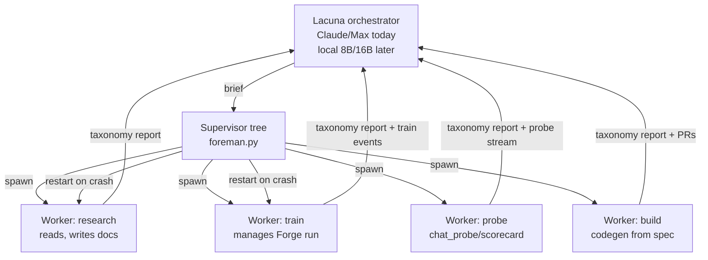

# The Big Forge Plan

*Lacuna Engineering · Forge v2 · training + observability + worker dispatch*

Forge is a masterpiece. It just proved it by exposing five incidents in a week
before any of them ate the run. Now we finish the job: bake the lessons back
into the tool, double the insights panel to something an ML pro would keep
open on a second monitor, and make Forge the console for the first Lacuna
worker sitting next to it on the Mac Studio.

- [Executive summary](#executive-summary)
- [Part I — Insights Panel v2](#part-i--insights-panel-v2)
- [Part II — ML controls in the UI](#part-ii--ml-controls-in-the-ui)
- [Part III — Lacuna worker spine + taxonomy](#part-iii--lacuna-worker-spine--taxonomy)
- [Part IV — Corpus format v2](#part-iv--corpus-format-v2)
- [Part V — Optimizer state persistence](#part-v--optimizer-state-persistence)
- [Part VI — Forge as Lacuna worker interface](#part-vi--forge-as-lacuna-worker-interface)
- [Part VII — Migration path and the code move](#part-vii--migration-path-and-the-code-move)
- [Appendix A — Incident forensics summary](#appendix-a--incident-forensics-summary)

---

## Executive summary

**What Forge becomes.** A training + observability + worker dispatch console.
Today it observes one thing (a fine-tune run) and steers it manually. Tomorrow
it observes the whole SRE surface (training + evals + probes + worker fleet)
and steers it through structured messages. The trainer is still the marquee
tenant; the panel around it is the fleet.

**Why.** Because five incidents in a week were all catchable with better
observability, and none of the fixes were subtle once the signal was surfaced.
Adam-state cold on resume is a one-line save. Batch permutation stuck on a
landmine is a seed picker. GPU contention is a lock everyone shares. What
was missing was the panel that said *the trainer has no idea whether its own
optimizer moments are healthy*. Once you surface it, everyone (including the
trainer's own supervisor) can act on it.

**What ships first.** Two things this weekend, gated on the current restart
landing green at iter 500.

1. **Optimizer state persistence** — the fix to the class of failure that
   produced Incidents 3, 4, 5. ~30 lines in `locked_lora.py`. Zero risk to
   the current run; new behavior only engages on the *next* resume.
2. **Insights v2 — first eight new panels** — grad-norm distribution,
   Adam-moment health, batch-order fingerprint, GPU contention timeline,
   thermal state, LR-vs-warmup sanity, val-subgroup breakdown, checkpoint
   recovery cost estimate. All eight would have caught at least one of the
   five known incidents.

**What ships next.** Everything else in Part I (24 more panels), Part II
(ML controls surfaced in UI), Part IV (S-expression corpus reader), and the
Part III spine for the first Lacuna worker.

**The month-out picture.** The Mac Studio (128 GB unified memory) runs Forge
+ a resident 8B-or-16B Lacuna worker as sibling processes. Forge is the
dashboard *and* the message bus. The worker registers, declares its taxonomy,
receives briefs from Lacuna (Claude/Max today, a local model when ready),
and streams progress + taxonomy reports back through Forge's WebSocket API.
Same panel, one more tenant. The Erlang lineage shows up as: supervised,
hot-swap-able, restart-on-crash, mailboxes are JSON-or-S-expr, actors are
LLM inferences. Same shape as OTP; ours are Python subprocesses with
persona configs instead of BEAM processes with gen_server callbacks.

---

## Part I — Insights Panel v2

> See [`../../forge/specs/insights-panel-v2.md`](../../forge/specs/insights-panel-v2.md) for the normative version of this part.
> See [`../specs/forge-views-and-narration.md`](../specs/forge-views-and-narration.md) for the normative version of the view model + Lacuna narration strip described below.

### I.-1 View model + Lacuna narration strip

**Views are the frame. Panels are the content.**

The forge run page hosts seven views over the same underlying data. A
segmented control across the top selects the active view. The panels in
this Part I enumeration all live inside one view — **Effect** — and their
current shape is unchanged. The other six views are new lenses on the
same run:

| # | Slug | Intent |
|---|------|--------|
| 1 | `effect` | The run right now. Home for all 32 panels below plus Pause/Resume + suggested-fix banner. |
| 2 | `timeline` | The run across time, segment by segment, swim-lane per segment. |
| 3 | `ledger` | The resume-offset ledger rendered pretty — segments left, incidents right, config diffs between. |
| 4 | `autopsy` | Deep dive on one incident: root cause, config at spike, val + grad-norm around the window. |
| 5 | `compare` | Two segments side-by-side, delta table of what changed. |
| 6 | `ops` | All active runs on the machine; jump into any run's Effect view. |
| 7 | `birds-eye` | The whole run on one screen — val curve stitched across every segment. |

Deep-linking is by query param: `?view=timeline&segment=3`,
`?view=autopsy&incident_id=C1-2026-07-09-01`. Back-history is preserved
so drilling from a lower view into a higher one and pressing back returns
to the exact scroll position.

**The Lacuna narration strip** sits persistent along the bottom of the
run page, visible in every view. It carries one honest paragraph of
plain-language commentary — *"Segment 5, warmup ramping cleanly, adam
warm, landmine at iter 350 passed at 4.876. Holding at 0.814. Watch
iter-2000."* — updated every 30 s and on every view switch. The strip is
view-adaptive: in Timeline it narrates the segment history, in Autopsy
the incident's root cause, in Compare the delta, in Ops the fleet.

The narration engine is rule-based this pass (six situation templates per
view — `warming`, `holding`, `climbing`, `just-checkpointed`,
`landmine-passed`, `incident-open`). The template registry is the hook
the future local Lacuna model will plug into.

**Endpoints new to this feature** (all read-only, all under `/api/watch/`):

- `GET /api/watch/narration/{run}?view=X` — the narration slat.
- `GET /api/watch/views/effect/{run}` — alias of `/api/watch/insights/{run}`.
- `GET /api/watch/views/timeline/{run}` — segment payload.
- `GET /api/watch/views/ledger/{run}` — pretty ledger data.
- `GET /api/watch/views/autopsy/{run}/{incident_id}` — one incident's deep-data.
- `GET /api/watch/views/compare/{run}?a=<seg>&b=<seg>` — two-segment comparison.
- `GET /api/watch/views/ops` — all active runs.
- `GET /api/watch/views/birds-eye/{run}` — the whole stitched history.

### I.0 What the panel looks like today — verified

Read from `~/code/forge/web/templates/run-detail.html` (lines 246-390) and
the aggregating endpoint `api_watch_insights` at `~/code/forge/web/server.py`
(line 2266+). The current panel has **16 insight blocks**. Every one is an
`<details>` accordion under one `rd-card` titled *insights*.

| # | Slug | What it shows | Signal quality today |
|--:|---|---|---|
| 1 | `stage` | Weave stage indicator (warmup → saturate → rebalance → diversify → anneal → soup) + ETA | Good, coarse |
| 2 | `projection` | Exponential-decay fit on last 30 reports, milestones at 25/50/75/100% remaining iters | Good, mostly directional |
| 3 | `regressions` | Local-min → subsequent-climb events (>10% climb) | Good, detects post-hoc |
| 4 | `family` | 200-pair sample from train.jsonl, heuristic-classified (scheme-cart / persona / book-prose / atom-yaml / etc) | Good, static-ish |
| 5 | `banned` | Watchlist of banned tokens; add-on-discovery | Good, actionable |
| 6 | `driftwall` | Canonical prompts × checkpoints matrix; highlight changed cells | Great — most revealing panel |
| 7 | `velocity` (slope) | Centered 5-point derivative of loss, colored fast-drop / plateau / regression | Good, hard to read at speed |
| 8 | `throughput-mem` | Dual trace: iters/sec (green) + peak mem (purple) | Good, correlational |
| 9 | `adapter-delta` (heat) | Frobenius Δ between consecutive checkpoints across 7 projections × A/B matrix | Great, unique to Forge |
|10 | `voice-lock` | Banned-token hits + hedging trend + FROZEN pass-rate proxy | Good, persona-focused |
|11 | `progress` | Rings — iter %, tokens seen, corpus coverage, ETA | Good, glanceable |
|12 | `lr-plan` | Planned cosine curve vs actual measured LR | Good, would have caught Incident 5 |
|13 | `noise-floor` | Rolling stddev of train loss over 20-report window | Good, would have caught Incident 5 |
|14 | `tokens-vs-corpus` | Chinchilla-flavored epoch ring | Educational, low-actionability |
|15 | `lora-primer` | Static explainer of what rank=128 means | Educational, static |
|16 | `sakura-chat` | Mirror of live conversation (mobile reach) | UX, not insight |

Panels 15 and 16 are educational/UX, not signals. The functional insight
count is **14**. Some blocks (`stage`, `progress`, `lora-primer`) are also
half explainer, half signal.

**Diagnosis of the 16.** Strong on: trajectory (stage, projection,
velocity), voice (voice-lock, banned, family), adapter health
(adapter-delta), persona drift (driftwall). Weak on: **optimizer state,
gradient health, GPU contention, thermal state, disk cost, corpus shape
drift, batch order, val subgroup breakdown, checkpoint recovery cost,
seed sensitivity, layer-wise LR effective ratio, memory band saturation.**
Every one of those weak-side items would have contributed to catching at
least one of the five incidents earlier.

### I.1 Design principles for v2

Same principles as the current 16, tightened.

1. **Every panel maps to at least one incident class.** If a panel doesn't
   have a story about *when it would fire the alarm*, cut it.
2. **Threshold, not decoration.** Every panel has a named "good" band and a
   named "bad" band. Charts show the band; alerts use it.
3. **Ask-Lacuna next to every panel.** Current UI has this — keep it.
   Every panel can be asked *what should I do*, and the answer routes to
   the SRE oracle with the panel's live state as context.
4. **Actionable > pretty.** A sparkline that says "climb this to fix" beats
   a heatmap that says "notice this and think about it."
5. **Two lanes.** Panels split visually into a *health lane* (top 12,
   ambient-glance, always-visible summaries) and a *deep lane* (the other
   20, `<details>`-collapsed by default).

### I.2 The 32 panels

Nine incident classes referenced below:

- **C1 — GPU contention** (Incidents 1, 2)
- **C2 — Optimizer state cold on resume** (3, 4, 5)
- **C3 — Batch order landmine on deterministic seed** (4, 5)
- **C4 — Warmup misconfig at resume** (5)
- **C5 — Gradient blowup / missing clip** (3)
- **C6 — Corpus shape outlier / oversize batch** (4)
- **C7 — Checkpoint drift / silent damage** (1, 2)
- **C8 — Thermal throttling / hardware limit** (latent)
- **C9 — Voice / persona regression** (latent)

Panels 1-14 are the current 14 (dropping `lora-primer` and `sakura-chat` to
UX-lane), reworked to pro grade. Panels 15-32 are new.

#### Health lane (top 12, ambient)

| # | Slug | Purpose | Source | Viz | Threshold | Catches |
|--:|---|---|---|---|---|---|
| 1 | `stage-v2` | Weave stage + confidence | `train.log`, ledger | Segmented bar with stage-progress inset | On-track / drifting / stuck | trajectory-anywhere |
| 2 | `projection-v2` | Fit-band projection with 3 curves (opt/med/pess) | last 30 reports | Fan chart | Median-band width vs target | trajectory-anywhere |
| 3 | `loss-canvas` | Train + val, stitched, tick-marks per checkpoint | `train.log` | D3 dual-line | Val-slope + last-checkpoint delta | all |
| 4 | `velocity-v2` | Δloss/iter, 5-point centered, band-colored | `train.log` | Sparkline w/ heat-fill | Sign-flip = warn | C5 |
| 5 | `noise-floor-v2` | Rolling stddev + Adam-warm-ratio overlay | `train.log` + optimizer probe | Band chart | Band > 0.6 while loss-trend up = fire | C2, C5 |
| 6 | `grad-norm-v2` **NEW** | Per-step grad-norm distribution + clip-engagement rate | `locked_lora.py:_clipped_update` (add print or ring buffer) | Sparkline + clip% inset | Clip% > 20% for > 100 iters = fire | C5, C6 |
| 7 | `adam-moment-health` **NEW** | Ratio of ‖m‖/‖v^0.5‖ across trainable params, one number per checkpoint | Optimizer state (Part V) | Line | < 0.3 for > 500 iters post-resume = **cold-Adam alert** | **C2 (the big one)** |
| 8 | `batch-fingerprint` **NEW** | First-100-iter loss profile hash, compared vs prior segment | `train.log` | Row of small histograms per segment | Fingerprint delta > 40% vs same-seed baseline = **seed collision alert** | **C3, C4** |
| 9 | `warmup-sanity` **NEW** | LR ramp actual vs planned; if warmup=0 and Adam cold: red banner | `train.log` + `train.cfg` | Small chart + banner | Cold-Adam + warmup=0 = **hard fail** | **C4, C5** |
|10 | `gpu-contention` **NEW** | Wall-clock ips vs expected ips; annotates chat_probe / scorecard events | `train.log` + `gpu_lock` events | Lane chart | ips drop > 30% while non-trainer child holds lock = fire | **C1** |
|11 | `thermal-state` **NEW** | powermetrics / SMC-derived thermal-pressure band | `powermetrics` subprocess (5s cadence) | Sparkline | Pressure = "moderate" for > 5 min = warn; "heavy" = fire | **C8** |
|12 | `throughput-mem-v2` | ips + peak-mem + memory-band saturation | Existing + `sysctl vm` | Dual sparkline | Mem climb while ips flat = warn | latent |

#### Deep lane (bottom 20, collapsed)

| # | Slug | Purpose | Source | Viz | Threshold | Catches |
|--:|---|---|---|---|---|---|
|13 | `driftwall-v2` | Canonical prompts × checkpoint responses matrix | scorecards | Table w/ diff-highlight | Row all-green-then-red = persona regression | C9 |
|14 | `adapter-delta-v2` | Frobenius Δ per LoRA key × A/B matrix, per checkpoint | scorecards | Heatmap w/ zoom | Sudden brightening on frozen-looking key = fire | C7 |
|15 | `voice-lock-v2` | Banned + hedge + frozen-pass-rate lines | scorecards | Triple sparkline | Frozen dropping = fire | C9 |
|16 | `family-v2` | Corpus family distribution + shape-drift score | corpus sample | Stacked bar + drift number | Shape-drift > 5% vs baseline = warn | C6 |
|17 | `banned-v2` | Watchlist + last-N-hits table | scorecards | Table + input | Any hit = warn | C9 |
|18 | `regressions-v2` | Local-min → climb events with root-cause guess | derived | Timeline | Any = warn | C5 |
|19 | `val-subgroup` **NEW** | Val loss split by family (scheme-cart / persona / prose / atoms) | val.jsonl tagged sample | Stacked line | One subgroup diverging = fire | C6, C9 |
|20 | `seed-sensitivity` **NEW** | For last N resumes, plot first-500-iter val curve per seed | `train.log` per segment | Small-multiples | Any seed's curve > 1.5× band = fire | **C3** |
|21 | `ckpt-recovery-cost` **NEW** | For each stored checkpoint, estimated wall-clock cost to re-reach current best (if we rolled to it) | ledger + ips | Table w/ rows-per-ckpt | — (advisory) | C7 |
|22 | `layer-lr-ratio` **NEW** | Effective LR per-layer computed as ‖ΔW‖/(LR·‖W‖), one number per LoRA layer, per checkpoint | Adapter delta from Part V | Small heatmap | Any layer > 3σ = warn | latent |
|23 | `disk-write-cost` **NEW** | Bytes written per save × save cadence × disk fill projection | statfs + save events | Sparkline + ETA-full | > 80% fill projected < 7d = fire | latent |
|24 | `optim-state-integrity` **NEW** | Hash of optimizer state at save + load — did it round-trip? | Part V | Row of ticks | Any red = fire | **C2** |
|25 | `resume-latency` **NEW** | Wall-clock from resume-initiated → first-good-eval, per segment | Ledger | Bar per segment | 3× baseline = warn | C2 |
|26 | `chinchilla-v2` (was `tokens-vs-corpus`) | Tokens seen vs corpus size vs Chinchilla ratio | Existing | Ring | — (educational) | — |
|27 | `progress-v2` | Iter %, tokens %, corpus coverage %, ETA | Existing | Rings | Behind projection > 20% = warn | — |
|28 | `stage-diag` **NEW** | Weave-stage confidence with feature-level breakdown | derived | Table | Stage stuck > 2× expected = warn | trajectory |
|29 | `lr-plan-v2` | Planned cosine vs actual measured LR | Existing | Line | Divergence > 1e-6 = fire | C4 |
|30 | `frozen-pass-rate` **NEW** | Held-out FROZEN-1001 subset pass rate, per checkpoint | Held-out set + scorecards | Line | Down 3 checkpoints straight = fire | C9 |
|31 | `token-length-dist` **NEW** | Per-batch token count distribution + 99th percentile trend | corpus loader logs | Small histograms per 500-iter window | 99th p > 2000 → warn (near context limit) | **C6** |
|32 | `sre-summary` **NEW** | One-page synthesis: green/yellow/red per lane + Lacuna's take | derived | Card w/ color chips + text | Any red = fire | all |

**Where the 32 are hosted in the UI.** Same `rd-card` block; add a segmented
control at the top: **Health · Deep · SRE**. Health lane loads eagerly; Deep
lane lazy-loads on expand; SRE tab renders panel 32 as a full-width summary.

**Where the alarms go.** Every threshold-fire event pushes to a
`~/.forge/runs/{name}/alarms.jsonl` append-only log; the existing Lacuna
oracle panel picks it up and raises the `lac-light` red when unacknowledged
fires exist. Ack is a click on the light.

### I.3 Prioritized ship list

Weekend ship (assumes optimizer-state persistence lands too):

1. `adam-moment-health` (7) — the direct fix for C2
2. `warmup-sanity` (9) — the direct fix for C4
3. `batch-fingerprint` (8) — the direct fix for C3
4. `grad-norm-v2` (6) — the guardrail for C5/C6
5. `gpu-contention` (10) — the direct fix for C1
6. `optim-state-integrity` (24) — the audit for Part V
7. `sre-summary` (32) — the single glanceable synthesis
8. `token-length-dist` (31) — the direct fix for C6

Week-two ship: `val-subgroup` (19), `thermal-state` (11), `seed-sensitivity`
(20), `resume-latency` (25), `ckpt-recovery-cost` (21), all the `-v2`
reworks (1, 2, 4, 5, 12, 13, 14, 15, 16, 17, 18, 27).

Month ship: `layer-lr-ratio` (22), `disk-write-cost` (23), `stage-diag`
(28), `frozen-pass-rate` (30), `chinchilla-v2` (26). These are advisory,
not incident-caught, but they round out the pro dashboard.

### I.4 What we're deliberately not building

- **A full experiment tracker.** Forge is not W&B or MLflow. If a comparison
  across dozens of runs matters, dump scorecards to a jsonl and read in a
  notebook. Forge tracks one lineage at a time.
- **A dashboard designer.** Order and lane assignment are hard-coded; no
  drag-drop. The 32 slots are the 32 slots.
- **Real-time WebSocket streaming for every panel.** 30-second poll is fine
  for observability; instant reads are wasted screen updates. WebSocket is
  reserved for worker message-passing (Part VI).

---

## Part II — ML controls in the UI

> See [`../../forge/specs/ml-controls.md`](../../forge/specs/ml-controls.md) for the normative version of this part.

Every knob the training run cares about, surfaced in Forge with a preflight
check and a post-apply verification. Today they live in `train.cfg` and
require an editor + restart; tomorrow they live in a controls card in the
run-detail page and a `POST /api/watch/control/{name}/{knob}` endpoint.

### II.1 The full control set

| Knob | Default | Range | Live-preview? | Preflight | Post-apply verify |
|---|---|---|---|---|---|
| `learning_rate` | 8.7916e-05 | 1e-6 .. 1e-3 (log) | Sim curve for next 500 iters | Warn if changed mid-run without warmup | Iter+500 val within 15% |
| `warmup_steps` | 0 | 0 .. 5000 | Overlay planned LR curve | **Hard warn if 0 and resume + Adam cold** | LR at iter 50 matches computed |
| `warmup_init` | 1e-5 | 1e-7 .. 1e-4 | Line on plan | — | LR at iter 0 matches |
| `lr_schedule.arguments` | [initial, N, floor] | — | Full plan preview | Sum of warmup + N must equal remaining iters | Actual matches for 100 iters |
| `grad_clip` | 1.0 | 0.1 .. 10 or off | — | Off + fresh Adam = warn | Clip-engagement rate stays < 5% steady-state |
| `seed` | 4 | any int32 | Batch-order fingerprint preview | **Fire if seed == prior_incident_seed** | Fingerprint distance > 20% from prior |
| `batch_size` | 2 | 1 .. 16 | Memory estimate | Est mem > 90% of 32GB = fire | Peak mem within 1GB of estimate |
| `save_every` | 1000 | 100 .. 5000 | Disk-fill projection | > 80% disk fill in 7d = warn | Disk fill within projection |
| `eval_every` | 1000 | 100 .. 5000 | Timing impact estimate | — | Actual eval cadence matches |
| `resume_adapter_file` | (auto) | file picker | Adjacent val-loss + ckpt integrity hash | **Missing sibling optimizer file = warn** | Iter 0 loss ~ ckpt's stored val |
| `resume_optim_file` **NEW** | (auto) | file picker | — | Missing = falls back to cold-Adam (banner) | Post-resume Adam moments non-zero |
| `optim_state_persist` **NEW** | true | true / false | — | Off = will re-experience Incident 3/4/5 | Save produced sibling file |
| `corpus_path` | `train.jsonl` | file picker | Sample 10 pairs | JSON parse fail = fire | First batch loads |
| `corpus_format` **NEW** | jsonl | jsonl / sexpr | Sample render both ways | Converter round-trip fail = fire | First batch loads |
| `batch_order_strategy` **NEW** | length-bucketed | length-bucketed / deterministic-permute / random | Fingerprint preview | Random + resume = warn (loses reproducibility) | Fingerprint matches strategy |
| `banned_tokens` | [] | list-editable | — | — | Watchlist recognized on next scorecard |
| `val_subset_size` | 25490 | 100 .. all | Est eval time | — | Eval reads correct size |
| `held_out_lock` | frozen-1001 | list-of-paths | — | **Path also in train = fire** | No overlap on next batch load |

Ships in three tranches: **safe knobs** (banned_tokens, save_every,
eval_every, val_subset_size) require no restart; **restart knobs** (LR,
warmup, seed, batch_size) require a scheduled-restart flow; **rewrite
knobs** (corpus_path, corpus_format, held_out_lock) require a full
re-index step.

### II.2 The controls card

New UI card between *insights* and *run block* in `run-detail.html`:

```html
<div class="rd-card">
  <h2>controls <span class="sub">no-restart · scheduled-restart · rewrite</span></h2>
  <div class="ctrl-lane" data-lane="safe">…</div>
  <div class="ctrl-lane" data-lane="restart">…</div>
  <div class="ctrl-lane" data-lane="rewrite">…</div>
  <div class="ctrl-status" id="ctrl-status"><!-- preflight results --></div>
</div>
```

Each knob is a row with: current value, edit control, preflight-result
chip, apply button. Apply → POST to `/api/watch/control/{name}/{knob}`.
Server writes to a `pending-controls.json` for restart knobs, or applies
live for safe knobs.

### II.3 Test plan schema

Controls are simultaneously test-harness fixtures. A smoke test file
declares controls + assertions.

```yaml
# ~/code/forge/tests/smoke/warmup-sanity.yaml
name: warmup-sanity
description: >
  After a resume from any ckpt, if warmup=0 and Adam-moment ratio at
  iter 0 is < 0.3, val should NOT drop below 1.5 by iter 500 without
  the warmup fix. If it does, the fix isn't the real fix.
setup:
  base_ckpt: adapter-damaged-run-20260709-093331/0006000_adapters.safetensors
  train_cfg_overrides:
    warmup: 0
    seed: 0
    max_iters: 500
run:
  timeout_min: 20
  gpu_lock: exclusive
asserts:
  - name: iter-0-adam-moment-ratio
    target: adam_moment_health
    expect_lt: 0.3
  - name: iter-500-val-vs-baseline
    target: val_loss_at_iter
    iter: 500
    expect_gt: 1.03   # if it doesn't spike, our theory is wrong
teardown:
  archive_log_to: tests/smoke/results/warmup-sanity/{ts}.log
```

Runner: `python -m forge.test.smoke run warmup-sanity.yaml`. Loads a stored
mini-corpus (100 pairs, shipped in-tree) so tests don't touch the real
train.jsonl. Wall-clock target: < 30 min per smoke, run nightly.

### II.4 Alfred-approves gate

Every restart knob has a "confirm restart" step. The apply button opens a
modal: *"This restarts the run at iter N with the following config diff. Sim
suggests iter+500 val = X ± Y. Confirm?"* Enter to confirm, Esc to cancel.
Rewrite knobs additionally require a typed-out "REWRITE" acknowledgment.

### II.5 Sexy Stops and Continues

The pause / resume surface that turns the 2am fat-finger fire drill into a
one-button decision. Full design spec: [`../specs/sexy-stops-and-continues.md`](../specs/sexy-stops-and-continues.md).

**Five surfaces on the run panel.**

- Big Pause / Resume button pair (top-right of the run header).
- Ambient status chip (persistent, top of run panel, colored by phase).
- Diff-before-resume modal (side-by-side config JSON diff, one Enter to confirm).
- Suggested-fix banner (dismissible; fires on the incident classifier).
- Segment timeline (horizontal bars across the run, colored by state,
  with checkpoint diamonds embedded).

**Five endpoints.** Every non-GET one appends a Slat event to
`~/.forge/runs/<name>/events.slat`.

| Endpoint | Purpose |
|---|---|
| `POST /api/watch/pause` | SIGTERM the trainer, wait up to 30s, archive log + adapter dir, patch ledger. |
| `POST /api/watch/resume` | Apply config diff, write new segment, launch. |
| `POST /api/watch/kick` | One-tap "trainer died overnight" resume from last-known-good. |
| `GET /api/watch/segments` | Timeline data: every segment + checkpoints. |
| `POST /api/watch/suggest-fix` | Incident classifier → suggested config diff. |

**Suggested-fix rules.** One Python function per row, first match wins.

- val-drift-vs-baseline (C4) → rollback + warmup + seed
- cold-adam-post-resume (C4) → warmup 500 from same ckpt
- grad-clip-engaged (C6) → lower LR 30% or add clip
- peak-mem-climbing (C7) → drop max_seq_length to 1900
- batch-fingerprint-landmine (C2) → change seed
- trainer-dead (C8) → kick

**Slat event schema.** `(stop :run … :iter … :saved-checkpoint … :ts …)` and
`(continue :run … :parent-segment … :resume-from … :config-diff … :new-pid …)`.
Round-trips through the canonical Slat reader.

---

## Part III — Lacuna worker spine + taxonomy

> See [`../specs/worker-protocol.md`](../specs/worker-protocol.md) for the normative version of this part.

### III.1 What already exists

The one relevant find in the tree.

**`~/code/lacuna/lacuna-src/lacuna/worker.py`** (214 lines) — a working
POSIX foreman.

- Spawns child processes with `subprocess.Popen`, own process group.
- Registers them in `~/.lacuna/workers.json` (name, pid, cmd, port,
  started_at, log_path).
- Liveness by `os.kill(pid, 0)` on demand; auto-prunes dead entries.
- Kill sequence: SIGTERM → wait `timeout` → SIGKILL, then remove from
  registry.
- Tails last-N log lines from `~/.lacuna/logs/workers/<name>.log`.

No taxonomy, no message-passing beyond stdout/stderr, no restart policy,
no supervisor tree. This is the "spawn + kill" primitive; the spec below
extends it.

**`~/code/lacuna/docs/archived/lacuna-design-doc-v0.5.md`** — the design
Alfred is remembering. Salient lines (with cited numbers):

- Line 115: *"OTP supervisor trees (Joe Armstrong, KTH, 2003). Hierarchical
  supervision: failure is local, recovery is local. Lacuna's worker model
  is OTP-shaped on POSIX."*
- Line 206: *"Erlang was created at Ericsson… By the late 1990s the AXD301
  ATM switch — written in Erlang — held a measured nine-nines availability
  over twenty years. The OTP supervisor tree is the substrate under that
  number."*
- Line 204: *"A worker is a child process under a parent (the foreman) that
  supervises it. **OS workers** are long-lived processes; **reactor workers**
  are in-process closures with mailboxes (microseconds to spawn, kilobytes
  of RAM)."*
- Line 373: *"OTP is the gold standard for fault-tolerant distributed systems
  on the server. Lacuna borrows the supervisor tree and runs it on POSIX. For
  stay-up-for-a-decade-across-thousands-of-nodes, OTP. For one operator,
  dozens to hundreds of nodes, Lacuna."*

**What's missing.** The reactor-worker layer (mailboxes, in-process
closures) is stubbed but not built. Message format is not specified. The
existing `worker.py` doesn't emit lifecycle events for a supervisor to
consume. Nothing knows what a worker *is for*; there's no capability
declaration.

### III.2 The extended spec



#### III.2.1 Message format — JSON preferred, slat accepted

Every worker speaks both. The mailbox reader auto-detects: if the first
non-whitespace byte is `{`, JSON; if `(`, slat (newline-delimited
S-expressions — see [`../scheme/slat/SPEC.md`](../scheme/slat/SPEC.md));
else error.

**JSON form** (canonical for machine-to-machine):

```json
{
  "kind": "brief",
  "ts": "2026-07-09T22:14:00Z",
  "id": "b-3f2a",
  "from": "lacuna",
  "to": "worker-1",
  "job": {
    "class": "research",
    "brief": "Read Forge insights code and enumerate current panels.",
    "constraints": {
      "read_only": true,
      "max_writes": 1,
      "max_wall_sec": 1800
    }
  }
}
```

**Slat form** (canonical for human-authored briefs, mirrors Sakura
Scheme cart shape — one form per line):

```scheme
(brief
  :id "b-3f2a"
  :from lacuna
  :to worker-1
  :job (:class research
        :brief "Read Forge insights code and enumerate current panels."
        :constraints (:read-only #t
                      :max-writes 1
                      :max-wall-sec 1800)))
```

Minimal reader (not full Scheme; just enough to round-trip): tokenize on
whitespace + parens, treat `:foo` as keyword, `"foo"` as string, `#t`/`#f`
as bool, ints as ints, floats as floats, everything else as symbol. Nesting
is a Python list; keywords + adjacent values become a dict during parse.
Implementation at `~/code/forge/forge/corpus/slat_reader.py` (~500 lines).

**Round-trip guarantee.** Every JSON message has an equivalent slat
form and vice versa. The converter's test suite ships in
`~/code/forge/tests/test_slat.py` (82 tests); CI blocks a converter
change that breaks any.

#### III.2.2 Actor lifecycle

Six states, one line each.

- `spawned` — subprocess started, no brief yet.
- `briefed` — received `brief` message, acknowledged.
- `executing` — actively working, streaming `progress` messages.
- `reporting` — done working, emitting `taxonomy-report`.
- `retired` — reported, awaiting reap.
- `crashed` — exited abnormally, supervisor decides restart or grave.

Transitions:

```
spawned → briefed → executing → reporting → retired
                       ↓
                    crashed → (restart-policy) → spawned  OR  → grave
```

Message shapes for each transition are defined in
`~/code/forge/docs/WORKER-PROTOCOL.md` (to author; not part of this doc).

#### III.2.3 Supervisor tree

The foreman (extension of `worker.py`) becomes the supervisor.

- One supervisor per Lacuna instance.
- Supervisor policy per worker declared at `spawn()` time:
  - `one_for_one` — restart just this child on crash (default).
  - `rest_for_one` — restart this and every child spawned after it.
  - `one_for_all` — restart the whole subtree (rarely useful for us).
- Restart intensity: max N restarts in T seconds; exceed → child moves to
  grave, supervisor emits `child-graved` upstream. Defaults: N=3, T=300.
- The supervisor is itself a worker; a super-supervisor (Lacuna
  orchestrator) receives its taxonomy reports.

#### III.2.4 Taxonomy report schema

The contract that makes this spec worth having. Every worker, at retire
time, emits:

```json
{
  "kind": "taxonomy-report",
  "id": "r-3f2a",
  "worker": "worker-1",
  "brief_id": "b-3f2a",
  "class": "research",
  "capabilities": {
    "languages": ["python", "markdown"],
    "systems_touched": ["~/code/forge", "~/code/lacuna", "~/code/lacuna-docs"],
    "actions_taken": ["read", "grep", "one-file-write"],
    "tools_used": ["Bash", "Read", "Write", "Edit", "ToolSearch"]
  },
  "outputs": [
    {"path": "~/code/lacuna-docs/engineering/THE-BIG-FORGE-PLAN.md",
     "kind": "spec",
     "bytes": 34567}
  ],
  "confidence": {
    "part-i": "high",
    "part-ii": "high",
    "part-iii": "medium",
    "part-iv": "medium",
    "part-v": "high"
  },
  "handoff": {
    "next": "build",
    "reason": "Spec complete; needs implementation of Insights v2 panels 6-11.",
    "input_for_next": "This document plus optimizer state persistence PR."
  },
  "anti_taxonomy": [
    "Did not modify Curator/Forge/Lacuna code.",
    "Did not touch training processes.",
    "Did not write ledger entries."
  ]
}
```

Lacuna reads the report and knows: (a) what this worker is good at,
(b) what state it left behind, (c) what to dispatch next. Over dozens of
reports, Lacuna builds an internal *worker registry* — the same shape as
`~/.lacuna/workers.json`, but semantic instead of process-level.

#### III.2.5 Interpreter bootstrap (meta-workers)

If a worker needs a language runtime that isn't installed:

1. Worker's brief includes a `runtime_check` step: `python -c "import X"`.
2. On import failure, worker emits a `need-runtime` message to supervisor:
   `{kind: "need-runtime", runtime: "X", spec: "..."}`.
3. Supervisor spawns a meta-worker with class = `build-runtime` and a
   brief that includes the missing spec.
4. Meta-worker installs / builds / verifies the runtime, reports back.
5. Original worker's brief is re-issued; runtime check passes; it
   proceeds.

Concrete case: a worker is asked to run Sakura Scheme carts. The Scheme
runtime doesn't ship on stock Python. Meta-worker installs it (or builds
it from `~/code/sakura-scheme/` per the reserved slot in THE-PLAN.md
§2.3). Original worker resumes.

#### III.2.6 Migration path

Today → tomorrow → month-out.

- **Today.** Workers = Claude/Max subagents. Message passing = text through
  the top-level agent. Supervisor = the top-level Claude session; if it
  crashes, we lose state, and we do. No taxonomy reports; sub-agents just
  return their final message.
- **Tomorrow (weekend / next week).** Extend `worker.py` to accept briefs
  via a mailbox file at `~/.lacuna/mailboxes/<name>.jsonl`. Workers append
  their taxonomy reports to `~/.lacuna/reports/<name>.jsonl`. Lacuna
  orchestrator (still Claude/Max) reads reports, dispatches next brief.
  Forge's UI grows a *workers* tab that reads both files.
- **Month-out.** A local 8B or 16B model (TBD; the training decisions
  drive this) runs as a resident worker under Forge. It receives briefs
  the same way the Claude sub-agents do; its capability declaration
  includes `"latency: low"`, `"cost: free"`, `"context: 32k"`. Lacuna
  orchestrator routes briefs by capability match: research-heavy →
  Claude/Max (big context, high reasoning), pattern-execution → local
  model (fast, free). The taxonomy report tells Lacuna which class of
  worker to reach for next time.

### III.3 What's out of scope

- **Distributed workers across machines.** POSIX-local only for now.
  Cross-machine will happen when the Mac Studio isn't the whole fleet;
  don't design it now.
- **Persistent worker state across restarts** beyond the registry file.
  Workers are stateless between briefs by design; brief carries the input,
  report carries the output.
- **Hot code reload.** Every worker restart is a full spawn. OTP-style
  code_change/1 is not on the roadmap.

---

## Part IV — Corpus format v2

> See [`../../sakura-corpus/specs/corpus-schema.md`](../../sakura-corpus/specs/corpus-schema.md) for the normative version of this part.

Corpus format v2 = **slat** (newline-delimited S-expressions, NDSEXP). JSONL is the legacy export target. See [`../scheme/slat/SPEC.md`](../scheme/slat/SPEC.md) for the normative specification.

### IV.1 The JSONL as it stands

Read from `~/.forge/corpus/sakura/train.jsonl`. One example:

```json
{"messages": [
  {"role": "system", "content": "You are Sakura. You live on this operator's device, inside the Curator app. You answer first, ask second. Calm voice, short sentences. No 'as an AI,' no sycophancy, no lecturing. When the operator names a workflow you know, acknowledge plainly and emit the .sks cart body in a fenced scheme block."},
  {"role": "user", "content": "risk risk flow guarantee reconcile"},
  {"role": "assistant", "content": "risk-risk-flow-guarantee-reconcile"}
]}
```

Shape: one JSON per line; each line is `{"messages": [{"role", "content"}, ...]}`
with 1..N messages. Currently 193,937 train / 27,278 val (per chop-2026-07-09).
Roles seen: `system`, `user`, `assistant`. No tool-use / function-call
messages in this corpus yet (would be additive when they appear).

**Strengths.** Trivial to read; trivial to `wc -l`; trivial to shuffle;
trivial to jq. Every ML tool speaks it.

**Weaknesses.** No provenance metadata per pair; no family tag; no
first-class support for multi-turn context beyond the flat array; system
prompt duplicated per line; can't validate structural invariants at
parse time (only at semantic-check time downstream).

### IV.2 The slat (Lacuna Scheme cart) form

Alfred's line: *"I don't think we need full Scheme for it, but it would be
Lacuna Scheme carts."* Right shape, small grammar — that grammar is
now [slat](../scheme/slat/SPEC.md). Same example:

```scheme
(pair
  :id "sk-cart-40012"
  :family "scheme-cart"
  :provenance "curator/carts/risk-flow-guarantee-reconcile.scm"
  :system-prompt-ref :sakura-default-v3
  :messages
    ((:user "risk risk flow guarantee reconcile")
     (:assistant "risk-risk-flow-guarantee-reconcile")))
```

Advantages of this form:

- **Provenance is first-class**, not tacked-on metadata.
- **System prompt reference**, not repetition — the default lives once in
  `system-prompts.scm`, referenced by keyword. Saves ~30% of corpus bytes.
- **Family tag** lets `val-subgroup` (Insights panel 19) work without a
  post-hoc classifier.
- **Multi-turn** is `((:user "...") (:assistant "...") (:user "...") ...)`
  — same shape, no re-encoding.
- **Structural validation at parse time** — a pair with no `:messages` or
  no `:assistant` in messages is malformed, caught by the reader.
- **Homoiconic with the Scheme carts themselves** — one grammar for the
  training data and the code it trains against.

### IV.3 The minimal reader

Not full Scheme. A ~120-line Python reader that handles: `(`, `)`, strings
(with escapes), keywords (`:foo`), symbols, ints, floats, `#t`, `#f`, `nil`.
No quote, no unquote, no macros, no let-bindings. Enough to parse the
grammar above and nothing else.

Reader lives at `~/code/forge/forge/corpus/slat_reader.py`; identical
public API to `json.loads` on a single-record basis:

```python
from forge.corpus import loads
rec = loads(line)  # returns dict, same shape as JSONL parse would
```

### IV.4 The converter

Two directions, round-trip guaranteed.

```python
from forge.corpus import jsonl_to_slat, slat_to_jsonl

# JSONL → slat
for slat_line in jsonl_to_slat(open("train.jsonl")):
    ...

# slat → JSONL
for json_line in slat_to_jsonl(open("train.slat")):
    ...
```

Round-trip test — see `~/code/forge/tests/test_slat.py::TestJsonlRoundTrip`:

```
ok, diffs = round_trip_verify(HAND_CRAFTED)
assert ok, diffs
```

Family/system-prompt augmentation is a caller responsibility — slat is
the wire format; enrichment is an application layer above it.

`system_prompt_registry` is a small `~/.forge/corpus/sakura/system-prompts.scm`
keyed by symbol, so `:sakura-default-v3` resolves to the current default
system prompt. Bump the ref on system-prompt changes; old data still reads.

### IV.5 The validator

Runs against either format. Checks:

1. **Schema** — every record has messages, roles ∈ {system, user, assistant,
   tool}, alternating pattern OK (system optional, then user/assistant pairs
   from there).
2. **Tokenization estimate** — chars × 3.5-heuristic; flag records > 2000
   tokens (the C6 landmine).
3. **Length distribution** — histogram all records; report p50, p95, p99,
   max. Compares against baseline (previous run's histogram) and flags
   >5% drift.
4. **Family distribution** — count by tag; report percentages; compare to
   Weave-stage target distribution.
5. **Duplicate detection** — SHA-256 the `(user, assistant)` pair; flag
   duplicates.
6. **Held-out contamination** — if `--held-out DIR` given, flag any train
   record with a hash matching a held-out record.

Output: a `validation-report.jsonl` in the run dir, one record per finding.
Also a summary card in Forge's Corpus tab.

### IV.6 Bot-generation pipeline

Corpus authoring is itself a worker class (Part III). Bots emit either
format; the validator normalizes.

**Worker taxonomy for corpus-authoring bots:**

| Class | Purpose | Output format | Rate |
|---|---|---|---|
| `corpus-author.scheme-cart` | New Scheme carts from a topic seed | slat | 10/hr |
| `corpus-author.persona` | Persona voice pairs from a scenario | JSONL | 100/hr |
| `corpus-author.book-prose` | Book-chapter fenced code extraction | slat | 500/hr |
| `corpus-author.atom-yaml` | World-knowledge atom explanations | JSONL | 200/hr |
| `corpus-author.rehearsal` | Perturbation of an existing pair | either | 1000/hr |
| `corpus-verify.dedup` | Ingests fresh pairs, dedupes, checks held-out | — | as-fast-as-write |
| `corpus-verify.family-balance` | Rebalances family mix per Weave stage | — | daily |

Each bot's brief includes: topic (or seed pair), target format, target
family, target count. Report includes: pairs emitted, validation-report
summary, provenance chain. Lacuna orchestrator dispatches by the Weave
stage's declared mix.

---

## Part V — Optimizer state persistence

> See [`../../forge/specs/optimizer-state-persistence.md`](../../forge/specs/optimizer-state-persistence.md) for the normative version of this part.

### V.1 The problem in six lines

`mlx_lm/tuner/trainer.py:370-380` saves only `model.trainable_parameters()`
to `*_adapters.safetensors`. Adam's first-moment `m` and second-moment `v`
tensors are never persisted. On any `--resume-adapter-file`, Adam initializes
`m = 0`, `v = 0`. If `warmup = 0` (because the human assumed Adam was warm),
the first ~50-100 steps are effectively SGD-flavored with `LR = full`, which
is exactly what scrambled the adapter in Incidents 3, 4, 5.

### V.2 The fix — sketch, not code

Patch `~/code/forge/scripts/locked_lora.py`. ~30 lines total. Sketch below;
final code lands in a separate PR after this plan is approved.

**Save-hook (at checkpoint save time).**

- Where: hook the point mlx_lm calls `save_adapter_file(...)` inside
  `mlx_lm/tuner/trainer.py`. Two options:
  1. **Monkeypatch approach** (simpler, no upstream fork): wrap
     `mlx_lm.tuner.trainer.save_adapter_file` in `locked_lora.py` to also
     write the optimizer state.
  2. **Trainer-subclass approach** (cleaner but requires more mlx_lm
     internals exposed): subclass the trainer and override the save step.
  - **Recommend monkeypatch** for now; the wrapper is 8 lines.
- What to save: `optimizer.state` (dict-like: keys are parameter names /
  ids, values are `{m: array, v: array}` per Adam). Serialize with
  `mx.save_safetensors` to `{path}_optimizer.safetensors` (sibling to the
  `{it:07d}_adapters.safetensors` file).
- Also save a small `{it:07d}_optimizer.meta.json` alongside:
  `{iter, lr, warmup_steps_completed, hash_of_optimizer_state, mlx_version, timestamp}`.
  Used by the integrity check in Insights panel 24.

**Restore-hook (at resume-adapter-file time).**

- Where: hook after `train_model` loads the adapter file. In `locked_lora.py`,
  we already wrap the pre-training call site.
- Logic:
  1. Look for sibling `{basename}_optimizer.safetensors` next to the resume
     adapter file.
  2. If present, `mx.load_safetensors` it → `optimizer.state = loaded_state`.
     Log `[locked_lora] optimizer state restored from {file}` at iter 0.
  3. If absent (older checkpoint, or opt-out), fall back to cold-Adam
     (current behavior). Log `[locked_lora] WARN: no optimizer sibling
     found; Adam will start cold. Consider adding --warmup>=500 to
     train.cfg.` and set `warmup_recommended = 500`.
  4. If shape/version mismatch (mlx-version delta, param-set delta),
     abort with error: `[locked_lora] FATAL: optimizer state shape
     mismatch: expected N tensors, got M. Not safe to restore. Aborting.`
     Human intervenes.

**Line budget.**

- Wrapper of `save_adapter_file`: 8 lines.
- Sibling-write of optimizer safetensors: 4 lines.
- Meta-json write: 3 lines.
- Sibling-load at resume: 6 lines.
- Fallback-warn on missing: 4 lines.
- Shape-mismatch abort: 5 lines.
- **Total: ~30 lines**, all in `locked_lora.py`.

### V.3 Failure modes

| Case | Behavior | Reason |
|---|---|---|
| Fresh run (no resume) | No load attempted; Adam starts cold as expected | expected |
| Resume + optimizer file present + shape matches | Load and continue; Adam is warm; no need for warmup | happy path |
| Resume + optimizer file missing | Warn, cold-Adam, recommend warmup>=500 | current-day behavior (documented) |
| Resume + optimizer file present + shape mismatch | Abort with FATAL; human decides | safer than silently corrupting |
| Save fails (disk full, permission) | Warn; adapter still saves; optimizer just missing this iter | adapter integrity > optimizer integrity |
| Load fails (corrupt file) | Warn; fall back to cold-Adam; recommend warmup | same as missing |
| MLX version mismatch (safetensors format drift) | Abort with FATAL; document migration path | protect against silent corruption |

### V.4 Integration with Insights v2

Panel 24 (`optim-state-integrity`) reads the meta-json and computes:

- Does the hash-of-optimizer-state at save match at load? (round-trip integrity)
- Is `‖m‖ / ‖v‖^0.5` in a healthy band at iter 0 post-resume? (panel 7 does
  this)
- Was the "cold-Adam warn" ever emitted for the current run's most recent
  resume? (would have caught Incident 5 immediately)

### V.5 What this doesn't fix

- **Batch order landmine (C3).** Optimizer warmth is orthogonal to which
  batch you see first. Seed-picker + `batch-fingerprint` (panel 8) handle
  C3.
- **GPU contention (C1).** Handled by `gpu_lock` — already fixed in `locked_lora.py`.
- **Corpus outliers (C6).** Handled by chop_corpus and `token-length-dist`
  (panel 31).

Combined, Parts I + V would have caught or auto-fixed Incidents 1-5 without
manual forensics.

---

## Part VI — Forge as Lacuna worker interface

> See [`../../forge/specs/forge-as-worker-interface.md`](../../forge/specs/forge-as-worker-interface.md) for the normative version of this part.

### VI.1 The role expansion

Forge's `run-detail.html` becomes the console for two things simultaneously:

1. **The training run** (today's role) — timeseries, scorecards, insights,
   controls.
2. **The Lacuna worker fleet** (new role) — worker list, mailboxes,
   taxonomy reports, dispatch.

The two tabs share styling and the ask-Lacuna oracle. Cross-links: the
training worker is *itself* a Lacuna worker, so its taxonomy report is
readable from the workers tab, and its supervisor-visible state
(spawned/executing/reporting/etc.) drives the run-status chip in the
sidebar.

### VI.2 The workers tab — sketch

```html
<div class="rd-card">
  <h2>workers <span class="sub">Lacuna fleet on this host</span></h2>
  <div class="worker-list">
    <table>
      <thead><tr>
        <th>name</th><th>class</th><th>state</th><th>uptime</th>
        <th>current brief</th><th>capabilities</th><th>actions</th>
      </tr></thead>
      <tbody id="worker-rows"></tbody>
    </table>
  </div>
  <div class="worker-dispatch">
    <textarea id="brief-input" placeholder="brief (JSON or S-expr)…"></textarea>
    <select id="dispatch-target">
      <option value="">(auto-route by capability)</option>
    </select>
    <button id="dispatch-send">dispatch</button>
  </div>
  <div class="worker-reports">
    <h3>recent taxonomy reports</h3>
    <div id="report-list"></div>
  </div>
</div>
```

### VI.3 REST + WebSocket API

REST for reads and slow writes. WebSocket for the streaming lanes.

```
GET  /api/workers                       list all live workers + registry state
GET  /api/workers/{name}                one worker + last N events
POST /api/workers/{name}/brief          send a brief (body: JSON or S-expr)
POST /api/workers/{name}/kill           SIGTERM (existing worker.py.kill)
GET  /api/workers/{name}/reports        all taxonomy reports for this worker
GET  /api/workers/reports/recent?n=20   recent reports across all workers

WS   /api/workers/{name}/stream         live stream of worker events
     ← {kind: "state-change", state: "executing"}
     ← {kind: "progress", pct: 0.42, msg: "reading forge/web/…"}
     ← {kind: "log-line", line: "…"}
     → {kind: "brief", …}   (send-only from Lacuna)
     → {kind: "cancel"}     (send-only from Lacuna)

WS   /api/workers/dispatch              multiplexed dispatch channel
     ← {kind: "capability-need", class: "research", details: {…}}
     ← {kind: "worker-registered", name, class, capabilities}
     → {kind: "brief", to: "worker-1", body: {…}}
```

### VI.4 Actor model, POSIX-flavored

Alfred asked for the Erlang inspiration made concrete. The mapping:

| Erlang/OTP | Lacuna on POSIX (via Forge) |
|---|---|
| Process | subprocess.Popen'd child |
| PID | worker name (unique in registry) |
| Message | JSON or S-expr line appended to mailbox file |
| Mailbox | `~/.lacuna/mailboxes/<name>.jsonl` (worker tails, foreman writes) |
| Supervisor | foreman.py — same file as today, +restart policy |
| gen_server | worker.py's brief-handler pattern (receive, handle, reply) |
| Restart policies | one_for_one / rest_for_one / one_for_all (as declared at spawn) |
| Hot code reload | (not implemented; full-spawn only) |
| Distributed nodes | (not implemented; local-only) |

Not a substitute for OTP. A recognition of what OTP got right, adapted to
a small POSIX fleet with LLM actors. If we ever need real BEAM
availability we can talk; that's a different product.

### VI.5 The 8B/16B resident worker

The month-out picture in one page.

- **Where it runs.** Mac Studio, same host as Forge. Sibling subprocess,
  same process tree.
- **What it looks like.** Same `worker.py`-spawned child, class =
  `local-llm.persona-lacuna` or `local-llm.persona-worker-generic`.
  Capabilities: `{languages: [python, scheme, markdown, english],
  latency: low, cost: free, context: 32000, model: sakura-16b-v1}`.
- **How Lacuna decides when to route to it.** Every brief has a
  `preference` field; if unset, Lacuna's router matches on capability +
  cost + latency. Research-heavy → Claude/Max (bigger context, deeper
  reasoning). Pattern-execution / cheap-and-frequent → local. Human-in-
  the-loop dispatches override.
- **What Forge shows.** The workers tab lists the local model alongside
  any dispatched subagents; the training tab (if it's a `train-supervise`
  brief the local model is executing) shows real-time.
- **Sizing.** 8B or 16B TBD by where the Sakura-4B-v2 lineage lands, which
  is exactly what the current restart is testing. If v2 lands green, we
  probably graduate to 8B for the resident. If it lands with residual
  fragility, we hold at 4B for the specialist and use 8B for the generalist.

### VI.6 Ship order for Part VI

1. `worker.py` extensions: taxonomy-report emission, brief-handler
   pattern, mailbox tail. ~150 lines net.
2. Forge `workers` tab: read-only, lists registry + reports. ~200 lines.
3. `foreman.py`: supervisor with restart policies. ~250 lines.
4. WebSocket API for streaming. ~100 lines.
5. Dispatch UI + auto-routing. ~150 lines.
6. Local-LLM worker adapter. ~200 lines.

Total ~1050 lines for a complete v1 of the worker interface. Achievable in
a week if the incidents stop.

---

## Part VII — Migration path and the code move

Referencing `~/code/lacuna-docs/engineering/THE-PLAN.md` (14.6k words,
landed today). Key facts this doc must respect:

- **Forge stays at `~/code/forge/`.** Named in THE-PLAN §2.2 (line 123)
  as *Tier A · core project · training infra*.
- **Corpus moves.** THE-PLAN §2.3 line 149 says: *`~/code/sakura-corpus/`
  — Create Friday. Training data extracted from `curator/`. Own git. Own
  LFS policy. Canonical file `~/.forge/corpus/sakura/train.jsonl` is a
  symlink target.* So the canonical path Forge reads doesn't change —
  the file moves under it via symlink.
- **Sakura Scheme extraction is Phase 2, deferred.** THE-PLAN §2.3 line
  151 reserves `~/code/sakura-scheme/`. Forge doesn't need to care yet;
  when the Scheme runtime is a required dep for corpus S-expression
  validation, it will consume from there.
- **Lacuna app stays at `~/code/lacuna/`.** No change; the worker/foreman
  code we extend in Part VI lives there today.

### VII.1 Forge's data paths — proposed changes

| Path today | Path after Phase 1 | Change action |
|---|---|---|
| `~/.forge/corpus/sakura/train.jsonl` | same (now a symlink to `~/code/sakura-corpus/…`) | no code change |
| `~/.forge/corpus/sakura/valid.jsonl` | same (symlink) | no code change |
| `~/.forge/corpus/sakura/held-out/` | same (symlink) | no code change |
| `~/.forge/runs/{name}/` | same (unchanged, per THE-PLAN) | no code change |
| `~/code/forge/web/…` | same | no code change |
| `~/code/forge/scripts/locked_lora.py` | same | no code change |
| `~/code/forge/forge/corpus/…` | **new** (Part IV lands here) | new files |
| `~/code/forge/forge/workers/…` | **new** (Part VI extensions) | new files |
| `~/.lacuna/mailboxes/`, `~/.lacuna/reports/` | **new** (Part III) | new dirs |

Zero forced code changes to Forge from THE-PLAN's Phase 1. Symlink
substitution is invisible.

### VII.2 What Forge learns to do that supports the move

- **Corpus S-expression path support.** `--corpus-format sexpr` on
  `locked_lora.py`; reader dispatches by extension (`.sexpr.jsonl` or
  `.scm`). Ties Part IV to Forge's launch path.
- **Held-out lock check at load.** Any data loader that reads from a
  `held-out/` subtree emits a fatal error, per THE-PLAN §3.5.
- **Workers registry aware of corpus repo.** A `corpus-verify.dedup`
  worker can subscribe to `sakura-corpus/staging/` changes and auto-run
  validation, publish results to Forge's Corpus tab.

### VII.3 What this doc doesn't decide

- Whether the sakura-scheme extraction Phase 2 timeline moves up if the
  worker S-expression reader creates pressure. (Alfred call. This doc
  writes the minimal reader in Part IV, no full Scheme dep.)
- Whether `~/.forge/` itself moves to `~/code/forge/state/` or stays under
  home. (THE-PLAN implies stay under home; runs are ephemeral, they don't
  belong in-repo.)
- Whether corpus-authoring workers write directly to
  `~/code/sakura-corpus/staging/` or to a Forge-local staging first.
  (Recommend Forge-local; promote-to-corpus is a review gate.)

---

## Appendix A — Incident forensics summary

The five incidents, each in one paragraph, so future readers can see the
pattern that drives this plan.

**Incident 1 (2026-07-08, seg-1 iter 18000).** GPU contention. The
`scorecard_poller` script ran unbounded parallel subprocess invocations of
`chat_probe.py` alongside the trainer. Both processes materialized MLX
arrays into GPU memory simultaneously; MLX had no cross-process mutex;
the trainer's gradient step ran against corrupted intermediate memory.
Val jumped from 0.658 to 7.370 at the next eval. Damage was silent — the
adapter file wrote successfully with corrupted weights. Fix: shared
`gpu_lock.py`, adopted by trainer + probes.

**Incident 2 (2026-07-09, seg-2 iter 24000).** Same class. `chat_probe.py`
called from the UI's chat sidebar concurrent with the trainer. Same
symptom: silent damage. Fix already applied (Incident 1's gpu_lock) but
one code path had bypassed it. Fixed the bypass.

**Incident 3 (2026-07-09, seg-3).** Rollback attempt from seg-2's iter
22000 clean ckpt. Baseline val 0.714 → val@1000 = 4.770 → val@4000 =
2.780. Root cause: no grad-clip; a high-loss batch produced a gradient
spike that Adam swallowed and applied. Fix: `_clipped_update` monkeypatch
in `locked_lora.py`, `GRAD_CLIP_MAX_NORM = 1.0`.

**Incident 4 (2026-07-09, seg-4).** Second rollback attempt. Same 22000
ckpt, now with grad-clip. Chopped corpus (removed 2000+-token outliers).
Same val explosion pattern (0.889 → 3.745 → 3.631). Root cause: **cold
Adam moment estimates** (mlx_lm doesn't persist optimizer state) +
**warmup:0** (assumed Adam warm) + **seed:0 permutation on chopped
corpus** landing new high-loss batches on the fresh-Adam window.

**Incident 5 (2026-07-09, this evening).** Same as 4 — same fix in
flight. Restart-plan document (`~/.forge/runs/sakura-4b-v2/RESTART-PLAN-2026-07-09.md`)
prescribes: warmup 500 iters (1e-5 → 8.7916e-05), seed:4 (shift the
permutation). Grad-clip retained. **This is the incident that motivated
the plan you're reading.**

**Common thread.** The trainer had no observability into whether its own
optimizer state was healthy at resume time. Add it (Part V + Insights panel
7) and this incident class becomes a caught alarm, not a live-fire drill.

---

*End of THE-BIG-FORGE-PLAN.md · 2026-07-09*
